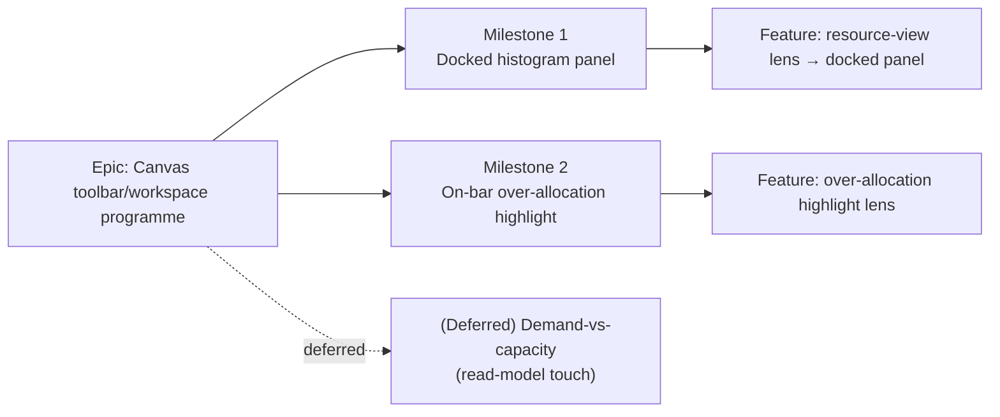

# Implementation Plan: Stage E — Resource view on the canvas

- **Feature spec:** `docs/specs/canvas-resource-view/feature-spec.md` (awaiting approval)
- **Status:** Draft (awaiting approval — do not implement)
- **Owner:** _TBD_

## Breakdown

### Epic

**Canvas toolbar/workspace programme — Stage E (Resource view).** Wire the ADR-0031
`resource-view` lens placeholder into a real, in-context canvas resource surface, over
already-shipped M7 resource data. Frontend-only; recalc parity gate byte-identical. Maps
to the toolbar roadmap (`docs/TOOLBAR_ROADMAP.md`) and the staged programme A→B→C1→D→**E**.

**Cross-cutting constraints (every task):**

- Behind new dark flag `VITE_CANVAS_RESOURCE_VIEW` (`flagDefaultOff`), **gated on
  `RESOURCE_CURVES_ENABLED`**. Flag-off ⇒ `resource-view` stays the "Coming soon"
  placeholder and the canvas is byte-for-byte today's (parity gate).
- **No new API / schema / `@repo/types` / CPM-engine change.**
  `git diff --stat apps/api packages/types` must be empty when the feature is inert.
- Reuse: `ResourceHistogram` + `useResourceHistogram` (data), `PanelResizer` +
  `useActivityPanelPrefs` (dock, ADR-0030), the toolbar registry + `TsldToolbarContext`
  (ADR-0031), the Stage-A/B `TsldScene` lens seam (`render/lenses.ts`). Reuse before
  inventing; no one-off styling. Mobile-first, theme-aware, WCAG 2.2 AA.
- Respect the ADR-0026 draw budget for anything that paints (M2).

---

### Milestone 1: Docked histogram panel (shippable slice)

**Outcome:** a Planner (and any role, view-only) reveals the shipped resource histogram as
a resizable panel docked below the TSLD canvas from the `resource-view` toolbar lens, and
dismisses it — without opening a modal. Frontend-only.

---

#### Feature: `resource-view` lens → docked resource panel

> **Description:** turn the `resource-view` placeholder into a real Look-row lens that
> toggles a workspace-owned dock hosting the existing `ResourceHistogram`.
> **Complexity:** M
> **Dependencies:** shipped `ResourceHistogram`, `PanelResizer`, toolbar registry.
> **Risks:** panel/canvas height contention → reuse the activities-panel clamp
> (`CANVAS_MIN_HEIGHT`); landmark-uniqueness (two panels) → distinct `aria-label`.
> **Testing requirements:** unit (flag gate, toolbar states, dock open/close/resize,
> focus move), component (a11y region), e2e (flag-on reveal + read journey), a11y audit.

##### Task 1 — Flag + config plumbing (≈ one PR)

- **Description:** add `VITE_CANVAS_RESOURCE_VIEW` (dark, gated on `RESOURCE_CURVES_ENABLED`).
- **Complexity:** S
- **Dependencies:** none
- **Risks:** flag not gated on data source → could show an empty lens with no data;
  mitigation: `&& RESOURCE_CURVES_ENABLED` in the derived constant.
- **Testing:** unit for the gate truth table (flag off / on × curves off / on); assert
  `resource-view` stays a placeholder when the derived flag is false.
- **Development steps:**
  1. Add `CANVAS_RESOURCE_VIEW_ENABLED = flagDefaultOff(import.meta.env.VITE_CANVAS_RESOURCE_VIEW) && RESOURCE_CURVES_ENABLED` in `config/env.ts` with a doc comment mirroring the Stage A–D flag comments.
  2. Declare `VITE_CANVAS_RESOURCE_VIEW` in `vite-env.d.ts`.
  3. Update docs (`docs/TOOLBAR_ROADMAP.md` annotation) + changeset.

##### Task 2 — Workspace dock state + `ResourceViewPanel` host

- **Description:** add `resourceViewOpen` state to the workspace model + a
  `ResourceViewPanel` that wraps `<ResourceHistogram>` in a labelled region; mount it via
  a `PanelResizer` with a persisted height.
- **Complexity:** M
- **Dependencies:** Task 1
- **Risks:** height contention with the activities panel (both dock at the bottom) →
  decide stacking/switching (recommend: the resource panel and activities panel are
  **mutually-exclusive bottom docks**, or a tabbed bottom panel — resolve in ux review,
  Q2); a11y landmark collision → `aria-label="Resource loading panel"`.
- **Testing:** unit (open/close, resize clamp, persistence), component (region label,
  focus moves into panel on open, mirrors `ActivityBottomPanel` expand-focus).
- **Development steps:**
  1. Add `resourceViewOpen` / `toggleResourceView` to `use-plan-workspace-model.ts`.
  2. Create `ResourceViewPanel` (+ collapsed bar) under `components/layout/workspace/`,
     rendering `<ResourceHistogram orgSlug planId />` in a distinct labelled `<section>`.
  3. Mount it in `plan-workspace-toolbar.tsx` (primary) and the ADR-0030 fallback with a
     `PanelResizer` + a persisted height (parallel/extend `useActivityPanelPrefs`).
  4. Handle the below-`md` single-pane path (Q2 resolution) — a pane in the view toggle
     or a full-width sheet.
  5. Tests + docs + changeset.

##### Task 3 — Wire `resource-view` toolbar item

- **Description:** replace the `resource-view` `placeholderItem` with a flag-branched real
  `ToolbarItem` (shared shape spread into both branches) whose `onActivate` toggles the
  dock and whose active/disabled states mirror the shipped lenses.
- **Complexity:** S
- **Dependencies:** Task 2
- **Risks:** drift between placeholder and real shapes → spread one shared shape object
  (established C1/quick-wins pattern); wrong disabled reason → reuse `LENS_NO_DIAGRAM_REASON`.
- **Testing:** unit (placeholder when flag off; real item + pressed/disabled states when
  on; `onActivate` toggles context), toolbar registry taxonomy test stays green.
- **Development steps:**
  1. Add `resourceViewOpen` / `toggleResourceView` to `TsldToolbarContext` + its builder.
  2. Branch `resource-view` in `buildTsldToolbarItems()` on `CANVAS_RESOURCE_VIEW_ENABLED`.
  3. Tests + update the roadmap table row + changeset.

##### Task 4 — M1 specialist reviews + flag flip

- **Description:** run the specialist reviews and flip `VITE_CANVAS_RESOURCE_VIEW` on by
  default for M1 once green (matching the Stage A–D enablement ritual).
- **Complexity:** S
- **Dependencies:** Tasks 1–3
- **Risks:** a11y of the docked panel (focus, landmark, the chart's `aria-hidden` +
  table equivalent must survive the dock) → accessibility-reviewer gate before flip.
- **Testing:** flag-on Playwright journey (reveal → read → resize → dismiss); a11y checks
  in the journey; confirm `git diff --stat apps/api packages/types` empty.
- **Development steps:**
  1. Reviews: **component**, **ux**, **accessibility**, **performance**, **test-engineer**.
  2. Fold blocking findings; add the e2e journey to CI.
  3. Flip the flag default (or leave dark pending product sign-off) + changeset + docs.

---

### Milestone 2: On-bar over-allocation highlight (shippable slice)

**Outcome:** with levelling run, a Planner highlights over-allocated activities directly on
the canvas (never colour-only), reusing shipped per-activity levelling flags and the
Stage-A/B lens seam. Frontend-only.

---

#### Feature: over-allocation highlight lens

> **Description:** a Resource-view mode that flags bars where the activity carries
> `levelingWindowExceeded || selfOverAllocated`, via the `TsldScene` lens contribution.
> **Complexity:** M
> **Dependencies:** M1; shipped ADR-0041 levelling flags; the Stage-A/B `TsldScene` seam.
> **Risks:** colour-only encoding (WCAG 1.4.1) → badge/pattern + a11y listbox mark +
> count announcement; draw-budget regression → reuse the single-pass paint (set-membership
> check, no extra repaint); confusion when the plan doesn't level → disabled-with-reason.
> **Testing:** unit (`flaggedIds` derivation, disabled-with-reason when empty/no-level),
> a11y (non-colour-only + announcement), e2e (enable → bars flagged → count), perf harness
> (ADR-0026 budget unchanged).

##### Task 1 — `flaggedIds` derivation + scene contribution

- **Description:** derive the over-allocated id set from the loaded `activities` and feed
  it to `TsldScene` as a lens contribution.
- **Complexity:** M
- **Dependencies:** M1
- **Risks:** re-deriving over-allocation client-side → **do not**; read engine-owned flags
  only. Mitigation: pure `activities.filter(a => a.levelingWindowExceeded || a.selfOverAllocated)`.
- **Testing:** unit for derivation + empty set; snapshot the scene contribution.
- **Development steps:**
  1. Add `overAllocationHighlight` state + `toggleOverAllocation` (workspace + context).
  2. Extend `render/lenses.ts` / paint to mark `flaggedIds` (reuse the Stage-A/B seam;
     no new full repaint), with a non-colour-only affordance.
  3. Mark the parallel a11y listbox entries + announce the count (reuse Stage-B pattern).
  4. Tests.

##### Task 2 — Toolbar affordance for the highlight

- **Description:** expose the highlight as a mode (split-button on `resource-view` or a
  second Look-row item — resolve in ux review) with disabled-with-reason when there is no
  over-allocation / the plan doesn't level.
- **Complexity:** S
- **Dependencies:** M2 Task 1
- **Risks:** taxonomy/overflow fit → stays in the `lens` group; shade-don't-hide when empty.
- **Testing:** unit (enabled/disabled states + reason), registry taxonomy test green.
- **Development steps:**
  1. Add the affordance + `isEnabled`/`disabledReason` (mirror Next-conflict's empty state).
  2. Tests + roadmap note + changeset.

##### Task 3 — M2 specialist reviews + flag flip

- **Description:** reviews + enable M2.
- **Complexity:** S
- **Dependencies:** M2 Tasks 1–2
- **Risks:** colour-only regression, draw-budget → gated by accessibility + performance reviews.
- **Testing:** flag-on e2e journey (levelled plan → highlight → count → recalc clears);
  perf harness; a11y checks; confirm parity gate empty.
- **Development steps:**
  1. Reviews: **component**, **ux**, **accessibility**, **performance**, **test-engineer**.
  2. Fold findings; extend the e2e journey; flip/keep-dark per product sign-off + changeset.

---

### (Deferred) Milestone 3: Demand-vs-capacity histogram — NOT in recommended scope

**Only if approved (Q4).** Adds a per-bucket **capacity** dimension to the histogram
read-model so the histogram shows demand _against_ capacity (true over-allocation in the
chart). **Requires an API change** → out of the frontend-only/parity-gate discipline.

> **Description:** extend `GET …/schedule/resource-histogram` (or a sibling read) with
> per-bucket capacity computed on each resource's calendar (ADR-0037), plus a
> capacity/over-allocation overlay in the panel.
> **Complexity:** L
> **Dependencies:** M1; product decision to accept an API touch.
> **Risks:** breaks the parity-gate simplicity; capacity semantics (ADR-0041 `maxUnitsPerHour`
> on a resource calendar) need care → database-architect + backend-performance design first.
> **Testing:** API/integration (Supertest against real Postgres), conformance if engine-
> adjacent, plus the frontend overlay tests.
> **Reviews (additional):** **api-reviewer**, **security-reviewer**, **backend-performance-reviewer**.

---

## Sequencing & slices

1. **M1** (Tasks 1→2→3→4) — the core value: the histogram in-context. Independently
   shippable; `main` stays releasable at every task (flag dark until Task 4).
2. **M2** (Tasks 1→2→3) — additive over-allocation highlight over M1. Independently
   shippable behind the same flag; safe to defer if levelling adoption is low.
3. **M3** — deferred; only if the demand-vs-capacity overlay is explicitly approved (Q4),
   as a separate API-touching slice with the extra backend reviews.

Every slice: flag-off restores the placeholder + byte-for-byte canvas/a11y tree.

## Definition of Done (per task)

Each task's PR satisfies the Feature Completion Criteria in
[`docs/PROCESS.md`](../../PROCESS.md) (code, tests ≥80% changed lines, docs, security,
performance, accessibility, Docker build, CI green, changeset, version impact). Every PR
asserts the parity gate: `git diff --stat apps/api packages/types` empty (M1/M2).

## Risks & assumptions (rollup)

| Risk / assumption                                                                                                       | Likelihood       | Impact      | Mitigation                                                                                          |
| ----------------------------------------------------------------------------------------------------------------------- | ---------------- | ----------- | --------------------------------------------------------------------------------------------------- |
| Reused histogram keeps its **own** time axis (not canvas-aligned)                                                       | high (by design) | low         | Honest reuse boundary; a canvas-axis-aligned strip is a separate future slice (spec §4 alt A).      |
| Two bottom docks (activities + resource) contend for height                                                             | med              | med         | Mutually-exclusive/tabbed bottom dock; reuse `CANVAS_MIN_HEIGHT` clamp — resolve in ux review (Q2). |
| M2 colour-only over-allocation encoding                                                                                 | med              | high (a11y) | Badge/pattern + a11y listbox mark + count announcement; accessibility-reviewer gate.                |
| Draw-budget regression from M2 highlight                                                                                | low              | med         | Reuse single-pass paint (set membership); performance-reviewer + ADR-0026 harness.                  |
| Demand-vs-capacity wanted → API change                                                                                  | med              | med         | Deferred M3 with explicit api/security/backend-perf reviews (Q4).                                   |
| Resource surface off ⇒ no data                                                                                          | low              | low         | Flag gated on `RESOURCE_CURVES_ENABLED`; placeholder stays.                                         |
| Assumption: `levelingWindowExceeded`/`selfOverAllocated` on `ActivitySummary` are already loaded in the workspace model | high             | low         | Confirmed shipped (ADR-0041, `packages/types`); verify the model already fetches them.              |
