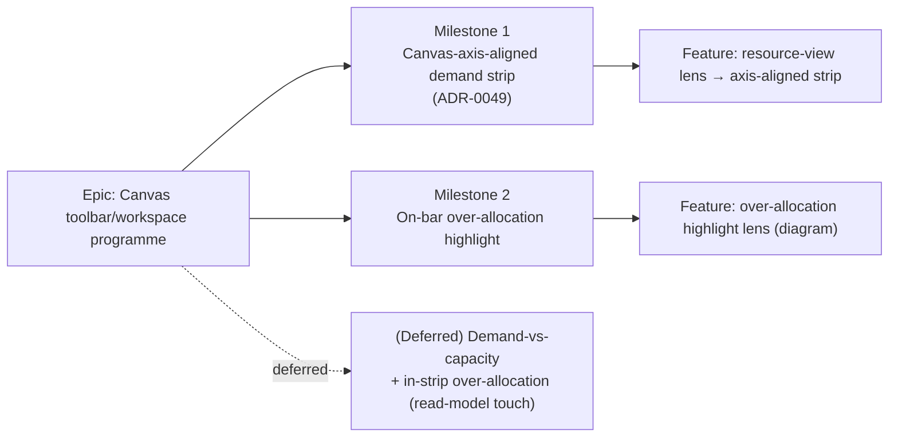

# Implementation Plan: Stage E — Resource view on the canvas

- **Feature spec:** `docs/specs/canvas-resource-view/feature-spec.md` (awaiting approval)
- **Status:** Draft (awaiting approval — do not implement)
- **Owner:** _TBD_

## Breakdown

### Epic

**Canvas toolbar/workspace programme — Stage E (Resource view).** Wire the ADR-0031
`resource-view` lens placeholder into a real, in-context canvas resource surface, over
already-shipped M7 resource data. Frontend-only; recalc parity gate byte-identical. Maps
to the toolbar roadmap (`docs/TOOLBAR_ROADMAP.md`) and the staged programme A→B→C1→D→**E**.

**Cross-cutting constraints (every task):**

- Behind new dark flag `VITE_CANVAS_RESOURCE_VIEW` (`flagDefaultOff`), **gated on
  `RESOURCE_CURVES_ENABLED`**. Flag-off ⇒ `resource-view` stays the "Coming soon"
  placeholder and the canvas is byte-for-byte today's (parity gate).
- **No new API / schema / `@repo/types` / CPM-engine change.**
  `git diff --stat apps/api packages/types` must be empty when the feature is inert.
- **Render approach fixed by ADR-0049 (design pass, feature-spec §4.6):** M1 is a
  **canvas-axis-aligned demand strip** — a Canvas 2D **sibling layer** painted by the existing
  `TsldCanvas` rAF loop from the same `viewRef` (the third ADR-0026 layer), **not** the modal
  `ResourceHistogram` docked. Strip _chrome_ (resource picker, bucket `Select`, the reused
  accessible `<table>`) is DOM in a `ResourceStripPanel`; strip _bars_ are canvas.
- Reuse: `useResourceHistogram` (demand data), the shipped `ResourceHistogram`'s **`<table>` +
  bucket `Select`** (a11y equivalent + control), `useResources` (picker names), the
  `TsldCanvas` viewport/loop/`measure()`/`screenXOfDay` machinery + theme re-resolve
  (ADR-0026), the toolbar registry + `TsldToolbarContext` (ADR-0031). For M2, the Stage-A/B
  `TsldScene` lens seam (`render/lenses.ts`). Reuse before inventing; no one-off styling.
  Mobile-first, theme-aware, WCAG 2.2 AA.
- **Respect the ADR-0026 draw budget for everything that paints** — M1's strip layer (cull to
  visible buckets; repaint only on `dirtyRef` OR `stripDirtyRef`; no per-frame allocation) **and**
  M2's on-diagram highlight. Strip-only data changes must **not** repaint the main scene.

---

### Milestone 1: Canvas-axis-aligned demand strip (shippable slice)

**Outcome:** a Planner (and any role, view-only) reveals — from the `resource-view` toolbar
lens — a **demand strip pinned to the TSLD time axis**: per-bucket bars for a chosen resource
that sit under the diagram's day/week/month columns and **pan and zoom with the canvas**, plus
a bucket-size control, a resource picker, and the reused accessible data table. Dismissing the
lens reclaims the height. Frontend-only; render layer per **ADR-0049**.

The slice is built pure-first (a unit-tested geometry module) → canvas layer → DOM host →
toolbar wiring → reviews/flip, so `main` stays releasable (flag dark) at every task.

---

#### Feature: `resource-view` lens → canvas-axis-aligned demand strip

> **Description:** turn the `resource-view` placeholder into a real Look-row lens that toggles a
> canvas-axis-aligned resource strip — a Canvas 2D sibling layer (bars) painted by the
> `TsldCanvas` loop from the shared `viewRef`, hosted by a DOM `ResourceStripPanel` (picker +
> bucket `Select` + reused a11y `<table>`).
> **Complexity:** L
> **Dependencies:** ADR-0049; shipped `useResourceHistogram` + `ResourceHistogram` table/Select
>
> - `useResources`; the `TsldCanvas` viewport/loop/`measure()`/`screenXOfDay` machinery
>   (ADR-0026); toolbar registry (ADR-0031).
>   **Risks:** viewport coupling regressing the scene's byte-for-byte parity when inert → all
>   strip work is behind the flag and the strip-absent `measure()` reserves no height; strip
>   draw-budget → cull + dirty-flag gating (ADR-0026 harness); a11y of a canvas band → reuse the
>   shipped `<table>`, `aria-hidden` canvas, distinct landmark; height contention → the strip
>   lives **inside** the canvas region, not as a second bottom dock (Q3).
>   **Testing requirements:** unit (flag gate, pure bucket→rect projection + whole-series max +
>   cull, toolbar item states, dirty-flag gating), component (strip section a11y region + reused
>   table + picker/Select), e2e (flag-on reveal + pan/zoom-stays-aligned + read + dismiss), perf
>   harness (ADR-0026 budget unchanged), a11y audit.

##### Task 1 — Flag + config plumbing (≈ one PR)

- **Description:** add `VITE_CANVAS_RESOURCE_VIEW` (dark, gated on `RESOURCE_CURVES_ENABLED`).
- **Complexity:** S
- **Dependencies:** none
- **Risks:** flag not gated on data source → could show an empty lens with no data;
  mitigation: `&& RESOURCE_CURVES_ENABLED` in the derived constant.
- **Testing:** unit for the gate truth table (flag off / on × curves off / on); assert
  `resource-view` stays a placeholder when the derived flag is false.
- **Development steps:**
  1. Add `CANVAS_RESOURCE_VIEW_ENABLED = flagDefaultOff(import.meta.env.VITE_CANVAS_RESOURCE_VIEW) && RESOURCE_CURVES_ENABLED` in `config/env.ts` with a doc comment mirroring the Stage A–D flag comments.
  2. Declare `VITE_CANVAS_RESOURCE_VIEW` in `vite-env.d.ts`.
  3. Update docs (`docs/TOOLBAR_ROADMAP.md` annotation) + changeset.

##### Task 2 — Pure strip geometry module (`render/resource-strip.ts`)

- **Description:** a pure, renderer-agnostic module (sibling of `render-model.ts` / `lenses.ts`)
  that projects the demand read-model onto the shared time axis: bucket `[start, end)` → day
  offsets → screen x via the **same** `screenXOfDay`, the whole-series vertical max, and a
  viewport cull. No canvas/DOM/React; exhaustively unit-tested (ADR-0026 keeps geometry pure).
- **Complexity:** M
- **Dependencies:** Task 1
- **Risks:** re-deriving the day mapping instead of reusing `screenXOfDay`/`daysBetween` →
  drift from the scene/ruler. Mitigation: import and reuse them verbatim; a test asserts a
  bucket's left edge equals the scene's `screenXOfDay(dayOffset(start))` for the same viewport.
- **Testing:** unit — bucket→rect at several viewports (Day/Week/Month bucket widths = N·pxPerDay),
  whole-series max (viewport-independent), cull drops off-surface buckets, empty series ⇒ no bars.
- **Development steps:**
  1. `bucketRects(series, buckets, dataDate, view, size, bandGeom)` → culled `{ x, w, h, value }[]`.
  2. `seriesMax(series)` (over all buckets) for the viewport-independent y-scale + the max tick.
  3. Types for the `stripRef` snapshot the DOM host publishes (series + pre-projected day offsets
     - resolved palette).
  4. Tests.

##### Task 3 — Strip render layer in `TsldCanvas` (ADR-0049 core)

- **Description:** add the third canvas layer — an `aria-hidden` sibling `<canvas>` band at the
  container bottom, painted by the existing rAF loop from `viewRef` via the Task-2 geometry, with
  a `stripRef` (data) + `stripDirtyRef` (data-dirty) pair and a strip-height term in `measure()`.
- **Complexity:** L
- **Dependencies:** Task 2
- **Risks:** breaking scene parity when inert → the strip band reserves height **only** when
  active, else `measure()` is unchanged (byte-for-byte); a strip-only change repainting the
  scene → gate the scene on `dirtyRef` only, the strip on `dirtyRef || stripDirtyRef`; theme
  staleness → re-resolve the strip palette on the shared `useThemeVersion` bump like the painter.
- **Testing:** unit/component — strip paints on a viewport move (shared `dirtyRef`) and on a
  data change (`stripDirtyRef`) but a data-only change does **not** set `dirtyRef`; strip-absent
  `measure()` height equals today's; DPR/backing-store sizing mirrors the scene canvas.
- **Development steps:**
  1. Add the sibling `<canvas>` (aria-hidden, pointer-events-none) + `paintResourceStrip(ctx, stripRef, view, band, palette, dpr)` reading Task-2 geometry.
  2. Add `stripRef` / `stripDirtyRef`; reserve the band height in `measure()` and in the frame's `size` split (mirroring `RULER_HEIGHT`); resolve/re-resolve the strip palette on `themeVersion`.
  3. Wire strip paint into the loop: paint when `dirtyRef || stripDirtyRef`; clear `stripDirtyRef` after.
  4. Expose a prop/imperative seam so `ResourceStripPanel` publishes the `stripRef` snapshot (+ active/height). Absent ⇒ no band, no paint (parity).
  5. Tests.

##### Task 4 — `ResourceStripPanel` DOM host (picker + bucket Select + a11y table + states)

- **Description:** the DOM chrome around the canvas band — a labelled `<section aria-label="Resource
loading">` with a resource picker (`useResources`), the reused bucket-size `Select`, the reused
  accessible `<table>`, and the loading/empty/error states; owns `useResourceHistogram` and
  publishes the `stripRef` snapshot into `TsldCanvas`.
- **Complexity:** M
- **Dependencies:** Task 3
- **Risks:** landmark collision with "Activities panel" → distinct `aria-label`; table height on a
  thin band → default-shown or one disclosure away (accessibility-reviewer decides); losing the
  reused table's `aria-hidden`-chart/real-`<table>` split → render the shipped table markup, not a
  re-implementation.
- **Testing:** component — section label + reused table present; picker switches the series (sets
  `stripDirtyRef`, not `dirtyRef`); bucket `Select` reuses `HISTOGRAM_GRANULARITIES`; empty/loading/
  error copy matches the modal; focus moves into the panel on reveal (mirrors `ActivityBottomPanel`).
- **Development steps:**
  1. Build `ResourceStripPanel` under `components/layout/workspace/` (or `features/resources/`),
     extracting the reused `<table>` + bucket `Select` from `ResourceHistogram` into a shared piece
     if cleaner (no behaviour change), else render `ResourceHistogram`'s table subset.
  2. Resource picker (single-select v1) from `useResources`; default to the first/most-loaded series.
  3. Publish the `stripRef` snapshot to the canvas; handle the below-`md` Diagram-pane case (the strip
     rides the diagram pane — no third pane).
  4. States (loading/empty/error) reuse the modal's copy. Tests + docs + changeset.

##### Task 5 — Wire `resource-view` toolbar item + workspace state

- **Description:** replace the `resource-view` `placeholderItem` with a flag-branched real
  `ToolbarItem` (shared shape spread into both branches) whose `onActivate` toggles the strip and
  whose active/disabled states mirror the shipped lenses; add the `resourceViewOpen` /
  `toggleResourceView` workspace + context state.
- **Complexity:** S
- **Dependencies:** Task 4
- **Risks:** drift between placeholder and real shapes → spread one shared shape object (C1/quick-wins
  pattern); wrong disabled reason → reuse `LENS_NO_DIAGRAM_REASON` (disabled with reason on an
  empty/uncomputed canvas).
- **Testing:** unit (placeholder when flag off; real item + pressed/disabled states when on;
  `onActivate` toggles context), toolbar registry taxonomy test stays green.
- **Development steps:**
  1. Add `resourceViewOpen` / `toggleResourceView` to `use-plan-workspace-model.ts` + `TsldToolbarContext` + its builder.
  2. Branch `resource-view` in `buildTsldToolbarItems()` on `CANVAS_RESOURCE_VIEW_ENABLED`; mount `ResourceStripPanel` in the canvas region (primary toolbar workspace + the ADR-0030 fallback).
  3. Tests + update the roadmap table row + changeset.

##### Task 6 — M1 specialist reviews + flag flip

- **Description:** run the specialist reviews and flip `VITE_CANVAS_RESOURCE_VIEW` on by default
  for M1 once green (matching the Stage A–D enablement ritual).
- **Complexity:** S
- **Dependencies:** Tasks 1–5
- **Risks:** a11y of the strip (canvas `aria-hidden`, the reused table survives, distinct landmark,
  theme-aware) → accessibility-reviewer gate; a scene draw-budget/parity regression from the new
  layer → performance-reviewer + ADR-0026 harness + the strip-absent parity assertion, before flip.
- **Testing:** flag-on Playwright journey (reveal → **pan/zoom keeps bars aligned under the columns**
  → switch bucket size / resource → read the table → dismiss); a11y checks in the journey; perf
  harness confirms the ADR-0026 budget; confirm `git diff --stat apps/api packages/types` empty.
- **Development steps:**
  1. Reviews: **component**, **ux**, **accessibility**, **performance**, **test-engineer**.
  2. Fold blocking findings; add the e2e journey (including the alignment assertion) to CI.
  3. Flip the flag default (or leave dark pending product sign-off) + changeset + docs.

---

### Milestone 2: On-bar over-allocation highlight (shippable slice)

**Outcome:** with levelling run, a Planner highlights over-allocated activities directly on
the canvas (never colour-only), reusing shipped per-activity levelling flags and the
Stage-A/B lens seam. Frontend-only.

---

#### Feature: over-allocation highlight lens

> **Description:** a Resource-view mode that flags bars where the activity carries
> `levelingWindowExceeded || selfOverAllocated`, via the `TsldScene` lens contribution.
> **Complexity:** M
> **Dependencies:** M1; shipped ADR-0041 levelling flags; the Stage-A/B `TsldScene` seam.
> **Risks:** colour-only encoding (WCAG 1.4.1) → badge/pattern + a11y listbox mark +
> count announcement; draw-budget regression → reuse the single-pass paint (set-membership
> check, no extra repaint); confusion when the plan doesn't level → disabled-with-reason.
> **Testing:** unit (`flaggedIds` derivation, disabled-with-reason when empty/no-level),
> a11y (non-colour-only + announcement), e2e (enable → bars flagged → count), perf harness
> (ADR-0026 budget unchanged).

##### Task 1 — `flaggedIds` derivation + scene contribution

- **Description:** derive the over-allocated id set from the loaded `activities` and feed
  it to `TsldScene` as a lens contribution.
- **Complexity:** M
- **Dependencies:** M1
- **Risks:** re-deriving over-allocation client-side → **do not**; read engine-owned flags
  only. Mitigation: pure `activities.filter(a => a.levelingWindowExceeded || a.selfOverAllocated)`.
- **Testing:** unit for derivation + empty set; snapshot the scene contribution.
- **Development steps:**
  1. Add `overAllocationHighlight` state + `toggleOverAllocation` (workspace + context).
  2. Extend `render/lenses.ts` / paint to mark `flaggedIds` (reuse the Stage-A/B seam;
     no new full repaint), with a non-colour-only affordance.
  3. Mark the parallel a11y listbox entries + announce the count (reuse Stage-B pattern).
  4. Tests.

##### Task 2 — Toolbar affordance for the highlight

- **Description:** expose the highlight as a mode (split-button on `resource-view` or a
  second Look-row item — resolve in ux review) with disabled-with-reason when there is no
  over-allocation / the plan doesn't level.
- **Complexity:** S
- **Dependencies:** M2 Task 1
- **Risks:** taxonomy/overflow fit → stays in the `lens` group; shade-don't-hide when empty.
- **Testing:** unit (enabled/disabled states + reason), registry taxonomy test green.
- **Development steps:**
  1. Add the affordance + `isEnabled`/`disabledReason` (mirror Next-conflict's empty state).
  2. Tests + roadmap note + changeset.

##### Task 3 — M2 specialist reviews + flag flip

- **Description:** reviews + enable M2.
- **Complexity:** S
- **Dependencies:** M2 Tasks 1–2
- **Risks:** colour-only regression, draw-budget → gated by accessibility + performance reviews.
- **Testing:** flag-on e2e journey (levelled plan → highlight → count → recalc clears);
  perf harness; a11y checks; confirm parity gate empty.
- **Development steps:**
  1. Reviews: **component**, **ux**, **accessibility**, **performance**, **test-engineer**.
  2. Fold findings; extend the e2e journey; flip/keep-dark per product sign-off + changeset.

---

### (Deferred) Milestone 3: Demand-vs-capacity histogram — NOT in recommended scope

**Only if approved (Q4).** Adds a per-bucket **capacity** dimension to the histogram
read-model so the strip shows demand _against_ capacity (true over-allocation on the strip
itself — a capacity reference line + per-bucket over-allocation flag). **Requires an API
change** → out of the frontend-only/parity-gate discipline. This is the natural home for the
capacity reference line the M1 vertical scale (Q6) deliberately defers, and for an over-alloc
cue on the strip buckets (M2 only flags the diagram _activities_, not the strip _buckets_,
because per-bucket over-allocation is exactly what capacity unlocks).

> **Description:** extend `GET …/schedule/resource-histogram` (or a sibling read) with
> per-bucket capacity computed on each resource's calendar (ADR-0037), plus a capacity
> reference line + per-bucket over-allocation cue on the M1 strip layer (non-colour-only).
> **Complexity:** L
> **Dependencies:** M1; product decision to accept an API touch.
> **Risks:** breaks the parity-gate simplicity; capacity semantics (ADR-0041 `maxUnitsPerHour`
> on a resource calendar) need care → database-architect + backend-performance design first.
> **Testing:** API/integration (Supertest against real Postgres), conformance if engine-
> adjacent, plus the frontend overlay tests.
> **Reviews (additional):** **api-reviewer**, **security-reviewer**, **backend-performance-reviewer**.

---

## Sequencing & slices

1. **M1** (Tasks 1→2→3→4→5→6) — the core value: the axis-aligned demand strip in-context.
   Built pure-first (Task 2) so the risky canvas-layer work (Task 3) sits on a unit-tested
   geometry base. Independently shippable; `main` stays releasable at every task (flag dark
   until Task 6).
2. **M2** (Tasks 1→2→3) — additive over-allocation highlight on the diagram activities over
   M1. Independently shippable behind the same flag; safe to defer if levelling adoption is low.
3. **M3** — deferred; only if the demand-vs-capacity overlay is explicitly approved (Q4),
   as a separate API-touching slice with the extra backend reviews.

Every slice: flag-off restores the placeholder + byte-for-byte canvas/a11y tree.

## Definition of Done (per task)

Each task's PR satisfies the Feature Completion Criteria in
[`docs/PROCESS.md`](../../PROCESS.md) (code, tests ≥80% changed lines, docs, security,
performance, accessibility, Docker build, CI green, changeset, version impact). Every PR
asserts the parity gate: `git diff --stat apps/api packages/types` empty (M1/M2).

## Risks & assumptions (rollup)

| Risk / assumption                                                                                                       | Likelihood      | Impact      | Mitigation                                                                                                            |
| ----------------------------------------------------------------------------------------------------------------------- | --------------- | ----------- | --------------------------------------------------------------------------------------------------------------------- |
| New canvas layer regresses the scene's byte-for-byte parity when inert                                                  | med             | high        | Strip work behind the flag; strip-absent `measure()` reserves no height; parity assertion + perf-reviewer (Task 3/6). |
| Strip / diagram desync during pan-zoom (the core product ask)                                                           | low (by design) | high        | Same rAF loop + same `viewRef` + same `screenXOfDay` (ADR-0049); e2e asserts bars stay under the columns.             |
| A strip-only data change repaints the whole scene (draw-budget)                                                         | med             | med         | Two dirty flags: scene on `dirtyRef`, strip on `dirtyRef \|\| stripDirtyRef`; unit test the gating.                   |
| Strip vertical scale rescales while panning (disorienting)                                                              | med             | low         | Whole-series (viewport-independent) max, not a visible-buckets max (Q6); unit-tested.                                 |
| A11y of a canvas band (invisible to AT)                                                                                 | med             | high (a11y) | `aria-hidden` canvas + the reused real `<table>` + distinct landmark + theme re-resolve; accessibility-reviewer gate. |
| M2 colour-only over-allocation encoding (diagram)                                                                       | med             | high (a11y) | Badge/pattern + a11y listbox mark + count announcement; accessibility-reviewer gate.                                  |
| Draw-budget regression from M2 highlight                                                                                | low             | med         | Reuse single-pass paint (set membership); performance-reviewer + ADR-0026 harness.                                    |
| Demand-vs-capacity / in-strip over-allocation wanted → API change                                                       | med             | med         | Deferred M3 with explicit api/security/backend-perf reviews (Q4).                                                     |
| Resource surface off ⇒ no data                                                                                          | low             | low         | Flag gated on `RESOURCE_CURVES_ENABLED`; placeholder stays.                                                           |
| Assumption: `levelingWindowExceeded`/`selfOverAllocated` on `ActivitySummary` are already loaded in the workspace model | high            | low         | Confirmed shipped (ADR-0041, `packages/types`); verify the model already fetches them.                                |
