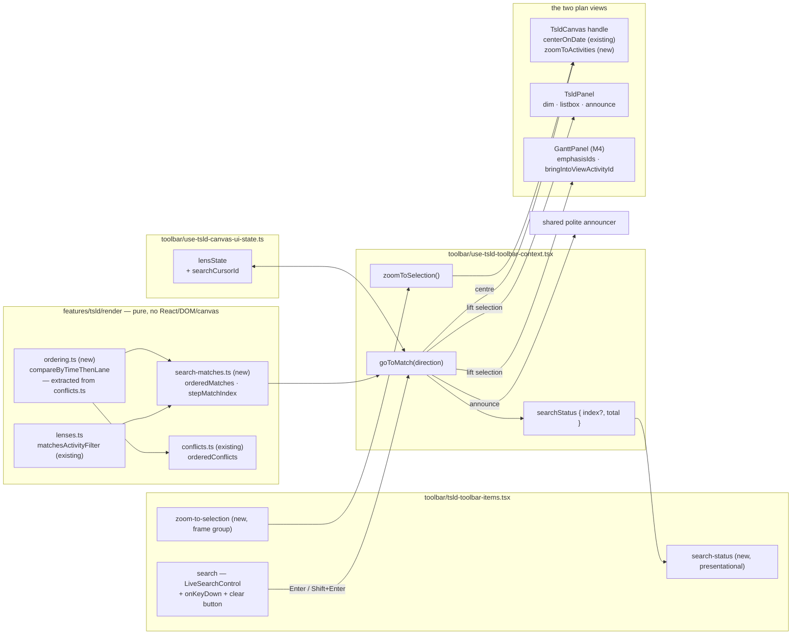
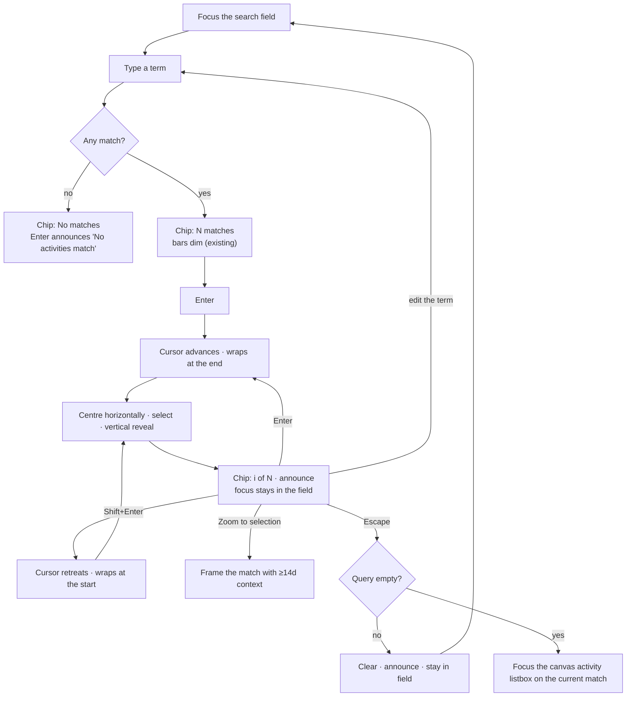

# Feature Spec: Make search take you there

- **Status:** Draft — **awaiting approval before implementation**
- **Author(s):** feature-analyst (Product Owner / Solution Architect / Technical Lead hats)
- **Date:** 2026-08-07
- **Tracking issue / epic:** _(to be raised)_
- **Roadmap link:** TSLD canvas — find & focus (ADR-0031 `find` group)
- **Related ADR(s):** proposes **ADR-0078** (see §4.9). Amends/builds on ADR-0026 (canvas handle
  - parallel DOM listbox), ADR-0031 (toolbar registry & taxonomy), ADR-0056 (zoom presets are
    commands), ADR-0059 (view seam / shade what only one view can do), ADR-0064 (tool-mode arm/disarm
    contract), plus the `canvas-lenses` and `canvas-nav` specs.

---

## 0. Evidence for the decision-bearing claims

Per `docs/PROCESS.md` "Decision-bearing claims carry their evidence" (ADR-0076 §19.9). The brief
that opened this work is **not** treated as evidence; every claim below was re-established by
reading the code. Two of the brief's claims turned out to need correction — see C4 and C6.

| #       | Claim this spec relies on                                                                                                                                                                                                                | How it was established                                                                                                                                                                                                                                                                                                                                                                                                                                                                                                                                                                                               |
| ------- | ---------------------------------------------------------------------------------------------------------------------------------------------------------------------------------------------------------------------------------------- | -------------------------------------------------------------------------------------------------------------------------------------------------------------------------------------------------------------------------------------------------------------------------------------------------------------------------------------------------------------------------------------------------------------------------------------------------------------------------------------------------------------------------------------------------------------------------------------------------------------------- |
| C1      | The toolbar's live search dims non-matching bars and **does nothing on Enter**.                                                                                                                                                          | `apps/web/src/features/tsld/toolbar/tsld-toolbar-items.tsx:673-710` — `LiveSearchControl` renders an `<Input type="search">` with `onChange` only; **no `onKeyDown`**. The toolbar's roving-tabindex handles `ArrowLeft/Right/Home/End` and deliberately exempts form fields (`apps/web/src/components/ui/toolbar/Toolbar.test.tsx:184-225`); `Enter` is not in its key set. Nothing else is bound.                                                                                                                                                                                                                  |
| C2      | The match set is already derived, and the count is already announced.                                                                                                                                                                    | `apps/web/src/features/tsld/components/TsldPanel.tsx:713-723` (`filterActive`, `filterDimmedIds`) and `:818-835` (the 400 ms-debounced `"{matched} of {total} activities match."` announcement, cleared on the active→inactive transition).                                                                                                                                                                                                                                                                                                                                                                          |
| C3      | The centring mechanism exists and is already used exactly this way.                                                                                                                                                                      | `TsldCanvasHandle.centerOnDate` at `apps/web/src/features/tsld/components/TsldCanvas.tsx:106` and `:907-918` (a pure horizontal pan via `panToDate` at half the measured width). Its one caller is `goToNextConflict` — `apps/web/src/features/tsld/toolbar/use-tsld-toolbar-context.tsx:302-327` — which centres, then lifts the selection, then announces `"Conflict i of n: …"`.                                                                                                                                                                                                                                  |
| C4      | **`centerOnDate` centres horizontally only.** The vertical (lane) reveal comes from a _separate_ mechanism.                                                                                                                              | `TsldCanvas.tsx:910-915` writes `originX` only (`panToDate` at `render-model.ts:1616-1624` returns `{ ...view, originX }`). The vertical half is the focus-follows-viewport effect at `TsldCanvas.tsx:927-940`, which pans the **minimum distance** to bring the selected bar on screen. The brief's phrase "centreOn … can move the viewport to an activity" is therefore true only of one axis; the design in §4 depends on both.                                                                                                                                                                                  |
| C5      | The Gantt has **no** search of its own.                                                                                                                                                                                                  | `apps/web/src/features/gantt/` contains no filter/query state; `GanttPanel`'s props (`GanttPanel.tsx:79-127`) carry `emphasisIds` and `bringIntoViewActivityId` but no query or dim set. `useSearch` in `use-plan-view-mode.ts` is the **router's** search params, not a text search.                                                                                                                                                                                                                                                                                                                                |
| C6      | **The search field is live-but-inert in the Gantt today.** (Not in the brief; found while checking C5.)                                                                                                                                  | The `search` item gates on `ctx.hasDiagram` only — `tsld-toolbar-items.tsx:1802-1813` — with no `canvasActive` clause, unlike `isolate` at `:1839` and `zoom-out`/`fit` at `:1567`/`:1593`. The workspace unmounts `TsldPanel` entirely in Gantt view (`apps/web/src/components/layout/workspace/plan-workspace-toolbar.tsx:459-495`), and `TsldPanel` owns both the dim and the count announcement (C2). So in the Gantt a planner can type into a lit field and get **no dim, no count, no announcement**. This is the ADR-0059 M6 / audit-F4 "lit but inert" shape, pre-existing and independent of this feature. |
| C7      | Escape is handled by a **native `window` keydown listener owned by the canvas**, not a React handler.                                                                                                                                    | `TsldCanvas.tsx:1390-1422` — `window.addEventListener('keydown', onKey)`; the ADR-0064 ordering (gesture → open link pick → disarm tool) lives there. It therefore fires **regardless of where focus is**, including inside the toolbar's search field.                                                                                                                                                                                                                                                                                                                                                              |
| C8      | The house pattern for "an Escape typed into a field belongs to the field" already exists.                                                                                                                                                | `apps/web/src/components/layout/workspace/use-plan-workspace-key-scope.ts:41-49` — the `?` shortcut returns early when `target.closest('input, textarea, select, [contenteditable="true"]')`.                                                                                                                                                                                                                                                                                                                                                                                                                        |
| C9      | A viewport "fit these activities" primitive already exists and takes a **subset**.                                                                                                                                                       | `render-model.ts:1636-1664` — `fitToContent(activities, size, dataDateIso, maxPxPerDay, paddingPx)` frames whatever array it is handed. `Fit to plan` passes all of them (`tsld-toolbar-items.tsx:1585-1601` → `ctx.fit()` → `requestFit` signal).                                                                                                                                                                                                                                                                                                                                                                   |
| C10     | The visible "n of m" read-out has a working precedent to copy rather than invent.                                                                                                                                                        | `CurrentConflictStatus` — `tsld-toolbar-items.tsx:1108-1140` and its registry entry at `:1905-1920`: a `presentational` item, `aria-hidden` (because the shared polite announcer already speaks it), self-hiding via `isVisible`.                                                                                                                                                                                                                                                                                                                                                                                    |
| C11     | The External Guest share view has no toolbar and therefore no search.                                                                                                                                                                    | `apps/web/src/features/share/components/GuestPlanView.tsx:227-235` renders `<TsldPanel … canEdit={false} fill />` with **no `canvasUi`** and no `Toolbar`.                                                                                                                                                                                                                                                                                                                                                                                                                                                           |
| C12     | The toolbar search field has **no keyboard-reachable clear** and no visible label.                                                                                                                                                       | `tsld-toolbar-items.tsx:687-707` — a bare `Input type="search"` with `aria-label`. `type="search"`'s native ✕ is Chromium-only and mouse-only; the shared `SearchField` primitive (`apps/web/src/components/ui/search-field.tsx:8-20,65-78`) exists precisely to fix that and is not used here.                                                                                                                                                                                                                                                                                                                      |
| C13     | The cycle ordering and cursor semantics have a working precedent.                                                                                                                                                                        | `apps/web/src/features/tsld/render/conflicts.ts:90-124` — `orderedConflicts` (sort by `earlyStart` → `laneIndex` → `id`) and `nextConflictIndex` (wrapping; resume from the start when the cursor's id is no longer in the set).                                                                                                                                                                                                                                                                                                                                                                                     |
| C14     | `VITE_CANVAS_LENSES` — the flag the live search field lives under — is **default-on**.                                                                                                                                                   | `apps/web/src/config/env.ts:522` — `flagDefaultOn(import.meta.env.VITE_CANVAS_LENSES)`. So this feature lands on a surface real planners are using today (`CLAUDE.md` §17: the deployed host auto-pulls releases).                                                                                                                                                                                                                                                                                                                                                                                                   |
| **C15** | **Not established — must be proved by a test before the design leans on it.** Whether `event.stopPropagation()` from a React handler on the portalled toolbar field reliably prevents the canvas's `window` Escape listener from firing. | React attaches at the root container and the toolbar is **portalled into the chrome band** (ADR-0055 S2), so the native bubble path is not obviously through the React root. This is exactly the class of assumption ADR-0064 was opened to stop trusting. §4.5 therefore **does not use `stopPropagation`**; it uses the C8 guard, which needs no assumption about propagation. A regression test pinning "Escape in the search field does not disarm an armed tool" is a required deliverable (M1-T4).                                                                                                             |

---

## 1. Business understanding

### Problem

A planner types "pour" into the TSLD toolbar's search field. Every bar that does not match dims to
a wash; the matching bars stay solid. On a 40-activity plan that is enough. On the 2,000-activity
programme the product exists to hold, "dim the rest" means the planner now has to **visually hunt a
lit bar across a scene many screens wide and many lanes tall** — and the one viewport command near
the search field, `Fit to plan`, is whole-plan only, so pressing it zooms _out_, making the lit bar
smaller rather than finding it.

The gap is narrow and specific: **search tells you a thing exists and will not take you to it.**
Pressing Enter does nothing (C1). There is no cycle, no count on screen, and no way to frame one
activity. Every piece needed is already built — the match predicate (C2), the centring pan (C3),
the ordered-cycle-with-cursor pattern (C13), the visible status chip (C10), the announcement
channel (C2) — and none of them are joined up.

Two adjacent defects surfaced while checking the brief, and this epic is the natural place to close
them because it touches exactly these lines:

- **The search field is live and inert in the Gantt view** (C6). A planner who switched to the Gantt
  to show a subcontractor the programme can type into a lit field and get nothing at all — no dim,
  no count, not even the announcement. Nothing tells them why.
- **The field cannot be cleared from the keyboard** (C12) — WCAG 2.1.1 on a control this feature is
  about to make load-bearing.

Why now: `VITE_CANVAS_LENSES` is default-on (C14) and the deployed host pulls releases
automatically, so this is a surface in daily use, not a dark one.

### Users

All roles that can open a plan. **Navigating never mutates**, so nothing here is pen-gated
(ADR-0028) and nothing here is role-gated:

| Role               | What they need from this                                                                                                                          |
| ------------------ | ------------------------------------------------------------------------------------------------------------------------------------------------- |
| **Planner**        | Find the activity they are about to edit, on a programme too large to scan. The dominant case.                                                    |
| **Contributor**    | Find the activity they are reporting progress against.                                                                                            |
| **Viewer**         | Find an activity to read. Search is one of the few things a Viewer can do at all.                                                                 |
| **Org Admin**      | As Planner.                                                                                                                                       |
| **External Guest** | **Out of scope**: the guest view renders `TsldPanel` with no toolbar and no search field at all (C11). Nothing in this epic reaches that surface. |

### Primary use cases

1. Type a term, press **Enter** repeatedly to walk the matches, each one brought to the middle of
   the canvas and selected.
2. **Shift+Enter** to walk back after over-shooting.
3. Read **"3 of 12"** beside the field, so the size of what you are walking is on screen.
4. **Zoom to selection** — frame the activity you have landed on, at a scale where you can read it,
   without hand-panning back from `Fit to plan`.
5. Do all of the above with a keyboard and a screen reader, and hear where each jump landed.

### User journeys

**Happy path.** Planner opens a 2,000-activity plan → types `pour slab` → non-matching bars dim and
the chip reads `12 matches` → presses Enter → the viewport pans so the first match sits at the
horizontal centre, the bar is selected and ringed, the chip reads `1 of 12`, and the announcer says
`Match 1 of 12: "Pour slab — level 2", 14 Mar 2026` → Enter again → `2 of 12` → the planner
recognises the one they wanted, presses **Zoom to selection**, and the bar is framed with a fortnight
of context around it → they open it from the selection-actions bar.

**Alternate — nothing matches.** The chip reads `No matches`; Enter does not move the viewport and
announces `No activities match "xyz".` The canvas is never blanked (the `canvas-lenses` rule).

**Alternate — the query changes mid-cycle.** Typing resets the cursor; the next Enter starts at
match 1 of the new set.

**Alternate — a recalculation reorders the plan mid-cycle.** The cursor's activity may no longer
match; the next Enter resumes from match 1, exactly as `nextConflictIndex` does (C13).

**Alternate — the planner is in the Gantt.** See CQ-1. Under the recommended answer, the same Enter
does the same thing: the matching rows stay prominent, the rest recede, and each jump scrolls that
row into view without stealing focus.

**Alternate — a tool is armed.** The planner armed **Link**, picked a predecessor, then searched for
the successor. Cycling pans and selects; it does **not** disarm the tool and does **not** drop the
open pick. Escape typed into the search field belongs to the field (§4.5).

### Expected outcomes

- The time from "I know its name" to "I am looking at it" collapses from a visual hunt to N key
  presses, on any plan size.
- The search field stops being a filter and becomes a **find** control — which is what the ADR-0031
  `find` group is named for.
- Two live defects (C6, C12) close.

### Success criteria

- **Functional:** on the 2,000-activity seeded scale plan (`docs/TEST_PLAYBOOK.md`), a query matching
  ≥ 2 activities can be walked forwards and backwards entirely from the keyboard, each jump leaving
  the match visibly on screen and announced. Proved by the flag-on Playwright journey (M5-T2), not
  asserted.
- **No cost on the typing path:** the ordered cycle list is built **lazily on the first Enter**, not
  per keystroke (§4.6), so the keystroke path's work is unchanged from today's. Pinned by a
  call-counting test in the ADR-0054 counting-stub tradition, because a millisecond figure from a CI
  runner is noise.
- **A11y:** every jump is announced; the field keeps focus so Enter is repeatable; the clear control
  is operable by keyboard; the accessibility gate passes with no blocking finding.
- **Parity:** with the flag off, the toolbar, the canvas paint, the a11y tree and the Escape
  behaviour are byte-for-byte today's — pinned by the flag-off parity suite, which is the rollback
  contract and is kept, not weakened (the ADR-0053 M6 rule).

### Open questions

See **§6 Critical questions**. Everything else has a stated default in §2/§4 and needs no decision.

---

## 2. Functional requirements

### User stories & acceptance criteria

> **US-1** — As a planner, I want **Enter** in the search field to take me to the next match, so
> that finding work on a large programme is a key press rather than a hunt.
>
> **Acceptance criteria**
>
> - **Given** a query matching ≥ 1 activity **when** I press Enter **then** the viewport moves so
>   that match is visible and horizontally centred, the activity becomes the selection, and the
>   announcement names it and its position (`Match 1 of 12: "<name>", <date>`).
> - **Given** I press Enter again **then** the cycle advances by one, wrapping from the last match to
>   the first.
> - **Given** I press **Shift+Enter** **then** the cycle steps backwards, wrapping from the first to
>   the last.
> - **Given** focus is in the search field **when** a jump happens **then** focus **stays in the
>   field** — Enter must be repeatable without re-focusing.
> - **Given** the query matches nothing **when** I press Enter **then** the viewport does not move,
>   the selection does not change, and the announcement is `No activities match "<query>".`
> - **Given** the field is empty (no query and no Filter attributes) **when** I press Enter **then**
>   nothing happens and nothing is announced — there is no match set to cycle.
> - **Given** the match set includes the currently selected activity **when** I press Enter **then**
>   the cycle still advances from the cursor, not from the selection: the cursor is search's own
>   state (§4.3).

> **US-2** — As a planner, I want to see **how many** matches there are and **which one** I am on,
> so that I know whether to keep pressing Enter or refine the term.
>
> **Acceptance criteria**
>
> - **Given** an active query or Filter attribute **then** a read-out beside the field states the
>   match count (`12 matches`, `1 match`, `No matches`).
> - **Given** I have begun cycling **then** the read-out states the position (`3 of 12`).
> - **Given** I change the query **then** the read-out reverts to the count for the new set.
> - **Given** I clear the filter **then** the read-out disappears entirely (it is not `0 of 0`).
> - **Given** a screen-reader user focuses the field **then** the count is available from the field's
>   own description (`aria-describedby`), not only from a live region they may have missed.
> - The visible read-out is `aria-hidden` — the polite announcer is the single spoken channel, so
>   there is never a duplicate utterance (the C10 precedent).

> **US-3** — As a planner, I want a **Zoom to selection** viewport command, so that after landing on
> a match I can read it at a useful scale without hand-panning back from `Fit to plan`.
>
> **Acceptance criteria**
>
> - **Given** an activity is selected and the canvas is the active view **when** I activate _Zoom to
>   selection_ **then** the viewport frames that activity with surrounding context, and the jump is
>   announced.
> - **Given** the selected activity is a one-day task or a **milestone** (zero span) **then** the
>   command never zooms in past the `day` preset's scale, and always frames at least
>   `MIN_CONTEXT_DAYS` of calendar around it — a single bar filling the screen is not a useful view
>   (§4.4).
> - **Given** nothing is selected **then** the command is **shaded with a reason**, never hidden
>   (ADR-0031 shade-don't-hide).
> - **Given** the Gantt is the active view **then** the command is shaded with the existing
>   `CANVAS_ONLY_REASON`, like `Zoom in`/`Zoom out`/`Fit` — it is a canvas viewport transform with no
>   Gantt equivalent (the ADR-0059 M6 rule).
> - Activating it is a **command**, not a mode: a subsequent window resize preserves the resulting
>   scale and does not re-derive it (ADR-0056).

> **US-4** — As a keyboard or screen-reader user, I want the search field to be fully operable, so
> that the find capability is not sighted-mouse-only.
>
> **Acceptance criteria**
>
> - **Given** the field holds a term **then** a real `<button>` with an accessible name clears it,
>   reachable by keyboard in every browser (WCAG 2.1.1 / 4.1.2), replacing the Chromium-only native ✕
>   (C12).
> - **Given** I clear via that button **then** focus returns to the field, the dim clears, the read-out
>   disappears and the cursor resets.
> - **Given** the shortcuts sheet (`?`) is open **then** it lists Enter / Shift+Enter / the Escape
>   rule / Zoom to selection.
> - Every state change a sighted user sees — a jump, a wrap, an empty result, a clear — has a spoken
>   equivalent (WCAG 4.1.3), and **no state change produces two utterances for one event**.

> **US-5** — As a planner, I want search to **not fight the tool I have armed**, so that finding
> something mid-edit does not cost me my work in progress.
>
> **Acceptance criteria**
>
> - **Given** the Add / Link / LOE tool is armed **when** I cycle matches **then** the tool stays
>   armed, the mode band is unchanged, and an open Link pick is **not** dropped.
> - **Given** focus is in the search field **when** I press Escape **then** the armed tool is **not**
>   disarmed (§4.5, CQ-4).
> - **Given** focus is in the search field and the field holds a term **when** I press Escape **then**
>   the term is cleared and focus stays in the field.
> - **Given** focus is in the search field and the field is empty **when** I press Escape **then**
>   focus moves to the canvas's parallel activity listbox, on the current match if there is one.
> - Cycling never triggers a recalculation and never takes an ADR-0064 recalculation hold — it is a
>   view transform.

> **US-6** — As a planner in the **Gantt** view, I want search to mean the same thing it means on the
> canvas, so that switching view does not silently change what a control does. _(Scope depends on
> CQ-1.)_
>
> **Acceptance criteria (under the recommended answer)**
>
> - **Given** the Gantt is showing **when** I type a term **then** non-matching rows recede and carry
>   a text marker (never colour alone, never `visibility:hidden`, never native `disabled` — the
>   existing `emphasisIds` contract, `GanttPanel.tsx:104-116`), and the count is announced.
> - **Given** I press Enter **then** the current match's row scrolls into view **without moving
>   focus**, and a row inside a collapsed summary is expanded to first (the existing
>   `bringIntoViewActivityId` contract, `GanttPanel.tsx:117-126`).
> - **Given** I switch view mid-cycle **then** the query, the match set and the cursor survive — they
>   are workspace state, like the selection.
> - The two views read **one** match-set derivation; that identity is a **test**, not a convention
>   (the ADR-0063 `wbs-band-source` rule).

### Workflows

**Cycle (Enter / Shift+Enter).**

1. Read the current query + Filter attributes.
2. If the filter is inactive → no-op, silent.
3. Resolve the ordered match list (lazily; memoised by a signature over activities + query + attrs).
4. If empty → announce `No activities match "<query>".`, do not move.
5. Advance/retreat the cursor from its current id, wrapping; resume from index 0 if the cursor's id
   is absent from the set.
6. Store the new cursor id.
7. Reveal: canvas → `centerOnDate(match.earlyStart)`; both views → lift the selection, which drives
   the canvas's minimum-distance vertical reveal and (M4) the Gantt's row scroll.
8. Cancel any pending debounced count announcement, then announce the jump.
9. Leave focus where it is.

**Zoom to selection.** Resolve the selected activity → compute the framed span as
`max(activitySpan, MIN_CONTEXT_DAYS)` centred on the activity → `fitToContent([activity], …)` with
that span and a `pxPerDay` ceiling of `pxPerDayForPreset('day', width)` → announce.

**Clear.** Button or Escape-on-non-empty → query `''` → dim clears, read-out unmounts, cursor resets
to `null`, focus stays in the field.

### Edge cases

| Case                                                   | Expected behaviour                                                                                                                                                                                        |
| ------------------------------------------------------ | --------------------------------------------------------------------------------------------------------------------------------------------------------------------------------------------------------- |
| Empty plan / no computed schedule                      | The search item is already shaded with `LENS_NO_DIAGRAM_REASON` (`tsld-toolbar-items.tsx:1805-1806`); Enter is unreachable. Unchanged.                                                                    |
| Query matches every activity                           | Cycle walks all of them. Nothing dims (every bar matches) — the read-out still says `N matches`, which is the honest state.                                                                               |
| Exactly one match                                      | Enter selects and centres it; a second Enter re-selects the same one (`1 of 1`), mirroring `nextConflictIndex`'s single-hit behaviour (C13).                                                              |
| Match has `earlyStart === null` (never scheduled)      | It cannot be centred by date. It still **selects**, and the announcement says so (`… — not yet scheduled`). Ordering places nulls last (the `compareEarlyStart` rule, C13).                               |
| Match is a **WBS summary** while the pinned band is on | ADR-0063 lifts summaries **out** of the scene into the band. The jump must select it in the band, not look for a scene bar that is not there — the exact ADR-0063 M6 defect. Covered by an explicit test. |
| Match is inside a collapsed Gantt summary (M4)         | Expanded first, then scrolled — the existing `bringIntoViewActivityId` contract, never a silent no-op.                                                                                                    |
| Cursor's activity deleted mid-session                  | Absent from the set ⇒ next Enter resumes at match 1.                                                                                                                                                      |
| A recalculation lands mid-cycle                        | Order may change; the cursor is an **id**, so if it still matches, the cycle continues from it; the index in the announcement is recomputed.                                                              |
| Isolate / Float paths active                           | The jump still selects. Both lenses key off the selection, so their emphasis follows each jump — see **CQ-2**, which is exactly this consequence.                                                         |
| Link tool with an open pick                            | Pick preserved; tool stays armed; no recalculation hold taken.                                                                                                                                            |
| Query typed while the plan is still loading            | The item is shaded (no diagram); unchanged.                                                                                                                                                               |
| Rapid Enter presses                                    | Each is one cursor step; the viewport pan is a ref write + a dirty flag on the existing rAF loop (`TsldCanvas.tsx:910-917`), so there is no queue to overflow.                                            |
| Very long activity name in the announcement            | Announced in full; the visible chip truncates with the full text in `title`, mirroring `CurrentConflictStatus` (`tsld-toolbar-items.tsx:1136-1137`).                                                      |

### Permissions

**None new.** Navigating is a read: no permission, no organisation-scope change, no pen (ADR-0028),
no API call, no write. Every role that can open the plan gets identical behaviour. This is stated,
not assumed: the feature adds no fetch and no mutation, so there is no new authorisation surface at
all. External Guest is untouched (C11).

### Validation rules

- Query: the existing trimmed, case-insensitive substring over `` `${code} ${name}` `` —
  `matchesActivityFilter`, `apps/web/src/features/tsld/render/lenses.ts:58-72`. **Unchanged**; this
  epic adds no new matching semantics (no regex, no field prefixes, no fuzzy matching — see §4.10).
- The cycle walks the **same set the filter dims**: query ∩ Filter attributes. One predicate, two
  consumers.
- `MIN_CONTEXT_DAYS` for Zoom to selection: **14**, a constant with a docblock, not a magic number.

### Error scenarios

There is no server interaction, so there are no status codes. The failure modes are all local:

| Scenario                                                  | Detection                                                       | User-facing result                                                                                                                                                        |
| --------------------------------------------------------- | --------------------------------------------------------------- | ------------------------------------------------------------------------------------------------------------------------------------------------------------------------- |
| Canvas handle is null (Gantt showing, or not yet mounted) | `canvasControlRef.current?.` optional call — the existing idiom | The selection still lifts and the Gantt reveals it (M4); before M4 the item is shaded with `CANVAS_ONLY_REASON`. **Never a silent no-op on a lit control** (ADR-0059 M6). |
| Match has no drawn position                               | `earlyStart === null`                                           | Selected + announced as unscheduled; no pan.                                                                                                                              |
| Canvas not yet measured (`size.width <= 1`)               | Existing guard, `TsldCanvas.tsx:936-937`                        | Reveal deferred to the fit; no crash, no wrong pan.                                                                                                                       |
| Two announcements race (debounced count vs jump)          | Explicit: the jump cancels the pending count timer              | One utterance per event.                                                                                                                                                  |

---

## 3. Technical analysis

| Area           | Impact                                                          | Notes                                                                                                                                                                                                                                                                                                                                                                                                                                                                                                       |
| -------------- | --------------------------------------------------------------- | ----------------------------------------------------------------------------------------------------------------------------------------------------------------------------------------------------------------------------------------------------------------------------------------------------------------------------------------------------------------------------------------------------------------------------------------------------------------------------------------------------------- |
| Frontend       | **medium**                                                      | One new pure module (`render/search-matches.ts`) + a shared comparator extraction; new fields on `lensState`; 2 new toolbar items (`search-status`, `zoom-to-selection`) + a keydown/clear on the existing `search` item; 1 new canvas-handle method (`zoomToActivities`); a guard on the canvas's window Escape listener; (M4) the match set lifted to the workspace and fed to the Gantt.                                                                                                                 |
| Backend        | **none**                                                        | No module, service or endpoint is touched.                                                                                                                                                                                                                                                                                                                                                                                                                                                                  |
| Database       | **none**                                                        | No model, migration, index or constraint.                                                                                                                                                                                                                                                                                                                                                                                                                                                                   |
| API            | **none**                                                        | No endpoint, DTO, contract, status code or OpenAPI change. Every field read (`id`, `code`, `name`, `earlyStart`, `earlyFinish`, `laneIndex`, `type`) is already on the wire in `ActivitySummary`.                                                                                                                                                                                                                                                                                                           |
| Security       | **none**                                                        | No new fetch, no new write, no new authorisation surface, no user input reaching a server. The query string never leaves the browser.                                                                                                                                                                                                                                                                                                                                                                       |
| Performance    | **low, and deliberately structured to be zero on the hot path** | The typing path is unchanged: the dim is already O(n) per keystroke and the count is already derived. The **ordered** list (an O(n log n) sort) is built lazily on the first Enter and memoised (§4.6). Panning is a ref write + dirty flag on the existing rAF loop — no new per-frame work, no new scene field, so the painter's cost is untouched. `docs/TECH_DEBT.md` **#75** (the unmeasured/misquoted draw budget) is explicitly **out of scope** and this feature must not be used to relitigate it. |
| Infrastructure | **none**                                                        | No service, env var (beyond the `VITE_` flag), container or CI service change. One new CI step for the flag-on journey.                                                                                                                                                                                                                                                                                                                                                                                     |
| Observability  | **none**                                                        | No logs, metrics, traces or health impact. Client-only view state.                                                                                                                                                                                                                                                                                                                                                                                                                                          |
| Testing        | **medium**                                                      | Unit (pure ordering + cursor + the min-context clamp); component (keydown contract, focus retention, announcement sequencing, shade reasons, Escape ordering); flag-off parity suites; one new flag-on Playwright journey with its own CI step.                                                                                                                                                                                                                                                             |

### Dependencies

- **Prerequisite (hard):** `VITE_CANVAS_LENSES` — the live search field only exists under it
  (`tsld-toolbar-items.tsx:1802-1813`). The new flag is therefore **derived** from it (§4.8), the
  ADR-0062 precedent: a flag that can be on while its host surface is off strands the feature on a
  disabled placeholder input.
- **Soft:** `VITE_CANVAS_NAV` supplies `requestSelectActivity` and the `selectSignal` plumbing
  (`use-tsld-canvas-ui-state.ts:90-104,191-198`) that the jump's selection lift reuses. It is
  default-on (`env.ts:548`). If it were off, the selection lift needs its own path — the design
  must not assume it, so the select signal moves out from under the `CANVAS_NAV_ENABLED` guard in
  `TsldPanel.tsx:892-907` (or the new flag ANDs it in). **This is a real implementation trap and is
  called out as M1-T2's first step.**
- **Soft:** `VITE_GANTT_VIEW` for M4 (default-on, `env.ts:891`).
- **Affected features:** the `canvas-lenses` Filter menu (shares the match set), `canvas-nav` Isolate
  and Next-conflict (share the selection), Float paths (shares the selection), the WBS band
  (ADR-0063 — a summary match is in the band, not the scene), Export CSV's "matching activities
  only" (reads `exportMatch`, which must not be conflated with the search-only set — see §4.6).
- **Nothing must land first.** No API, schema or engine work is required at any point.

### The recalculation parity gate (ADR-0034)

**Structurally untouched, and this is a claim with a mechanism rather than an assurance.** The CPM
engine lives in `apps/api/src/modules/schedule/engine/` and is **not importable from `apps/web` at
all**; this epic adds no fetch, no mutation and no scheduling input. `computeSchedule`'s inputs
cannot differ because nothing in this diff can reach them. The proposed ADR records the same
sentence, and the structural seam test in M0 asserts that the new pure module imports nothing
outside `render/`.

---

## 4. Solution design

### 4.1 Architecture overview



The load-bearing shape: **the cycle is pure arithmetic over data the client already holds, and the
jump is expressed as (a) a viewport command and (b) a selection lift.** Nothing new crosses a
boundary; no component learns about another.

### 4.2 Data flow

```mermaid
sequenceDiagram
  actor P as Planner
  participant F as Search field (toolbar)
  participant C as Toolbar context
  participant M as search-matches (pure)
  participant V as Canvas handle
  participant S as Selection (workspace)
  participant A as Announcer

  P->>F: types "pour"
  F->>C: setFilterQuery("pour")
  Note over C: cursor reset to null;<br/>NO ordered list built yet (lazy)
  C-->>P: bars dim (existing) · chip "12 matches"

  P->>F: Enter
  F->>C: goToMatch('next')
  C->>M: orderedMatches(activities, query, attrs)  [memoised by signature]
  M-->>C: [hit…] ordered earlyStart → lane → id
  C->>C: stepMatchIndex(cursorId, hits, +1) → index 0
  C->>V: centerOnDate(hit.earlyStart)
  C->>S: requestSelectActivity(hit.id) + onSelectionChange(hit.id)
  Note over S,V: canvas reveal-on-select supplies the<br/>VERTICAL pan (C4); Gantt scrolls its row (M4)
  C->>A: cancel pending count · "Match 1 of 12: …"
  Note over F: focus never leaves the field
```

### 4.3 State

One new field on the existing `LensState` (`use-tsld-canvas-ui-state.ts:106-120`):

```
searchCursorId: string | null   // default null — the "not cycling" identity
```

Held beside `filterQuery`/`filterAttrs` because it is the same lens's state and must reset with it.
It is **session-local client view state** — never persisted, never server state, never in the URL —
matching `conflictCursorId` (`use-tsld-canvas-ui-state.ts:99`). It resets to `null` whenever the
query or the attribute set changes, and on plan switch (the workspace already remounts per plan,
`plan-workspace-toolbar.tsx:375`).

Deliberately **not** URL state, unlike the library screens' filters (ADR-0053 M6): a cycle position
is a transient reading posture, not a view worth deep-linking. (The _query_ arguably is — recorded
as a follow-up in §4.10, not built here.)

### 4.4 Viewport commands

**Existing, reused unchanged:** `centerOnDate(iso)` (C3) for the horizontal centre.

**New canvas-handle method:**

```
zoomToActivities: (ids: readonly string[], opts: { minContextDays: number }) => void
```

Implemented as `fitToContent(subset, size, dataDate, ceiling, padding)` (C9) — the **same** function
`Fit to plan` already uses, with a filtered array. A second "fit these" implementation was rejected
for the ADR-0065 `routeOrthogonal` reason: two would drift, and the drift would only be visible to
someone who compared `Fit to plan` against `Zoom to selection` on the same plan.

Two clamps, each with a reason:

1. **`minContextDays` (14).** `fitToContent` on a single one-day bar frames a one-day span, which at
   any sane width means `pxPerDay` pins to the ceiling and the screen shows one bar and nothing else.
   Useless, and for a **milestone** (zero span) actively confusing. So the framed span is widened to
   at least 14 days, centred on the activity.
2. **A `pxPerDay` ceiling of `pxPerDayForPreset('day', width)`.** ADR-0056 made preset scales
   width-derived; a viewport command that lands _outside_ the preset vocabulary would make the
   zoom-preset control report a preset the view is not at. Clamping to the `day` preset's scale keeps
   `presetOf` honest without a special case.

`zoomToActivities` is a **command** in the ADR-0056 sense: it sets the scale once, and a later resize
preserves it rather than re-deriving. That falls out of using the same `viewRef` write the other
commands use — but it is stated here because it is the property a reviewer should check.

Registry entry: `id: 'zoom-to-selection'`, `group: 'frame'`, `row: 'look'`, `tier: 2`, ordered
immediately after `fit` — because that is where a planner already looks for framing, and because it
is the honest answer to "Fit is whole-plan only".

### 4.5 Escape, and the ADR-0064 tool-mode contract

Today Escape is a **native `window` listener owned by the canvas** (C7), so it fires while focus is
in the toolbar's search field and, with a tool armed, disarms it. `type="search"` also clears itself
on Escape in WebKit/Blink. So one key press can clear the query **and** disarm the tool, and neither
is announced.

**The rule this epic adopts, stated once:**

> **An Escape typed into a text field belongs to that field.**

Mechanically, the canvas's `onKey` handler (`TsldCanvas.tsx:1392-1421`) gains a first-line guard
mirroring the one the `?` shortcut already uses (C8):

```
if ((e.target as HTMLElement | null)?.closest('input, textarea, select, [contenteditable="true"]')) return;
```

**Why the guard and not `stopPropagation` from the field:** the toolbar is portalled into the chrome
band (ADR-0055 S2), so whether a React `stopPropagation` reaches a `window` listener depends on the
native bubble path through the portal target — an assumption this spec explicitly refuses to make
(C15). The guard needs no such assumption. It is also the third consumer of a pattern already in the
codebase, rather than a new idea.

**Then, within the field**, Escape is a two-step, matching the ADR-0064 "a wrong endpoint should not
cost you the tool" shape:

| State           | First Escape                                                          | Second Escape                                                                     |
| --------------- | --------------------------------------------------------------------- | --------------------------------------------------------------------------------- |
| Query non-empty | Clear the query; focus stays in the field; announce `Search cleared.` | (field now empty) → move focus to the canvas listbox, on the current match if any |
| Query empty     | Move focus to the canvas listbox                                      | (nothing to do)                                                                   |

Because the native `type="search"` clear also fires on Escape, the handler calls `preventDefault()`
and does the clear itself, so exactly one thing happens and it is the announced one.

**What cycling must NOT do**, as explicit acceptance criteria (US-5): it does not change `mode`, does
not drop an open Link pick (`linkPickPredecessorId`), does not take or release an ADR-0064
recalculation hold, and does not touch the mode band's statement. A search jump while a Link pick is
open leaves two rings on the canvas — the pick ring and the selection ring — which is the honest
picture of the state and is covered by a test rather than designed away.

**Accepted consequence:** with focus in the search field, Escape can no longer disarm a tool. The way
out is one Escape to leave the field (step 2) and a second to disarm — which is the same two-step the
Link tool already uses, so it is a consistent rule rather than a new exception.

### 4.6 Where the match set is derived — and the one-derivation rule

`matchesActivityFilter` (`lenses.ts:58-72`) is already the single predicate. This epic keeps it as
the single predicate and adds ordering beside it:

```
render/ordering.ts        compareByTimeThenLane(a, b)      // extracted from conflicts.ts:78-83,105-110
render/search-matches.ts  orderedMatches(activities, query, attrs) → MatchHit[]
                          stepMatchIndex(cursorId, hits, delta) → number
```

`conflicts.ts` is refactored onto the extracted comparator in the same change, so the two orderings
**cannot** drift — the ADR-0063 rule ("one derivation, never a second opinion") applied to a
comparator. This is a pure-module refactor with existing test coverage, so it is safe to do first.

**Laziness is a design decision, not an optimisation.** `orderedMatches` is called from
`goToMatch`, memoised by a signature (`activitiesRevision | query | sorted attrs`), so **no sort runs
on the typing path**. The visible count needs no sort — it is already available as
`total − filterDimmedIds.size` (C2). This is why the spec can claim "no cost on the typing path"
without a millisecond measurement: the work does not happen, rather than happening quickly.

**Do not conflate with `exportMatch`.** `use-tsld-toolbar-context.tsx:354-392` computes a _different_
set (filter ∩ isolate chain) for the CSV export. The search cycle must walk the **filter-only** set,
because that is the set the field dims and the count reports. A test pins that the two are distinct.

**At M4** the set is lifted once to the workspace and handed to both views + the toolbar, with an
identity test (`canvasMatchSet === ganttMatchSet`) in the ADR-0062 `gating.logic === gating.general`
tradition. Before M4 the predicate is shared and the sets are complementary derivations from it,
which cannot disagree about membership.

### 4.7 User flow



### 4.8 Feature flag — the decision, with its reasoning

**Flagged: `VITE_CANVAS_SEARCH_NAV`, default-off, flipped default-on at the M5 gate.**

ADR-0061 landed _unflagged_ because it was a structural refactor of nine dialog bodies with **no
behavioural difference**, where gating would have meant two copies of each body in one file. That
reasoning does not transfer. This epic:

- adds a keybinding to a control real planners are typing into today (C14),
- changes the Escape contract of a default-on canvas (§4.5),
- adds two toolbar items to a registry with a compiler-enforced taxonomy,
- adds a canvas-handle method.

Each is a behavioural change on a live surface, and each has a clean off-state. So the house pattern
applies: flag + gates + a default-on flip as its own decision, with flag-off parity suites as the
rollback contract.

**The flag is derived**, not independent (the ADR-0062 precedent):

```
export const CANVAS_SEARCH_NAV_ENABLED = CANVAS_LENSES_ENABLED && flagDefaultOff(import.meta.env.VITE_CANVAS_SEARCH_NAV);
```

A build with search-nav on and lenses off would bind Enter to a **disabled placeholder input**
(`SearchFieldControl`, `tsld-toolbar-items.tsx:642-664`) — a strandable pair, which is exactly the
M6 finding ADR-0062 recorded.

**Flag-off must be byte-for-byte**: no `onKeyDown` on the search input, no `search-status` item, no
`zoom-to-selection` item, no clear button, no `searchCursorId` in state, the canvas Escape listener
unguarded, and the Gantt untouched. Pinned by a dedicated parity suite that `vi.mock`s `@/config/env`
(the ADR-0053 M6 pattern), **kept and not weakened** at the flip.

### 4.9 ADR

**Recommended: write ADR-0078 — "Search that navigates: the find cursor, the Escape rule, and
zoom-to-selection."** `0078` is free (`docs/adr/` runs to `0077`). It is architecturally significant
on four counts, each an amendment to an accepted decision:

- **ADR-0026** — a new method on the canvas control handle, and a rule about how search focus and the
  parallel DOM listbox (D7) interact.
- **ADR-0056** — a viewport command that is not a preset, and how it stays inside the preset
  vocabulary (the `day`-preset ceiling).
- **ADR-0059** — whether a lens is view-agnostic or canvas-only, and the correction of a live
  lit-but-inert control (C6).
- **ADR-0064** — a change to the Escape precedence the tool-mode contract defines.

Outline: Problem (search finds and will not fetch; C6/C12 alongside) · Options (canvas-only cycle vs
view-agnostic; centre-only vs centre-and-select; `stopPropagation` vs the target guard; frame the
selection vs frame the match set; flagged vs unflagged) · Decision · Trade-offs (Escape can no longer
disarm from a field; the lens follows the selection while cycling) · Consequences (the one-derivation
identity test; the parity suites; TECH_DEBT rows opened for anything deferred).

### 4.10 Alternatives considered, and rejected

| Option                                                                                                              | Why not                                                                                                                                                                                                                                                                   |
| ------------------------------------------------------------------------------------------------------------------- | ------------------------------------------------------------------------------------------------------------------------------------------------------------------------------------------------------------------------------------------------------------------------- |
| **A separate "Find" dialog** (Ctrl+F-style modal over the canvas)                                                   | The canvas already carries three overlays; ADR-0064 §"mode statement band" rejected a fourth for the same reason. It also duplicates a control the toolbar already has, and would make the dim and the find two features.                                                 |
| **Hide non-matching bars instead of dimming, then cycle a short list**                                              | Rejected by the `canvas-lenses` spec CQ-2 already: hiding reflows lanes and edges, and the diagram's shape is the information.                                                                                                                                            |
| **Enter moves focus into the parallel listbox on the match** (the Next-conflict behaviour, `TsldPanel.tsx:900-905`) | Correct for a one-shot command, wrong for a cycle: Enter would stop being repeatable, and the planner would have to re-focus the field for every match. The listbox is instead reached deliberately, by the second Escape.                                                |
| **Cycle in `laneIndex` then `earlyStart` order (top-to-bottom)**                                                    | Rejected for consistency: `orderedConflicts` already established time-then-lane, and two cycles that walk a plan in different orders is a difference nobody can predict from the UI.                                                                                      |
| **`Zoom to selection` frames the whole match set**                                                                  | On a real programme a term like "pour" matches work spread across the entire plan, so the command would be indistinguishable from `Fit to plan` most of the time — a control that usually does what another control does. Framing the _selection_ is one meaning, always. |
| **`stopPropagation` from the search field to suppress the canvas Escape**                                           | Depends on an unverified assumption about portal bubble paths (C15). The target guard (C8) needs no assumption and is an existing pattern.                                                                                                                                |
| **Regex / field-prefix / fuzzy search**                                                                             | Out of scope. The matching semantics are unchanged; changing them is a separate decision with its own discoverability and performance questions.                                                                                                                          |
| **Persist the query in the URL**                                                                                    | Defensible (the ADR-0053 M6 deep-link argument) but a different feature: it makes a filtered view shareable, which raises questions about what a shared link means when the plan has changed. Recorded as a follow-up, not built.                                         |
| **Unflagged**                                                                                                       | See §4.8.                                                                                                                                                                                                                                                                 |

### 4.11 Database changes

**None.**

### 4.12 API changes

**None.**

### 4.13 Component changes

| Component                                              | Change                                                                                                                                                                                                                               | States                                                                 |
| ------------------------------------------------------ | ------------------------------------------------------------------------------------------------------------------------------------------------------------------------------------------------------------------------------------ | ---------------------------------------------------------------------- |
| `render/ordering.ts`                                   | **New**, pure. `compareByTimeThenLane`, extracted from `conflicts.ts`.                                                                                                                                                               | n/a                                                                    |
| `render/search-matches.ts`                             | **New**, pure. `orderedMatches`, `stepMatchIndex`, `MatchHit`.                                                                                                                                                                       | n/a                                                                    |
| `render/conflicts.ts`                                  | Refactor onto the extracted comparator. **No behaviour change** — its existing suite must pass unchanged, which is the proof (the ADR-0062 extraction rule).                                                                         | n/a                                                                    |
| `toolbar/use-tsld-canvas-ui-state.ts`                  | `searchCursorId` on `LensState`; `setSearchCursorId`; reset on query/attr change.                                                                                                                                                    | n/a                                                                    |
| `toolbar/use-tsld-toolbar-context.tsx`                 | `goToMatch(direction)`, `searchStatus`, `zoomToSelection()`.                                                                                                                                                                         | n/a                                                                    |
| `toolbar/tsld-toolbar-items.tsx` → `LiveSearchControl` | `onKeyDown` (Enter / Shift+Enter / Escape); a real clear `<button>` (C12); `aria-describedby` → an `sr-only` count. Keeps `aria-disabled` rather than native `disabled` (the existing A3 comment at `:691-694` — do not regress it). | shaded-with-reason (no diagram), empty, matching, no-match             |
| `toolbar/tsld-toolbar-items.tsx` → `SearchMatchStatus` | **New** `presentational` item, modelled line-for-line on `CurrentConflictStatus` (C10): `aria-hidden`, self-hiding, truncating with a full `title`.                                                                                  | `N matches` · `i of N` · `No matches` · absent                         |
| `toolbar/tsld-toolbar-items.tsx` → `zoom-to-selection` | **New** `frame`-group item after `fit`. Icon: `Crop` or `Focus` (already imported / Lucide-available).                                                                                                                               | enabled · shaded (no selection) · shaded (Gantt) · shaded (no diagram) |
| `components/TsldCanvas.tsx`                            | `zoomToActivities` on the handle; the Escape target guard.                                                                                                                                                                           | n/a                                                                    |
| `components/TsldPanel.tsx`                             | The select signal must not be gated on `CANVAS_NAV_ENABLED` alone (`:892-907`); the debounced count timer gains a cancel path so a jump announcement is not overwritten.                                                             | n/a                                                                    |
| `components/TsldShortcutsHelp.tsx`                     | Flag-gated additions to `READ_SHORTCUTS`, following the existing `DIRECT_MANIPULATION_SHORTCUTS` pattern (`:33-44`) so the sheet is byte-for-byte flag-off.                                                                          | n/a                                                                    |
| `features/gantt/components/GanttPanel.tsx` (M4)        | No new props — reuse `emphasisIds` + `bringIntoViewActivityId`.                                                                                                                                                                      | receded rows keep their tab stop and marker (`:104-116`)               |

**Tokens only.** The read-out uses `toolbarControlVariants({ tone: 'info' })`, as
`CurrentConflictStatus` does. The receded Gantt row uses the existing `OFF_FLOAT_PATH_ROW_CLASS`
token (`GanttPanel.tsx:68-77`), never an opacity number — a row's dates are content, not decoration.
No colour literal enters a `className` or `style` (the ADR-0055 lint rule).

---

## 5. Links

- Implementation plan: [`./implementation-plan.md`](./implementation-plan.md)
- Related specs: [`../canvas-lenses/`](../canvas-lenses/) (the search field + dim),
  [`../canvas-nav/`](../canvas-nav/) (the cycle/cursor/centre precedent),
  [`../float-paths-surface/`](../float-paths-surface/) (the view-agnostic reveal seam)
- Docs to update by this change: `docs/adr/0078-*.md` (new), `CLAUDE.md` §16 (ADR list) and the
  stage banner counts via `pnpm check:counts`, `docs/DECISIONS.md`, `docs/TESTING.md` (the new
  journey), `apps/web/src/config/env.ts` (the flag's docblock, which is where rollout is tracked),
  `docs/TOOLBAR_ROADMAP.md` if it lists `search` as unfinished, and `docs/TECH_DEBT.md` for anything
  deferred at the gate.

---

## 6. Critical questions

Only the four whose answers change the design or the scope. Everything else has a default above and
needs no decision.

> **CQ-1 — Does search work in the Gantt, in this epic?**
> Today the field is lit and inert there (C6). Options: **(a) make it view-agnostic** — the Gantt
> recedes non-matching rows and Enter scrolls the row into view, reusing `emphasisIds` +
> `bringIntoViewActivityId`, which already exist; **(b) shade it** with `CANVAS_ONLY_REASON`, which is
> honest and one line but tells a planner "you cannot search a list", which is a strange thing for a
> product to say; **(c) leave it inert**, which is not an option — it is the defect.
> **Proposed default: (a), sequenced as M4, with M1 shipping (b) as the honest interim** so that no
> milestone in between ships a lit-and-inert control. If M4 is cut, the epic still lands correct, with
> (b) as the end state and a TECH_DEBT row.

> **CQ-2 — Does the jump select the match, or only centre it?**
> **Proposed default: select** — matching Next-conflict (C3), and because selection is what every
> downstream surface acts on (the selection-actions bar, the activity editor, the Gantt's shared
> selection). The consequence to weigh: **Isolate and Float paths both key off the selection**, so
> cycling matches while one of those lenses is on makes the lens re-derive on every Enter — the
> emphasis will visibly jump around. The alternative (centre without selecting) avoids that but leaves
> the planner having to click the bar they just found, which is most of the value gone. A third option
> — suppress selection only while Isolate is active — is a special case that will be forgotten.

> **CQ-3 — What does `Zoom to selection` frame?**
> **Proposed default: the selected activity, clamped to ≥ 14 days of context and to the `day`
> preset's scale** (§4.4). The alternative (frame the match set) is rejected in §4.10 because on a
> real programme it collapses into `Fit to plan`. If the product owner wants both, that is two items,
> not one item with two behaviours — and the second should wait for evidence that anyone asked.

> **CQ-4 — Confirm the Escape precedence.**
> **Proposed default:** an Escape typed into a text field belongs to the field (§4.5): first Escape
> clears a non-empty query, second moves focus to the canvas listbox, and **neither reaches an armed
> tool**. The accepted cost: with focus in the search field a planner can no longer disarm a tool with
> one Escape — it takes two (leave the field, then disarm), which is the same two-step the Link tool's
> pick already uses. Confirm, because this changes an ADR-0064 contract that was written after a real
> defect report.
