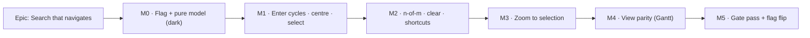

# Implementation Plan: Make search take you there

- **Feature spec:** [`./feature-spec.md`](./feature-spec.md) — **not yet approved**
- **Status:** Draft — awaiting approval before implementation
- **Owner:** _(to be assigned)_
- **Flag:** `VITE_CANVAS_SEARCH_NAV`, **derived** from `CANVAS_LENSES_ENABLED`, default-off until M5
- **Scope guard:** frontend only. No API, no DTO, no schema, no migration, no engine import. The
  ADR-0034 recalc parity gate is untouched by construction (spec §3). `docs/TECH_DEBT.md`
  **#28 / #31 / #48 / #51 / #56 / #75** are known, pre-existing and **out of scope** — in particular
  #75, which this epic must not be used to relitigate.

## Breakdown

### Epic

**Search that navigates** — turn the TSLD's live search from a filter into a _find_ control: a
cycled, centred, selected, counted and announced jump to each match, plus the viewport command that
lets a planner read what they landed on. Roadmap theme: the ADR-0031 `find` group; the enabling
half of "the canvas is usable at programme scale".

**Why this shape:** every milestone is releasable on its own (`main` stays releasable throughout —
the flag is off until M5), and each one is independently valuable and independently revertible. M0
does the pure work with nothing rendered; M1 is the feature's whole point and could ship alone; M2
makes it legible; M3 is a separable command; M4 is the largest scope risk and is deliberately last
before the gate, so cutting it costs the epic nothing structural (see CQ-1).

---

## Milestone 0 — The flag and the pure match model (dark)

**Outcome:** nothing a user can see. The ordering, the cursor arithmetic and the flag exist, are
unit-tested, and are proved to import nothing they should not.

---

#### Feature: The pure find model

> **Description:** one shared comparator, one ordered-match function, one cursor step function —
> beside `conflicts.ts` and built to the same shape, so the two cycles cannot walk a plan
> differently.
> **Complexity:** S
> **Dependencies:** none
> **Risks:** refactoring `conflicts.ts` onto the extracted comparator silently changes Next-conflict
> ordering → **mitigation:** the existing `conflicts` suite must pass **unchanged**; that is the
> proof, and it is stated as an acceptance condition of the task, not a hope.
> **Testing requirements:** unit only (pure module); one structural import test.

##### Task M0-T1 — Extract the ordering comparator (≈ one PR)

- **Description:** move `compareEarlyStart` + the `earlyStart → laneIndex → id` sort out of
  `render/conflicts.ts:78-83,105-110` into a new pure `render/ordering.ts`, and refactor
  `orderedConflicts` onto it.
- **Complexity:** S
- **Dependencies:** none
- **Risks:** a subtle comparator change reorders Next-conflict → mitigated as above.
- **Testing:** the existing `conflicts` suite passes unchanged (no edits permitted in this task); new
  direct unit tests for the comparator including the nulls-last rule and the id tie-break.
- **Development steps:**
  1. Create `apps/web/src/features/tsld/render/ordering.ts` with `compareByTimeThenLane` and a
     docblock stating **why** it is shared (the ADR-0063 one-derivation rule).
  2. Refactor `conflicts.ts` to import it; delete the local copies.
  3. Add `ordering.test.ts`.
  4. Run `pnpm --filter @repo/web test` and confirm the conflicts suite is untouched and green.

##### Task M0-T2 — `render/search-matches.ts`

- **Description:** `orderedMatches(activities, query, attrs) → MatchHit[]` (reusing
  `matchesActivityFilter` from `lenses.ts`, never a second predicate) and
  `stepMatchIndex(cursorId, hits, delta) → number` (wrapping; resume at 0 when the cursor is absent).
- **Complexity:** S
- **Dependencies:** M0-T1
- **Risks:** a second matching predicate creeps in → **mitigation:** a structural test asserts
  `search-matches.ts` imports the matcher from `lenses.ts` and defines no predicate of its own.
- **Testing:** unit — empty set, single match, wrap forwards, wrap backwards, absent cursor, nulls
  last, deterministic order for identical dates/lanes, and that `orderedMatches` for a given query
  returns exactly the complement of `filterDimmedIds` for that query.
- **Development steps:**
  1. Define `MatchHit { id, name, code, earlyStart }`.
  2. Implement both functions; no React, DOM, canvas or fetch import.
  3. Add the unit suite and a structural import test (no import outside `render/`).

##### Task M0-T3 — The derived flag

- **Description:** `CANVAS_SEARCH_NAV_ENABLED = CANVAS_LENSES_ENABLED && flagDefaultOff(import.meta.env.VITE_CANVAS_SEARCH_NAV)`
  in `apps/web/src/config/env.ts`, with the full rollout docblock the file's other flags carry.
- **Complexity:** S
- **Dependencies:** none
- **Risks:** an independent flag would strand the feature on the disabled placeholder input
  (the ADR-0062 M6 finding) → mitigated by deriving it, and by a test asserting the derivation.
- **Testing:** a unit test that the flag is false when lenses are off, regardless of its own value.
- **Development steps:**
  1. Add the constant + docblock (state the rollback contract explicitly).
  2. Add `VITE_CANVAS_SEARCH_NAV` to `.env.example` and any compose/CI env documentation.
  3. Add the derivation test.

---

## Milestone 1 — Enter cycles; each jump centres and selects

**Outcome (flag-on):** a planner types a term and walks the matches with Enter / Shift+Enter. Each
jump centres the bar, selects it and announces it. Focus stays in the field. Escape belongs to the
field. Nothing else on the canvas changes.

---

#### Feature: The find cursor and the jump

> **Description:** the cursor state, the `goToMatch` command, the keydown contract on the search
> field, the announcement sequencing, and the Escape rule.
> **Complexity:** M
> **Dependencies:** M0
> **Risks:** (a) the selection lift is currently gated on `CANVAS_NAV_ENABLED` (`TsldPanel.tsx:892-907`)
> → **mitigation:** first step of M1-T2, with a test under a lenses-on/nav-off env mock; (b) two live-region
> writes for one event → **mitigation:** the jump cancels the pending debounced count, with a test that
> asserts exactly one utterance; (c) the Escape/portal propagation assumption (spec C15) →
> **mitigation:** the target-guard design avoids the assumption, and M1-T4 pins it with a test that
> must be **verified red first**.
> **Testing requirements:** component tests for every AC in US-1 and US-5; the flag-off parity suite;
> no e2e yet (the journey lands at M5, where a real API and a real browser can be driven).

##### Task M1-T1 — Cursor state

- **Description:** add `searchCursorId` to `LensState`, `setSearchCursorId`, and the reset-on-query
  /attr-change rule.
- **Complexity:** S
- **Dependencies:** M0-T3
- **Risks:** the cursor surviving a query change would make the first Enter after retyping land in the
  wrong place → mitigation: reset inside `setFilterQuery`/`toggleFilterAttr`, tested.
- **Testing:** unit on the hook — cursor set, cursor reset by query change, by attribute change; the
  default state object is unchanged flag-off.
- **Development steps:**
  1. Extend `LensState` + `DEFAULT_LENS_STATE`.
  2. Reset the cursor in the two setters.
  3. Extend `use-tsld-canvas-ui-state.test.ts`.

##### Task M1-T2 — `goToMatch(direction)` in the toolbar context

- **Description:** resolve the ordered matches lazily (memoised by signature), step the cursor,
  centre via `centerOnDate`, lift the selection, announce. Modelled on `goToNextConflict`
  (`use-tsld-toolbar-context.tsx:302-327`).
- **Complexity:** M
- **Dependencies:** M1-T1
- **Risks:** conflating with `exportMatch` (which includes the isolate chain) → mitigation: a test
  asserting the two sets differ when isolate is active.
- **Testing:** context-level tests — centres the right date, selects the right id, announces the right
  string, wraps both ways, no-match path moves nothing, empty-filter path is silent, an unscheduled
  match selects without panning, a summary match under the WBS band resolves in the band not the scene.
- **Development steps:**
  1. **First:** make the select signal reachable with `CANVAS_NAV` off — either widen the guard at
     `TsldPanel.tsx:892-907` to `CANVAS_NAV_ENABLED || CANVAS_SEARCH_NAV_ENABLED`, or move the signal
     out of the nav flag. Add a test under a nav-off env mock.
  2. Add `goToMatch` + the memoised resolver + `searchStatus` to the context.
  3. Cancel the pending count timer (`TsldPanel.tsx:831-834`) when a jump announces — expose a
     cancel seam rather than duplicating the timer.
  4. Add the context tests.

##### Task M1-T3 — The keydown contract on the search field

- **Description:** `onKeyDown` on `LiveSearchControl`: Enter → `goToMatch('next')`, Shift+Enter →
  `goToMatch('previous')`, both `preventDefault()`; focus never moves.
- **Complexity:** S
- **Dependencies:** M1-T2
- **Risks:** an Enter inside a toolbar could submit an enclosing form → mitigation: `preventDefault`
  - a test asserting no form submission and no navigation.
- **Testing:** component — Enter calls forward, Shift+Enter calls back, focus stays on the input,
  the handler is absent flag-off (parity), the shaded state ignores the key.
- **Development steps:**
  1. Add the handler behind the flag, so flag-off the prop is not passed at all.
  2. Component tests + the flag-off parity assertion.

##### Task M1-T4 — The Escape rule

- **Description:** the target guard on the canvas's window listener (`TsldCanvas.tsx:1392`), plus the
  two-step Escape inside the field.
- **Complexity:** M
- **Dependencies:** M1-T3
- **Risks:** **this task changes an ADR-0064 contract.** A regression here is a planner losing an
  armed tool, which is the defect class ADR-0064 exists to prevent → **mitigation:** every test in
  this task is verified to **fail against the current code first**, and `TsldPanel.disarm.test.tsx`
  must pass unchanged for every non-field Escape path.
- **Testing:** (a) Escape in the search field does **not** disarm an armed Add/Link/LOE tool and does
  **not** drop an open Link pick; (b) Escape on the canvas still disarms, exactly as today; (c) first
  Escape clears a non-empty query, announces, keeps focus; (d) second Escape moves focus to the
  listbox on the current match; (e) the native `type="search"` clear is prevented so only one clear
  happens; (f) flag-off, the listener is byte-for-byte today's.
- **Development steps:**
  1. Write the failing tests first; confirm red.
  2. Add the guard, gated so flag-off is byte-for-byte.
  3. Add the in-field Escape handling.
  4. Confirm `TsldPanel.disarm.test.tsx` and `TsldPanel.mode-band.test.tsx` are untouched and green.

##### Task M1-T5 — The Gantt interim shade (CQ-1 (b))

- **Description:** add `ctx.canvasActive` to the `search` (and `filter`) items' `isEnabled`, with
  `CANVAS_ONLY_REASON`, so the field is honest in the Gantt until M4 makes it work there.
- **Complexity:** S
- **Dependencies:** none (independent of the rest of M1)
- **Risks:** if CQ-1 is answered "(b) permanently", this is the end state and M4 is cut — the task is
  written to be correct either way. If M4 lands, this task is reverted by it, deliberately.
- **Testing:** toolbar tests — shaded with the reason in Gantt, enabled in the canvas; flag-off the
  gate is absent (parity), because today's inert behaviour is what flag-off must reproduce.
- **Development steps:**
  1. Add the clause behind the flag.
  2. Toolbar tests both views, both flag states.

##### Task M1-T6 — Flag-off parity suite

- **Description:** the rollback contract: with `CANVAS_SEARCH_NAV_ENABLED` mocked false, the toolbar
  renders today's items, the search input has no keydown handler and no clear button, no
  `search-status` item exists, and the canvas Escape listener is unguarded.
- **Complexity:** S
- **Dependencies:** M1-T1…T5
- **Risks:** a parity suite that is weakened later is not a rollback contract → mitigation: the ADR
  records that it is kept at the flip (the ADR-0053 M6 rule).
- **Testing:** it _is_ the test.
- **Development steps:** `vi.mock('@/config/env')` in the ADR-0053 M6 pattern; assert the four
  properties above.

---

## Milestone 2 — "n of m", a real clear, and the shortcuts sheet

**Outcome:** the size of the match set and the position in it are on screen and in the accessibility
tree; the field can be cleared by keyboard in every browser.

---

#### Feature: The find read-out and field affordances

> **Description:** the presentational status item, the clear button, the `aria-describedby` count,
> and the shortcut entries.
> **Complexity:** S
> **Dependencies:** M1
> **Risks:** a second live region duplicating the announcer → mitigation: the chip is `aria-hidden`,
> exactly as `CurrentConflictStatus` is (`tsld-toolbar-items.tsx:1132-1135`), and the description is a
> plain `sr-only` node, **not** a live region.
> **Testing requirements:** component + a11y assertions; a "one utterance per event" test.

##### Task M2-T1 — `SearchMatchStatus`

- **Description:** a `presentational` registry item at `find`/`look`/tier 2, self-hiding via
  `isVisible: (ctx) => ctx.searchStatus != null`, rendering `N matches` / `i of N` / `No matches`,
  truncating with the full text in `title`. Modelled on `CurrentConflictStatus`.
- **Complexity:** S
- **Dependencies:** M1-T2
- **Risks:** taking a roving-tabindex stop → mitigation: `presentational: true`, asserted by a test
  counting `[data-toolbar-focusable]` before/after.
- **Testing:** the three states, the absent state, `aria-hidden`, not a tab stop, flag-off absent.
- **Development steps:** shared shape const → item → component → tests.

##### Task M2-T2 — Keyboard-reachable clear + described count

- **Description:** a real `<button>` clear inside the toolbar field with an accessible name, the
  Chromium-only native ✕ suppressed, focus returned to the input; an `sr-only` count linked by
  `aria-describedby`. Reuse `components/ui/search-field.tsx`'s CSS/structure decisions rather than
  reinventing them; **do not** swap in `SearchField` itself, which renders a visible `<Label>` the
  toolbar has no room for — record that reason in the docblock.
- **Complexity:** S
- **Dependencies:** M2-T1
- **Risks:** using native `disabled` on the clear button (the recurring house defect — ADR-0060 M6,
  ADR-0063 M6) → mitigation: `aria-disabled` + a test that focus is never dropped to `<body>`.
- **Testing:** clear by keyboard, clear by pointer, focus lands on the input, cursor resets, dim
  clears, `aria-describedby` resolves to the count text, flag-off no button.
- **Development steps:** button → `sr-only` description → wire `aria-describedby` → tests.

##### Task M2-T3 — Shortcuts sheet

- **Description:** flag-gated entries for Enter / Shift+Enter / the Escape rule, following the
  `DIRECT_MANIPULATION_SHORTCUTS` pattern (`TsldShortcutsHelp.tsx:33-44`).
- **Complexity:** S
- **Dependencies:** M2-T2
- **Risks:** none material.
- **Testing:** present flag-on, byte-for-byte absent flag-off.

---

## Milestone 3 — Zoom to selection

**Outcome:** a planner who has landed on a match can frame it at a readable scale with one command.

---

#### Feature: The zoom-to-selection viewport command

> **Description:** a new canvas-handle method over the existing `fitToContent`, with the two clamps,
> plus its registry item and shade reasons.
> **Complexity:** S/M
> **Dependencies:** M1 (only for the announcement helper; it is otherwise independent)
> **Risks:** (a) a second "fit these" implementation drifting from `Fit to plan` → **mitigation:** it
> _is_ `fitToContent`, with a filtered array — asserted by a test that both paths call the same
> function; (b) landing outside the ADR-0056 preset vocabulary so the preset control misreports →
> **mitigation:** the `day`-preset ceiling, with a test asserting `presetOf` after the command;
> (c) a milestone (zero span) framing to nothing → **mitigation:** `minContextDays`, tested.
> **Testing requirements:** unit on the clamp arithmetic; canvas-handle test; toolbar shade-reason
> tests in both views.

##### Task M3-T1 — `zoomToActivities` on the canvas handle

- **Description:** add the method; compute the framed span as `max(activitySpan, MIN_CONTEXT_DAYS)`
  centred on the activity; call `fitToContent` with the flag-aware `RESOLVED_MAX_PX_PER_DAY` further
  clamped to `pxPerDayForPreset('day', width)`.
- **Complexity:** M
- **Dependencies:** M0
- **Risks:** as above.
- **Testing:** a one-day task, a milestone, a 400-day LOE, an unscheduled activity (no-op + reason),
  an unmeasured canvas (`size.width <= 1`, no-op), and the resize-preserves-scale property.
- **Development steps:**
  1. Extend `TsldCanvasHandle` with a docblock stating it is a **command**, not a mode (ADR-0056).
  2. Implement over `fitToContent`; add `MIN_CONTEXT_DAYS` as a named constant with its reason.
  3. Tests, including the shared-implementation assertion.

##### Task M3-T2 — The `zoom-to-selection` toolbar item

- **Description:** `frame`/`look`/tier 2, ordered after `fit`; enabled on
  `hasDiagram && canvasActive && selectedActivity != null`; shaded with a distinct reason for each
  missing condition (the layered pattern at `tsld-toolbar-items.tsx:1840-1847`); announces the frame.
- **Complexity:** S
- **Dependencies:** M3-T1
- **Risks:** a lit-but-inert control in the Gantt (the ADR-0059 M6 defect) → mitigation: the
  `canvasActive` clause is in the first version, not added later.
- **Testing:** each shade reason; the enabled path calls the handle; announcement; flag-off absent.

---

## Milestone 4 — View parity: search works in the Gantt

**Outcome:** the same field, the same Enter, the same count, in both views. Closes the pre-existing
lit-but-inert defect (spec C6). **Scope depends on CQ-1.**

---

#### Feature: One match set, two views

> **Description:** lift the match-set derivation to the workspace, hand it to both views, and reveal
> the current match in whichever view is mounted.
> **Complexity:** M
> **Dependencies:** M1 (M2/M3 are independent of it)
> **Risks:** (a) two derivations drifting → **mitigation:** derive once at the workspace and pin the
> identity with a test, the ADR-0062 `gating.logic === gating.general` pattern; (b) the Gantt's dim
> being colour-only → **mitigation:** reuse the existing `emphasisIds` contract, which already carries
> a text marker and preserves the tab stop (`GanttPanel.tsx:104-116`); (c) scope creep into a Gantt
> search field of its own → **not built**: one field, in the toolbar, for both views.
> **Testing requirements:** component tests on both panels; the identity structural test; a11y check
> that a receded row keeps its row index, tab stop and activation.

##### Task M4-T1 — Lift the match set to the workspace

- **Description:** derive `matchedIds` once in the plan workspace (the float-paths precedent,
  `plan-workspace-toolbar.tsx:484-491`) and pass it to `TsldPanel` (replacing its local
  `filterDimmedIds` derivation, behind the flag) and to the toolbar context.
- **Complexity:** M
- **Dependencies:** M1
- **Risks:** changing `TsldPanel`'s dim path risks a paint regression → **mitigation:** flag-off keeps
  the local derivation byte-for-byte; the existing lens paint tests must pass unchanged.
- **Testing:** identity test (`the set the canvas receives === the set the Gantt receives`); existing
  lens/dim suites unchanged; flag-off parity.

##### Task M4-T2 — The Gantt consumes it

- **Description:** pass `emphasisIds = matchedIds` and `bringIntoViewActivityId = currentMatchId`;
  remove the M1-T5 interim shade.
- **Complexity:** S
- **Dependencies:** M4-T1
- **Risks:** the emphasis semantics of `emphasisIds` are "on the float path"; overloading it for
  "matches the search" could confuse a reader of `GanttPanel` → **mitigation:** rename nothing, but
  widen the prop's docblock to state that it means "the emphasised set, whatever derived it", with
  both callers named. If both can be active at once, define the composition explicitly (intersection)
  and test it — **this is the one genuine unknown in M4 and is called out rather than assumed.**
- **Testing:** rows recede, marker present, tab stop preserved, Enter scrolls without moving focus, a
  match inside a collapsed summary expands first, count announced in the Gantt, view switch preserves
  query + cursor.

---

## Milestone 5 — The gate pass and the flag flip

**Outcome:** the specialist reviews have run over the combined diff, their blocking findings are
folded with regression tests, a real browser has driven the feature against a real API, and the flag
is default-on.

**Why this is a milestone and not a checklist:** on this repository the gate pass has found blocking
defects in code that had already passed a human read on **every** epic that ran one — ADR-0060 M6
(six), ADR-0063 M6 (four), ADR-0064 §7 (five), ADR-0067 M4 (ten), ADR-0073 C4 (six). Budget for it.

---

#### Feature: Gates, journey, flip

> **Complexity:** M
> **Dependencies:** M1–M4
> **Risks:** the flip is a product decision, not an engineering one → it is its own task with its own
> approval.
> **Testing requirements:** all of the below.

##### Task M5-T1 — Specialist reviews over the combined diff

- **Description:** run **ux-reviewer**, **accessibility-reviewer**, **component-reviewer**,
  **performance-reviewer** and **ui-architect** over the whole epic diff. Fold every blocking finding
  with a regression test **verified to fail against the pre-fix code**; record non-blocking findings
  as a single `docs/TECH_DEBT.md` row (the house pattern).
- **Complexity:** M
- **Dependencies:** M1–M4
- **Risks:** treating "no blocking findings" as the expected outcome → it has not been, once.
- **Testing:** one regression test per folded finding.
- **Specific things to point the reviewers at**, because they are the shapes this repo keeps
  re-learning: native `disabled` on any new control; a control lit in a view where it does nothing; a
  reason sentence beside a control rather than `aria-describedby`-linked to it; one correct pattern
  applied to a control and not its neighbour; a `role="status"` that duplicates the announcer; a
  focus move that strands `<body>`.

##### Task M5-T2 — The flag-on Playwright journey

- **Description:** `apps/web/e2e-search-nav/` + `playwright.search-nav.config.ts` +
  `test:e2e:search-nav` + its own CI step, driving the feature against a **real API** on a seeded
  multi-hundred-activity plan.
- **Complexity:** M
- **Dependencies:** M5-T1
- **Risks:** a unit-only proof cannot see a wrong locator, a portalled control, an accessible name
  that differs from the assumption, or the top-layer problem the ADR-0067 journey found → that is
  precisely why this exists.
- **Testing:** the journey asserts — Enter walks forwards and wraps; Shift+Enter walks back; focus
  stays in the field across a full cycle; the read-out tracks; the announcement text appears in the
  live region; Escape in the field does not disarm an armed Link tool (the highest-value assertion in
  the suite); Zoom to selection changes the scale and the preset control agrees; the Gantt path (M4)
  scrolls the row without moving focus. Run **locally** via `scripts/e2e-local.sh web:search-nav`
  before pushing — the pre-push gate, not CI's job.

##### Task M5-T3 — ADR-0079, docs, changeset

- **Description:** write and accept ADR-0079 (spec §4.9 outline; `0078` was taken in the meantime); update `CLAUDE.md` §16 + run
  `pnpm check:counts`; add a `docs/DECISIONS.md` entry; update `docs/TESTING.md` with the new suite;
  finalise the flag docblock as the rollout record; `pnpm changeset` (minor, pre-1.0 user-visible).
- **Complexity:** S
- **Dependencies:** M5-T1, M5-T2
- **Risks:** ADR-0071's failure — a decision maintained in `docs/specs/` and never filed in
  `docs/adr/` — → mitigation: filing the ADR is a numbered step of this task, not a follow-up.

##### Task M5-T4 — The flip

- **Description:** `flagDefaultOn`, with the parity suites **kept** and pinned.
- **Complexity:** S
- **Dependencies:** M5-T1…T3 all green
- **Risks:** flipping before the journey is green → the dependency is hard.
- **Testing:** full pre-push gate — `pnpm lint && pnpm typecheck && pnpm test`, plus
  `scripts/e2e-local.sh web:search-nav`. No `apps/api` change, so the API e2e half is not required
  (state that explicitly in the PR rather than leaving it ambiguous).

---

## Sequencing & slices

| Slice | Ships                                                             | Releasable alone? | Flag   |
| ----- | ----------------------------------------------------------------- | ----------------- | ------ |
| M0    | pure model, flag                                                  | yes (dark)        | off    |
| M1    | Enter/Shift+Enter cycle, centre, select, Escape rule, Gantt shade | yes               | off    |
| M2    | n-of-m, clear, shortcuts                                          | yes               | off    |
| M3    | Zoom to selection                                                 | yes               | off    |
| M4    | Gantt parity                                                      | yes               | off    |
| M5    | gates, journey, ADR, flip                                         | yes               | **on** |

M2, M3 and M4 are mutually independent given M1, so they can be reordered or run in parallel. **M4 is
the cut line**: if CQ-1 is answered "(b) shade in the Gantt", drop M4 entirely, keep M1-T5 as the end
state, and open a `docs/TECH_DEBT.md` row saying so — the epic is complete and correct without it.

Estimated size: **S/M overall**, matching the review's sizing. M0/M2/M3 are S; M1 and M4 are M; M5 is
M because of what gate passes reliably find here.

## Definition of Done (per task)

Every task's PR satisfies the Feature Completion Criteria in [`docs/PROCESS.md`](../../PROCESS.md):
code, tests (≥ 80% on changed lines, regression test for anything fixed), docs, security review,
performance considered, accessibility considered, Docker build, CI green, changeset, version impact.

Two additions specific to this epic:

- **The pre-push gate is run, not written.** `pnpm lint && pnpm typecheck && pnpm test`; plus
  `scripts/e2e-local.sh web:search-nav` for any task touching the journey. CI is the second opinion.
- **Every regression test added for a review finding is verified red against the pre-fix code**, and
  the PR says so.

## Risks & assumptions (rollup)

| Risk / assumption                                                                                                      | Likelihood        | Impact                                                                   | Mitigation                                                                                                                                                       |
| ---------------------------------------------------------------------------------------------------------------------- | ----------------- | ------------------------------------------------------------------------ | ---------------------------------------------------------------------------------------------------------------------------------------------------------------- |
| The Escape change costs a planner an armed tool in some path nobody tested                                             | med               | **high** — it is the exact defect class ADR-0064 was opened on           | M1-T4's tests are written red first; `TsldPanel.disarm.test.tsx` + `mode-band.test.tsx` must pass **unchanged**; the journey drives it in a real browser (M5-T2) |
| The selection lift is gated on `CANVAS_NAV_ENABLED` and silently does nothing in a nav-off build                       | med               | med                                                                      | First step of M1-T2, with a nav-off env-mock test                                                                                                                |
| Two live-region utterances for one jump (the debounced count vs the jump)                                              | high if unhandled | med                                                                      | Explicit cancel of the pending timer + a "one utterance per event" test                                                                                          |
| A second match-set or ordering derivation drifts from the first                                                        | med               | med — and **invisible**, only findable by someone comparing two surfaces | One comparator (M0-T1), one predicate (M0-T2 structural test), one set lifted at M4 with an identity test                                                        |
| `emphasisIds` overloaded for two meanings in the Gantt (float path + search)                                           | med               | med                                                                      | M4-T2 defines and tests the composition explicitly rather than discovering it                                                                                    |
| Cycling while Isolate/Float-paths is on makes the lens jump on every Enter                                             | high              | low–med, but surprising                                                  | **CQ-2** — decide deliberately; whichever answer, state it in the ADR                                                                                            |
| Zoom-to-selection lands outside the ADR-0056 preset vocabulary and the preset control misreports                       | med               | low                                                                      | The `day`-preset ceiling, with a `presetOf` assertion                                                                                                            |
| A summary match under the WBS band is looked for in the scene, where it no longer is                                   | med               | med — a silent no-op on a lit control                                    | Explicit edge case + test (the ADR-0063 M6 defect, restated)                                                                                                     |
| Scope creep into new matching semantics (regex, prefixes, fuzzy)                                                       | med               | med                                                                      | Explicitly rejected in spec §4.10; the predicate is unchanged                                                                                                    |
| Scope creep into the draw-budget question (`TECH_DEBT` #75)                                                            | med               | high (schedule)                                                          | Out of scope, stated twice; this epic adds no per-frame work and no scene field                                                                                  |
| **Assumption:** `pnpm check:counts` will fail on the new ADR/suite/source counts                                       | certain           | low                                                                      | Run it as part of M5-T3 rather than discovering it in CI                                                                                                         |
| **Assumption (unverified):** React `stopPropagation` from the portalled toolbar reaches the canvas's `window` listener | n/a               | n/a                                                                      | **The design does not rely on it** (spec C15); the target guard is used instead                                                                                  |
