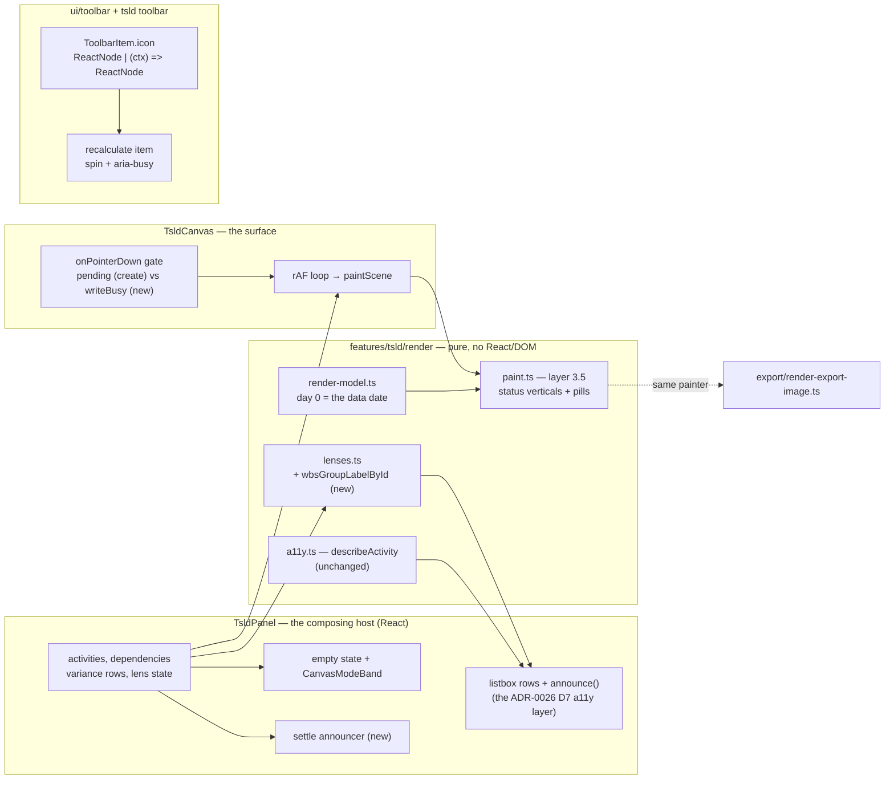
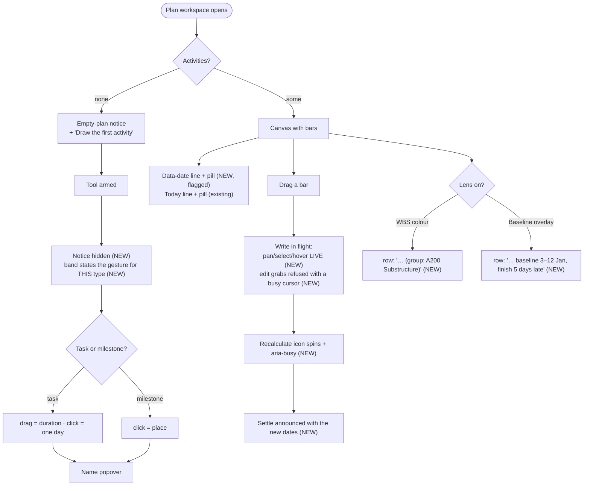

# Feature Spec: Canvas status & feedback

- **Status:** Draft — **awaiting approval before implementation**
- **Author(s):** feature-analyst (Product Owner / Solution Architect / Technical Lead hats)
- **Date:** 2026-08-07
- **Tracking issue / epic:** _(to be created)_
- **Roadmap link:** TSLD canvas quality — the review-driven follow-on to ADR-0064/0065
- **Related ADR(s):** proposes **ADR-0078** (canvas marker channels & the data-date line);
  builds on ADR-0026 (canvas + parallel a11y layer), ADR-0032 (coalesced recalc),
  ADR-0033 (data date), ADR-0052/0054/0056 (marks and their spoken twins),
  ADR-0063 (band model), ADR-0064 (mode band, quiescence), ADR-0061 (when not to flag).

---

## 0. What this epic is, and how its claims were established

Five findings from a multi-agent canvas review. Each was **re-verified against the code
while writing this spec** — not inherited from the brief — because ADR-0076 §Class 3 and
`docs/PROCESS.md` "the brief is not evidence" both say a decision-bearing claim must name
what was read. Three claims in the brief did not survive that read, and the corrections
change the work:

| #   | Brief said                                              | What the code says                                                                                                                                                                                                                                                                                              | Consequence                                                                                                                                                                                                                                                                                                                 |
| --- | ------------------------------------------------------- | --------------------------------------------------------------------------------------------------------------------------------------------------------------------------------------------------------------------------------------------------------------------------------------------------------------- | --------------------------------------------------------------------------------------------------------------------------------------------------------------------------------------------------------------------------------------------------------------------------------------------------------------------------- |
| 2   | "resize and lag drags on the same surface stay live"    | **Resize freezes too.** `TsldPanel.tsx:1505` sets `pendingReposition` for a resize exactly as `:1431` does for a move, and `:1832-1840` passes both into `TsldCanvas`'s `pending` prop, which `:1557` uses to return early from `onPointerDown`. Only the **lag** drag stays live (`:1544-1570` sets no ghost). | The fix is one seam covering two gestures, not "make reposition behave like resize". There is no sibling to copy — the pattern has to be chosen.                                                                                                                                                                            |
| 3b  | a literal single click "silently persists a 1-day task" | It **opens the naming popover pre-sized to one day** (`gesture-machine.ts:541-554` → `TsldPanel.tsx:1398-1401` → the `CreateActivityPopover` at `:1843`). Committing it persists a 1-day task.                                                                                                                  | Nothing is written without a name and a confirm. The defect is real but is a **discoverability** defect: the copy never mentions that drag sizes the bar, so the planner gets a duration they did not choose and no hint that another gesture existed. The severity claim ("silently persists") should not go into the ADR. |
| 7   | "a recalc settles silently"                             | The **manual** button announces `"Schedule recalculated."` (`use-tsld-toolbar-context.tsx:588`). The **coalesced auto** path announces nothing (`use-plan-auto-recalc.ts:115-127` — `onSuccess` fires only the one-shot manual callback).                                                                       | Two different gaps: the auto path says nothing at all, and the manual path says something that carries no information. ADR-0073's "distinct facts in one channel" lesson applies to the _manual_ sentence too.                                                                                                              |

A fourth correction, found while reading the seam for Item 4 and folded into it: **the
sentence spoken on selection already disagrees with the row it names.** `select()`
announces `optionDescriptions.get(id)` (`TsldPanel.tsx:992-999`), while the listbox row
renders that same string **plus** the dim reasons and the over-allocation mark
(`:1897-1918`). So a screen-reader user selecting a filtered-out or over-allocated bar
today hears a sentence the list does not contain. That is pre-existing, in the exact code
Item 4 modifies, and is fixed here rather than stepped over (ADR-0071's rule: noticing
drift and routing around it leaves it as wrong as not noticing).

**What binds the whole epic**

- **Frontend-only.** No file in this epic imports the CPM engine, and no migration runs.
  The recalc parity gate (ADR-0034) is untouched **structurally**, not by assertion: the
  engine lives in `apps/api/src/modules/schedule/engine/`, this work lives in
  `apps/web/src/features/tsld/`, `apps/web/src/components/ui/toolbar/`, and
  `apps/web/src/config/env.ts`, and nothing here changes an input to `computeSchedule`.
  Item 7 changes **when the client asks** for a recalculation to be reported, never what
  the server computes.
- **Paint budget discipline.** New painter work is gated by counting-stub tests asserting
  the **shape** of the per-frame cost (`paint.dates-budget.test.ts` and siblings), never a
  millisecond count on a CI runner. `docs/TECH_DEBT.md` **#75** already records that the
  painter runs 4–6× over ADR-0026 §16's stated budget and that the budget itself is under
  review; this epic must not make that worse and does not attempt to fix it.
- **Tokens only.** No colour literal in `className`/`style` (the ADR-0055 lint rule);
  canvas colours are resolved from tokens in `render/palette.ts`.
- **Every fix ships with a regression test, verified red first where feasible.** The
  places where "red first" is not achievable are named per task.
- **Out of scope, known:** `docs/TECH_DEBT.md` #28 (canvas ring/stroke token treatment),
  #31 (toolbar fast-follows), #48 (export/print fast-follows — note #48(e), the
  hand-authored `EXPORT_LEGEND`, is _touched_ by Item 1 but not fixed), #51 (visual-refresh
  fast-follows incl. `classifyHit` culling), #56 (pure gesture helpers still in
  `TsldCanvas.tsx`), #75 (the draw budget itself).

---

## 1. Business understanding

### Problem

The TSLD canvas is the product's primary surface, and five reviewed defects sit on it.
They are not one theme by accident — each is a place where the canvas **knows something
and does not say it**:

1. **The canvas never draws the data date.** It is the _origin of the coordinate system_
   (`render-model.ts:446-470` measures every bar from it; `screenXOfDay(0)` is literally
   its x) and ADR-0033 made it mandatory and the pivot of the whole progress model — and
   the only vertical the canvas paints is a wall-clock **Today** marker
   (`paint.ts:1381-1423`). On any statused programme, which is every programme after its
   first monthly update, the data date is _not_ today, and the line P6 planners read first
   is absent. The date itself is available as text on the schedule summary strip
   (`ScheduleSummaryStrip.tsx:108`), which is precisely the wrong place: what a planner
   needs is not the value, it is **where it falls relative to the bars**.
2. **Dropping a bar freezes the whole surface.** For the duration of a PATCH plus the
   coalesced recalculation, the canvas takes no pan, no click, no selection and no hover —
   `if (pending) return` at the top of `onPointerDown` (`TsldCanvas.tsx:1554-1557`). The
   guard's own comment justifies only the create-popover case ("the canvas is inert until
   it commits"); a guard written for one purpose has come to cover a second, and the second
   is the most frequent authoring gesture in the product.
3. **The first gesture on an empty plan is described twice, contradictorily.** Pressing
   _Draw the first activity_ arms the Add tool — and the empty-plan notice stays on screen
   (`TsldPanel.tsx:1753` gates it on `activities.length === 0` alone) beside a mode band
   now telling the planner something else. And what the band tells them is wrong for the
   commonest case: "click the diagram to draw" (`CanvasModeBand.tsx:26`) is the milestone
   gesture; for a task, **drag** draws a duration and a click yields one day.
4. **The WBS colour lens speaks with colour only.** _Colour by WBS group_ conveys
   membership by fill alone; `describeActivity` (`render/a11y.ts:52-97`) contains no
   parent/WBS clause at all. That is a WCAG 1.4.1 failure on a default-on lens, and it was
   the a11y audit's one blocker. The **baseline ghost bar** has the same shape of gap: it
   is the only other canvas mark with no spoken equivalent.
5. **A recalculation is invisible and then inaudible.** The Recalculate icon never moves
   while a recalc is in flight (the busy state is a tooltip string,
   `tsld-toolbar-items.tsx:2084-2089`), and when the result lands the bars move under the
   planner's eye with no signal — and under a screen-reader user's _focused row_, whose
   text changes with nothing announced.

**Why now.** Items 2–5 are reviewed defects on default-on surfaces, so they are live for
every user of the deployed host (`CLAUDE.md` §17: the operator runs the Watchtower profile,
so anything default-on is in use). Item 1 is the capability the other four make legible:
there is no point improving how the canvas reports change if it cannot draw the line every
progress conversation is about.

### Users

All of them are **members of an organisation**, on a plan they can already open; nothing
here changes who may do anything (see §2 Permissions).

| Persona                               | Org role      | What they need from this epic                                                                                                                     |
| ------------------------------------- | ------------- | ------------------------------------------------------------------------------------------------------------------------------------------------- |
| Planner running a monthly update      | `PLANNER`     | See where the data date cuts the programme; move bars without the surface locking under their hand; know a recalculation happened and what moved. |
| Contributor reporting progress        | `CONTRIBUTOR` | Same status line (read-only for them); the recalculation announcement.                                                                            |
| Commercial / PM reader                | `VIEWER`      | The status line on screen and in an exported picture; a legend that names it.                                                                     |
| Screen-reader user (any of the above) | any           | A spoken equivalent for the WBS colour lens and the baseline ghost; a spoken settle after a recalculation; the data date stated once in text.     |
| External Guest                        | share link    | **Explicitly unaffected** — the guest view (`features/share/components/GuestPlanView.tsx`) is a separate component and is not in scope.           |

### Primary use cases

1. Open a statused plan and see the data date drawn on the diagram, distinct from Today.
2. Drag a bar to a new date and keep panning/inspecting while the write settles.
3. Arm the Add tool on an empty plan and be told, once, what gesture to make.
4. Navigate the plan by keyboard with the WBS lens on and hear which group each bar is in.
5. Make an edit, and be told — visually and in speech — that the schedule recalculated and
   what it did to the thing you edited.

### User journeys

**Happy path (the monthly update).** Planner opens the plan → the canvas shows a solid
data-date vertical with a `Data date` pill, and the dashed red Today line further right →
they drag a slipped activity to its new start → the ghost commits, the canvas stays live
and they pan to check a successor while the write is in flight → the Recalculate icon spins
→ the icon settles and the polite region says the activity's new dates and, if it moved,
the new project finish.

**Alternate — brand new plan.** Planner opens an empty plan → one notice: _This plan has no
activities yet_ + _Draw the first activity_ → they press it → the notice goes, and the band
says _Adding task — drag on the diagram to draw its duration, or click for one day. Esc to
stop._ → they drag → the naming popover opens on the span they drew.

**Alternate — keyboard/AT.** User tabs into the activities listbox → arrows through rows →
with _Colour by WBS group_ on, each row ends `(group: A200 Substructure)` or
`(ungrouped)` → with the Baseline overlay on, each row also carries its baseline span and
variance → after an edit settles, one polite sentence states the outcome.

**Alternate — data date is today.** The two lines land on the same pixel → one line draws,
in the data-date treatment, and its pill reads `Data date · today`.

### Expected outcomes

- A statused programme is legible on the canvas without leaving it for the summary strip.
- The most common authoring gesture stops making the surface feel broken.
- The first thing a new planner is told about the canvas is true and singular.
- The two default-on lenses stop being sighted-pointer-only (WCAG 1.4.1).
- A recalculation is perceivable in both channels the product has.

### Success criteria

| #   | Criterion                                                                                                                                                                                     | How it is measured                                                                                                                        |
| --- | --------------------------------------------------------------------------------------------------------------------------------------------------------------------------------------------- | ----------------------------------------------------------------------------------------------------------------------------------------- |
| S1  | On a plan whose data date ≠ today, both verticals are drawn and distinguishable by shape alone (solid vs dashed), not only by hue.                                                            | Painter unit test on a recording stub asserting two strokes with different `setLineDash` states; a11y review confirms the non-colour cue. |
| S2  | With a reposition or resize write in flight, a pan gesture moves the viewport.                                                                                                                | Regression test in `TsldCanvas.test.tsx`, verified red against current `main`.                                                            |
| S3  | On an empty plan with a tool armed, exactly one instruction is on screen.                                                                                                                     | `TsldPanel.authoring.test.tsx` asserts the empty-state notice is absent while `mode !== 'select'`.                                        |
| S4  | With the WBS lens on, every listbox row names its group; with the baseline overlay on, every ghosted row names its baseline. Both the row text and the sentence spoken on selection carry it. | `TsldPanel.a11y.test.tsx` + an identity assertion that the announced string equals the rendered row text.                                 |
| S5  | A recalculation in flight is perceivable without motion, and its settle is announced with a fact rather than a status word.                                                                   | Toolbar test (`aria-busy` + icon swap) and a settle-announcement test asserting the sentence names the activity and its new dates.        |
| S6  | The per-frame draw-call count with the data-date layer on exceeds the layer-off count by a **constant** (independent of activity count).                                                      | New `paint.data-date-budget.test.ts` counting-stub gate at 2,000 activities.                                                              |
| S7  | Flag-off (`VITE_CANVAS_DATA_DATE=false`) the canvas paints byte-for-byte today's frame.                                                                                                       | A flag-off parity suite pinning the painter with the scene field absent.                                                                  |

### Open questions

See **§6 Critical questions** — five, each with a stated default so nothing blocks.

---

## 2. Functional requirements

### User stories & acceptance criteria

> **US-1** — As a **Planner**, I want the **data date drawn on the diagram**, so that I can
> see which work sits behind the status line without leaving the canvas.
>
> **Acceptance criteria**
>
> - **Given** a plan whose data date is not today **when** the canvas paints **then** a
>   **solid** vertical is drawn at day offset 0 with a `Data date` pill, and the existing
>   dashed **Today** vertical is drawn unchanged at its own offset.
> - **Given** the data-date line and the Today line round to the **same** screen pixel
>   **when** the canvas paints **then** exactly **one** vertical is drawn, in the data-date
>   treatment, and its pill reads `Data date · today` — no second line, no second pill.
> - **Given** any zoom preset **when** the canvas paints **then** the data-date line is
>   drawn (no level-of-detail suppression of the line itself); its **pill** follows exactly
>   the conditions the Today pill already follows (a 2D context that can measure and fill
>   text).
> - **Given** the pill would overflow the canvas **when** it is placed **then** it is
>   clamped inside the canvas width exactly as the Today pill is, and it occupies its own
>   pill row so the two can never overlap after clamping.
> - **Given** `View▾ ▸ Markers ▸ Data date line` is unchecked **then** neither line nor
>   pill draws, and every other layer is unchanged.
> - **Given** the legend is open **then** it carries a `Data date` entry whose swatch is a
>   solid vertical, beside the existing dashed `Today` entry.
> - **Given** the diagram is exported as PNG or PDF **then** the line appears in the
>   exported picture and the export legend names it.
> - **Given** `VITE_CANVAS_DATA_DATE=false` **then** the painted frame is byte-for-byte the
>   frame painted today, and `View▾` offers no such toggle.

> **US-2** — As a **screen-reader user**, I want the data date **stated in text**, so that
> the marker I cannot see is still a fact I have.
>
> - **Given** the plan workspace is rendered **then** a visually-hidden sentence names the
>   data date, and — when it differs from today — names today as well; it is linked to the
>   activities listbox with `aria-describedby` so a reader who lands **inside** the region
>   still receives it (the ADR-0073 C2.5 finding, applied here rather than re-learnt).
> - **Given** the sentence is present **then** it is **not** a live region: it is a standing
>   fact, and announcing it on every re-render would be noise.

> **US-3** — As a **Planner**, I want the canvas to stay usable while a move or resize is
> saving, so that a routine edit does not feel like a hang.
>
> - **Given** a reposition or resize write is in flight **when** I drag on empty canvas
>   **then** the viewport pans.
> - **Given** the same **when** I click a bar **then** it is selected and announced.
> - **Given** the same **when** I move the pointer **then** the hover ring, the cursor date
>   readout and the guideline behave normally.
> - **Given** the same **when** I press on a bar body or a resize/lag handle **then** the
>   edit gesture **does not start**, and the pointer over a bar shows a busy cursor — the
>   refusal is visible, never a gesture that silently does nothing.
> - **Given** a **create popover** is open **then** the canvas remains fully inert exactly
>   as today — that guard is preserved verbatim and keeps its own reason.
> - **Given** a write is in flight **then** the canvas container carries `aria-busy="true"`.
> - **Given** the write settles (applied, conflicted or failed) **then** the surface returns
>   to its ordinary state on every path, including the `.catch` path.

> **US-4** — As a **Planner on an empty plan**, I want one instruction at a time, correct
> for the tool I armed.
>
> - **Given** an empty plan and no armed tool **then** the empty-plan notice renders (as
>   today, including the shaded-with-a-reason state for a user without the pen).
> - **Given** an empty plan **when** a tool is armed **then** the notice is **not**
>   rendered and the mode band is the only instruction.
> - **Given** the Add tool armed with a **task-like** type **then** the band reads
>   `Adding task — drag on the diagram to draw its duration, or click for one day. Esc to
stop.`
> - **Given** the Add tool armed with a **milestone** type **then** the band reads
>   `Adding milestone — click the diagram to place it. Esc to stop.`
> - **Given** either **then** the sentence announced to AT is the **same string** (both come
>   from `modeStatementText`, which is already the single source — `CanvasModeBand.tsx:23`).
> - **Given** the tool is disarmed **then** the empty-plan notice returns.

> **US-5** — As a **screen-reader user**, I want the WBS colour lens and the baseline ghost
> to have spoken equivalents (WCAG 1.4.1).
>
> - **Given** _Colour by WBS group_ is active **then** each listbox row ends with its group
>   — `(group: {parent identity})`, or `(ungrouped)` for a top-level non-summary activity.
> - **Given** the group is one the legend collapsed into `+N more` **then** the row still
>   names it in full: speech has no width limit and the cap is a layout constraint.
> - **Given** the group name shown in the legend **then** the group name spoken in the row
>   is derived from the **same** function, so the two cannot drift.
> - **Given** the Baseline overlay is active and an activity has a ghost **then** its row
>   names the baseline span and the finish variance in working days, in the same
>   later/earlier vocabulary the variance table uses.
> - **Given** an activity has no ghost (no baseline row, `removed`, or null dates) **then**
>   nothing is added — absence is not narrated.
> - **Given** any row **when** it is selected **then** the sentence announced is **identical
>   to the row's rendered text**, including these clauses and the pre-existing dim /
>   over-allocation marks.
> - **Given** neither lens is active **then** the row text is byte-for-byte today's.

> **US-6** — As any user, I want to know a recalculation is running and what it did.
>
> - **Given** a coalesced or manual recalculation is in flight **then** the Recalculate
>   toolbar item shows a spinning icon **and** carries `aria-busy="true"` **and** keeps its
>   existing `Recalculating…` disabled reason — so the busy state survives
>   `prefers-reduced-motion`, where the global rule at `globals.css:1102-1112` reduces the
>   animation to 0.01 ms and a motion-only cue would convey nothing.
> - **Given** a recalculation settles **and** an activity was edited on this surface since
>   the last settle **then** one polite announcement names that activity and its resulting
>   dates.
> - **Given** the project finish changed across the settle **then** that is a **second**
>   sentence, not merged into the first (ADR-0073 C1: two facts, two statements).
> - **Given** neither changed **then** nothing is announced — a recalculation that moved
>   nothing is not news, and the manual button keeps its own explicit confirmation.
> - **Given** a recalculation **fails** **then** today's error path is unchanged (the
>   coalescer's `onMessage` → announce), and no success sentence is spoken.
> - **Given** repeated settles with unchanged values **then** nothing is re-announced (a
>   value-stable signature, the `flaggedSignature` precedent at `TsldPanel.tsx:809`).

### Workflows

**W1 — paint the status lines (per frame, in `paintScene`).** Layer 3.5 today draws Today.
It becomes: resolve `dataDateX = round(screenXOfDay(0, view)) + 0.5`; resolve `todayX` as
today (unchanged); if the toggle is on and `dataDateX` is on-screen, draw the solid rule and
queue the pill; if the Today toggle is on and `todayX` is on-screen **and**
`round(todayX) !== round(dataDateX)`, draw the dashed rule and its pill; if they coincide,
draw only the data-date rule with the merged label. Both pills draw under the same
text-capability guard the Today pill already uses.

**W2 — an edit write.** `onIntent` composes the ghost and fires the PATCH (unchanged) →
`writeBusy` is derived from `pendingReposition !== null` and passed to the canvas →
`onPointerDown` refuses only _edit_ grabs, and `pending` (create only) keeps the total
block → the promise settles, ghost cleared, `writeBusy` false.

**W3 — recalculation settle.** The coalescer fires (unchanged) → the query invalidation
lands new activities/summary (unchanged) → a hook compares the last-edited activity's dates
and the project finish with the values captured before the edit → announces at most two
sentences → resets its baseline for the next edit.

### Edge cases

| Case                                                                                  | Expected behaviour                                                                                                                                                                                                                    |
| ------------------------------------------------------------------------------------- | ------------------------------------------------------------------------------------------------------------------------------------------------------------------------------------------------------------------------------------- |
| Data date scrolled off-screen                                                         | The line is culled by the same `x >= 0 && x <= size.width` test the Today line uses. The pill goes with it. No off-screen indicator (out of scope; note it as a possible follow-on).                                                  |
| `todayOffset` is null (today outside the schedulable range)                           | Only the data-date line draws. The coincidence test never runs.                                                                                                                                                                       |
| The two lines differ by less than a pixel but not zero (fractional Today at low zoom) | The `round()` comparison merges them. This is deliberate: they merge exactly when they would overdraw, which is the only case where two lines are a rendering artefact rather than two facts.                                         |
| Plan not yet recalculated (no bars)                                                   | The data-date line still draws — it is a plan property, not a computed one. This is the one status marker an empty plan can honestly show.                                                                                            |
| Export image                                                                          | Draws via the same `paintScene` (`export/render-export-image.ts:1,104`), so the line appears automatically; the hand-authored `EXPORT_LEGEND` (`:85-91`) must gain the entry in the same PR or it silently drifts (TECH_DEBT #48(e)). |
| Printed programme (Gantt, ADR-0059 M4)                                                | Out of scope — a separate DOM document, not `paintScene`. Recorded, not fixed.                                                                                                                                                        |
| Guest share view                                                                      | Out of scope — a separate component.                                                                                                                                                                                                  |
| Write in flight, then the pen is lost                                                 | Unchanged: the settle path already surfaces the conflict banner. `writeBusy` clears on every settle path including `.catch`.                                                                                                          |
| Two writes attempted at once                                                          | Already refused at `TsldPanel.tsx:1397`; now refused **before the gesture starts** so the refusal is visible rather than a drag that ends in nothing.                                                                                 |
| Empty plan, tool armed, then a create fails                                           | The tool stays armed, the band stays; the notice stays hidden until the tool disarms.                                                                                                                                                 |
| WBS lens on, activity's `parentId` names a row not present (orphan)                   | Treated as **ungrouped**, matching `wbs-groups.ts:93-94` and the Gantt row model. One resolution rule, not a third.                                                                                                                   |
| WBS group count above the legend cap                                                  | The row still names the group in full (see US-5).                                                                                                                                                                                     |
| Baseline overlay on with the **Late** overlay also on                                 | The spoken clause mirrors the legend's existing qualification (`TsldLegend.tsx:134-137`): the comparison is against the current (late) view.                                                                                          |
| Recalculation settles while the user is mid-drag                                      | The announcement is polite and does not steal focus. The ADR-0064 recalculation **hold** already prevents bars moving between the two clicks of a link; this epic changes neither the hold nor the cap.                               |
| Recalculation settles after the plan was switched                                     | The announcer is keyed by plan and resets; nothing is spoken about a plan no longer open.                                                                                                                                             |

### Permissions

**Nothing changes.** Mapped to ADR-0012 / ADR-0016 for completeness:

| Capability                                                                   | Roles                                                       | Scope                               | Note                                                                              |
| ---------------------------------------------------------------------------- | ----------------------------------------------------------- | ----------------------------------- | --------------------------------------------------------------------------------- |
| See the data-date line, legend entry, spoken clauses, recalculation feedback | `ORG_ADMIN`, `PLANNER`, `CONTRIBUTOR`, `VIEWER`             | organisation → plan (existing read) | Read-only presentation of data already on the wire.                               |
| Pan/select/hover during a write                                              | as above                                                    | as above                            | The unfreeze restores **read** interactions; it grants no write.                  |
| Start a reposition/resize                                                    | `ORG_ADMIN`, `PLANNER` holding the **pen** (ADR-0028)       | plan                                | Unchanged. The client gate is unchanged; the API remains the sole trust boundary. |
| Recalculate                                                                  | pen-gated (`penGated: true`, `tsld-toolbar-items.tsx:2080`) | plan                                | Unchanged.                                                                        |

**No new write is introduced, so nothing here is structural and nothing needs the pen that
did not already need it.**

### Validation rules

No user input is added, so there are no field rules. The invariants worth stating as
compiler- or test-enforced rules:

- `TsldViewToggles` gaining `dataDate` is a **compile error** until it is registered in
  `VIEW_TOGGLE_META` (`tsld-toolbar-items.tsx:124-144` is a `Record<keyof TsldViewToggles, …>`,
  written after two toggles were silently dropped once).
- `TsldScene.dataDate` (the toggle-composed boolean) is **optional**; absent ⇒ the layer
  never runs ⇒ parity. Same shape as `monthBands` (`paint.ts:258-263`).
- The pill row constant is **derived** (`DATA_DATE_CHIP_TOP = TODAY_CHIP_TOP + TODAY_CHIP_H + 4`),
  never a literal — the same derivation `TODAY_CHIP_TOP` itself uses (`paint.ts:1796-1802`),
  and the ADR-0063 `sceneTopOffset` lesson about magic offsets going quietly wrong.
- The WBS group label spoken in a row and printed in the legend come from **one** exported
  function.

### Error scenarios

Client-side only; no new status codes.

| Scenario                                                     | Detection                                           | User-facing result                                                                     | Status             |
| ------------------------------------------------------------ | --------------------------------------------------- | -------------------------------------------------------------------------------------- | ------------------ |
| Reposition/resize PATCH rejected (stale version)             | existing `outcome.conflict`                         | Existing conflict banner; `writeBusy` clears; canvas usable                            | 409 (existing)     |
| Reposition/resize PATCH rejected (no pen)                    | existing                                            | Existing banner                                                                        | 423 (existing)     |
| Reposition/resize network failure                            | existing `.catch`                                   | Existing "Couldn't move the activity." + `writeBusy` cleared                           | —                  |
| Recalculation fails                                          | coalescer `onMessage`                               | Existing announced message; **no** success sentence, and the busy icon returns to rest | 4xx/5xx (existing) |
| 2D context cannot measure/fill text (jsdom, minimal context) | existing `typeof ctx.fillText === 'function'` guard | Lines draw, pills do not                                                               | —                  |
| Baseline variance not yet loaded                             | `varianceRows` undefined                            | No ghost, no spoken clause                                                             | —                  |

---

## 3. Technical analysis

| Area           | Impact         | Notes                                                                                                                                                                                                                                                                                                                                                                                                                                                                                                                                                                                                        |
| -------------- | -------------- | ------------------------------------------------------------------------------------------------------------------------------------------------------------------------------------------------------------------------------------------------------------------------------------------------------------------------------------------------------------------------------------------------------------------------------------------------------------------------------------------------------------------------------------------------------------------------------------------------------------ |
| Frontend       | **medium**     | `render/paint.ts` (one layer), `render/palette.ts` (+1 pair), `render/render-model.ts` (no change expected — day 0 needs no new geometry), `components/TsldCanvas.tsx` (guard split, `aria-busy`), `components/TsldPanel.tsx` (empty-state gate, listbox suffixes, settle announcer, `aria-describedby` sentence), `components/CanvasModeBand.tsx` (statement shape + copy), `components/TsldLegend.tsx` (+1 entry), `toolbar/tsld-toolbar-items.tsx` (toggle meta + busy icon), `components/ui/toolbar/*` (ctx-resolvable icon), `export/render-export-image.ts` (legend entry), `config/env.ts` (+1 flag). |
| Backend        | **none**       | No module, service or endpoint is touched.                                                                                                                                                                                                                                                                                                                                                                                                                                                                                                                                                                   |
| Database       | **none**       | No model, migration, index or constraint.                                                                                                                                                                                                                                                                                                                                                                                                                                                                                                                                                                    |
| API            | **none**       | Every value used is already on `ActivitySummary`, `BaselineVarianceRow`, the plan and the schedule summary.                                                                                                                                                                                                                                                                                                                                                                                                                                                                                                  |
| Security       | **none**       | No new data reaches the client; no new write; no permission change. A security review is still run over the diff at the gate milestone, because "no impact" is a claim.                                                                                                                                                                                                                                                                                                                                                                                                                                      |
| Performance    | **low, gated** | One extra stroke + at most one extra `measureText`/`fillText` per frame, independent of activity count (S6). The listbox suffixes are computed in the existing row map from precomputed `Map`s — **not** inside `describeActivity`, whose memo is load-bearing: re-running it per render measured ~1.3 s at 2,000 activities (`TsldPanel.tsx:689-692`). The settle announcer compares two scalars.                                                                                                                                                                                                           |
| Infrastructure | **low**        | One new `VITE_` flag threaded through `docker-compose*.yml` / `.env.example` per house style; one new Playwright config + CI step for the flag-on journey.                                                                                                                                                                                                                                                                                                                                                                                                                                                   |
| Observability  | **none**       | No new logs, metrics or traces. Client-only presentation.                                                                                                                                                                                                                                                                                                                                                                                                                                                                                                                                                    |
| Testing        | **high**       | Painter unit + budget + flag-off parity; canvas interaction regression (red-first); panel a11y and copy tests; toolbar registry tests; one flag-on Playwright journey.                                                                                                                                                                                                                                                                                                                                                                                                                                       |

### Dependencies

- **Prerequisites:** none. Every input exists: `dataDate` is already the painter's origin;
  `parentId` is on `ActivitySummary` (`packages/types/src/index.ts:394`);
  `BaselineVarianceRow` already carries `baselineStart/Finish` and
  `startVarianceDays/finishVarianceDays` (`:1262-1282`); `autoRecalc.isPending` is already
  in the toolbar context (`tsld-toolbar-context.ts:128`).
- **Affected features:** the insight lenses (`VITE_CANVAS_LENSES`), the WBS band
  (`VITE_WBS_IMPROVEMENTS`), the time axis (`VITE_CANVAS_TIME_AXIS` — owns the Today pill),
  export/print (`VITE_EXPORT_PRINT` — inherits the new line), the canvas authoring flow
  (`VITE_CANVAS_AUTHORING_FLOW` — owns the mode band and the empty state).
- **Must land first, inside the epic:** the ctx-resolvable toolbar `icon` (M5-T1) before the
  spinner; the palette pair before the painter layer.
- **Third parties:** none. `lucide-react`'s `Loader2` is already imported in the same file
  (`tsld-toolbar-items.tsx:29`).

---

## 4. Solution design

### Architecture overview



**Nothing crosses into `apps/api`.** The engine is not imported anywhere in this diagram;
that is the parity argument, and it is structural.

### Data flow

```mermaid
sequenceDiagram
  autonumber
  participant U as Planner
  participant C as TsldCanvas
  participant P as TsldPanel
  participant API as REST API
  participant R as usePlanAutoRecalc (ADR-0032)
  participant L as Announcer (polite region)

  U->>C: drag a bar, release
  C->>P: onIntent(reposition)
  P->>P: setPendingReposition(ghost) ⇒ writeBusy = true
  P->>C: writeBusy (edit grabs refused; pan/select/hover live)
  P->>API: PATCH /activities/:id
  U->>C: pan / hover / select  (NEW: works)
  API-->>P: 200
  P->>P: setPendingReposition(null) ⇒ writeBusy = false
  P->>L: "Moved …; dates will update."  (existing)
  P->>R: autoRecalc.notify()
  R->>API: POST /schedule/recalculate (debounced, single-flight)
  Note over R: isPending → the toolbar icon spins + aria-busy (NEW)
  API-->>R: 200
  R-->>P: query invalidation → new activities + summary
  P->>L: "{activity} now {start} to {finish}."  (NEW)
  P->>L: "Project finish moved to {date}."      (NEW, only if it changed)
```

### User flow



### Database changes

**None.** No model, column, index, constraint or migration. Stated explicitly because a
spec that omits the section reads as an oversight.

### API changes

**None.** No new endpoint, DTO, status code or OpenAPI change. Every value is already
returned by existing reads.

### Component changes

**New**

- `render/palette.ts` — `dataDate` + `dataDateInk` on `TsldPalette`, resolved from
  `--color-foreground` / `--color-background`. See §"Why the foreground pair" below.
- `paint.ts` — `DATA_DATE_CHIP_TOP` (derived), and layer 3.5 extended to the two-vertical
  model with the coincidence rule. `TsldScene.dataDate?: boolean` (optional ⇒ parity).
- `render/lenses.ts` — `wbsGroupLabelById(activities, …): ReadonlyMap<string, string>`, the
  **one** producer of a WBS group's display label, consumed by both the legend builder and
  the listbox suffix.
- `features/tsld/model/listbox-row-text.ts` (or a small exported helper beside the panel) —
  composes `describeActivity` output + dim reasons + over-allocation + the new lens clauses
  into **one** string used by both the rendered row and `select()`'s announcement.
- `features/tsld/use-recalc-outcome-announcer.ts` — the settle comparison hook.
- `apps/web/e2e-canvas-status/` + `playwright.canvas-status.config.ts` + a CI step.

**Changed**

- `TsldCanvas.tsx` — `pending` keeps its create-only meaning and its comment; a new
  `writeBusy?: boolean` prop gates only the edit-gesture arm; container gains `aria-busy`;
  the bar-hover cursor becomes busy while `writeBusy`.
- `TsldPanel.tsx` — empty-state condition; `writeBusy={pendingReposition !== null}`; the
  row-text composer; the `aria-describedby` data-date sentence; the settle announcer.
- `CanvasModeBand.tsx` — the `adding` statement carries `gesture: 'click' | 'drag'`
  (a boolean-ish discriminator, **not** an `ActivityType`, keeping the band free of domain
  enums the way the render model is); the two call sites are compiler-forced to supply it.
- `TsldLegend.tsx` — a `dataDate` legend item behind the flag, mirroring the `today` item.
- `components/ui/toolbar/toolbar-registry.ts` + consumers — `icon?: ReactNode | ((ctx) => ReactNode)`,
  resolved once in `resolveItems` onto `ResolvedToolbarItem.icon`.
- `tsld-toolbar-items.tsx` — `dataDate` in `VIEW_TOGGLE_META` (Markers group,
  `enabled: CANVAS_DATA_DATE_ENABLED`); the recalculate item's icon becomes a function.
- `export/render-export-image.ts` — one `EXPORT_LEGEND` entry.
- `config/env.ts` — `CANVAS_DATA_DATE_ENABLED`.

**States** — loading: the data-date line draws before the first recalculation (deliberate);
empty: no bars, still a line; error: unchanged banners; success: unchanged.

### Implementation approach & alternatives

**Why the data-date line is one more marker in an existing layer, not a new layer.** The
data date is day offset 0 by definition — `activityRect` measures every bar with
`daysBetween(dataDateIso, …)` and `screenXOfDay(0, view) === view.originX`
(`render-model.ts:421-423, 446-470`). So there is no geometry to add, no index to build and
no culling to design: it is a `moveTo/lineTo` in the layer that already draws Today, and its
cost is constant per frame. A separate canvas (the ADR-0063 band model) would be
disproportionate for one rule, and would put the marker on a surface that does not share the
scene's transform.

**Why the marker channels are decided here rather than per-mark.** ADR-0056 already
reasoned that gridline tiers must **not** dash, because the dash channel belongs to Today
and the ADR-0054 cursor guideline. Adding a third vertical forces the question the other way
round: what is left? The answer this epic fixes, and the reason it wants an ADR:

| Mark                            | Channel                             | Rationale                                                                     |
| ------------------------------- | ----------------------------------- | ----------------------------------------------------------------------------- |
| Gridline tiers (day/month/year) | solid, hairline, border-family hues | Structure. Never dashed (ADR-0056).                                           |
| **Data date**                   | **solid, 2 px, foreground**         | The schedule's own pivot — a fact of the programme, permanent, authoritative. |
| Today                           | dashed, 1.5 px, destructive         | Wall-clock now: a _moving_ cue, and the dash says so.                         |
| Cursor guideline (ADR-0054)     | dashed, ring hue, transient         | Follows the pointer; exists only during a gesture.                            |

Shape (solid vs dashed) and weight distinguish the data date from Today **without relying on
hue**, which is what makes this WCAG 1.4.1-safe rather than merely pretty.

**Why the foreground pair, and what was rejected.** `--color-info` is the semantically
obvious choice (P6 draws the data date blue) and is **rejected on measurement**: in all
three shipped themes it is a near neighbour of `--color-primary`, which is the on-schedule
**bar fill** — light `--primary: oklch(0.5 0.18 255)` vs `--info: oklch(0.5 0.14 240)`;
dark `0.65 0.17 255` vs `0.7 0.13 240`; Corporate `0.252 0.056 264` vs `0.338 0.081 262`
(`globals.css:48/74, 286/307, 524/547`). A "distinct" line in the bar hue, on a diagram
whose entire content is bars, is not distinct. `--color-foreground` is the strongest neutral
already in the palette (it is `outline` and `labelBeside`), pairs 1:1 with
`--color-background` for the pill's ink — the same guarantee `todayInk` relies on
(`paint.ts:123-127`) — and cannot be confused with any semantic state. Its one collision is
the 1.5 px critical-bar **outline**, which is a bar-shaped stroke, not a full-height rule;
noted and accepted. Recorded as CQ-1 with this default.

**Why the reposition guard is split rather than deleted.** Deleting `if (pending) return`
outright would let a second edit gesture start during a write; `onIntent` already refuses
the resulting intent (`TsldPanel.tsx:1397`), so the drag would run, ghost, release — and do
nothing. A gesture that visibly happens and silently does not apply is worse than a
refusal, and is precisely the "lit but inert" defect ADR-0059 M6 and ADR-0062 M6 each
caught. Splitting the prop keeps the create-popover block exactly as written (with its own
reason intact) and makes the second concern explicit and named. Rejected alternatives:
(a) _keep the block, add a busy overlay_ — cheaper, but it keeps the freeze, which is the
complaint; (b) _fully optimistic queued writes_ — the ghost is single-slot, the writes carry
optimistic `version`s, and the ADR-0048 undo stack assumes ordered inverses; a queue is a
different epic.

**Why the spoken lens clauses live at the listbox seam, not inside `describeActivity`.**
`describeActivity` is Tier 1: identity, duration, dates, lane, float, constraint, conflict,
drift, overlap — all _properties of the activity_. A colour lens's group and a baseline
overlay's ghost are properties of **what is currently drawn**, which is why the existing
lens-conditional marks (`filtered out`, `off the logic path`, `over-allocated`) are already
composed at the row (`TsldPanel.tsx:1897-1918`) and not in `a11y.ts`. Following the
established seam also protects the memo: `optionDescriptions` is keyed on
`[activities, renderActivities]` precisely because re-running `describeActivity` per render
measured ~1.3 s at 2,000 activities. Threading lens state into it would rebuild every row on
every lens change for no benefit. The **one** change to make is that both the row and
`select()` must compose through the same helper — today they do not, which is the
pre-existing divergence recorded in §0.

**Why the toolbar `icon` gains a ctx form rather than the item using `render`.**
`ToolbarItem.icon` is `ReactNode` (`toolbar-registry.ts:126`) and the registry is built once
by `buildTsldToolbarItems()` with no ctx (`tsld-toolbar-items.tsx:1332`), so a busy icon has
no way in. The `render` escape hatch exists, but it is XOR with `onActivate`
(`:175-183`) — taking it means re-implementing the button, its label policy, its pen-gating
and its disabled-reason wiring for one item, which is exactly the one-off a component review
rejects. Widening `icon` is additive and symmetric with `isEnabled`/`disabledReason`/
`isActive`, which are already ctx predicates resolved in `resolveItems` (`:208-233`), and a
plain `ReactNode` resolves to itself — pinned by a registry test so the parity claim is
structural rather than promised.

**Why the recalculation announcement is derived in the host, not in the coalescer.**
`usePlanAutoRecalc` is the ADR-0032 seam and knows nothing about activities; giving it an
"outcome" would mean teaching it the domain. The host already holds the edited activity's
id, the activities list and the schedule summary, so the comparison is a small hook there
and the coalescer's contract is untouched.

**Is an ADR needed?** Yes, a short one — **ADR-0078** (0077 is the highest filed;
`docs/adr/` verified). Not for the defect fixes, which are ordinary work, but for the
**marker-channel vocabulary** above and the coincidence rule: they are decisions the next
canvas feature will have to obey, and ADR-0056 already had to reason about the dash channel
in the absence of such a record. The ADR also restates, with two fresh instances, the rule
that **every canvas mark carries a spoken equivalent** — it is asserted in six places across
ADR-0026/0033/0052/0054 and was nonetheless missed twice on default-on surfaces. CQ-2 offers
the alternative (a `DECISIONS.md` entry).

---

## 5. Links

- Implementation plan: [`./implementation-plan.md`](./implementation-plan.md)
- Docs this change updates: `docs/adr/0078-*.md` (new), `CLAUDE.md` §16 (ADR register + the
  computed banner counts via `pnpm check:counts`), `docs/DESIGN_SYSTEM.md` (canvas marker
  channels), `docs/TESTING.md` (the new journey + its CI step), `docs/TECH_DEBT.md` (any
  non-blocking gate findings), `apps/web/README` env table / `.env.example` /
  `docker-compose*.yml` (the new flag).

---

## 6. Critical questions

Five. Everything else has a default stated inline above and needs no answer to proceed.

**CQ-1 — The data-date line's colour treatment.**
Default: **`--color-foreground` (solid, 2 px) with a `--color-background`-ink pill**, for
the measured reason in §4 (`--color-info` collides with the bar fill in all three themes).
The alternative is to add a _new_ canvas token pair (e.g. `--color-canvas-data-date`)
alongside the three that already exist (`--color-canvas-grid-*`, `--color-canvas-band`),
which buys a hue of its own at the cost of a token whose contrast must be validated in three
themes. **Answer changes:** the palette task, `palette.test.ts`, and possibly `globals.css`.

**CQ-2 — ADR-0078, or a `DECISIONS.md` entry?**
Default: **a short ADR-0078**, because the marker-channel table is a constraint on future
work and the register is where the next author will look. Cheaper alternative: a
`docs/DECISIONS.md` entry, with the channel table living in `docs/DESIGN_SYSTEM.md`.
**Answer changes:** one artefact and the CLAUDE.md register update, not the code.

**CQ-3 — The empty-state / mode-band precedence.**
Default: **hide the empty-plan notice whenever a tool is armed.** The alternative is to keep
the notice and remove its _button_ (leaving "This plan has no activities yet" as context
beside the live instruction), which preserves the fact that the plan is empty — genuinely
useful once the planner has drawn one activity and is looking at a nearly-blank canvas.
**Answer changes:** M3's acceptance criteria and one test.

**CQ-4 — How much the settle announcement says.**
Default: **the edited activity's new dates, plus the project finish only when it changed.**
Two candidate variations: (a) also name the _count_ of activities whose dates moved — more
informative on a knock-on-heavy edit, but it needs a full before/after diff of the
activities list each settle, which is O(n) per settle and a new comparison to maintain;
(b) say only "Schedule recalculated" — today's manual sentence, which ADR-0073 C1 is exactly
about not doing. **Answer changes:** M5-T2's scope and its performance argument.

**CQ-5 — Slicing: five PRs or one.**
Default: **five milestone PRs plus a gate milestone** (see the plan's §Sequencing for the
argument — one flagged new visual bundled with four unflagged defect fixes makes the one
revertible thing un-revertible). The alternative is a single PR, which is defensible on
size (the whole epic is S/M) but forfeits the commit boundary ADR-0077 M0 deliberately kept
for exactly this reason. **Answer changes:** the plan's shape, not its content.
