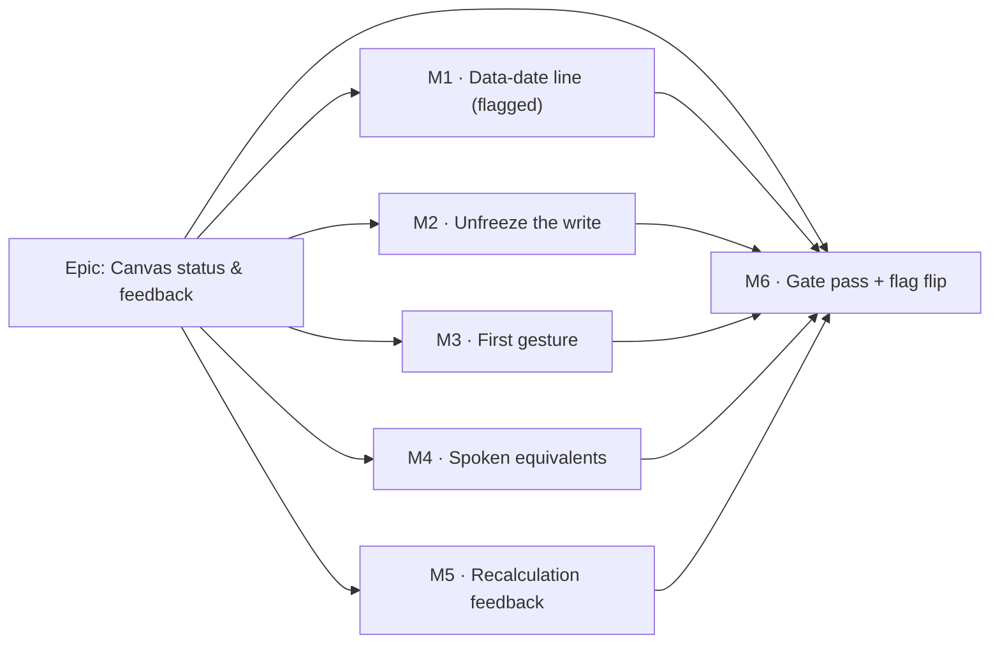

# Implementation Plan: Canvas status & feedback

- **Feature spec:** [`./feature-spec.md`](./feature-spec.md) — **not yet approved**
- **Status:** Draft — awaiting approval before implementation
- **Owner:** _(unassigned)_

## Breakdown

### Epic

**Canvas status & feedback** — make the TSLD canvas say what it already knows: draw the
data date, stop freezing under its own writes, describe the first gesture correctly, give
the two silent lenses a voice, and report a recalculation in both channels. Maps to the
TSLD-canvas-quality roadmap theme; it is the review-driven follow-on to ADR-0064/0065.

**One constraint applies to every task below and is not repeated in each:** no file in this
epic imports the CPM engine and no migration runs, so the ADR-0034 recalc parity gate is
untouched **structurally**. Any PR that finds itself reaching into `apps/api` has left the
plan.

---

## Milestone 1 — The data-date line (behind `VITE_CANVAS_DATA_DATE`, default **off**)

**Outcome:** with the flag on, a planner sees the status line the whole progress model
pivots on, distinguishable from Today by shape as well as hue, named in the legend, present
in an exported picture, and stated once in text for a screen-reader user. With the flag off,
the canvas paints byte-for-byte today's frame.

---

#### Feature: the data-date status marker

> **Description:** a solid vertical at day offset 0 with a `Data date` pill, a `View▾`
> toggle, a legend entry, an export-legend entry, a coincidence rule against the Today line,
> and a text equivalent.
> **Complexity:** M
> **Dependencies:** none (day 0 needs no new geometry — `screenXOfDay(0, view) === view.originX`)
> **Risks:** a third full-height vertical crowds a marker-dense canvas → hold it to one
> weight step above the gridline tiers and give it a toggle; the pill row could collide with
> the Today pill after clamping → give it its own derived row, never a literal offset.
> **Testing requirements:** painter unit (recording stub), a flag-off parity suite, a
> counting-stub budget gate, legend unit, panel a11y unit, export-image unit.

##### Task 1.1 — Flag + palette pair (≈ one PR component; may be merged with 1.2)

- **Description:** add `CANVAS_DATA_DATE_ENABLED` (default **off** via `flagEnabled`) and
  the `dataDate` / `dataDateInk` palette pair.
- **Complexity:** S
- **Dependencies:** none
- **Risks:** picking a hue that collides with an existing mark → CQ-1's measurement already
  rejects `--color-info`; pin the chosen pair in `palette.test.ts` so a later token edit
  cannot silently re-introduce the collision.
- **Testing:** extend `palette.test.ts` — the pair resolves in all themes, `dataDate !==`
  the `today`, `bar` and `selection` values, and `dataDateInk` is `dataDate`'s 1:1
  `*-foreground` partner (the `todayInk` contract).
- **Development steps:**
  1. `config/env.ts`: `CANVAS_DATA_DATE_ENABLED = flagEnabled(import.meta.env.VITE_CANVAS_DATA_DATE)`,
     with a docblock stating the rollback contract and why it is **not** AND-ed with another
     flag (the line is meaningful on every canvas surface, authoring or read-only).
  2. `render/palette.ts`: add the pair to `resolveTsldPalette` and the light **print**
     palette (the export path uses it).
  3. Thread `VITE_CANVAS_DATA_DATE` through `.env.example` and `docker-compose*.yml`.

##### Task 1.2 — The painter layer + the coincidence rule

- **Description:** extend `paint.ts` layer 3.5 to the two-vertical model.
- **Complexity:** M
- **Dependencies:** 1.1
- **Risks:** the merge test misfires and hides the Today line on ordinary plans → the test
  is `Math.round(x) === Math.round(x)` on already-computed screen x values, asserted both
  ways in unit tests; a `measureText` on every frame → the pill is guarded by the same
  capability check the Today pill uses and costs at most one measure per frame.
- **Testing:**
  - `paint.test.ts` — the rule table: data date only; both lines; coincident (one line, one
    merged pill); toggle off; `todayOffset` null; line off-screen (culled).
  - **new** `paint.data-date-budget.test.ts` — 2,000 activities, layer on vs off: the
    per-frame call-count delta is a **constant**, independent of the activity count (the
    `paint.dates-budget.test.ts` shape).
  - **new** `paint.data-date-parity.test.ts` — with `TsldScene.dataDate` absent, every
    recorded draw call is identical to the pre-change painter over a fixture corpus.
- **Development steps:**
  1. `TsldScene.dataDate?: boolean` (optional ⇒ absent ⇒ the layer never runs — the
     `monthBands` precedent at `paint.ts:258-263`).
  2. `TsldViewToggles.dataDate?: boolean`. **This will not compile** until step 4 registers
     it in `VIEW_TOGGLE_META` — that is the guard working, not an error.
  3. `DATA_DATE_CHIP_TOP = TODAY_CHIP_TOP + TODAY_CHIP_H + 4`, derived beside its siblings
     with a comment saying why it is derived (`paint.ts:1796-1802`).
  4. Rewrite layer 3.5: compute both x values; draw the data-date rule solid at
     `lineWidth 2`; draw the Today rule only when it does not round to the same pixel; draw
     each pill under the existing text guard; merge the label to `Data date · today` when
     they coincide.
  5. `tsld-toolbar-items.tsx`: `dataDate: { group: 'markers', label: 'Data date line', enabled: CANVAS_DATA_DATE_ENABLED }`.
  6. `TsldCanvas.tsx`: compose `dataDate: CANVAS_DATA_DATE_ENABLED && (view?.dataDate ?? true)`
     into the scene — the painter stays flag-free, as every other layer does.
  7. Add the toggle to the flag-off `TsldViewControls` list for consistency.

##### Task 1.3 — Legend, export legend, and the spoken statement

- **Description:** name the mark everywhere it is named today, and give it a text
  equivalent.
- **Complexity:** S
- **Dependencies:** 1.2
- **Risks:** the export legend is a hand-authored mirror (`EXPORT_LEGEND`,
  `render-export-image.ts:85-91`, TECH_DEBT #48(e)) → adding the entry in the **same** PR is
  the whole mitigation; a `sr-only` sentence nobody reaches → link it with
  `aria-describedby` rather than trusting reading order (the ADR-0073 C2.5 finding).
- **Testing:** `TsldLegend.*.test.tsx` (entry present flag-on, absent flag-off);
  `render-export-image.test.ts` (the entry is drawn); `TsldPanel.a11y.test.tsx` (the
  sentence exists, names the date, names today only when they differ, and is referenced by
  the listbox's `aria-describedby`); an axe pass via the existing `TsldPanel.axe.test.tsx`.
- **Development steps:**
  1. `TsldLegend.tsx`: a `{ label: 'Data date', dataDate: true }` item behind the flag, with
     a **solid** vertical swatch beside the existing dashed `Today` one (the
     `CANVAS_LIVE_FEEDBACK_ENABLED` conditional-items precedent at `:102`).
  2. `render-export-image.ts`: the matching `EXPORT_LEGEND` entry, a `dataDate` kind drawn
     solid.
  3. `TsldPanel.tsx`: a `sr-only` `
` stating `Data date {date}.` plus `Today is {date}.`
     when they differ; add its id to the listbox's `aria-describedby`. **Not** a live
     region.
  4. Update `docs/DESIGN_SYSTEM.md` with the marker-channel table; add the changeset.

---

## Milestone 2 — Unfreeze the canvas during a reposition or resize write (unflagged)

**Outcome:** dropping or resizing a bar no longer makes the whole surface inert. Pan,
select and hover stay live for the round trip; a second edit gesture is refused **visibly**
rather than starting and quietly doing nothing.

**Why unflagged:** a defect fix on a default-on surface. Gating it would mean writing a
parity suite that pins the freeze, and keeping two pointer-down paths in one file — which
ADR-0061 rejected explicitly, and ADR-0064's flag split reaffirmed.

---

#### Feature: separate "a popover owns the canvas" from "a write is in flight"

> **Description:** split `TsldCanvas`'s single `pending` gate into `pending` (create
> popover — unchanged, total, keeps its comment) and `writeBusy` (a reposition/resize write
> — refuses edit grabs only).
> **Complexity:** S/M
> **Dependencies:** none
> **Risks:** re-opening a race a keyboard nudge could win → the panel already holds
> `pointerRepositionBusyRef` (`TsldPanel.tsx:1433,1511`) for exactly that, and it is
> untouched; a leaked busy state after an error path → clear it in the existing `.finally`
> and assert the `.catch` path in a test.
> **Testing requirements:** interaction unit tests **verified red first** against current
> `main`; an a11y assertion for `aria-busy`.

##### Task 2.1 — Split the gate (≈ one PR)

- **Description:** the prop split, the cursor affordance, `aria-busy`.
- **Complexity:** S/M
- **Dependencies:** none
- **Risks:** the ADR-0064 recalculation **hold** is not involved and must not be disturbed →
  no change to `hold`/`release`/`AUTO_RECALC_HOLD_CAP_MS`; a test asserts the hold token
  behaviour is unchanged. Note honestly: a recalculation still moves bars **after** the
  write settles, exactly as today; this milestone changes what the surface does **during**
  the write, not the quiescence contract.
- **Testing:**
  1. **Red first:** pan during a pending reposition moves the viewport (`TsldCanvas.test.tsx`).
  2. **Red first:** the same during a pending **resize** — the case the brief said was
     already live and is not (`TsldPanel.tsx:1505`).
  3. Select and hover during a pending write.
  4. A create popover open ⇒ the canvas is still totally inert (the preserved behaviour).
  5. A press on a bar body during a pending write starts **no** gesture and shows the busy
     cursor.
  6. `aria-busy="true"` on the container while pending, absent after settle — including
     after a rejected write (the `.catch` path).
- **Development steps:**
  1. `TsldCanvas.tsx`: add `writeBusy?: boolean`; narrow the `if (pending) return` guard's
     scope to the create case and **keep its comment verbatim**; add an early return inside
     the `editing && mode !== 'link' && mode !== 'loe'` branch when `writeBusy` — so pan
     (which is set up before that branch) is unaffected by construction.
  2. Add the busy cursor for a pointer over a bar while `writeBusy` (class-based, tokens
     only).
  3. `aria-busy` on the container.
  4. `TsldPanel.tsx`: pass `writeBusy={pendingReposition !== null}`; keep
     `pending={pendingCreate ? … : null}` — note this **narrows** the existing prop, which
     is the substantive change and should be called out in review.
  5. Changeset; no doc change beyond the ADR-0078 draft's consequences section.

---

## Milestone 3 — The first gesture (unflagged; lives inside `VITE_CANVAS_AUTHORING_FLOW`)

**Outcome:** on an empty plan, one instruction at a time, and the instruction matches the
gesture the armed tool actually wants.

**Why unflagged:** two copy/gating defects inside an already default-on surface. Flag-off
(`VITE_CANVAS_AUTHORING_FLOW=false`) neither the band nor the empty state renders at all, so
the existing parity suite is unaffected — state that in the PR rather than assuming it.

---

#### Feature: one instruction, correct per tool

> **Description:** gate the empty-plan notice on "no tool armed"; make the `adding`
> statement gesture-aware.
> **Complexity:** S
> **Dependencies:** none
> **Risks:** the band and the announced sentence drifting apart → they already share
> `modeStatementText` (`CanvasModeBand.tsx:23`), and the new field is **required**, so the
> compiler forces both call sites (`TsldPanel.tsx:581` and `:626`) to supply it.
> **Testing requirements:** panel unit + mode-band unit; extend the existing
> `TsldPanel.mode-band.test.tsx` / `TsldPanel.authoring.test.tsx`.

##### Task 3.1 — Gate the empty state on an armed tool (≈ one PR with 3.2)

- **Description:** `TsldPanel.tsx:1753`'s condition gains "and no tool is armed".
- **Complexity:** S
- **Dependencies:** none
- **Risks:** hiding the notice loses the "this plan is empty" context → CQ-3 records the
  alternative (keep the notice, drop its button); default is to hide.
- **Testing:** empty + `select` ⇒ notice present; empty + tool armed ⇒ notice absent, band
  present; disarm ⇒ notice returns; the without-the-pen shaded state is unchanged.
- **Development steps:**
  1. Add the armed-tool condition; keep the `aria-disabled` + reason branch untouched.
  2. Test the transition in both directions (arming and disarming), not just one.

##### Task 3.2 — Gesture-aware Add copy

- **Description:** `CanvasModeStatement.adding` gains `gesture: 'click' | 'drag'`; the copy
  states the drag affordance for task-like types and the click for milestones.
- **Complexity:** S
- **Dependencies:** none
- **Risks:** the wording implies a click is wrong when it is a legitimate one-day shortcut →
  the copy names **both** (`drag … or click for one day`), because the click is not a
  mistake, it is an undocumented shortcut.
- **Testing:** `CanvasModeBand.test.tsx` for both strings; a panel test asserting the
  announced sentence equals the band's text for each type; a test that a milestone type
  produces the click wording.
- **Development steps:**
  1. Widen the statement type with a **required** `gesture` field (not optional — an
     optional field defaults silently and the wrong sentence ships).
  2. Derive it at both call sites from `isMilestoneType(createType)`; keep the band free of
     `ActivityType` (the render-model rule: pure modules read no domain enums).
  3. Update the copy; changeset.

---

## Milestone 4 — Spoken equivalents for the WBS lens and the baseline ghost (unflagged)

**Outcome:** the two remaining canvas marks with no text alternative get one (WCAG 1.4.1),
and the sentence spoken on selection stops disagreeing with the row it names.

**Why unflagged:** flagging an accessibility fix means shipping a known 1.4.1 failure behind
a switch and writing a parity suite that pins it. The clauses are structurally
lens-conditional — they are composed inside the existing `VITE_CANVAS_LENSES` branches, so
lens-off is byte-for-byte today's row text without any flag of their own.

---

#### Feature: one row-text composer, two new clauses

> **Description:** extract the row-text composition (base description + dim reasons +
> over-allocation + the two new lens clauses) into one helper used by **both** the rendered
> row and `select()`'s announcement; add a shared WBS-group-label producer.
> **Complexity:** S/M
> **Dependencies:** none
> **Risks:** re-running `describeActivity` per render → the clauses are computed in the row
> map from precomputed `Map`s, and the `optionDescriptions` memo key is unchanged (the
> ~1.3 s at 2,000 activities measured in `TsldPanel.tsx:689-692`); the spoken group name
> drifting from the legend's → one exported producer feeds both.
> **Testing requirements:** unit tests for the label producer, the composer, and an
> **identity** assertion that the announced string equals the rendered row text.

##### Task 4.1 — Shared WBS group label + the spoken clause (≈ one PR)

- **Description:** `wbsGroupLabelById` in `render/lenses.ts`; the `(group: …)` /
  `(ungrouped)` clause.
- **Complexity:** S
- **Dependencies:** none
- **Risks:** a second "who is my parent" resolution → reuse the orphan rule already agreed
  between `wbs-groups.ts:93-94` and the Gantt row model (an unresolvable `parentId` is
  top-level, i.e. ungrouped), and assert it in a test rather than describing it.
- **Testing:** label producer (named group, ungrouped, orphan, beyond the legend cap);
  legend and row use the same producer (an identity assertion, not two similar strings);
  lens off ⇒ no clause.
- **Development steps:**
  1. Extract the group-label derivation the legend builder already performs
     (`lenses.ts:468-480`) into an exported producer and have the legend consume it — a
     pure refactor whose proof is that the existing legend tests pass unchanged.
  2. Compose the clause in the row map, from a memoised `Map`.

##### Task 4.2 — The baseline-ghost clause, and the announce/row divergence

- **Description:** name the baseline span and the finish variance for a ghosted row; make
  `select()` announce the composed row text.
- **Complexity:** S/M
- **Dependencies:** 4.1
- **Risks:** the announcement becoming long enough to be tiring → keep it to the baseline
  span plus the finish variance, not every variance column; fixing the divergence changes
  what is announced for **existing** marks too (dim reasons, over-allocation) → that is the
  point, and it gets its own test naming the pre-existing defect.
- **Testing:** ghost present ⇒ clause with span + variance; `removed` / null dates / no
  active baseline ⇒ nothing; Late overlay + baseline ⇒ the qualified wording matching the
  legend (`TsldLegend.tsx:134-137`); **identity**: for a filtered-out, over-allocated,
  grouped, ghosted row, `announce()`'s argument === the row's rendered text.
- **Development steps:**
  1. Build a `Map<activityId, clause>` from the existing `varianceRows` alongside
     `baselineGhosts` (`TsldPanel.tsx:785-794`), so the ghost and its sentence come from one
     source.
  2. Extract the composer; route both the row render (`:1908-1918`) and `select()`
     (`:992-999`) through it.
  3. Record the pre-existing divergence in the PR description and the ADR-0078 consequences
     — it is a finding, not a tidy-up.

---

## Milestone 5 — Recalculation feedback, visual and spoken (unflagged)

**Outcome:** a recalculation is perceivable while it runs and states a fact when it settles.

---

#### Feature: a busy toolbar command, and a settle that says something

> **Description:** widen the toolbar registry's `icon` to a ctx form; spin the Recalculate
> icon with `aria-busy`; announce the outcome.
> **Complexity:** M
> **Dependencies:** T5.1 before T5.2's icon work; nothing before the announcer.
> **Risks:** a shared-primitive change affecting the Gantt toolbar → additive and
> backwards-compatible, pinned by a registry test that a plain `ReactNode` resolves to
> itself; a motion-only busy cue vanishing under `prefers-reduced-motion` (the global rule
> at `globals.css:1102-1112` reduces animations to 0.01 ms) → pair the spin with `aria-busy`
> and the existing `Recalculating…` reason so the state survives without motion.
> **Testing requirements:** toolbar registry unit; toolbar item unit; announcer unit with a
> value-stable signature; no double-speak with the existing "dates will update" sentence.

##### Task 5.1 — Ctx-resolvable toolbar icon (≈ one PR with 5.2)

- **Description:** `icon?: ReactNode | ((ctx: Ctx) => ReactNode)`, resolved once in
  `resolveItems` onto `ResolvedToolbarItem.icon`; consumers read the resolved value.
- **Complexity:** S
- **Dependencies:** none
- **Risks:** a consumer left reading `item.icon` → make `ResolvedToolbarItem.icon` the only
  supported read by updating all four call sites (`ToolbarOverflow.tsx:74,76,93,95` plus
  `ToolbarButton`/`ToolbarSplitButton`/`ToolbarPopover`) in one pass.
- **Testing:** `toolbar-registry.test.ts` — a `ReactNode` icon resolves to itself
  (identity), a function icon is called once with the ctx; `Toolbar.test.tsx` renders both
  forms.
- **Development steps:** widen the type; resolve in `resolveItems`; update consumers;
  document the addition in the registry docblock.

##### Task 5.2 — Spin the Recalculate command

- **Description:** the icon becomes `(ctx) => ctx.recalcPending ? <Loader2 … animate-spin/> : <RefreshCw/>`,
  with `aria-busy` on the control.
- **Complexity:** S
- **Dependencies:** 5.1
- **Risks:** none material — the in-flight-icon idiom already exists four times in this file
  (`tsld-toolbar-items.tsx:920,928,952,963`), so this is applying an established pattern, not
  inventing one.
- **Testing:** pending ⇒ spinner + `aria-busy` + the existing `Recalculating…` reason +
  disabled; idle ⇒ `RefreshCw`, no `aria-busy`.
- **Development steps:** swap the icon; add `aria-busy`; keep `isEnabled` and
  `disabledReason` exactly as they are.

##### Task 5.3 — Announce the settled outcome

- **Description:** a `useRecalcOutcomeAnnouncer` hook comparing the last locally-edited
  activity's dates and the project finish across a settle, announcing at most two sentences.
- **Complexity:** M
- **Dependencies:** none (independent of 5.1/5.2; may be its own PR)
- **Risks:** double-speak with the pre-settle "…; dates will update." → the settle sentence
  states the **result**, the pre-settle one states the **promise**; a test asserts they are
  different sentences and that only one fires per phase. Re-announcing unchanged values on
  every refetch → a value-stable signature (the `flaggedSignature` precedent,
  `TsldPanel.tsx:809`). Announcing about a plan no longer open → key the hook by plan id and
  reset on change.
- **Testing:** edit → settle with changed dates ⇒ one sentence naming the activity and the
  dates; project finish also changed ⇒ a second, separate sentence; nothing changed ⇒
  silence; recalculation failed ⇒ the existing error message only; repeated settles with
  identical values ⇒ spoken once; plan switch ⇒ nothing spoken.
- **Development steps:**
  1. New hook in `features/tsld/`, pure of network — it takes the values, not the queries.
  2. Wire it in `TsldPanel` from the id the reposition/resize/nudge paths already know.
  3. Leave `usePlanAutoRecalc` **untouched** — the ADR-0032 seam is not modified, which is
     part of the parity argument.
  4. Changeset.

---

## Milestone 6 — Gate pass, journey, and the flag flip

**Outcome:** the epic's own premise applied to itself. The specialist reviews run over the
**combined** diff, their blocking findings are folded with regression tests verified red
first, a flag-on journey proves the surface against a real browser and a real API, and
`VITE_CANVAS_DATA_DATE` flips default-on.

> **Description:** deferred specialist reviews + the journey + the flip.
> **Complexity:** M
> **Dependencies:** M1–M5
> **Risks:** the reviews find defects late → that is the design; the four preceding epics
> (ADR-0063 M6, ADR-0064 §7, ADR-0067 M4, ADR-0073 C4) each found four-to-ten blocking
> defects in code that had passed a human read, and most were "one correct pattern applied
> to a control and not its neighbour". Budget for remediation rather than treating it as
> slippage.
> **Testing requirements:** the five reviews below; the journey; the flag-off parity suites
> kept and pinned, never weakened.

##### Task 6.1 — Specialist reviews over the combined diff

- **Description:** run **accessibility-reviewer** (the epic is half a11y work: 1.4.1, 4.1.3,
  the `aria-describedby` link, `aria-busy`, reduced motion), **ux-reviewer** (three pieces of
  new copy — the band, the pills, the settle sentence — and the empty-state precedence),
  **component-reviewer** (the toolbar-registry widening, the prop split, the extracted
  composer and label producer), **performance-reviewer** (the painter layer, the row map, the
  memo keys), **security-reviewer** (short — assert rather than assume that a purely
  presentational epic introduces no data exposure).
- **Complexity:** M
- **Dependencies:** M1–M5
- **Testing:** every folded finding ships a regression test **verified to fail against the
  pre-fix code first**; non-blocking findings become a `docs/TECH_DEBT.md` row rather than
  scope creep.

##### Task 6.2 — Flag-on Playwright journey

- **Description:** `apps/web/e2e-canvas-status/` + `playwright.canvas-status.config.ts` +
  `test:e2e:canvas-status` + its own CI step.
- **Complexity:** M
- **Dependencies:** 6.1
- **Risks:** a journey that only re-tests what units already cover → it must drive the
  things **no unit suite can see**: a real 2D context (the pills actually rasterise), a real
  API with the pen enforced (the optimistic `version` trap — a mocked fetch accepts any
  version), and a real pointer sequence during a live write.
- **Testing:** the journey itself, run locally via `scripts/e2e-local.sh web:canvas-status`
  **before** pushing — the ADR-0063 lesson that omitting the local e2e run cost five CI
  rounds, every failure visible in the first local run.
- **Development steps:**
  1. Seed a plan whose data date is **not** today (the whole point) — reuse the ADR-0066
     seed catalogue rather than hand-building, and add a `docs/TEST_PLAYBOOK.md` row if a
     new plan is needed (then `pnpm check:playbook`).
  2. Assert: both verticals present and distinguishable; the legend entry; pan works during
     a reposition write; the empty-state/band exclusivity; the WBS group clause on a real
     listbox row; the busy icon and the settle announcement.
  3. Add the CI step beside its siblings; update `docs/TESTING.md`.

##### Task 6.3 — Flip `VITE_CANVAS_DATA_DATE` default-on; file ADR-0078

- **Description:** `flagEnabled` → `flagDefaultOn`; file the ADR; update `CLAUDE.md` §16 and
  run `pnpm check:counts`.
- **Complexity:** S
- **Dependencies:** 6.1, 6.2
- **Risks:** filing the ADR "later" → ADR-0071 sat unfiled for a whole epic while shipped
  code cited it by number. It is filed in this task or the milestone is not done.
- **Development steps:**
  1. Flip the flag; **keep** the flag-off parity suites pinned (`vi.mock` of `@/config/env`)
     — they are the rollback contract, not scaffolding.
  2. File `docs/adr/0078-canvas-marker-channels-and-the-data-date-line.md` (CQ-2 may
     downgrade this to a `DECISIONS.md` entry).
  3. `CLAUDE.md` §16 register entry; `pnpm check:counts`; `pnpm check:doc-links`.
  4. Changesets for the user-visible changes across the epic; assess the SemVer bump
     (pre-1.0: **minor** for the new visual, patch for the defect fixes).

---

## Sequencing & slices

**Recommended: five milestone PRs plus the gate milestone (CQ-5's default).** The argument,
in order of weight:

1. **The flagged thing must stay revertible on its own.** M1 is the only new visual and the
   only flagged work. Bundled into one PR with four unflagged defect fixes, reverting the
   line means reverting the unfreeze and the a11y fixes too. ADR-0077 M0 kept exactly this
   boundary for exactly this reason, and it is cheaper to keep than to reconstruct.
2. **M2 and M4 change behaviour that other tests depend on.** The pointer-gate split touches
   the most-tested interaction path in the app, and the row-text composer changes what
   dozens of a11y assertions read. Landing each alone means a red suite has one candidate
   cause.
3. **Each milestone is independently valuable and independently releasable.** M2, M3, M4 and
   M5 are defect fixes on default-on surfaces: each is worth shipping the day it is done,
   and none blocks another.
4. **Order is by risk, not by size.** M1 first because it is the largest and the only one
   with a budget gate; M2 next because it is the most-felt defect; M3 and M4 are small and
   parallelisable; M5 last of the build milestones because its toolbar-registry change is
   the only shared-primitive edit and benefits from landing on a quiet tree.

`main` stays releasable after every one: M1 is flag-off until M6, and M2–M5 are each a
complete behavioural fix with its own tests.

**The one-PR alternative** is defensible on size (S/M throughout) and would be the right
call if the epic were purely defect fixes. It is not recommended here solely because of
point 1 — and if it is chosen, M1 should still be its own **commit** within the PR, so the
revert is a `git revert` of one commit rather than a manual excision.

**Feature flags:** exactly one new flag, `VITE_CANVAS_DATA_DATE` (default off → on at M6),
deliberately **not** AND-ed with another flag. Every other item is unflagged, per ADR-0061's
"deliberately unflagged" reasoning restated per milestone above — and each of those PRs
must state, rather than assume, that the flag-off parity suites of the surfaces they sit
inside (`VITE_CANVAS_AUTHORING_FLOW`, `VITE_CANVAS_LENSES`) are unaffected.

## Definition of Done (per task)

Each task's PR must satisfy the Feature Completion Criteria in
[`docs/PROCESS.md`](../../PROCESS.md) — code, tests, docs, security, performance,
accessibility, Docker build, CI, changelog, version impact. In particular, for this epic:

- **The pre-push gate was run, not written:** `pnpm lint && pnpm typecheck && pnpm test`,
  plus `scripts/e2e-local.sh web:canvas-status` for M6-T2. No `apps/api` change means
  `scripts/e2e-local.sh api` is not required — say so in the PR rather than leaving it
  ambiguous.
- **Every decision-bearing claim names its evidence** (ADR-0076): a PR asserting "the parity
  gate is untouched" names the absence of the import; one asserting "this costs nothing per
  frame" names the budget test.
- **No colour literal** in `className`/`style` (the ADR-0055 lint rule).

## Risks & assumptions (rollup)

| Risk / assumption                                                      | Likelihood | Impact        | Mitigation                                                                                                                                                                                                                                                       |
| ---------------------------------------------------------------------- | ---------- | ------------- | ---------------------------------------------------------------------------------------------------------------------------------------------------------------------------------------------------------------------------------------------------------------- |
| A third full-height vertical makes a marker-dense canvas noisier       | med        | med           | Own `View▾` toggle; one weight step above the gridline tiers; the coincidence merge; the ux review at M6 sees it on a real plan.                                                                                                                                 |
| The chosen data-date hue collides with a mark in some theme            | low        | med           | CQ-1's measurement rejected `--color-info` on token values read from `globals.css`; `palette.test.ts` pins the choice against all three themes.                                                                                                                  |
| The painter layer costs more per frame than claimed                    | low        | med           | `paint.data-date-budget.test.ts` asserts a **constant** delta at 2,000 activities. TECH_DEBT #75 (the painter is already 4–6× over ADR-0026 §16) is the standing context, not this epic's to fix — and this epic must not make it worse.                         |
| Narrowing the `pending` prop re-introduces a race                      | low        | high          | `pointerRepositionBusyRef` (the keyboard/pointer race guard) is untouched; `onIntent`'s existing double-write guard is untouched; six interaction tests including both error paths.                                                                              |
| The settle announcement becomes chatter                                | med        | med           | Value-stable signature; silence when nothing changed; two facts as two sentences; the ux review at M6 reads the copy.                                                                                                                                            |
| The toolbar-registry widening breaks the Gantt toolbar                 | low        | med           | Additive and backwards-compatible; an identity test that a `ReactNode` icon resolves to itself; the Gantt toolbar suites run unchanged.                                                                                                                          |
| The M6 reviews find several blocking defects                           | **high**   | med           | Expected, and budgeted: four consecutive epics did. Each fix ships a red-first regression test; non-blocking findings become a TECH_DEBT row.                                                                                                                    |
| **Assumption:** the data date is always day 0 in the render model      | —          | high if wrong | Verified: `activityRect` measures from `dataDateIso` (`render-model.ts:446-470`) and `screenXOfDay(0, view) === view.originX` (`:421-423`). If a future change moves the origin, the line becomes `screenXOfDay(daysBetween(origin, dataDate))` — one call site. |
| **Assumption:** no engine or API change is needed anywhere in the epic | —          | high if wrong | Verified per item in the spec's §3: every value used is already on `ActivitySummary`, `BaselineVarianceRow`, the plan, or the toolbar context.                                                                                                                   |
