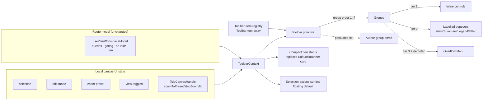
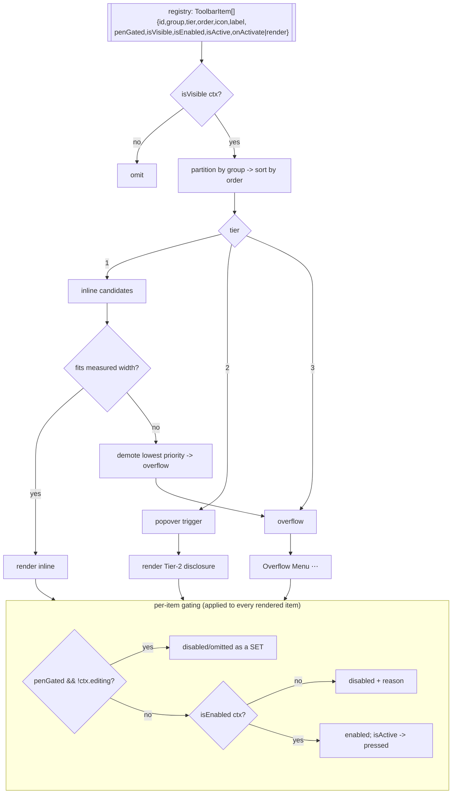
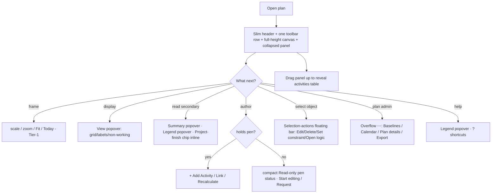

# Feature Spec: Canvas-maximal chrome reclaim + a future-proof Toolbar architecture

- **Status:** Draft (awaiting approval)
- **Author(s):** Feature Analyst (Claude Code)
- **Date:** 2026-07-13
- **Tracking issue / epic:** #TBD
- **Roadmap link:** TSLD / plan workspace (refines ADR-0030 canvas-first workspace)
- **Related ADR(s):** ADR-0030 (canvas-first workspace), ADR-0029 (app-shell), ADR-0026
  (TSLD canvas + parallel a11y layer), ADR-0028 (plan edit-lock "pen"), ADR-0004
  (frontend state), ADR-0006 (tokens/shadcn/CVA). **This change is architecturally
  significant → a NEW ADR is required** (toolbar-item registry + command taxonomy +
  pen-gated toolbar — see §4).

> Scope note: this is a **frontend UX + frontend-architecture** change. No backend,
> database, API, or auth changes. Route behaviour continues to be sourced from
> `usePlanWorkspaceModel`; the new work adds a layout/chrome layer and a toolbar
> command layer on top of it, behind a **new** `VITE_*` flag.

---

## 1. Business understanding

### Problem

The canvas-first plan workspace shipped default-on in web 0.16.0 (ADR-0030), but on
the plan surface the TSLD canvas — the flagship editing tool and the whole point of
the "canvas-first" decision — is still boxed in by **~7 always-on chrome bands**
stacked above it:

1. Breadcrumb trail (`Breadcrumbs`)
2. Title + status row (`<h1>` + status) with Recalculate + `⋯`
3. The full edit-lock **banner card** (`EditLockBanner`, a bordered padded block)
4. The schedule-summary strip (`ScheduleSummaryStrip`, a bordered `p-4` card)
5. An instructional hint line inside `TsldPanel` ("Drag a bar to move it…")
6. The toolbar row (`TsldToolbar` editing tools + `TsldViewControls` zoom/fit/toggles
   - a "Keyboard shortcuts" button) — itself two-to-three wrapped rows
7. The legend row (the `LEGEND` list)

Measured on a typical laptop viewport the canvas gets **roughly a third of the height**;
the rest is secondary information that a planner reads occasionally, not every second.
The canvas must be **the star — as large as possible** — with secondary information
pulled in on demand.

Separately, the toolbar today is an ad-hoc pair of components (`TsldToolbar` = a
two-button mode switch + Auto-arrange; `TsldViewControls` = zoom/fit/toggles) plus a
loose "Keyboard shortcuts" button and a header-level Recalculate/`⋯`. There is **no
single command surface and no extension seam**: every new capability (view-mode switch,
filters, undo/redo, object actions, export, milestones) would bolt on another bespoke
control and another wrapped row. The workspace needs a **toolbar that is the canvas's
command surface and can absorb the CPM/GPM feature set over the product's life without
re-growing the chrome problem** — this is the priority ask.

**Why now:** the canvas-first layout is live and the next wave of TSLD capabilities
(view-mode lenses, filters, object actions, history) is on the roadmap. Getting the
toolbar architecture right _before_ those land avoids re-working each one, and the
chrome-reclaim is the visible payoff that makes the canvas usable at full height.

### Users

Organisation members on the plan surface (roles per ADR-0012 / ADR-0016):

- **Planner / Org Admin** — the primary author. Draws activities, links logic,
  repositions, recalculates, manages baselines/calendar, needs the authoring commands
  fast and the canvas large. Editing is additionally gated by holding the **pen**
  (ADR-0028).
- **Contributor** — may report progress; reads the diagram; limited authoring.
- **Viewer / External Guest** — read-only. Needs the frame/lens/help commands (zoom,
  fit, view toggles, legend, shortcuts) but never the authoring commands, and must see
  one coherent read-only state, not a large "you can't edit" banner eating the canvas.

Everyone benefits from the height reclaim; keyboard and assistive-technology (AT) users
must retain full parity via the ADR-0026 parallel focusable layer and an APG-conformant
toolbar.

### Primary use cases

1. **Open a plan and see a large canvas** — one slim header line + one toolbar row, the
   canvas fills the rest, the activities table collapsed by default.
2. **Run the per-edit loop from the toolbar** — pick scale, zoom/fit, toggle layers, add
   an activity, recalculate — without leaving the canvas or scrolling.
3. **Reach secondary info on demand** — schedule summary, legend, grid/label toggles,
   read-only note, plan actions — via labelled popovers or the overflow `⋯`.
4. **Act on a selected object** — with an activity/link selected, edit/delete/set a
   constraint/open logic from a contextual affordance.
5. **Add a new command later** by registering one declarative item — no toolbar surgery.
6. **Work read-only or without the pen** and see a single, quiet, announced state.

### User journeys

**Happy path (Planner, holds pen).** Planner opens a plan → sees the slim header
(breadcrumb · title · status · pen status "Editing" · `⋯`) and one toolbar row
(scale · zoom · Fit · Today · view-mode · `View▾` · `+ Add Activity` · Recalculate ·
Project-finish chip · `⋯`), canvas filling the height, activities collapsed → clicks
`+ Add Activity`, drags on the canvas, names it → clicks Recalculate → pulls the
activities panel up to check a row → collapses it again. Never scrolls chrome.

**Read-only (Viewer).** Opens a plan → identical layout minus the authoring group and
the pen action; a compact "Read-only" pen status where the big banner used to be → uses
scale/zoom/Fit/`View▾`/`Legend▾`/`?` freely.

**Reclaim-on-demand.** Any user clicks `Summary▾` to read data date / project finish /
counts; `Legend▾` to read the key; `View▾` to flip grid/labels/non-working; `⋯` for
Baselines / Calendar / Plan details / Export. Project-finish stays visible inline as a
single chip so the headline number is never a click away.

**Selection-contextual (default = floating).** Planner selects a bar → a small floating
toolbar appears next to it with Edit · Delete · Set constraint · Open logic → acts →
floating toolbar dismisses on deselect. (Fork 2 — see Open questions.)

See the user-flow diagram in §4.

### Expected outcomes

- The canvas occupies the **large majority** of the workspace height (target: canvas ≥
  ~70% of workspace body height at ≥ `md` with the activities panel collapsed, vs ~⅓
  today).
- **One** header line and **one** toolbar row replace the 7 bands; everything reclaimed
  is reachable in ≤ 1 interaction (a labelled popover or the overflow).
- A **declarative toolbar-item registry** exists such that adding a command is
  registering one item — proven by porting every current control onto it and adding at
  least one _reserved_ item (e.g. the view-mode switch slot) with zero `<Toolbar>` edits.
- The pen read-only vs editing distinction is one coherent, announced toolbar state, not
  a large banner card.
- No capability regresses; `main` stays releasable (flag-gated, default-off during build).

### Success criteria

- **Height:** with the activities panel collapsed at ≥ `md`, the canvas element's height
  is ≥ 70% of the workspace body height (asserted in an e2e/measurement test).
- **Chrome:** the always-on chrome above the canvas is exactly two rows (header + toolbar)
  plus the collapsed-panel bar; every former band is reachable via a labelled control.
- **Extensibility:** a documented "add a command" recipe; the registry + `<Toolbar>` carry
  ≥ 3 tiers, the 7 groups, responsive overflow, and pen-gating, with unit tests over the
  rendering/gating/overflow logic.
- **A11y:** WCAG 2.2 AA — the toolbar is a conformant APG `toolbar` (roving tabindex,
  arrow/Home/End), popovers/overflow are keyboard-operable with correct focus return, the
  pen state is announced via a live region, and the ADR-0026 parallel canvas layer is
  untouched. axe checks in the Playwright journey pass with zero violations.
- **No regression:** every ADR-0030 capability (Recalculate, summary, pen hand-off,
  calendar, baselines, edit, activities table, view toggles, legend, shortcuts, responsive
  toggle) remains reachable and accessible with the new flag on.

### Open questions

Only the **critical** ones are listed (each with a recommended default the product owner
confirms at approval). Everything else has a stated default in-line and is not blocking.

- **CRITICAL — Fork 1: Tool-modes (Select/Link) scope.** Do we build Select + Link as
  first-class _canvas modes_ now, or reserve the Tools mode group and keep **Link a plain
  button** in v1? **Recommended default: RESERVE** the Tools mode group in the
  registry/taxonomy and keep Link a plain button in v1 (lowest risk; today's gesture-based
  link-draw already exists on the canvas, and the registry can promote Link to a mode later
  without a taxonomy change).
- **CRITICAL — Fork 2: Selection-actions placement.** A small **floating toolbar** next to
  the selection, or a **contextual segment inside the main toolbar**? **Recommended
  default: FLOATING toolbar** (keeps the main bar's layout stable and the item order
  predictable; the floating bar is a thin consumer of the same registry item definitions).
- **CRITICAL — View-mode question: one canvas or lens #1 of several.** Is the TSLD _the_
  canvas, or **lens #1** of several (Gantt / Network later)? **Recommended default:**
  treat TSLD as **lens #1** and **reserve the view-mode switch slot** in group 2 regardless
  — render it today as a single-option (or disabled) segmented control so adding Gantt/
  Network later is registering options, not re-architecting the toolbar.
- _(Non-critical, default stated)_ Recalculate tier — **default: Tier-1** (it's the
  per-edit-loop action ADR-0030 keeps in the bar). Undo/redo — **default: reserve** the
  History group; render nothing until the undo stack exists. `Summary▾` vs always-visible
  summary — **default: Summary▾ popover** with the Project-finish chip pinned Tier-1.
  Toolbar state (zoom/toggles) storage — **default: local React state** as today (not URL),
  per ADR-0004 and the existing TSLD decision.

## 2. Functional requirements

### User stories & acceptance criteria

> **US-1 (chrome reclaim)** — As any member, I want the plan workspace to show the canvas
> as large as possible, so I can see and work the diagram without scrolling chrome.
>
> - **Given** the new flag is on and the activities panel is collapsed at ≥ `md`
>   **when** I open a plan **then** above the canvas there are exactly **two** rows — a
>   slim one-line header and one toolbar row — and the canvas fills all remaining height.
> - **Given** the workspace **when** it renders **then** the activities bottom panel is
>   **collapsed by default** (drag up / expand to show the table), reusing
>   `activity-bottom-panel.tsx` + `use-activity-panel-prefs.ts`.
> - **Given** the summary strip has moved into a popover **then** **Project finish** is
>   still visible inline as a single chip (product-owner decision #1).

> **US-2 (toolbar as a command surface)** — As a planner, I want one toolbar that holds
> the canvas's commands grouped and prioritised, so the common actions are one click and
> the rest are one disclosure away.
>
> - **Given** the toolbar **when** it renders **then** commands appear in the fixed
>   left→right group order (Frame → Lens → Find → Author → Plan → History → Help) with
>   Tier-1 items inline, Tier-2 as labelled popovers (`View▾`, `Summary▾`, `Legend▾`,
>   `Filter▾`), and Tier-3 in the overflow `⋯`.
> - **Given** the viewport narrows **when** Tier-1 items no longer fit **then** the
>   lowest-priority items demote into the overflow (by tier then `order`) with no loss of
>   reachability, and no horizontal scrollbar appears.

> **US-3 (declarative extension)** — As an engineer, I want to add a command by
> registering one declarative item, so new capabilities don't re-grow the chrome or touch
> `<Toolbar>`.
>
> - **Given** the registry **when** I add one `ToolbarItem` (`{ id, group, tier, order,
icon, label, penGated, isVisible, isEnabled, isActive, onActivate|render }`) **then**
>   it appears in the right group/tier/order, is gated correctly, and participates in
>   overflow — **without** editing `<Toolbar>`.
> - **Given** a _reserved_ item (e.g. the view-mode slot, or a `Filter▾` stub) **when** it
>   is registered **then** it renders its reserved affordance (disabled/placeholder) and
>   is trivially promotable later.

> **US-4 (pen-gated authoring as a set)** — As a planner, I want the authoring commands to
> switch on/off as one coherent state with a compact pen status, so read-only vs editing is
> obvious and doesn't cost canvas height.
>
> - **Given** I hold the pen (or role-only editing when the pen layer is off) **when** the
>   toolbar renders **then** the Author group (`+ Add Activity`, Link, milestone,
>   auto-arrange) is enabled and a compact **Editing** status shows in the header/toolbar.
> - **Given** I do not hold the pen / am read-only **then** the Author group is disabled or
>   hidden as a set, the big `EditLockBanner` card is replaced by a compact pen-status
>   control, and the state is announced via a live region (WCAG 4.1.3) — no capability of
>   the ADR-0028 hand-off (Start/Stop/Request/Take-over/Override/Keep/Dismiss, incoming
>   request, lost-control) is lost.

> **US-5 (selection-contextual actions)** — As a planner, I want to act on a selected bar
> or link, so I can edit/delete/set-constraint/open-logic in place.
>
> - **Given** an activity or link is selected **when** the selection-actions surface
>   appears (default: floating next to the selection) **then** it offers Edit, Delete, Set
>   constraint, Open logic — each pen-gated and driven by the same registry item defs — and
>   is fully keyboard-reachable with focus return on dismiss.
> - **Given** nothing is selected **then** no selection-actions surface is shown.

> **US-6 (no regression, flag-gated)** — As the team, I want the change behind a new flag
> with the legacy stacked page untouched, so `main` stays releasable.
>
> - **Given** the new flag is **off** **then** the current ADR-0030 workspace renders
>   byte-for-byte, and `VITE_CANVAS_WORKSPACE=false` still yields the legacy stacked page.
> - **Given** the new flag is **on** **then** every prior capability is reachable and the
>   route behaviour is unchanged (still sourced from `usePlanWorkspaceModel`).

### Workflows

1. **Render.** Route resolves `usePlanWorkspaceModel` → builds a `ToolbarContext`
   (selection, mode, editing/pen, view toggles, zoom preset, project-finish, command
   callbacks) → the toolbar-item **registry** produces items → `<Toolbar>` partitions them
   by group/tier, measures available width, demotes overflow, gates by pen/enable/visible,
   and renders. The header renders breadcrumb + title + status + compact pen status + `⋯`.
2. **Command activate.** A Tier-1 button/segment calls `onActivate(ctx)` → maps to an
   existing seam (imperative `TsldCanvasHandle` for zoom/fit; `setViewToggles`;
   `setMode`; `model.onTsld*`; `model.setEditing`; Recalculate; dialogs).
3. **Disclosure.** A Tier-2 item opens a labelled popover (built on the `Menu`/`Dialog`
   primitives or a small popover) hosting the reclaimed content (view toggles, summary,
   legend, filters). A Tier-3 item lives in the overflow `Menu`.
4. **Pen transition.** Pen state changes → the compact pen status updates and is announced;
   Author group enabled/disabled as a set; transient prompts (incoming request, lost
   control) surface without stealing focus.
5. **Selection.** Canvas/listbox selection changes → `ToolbarContext.selection` updates →
   selection-actions surface (floating default) shows/hides.

### Edge cases

- **Empty plan / not calculated:** no diagram → Frame/Lens/Author view-affecting items are
  disabled with an explanatory state (mirrors today's "Recalculate to plot…" copy); the
  toolbar still renders help/plan actions.
- **Very narrow viewport (< `md`):** the existing Diagram/Activities `radiogroup` toggle
  is retained; the toolbar collapses aggressively to overflow — Tier-1 keeps only
  scale + `+ Add Activity` (when editing) + `⋯`.
- **Many commands / future growth:** overflow must handle N items deterministically
  (stable order, no layout thrash) — validated with a synthetic large registry in tests.
- **Pen lost mid-edit:** Author group disables as a set immediately; the lost-control event
  is announced and surfaced (ADR-0028), never silently dropped.
- **Selection deleted elsewhere (refetch):** selection reconciles (existing `TsldPanel`
  logic); the selection-actions surface dismisses or re-targets the survivor.
- **Popover + canvas focus interplay:** opening a popover must not disturb the canvas
  viewport or the parallel listbox's `aria-activedescendant`; focus returns to the trigger
  on close.
- **Reduced motion / theme:** popovers and the floating bar honour tokens + reduced-motion.

### Permissions

No new permissions. The toolbar **reflects** existing gating from `usePlanWorkspaceModel`:

- Author group + selection author-actions require `canEditSchedule` (role `PLANNER`/
  `ORG_ADMIN` **and** holding the pen when the pen layer is on — ADR-0028) — deny-by-default.
- Recalculate requires `canRecalc`; Baselines/Calendar/Edit require `canWrite`
  (role-only). Frame/Lens/Find/Help/Summary/Legend are available to all readers.
- Gating is data-driven per item via `penGated` + `isEnabled(ctx)`; the toolbar never
  re-derives a rule — it consumes the model's capability flags (anti-drift).

### Validation rules

Pure presentation change — no form/domain validation added. Registry-item invariants
enforced by the type system + a dev-time assertion: unique `id`, a `group`/`tier`, a
non-empty `label` (the a11y name, required even for icon-only items), and exactly one of
`onActivate` / `render`.

### Error scenarios

| Scenario                                              | Detection                             | User-facing result                                                                 | Status  |
| ----------------------------------------------------- | ------------------------------------- | ---------------------------------------------------------------------------------- | ------- |
| Command activated without capability (race: pen lost) | `isEnabled(ctx)` false at activate    | no-op; announced pen state; existing 423/409 conflict path if it slips through     | 423/409 |
| Popover content query fails (e.g. summary)            | the child component's own error state | inline "Couldn't load…" + retry (reuse existing `ScheduleSummaryStrip` states)     | —       |
| Duplicate/invalid registry item                       | dev assertion at build/registration   | throws in dev, logged; item omitted in prod (fail-safe, never blank the whole bar) | —       |
| Overflow can't fit even Tier-1                        | measured width < min                  | everything collapses into `⋯`; `⋯` always reachable                                | —       |

## 3. Technical analysis

| Area           | Impact   | Notes                                                                                                                                                                                                                                                                                          |
| -------------- | -------- | ---------------------------------------------------------------------------------------------------------------------------------------------------------------------------------------------------------------------------------------------------------------------------------------------- |
| Frontend       | **high** | New `Toolbar` primitive + toolbar-item registry + `ToolbarContext`; refactor `PlanWorkspace`/`PlanHeaderBar` header; re-home `TsldToolbar`/`TsldViewControls`/legend/summary/pen into registry items + popovers; compact pen-status control; selection-actions surface. Behind a **new flag**. |
| Backend        | none     | No modules/services/endpoints change.                                                                                                                                                                                                                                                          |
| Database       | none     | No schema/migrations.                                                                                                                                                                                                                                                                          |
| API            | none     | No endpoints/contracts/OpenAPI change.                                                                                                                                                                                                                                                         |
| Security       | low      | No new authZ; toolbar reflects existing gating (deny-by-default preserved). No new inputs/secrets.                                                                                                                                                                                             |
| Performance    | med      | Toolbar re-renders on selection/mode/pen/view changes; must not re-render the canvas or re-run `describeActivity` (see the ADR-0030 memoisation note). Overflow measurement via one `ResizeObserver`; item lists memoised; avoid per-frame work.                                               |
| Infrastructure | low      | One new `VITE_*` flag in `apps/web/src/config/env.ts` (default-off during build). No CI/container change beyond the flag-on e2e project (mirror `test:e2e:workspace`).                                                                                                                         |
| Observability  | low      | No new server logs/metrics. Optional lightweight client telemetry out of scope.                                                                                                                                                                                                                |
| Testing        | high     | Unit (registry partition/gating/overflow, pen-gating, context mapping), component (Toolbar a11y roving tabindex, popovers focus return, compact pen control), e2e/a11y (Playwright flag-on journey: height assertion, command reachability, keyboard nav, axe).                                |

### Dependencies

- **Prerequisite (already met):** ADR-0030 workspace, `usePlanWorkspaceModel`,
  `PanelResizer` + `useActivityPanelPrefs` (panel collapse/resize), `Menu`/`Dialog`
  primitives, `useMediaQuery`, the `TsldCanvasHandle` imperative seam
  (`zoomToPreset`/`stepZoom`/`fitSignal`), the ADR-0026 parallel listbox, ADR-0028 pen
  (`usePlanPen`, `EditLockBanner`, `resolveLockView`, `EditLockControls`).
- **Must land first (within this work):** the Toolbar architecture (registry + `<Toolbar>`
  - context + pen-gating) before the chrome-reclaim consumes it — deliverable **A builds on
    B** (see the plan's sequencing).
- **Reuse, don't reinvent:** zoom/fit/toggle math (IC-\* view controls), the legend data,
  the summary strip, the pen view resolution, and the collapse/resize behaviour are lifted,
  not rewritten.
- **ADR required** (architecturally significant): the toolbar-item registry contract, the
  command-group taxonomy, the tier model, and pen-gated-toolbar semantics. Draft outline in
  §4. **ui-architect** should co-author it before build.

## 4. Solution design

### Architecture overview

A **declarative toolbar-item registry** feeds a single **`<Toolbar>`** primitive that
renders groups → tiers → overflow and gates items, driven by a **`ToolbarContext`** built
from `usePlanWorkspaceModel` + local canvas UI state. Commands are _data_; `<Toolbar>` is
generic. The plan workspace composes: a slim **header** (identity + compact pen status +
`⋯`), the **`<Toolbar>`**, then the **canvas** (fill) over the **collapsed-by-default
activities panel**.



### Registry → groups → tiers → overflow (rendering + pen-gated state)



### Command-group taxonomy (fixed left→right order) and tier map

| #   | Group                         | Items (v1)                                                                       | Tier                                                                         | Notes                                                                                                             |
| --- | ----------------------------- | -------------------------------------------------------------------------------- | ---------------------------------------------------------------------------- | ----------------------------------------------------------------------------------------------------------------- |
| 1   | **Frame / navigate**          | Scale presets (Day…Year, segmented); Zoom −/+; Fit; Today; Jump-to-date          | T1 scale/zoom/Fit/Today; T2 Jump-to-date (reserve)                           | Reuses `TsldViewControls` zoom math + `TsldCanvasHandle`.                                                         |
| 2   | **Lens / display**            | `View▾` (grid/label/non-working toggles); **view-mode switch slot** (TSLD today) | T2 `View▾`; **T1 view-mode slot (reserved)**                                 | View-mode is a segmented radiogroup rendered single-option/disabled until Gantt/Network exist.                    |
| 3   | **Find / focus**              | `Filter▾`, Critical-only, Isolate-chain                                          | T2 `Filter▾` (**reserve**)                                                   | Registered as reserved stubs; promotable without taxonomy change.                                                 |
| 4   | **Tools / author** (penGated) | **+ Add Activity** (primary); Link; Milestone; Auto-arrange                      | T1 Add Activity; T1 Link (button, v1 — Fork 1); T2/T3 milestone/auto-arrange | Whole group flips with the pen. Add Activity = `setMode('add-activity')`; Link stays a button per Fork-1 default. |
| 5   | **Object / plan actions**     | Recalculate; Baselines; Calendar; Plan details; Export                           | T1 Recalculate (default); T3 Baselines/Calendar/Plan details/Export(reserve) | Baselines/Calendar/Plan details migrate from today's `PlanActionsMenu` into the toolbar overflow.                 |
| 6   | **History / status**          | Undo/redo; save/pen status                                                       | **reserve** undo/redo; T1 pen status                                         | Undo/redo render nothing until the stack exists.                                                                  |
| 7   | **Help**                      | Keyboard shortcuts; `Legend▾`                                                    | T3 shortcuts (`?`); T2 `Legend▾`                                             | Legend content lifted from `TsldPanel`'s `LEGEND`.                                                                |
| —   | **Project-finish chip**       | project finish value                                                             | **T1 pinned**                                                                | Product-owner decision #1 — always visible even though `Summary▾` holds the rest.                                 |

**Three prominence tiers.** Tier-1 always-visible: scale, zoom, Fit, Today, view-mode
switch, `+ Add Activity`, Recalculate, Project-finish chip, pen status. Tier-2 labelled
popovers: `Filter▾`, `View▾`, `Summary▾`, `Legend▾`. Tier-3 overflow `⋯`: Baselines,
Calendar, Plan details, Export, shortcuts, and any demoted items.

### Data flow (command activate)

```mermaid
sequenceDiagram
  participant U as User
  participant TB as Toolbar item
  participant CTX as ToolbarContext
  participant Seam as Existing seam
  participant Canvas as TsldCanvas / model
  U->>TB: click "Fit" (Tier-1)
  TB->>CTX: onActivate(ctx)
  CTX->>Seam: ctx.canvas.fit()  %% setFitSignal / TsldCanvasHandle
  Seam->>Canvas: re-fit viewport
  Note over TB,Canvas: Same pattern for zoom (zoomToPreset), toggles (setViewToggles),<br/>Add Activity (setMode), Recalculate (model), dialogs (Baselines/Calendar).
  U->>TB: click "+ Add Activity" while pen NOT held
  TB->>CTX: isEnabled(ctx) == false (penGated set off)
  CTX-->>U: no-op; pen state announced (live region)
```

### User flow



### Database changes

None.

### API changes

None.

### Component changes

New (all frontend, design-system tokens only, no one-off styling):

- **`components/ui/toolbar/`** — the generic primitive:
  - `Toolbar.tsx` — `role="toolbar"` (APG), roving tabindex, Arrow/Home/End, groups as
    `role="group"` with `aria-label`, responsive overflow via one `ResizeObserver`.
  - `toolbar-registry.ts` — `ToolbarItem`, `ToolbarGroup`, `ToolbarTier`,
    `ToolbarContext` types + a `defineToolbar(items)` helper + dev-time invariant checks.
  - `ToolbarOverflow.tsx` — Tier-3/demoted items in the shared `Menu`.
  - `ToolbarPopover.tsx` — the Tier-2 labelled disclosure (built on existing primitives).
- **`features/tsld/toolbar/`** — the TSLD command set: the registry array wiring group 1–7
  items to existing seams; `useToolbarContext(model, canvasHandle, uiState)`.
- **Compact pen status** — a small control reusing `resolveLockView` + `EditLockControls`
  internals so the full ADR-0028 hand-off remains reachable without the big banner card
  (transient request/lost-control still announced + surfaced).
- **Selection-actions surface** — floating (default, Fork 2) bar of registry-driven object
  actions.
- **Popover bodies** — `View▾` (from `TsldViewControls` toggles), `Summary▾` (wraps
  `ScheduleSummaryStrip`), `Legend▾` (from `TsldPanel` `LEGEND`), `Filter▾` (reserved stub).

Changed:

- `plan-workspace.tsx` / `PlanHeaderBar` — collapse the 7 bands into header + `<Toolbar>`;
  activities panel **collapsed by default** on this surface; canvas fills the rest. Behind
  the new flag; the ADR-0030 layout stays as the flag-off path.
- `TsldPanel.tsx` — stop rendering its own hint line / `TsldToolbar` / `TsldViewControls` /
  legend when hosted in the new workspace (or accept a `chromeless` prop); the canvas +
  parallel listbox + conflict banner stay.

States to cover per component: loading (summary/query), empty (not-calculated), error
(query failure inline), read-only (pen), disabled (capability), active (toggle/segment).

### Implementation approach & alternatives

**Chosen:** a **generic registry-driven `<Toolbar>` primitive** + a **TSLD command
registry**, landed **before** the chrome-reclaim which then consumes it. The toolbar is
the durable architecture; the reclaim is the visible payoff. Both flag-gated (new
`VITE_*`), default-off during build, flip on when a11y/e2e/perf gates are green — exactly
how `VITE_CANVAS_WORKSPACE`/`VITE_TSLD_EDITING` rolled out. Route behaviour stays in
`usePlanWorkspaceModel`; the flag chooses layout/chrome only.

**Alternatives considered:**

- _Keep bespoke per-feature controls_ (today) — rejected: every new capability re-grows the
  chrome and duplicates gating/overflow/a11y logic; no extension seam.
- _Config-file/JSON-schema toolbar_ — rejected: commands need typed React callbacks and
  predicates; a typed `ToolbarItem[]` registry is safer and simpler than a serialised DSL.
- _A headless toolbar library_ — rejected per CLAUDE.md §2 (no new dep); the house owns its
  APG primitives (Menu/Dialog/PanelResizer already hand-rolled).
- _Chrome-reclaim first, toolbar later_ — rejected: it would build throwaway bespoke
  controls and re-do the a11y work; A must build on B.
- _Selection actions inside the main bar_ — the Fork-2 alternative; deferred to the product
  owner (default: floating).

**ADR (required) — outline.** _"ADR-00XX: TSLD toolbar-item registry, command taxonomy &
pen-gated toolbar."_ Context: chrome pressure + no command-surface extension seam. Decision:
declarative `ToolbarItem` registry + generic APG `<Toolbar>`; fixed 7-group taxonomy; 3
prominence tiers with responsive overflow; pen-gating as a first-class group state
(ADR-0028); selection-contextual actions from the same registry; TSLD as lens #1 with a
reserved view-mode slot. Options: bespoke controls / serialised DSL / headless lib / this.
Trade-offs: one indirection layer + a measurement pass vs. long-term extensibility and a
single a11y implementation. Consequences: adding a command = registering an item; the
`PlanActionsMenu` overflow is absorbed; ui-architect owns the registry contract.

## 5. Links

- Implementation plan: `docs/plans/canvas-toolbar-architecture.md`
- ADR to write: `docs/adr/00XX-tsld-toolbar-registry-and-taxonomy.md` (co-author: ui-architect)
- Related docs to update on build: `docs/FRONTEND_ARCHITECTURE.md`,
  `docs/DESIGN_SYSTEM.md` / `docs/COMPONENT_LIBRARY.md` (Toolbar primitive + "add a command"
  recipe), `docs/UX_STANDARDS.md` (toolbar/overflow pattern), ADR-0030 (note the refinement),
  `apps/web/src/config/env.ts` (new flag), `CLAUDE.md` §16 (new ADR).
