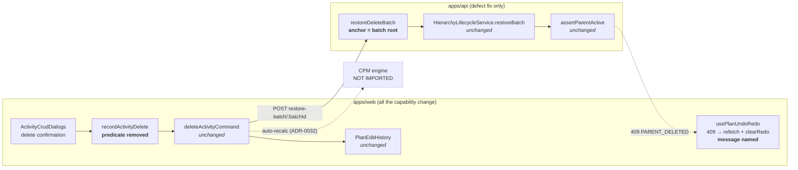
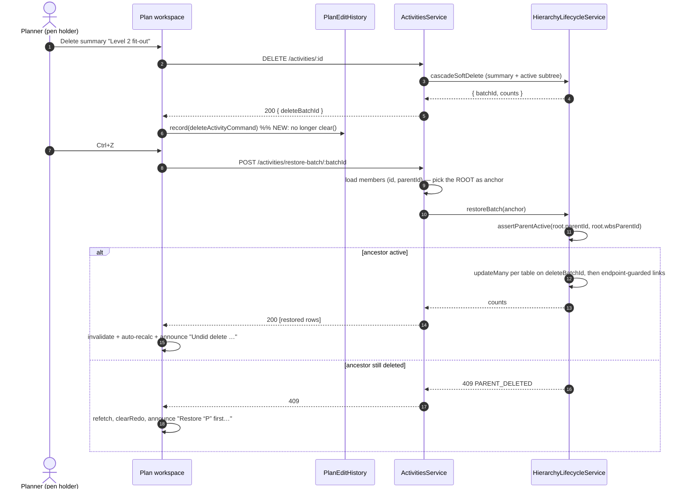
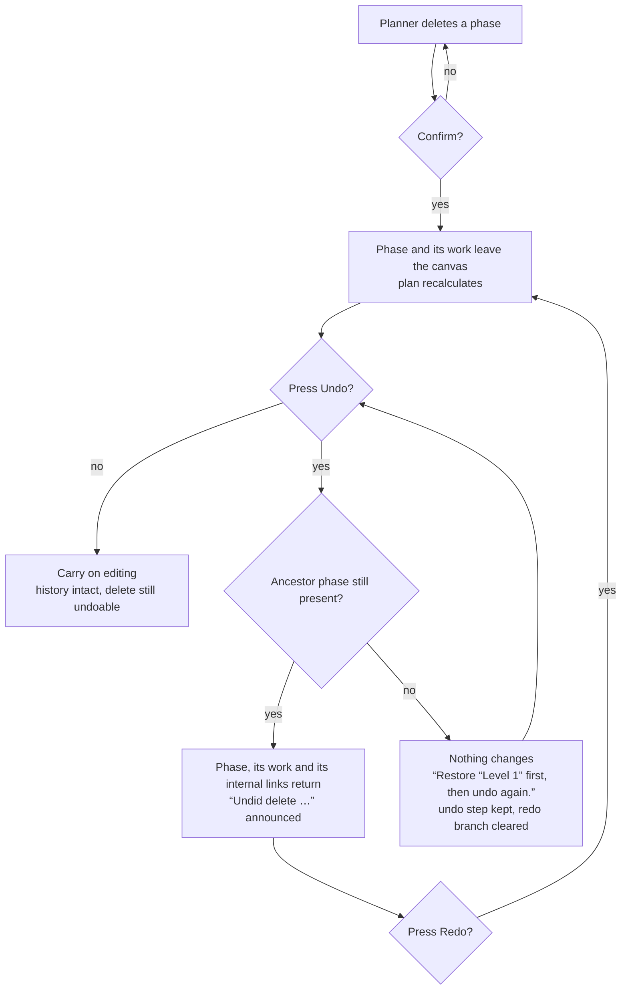

# Feature Spec: Undoing a phase delete

- **Status:** Draft — awaiting approval
- **Author(s):** feature-analyst
- **Date:** 2026-09-01
- **Tracking issue / epic:** `docs/TECH_DEBT.md` #230 (raised 2026-08-31, closing #92)
- **Roadmap link:** none — debt paydown against an accepted-but-deferred ADR clause
- **Related ADR(s):** ADR-0048 (amended by this work), ADR-0038, ADR-0080 CQ-4, ADR-0028, ADR-0034, ADR-0105

---

## 0. Problem re-verification (CLAUDE.md §19, ADR-0058)

The register row is dated 2026-08-31 and the repository's recorded failure mode is a problem
somebody has since fixed while the document kept complaining. **Every load-bearing claim in #230
was re-checked against the code before this spec was written.** All four hold. Three things the row
did not know are recorded here, because two of them change what gets built and one changes what the
ADR amendment says.

### What the row claims, and what established it

| #230 claims                                                        | Verified by                                                                                                                                                                                         | Verdict                                            |
| ------------------------------------------------------------------ | --------------------------------------------------------------------------------------------------------------------------------------------------------------------------------------------------- | -------------------------------------------------- |
| A cascade delete clears the undo stack                             | `apps/web/src/components/layout/workspace/use-plan-workspace-model.ts:936-954` — `if (activity.type === 'WBS_SUMMARY' && hasSubtree) { editHistory.clear(); return; }`                              | **True, still live**                               |
| That is ADR-0048 M2's decision                                     | `docs/adr/0048-undo-redo-command-stack.md:52-54` (Decision, "Delete-undo") and `:77-79` (Consequences)                                                                                              | **True**                                           |
| A cascade stamps ONE `deleteBatchId` across the subtree            | `apps/api/src/modules/activities/activities.service.ts:1191-1221` calling `lifecycle.cascadeSoftDelete`; the subtree walk is `apps/api/src/common/hierarchy/hierarchy-lifecycle.service.ts:278-302` | **True**                                           |
| `restoreDeleteBatch` restores it in one call, ids and links intact | `activities.service.ts:1385-1445` → `hierarchy-lifecycle.service.ts:489-615` (set-wise `updateMany` per table keyed on `deleteBatchId`) + `:626-654` (endpoint-guarded link restore)                | **True**                                           |
| "The branch that refuses it is the only thing stopping it"         | See **F-2** below                                                                                                                                                                                   | **False in one respect — and that is the finding** |

### F-1 — ADR-0048 already frames the truncation as a deferral, not a rule

The row calls this "reversing a decision an accepted ADR records". The ADR is milder than that, and
the difference decides the amendment's wording. Its Decision clause reads (`:52-54`):

> **Delete-undo.** M1–M2 undo a leaf delete by **re-creating** it (new id, zero backend). Id-stable /
> cascade-clean delete-undo is deferred to an **optional M4**…

and its Consequences (`:77-79`):

> a leaf delete-undo **changes the activity id** until M4; **cascade/WBS delete-undo is not clean**
> until M4 (M2 truncates history past a cascade delete)

Both halves are written "until M4". **M4 has landed** — `restore-batch` exists, and #92 already used
it to close the leaf half of the same sentence. So this work **completes a deferral whose condition
is now met**, rather than overturning a settled position. It is still an amendment and still a
capability change (a planner's history behaves differently), so ADR-0105's trigger still fires and
this spec is still required — but the amendment records a condition being met, which is a materially
different and much cheaper claim to defend.

### F-2 — a cascade batch already reaches `restore-batch` in shipped code, and it is not safe there

`pasteActivitiesCommand`'s non-flat branch (`apps/web/src/features/undo-redo/commands.ts:1087-1114`)
undoes a **band copy** by deleting the clone's summary root — one cascade — and redoes it by calling
`restoreBatch({ deleteBatchId })`. So the very thing #230 proposes to start doing is already done
once, today, on the copy/paste redo path.

Reading how `restoreDeleteBatch` picks its anchor shows why that is not the reassurance it looks
like:

```
apps/api/src/modules/activities/activities.service.ts:1400-1407
  const members = await this.prisma.activity.findMany({
    where: { organizationId: organization.id, planId, deleteBatchId, deletedAt: { not: null } },
    select: { id: true },
  });                                   // ← no orderBy
  const ids = members.map((m) => m.id);
  const anchorId = ids[0];              // ← an arbitrary member of the batch
```

That anchor is then handed to `lifecycle.restoreBatch`, whose **first** act is
`assertParentActive` (`hierarchy-lifecycle.service.ts:495-496`). For an activity,
`loadDeletedRoot` returns the anchor's own WBS parent (`:689-697`) and the guard refuses if that
summary is not active (`:741-750`):

```
if (entity === 'activity' && root.wbsParentId) {
  const summaryActive = await tx.activity.findFirst({
    where: { id: root.wbsParentId, deletedAt: null },
  });
  if (!summaryActive) throw new ConflictError('Restore the parent first.', { reason: PARENT_DELETED });
}
```

In a **cascade** batch every non-root member's `wbsParentId` points at another member of the same
batch, which is still soft-deleted at the moment the guard runs. **So the restore succeeds only when
`ids[0]` happens to be the batch's root, and the query does not ask for that ordering.**

Scope of the hazard, from the same code:

- **Leaf single delete** (#92's path): the batch contains exactly one activity, so the anchor is
  always the root. Safe.
- **Bulk delete**: leaf-only by design (`activities.service.ts:1285-1290` refuses a `WBS_SUMMARY`),
  so each member's `wbsParentId` points at a summary that was _not_ deleted and is active. Safe on
  the common path. (Latently unsafe if that summary was deleted separately first — same fix.)
- **Cascade batch**: unsafe whenever the anchor is not the root. This is the band-copy redo path
  today, and it is the whole of what #230 proposes to add.

**Evidence status, stated honestly (ADR-0076):** the branch is established **by reading**, not by
observing a failure. `SELECT … WHERE …` with no `ORDER BY` has no guaranteed order in PostgreSQL, so
correctness here rests on an ordering the query never requests; I have not run it against a database
and make no claim about how often it currently picks the root. Making it fail deterministically is
M0-T1's job, and the fix is not conditional on the frequency — a guard that passes by luck is not a
guard.

**Nothing anywhere covers it.** `paste-command.test.ts:171-190` asserts the band redo calls
`restoreBatch` with the cascade id — with `restoreBatch` a `vi.fn()`, so the server guard is not in
the picture. `apps/web/e2e-copy-paste/copy-paste.spec.ts:148-172` drives the band **undo** against a
real API and stops there; there is no redo step. The API e2e cases for `restore-batch`
(`apps/api/test/activity-batch-ops.e2e-spec.ts:500+`, `apps/api/test/activities.e2e-spec.ts:645-649`)
are leaf batches only. **No test in this repository has ever restored a cascade batch against a real
database.**

This is why M0 exists and ships first: #230's "it would work with the code that is already there" is
right about the design and wrong about one line of the implementation, and building the capability on
top without fixing it would take a rare, invisible, non-deterministic failure and make it the common
path for the most destructive gesture in the product.

### F-3 — the open question's case is reachable, and only through an unrecorded delete

The row asks what happens to "a subtree whose summary's OWN parent was deleted afterwards", and says
to establish it by reading rather than reasoning.

**What happens today**: a 409 `ConflictError`, `reason: PARENT_DELETED`, message
`"Restore the parent first."` — `hierarchy-lifecycle.service.ts:741-750`, reached from
`restoreBatch:496`. The batch is untouched; the transaction rolls back; nothing is partially
restored.

**Why the case arises at all.** `cascadeSoftDelete` walks only the _active_ subtree
(`hierarchy-lifecycle.service.ts:289`, `where: { parentId: { in: frontier }, deletedAt: null }`), so
deleting ancestor `P` after descendant-summary `A` does **not** sweep `A` into `P`'s batch. `A`'s row
keeps `parentId = P`, and `P` is now deleted.

**Why a LIFO stack mostly prevents it.** Undo is strictly last-in-first-out, so if both deletes are
on the stack the planner must undo `P` first, which reactivates `P`, after which `A`'s restore passes
the guard. The ordering is the protection.

**Why it is nevertheless reachable — the delete path that records nothing.** The activities panel's
table deletes and dissolves directly, with no call to any undo seam:

- `apps/web/src/features/activities/components/ActivitiesTable.tsx:228-229` takes its own
  `useDeleteActivity` / `useDissolveSummary`;
- `:826-841` (`confirmDelete`) and `:843-859` (`confirmDissolve`) call `.mutate` and announce — and
  neither calls `recordActivityDelete` nor `recordDissolveBoundary`, unlike
  `activity-crud-dialogs.tsx:118` and `:166`, which do;
- that table is rendered **inside the plan workspace** (`activity-bottom-panel.tsx:109`), beside the
  canvas whose deletes _are_ recorded.

So a planner can delete summary `A` on the canvas (recorded), delete its parent `P` from the
activities panel one row below (recorded nowhere, and not truncating either), and then press Undo.
That is the case, it is reachable, and it is reachable **today** for every already-recorded command
too — the panel can already delete a row that a stacked command's inverse depends on. This spec does
not fix that hole (see §1 Open questions, CQ-3); it designs so that meeting it is safe and legible.

### F-4 — what is NOT wrong, checked so it is not "fixed"

- The **client conflict contract already handles the 409 safely**:
  `use-plan-undo-redo.ts:99-105` aborts non-destructively (the stacks are not re-popped), refetches
  server truth, clears the stale redo branch and announces. Nothing here needs a new failure mode —
  only better words.
- `deleteActivityCommand` (`commands.ts:388-416`) **needs no change at all**. It already restores by
  batch id and rethreads the batch on redo, and its own docblock (`:383-386`) predicts this work.
- **`delete_batch_id` is indexed** — a partial index `WHERE delete_batch_id IS NOT NULL`, declared as
  raw SQL in the migration and documented at `apps/api/prisma/schema.prisma:577-580`. So the restore's
  set-wise `updateMany`s are index-backed and no schema work is implied.

---

## 1. Business understanding

### Problem

A planner who deletes a **phase** — a WBS summary with the work inside it — loses their entire undo
history at that moment, and cannot undo the delete itself. `Ctrl+Z` does nothing; the Undo control
goes empty; every reversible edit made earlier in the session is gone with it.

This is the most consequential single gesture in the product (`activities.service.ts:1244-1247`
calls it "the most destructive operation"), and it is the one gesture with no way back short of
finding the rows in Recently deleted — which for activities is not a surface a planner has: the
recycle bin covers clients, projects and plans.

The behaviour was correct when it was written. ADR-0048 M2's inverse for a delete was
_re-create-with-a-new-id_, which for a summary could only rebuild the summary — an "undo" that
returns an empty phase and silently drops forty activities and every link between them. Truncating
was the honest answer to that. **The inverse changed underneath it** (ADR-0048 M4 /
`docs/TECH_DEBT.md` #92) and the branch did not.

Why now: #92 closed the leaf half of exactly this sentence and left the cascade half standing one
`if` away; the enabling endpoint has been shipped and in use for months; and F-2 shows the one path
that already exercises it is unguarded, so the cost of leaving this alone is not merely a missing
feature.

### Users

| Role                        | Interest                                                                                                                                                               |
| --------------------------- | ---------------------------------------------------------------------------------------------------------------------------------------------------------------------- |
| **Planner**                 | The subject. Restructures the WBS, deletes and re-groups phases, and is the role that holds the pen (ADR-0028) and therefore the only role that can reach this at all. |
| **Org Admin**               | Same capability as Planner here (both hold `activity:delete` and `activity:restore`, and an Org Admin can take the pen).                                               |
| **Contributor**             | Unaffected — cannot delete an activity, and progress edits are outside the undo model entirely (ADR-0048).                                                             |
| **Viewer / External Guest** | Unaffected — read-only.                                                                                                                                                |

### Primary use cases

1. Delete a phase, see the consequence, press **Undo**, and get the phase back — its activities, its
   nesting, and the links between them — with the rest of the session's history still intact.
2. Delete a phase and carry on editing, then undo several steps back past that delete, as with any
   other edit.
3. Redo the delete after undoing it.

### User journeys

**Happy path.** Planner holds the pen → selects summary "Level 2 fit-out" (11 descendants) → Delete →
confirms → the bars leave the canvas and the plan recalculates → presses `Ctrl+Z` → one
`restore-batch` call returns the summary and all 11 descendants with their original ids, so the
links between them return too → auto-recalculation redraws → "Undid delete “Level 2 fit-out”." is
announced → the Undo control now offers the step _before_ the delete, which is still there.

**Alternate — redo.** From the state above, `Ctrl+Shift+Z` re-deletes exactly what was restored
(`deleteActivityCommand.redo`, ids stable across the restore) and rethreads the new batch id.

**Alternate — the ancestor is gone.** ~~Planner deletes phase `A` on the canvas, then deletes `A`'s
parent phase `P` from the activities panel, then presses Undo. The restore is refused (409
`PARENT_DELETED`)…~~

> **WITHDRAWN 2026-09-02 — this flow was DRIVEN and does not produce a refusal.**
> `apps/web/e2e-undo/undo.spec.ts` performs exactly these steps and both undos succeed. The stack is
> last-in-first-out and a cascade resolves its subtree with `deletedAt: null`
> (`hierarchy-lifecycle.service.ts`, `resolveActivitySubtree`), so deleting `P` after `A` does not
> sweep `A` into `P`'s batch: `P`'s delete is recorded **last** and is therefore undone **first**,
> leaving the parent active before the child's restore runs.
>
> It was reachable when this was written, for the one reason F-3 records — the activities panel
> recorded nothing, so `P`'s delete never entered the stack and Undo popped `A`'s. **Answering CQ-3
> "in scope" closed that route**, which the plan's own M2-T2 risk note predicted. The refusal stays
> reachable across sessions (a stale tab, a pen hand-off, a direct API caller), so its message
> ships and is pinned by a unit case of `handleFailure`; naming the phase is deferred, because the
> client cannot — the 409 carries a reason only, and the ancestor is itself deleted and therefore
> absent from the activity list the client holds.
>
> See §2 US-3, and the ADR-0048 amendment §3.

**Alternate — the pen was taken.** The inverse gets a 423 and the whole history is dropped, exactly
as for every other command (`use-plan-undo-redo.ts:90-98`). Unchanged.

### Expected outcomes

- Deleting a phase becomes a reversible edit rather than a session-history boundary.
- The undo stack stops being silently emptied by an ordinary authoring gesture.
- The band-copy redo path (F-2) stops depending on an unrequested row ordering.
- ADR-0048's Consequences stop describing a limitation the product no longer has.

### Success criteria

1. Deleting a `WBS_SUMMARY` with descendants records exactly one undo step and clears nothing —
   asserted by inverting the existing unit case at
   `use-plan-workspace-model.undo-redo.test.ts:322-327`.
2. Undoing it restores **every** descendant and **every** link that was internal to the subtree —
   asserted end-to-end against a real API by counting activities and dependencies before and after,
   in the manner of `copy-paste.spec.ts:163-168`.
3. A cascade batch restores regardless of which member the service picks as its anchor — asserted by
   a service-level test that hands the members back child-first, verified RED against today's code.
4. A restore whose root's WBS parent is still deleted is refused with a message naming that parent,
   and the undo stack is not popped.
5. No change to `computeSchedule`'s inputs, and no engine import anywhere in the diff.

### Open questions

**Critical — these change design or scope. See the summary at the end of this document.**

- **CQ-1 — the ancestor-gone case: refuse, or restore what it can?** _Default: refuse_, with a
  message naming the phase to restore first. Reasoning in §4.
- **CQ-2 — does the M0 anchor fix ship as its own release, ahead of the capability?**
  _Default: yes._ It is a defect fix on a live path (band-copy redo) with its own e2e, and holding
  it back inside a capability change delays a fix and enlarges the revert.
- **CQ-3 — the activities panel's unrecorded delete/dissolve (F-3): in scope?** _Default: no —
  out of scope, filed._ Making that surface record commands changes a second surface's behaviour and
  needs its own decision (the dissolve half in particular would truncate a history the planner
  currently keeps). The 409 path makes meeting the case safe in the meantime.

**Non-critical — defaults stated, proceeding.**

- Undo step label. _Default:_ leave `deleteActivityCommand`'s existing label builder alone
  (`Delete “Level 2 fit-out”` — the S1 entity-naming convention) and let the confirmation dialog,
  which already states the subtree consequence, carry the size. The `DELETE` route returns only
  `deleteBatchId` (`delete-activity-result.dto.ts:22-37`), so a count in the label would have to be
  derived client-side from the already-loaded list — possible, but a label whose width changes with
  the plan is a poor fit for a control in a fixed row.
- Depth cap. _Default:_ unchanged at 50 steps; a cascade is one step regardless of subtree size.
- Confirmation copy. _Default:_ unchanged. It already warns that the subtree goes.

---

## 2. Functional requirements

### User stories & acceptance criteria

> **US-1** — As a **Planner**, I want to undo deleting a phase, so that a mis-click does not cost me
> the phase and my whole editing history.
>
> **Acceptance criteria**
>
> - **Given** I hold the pen and a summary with at least one descendant, **when** I delete it,
>   **then** exactly one step is recorded on the undo history and no existing step is discarded.
> - **Given** that delete is the last thing I did, **when** I press Undo (toolbar or `Ctrl+Z`),
>   **then** the summary, every descendant and every dependency that had both endpoints inside the
>   subtree are active again, with their original ids.
> - **Given** the undo succeeded, **then** "Undid delete “<name>”." is announced in the shared live
>   region, and the previous step is now the next undo.
> - **Given** the undo succeeded, **when** I press Redo, **then** exactly those rows are deleted
>   again and the new batch is threaded for a further undo.
> - **Given** the plan recalculates after either direction, **then** dates are recomputed by the
>   normal ADR-0032 auto-recalculation and never restored from the command.

> **US-2** — As a **Planner**, I want undoing a bulk or band operation to keep working exactly as it
> does now, so that this change costs me nothing I already have.
>
> **Acceptance criteria**
>
> - **Given** a band copy (paste of a summary + members), **when** I undo and then redo it, **then**
>   the clones come back with their ids and their internal links — regardless of which member the
>   service selects as the batch anchor.
> - **Given** a leaf delete, **then** its recorded command and its inverse are unchanged.
> - **Given** a bulk delete of leaves, **then** its recorded command and its inverse are unchanged.
> - **Given** a **dissolve**, **then** it still truncates the history (see §4, "What does not
>   change").

> **US-3** — As a **Planner**, when an undo cannot be applied because a phase above it has since been
> deleted, I want to be told which phase, so that I know what to do rather than being told the plan
> "changed".
>
> **Acceptance criteria**
>
> - **Given** summary `A` was deleted and then its parent `P` was deleted, **when** I undo `A`'s
>   delete, **then** the API refuses with 409 `PARENT_DELETED` and **nothing is partially restored**.
> - **Given** that refusal, **then** the undo stack is **not** popped, server truth is refetched, the
>   redo branch is cleared, and a message naming `P` is announced.
> - **Given** I then undo again (or restore `P` by another route), **when** I retry, **then** the
>   restore succeeds.

> **US-4** — As a **Planner**, I want my history not to depend on which row a server happened to read
> first.
>
> **Acceptance criteria**
>
> - **Given** any delete batch, **when** it is restored, **then** the row whose parent lies outside
>   the batch is used to evaluate the parent-active guard.
> - **Given** a cascade batch, **then** the restore succeeds for every possible ordering of the
>   members query.

### Workflows

**W1 — record a cascade delete.** Delete succeeds → route returns `{ deleteBatchId }` →
`ActivityCrudDialogs` calls `model.recordActivityDelete(snapshot, deleteBatchId)` → the seam records
`deleteActivityCommand` **regardless of type or subtree** → dialog closes → auto-recalculation.

**W2 — undo it.** `history.undo()` → `deleteActivityCommand.undo` → `POST …/restore-batch/:batchId`
→ 200 with the restored rows → query invalidation redraws → announcement.

**W3 — refusal.** As W2, but the API answers 409 → `handleFailure('undo', err)` → refetch, clear
redo, announce → stacks otherwise intact.

**W4 — anchor selection (server).** `restoreDeleteBatch` loads the batch's members with the fields
needed to identify the batch **root**: the member whose `parentId` is null or is not itself a member
of the batch. That row is the anchor. Everything downstream of `restoreBatch` is unchanged.

### Edge cases

| Case                                                      | Expected behaviour                                                                                                                                                       |
| --------------------------------------------------------- | ------------------------------------------------------------------------------------------------------------------------------------------------------------------------ |
| Summary with **no** descendants                           | Already a leaf-shaped batch; already recorded today (`hasSubtree` is false). Unchanged.                                                                                  |
| Summary whose only descendants are **already deleted**    | Same — the cascade sweeps only active rows (`hierarchy-lifecycle.service.ts:289`), so the batch is the summary alone.                                                    |
| **Nested** summaries inside the deleted subtree           | One batch, one step, one restore. The anchor is the top summary; every other member's parent is inside the batch.                                                        |
| A dependency crossing the subtree **boundary**            | Restored only if both endpoints are live (`restoreLinksInBatch`, `:626-654`). An edge to an activity deleted separately stays deleted — existing, deliberate, unchanged. |
| A name/code inside the subtree **taken** since the delete | 409 `NAME_TAKEN` from the P2002 catch (`:606-612`); same non-destructive client handling as US-3.                                                                        |
| **Very large** subtree (thousands of rows)                | One request; the restore is set-wise `updateMany` keyed on the indexed `delete_batch_id`. Not measured — see §3 Performance.                                             |
| **Redo** after a restore                                  | Versions are bumped by the restore, but `deleteActivityCommand.redo` deletes by **id** and takes no version, so it is unaffected (`commands.ts:408-414`).                |
| Pen lost between delete and undo                          | 423 → whole history cleared, shared pen contract runs. Unchanged.                                                                                                        |
| Plan switch / reload                                      | History is in-memory and per-pen-session. Unchanged.                                                                                                                     |
| `VITE_UNDO_REDO=false`                                    | `recordActivityDelete` returns before any branch (`use-plan-workspace-model.ts:938`). Byte-identical.                                                                    |

### Permissions

Unchanged, and that is the point (ADR-0048: every inverse rides the same gates as a first-class
edit).

| Operation               | Permission         | Scope                                                     | Pen (ADR-0028)                                            |
| ----------------------- | ------------------ | --------------------------------------------------------- | --------------------------------------------------------- |
| Delete a summary        | `activity:delete`  | organisation, plan resolved active in-org (404 otherwise) | required — `assertHoldsPen`, `activities.service.ts:1181` |
| Undo it (restore batch) | `activity:restore` | same                                                      | required — `activities.service.ts:1396`                   |
| Redo it (delete again)  | `activity:delete`  | same                                                      | required                                                  |

Planner and Org Admin hold both; Contributor and Viewer hold neither; External Guest cannot reach
any of it (`SCHEDULE_READ`, ADR-0051). **The client stack cannot escalate**: an inverse is an
ordinary authenticated write, so a stale or forged command is refused by the same deny-by-default
checks. No permission, role, guard or scope changes in this work.

### Validation rules

No new user input. `batchId` is already `ParseUuidPipe`-validated
(`plan-activities.controller.ts:238`), and the batch is looked up scoped to organisation **and**
plan (`activities.service.ts:1400-1401`), so a batch id from another tenant reads as "not here"
rather than as a permission failure. Unchanged.

### Error scenarios

| Scenario                         | Detection            | User-facing result                                                                             | Status |
| -------------------------------- | -------------------- | ---------------------------------------------------------------------------------------------- | ------ |
| Undo without the pen             | `assertHoldsPen`     | lost-control banner; history cleared (single announcement — the banner is its own live region) | 423    |
| Ancestor summary still deleted   | `assertParentActive` | announced message naming the phase to restore first; stacks intact, redo cleared               | 409    |
| Name/code taken since the delete | P2002 → `NAME_TAKEN` | existing conflict copy; stacks intact, redo cleared                                            | 409    |
| Batch id unknown in this plan    | zero members         | existing conflict copy (404 shares the 409 branch)                                             | 404    |
| Caller lacks `activity:restore`  | `assertCan`          | forbidden                                                                                      | 403    |
| Foreign / deleted plan           | `loadActivePlan`     | not found                                                                                      | 404    |

---

## 3. Technical analysis

| Area           | Impact                     | Notes                                                                                                                                                                                                                                                                                                                                                                                                                                |
| -------------- | -------------------------- | ------------------------------------------------------------------------------------------------------------------------------------------------------------------------------------------------------------------------------------------------------------------------------------------------------------------------------------------------------------------------------------------------------------------------------------ |
| Frontend       | **low**                    | One predicate in `recordActivityDelete` (delete ~5 lines); one message constant + its selection in `use-plan-undo-redo.ts`. No new component, route, prop or state.                                                                                                                                                                                                                                                                  |
| Backend        | **low**                    | Anchor selection inside `restoreDeleteBatch` (`activities.service.ts:1400-1407`) — pick the batch **root** instead of `ids[0]`. No new endpoint, no signature change, no DTO change.                                                                                                                                                                                                                                                 |
| Database       | **none**                   | No model, column, index, constraint or migration. `delete_batch_id`'s partial index already exists (`schema.prisma:577-580`), confirmed by reading rather than assumed. **`database-architect` is therefore not engaged, and that is a checked conclusion rather than a skipped step** — CLAUDE.md §19.3's rule binds on there being a schema change, and there is none. If review disagrees, the agent runs before anything merges. |
| API            | **none to the contract**   | Same route, method, status codes and DTOs. One OpenAPI _description_ sentence gains the anchor rule.                                                                                                                                                                                                                                                                                                                                 |
| Security       | **none**                   | No change to authN/Z, scope, validation or audit. The restore already writes `activity.restored` (`activities.service.ts:1415-1427`), so a cascade undo is audited exactly as a leaf undo is. `security-reviewer` still runs (the diff touches an authorised write path).                                                                                                                                                            |
| Performance    | **low, partly unmeasured** | The restore is set-wise `updateMany` per table on the indexed `delete_batch_id`, plus one `findMany`/`updateMany` for links. The anchor change adds two columns to an existing `findMany` and a client-side scan of the member list — no extra round trip. **Not measured at scale**; a 2,000-row cascade restore is a new common path and M0-T3 measures it rather than asserting it.                                               |
| Infrastructure | **none**                   | No service, env var, container or CI step. No new Playwright config (see Testing).                                                                                                                                                                                                                                                                                                                                                   |
| Observability  | **none**                   | Existing `activity delete-batch restored` log line already carries the count.                                                                                                                                                                                                                                                                                                                                                        |
| Testing        | **medium**                 | Unit (client seam + command), service unit (anchor), API e2e (cascade round trip — the first anywhere), Playwright (`e2e-undo`, existing config). Detail below.                                                                                                                                                                                                                                                                      |

### Dependencies

- **Landed, nothing to wait for:** ADR-0048 M4 (`restore-batch`), `docs/TECH_DEBT.md` #113 (the
  `DELETE` route returning its batch id), #92 (the leaf inverse pointed at the restore).
- **Ordering within this work:** M0 (anchor) must precede M1 (the capability). Building M1 first
  would make a non-deterministic failure the common path for the product's most destructive gesture.
- **Affected features:** copy/paste (band redo — improved by M0), bulk delete (unchanged), dissolve
  (unchanged), Recently deleted (untouched: it lists clients/projects/plans, not activities).
- **Not a dependency:** the activities panel's unrecorded delete (F-3). CQ-3 defaults it out of
  scope; the 409 path makes that safe.

---

## 4. Solution design

### Architecture overview



The engine sits behind a dashed edge deliberately: the command layer never calls it. Dates are
recomputed by the existing auto-recalculation after the inverse lands — ADR-0048's
_recompute, don't restore_ rule — so `computeSchedule`'s inputs are unchanged and the ADR-0034
parity gate is untouched **by construction**, not by care.

### Data flow



### User flow



### Database changes

**None.** See §3 for why, and for the note that this is a checked conclusion.

### API changes

**No contract change.** `POST /api/v1/organizations/:orgSlug/plans/:planId/activities/restore-batch/:batchId`
keeps its method, path, 200, request (none) and response (`ActivityResponseDto[]`), and its documented
409 already names `PARENT_DELETED` (`plan-activities.controller.ts:228-232`). Two documentation-only
edits:

1. the `@ApiOperation` description gains a sentence stating that the parent-active guard is evaluated
   against the **batch root**, so a cascade batch restores whole;
2. the 409 description gains that the refusal names the ancestor.

The internal change is confined to `restoreDeleteBatch`:

```
- select: { id: true }                       → select: { id: true, parentId: true }
- const anchorId = ids[0]                    → const anchorId = rootOf(members)
```

where `rootOf` returns the member whose `parentId` is null or not itself in the batch. If several
qualify (possible in principle for a batch assembled differently, e.g. a future multi-root sweep),
any of them is correct — each has an out-of-batch parent, which is exactly what the guard needs to
evaluate. If **none** qualifies the batch is internally inconsistent and the existing
`NotFoundError` path is kept rather than inventing a new failure.

**Why here and not in `assertParentActive`.** The guard is shared by clients, projects, plans,
activities and dependencies, and by the single-row restore route. Teaching it "ignore a parent that
is in the same batch" would weaken the no-orphan invariant for every caller in order to fix one
caller's anchor selection. The defect is that `restoreDeleteBatch` asks the guard about an arbitrary
row when it means to ask about the batch; fixing the question is smaller and safer than widening the
answer. (ADR-0065's rule, applied here: one guard, not a second one that drifts.)

### Component changes

- `use-plan-workspace-model.ts` — delete the `WBS_SUMMARY && hasSubtree` branch and the now-unused
  `hasSubtree` derivation from `recordActivityDelete`; the `activities.data` dependency leaves the
  `useCallback` deps with it. Rewrite the docblock (which currently explains the deferral) to record
  the amendment.
- `use-plan-undo-redo.ts` — add one message for the ancestor case and select it when the 409 carries
  `reason: PARENT_DELETED`. Everything else in `handleFailure` is unchanged: no popping, refetch,
  `clearRedo`, announce.
- **No new component, no new prop, no design-system change, no new state.** The Undo/Redo controls,
  keybindings, live region and announcements are all reused as they stand.

### Implementation approach & alternatives

**Chosen: remove the predicate; fix the anchor first; leave everything else alone.**

The whole capability is the deletion of a branch. That is only true because ADR-0048 M4 built the
right inverse, `deleteActivityCommand` already speaks it, and the DELETE route already returns the
batch id. What the epic really consists of is the _evidence_: a cascade batch has never been
restored against a real database anywhere in this repository, so the work is one predicate and four
tests, one of which is a defect fix that must land first.

**Why this is the ADR-0080 CQ-4 argument, unchanged.** CQ-4 established that a bulk delete's undo is
one id-stable `restore-batch` and never N re-creates, because re-creating restores the bars and
silently loses the links between them. The cascade case is the _same argument with the set defined
by the tree rather than by the selection_ — and it is strictly stronger, for two reasons the bulk
case does not have: a subtree's internal links are dense by construction (a phase is a phase because
its work is linked), and re-creating would also lose the **nesting**, since a re-created summary has
a new id and no child could point at it. So the argument does not merely carry over; the case it was
made for is the weaker one.

**Alternatives considered.**

| Alternative                                                 | Why not                                                                                                                                                                                       |
| ----------------------------------------------------------- | --------------------------------------------------------------------------------------------------------------------------------------------------------------------------------------------- |
| **Keep truncating** (status quo)                            | The stated reason has lapsed. Its cost is a planner losing an entire session's history to one ordinary gesture, and it leaves F-2's live path unexamined.                                     |
| **Re-create the subtree from a client-side snapshot**       | ADR-0080 CQ-4's rejected option. New ids, so every internal link and every parent pointer is lost; an undo that returns a flat pile of activities looks deliberate and is worse than no undo. |
| **Truncate only when the subtree is "large"**               | A threshold with no principle behind it, making reversibility a property of plan shape. A planner cannot predict it, so it is indistinguishable from a defect.                                |
| **Widen `assertParentActive` to ignore same-batch parents** | Weakens a shared invariant for five entity types to fix one caller's anchor selection. See "Why here" above.                                                                                  |
| **Order the members query and take the first**              | Would work only by relying on a chosen ordering encoding tree depth, which nothing maintains. Selecting the root _by its parent_ says what is meant.                                          |
| **A confirmation before undoing a large restore**           | Undo is the safety net; putting a gate in front of it is the wrong direction, and the forward delete is already confirmed.                                                                    |

**CQ-1 — refuse rather than partially restore.** The default is to refuse, for four reasons, in
order of weight:

1. A partial restore is an **undo that half-happened**. The planner asked for a state that existed;
   giving them a different one — a phase minus its parent, floating at the top level or refused by
   the tree invariant — is a new edit wearing an undo's label. The register records that exact
   sentence about a partial dependency edit (`commands.ts:823-826`).
2. Restoring the subtree without its parent would **violate the no-orphan invariant**
   `assertParentActive` exists to hold (ADR-0038's tree is same-plan and acyclic, and a child under a
   deleted parent is neither active nor visible). Fixing that by re-parenting to the top level
   silently discards the planner's structure.
3. Refusing is **already what the server does and already handled safely** by the client
   (`use-plan-undo-redo.ts:99-105`): stacks intact, refetch, redo cleared. The only thing missing is
   words.
4. It is **recoverable in one press**: the ancestor's own delete is either on the stack (undo again)
   or reachable, and after that the retry succeeds. The refusal is a detour, not a dead end.

The accepted cost, stated: a planner who reaches this must perform two actions instead of one, and
the message has to be good enough to say so. That is what US-3's third acceptance criterion is for.

### ADR-0048 amendment — what it should say

An amendment appended to ADR-0048 (never an edit to the accepted text — ADRs are immutable), dated,
and named in the register:

> **Amendment — 2026-09-01: the cascade-delete history truncation is withdrawn; its deferral
> condition has been met.**
>
> This decision's "Delete-undo" clause deferred id-stable, cascade-clean delete-undo to an
> **optional M4**, and its Consequences recorded that "cascade/WBS delete-undo is not clean **until
> M4** (M2 truncates history past a cascade delete)". Both were written as conditions, not as rules.
>
> **M4 has landed.** `POST …/activities/restore-batch/:batchId` (`ActivitiesService.restoreDeleteBatch`
> → `HierarchyLifecycleService.restoreBatch`) restores a whole `deleteBatchId` id-stably with its
> links, and `cascadeSoftDelete` has always stamped one batch id across a summary's entire active
> subtree. `docs/TECH_DEBT.md` #92 already used M4 to close the _leaf_ half of the same sentence and
> left the cascade half standing.
>
> So M2's truncation is withdrawn: a `WBS_SUMMARY` delete records an ordinary `deleteActivityCommand`
> exactly as a leaf does, and the client seam's type/subtree predicate is deleted.
>
> **Four things this amendment states rather than leaves to be inferred.**
>
> 1. **No invariant of this ADR changes.** The stack stays client-side, in-memory, per-plan and
>    per-pen-session, composed from existing REST mutations; every inverse still rides
>    `assertHoldsPen` (423), RBAC, organisation scope and the optimistic `version` (409); the
>    conflict contract is still abort-and-refetch plus clear-redo, with no silent skip, no auto-retry
>    and no merge; the depth cap is still 50, and a cascade is one step whatever its size. **The CPM
>    engine is not imported and the ADR-0034 recalculation parity gate is untouched by construction**
>    — the inverse writes plan inputs and the ADR-0032 auto-recalculation recomputes the outputs.
> 2. **This is ADR-0080 CQ-4, not a new argument.** One id-stable restore, never N re-creates,
>    because re-creating restores the bars and loses the links between them. The cascade case is that
>    argument with the set defined by the tree instead of the selection, and it is the stronger
>    instance: a subtree's internal links are dense by construction, and re-creation would also lose
>    the **nesting**, since a re-created summary has a new id that no child can point at.
> 3. **Dissolve keeps its truncation, and for a different reason than delete had.** M2's reason for
>    truncating a delete was that no id-stable restore existed; M4 removed it. A dissolve is a
>    server-side compound (reparent every child, then soft-delete the summary) with **no inverse
>    composable from the existing mutations at all** — re-creating the summary yields a new id, so
>    "undo" would build a different grouping and leave the original in Recently deleted. That reason
>    is untouched by M4, so `recordDissolveBoundary` stands.
> 4. **The ancestor case is settled: refuse.** A batch whose root's own WBS parent was soft-deleted
>    _after_ the batch was created is **not** restorable, because `cascadeSoftDelete` walks only the
>    active subtree, so the later delete does not absorb the earlier batch. `assertParentActive`
>    answers 409 `PARENT_DELETED`; the batch is untouched and nothing is partially restored. The
>    client keeps the undo step, refetches server truth, clears the redo branch and announces a
>    message naming the phase to restore first. A partial restore was considered and rejected: it
>    would breach the no-orphan invariant ADR-0038 and this guard exist to hold, and would deliver a
>    state the planner never authored — a new edit wearing an undo's label.
>
> **One defect was found while establishing the above, and is fixed as a prerequisite rather than
> inherited.** `restoreDeleteBatch` selected its anchor as `ids[0]` from a members query with no
> `ORDER BY`, and the parent-active guard is evaluated against _that_ row. In a cascade batch every
> non-root member's WBS parent is another member of the same batch, still deleted when the guard
> runs — so the restore was correct only when an unrequested ordering happened to yield the root
> first. It was already reachable on the shipped band-copy redo path
> (`pasteActivitiesCommand.redo`), and no test in the repository had ever restored a cascade batch
> against a real database. The anchor is now the batch **root** — the member whose parent lies
> outside the batch — which is the question the guard was always meant to be asked.

---

## 5. Links

- Implementation plan: [./implementation-plan.md](./implementation-plan.md)
- Register row: `docs/TECH_DEBT.md` #230 (and #92, #113, closed)
- ADRs: `docs/adr/0048-undo-redo-command-stack.md` (amended), ADR-0038, ADR-0080, ADR-0028, ADR-0034
- Docs to update on landing: `docs/adr/0048-…` (amendment), `docs/API.md` (restore-batch anchor
  sentence), `CLAUDE.md` (ADR-0048's register entry), `docs/TESTING.md` if the `e2e-undo` suite's
  scope statement is quoted there

## Product-owner decisions (2026-09-02)

**CQ-1 — a deleted phase whose OWN parent was deleted afterwards: REFUSE, naming the phase.**
Today's behaviour is kept and its message improved. A partial restore would breach ADR-0038's
no-orphan invariant and hand back a shape nobody authored — some activities returned, some not,
with nothing on screen saying which.

**CQ-2 — ship the anchor fix as its own release first: YES** (the stated default, taken). It has a
live user path today through band-copy redo, it is a small self-contained correction, and releasing
it separately keeps the two diffs reviewable apart.

**CQ-3 — the activities table's unrecorded delete/dissolve: IN SCOPE.** Against the spec's default.

> **This is the answer that changes the plan, and M2-T2's journey must be re-designed before it is
> built** — the spec named that consequence when it raised the question, so it is not a surprise,
> but it is real work rather than a line. Today `ActivitiesTable.tsx:826-859` deletes and dissolves
> with **no undo seam call at all**, while its dialog sibling (`activity-crud-dialogs.tsx:118`,
> `:166`) records both. So the same action is undoable from one surface and not the other, which is
> the "one correct pattern applied to a control and not its neighbour" shape this register records
> repeatedly — and the product owner's reading is that a planner does not know which surface they
> used.
>
> Two things to settle while building it rather than assume: whether the table's dissolve should
> record the ADR-0048 M2 non-undoable boundary (as the canvas does) or nothing at all, and whether
> the table's delete path can reach the cascade case at all — both are read from the code, not
> reasoned about, before the journey is written.
