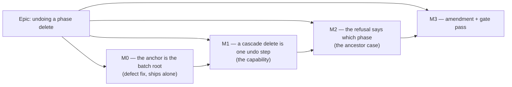

# Implementation Plan: Undoing a phase delete

- **Feature spec:** [./feature-spec.md](./feature-spec.md) — **not yet approved**
- **Status:** Draft — awaiting approval
- **Owner:** unassigned
- **Register row:** `docs/TECH_DEBT.md` #230

## Breakdown

### Epic

**Undoing a phase delete** — remove ADR-0048 M2's cascade-delete history truncation now that its
deferral condition (M4, the id-stable batch restore) is met, and fix the anchor-selection defect that
makes the enabling endpoint unreliable for exactly this shape. Maps to debt paydown rather than a
roadmap theme.

---

## Milestone M0 — the anchor is the batch root (shippable alone)

**Outcome:** restoring a delete batch that contains a WBS summary and its subtree succeeds whatever
order the database returns the batch's members in. Fixes the shipped band-copy **redo** path.

**Entry point:** **Ships dark for the new capability, but it is NOT dark work.** It has a live user
path today: **Plan workspace → select a copied band → `Ctrl+Z` → `Ctrl+Shift+Z`** (redo of a band
copy, `pasteActivitiesCommand.redo`, `commands.ts:1108-1114`). No new control; nothing about M1's
capability is reachable yet, and M1 names its entry point.

**Journey:** extend `apps/web/e2e-copy-paste/copy-paste.spec.ts` with the **redo** step its band case
has never had — `Ctrl+Shift+Z` after the existing undo, asserting activity and dependency counts
return via the API exactly as `:163-168` asserts they fall. Existing config
(`playwright.copy-paste.config.ts`); **no new Playwright config and no new CI step.**

**Why it ships first and alone (spec CQ-2):** it is a defect fix on a path in production, and
building M1 on top without it would take a rare, invisible, non-deterministic failure and make it the
common path for the most destructive gesture in the product.

---

#### Feature: root-anchored batch restore

> **Description:** `ActivitiesService.restoreDeleteBatch` evaluates the parent-active guard against
> the batch **root** — the member whose `parentId` is null or lies outside the batch — instead of
> `ids[0]` from an unordered query.
> **Complexity:** S
> **Dependencies:** none.
> **Risks:** a batch with no identifiable root (internally inconsistent) → keep the existing
> `NotFoundError` rather than inventing a failure mode; a batch with several qualifying roots → any
> is correct, because each has an out-of-batch parent, which is exactly what the guard needs.
> **Testing requirements:** a service unit test that is deterministically RED today; an API e2e that
> restores a real cascade batch (the first anywhere); the copy-paste journey's missing redo step.

##### Task M0-T1 — make the defect fail deterministically, then fix it (≈ one PR)

- **Description:** Add the failing test **first**, verified RED, then select the root.
- **Complexity:** S
- **Dependencies:** none
- **Risks:** an e2e alone would be flaky proof, since it depends on the very ordering in question —
  mitigated by pairing it with a service unit test that controls the ordering outright.
- **Testing:**
  - **Verified RED, unit** — `apps/api/src/modules/activities/activities.service.spec.ts`: stub the
    members `findMany` to return a cascade batch **child-first** (child, then its summary root),
    assert the id handed to `lifecycle.restoreBatch` is the **root**. Against today's code the child
    is passed, so this fails on the assertion — deterministically, with no reliance on database
    ordering. **This is the regression test the spec's success criterion 3 names.**
  - **Verified RED, integration** — a second unit case letting the real guard run over a fake
    transaction: anchor = child ⇒ `ConflictError PARENT_DELETED`; anchor = root ⇒ restores. This
    proves *why* the anchor matters rather than only that it changed.
  - **API e2e** — `apps/api/test/activity-batch-ops.e2e-spec.ts`: create a summary with ≥ 2
    descendants and a link between two of them, `DELETE` the summary, `POST restore-batch`, expect
    200, and assert every id is active and the internal link is live again. Not red today (it may
    pass by ordering luck) and it is still the case that matters: **no test in this repository has
    ever restored a cascade batch against a real database.**
- **Development steps:**
  1. Write the two unit cases; run them; **record that they fail and how** (a claim that a test was
     verified red carries its evidence — ADR-0076).
  2. Widen the members `select` to `{ id: true, parentId: true }`.
  3. Extract a small pure `rootOf(members)` — the member whose `parentId` is null or not in the
     member set — and unit-test it directly (empty, single, flat, nested, several roots).
  4. Use it for `anchorId`; keep the existing `NotFoundError` when it yields nothing.
  5. Re-run: green. Add the API e2e.
  6. Comment the *why* at the call site, briefly — that the guard is a question about the batch and
     not about whichever row was read first.
  7. `scripts/e2e-local.sh api` (this touches `apps/api`, so it is not optional).

##### Task M0-T2 — the band-copy redo journey

- **Description:** Add the redo step to the copy-paste journey.
- **Complexity:** S
- **Dependencies:** M0-T1
- **Risks:** an undo→restore→recalculate→refetch cycle outruns Playwright's default 5 s poll —
  ADR-0080's retrospective records exactly this. Use `expect.poll` with the 20 s timeout the
  neighbouring assertion already uses (`copy-paste.spec.ts:164`).
- **Testing:** the step is the test; assert through the API, not the DOM, as that spec already does.
- **Development steps:**
  1. After the existing undo step, focus the parallel listbox (the accelerator is a React
     `onKeyDown` — see the comment at `:155-157`) and press `Control+Shift+z`.
  2. Poll activity and dependency counts back to their pre-undo values.
  3. `scripts/e2e-local.sh web:copy-paste`.

##### Task M0-T3 — measure the restore at scale, or say it was not measured

- **Description:** M1 makes a large cascade restore a common path. Establish its cost rather than
  asserting it.
- **Complexity:** S
- **Dependencies:** M0-T1
- **Risks:** measuring the wrong thing. State the plan, the row count, the hardware and the query
  set; report `restoreDeleteBatch` end-to-end, not one `updateMany`.
- **Testing:** a script or a documented `psql`/e2e timing run, with the numbers written into this
  plan. Falsification condition **committed before the run**: if a 2,000-activity cascade restore
  exceeds **5 s** end-to-end, M1 stops and the batching question is reopened as its own decision.
- **Development steps:**
  1. Seed a plan with a ~2,000-activity subtree (the seed catalogue's scale tier, ADR-0066).
  2. Delete the summary; time the restore; record it here with the falsification verdict.
  3. If it passes, note that the queries are set-wise on the indexed `delete_batch_id`
     (`schema.prisma:577-580`) and move on.

---

## Milestone M1 — a cascade delete is one undo step

**Outcome:** a planner who deletes a phase can press Undo and get the phase, its work, its nesting
and its internal links back — and the rest of the session's history is still there.

**Entry point:** **Plan workspace → select a WBS summary → Delete → confirm → the toolbar `Undo`
control (accessible name "Undo <label>") or `Ctrl+Z`.** No new control: the existing Undo item and
keybinding, which today do nothing after this gesture because the stack was emptied.

**Journey:** `apps/web/e2e-undo/undo.spec.ts` (existing suite, existing config
`playwright.undo.config.ts`, existing CI step, `pnpm --filter @repo/web test:e2e:undo`) — a new test
that seeds a summary with members and an internal link, deletes it, presses `Ctrl+Z`, and asserts via
the API that the whole subtree and the link are back. **No new Playwright config and no new CI step**,
so this does not add an ADR-0105 trigger of its own.

---

#### Feature: record a cascade delete like any other delete

> **Description:** Delete the `WBS_SUMMARY && hasSubtree` branch from `recordActivityDelete`. That is
> the capability. `deleteActivityCommand`, `PlanEditHistory`, the toolbar items, the keybindings and
> the announcements are all unchanged.
> **Complexity:** S (code) / M (evidence)
> **Dependencies:** M0.
> **Risks:** the change is three lines and the confidence rests entirely on tests — mitigated by the
> journey landing **in this milestone**, not at a later gate (ADR-0081 §2), because the seam's unit
> tests mock the mutation and cannot see the server guard at all.
> **Testing requirements:** invert the existing unit assertion; a new command-level case; the
> flag-on journey.

##### Task M1-T1 — remove the truncation

- **Description:** Delete the branch and its now-unused `hasSubtree` derivation; rewrite the docblock.
- **Complexity:** S
- **Dependencies:** M0-T1
- **Risks:** dropping `activities.data` from the `useCallback` deps changes the memo's identity
  churn — check the remaining deps are exactly what the body uses, and that no consumer depended on
  the callback's stability changing.
- **Testing:**
  - **Verified RED** — invert `use-plan-workspace-model.undo-redo.test.ts:322-327`: a summary with a
    subtree now records **one** command and calls `clear` **zero** times. Red against today's code by
    construction, and the assertion is the capability.
  - Keep the flag-off case (`:330-337`) untouched and passing — it is the rollback contract.
  - Add: a summary with **no** subtree still records one command (guards against a fix that
    accidentally re-branches on `type`).
  - Add: `recordDissolveBoundary` still clears — a pinned positive case, so the suite can tell
    "the delete truncation is gone" from "truncation is gone everywhere", which a green run could
    not otherwise distinguish (the ADR-0093 lesson).
- **Development steps:**
  1. Invert the unit case; run it; record the red.
  2. Delete the branch and the `hasSubtree` line; trim the deps array.
  3. Rewrite the docblock: it currently explains the deferral and now records the amendment,
     naming M4 as what changed and pointing at the ADR amendment.
  4. Remove the `#230` pointers in `commands.ts:383-386` and the two test comments, replacing them
     with the amendment reference — a stale pointer to a closed row reads as owed work.

##### Task M1-T2 — the flag-on journey

- **Description:** The step that proves the capability exists in the product, not only in a unit test.
- **Complexity:** M
- **Dependencies:** M1-T1
- **Risks:**
  - the API mutation is mocked in every unit test in this area, so **only** this can see the pen,
    the optimistic version and the parent-active guard interacting (ADR-0060 M6's finding);
  - the recalculation after a restore outruns the default poll → `expect.poll` with an explicit
    timeout, as M0-T2;
  - a locator by copy rather than by role/name breaks on the next toolbar change → locate the Undo
    control by `[data-toolbar-item]` per ADR-0091's recorded rule.
- **Testing:** assert through the REST API (counts of activities and dependencies), not the DOM —
  the point is what was *stored*, and a DOM assertion would pass against a restore that lost the
  links.
- **Development steps:**
  1. Seed via the API: a summary, three members under it, one link between two members, one link
     from an outside activity to a member.
  2. Take the pen; delete the summary through the UI; assert the counts fall by 4 activities and
     2 links.
  3. `Ctrl+Z`; poll the counts back; assert **specifically** that the member-to-member link is live
     again and that the boundary-crossing link is live again too (both endpoints are active, so the
     endpoint guard restores it).
  4. Assert the earlier step is still undoable — i.e. the history was not truncated. This is the
     half a count assertion cannot see, and it is the actual subject of #230.
  5. Assert the announcement.
  6. `scripts/e2e-local.sh web:undo`.

##### Task M1-T3 — command-level cover for the cascade shape

- **Description:** `commands.test.ts`: a `deleteActivityCommand` built for a summary undoes by
  restoring the batch and redoes by re-deleting the same id, rethreading the new batch.
- **Complexity:** S
- **Dependencies:** M1-T1
- **Risks:** it is a mocked test and proves only the command's own contract — say so in its docblock
  rather than letting it look like end-to-end proof.
- **Testing:** as described; assert the redo's second undo uses the **rethreaded** id, which is the
  trap `bulkDeleteCommand`'s docblock records.
- **Development steps:** write it; note in the docblock what it cannot see (the server guard) and
  which journey does.

---

## Milestone M2 — the refusal says which phase

**Outcome:** when an undo cannot apply because an ancestor phase was deleted after it, the planner is
told which phase to restore first, instead of being told the plan "changed".

**Entry point:** **Plan workspace → `Ctrl+Z` after the ancestor case** — the same Undo control; what
changes is the announcement in the shared live region.

**Journey:** a step in `apps/web/e2e-undo/undo.spec.ts` (same config) that constructs the case —
delete a nested summary via the canvas, delete its parent via the activities panel, press `Ctrl+Z` —
and asserts the message, that nothing was restored, and that the undo step is still there.

---

#### Feature: a named ancestor in the conflict message

> **Description:** `usePlanUndoRedo` selects a specific message when a 409 carries
> `reason: PARENT_DELETED`. Everything else in `handleFailure` is untouched: no popping, refetch,
> `clearRedo`, announce.
> **Complexity:** S
> **Dependencies:** M1.
> **Risks:** the reason may not survive to the client — **check `ApiFetchError` actually exposes the
> error envelope's `reason` before designing around it**; if it does not, key on the message or add
> the field, and record which was true rather than assuming (ADR-0076). Naming the ancestor needs its
> name, which the 409 body may not carry; the client can resolve it from the already-loaded activity
> list, and if it cannot, the message degrades to the phase-agnostic wording rather than printing
> `undefined`.
> **Testing requirements:** unit cases per branch; the journey step; an accessibility check that the
> message reaches the existing live region once, not twice.

##### Task M2-T1 — the message and its selection

- **Complexity:** S
- **Dependencies:** M1-T1
- **Risks:** as above.
- **Testing:**
  - **Verified RED** — a `use-plan-undo-redo` case: a 409 with `PARENT_DELETED` announces the new
    message; today it announces `UNDO_CONFLICT_MESSAGE`.
  - A 409 **without** that reason still announces the existing message (pinned, so the change cannot
    quietly swallow every 409).
  - `clearRedo` called, stacks not popped, refetch fired — all three re-asserted for the new branch,
    because a new branch that forgets one of them is exactly how this would go wrong.
- **Development steps:**
  1. Read `ApiFetchError` and confirm what a 409 body exposes; write down what was read.
  2. Add the constant beside the existing four (exported, as they are, for the tests).
  3. Branch on the reason; resolve the ancestor's name from the activity list where available.
  4. Docblock: state the case, that refusing is the decision (spec CQ-1), and that nothing is
     partially restored.

##### Task M2-T2 — the journey step

- **Complexity:** M
- **Dependencies:** M2-T1
- **Risks:** constructing the case needs the **unrecorded** delete path (spec F-3) — the activities
  panel — so the step must drive that surface, not the canvas, for the second delete. If CQ-3 is
  answered "in scope", this step must be rewritten to construct the case another way, which is why
  CQ-3 is a critical question and not a detail.
- **Testing:** assert the message, that the subtree is still deleted, and that Undo is still enabled
  with the same label.
- **Development steps:** seed nested summaries; delete the child summary on the canvas; delete the
  parent from the activities panel; `Ctrl+Z`; assert; then restore the parent and retry, asserting it
  now succeeds — the "detour, not a dead end" claim, tested rather than asserted.

---

## Milestone M3 — the amendment and the gate pass

**Outcome:** the decision is recorded where the next reader will look, and the diff has been through
the specialist gates that have blocked on real defects in every comparable epic in this register.

**Entry point:** **Ships dark** — documentation and review only; no product behaviour changes in this
milestone.

**Journey:** none (nothing user-facing).

---

##### Task M3-T1 — ADR-0048 amendment

- **Description:** Append the amendment to `docs/adr/0048-undo-redo-command-stack.md` (append, never
  edit the accepted text), with the wording drafted in the spec's §4.
- **Complexity:** S
- **Dependencies:** M2
- **Risks:** the amendment quietly overstating what changed — mitigated by its four numbered clauses,
  which say what does **not** change (invariants, CQ-4's argument, dissolve, the engine).
- **Testing:** `pnpm check:adr-coverage` and `pnpm check:doc-links` (the ADR index is gated in both
  directions since ADR-0110 D6). Run `pnpm prepush` as one command — the ten gates are derived from
  `package.json` precisely so nobody keeps the list in their head.
- **Development steps:**
  1. Append the amendment, dated.
  2. Update `CLAUDE.md`'s ADR-0048 register entry — it currently states the truncation as current
     behaviour, and leaving it is the ADR-0071 failure (noticing drift and stepping over it).
  3. Update `docs/API.md`'s restore-batch entry with the anchor rule.
  4. Changeset: **minor** for `@repo/web` (user-visible capability change, pre-1.0 policy) and
     **patch** for `@repo/api` (M0 is a defect fix with no contract change).

##### Task M3-T2 — specialist gate pass over the combined diff

- **Description:** Run the reviewers over M0–M2 together, fold blocking findings with regression
  tests **verified red first**, and record non-blocking findings in the register.
- **Complexity:** M
- **Dependencies:** M3-T1
- **Risks:** treating this as a formality. Every comparable epic in this register found defects here
  that had passed a human read; the shapes most likely to recur in this diff are named below so the
  reviewers are pointed at them.
- **Testing:** the reviewers' own findings plus the full `pnpm prepush`, `scripts/e2e-local.sh api`,
  and `scripts/e2e-local.sh web:undo` / `web:copy-paste`.
- **Development steps:**
  1. **backend-performance-reviewer** — the anchor change (one extra column, one client-side scan)
     and M0-T3's numbers, re-derived from the final code rather than trusted.
  2. **security-reviewer** — that no gate moved: `assertHoldsPen`, `activity:restore`, org scope, the
     uniform 404 for a foreign batch, and that a larger blast radius per undo does not widen what a
     caller can reach.
  3. **api-reviewer** — the two OpenAPI description edits, and that 409/404 semantics are unchanged.
  4. **accessibility-reviewer** — one announcement per event in the shared live region (the
     lost-control banner's double-utterance trap is recorded at `use-plan-undo-redo.ts:91-94`).
  5. **ux-reviewer** — the M2 message: does it say what to do, in the planner's words, without
     implying data was lost?
  6. **test-engineer** — the gap that matters: whether anything now proves a cascade restore against
     a real database, and whether any assertion would pass equally against the capability being
     absent.
  7. Run the **whole** e2e sweep, not just the suite CI names — ADR-0091's recorded rule, after three
     journeys broke across one epic and each was found by CI rather than locally.

---

## Sequencing & slices

| Slice | Ships | Releasable alone? | Why here |
| --- | --- | --- | --- |
| **M0** | anchor fix + its tests + band-redo journey | **Yes** — and should be (CQ-2) | A defect on a live path; M1 would make it common. |
| **M1** | the capability + its journey | Yes | The whole user-visible change; one predicate plus its evidence. |
| **M2** | the named refusal | Yes | Improves a message; safe without it, since the existing 409 handling is already non-destructive. |
| **M3** | amendment + gates | Yes | Records the decision; no behaviour. |

`main` is releasable after each. **No feature flag is added**: `VITE_UNDO_REDO` already exists,
already gates this seam (`use-plan-workspace-model.ts:938`), and is default-on since 2026-07-19
(`env.ts:506-508`). ADR-0088 D1 established that a `VITE_` constant is inlined at build time and is
not an operator rollback anyway; the real rollback is a commit boundary, which the slicing above
provides. Adding a second flag here would create a new Class-B guard for a three-line predicate —
exactly what ADR-0088 classified against.

## Definition of Done (per task)

Each task's PR satisfies the Feature Completion Criteria in [`docs/PROCESS.md`](../../PROCESS.md).
Two are called out because they are the ones this epic can most easily skip:

- **The pre-push gate was run, not written.** `pnpm prepush` as one command, plus
  `scripts/e2e-local.sh api` for M0 (it touches `apps/api`) and `scripts/e2e-local.sh web:undo` /
  `web:copy-paste` for the journey tasks. CI is the second opinion.
- **Every "verified red" claim carries its evidence** — which test, against which code, and what it
  reported. Three tasks here rest on a red run; a claim that one was verified and was not is the
  ADR-0084 D5 failure.

## Risks & assumptions (rollup)

| Risk / assumption | Likelihood | Impact | Mitigation |
| --- | --- | --- | --- |
| The anchor defect is **established by reading, not observed** (spec F-2) | — | high if wrong | M0-T1's unit case makes it deterministic before the fix; if it cannot be made red, the diagnosis is wrong and M0 is re-opened rather than shipped. |
| A large cascade restore is slow enough to feel broken | low | med | M0-T3 measures it against a falsification condition committed first; queries are set-wise on an indexed column. |
| `ApiFetchError` does not expose the 409 `reason` | med | low | M2-T1 step 1 reads it before designing; the message degrades rather than printing `undefined`. |
| The ancestor case is constructible **only** through the unrecorded panel delete | high | med | CQ-3 decides. If it goes in scope, M2-T2 needs a different construction — which is why it is critical rather than a detail. |
| Undoing a large delete surprises a planner (a lot changes at once) | med | low | It restores exactly what one confirmed gesture removed, and the announcement names it. Accepted. |
| The unit suites mock the mutation and cannot see the server guard | certain | med | The journey lands **with** M1, not at a gate (ADR-0081 §2). |
| The register row's `#230` pointers are left behind in code comments | med | low | M1-T1 step 4 removes them; a pointer to a closed row reads as owed work. |
| **The CPM engine is imported, or `computeSchedule`'s inputs change** | very low | very high | Structural: the diff touches a client predicate, a client message and one server anchor selection. Assert it in review — no engine import in the diff, and the ADR-0034 parity gate untouched by construction. |
