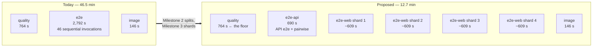

# Feature Spec: Sharding the end-to-end CI job

- **Status:** Draft
- **Author(s):** feature-analyst, for the product owner
- **Date:** 2026-09-11
- **Tracking issue / epic:** none yet — raised as `docs/TECH_DEBT.md` #301
- **Roadmap link:** none. This is a tooling decision about how the repository works on itself; the
  ADR it produces takes a `scripts/adr-coverage.json` exemption in the class ADR-0124 / ADR-0131 /
  ADR-0136 already occupy. A planner cannot act on a CI job.
- **Related ADR(s):** a new one is proposed (§4.9). It builds on ADR-0058 (a gate that fails on day
  one gets deleted), ADR-0076 (a decision-bearing claim carries its evidence), ADR-0093 / ADR-0110
  (a gate is verified against the defect it names, and refuses an empty population), ADR-0105 (a CI
  step is a spec trigger — which is why this document exists), ADR-0120 / ADR-0124 (the exit
  convention and derived rosters) and ADR-0136 (a rule is enforced where the artefact lands).

---

## 0. Where every number in this document came from

Stated first, because §1 is arithmetic and the arithmetic is the whole argument (ADR-0076, and
`docs/PROCESS.md` "Decision-bearing claims carry their evidence").

| Figure                                              | Source                                                                                                                                         |
| --------------------------------------------------- | ---------------------------------------------------------------------------------------------------------------------------------------------- |
| Job segment timings (setup / API / pairwise / etc.) | `docs/TECH_DEBT.md` #301, from the per-step timings of run `34613280766`, job `103309069671` (PR #508, all green), 2026-09-11                  |
| Longest single web suite (185 s, Gantt editing)     | Same run, same table                                                                                                                           |
| `quality` 12 m 44 s and `image` 2 m 26 s            | Same run, reported in #301                                                                                                                     |
| `quality` at 11 m 22 s on 2026-08-25                | `docs/TESTING.md` "Before you push", the prepush-cost paragraph                                                                                |
| Second whole-job sample, 40 m 10 s                  | Product owner, PR #510, 2026-09-11 (segment breakdown **not** captured — see §1.4)                                                             |
| 44 web suites / 43 named scripts                    | `apps/web/package.json:17-66`, read 2026-09-11                                                                                                 |
| 44 CI web steps                                     | `.github/workflows/ci.yml:360-857`, counted 2026-09-11                                                                                         |
| `check-build-contract.mjs` reads one build step     | `scripts/check-build-contract.mjs:130` — a single `RegExp.exec`, not a global match                                                            |
| `upload-artifact` v4+ rejects duplicate names       | `github.com/actions/upload-artifact` README, fetched 2026-09-11: _"uploading to the same artifact via multiple jobs is not supported with v4"_ |
| API e2e runs its spec files serially on a shared DB | `apps/api/vitest.e2e.config.mts:22-25` (`fileParallelism: false`, with the reason in the comment)                                              |
| Playwright runs `workers: 1` and `retries: 2` in CI | `apps/web/playwright.config.ts:10,12`                                                                                                          |

**Two figures in this document are NOT measured and are labelled everywhere they appear:** runner
queue time (§3, §1.5) and the per-suite durations needed for a balanced assignment (§4.5 — Milestone
0 exists to obtain them).

---

## 1. Business understanding

### Problem

**Every CI round trip in this repository waits about 46 minutes on a single job, and that job is
46 sequential test invocations on one runner.**

`.github/workflows/ci.yml` declares three jobs. Two of them finish in 12 m 44 s and 2 m 26 s. The
third, `e2e`, took **2,792 s — 46 m 32 s** in the reference run, so CI's wall clock _is_ that job.
Inside it:

| Segment                                    | Measured                |
| ------------------------------------------ | ----------------------- |
| setup (checkout → drift check, steps 1–10) | 50 s                    |
| API end-to-end (step 11)                   | **499 s (8 m 19 s)**    |
| pairwise differential (step 12)            | 141 s                   |
| Playwright browser install (step 13)       | 47 s                    |
| web end-to-end (steps 14–57, 44 suites)    | **2,049 s (34 m 06 s)** |

Nothing here is slow because it is badly written. It is slow because 46 things that have no reason
to wait for each other are written as steps of one job, and a job is one runner.

**Why it matters more than "CI is slow".** `main` carries no branch protection, by product-owner
decision (CLAUDE.md §8), so **no check can block a merge and none ever has**. What replaces
enforcement is §19.9 — a person reading the check runs for the PR's current head before merging.
That makes the round trip the merge gate in practice: the 46 minutes is not a background cost, it is
the interval between "I think this is right" and "somebody can decide". It is also paid again for
every push, and `concurrency: cancel-in-progress` means a push during a run throws the first 46
minutes away.

### Why now

The numbers were taken on 2026-09-11 and filed as `docs/TECH_DEBT.md` #301. Before that the cost was
an impression. The row deliberately stopped short of building anything, because editing a CI
workflow is a shared-gate change and therefore an ADR-0105 trigger: it needs a spec, not a register
row. This is that spec.

### Users

There is no planner in this feature. The people it serves are:

| Who                      | What they need                                                                                            |
| ------------------------ | --------------------------------------------------------------------------------------------------------- |
| **The contributor**      | A shorter interval between pushing and knowing. Today: push, wait 46 min, read.                           |
| **The product owner**    | To read check runs for a PR's head and decide (CLAUDE.md §19.9). More jobs means more check runs to read. |
| **The next contributor** | To add a suite and be _told_ if they forgot to wire it into CI, rather than discovering it months later.  |

No application user is affected. No organisation role is involved. There is no RBAC surface here at
all (§2.5).

### Primary use cases

1. Push a branch and get a verdict in materially less than 46 minutes.
2. Read a red run and reach the failing suite's name, log and Playwright report without guessing.
3. Add the 47th Playwright suite and have CI refuse the PR if it is not assigned to a shard.
4. Run one suite locally by name, exactly as today (`scripts/e2e-local.sh web:<suite>`).

### User journeys

**Happy path.** Contributor pushes → five CI jobs start (`quality`, `image`, `e2e-api`, and four
`e2e-web` shards) → all green → the product owner reads the check runs and merges. The wall clock is
set by whichever job is slowest, which after this change is **`quality`, a job this epic does not
touch** (§1.3).

**Red path.** One shard fails → the other three still run to completion (`fail-fast: false`, §4.4
D6) → the check-run list names the failing shard → its log names the failing step, which is the
suite, because every suite keeps its own named step (§4.3 D3) → its Playwright report is a
per-shard artefact (§4.4 D7).

**Growth path.** Somebody adds `test:e2e:whatever` to `apps/web/package.json` → `pnpm prepush` runs
`check:e2e-roster`, which derives the suite list from that manifest and fails because no CI step
runs it → they add the step to a shard → the gate's summary prints the projected per-shard totals so
they can see whether they have unbalanced it.

### Expected outcomes

- CI's wall clock falls from ~46.5 min to the **`quality` job's ~12.7 min** (§1.3 — the honest
  headline, which is not the one the register row implies).
- A hole that exists today closes: **nothing currently asserts that CI runs the suites the repository
  declares.** Today the two lists agree at 44 by hand.
- The local workflow does not change at all, by construction (§4.6 D9).

### Success criteria

All four are **measured and recorded, never gated** — see §1.4 for why no wall-clock bar ships.

1. A green sharded run's slowest end-to-end job is ≤ the same run's `quality` job. (Projected: 690 s
   vs ~764 s. This is a comparison _within one run_, so it is immune to the between-run variance.)
2. `check:e2e-roster` is verified red against each defect it names, before it is armed (ADR-0110 D5).
3. `scripts/e2e-local.sh web:<suite>` and `scripts/e2e-sweep.sh` are byte-unchanged.
4. The per-shard wall clocks from the first green sharded run are written into `docs/TECH_DEBT.md`
   #301, replacing the projection with a measurement.

### 1.3 The ceiling, stated before the remedy

**This is the section the epic exists for.** A reader who shards "as far as it goes" spends runners
to buy nothing, and the point at which that begins is lower than it looks.

Let `S` = setup (50 s), `A` = API e2e (499 s), `P` = pairwise (141 s), `B` = browser install (47 s),
`W` = total web suite time (2,049 s), `N` = number of web shards.

The current single job is `S + A + P + B + W` = **2,786 s** against a measured 2,792 s. The model
reproduces the measurement to 6 s (0.2 %), which is the only reason the projections below are worth
anything.

Split into one API job and `N` web shards:

- `e2e-api` = `S + A + P` = **690 s**
- `e2e-web` shard = `S + B + W/N` = **97 + 2049/N** (best case; perfect packing)
- `quality` = **764 s** in the reference run (**682 s** on 2026-08-25 — two samples, see §1.4)

| Web shards | Web shard (best case) | Slowest e2e job | **Whole-CI wall clock** |
| ---------- | --------------------- | --------------- | ----------------------- |
| one        | 2,146 s               | 2,146 s         | **35.8 min**            |
| two        | 1,122 s               | 1,122 s         | **18.7 min**            |
| three      | 780 s                 | 780 s           | **13.0 min**            |
| **four**   | **609 s**             | **690 s** (API) | **12.7 min** (quality)  |
| five       | 507 s                 | 690 s (API)     | 12.7 min — no change    |
| eight      | 353 s                 | 690 s (API)     | 12.7 min — no change    |

**Three things follow, and the third is a correction to `docs/TECH_DEBT.md` #301.**

1. **Beyond four web shards nothing improves.** At four, the web side is 609 s and the binding
   constraint has passed to the `e2e-api` job's 690 s, which is one vitest invocation and does not
   split by adding a step. Four is therefore not "as many as we can afford"; it is the **smallest
   count at which the constraint changes hands.**

2. **Four is also the count at which the e2e side stops being CI's critical path at all.** At three
   shards the slowest e2e job is 780 s, _above_ `quality`'s 764 s; at four it is 690 s, _below_ it.
   Two independent arguments converge on the same number.

3. **So the real ceiling is the `quality` job, not the API suite** — and #301 does not say this. Its
   table's "critical path" column is the slowest **e2e** job, which is the right quantity for a row
   about the e2e job and the wrong one for a reader deciding what to build. Measured against the
   whole run: three shards buys 13.0 min and four buys 12.7 min, a **16-second** difference, because
   `quality` is underneath both. **Everything past four shards — including splitting the 499 s API
   suite — buys zero whole-CI wall clock until `quality` moves.** That is the strongest available
   reason to defer the API work, and it is stronger than "different mechanism" (§4.8).

**One qualification, not softened.** `quality` measures 764 s in the reference run and 682 s on
2026-08-25. At 682 s it sits 8 s _below_ the `e2e-api` job's 690 s. The two are within 1 % of each
other, which means they are effectively tied and **neither is worth further work without a fresh
measurement of both.** This is recorded as the trigger in §4.8 rather than resolved by picking
whichever sample suits.

### 1.4 What two samples mean, and why no wall-clock bar ships

The reference run's `e2e` job took 2,792 s. The same job on PR #510 took **2,410 s (40 m 10 s)** — a
spread of 382 s, **13.7 %** of the larger.

**One sample is not a distribution and two are not much better.** With n = 2 there is no mean worth
quoting, no p95, and no basis for a tolerance. Three consequences, each of which changes what this
plan may commit to:

- **No gate in this epic asserts a wall-clock time.** ADR-0058's rule is that a gate failing on day
  one gets deleted rather than fixed; a "CI must finish within 12 minutes" gate would fail on the
  first slow runner and be gone by the end of the week. Every assertion this epic ships is
  **structural** — a set equality over rosters — and every time figure is **printed, never asserted**
  (§4.5 D8).
- **Comparisons must be made within one run, not across runs.** Success criterion 1 above compares
  the slowest e2e job against `quality` _in the same run_, which the variance cannot invalidate.
  "Is CI faster than it was?" compared across runs needs several samples before it means anything.
- **The segment breakdown of the 40 m sample was not captured**, so it is not known whether the
  382 s landed in the API suite, the web suites, or the setup. That matters: if the variance is
  concentrated in the web suites, the shard budget in §4.5 has less headroom than it looks. This is
  named as an assumption, not resolved (§4.10, risk R4).

The honest form of the headline is therefore: **~46 min → ~13 min, with a floor set by a job this
epic does not touch, and a between-run spread comparable to the gap between three shards and four.**

### 1.5 The unmeasured cost: runner queue time

Every figure above is **execution** time. Today one runner is allocated for the e2e work; after this
change, five are (one API job and four web shards), alongside `quality` and `image` — **seven
concurrent jobs** where there are three.

Actions minutes are free on this public repository (CLAUDE.md §19.9), so the cost is **concurrency,
not money**. Whether seven jobs queue depends on the runner pool at the moment, which nothing here
measures and nothing here can. Stated rather than glossed:

- The public-repository concurrency allowance is comfortably above seven, so contention is expected
  to come from _other runs of this repository_ (a release, a second PR) rather than from the limit.
- `concurrency: cancel-in-progress` already cancels superseded runs on the same ref, which caps
  self-contention from repeated pushes.
- **If queue time turns out to dominate, more shards make it worse, not better** — which is another
  reason the shard count is fixed by the arithmetic rather than maximised.

Milestone 4 records the observed queue time from the first green sharded runs (the difference
between a job's `created_at` and `started_at`). It is a measurement to take, not a number to
predict.

### Open questions

Marked **CRITICAL** where the answer changes design or scope. Everything else has a stated default
and needs no decision.

**CQ-1 (CRITICAL) — Is the 499 s API suite in scope?**
_Default: **no — deferred, with a named trigger and a named candidate mechanism** (§4.8)._ It is
deferred not because it is hard but because **it buys zero whole-CI wall clock today**: at 690 s the
`e2e-api` job already sits below `quality`. The trigger to revisit is `quality` dropping below
690 s in two consecutive green runs. The candidate mechanism, named so a later reader does not have
to rediscover it, is `vitest --shard` with **a database per shard** — which works precisely because
`fileParallelism: false` (`apps/api/vitest.e2e.config.mts:25`) is about sharing _one_ database
inside _one_ process, and two jobs have two databases.

**CQ-2 (CRITICAL) — Confirm four web shards, and confirm that five or more is refused.**
_Default: four._ The argument is §1.3: four is simultaneously the smallest count that reaches the
API job's floor and the smallest that puts the e2e side below `quality`. The reason this is worth
asking rather than assuming is that **three shards buys 13.0 min against four's 12.7 min — a
16-second difference in whole-CI terms** — so if a fourth runner is unwelcome for any reason, three
is very nearly as good and the epic should say so honestly rather than defend four on a 90-second
gap that only exists inside the e2e job.

**CQ-3 (CRITICAL) — Five end-to-end check runs, or one aggregating check?**
_Default: five separate checks, no aggregator._ Since `main` has no branch protection, the merge
gate is a person reading `get_check_runs` for the head (CLAUDE.md §19.9), and that call lists every
run regardless. An aggregator job (`needs: [e2e-api, e2e-web]`, one line, ~20 s of runner) would
give one name to read at the cost of a sixth job and a `needs:` graph whose own failure mode
(a skipped aggregator reporting neutral when a dependency is cancelled) is a new thing to get wrong.
**This is the product owner's call because they are the one reading the list.**

**Non-critical, defaults stated, no answer needed:**

| Question                                          | Default                                                                                                     |
| ------------------------------------------------- | ----------------------------------------------------------------------------------------------------------- |
| Should the pairwise differential get its own job? | **No.** Costed at 81 s of whole-CI saving for one more runner, and zero once `quality` is the floor (§4.8). |
| `fail-fast` on the matrix?                        | **`false`** — a run that stops at the first red shard costs another round trip to learn the rest (§4.4 D6). |
| Per-job `timeout-minutes`?                        | **30**, on each e2e job. A runaway guard against a hung web server, not a performance bar (§4.4 D6).        |
| Does the balance projection become a gate?        | **No** — printed in the gate's summary, never asserted (§4.5 D8).                                           |
| Merge small suites to reduce the count?           | **No** — rejected; it renames `web:<suite>` targets and destroys per-suite flag pinning (§4.7).             |
| Do the 44 per-step comments survive?              | **Yes, verbatim, in place.** This is a hard constraint on the design, not an aspiration (§4.3).             |

---

## 2. Functional requirements

### 2.1 User stories & acceptance criteria

> **US-1** — As a contributor, I want CI's end-to-end work spread across parallel jobs, so that a
> push is judged in roughly a quarter of the time.
>
> **Acceptance criteria**
>
> - **Given** a green PR, **when** CI runs, **then** the end-to-end work runs as one `e2e-api` job
>   and four `e2e-web` shard jobs, in parallel.
> - **Given** that run, **when** its job durations are compared, **then** no end-to-end job exceeds
>   the same run's `quality` job. _(Compared within one run — §1.4.)_
> - **Given** the split, **then** the set of test invocations executed is **exactly** the set
>   executed today: no suite is dropped, added, renamed, merged or reordered relative to its shard.

> **US-2** — As a contributor reading a red run, I want to reach the failing suite without guessing,
> so that a failure costs one round trip rather than two.
>
> **Acceptance criteria**
>
> - **Given** one shard fails, **when** the run completes, **then** the other three shards have also
>   run to completion and reported.
> - **Given** a failing shard, **when** its log is opened, **then** the failing **step** carries the
>   suite's name, as it does today.
> - **Given** any shard, **when** its Playwright report artefact is downloaded, **then** it is named
>   distinctly from the other shards' and contains that shard's reports.
> - **Given** all four shards fail, **then** four artefacts upload successfully — i.e. the upload
>   step cannot itself be the thing that fails (see §2.4, the v4 duplicate-name case).

> **US-3** — As the next contributor, I want adding a suite to fail loudly if I do not wire it into
> CI, so that a suite cannot exist and silently never run.
>
> **Acceptance criteria**
>
> - **Given** a new `test:e2e:<name>` script in `apps/web/package.json` and no matching CI step,
>   **when** `pnpm prepush` runs, **then** `check:e2e-roster` fails and names the unassigned suite
>   and the two remedies.
> - **Given** a CI step naming a suite with no such script, **then** the gate fails and says so.
> - **Given** a suite named in two shards, **then** the gate fails and names both.
> - **Given** a suite name that appears only inside a **comment** in `ci.yml`, **then** the gate does
>   **not** count it as wired. _(The `check-ci-roster.mjs:136` lesson: four gate names appear in that
>   file's comments today, and the naive check reports a deliberately-absent gate as covered by
>   reading the sentence documenting its absence.)_
> - **Given** the gate finds zero suites, **then** it **fails** rather than reporting that everything
>   is wired. _(ADR-0093 — an empty population satisfies every set assertion perfectly.)_

> **US-4** — As a contributor, I want my local workflow unchanged, so that this epic costs me nothing
> to learn.
>
> **Acceptance criteria**
>
> - **Given** any suite, **when** I run `scripts/e2e-local.sh web:<suite>`, **then** it behaves
>   exactly as before — the script and `apps/web/package.json`'s script names are untouched.
> - **Given** `scripts/e2e-sweep.sh`, **then** its derivation (`apps/web/package.json` →
>   `test:e2e:*`) is unchanged and it still sweeps every suite.
> - **Given** `docs/TESTING.md` "Before you push", **then** its table gains one row for the new gate
>   and no existing row changes.

> **US-5** — As the product owner deciding whether to merge, I want the check-run list to be legible,
> so that §19.9's read is not made harder by this change.
>
> **Acceptance criteria**
>
> - **Given** a completed run, **when** `get_check_runs` is called for the head, **then** each
>   end-to-end job appears under a distinct, self-describing name (`End-to-end tests (API)`,
>   `End-to-end tests (web shard 1..4)`).
> - **Given** a shard that never started, **then** it is visibly `queued` or `in_progress` rather
>   than absent — i.e. the matrix is static and does not conditionally omit entries.

### 2.2 Workflows

**Adding a suite (the growth case).**

1. Author adds `test:e2e:<name>` to `apps/web/package.json` and a `playwright.<name>.config.ts`.
2. `pnpm check:counts` fails (the stage banner's Playwright-suite count moved) — this already
   happens today.
3. `pnpm check:e2e-roster` fails: the suite is declared and no CI step runs it.
4. Author adds a step to one shard in `.github/workflows/ci.yml`, with the comment that says what
   only that journey can prove (the house convention, `ci.yml:341-857`).
5. `check:e2e-roster` passes and prints the projected per-shard totals, so the author can see whether
   they have put a 200 s suite on the already-longest shard.

**Removing a suite.** Delete the script and the step; the gate fails if either is done alone.

**Rebalancing.** Someone re-measures per-suite durations, updates `scripts/e2e-durations.json`, and
moves steps between shards. No gate forces this; the summary line is what prompts it.

### 2.3 Edge cases

| Case                                                               | Expected behaviour                                                                                                                                                                                                                                     |
| ------------------------------------------------------------------ | ------------------------------------------------------------------------------------------------------------------------------------------------------------------------------------------------------------------------------------------------------ |
| The 47th suite is added and not assigned                           | `check:e2e-roster` fails locally and in CI, naming the suite.                                                                                                                                                                                          |
| A suite is assigned to a shard number the matrix lacks             | Gate fails. (Otherwise the step is written and never runs — the silent version of the same defect.)                                                                                                                                                    |
| A `test:e2e` step in the matrix job carries **no** shard condition | Gate fails. Without this, the step runs on **all four** shards — four times the cost and four chances to flake, with nothing looking wrong.                                                                                                            |
| Two suites share a `testDir`                                       | Legal and present today: `account` and `account-verify` both use `./e2e-account` (`playwright.account-verify.config.ts:24`). This is why the roster derives from **scripts**, never from directories.                                                  |
| A suite is retried (CI `retries: 2`)                               | Its shard simply takes longer. One retry of the 185 s Gantt-editing suite adds up to 370 s, which alone exceeds that shard's 81 s of headroom — see §4.10 risk R3. Accepted; it costs that run, not the design.                                        |
| A shard hangs (a web server never comes up)                        | `timeout-minutes: 30` ends it. Without it, the GitHub default is 360 minutes.                                                                                                                                                                          |
| One shard red, three green                                         | All four report (`fail-fast: false`). The check-run list shows exactly which.                                                                                                                                                                          |
| All four shards upload a report artefact                           | Names must differ, or the second upload **errors** (upload-artifact v4+, §0). Handled by §4.4 D7.                                                                                                                                                      |
| A fork PR                                                          | Unchanged by this epic. The `permissions: contents: read` block is job-agnostic and the matrix inherits it. ADR-0136 records that "require approval for first-time contributors" is a GitHub setting outside this repository, and it stays outside it. |
| The e2e job is split and `check:build-contract` is not updated     | It reads the **first** `- name: Build shared packages` step only (`scripts/check-build-contract.mjs:130`, a non-global `exec`). Two jobs means two such steps and one silently unchecked. §4.4 D5 makes this part of the same commit.                  |
| Setup cost grows                                                   | It grows on five jobs instead of one. The shard count is unaffected: `S` is paid by both sides equally. The count only changes if the **browser install** exceeds 128 s, or the web total exceeds 2,372 s — both derived in §4.5.                      |

### 2.4 The failure this change can itself cause

Worth stating separately because it is the one way this epic makes CI red for a non-defect:
**duplicate artefact names.** The current single job uploads one artefact called `playwright-report`
(`ci.yml:859-907`). Four shard jobs uploading that same name would see the first succeed and the
rest fail — a red run, after the tests passed, for a reason that has nothing to do with the change
under test. Evidence that this is real rather than defensive: the action's own README, fetched
2026-09-11 — _"uploading to the same artifact via multiple jobs is not supported with v4"_, and
_"Artifact names must be unique since each created artifact is idempotent"_.

### 2.5 Permissions

**None.** This feature has no organisation scope, no role, no API surface and no data. The workflow's
`permissions: contents: read` is unchanged and applies to every job including matrix entries. No new
secret is introduced and no existing one is read by a new job. Stated explicitly rather than left
blank, because "N/A" in a permissions section is indistinguishable from "not considered".

### 2.6 Validation rules

The only validation in this feature is the gate's, and it is a set comparison rather than a field
rule:

| Rule                                                                               | Where                                                 |
| ---------------------------------------------------------------------------------- | ----------------------------------------------------- |
| Every `test:e2e:*` script in `apps/web/package.json` is run by exactly one CI step | `check:e2e-roster`                                    |
| The base `test:e2e` (no suffix) is run by exactly one CI step                      | same                                                  |
| `apps/api`'s `test:e2e` and `test:e2e:pairwise` are each run by exactly one step   | same                                                  |
| Every CI step naming a suite names one that exists                                 | same                                                  |
| Every web-suite step in the matrix job declares a shard condition                  | same                                                  |
| Every declared shard condition names a shard the matrix declares                   | same                                                  |
| Suite names are matched with **comments stripped**                                 | same                                                  |
| The gate refuses to run if a `#` appears inside a quoted string in `ci.yml`        | same (the `check-ci-roster.mjs:119-133` R8 precedent) |
| The population is non-empty                                                        | same (ADR-0093)                                       |

### 2.7 Error scenarios

| Scenario                                 | Detection             | Result                                                                | Exit |
| ---------------------------------------- | --------------------- | --------------------------------------------------------------------- | ---- |
| Suite declared, no CI step               | `check:e2e-roster` E1 | Names the suite and both remedies; blocks `pnpm prepush` and CI       | 1    |
| CI step names a non-existent suite       | E2                    | Names the step; blocks                                                | 1    |
| Suite assigned twice                     | E3                    | Names both shards; blocks                                             | 1    |
| Step with no shard condition             | E4                    | Names the step and says it will run on every shard; blocks            | 1    |
| Shard condition outside the matrix       | E5                    | Names the step and the declared matrix values; blocks                 | 1    |
| Zero suites found (broken derivation)    | E6, population check  | "The derivation is broken, not the estate"; blocks                    | 1    |
| `#` inside a quoted string in `ci.yml`   | E7                    | Refuses to judge and says why                                         | 1    |
| One shard's tests fail                   | GitHub                | That check run is red; the other three complete                       | —    |
| Shard hangs                              | `timeout-minutes: 30` | Job cancelled, check run red, log available                           | —    |
| Two shards upload the same artefact name | upload-artifact v4+   | **Prevented by design** (§4.4 D7); if it regressed, a red upload step | —    |

---

## 3. Technical analysis

| Area           | Impact                         | Notes                                                                                                                                                                                                                 |
| -------------- | ------------------------------ | --------------------------------------------------------------------------------------------------------------------------------------------------------------------------------------------------------------------- |
| Frontend       | **none**                       | No file under `apps/web/src` changes. `apps/web/package.json` scripts are untouched — that is a hard constraint (§4.6 D9), not an outcome.                                                                            |
| Backend        | **none**                       | No file under `apps/api/src` changes. `apps/api/package.json` is untouched.                                                                                                                                           |
| Database       | **none**                       | No model, column, index, constraint or migration. **`database-architect` is therefore not engaged — because there is nothing to design, not because a change was judged too small** (CLAUDE.md §19.3, §20).           |
| API            | **none**                       | No endpoint, DTO, status code or OpenAPI change.                                                                                                                                                                      |
| Security       | **low**                        | `permissions: contents: read` unchanged; no new secrets; no new third-party action beyond the ones already used. Each shard gets its own disposable Postgres service, which is _more_ isolation than today, not less. |
| Performance    | **high — this is the feature** | Wall clock ~46.5 → ~12.7 min. Runner time rises ~2,786 → ~3,127 s across five runners (+12 %), which is free (CLAUDE.md §19.9). Queue time is the unmeasured term (§1.5).                                             |
| Infrastructure | **high**                       | `.github/workflows/ci.yml` restructured: one job becomes two, one of which is a four-entry matrix. Four extra Postgres service containers. One new root `check:*` script and its CI step.                             |
| Observability  | **medium**                     | Per-step timings are how #301's table was derivable at all. The design preserves them by keeping one step per suite (§4.3 D3). Artefact names change (§4.4 D7). Job names change, which `get_check_runs` reports.     |
| Testing        | **medium**                     | One new gate with unit cases, each **verified red against the defect it names** before arming (ADR-0110 D5). There is no Playwright journey — the instrument that proves this is **a real CI run** (§4.2).            |

### Dependencies

- **Nothing must land first.** Milestone 0 is a measurement over data that already exists (the
  reference run's step timings).
- **`scripts/check-build-contract.mjs` must change in the same commit as the job split** (§4.4 D5) —
  it reads one build step and there will be two.
- **`check:ci-roster` will refuse the new gate** the moment `check:e2e-roster` is added to
  `package.json` without a CI step. That is the intended cost and a useful self-demonstration:
  ADR-0136 M1's own roster gate refused its M4 in exactly this way.
- **`scripts/prepush.sh` needs no change**: it derives the `check:*` roster from `package.json`, so
  the new gate joins the local pre-push run automatically (`docs/TESTING.md` "Before you push").
- Affected documents: `docs/TESTING.md` (one table row; a note on which shard to read),
  `docs/TECH_DEBT.md` #301 (rewritten with the measurement, and with the §1.3 correction to its own
  ceiling claim), `CLAUDE.md` §19.9 (the check-run list is now longer), `scripts/adr-coverage.json`
  (the new ADR's exemption).

---

## 4. Solution design

### 4.1 Architecture overview



Each box is one runner with its own checkout, its own pnpm install and — for the five end-to-end
jobs — **its own disposable Postgres service container**. That last point is worth stating plainly:
today all 46 invocations share one database in a fixed order; afterwards each job has a fresh one.
This is stronger isolation, and it is also the epic's biggest behavioural risk (§4.10 R1), because
any suite that has been passing on data an earlier suite left behind will now fail. Nothing can
establish whether that is true by reading; only a run can (§4.2).

### 4.2 What proves this works — and what cannot

There is no user-facing surface here, so ADR-0081's "name your entry point" resolves to
**every milestone ships dark**, and its enforcement half — the flag-on journey — has no analogue.
The instrument that replaces it is stated rather than left implicit:

- Unit cases prove the **gate**, each verified red against a named mutation (ADR-0110 D5).
- **The PR's own CI run proves the workflow.** Nothing else can: suite independence, service-container
  behaviour, artefact naming and matrix expansion are all properties of GitHub Actions executing the
  file, and no local instrument here executes a workflow.
- Consequently **Milestone 3's definition of done includes a green sharded run with its per-shard
  wall clocks recorded**, not "the YAML is written".

### 4.3 The load-bearing constraint: 44 comments that must not die

`.github/workflows/ci.yml:341-857` carries one named step per suite, each with a comment saying what
only that journey can prove — why `e2e-csp` serves a production build, why `e2e-workspace-chrome` is
the first suite ever to run in Visual mode, why `e2e-account-verify` needs its own API process.
These are not decoration. `scripts/check-ci-roster.mjs` records the repository's position in as many
words, for the sibling case: _"A derived loop over `package.json` was REJECTED… The per-step comments
in this file are load-bearing documentation and a loop deletes all of them."_

**D3 — the assignment is expressed as a per-step condition, and the steps stay exactly where they
are.** The web job gains `strategy.matrix.shard: [1, 2, 3, 4]`, and each of the 44 suite steps gains
one line:

```yaml
- name: Web end-to-end tests (Gantt editing)
  if: matrix.shard == 3
  run: pnpm --filter @repo/web test:e2e:gantt-editing
```

Three properties follow, and each is something a different design loses:

- **Every comment survives verbatim, in place.** No migration of prose into JSON, no rewriting.
- **Every step keeps its name**, so a red shard's log still names the failing suite — and so the
  per-step timings that produced #301's table in the first place keep existing.
- **The assignment lives beside the thing it assigns**, which is where a reader will look.

The cost, stated: each shard's log shows 44 steps of which 33 are skipped. That is noise, and it is
also a full roster visible from inside every shard. A skipped step costs no measurable time.

### 4.4 The workflow changes

**D4 — one API job, one four-entry web matrix.** `e2e` becomes `e2e-api` (setup → API e2e →
pairwise) and `e2e-web` (setup → browser install → the 44 conditioned steps). Both keep the Postgres
service block and both keep the full setup block. The setup block is therefore **duplicated once**.

_Why not a composite action._ It is a new mechanism, it cannot be run locally, and it would move ten
steps out of the file a reader opens to understand CI. The duplication is ten lines and its drift
mode is loud: a shared package added to one job's build step and not the other fails the other with
`MODULE_NOT_FOUND` at `nest build` — which is exactly the failure `ci.yml:290-318` already documents
at length.

**D5 — `check:build-contract` is updated in the same commit.** `scripts/check-build-contract.mjs:130`
does `/- name: Build shared packages\n\s+run: (?<run>.*)\n/u.exec(ci)` — a single, non-global match.
With two such steps it checks the first and is silent about the second. It must match **all** of
them and assert each. This is not a nice-to-have: leaving it produces a gate that passes while
protecting half of what it names, which is the exact class ADR-0136 and ADR-0124 exist to close.

**D6 — `fail-fast: false` and `timeout-minutes: 30` on every end-to-end job.**
`fail-fast: false` because a matrix that cancels its siblings on the first red turns one round trip
into two, which is the cost this whole epic is about; `e2e-sweep.sh:58-69` records the same lesson
one layer out (a sweep that names every failure beats one that stops at the first).
`timeout-minutes: 30` is a **runaway guard, not a performance bar** — the distinction matters for
ADR-0058, because a bar tuned close to the measurement fails on a slow day and gets deleted. 30 min
against a ~11 min projection is loose on purpose; GitHub's default of 360 min is the thing being
prevented.

**D7 — per-shard artefact names, and the hand-maintained path list goes.** The upload step becomes:

```yaml
name: playwright-report-web-shard-${{ matrix.shard }}
path: apps/web/playwright-report*/
```

Two changes, two reasons. The **name** must be unique or the second upload errors (§2.4, evidenced).
The **path** replaces a hand-written list of ~40 directories (`ci.yml:864-906`) whose own comment
records eleven having been silently missing — _"a red run in any of them produced no artefact to
debug from"_. A glob is derived by construction; the list is prose, and prose is what that comment
says the estate keeps getting wrong.

### 4.5 The assignment, and how it is checked

**D8 — the roster is declared in `ci.yml` and checked by derivation; the balance is projected and
printed, never asserted.**

The gate, `scripts/check-e2e-roster.mjs` (`pnpm check:e2e-roster`), takes the shape every sibling
gate in that directory takes — an exported `runGate(root)` returning an exit code, a two-line CLI
caller, `report()` from `scripts/lib/doc-register.mjs` — so the test suite drives the real wiring
rather than a private mirror of it (the `stack-record.structural.test.ts` lesson recorded in
`check-ci-roster.mjs:57-64`).

It derives the **truth** from `apps/web/package.json` and `apps/api/package.json`, and reads the
**claim** from `.github/workflows/ci.yml` with comments stripped. Assertions E1–E7 are listed in
§2.6 and §2.7.

**Why the balance is printed rather than gated.** Three reasons, in order of strength:

1. **A mixed blocking/advisory gate is a change to a shared mechanism.** `prepush.sh` classifies a
   whole gate as advisory via `ADVISORY_GATES`, and `check:advisory-agreement` asserts that list
   against the code both ways (ADR-0124 D4). Making one gate report two severities means changing
   that mechanism — and ADR-0136 records that folding a shared-gate change into an epic's last
   milestone is what ADR-0105 exists to stop.
2. **There is slack, and it is quantified.** The web side has `690 − 97 = 593 s` of suite time per
   shard before it becomes the critical path, against a perfect four-way pack of `2049/4 = 512 s`.
   That is **81 s — 15.8 % — of slack over perfect**, and the longest single suite (185 s) is 36 % of
   a perfect share. So the assignment does not have to be good, only not terrible; a hand-declared
   one reaches the ceiling comfortably and a computed packer buys nothing measurable.
3. **A projection from committed durations is only as fresh as the durations.** Asserting on it would
   make a stale file into a false failure.

What is printed, on every run of the gate:

```
check:e2e-roster OK — 44 web suites across 4 shards; projected totals 507/519/512/511 s
(budget 593 s before the web side becomes the critical path). Durations: run 34613280766, 2026-09-11.
```

A suite with **no recorded duration is charged the largest recorded duration**, never zero, and is
flagged as estimated. A zero would let a new suite pass by being invisible, which is ADR-0093's shape
one layer down.

**Two derived triggers, recorded so nobody has to re-derive them:**

- The four-shard choice survives until the **web suite total** exceeds **2,372 s** (currently
  2,049 s — 16 % of headroom). Past that, `B + W/4 > A + P` and the web side takes the constraint
  back.
- Setup growth does **not** change the shard count, because both sides pay it. Only the **browser
  install** growing past **128 s** (currently 47 s) would.

### 4.6 The local half — unchanged by construction

**D9 — no suite is renamed, merged, split or regrouped.** This is a constraint the design is built
to satisfy, not an outcome it happens to have:

- `scripts/e2e-local.sh:180-195` maps `web:<name>` → `pnpm --filter @repo/web test:e2e:<name>`.
  Untouched.
- `scripts/e2e-sweep.sh:48-57` derives its list from the same `test:e2e:*` scripts. Untouched, and
  it remains the only thing that runs every suite in one command.
- `apps/web/package.json` scripts: untouched.

This is also the reason §4.7's "merge small suites" alternative is refused: the moment a suite's name
changes, both scripts and every `docs/TESTING.md` instruction move with it.

`docs/TESTING.md` gains one table row (the new gate) and one paragraph: CI now runs these suites
across four shard jobs, so a red end-to-end check names a shard, and the failing **step** inside it
names the suite. Nothing about what to run locally changes.

### 4.7 Alternatives considered and rejected

| Alternative                                               | Why not                                                                                                                                                                                                                                                                                                                                    |
| --------------------------------------------------------- | ------------------------------------------------------------------------------------------------------------------------------------------------------------------------------------------------------------------------------------------------------------------------------------------------------------------------------------------ |
| **Playwright's own `--shard`**                            | It splits **test files inside one config**. The unit of work here is a config — an entire `webServer` environment with its own flag pins and, for `e2e-csp`, its own ports and a production build. Sharding inside a config would re-pay that config's server boot per shard and would not touch the 44-config problem at all.             |
| **Matrix + a loop script over a roster JSON**             | Compact, and it deletes 44 named steps and ~400 lines of load-bearing comments (§4.3). The repository has already refused this once for the `check:*` gates, in writing.                                                                                                                                                                   |
| **Four literal jobs, setup duplicated four times**        | Keeps the comments, but duplicates the ten-step setup block ×4 and gives `check:build-contract` four steps to keep in step instead of two. The matrix gives the same result with one copy.                                                                                                                                                 |
| **Merge small suites into fewer configs**                 | Would cut the count directly — and renames `web:<suite>` targets (D9), and destroys the per-suite flag pinning that is the entire reason each config exists (ADR-0088: a config **is** a flag harness).                                                                                                                                    |
| **Run several suites concurrently on one runner**         | Every config binds ports 3000/5173 and each suite's servers carry that suite's environment. `scripts/e2e-local.sh:132-150` refuses to run against a foreign server precisely because a reused one invalidates the result. Concurrency here needs per-suite ports — a change to 44 configs. Only `e2e-csp` already has its own (3002/4173). |
| **Raise Playwright's `workers` above 1 in CI**            | `playwright.config.ts:12` pins `workers: 1` in CI "for determinism", and the suites share one database. Raising it trades the epic's problem for a flake problem, on the one instrument whose green is currently trustworthy.                                                                                                              |
| **Larger runners**                                        | Not free, and the job is serialisation-bound rather than CPU-bound: with `workers: 1` a bigger box mostly idles.                                                                                                                                                                                                                           |
| **Compute the packing at run time from a durations file** | Needs either a static matrix that cannot see the computation, or a setup job emitting `fromJSON` output (+1 job, +indirection). And it makes a suite's shard vary between runs, which makes "which shard was that?" harder. The 15.8 % slack (§4.5) means it buys nothing.                                                                 |
| **A wall-clock gate ("CI under 12 minutes")**             | ADR-0058. Two samples 13.7 % apart; it would fail on a slow runner and be deleted rather than fixed.                                                                                                                                                                                                                                       |

### 4.8 What this deliberately does not touch

**The 499 s API end-to-end suite is out of scope, and the reason is arithmetic rather than
difficulty.** At 690 s the `e2e-api` job already sits below the `quality` job's 764 s, so splitting
it buys **zero whole-CI wall clock** (§1.3). The mechanism exists and is named here so a later reader
starts from it rather than from scratch: `vitest --shard=i/n` with **one database per shard job**,
which is available precisely because `fileParallelism: false`
(`apps/api/vitest.e2e.config.mts:22-25`) is about several spec files sharing **one** database inside
**one** process — a constraint two jobs do not have.

**Trigger to reopen:** the `quality` job measured below 690 s in two consecutive green runs. Note
that this is close: `quality` was 682 s on 2026-08-25 and 764 s in the reference run, so the trigger
may already be met on some runs. That is an argument for measuring both again before acting, not for
acting now.

**The pairwise differential stays on the API job.** Moving it to a third job lowers the e2e floor
from 690 s to 549 s and costs one more runner — worth **81 s** of whole-CI time at four shards
today, and **zero** once `quality` is the floor. Costed, declined, written down.

**`quality` itself is out of scope.** It is now the floor, and it is a different problem: 94 % of
the equivalent local gate is `pnpm test`, the whole web unit suite (`docs/TESTING.md`,
`docs/TECH_DEBT.md` #191). A separate spec, if anyone wants the next ten minutes.

### 4.9 Is an ADR needed?

**Yes, one, and it is small.** Three things in this spec are decisions a later reader would otherwise
re-litigate from scratch:

- **the shard count is fixed by where the constraint changes hands, not by how many runners are
  free** — and the ceiling is the `quality` job, which is not where #301 puts it;
- **no gate in this epic asserts a wall-clock time** (the ADR-0058 application, and the reason the
  balance is printed rather than enforced);
- **the assignment is a per-step condition because 44 comments are load-bearing** — the same ruling
  `check:ci-roster` already made for the gate steps, now made for the suite steps.

Draft outline:

> **ADR-0138 (number to be confirmed at filing) — A shard count is set by where the constraint
> changes hands.**
> _Context:_ one job, 46 invocations, 46.5 min; the measured segments; two samples 13.7 % apart.
> _Options:_ do nothing · N shards for N ∈ {2,3,4,6,8} · merge suites · concurrency within a runner ·
> a computed packer.
> _Decision:_ split `e2e` into `e2e-api` + a four-entry `e2e-web` matrix; assignment as a per-step
> `if:`; `check:e2e-roster` derived from the manifests; balance printed, never asserted; the API
> suite deferred on a named trigger.
> _Trade-offs:_ +12 % runner time (free); setup duplicated once; queue time unmeasured; a
> hand-declared assignment that can drift out of balance silently.
> _Consequences:_ the e2e side stops being CI's critical path and `quality` becomes the floor; a hole
> closes (nothing asserted the two suite rosters agreed); two derived re-open triggers recorded
> (web total > 2,372 s; browser install > 128 s).

**Choose the number at filing, not from this document.** ADR-0137 exists as of today, so 0138 is
next — but ADR-0079 records a number being taken between a plan and its milestone, and ADR-0071
records the cost of stepping over a collision instead of recording it.

_(Noticed while choosing a number and recorded rather than stepped over: **ADR-0137 is absent from
CLAUDE.md §16's register** although it is filed, Accepted, in `docs/adr/README.md` and cited from
`docs/ROADMAP.md:438`. That is precisely the ADR-0132 finding — `docs/TECH_DEBT.md` #291 — recurring.
It is not this epic's to fix; it is flagged so the next reconciliation pass does not have to
rediscover it.)_

### 4.10 Risks

| #   | Risk                                                                                                                | Likelihood | Impact | Mitigation                                                                                                                                                                                                                                              |
| --- | ------------------------------------------------------------------------------------------------------------------- | ---------- | ------ | ------------------------------------------------------------------------------------------------------------------------------------------------------------------------------------------------------------------------------------------------------- |
| R1  | A suite has been passing on data an earlier suite left in the shared database, and fails once shards have their own | medium     | high   | Cannot be established by reading. Milestone 3's acceptance is a green run, and a failure here is a **real** finding — a suite that was not self-sufficient. Milestone 2 deliberately carries none of this risk, so a Milestone 3 revert keeps 10.6 min. |
| R2  | The per-shard assignment is unbalanced and one shard becomes the critical path                                      | medium     | low    | 15.8 % of slack (§4.5); the projection is printed on every gate run; the cost of being wrong is seconds, not redness.                                                                                                                                   |
| R3  | A retry of a long suite (CI `retries: 2`) blows its shard's 81 s of headroom                                        | medium     | low    | Accepted. One retry of the 185 s suite adds up to 370 s and that shard becomes the critical path **for that run**. No design fixes this; more shards make it less likely and buy nothing else.                                                          |
| R4  | The 13.7 % between-run variance is concentrated in the web suites, so the real headroom is smaller than projected   | unknown    | low    | The 40 m sample's segments were not captured. Milestone 4 captures segments from three sharded runs. Named as an assumption rather than assumed away.                                                                                                   |
| R5  | Seven concurrent jobs queue, eating the saving                                                                      | unknown    | medium | Unmeasurable in advance (§1.5). Milestone 4 records `created_at` → `started_at` for each job. If it dominates, the shard count is the lever and it goes **down**.                                                                                       |
| R6  | The two setup blocks drift                                                                                          | low        | medium | Loud failure (`MODULE_NOT_FOUND` at `nest build`), plus D5 makes `check:build-contract` assert **every** build step rather than the first.                                                                                                              |
| R7  | The new gate matches a suite name inside a comment and reports a missing step as wired                              | medium     | high   | Comments stripped before matching, exactly as `check-ci-roster.mjs:136` does, and verified red with a suite named only in a comment. This is the sibling gate's own recorded near-miss.                                                                 |
| R8  | The gate passes because it found nothing                                                                            | low        | high   | Non-empty population assertion (ADR-0093), and a pinned positive case. `check-ci-roster.mjs:281-283` and `e2e-sweep.sh:91-100` both carry this for the same reason.                                                                                     |

### 4.11 Database changes

**None.** No model, column, index, constraint or migration; `apps/api/prisma/` is not touched. The
only database involvement is that four more disposable `postgres:17-alpine` service containers are
created per run and destroyed with their jobs.

### 4.12 API changes

**None.**

### 4.13 Component changes

**None.** No file under `apps/web/src` is modified.

---

## 5. Links

- Implementation plan: [`./implementation-plan.md`](./implementation-plan.md)
- Register row this descends from: `docs/TECH_DEBT.md` #301 — **and §1.3 of this spec corrects its
  ceiling claim**, which must be written back into the row when the epic closes.
- Documents this change will update: `.github/workflows/ci.yml`, `package.json`,
`scripts/check-build-contract.mjs`, `docs/TESTING.md`, `docs/TECH_DEBT.md`, `CLAUDE.md` §19.9,
`scripts/adr-coverage.json`, and the new ADR.
</content>

</invoke>
