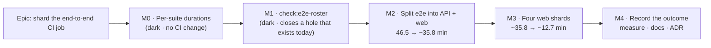

# Implementation Plan: Sharding the end-to-end CI job

- **Feature spec:** [`./feature-spec.md`](./feature-spec.md) — **Draft, awaiting approval.**
- **Status:** Draft
- **Owner:** repo

---

## Breakdown

### Epic

**Shard the end-to-end CI job** — turn one job of 46 sequential test invocations into one API job
and four parallel web shards, stopping at the count where the constraint changes hands, and leave
behind a derived gate so the roster cannot silently rot. Roadmap theme: **none** — tooling, exempt
in the ADR-0124 / ADR-0131 / ADR-0136 class (`scripts/adr-coverage.json`).

**Every milestone in this epic ships dark** in ADR-0081's sense: there is no user-facing entry point,
because the user is a contributor and the surface is CI. Each milestone header says so explicitly
rather than leaving it inferred, and each names the instrument that proves it instead of the journey
it cannot have.

---

## Milestone 0 — The per-suite durations (the input to everything else)

**Outcome:** a committed table of how long each of the 44 web suites took in the reference run, so
the shard assignment in M3 is derived from data rather than from an impression.
**Ships dark:** no workflow change, no gate, no behaviour. It produces one JSON file.
**Instrument (in place of a journey):** the numbers come from the reference run's own per-step
timings — the same source `docs/TECH_DEBT.md` #301's table came from — so this milestone reads data
that already exists rather than generating any.

---

#### Feature: `scripts/e2e-durations.json`

> **Description:** One record per suite: its name, its measured duration in seconds, and the run it
> was measured in. Consumed only by `check:e2e-roster`'s printed summary (spec §4.5 D8) — never at
> run time by CI, and never asserted against.
> **Complexity:** S
> **Dependencies:** none
> **Risks:** the durations go stale and the printed projection quietly describes a run from months
> ago → the file carries the run id and date, and the gate prints both every time, so a reader can
> see the projection's age beside the projection.
> **Testing requirements:** one unit case asserting the file parses, covers every declared suite, and
> carries a run id and a date. No time assertion of any kind.

##### Task 0.1 — Harvest the per-step timings (≈ one PR with 0.2)

- **Description:** Read the per-step durations of job `103309069671` (run `34613280766`) and record
  one entry per `test:e2e:*` step.
- **Complexity:** S
- **Dependencies:** none
- **Risks:** the run's logs expire (GitHub retains them for a bounded period) → if they have, take a
  fresh single-job run's timings and record **that** run id. The absolute numbers matter less than
  their ratios, and the file states which run it describes.
- **Testing:** the sum of the recorded durations is compared against #301's measured 2,049 s for the
  web block; a discrepancy greater than a few seconds means steps were missed, and the task stops
  rather than committing a table that does not add up. _(This is a one-off sanity check performed
  while harvesting, not a committed gate — a committed one would assert a wall-clock number, which
  spec §1.4 forbids.)_
- **Development steps:**
  1. Pull the job's step timings.
  2. Map each `Web end-to-end tests (…)` step to its `test:e2e:<suite>` script name — by the script
     the step runs, never by the step's prose title, which is a human label and not a key.
  3. Write `scripts/e2e-durations.json` with `{ "_": "<what this is and what it is not>", "run":
"34613280766", "measured": "2026-09-11", "seconds": { "<suite>": <n>, … } }`.
  4. Check the total against 2,049 s and record the residual in the file's `_` field.

##### Task 0.2 — Compute a candidate four-way assignment

- **Description:** Produce the shard assignment M3 will write into `ci.yml`, using longest-processing-
  time-first over the M0 durations.
- **Complexity:** S
- **Dependencies:** Task 0.1
- **Risks:** the assignment is optimised to the point of brittleness → the target is **any** packing
  whose worst shard is under 593 s of suite time (spec §4.5), not the optimum. LPT will land well
  inside that; if it does not, the durations are more skewed than #301 implies and that is itself the
  finding.
- **Testing:** none — this is an offline calculation whose output is reviewed as part of M3's diff.
- **Development steps:**
  1. Sort descending; place each suite on the currently-lightest shard.
  2. Record the resulting four totals and the margin against 593 s in the M3 task description.
  3. **Sanity-check the two derived triggers** in spec §4.5 against the real durations (web total
     2,372 s; browser install 128 s) and correct them in the spec if the arithmetic moves.

---

## Milestone 1 — `check:e2e-roster`, against the job as it is today

**Outcome:** CI can no longer run a different set of end-to-end suites from the set the repository
declares, and adding a suite without wiring it fails `pnpm prepush`.
**Ships dark:** no workflow restructuring. The gate passes against today's single job on the day it
lands.
**Instrument:** every assertion is **verified red against the specific defect it names** before the
gate is armed (ADR-0110 D5) — a gate that has never been made to fail is not finished, it is
untested.

**Why this is a milestone of its own, and first.** It closes a hole that exists **today**: nothing in
this repository asserts that `.github/workflows/ci.yml`'s 44 web steps match
`apps/web/package.json`'s 44 scripts. They agree, by hand, as of 2026-09-11. `check:ci-roster` covers
only root `check:*` gates; `check:counts` counts `e2e-*` **directories**, which is a different
quantity (two suites share `./e2e-account`). So M1 is worth shipping whether or not the rest of the
epic ever does — and it is the thing the shard assignment then rests on, which is the ADR-0136
ordering: **the roster gate lands before the roster gets more complicated.**

---

#### Feature: the derived end-to-end roster gate

> **Description:** `scripts/check-e2e-roster.mjs` + `pnpm check:e2e-roster`. Derives the suite set
> from `apps/web/package.json` and `apps/api/package.json`; reads the claim from
> `.github/workflows/ci.yml` with comments stripped; asserts set equality and exclusivity.
> **Complexity:** M
> **Dependencies:** M0 (for the summary line's projection; the gate works without it, printing
> "durations unavailable" rather than a zero)
> **Risks:** see the four below, each of which is a recorded near-miss of a sibling gate rather than
> a hypothetical.
> **Testing requirements:** a unit suite in the house shape — importing `runGate` so the test drives
> the **real** wiring including `report()`, per `check-ci-roster.mjs:57-64`. One case per assertion,
> each verified red first, plus a pinned positive case.

##### Task 1.1 — The gate

- **Description:** Write the gate to the shape the directory already uses: exported `runGate(root)`
  returning an exit code, a two-line guarded CLI caller, `report()` from
  `scripts/lib/doc-register.mjs`, a `population` and a `summary`.
- **Complexity:** M
- **Dependencies:** none
- **Risks:**
  - _A suite named only in a **comment** counts as wired_ → strip comments before matching, exactly
    as `check-ci-roster.mjs:136` does. That gate's docblock records the naive version reporting a
    deliberately-absent gate as covered **by reading the sentence documenting its absence**. Verified
    red with a suite mentioned only in a comment.
  - _A `#` inside a quoted string makes naive stripping eat real content_ → refuse to judge and say
    so, the `check-ci-roster.mjs:119-133` R8 precedent. A gate that quietly starts misreading its
    subject is the failure the whole file is about.
  - _An empty population passes every set assertion_ → assert non-empty (ADR-0093;
    `e2e-sweep.sh:91-100` and `check-ci-roster.mjs:281-283` both carry this).
  - _Matching on step **titles** rather than the commands they run_ → match on
    `test:e2e[:<suite>]` invocations. A title is prose.
- **Testing:** E1–E7 from spec §2.6/§2.7, each with a fixture `ci.yml` carrying exactly the defect
  named, each **run red before the gate is written to pass it**. Plus: a fixture where every suite is
  wired (the pinned positive case — without it, "nothing unwired" is indistinguishable from "nothing
  found").
- **Development steps:**
  1. Derive: web suites from `apps/web/package.json` (`test:e2e` plus every `test:e2e:*`), API from
     `apps/api/package.json` (`test:e2e`, `test:e2e:pairwise`).
  2. Read and strip `ci.yml`; refuse on a quoted `#`.
  3. Collect every `--filter @repo/(web|api) test:e2e[:<suite>]` invocation.
  4. Assert E1–E3 and E6–E7 (the shard assertions E4/E5 arrive in M3 — there are no shards yet, and a
     gate half of which is untestable on the day it lands is half a gate).
  5. Summary line: counts, plus the M0 projection if `scripts/e2e-durations.json` is present.
  6. Fixtures live under `scripts/lib/fixtures/` — which is in `.prettierignore` for the reason
     ADR-0120 records: Prettier de-indented a fixture once, which kept its name, lost the property it
     pinned, and would have passed against a broken parser.

##### Task 1.2 — Wire it

- **Description:** Add `check:e2e-roster` to the root `package.json` and a step to `ci.yml`'s
  `quality` job, with the comment saying what it guards and what it deliberately does not.
- **Complexity:** S
- **Dependencies:** Task 1.1
- **Risks:** _adding the script without the CI step_ → `check:ci-roster` fails, which is the
  intended cost and a useful self-demonstration: ADR-0136 M1's roster gate refused its own M4 in
  exactly this gap. `scripts/prepush.sh` needs no edit — it derives the `check:*` roster.
- **Testing:** run `pnpm prepush`; confirm the new gate appears in the derived roster and that
  `check:ci-roster` is satisfied.
- **Development steps:**
  1. `package.json` script.
  2. `ci.yml` step in `quality` (it needs no database and no browser).
  3. `docs/TESTING.md` "Before you push" — one new row: _"you added, renamed or removed a Playwright
     suite, or changed a CI end-to-end step"_.
  4. Confirm `check:advisory-agreement` is unaffected: this gate is **blocking**, so it takes no
     `ADVISORY_GATES` entry and no `ci-roster.json` entry (a gate that runs in CI must have neither —
     `check-ci-roster.mjs` R3a/R4a).

---

## Milestone 2 — Split `e2e` into `e2e-api` and `e2e-web`

**Outcome:** CI's end-to-end work runs as two parallel jobs. Wall clock **46.5 → ~35.8 min**
(projected), for one extra runner and no bin-packing.
**Ships dark:** no user-facing anything. The observable change is the check-run list.
**Instrument:** the PR's own CI run. Nothing local executes a workflow, so the acceptance condition
is a green run with both jobs' durations recorded — not "the YAML is written" (spec §4.2).

**Why this is separate from M3, and why the order matters.** M2 changes _which runner_ the API work
happens on and changes nothing about how the 44 web suites relate to each other: they still run in
order, against one database, in one job. **It therefore carries none of the epic's suite-independence
risk** (spec §4.10 R1), which lives entirely in M3. If M3 has to be reverted, M2's 10.6 minutes
survive.

---

#### Feature: two end-to-end jobs

> **Description:** `e2e` becomes `e2e-api` (setup → API e2e → pairwise) and `e2e-web` (setup →
> browser install → the 44 suite steps). Both keep the Postgres service block and the full setup
> block; the setup block is duplicated once, with the reason recorded in the file.
> **Complexity:** M
> **Dependencies:** M1 (so the roster is asserted before it is moved)
> **Risks:** the two setup blocks drift → loud failure at `nest build`, plus Task 2.2 makes
> `check:build-contract` assert **every** build step instead of the first.
> **Testing requirements:** a green CI run on the PR, with both job durations recorded; plus the
> `check:build-contract` unit case that would have caught the second step being unchecked.

##### Task 2.1 — Split the job

- **Description:** Restructure `ci.yml`. Every step moves verbatim, with its comment. No step's
  command, name or comment changes.
- **Complexity:** M
- **Dependencies:** M1
- **Risks:**
  - _A step is dropped in the move_ → `check:e2e-roster` fails. This is the first time that gate has
    something real to catch, and the split is exactly the operation most likely to drop one.
  - _The API job is given the browser install it does not need, or the web job loses it_ → the web
    job's first Playwright step fails immediately and loudly.
  - _`e2e-web` still needs the API built and migrated_ — it starts `nest start` from Playwright's
    `webServer`. Both jobs therefore keep **the whole** setup block including
    `prisma:deploy`; nothing is trimmed as an optimisation in this task.
- **Testing:** the PR's CI run, green, with both jobs' durations read from the run and written into
  the PR description.
- **Development steps:**
  1. Copy the `e2e` job to `e2e-api`; keep steps 1–12 (setup → API e2e → pairwise); delete the
     browser install and all 44 web steps.
  2. Rename the original to `e2e-web`; delete the API e2e and pairwise steps.
  3. Job names: `End-to-end tests (API)` and `End-to-end tests (web)`.
  4. Add `timeout-minutes: 30` to both (spec §4.4 D6 — a runaway guard, not a bar).
  5. Leave the artefact upload on `e2e-web` unchanged for now; it becomes per-shard in M3.

##### Task 2.2 — `check:build-contract` reads every build step

- **Description:** `scripts/check-build-contract.mjs:130` uses a single non-global
  `RegExp.exec` on `- name: Build shared packages`. With two such steps it checks the first and is
  silent about the second.
- **Complexity:** S
- **Dependencies:** Task 2.1 (same PR — a commit that creates the second step and leaves the gate
  reading one is a gate that passes while protecting half of what it names)
- **Risks:** _fixing it by exempting the second step_ → explicitly not the remedy; every build step
  is asserted, and a job with no build step at all is also a finding.
- **Testing:** a unit case with **two** build steps where the second omits a required package,
  verified red against the current `exec` implementation.
- **Development steps:**
  1. `matchAll`; assert each occurrence independently.
  2. Assert at least one occurrence exists (the population rule again — zero build steps must not
     read as "every package is built").
  3. Update the gate's docblock to say it reads **all** build steps, since it currently describes
     "the CI e2e job's" singular one.

---

## Milestone 3 — Four web shards

**Outcome:** CI's wall clock falls to the `quality` job's ~12.7 min. The end-to-end side stops being
the critical path.
**Ships dark:** as above. The observable change is four check runs where there was one.
**Instrument:** the PR's own CI run — **and this is the milestone where that matters most**, because
suite independence under four separate databases is a property only a real run can establish
(spec §4.10 R1).

---

#### Feature: the `e2e-web` matrix

> **Description:** `strategy: { fail-fast: false, matrix: { shard: [1, 2, 3, 4] } }`, and one
> `if: matrix.shard == N` on each of the 44 suite steps, from M0's assignment.
> **Complexity:** M
> **Dependencies:** M0 (the assignment), M1 (the gate to extend), M2 (the job to shard)
> **Risks:** R1–R3 and R5 from spec §4.10.
> **Testing requirements:** the extended gate (E4/E5) with each case verified red; a green CI run
> with all four shards' durations recorded; the artefact names confirmed distinct on a **red** run as
> well as a green one, since the upload path is what §2.4 is about.

##### Task 3.1 — Add the matrix and the 44 conditions

- **Description:** The assignment from Task 0.2, written one line per step.
- **Complexity:** M
- **Dependencies:** M0, M2
- **Risks:**
  - _A step is given no condition_ → it runs on all four shards. Task 3.2's E4 catches it; without
    that assertion nothing would, and nothing would look wrong.
  - _A suite depends on another suite's leftover data_ → it fails on its first sharded run. **This is
    a real finding, not a setback**: a journey that only passes after a different journey has run is
    not testing what its name says. The remedy is to make the suite self-sufficient, never to
    co-locate the pair on one shard and call it fixed — co-location hides it until the next
    rebalance.
  - _`e2e-csp` is unusual and must not be split from itself_ → it is one suite and one step; it pays
    a production build (`playwright.csp.config.ts:91`) and binds its own ports (3002/4173). It is
    simply the largest-cost item on whichever shard holds it, and Task 0.2's packing must see its
    real duration rather than assume it resembles its siblings.
- **Testing:** the CI run. Record each shard's duration and the spread.
- **Development steps:**
  1. `strategy.fail-fast: false`, `matrix.shard: [1, 2, 3, 4]`.
  2. Job name `End-to-end tests (web shard ${{ matrix.shard }})`.
  3. One `if:` per suite step, per Task 0.2.
  4. Do **not** touch any step's `name`, `run` or comment.

##### Task 3.2 — Extend the gate to the shard dimension

- **Description:** E4 (every web-suite step in the matrix job declares a shard condition) and E5
  (every declared shard is one the matrix declares). Both read the matrix values from `ci.yml` rather
  than restating them.
- **Complexity:** S
- **Dependencies:** Task 3.1
- **Risks:** _hard-coding `[1,2,3,4]` in the gate_ → then changing the shard count silently makes the
  gate wrong rather than red. Derive from the workflow, the way `check-ci-roster.mjs` derives the
  advisory set from `prepush.sh` rather than restating it.
- **Testing:** two fixtures — a step with no condition, and a step conditioned on shard 5 — each
  verified red first.
- **Development steps:**
  1. Parse `matrix.shard`.
  2. Assert every suite step's condition, and that each named shard exists.
  3. Extend the summary line to print the per-shard projected totals and the 593 s budget.

##### Task 3.3 — Per-shard artefacts

- **Description:** `name: playwright-report-web-shard-${{ matrix.shard }}`, and `path:
apps/web/playwright-report*/` replacing the hand-written ~40-directory list.
- **Complexity:** S
- **Dependencies:** Task 3.1
- **Risks:** _leaving the name unchanged_ → three of four uploads **error**, turning a green test run
  red for a reason unrelated to the change under test (spec §2.4, evidenced against the action's own
  README). _Glob catching something unintended_ → it is scoped to
  `apps/web/playwright-report*/` and `if-no-files-found: ignore` is kept.
- **Testing:** confirmed on a run where **at least one shard is red**, since that is the case the
  artefact exists for; the current list's own comment records eleven report directories having been
  silently uncollected, so a green-only check would prove little.
- **Development steps:**
  1. Change the name and the path.
  2. Delete the enumerated list and its now-stale comment; replace with one line saying the glob is
     derived and why the list was not.

---

## Milestone 4 — Record the outcome

**Outcome:** the projections in this spec are replaced by measurements, and the register row that
started the epic is corrected rather than closed with a link.
**Ships dark:** documentation and one ADR.
**Instrument:** three green sharded runs, read from the API.

---

#### Feature: the measurement and the record

> **Description:** Take the numbers, write them where the next reader will look, file the ADR.
> **Complexity:** S
> **Dependencies:** M3
> **Risks:** the epic closes with its own projections still presented as fact — the failure mode this
> repository documents most often. Task 4.1 is therefore a measurement task, not a writing task.
> **Testing requirements:** `pnpm check:adr-coverage`, `pnpm check:spec-status`,
> `pnpm check:debt-status`, `pnpm check:counts` all green.

##### Task 4.1 — Measure three sharded runs

- **Description:** For three green runs, record each job's duration **and** its
  `created_at` → `started_at` gap (the queue time spec §1.5 names as the honest unknown).
- **Complexity:** S
- **Dependencies:** M3
- **Risks:** _three samples presented as a distribution_ → report the range and say n = 3. The whole
  §1.4 argument is that this repository has been burnt by treating one sample as a number.
- **Testing:** n/a — this is the measurement.
- **Development steps:**
  1. Per run: `quality`, `image`, `e2e-api`, and each `e2e-web` shard.
  2. Compare the slowest end-to-end job against **that same run's** `quality` (success criterion 1 —
     a within-run comparison, immune to between-run variance).
  3. Record the queue times. If they dominate, say so; the lever is fewer shards, not more.

##### Task 4.2 — Rewrite `docs/TECH_DEBT.md` #301

- **Description:** Replace the projection with the measurement, **and correct the row's own ceiling
  claim** (spec §1.3): its "critical path" column is the slowest e2e job, and the whole-CI floor is
  the `quality` job at ~12.7 min, which makes the difference between three shards and four about 16
  seconds in whole-CI terms.
- **Complexity:** S
- **Dependencies:** Task 4.1
- **Risks:** _closing the row instead of correcting it_ → the row's arithmetic is what a future
  reader will cite; leaving a wrong ceiling in a closed row is how a corrected claim gets
  re-inherited. Status becomes `closed` only after the correction is written, and the row keeps its
  numbers.
- **Testing:** `pnpm check:debt-status` (and note spec §2.3's warning: #301's shard-count table
  spells its numbers deliberately; do not "tidy" them to digits).
- **Development steps:**
  1. Measured per-shard durations and queue times.
  2. The §1.3 correction, in the row's own words.
  3. Record the two derived re-open triggers (web total > 2,372 s; browser install > 128 s) and the
     API-suite trigger (`quality` < 690 s in two consecutive runs).

##### Task 4.3 — File the ADR

- **Description:** Write the ADR outlined in spec §4.9 and register it.
- **Complexity:** S
- **Dependencies:** Tasks 4.1, 4.2
- **Risks:** _the number is taken between plan and filing_ → check at filing and **record the
  collision rather than routing around it** (ADR-0071's lesson, ADR-0079's application). 0138 is next
  as of 2026-09-11.
- **Testing:** `pnpm check:adr-coverage`, `pnpm check:doc-links`, `pnpm check:counts`.
- **Development steps:**
  1. `docs/adr/0138-….md`.
  2. `docs/adr/README.md` index entry — gated in both directions since ADR-0110 D6.
  3. `CLAUDE.md` §16 register entry.
  4. `scripts/adr-coverage.json` exemption, in the ADR-0136 wording.
  5. Spec + plan headers → `Accepted — shipped (ADR-0138)` in **this** change (ADR-0131: closing a
     feature includes writing its header).
  6. **While in `CLAUDE.md` §16:** flag, do not silently fix, that ADR-0137 is missing from the
     register (spec §4.9) — it is `docs/TECH_DEBT.md` #291's condition recurring, and it belongs to
     the reconciliation pass rather than to this diff.

##### Task 4.4 — The contributor-facing note

- **Description:** `docs/TESTING.md`: CI runs these suites across four shard jobs; a red end-to-end
  check names a shard and the failing **step** inside it names the suite; the report artefact is
  per-shard. `CLAUDE.md` §19.9: the check-run list is now seven entries, which makes reading it
  before merge slightly longer and no less necessary.
- **Complexity:** S
- **Dependencies:** M3
- **Risks:** _implying the local workflow changed_ → say plainly that it did not, and why: no suite
  was renamed, merged or regrouped (spec §4.6 D9).
- **Testing:** `pnpm check:doc-links`.

---

## Sequencing & slices

| Slice | Ships                    | Projected wall clock | Revert cost                                             |
| ----- | ------------------------ | -------------------- | ------------------------------------------------------- |
| M0    | a JSON file              | 46.5 min (unchanged) | delete the file                                         |
| M1    | one gate + one CI step   | 46.5 min (unchanged) | delete the script, the step and the `package.json` line |
| M2    | two e2e jobs             | **~35.8 min**        | one commit; M1 still holds                              |
| M3    | four web shards          | **~12.7 min**        | one commit; **M2's 10.6 min survives**                  |
| M4    | measurement + docs + ADR | —                    | —                                                       |

**`main` stays releasable throughout.** Nothing in `apps/` changes in any slice, so no image, no
migration, no bundle and no product behaviour is affected by any of them.

**There is no feature flag**, and the reason is ADR-0088 D1 rather than an omission: a `VITE_`
constant is inlined at build time, is not an operator rollback, and in any case could not gate a
GitHub Actions workflow. The rollback is a commit boundary, which is what the table above is.

**Version impact: no changeset, and therefore no release.** Nothing user-visible changes; `apps/web`
and `apps/api` contribute zero files to the diff. That has a consequence worth stating because
ADR-0136 records getting it wrong: **this epic's terminal condition is "merged", not "released"** —
no changeset means no Version Packages PR and no publish job, so a completion criterion written as
"tag and publish confirmed" can never be met.

**Approval gate between M2 and M3.** M2's measured result is the input to the decision to proceed:
if the two-job split lands somewhere other than ~35.8 min, the §1.3 model is wrong about something
and M3's projection inherits the error. Re-derive before shipping four shards.

---

## Definition of Done (per task)

Each task's PR satisfies the Feature Completion Criteria in [`docs/PROCESS.md`](../../PROCESS.md),
with three of the boxes reading unusually here and said explicitly so they are not silently skipped:

- **Tests.** `pnpm prepush` on every slice. `scripts/e2e-local.sh api` is **not** required — no file
  under `apps/api` changes — and no `web:<suite>` run is required either, for the same reason. What
  replaces them is the PR's own CI run, which is the only instrument that executes a workflow.
- **Security / performance / accessibility review.** No product surface, so no `security-reviewer`,
  `accessibility-reviewer` or `component-reviewer`. **`devops-reviewer` is the one that matters**
  and runs on M2 and M3. `database-architect` is not engaged **because there is no schema change to
  design** — not because one was judged too small (CLAUDE.md §19.3).
- **Docker build.** Unaffected; the `image` job is untouched and proves it every run.

---

## Risks & assumptions (rollup)

| Risk / assumption                                                                   | Likelihood               | Impact | Mitigation                                                                                                                       |
| ----------------------------------------------------------------------------------- | ------------------------ | ------ | -------------------------------------------------------------------------------------------------------------------------------- |
| A suite depends on an earlier suite's data and fails once shards have own databases | med                      | high   | M3 carries it alone; M2 revertible independently; a failure is a real finding about that suite                                   |
| Runner queue time eats the saving                                                   | unknown                  | med    | Measured in M4; the lever is **fewer** shards                                                                                    |
| The 13.7 % between-run variance sits in the web suites                              | unknown                  | low    | M4 captures segments across three runs; 15.8 % of packing slack absorbs a good deal of it                                        |
| A retry of the 185 s suite makes its shard the critical path for that run           | med                      | low    | Accepted and stated; no design fixes it                                                                                          |
| The assignment drifts out of balance as suites are added                            | med                      | low    | Projection printed on every gate run; the cost is seconds                                                                        |
| `check:build-contract` silently checks one of two build steps                       | **certain if unhandled** | high   | Task 2.2, in the same PR as the split                                                                                            |
| Duplicate artefact names turn a green test run red                                  | **certain if unhandled** | med    | Task 3.3, evidenced against the action's README                                                                                  |
| The gate matches a suite name inside a comment                                      | med                      | high   | Comments stripped; verified red with a comment-only mention — the sibling gate's own recorded near-miss                          |
| The gate passes because it found nothing                                            | low                      | high   | Non-empty population + a pinned positive case                                                                                    |
| The two setup blocks drift                                                          | low                      | med    | Loud (`MODULE_NOT_FOUND`), plus Task 2.2                                                                                         |
| **Assumption:** the reference run is representative                                 | —                        | —      | It is one sample; M4 replaces it with three. Every projection here is labelled as one.                                           |
| **Assumption:** `quality` stays ~764 s                                              | —                        | —      | Two samples, 682 s and 764 s. If it drops below 690 s the API suite becomes worth splitting (spec §4.8) — a trigger, not a plan. |

</content>
</invoke>
