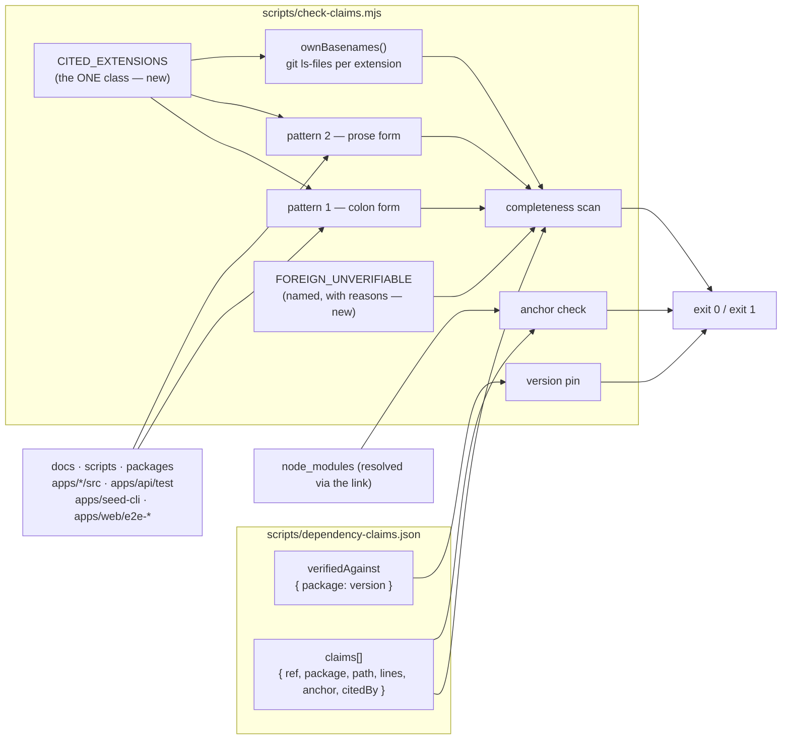
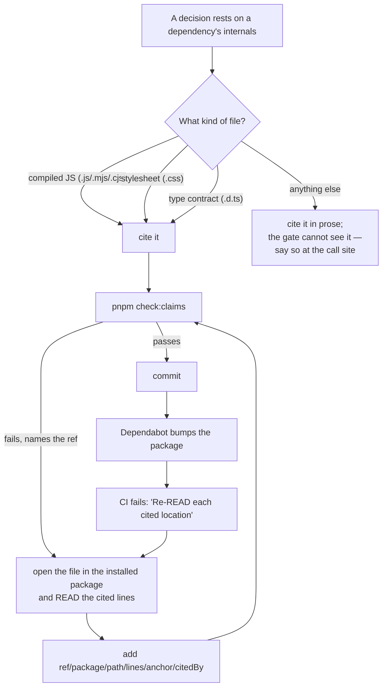

# Feature Spec: `check:claims` — the citation scan sees more than JavaScript

- **Status:** Draft — awaiting approval
- **Author(s):** feature-analyst
- **Date:** 2026-09-02
- **Tracking issue / epic:** `docs/TECH_DEBT.md` #240
- **Roadmap link:** none — repository tooling, not product capability
- **Related ADR(s):** ADR-0076 (wrong claims are a defect class — the gate this changes),
  ADR-0058 (computed gates; a gate that fails on day one gets deleted), ADR-0105 (a register row is
  not a spec — the reason this document exists), ADR-0110 D5 (a gate is finished when the defect it
  names has made it fail), ADR-0093 / `docs/TECH_DEBT.md` #124 (a green gate that cannot fail)

> **Scope note.** Nothing here is application code. The change is confined to `scripts/` — one
> script, one JSON register, and the two documents that cite the claims being registered.

---

## 0. What was read to write this

Every claim below names the file and line that established it. Where a number is an approximation
from a `ripgrep` sweep rather than from the gate itself, it says so, and M0 re-derives it.

| Source                                                                         | Read for                                          |
| ------------------------------------------------------------------------------ | ------------------------------------------------- |
| `scripts/check-claims.mjs` (all 383 lines)                                     | what is actually scanned, and where               |
| `scripts/dependency-claims.json`                                               | the register's shape and current contents         |
| `docs/TECH_DEBT.md` #240, #101, #181, and the closed-numbers rows #178 / #183  | the recorded history of this gate's holes         |
| `apps/web/src/features/tsld/components/TsldPanel.tsx` (2876–2901)              | the Tailwind claim that could not be registered   |
| `docs/adr/0122-…` §3                                                           | the decision that claim carries                   |
| `node_modules/.pnpm/tailwindcss@4.3.3/node_modules/tailwindcss/preflight.css`  | the cited rule, its exact lines                   |
| `apps/web/node_modules/@tanstack/react-router/dist/esm/useBlocker.d.ts`        | a second, older, unregistered dependency citation |
| `node_modules/.pnpm/lucide-react@1.33.0_…/lucide-react/dist/lucide-react.d.ts` | a third                                           |
| `scripts/prepush.sh`, `package.json`, `.github/workflows/ci.yml` (139–147)     | where the gate runs and what its exit code means  |
| `scripts/frontend-only.json`                                                   | whether `check:frontend-only` applies             |

---

## 1. Business understanding

### Problem

ADR-0076 turned "a decision-bearing claim about a dependency's internals" into a **registered**
claim: `scripts/dependency-claims.json` records the package, the path, the line range, an anchor
string and the version the claim was read against, and `pnpm check:claims` fails CI when the
installed version moves or the anchor is no longer at the cited line. The point is not tidiness —
it is that a Dependabot bump becomes the moment somebody re-reads the citation, instead of the
moment the prose quietly stops being true.

The gate has a second half that keeps the register honest in the other direction: it scans the tree
for citation-shaped strings and **fails when it finds one that is not registered**. That half is the
one this spec is about, and it can only see JavaScript.

`scripts/check-claims.mjs:268-281` declares the whole vocabulary:

```js
const CITATIONS = [
  //  the COLON form — <basename>.mjs:<line>, optionally a range
  /\b([a-zA-Z0-9.-]+\.m?js):(\d+(?:-\d+)?)\b/g,
  //  the PROSE form — a backticked path, then "line"/"lines"/"on lines", then the number
  /`[^`\n]*?([a-z0-9.-]+\.m?js)`[,;]?\s*(?:on\s+)?lines?\s*\**`?(\d+(?:\s*[-–]\s*\d+)?)/gi,
];
```

_(The two worked examples the real comments carry are elided above **on purpose**: this spec is
inside `docs/`, which the gate walks, and it is not in `CITATION_SCAN_EXCLUDES`. Reproducing them
verbatim would demand two register entries for illustrations — the exact reason
`scripts/check-claims.mjs:282-290` excludes itself from its own scan. Noticed while writing this
section, which is a small live demonstration of the gate working as intended.)_

Both end in `\.m?js`. That single sub-expression, written twice, is the whole defect: a citation is
recognised only if its file ends `.js` or `.mjs`. For every other extension the gate is silent **in
both directions** —

- an unregistered citation is **not demanded**, so nothing forces it into the register; and
- a register entry for one is never matched, so `scripts/check-claims.mjs:365-371` prints
  `is registered but no longer cited anywhere. Consider removing it.`

Both halves fail towards green, which is why nobody found this by watching CI.

It was found by hitting it. ADR-0122 §3 decides to write `role="list"`/`role="listitem"` explicitly
on the WBS band's text equivalent, and that decision rests on Tailwind v4's Preflight setting
`list-style: none` on every `ul` — a documented cause of WebKit/VoiceOver dropping the implicit list
semantics. The rule is real and was read: in `tailwindcss@4.3.3`, `preflight.css` lines 202–206 are

```css
ol,
ul,
menu {
  list-style: none;
}
```

under the comment `Make lists unstyled by default.` at line 199. Attempting to register it produced
the "no longer cited anywhere" note, so the version was named in the call-site comment instead
(`apps/web/src/features/tsld/components/TsldPanel.tsx:2892-2900`). That satisfies `docs/PROCESS.md`
§"Decision-bearing claims carry their evidence" and **not** ADR-0076's actual mechanism: a
`tailwindcss` bump today changes nothing in CI, and a comment saying "read in tailwindcss **4.3.3**"
will keep reading as authoritative for as long as nobody happens to look.

### Where row #240 is right, and the three places it is understated

`docs/PROCESS.md` says the brief is not evidence either. Row #240 was checked against the code
rather than accepted. Its core claim is **correct**: both patterns end in a JavaScript extension,
only a JavaScript file can be cited, and the register entry reads as uncited. Three refinements
matter enough to change the design:

**(a) It is not a CSS hole; it is a "not-JavaScript" hole — and `.cjs` is inside it.** `\.m?js`
matches `.js` and `.mjs` and **not** `.cjs`: for `foo.cjs` the basename class can consume `foo.c`
but the following text is `js:` with no leading dot, so there is no match. Meanwhile
`ownJsBasenames()` at `scripts/check-claims.mjs:187` runs
`git ls-files '*.js' '*.mjs' '*.cjs'` — the exclusion half already believes `.cjs` is a citable
JavaScript extension while the matching half cannot see one. **The gate's two halves disagree with
each other about what JavaScript is.** No `.cjs` citation exists in the tree today, so this has
never bitten; it is free to close and expensive to leave, because it is exactly the kind of
asymmetry that produces a "registered but uncited" report at the worst moment.

**(b) The Tailwind claim is not the only live instance, and it is not the oldest.** Two more
dependency-internal citations sit in the tree today, unregistered and invisible, both in `.d.ts`:

1. `useBlocker.d.ts:35` — cited in `docs/specs/unsaved-work-guard/feature-spec.md:33` and
   `docs/specs/unsaved-work-guard/implementation-plan.md:80`, where the plan calls it _"the single
   most consequential claim in the design — get it wrong and the app prompts on every reload
   forever."_ It resolves: in the installed `@tanstack/react-router@1.170.27`,
   `dist/esm/useBlocker.d.ts` line 35 is `enableBeforeUnload?: boolean | (() => boolean);`. Its
   sibling `useBlocker.js` citations from the same epic **are** registered — seven of them — because
   they happen to end `.js`. The one carrying the type contract does not, because it ends `.d.ts`.
2. A `lucide-react.d.ts` line list in `docs/specs/workspace-modes/feature-spec.md:180`, cited as
   proof that a candidate icon set exists.

So the defect has been live longer than the Tailwind case, in a class row #240 does not mention, on
a claim its own citing document calls the most consequential one it makes.

**(c) "the third hole in this gate's citation scan" undercounts.** Read against the script's own
comments and the register, the recorded history is:

| #   | Hole                                                                       | Where recorded                                         | Status           |
| --- | -------------------------------------------------------------------------- | ------------------------------------------------------ | ---------------- |
| 1   | Only the colon form; the prose form was never matched                      | `#101`; `check-claims.mjs:256-260`                     | fixed 2026-08-06 |
| 2   | Only `.mjs`, not `.js`                                                     | `#101`                                                 | fixed 2026-08-06 |
| 3   | Directories not walked (`packages/`, `scripts/`, `apps/seed-cli`)          | `#101` item 2                                          | fixed 2026-08-08 |
| 4   | Dotted basename truncated (`throttler.guard.js` read as `guard.js`)        | `#101` item 3; `check-claims.mjs:261-267`              | fixed 2026-08-08 |
| 5   | `apps/web/e2e-*` unscanned — the script's comment calls it "a fourth hole" | `check-claims.mjs:306-320`                             | fixed            |
| 6   | Case-sensitive basename class hid camelCase files                          | `#183` (closed 2026-08-31); `check-claims.mjs:270-277` | fixed 2026-08-31 |
| 7   | **Non-JavaScript extensions**                                              | `#240`                                                 | **this spec**    |

This is the seventh recorded instance, not the third — and the correction strengthens the row rather
than weakening it. Seven times, the scan could not tell that it was not looking. That is a property
of the design (an allow-list with no complement), not seven separate lapses, and it is the reason
§4 makes the extension class an explicit, justified, _symmetric_ decision rather than a one-character
edit.

Two smaller notes for accuracy, neither changing the plan:

- The gate did not **reject** the Tailwind entry. `scripts/check-claims.mjs:365-371` is a
  `console.warn` outside the `problems` array, so the run still exits 0. Dropping the entry was a
  choice made to avoid a permanent misleading warning — a reasonable one, and worth stating
  precisely, because "the gate refused it" and "the gate would have nagged about it forever" call
  for the same fix but different urgency.
- `claim.citedBy` is **never verified**. It is read only to decorate an anchor failure
  (`scripts/check-claims.mjs:249`). Entries in it can therefore go stale silently. Out of scope
  here; noted so it is not mistaken for coverage.

### Users

There is no end-user surface. Mapping this honestly matters more than filling the template's boxes:

| "User"                                 | Need                                                                                                     |
| -------------------------------------- | -------------------------------------------------------------------------------------------------------- |
| A repository maintainer                | When I make a decision that rests on a dependency's internals, the repository forces me to record it.    |
| An AI assistant under CLAUDE.md §19.11 | The same, but I will follow the mechanism that exists rather than the one described in prose.            |
| A reviewer                             | When I read "verified against 4.3.3", something other than the author's memory is holding that true.     |
| Dependabot / CI                        | A bump of a cited package fails the build, so the citation is re-read at the one moment it can be wrong. |

**No SchedulePoint role applies.** There is no organisation scope, no RBAC permission, no pen
(ADR-0028), no request path and no runtime code. §2's Permissions section says so rather than
inventing a mapping.

### Primary use cases

1. A maintainer makes a decision resting on a dependency's **stylesheet** (Tailwind Preflight) or
   its **published type contract** (`.d.ts`), records it in the register, and the gate accepts it.
2. A maintainer writes such a citation and **forgets** to register it; the gate fails and names it.
3. `tailwindcss` (or `@tanstack/react-router`) is bumped; the gate fails, and the citation is re-read
   against the new version rather than assumed.
4. A citation into this repository's own `globals.css` or `vite-env.d.ts` is written; the gate stays
   silent, because there is no version to pin and nothing to rot.

### User journeys

Happy path: write the claim with its citation → `pnpm check:claims` fails, naming the ref → read the
cited lines in the installed package → add `{ ref, package, path, lines, anchor, citedBy }` → the
gate passes → later, a bump moves the version → the gate fails with "re-READ each cited location"
→ the citation is re-read → the register's `verifiedAgainst` is bumped **after** the reading, not
before. See §4's user-flow diagram.

### Expected outcomes

- The Tailwind Preflight claim ADR-0122 rests on becomes a registered claim: a `tailwindcss` bump
  fails CI until somebody re-reads `preflight.css`.
- Two `.d.ts` claims already in the tree stop being invisible, one of them the load-bearing claim of
  the unsaved-work-guard design.
- `docs/TECH_DEBT.md` #240 closes; #101 is amended (its blind spot grows a named, bounded surface),
  #181 is unchanged and re-stated with a fresh worked example.
- The register's rule about **which** extensions it recognises stops being an accident of the first
  citation anybody wrote and becomes a decision with a written reason.

### Success criteria

| Criterion                                                                                                                                             | How it is proved                                             |
| ----------------------------------------------------------------------------------------------------------------------------------------------------- | ------------------------------------------------------------ |
| S1 — With the Tailwind citation present and its register entry absent, `pnpm check:claims` **exits 1** naming `preflight.css:202-206`.                | Red-verification step, run before the fix is called done     |
| S2 — With both present, it exits 0 and prints **no** "no longer cited anywhere" note for that ref.                                                    | Same run, after                                              |
| S3 — Every repo-owned `.css` / `.d.ts` citation already in the tree (~86 refs, `globals.css` and friends) produces **zero** findings.                 | Full `pnpm check:claims` run                                 |
| S4 — Reverting only the own-file half of the change makes the gate fail with roughly that same ~86, proving the two halves are load-bearing together. | Deliberate red run, recorded                                 |
| S5 — `pnpm prepush` is green, and `check:claims` reports `ok` (not `WARN`) in its output.                                                             | `scripts/prepush.sh` run                                     |
| S6 — The count of newly demanded refs measured in M0 matches the count actually reported by the changed script.                                       | M0's number is re-derived in M1 and any difference explained |

### Open questions

Only three are critical; they are collected in §5. Everything else has a stated default and is not
blocking.

---

## 2. Functional requirements

### User stories & acceptance criteria

> **US-1** — As a maintainer, I want a citation into a dependency's **stylesheet** to be demanded
> and verifiable, so that a bump re-opens the reading.
>
> **Acceptance criteria**
>
> - **Given** `preflight.css:202-206` appears in a scanned file **and** no register entry exists,
>   **when** `check:claims` runs, **then** it exits 1 and names the ref, the file citing it, and what
>   to record.
> - **Given** the entry exists with anchor `list-style: none;`, **when** it runs, **then** it exits 0
>   and prints no note about that ref.
> - **Given** `verifiedAgainst.tailwindcss` says `4.3.3` and `4.3.4` is installed, **when** it runs,
>   **then** it exits 1 with the "Re-READ each cited location … Bumping the version alone makes this
>   gate a rubber stamp" message and **skips** the anchor check for that package
>   (`scripts/check-claims.mjs:233`).
> - **Given** the entry's `lines` no longer contain the anchor, **when** it runs, **then** it exits 1
>   with "the anchor is no longer at …" naming `citedBy`.

> **US-2** — As a maintainer, I want a citation into a dependency's **published type contract**
> (`.d.ts`) treated exactly like one into its compiled JavaScript, because a bump moves both.
>
> **Acceptance criteria**
>
> - **Given** `useBlocker.d.ts:35` in `docs/specs/unsaved-work-guard/`, **when** the gate runs
>   unregistered, **then** it fails naming both citing files.
> - **Given** it is registered against `@tanstack/react-router@1.170.27` with anchor
>   `enableBeforeUnload?: boolean | (() => boolean);`, **then** it passes.
> - **Given** the repository's own `vite-env.d.ts` is cited at 17, 77 and 98 in
>   `docs/specs/flag-retirement-library-and-calendar/`, **then** the gate stays silent — it is this
>   repository's file, with no version to pin.

> **US-3** — As a maintainer, I want the gate to stay silent about **this repository's own** CSS and
> type files, so that widening the scan does not turn ~86 correct self-citations into build failures.
>
> **Acceptance criteria**
>
> - **Given** `globals.css:278` (cited in `CLAUDE.md`, ADR-0055, ADR-0097 and eleven specs),
>   `PrintSurface.css:35`, `GanttPrintSurface.css:45`, `print-document.css:28-30` and
>   `vite-env.d.ts:17`, **when** the gate runs, **then** none is reported.
> - **Given** the own-file listing is reverted to `'*.js','*.mjs','*.cjs'` only, **then** the gate
>   fails with roughly 86 findings — the proof that the two halves must move together.

> **US-4** — As a maintainer, I want a citation into a file that is **neither this repository's nor
> an installed dependency's** to be excluded by name with a written reason, so that the gate does not
> demand a register entry that cannot exist.
>
> **Acceptance criteria**
>
> - **Given** `static/css/auth.css` at 99–136 and 110 (the previous Flask application, cited in
>   ADR-0077 §9.3, `docs/DESIGN_SYSTEM.md`, `apps/web/src/components/ui/alert.tsx` and its test),
>   **when** the gate runs, **then** they are excluded and the exclusion says why.
> - **Given** the exclusion entry is removed, **then** the gate fails naming them — so the exclusion
>   is itself verified red rather than assumed to be doing something.

> **US-5** — As a reviewer, I want the extension class to be **one list**, used by both the matcher
> and the own-file exclusion, so the two cannot drift apart again.
>
> **Acceptance criteria**
>
> - **Given** the class, **when** an extension is added to it, **then** both the citation patterns
>   and the `git ls-files` argument list change, because both derive from that one constant.
> - A test asserts the derivation rather than the current values.

### Workflows

**W1 — recognising a citation.** For each scanned file, for each pattern, capture `(basename, lines)`
and form `ref = "<basename>:<lines>"`. Unchanged apart from which basenames are recognised.

**W2 — deciding whether a ref must be registered.** Unchanged in order
(`scripts/check-claims.mjs:353-361`): a **registered** ref is accepted first; then an **own-repo**
basename is skipped; then — new — a **foreign-unverifiable** basename is skipped; otherwise it is a
finding. The registered-first ordering is load-bearing and is why `index.js:733-739` works today
despite `index.js` being a common basename.

**W3 — verifying a registered claim.** Unchanged and already extension-agnostic:
`scripts/check-claims.mjs:232-252` reads the file, slices the line range and asks whether the anchor
is in it. Nothing about that cares whether the file is JavaScript, which is why the fix does not
reach the anchor half at all.

### Edge cases

| Case                                                                          | Expected behaviour                                                                                                                                            |
| ----------------------------------------------------------------------------- | ------------------------------------------------------------------------------------------------------------------------------------------------------------- |
| `foo.scss:12`                                                                 | **No match.** `\.css` needs a literal dot before `css`; in `.scss` the dot is followed by `s`. Verified by reading the pattern, and pinned by a fixture case. |
| `<name>.cjs:<line>`                                                           | Matches once `.cjs` joins the class; excluded if the repo owns that basename. _(Written unresolved here for the reason given above the pattern listing.)_     |
| `useBlocker.d.ts:35`                                                          | The basename class already admits `.`, and `d\.ts` in the alternation makes the capture `useBlocker.d.ts` whole — the #101 item 3 lesson, applied in advance. |
| A dependency file whose basename collides with one of ours (`globals.css`)    | **Silently skipped** — #101 item 1, unchanged in kind and larger in surface. Named in §3 and in the script's docblock. No collision exists today.             |
| A prose citation listing several line numbers (`…, lines 342, 1031, 4151, …`) | Only the **first** number is captured; the rest are unchecked. Pre-existing, unchanged, and newly visible because of this widening. Recorded, not fixed.      |
| A dependency file with **no extension**                                       | Not supported, deliberately: `word:123` cannot be told from ordinary prose (`Consequences:12`).                                                               |
| A citation inside `scripts/check-claims.mjs` itself                           | Excluded at `scripts/check-claims.mjs:290`, unchanged — and the exclusion set must grow to cover any new file carrying worked examples of the notation.       |
| A claim written in a repo file the walk does not read (`.js`, `.css`, `.yml`) | Still invisible: `scripts/check-claims.mjs:340` filters input to `.md                                                                                         | .ts | .tsx | .mjs`. That is a **different** hole from this one; measured at zero today. |

### Permissions

**Not applicable, stated rather than omitted.** No endpoint, no organisation scope, no RBAC
permission, no pen lease, no session. The gate runs in `pnpm prepush` (`scripts/prepush.sh:123-125`,
derived from `package.json` so a new `check:*` script joins it automatically) and as the CI step
`Check dependency-internal claims` (`.github/workflows/ci.yml:146-147`). Its exit code is read by
`run()` in `scripts/prepush.sh:85-100` under the three-state convention: **exit 1 blocks**, exit 2 is
advisory. This gate must keep exiting **1** — its remedy is an edit to a file, which is exactly
exit 1's category as that script defines it.

### Validation rules

Register entries are already schema-free JSON validated by use. This change adds no field, and
deliberately **does not** add a per-claim `version` field — that is `docs/TECH_DEBT.md` #181's own
slice, requiring a migration of all 94 entries.

Two rules the register must satisfy for the new entries:

- `path` is relative to the package's resolved directory (`scripts/check-claims.mjs:235`), so
  Tailwind's is `preflight.css`, not `dist/preflight.css`.
- `verifiedAgainst` gains `tailwindcss`. `installed()` resolves it through the **link**
  (`scripts/check-claims.mjs:106-135`): `apps/web/node_modules/tailwindcss/package.json` reads
  `"version": "4.3.3"`, and the store holds exactly one `tailwindcss@…` directory, so neither the
  multi-workspace conflict branch nor the ambiguity branch can fire. No `resolveVia` entry is needed.

### Error scenarios

The template's columns are HTTP-shaped; this feature has no HTTP. Re-purposed to the gate's own
contract, which is what a reviewer actually needs:

| Scenario                                              | Detection                                      | Result                                                           | Exit |
| ----------------------------------------------------- | ---------------------------------------------- | ---------------------------------------------------------------- | ---- |
| Citation present, not registered                      | completeness scan (`check-claims.mjs:353-361`) | names the ref and every citing file; tells you what to record    | 1    |
| Installed version ≠ `verifiedAgainst`                 | version pin (`:221-228`)                       | "Re-READ each cited location…"; anchors skipped for that package | 1    |
| Anchor no longer inside the cited lines               | anchor check (`:245-251`)                      | names the expected anchor and the `citedBy` list                 | 1    |
| Cited path does not exist in the package              | `:239-241`                                     | "`<package>/<path>` does not exist."                             | 1    |
| Package not installed at all                          | `:203-206`                                     | "not installed — cannot verify any claim about it."              | 1    |
| Registered claim no longer cited                      | `:365-371`                                     | `console.warn` note — **advisory, does not fail**                | 0    |
| Same package linked at two versions in two workspaces | `:158-163`                                     | refuses rather than picking (`#178`)                             | 1    |

---

## 3. Technical analysis

| Area           | Impact   | Notes                                                                                                                                                                                                                                                                                                                                              |
| -------------- | -------- | -------------------------------------------------------------------------------------------------------------------------------------------------------------------------------------------------------------------------------------------------------------------------------------------------------------------------------------------------- |
| Frontend       | **none** | One comment edited in `TsldPanel.tsx` so its citation is machine-readable. No rendered output, no props, no tokens, no behaviour.                                                                                                                                                                                                                  |
| Backend        | **none** | Nothing under `apps/api/`.                                                                                                                                                                                                                                                                                                                         |
| Database       | **none** | No model, column, index, constraint or migration — confirmed against the intended diff, not assumed. **`database-architect` is therefore not engaged**, and this states it rather than leaving it silent (CLAUDE.md §19.3 exists because "too small to need it" is the judgement the agent exists to make; here there is no schema object at all). |
| API            | **none** | No endpoint, DTO, status code or OpenAPI change.                                                                                                                                                                                                                                                                                                   |
| Security       | **none** | No auth, no input from a request, no secret. The script reads the working tree and `node_modules` and is not deployed.                                                                                                                                                                                                                             |
| Performance    | **low**  | Two more alternations in two regexes and up to two more `git ls-files` globs, over a tree already walked. `git ls-files '*.css' '*.d.ts'` returns single digits of paths.                                                                                                                                                                          |
| Infrastructure | **none** | No new CI step **if** the self-test folds into `check:claims` (§4). If a new `check:*` script is preferred, `scripts/prepush.sh` picks it up automatically but `ci.yml` needs a step.                                                                                                                                                              |
| Observability  | **none** | The gate's own output is its observability; the "N claims against …" summary line already names every pinned package and will gain `tailwindcss@4.3.3`.                                                                                                                                                                                            |
| Testing        | **med**  | The whole value is in red-verification. See §4 and the plan's M2.                                                                                                                                                                                                                                                                                  |

**`check:frontend-only` does not apply.** `scripts/frontend-only.json` reads `"active": false`
(deactivated 2026-08-26 by the reconciliation pass, after the declaration outlived its epic for the
third time), and its `guarded` list is `apps/api/` and `packages/` in any case. Nothing here touches
either. Stated because a stale declaration in that file has twice blocked an unrelated change with a
message about somebody else's parity argument.

**The recalculation parity gate (ADR-0034) is untouched by construction** — in its honest form:
there is nothing here to hold parity for. The CPM engine is not imported, no migration runs, and no
input to `computeSchedule` exists in this change's blast radius.

### Blast radius, measured

Every figure below is from a `ripgrep` sweep over `**/*.{md,ts,tsx,mjs}` using the _widened_ pattern
shapes. It is an **approximation of what the changed script would report**, not the script's own
output — the script excludes itself, filters by directory, and de-duplicates by ref. M0 re-derives
all of it with the real code before anything is armed.

| Extension                   | Matching lines / files | Distinct refs (hand-counted from `rg -o`) | Owner                                                                                                                                                                                                                                       |
| --------------------------- | ---------------------- | ----------------------------------------- | ------------------------------------------------------------------------------------------------------------------------------------------------------------------------------------------------------------------------------------------- |
| `.css`                      | 131 / 39               | ≈ 86                                      | ≈ 83 repo-owned (`globals.css` dominant, plus `PrintSurface.css`, `GanttPrintSurface.css`, `print-document.css`); **3 foreign** (`static/css/auth.css`)                                                                                     |
| `.d.ts`                     | ~12 / 5                | 5                                         | 3 repo-owned (`vite-env.d.ts` at 17, 77, 98 — cited ten times across two `flag-retirement-library-and-calendar` documents); **2 dependency** (`useBlocker.d.ts:35`, cited twice; a `lucide-react.d.ts` line list, cited once in prose form) |
| `.cjs`                      | 0 / 0                  | 0                                         | —                                                                                                                                                                                                                                           |
| `.json` _(excluded)_        | 39 / 23                | ≈ 30                                      | **all** repo-owned (`package.json`, `tsconfig.json`, `flag-retirement.json`, `frontend-only.json`, `dependency-claims.json`)                                                                                                                |
| `.ts` / `.tsx` _(excluded)_ | **3,801 / 315**        | thousands                                 | essentially all repo-owned self-citation                                                                                                                                                                                                    |

**Naive widening (extension class only, own-file listing untouched) would produce ≈ 91 findings on
the first run**, of which two are genuine. That is precisely the ADR-0058 failure mode — a gate that
fails on day one gets deleted rather than fixed.

**Symmetric widening (both halves) reduces that to 5**: 3 foreign `auth.css` refs and 2 genuine
dependency claims. That is small enough that a report-only release is unnecessary; the plan
nonetheless measures before arming, and carries an explicit escalation if M0's real number exceeds 15.

### Dependencies

- Nothing must land first. The change is self-contained.
- `tailwindcss@4.3.3`, `@tanstack/react-router@1.170.27` and `lucide-react@1.33.0` must be installed
  when the gate runs — they are, and CI installs the lockfile.
- The **spec you are reading is itself an input to the widened scan** (`docs/` is walked
  recursively). Any `.css` or `.d.ts` ref written in this file or the plan becomes demanded on the
  day the widening lands, and is satisfied by the same PR's register additions. This is stated
  because it is the sort of thing that turns a green branch red at merge.

---

## 4. Solution design

### Architecture overview



The only new boxes are `CITED_EXTENSIONS` and `FOREIGN_UNVERIFIABLE`. Everything downstream —
version pin, anchor, the registered-first ordering — is untouched, which is what keeps this small.

### Data flow

```mermaid
sequenceDiagram
  autonumber
  participant Dev as Maintainer
  participant Doc as A scanned file
  participant Gate as check-claims.mjs
  participant Git as git ls-files
  participant NM as node_modules (via link)
  participant Reg as dependency-claims.json

  Dev->>Doc: writes "preflight.css:202-206" beside the decision
  Dev->>Gate: pnpm check:claims
  Gate->>Reg: read verifiedAgainst + claims
  Gate->>NM: resolve tailwindcss → 4.3.3
  alt version moved
    Gate-->>Dev: exit 1 — "Re-READ each cited location"
  else version pinned
    Gate->>NM: read preflight.css lines 202-206
    Gate->>Gate: range.includes("list-style: none;") ?
  end
  Gate->>Git: ls-files per CITED_EXTENSIONS → own basenames
  Gate->>Doc: match both patterns → refs
  Gate->>Gate: registered? → own? → foreign? → finding
  alt unregistered
    Gate-->>Dev: exit 1 — names the ref and every citing file
  else
    Gate-->>Dev: exit 0 — "Dependency claims OK (N claims against …, tailwindcss@4.3.3)"
  end
```

### User flow



### Database changes

**None.** No model, column, index, constraint or migration. `database-architect` is not engaged
because there is no schema object in this change, not because a schema change was judged too small
to need it.

### API changes

**None.**

### Component changes

**None rendered.** One comment in
`apps/web/src/features/tsld/components/TsldPanel.tsx:2892-2900` is rewritten so that its citation is
in a form the gate recognises, and the sentence explaining that the gate structurally cannot see it
is deleted, because after this change it can. The `eslint-disable` line, the `role`s and the markup
are untouched.

### Design decisions

**D1 — the extension class is ONE constant, consumed by the matcher and by the own-file exclusion.**
This is the load-bearing decision, and it is what the measurement forces: widening the matcher alone
turns ~86 correct self-citations into failures; widening the exclusion alone does nothing. The two
have already drifted once — `ownJsBasenames()` lists `*.cjs` while neither pattern can match one —
and the drift is exactly the shape that produces "registered and uncited" reports nobody can act on.
So `CITED_EXTENSIONS` is declared once, the patterns are **built** from it, and the `git ls-files`
argument list is derived from it. A test asserts the derivation, not the values, so adding an
extension cannot half-land.

**D2 — the class is `.js`, `.mjs`, `.cjs`, `.css`, `.d.ts`, and each member has a reason.**

| Extension | In  | Why                                                                                                                                                      |
| --------- | --- | -------------------------------------------------------------------------------------------------------------------------------------------------------- |
| `.js`     | yes | status quo                                                                                                                                               |
| `.mjs`    | yes | status quo                                                                                                                                               |
| `.cjs`    | yes | closes the matcher/exclusion asymmetry; zero citations today, so the widening is **free rather than hopeful** — the argument `#101` used for `packages/` |
| `.css`    | yes | the motivating case: a dependency ships a stylesheet whose content is behaviour (Preflight removes list semantics)                                       |
| `.d.ts`   | yes | a dependency's **published contract**; two live unregistered citations today, one of them called the most consequential claim in its design              |

Excluded, with the reason written down so the next reader does not have to re-derive it:

| Extension                          | Out | Why                                                                                                                                                                                                                                                                                                                                                                                        |
| ---------------------------------- | --- | ------------------------------------------------------------------------------------------------------------------------------------------------------------------------------------------------------------------------------------------------------------------------------------------------------------------------------------------------------------------------------------------ |
| `.ts` / `.tsx`                     | no  | **3,801 matching lines across 315 files**, essentially all self-citation, and the own-file exclusion cannot absorb them without swallowing the class whole. Dependencies here ship `dist/*.js` plus `.d.ts`; there is no `.ts` dependency citation to demand. Including it fails on day one at a scale that gets the gate deleted (ADR-0058).                                              |
| `.json`                            | no  | 39 matching lines, **every one repo-owned**. The only plausible dependency `.json` is `package.json` — whose basename _every_ package shares with this repository's nine, so under #101 item 1 such a citation would be **silently skipped**. Adding it buys coverage that is structurally guaranteed not to work while reading as coverage: `#124`'s defect, deliberately not reproduced. |
| `.map`                             | no  | generated, not read; a claim about a source map is a claim about the code it maps                                                                                                                                                                                                                                                                                                          |
| `.html`/`.yml`/`.sh`/`.sql`/`.svg` | no  | matched today only for repo-owned or legacy-app files; no dependency in this tree is cited by one. Add when a real citation appears, **measured first**.                                                                                                                                                                                                                                   |
| no extension                       | no  | refused on shape: `word:123` cannot be distinguished from prose                                                                                                                                                                                                                                                                                                                            |

The general rule, so the next widening is not a judgement call: **an extension joins the class when
(a) a dependency in this tree ships files with it, (b) a citation into one exists or is imminent,
and (c) the first-run cost has been measured — and it joins both halves in the same commit.**

**D3 — a third ownership category is named.** Until now the script knew two kinds of cited file:
this repository's, and an installed dependency's. `static/css/auth.css` is neither — it belongs to
the previous Flask application in a different repository, is cited by ADR-0077 §9.3,
`docs/DESIGN_SYSTEM.md`, `apps/web/src/components/ui/alert.tsx` and its test, and there is no
installed package to resolve it against (`installed()` would return `null` and report "not
installed"). A named `FOREIGN_UNVERIFIABLE` basename set with a docblock saying what it is and why
it can never be verified. Rejected alternatives: registering it (impossible — no version to pin);
rewriting the four citations to drop the line numbers (they are evidence, and `DESIGN_SYSTEM.md`'s
alert-geometry rule depends on them).

**D4 — nothing else in the script changes.** The version pin, the anchor check, the walk roster, the
`resolveVia` resolution and the registered-first ordering are untouched. The anchor half is already
extension-agnostic (`readFileSync` → slice → `includes`), which is why a CSS claim needs no new
verification machinery at all.

**D5 — the gate is finished when it has failed for the right reason** (ADR-0110 D5). Six
red-verifications are named in the plan and each must be _observed_, not reasoned about: the missing
Tailwind entry; a moved anchor; a moved version; the own-file half reverted; the foreign exclusion
removed; and `foo.scss` proved not to match.

**D6 — testability.** `check-claims.mjs` executes at import, so a unit test cannot import it. Two
options; the default is the smaller one:

- _(default)_ Extract the pattern construction and the ref-classification predicate into
  `scripts/lib/citations.mjs` and add `scripts/check-claims.test.mjs` in the style of the existing
  `scripts/check-reconcile-due.test.mjs`, wired as `"check:claims": "node scripts/check-claims.test.mjs && node scripts/check-claims.mjs"`.
  No new CI step, no new `prepush` entry (both are derived).
- _(alternative)_ A separate `check:claims-selftest` script, which needs a CI step of its own.

Either way **both new files must join `CITATION_SCAN_EXCLUDES`** (`scripts/check-claims.mjs:290`),
because they will carry worked examples of the notation — and `scripts/lib/` is inside the walk. The
same applies to any `.md` fixture placed under `scripts/lib/fixtures/`, which the walk already reads.
`scripts/lib/fixtures/` is already in `.prettierignore` for a related reason (a formatter de-indented
a fixture, which kept its name and lost the property it pinned).

### Implementation approach & alternatives

**Chosen:** one constant, both halves, a named foreign-file exclusion, three register additions, and
six red-verifications. Roughly 30 lines of script change and ~25 lines of JSON.

**Alternatives considered and rejected:**

1. **Add `.css` only** (the row's literal scope). Rejected: it leaves two live unregistered `.d.ts`
   claims invisible, one of which its own document calls the most consequential claim in its design,
   and it leaves the `.cjs` asymmetry in place — so the eighth instance of this class is already
   scheduled. If the answer to CQ-1 is "narrow", this becomes the shipped scope and the residuals are
   filed as a new register row rather than left unrecorded.
2. **Match any extension** (`\.[a-z0-9.]+`). Rejected on measurement: `.ts`/`.tsx` alone is 3,801
   lines, and `word:123`-shaped prose would become a citation.
3. **Match by path rather than basename**, which would fix #101 item 1 at the same time. Rejected
   for the reason #101 already records: prose legitimately writes `dist/api/routes/sign-up.mjs` and
   `sign-up.mjs` for the same claim, and neither is wrong.
4. **Give each claim its own `version`**, fixing #181 in passing. Rejected as scope: it is a schema
   change plus a migration of 94 entries, and #181 itself says so.
5. **Drop the line numbers from the Tailwind comment** and rely on §19.11 prose. Rejected: that is
   the status quo, and the status quo is the defect — a comment that reads as verified with nothing
   holding it true.

### Interaction with the two recorded blind spots

**`#101` — the own-file exclusion is by basename.** This widening **enlarges** that blind spot in a
bounded, nameable way: a dependency `.css` named `globals.css`, `print-document.css`,
`PrintSurface.css`, `GanttPrintSurface.css`, `HealthPrintDocument.css` or `m0-recovered-block.css`,
or a dependency `.d.ts` named `vite-env.d.ts`, would be silently skipped. **No such collision exists
today** — Tailwind's stylesheets are `preflight.css`, `theme.css`, `utilities.css` and `index.css`,
and this repository owns none of those names. It is not fixed here, for #101's own reason (path
matching breaks legitimate prose), but #101's text must be updated to record the widened surface,
and the script's docblock must say which extensions the exclusion now covers. #101's remaining
sub-item — root-level markdown being unscanned — is untouched, and gains one more reason to stay
that way: `CLAUDE.md` carries `globals.css:278`.

**`#181` — a `ref` is `basename:lines` and carries no version.** **Structurally unchanged**: this
edit does not touch the ref shape. Exposure grows slightly (three more refs), and one of the newly
demanded citations is a live worked example of #181 — the `lucide-react.d.ts` line list in
`docs/specs/workspace-modes/feature-spec.md:180` cites version **1.28.0**, while the register pins
`lucide-react` at **1.33.0**. Re-read for this spec: line 342 of the installed 1.33.0
`dist/lucide-react.d.ts` declares `AlignHorizontalJustifyStart`, which is exactly the icon that
table's row C names. **The citation still holds — by coincidence, across five minor versions.** That
is #181's shape precisely, and it is also the argument for the `anchor` field: recording
`AlignHorizontalJustifyStart` turns a lucky line-number match into a verified one, which is the
partial mitigation #181 already has and does not claim. Not fixed here.

**A third residual, newly visible and not fixed:** the prose pattern captures only the **first**
number of a comma-separated line list, so registering `lucide-react.d.ts:342` satisfies the gate
while eight sibling line numbers in the same citation stay unchecked. Recorded as a new register row
in the plan rather than fixed, because capturing the list would newly demand eight more refs and is a
change to the notation, not to the extension class.

---

## 5. Critical questions

Only these three change design or scope. Everything else in this spec carries a stated default.

> **CQ-1 — Is the extension class the recommended five (`.js`, `.mjs`, `.cjs`, `.css`, `.d.ts`), or
> narrowed to `.css` alone?**
> The row is written about CSS; the evidence says the hole is "not JavaScript", and `.d.ts` has two
> live instances today — including the claim `docs/specs/unsaved-work-guard/implementation-plan.md:80`
> calls the single most consequential one in its design. The measured first-run cost of the wider
> class is 5 findings, not 91, because the own-file half moves with it.
> **Default: the five.** If the answer is "`.css` only", `.cjs` and `.d.ts` become a new
> `docs/TECH_DEBT.md` row rather than an unrecorded residual.

> **CQ-2 — For the three `static/css/auth.css` refs: a named exclusion, or rewrite the citations?**
> They point at the previous Flask application, which is neither this repository nor an installed
> package, so no register entry can exist for them. The alternative is editing four documents
> (ADR-0077 §9.3, `docs/DESIGN_SYSTEM.md`, `alert.tsx`, `alert.test.tsx`) to drop the line numbers,
> which removes evidence that a live design-system rule depends on.
> **Default: a named `FOREIGN_UNVERIFIABLE` exclusion with a docblock, verified red by removing it.**

> **CQ-3 — Does this need an ADR, or an amendment to ADR-0076?**
> The previous six holes in this gate were fixed under register rows with no ADR. This one adds a
> general rule (D1's symmetry; D2's admission test) that belongs where "what counts as a citation" is
> decided, which is ADR-0076.
> **Default: no new ADR. ADR-0076 gains a short amendment section naming the extension class, the
> symmetry rule and the third ownership category; `docs/TECH_DEBT.md` #240 closes citing it.**

### Non-critical, defaults stated

| Question                                                 | Default                                                                                                                 |
| -------------------------------------------------------- | ----------------------------------------------------------------------------------------------------------------------- |
| Self-test as its own `check:*` script?                   | No — fold into `check:claims` (D6), so CI and `prepush` need no edit.                                                   |
| Fix `#101` item 1 (path matching) at the same time?      | No. #101's recorded trade still holds; only its text is updated.                                                        |
| Fix `#181` (per-claim version)?                          | No. Its own row calls it a slice of its own — a schema change plus 94 migrated entries.                                 |
| Capture comma-separated line lists in the prose pattern? | No. New register row instead; it changes the notation and would newly demand eight refs.                                |
| Verify `citedBy`?                                        | No. Out of scope; noted in §1 so it is not mistaken for coverage.                                                       |
| Report-only release before arming?                       | Not needed at 5 findings — but M0 measures with the real script first, and the plan escalates if the number exceeds 15. |
| A changeset?                                             | No user-visible change; repository tooling only. `docs` / `chore` commit scope.                                         |

---

## 6. Links

- Implementation plan: [`./implementation-plan.md`](./implementation-plan.md)
- Source of truth: `docs/TECH_DEBT.md` #240 (and #101, #181, closed #178 / #183)
- Docs updated by this change: `scripts/check-claims.mjs` docblocks,
  `scripts/dependency-claims.json`, `docs/TECH_DEBT.md` (#240 closed, #101 amended, one new row),
  `docs/adr/0076-wrong-claims-are-a-defect-class.md` (amendment, per CQ-3),
  `apps/web/src/features/tsld/components/TsldPanel.tsx` (one comment)
