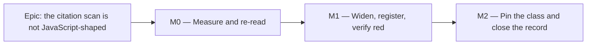

# Implementation Plan: `check:claims` — the citation scan sees more than JavaScript

- **Feature spec:** [`./feature-spec.md`](./feature-spec.md) (awaiting approval)
- **Status:** Draft
- **Owner:** repo

> **No application code.** Everything below is `scripts/`, `scripts/dependency-claims.json`, three
> documents and one comment in a `.tsx` file. No schema, no endpoint, no rendered surface —
> `database-architect` is not engaged because there is no schema object, and `check:frontend-only` is
> deactivated (`scripts/frontend-only.json` reads `"active": false`) and guards `apps/api/` and
> `packages/` in any case.

## Breakdown

### Epic

**The citation scan is not JavaScript-shaped** — close `docs/TECH_DEBT.md` #240 by making the
extension class an explicit, symmetric, justified decision, and register the three dependency claims
it has been unable to see.

---

## Milestone M0 — Measure and re-read (no code changes)

**Outcome:** the first-run cost of the widening is known from the _real script_, and each of the
three claims to be registered has been read in the installed package rather than trusted.
**Entry point:** **Ships dark** — nothing is reachable; M0 produces
`docs/specs/claims-citation-scan/m0-measurement.md` and changes no behaviour. ADR-0081 §1 is
satisfied by declaring it, and M1 names the entry point.
**Journey:** not applicable — there is no browser surface anywhere in this epic. The equivalent
enforcement (ADR-0081 §2's intent: something must drive the real thing) is that **every acceptance
criterion in M1 is a run of `pnpm check:claims` against the real tree**, never a unit assertion
about a regex.

> **Why M0 exists at all.** The spec's blast-radius table is a `ripgrep` approximation over
> `**/*.{md,ts,tsx,mjs}`. The script excludes itself, restricts the walk to eight directory roots,
> and de-duplicates by ref — so its number will differ. This repository's convention is to measure
> before widening rather than after (`#101`'s `packages/` widening was measured first and turned up
> zero, which is what made it "free rather than hopeful"). Measuring after is how a gate lands red on
> day one and gets deleted rather than fixed (ADR-0058).

---

#### Feature: the real first-run number

> **Description:** run the widened patterns through the script's own walk and classification, without
> arming anything, and report exactly which refs would be newly demanded.
> **Complexity:** S
> **Dependencies:** none
> **Risks:** the scratch harness diverges from the script it is imitating → mitigated by copying the
> walk and the classification order verbatim rather than re-implementing them, and by asserting that
> the harness reproduces **today's** finding count (zero) with today's patterns before the widened
> ones are tried.
> **Testing requirements:** the harness's control run (today's patterns, expected: zero findings) is
> reported alongside the treatment run. A harness that cannot reproduce the known-green state is not
> evidence about the widened one.

##### Task M0-T1 — Scratch harness: the real walk, widened patterns

- **Description:** a throwaway script (not committed, or committed under `docs/specs/…/` as output
  only) that reuses `scripts/check-claims.mjs`'s walk roster and classification order, with the
  extension class swapped for the candidate five, and prints: every newly demanded ref, its citing
  files, and whether it is repo-owned, foreign, or a genuine dependency claim.
- **Complexity:** S
- **Dependencies:** none
- **Risks:** measuring the wrong tree — the sweep must run on a clean checkout with no other epic's
  edits in flight (`docs/TECH_DEBT.md` #226's neighbours record a sweep that measured a half-applied
  change and reported none of it as a finding).
- **Testing:** control run first (today's patterns ⇒ **0** findings, matching a live
  `pnpm check:claims`).
- **Development steps:**
  1. Run `pnpm check:claims` on the clean tree and record the summary line verbatim (it should read
     `Dependency claims OK (94 claims against …)`; if the count differs, the register moved and every
     number below is re-derived).
  2. Copy the walk, `CITATION_SCAN_EXCLUDES`, `ownJsBasenames()` and the
     registered → own → finding ordering into the harness. Confirm it reports **0** with today's
     patterns and today's own-file globs.
  3. Run three treatments and record each separately:
     - **A** — extensions widened, own-file globs **not** widened. _(Expected ≈ 91 findings; this is
       the number that would land if only the obvious half of the change were made.)_
     - **B** — both widened. _(Expected 5: three `auth.css`, `useBlocker.d.ts:35`,
       `lucide-react.d.ts:342`.)_
     - **C** — B plus the foreign exclusion. _(Expected 2.)_
  4. Write `m0-measurement.md`: the three numbers, the full list for B, and — if B exceeds **15** —
     an explicit recommendation to split M1 into a report-only slice followed by an arming slice.
     Below 15, arm directly and say why.
  5. Record any difference between the harness's numbers and the spec's `ripgrep` estimates, with the
     cause. A silent correction is how a wrong figure gets laundered into a fact.

##### Task M0-T2 — Read the three cited locations in the installed packages

- **Description:** open each file and read the cited lines. Not "confirm the spec is right" — read
  them, and write down what is there.
- **Complexity:** S
- **Dependencies:** none
- **Risks:** accepting the spec's reading (which is itself a claim inherited from a brief —
  `docs/PROCESS.md` §"The brief is not evidence either").
- **Testing:** none yet; the outputs become anchors in M1.
- **Development steps:**
  1. `tailwindcss@4.3.3` → `preflight.css`. Confirm the version through the **link**
     (`apps/web/node_modules/tailwindcss/package.json`), not the store, and confirm the store holds
     exactly one `tailwindcss@…` directory so neither the conflict nor the ambiguity branch can fire.
     Record the exact line range of the `ol, ul, menu { list-style: none; }` rule and the comment
     above it.
  2. `@tanstack/react-router@1.170.27` → `dist/esm/useBlocker.d.ts` line 35. Record the line verbatim
     as the anchor candidate.
  3. `lucide-react@1.33.0` → `dist/lucide-react.d.ts` line 342. Record what it declares. **Note
     explicitly** that the citing document (`docs/specs/workspace-modes/feature-spec.md:180`) names
     version **1.28.0**, so this is a live instance of `docs/TECH_DEBT.md` #181 — a ref matching
     across versions by coincidence. Whether it still holds is a fact to establish, not to assume,
     and the answer decides M1-T4's branch.
  4. For each, choose an anchor that is **specific enough to fail** if the surrounding code is
     rewritten and **short enough to survive** reformatting. Prefer a declaration or a property over
     punctuation.

---

## Milestone M1 — Widen, register, verify red (the shippable slice)

**Outcome:** a maintainer who cites a dependency's stylesheet or type contract is required to
register it, and a bump of `tailwindcss`, `@tanstack/react-router` or `lucide-react` fails CI until
the citation is re-read.
**Entry point:** `pnpm check:claims` — the command in `package.json`, run by
`scripts/prepush.sh` and by the CI step named **Check dependency-internal claims**. That is the whole
surface; there is no screen and no accessible name, and this milestone says so rather than leaving
the field blank.
**Journey:** not applicable (no browser). Its stand-in is **six observed red runs** (M1-T5), each
verified to fail against the specific defect it guards before the fix is applied — ADR-0110 D5: a
gate is not finished when it passes, it is finished when it has been made to fail by the defect it
was written for.

---

#### Feature: one extension class, consumed by both halves

> **Description:** `CITED_EXTENSIONS` becomes the single source for the two citation patterns **and**
> for the `git ls-files` argument list that builds the own-file exclusion.
> **Complexity:** S
> **Dependencies:** M0-T1 (the number), CQ-1 (the class)
> **Risks:**
>
> - Widening one half only → the whole point of the constant; pinned by M2's derivation test and by
>   M1-T5's deliberate red run with the own-file half reverted.
> - A regex change that quietly matches more than intended (`.scss`, a bare word) → negative cases in
>   M2, and M0-T1's treatment B is a whole-tree check that nothing unexpected matched.
> - The greedy basename class mis-splitting a dotted extension (`useBlocker.d.ts` read as
>   `useBlocker.d`) → this is `#101` item 3 in a new costume and is the first thing M1-T5 checks.
>   **Testing requirements:** whole-tree runs of the real command, plus the six red verifications.

##### Task M1-T1 — Introduce `CITED_EXTENSIONS` and build both halves from it

- **Description:** declare the class once; construct the alternation used by both patterns from it;
  derive the `git ls-files` arguments from it; rename `ownJsBasenames()` to `ownBasenames()` because
  it is no longer about JavaScript.
- **Complexity:** S
- **Dependencies:** M0
- **Risks:** an alternation built by naive `join('|')` breaks on `d.ts` (the dot is a regex
  metacharacter) → escape each member, and make `d\.ts` an explicit test case.
- **Testing:** M2's derivation test; M1-T5's red runs.
- **Development steps:**
  1. Add `const CITED_EXTENSIONS = ['js', 'mjs', 'cjs', 'css', 'd.ts']` with a docblock stating D2's
     admission test — _a dependency in this tree ships files with it, a citation exists or is
     imminent, and the first-run cost has been measured_ — and D2's exclusion table with its reasons
     (`.ts`/`.tsx` at 3,801 matching lines; `.json` guaranteed-blind on `package.json`; no-extension
     refused on shape).
  2. Build the alternation with each member regex-escaped, longest-first so `d\.ts` cannot be
     shadowed, and substitute it into both patterns. Keep the colon pattern case-sensitive-with-`A-Z`
     and the prose pattern's `i` flag exactly as they are — that asymmetry was deliberate and is
     recorded at `scripts/check-claims.mjs:270-277`.
  3. Rename `ownJsBasenames()` → `ownBasenames()` and derive its `git ls-files` arguments from the
     same constant. Update its docblock, which currently says "Basenames of this repository's OWN
     JavaScript".
  4. In that docblock, record what widening does to `docs/TECH_DEBT.md` #101 item 1: the
     basename-collision blind spot now covers `.css` and `.d.ts` too, and name the repo-owned
     basenames it could hide (`globals.css`, `print-document.css`, `PrintSurface.css`,
     `GanttPrintSurface.css`, `HealthPrintDocument.css`, `m0-recovered-block.css`, `vite-env.d.ts`),
     with the measured fact that no dependency collides with any of them today.

##### Task M1-T2 — Name the third ownership category

- **Description:** add `FOREIGN_UNVERIFIABLE`, a basename set for files that are neither this
  repository's nor an installed dependency's, consulted after the own-file check.
- **Complexity:** S
- **Dependencies:** M1-T1, CQ-2
- **Risks:** the set becomes a dumping ground for citations somebody could not be bothered to
  register → the docblock states the single admission rule (**no installed package can resolve it,
  and it is not in `git ls-files`**), and each member names its citing documents.
- **Testing:** M1-T5 red run 5 — remove the entry, confirm the gate fails naming the three refs.
- **Development steps:**
  1. Add the set with `auth.css` and a docblock: it belongs to the previous Flask application in a
     different repository; `installed()` would report "not installed"; the citations are evidence for
     `docs/DESIGN_SYSTEM.md`'s alert-geometry rule and ADR-0077 §9.3 and must not be stripped.
  2. Insert the check into the completeness loop **after** the own-file check, so the ordering reads
     registered → own → foreign → finding, and a registered ref still wins first (the property that
     makes `index.js:733-739` work today).
  3. Add each citing file to the docblock: ADR-0077, `docs/DESIGN_SYSTEM.md`,
     `apps/web/src/components/ui/alert.tsx`, `apps/web/src/components/ui/alert.test.tsx`.

##### Task M1-T3 — Register the Tailwind Preflight claim and make its call site machine-readable

- **Description:** add `tailwindcss` to `verifiedAgainst`, add the claim, and rewrite the comment in
  `TsldPanel.tsx` so the citation is in the recognised colon form.
- **Complexity:** S
- **Dependencies:** M0-T2, M1-T1
- **Risks:** registering the claim without editing the call site leaves it "registered but uncited"
  — the _inverse_ of today's failure and equally silent → M1-T5 red run 1 covers exactly this
  sequencing.
- **Testing:** red run 1 (entry absent ⇒ fail), red run 2 (anchor moved ⇒ fail), red run 3 (version
  moved ⇒ fail).
- **Development steps:**
  1. `verifiedAgainst`: add `"tailwindcss": "<version read in M0-T2>"`.
  2. `claims`: add `{ ref: "preflight.css:202-205", package: "tailwindcss", path: "preflight.css",
lines: "202-205", anchor: "list-style: none;", citedBy: [...] }` — **`path` relative to the
     package directory**, so no `dist/` prefix. Use the exact range M0-T2 recorded; the numbers here
     are the spec's reading and must be confirmed, not copied.
  3. Rewrite `apps/web/src/features/tsld/components/TsldPanel.tsx:2892-2900`: keep the reason (why
     the redundant role is load-bearing), replace the prose version-naming with the colon citation,
     and **delete the sentence** _"The version is named here rather than pinned by `pnpm
check:claims`, because that gate's citation patterns match `.js`/`.mjs` only and structurally
     cannot see a CSS claim"_ — it becomes false in this commit, and leaving it is the drift class
     the whole gate exists against.
  4. Update the sibling docblock in
     `apps/web/src/features/tsld/components/TsldPanel.wbs-band-a11y.test.tsx` if it repeats the same
     claim, so the two cannot disagree.
  5. Add ADR-0122 §3 and `docs/TECH_DEBT.md` to `citedBy` **only if** they carry the citation in a
     recognised form; `citedBy` is not verified by the gate, so an aspirational entry there is a
     small lie that nothing will catch.

##### Task M1-T4 — Register the two `.d.ts` claims

- **Description:** `useBlocker.d.ts:35` and the `lucide-react.d.ts` line-list citation.
- **Complexity:** S
- **Dependencies:** M0-T2, M1-T1
- **Risks:**
  - `lucide-react.d.ts:342` may no longer hold what the citing table says → **branch**: if M0-T2
    found the declaration intact, register it with that declaration as the anchor and add a sentence
    to the citing document recording that it was re-read against the **installed** version, since the
    document names an older one. If it does **not** hold, do not register it — correct the citing
    document instead, which is the honest outcome and the one #181 predicts.
  - Registering `lucide-react.d.ts:342` satisfies the gate while the eight further line numbers in
    the same citation stay unchecked (the prose pattern captures only the first) → recorded as a new
    register row in M2-T3, not fixed here.
- **Testing:** whole-tree run; red run 4.
- **Development steps:**
  1. Add the `@tanstack/react-router` claim with the M0-T2 anchor and
     `citedBy: ["docs/specs/unsaved-work-guard/feature-spec.md",
"docs/specs/unsaved-work-guard/implementation-plan.md"]`. No `verifiedAgainst` change — the
     package is already pinned at 1.170.27.
  2. Add or decline the `lucide-react` claim per the branch above. No `verifiedAgainst` change —
     already pinned at 1.33.0.
  3. Confirm `resolveVia` needs no entry for either (both are linked into `apps/web`, and
     `tailwindcss` likewise).

##### Task M1-T5 — Verify red, six ways

- **Description:** the milestone is not done until each of these has been **observed failing**, with
  the output pasted into the PR. Reasoning about what would happen does not count.
- **Complexity:** M
- **Dependencies:** M1-T1 … M1-T4
- **Risks:** a red run that fails for the wrong reason and is read as success-by-failure → each step
  names the _expected message_, not merely a non-zero exit.
- **Testing:** this task **is** the testing.
- **Development steps:**
  1. **The defect itself.** With the call-site citation present and the Tailwind register entry
     removed: expect exit 1 naming `preflight.css:202-205` and `TsldPanel.tsx` as its citer. Restore
     → expect exit 0 and **no** "registered but no longer cited anywhere" note for that ref. _(Also
     record the pre-change state for the record: with today's script, both configurations exit 0 —
     the gate cannot tell them apart, which is the finding.)_
  2. **Anchor drift.** Change the Tailwind entry's `lines` to a range not containing the rule: expect
     "the anchor is no longer at `preflight.css`:…" naming `citedBy`.
  3. **Version drift.** Set `verifiedAgainst.tailwindcss` to a version that is not installed: expect
     the "Re-READ each cited location … Bumping the version alone makes this gate a rubber stamp"
     message, **and** confirm the anchor check is skipped for that package (`stale` short-circuit).
  4. **The `.d.ts` half.** Remove the `useBlocker.d.ts` entry: expect exit 1 naming both citing
     files. Confirm the captured ref is `useBlocker.d.ts:35` and **not** `useBlocker.d:35` — the
     dotted-basename failure in a new costume.
  5. **The symmetry.** Revert only the own-file half (leave `git ls-files` on
     `'*.js','*.mjs','*.cjs'`): expect ≈ 86 findings dominated by `globals.css`. This is the proof
     that D1 is load-bearing rather than tidy, and its output belongs in the PR.
  6. **The foreign exclusion.** Remove `auth.css` from `FOREIGN_UNVERIFIABLE`: expect exit 1 naming
     the three refs and their four citing files.
  7. Then run the real gate clean: `pnpm check:claims` (exit 0, summary line naming
     `tailwindcss@…`), followed by `pnpm prepush` — confirming `check:claims` reports **ok**, not
     `WARN`. `scripts/prepush.sh` treats exit 2 as advisory, and this gate must never land there.

---

## Milestone M2 — Pin the class and close the record

**Outcome:** the extension class cannot silently re-narrow, and every document that describes this
gate describes what it now does.
**Entry point:** `pnpm check:claims` (unchanged — M2 adds a self-test that runs with it).
**Journey:** not applicable; the self-test is the enforcement.

---

#### Feature: the derivation is asserted, not the values

> **Description:** a fixture-based self-test in the style of `scripts/check-reconcile-due.test.mjs`,
> proving that both patterns and the own-file globs come from one constant, and pinning the negative
> cases.
> **Complexity:** S
> **Dependencies:** M1
> **Risks:** the test asserts today's five extensions and therefore has to be edited whenever one is
> added — which makes it a chore rather than a gate → it asserts the **derivation** (for every member
> of the constant, both patterns match and the glob list contains it) and, separately, a small set of
> negative cases. Adding an extension then needs no test edit.
> **Testing requirements:** each assertion verified red against the specific mutation it guards.

##### Task M2-T1 — Extract the pure parts and add the self-test

- **Description:** move the pattern construction and the ref-classification predicate into
  `scripts/lib/citations.mjs`; add `scripts/check-claims.test.mjs`; chain it in the `check:claims`
  script.
- **Complexity:** M
- **Dependencies:** M1
- **Risks:**
  - **The new files are inside the walk.** `scripts/` is scanned and `.mjs` is a scanned input type,
    so a docblock example in either file becomes a demanded citation. Both must join
    `CITATION_SCAN_EXCLUDES` — and so must any `.md` fixture placed under `scripts/lib/fixtures/`,
    which the walk already reads.
  - A fixture reformatted by Prettier can keep its name and lose the property it pins
    (`scripts/lib/fixtures/` is in `.prettierignore` for exactly that reason) → put new fixtures
    there.
  - Extraction changes behaviour by accident → the whole-tree run before and after must produce
    byte-identical output.
- **Testing:** the self-test itself, verified red.
- **Development steps:**
  1. Extract; keep `check-claims.mjs`'s top-level flow otherwise untouched. Confirm identical output
     before and after.
  2. Add both new paths to `CITATION_SCAN_EXCLUDES` and say in its docblock why the set is now three
     files rather than one.
  3. Write the self-test: for every member of `CITED_EXTENSIONS`, the colon pattern and the prose
     pattern both match a synthetic citation and the `git ls-files` argument list contains it.
  4. Negative cases, each verified red against a plausible wrong implementation: `.scss` does not
     match (the alternation must require a literal dot before `css`); a bare `word:123` does not
     match; a dotted extension is captured whole; `.ts`/`.tsx`/`.json` do not match.
  5. Chain it: `"check:claims": "node scripts/check-claims.test.mjs && node scripts/check-claims.mjs"`.
     **No CI edit and no `prepush` edit** — `.github/workflows/ci.yml` already runs `pnpm check:claims`
     and `scripts/prepush.sh` derives its roster from `package.json`. If CQ's answer prefers a
     separate `check:*` script instead, a CI step must be added in the same PR, because `prepush`
     would pick it up and CI would not.

##### Task M2-T2 — Update the script's own account of itself

- **Description:** the header docblock's "What it checks" §3 says _"Every citation of a `.js`/`.mjs`
  file by line"_. That sentence becomes false in M1.
- **Complexity:** S
- **Dependencies:** M1
- **Risks:** a docblock describing the previous behaviour is precisely the drift this gate exists
  against, one layer in — and this repository has recorded a comment and its code landing together
  and disagreeing.
- **Testing:** read, not gated.
- **Development steps:**
  1. Rewrite §3 to name the class and point at `CITED_EXTENSIONS` for the reasons.
  2. Add the seventh hole to the comment history above `CITATIONS`, in the same voice as the third
     and fourth already recorded there, and note that this one was found by a claim that could not be
     registered rather than by CI.
  3. State the residual explicitly: the prose pattern captures only the first number of a
     comma-separated line list.

##### Task M2-T3 — Close and amend the register

- **Description:** `docs/TECH_DEBT.md` and (per CQ-3) ADR-0076.
- **Complexity:** S
- **Dependencies:** M1, M2-T1
- **Risks:** closing #240 while leaving its neighbours describing a gate that has changed → #101 is
  amended in the same commit.
- **Testing:** `pnpm check:debt-status`, `pnpm check:doc-links`, `pnpm check:adr-coverage` — all part
  of `pnpm prepush`.
- **Development steps:**
  1. Close #240 with a note recording what the row got right and the three ways it was understated:
     the hole is "not JavaScript" rather than "not CSS"; `.cjs` was in it, with the gate's two halves
     already disagreeing about it; there were already **two** live `.d.ts` instances, one older than
     the Tailwind case; and it is the **seventh** recorded hole, not the third.
  2. Amend #101: the basename blind spot now spans `.css` and `.d.ts`, with the measured fact that no
     collision exists today, and the reason it is still not fixed (path matching breaks legitimate
     prose).
  3. Amend #181 with the `lucide-react.d.ts` worked example: a citation naming 1.28.0 whose line
     number still resolves under 1.33.0 — a coincidence, and the reason the `anchor` field is the
     only thing standing between the gate and a rubber stamp.
  4. File **one new row**: the prose pattern reads only the first number of a comma-separated line
     list, so a citation listing nine lines is satisfied by registering one. Size S; not fixed here
     because it changes the notation and would newly demand eight refs.
  5. Per CQ-3, add an amendment section to
     `docs/adr/0076-wrong-claims-are-a-defect-class.md` naming the extension class, the symmetry rule
     (D1), the admission test (D2) and the third ownership category (D3). Update the ADR's entry in
     `CLAUDE.md` §16 only if the amendment changes what a reader of that register would conclude.
  6. Run `pnpm prepush` and report the result honestly, including any advisory `WARN`.

---

## Sequencing & slices

| Slice | Ships                           | `main` releasable? | Independently valuable                                                     |
| ----- | ------------------------------- | ------------------ | -------------------------------------------------------------------------- |
| M0    | one measurement document        | yes — no code      | yes: the number decides whether M1 arms directly or lands report-only      |
| M1    | the widened gate + three claims | yes                | yes: #240's defect is closed and three claims become bump-sensitive        |
| M2    | self-test + documentation       | yes                | yes: the class cannot re-narrow, and the docs stop describing the old gate |

**No feature flag.** ADR-0088 D1: a `VITE_` constant is inlined at build time and has never been an
operator rollback — and this is not client code in any case. The rollback is a revert of one commit.

**The escalation, stated in advance so it is not a judgement call under pressure:** if M0-T1's
treatment B exceeds **15** newly demanded refs, M1 splits into **M1a (report-only** — the widened
patterns print findings and the process exit code is unchanged**)** and **M1b (arm)**, with the refs
cleared between them. Below 15, arm directly. The threshold is chosen against the measured estimate
of 5 with room for the harness to disagree with `ripgrep`, and against ADR-0058's rule that a gate
failing on day one gets deleted rather than fixed.

## Definition of Done (per task)

Each task's PR must satisfy the Feature Completion Criteria in
[`docs/PROCESS.md`](../../PROCESS.md). For this epic specifically:

- `pnpm check:claims` run and its output pasted, both the red runs and the final green one.
- `pnpm prepush` run; `check:claims` reports **ok** rather than `WARN`.
- `scripts/e2e-local.sh` is **not** required: nothing under `apps/api/` changes and no Playwright
  suite is added or altered. Stated because CLAUDE.md §19.8 makes the e2e half non-optional when
  either is true, and "it did not apply" should be a recorded judgement rather than an omission.
- No changeset — there is no user-visible change. Commit scope `chore(repo)` or `docs`.
- The six red verifications are in the PR body, each with the message it produced.

## Risks & assumptions (rollup)

| Risk / assumption                                                                                               | Likelihood | Impact | Mitigation                                                                                                                                     |
| --------------------------------------------------------------------------------------------------------------- | ---------- | ------ | ---------------------------------------------------------------------------------------------------------------------------------------------- |
| The `ripgrep` estimate (5 newly demanded refs) is wrong and the real number is large                            | low        | high   | M0-T1 measures with the real walk before anything is armed; the report-only split is pre-agreed with a written threshold                       |
| Only one half of the change lands (extensions widened, own-file globs not)                                      | low        | high   | One constant feeds both (D1); M1-T5 run 5 observes the ≈ 86-finding failure; M2's derivation test pins it                                      |
| The alternation matches more than intended (`.scss`, a bare word)                                               | low        | med    | M2-T1 negative cases, each verified red; M0-T1 treatment B is a whole-tree check                                                               |
| `useBlocker.d.ts` is captured as `useBlocker.d`                                                                 | low        | med    | Explicit check in M1-T5 run 4; it is `#101` item 3's exact failure in a new extension                                                          |
| `lucide-react.d.ts:342` no longer holds what its citing table says                                              | med        | low    | M0-T2 establishes it by reading; M1-T4 branches to correcting the document instead of registering                                              |
| The new `scripts/lib` and test files become their own unregistered citations                                    | med        | low    | Both join `CITATION_SCAN_EXCLUDES` in the same task that creates them; fixtures go under `scripts/lib/fixtures/`, already in `.prettierignore` |
| This spec and plan are themselves scanned inputs, so their `.css`/`.d.ts` refs become demanded the day M1 lands | high       | low    | The refs used here are exactly the ones M1 registers; noted in the spec's Dependencies so a red merge is not a surprise                        |
| `#101`'s basename blind spot grows and is mistaken for coverage                                                 | med        | med    | Named in the `ownBasenames()` docblock with the repo-owned names it could hide, and amended into `#101` itself                                 |
| `#181` is untouched and a future reader assumes this epic addressed it                                          | med        | med    | Amended into `#181` with the worked example; the spec states it is structurally unchanged                                                      |
| A citation in a repo file the walk does not read (`.js`, `.css`, `.yml`) stays invisible                        | low        | low    | Measured at zero today; recorded in the spec's edge cases as a **different** hole from this one, not silently folded in                        |
| The self-test asserts today's five extensions and becomes a chore                                               | med        | low    | It asserts the derivation, not the values (M2-T1 step 3)                                                                                       |
