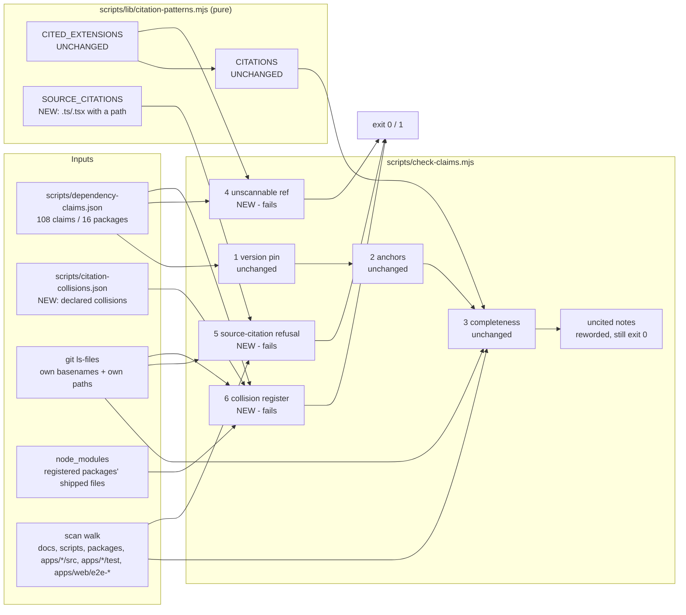
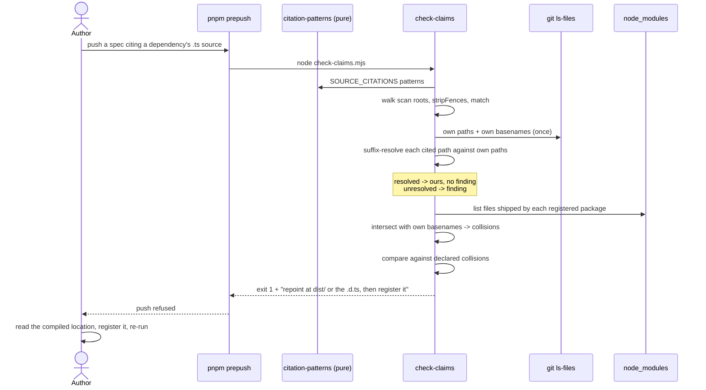
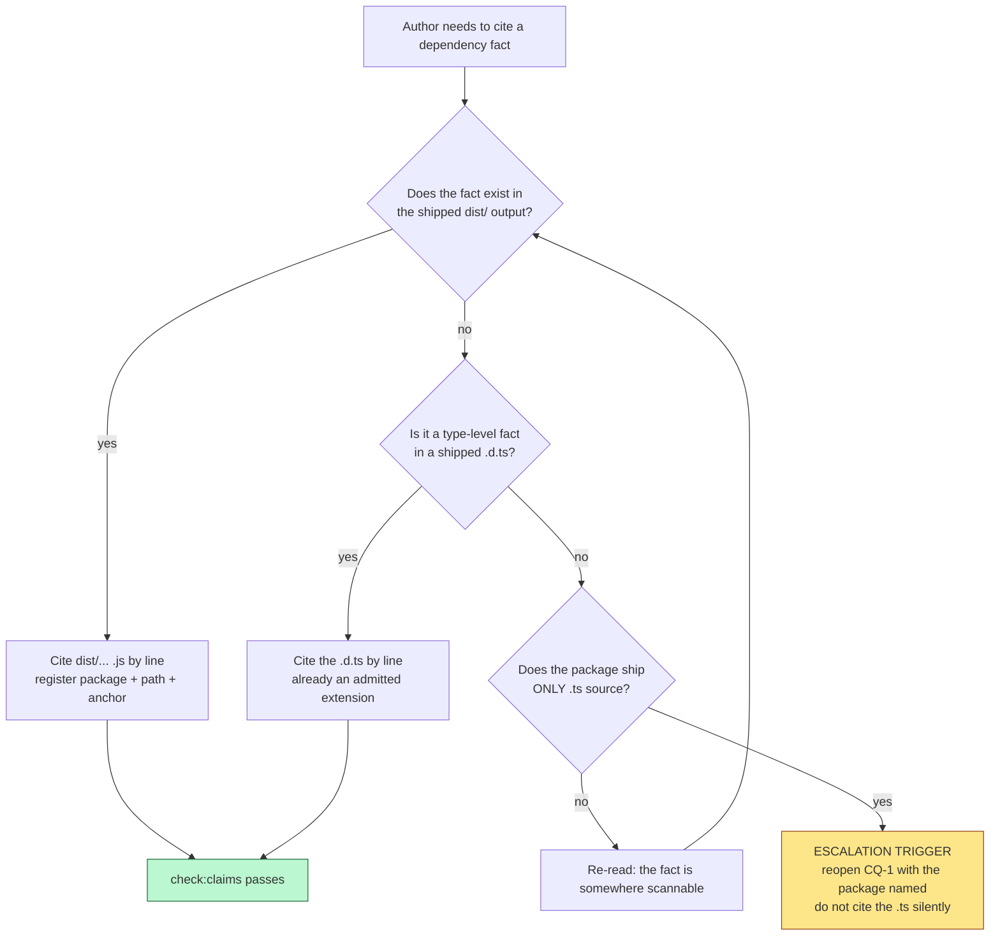

# Feature Spec: `check:claims` and a dependency's TypeScript source

- **Status:** Draft — awaiting approval before implementation
- **Author(s):** feature-analyst (Claude Opus 5)
- **Date:** 2026-09-12
- **Tracking issue / epic:** `docs/TECH_DEBT.md` #309
- **Roadmap link:** none — a repository gate, not planner-visible capability (the ADR-0136 exemption:
  a roadmap entry was considered and declined, because a planner cannot act on a CI gate)
- **Related ADR(s):** ADR-0076 (the gate's reason for existing), ADR-0058 (compute what can be
  computed), ADR-0110 D5 (a gate is finished when it has been made to fail), ADR-0120 (report-only →
  sweep → arm; the advisory/blocking exit convention), ADR-0124 (finding is generous, refusing is
  strict), ADR-0105 (why this needs a spec at all). A new ADR is **required** — see §4.6.

> **Why this document exists at all.** The change is small and it edits a **shared gate**, which
> CLAUDE.md §19.1 / ADR-0105 makes a full-spec trigger regardless of size. It was filed rather than
> folded into the epic that found it, on the #298/#299/#300 precedent.

---

## 0. Verification of #309's own claims

`docs/RECONCILE.md`'s rule is _verify the claim; do not trust the document_, and CLAUDE.md §19
extends it: **a plan's problem statement is a claim too**. #309 was filed on 2026-09-12 by the same
session that produced this brief, so it has had no chance to be checked by anyone. It was checked
here **before** any design was drafted. Nine assertions; **five hold, four do not**, and two of the
four change the work materially.

| #   | Claim (as #309 states it)                                                                                   | Verdict                   | Evidence                                                                                                                                                                                                                                 |
| --- | ----------------------------------------------------------------------------------------------------------- | ------------------------- | ---------------------------------------------------------------------------------------------------------------------------------------------------------------------------------------------------------------------------------------- |
| 1   | `CITED_EXTENSIONS = ['js', 'mjs', 'cjs', 'css', 'd.ts']`                                                    | **HOLDS**                 | `scripts/lib/citation-patterns.mjs:43`, read.                                                                                                                                                                                            |
| 2   | `.ts` is deliberately excluded, with a reason and an admission test                                         | **HOLDS**                 | `scripts/lib/citation-patterns.mjs:31-41`; the D2 test and the five exclusion reasons are there verbatim.                                                                                                                                |
| 3   | `.ts` is "3,801 matching lines across 315 files"                                                            | **STALE — an undercount** | Re-derived §0.1: **≈5,148 occurrences** across the current walk. Direction confirmed (bigger), magnitude corrected.                                                                                                                      |
| 4   | "No dependency here is cited by a `.ts` path" stopped being true on 2026-09-12                              | **HOLDS**                 | `@tanstack/router-core` ships `src/load-client.ts` in both installed copies (Glob), and `preloadComponent` is at lines 43–48 of it (read).                                                                                               |
| 5   | "nothing in the spec rests on an unprotected claim today" (the workaround is complete)                      | **FALSE**                 | `docs/specs/route-code-splitting/implementation-plan.md:117` **still names the `.ts` source**, unregistered and invisible. See §0.2.                                                                                                     |
| 6   | The failure is silent in both directions                                                                    | **HOLDS**                 | Structural: the patterns cannot match the extension (`citation-patterns.mjs:68`, `:71`), and `check-claims.mjs:407-413` downgrades a never-findable register entry to a `console.warn`.                                                  |
| 7   | The basename class "admits `.` but **not** `-`", so `load-client.ts:1462` truncates to `client.ts:1462`     | **FALSE — and inverted**  | Both classes are `[a-zA-Z0-9.-]` / `[a-z0-9.-]`; the trailing `-` is a literal hyphen. Already asserted by `citation-patterns.test.mjs:82-91`, and **30 of 108** registered refs carry a hyphen. See §0.3 — this voids a whole decision. |
| 8   | The `defaultPendingComponent` line is 672 in 1.171.28 and 666 in 1.171.22, and "the register cannot say so" | **HOLDS / half FALSE**    | The line numbers are exactly right (both copies read). The inference is too strong: `resolveVia` + `verifiedAgainst` **do** pin which copy a registered claim is about. See §0.4.                                                        |
| 9   | (from the brief, not the row) "today two register entries read as 'uncited' and the run still passes"       | **STALE**                 | Both `load-client.js` entries are cited now — `docs/specs/route-code-splitting/feature-spec.md:351` and `:486`. That was the transient state before the repoint. See §0.5.                                                               |

And one claim that is not #309's at all, found while checking its collision paragraph:

| #   | Claim                                                                                                                                              | Verdict       | Evidence                                                                                                                                                                                                           |
| --- | -------------------------------------------------------------------------------------------------------------------------------------------------- | ------------- | ------------------------------------------------------------------------------------------------------------------------------------------------------------------------------------------------------------------ |
| 10  | `check-claims.mjs:219-221`: "**No dependency in this tree collides with any of them** … none of the registered packages ships a … `vite-env.d.ts`" | **FALSE now** | `@tanstack/router-core` is a registered package (`dependency-claims.json:15`, pinned `1.171.28`) and ships `src/vite-env.d.ts` in **both** installed copies. The repo owns `apps/web/src/vite-env.d.ts`. See §0.6. |

### 0.1 Re-deriving the first-run population (claim 3)

The 3,801 figure is the stated reason for the exclusion, and #309 correctly insists it be re-derived
rather than quoted: it predates `packages/`, `apps/seed-cli/` and the `apps/web/e2e-*` directories
joining the scan walk (`check-claims.mjs:359-372`).

Measured today with ripgrep over the **current** walk, using the colon form's own basename class
(`\b[a-zA-Z0-9.-]+\.tsx?:\d+(-\d+)?\b`):

| Scan root                      |      `.ts` occurrences | `.tsx` occurrences |     Files |
| ------------------------------ | ---------------------: | -----------------: | --------: |
| `docs/**/*.md`                 |                  2,607 |              2,286 | 227 / 199 |
| `apps/web/src`                 |                     78 |                 72 |   52 / 49 |
| `apps/api` (src + test)        |  56 (combined `.tsx?`) |                  — |        29 |
| `apps/web/e2e-*` (25 dirs hit) |  33 (combined `.tsx?`) |                  — |        25 |
| `scripts`                      |  15 (combined `.tsx?`) |                  — |         4 |
| `packages`                     |                      1 |                  — |         1 |
| `apps/seed-cli`                |                      0 |                  0 |         0 |
| **Total**                      | **≈5,148 occurrences** |                    |           |

**Labelled honestly, because three different quantities get confused here.** These are ripgrep
**occurrences**, not matching _lines_ (a line may hold several), not _distinct refs_ (the gate
de-duplicates by `ref`), and emphatically not _findings_ (a finding is a distinct ref that is
neither registered, nor own-basename, nor foreign). The docblock's "3,801 matching lines" is the
second quantity; this is the first. What the two comparably measure is **direction and order of
magnitude**, and both agree: the population is thousands, and it has grown.

Two further caveats:

- The `scripts` figure includes 4 occurrences in `scripts/dependency-claims.json`, which the walk
  **does not read** (`check-claims.mjs:378` matches `md|ts|tsx|mjs` only). So the true scripts figure
  is 11.
- `apps/api`'s figure includes `.mts` files, also outside the walk.

**The finding count is NOT derivable without executing the gate**, and this spec does not pretend
otherwise. It is M0-T1's job (§ plan), and it is the third limb of D2's admission test — the one
limb #309 correctly records as unmet.

### 0.2 The workaround is incomplete (claim 5)

#309 says the two `.ts` citations "were repointed at `dist/esm/load-client.js:10-12` and `:671-672`
… so nothing in the spec rests on an unprotected claim today."

The **feature spec** was repointed: `docs/specs/route-code-splitting/feature-spec.md:351` cites
`load-client.js:10-12` and `:486` cites `load-client.js:671-672`, and both are registered
(`dependency-claims.json:1083`, `:1091`). Verified faithful: the anchor at `load-client.js:10-12` is
`return route.options[type]?.preload?.();`, which is the compiled form of `preloadComponent` at lines
43–48 of the `.ts` source — same fact, scannable file.

The **implementation plan** was not. `docs/specs/route-code-splitting/implementation-plan.md:117`
still names the `.ts` source in task M0-T4's description, as one of four citations that task exists to
register. So a live, unregistered, unprotected dependency citation is in the tree right now — and it
is invisible, which is why nothing reported it.

That is not a nitpick. It changes the problem's status from "a hole with no current occupant, worked
around" to "a hole with a live occupant". It also means the row's own repair instruction is
incomplete: whichever decision is taken below, `implementation-plan.md:117` must be dealt with.

> **The shape is worth naming.** The row correctly recorded a fix, and the fix covered the document
> the author was looking at. This register's recurring finding — one correct pattern applied to a
> control and not its neighbour — arriving in a _document_ rather than a component.

### 0.3 The truncation trap is not real (claim 7) — and this voids a decision

#309's sharpest paragraph, and the one the brief flagged as "the part most likely to be got wrong",
is wrong. The basename classes are:

- `citation-patterns.mjs:68` — `[a-zA-Z0-9.-]`
- `citation-patterns.mjs:71` — `[a-z0-9.-]` (with the `i` flag)

In a character class a `-` immediately before `]` is a **literal hyphen**. Both classes admit it.
Three independent confirmations:

1. **An existing committed assertion already says so.** `citation-patterns.test.mjs:82-91` tests
   `some-file.${ext}:12-14` for every member of the class and asserts it matches. The fixture name
   carries a hyphen.
2. **30 of 108 registered refs carry a hyphen in their basename** — `load-client.js:141-145`,
   `create-context.mjs:*` (4), `email-verification.mjs:*` (5), `internal-adapter.mjs:773-783`,
   `sign-in.mjs:*` (3), `sign-up.mjs:*`, and more. If the class did not admit `-`, each would be
   captured truncated, would fail to match its register entry, and the gate would be **loudly**
   broken in 30 places rather than quietly wrong in one.
3. **The row inverted the history it was reading.** `docs/TECH_DEBT.md:2330` (#101 item 3) records
   the pre-fix class as `[a-z0-9-]+` — the hyphen was there **first**, and the 2026-08-08 fix added
   the **dot**. #309 read that as the reverse.

**Consequences.** `load-client.ts:1462` would be captured whole as `load-client.ts:1462`. The
`client.ts` collision #309 describes **cannot arise by truncation**. So the brief's decision 3 —
"whether admitting `-` to the basename class is a prerequisite, a separate change, or wrong" — is
**void**: it is already done, and its requested deliverable ("enumerate which currently registered
refs would change meaning if the class widened") is answered by the 30 refs above, which prove the
class is already wide. Nothing needs to change here, and a commit "adding `-`" would be a no-op
whose presence in the history would imply a defect that never existed.

The collision class is **not** void, however — it is real for a different reason (§0.6), and it is
live today.

### 0.4 Version sensitivity is real; the inference about the register is too strong (claim 8)

Read directly, both copies installed:

- `@tanstack/router-core@1.171.28`, `dist/esm/load-client.js:671-672` — the anchor
  `route.options.pendingComponent ?? router.options.defaultPendingComponent` sits on line 672.
- The 1.171.22 copy of the same file carries that identical anchor **six lines earlier**, on line
  666, with a materially different neighbourhood (an inlined `return` where 1.171.28 has a
  `session` branch).

So a `ref` string is genuinely ambiguous across the two copies — #181's subject exactly.

What #309 overstates is "the register cannot say so". It can, by a different route than the `ref`:
`dependency-claims.json:20-25` maps `"@tanstack/router-core": "@tanstack/react-router"` in
`resolveVia`, and `check-claims.mjs:108-130` resolves the transitive copy **through that dependent** —
so "which installed copy this claim is about" is a recorded fact, not a guess, and
`verifiedAgainst` pins it at `1.171.28`. The registered range therefore anchors correctly and would
**fail** against the 1.171.22 copy, which is the gate working.

The residual gaps are (a) the prose citation in a _document_ carries no version, so a human reader
cannot tell which copy is meant, and (b) `ref` is not unique across versions, so two claims at a
coinciding line would collide. Both are #181's, both change the register's **identity model**, and
folding a shared-gate identity change into this row is the thing #298/#299/#300 exist to prevent.
**Out of scope — see §1 Open questions CQ-3, with the measurement handed to #181.**

### 0.5 "Two entries read as uncited" is stale (claim 9)

The brief's decision 6 asserts that "today two register entries read as 'uncited' and the run still
passes". Checked: both `load-client.js` entries are cited (§0.2), so that state no longer exists. It
described the transient moment between registering the `.ts` citations and repointing them — which is
how the hole surfaced, and is the row's own narrative, not a present condition.

Whether **any other** register entry is currently uncited is **not established here**, because it
requires executing the gate. M0-T1 measures it. The underlying design question the brief asks is
still a good one and is answered in D3 (§4.4).

### 0.6 The collision class is live today, in the already-admitted `d.ts` class (claim 10)

`check-claims.mjs:214-221` enumerates the basenames `CITED_EXTENSIONS` added at #240 and then
asserts, "checked, not assumed", that no dependency collides with any of them — naming
`vite-env.d.ts` specifically.

Measured: `@tanstack/router-core` ships `src/vite-env.d.ts` in **both** installed copies (Glob over
the pnpm store), and it is a **registered** package (`dependency-claims.json:15`). The repository
owns `apps/web/src/vite-env.d.ts`. So the basename collides, and the resolution order at
`check-claims.mjs:393-403` is registered → own → foreign → finding: an **unregistered** citation of
that dependency file would be absorbed by `own.has(base)` and skipped **silently**.

Two things follow.

- The docblock sentence is false **now**. Whether it was false when written is not established here
  and is not worth establishing; the sentence is load-bearing evidence for a safety property, and a
  reader who trusts it is misled today. It is the ADR-0076 Class 2 shape inside the gate built to
  stop Class 2.
- **The collision risk is not a consequence of admitting `.ts`.** It exists in the shipped
  configuration. That matters for sequencing: the collision work is independently justified and
  should land whether or not `.ts` is ever admitted.

`docs/TECH_DEBT.md` #101 item 1's 2026-09-10 re-verification is **not** contradicted by this. That
measurement was correctly scoped to `claims[].path` — the files actually cited — and remains true:
no _cited_ dependency basename collides. This finding is about a dependency file that **exists and
could be cited**, which is the latent half #101 item 1 describes and says "nothing warns" about.

---

## 1. Business understanding

### Problem

`pnpm check:claims` exists because a decision resting on a dependency's internals rots silently when
that dependency is bumped (ADR-0076). Its completeness half makes that promise enforceable: **a
citation cannot be added without recording what it says and what proves it.**

That promise has a hole with a live occupant. The gate recognises a citation only if the cited file
carries one of five extensions (`citation-patterns.mjs:43`), and a dependency's **TypeScript
source** is not among them. So:

- `docs/specs/route-code-splitting/implementation-plan.md:117` cites a dependency's `.ts` source
  today. It is not demanded, not registered, not version-pinned, and will not be noticed rotting.
- A register entry for such a citation can never be matched, so it is reported as "registered but no
  longer cited anywhere" (`check-claims.mjs:407-413`) — a message whose stated remedy is _deletion_.
  That is how the hole surfaced, and it is the worse half: the gate's own diagnostic points the
  reader at removing the protection.

Both halves fail towards green, which is why nothing ever went red. It is the **eighth** recorded
hole of exactly this shape in this one gate (the extension hole itself is numbered the seventh at
`citation-patterns.mjs:22-24`).

**Who feels the pain.** Nobody, visibly — which is the point and the reason it needs a gate rather
than vigilance. The person harmed is a future reader (human or agent) who acts on a cited line that
has moved, or who deletes a register entry the gate told them was dead.

### Users

Not a product capability. There are no organisation roles, no tenancy and no RBAC surface here —
stated explicitly because the template asks and the honest answer is "none" (see §2 Permissions).

| User                                                                          | Need                                                                                                    |
| ----------------------------------------------------------------------------- | ------------------------------------------------------------------------------------------------------- |
| A maintainer or agent writing a spec, ADR or docblock that cites a dependency | To be told, at push time, that the form they have used cannot be protected — and what to write instead. |
| A maintainer triaging the register                                            | To be able to tell "this entry is dead weight" from "the gate cannot see this citation".                |
| A future reader of any cited line                                             | That the line is where the document says it is, in the version the document says was read.              |

### Primary use cases

1. An author writes a `.ts`-source citation of a dependency. The gate refuses it and names the
   remedy (the compiled file, or the `.d.ts`).
2. A maintainer runs `pnpm check:claims` and reads a registered-but-uncited note that distinguishes
   "delete this" from "the gate is blind here".
3. A dependency bump introduces a basename that collides with one of this repository's own, and the
   gate says so instead of silently widening its own blind spot.

### User journeys

Happy path: an author cites a dependency, `pnpm prepush` runs `check:claims`, the gate passes because
the citation is registered against the resolved version. Unchanged by this work.

The path this work adds: an author cites a dependency's `.ts` source. `check:claims` fails naming the
file, the line range and the two acceptable rewrites. The author repoints at `dist/` or the `.d.ts`,
reads the code there, and registers it. See the user-flow diagram in §4.

### Expected outcomes

- No form of dependency citation is silently unprotected. Either it is registered, or it is refused
  with a remedy.
- The registered-but-uncited note stops being able to recommend deleting a live protection.
- A future collision between a dependency basename and one of ours is loud and declared, not a
  sentence in a docblock that nobody re-derives.

### Success criteria

| Criterion                                                                                                       | How it is known                                                                                 |
| --------------------------------------------------------------------------------------------------------------- | ----------------------------------------------------------------------------------------------- |
| S-1. Every assertion added by this work has been **made to fail** by the specific defect it guards.             | A committed mutation ledger, one named mutation per assertion (ADR-0110 D5).                    |
| S-2. `pnpm check:claims` passes on `main` at the end, and the arming commit is preceded by a committed red run. | The red-run artefact is committed (ADR-0120's order).                                           |
| S-3. The live unprotected citation at `implementation-plan.md:117` is gone, and the gate would now refuse it.   | A mutation re-inserting it turns the gate red.                                                  |
| S-4. The false docblock sentence at `check-claims.mjs:219-221` is replaced by a declared, gated collision list. | `vite-env.d.ts` appears in a register file with a reason; adding an undeclared collision fails. |
| S-5. The first-run finding count is **measured and reported**, not estimated, before any assertion is armed.    | `m0-measurement.md`, with the command that produced each number.                                |
| S-6. No `apps/` file is modified.                                                                               | `git diff --stat` shows `scripts/` and `docs/` only.                                            |

### Open questions

Two critical, four with stated defaults.

> **CQ-1 (CRITICAL) — Is declining wholesale `.ts` admission the right call?**
>
> §4.1 recommends **declining** it and building a narrower refusal instead. The recommendation rests
> on measured facts (≈5,148 occurrences; a collision class that is the norm rather than the
> exception for `.ts`; `.d.ts` already admitted, which covers type-only facts), and on the
> exclusion file's own reasoning about `.json`. This register treats a decision not to build as a
> success (ADR-0085, ADR-0137), so the case for declining is argued in full rather than softened.
>
> **This is the one question whose answer changes the shape of the work**, so it is asked rather
> than defaulted. If the answer is "admit it anyway", the plan's M1–M3 are replaced by a
> report-only → sweep → arm programme over a population two orders of magnitude larger than the
> register, and the collision work (§4.3) becomes a **prerequisite** rather than a sibling.

> **CQ-2 (CRITICAL) — Should the new refusal be blocking or advisory?**
>
> ADR-0124 amended ADR-0120's exit convention: advisory is a **declaration**, listed in
> `prepush.sh` and cross-checked by `check:advisory-agreement`. `check:claims` is blocking today,
> and adding an advisory pass **inside a blocking gate** is not expressible — the gate has one exit
> code. So the real question is whether the new pass shares `check:claims`' exit or becomes a
> separate script.
>
> **Recommended: share it, blocking, after the sweep.** It is the same subject, the same register
> and the same remedy, and a second script is a second roster entry to keep in step
> (`check:ci-roster`). Answered rather than defaulted because it decides whether a new CI step and
> a new roster entry exist — which is itself an ADR-0105 trigger.

Defaults taken, stated so they are not re-litigated silently:

- **D-a. `.tsx` is treated exactly as `.ts`.** Refused when it names a dependency path, not
  admitted to `CITED_EXTENSIONS`. Default because the argument is strictly stronger: a dependency
  shipping `.tsx` source that anybody would cite by line is not plausible, and none was found.
- **D-b. The scope is `.ts`/`.tsx` citations that carry a path.** A bare `client.ts:12` stays
  invisible, because it is indistinguishable from prose about one of this repository's ~hundreds of
  same-named files and refusing it would fail on day one (ADR-0058). Stated as a **named blind
  spot**, not glossed.
- **D-c. `CITATION_SCAN_EXCLUDES` is not widened to `docs/TECH_DEBT.md`.** That file is a major
  citation site; excluding it to silence this row's own illustrative text would be a far larger
  hole than the one being closed. Illustrative forms go in **fenced blocks**, stripped by
  `stripFences` (§4.5).
- **D-d. #101 item 1 is narrowed, not closed.** This work makes a collision loud; it does not
  replace basename matching with path matching, which #101 rejected for a reason that still holds
  (prose legitimately writes both the full path and the bare basename).

---

## 2. Functional requirements

### User stories & acceptance criteria

> **US-1** — As an author citing a dependency, I want to be told when my citation form cannot be
> protected, so that I do not leave a decision resting on an unverifiable line.
>
> **Acceptance criteria**
>
> - **Given** a scanned file containing a citation whose path names a dependency's `.ts` or `.tsx`
>   source **when** `pnpm check:claims` runs **then** it exits non-zero, naming the file, the line,
>   the cited path, and both acceptable rewrites (the compiled `dist/` file, or the `.d.ts`).
> - **Given** a citation whose path **suffix-resolves to a file tracked by `git ls-files`**
>   **when** the gate runs **then** it is treated as a self-citation and produces no finding.
> - **Given** a `.ts` citation with **no** path (a bare basename) **when** the gate runs **then** it
>   produces no finding, and the blind spot is documented at the call site.
> - **Given** the illustrative bad form written inside a fenced code block **when** the gate runs
>   **then** it produces no finding.

> **US-2** — As a maintainer triaging the register, I want an uncited entry to tell me _why_ it is
> uncited, so that I do not delete a live protection on the gate's advice.
>
> **Acceptance criteria**
>
> - **Given** a register entry whose `ref` extension is **outside** `CITED_EXTENSIONS` **when** the
>   gate runs **then** it **fails** — such an entry can never be satisfied, so it is a defect and
>   not dead weight.
> - **Given** a register entry whose `ref` extension is inside `CITED_EXTENSIONS` and which no
>   scanned file cites **when** the gate runs **then** it warns exactly as today (still a judgement
>   call; still not a failure).
> - **Given** either case **when** the message is printed **then** the two are worded differently
>   enough that a reader cannot act on one as though it were the other.

> **US-3** — As a maintainer, I want a new basename collision between a dependency and this
> repository to be loud, so that the gate's blind spot cannot widen unnoticed.
>
> **Acceptance criteria**
>
> - **Given** a basename shipped by a **registered** package that is also a basename in
>   `git ls-files` **when** the gate runs **then** it must be declared in a register file with a
>   reason, or the gate fails.
> - **Given** `vite-env.d.ts` **when** the gate runs on the current tree **then** it is reported as a
>   **declared** collision (the truthful replacement for the false docblock sentence).
> - **Given** the declared list **when** the collision disappears (the dependency stops shipping the
>   file, or we stop owning ours) **then** the gate fails on the stale declaration, so the list
>   cannot rot in the reassuring direction.

> **US-4** — As the author of this change, I want the live unprotected citation removed, so that the
> repository does not ship a claim the gate is about to forbid.
>
> **Acceptance criteria**
>
> - **Given** `docs/specs/route-code-splitting/implementation-plan.md:117` **when** this work lands
>   **then** it no longer names the `.ts` source, and it names the registered compiled citation
>   instead — with the substitution verified to carry the same fact, not assumed.

### Workflows

1. **Authoring.** Author writes a citation → `pnpm prepush` → `check:claims` → pass, or refusal with
   remedy → author reads the compiled/`.d.ts` location, registers it, re-runs.
2. **Triage.** Maintainer runs `check:claims` → reads notes → an "extension not scanned" note sends
   them to the extension class; an "no longer cited" note sends them to the citing documents.
3. **Dependency bump.** Dependabot bumps a registered package → `verifiedAgainst` goes stale →
   existing behaviour (fail, re-read, re-anchor) → **and now** the collision list is re-derived, so a
   newly-shipped colliding basename is refused rather than silently absorbed.

### Edge cases

| Case                                                                                                                                             | Expected behaviour                                                                                                                                                    |
| ------------------------------------------------------------------------------------------------------------------------------------------------ | --------------------------------------------------------------------------------------------------------------------------------------------------------------------- |
| A `.ts` citation with a **partial repo path** (`features/perf-probe/scenes/canvas-draw.ts:8`, live at `route-code-splitting/feature-spec.md:85`) | **No finding.** Suffix-resolves against `git ls-files`. This case is why the discriminator is suffix-resolution and not "does the first segment look like a package". |
| A `.ts` citation naming a path that resolves to **nothing** — neither a tracked file nor a dependency                                            | **Finding.** Either a dependency citation or a stale path; both want a human. The message says so rather than guessing.                                               |
| The illustrative bad form inside this spec and inside #309's row                                                                                 | **No finding** — fenced. Unfenced prose in `docs/TECH_DEBT.md` #309 must be re-fenced as part of this work (D-c).                                                     |
| A package installed twice (both router-core copies)                                                                                              | Unchanged: `resolveVia` decides, or the gate refuses (`check-claims.mjs:184-189`).                                                                                    |
| A collision where the citation **is** registered                                                                                                 | No finding, today and after: registered wins first (`check-claims.mjs:393-397`). The collision list still reports it as declared.                                     |
| The collision scan finds a package directory it cannot read                                                                                      | **Finding, not a silent skip.** An unreadable package is an unmeasured collision surface, which is the condition this exists to remove.                               |
| `git ls-files` returns nothing (not a checkout)                                                                                                  | **Finding.** A zero-length own-set would make every citation a finding _and_ every collision invisible; a population of zero must refuse a verdict (ADR-0130's rule). |

### Permissions

**Not applicable, stated rather than omitted.** This is a repository gate. There is no endpoint, no
organisation scope, no role, no tenant and no request. It runs as whoever runs `pnpm prepush` or the
CI job. Deny-by-default, RBAC and ADR-0012 resource scoping have nothing to attach to here.

### Validation rules

| Input                          | Rule                                                                                                                                                                                                                     |
| ------------------------------ | ------------------------------------------------------------------------------------------------------------------------------------------------------------------------------------------------------------------------ |
| A new collision-register entry | Must carry the basename, the declaring package name, and a non-empty **reason**. A blank reason admits nothing (the ADR-0136 licence-gate precedent, whose blank-reason rule had no test at all — so this one gets one). |
| `CITED_EXTENSIONS`             | Unchanged by this work. Any change to it re-opens D2's admission test, and the test must be re-run rather than re-read.                                                                                                  |
| A register `ref`               | Its extension must be a member of `CITED_EXTENSIONS` (US-2). Measured: **0 of 108** entries violate this today, so the assertion arms clean.                                                                             |

### Error scenarios

There is no HTTP surface. The equivalent table is the gate's exit behaviour.

| Scenario                                                   | Detection                 | Result                                                | Exit |
| ---------------------------------------------------------- | ------------------------- | ----------------------------------------------------- | ---- |
| Dependency `.ts`/`.tsx` citation with an unresolvable path | new pass (§4.2)           | failure naming file, line, path, and both rewrites    | 1    |
| Register entry whose `ref` extension is unscannable        | new assertion (§4.4)      | failure — structurally unsatisfiable entry            | 1    |
| Registered entry nobody cites, extension scannable         | existing `console.warn`   | note, reworded to exclude the blind-spot reading      | 0    |
| Undeclared dependency/repo basename collision              | new collision pass (§4.3) | failure naming the basename and the declaring package | 1    |
| Declared collision that no longer exists                   | new collision pass        | failure on the stale declaration                      | 1    |
| Version pin stale, anchor moved, package missing           | existing checks           | unchanged                                             | 1    |

---

## 3. Technical analysis

| Area           | Impact   | Notes                                                                                                                                                                                                            |
| -------------- | -------- | ---------------------------------------------------------------------------------------------------------------------------------------------------------------------------------------------------------------- |
| Frontend       | **none** | No `apps/web` file is touched. Verified as a constraint, not assumed: the diff is `scripts/` + `docs/` only.                                                                                                     |
| Backend        | **none** | No `apps/api` file is touched. **The CPM engine is not imported and no migration runs**, so the ADR-0034 recalculation parity gate is untouched in its honest form: there is nothing here to hold parity for.    |
| Database       | **none** | No model, column, index, constraint or data migration. **`database-architect` is therefore not engaged — because there is nothing to design, not because a change was judged too small** (CLAUDE.md §19.3).      |
| API            | **none** | No route, DTO or OpenAPI change.                                                                                                                                                                                 |
| Security       | low      | The gate reads `node_modules` directory listings and `git ls-files`. No new network access, no secret, no credential. It does **not** read dependency file _contents_ beyond what the anchor check already does. |
| Performance    | low      | One extra `git ls-files` is avoidable (the own-set is already read once). The collision pass adds a bounded directory walk of the 16 registered packages. Budget and measurement in M0-T3.                       |
| Infrastructure | low      | Possibly one CI step and one `check:ci-roster` entry, depending on CQ-2. If the pass shares `check:claims`, **neither** is needed — which is the recommendation's main practical advantage.                      |
| Observability  | low      | The gate's own output is the observable. The summary line gains the collision count and the blind-spot count, so a reader can see what was **not** checked.                                                      |
| Testing        | med      | `citation-patterns.test.mjs` extended; a new sibling test for the new pass; a committed mutation ledger; a committed red run. No Playwright, no a11y surface.                                                    |

### Dependencies

- Nothing must land first. The work is self-contained in `scripts/` and `docs/`.
- **It touches a file two other gates share.** `scripts/lib/doc-register.mjs` provides `stripFences`
  and `headerField`, consumed by `check-spec-status.mjs` and `check-debt-status.mjs`. If the new pass
  needs `stripFences` (it does — D-c), it **imports** it and must not modify it; ADR-0124 records
  both of that module's hardenings having been untested, and a change there is a separate
  shared-gate change with its own trigger.
- `docs/specs/route-code-splitting/implementation-plan.md` is edited (US-4). That spec is
  **Draft/in-flight**; the edit is one citation in a task description and does not change the task.
- `docs/TECH_DEBT.md` #309 is edited: its false paragraph corrected in place (not deleted — the
  correction is the useful part), and its illustrative form fenced.

---

## 4. Solution design

### Architecture overview



The load-bearing property is what is **not** in that diagram: `CITED_EXTENSIONS` and `CITATIONS` are
unchanged, so the register's identity model, the own-basename filter's width and the existing
finding set are all untouched. Everything new is an **additional refusal**, which is why the first-run
cost is bounded by a measurable handful rather than by §0.1's thousands.

### Data flow



### User flow



### Database changes

**None.** No model, no column, no index, no constraint, no migration. `database-architect` is not
engaged for that reason.

### API changes

**None.**

### Component changes

**None.** No `apps/web` file is modified; there is no route, component, token or accessible surface.

### 4.1 D1 — `.ts` is NOT admitted to `CITED_EXTENSIONS` (recommended)

**Decision: decline.** The D2 admission test has three limbs. Limbs one and two are now met — a
dependency ships `.ts` source and a citation exists. Limb three, the measured first-run cost, is
where it fails, and it fails for a reason stronger than size.

**The argument that decides it is the file's own reasoning about `.json`**, applied to `.ts`.
`citation-patterns.mjs:36-39` excludes `.json` not because there are many but because
`package.json`'s basename is one **every** package shares with ours: it "would be structurally
guaranteed to be skipped by the own-file filter while reading as coverage, which is
`docs/TECH_DEBT.md` #124's defect exactly."

`.ts` is much closer to `.json` than to `.css`. Not because one basename is universal, but because
this repository owns so many `.ts` basenames that collision is the **norm**. Measured against
`@tanstack/router-core`'s ~43 shipped `.ts` sources per copy, the repository owns a same-named file
for `index.ts` (eleven of them under `packages/` alone), `client.ts` (two), `utils.ts`, `types.ts`
and `vite-env.d.ts` — and `ownBasenames()` derives its globs from `CITED_EXTENSIONS`
(`citation-patterns.mjs:97-99`), so admitting `ts` adds `*.ts` to the own-set and absorbs every one
of them **silently**. Admitting `.ts` would therefore make the gate _look_ like it covers a
dependency's source while guaranteeing that the commonest basenames are skipped. That is a worse
outcome than the honest hole it replaces.

The second argument is that **the gap is much narrower than #309 implies, because `.d.ts` is already
admitted.** A dependency's cited facts are of two kinds. An _implementation_ fact (what a function
does, what a default is at runtime) is in the shipped `dist/` output, which is scanned — verified on
the live example: `preloadComponent` at lines 43–48 of the `.ts` source is
`load-client.js:10-12` compiled, same fact, and `defaultPendingComponent`'s resolution is
`load-client.js:671-672`. A _type-level_ fact is in the shipped `.d.ts`, which **is** an admitted
extension and is already used: `router.d.ts:98-113` and `index.d.ts:12` are registered claims. So
the uncovered residue is narrow: a package that ships **neither** a `dist/` carrying the fact **nor**
a `.d.ts` carrying it. M0-T2 measures whether any registered package is in that state; none is
expected, and the escalation trigger is written down (§4.7) rather than left to instinct.

The third argument is that **the population is not merely large, it is almost entirely a different
subject.** ≈5,148 occurrences (§0.1), essentially all of them this repository citing itself in
docblocks and specs. The gate's promise is about _dependencies_. Admitting `.ts` recruits thousands
of self-citations into a mechanism designed for a register of 108 dependency claims, and the only
thing standing between them and the finding list is a silent basename filter. ADR-0058's rule
applies: a gate that fails on day one gets deleted rather than fixed — and a gate that _passes_ on
day one by silently skipping 5,000 inputs is worse, because nothing ever prompts the reader to look.

**Alternatives considered and rejected.**

- **Admit `.ts` and make the own-filter path-aware.** This is the only version of admission that is
  not a trap, and it means replacing basename matching with path matching in the gate's core. #101
  item 1 rejected that with a reason that still holds: prose legitimately writes both
  `dist/api/routes/sign-in.mjs` and `sign-in.mjs` for the same claim, and neither is wrong. It also
  collides with #181's identity-model question. This is a large, separate shared-gate change and
  folding it in here is precisely what #298/#299/#300 exist to prevent.
- **Admit `.ts` for registered packages only.** Cannot work: the scan discards the path by design, so
  at match time the gate does not know which package a bare basename belongs to. That is #181's
  gap, not a switch.
- **Do nothing (a pure decline).** Honest, and weaker than what is recommended, because it leaves the
  silence. The whole value of the recommendation is converting an invisible miss into a loud
  instruction — which costs a handful of findings rather than thousands.

### 4.2 D2 — a dependency-path `.ts`/`.tsx` citation is REFUSED, with a remedy

A new, separate recogniser — `SOURCE_CITATIONS`, in the same pure module beside `CITATIONS` so the
two cannot be written in two places (the #240 rule) — matches a `.ts`/`.tsx` file reference with a
line range **that carries a path**. For each match, the cited path is **suffix-resolved against
`git ls-files`**:

- resolves → a self-citation → no finding;
- does not resolve → **finding**, worded as: this is either a dependency's TypeScript source (repoint
  at the compiled file or the `.d.ts`, then register it) or a stale path (fix it).

**Suffix resolution is the load-bearing choice and it was derived from a live counter-example, not
chosen for elegance.** The obvious discriminator — "does the leading segment look like a package
name?" — produces a false positive on `docs/specs/route-code-splitting/feature-spec.md:85`, which
cites `features/perf-probe/scenes/canvas-draw.ts:8`: a real, correct partial repo path whose first
segment is not a package. And matching a package name from the registered set would only ever catch
the 16 packages already registered, which is the set least likely to be cited unprotected. Suffix
resolution handles both: the partial repo path is a suffix of a tracked path, and a dependency's
`src/...` path is not.

Its **blind spot is named** (D-b): a bare `.ts` basename with no path is not examined, because it
cannot be told apart from prose about one of hundreds of our own files. That is written into the
pass's own docblock, because an unstated blind spot is how this gate acquired eight holes.

`stripFences` is applied before matching, which is what makes D-c possible — and what makes this
very document lawful.

### 4.3 D3 — a basename collision is DECLARED, and a new one fails

Replaces the false sentence at `check-claims.mjs:219-221` with a mechanism, on the precedent this
repository already uses for `flag-retirement.json` and `spec-status.json`: the safety property is
**derived and compared against a declared list**, not asserted in prose.

The pass enumerates the files shipped by each **registered** package (resolving through the existing
`installed()` helper, so `resolveVia` and the two-copies refusal are honoured for free), intersects
their basenames with `ownBasenames()`, and compares the result against
`scripts/citation-collisions.json`. An undeclared collision fails. A **declared collision that no
longer exists** also fails, so the list cannot rot in the reassuring direction — which is the
direction that produced the sentence being replaced.

`vite-env.d.ts` is the first declared entry, with its reason: `@tanstack/router-core` ships
`src/vite-env.d.ts`, we own `apps/web/src/vite-env.d.ts`, and no citation of the dependency's copy
exists or is plausible. That is a true, checked, visible statement where there was a false invisible
one.

**This ships regardless of CQ-1's answer, and that is the point of separating it** (§0.6): the
collision risk is live in the shipped configuration, not a consequence of admitting anything. If
CQ-1 is answered "admit `.ts`", this becomes a **prerequisite** rather than a sibling, because
admission multiplies the collision surface by the whole `.ts` estate.

### 4.4 D4 — an unsatisfiable register entry is a failure; an uncited one is still a note

Two facts wear one message today. `check-claims.mjs:407-413` warns for any registered `ref` no
scanned file cites, with the comment "Reported, not failed — deleting is a judgement call." That is
correct for **dead weight** and wrong for a **blind spot**, and the two are indistinguishable in the
output — which is how #309 surfaced, with the gate recommending deletion of the protection that had
just been added.

So they are split by a fact the gate can check: the `ref`'s extension.

- Extension **outside** `CITED_EXTENSIONS` → **failure**. Such an entry can never be matched by any
  scan, so it is not a judgement call at all; it is an entry that is structurally guaranteed to be
  reported wrongly forever. Measured: **0 of 108** entries are in this state today, so the
  assertion arms clean (ADR-0058) — and its pinned positive case is a fixture, not the live
  register, because "every entry is satisfiable" passes just as happily over an empty register
  (ADR-0093, ADR-0108, ADR-0131 C0 — this repository has shipped that defect three times).
- Extension **inside** `CITED_EXTENSIONS` → note, as today, reworded so that "consider removing it"
  is no longer the only reading offered.

### 4.5 D5 — the self-reference trap, and why `CITATION_SCAN_EXCLUDES` stays at two files

A gate that reads its own documentation as input demands that every worked example be a real
registered claim. `CITATION_SCAN_EXCLUDES` (`check-claims.mjs:321-328`) solves that for the two
files whose job is to define the notation, and its docblock says the set "stays that narrow
deliberately."

The new refusal creates the same trap one document along, because #309's row, this spec and the ADR
all have to **name** the forbidden form to explain it. Excluding `docs/TECH_DEBT.md` would be a
catastrophic remedy: it is one of the largest citation sites in the tree (93 `.ts`-shaped
occurrences in that one file). So the escape is `stripFences`, and the authoring rule is written
into the pass's docblock and into `docs/TECH_DEBT.md`'s conventions section: **an illustrative
citation form goes in a fenced block.**

The forbidden form, fenced, so that this document is lawful under the rule it proposes:

```text
router-core/src/load-client.ts:43-48
```

Part of this work is re-fencing the one live occurrence in #309's own prose. That is a real cost of
the decision and is listed as a task rather than discovered later.

### 4.6 An ADR is required

The change is small and the **decision** is not: it settles, with reasons and measurements, that this
repository will never protect a `.ts`-source citation and will forbid the form instead. That is a
standing constraint on how every future spec cites a dependency, it amends
`citation-patterns.mjs`'s D2 admission test by adding a class that is _refused rather than
excluded_, and it partially answers #101 and #181 while declining the rest of them. ADR-0001's test
is met. The ADR also records §0's four corrections, because a corrected claim that is not written
down is the ADR-0071 failure — noticing drift and stepping over it leaves the register exactly as
wrong as not noticing.

### 4.7 The escalation trigger for revisiting CQ-1

Written down so that "we decided not to" cannot quietly become "we cannot":

> A registered package ships a fact that is cited by a decision, and that fact exists in **neither**
> its `dist/` output **nor** a shipped `.d.ts`. Name the package and the fact, and reopen CQ-1 with
> the collision work (§4.3) already landed.

The refusal message points at this trigger, so the person who hits it is the person who reads it.

### Implementation approach & alternatives

Chosen: **three additional refusals and one message split, with `CITED_EXTENSIONS` untouched.**
Sequenced report-only → sweep → arm per ADR-0120, even though the expected finding set is small,
because the expectation is an estimate and the sweep is cheap. Every assertion is verified red
against a named mutation before it is called done (ADR-0110 D5), with the mutations committed as a
ledger — this repository has had a mutation sweep find **nine false greens** in one gate epic
(ADR-0136), so the ledger is a requirement rather than a courtesy.

Alternatives are argued in §4.1 (admission, path-aware own-filter, per-package admission, pure
decline) and §4.5 (widening the exclusion set).

---

## 5. Links

- Implementation plan: [`./implementation-plan.md`](./implementation-plan.md)
- Register row: `docs/TECH_DEBT.md` #309 (corrected by this work), #101 (narrowed), #181 (untouched,
  measurement handed over)
- Docs updated by this change: `docs/TECH_DEBT.md`, `scripts/lib/citation-patterns.mjs` +
  `scripts/check-claims.mjs` docblocks, `docs/specs/route-code-splitting/implementation-plan.md`,
  a new ADR, and `CLAUDE.md` §16 only if the ADR is filed (which it is)
