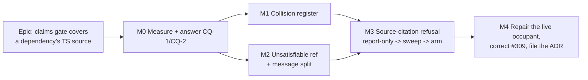

# Implementation Plan: `check:claims` and a dependency's TypeScript source

- **Feature spec:** [`./feature-spec.md`](./feature-spec.md) — Draft, awaiting approval before
  implementation (the annotation mirrors the spec's own token, per `check:spec-status` P1)
- **Status:** Draft — awaiting approval before implementation
- **Owner:** repo

> **Size revised from the register's `S` to `M`, and the reason is recorded rather than silently
> adopted.** `docs/TECH_DEBT.md` #309 sized this `S` on the assumption that the fix was two edits to
> one constant and one character class. §0.3 of the spec establishes that the character-class half is
> **already done** and the constant half is **declined**; what replaces them is a new recogniser, a
> new derived register, one assertion and a message split — three of which need a red run and a
> mutation ledger. Smaller in risk, larger in parts.

## Breakdown

### Epic

**`check:claims` covers a dependency's TypeScript source — by refusing the form, not by scanning
it.** Closes `docs/TECH_DEBT.md` #309; narrows #101 item 1; hands #181 a measurement. Maps to no
roadmap theme by design (a planner cannot act on a CI gate — the ADR-0136 exemption).

---

## Milestone M0 — Measure, and answer the two critical questions (ships nothing)

**Outcome:** the three numbers that decide the epic exist, and CQ-1/CQ-2 are answered with evidence
rather than instinct. Nothing in `scripts/` changes behaviour.

**Entry point:** **Ships dark.** No product surface, and deliberately no gate change either — M0 is
measurement only. The epic's entry point, declared for ADR-0081 §1, is **`pnpm check:claims`** (and
`pnpm prepush`, which derives it), surfaced at M1.

**Journey:** **None, and the reason is structural rather than a deferral.** There is no browser, no
route and no accessible name; ADR-0081 §2's instrument is a Playwright journey because a journey is
the only thing that drives the real product, and this epic's "real product" is a Node script. Its
equivalent — the instrument that actually catches this class — is the **committed mutation ledger**
(§ M0-T5) plus the **committed red run** before each arming, which is the ADR-0136 precedent for a
gate epic.

---

#### Feature: the first-run measurement

> **Description:** produce `m0-measurement.md` carrying every number this epic's decisions rest on,
> each with the command that produced it.
> **Complexity:** M
> **Dependencies:** none
> **Risks:** a measurement taken with a _copy_ of the gate measures the copy (ADR-0124's recorded
> failure — a re-implemented `rowNumber` dropped every em-dash-titled row and reported the wrong
> number in the wrong direction) → **every measurement imports the real module** from
> `scripts/lib/citation-patterns.mjs` and calls the real `installed()` / `ownBasenames()` where it
> needs them, never a re-derivation.
> **Testing requirements:** none — M0 writes a document, not code. Its correctness instrument is
> that each figure names its command and can be re-run.

##### Task M0-T1 — Measure what admitting `.ts` would actually cost (≈ one PR, docs only)

- **Description:** run the real gate with `CITED_EXTENSIONS` temporarily widened to include `ts` and
  `tsx` **in a scratch checkout that is never committed**, and record four separate quantities:
  matching lines, **distinct refs**, refs absorbed by `ownBasenames()`, and **findings left**. The
  spec's §0.1 gives occurrences only (≈5,148) and says so; this is the limb of D2's admission test
  that #309 records as unmet.
- **Complexity:** M
- **Dependencies:** none
- **Risks:**
  - Widening the patterns without widening the globs produces a number nobody should act on —
    measured at #240 as 87 findings against 7 when both move together (`citation-patterns.mjs:225-230`).
    → **move both, because they derive from one constant**; record that the constant is what makes
    this a single edit.
  - Reporting occurrences as findings. → the document states all four quantities in one table with
    the definition of each, and the verdict cites the fourth only.
- **Testing:** none.
- **Development steps:**
  1. In a scratch worktree, add `'ts'` and `'tsx'` to `CITED_EXTENSIONS`; change nothing else.
  2. Run `node scripts/check-claims.mjs`, capturing stdout and stderr to a file.
  3. Instrument a throwaway copy of the walk that prints `found.size` and the count skipped by each
     of the three filters, so absorption is measured rather than inferred from the difference.
  4. Record all four numbers, the commands, the git SHA and the date.
  5. Discard the worktree. Record CQ-1's recommendation **with the finding count in it**.

##### Task M0-T2 — Establish whether the residue CQ-1 declines to cover is empty

- **Description:** for each of the 16 registered packages, establish whether it ships a `dist/`
  output **and** a `.d.ts`, so §4.1's central argument ("a cited fact is in the compiled output or
  in the `.d.ts`, both scanned") is checked rather than asserted. The answer decides whether the
  escalation trigger at spec §4.7 is theoretical or already live.
- **Complexity:** S
- **Dependencies:** none
- **Risks:** reading `package.json`'s `types`/`exports` fields and concluding a `.d.ts` exists when
  the file does not → **stat the files**, do not read the manifest's promises.
- **Testing:** none.
- **Development steps:**
  1. Resolve each package with the real `installed()` helper (so `resolveVia` is honoured).
  2. For each, list whether a `dist/` directory, any `.js` under it, and any `.d.ts` exist.
  3. Record the table. If any package ships `.ts` source **only**, name it and mark CQ-1's
     escalation trigger **already fired** — which changes the recommendation.

##### Task M0-T3 — Cost the two new passes

- **Description:** measure `check:claims`' wall-clock before and after the collision pass's
  directory walk, so "bounded" is a number. A gate in `prepush.sh` is paid on every push.
- **Complexity:** S
- **Dependencies:** M0-T2 (it already enumerates the package directories)
- **Risks:** a single sample. This repository has measured a 21 % run-to-run spread on CI totals
  (ADR-0138) → **three runs each, report the range**, and set no threshold (ADR-0058: no gate here
  asserts a wall-clock time).
- **Testing:** none.
- **Development steps:**
  1. Three timed runs of the current gate.
  2. Three with a prototype collision walk over the 16 packages.
  3. Record both ranges. If the delta exceeds one second, record it as a finding and propose caching
     the package listing rather than accepting it silently.

##### Task M0-T4 — Answer CQ-2 by reading, not by preference

- **Description:** establish whether the new refusal can share `check:claims`' exit without
  disturbing the advisory/blocking convention. Read `scripts/prepush.sh`'s allow-list, the
  `check:advisory-agreement` gate that pins it, and `scripts/ci-roster.json`.
- **Complexity:** S
- **Dependencies:** none
- **Risks:** ADR-0136's own gate-pass finding was that a roster entry and a CI step are **one pair of
  edits** and doing one without the other made an advisory gate blocking → if CQ-2's answer is "a
  separate script", **both** edits land in one commit and `check:ci-roster` is run to prove it.
- **Testing:** `pnpm check:ci-roster` and `pnpm check:advisory-agreement` pass.
- **Development steps:**
  1. Read all three files; quote the relevant lines in the measurement document.
  2. State the recommendation and what it costs either way.

##### Task M0-T5 — Write the mutation ledger up front

- **Description:** for every assertion M1–M3 will add, name the **specific defect** it guards and the
  **specific mutation** that must make it fail, before any assertion is written. ADR-0110 D5's rule
  is that a gate is finished when it has been made to fail by the defect it was written for; this
  repository has shipped assertions that could not fail **twice** in gate epics (ADR-0136's sweep
  found nine false greens; ADR-0138 found two more).
- **Complexity:** S
- **Dependencies:** none
- **Risks:** a mutation that is red for the _wrong reason_ — ADR-0131's C0 fixture passed against its
  own mutation on the first attempt because emptying a directory tripped a different assertion →
  **each ledger row names the expected failure message**, and a red run that names a different
  assertion is a failed verification, not a pass.
- **Testing:** the ledger is the artefact.
- **Development steps:**
  1. Enumerate the planned assertions (four in M1, two in M2, five in M3).
  2. For each: the defect, the mutation, the expected message, and whether a sibling assertion could
     absorb the mutation (which would make the case non-discriminating).
  3. Commit as `mutation-ledger.md`.

---

## Milestone M1 — The collision register (ships first, independent of CQ-1)

**Outcome:** a basename collision between a registered dependency and this repository is declared
with a reason and gated, replacing a docblock sentence that is **false today**. A new collision
fails; a stale declaration also fails.

**Entry point:** `pnpm check:claims` — its summary line gains the declared-collision count, so the
fact is on screen rather than in a comment.

**Journey:** none (see M0). Its instrument is the mutation ledger's M1 rows.

---

#### Feature: derived collision detection

> **Description:** enumerate the files shipped by each registered package, intersect basenames with
> `ownBasenames()`, and compare against `scripts/citation-collisions.json`.
> **Complexity:** M
> **Dependencies:** M0-T2 (package resolution), M0-T3 (cost), M0-T5 (ledger)
> **Risks:**
>
> - A package directory that cannot be read becomes a silent skip — i.e. an unmeasured collision
>   surface inside the mechanism built to measure it → **unreadable is a finding**, asserted.
> - `ownBasenames()` returning an empty set would report zero collisions and zero findings, agreeing
>   with itself → the pass **refuses a verdict on an empty population** (ADR-0130's rule), asserted.
> - Scope creep into #101's path-matching question → the pass reports collisions and changes the
>   resolution order at `check-claims.mjs:393-403` **not at all**.
>   **Testing requirements:** four assertions, each verified red against its ledger mutation; one
>   pinned positive case over a fixture (not the live register), because "no undeclared collision"
>   passes happily over an empty package list.

##### Task M1-T1 — The derived collision scan

- **Description:** add the pass to `check-claims.mjs`, reading package directories through the
  existing `installed()` helper so `resolveVia` and the two-copies refusal (`check-claims.mjs:184-189`)
  are honoured for free rather than reimplemented.
- **Complexity:** M
- **Dependencies:** M0-T2
- **Risks:** walking `node_modules` recursively is unbounded in principle → bound it to the package's
  own directory tree, exclude nested `node_modules`, and record the file count in the summary so an
  unexpected growth is visible.
- **Testing:** a fixture-based case per assertion; the empty-population refusal verified red by
  handing the pass an empty own-set.
- **Development steps:**
  1. Enumerate shipped files per registered package; collect basenames.
  2. Intersect with `ownBasenames()`.
  3. Compare against the declared register; produce findings both ways.
  4. Add the count to the summary line.

##### Task M1-T2 — `scripts/citation-collisions.json` and its first entry

- **Description:** create the register with `vite-env.d.ts` declared: `@tanstack/router-core` ships
  `src/vite-env.d.ts` (both installed copies), we own `apps/web/src/vite-env.d.ts`, and no citation
  of the dependency's copy exists or is plausible.
- **Complexity:** S
- **Dependencies:** M1-T1
- **Risks:** a blank reason admitting anything — ADR-0136's security review found exactly that rule
  **untested** in the licence gate → the non-empty-reason rule gets its own assertion and its own
  ledger row.
- **Testing:** an entry with a blank reason fails; an entry with a reason passes.
- **Development steps:**
  1. Create the file with the one entry and a docblock-equivalent header comment.
  2. Assert the shape (basename, package, non-empty reason).

##### Task M1-T3 — Replace the false docblock sentence

- **Description:** rewrite `check-claims.mjs:214-221` so it points at the derived register instead of
  asserting a safety property in prose. **Correct it in place rather than deleting it** — the
  correction is the useful part (ADR-0071's lesson), so the docblock records that the sentence was
  false, for which basename, and what replaced it.
- **Complexity:** S
- **Dependencies:** M1-T1, M1-T2
- **Risks:** a docblock that restates the register's contents goes stale at the next entry → it
  states the **rule**, and names the register as the inventory (ADR-0073 C4's precedent).
- **Testing:** none directly; covered by M1-T1's assertions.
- **Development steps:**
  1. Rewrite the docblock.
  2. Add a row to `docs/TECH_DEBT.md` #101 narrowing item 1, noting what is now gated and what is
     not.
  3. Changeset: **none** — no user-visible change (repository tooling only).

---

## Milestone M2 — An unsatisfiable register entry fails; an uncited one still warns

**Outcome:** the gate can no longer tell a maintainer to delete a live protection. The two facts that
shared one message are split by a fact the gate can check.

**Entry point:** `pnpm check:claims` output.

**Journey:** none (see M0).

---

#### Feature: split the uncited signal

> **Description:** a register `ref` whose extension is outside `CITED_EXTENSIONS` is a **failure**; an
> uncited ref with a scannable extension stays a note, reworded.
> **Complexity:** S
> **Dependencies:** M0-T5
> **Risks:** the assertion arms against a register with **0 of 108** violators (measured), so it can
> never have been red on real data → its discriminating case **must** be a fixture, and the ledger
> row says so.
> **Testing requirements:** two assertions, both verified red; the fixture case pinned positively so
> a green run cannot mean "the register was empty".

##### Task M2-T1 — The unsatisfiable-ref assertion

- **Description:** fail when a `claims[].ref`'s extension is not a member of `CITED_EXTENSIONS`,
  with a message naming the extension class as the cause and **not** suggesting deletion.
- **Complexity:** S
- **Dependencies:** M0-T5
- **Risks:** deriving the ref's extension by string-splitting on `.` mis-reads `d.ts` → derive it by
  testing membership of `CITED_EXTENSIONS` as a suffix, longest-first, which is the ordering
  `EXTENSION_ALTERNATION` already establishes and the reason it is sorted (`citation-patterns.mjs:46-53`).
- **Testing:** a fixture register with a `.ts` ref fails; one with a `.d.ts` ref passes — the second
  case is what proves the longest-first suffix test, and without it the first passes against a naive
  split.
- **Development steps:**
  1. Add the check before the existing uncited loop, so an unsatisfiable entry is not also warned
     about (two messages for one entry is how this defect started).
  2. Add both fixture cases; verify red.

##### Task M2-T2 — Reword the uncited note

- **Description:** the note keeps its exit code and loses its single reading. It states both causes
  and what distinguishes them, so the reader is not steered to deletion by default.
- **Complexity:** S
- **Dependencies:** M2-T1
- **Risks:** a longer message that nobody reads → keep it to two lines, and put the discriminator
  first.
- **Testing:** the note's text asserted in the fixture case.
- **Development steps:**
  1. Reword.
  2. Record in the docblock that #309 surfaced through this message and how.

---

## Milestone M3 — The source-citation refusal (report-only → sweep → arm)

**Outcome:** a dependency's `.ts`/`.tsx` source can no longer be cited silently. The form is refused
with a named remedy and a named escalation trigger.

**Entry point:** `pnpm check:claims` — the refusal message **is** the surface a maintainer meets.

**Journey:** none (see M0). Its instruments are the ledger's five M3 rows, the committed red run, and
the pass being run **over this epic's own artefacts** (M3-T4), which is the only thing that tests the
self-reference trap.

---

#### Feature: `SOURCE_CITATIONS` and suffix resolution

> **Description:** a new recogniser in the pure module, matching `.ts`/`.tsx` references carrying a
> path and a line range, resolved against tracked repo paths by suffix.
> **Complexity:** M
> **Dependencies:** M0-T1 (the finding count), M0-T4 (CQ-2), M1 (collision surface declared), M2
> **Risks:**
>
> - **The discriminator is the whole risk.** A "leading segment looks like a package" rule produces a
>   false positive on the live `features/perf-probe/scenes/canvas-draw.ts:8`
>   (`docs/specs/route-code-splitting/feature-spec.md:85`) → suffix resolution against `git ls-files`,
>   with that exact string as a **committed negative fixture**.
> - The pass is written in a second place and drifts from `CITATIONS` → it lives in
>   `citation-patterns.mjs` beside it and derives nothing twice (the #240 rule, asserted by the
>   sibling test).
> - `stripFences` is imported from `scripts/lib/doc-register.mjs` and that module is shared by two
>   other gates → **import it, do not modify it**. ADR-0124 records both of its hardenings having
>   been untested; a change there is a separate shared-gate change with its own ADR-0105 trigger.
>   **Testing requirements:** five assertions (path-resolves → no finding; path-unresolvable →
>   finding; bare basename → no finding, pinning the blind spot; fenced → no finding; a pinned
>   positive case so a green run cannot mean the walk found nothing), each verified red.

##### Task M3-T1 — Add the recogniser, report-only

- **Description:** add `SOURCE_CITATIONS` and the resolution pass, printing findings to stdout and
  **not** affecting the exit code. Commit the red run's output as `red-run.md`, because after the
  sweep that state is gone and the output is the only record the gate ever had anything to find
  (ADR-0120's sequence).
- **Complexity:** M
- **Dependencies:** M0-T1
- **Risks:** the report-only mode becomes permanent → M3-T3 arms it in the same milestone, and the
  plan sequences them adjacently rather than leaving arming to a later slice.
- **Testing:** the five assertions, report-only semantics asserted (exit 0 with findings present).
- **Development steps:**
  1. Add the pattern; extend `citation-patterns.test.mjs` with its derivation assertions.
  2. Add the suffix-resolution pass and the report-only printer.
  3. Run; commit `red-run.md` with the command, SHA and date.

##### Task M3-T2 — Sweep the findings

- **Description:** repoint or fix every finding the red run produced. A dependency `.ts` citation is
  repointed at the compiled file or the `.d.ts` **and registered**; a stale repo path is corrected.
- **Complexity:** S–L (unknown until M0-T1; the estimate is deliberately a range)
- **Dependencies:** M3-T1
- **Risks:** repointing without reading the target — the whole gate exists to stop exactly that →
  **each repoint records the anchor actually read**, and the register entry carries it, which is the
  existing contract rather than a new rule.
- **Testing:** `pnpm check:claims` reports zero findings from the new pass.
- **Development steps:**
  1. Work the list; register each dependency repoint with package, path, line range and anchor.
  2. Re-run to zero.

##### Task M3-T3 — Arm it

- **Description:** make the pass contribute to `problems`, so it fails. Then deliberately re-insert
  one swept finding and confirm the gate goes **red**, not amber — the distinction ADR-0131 records
  as the difference between registered and enforced.
- **Complexity:** S
- **Dependencies:** M3-T2, M0-T4 (CQ-2 decides whether this shares the exit or gets its own script)
- **Risks:** arming while a finding remains → M3-T2's zero is a precondition, and the arming commit
  includes the re-insertion proof.
- **Testing:** the re-insertion proof, recorded.
- **Development steps:**
  1. Move the findings into `problems`.
  2. If CQ-2 said "separate script": add the script, the CI step **and** the roster entry in one
     commit; run `pnpm check:ci-roster`.
  3. Re-insert one finding; capture the red output; revert.

##### Task M3-T4 — Run the pass over this epic's own artefacts

- **Description:** the only test of the self-reference trap. This spec, this plan, the ADR and #309's
  row all **name** the forbidden form; confirm each is lawful, and that the one that is lawful only
  by the fenced escape (spec §4.5) goes **red** when unfenced.
- **Complexity:** S
- **Dependencies:** M3-T3
- **Risks:** concluding "it passes" without having proved the fence is what makes it pass → unfence
  it, watch it fail, re-fence. A gate that would pass anyway has not tested the escape.
- **Testing:** the unfence/refence transition, recorded.
- **Development steps:**
  1. Run the armed gate over the four artefacts.
  2. Unfence spec §4.5's block; confirm red; restore.
  3. Write the authoring rule into `docs/TECH_DEBT.md`'s conventions section and into the pass's
     docblock.

---

## Milestone M4 — Repair the live occupant, correct #309, file the ADR

**Outcome:** the tree holds no unprotected dependency citation, the register row is true, and the
decision is recorded where the next author will find it.

**Entry point:** `pnpm check:claims` (unchanged by this milestone).

**Journey:** none (see M0).

---

#### Feature: the repairs and the record

> **Description:** fix `implementation-plan.md:117`, correct #309's four false claims in place, file
> the ADR, and add its entry to `CLAUDE.md` §16 and `docs/adr/README.md`.
> **Complexity:** S
> **Dependencies:** M3
> **Risks:** the ADR lands and the register entry does not — ADR-0132 was Accepted, indexed and cited
> by five documents while being **absent** from `CLAUDE.md` §16, and `check:adr-coverage`
> structurally cannot see that file (`docs/TECH_DEBT.md` #291) → the §16 entry is a **task step**,
> not an afterthought, and `pnpm check:adr-coverage` is run.
> **Testing requirements:** `pnpm prepush` green, including `check:adr-coverage`,
> `check:spec-status`, `check:debt-status` and `check:doc-links`.

##### Task M4-T1 — Repair the live unprotected citation

- **Description:** `docs/specs/route-code-splitting/implementation-plan.md:117` names a dependency's
  `.ts` source in task M0-T4's description. Repoint it at the registered compiled citation.
- **Complexity:** S
- **Dependencies:** M3-T3
- **Risks:** the substitution changes what the task means. The `.ts` source at lines 43–48 is
  `preloadComponent`; the registered `load-client.js:10-12` is its compiled form, anchor
  `return route.options[type]?.preload?.();` — **verified by reading both**, not assumed. → quote the
  anchor in the edit so a reader can check it.
- **Testing:** the armed gate reports no finding for that file; re-inserting the old form turns it
  red.
- **Development steps:**
  1. Read both locations; confirm the same fact.
  2. Edit the line to name the compiled citation.
  3. Verify red by reverting the edit locally.

##### Task M4-T2 — Correct #309 in place

- **Description:** amend the row with §0's findings rather than rewriting it clean: the truncation
  paragraph is **false and inverted** (the hyphen was there first; the dot was the 2026-08-08 fix),
  the workaround was **incomplete**, the 3,801 figure is **an undercount** with the re-derived
  numbers beside it, and the version inference was **too strong**. Mark the row's status per the
  outcome, and fence its illustrative form.
- **Complexity:** S
- **Dependencies:** M3-T4
- **Risks:**
  - Deleting the wrong version instead of correcting it. This register's practice is to keep the
    error and the correction, because the correction is the instructive half → correct in place.
  - `check:debt-status` has no `closed` in its vocabulary (ADR-0138's recorded surprise) → read
    `scripts/check-debt-status.mjs`'s vocabulary **before** writing the status token, and ledger the
    number if the row is retired.
- **Testing:** `pnpm check:debt-status` passes.
- **Development steps:**
  1. Amend the row; fence the form.
  2. Narrow #101 item 1 (cross-reference M1-T3) and add the #181 measurement from spec §0.4.
  3. Set the status token after reading the vocabulary.

##### Task M4-T3 — File the ADR

- **Description:** record the decision: `.ts` source citations are **refused, not scanned**; the
  collision surface is declared; the two uncited causes are split. Include §0's corrections and the
  §4.7 escalation trigger.
- **Complexity:** S
- **Dependencies:** M4-T2
- **Risks:** an ADR number taken between plan and milestone — ADR-0079 was filed as 0079 rather than
  the 0078 its own plan named → **choose the number at filing time**, and if it has moved, record
  that rather than routing around it (ADR-0071's lesson).
- **Testing:** `pnpm check:adr-coverage`, `pnpm check:doc-links`, `pnpm check:claims`.
- **Development steps:**
  1. Write the ADR against `docs/adr/`'s template.
  2. Add it to `docs/adr/README.md` **and** `CLAUDE.md` §16 (#291: the second is ungated).
  3. Update the spec and plan headers to `Accepted — shipped (ADR-NNNN)`, mirroring in both files
     (`check:spec-status` P1/S4).
  4. **Add this epic's own documents to the `citedBy` arrays of the six registered refs they cite.**
     Checked before writing them: the spec and plan cite `load-client.js:10-12`, `:671-672`,
     `:141-145`, `internal-adapter.mjs:773-783`, `router.d.ts:98-113` and `index.d.ts:12`, all
     registered, so the gate passes — but `citedBy` is now incomplete, and nothing checks it. That
     is a real (small) hole in the register's honesty and is worth one edit here rather than a row;
     note in the ADR that `citedBy` completeness is **unverified by the gate**, so a reader must not
     treat it as exhaustive.
  5. Changeset: **none** — no published package changes.

---

## Sequencing & slices

| Slice | Lands                                     | `main` releasable | Independently valuable                                  |
| ----- | ----------------------------------------- | ----------------- | ------------------------------------------------------- |
| M0    | measurement documents only                | yes               | answers CQ-1/CQ-2; may **cancel** M3                    |
| M1    | collision register + gated derivation     | yes               | replaces a false safety claim; ships whatever CQ-1 says |
| M2    | unsatisfiable-ref failure + message split | yes               | the gate stops recommending deleting a live protection  |
| M3    | the refusal, report-only → sweep → arm    | yes at each step  | closes #309's substantive half                          |
| M4    | repairs, register correction, ADR         | yes               | the record                                              |

**M1 and M2 do not depend on CQ-1.** That is deliberate: if CQ-1 is answered "admit `.ts` after
all", M1 becomes a **prerequisite** (admission multiplies the collision surface by the whole `.ts`
estate) and M2 is unaffected, so neither slice is wasted work. Only M3 is replaced.

**No feature flag.** ADR-0088 D1: a `VITE_*` constant is inlined at build time, is not an operator
rollback, and in any case there is no client here. The rollback is a commit boundary, and each
milestone is one revertible commit.

**No `apps/` change.** The diff is `scripts/` and `docs/` only; M4's Definition of Done includes
checking `git diff --stat` and saying so in the PR, because the spec asserts it (§3).

## Definition of Done (per task)

Each task's PR must satisfy the Feature Completion Criteria in
[`docs/PROCESS.md`](../../PROCESS.md) — with three additions specific to a gate epic:

1. **Every assertion has a ledger row and a red run.** ADR-0110 D5. A red run naming a _different_
   assertion than the ledger predicted is a failed verification.
2. **`pnpm prepush` has been run**, not just the touched gate — the whole point of
   `scripts/prepush.sh` deriving its list is that nobody keeps one in their head (CLAUDE.md §19.8,
   which cost an ADR a CI round when its old wording was followed).
3. **No e2e suite is required**, and the PR says so with the reason (M0's journey note), rather than
   leaving a reader to wonder whether it was skipped.

## Risks & assumptions (rollup)

| Risk / assumption                                                                                         | Likelihood | Impact | Mitigation                                                                                                                                             |
| --------------------------------------------------------------------------------------------------------- | ---------- | ------ | ------------------------------------------------------------------------------------------------------------------------------------------------------ |
| M0-T1's finding count is large enough that M3's sweep is a milestone in itself                            | med        | med    | M3-T2 is sized as a **range** rather than an estimate; if it exceeds ~20 findings, M3 splits and the sweep gets its own slice.                         |
| The suffix-resolution discriminator has a false-positive class nobody predicted                           | med        | high   | The one known live case is a committed negative fixture; report-only mode exists precisely so the false positives are read before anything blocks.     |
| An assertion ships unable to fail                                                                         | med        | high   | The ledger is written **before** the assertions (M0-T5); ADR-0136's sweep found nine false greens, so this is a measured base rate, not a worry.       |
| `stripFences` needs a change and the epic quietly makes one                                               | low        | high   | Named as out of scope in the spec's Dependencies; a change there is its own ADR-0105 trigger and stops this work (CLAUDE.md §19.1's mid-flight rule).  |
| The collision pass's directory walk makes `prepush` noticeably slower                                     | low        | med    | M0-T3 measures it in ranges and proposes caching if the delta exceeds one second; **no wall-clock threshold is gated** (ADR-0058).                     |
| #309 is corrected and the correction is not propagated to the docblocks that carry the same wrong reading | med        | med    | M4-T2 lists every file asserting the hyphen or the 3,801 figure; the ADR-0071 failure is noticing drift and stepping over it.                          |
| CQ-1 is answered "admit `.ts`" and this plan is largely replaced                                          | low        | med    | M0 ships nothing, M1/M2 survive either answer; only M3 is rewritten. The cost of being wrong is one milestone, paid before any code.                   |
| A number in this plan is quoted forward without being re-derived                                          | med        | med    | Every figure in the spec names its command; M0's documents supersede any figure they contradict, and the contradiction is recorded rather than edited. |
