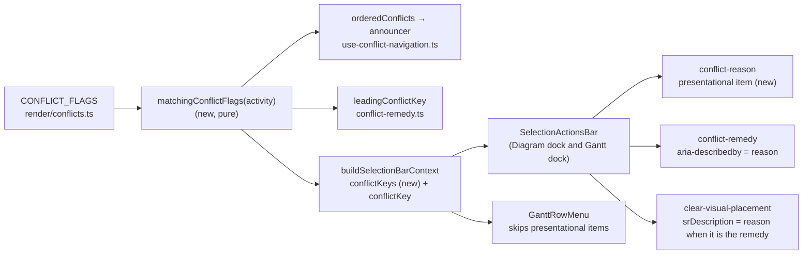
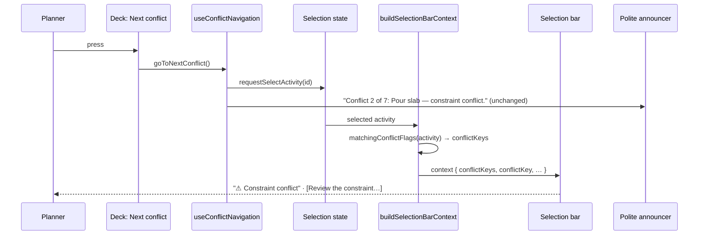
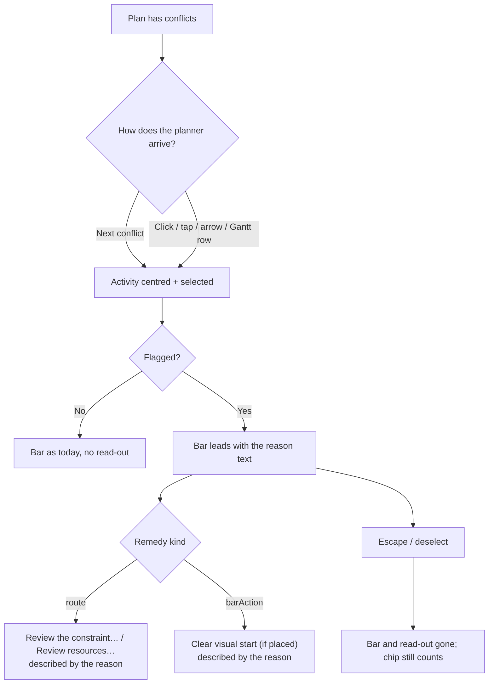

# Feature Spec: The conflict's reason, shown on the object

- **Status:** Draft — awaiting approval before implementation.
- **Author(s):** feature-analyst (for the product owner, james)
- **Date:** 2026-10-10
- **Tracking issue / epic:** `docs/TECH_DEBT.md` #479 (this spec replaces its "Next" paragraph; ADR-0105: a new surface)
- **Roadmap link:** follow-on to the toolbar redesign (`docs/specs/toolbar-redesign/`, M4 §5)
- **Related ADR(s):** a short new ADR is required (outline in §4.8). It **amends ADR-0094 D5**, whose sentence "one of
  them renders nothing" stays true of the remedy and stops being true of the conflict. It applies ADR-0093, ADR-0132,
  ADR-0082, ADR-0088 D1 and ADR-0184. It changes no shared primitive (§4.6), so ADR-0111 is not engaged; the
  accessibility review is still mandatory (§3).

> **About the measurements.** This spec was written without a browser: the analyst had only read and write tools, so
> **no figure here was taken for this spec.** Every number is either quoted from a committed record (with its path) or
> marked **estimate**. M0 takes the real readings in the container's Chromium before anything is built (ADR-0113,
> ADR-0142). If M0 contradicts a premise, the work stops and comes back.

## 0. Plain-English summary

When a planner presses **Next conflict**, the product selects the flagged activity and centres it. Since the toolbar
redesign's M4 (owner decision, 2026-10-10), the toolbar chip says only "Conflict 2 of 7". The reason, such as
"constraint conflict" or "placed before its earliest start", is **spoken** to screen-reader users and **shown to
nobody**. For two of the four conflict types the selection bar shows a remedy ("Review the constraint…", "Review
resources…"). For the most common type it shows nothing new, because its remedy is the "Clear visual start" button
that the bar always carries.

**The proposal:** one short, read-only line of text at the leading edge of the selection bar, for example
**⚠ Constraint conflict**, shown whenever the selected activity is flagged. It doesn't matter how the planner got
there: by Next conflict, by clicking the bar, by the Has-conflict filter, or in the Gantt. The text uses the same
wording the announcer already speaks. It isn't a button, a toast or a live region. It doesn't take a Tab stop, and it
leaves when the selection leaves. The remedy button next to it gets the same sentence as its accessible description,
so a keyboard or screen-reader user who Tabs into the bar hears why before they act.

**What it costs:** the bar has one more item, which appears only while a flagged activity is selected. At the
1024 × 600 floor the bar is already four lines in a 323 px column, so this will probably add one line. That is an
**estimate** of about 39 px of canvas, and it is the critical question below (Q1). At 1912 × 1080 it should fit
without a new line, but whether it does is not known until M0 measures it (Q2).

## 1. Business understanding

### Problem

Re-verified against the tree on 2026-10-10, as CLAUDE.md §19.11 requires for a problem statement:

1. **The deck's chip is count-only.** `CurrentConflictStatus` renders "Conflict n of m" with no reason
   (`m4-measurement.md` §4–§5; owner decision recorded there). This is deliberate and this spec does not reverse it.
2. **The reason is spoken, in full, on every step.** `use-conflict-navigation.ts:97-99` announces
   `Conflict ${i} of ${n}: ${name} — ${reasons.join(', ')}.` through the polite announcer.
3. **The reason is not spoken when a planner arrives any other way.** If a flagged activity is clicked, or reached
   through the diagram's listbox, the spoken description (`render/a11y.ts:211-218`) names a **placement** conflict
   and nothing else. It has no clause for `constraintViolated` or `levelingWindowExceeded`. Over-allocation reaches
   the listbox row only as a lens mark (`a11y.ts:538`).
4. **The selection bar shows a remedy for two of the four types, not three of four.** `CONFLICT_REMEDIES`
   (`plan-actions/conflict-remedy.ts:53-99`):
   - `constraintViolated` and `visualLaterThanBound` show **Review the constraint…**;
   - `levelingWindowExceeded` shows **Review resources…**;
   - `visualEarlierThanLogic` is a `barAction` and renders nothing (`selection-actions.tsx:437`). It only swaps the
     icon of **Clear visual start** to a warning triangle (`selection-actions.tsx:876-893`), and that item exists
     only while the activity has a placement and only when `VITE_TOOLBAR_QUICK_WINS` is on.

   The `#479` row and the M4 record both say "three of four". That counts types that have a remedy. It does not count
   types that show something new.

5. **No conflict type has an on-screen sentence, and one has no on-canvas glyph at all.** The `#479` row says "four
   of the five flag types have no on-canvas badge". That is stale. `CONFLICT_FLAGS` has **four** members
   (`render/conflicts.ts:106-130`; ADR-0094 D3 removed two and one-planning-surface M-D split one):
   - both placement types draw the warning triangle (`paint.ts:2089`);
   - levelling draws the over-allocation histogram (`paint.ts:2106`). That glyph also fires for `selfOverAllocated`,
     which is not a conflict, so it does not uniquely say "conflict";
   - `constraintViolated` draws nothing beyond the constraint pin, which marks that a constraint **exists**, not that
     it is broken.
6. **The brief's "conflict-review dock" does not exist.** `conflict-review` is the name of a journey file
   (`e2e-workspace-chrome/conflict-review.spec.ts`). No dock, panel or component has that name (searched
   `apps/web/src` for `conflict-review|ConflictReview|conflictReview`: no matches). So that option is a new dock,
   not a reuse (§4.7).
7. **Found while reading: the Gantt row menu shows a placeholder label.** `GanttRowMenu.tsx:233` renders
   `{item.label}`. For the remedy that label is the placeholder `'Fix this conflict'` (`selection-actions.tsx:526`),
   so a Gantt row's `⋯` menu offers "Fix this conflict" where the bar says "Review the constraint…". The positive
   Gantt case has never been driven (`e2e-gantt-editing/object-actions-reach.spec.ts:153-156` says it waits for
   "conflicts on the chart"). It is **out of scope** here, and M2 records it as a register row. See §2 Edge cases.

So a sighted planner, whether on a mouse, keyboard or touch, can press Next conflict seven times and never read
_why_ any of the seven is flagged. For `constraintViolated` that is true on the canvas as well. A screen-reader user
who **clicks** rather than cycles hears a reason for one family only.

### Users

| Role           | Need                                                                                                                                                                                                                                                     |
| -------------- | -------------------------------------------------------------------------------------------------------------------------------------------------------------------------------------------------------------------------------------------------------- |
| Planner        | Read what is wrong with the activity they landed on, beside the fix.                                                                                                                                                                                     |
| Org Admin      | As Planner.                                                                                                                                                                                                                                              |
| Contributor    | Read why an activity is flagged before reporting progress against it. Remedies are routes, so they can follow.                                                                                                                                           |
| Viewer         | Read the reason. For `visualEarlierThanLogic` the remedy (Clear visual start) is pen-gated and **shaded** for them, so today a Viewer gets a shaded button with a warning icon and no sentence. This is the role that gains most.                        |
| External Guest | **None.** The guest view renders no selection bar: `TsldPanel` mounts it only when `onOpenLogic`, `onEditActivity` and `onDeleteActivity` are all wired (`TsldPanel.tsx:1799-1800`), and `GuestPlanView` is expected not to wire them. M0 verifies this. |

### Primary use cases

1. Press Next conflict and read the reason for the activity it lands on, without listening for an announcement.
2. Click (or tap, or arrow to) a flagged bar or Gantt row, and read the reason without pressing Next conflict.
3. Tab into the selection bar and hear the reason as the description of the first control.

### User journeys

Shown in the §4.3 user flow. Happy path: the planner presses **Next conflict**. The bar centres and is selected. The
selection bar at the foot of the workspace now leads with **⚠ Constraint conflict**, then **Review the
constraint…**. The planner reads it, presses the remedy, and the editor opens on the Scheduling tab, exactly as
today.

### Expected outcomes

- Every flagged activity, of every type, in both views, shows its reason in words while it is selected.
- The deck is unchanged: the chip stays count-only, and the LOOK and DO rows are untouched.
- What the announcer speaks and what the bar shows come from one derivation, so they cannot disagree.

### Success criteria

| ID    | Criterion                                                                                                                                                                                       | How it is measured                                                                                                              |
| ----- | ----------------------------------------------------------------------------------------------------------------------------------------------------------------------------------------------- | ------------------------------------------------------------------------------------------------------------------------------- |
| SC-1  | For each of the four conflict types, the selection bar shows the flag's label, sentence-cased, as visible text while that activity is selected, in the **Diagram and the Gantt**.               | Unit (four cases) + journeys (Diagram: placement and constraint; Gantt: constraint)                                             |
| SC-2  | A multi-flag activity shows **every** reason, in `CONFLICT_FLAGS` order and joined with ", ", exactly the list the announcer speaks.                                                            | Unit: the read-out text equals `orderedConflicts(...)[i].reasons` for one fixture with two flags                                |
| SC-3  | The read-out is not a Tab stop and not a live region: no `role`, no `aria-live`; `tabIndex=-1`, outside the roving order.                                                                       | Unit (DOM) + journey (Tab into the bar lands on the remedy, not on the text)                                                    |
| SC-4  | The first focusable control that answers the conflict exposes the reason as its **accessible description**. That is the route remedy, or **Clear visual start** for `visualEarlierThanLogic`.   | Unit + journey `toHaveAccessibleDescription(/constraint conflict/i)`                                                            |
| SC-5  | **Deck unchanged:** every state in `m4-measurement.md` §2 stays 1/1 at every width on a fine pointer, and the coarse bounds hold.                                                               | Existing `command-surface.spec.ts` / `floor-states.spec.ts`, unchanged and green                                                |
| SC-6  | **1912 × 1080, fine:** a conflicted selection's foot row is **the same height** as an unconflicted selection's, for every type, with and without a placement.                                   | M0 reads it; M1 asserts it in a journey (an equality)                                                                           |
| SC-7  | **1024 × 600, fine and coarse:** a conflicted selection's foot row is **at most one control line taller** than an unconflicted one. Every control on the bar stays pointer-reachable (no clip). | M0 reads it; M1 asserts `≤ +1 line` plus the existing "every object action a pointer can see, it can also reach" sweep          |
| SC-8  | An unconflicted selection is unchanged: the item is absent, so `dock.spec.ts`'s "a selection costs the canvas nothing" equality holds unedited.                                                 | Existing journey, green and unedited                                                                                            |
| SC-9  | Stepping N times leaves exactly one read-out, showing the current activity's reason. There is nothing queued, stacked or timed.                                                                 | Journey: press Next conflict three times on a two-conflict plan; count = 1 and the text matches the selected activity each time |
| SC-10 | The read-out is never truncated with an ellipsis. If it is too long for the line, it wraps (ADR-0184).                                                                                          | Unit (no `truncate` class) + M0 reading of the longest two-flag text at 1024                                                    |

### Open questions

**Critical** (the answers change the design or scope):

- **Q1 — The floor's vertical cost.** At 1024 × 600 the bar is 4 lines in a 323 px column (fine; 5 lines, 319 px,
  coarse), and the canvas with a selection is 246 px fine and 200 px coarse (`toolbar-redesign/m3-measurement.md`
  §4). A reason of about 150–290 px (**estimate**, at 14 px text) will very likely take one more line, about 39 px
  fine (**estimate**, from (167 − 51) / 3 per line in `m0-measurement.md` §2) and about 44+ px coarse. That leaves a
  canvas of about 207 px fine and about 156 px coarse, **only while a flagged activity is selected**.
  **Recommendation: accept.** It is paid only while the planner is looking at the thing the text explains. The
  structural fix for the bar's narrow column is `#471`'s second paragraph (give the outlet its own row when it holds
  a bar), which is its own spec. If you do not accept, the fallback is §4.7 option B′ (a caption line above the
  controls, about 20 px **estimate**, paid at every width), and this spec is revised before build.
- **Q2 — If M0 finds a line is lost at 1912 × 1080.** SC-6 assumes the reason fits on the owner's screen class.
  **Estimate:** the bar plus the longest reason is about 1,266 px against about 1,258 px of outlet, so it is marginal
  for `visualEarlierThanLogic` with a placement. **Recommendation: stop and come back with the reading**, rather than
  accept a line there silently or shorten the copy unasked (ADR-0142).

**Defaults** (not blocking; stated so work can proceed):

- **Copy:** the existing `CONFLICT_FLAGS` labels, first letter capitalised ("Constraint conflict", "Placed before its
  earliest start", "Placed past a constraint", "Levelling window exceeded"). No new copy, no prefix. The warning
  triangle is `aria-hidden` and is not the only signal: the words carry it (WCAG 1.4.1).
- **All reasons, not the leading one** (SC-2). This matches the announcer.
- **The read-out is not `aria-hidden`.** It is static text, not a live region, so it cannot double-announce. A
  browse-mode reader who explores the toolbar finds the sentence there. The duplication with the remedy's
  description in browse mode is accepted; the accessibility review may overturn this.
- **The Gantt row menu does not show it.** The menu skips `presentational` items (§4.6). The placeholder-label
  defect (§1 item 7) gets a register row, not a fix here.
- **No flag.** ADR-0088 D1: a `VITE_` flag cannot be switched off on a published image, so it would be a second JSX
  root rather than a rollback. The rollback is the M1 commit.

## 2. Functional requirements

### User stories & acceptance criteria

> **US-1** — As a Planner (or Org Admin, Contributor, Viewer), I want the selection bar to say why the selected
> activity is flagged, so that I can decide what to do without listening for an announcement or opening the editor.
>
> - **Given** a plan with a `constraintViolated` activity, **when** I press Next conflict, **then** the bar named
>   "Actions for <activity>" shows "Constraint conflict" as visible text before "Review the constraint…".
> - **Given** an activity placed before its earliest start, **when** it is selected by any route, **then** the bar
>   shows "Placed before its earliest start", and **Clear visual start** (if present) carries that sentence as its
>   accessible description.
> - **Given** an activity flagged for both a constraint and a levelling window, **then** the bar shows "Constraint
>   conflict, levelling window exceeded".
> - **Given** an activity that is not flagged, **then** no read-out renders and the bar is unchanged.

> **US-2** — As a keyboard or screen-reader user, I want to hear the reason when I reach the fix, so that I do not
> act on a remedy without knowing what it remedies.
>
> - **Given** a flagged selection, **when** I Tab into the bar, **then** focus lands on the first control (the
>   remedy), not on the read-out, and its description is the reason.
> - **Given** I click a flagged bar instead of cycling, **then** the same description is there. The reason no longer
>   depends on having arrived by Next conflict.

> **US-3** — As a planner working in the Gantt, I want the same reason on the docked bar, so that the two views do
> not disagree.
>
> - **Given** the Gantt view and a flagged row selected, **then** the docked bar shows the same read-out. It comes
>   from the same `buildSelectionBarContext` (`plan-workspace-toolbar.tsx:98`, `TsldPanel.tsx:124`), so the two
>   views share it by construction.

### Workflows

1. The selection changes (by Next conflict, a click or tap, a listbox arrow, or a Gantt row).
2. `buildSelectionBarContext` derives `conflictKeys` from the selected activity with the same `CONFLICT_FLAGS`
   predicates the count, the filter and the announcer use.
3. The `conflict-reason` item is visible iff `conflictKeys.length > 0`. It renders the labels.
4. The remedy control (a route) or **Clear visual start** (a `barAction`) carries the same text as its description.
5. When the selection clears, the bar renders `null` (`selection-actions.tsx:1128`) and the read-out goes with it.

### Edge cases

| Case                                                           | Behaviour                                                                                                                                                                                                                                  |
| -------------------------------------------------------------- | ------------------------------------------------------------------------------------------------------------------------------------------------------------------------------------------------------------------------------------------ |
| **No selection** (Escape, or the activity is deleted)          | No bar, so no read-out. The deck chip still reads "Conflict n of m" (unchanged). Whether there is a reason is a property of the object, so with no object there is nothing to show. The announcer has already spoken the last step.        |
| **Rapid stepping**                                             | Each step is one selection change and one synchronous re-render. The text is replaced in place, with no timer, no queue, no stack and no animation. The polite announcer behaves exactly as today. The read-out adds nothing to it (SC-9). |
| **Isolating**                                                  | The chip reverts to a magnitude (ADR-0094 D8). The read-out still shows, because it is derived from the selected activity, not the cursor.                                                                                                 |
| **Filtered out / dimmed**                                      | Unchanged rules: the bar follows the selection, and so does the read-out.                                                                                                                                                                  |
| **Conflict resolved while selected** (a recalc after a remedy) | `conflictKeys` becomes empty, so the item leaves. It never holds focus, so there is no ADR-0135 hand-off to make. The remedy keeps its existing `lostReason`.                                                                              |
| **A peer changes the activity**                                | Same as above, through the existing activity refresh.                                                                                                                                                                                      |
| **Late-start overlay on**                                      | No change: the flags are the engine's and the overlay does not alter them. The read-out still shows.                                                                                                                                       |
| **Two-flag text at 1024**                                      | Wraps inside the item (`max-w-full`, no `truncate`). M0 reads the line count.                                                                                                                                                              |
| **Gantt row menu (`⋯`)**                                       | Presentational items are skipped, so it is not a dead menu item. The menu keeps the remedy item (with its pre-existing placeholder label, recorded as a register row).                                                                     |
| **Guest**                                                      | No bar (§1 Users).                                                                                                                                                                                                                         |
| **`VITE_CANVAS_NAV` off**                                      | No Next-conflict cycle, but the read-out still renders on a clicked, flagged activity. This matches the remedy, which is deliberately not gated on the flag (`selection-actions.tsx:500-506`).                                             |

### Permissions

The read-out is **read-only**. It has no write, no endpoint and no pen involvement (ADR-0028: **not a structural
write**). It is shown to every role that renders the selection bar: Org Admin, Planner, Contributor and Viewer. It
shows only data the client already holds for an activity the user may already see (`ActivitySummary` flags), so it
needs no new authorisation or scope check (ADR-0012).

### Validation rules

None. There is no input.

### Error scenarios

| Scenario                                     | Detection                                | User-facing result                                                                    | Status |
| -------------------------------------------- | ---------------------------------------- | ------------------------------------------------------------------------------------- | ------ |
| A new `ConflictKey` is added without a label | `ConflictFlag.label` is required by type | Typecheck failure (existing)                                                          | n/a    |
| The activity list is stale after a recalc    | Existing refresh                         | The read-out matches whatever the count shows, because both come from the same source | n/a    |

## 3. Technical analysis

| Area           | Impact     | Notes                                                                                                                       |
| -------------- | ---------- | --------------------------------------------------------------------------------------------------------------------------- |
| Frontend       | low        | One new presentational registry item, one new context field, one pure helper, two description wirings, one row-menu filter. |
| Backend        | none       |                                                                                                                             |
| Database       | none       | No schema change, so the database-architect is not engaged.                                                                 |
| API            | none       |                                                                                                                             |
| Security       | none       | Read-only; no new data.                                                                                                     |
| Performance    | negligible | O(flags) = 4 predicates on one activity per selection change. The builder already calls `leadingConflictKey`.               |
| Infrastructure | none       | No flag, no env, no CI step.                                                                                                |
| Observability  | none       |                                                                                                                             |
| Testing        | med        | Unit tests, two journey extensions (Diagram, Gantt), floor assertions, one measurement harness (M0, not a gate).            |

**Recalc parity gate:** not engaged. This adds no scheduling input; `computeSchedule` and the engine are untouched.

**Reviews to run:** accessibility-reviewer (description wiring, no live region, browse-mode duplication),
component-reviewer (first `presentational` item on the selection bar; row-menu filter), ux-reviewer (copy, the floor
line). No shared primitive is changed, so ADR-0111 is not engaged, but the accessibility review runs **before** the
release anyway, on the bar's Tab order.

### Dependencies

- The toolbar redesign's M4 must be on `main` (the count-only chip). If its ADR claims the next ADR number first,
  this spec's ADR takes the one after.
- No dependency on `#471`. Q1 records the relationship.

## 4. Solution design

### 4.1 Architecture overview



### 4.2 Data flow



### 4.3 User flow



### 4.4 Database changes

None.

### 4.5 API changes

None.

### 4.6 Component changes: the exact contract change

**`apps/web/src/features/tsld/render/conflicts.ts`**: one new pure export, with no behaviour change to the
existing ones:

```ts
/** Every flag an activity matches, in CONFLICT_FLAGS order. The ONE derivation behind the count,
 *  the filter, the announcer and the selection bar's read-out. */
export function matchingConflictFlags(activity: ConflictFlagFields): readonly ConflictFlag[];
```

`orderedConflicts` (its `reasons` and `keys`) and `leadingConflictKey` are rewritten to call it. This is a refactor
only, pinned by the existing `conflicts` and remedy tests.

**`SelectionActionContext`** (`plan-actions/selection-actions.tsx:57-158`) gains **one field**:

```ts
/** Every conflict the selected activity matches, in CONFLICT_FLAGS order; [] when unflagged.
 *  `conflictKey` is exactly `conflictKeys[0] ?? null` — both built from one call in the builder. */
conflictKeys: readonly ConflictKey[];
```

`conflictKey` stays, because the remedy and the icon read it. The builder (`build-selection-context.ts:128`) sets both
from one `matchingConflictFlags` call, so they cannot disagree, and a unit test pins the identity. All test `ctx()`
factories gain `conflictKeys: []`.

**`selectionActionItems`**: one new item, registered first:

| Field             | Value                                                                                                                                                                                                                                                                                                                                                              |
| ----------------- | ------------------------------------------------------------------------------------------------------------------------------------------------------------------------------------------------------------------------------------------------------------------------------------------------------------------------------------------------------------------ |
| `id`              | `'conflict-reason'`                                                                                                                                                                                                                                                                                                                                                |
| `group`           | `'object'`                                                                                                                                                                                                                                                                                                                                                         |
| `order`           | `-2` (before `conflict-remedy` at `-1`)                                                                                                                                                                                                                                                                                                                            |
| `tier`            | `1` (inert; matches its siblings)                                                                                                                                                                                                                                                                                                                                  |
| `labelVisibility` | `'always'`                                                                                                                                                                                                                                                                                                                                                         |
| `label`           | `'Conflict reason'` (the registry label; it is not painted; `defineToolbar` rejects an empty label, and the Gantt coverage gate matches it)                                                                                                                                                                                                                        |
| `presentational`  | `true`, so it is never a roving stop (`Toolbar.tsx:171`, `:272-273`)                                                                                                                                                                                                                                                                                               |
| `isVisible`       | `(ctx) => ctx.conflictKeys.length > 0`                                                                                                                                                                                                                                                                                                                             |
| `lostReason`      | none, because it never holds focus (the same reasoning as `next-conflict-status`, `selection-actions.tsx:491-492`)                                                                                                                                                                                                                                                 |
| `render`          | `ConflictReasonReadout`: `<span {...itemProps}>` with an `aria-hidden` `TriangleAlert` and the sentence-cased labels joined with ", ". It uses existing tokens and the same text treatment as the deck's conflict read-out, with no one-off styling; no `truncate`, `max-w-full`, wraps; no `role`, no `aria-live` (ADR-0132: a standing condition, not an event). |

**`ConflictRemedyControl`** (`selection-actions.tsx:422-451`): this is already a `render` item, and
`srDescription` is not wired for render items (`Toolbar.tsx:255-281` passes no description). So it renders its
own `hidden` description node with a `useId` id and sets `aria-describedby` on its button. The node holds the same
reason text. The change is local to this control.

**`clear-visual-placement`** (`selection-actions.tsx:820-901`): a plain item gains
`srDescription: (ctx) => reasonIfThisIsTheRemedy(ctx)`, which is the reason when the remedy map names this item for
the leading key and `undefined` otherwise. It is decided by asking the map, not a key literal, for the reason the
icon logic at `:877-881` gives.

**`GanttRowMenu`** (`gantt/components/GanttRowMenu.tsx:150-152`): the item filter also drops
`item.presentational === true`. Without that, the row menu renders "Conflict reason" as a live `MenuItem` that does
nothing.

**Not changed:** `Toolbar`, `Deck`, `Menu`, `ToolbarItem`'s type, `CurrentConflictStatus`, the announcer's copy, the
canvas painter, and the listbox description.

### 4.7 Implementation approach & alternatives

**Chosen: A, the reason as a presentational item on the selection bar.** This is the smallest new surface. It
reuses a registry capability that already exists and whose docblock anticipates exactly this ("the docked selection
bar may want it", `toolbar-registry.ts:345-347`). It lives in the one roster that both views and the structural
gates already read, and it puts the sentence next to its fix: ADR-0094 D5's "on the object", taken one step
further.

| Option                                                                                            | Sighted                | Keyboard / SR                                                           | Touch                        | Vertical budget                                                                                           | Gantt                                             | Rapid stepping                              | No selection                                          | Verdict                                                                                                                                                                             |
| ------------------------------------------------------------------------------------------------- | ---------------------- | ----------------------------------------------------------------------- | ---------------------------- | --------------------------------------------------------------------------------------------------------- | ------------------------------------------------- | ------------------------------------------- | ----------------------------------------------------- | ----------------------------------------------------------------------------------------------------------------------------------------------------------------------------------- |
| **A. Read-out item on the selection bar**                                                         | Yes, beside the remedy | Description on the remedy; text reachable in browse mode; no extra stop | Painted; no hover            | 0 when it fits; +1 line when it wraps (Q1/Q2)                                                             | Same bar, by construction                         | Replaced in place                           | Absent with the bar                                   | **Chosen**                                                                                                                                                                          |
| B. The plan facts block in the foot row                                                           | Yes                    | A plan-level region carrying an activity fact                           | Yes                          | Facts are `shrink-0`, about 582 px (`m3-measurement.md` §4); growing them squeezes the bar column further | Yes                                               | In place                                    | Would need a "nothing selected" state                 | Rejected: wrong subject. The facts are the **plan's** (`activity-bottom-panel.tsx:410-454`); ADR-0093's discriminator puts an object fact on the object.                            |
| B′. A caption line above the bar's controls (inside `SelectionActionsBar`, outside the `Toolbar`) | Yes                    | Same as A                                                               | Yes                          | About 20 px (**estimate**) at **every** width while flagged; never reflows controls                       | Yes                                               | In place                                    | Absent                                                | Fallback if Q1 is refused. It is a wrapper layout change rather than a registry item, so it is invisible to the registry gates.                                                     |
| C. A callout anchored to the bar on the canvas                                                    | Yes                    | Needs its own focus or description story; the canvas has no DOM per bar | Hover or long-press tempting | 0 rows, but it **overlays the scene**                                                                     | **No canvas in the Gantt**; needs a second answer | Repositions every step                      | Absent                                                | Rejected: the selection bar was taken **off** the scene because an overlay obscured activities (`selection-actions.tsx:1036-1045`; ADR-0064, ADR-0080). This would bring that back. |
| D. A polite toast per step                                                                        | Briefly                | Duplicates the announcer exactly                                        | Needs dismiss                | 0 at rest                                                                                                 | Yes                                               | Toasts **stack or flicker**; needs debounce | Lingers after deselect, or vanishes before it is read | Rejected: a conflict is a **standing condition**, not an event (ADR-0132 D1). A clicked bar raises no toast, so it fails US-1's "any route".                                        |
| E. A conflict-review dock                                                                         | Yes, a list            | A new panel                                                             | Yes                          | Takes the stage row (ADR-0180 swap)                                                                       | Needs Gantt wiring                                | Fine                                        | Could show all conflicts                              | Rejected: **it does not exist** (§1 item 6). It would be a new dock (the largest surface), and ADR-0094 D5 already withdrew "a second strip".                                       |

### 4.8 ADR outline (required, short)

**ADR-NNNN: "A conflict says why on the object"** (number: the next free one at write time). Status: Proposed, then
Accepted at M1.

- **Context:** the toolbar redesign M4 owner decision; the reason is spoken only; ADR-0094 D5's "one of them
  renders nothing"; the counts in §1.
- **Decision D1:** every flagged selection shows its reasons as presentational text on the selection bar, in both
  views, derived by `matchingConflictFlags`, the same derivation the announcer uses.
- **D2:** the control that answers the conflict carries the reason as its accessible description. The reason is
  never a live region (ADR-0132), never a Tab stop, never truncated (ADR-0184).
- **D3:** amends ADR-0094 D5. The `barAction` remedy still renders no twin. What it lacked was the sentence, not
  the control.
- **D4:** presentational items are not menu items (`GanttRowMenu`).
- **Rejected:** B, B′, C, D, E with the reasons above; a `VITE_` flag (ADR-0088 D1).
- **Consequences:** the floor cost (Q1, with the M0 figure); the Gantt row menu's placeholder-label row; §16 gains
  one line (`check:adr-coverage`).

## 5. Links

- Implementation plan: [`implementation-plan.md`](./implementation-plan.md)
- Docs updated by this change: `docs/TECH_DEBT.md` #479 (closed, with its stale "four of five" claim corrected), a
  new row for the Gantt row-menu placeholder label, `docs/UX_STANDARDS.md` (one bullet under "Row / node actions"
  or the conflict guidance: "a flagged object states its reason beside its remedy"), the new ADR, a CLAUDE.md §16
  line, and `docs/TEST_PLAYBOOK.md` if a catalogue plan is named for the constraint-conflict case.
