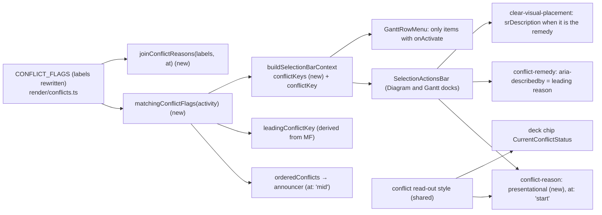
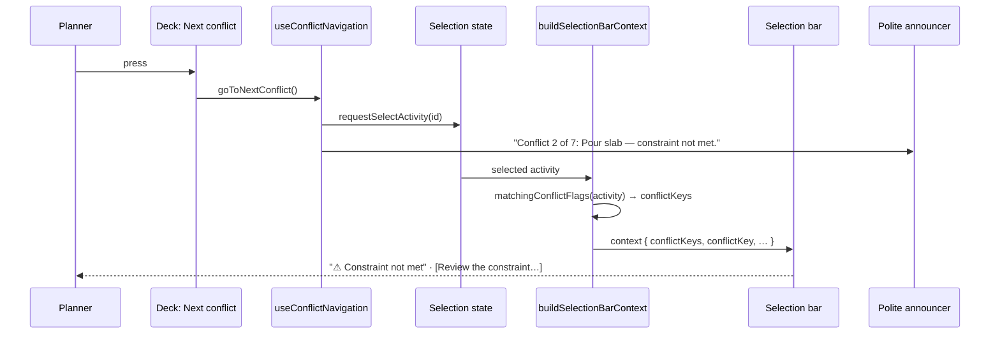
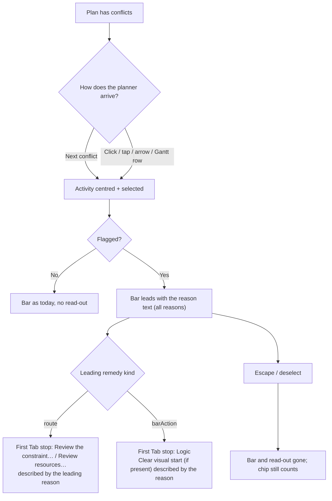

# Feature Spec: The conflict's reason, shown on the object

- **Status:** Draft — awaiting approval before implementation.
- **Author(s):** feature-analyst (for the product owner, james). Revision 2 folds in the UX, accessibility and
  component reviews of revision 1.
- **Date:** 2026-10-10
- **Tracking issue / epic:** `docs/TECH_DEBT.md` #479 (this spec replaces its "Next" paragraph; ADR-0105: a new surface)
- **Roadmap link:** follow-on to the toolbar redesign (`docs/specs/toolbar-redesign/`, M4 §5)
- **Related ADR(s):** a short new ADR is required: **ADR-0186** (reserved; outline in §4.8). It **amends ADR-0094
  D5**, whose sentence "one of them renders nothing" stays true of the remedy and stops being true of the conflict.
  It applies ADR-0093, ADR-0132, ADR-0082, ADR-0088 D1 and ADR-0184. It changes no shared primitive's keyboard
  contract (§4.6), so ADR-0111 is not engaged. The accessibility review is still mandatory (§3).

> **Revision 3 (2026-10-10, after M0): the design is B′, and four statements below are superseded.**
> M0 (`m0-measurement.md`) measured the inline read-out and found it costs a line at 1912 x 1080 for two of
> the four types, so the product owner chose option (b): **the reason is a caption line above the selection
> bar's controls** (§4.7's B′), measured at 20 px (`m1-measurement.md`). Consequences for the text below:
> (1) there is **no registry item, no `presentational` use and no `ConflictReasonReadout`**: the caption is
> `ConflictReasonLine`, rendered by `SelectionActionsBar` above the `Toolbar`, so §4.6's item table, SC-3's
> `data-toolbar-item` wording and the label-collision and Gantt-coverage notes do not apply; (2) **SC-6**
> (foot row equal at 1912 x 1080) is replaced by "the controls never reflow, and the line is one line (at most
> 24 px) there", asserted in `e2e-workspace-fit/conflict-reason.spec.ts`; (3) **the Tab claims are wrong
> in the Diagram**: the bar is one roving Tab stop whose first item on the canvas is **Zoom to selection**
> for every type (Logic and the remedy are reached by the arrow keys), so US-2's "focus lands on the remedy"
> and "the first roving stop is Logic" hold only in the Gantt, where the canvas-only items are absent;
> (4) the **chip already wears the read-out look** (foreground text, warning-coloured triangle), so M1-T5's
> chip restyle reduced to sharing the two class constants. Plan M2's row 4 (a truncating remedy label) is
> dropped: M0 found none.

> **About the measurements.** This spec was written without a browser: the analyst had only read and write tools, so
> **no figure here was taken for this spec.** Every number is either quoted from a committed record (with its path) or
> marked **estimate**. M0 takes the real readings in the container's Chromium before anything is built (ADR-0113,
> ADR-0142). If M0 contradicts a premise, the work stops and comes back.

## 0. Plain-English summary

When a planner presses **Next conflict**, the product selects the flagged activity and centres it. Since the toolbar
redesign's M4 (owner decision, 2026-10-10), the toolbar chip says only "Conflict 2 of 7". The reason is **spoken** to
screen-reader users and **shown to nobody**. For three of the four conflict types, the selection bar shows a remedy
button ("Review the constraint…" or "Review resources…"). For the fourth (placed before its logic allows), it shows
nothing new: that remedy is the "Clear visual start" button the bar already carries, and only its icon changes.

**The proposal:** one short, read-only line of text at the leading edge of the selection bar, for example
**⚠ Constraint not met**. It shows whenever the selected activity is flagged, however the planner got there: by Next
conflict, by clicking the bar, by the Has-conflict filter, or in the Gantt. There is one copy of the wording. This
spec rewrites the four `CONFLICT_FLAGS` labels so each reads as a standalone line, and the announcer, the bar and
the tests all read those labels. The line is not a button, a toast or a live region. It takes no Tab stop, it is
painted in the bar's ordinary text colour with a warning-coloured icon and no box, and it leaves when the selection
leaves. Where the bar has a control that answers the conflict, that control also carries the reason as its
accessible description.

The deck's count chip stays count-only. It changes from muted grey to the same look: ordinary text and a
warning-coloured triangle.

**What it costs:** the bar has one more item, which appears only while a flagged activity is selected. At the
1024 × 600 floor the bar is already four lines in a 323 px column, so this will probably add one line, about 39 px of
canvas (**estimate**). The recommendation is to accept that (Q1). At 1912 × 1080 it is expected to fit without a new
line, but it is marginal and not known until M0 measures it. If it wraps there, the work stops and the reading comes
back to you (Q2).

## 1. Business understanding

### Problem

Re-verified against the tree on 2026-10-10, as CLAUDE.md §19.11 requires for a problem statement:

1. **The deck's chip is count-only.** `CurrentConflictStatus` renders "Conflict n of m" with no reason
   (`m4-measurement.md` §4–§5; owner decision recorded there). This is deliberate and stays. It is also painted
   `tone: 'info'`, which is `text-muted-foreground` (`tsld-toolbar-items.tsx:1904`, `toolbar-styles.ts:186`), so the
   one on-deck conflict signal is the quietest text on the row.
2. **The reason is spoken, in full, on every step.** `use-conflict-navigation.ts:97-99` announces
   `Conflict ${i} of ${n}: ${name} — ${reasons.join(', ')}.` through the polite announcer.
3. **The reason is not spoken when a planner arrives any other way.** If a flagged activity is clicked, or reached
   through the diagram's listbox, the spoken description (`render/a11y.ts:211-218`) names a **placement** conflict
   and nothing else. It has no clause for `constraintViolated` or `levelingWindowExceeded`. Over-allocation reaches
   the listbox row only as the lens mark `(over-allocated)` (`a11y.ts:538`, in `composeListboxRowText`). This spec
   does not close that gap; M2 files it as a register row.
4. **The selection bar renders a route remedy for three of the four types.** `CONFLICT_REMEDIES`
   (`plan-actions/conflict-remedy.ts:53-99`):
   - `constraintViolated` and `visualLaterThanBound` render **Review the constraint…**;
   - `levelingWindowExceeded` renders **Review resources…**;
   - only `visualEarlierThanLogic` is a `barAction`, and it renders nothing (`selection-actions.tsx:437`). It only
     swaps the icon of **Clear visual start** to a warning triangle (`selection-actions.tsx:876-893`). That item is
     at `order: 6.5`, after Delete (`:824`), and exists only while the activity has a placement (`:854`) and only
     when `VITE_TOOLBAR_QUICK_WINS` is on (`:817`).

   `#479`'s "three of four" is **correct**. Revision 1 of this spec said "two of four", which was a miscount.

5. **No conflict type has an on-screen sentence, and one has no on-canvas glyph at all.** `CONFLICT_FLAGS` has
   **four** members (`render/conflicts.ts:106-130`; ADR-0094 D3 removed two and one-planning-surface M-D split
   one). `#479`'s "four of the five flag types have no on-canvas badge" is stale:
   - both placement types draw the warning triangle (`paint.ts:2089`);
   - levelling draws the over-allocation histogram (`paint.ts:2106`). That glyph also fires for
     `selfOverAllocated`, which is not a conflict, so it does not uniquely say "conflict";
   - `constraintViolated` draws nothing beyond the constraint pin, which marks that a constraint **exists**, not that
     it is broken. M2 files this as a register row.
6. **The brief's "conflict-review dock" does not exist.** `conflict-review` is the name of a journey file
   (`e2e-workspace-chrome/conflict-review.spec.ts`). Searching `apps/web/src` for
   `conflict-review|ConflictReview|conflictReview` finds nothing. So that option is a new dock, not a reuse (§4.7).
7. **The Gantt row menu's remedy is inert as well as mislabelled.** `GanttRowMenu.tsx:150-152` lists every visible
   registry item, renders `{item.label}` (`:233`) and runs `item.onActivate?.(ctx)` (`:227-231`). `conflict-remedy`
   is a `render` item with **no `onActivate`** (`selection-actions.tsx:518-535`), and its label is the placeholder
   `'Fix this conflict'` (`:526`). So for a flagged row, the `⋯` menu offers a live menu item "Fix this conflict"
   that **does nothing** when chosen. The positive Gantt case has never been driven
   (`e2e-gantt-editing/object-actions-reach.spec.ts:153-156`). **In scope** (§4.6): the row menu drops every item
   with no activation path. The fuller fix, a real `onActivate` with a label from the remedy map, is filed as its
   own row.

So a sighted planner, whether on a mouse, keyboard or touch, can press Next conflict seven times and never read
_why_ any of the seven is flagged. For `constraintViolated` that is true on the canvas as well. A screen-reader user
who **clicks** rather than cycles hears a reason for one family only.

### Users

| Role           | Need                                                                                                                                                                                                                                                     |
| -------------- | -------------------------------------------------------------------------------------------------------------------------------------------------------------------------------------------------------------------------------------------------------- |
| Planner        | Read what is wrong with the activity they landed on, beside the fix.                                                                                                                                                                                     |
| Org Admin      | As Planner.                                                                                                                                                                                                                                              |
| Contributor    | Read why an activity is flagged before reporting progress against it. Route remedies are reads, so they can follow them.                                                                                                                                 |
| Viewer         | Read the reason. For `visualEarlierThanLogic` the remedy (Clear visual start) is pen-gated and **shaded** for them, so today a Viewer gets a shaded button with a warning icon and no sentence. This is the role that gains most.                        |
| External Guest | **None.** The guest view renders no selection bar: `TsldPanel` mounts it only when `onOpenLogic`, `onEditActivity` and `onDeleteActivity` are all wired (`TsldPanel.tsx:1799-1800`), and `GuestPlanView` is expected not to wire them. M0 verifies this. |

### Primary use cases

1. Press Next conflict and read the reason for the activity it lands on, without listening for an announcement.
2. Click (or tap, or arrow to) a flagged bar or Gantt row, and read the reason without pressing Next conflict.
3. Tab into the selection bar. For the three route types, the first stop is the remedy and its description is the
   reason. For the placement-early type, the reason is on the visible line and on Clear visual start (§2 US-2).

### User journeys

Shown in the §4.3 user flow. Happy path: the planner presses **Next conflict**. The bar centres and is selected. The
selection bar at the foot of the workspace now leads with **⚠ Constraint not met**, then **Review the
constraint…**. The planner reads it, presses the remedy, and the editor opens on the Scheduling tab, exactly as
today.

### Expected outcomes

- Every flagged activity, of every type, in both views, shows its reason in words while it is selected.
- The deck rows are unchanged in layout. The chip stays count-only and takes the shared read-out look.
- The announcer, the bar and the tests read one set of labels through one derivation, so they cannot disagree.
- The Gantt row menu never offers an item that does nothing.

### Success criteria

| ID    | Criterion                                                                                                                                                                                                                                                                                                                                                                                                                                                           | How it is measured                                                                                                              |
| ----- | ------------------------------------------------------------------------------------------------------------------------------------------------------------------------------------------------------------------------------------------------------------------------------------------------------------------------------------------------------------------------------------------------------------------------------------------------------------------- | ------------------------------------------------------------------------------------------------------------------------------- |
| SC-1  | For each of the four conflict types, the selection bar shows the flag's label as visible text while that activity is selected, in the **Diagram and the Gantt**.                                                                                                                                                                                                                                                                                                    | Unit (four cases) + journeys (Diagram: placement-early and constraint; Gantt: constraint)                                       |
| SC-2  | A multi-flag activity shows **every** reason, in `CONFLICT_FLAGS` order and joined with ", ", where only the first reason keeps its capital. This is the same list the announcer speaks. The remedy button, where present, addresses the **leading** reason only.                                                                                                                                                                                                   | Unit: two-flag fixtures (route + route; barAction + route)                                                                      |
| SC-3  | The read-out is never a Tab stop and never a live region: no `role`, no `aria-live`, no `tabindex` attribute, no `data-toolbar-focusable`. **Tab into the bar lands on the first roving stop, never on the read-out.** That stop is the remedy for the three route types and **Logic** for `visualEarlierThanLogic`.                                                                                                                                                | Unit (DOM) + structural + journey asserting the real Tab target per type                                                        |
| SC-4  | Where the bar carries a control that answers the leading conflict, that control's accessible description is the leading reason, and its accessible **name** is unchanged. That is the route remedy for three types, or **Clear visual start** for `visualEarlierThanLogic` when it is present. Where no such control exists (no placement, `VITE_TOOLBAR_QUICK_WINS` off, or a second flag behind a leading `barAction`), the visible read-out is the only channel. | Unit + journey: `toHaveAccessibleDescription` and `toHaveAccessibleName('Review the constraint…')`                              |
| SC-5  | **Deck unchanged in layout:** every state in `m4-measurement.md` §2 stays 1/1 at every width on a fine pointer, and the coarse bounds hold, with the chip in its new treatment.                                                                                                                                                                                                                                                                                     | Existing `command-surface.spec.ts` / `floor-states.spec.ts`, unchanged and green                                                |
| SC-6  | **1912 × 1080, fine:** a conflicted selection's foot row is **the same height** as an unconflicted selection's, for every type, with and without a placement, with Float paths on the bar.                                                                                                                                                                                                                                                                          | M0 reads it; M1 asserts it in a journey (an equality)                                                                           |
| SC-7  | **1024 × 600, fine and coarse:** a conflicted selection's foot row is **at most one control line taller** than an unconflicted one. Every control on the bar stays pointer-reachable (no clip).                                                                                                                                                                                                                                                                     | M0 reads it; M1 asserts `≤ +1 line` plus the existing "every object action a pointer can see, it can also reach" sweep          |
| SC-8  | An unconflicted selection is unchanged: the item is absent, so `dock.spec.ts`'s "a selection costs the canvas nothing" equality holds unedited.                                                                                                                                                                                                                                                                                                                     | Existing journey, green and unedited                                                                                            |
| SC-9  | Stepping N times leaves exactly one read-out, showing the current activity's reason. There is nothing queued, stacked or timed.                                                                                                                                                                                                                                                                                                                                     | Journey: press Next conflict three times on a two-conflict plan; count = 1 and the text matches the selected activity each time |
| SC-10 | The read-out is never truncated with an ellipsis. If it is too long for its line, it wraps (ADR-0184).                                                                                                                                                                                                                                                                                                                                                              | Unit (no `truncate`) + M0 reading of the longest two-flag text at 1024                                                          |
| SC-11 | **Contrast:** the read-out's text and its card fill are ≥ 4.5:1, and the warning icon against that fill is ≥ 3:1, asserted for the composited fill (§4.6 "Visual treatment").                                                                                                                                                                                                                                                                                       | `token-contrast.test.ts` named assertion                                                                                        |
| SC-12 | The Gantt row menu renders only items with an activation path. No `menuitem` is inert.                                                                                                                                                                                                                                                                                                                                                                              | Structural + unit                                                                                                               |

### Open questions

**Critical** (the answers change the design or scope):

- **Q1 — The floor's vertical cost.** At 1024 × 600 the bar is 4 lines in a 323 px column (fine; 5 lines, 319 px,
  coarse), and the canvas with a selection is 246 px fine and 200 px coarse (`toolbar-redesign/m3-measurement.md`
  §4). A single reason of about 200–285 px (**estimate**, at 14 px text, plus the icon and padding) will very likely
  take one more line, about 39 px fine (**estimate**, from (167 − 51) / 3 per line in `m0-measurement.md` §2) and
  about 44+ px coarse. That leaves a canvas of about 207 px fine and about 156 px coarse, **only while a flagged
  activity is selected**. M0 records how many activity rows remain visible at that coarse height.
  **Recommendation: accept.** It is paid only while the planner is looking at the thing the text explains. The
  structural fix for the bar's narrow column is `#471`'s second paragraph (give the outlet its own row when it holds
  a bar), which is its own spec.
- **Q2 — If M0 finds a lost line at 1912 × 1080.** SC-6 assumes the reason fits on the owner's screen class.
  **Estimate:** the bar plus "Placed before its logic allows" is about 1,270 px against about 1,258 px of outlet, so
  it is marginal for `visualEarlierThanLogic` with a placement. **Recommendation: stop and come back with the
  reading**, rather than accept a line there silently or shorten the copy unasked (ADR-0142). Option B′ (§4.7, a
  caption line above the controls) is kept on the table **only** for this case.

**Defaults** (decided; not blocking):

- **Copy: the four labels change at source, and there is one table** (UX review B1). The present labels were written
  as clauses for the announcer, not as standalone lines. `CONFLICT_FLAGS.label` becomes:

  | Key                      | Today                              | New label (sentence case, no full stop) |
  | ------------------------ | ---------------------------------- | --------------------------------------- |
  | `constraintViolated`     | `constraint conflict`              | `Constraint not met`                    |
  | `visualEarlierThanLogic` | `placed before its earliest start` | `Placed before its logic allows`        |
  | `visualLaterThanBound`   | `placed past a constraint`         | `Placed after its constraint date`      |
  | `levelingWindowExceeded` | `levelling window exceeded`        | `Can't be levelled within its window`   |

  Each describes the activity's state, and the longest is 35 characters. The announcer reads the same labels and
  lower-cases the first letter when they fall mid-sentence (§4.6): "Conflict 2 of 7: Pour slab — constraint not
  met." M1 updates the announcer tests and the journey regexes **deliberately**, in the commit that changes the
  labels (§ plan M1-T1). The Schedule summary strip's metric name "Constraint conflicts"
  (`ScheduleSummaryStrip.tsx:137`) is a different thing, the name of a count, and is not changed.

- **All reasons, not the leading one** (UX review B2; SC-2). This matches the announcer. The remedy addresses the
  leading reason only. The read-out is the only thing that names the others.
- **The read-out is not `aria-hidden`** (accessibility review B2, decided). Sometimes the described control does not
  exist: `VITE_TOOLBAR_QUICK_WINS` off removes Clear visual start, an activity with no placement hides it, and a
  second flag behind a leading `barAction` has no route control. In those cases the visible text is the only
  channel. Browse-mode screen readers will hear the reason twice where both exist (the text, then the description).
  That is accepted, and the ADR records it.
- **The chip changes look** (UX review S2): foreground text for the count and a warning-coloured triangle. It stays
  non-interactive, `aria-hidden` and borderless. The toolbar redesign's fix pass is making a first pass at this look,
  so M1 reconciles with that rather than duplicating it (§ plan M1-T5).
- **No flag.** ADR-0088 D1: a `VITE_` flag cannot be switched off on a published image, so it would be a second JSX
  root rather than a rollback. The rollback is the M1 commit.

## 2. Functional requirements

### User stories & acceptance criteria

> **US-1** — As a Planner (or Org Admin, Contributor, Viewer), I want the selection bar to say why the selected
> activity is flagged, so that I can decide what to do without listening for an announcement or opening the editor.
>
> - **Given** a plan with a `constraintViolated` activity, **when** I press Next conflict, **then** the bar named
>   "Actions for <activity>" shows "Constraint not met" as visible text before "Review the constraint…".
> - **Given** an activity placed before its logic allows, **when** it is selected by any route, **then** the bar
>   shows "Placed before its logic allows". If **Clear visual start** is present, it carries that sentence as its
>   accessible description.
> - **Given** an activity flagged for both a constraint and a levelling window, **then** the bar shows "Constraint
>   not met, can't be levelled within its window", and exactly one remedy, "Review the constraint…".
> - **Given** an activity that is not flagged, **then** no read-out renders and the bar is unchanged.

> **US-2** — As a keyboard or screen-reader user, I want the reason available from the bar without hovering, so that
> I am not left with a remedy whose purpose I cannot learn.
>
> - **Given** a flagged selection of a **route** type, **when** I Tab into the bar, **then** focus lands on the
>   remedy (the first roving stop), its name is "Review the constraint…" (or "Review resources…"), and its
>   description is the leading reason. Here I hear why before I act.
> - **Given** a `visualEarlierThanLogic` selection, **when** I Tab into the bar, **then** focus lands on **Logic**
>   (the first roving stop; Clear visual start is at `order: 6.5`, after Delete). The reason is on the visible line
>   (reachable in browse mode) and is the description of Clear visual start, which I reach with the arrow keys or
>   End. **This spec does not claim I hear the reason before acting for this type.** If I arrived by Next conflict,
>   the announcer has already said it.
> - **Given** I click a flagged bar instead of cycling, **then** the same read-out and descriptions are there. The
>   reason does not depend on having arrived by Next conflict.

> **US-3** — As a planner working in the Gantt, I want the same reason on the docked bar, and a row menu that never
> offers an item that does nothing.
>
> - **Given** the Gantt view and a flagged row selected, **then** the docked bar shows the same read-out. It comes
>   from the same `buildSelectionBarContext` (`plan-workspace-toolbar.tsx:98`, `TsldPanel.tsx:124`).
> - **Given** a flagged row's `⋯` menu, **then** it contains no "Conflict reason" item and no inert "Fix this
>   conflict" item. The remedy is on the docked bar.

### Workflows

1. The selection changes (by Next conflict, a click or tap, a listbox arrow, or a Gantt row).
2. `buildSelectionBarContext` derives `conflictKeys` from the selected activity with `matchingConflictFlags`. This is
   the same derivation the count, the filter and the announcer use.
3. The `conflict-reason` item is visible iff `conflictKeys.length > 0`. It renders
   `joinConflictReasons(labels, 'start')`.
4. The route remedy, or **Clear visual start** when the remedy map names it, carries the leading reason as its
   description.
5. When the selection clears, the bar renders `null` (`selection-actions.tsx:1128`) and the read-out goes with it.

### Edge cases

| Case                                                                                               | Behaviour                                                                                                                                                                                                                          |
| -------------------------------------------------------------------------------------------------- | ---------------------------------------------------------------------------------------------------------------------------------------------------------------------------------------------------------------------------------- |
| **No selection** (Escape, or the activity is deleted)                                              | No bar, so no read-out. The deck chip still reads "Conflict n of m". Whether there is a reason is a property of the object, so with no object there is nothing to show. The announcer has already spoken the last step.            |
| **Rapid stepping**                                                                                 | Each step is one selection change and one synchronous re-render. The text is replaced in place, with no timer, no queue, no stack and no animation. The polite announcer behaves as today. The read-out adds nothing to it (SC-9). |
| **Isolating**                                                                                      | The chip reverts to a magnitude (ADR-0094 D8). The read-out still shows, because it is derived from the selected activity, not the cursor.                                                                                         |
| **Filtered out / dimmed**                                                                          | Unchanged rules: the bar follows the selection, and so does the read-out.                                                                                                                                                          |
| **Conflict resolved while selected** (a recalc after a remedy)                                     | `conflictKeys` becomes empty, so the item leaves. It can never hold focus (no `tabindex`, §4.6), so there is no ADR-0135 hand-off to make. The remedy keeps its existing `lostReason`.                                             |
| **A peer changes the activity**                                                                    | Same as above, through the existing activity refresh.                                                                                                                                                                              |
| **Late-start overlay on**                                                                          | No change: the flags are the engine's and the overlay does not alter them.                                                                                                                                                         |
| **Two-flag text at 1024**                                                                          | Wraps inside the item (no `truncate`). The longest pair is about 55 characters, which is wider than the 323 px column (**estimate**), so it wraps to two text lines inside one item. M0 reads it.                                  |
| **Second flag behind a leading `barAction`** (`visualEarlierThanLogic` + `levelingWindowExceeded`) | The read-out names both. There is no route control for levelling, because only the leading key gets a remedy (`leadingConflictKey`). The read-out is the only channel for the second reason, which is why it is not `aria-hidden`. |
| **Gantt row menu (`⋯`)**                                                                           | Items with no activation path are dropped: the presentational read-out and the render-only remedy (§1 item 7). The fuller fix is its own row.                                                                                      |
| **Guest**                                                                                          | No bar (§1 Users).                                                                                                                                                                                                                 |
| **`VITE_CANVAS_NAV` off**                                                                          | No Next-conflict cycle, but the read-out still renders on a clicked, flagged activity. This matches the remedy, which is deliberately not gated on the flag (`selection-actions.tsx:500-506`).                                     |
| **`VITE_TOOLBAR_QUICK_WINS` off**                                                                  | No Clear visual start. For `visualEarlierThanLogic` the read-out is the only signal on the bar (SC-4).                                                                                                                             |

### Permissions

The read-out is **read-only**. It has no write, no endpoint and no pen involvement (ADR-0028: **not a structural
write**). It is shown to every role that renders the selection bar: Org Admin, Planner, Contributor and Viewer. It
shows only data the client already holds for an activity the user may already see (`ActivitySummary` flags), so it
needs no new authorisation or scope check (ADR-0012). The row-menu change only removes an inert item.

### Validation rules

None. There is no input.

### Error scenarios

| Scenario                                            | Detection                                | User-facing result                                                               | Status |
| --------------------------------------------------- | ---------------------------------------- | -------------------------------------------------------------------------------- | ------ |
| A new `ConflictKey` is added without a label        | `ConflictFlag.label` is required by type | Typecheck failure (existing)                                                     | n/a    |
| A row-menu item without an activation path is added | The new structural test (SC-12)          | Build fails                                                                      | n/a    |
| The activity list is stale after a recalc           | Existing refresh                         | The read-out matches whatever the count shows, because both come from one source | n/a    |

## 3. Technical analysis

| Area           | Impact     | Notes                                                                                                                                                                            |
| -------------- | ---------- | -------------------------------------------------------------------------------------------------------------------------------------------------------------------------------- |
| Frontend       | low        | Four label strings, two pure helpers, one context field, one presentational item, two description wirings, a row-menu filter, one shared read-out style (also used by the chip). |
| Backend        | none       |                                                                                                                                                                                  |
| Database       | none       | No schema change, so the database-architect is not engaged.                                                                                                                      |
| API            | none       |                                                                                                                                                                                  |
| Security       | none       | Read-only; no new data.                                                                                                                                                          |
| Performance    | negligible | Four predicates on one activity per selection change. The builder already calls `leadingConflictKey`.                                                                            |
| Infrastructure | none       | No flag, no env, no CI step.                                                                                                                                                     |
| Observability  | none       |                                                                                                                                                                                  |
| Testing        | med        | Unit tests, structural tests, contrast assertions, two journey extensions (Diagram, Gantt), floor assertions, one measurement harness (M0, not a gate).                          |

**Recalc parity gate:** not engaged. This adds no scheduling input; `computeSchedule` and the engine are untouched.

**Reviews to run:** accessibility-reviewer (descriptions, no live region, Tab target per type, browse-mode
duplication, contrast), component-reviewer (the first `presentational` item on the selection bar, the shared
read-out style, the row-menu filter), ux-reviewer (copy, the chip's look, the floor line). No primitive's keyboard
contract changes, so ADR-0111 is not engaged, but the accessibility review runs **before** release on the bar's Tab
order.

### Dependencies

- The toolbar redesign's M4 must be on `main` (the count-only chip), and its M2-T4 (Float paths on the selection bar,
  icon-only), which has already landed.
- **Order against the toolbar redesign's M5/M6.** M5 (deck promotion, SC-18) re-measures the **deck**, not the foot
  row, so it does not affect this work. M6's visual pass (V2 group pills, V3 shaded-control treatment) can change the
  geometry of `Toolbar`-rendered bars, including this one. This spec's M0 therefore runs **after** toolbar-redesign
  M6 lands. If it has to run first, its readings are re-taken after M6, and that epic's re-measurement should include
  a conflicted-selection foot-row state (the orchestrator owns that plan; this spec does not edit it).
- The chip's new look coordinates with the toolbar redesign's fix pass, by reference (§ plan M1-T5).
- **ADR numbers:** ADR-0184 is taken. 0185 is reserved for the toolbar redesign (filed at its M7) and **0186 for this
  spec**. If the filing order changes, the later filer takes the next free number.
- No dependency on `#471`. Q1 records the relationship.

## 4. Solution design

### 4.1 Architecture overview



### 4.2 Data flow



### 4.3 User flow



### 4.4 Database changes

None.

### 4.5 API changes

None.

### 4.6 Component changes: the exact contract change

**`apps/web/src/features/tsld/render/conflicts.ts`**. The file stays pure: no React, no env, no imports beyond the
type it has today.

- The four `label` values change, as in the §1 Defaults table.
- A new export, `matchingConflictFlags(activity: ConflictFlagFields): readonly ConflictFlag[]`, returns every flag
  the activity matches, in `CONFLICT_FLAGS` order. `orderedConflicts` (its `reasons` and `keys`) and
  `leadingConflictKey` are rewritten to call it. That is a refactor with no change to order or membership.
- A new export, `joinConflictReasons(labels: readonly string[], at: 'start' | 'mid'): string`. It joins with ", " and
  lower-cases the **first character only** of every label, except the first label when `at === 'start'`.
  - **Capitalisation mechanism:** the new labels are sentence case at source, so **no upper-casing helper is
    needed**. A lower-first step is still needed in two places. The announcer uses `at: 'mid'`, because the reasons
    follow "Pour slab —". A joined bar string uses `at: 'start'`, so the second and later reasons are lower-cased:
    "Constraint not met, can't be levelled within its window".
  - It is a string function, **not** CSS `::first-letter`, so screen readers, tests and the announcer see the same
    text.
- `use-conflict-navigation.ts:97-99` changes from `hit.reasons.join(', ')` to `joinConflictReasons(hit.reasons, 'mid')`.
  The rest of the sentence is unchanged.

**`SelectionActionContext`** (`plan-actions/selection-actions.tsx:57-158`) gains **one field**:

```ts
/** Every conflict the selected activity matches, in CONFLICT_FLAGS order; [] when unflagged.
 *  `conflictKey` is exactly `conflictKeys[0] ?? null` — both built from one call in the builder. */
conflictKeys: readonly ConflictKey[];
```

`conflictKey` stays, because the remedy and the icon read it. The builder (`build-selection-context.ts:128`) sets both
from one `matchingConflictFlags` call. A unit test pins the identity, and a test pins that `leadingConflictKey` is
derived from `matchingConflictFlags` (§ plan M1-T1).

**`selectionActionItems`**: one new item, registered first:

| Field             | Value                                                                                                                                                                                                                                     |
| ----------------- | ----------------------------------------------------------------------------------------------------------------------------------------------------------------------------------------------------------------------------------------- |
| `id`              | `'conflict-reason'`                                                                                                                                                                                                                       |
| `group`           | `'object'`                                                                                                                                                                                                                                |
| `order`           | `-2` (before `conflict-remedy` at `-1`)                                                                                                                                                                                                   |
| `tier`            | `1` (inert; matches its siblings)                                                                                                                                                                                                         |
| `labelVisibility` | `'always'`                                                                                                                                                                                                                                |
| `label`           | `'Conflict reason'`. This is the registry label, not painted. `defineToolbar` rejects an empty one, and the Gantt coverage gate matches it (§ plan M1-T4). It collides with no deck label (`next-conflict-status` is "Current conflict"). |
| `presentational`  | `true`, so it is never a roving stop (`Toolbar.tsx:171`, `:272-273`)                                                                                                                                                                      |
| `isVisible`       | `(ctx) => ctx.conflictKeys.length > 0`                                                                                                                                                                                                    |
| `lostReason`      | none, because it can never hold focus (see `tabindex` below)                                                                                                                                                                              |
| `render`          | `ConflictReasonReadout` (below)                                                                                                                                                                                                           |

**`ConflictReasonReadout`**. It spreads **only** `data-toolbar-item` from `itemProps`, **not** `tabIndex`. The
primitive hands presentational items `tabIndex: -1` (`Toolbar.tsx:272-273`), which would let a click focus the span
and then lose that focus without an ADR-0135 hand-off when the item leaves. Dropping it means the span can never take
focus, so nothing needs handing off. It renders the `aria-hidden` icon and `joinConflictReasons(labels, 'start')`. It
has no `role`, no `aria-live` (ADR-0132: a standing condition, not an event), no `truncate`, and no `aria-hidden`.

**Visual treatment** (UX review B3, component review S2, accessibility review). Tokens only, composed with `cn()`, with
no arbitrary values:

- **Metrics only from the control CVA.** It takes the height and padding of `toolbarControlVariants`
  (`min-h-(--control-h)`, `px-2`, `pointer-coarse:px-3`, `inline-flex items-center gap-1.5`, `text-sm`;
  `toolbar-styles.ts:181`) so it aligns with the remedy button beside it. It must **not** take the CVA's state ladder.
  `rest` carries a pointer hover wash (`toolbar-styles.ts:200`), which would make it read as a control. M1 extracts
  those metric classes into one exported constant that the CVA base composes and the read-out reuses. That is a
  refactor of a class string, with no change to the CVA's output, and it does not touch any keyboard contract.
- **Text:** `text-foreground` at normal weight. Not `text-muted-foreground`, which would make the most important line
  on the bar the quietest; not `font-medium`, which the remedy keeps. `whitespace-normal`, because it wraps.
- **Icon:** `TriangleAlert`, `aria-hidden`, in the existing warning token (`text-warning`). Colour is not the only
  signal, because the words carry the meaning (WCAG 1.4.1).
- **No border, no fill, no pill, no hover, no pointer cursor.** That way it cannot be read as a second control, or as
  a shaded one.
- **Hierarchy:** warning icon, then the reason text, then the remedy button. The remedy is the only emphasised element.
- **The surface it sits on, and the contrast gate.** The bar's card is `toolbarCardVariants`, which is
  `bg-foreground/5` (`toolbar-styles.ts:112`). It sits on the foot row's chrome scope, which is
  `<Surface tone="chrome">` (`activity-bottom-panel.tsx:462-505`), so the painted fill is the chrome `--foreground` at
  5 % composited over the chrome `--background`. **Neither existing gate covers that pair.** `TEXT_PAIRS` holds bare
  token pairs and cannot express an alpha (`token-contrast.test.ts:29`). The alpha census scans only class strings
  that hold both a `bg-X/NN` and a `text-Y` (`alpha-composite.test.ts:67-88`), and the card's string holds no `text-`.
  So M1 adds a named assertion beside `TEXT_PAIRS` in `token-contrast.test.ts`, using the census's `compositeOver`.
  For the chrome scope, in every theme: `--foreground` on the composite ≥ 4.5:1, and `--warning` on the composite
  ≥ 3:1 (SC-11). M0 confirms the Gantt dock's bar sits on the same fill.
- **Shared with the chip.** The style lives in one place, `features/plan-actions/conflict-readout.ts` (class constants
  only, no React). It is used by the bar's read-out and by the deck's `CurrentConflictStatus`. The chip keeps
  `aria-hidden`, `whitespace-nowrap` and its count-only text, and moves from `tone: 'info'` to this style (§ plan
  M1-T5).

**`ConflictRemedyControl`** (`selection-actions.tsx:422-451`). This is already a `render` item, and `srDescription` is
not wired for render items (`Toolbar.tsx:255-281` passes no description). The control has no `aria-label`
(`:439-449`), so its name comes from its content.

- It renders a description node holding the **leading** reason (`CONFLICT_FLAGS` label for `conflictKey`) with a
  `useId` id, and sets `aria-describedby` on its button.
- **The node sits outside the button**, as a sibling inside the item's fragment, with `hidden`. A
  `aria-describedby` reference is computed even from a hidden node. An `sr-only` node **inside** the button would be
  content, and content becomes part of the accessible name. That would turn the name into "Review the
  constraint…Constraint not met", which is the leak the name test exists to catch.
- **`truncate` on the label (`:448`) stays.** The remedy labels are short, fixed command strings, and ADR-0184 governs
  a row's subject, not a command. M0 checks whether either label actually truncates at 1024 coarse. If one does, M1
  replaces the truncation with wrapping.

**`clear-visual-placement`** (`selection-actions.tsx:820-901`). The plain item gains
`srDescription: (ctx) => reasonIfThisIsTheRemedy(ctx)`. That is the leading reason when the remedy map names this
item for `conflictKey`, and `undefined` otherwise. It is decided by asking the map, not a key literal, for the reason
the icon logic gives at `:877-881`.

**Multi-flag and the remedy** (UX review B2). The read-out names **every** reason. The remedy button (and the
`barAction` icon swap) address the **leading** reason only, because `leadingConflictKey` returns one key, and that is
by design (ADR-0094 D5). No second remedy is added. A unit test pins both behaviours (§ plan M1-T2).

**`GanttRowMenu`** (`gantt/components/GanttRowMenu.tsx:150-152`). The item filter also requires an activation path,
`item.onActivate !== undefined`. That drops the presentational read-out and the render-only `conflict-remedy`, which
today renders as an inert "Fix this conflict" (§1 item 7). A structural test asserts that every item the menu can
render has an activation path. Filtering on `presentational` alone would be correct but not enough.

**Not changed:** the keyboard contracts of `Toolbar`, `Deck` and `Menu`; `ToolbarItem`'s type; the canvas painter;
the listbox description (its gap is filed); `ScheduleSummaryStrip`'s metric name.

### 4.7 Implementation approach & alternatives

**Chosen: A, the reason as a presentational item on the selection bar.** This is the smallest new surface. It
reuses a registry capability that already exists and whose docblock anticipates exactly this ("the docked selection
bar may want it", `toolbar-registry.ts:345-347`). It lives in the one roster that both views and the structural
gates already read, and it puts the sentence next to its fix: ADR-0094 D5's "on the object", taken one step
further.

| Option                                         | Sighted                | Keyboard / SR                                                                      | Touch                        | Vertical budget                                                                                           | Gantt                                             | Rapid stepping                              | No selection                                          | Verdict                                                                                                                                                                             |
| ---------------------------------------------- | ---------------------- | ---------------------------------------------------------------------------------- | ---------------------------- | --------------------------------------------------------------------------------------------------------- | ------------------------------------------------- | ------------------------------------------- | ----------------------------------------------------- | ----------------------------------------------------------------------------------------------------------------------------------------------------------------------------------- |
| **A. Read-out item on the selection bar**      | Yes, beside the remedy | Description on the answering control; text reachable in browse mode; no extra stop | Painted; no hover            | 0 when it fits; +1 line when it wraps (Q1/Q2)                                                             | Same bar, by construction                         | Replaced in place                           | Absent with the bar                                   | **Chosen**                                                                                                                                                                          |
| B. The plan facts block in the foot row        | Yes                    | A plan-level region carrying an activity fact                                      | Yes                          | Facts are `shrink-0`, about 582 px (`m3-measurement.md` §4); growing them squeezes the bar column further | Yes                                               | In place                                    | Would need a "nothing selected" state                 | Rejected: wrong subject. The facts are the **plan's** (`activity-bottom-panel.tsx:410-454`); ADR-0093's discriminator puts an object fact on the object.                            |
| B′. A caption line above the bar's controls    | Yes                    | Same as A                                                                          | Yes                          | About 20 px (**estimate**) at **every** width while flagged; never reflows controls                       | Yes                                               | In place                                    | Absent                                                | Kept **only** as the candidate if M0 finds a wrap at 1912 × 1080 (Q2).                                                                                                              |
| C. A callout anchored to the bar on the canvas | Yes                    | Needs its own focus or description story; the canvas has no DOM per bar            | Hover or long-press tempting | 0 rows, but it **overlays the scene**                                                                     | **No canvas in the Gantt**; needs a second answer | Repositions every step                      | Absent                                                | Rejected: the selection bar was taken **off** the scene because an overlay obscured activities (`selection-actions.tsx:1036-1045`; ADR-0064, ADR-0080). This would bring that back. |
| D. A polite toast per step                     | Briefly                | Duplicates the announcer exactly                                                   | Needs dismiss                | 0 at rest                                                                                                 | Yes                                               | Toasts **stack or flicker**; needs debounce | Lingers after deselect, or vanishes before it is read | Rejected: a conflict is a **standing condition**, not an event (ADR-0132 D1). A clicked bar raises no toast, so it fails US-1's "any route".                                        |
| E. A conflict-review dock                      | Yes, a list            | A new panel                                                                        | Yes                          | Takes the stage row (ADR-0180 swap)                                                                       | Needs Gantt wiring                                | Fine                                        | Could show all conflicts                              | Rejected: **it does not exist** (§1 item 6). It would be a new dock (the largest surface), and ADR-0094 D5 already withdrew "a second strip".                                       |

### 4.8 ADR outline (required, short)

**ADR-0186: "A conflict says why on the object"** (reserved; if the toolbar redesign's ADR-0185 is filed later, this
takes the next free number). Status: Proposed, then Accepted at M1.

- **Context:** the toolbar redesign M4 owner decision; the reason is spoken only; ADR-0094 D5's "one of them renders
  nothing"; the counts in §1 (three route remedies, one `barAction`, three canvas glyphs, no sentence).
- **D1:** every flagged selection shows **all** its reasons as presentational text on the selection bar, in both
  views, derived by `matchingConflictFlags`. That is the derivation the announcer uses, from one label table written
  to stand alone.
- **D2:** the control that answers the **leading** conflict carries that reason as its accessible description, and
  the remedy addresses the leading reason only. The read-out is never a live region (ADR-0132), never focusable,
  never truncated (ADR-0184).
- **D3: the read-out is not `aria-hidden`.** The described control is sometimes absent (quick-wins off, no placement,
  a second flag behind a leading `barAction`), and then the visible text is the only channel. Browse-mode
  duplication is accepted. This replaces revision 1's "the accessibility review may overturn this".
- **D4:** it amends ADR-0094 D5. The `barAction` remedy still renders no twin. What it lacked was the sentence, not
  the control. Tab-order consequence: for that type, the first stop is Logic, and the ADR says so.
- **D5:** a Gantt row-menu item needs an activation path. Presentational and render-only items are not menu items.
- **D6:** the conflict read-out has one look, shared by the bar and the deck chip: foreground text, a warning icon,
  no fill, no border, no hover.
- **Rejected:** B, C, D and E with the reasons above; B′ except as Q2's candidate; a `VITE_` flag (ADR-0088 D1); a
  second copy table for the bar.
- **Consequences:** the floor cost (Q1, with the M0 figure and rows visible); the register rows M2 files; §16 gains
  one line (`check:adr-coverage`).

## 5. Links

- Implementation plan: [`implementation-plan.md`](./implementation-plan.md)
- Docs updated by this change (M2): the new ADR and its CLAUDE.md §16 line; `docs/TECH_DEBT.md` (#479 closed, plus
  four new rows, listed in the plan's M2); `docs/UX_STANDARDS.md` (a flagged object states its reason beside its
  remedy); `docs/COMPONENT_LIBRARY.md` (the conflict read-out pattern in the inventory); `docs/TEST_PLAYBOOK.md` if a
  catalogue plan is named for the constraint case.
