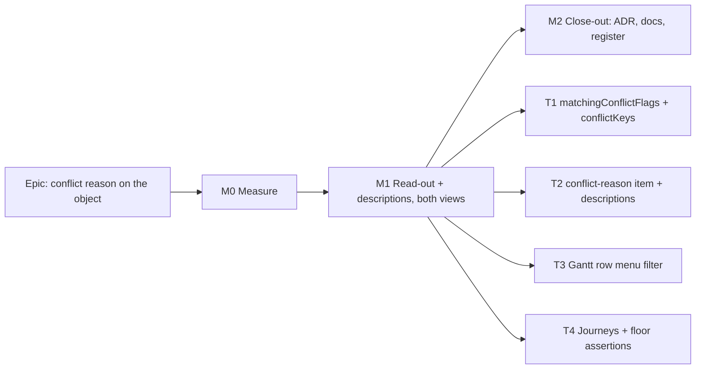

# Implementation Plan: The conflict's reason, shown on the object

- **Feature spec:** [`feature-spec.md`](./feature-spec.md)
- **Status:** Draft — awaiting approval before implementation.
- **Owner:** web

## Breakdown

### Epic

**Conflict reason on the object.** This closes `docs/TECH_DEBT.md` #479. It is a UI-consistency follow-on to the
toolbar redesign. There is no flag (ADR-0088 D1), and the rollback is M1's commit.

---

### Milestone M0: Measure the problem and the remedy (no product change)

**Outcome:** committed readings that settle Q1 and Q2 and replace every **estimate** in the spec.
**Entry point:** `Ships dark: a measurement harness, not a gate (ADR-0081 §3). M1 surfaces the capability.`
**Journey:** none (harness only).

#### Feature: M0 readings

> **Description:** a Playwright harness `apps/web/measure-toolbar/conflict-reason-m0.spec.ts` in the shape of
> `toolbar-redesign-m4.spec.ts`, and a record `docs/specs/conflict-reason-on-object/m0-measurement.md`.
> **Complexity:** S
> **Dependencies:** the toolbar redesign M4 on `main`.
> **Risks:** a stale reading. Mitigation: read the real bar, never project it (the M2 lesson in `m4-measurement.md`).
> **Testing requirements:** none. It is a harness.

##### Task M0-T1: Readings

- **Description:** at 1024 × 600, 1280 × 800, 1440 × 900, 1646 × 1097 and 1912 × 1080, on fine and coarse pointers,
  with a selected activity of each conflict type (constraint via `MANDATORY_START` before the data date, as in
  `conflict-review.spec.ts:248-264`; placement-early via a drag, as at `:122-138`; placed past a bound; levelling)
  and one unflagged selection, record:
  1. what a sighted user sees today after Next conflict: a screenshot plus the bar's text content. This is the
     "before" evidence for §1's problem statement;
  2. foot-row height, bar lines and canvas height (from the M4 record's columns);
  3. the natural width of each label rendered in the bar's text style, injected as a probe `span` with no product
     change, and the outlet's free width per cell. **This is what decides SC-6 and SC-7 before anything is built.**
  4. that `GuestPlanView` renders no selection bar (§1 Users).
- **Complexity:** S
- **Dependencies:** none
- **Risks:** levelling and placed-past-a-bound fixtures are harder to seed. Mitigation: start from a catalogue plan if
  `docs/TEST_PLAYBOOK.md` names one; otherwise record the type as "projected from label width" and say so.
- **Testing:** n/a
- **Development steps:**
  1. Write the harness. Run it against an isolated stack (the `scripts/e2e-local.sh --db-only` database, free ports,
     only the PIDs you recorded killed).
  2. Commit the JSON readings and the record.
  3. **Stop rule:** if the reason costs a line at 1912 × 1080 fine for any type, or more than one line at
     1024 × 600, stop and return the reading to the product owner (spec Q1/Q2) before M1.

---

### Milestone M1: The read-out, in both views

**Outcome:** a planner on any role and any pointer sees why the selected activity is flagged, in the Diagram and the
Gantt, and hears it as the description of the fix.
**Entry point:** Plan workspace → deck **Next conflict** (accessible name "Next conflict"). Or select any flagged
bar or Gantt row. The text appears in the toolbar named **"Actions for <activity>"**.
**Journey:** `e2e-workspace-chrome/conflict-review.spec.ts` (both cases, extended) and
`e2e-gantt-editing/object-actions-reach.spec.ts` (a new positive case). Both are **verified red** on the pre-M1 tree
(ADR-0110).

#### Feature: the read-out

> **Description:** spec §4.6, exactly.
> **Complexity:** M
> **Dependencies:** M0 (and an owner answer if M0 hit its stop rule)
> **Risks:** see the rollup.
> **Testing requirements:** unit + two journeys + floor assertions + an a11y check in the journey.

##### Task M1-T1: One derivation, `conflictKeys` on the context

- **Description:** add `matchingConflictFlags` to `render/conflicts.ts`; make `orderedConflicts` and
  `leadingConflictKey` call it; add `conflictKeys` to `SelectionActionContext`; set both `conflictKeys` and
  `conflictKey` from one call in `build-selection-context.ts`.
- **Complexity:** S
- **Dependencies:** none
- **Risks:** a refactor drifts `orderedConflicts`' order. Mitigation: existing tests plus the identity test below.
- **Testing:**
  - `conflicts.test.ts`: for a fixture set covering each single flag, one two-flag activity and an unflagged one,
    `matchingConflictFlags(a).map(f => f.label)` **equals** `orderedConflicts([a])[0]?.reasons ?? []`. This is the
    "announcer and bar cannot disagree" pin.
  - `build-selection-context` unit: `conflictKey === (conflictKeys[0] ?? null)` for every fixture.
- **Development steps:**
  1. Add the helper and rewire its two callers.
  2. Add the field. Update every test `ctx()` factory with `conflictKeys: []` (typecheck finds them).
  3. Run `pnpm prepush`.

##### Task M1-T2: The `conflict-reason` item and the two descriptions

- **Description:** register the item (spec §4.6 table); add `ConflictReasonReadout`; give `ConflictRemedyControl`
  its `aria-describedby`; give `clear-visual-placement` its `srDescription` when the map names it as the remedy.
- **Complexity:** S
- **Dependencies:** M1-T1
- **Risks:** structural gates that enumerate the bar's items (`selection-duplication`, `state-ladder`,
  `roomy-items`, `conflict-remedy.structural`) need the new id. Mitigation: update them deliberately. The new
  item's label "Conflict reason" collides with no deck id or label (`next-conflict-status` is "Current conflict").
- **Testing:** a new `selection-actions.conflict-reason.test.tsx`:
  - each of the four keys renders its sentence-cased label; unflagged renders no `[data-toolbar-item="conflict-reason"]`;
  - two flags render "Constraint conflict, levelling window exceeded";
  - the node has `tabIndex=-1`, no `role`, no `aria-live`, and no `truncate` class;
  - with a route remedy, `getByRole('button', { name: 'Review the constraint…' })` has accessible description
    `Constraint conflict`;
  - with `visualEarlierThanLogic` and a placement, **Clear visual start**'s description is "Placed before its
    earliest start". With `visualLaterThanBound` and a placement, Clear visual start has **no** reason description,
    because the route carries it;
  - the read-out precedes the remedy in DOM order.
  - **Red first:** write the test before the item and record the failure in the PR.
- **Development steps:**
  1. Write the failing unit test.
  2. Implement, using existing tokens and the deck read-out's text treatment.
  3. Run accessibility-reviewer and component-reviewer on the diff **before** merge.

##### Task M1-T3: Presentational items are not row-menu items

- **Description:** `GanttRowMenu` filters out `item.presentational === true`.
- **Complexity:** S
- **Dependencies:** M1-T2
- **Risks:** none known.
- **Testing:** `GanttRowMenu.test.tsx`: a flagged context opens a menu with **no** menuitem named "Conflict
  reason", and the remedy item is still present. Verified red without the filter.
- **Development steps:** 1. Write the test. 2. Add the filter. 3. Run `pnpm prepush`.

##### Task M1-T4: Journeys and floor assertions

- **Description:** drive the real product.
- **Complexity:** M
- **Dependencies:** M1-T2, M1-T3
- **Risks:** seeding a conflict in the Gantt suite. Mitigation: reuse the `MANDATORY_START` PATCH from
  `conflict-review.spec.ts:248-264`. It needs no drag, so it works in a view with no canvas.
- **Testing:**
  - `conflict-review.spec.ts` case 1, after step 5:
    `dock(page).locator('[data-toolbar-item="conflict-reason"]')` is visible and has text
    `/placed before its earliest start/i`; `clear-visual-placement` has that accessible description; press Tab
    from the canvas listbox into the bar and the focused element is **not** the read-out. After step 7 (resolved),
    the read-out has count 0.
  - `conflict-review.spec.ts` case 2: "Constraint conflict" is visible; the remedy has that description.
  - SC-9: a two-conflict plan, Next conflict pressed three times; after each press the read-out count is 1 and its
    text matches the conflict type of the activity the dock names.
  - `e2e-gantt-editing/object-actions-reach.spec.ts`: **new positive case** "Conflict reason shows in the Gantt".
    Seed a constraint conflict, switch to the Gantt, select the row, and the docked bar shows "Constraint conflict".
    That names the label, which satisfies `coverage.structural.test.ts`, and drives what that file's comment at
    `:153-156` deferred. The row's `⋯` menu has no "Conflict reason" item.
  - Floor (`e2e-workspace-fit`, beside `floor-states.spec.ts`): at 1024 × 600 fine and coarse, conflicted-selection
    foot-row lines ≤ unconflicted + 1, and the existing "every object action a pointer can see, it can also reach"
    sweep passes with a conflicted selection. At 1912 × 1080 fine, an **equality** of foot-row height,
    conflicted against unconflicted (SC-6). An axe check on the bar in the conflicted state.
  - **Every new assertion is run red on the pre-M1 tree** and the failure is quoted in the PR.
- **Development steps:**
  1. Write the journeys. Run them on the pre-M1 tree and record red.
  2. Run `scripts/e2e-local.sh web:<suite>` for workspace-chrome, gantt-editing and workspace-fit, plus `pnpm prepush`.
  3. Add a changeset (`web`, minor: user-visible).

---

### Milestone M2: Close-out

**Outcome:** the record matches the product.
**Entry point:** as M1 (no new surface).
**Journey:** as M1.

#### Feature: docs and decision

> **Description:** the ADR (spec §4.8), the CLAUDE.md §16 line, `docs/TECH_DEBT.md` #479 closed (with the "four of
> five" and "three of four" corrections cited), a new row for the Gantt row menu's "Fix this conflict" placeholder
> label (`GanttRowMenu.tsx:233`, `selection-actions.tsx:526`), and the `UX_STANDARDS.md` bullet.
> **Complexity:** S
> **Dependencies:** M1 merged
> **Risks:** an ADR number collision with the toolbar-redesign ADR. Mitigation: take the next free number at write
> time; `check:adr-coverage` gates it.
> **Testing requirements:** `pnpm check:adr-coverage`, `check:spec-status` (flip this spec and plan to Approved or
> Accepted, cited by the ADR), and `check:counts` (the ADR count in the banner).

M2 can fold into M1's PR if the reviewers prefer one PR. The ADR is then written alongside the code.

## Sequencing & slices

M0, then M1 (one PR: T1–T4 together, because T2 without T4 would be a capability with no journey, and ADR-0081
forbids that), then M2. `main` stays releasable at each step: M0 changes no product code, and M1 is additive and
visible only on a flagged selection.

## Definition of Done (per task)

Each task's PR must satisfy the Feature Completion Criteria in [`docs/PROCESS.md`](../../PROCESS.md): code, tests
(including the `pnpm prepush` run and the e2e half), docs, the accessibility, component and ux reviews, Docker
build, CI green (read the deduped check runs on the current head, CLAUDE.md §19.9), changeset, and version impact
(web minor).

## Risks & assumptions (rollup)

| Risk / assumption                                                                                | Likelihood              | Impact | Mitigation                                                                                                                    |
| ------------------------------------------------------------------------------------------------ | ----------------------- | ------ | ----------------------------------------------------------------------------------------------------------------------------- |
| The read-out costs a line at 1024 (canvas about 246 → 207 fine, 200 → 156 coarse, **estimates**) | high                    | med    | Q1; paid only while a flagged activity is selected; B′ fallback; `#471` is the structural fix                                 |
| It costs a line at 1912 × 1080                                                                   | med (marginal estimate) | med    | M0 stop rule (Q2)                                                                                                             |
| Browse-mode screen readers hear the reason twice (text + description)                            | high                    | low    | Accepted default; the accessibility review may make the read-out `aria-hidden` instead                                        |
| The Gantt suite cannot seed a levelling conflict cheaply                                         | med                     | low    | Gantt journey covers the constraint type; the unit tests cover all four                                                       |
| The `presentational` filter hides a future presentational _action_ from the row menu             | low                     | low    | By definition a presentational item is not an action (`toolbar-registry.ts:345-347`)                                          |
| A stale label: `CONFLICT_FLAGS` copy changes and the journey's regex drifts                      | low                     | low    | The journey asserts the copy on purpose (as `conflict-review.spec.ts` does); the unit test reads labels from `CONFLICT_FLAGS` |
| The analyst took no browser readings                                                             | certain                 | med    | M0 exists for this; every figure in the spec is cited or marked estimate                                                      |
