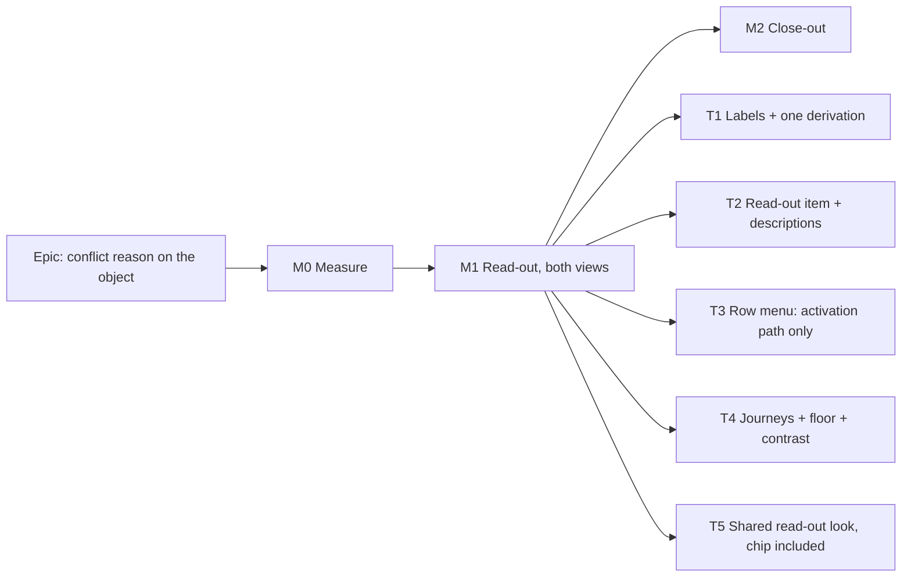

# Implementation Plan: The conflict's reason, shown on the object

- **Feature spec:** [`feature-spec.md`](./feature-spec.md)
- **Status:** Draft — awaiting approval before implementation.
- **Owner:** web

> **Revision 3 (2026-10-10).** M0 ran (`m0-measurement.md`); the owner chose B′ (a caption line above the
> controls). M1 was built to that: no registry item, no CVA-metrics extraction (the caption takes no control
> metrics), the chip's look shared by two class constants, and `e2e-workspace-fit/conflict-reason.spec.ts` in
> place of the 1912 equality. See the spec's Revision 3 note. M2's row 4 is dropped.

## Breakdown

### Epic

**Conflict reason on the object.** This closes `docs/TECH_DEBT.md` #479. It is a UI-consistency follow-on to the
toolbar redesign. There is no flag (ADR-0088 D1), and the rollback is M1's commit. The ADR is **ADR-0186**
(reserved). ADR-0184 is taken and 0185 is the toolbar redesign's, filed at its M7. If the filing order changes, the
later filer takes the next free number.

**Order against the toolbar redesign.** M0 here runs **after** toolbar-redesign M6 lands, because M6's V2/V3 can
change the geometry of `Toolbar`-rendered bars. Its M5 (SC-18) re-measures the deck, not the foot row, and does not
affect this work. If this M0 has to run first, its readings are re-taken after M6. That epic's plan is the
orchestrator's to correct, not this plan's.

---

### Milestone M0: Measure the problem and the remedy (no product change)

**Outcome:** committed readings that settle Q1 and Q2 and replace every **estimate** in the spec.
**Entry point:** `Ships dark: a measurement harness, not a gate (ADR-0081 §3). M1 surfaces the capability.`
**Journey:** none (harness only).

#### Feature: M0 readings

> **Description:** a Playwright harness `apps/web/measure-toolbar/conflict-reason-m0.spec.ts` in the shape of
> `toolbar-redesign-m4.spec.ts`, and a record `docs/specs/conflict-reason-on-object/m0-measurement.md`.
> **Complexity:** S
> **Dependencies:** toolbar redesign M4 and M6 on `main` (see Epic).
> **Risks:** a stale or projected reading. Mitigation: read the real bar, never project it (`m4-measurement.md` M2
> lesson).
> **Testing requirements:** none. It is a harness.

##### Task M0-T1: Readings

- **Description:** measure the real bar, **with Float paths on the selection bar** (icon-only, as toolbar-redesign
  M2-T4 shipped it; `VITE_FLOAT_PATHS` on). Cells: 1024 × 600, 1280 × 800, 1440 × 900, 1646 × 1097 and 1912 × 1080,
  on fine and coarse pointers. Selections: one of each conflict type, each with and without a placement where that
  applies, and one unflagged. Seeding: the constraint type via `MANDATORY_START` before the data date
  (`conflict-review.spec.ts:248-264`); placement-early via a drag (`:122-138`); placed after the constraint date; and
  levelling. For each, record:
  1. what a sighted user sees today after Next conflict: a screenshot plus the bar's text content (the "before"
     evidence for spec §1);
  2. foot-row height, bar lines and canvas height (the M4 record's columns), **and how many activity rows remain
     visible** in the canvas, especially at the coarse 1024 × 600 cell (about 156 px **estimate** with a reason);
  3. the natural width of each **new** label (spec §1 Defaults), and of the longest two-flag string, in the read-out's
     text style. These are injected as probe `span`s, with no product change. Also record the outlet's free width per
     cell. **This is what decides SC-6 and SC-7 before anything is built.**
  4. whether either remedy label truncates at 1024 coarse (spec §4.6, `truncate`);
  5. that the Gantt dock's bar sits on the same fill as the Diagram's (spec §4.6, contrast);
  6. that `GuestPlanView` renders no selection bar.
- **Complexity:** S
- **Dependencies:** none
- **Risks:** levelling and placed-after-constraint fixtures are harder to seed. Mitigation: start from a catalogue plan
  if `docs/TEST_PLAYBOOK.md` names one; otherwise record that type as "projected from label width" and say so.
- **Testing:** n/a
- **Development steps:**
  1. Write the harness. Run it against an isolated stack (the `scripts/e2e-local.sh --db-only` database, free ports,
     only the PIDs you recorded killed).
  2. Commit the JSON readings and the record.
  3. **Stop rule:** if the reason costs a line at 1912 × 1080 fine for any type, or more than one line at
     1024 × 600, stop and return the reading to the product owner (spec Q2; B′ is the candidate only for the 1912
     case) before M1.

---

### Milestone M1: The read-out, in both views

**Outcome:** a planner in any role and on any pointer sees why the selected activity is flagged, in the Diagram and
the Gantt. Where the bar has a control that answers it, they hear it as that control's description. The Gantt row
menu offers nothing inert.
**Entry point:** Plan workspace → deck **Next conflict** (accessible name "Next conflict"). Or select any flagged bar
or Gantt row. The text appears in the toolbar named **"Actions for <activity>"**.
**Journey:** `e2e-workspace-chrome/conflict-review.spec.ts` (both cases, extended) and
`e2e-gantt-editing/object-actions-reach.spec.ts` (a new positive case). Every new assertion is **verified red** on the
pre-M1 tree (ADR-0110).

#### Feature: the read-out

> **Description:** spec §4.6, exactly.
> **Complexity:** M
> **Dependencies:** M0, and an owner answer if M0 hit its stop rule
> **Risks:** see the rollup.
> **Testing requirements:** unit + structural + contrast + two journeys + floor assertions + an axe check in the
> journey.

##### Task M1-T1: The labels, and one derivation

- **Description:**
  - Change the four `CONFLICT_FLAGS.label` values (spec §1 Defaults table).
  - Add `matchingConflictFlags` and `joinConflictReasons` to `render/conflicts.ts`. The file stays pure: no React,
    no env.
  - Rewire `orderedConflicts` and `leadingConflictKey` to call `matchingConflictFlags`.
  - The announcer (`use-conflict-navigation.ts:97-99`) uses `joinConflictReasons(hit.reasons, 'mid')`.
  - Add `conflictKeys` to `SelectionActionContext`. Set it and `conflictKey` from one call in
    `build-selection-context.ts`.
- **Complexity:** S
- **Dependencies:** none
- **Risks:**
  - The copy change breaks tests that assert today's strings. Mitigation: update them **deliberately, in this
    commit**, each one read rather than search-and-replaced. The files that carry today's strings are
    `conflicts.test.ts`, `tsld-toolbar-canvas-nav.test.tsx`, `use-tsld-toolbar-context.canvas-nav.test.tsx`,
    `selection-actions.conflict-remedy.test.tsx`, `conflict-remedy.structural.test.ts`,
    `use-plan-workspace-model.quick-wins.test.ts` and `e2e-workspace-chrome/conflict-review.spec.ts`. Also check
    `ScheduleSummaryStrip.test.tsx`: it matched the search, but its metric "Constraint conflicts" is not changed.
  - The refactor drifts the order. Mitigation: the identity tests below.
- **Testing:**
  - `conflicts.test.ts`: for every one of the 12 valid flag combinations (2 × 3 × 2: `visualConflictReason` is one
    field, so the two placement flags are mutually exclusive), `matchingConflictFlags(a).map(f => f.label)`
    **equals** `orderedConflicts([a])[0]?.reasons ?? []`. This pins that the announcer and the bar cannot disagree.
  - `leadingConflictKey(a) === (matchingConflictFlags(a)[0]?.key ?? null)` over all 12 combinations, plus a
    structural assertion that `conflict-remedy.ts`'s `leadingConflictKey` calls `matchingConflictFlags` and does not
    re-derive the result from `CONFLICT_FLAGS` directly.
  - `joinConflictReasons`: `'start'` keeps only the first capital; `'mid'` lower-cases every first character; only
    the first character of each label changes ("Can't…" becomes "can't…").
  - `use-conflict-navigation`: the announcement reads `Conflict 1 of 2: Pour slab — constraint not met.`
  - `build-selection-context` unit: `conflictKey === (conflictKeys[0] ?? null)` for every fixture.
- **Development steps:**
  1. Write the failing tests for the helpers and the identity.
  2. Change the labels, add the helpers, rewire the callers.
  3. Add the field. Update **every** `ctx()` fixture with `conflictKeys: []`. There are 16 `conflictKey: null`
     fixtures today, more than the four in the Gantt files the review listed: `GanttRowMenu.test.tsx:42`,
     `GanttPanel.touch.test.tsx:76`, `GanttPanel.row-menu-keyboard.test.tsx:63`, `GanttPanel.disclosure.test.tsx:81`,
     `make-milestone.test.tsx:30`, `tsld-toolbar-float-paths.test.tsx:58`, and `selection-actions.{duplicate,canvas,
entry-routes,clear-placement,conflict-remedy,dissolve,notes,resources-off}.test.tsx` plus
     `selection-actions.test.tsx:55`. The typecheck finds any missed.
  4. Run `pnpm prepush`.

##### Task M1-T2: The `conflict-reason` item and the two descriptions

- **Description:**
  - Register the item (spec §4.6 table).
  - Add `ConflictReasonReadout`. It spreads only `data-toolbar-item`, not `tabIndex`.
  - Give `ConflictRemedyControl` an `aria-describedby` pointing at a `hidden` node **outside** its button, holding the
    leading reason.
  - Give `clear-visual-placement` an `srDescription` for the case where the remedy map names it.
- **Complexity:** S
- **Dependencies:** M1-T1 (and M1-T5 for the style)
- **Risks:** the structural gates that enumerate `selectionActionItems` must accept the new id. Mitigation: update
  each deliberately: `selection-duplication.structural.test.ts` (and **add "Conflict reason" to its label-collision
  check** against the deck), `state-ladder.structural.test.ts`, `roomy-items.structural.test.ts`,
  `conflict-remedy.structural.test.ts`, `make-milestone-label.structural.test.ts`,
  `moved-tools.structural.test.ts`, and `gantt/coverage.structural.test.ts` (see M1-T4).
- **Testing:** a new `selection-actions.conflict-reason.test.tsx`, **written red first**:
  - each of the four keys renders its new label; unflagged renders no `[data-toolbar-item="conflict-reason"]`;
  - **multi-flag (UX B2):**
    - `constraintViolated` + `levelingWindowExceeded` renders "Constraint not met, can't be levelled within its
      window", with exactly one remedy button, "Review the constraint…", and no "Review resources…";
    - `visualEarlierThanLogic` + `levelingWindowExceeded` renders both reasons, with **no** route button;
  - the node has **no** `tabindex` attribute, no `role`, no `aria-live`, no `aria-hidden` and no `truncate`; a click
    on it does not move `document.activeElement` onto it;
  - the remedy button's accessible **name** is exactly "Review the constraint…" (no description leak), and its
    description is "Constraint not met";
  - for `visualEarlierThanLogic` with a placement, Clear visual start's description is "Placed before its logic
    allows". For `visualLaterThanBound` with a placement, Clear visual start has **no** reason description, because
    the route carries it;
  - the read-out precedes the remedy in DOM order.
- Structural tests (in `selection-actions` or the toolbar's structural suite):
  - a `presentational` item's rendered node never carries `data-toolbar-focusable`;
  - every `aria-describedby` id on the bar resolves to an element in the document.
- **Development steps:**
  1. Write the failing unit and structural tests.
  2. Implement, with the shared style from M1-T5.
  3. Run accessibility-reviewer and component-reviewer on the diff **before** merge.

##### Task M1-T3: A row-menu item needs an activation path

- **Description:** `GanttRowMenu` filters to `item.onActivate !== undefined` (spec §4.6). That drops the
  presentational read-out and the render-only `conflict-remedy`, which today is a live "Fix this conflict" menu item
  that does nothing (`GanttRowMenu.tsx:227-233`, `selection-actions.tsx:518-535`).
- **Complexity:** S
- **Dependencies:** M1-T2
- **Risks:** another render-only item that is legitimately in the menu today would disappear. Mitigation: the builder
  lists which items the filter drops, from the registry, in the PR description. If any is a real action reached only
  through `render`, it gets an `onActivate` rather than being dropped.
- **Testing:**
  - `GanttRowMenu.test.tsx`: a flagged context opens a menu with **no** menu item named "Conflict reason" and none
    named "Fix this conflict". Verified red without the filter.
  - A structural test: for every `selectionActionItems` entry the row menu can render (visible with `canvas: null`),
    `onActivate` is defined.
- **Development steps:** 1. Write the tests. 2. Add the filter. 3. Run `pnpm prepush`.

##### Task M1-T4: Journeys, floor and contrast

- **Description:** drive the real product, and gate the new colour pair.
- **Complexity:** M
- **Dependencies:** M1-T2, M1-T3, M1-T5
- **Risks:** seeding a conflict in the Gantt suite. Mitigation: reuse the `MANDATORY_START` PATCH from
  `conflict-review.spec.ts:248-264`. It needs no drag, so it works in a view with no canvas.
- **Testing:**
  - `conflict-review.spec.ts` case 1 (placement-early), after step 5:
    - `dock(page).locator('[data-toolbar-item="conflict-reason"]')` is visible with text
      `/Placed before its logic allows/`, and `clear-visual-placement` has that accessible description;
    - **Tab from the canvas listbox into the bar lands on `[data-toolbar-item="open-logic"]`**, the real first stop
      for this type, and never on the read-out;
    - after step 7 (resolved), the read-out has count 0.
  - `conflict-review.spec.ts` case 2 (constraint):
    - "Constraint not met" is visible;
    - **Tab lands on `[data-toolbar-item="conflict-remedy"]`**, whose accessible name is "Review the constraint…" and
      whose description is "Constraint not met".
  - Update today's regexes there deliberately (M1-T1).
  - SC-9: a two-conflict plan with Next conflict pressed three times. After each press the read-out count is 1, and
    its text matches the conflict type of the activity the dock names.
  - `e2e-gantt-editing/object-actions-reach.spec.ts`, **a new positive case**: seed a constraint conflict, switch to
    the Gantt, select the row, and the docked bar shows "Constraint not met". The row's `⋯` menu has no
    "Conflict reason" and no "Fix this conflict". **The case's source must contain the literal `'Conflict reason'`.**
    `gantt/coverage.structural.test.ts:56-75` calls `item.isVisible({ canvas: null })` and treats a throw as
    reachable, and the new predicate reads `ctx.conflictKeys.length`, which throws on that stub. So the gate will
    require the label to appear in the suite. Naming it in a case that really asserts the read-out is the honest way
    to meet that. The gate is not edited.
  - Floor (`e2e-workspace-fit`, beside `floor-states.spec.ts`):
    - at 1024 × 600, fine and coarse, a conflicted selection's foot-row lines are ≤ the unconflicted count + 1, and
      the existing "every object action a pointer can see, it can also reach" sweep passes with a conflicted
      selection;
    - at 1912 × 1080 fine, an **equality** of foot-row height, conflicted against unconflicted (SC-6);
    - an axe check on the bar in the conflicted state.
  - Contrast (SC-11): a named assertion beside `TEXT_PAIRS` in `token-contrast.test.ts`. For the chrome scope, in
    every theme, the composite of `--foreground` at 5 % over `--background` (the card), against `--foreground`
    ≥ 4.5:1 and against `--warning` ≥ 3:1. It uses the alpha census's `compositeOver`, because neither existing gate
    sees this pair (spec §4.6).
  - **Every new assertion is run red on the pre-M1 tree**, and the failure is quoted in the PR.
- **Development steps:**
  1. Write the journeys. Run them on the pre-M1 tree and record red.
  2. Run `scripts/e2e-local.sh web:<suite>` for workspace-chrome, gantt-editing and workspace-fit, plus
     `pnpm prepush`.
  3. Add a changeset (`web`, minor: user-visible).

##### Task M1-T5: One look for the conflict read-out, chip included

- **Description:**
  - Add `features/plan-actions/conflict-readout.ts` (class constants only, no React). It holds the read-out's text
    and icon classes from spec §4.6 "Visual treatment".
  - Extract the control metrics from `toolbarControlVariants` into one exported constant that the CVA base composes.
    The CVA's output must not change.
  - Apply the style to the bar's read-out (wrapping), and to the deck's `CurrentConflictStatus`. The chip moves from
    `tone: 'info'` (muted) to foreground text with a `text-warning` triangle. It stays `aria-hidden`, count-only,
    `whitespace-nowrap` and borderless (UX review S2).
- **Coordination:** the toolbar redesign's fix builder is doing a first pass at the chip's look. M1-T5 does not edit
  that epic's specs.
  - If that pass has landed, M1-T5 lifts its classes into the shared constant and points both consumers at it.
  - If it has not, M1-T5 does the change and records it in this epic's PR, so that epic's next pass reuses the
    constant rather than restyling the chip a second time.
- **Complexity:** S
- **Dependencies:** none
- **Risks:** the metrics extraction changes a shared class string. Mitigation: assert the CVA's output string is
  unchanged for every variant combination (a unit test written before the extraction). It changes no keyboard
  contract, so ADR-0111 is not engaged.
- **Testing:**
  - neither consumer carries `text-muted-foreground`, a border, a `bg-` fill or a `hover:` class;
  - the chip keeps `aria-hidden` and its count text;
  - SC-5's deck journeys stay green with the new chip.
- **Development steps:** 1. Write the CVA-unchanged test. 2. Extract. 3. Apply to both consumers. 4. Run
  `pnpm prepush`.

---

### Milestone M2: Close-out

**Outcome:** the record matches the product.
**Entry point:** as M1 (no new surface).
**Journey:** as M1.

#### Feature: docs and decision

> **Description:**
>
> - Write ADR-0186 (spec §4.8) and its CLAUDE.md §16 line.
> - Add the conflict read-out pattern to the `docs/COMPONENT_LIBRARY.md` inventory and a `docs/UX_STANDARDS.md`
>   bullet ("a flagged object states its reason beside its remedy; a status read-out in a toolbar is foreground
>   text, a warning icon, no fill, border or hover").
> - Close `docs/TECH_DEBT.md` #479. Keep its **"three of four" remedy count, which was right**. Correct its stale
>   "four of the five flag types have no on-canvas badge": there are four types, three draw a glyph, and none draws
>   a sentence. Also correct any wording that implies the chip was the only on-screen signal: three types draw a
>   canvas glyph, and three render a remedy (UX review S6).
> - File four new register rows:
>   1. **The Gantt row menu has no conflict remedy.** It was inert as well as mislabelled ("Fix this conflict",
>      `GanttRowMenu.tsx:227-233`, `selection-actions.tsx:526`). M1-T3 removed the inert item; the fuller fix is an
>      `onActivate` on `conflict-remedy` with a label from `CONFLICT_REMEDIES`.
>   2. **The listbox description has no clause for `constraintViolated` or `levelingWindowExceeded`**
>      (`a11y.ts:211-218`). A screen-reader user who clicks rather than cycles hears no reason for those two.
>   3. **`constraintViolated` has no canvas glyph**; the pin marks only that a constraint exists (`paint.ts:2089`,
>      `:2106` cover the other three types).
>   4. Only if M0 recorded it: a remedy label truncates at 1024 coarse.
> - Flip this spec and plan to Approved or Accepted, cited by the ADR.
>
> **Complexity:** S
> **Dependencies:** M1 merged
> **Risks:** an ADR number collision. Mitigation: the reservation above; `check:adr-coverage` gates it.
> **Testing requirements:** `pnpm check:adr-coverage`, `check:spec-status`, `check:counts` (the banner's ADR count),
> and `pnpm prepush`.

M2 can fold into M1's PR if the reviewers prefer one PR. The ADR is then written alongside the code.

## Sequencing & slices

Toolbar-redesign M6, then M0, then M1 (one PR: T1–T5 together, because the read-out without its journey would be a
capability with no journey, which ADR-0081 forbids), then M2. `main` stays releasable at each step: M0 changes no
product code, and M1 is additive except for the label copy and the chip's look, both of which are deliberate and
journey-covered.

## Definition of Done (per task)

Each task's PR must satisfy the Feature Completion Criteria in [`docs/PROCESS.md`](../../PROCESS.md): code, tests
(including the `pnpm prepush` run and the e2e half), docs, the accessibility, component and ux reviews, Docker
build, CI green (read the deduped check runs on the current head, CLAUDE.md §19.9), changeset, and version impact
(web minor).

## Risks & assumptions (rollup)

| Risk / assumption                                                                                           | Likelihood              | Impact | Mitigation                                                                                                                |
| ----------------------------------------------------------------------------------------------------------- | ----------------------- | ------ | ------------------------------------------------------------------------------------------------------------------------- |
| The read-out costs a line at 1024 (canvas about 246 → 207 fine, 200 → 156 coarse, **estimates**)            | high                    | med    | Q1 (accept); paid only while a flagged activity is selected; M0 records the rows visible; `#471` is the structural fix    |
| It costs a line at 1912 × 1080                                                                              | med (marginal estimate) | med    | M0 stop rule (Q2); B′ is the candidate only here                                                                          |
| The label copy change breaks string-asserting tests and journeys                                            | certain                 | low    | Updated deliberately in M1-T1; the files are listed                                                                       |
| "Constraint not met" (label) beside "Constraint conflicts" (summary-strip metric) reads as two vocabularies | med                     | low    | Different subjects, one activity's state against a count's name; the ux review signs off; not changed here                |
| Browse-mode screen readers hear the reason twice                                                            | high                    | low    | Accepted (ADR D3); the alternative loses the only channel when the described control is absent                            |
| For `visualEarlierThanLogic` a keyboard user reaches Logic before the reason's control                      | certain                 | low    | Stated (US-2, SC-3); the visible line and the announcer carry it; reordering the bar per context is what ADR-0094 refused |
| The row-menu filter drops a render-only item that is a real action                                          | low                     | med    | M1-T3 lists the dropped items; a real action gets an `onActivate`                                                         |
| Metrics extraction changes the CVA's output                                                                 | low                     | med    | A CVA-unchanged test written first                                                                                        |
| The composited card fill fails 4.5:1 in some theme                                                          | low                     | high   | SC-11 assertion; caught at M1 before merge                                                                                |
| The analyst took no browser readings                                                                        | certain                 | med    | M0 exists for this; every figure in the spec is cited or marked estimate                                                  |
