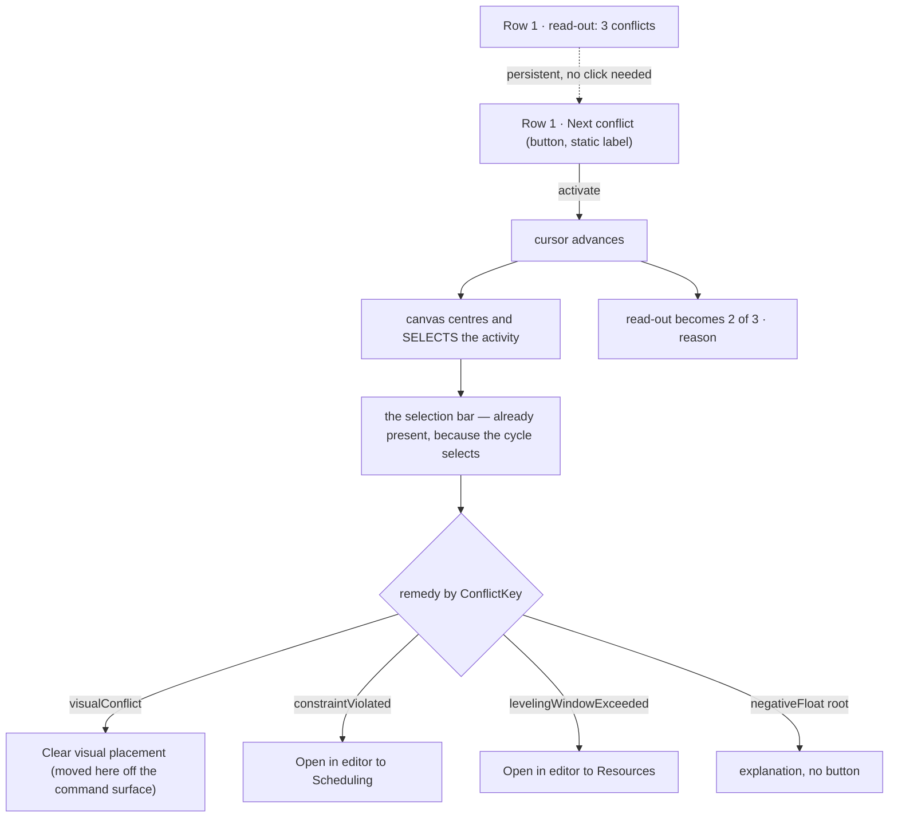

# Feature Spec: Conflict review — a count you can see, and an action that fits

- **Status:** Draft — awaiting product-owner approval of the plan (all five open questions ANSWERED
  2026-08-13, recorded in §1)
- **Author(s):** Claude Code (from a product-owner observation on `web-v0.89.0`)
- **Date:** 2026-08-13
- **Related ADR(s):** ADR-0031 (toolbar registry & taxonomy), ADR-0064 (a statement lives in
  reserved chrome, never over the scene), ADR-0090/0091 (the command surface's width and its
  degradation ladder), ADR-0092 (the canvas dock), ADR-0093 (an object action belongs on the
  object). Proposes **ADR-0094**.

---

## 1. Business understanding

### Problem

The product owner used `web-v0.89.0` and asked whether **Next conflict** is the right shape: today
you click it, a message appears saying how many conflicts there are, and you click again to walk
them. The proposal was that the button should shade when there is nothing to review, and carry the
count itself.

**Reading the code found that half of it already ships, and that the half which does not is a
different problem than it looks.**

| Claim                                    | What the code says                                                                                                                         |
| ---------------------------------------- | ------------------------------------------------------------------------------------------------------------------------------------------ |
| "shade the bar if no conflicts"          | **Already done.** `isEnabled: (ctx) => ctx.hasConflicts`, `disabledReason` `'No conflicts to review'` (`tsld-toolbar-items.tsx:2145-2151`) |
| "have it clickable if there are"         | Already true                                                                                                                               |
| "the button should update to say x of x" | The count is a **separate** presentational chip, `next-conflict-status`, `isVisible` only while `currentConflict != null` (`:2215-2224`)   |

So why does the shading not help? **`next-conflict` is `tier: 3`** (`:1852`), and ADR-0091 made
tier 3 _admitted last_. Measured at 1646 on 2026-08-13, Row 1 renders `today, zoom-out, zoom-in,
fit, view, resource-view, legend, search, filter, summary, finish-chip` — **`next-conflict` is not
among them**. It is inside the `⋯`. A control shaded inside a menu is a shading nobody sees, and a
count that only appears once you are already cycling is a count that cannot tell you whether
cycling is worth starting.

**That reframes the request.** The gating is right; the placement is wrong.

> ~~And the two are one change: ADR-0090 M2-T3 folded the search count into its field and recorded
> that the same fold was "REFUSED for `next-conflict`" — because the search field is a pinned
> `render` item painted at every width and the conflict button is not. The refusal was a consequence
> of tier 3. Promote the button and the objection dissolves.~~
>
> **WITHDRAWN 2026-08-13 by the pre-approval architecture review. The struck sentence is false, and
> it was the load-bearing sentence of D1.** The refusal (`tsld-toolbar-items.tsx:2198-2213`) says
> nothing about tier. It says a **label** is painted only when `autoLabelsFit` is true, and that at
> 1920 it is not — so folding the count into a label _"would make it invisible at the width this
> whole epic exists to fix"_. Promotion to tier 1 does not change that: `labelPolicy` defaults to
> `'auto'` and Stage 1 of the ladder withdraws `'auto'` labels **before** it demotes anything
> (`toolbar-ladder.ts:215-231`). The refusal's grounds survive the promotion intact.
>
> Worse, the comment opens: _"The plan said to fold this into `next-conflict`'s label. Measurement
> says do not."_ **A previous plan proposed exactly this and was refused on measurement.** This spec
> re-proposed it having read a paraphrase of a different comment (the search field's, at `:1043`)
> rather than the refusal itself — an ADR-0076 Class 3 failure inside a document that cites
> ADR-0076. Preserved rather than deleted, because the correction is the more useful record.

### Two findings the investigation turned up that the request did not ask about

**F1 — "Conflict" already means two different things on the same toolbar.** The Filter menu's
**"Has conflict"** matches `visualConflict` **only** (`lenses.ts:21,47`). The Next-conflict cycle
counts **five** flags (`conflicts.ts:44-70`). Both live in the `find` group, side by side. Today
this is invisible because the button is buried and the count is transient. Put "3 conflicts"
permanently on the bar and a planner who filters sees fewer bars than the number promised — and
reasonably concludes the product is broken. This is the ADR-0093 shape exactly: nothing is wrong in
either file, and the wrongness lives only in the relationship.

**F2 — two of the five "conflicts" are not faults a planner can act on.** `externalDriven` means an imported date from
another plan is driving the activity. On a programme with real interfaces that fires constantly and
there is nothing to do about it — which is how a counter becomes noise people stop reading. It is
**already reported elsewhere**: `ScheduleSummaryStrip.tsx:73,127,174` surfaces
`externalDrivenCount`. Nothing is lost by taking it out of the conflict set.

**The architecture review then applied that argument back at the spec, and it lands harder on
`negativeFloat`.** Negative float propagates _backwards_ along a chain: one unmeetable deadline
flags the activity carrying it **and every predecessor feeding it**. So it is one root cause counted
N times, it fires hardest on exactly the plans that most need review, and it is the one type with no
remedy at all. `3 conflicts` becoming `137 conflicts`, of which 134 are one problem, is precisely
"how a counter becomes noise people stop reading" — the sentence F2 was written to make about a
milder case. Put to the product owner (D-f).

### Users

- **Planners** — the people who review and clear conflicts; the only role that can act on most of them.
- **Contributors / Viewers** — can see the count and step through; most fixes are pen-gated, so the
  bar must say why an action is shut rather than hide it (ADR-0082).

### Decisions taken (product owner, 2026-08-13)

All five were put with their costs and answered:

| #   | Question                              | Answer                                                                                                                                                                                                                  |
| --- | ------------------------------------- | ----------------------------------------------------------------------------------------------------------------------------------------------------------------------------------------------------------------------- |
| D-a | Where the button lives, what it says  | **On the bar, with a count readable without acting.** ~~The count on the button~~ — see the withdrawal above; the count stays in the read-out beside it, made **persistent**. Requirement unchanged, mechanism reversed |
| D-b | What the dock strip offers            | **The action that fits the type** — a real fix where one exists, a route where that is all there is, and no button where the honest answer is "this is information"                                                     |
| D-c | Imported external dates               | **Not a conflict.** Out of the counted set; it stays on the Schedule summary strip                                                                                                                                      |
| D-d | Delivery                              | **One epic, all together**                                                                                                                                                                                              |
| D-e | The two meanings of "conflict" (F1)   | **Make them the same** — the Filter's "Has conflict" widens to match the counted set                                                                                                                                    |
| D-f | Negative float (raised by the review) | ~~Count the root only~~ → **Drop it from the counted set** (revised 2026-08-13, when root-only was found to recreate F1 — see D3)                                                                                       |

### Success criteria

- The count is readable **without** starting to cycle, at 1646 and **down to the `compact` band**.
  The original wording said "at every width in the fit gate", which is **unachievable and was
  withdrawn**: the gate sweeps to 768, and no label survives that. The read-out withdraws at
  `condensed` exactly as the Project-finish chip does — a stated floor beats a criterion that cannot
  be met.
- One meaning of "conflict" across the toolbar, asserted structurally rather than by reading.
- No remedy is ever offered that does nothing. (After D-f's revision this is structural: all three
  remaining types have one.)
- No width regression: Row 1's labelled count at 1646 is **measured** before and after, and if
  promoting the button demotes something else, that trade is reported rather than absorbed.

---

## 2. Functional requirements

### User stories & acceptance criteria

**US-1 — As a planner, I can see whether this plan has conflicts without doing anything.**

- Given a computed plan with conflicts, when I look at Row 1, then the Next-conflict control shows
  the count.
- Given no conflicts, then the control is **shaded with its reason**, not hidden (ADR-0082).
- Given no computed diagram, then the existing "no diagram" reason wins over the count.

**US-2 — As a planner, stepping through conflicts tells me where I am.**

- Given I activate it, then the control reads `2 of 3` and the canvas centres and selects the
  activity, as it does today.
- ~~The separate `next-conflict-status` chip is **retired** — one control, one statement.~~
  **Reversed with D1.** The chip is **kept** and made persistent. Retiring it before a replacement
  existed would have left a sighted planner cycling with no visible statement of what the current
  conflict is. Corrected here because an implementer builds from §2, and a spec whose acceptance
  criteria state the reversed decision is the ADR-0058 class inside the document citing it — flagged
  independently by two reviewers.

**US-3 — As a planner, the remedy that fits the conflict is on the activity I have landed on.**

The cycle **selects** the activity, so the selection bar is already there. The remedies are
conditional items on it — not a second strip (§4 D4).

- **Hand-placed clash** (`visualConflict`) → **Clear visual placement**, pen-gated with a reason when
  shut. This command **moves** here off the command surface.
- **Broken constraint** (`constraintViolated`) → _Open in editor_ at the Scheduling tab.
- **Levelling overrun** (`levelingWindowExceeded`) → _Open in editor_ at the Resources tab.

> **There is no longer a "no button" case, and that is the shape of the epic changing under a
> decision rather than a gap being papered over.** The first version had one — negative float, which
> had no remedy — and specified an explanation with no control. Dropping `negativeFloat` from the
> counted set (D-f, revised) leaves **three** types, **all of which have a remedy**. So D-b's "no
> button where the honest answer is information" is now vacuous, and the copy the UX review drafted
> for it is not needed. Recorded rather than silently deleted, because the reasoning is what a later
> reader needs if a remedy-less flag is ever proposed again.

**US-4 — As a planner, filtering to conflicts finds the same things the count counts.**

- Given the Filter menu's "Has conflict", when I apply it, then it matches every activity the count
  includes — and nothing else.

**US-5 — As a planner working on a programme, imported external dates do not inflate my conflicts.**

- They are absent from the count and from the cycle; the Schedule summary strip is unchanged.

### Edge cases

- **The conflict set changes under you** (a recalculation lands mid-cycle). Today's cursor
  behaviour is unchanged by this epic and is explicitly out of scope; if the count changes while the
  bar is open, it re-derives from the live set like every other dock consumer.
- **The fix is shut.** `clear-visual-placement` needs Visual mode, the pen and a selection. The
  bar shades it with the reason rather than hiding it (ADR-0082).
- **A single activity carries several flags.** `CONFLICT_FLAGS` is already ordered for exactly this
  (`conflicts.ts:33`); the bar names the **first** matching reason and offers that type's remedy.
- **Plural selection.** Out of scope — the cycle is singular by construction.

### Permissions

No permission changes. Reading the count and stepping are reads, available to every role. The one
real fix is pen-gated because the underlying command already is.

---

## 3. Technical analysis

### What exists and is reused

- `render/conflicts.ts` — `CONFLICT_FLAGS`, the single ordered source of the set and its copy.
- `render/ordering.ts` — the shared comparator; the cycle and search already agree on plan order.
- `commands/use-conflict-navigation.ts` — the cursor.
- `selectionActionItems` (`selection-actions.tsx`) — the remedies' home. **Not** a new `CanvasDock`
  strip: the cycle selects, so this bar is already present, and the dock outlet is `flex-wrap` — a
  second strip would grow the row in the only state it can occur in (§4 D4).
- `clear-visual-placement` — the one real fix, already a wired command.
- `openActivityEditor(activity, purpose)` — the editor route.

### Gaps found

- **No `scheduling` purpose on the editor intent.** `ActivityEditorTab` includes `'scheduling'` and
  `'resources'`, but `ActivityEditorPurpose` has no member mapping to `scheduling` — `'edit'` maps
  to `general` (`activity-editor-intent.ts:76-82`). US-3 needs one new purpose.
- **`clear-visual-placement` is itself `tier: 3`** (`:1807`) — so both the conflict cycle and its
  only real fix are in the `⋯` today. It **moves** to the selection bar, which is where ADR-0093's
  own discriminator says it belongs anyway: its `isEnabled` consults the selection.
- **Widening the filter is a behaviour change to a shipped control.** `MatchableActivity` currently
  carries only `visualConflict`; matching the counted set means it grows the other fields. This is
  ~~the one part of the epic that changes what an existing control returns~~ — **four consumers, not
  one** (§4). It needs its own test.

### Dependencies

None added. **Frontend-only: the CPM engine is not imported and no migration runs**, so the
ADR-0034 recalculation parity gate is untouched by construction. Every flag read is already on
`ActivitySummary`. `database-architect` is not engaged because there is no schema to design.

---

## 4. Solution design

### The shape

The diagram is the design **after** the review. Two things it now shows that the first version got
wrong: the count is a **separate persistent read-out**, not the button's label; and the remedies
join the **existing** selection bar rather than a second strip — because the cycle selects, so that
bar is always there.

### Decisions

**D1 — The count is readable without acting, and it stays in the read-out.** ~~The count lives on the
control.~~ **Reversed** (see §1). The mechanism:

- `next-conflict` promotes `tier: 3 → 1` with a **static** label. It keeps its verb, so it still
  reads and announces as a command, its width stays derived, and no shared primitive changes.
- `next-conflict-status` is **kept**, not retired, and its `isVisible` changes from
  `currentConflict != null` to `hasConflicts && band ≥ compact` — the Project-finish chip's exact
  answer to the same problem (`tsld-toolbar-items.tsx:2489-2503`). Two states, as its sibling find
  read-out already documents: `3 conflicts` idle → `2 of 3 · reason` stepping.

This delivers the product owner's actual requirement — _readable without acting_ — and drops three
costs the reversed version carried: widening `ToolbarItem.label` to a context function (a shared
primitive change for one caller, which `selection-actions.tsx:448-450` had already refused), an
accessible name reduced to `2 of 3` with no verb, and a **variable-width label re-running the whole
ladder on every click** — which would move other controls under the planner's cursor between two
clicks of the same button, ADR-0064's defect class arriving at the toolbar.

Keeping the chip also stops M1 stranding `presentational`, whose registry docblock names it as one
of only two remaining consumers.

**D2 — One set, one meaning, and the compiler enforces the remedy map.** Three type changes precede
any behaviour change, because as the types stand today the "cannot diverge" claim is not expressible:

- `ConflictFlag.key` narrows from `string` to a closed `ConflictKey` union. A `Record<string, …>`
  can never be total, so the map could silently miss a flag — the drift D2 exists to prevent.
- `ConflictFlagFields` splits out of `ConflictableActivity`. `matches` currently takes the full
  shape including `id`/`earlyStart`/`laneIndex`, which it never reads and which exist only for
  `orderedConflicts`' sort — reusing it for the filter would force `MatchableActivity` to grow
  three fields it has no use for.
- `ConflictHit` and `ctx.currentConflict` carry the matched **key**, not only the display label.
  Today they carry `reasons: string[]` (`conflicts.ts:72-77`), so a per-type remedy would have to
  match on UI copy — a wording tweak would silently break it. **Found independently by three
  reviewers**, which is the strongest signal in the pass.

The remedy map is then a **total `Record<ConflictKey, Remedy>` in the component layer**. Adding a
flag becomes a typecheck failure at the map rather than a silently missing remedy. It does **not**
live on `ConflictFlag`: `conflicts.ts` is pure by decision (ADR-0078), and a remedy is a command id,
an editor purpose and a gate — all component-layer knowledge.

**D3 — The counted set narrows from five to three, and every survivor has a remedy.**
`externalDriven` leaves (D-c) and `negativeFloat` leaves (D-f, revised). What remains is
`constraintViolated`, `visualConflict`, `levelingWindowExceeded`.

**D-f was answered twice, and the second answer is the instructive one.** The product owner first
chose _count the root only_ — a negative-float activity none of whose successors also has negative
float. That is buildable and cheap; the graph is already in the toolbar context. The confirmation
review then found it **recreates F1, the defect this epic exists to remove**:
`matchesActivityFilter` takes **one activity** (`lenses.ts:58-72`), so a graph-dependent predicate
cannot be expressed there. Count and cycle would show roots; the filter would show every affected
activity. Count says 3, filter shows 40 — and M2's structural assertion would have stayed **green**,
because the divergence is not in the flag list but in a post-filter stage only one consumer runs.
US-4 would have been false on delivery.

Put back with three ways out; the product owner chose to **drop it**, which is D-c's argument applied
consistently. What that buys beyond correctness:

- Every flag stays a uniform `(activity) => boolean`, so D2's mechanism holds intact.
- No edges parameter on `orderedConflicts`, and no signature change across its four consumers.
- **No remedy-less type**, so the "explanation with no button" case disappears (US-3).
- That milestone halves.

Nothing is hidden: negative float already drives `isCritical` under ADR-0035's TF ≤ 0 default and
`FLOAT_BUCKETS[0]` ("Critical / ≤ 0 days", `lenses.ts:108`) — carried twice elsewhere before this
epic and still is. **The accepted cost, stated:** an over-constrained plan can show zero conflicts,
so the Schedule summary strip carries that weight alone.

**D4 — No new strip. The remedies join the surface that already exists.** The conflict cycle
**selects** the activity (`use-conflict-navigation.ts:96`), so the selection bar would be a strip's
permanent co-occupant, and the dock outlet is `flex-wrap` — _"Wrapping grows the row instead"_
(`canvas-dock.tsx:78-87`). A second strip would therefore cost canvas height in exactly the state it
can occur in, which is what ADR-0092 spent a milestone buying back.

Worse, a strip offering _Clear visual placement_ would **re-create the duplicate ADR-0093 removed
one day earlier** — that command is already a selection-consulting command-surface item — and
`selection-duplication.structural.test.ts` **would have stayed green**, because it derives the dock
roster from `selectionActionItems` alone and a third registry is invisible to it. A gate written for
this exact shape, driven straight through. Found independently by two reviewers.

So the remedies become conditional items on `selectionActionItems`, and `clear-visual-placement`
**moves** there off the command surface — which is what ADR-0093's own discriminator says about it
anyway. Three problems close at once: the existing gate covers it by construction, there is one
strip so nothing wraps, and the items inherit the bar's roving-tabindex, pen wiring and
`disabledReason` plumbing rather than rebuilding them.

**D5 — No feature flag** (ADR-0061; ADR-0088 D1 — a `VITE_` flag buys the operator no rollback,
because Vite inlines the constants at build time and the publish workflow passes none). The
mitigation is a commit boundary per milestone.

### Options considered

|     | Option                                                                 | Verdict                                                                                                                                                                                                                                                                                                  |
| --- | ---------------------------------------------------------------------- | -------------------------------------------------------------------------------------------------------------------------------------------------------------------------------------------------------------------------------------------------------------------------------------------------------- |
| A   | Count on the button (`label` widened to a ctx function)                | **Rejected on review** — refused once before on measurement; unbounded variable width; accessible name loses its verb                                                                                                                                                                                    |
| B   | Promote the button, make the existing read-out persistent              | **Chosen**                                                                                                                                                                                                                                                                                               |
| C   | A bounded numeric badge on `ToolbarButton` (fixed width, capped `99+`) | **Rejected, with conditions** — kept so the next author does not re-ask. Needs a `ToolbarButton` change _and_ a `BADGE_PX` ladder constant, is reachable only if D-a reopens, and **caps the count**: it buys constant width by discarding information on exactly the plans where the count matters most |
| D   | A new per-type conflict strip in the dock                              | **Rejected** — wraps the dock row, and re-creates the ADR-0093 duplicate invisibly to its gate                                                                                                                                                                                                           |
| E   | Leave the button in `⋯`                                                | Rejected — the shading already exists and is unread _because_ of where it is                                                                                                                                                                                                                             |

### What the review changed, recorded rather than smoothed over

Five specialists reviewed this plan before a line was built, on the ADR-0090 precedent. They
returned **two blocked and three pass-with-nits**, and three findings were reached independently by
two or more reviewers — the same pattern ADR-0090 recorded. The spec's central decision is reversed
above; two further corrections belong here rather than in the plan:

- **The filter's blast radius was understated by three consumers.** §3 said widening it changed "the
  one part of the epic that changes what an existing control returns" — singular.
  `matchesActivityFilter` feeds four: canvas dimming, the ADR-0079 search-nav cycle, the announced
  match count, and **the export / print scope** (`use-tsld-toolbar-context.tsx:305-319`) — so it
  changes what a filtered PNG, PDF or printed programme _contains_. That is the highest-stakes
  consumer and it appeared nowhere in this spec.
- **The persistent read-out is `aria-hidden`, so it serves nobody using a screen reader.** Found on
  the confirmation pass, and it is the mirror of the bug the revision had just fixed: US-1 exists so
  a planner can read the count **without acting**, and the read-out delivers that for sighted users
  while an AT user gets an enabled button named "Next conflict" and no magnitude until they activate
  it. Information conveyed visually and withheld from the accessibility tree — WCAG 1.3.1, not a
  nicety. The fix is the mechanism this same file already uses for the search field's count
  (`tsld-toolbar-items.tsx:934-944`): an `aria-describedby` link from the button to a **non-live**
  `sr-only` node, read on focus and on demand, never a second live region.
- **The "filtered PDF" escalation was wrong, and it was mine.** The architecture review said widening
  the filter changes what a filtered **PNG / PDF / printed programme** contains, and this spec, its
  commit message and the report to the product owner all repeated it. Checked: `isMatching` reaches
  **only** `export-csv.ts:148-153`, and only when the planner picks "Matching activities only (N)";
  `render-export-image.ts` contains **zero** references to any filter, dim or match input. The
  correction to "four consumers, not one" stands — the escalation to images does not. Repeating a
  reviewer's claim without checking it is the same failure as trusting a document, one source along.
- **The guest surface gains a third meaning of the word.** `guest-api.ts` zeroes three of the four
  flags but passes `totalFloat` through, so after widening "Has conflict" means _negative float
  only_ for a guest. Today it means nothing at all (always false), so this is an improvement — but
  it is a distinct meaning on the one surface an external party sees, and it is decided deliberately
  in M2 rather than inherited.

## 5. Links

- `apps/web/src/features/tsld/render/conflicts.ts` — the flag set
- `apps/web/src/features/tsld/render/lenses.ts` — the filter's narrower `conflict`
- `apps/web/src/features/schedule/components/ScheduleSummaryStrip.tsx` — where external-driven stays
- ADR-0092 — the dock, and why the strip costs no canvas height
- ADR-0093 — the discriminator this epic's F1 finding follows from
