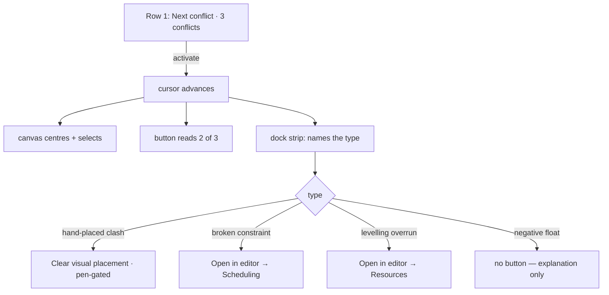

# Feature Spec: Conflict review — a count you can see, and an action that fits

- **Status:** Draft — awaiting product-owner approval of the plan (all five open questions ANSWERED
  2026-08-13, recorded in §1)
- **Author(s):** Claude Code (from a product-owner observation on `web-v0.89.0`)
- **Date:** 2026-08-13
- **Related ADR(s):** ADR-0031 (toolbar registry & taxonomy), ADR-0064 (a statement lives in
  reserved chrome, never over the scene), ADR-0090/0091 (the command surface's width and its
  degradation ladder), ADR-0092 (the canvas dock), ADR-0093 (an object action belongs on the
  object). Proposes **ADR-0094**.

---

## 1. Business understanding

### Problem

The product owner used `web-v0.89.0` and asked whether **Next conflict** is the right shape: today
you click it, a message appears saying how many conflicts there are, and you click again to walk
them. The proposal was that the button should shade when there is nothing to review, and carry the
count itself.

**Reading the code found that half of it already ships, and that the half which does not is a
different problem than it looks.**

| Claim                                    | What the code says                                                                                                                         |
| ---------------------------------------- | ------------------------------------------------------------------------------------------------------------------------------------------ |
| "shade the bar if no conflicts"          | **Already done.** `isEnabled: (ctx) => ctx.hasConflicts`, `disabledReason` `'No conflicts to review'` (`tsld-toolbar-items.tsx:2145-2151`) |
| "have it clickable if there are"         | Already true                                                                                                                               |
| "the button should update to say x of x" | The count is a **separate** presentational chip, `next-conflict-status`, `isVisible` only while `currentConflict != null` (`:2215-2224`)   |

So why does the shading not help? **`next-conflict` is `tier: 3`** (`:1852`), and ADR-0091 made
tier 3 _admitted last_. Measured at 1646 on 2026-08-13, Row 1 renders `today, zoom-out, zoom-in,
fit, view, resource-view, legend, search, filter, summary, finish-chip` — **`next-conflict` is not
among them**. It is inside the `⋯`. A control shaded inside a menu is a shading nobody sees, and a
count that only appears once you are already cycling is a count that cannot tell you whether
cycling is worth starting.

**That reframes the request.** The gating is right; the placement is wrong. And the two are one
change: ADR-0090 M2-T3 folded the search count into its field and recorded that the same fold was
_"REFUSED for `next-conflict`"_ — because the search field is a pinned `render` item painted at
every width and the conflict button is not. The refusal was a consequence of tier 3. Promote the
button and the objection dissolves.

### Two findings the investigation turned up that the request did not ask about

**F1 — "Conflict" already means two different things on the same toolbar.** The Filter menu's
**"Has conflict"** matches `visualConflict` **only** (`lenses.ts:21,47`). The Next-conflict cycle
counts **five** flags (`conflicts.ts:44-70`). Both live in the `find` group, side by side. Today
this is invisible because the button is buried and the count is transient. Put "3 conflicts"
permanently on the bar and a planner who filters sees fewer bars than the number promised — and
reasonably concludes the product is broken. This is the ADR-0093 shape exactly: nothing is wrong in
either file, and the wrongness lives only in the relationship.

**F2 — one of the five "conflicts" is not a fault.** `externalDriven` means an imported date from
another plan is driving the activity. On a programme with real interfaces that fires constantly and
there is nothing to do about it — which is how a counter becomes noise people stop reading. It is
**already reported elsewhere**: `ScheduleSummaryStrip.tsx:73,127,174` surfaces
`externalDrivenCount`. Nothing is lost by taking it out of the conflict set.

### Users

- **Planners** — the people who review and clear conflicts; the only role that can act on most of them.
- **Contributors / Viewers** — can see the count and step through; most fixes are pen-gated, so the
  strip must say why an action is shut rather than hide it (ADR-0082).

### Decisions taken (product owner, 2026-08-13)

All five were put with their costs and answered:

| #   | Question                             | Answer                                                                                                                                                              |
| --- | ------------------------------------ | ------------------------------------------------------------------------------------------------------------------------------------------------------------------- |
| D-a | Where the button lives, what it says | **On the bar, with a count.** `3 conflicts` idle → `2 of 3` while stepping; shaded with its reason at zero                                                          |
| D-b | What the dock strip offers           | **The action that fits the type** — a real fix where one exists, a route where that is all there is, and no button where the honest answer is "this is information" |
| D-c | Imported external dates              | **Not a conflict.** Out of the counted set; it stays on the Schedule summary strip                                                                                  |
| D-d | Delivery                             | **One epic, all together**                                                                                                                                          |
| D-e | The two meanings of "conflict" (F1)  | **Make them the same** — the Filter's "Has conflict" widens to match the counted set                                                                                |

### Success criteria

- The count is readable **without** starting to cycle, at 1646 and at every width in the fit gate.
- One meaning of "conflict" across the toolbar, asserted structurally rather than by reading.
- The strip never offers an action that does nothing.
- No width regression: Row 1's labelled count at 1646 is **measured** before and after, and if
  promoting the button demotes something else, that trade is reported rather than absorbed.

---

## 2. Functional requirements

### User stories & acceptance criteria

**US-1 — As a planner, I can see whether this plan has conflicts without doing anything.**

- Given a computed plan with conflicts, when I look at Row 1, then the Next-conflict control shows
  the count.
- Given no conflicts, then the control is **shaded with its reason**, not hidden (ADR-0082).
- Given no computed diagram, then the existing "no diagram" reason wins over the count.

**US-2 — As a planner, stepping through conflicts tells me where I am.**

- Given I activate it, then the control reads `2 of 3` and the canvas centres and selects the
  activity, as it does today.
- The separate `next-conflict-status` chip is **retired** — one control, one statement.

**US-3 — As a planner, the strip names the problem and offers what will actually help.**

- Given the current conflict is a **hand-placed clash** (`visualConflict`), the strip offers a real
  fix — clear the visual placement — pen-gated, with a reason when shut.
- Given a **broken constraint** (`constraintViolated`), the strip offers _Open in editor_ at the
  Scheduling tab.
- Given a **levelling overrun** (`levelingWindowExceeded`), the strip offers _Open in editor_ at the
  Resources tab.
- Given **negative float**, the strip explains and offers **no action button**, because there is no
  single act that resolves an over-constrained network.

**US-4 — As a planner, filtering to conflicts finds the same things the count counts.**

- Given the Filter menu's "Has conflict", when I apply it, then it matches every activity the count
  includes — and nothing else.

**US-5 — As a planner working on a programme, imported external dates do not inflate my conflicts.**

- They are absent from the count and from the cycle; the Schedule summary strip is unchanged.

### Edge cases

- **The conflict set changes under you** (a recalculation lands mid-cycle). Today's cursor
  behaviour is unchanged by this epic and is explicitly out of scope; if the count changes while the
  strip is open, the strip re-derives from the live set like every other dock consumer.
- **The fix is shut.** `clear-visual-placement` needs Visual mode, the pen and a selection. The
  strip shades it with the reason rather than hiding it — otherwise the one type with a real fix
  silently looks like the types without one.
- **A single activity carries several flags.** `CONFLICT_FLAGS` is already ordered for exactly this
  (`conflicts.ts:33`); the strip names the **first** matching reason and offers that type's action.
- **Plural selection.** Out of scope — the cycle is singular by construction.

### Permissions

No permission changes. Reading the count and stepping are reads, available to every role. The one
real fix is pen-gated because the underlying command already is.

---

## 3. Technical analysis

### What exists and is reused

- `render/conflicts.ts` — `CONFLICT_FLAGS`, the single ordered source of the set and its copy.
- `render/ordering.ts` — the shared comparator; the cycle and search already agree on plan order.
- `commands/use-conflict-navigation.ts` — the cursor.
- `CanvasDock` (ADR-0092) — the strip's host, at **zero canvas height**, already proven.
- `clear-visual-placement` — the one real fix, already a wired command.
- `openActivityEditor(activity, purpose)` — the editor route.

### Gaps found

- **No `scheduling` purpose on the editor intent.** `ActivityEditorTab` includes `'scheduling'` and
  `'resources'`, but `ActivityEditorPurpose` has no member mapping to `scheduling` — `'edit'` maps
  to `general` (`activity-editor-intent.ts:76-82`). US-3 needs one new purpose.
- **`clear-visual-placement` is itself `tier: 3`** (`:1807`) — so both the conflict cycle and its
  only real fix are in the `⋯` today. The strip gives that fix a home where it is needed.
- **Widening the filter is a behaviour change to a shipped control.** `MatchableActivity` currently
  carries only `visualConflict`; matching the counted set means it grows the other fields. This is
  the one part of the epic that changes what an existing control returns, and it needs its own test.

### Dependencies

None added. **Frontend-only: the CPM engine is not imported and no migration runs**, so the
ADR-0034 recalculation parity gate is untouched by construction. Every flag read is already on
`ActivitySummary`. `database-architect` is not engaged because there is no schema to design.

---

## 4. Solution design

### The shape

### Decisions

**D1 — The count lives on the control, and the separate chip is retired.** One control, one
statement. This reverses ADR-0090 M2-T3's refusal _on its stated grounds_: that refusal was because
the button is not painted at every width, which stops being true when it leaves tier 3.

**D2 — The set is the single source, and the filter reads it.** `CONFLICT_FLAGS` already exists for
this. The Filter's `conflict` attribute is re-expressed in terms of that set rather than a second
predicate, and a structural test asserts the two cannot diverge — the ADR-0093 pattern, applied to
the defect ADR-0093's own investigation would have found next.

**D3 — `externalDriven` leaves the conflict set** and is not replaced by a new control; it is
already on the Schedule summary strip.

**D4 — The strip is per-type, and "no action" is a legitimate outcome.** A single Fix button was
**rejected**: it would be inert or guess for three of the four remaining types, which is precisely
the lit-but-inert class this register has recorded shipping three times (ADR-0059 M6, ADR-0062 M6,
ADR-0064 §7).

**D5 — No feature flag** (ADR-0061's reasoning; ADR-0088 D1 — a `VITE_` flag buys the operator no
rollback because Vite inlines the constants at build time and the publish workflow passes none).
The mitigation is a commit boundary per milestone.

### Options considered

|     | Option                                                          | Verdict                                                                                                              |
| --- | --------------------------------------------------------------- | -------------------------------------------------------------------------------------------------------------------- |
| A   | Promote the button + count on it + per-type strip + one meaning | **Chosen** (D-a/b/c/e)                                                                                               |
| B   | Leave the button in `⋯`, improve its wording                    | Rejected — the shading already exists and is unread _because_ of where it is                                         |
| C   | One universal **Fix** button                                    | Rejected — see D4                                                                                                    |
| D   | Rename the filter instead of widening it                        | Rejected by the product owner; it removes the contradiction without giving anyone a way to see the whole set at once |

### The width risk, named rather than assumed

Promoting a tier-3 item onto Row 1 spends width on the row that has been the constrained one for
three epics. **This spec does not claim it fits.** Three consecutive epics had their width
expectation contradicted by their own measurement — ADR-0091 D4 withdrawn, ADR-0092 M4 gaining
"exactly nothing", ADR-0093's label gain being zero — which by now looks like a property of the
ladder rather than three coincidences. M0 measures it before anything is built, and if promoting
the button demotes something else, that trade goes back to the product owner rather than being
absorbed quietly.

---

## 5. Links

- `apps/web/src/features/tsld/render/conflicts.ts` — the flag set
- `apps/web/src/features/tsld/render/lenses.ts` — the filter's narrower `conflict`
- `apps/web/src/features/schedule/components/ScheduleSummaryStrip.tsx` — where external-driven stays
- ADR-0092 — the dock, and why the strip costs no canvas height
- ADR-0093 — the discriminator this epic's F1 finding follows from
