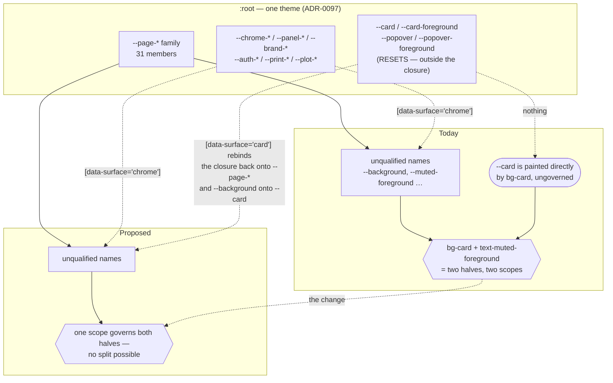
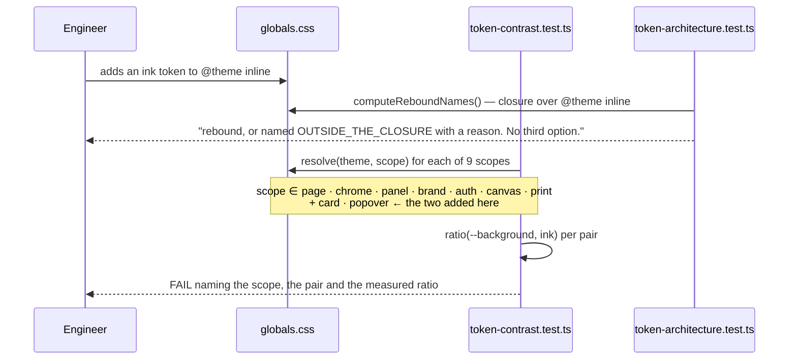
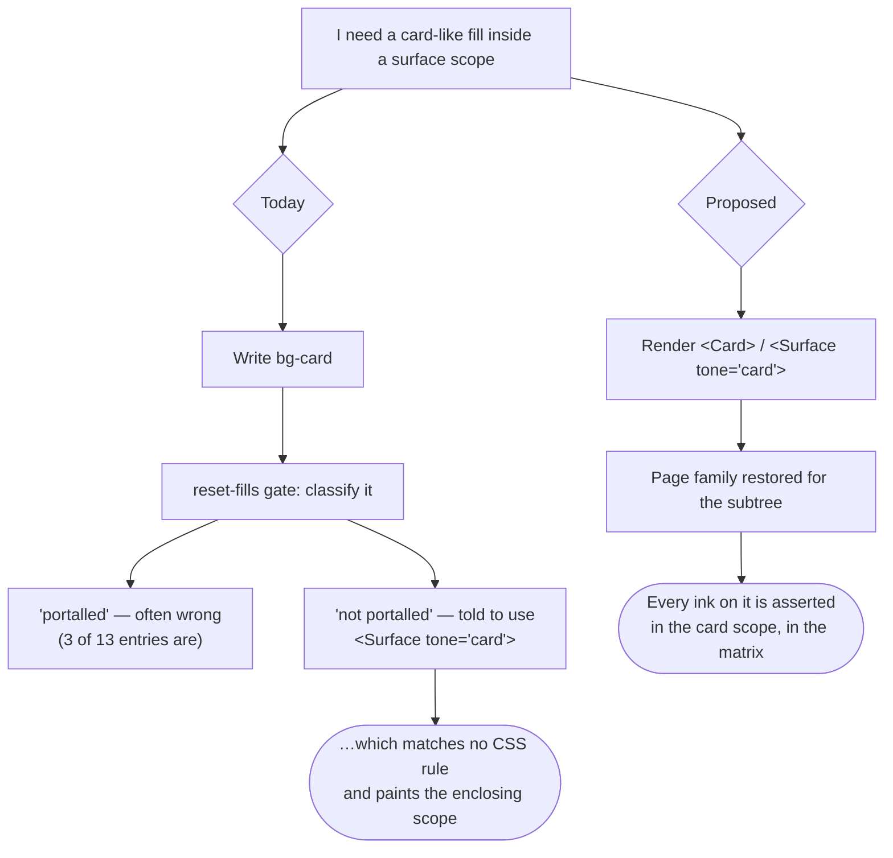

# Feature Spec: A reset is a scope, or the contrast matrix cannot see it

- **Status:** Draft — awaiting approval before implementation
- **Author(s):** feature-analyst (Claude)
- **Date:** 2026-09-10
- **Tracking issue / epic:** —
- **Roadmap link:** repository maintenance / drift control — closes `docs/TECH_DEBT.md` **#118 item 4**
- **Related ADR(s):** builds on **ADR-0055** (surface scopes), **ADR-0097** (a theme is a system; the
  reset decision D6.3 this spec finds was never built), **ADR-0102** (the scope that never reached
  the painter), ADR-0058, ADR-0076, ADR-0081, ADR-0093, ADR-0105, ADR-0110.
  **A new ADR is recommended** — see §4.9. **No number is reserved**: ADR-0132 is the highest filed
  as of 2026-09-10 (`docs/adr/0132-an-alert-says-whether-it-is-an-event-or-a-standing-condition.md`),
  and the number is taken at filing (the ADR-0071 / ADR-0079 lesson).

> **Why this needs a spec at all.** It changes `apps/web/src/styles/token-contrast.test.ts`, which is
> a **shared gate**, and (under the recommended design) `globals.css` and two design-system
> primitives. ADR-0105's trigger fires on both counts, so the register row cannot stand in for stages
> 1–2.

---

## 0. How the numbers in this document were obtained, and what that does not cover

**This session had no shell.** Every ratio below was obtained by reading `globals.css` and replaying
`token-contrast.test.ts`'s `resolve()` and `ratio()` by hand — the same OKLCH → linear-sRGB →
relative-luminance chain `src/test/colour.ts` implements, including the `compositeOver` step.

**The control for that method is that it reproduces the three figures the register row already
carries, exactly**: `--card`/`--muted-foreground` at page **6.00:1**, `--background`/`--muted-foreground`
at page **4.65:1**, and the chrome/brand failure at **2.00:1**. A method that agreed with two of three
would be worth nothing; agreeing with all three, computed independently from the token values, is
what makes the _new_ figures below worth reading.

It does not make them worth _acting_ on without a run. **M0-T1 re-derives the whole table by running
the suite**, and the plan is gated on that, not on this section. Where a claim below is structural
(a file does or does not contain a string; a component does or does not render inside another) it
was established by reading the file, and the file and line are given.

---

## 1. Business understanding

### Problem

`apps/web/src/styles/token-contrast.test.ts` is the computed contrast matrix ADR-0055 built because
**every defect it exists to catch had already passed a human reviewer, a component reviewer and an
axe suite** — the class names were right, and only a machine that resolves the token and computes the
ratio can see the pair. It sweeps 32 declared pairs across 7 surface scopes.

The pair `--card` / `--muted-foreground` is not in it. `docs/TECH_DEBT.md` #118 item 4 found that,
found that adding it naively goes **red at 2.00:1 in the `chrome` and `brand` scopes**, established
that the failure is **latent rather than live**, and concluded that what is needed is _"a way to say
'assert this pair in the scopes where it can occur' — a per-pair scope filter in `TEXT_PAIRS`."_

Re-deriving the row against today's tree confirms its diagnosis and **contradicts its conclusion in
three ways**, each of which changes the work:

1. **The pair is not one pair.** The failing shape is _reset fill × rebound ink_, and the matrix
   anchors **17 of its 32 pairs on `--background`**. Inside a reset, `--background` _is_ the reset's
   fill — so there are **17 ungated split pairs per reset fill, and there are two reset fills**
   (`--card`, `--popover`, both `oklch(1 0 0)`). The register row names one of 34. Measured samples
   of the others, in the `chrome` scope: `--card`/`--foreground` **1.04:1** (against a 4.5 floor),
   `--card`/`--destructive-text` **2.46:1** (4.5), `--card`/`--primary` and `--card`/`--ring`
   **2.02:1** (3.0). The first of those is not hypothetical — `components/ui/tabs.tsx:169` writes
   `bg-card text-foreground` on one element.
2. **The remedy the codebase already prescribes for this exact situation does not work.**
   `components/ui/surface.tsx:56-67` and `styles/reset-fills.structural.test.ts:24,93` both tell an
   author to use `<Surface tone="card">` so "the page family is restored for its subtree".
   **There is no `[data-surface='card']` rule in `globals.css`** (six blocks exist: `chrome`,
   `panel`, `brand`, `auth`, `print`, `canvas`), and `RESET_TONES` has **zero production callers**.
   `<Surface tone="card">` today stamps an attribute nothing matches and applies
   `bg-background text-foreground`, which inside `chrome` paints the _chrome_ fill and ink — the
   opposite of what its own docblock promises. ADR-0097 **D6.3** says the reset _"closes"_ this split
   pair; it was specified as a runtime restoration and shipped as an exemption list in a test file.
3. **The enumeration a scope filter would have to lean on is already wrong.**
   `reset-fills.structural.test.ts:29-42` classifies `TsldLegendPanel.tsx`, `CreateActivityPopover.tsx`
   and `combobox.tsx` under _"Portalled or top-layer: outside every scope by construction"_. **None of
   the three calls `createPortal`** (the portal sites in `apps/web/src` are `chrome-slot.tsx`,
   `canvas-dock.tsx`, `plan-slot-host.tsx`, `menu.tsx`, `tooltip.tsx`, `use-popover-panel.tsx` and
   `performance-probe-panel.tsx`). `surface.tsx:19-21` repeats the error in prose — _"the combobox
   listbox render to `document.body`"_ — and `combobox.tsx:517-525` renders it inline with `absolute`.
   One consequence is already live: `CreateActivityPopover` paints `bg-card` (`:73`) with
   `text-muted-foreground` (`:109`) and is rendered at `TsldPanel.tsx:2946`, **inside the
   `<Surface tone="canvas">` opened at `TsldPanel.tsx:2863`**. That is a real split pair, in a scope,
   today. It passes at 6.00:1 — but it passes by luck, and nothing asserts it.

So the problem is not "one pair is missing from a list". It is that **a whole class of composited
pair is invisible to the gate that exists to make composited pairs visible**, and the mechanism that
was supposed to make the class impossible was decided, documented in three files, and never built.

### Users

Nobody using SchedulePoint. This is an internal correctness gate; the _user_ is the next engineer or
agent who puts a `Card`, a `Popover`, a `Combobox` or a `Dialog`-shaped fill inside a surface scope —
and, downstream of them, a planner who would otherwise meet white-on-white text with every suite
green. Roles, RBAC and organisation scope are not engaged (§2 "Permissions").

### Primary use cases

1. An engineer paints `bg-card` or renders `<Card>` inside a `<Surface>` and the gate tells them
   whether the ink that lands on it is legible **there**.
2. An engineer adds a new ink token to `@theme inline`; the closure pulls it into the family and the
   matrix asserts it against every ground the product actually paints, including the two reset fills.
3. A reviewer asks "is this pair checked?" and gets an answer from the file rather than from a
   judgement about where the component renders.

### User journeys

There is no end-user journey; §4 substitutes a **developer flow** and says why.

### Expected outcomes

- `--card`/`--muted-foreground` and its 33 siblings are asserted, in every scope, permanently.
- `<Surface tone="card">` becomes the thing its docblock says it is, so the remedy the repository
  already prescribes stops being a dead end (the ADR-0081 shape: a decided capability with no working
  entry point).
- ADR-0097 D6.3's claim becomes true of the code.
- `docs/TECH_DEBT.md` #118 item 4 closes, and #118 item 4's own recommended mechanism is **not built**,
  with the reason recorded — because a mechanism that lets any pair be narrowed is the wrong answer to
  a problem whose cause is that two halves of a pair are governed by different scopes.

### Success criteria

| #   | Criterion                                     | How it is judged                                                                                                                                                                                                                          |
| --- | --------------------------------------------- | ----------------------------------------------------------------------------------------------------------------------------------------------------------------------------------------------------------------------------------------- |
| S1  | The reset restores the page family at runtime | A rebind block exists and `resolve('card')` returns `--page-muted-foreground` for `--muted-foreground`; verified red by deleting the block                                                                                                |
| S2  | 34 previously-ungated pairs are asserted      | `SCOPES` gains `card` and `popover`; the sweep grows from 231 to 297 cases (7×33 → 9×33)                                                                                                                                                  |
| S3  | No rendered colour changes                    | The 25-shot screenshot harness (`scripts/shoot.mjs`) produces a pixel-identical set before and after M1, per ADR-0099 M2's method (pixel diff, **not** `sha256` — the harness mints a tenant per run and paints its name into the header) |
| S4  | No existing assertion is weakened             | `TEXT_PAIRS`, `NON_TEXT_PAIRS` and every `describe` block keep their entries; nothing is deleted, narrowed or filtered                                                                                                                    |
| S5  | The dead prescription is gone                 | `RESET_TONES` has production callers; `reset-fills.structural.test.ts`'s three wrong classifications are corrected                                                                                                                        |

### Open questions

Four, all in §4.10 with a recommended default for each. **CQ-1 is the only one that changes the
shape of the work.**

---

## 2. Functional requirements

### User stories & acceptance criteria

> **US-1** — As an engineer, I want a `Card` to keep its meaning inside any surface scope, so that a
> component I move does not silently become illegible.
>
> **Acceptance criteria**
>
> - **Given** `<Card>` rendered inside `<Surface tone="chrome">` **when** a descendant uses
>   `text-muted-foreground` **then** it resolves `--page-muted-foreground` (a grey validated against
>   a light ground) rather than `--chrome-muted-foreground` (a grey validated against navy).
> - **Given** the reset rule is deleted **when** the contrast suite runs **then** it fails, naming
>   `--background`/`--muted-foreground` in the `card` scope at 2.00:1. _(This is S1's red state; it
>   is written before the rule and verified, per this file's own repeated `--canvas-grid-month`
>   precedent — a value written first and a gate after is how a 2.08:1 failure shipped behind a green
>   suite and a paragraph saying it could not.)_
> - **Given** a `Card` inside a `Card` (which `InterchangeReportTable.tsx:82` does inside
>   `dialog.tsx:87`) **when** the app runs in development **then** nothing throws.

> **US-2** — As an engineer, I want the contrast matrix to cover every ground the product paints, so
> that "the suite is green" means what a reader takes it to mean.
>
> **Acceptance criteria**
>
> - **Given** the matrix **when** it runs **then** it sweeps 9 scopes, including `card` and `popover`.
> - **Given** any of the 17 `--background`-anchored pairs **when** swept under `card` **then** it is
>   asserted against `--card` rather than being absent.
> - **Given** a new ink token added to `@theme inline` **when** the closure pulls it into
>   `REBOUND_NAMES` **then** it is asserted against the reset fills with no further edit. _(This is
>   the property a per-pair filter would not have: a filtered pair is opt-in per pair.)_

> **US-3** — As a reviewer, I want the reset-fill call-site register to say something true, so that a
> future decision resting on it is not resting on a wrong classification.
>
> **Acceptance criteria**
>
> - **Given** `reset-fills.structural.test.ts` **when** a reader consults its reasons **then** no
>   entry claims a file is portalled that does not call `createPortal`.
> - **Given** `surface.tsx`'s docblock **when** a reader consults it **then** it does not claim the
>   combobox listbox portals to `document.body`.

### Workflows

1. **A pair is resolved.** `resolve(theme, scope)` merges `:root`, then applies the
   `[data-surface='<scope>']` block, following one `var()` hop. Adding `card`/`popover` blocks means
   `resolve(theme, 'card')` returns the page family plus `--background: <the card fill>`.
2. **A component enters a reset.** `Card` renders `<Surface tone="card">`; `Surface` stamps
   `data-surface="card"` and applies `bg-background text-foreground`, which inside the reset resolves
   to the card's own fill and ink. No component learns where it is (ADR-0055's rule survives intact).
3. **A nested reset.** A reset inside a reset rebinds names to values they already hold, so it is
   harmless — unlike a _scope_ inside an identical scope, which `Surface` throws on. The guard gains
   a reset exemption with the reason stated.

### Edge cases

| Case                                                                   | Behaviour                                                                                                                                                                                                                                                                                                                                                                                                                            |
| ---------------------------------------------------------------------- | ------------------------------------------------------------------------------------------------------------------------------------------------------------------------------------------------------------------------------------------------------------------------------------------------------------------------------------------------------------------------------------------------------------------------------------ |
| A reset inside the same reset (`Card` in `Dialog`)                     | Legal; no throw. Today's guard would throw in DEV — this is US-1's third criterion and is a blocker, not a nicety. `InterchangeReportTable.tsx:82` inside `dialog.tsx:87` is the live instance.                                                                                                                                                                                                                                      |
| A scope inside a reset (`<Surface tone="canvas">` inside `bg-popover`) | Legal and load-bearing. `TsldLegendPanel.tsx:143` paints `bg-popover` and opens `<Surface tone="canvas">` at `:184` **inside** it, precisely so the legend's swatches carry the diagram's values (ADR-0102). The inner scope wins by cascade order, so this survives untouched — and a test must say so, because breaking it re-creates the defect ADR-0102 fixed.                                                                   |
| A reset inside `canvas`                                                | `CreateActivityPopover` (`TsldPanel.tsx:2946`). After the change its ink becomes the page family rather than the plot family. Both are 6.00:1 today because `--plot-muted-foreground` aliases `--page-muted-foreground`; the change is a no-op **now** and is the honest binding **later**, when the plot family diverges.                                                                                                           |
| A translucent reset fill                                               | `resource-strip-panel.tsx:253` uses `bg-card/95`. `ratio()` composites over `--background`, so a reset scope whose `--background` is `var(--card)` composites the 95% card over the card — i.e. it under-reports the difference by the 5% of whatever is behind. Documented, not solved: the alpha is a design decision and the matrix reads tokens, not utilities (the `hover:bg-destructive/90` finding, TEXT_PAIRS' own comment). |
| The `print` scope                                                      | A reset inside a printed document restores the page family, which for a printed table is right. ADR-0103's paper scope is unaffected: `--print-*` governs the document, and a `Card` inside it re-enters the page vocabulary exactly as it does on screen.                                                                                                                                                                           |
| A reset with no enclosing scope                                        | The overwhelming majority: page scope, where every rebind points at `--page-*` and is therefore a no-op. This is what makes S3 (no visual change) plausible rather than hopeful.                                                                                                                                                                                                                                                     |

### Permissions

None. No route, no principal, no organisation scope, no RBAC. Stated rather than omitted because
`docs/PROCESS.md` asks: this change adds no endpoint and reads no data.

### Validation rules

None at a boundary. The rules are structural and belong to the gates in §4.4.

### Error scenarios

| Scenario                                                           | Detection                                                                                      | Result                                                                        |
| ------------------------------------------------------------------ | ---------------------------------------------------------------------------------------------- | ----------------------------------------------------------------------------- |
| A reset block omits a member of the closure                        | `token-architecture.test.ts` "rebinds exactly the closure"                                     | Test failure naming the token                                                 |
| A reset block points a rebind somewhere other than the page family | New assertion in the same file                                                                 | Test failure naming the token                                                 |
| A component hand-writes `data-surface="card"`                      | `surface-seams.structural.test.ts:103-113` (matches both `data-surface` and `dataset.surface`) | Test failure; `ALLOWED` is unchanged, so `card.tsx` must go through `Surface` |
| Someone re-adds a scope filter to `TEXT_PAIRS`                     | Not gated, deliberately — see §4.7                                                             | Review only                                                                   |

---

## 3. Technical analysis

| Area           | Impact                              | Notes                                                                                                                                                                                                                                            |
| -------------- | ----------------------------------- | ------------------------------------------------------------------------------------------------------------------------------------------------------------------------------------------------------------------------------------------------ |
| Frontend       | **med**                             | `globals.css` gains one grouped rebind block (~33 declarations); `card.tsx` renders through `Surface`; five `bg-popover` sites do the same; `Surface`'s nesting guard gains a reset exemption. No route, no state, no data flow.                 |
| Backend        | none                                | `apps/api` is untouched.                                                                                                                                                                                                                         |
| Database       | **none — and that is a statement.** | No model, column, index, constraint or migration. `database-architect` is **not engaged because there is nothing to design**, not because a change was judged too small (CLAUDE.md §19.3). Confirmed against the intended diff: `apps/web` only. |
| API            | none                                |                                                                                                                                                                                                                                                  |
| Security       | none                                | No principal, no input, no secret.                                                                                                                                                                                                               |
| Performance    | negligible                          | +66 pure-arithmetic Vitest cases; two extra CSS rules matched by attribute selector.                                                                                                                                                             |
| Infrastructure | none                                | No env, no CI step, no container change.                                                                                                                                                                                                         |
| Observability  | none                                |                                                                                                                                                                                                                                                  |
| Testing        | **high — this is the deliverable**  | See §4.4. Every new assertion is verified red against a named mutation (ADR-0110 D5).                                                                                                                                                            |

### Dependencies

- Nothing must land first.
- **Affected gates**, all in `apps/web/src`: `styles/token-contrast.test.ts`,
  `styles/token-architecture.test.ts`, `styles/reset-fills.structural.test.ts`,
  `components/ui/surface-seams.structural.test.ts`, `components/ui/surface.test.tsx`,
  `components/ui/card.test.tsx`, `features/tsld/components/TsldLegendPanel.test.tsx`.
- **Affected documents**: `docs/DESIGN_SYSTEM.md` (the reset's authoring rule),
  `docs/TECH_DEBT.md` (#118 item 4), and a new ADR (§4.9). ADR-0097 is Accepted and immutable —
  its D6.3 is **superseded in the new ADR, never edited**.
- **The CPM engine is not imported and no migration runs**, so the ADR-0034 recalculation parity gate
  is untouched by construction — in its honest form: there is nothing here to hold parity for.

---

## 4. Solution design

### 4.1 The measured position

`--card` / `--muted-foreground`, per scope. Hand-computed (§0); the page, chrome and brand figures
are the register row's own and reproduce exactly.

| Scope    | `--muted-foreground` resolves to | Ratio vs `--card` (`oklch(1 0 0)`) | 4.5:1    |
| -------- | -------------------------------- | ---------------------------------- | -------- |
| `page`   | `oklch(0.5 0 0)`                 | **6.00:1**                         | pass     |
| `chrome` | `oklch(0.78 0.02 264)`           | **2.00:1**                         | **FAIL** |
| `panel`  | `oklch(0.51 0 0)`                | **5.75:1**                         | pass     |
| `brand`  | `oklch(0.78 0.02 264)`           | **2.00:1**                         | **FAIL** |
| `auth`   | `oklch(0.53 0.017 258)`          | **≈5.27:1**                        | pass     |
| `canvas` | `var(--page-muted-foreground)`   | **6.00:1**                         | pass     |
| `print`  | `oklch(0.51 0 0)`                | **5.75:1**                         | pass     |

The row's diagnosis holds in full: the pair is ungated, it fails in exactly two scopes, and it fails
because `--card` is outside the rebind closure (`token-architecture.test.ts:115-116`, `resets:`)
while `--muted-foreground` is in it.

**The row's "latent, not live" claim also holds, and its wording does not.** Its words are _"no
`<Card>`, `CardDescription` or `text-muted-foreground` occurs inside any `chrome`- or `brand`-scoped
subtree today"_, and `brand-panel.tsx:77` renders `text-muted-foreground` inside
`<Surface tone="brand">` — the tagline. That is not a counter-example to the _conclusion_, because the
tagline sits on `--background` (the navy wash) and `--background`/`--muted-foreground` **is** gated;
it is a counter-example to the _sentence_. The claim that survives is narrower and is the one that
matters: **no element painting a reset fill renders inside a `chrome` or `brand` subtree** — verified
by enumerating all 13 `bg-(card|popover)` sites and all 4 `Card` consumers (`staff/ui/panel.tsx`,
`onboarding.tsx`, `GuestPlanView.tsx`, `page/section-card.tsx`) and reading where each renders,
including through the three portals that cross into chrome (`chrome-slot.tsx`, `canvas-dock.tsx`,
`plan-slot-host.tsx`).

**The pair is nonetheless live in three scopes** — `page` (every `SectionCard` description;
`routes/staff.tsx`'s twelve `text-muted-foreground` sites inside `Panel`; `resource-strip-panel.tsx`,
which renders as a _sibling_ of the canvas Surface at `plan-workspace-toolbar.tsx:1987-1990`) and
`canvas` (`CreateActivityPopover`). It passes in all of them. It passes unasserted.

### 4.2 The class, counted

The matrix anchors **17 of its 32 pairs on `--background`** — 6 of 18 `TEXT_PAIRS` and 11 of 14
`NON_TEXT_PAIRS`. Inside a reset, `--background` is the reset fill, so those 17 are exactly the
reset-fill × rebound-ink pairs. Two reset fills ⇒ **34 ungated split pairs**, of which the register
row names one.

Four sampled in `chrome`, hand-computed:

| Pair                            | `chrome` value | Floor | Can the product render it?                                                         |
| ------------------------------- | -------------- | ----- | ---------------------------------------------------------------------------------- |
| `--card` / `--foreground`       | **1.04:1**     | 4.5   | Yes — `components/ui/tabs.tsx:169` writes `bg-card text-foreground` on one element |
| `--card` / `--destructive-text` | **2.46:1**     | 4.5   | Yes — an `Alert` inside a `Card`; `staff/ui/panel.tsx` boxes three of five         |
| `--card` / `--primary`          | **2.02:1**     | 3.0   | Yes — a primary button on a card or dialog fill                                    |
| `--card` / `--ring`             | **2.02:1**     | 3.0   | Yes — `resource-strip-panel.tsx:253` puts `focus:ring-ring` on `bg-card/95`        |

This is the number that decides the design. **A per-pair scope filter is a mechanism for carrying 34
hand-written pairs, each with a hand-written exclusion list.** Two CSS rules make all 34 fall out of
the sweep that already exists.

### 4.3 Architecture overview

### 4.4 Data flow — how a pair is resolved, and where the gate stands

The point of the sequence is the **`Note`**: nothing else in the diagram changes. No new pair, no new
field, no new list, no filter — two more values of one existing loop variable, and the 34 pairs
arrive with them.

### 4.5 Developer flow (there is no user flow, and why)

The template asks for a user flow. This feature has no user-facing surface: it is a gate plus the CSS
that lets the gate pass. Substituting a fictional user journey would be worse than saying so. What it
does have is a decision an engineer makes, which is where the defect enters:

### 4.6 Component changes

| Component                               | Change                                                                                                                                                                                                                                                                             | Why                                                                                                                        |
| --------------------------------------- | ---------------------------------------------------------------------------------------------------------------------------------------------------------------------------------------------------------------------------------------------------------------------------------- | -------------------------------------------------------------------------------------------------------------------------- |
| `styles/globals.css`                    | One grouped block `[data-surface='card'], [data-surface='popover']` rebinding the 31 closure names onto `--page-*`, plus `--background`/`--foreground` onto the reset's own pair. Two blocks if the two fills must differ — they do, so **two blocks** sharing a documented shape. | The mechanism ADR-0097 D6.3 specified and nothing built                                                                    |
| `components/ui/surface.tsx`             | The nesting guard exempts `RESET_TONES`; the docblock's false portal claim about the combobox is corrected                                                                                                                                                                         | A reset inside a reset is harmless; the claim is wrong (`combobox.tsx:517-525`)                                            |
| `components/ui/card.tsx`                | `Card` renders `<Surface tone="card" className="border-border rounded-lg border shadow-sm">`, dropping `bg-card text-card-foreground`                                                                                                                                              | Keeps `surface-seams`' "only `Surface` writes `data-surface`" intact — `card.tsx` gains **no** new seam                    |
| The five `bg-popover` sites             | `menu.tsx:247`, `combobox.tsx:524`, `use-popover-panel.tsx:164`, `tooltip.tsx:349`, `TsldLegendPanel.tsx:143` → `<Surface tone="popover">`                                                                                                                                         | Three portal (a no-op, and cheap insurance); two do not, and those are the live risk                                       |
| `styles/token-contrast.test.ts`         | `SCOPES` gains `'card'` and `'popover'`. **Nothing else.**                                                                                                                                                                                                                         | The 34 pairs arrive with the scopes                                                                                        |
| `styles/token-architecture.test.ts`     | A `describe` for the reset blocks, mirroring the `canvas` one: rebinds exactly the closure; every rebind reads `--page-*` except the fill/foreground pair                                                                                                                          | `FAMILIES`' "points every rebind at its own family" cannot cover a scope with no family — the `canvas` precedent, verbatim |
| `styles/reset-fills.structural.test.ts` | `ALLOWED` re-derived (the population shrinks as sites move to `Surface`); the three wrong reasons corrected                                                                                                                                                                        | Its staleness assertion (`:99-106`) will fire, which is the gate working                                                   |

### 4.7 Implementation approach & alternatives

**Chosen: build the reset (Option B).** Two CSS blocks and a `data-surface` attribute applied through
the primitive that already exists to apply it. It closes the split _at runtime_ rather than describing
it, needs no new vocabulary in the gate, and makes 34 pairs assertable by adding two strings to one
array.

Three alternatives, with reasons.

**Option A — a per-pair `scopes` filter in `TEXT_PAIRS` (the register row's proposal). Not
recommended.** Four objections, in increasing order of weight:

1. _Shape._ Asked to make the default (all scopes) the thing you get by writing nothing, the answer is
   an **optional `exceptScopes`**, never `scopes`: with `scopes` an author who writes a two-element
   list has narrowed 32 pairs' worth of coverage to two and nothing says so, whereas with
   `exceptScopes` the absent field means full coverage and every narrowing is a positive act. That is
   the right answer to the question — and it is a defence of a mechanism that should not exist.
2. _Expressiveness._ A filter can express **"where we have not looked"** and cannot express **"where
   this cannot occur"**, because those are the same edit. §4.8 takes this seriously; the short version
   is that it is unfixable by annotation.
3. _Proportionality._ §4.2 counts 34 pairs. A filter carries them one at a time, each restating in a
   scope list a fact about the CSS cascade that the CSS could simply make true.
4. _It preserves the defect._ Under A, `--card`/`--muted-foreground` remains genuinely 2.00:1 in
   `chrome`; the gate is merely told not to look. The next `Card` that lands in the chrome band is a
   live WCAG 1.4.3 failure with a green suite — which is the exact sentence ADR-0055 exists to make
   impossible.

**Option C — one extra `describe` block, sweeping the two reset fills against the 17 inks over the
scopes where a reset can occur. The recommended fallback if B is refused.** It is this file's own
established idiom, used six times already (`the WBS band …`, `the diagram tells its three criticality
states apart`, `the minimap rectangle frame …`, `the axis markers …`, `the stacked histogram …`, `the
diagram grid …`), each of which resolves exactly one scope and says why in a docblock. C therefore
adds **no mechanism at all** — the narrowing is one visible list with one reason, rather than a field
available to every future pair. It is strictly better than A on objections 1 and 3, no better on 2,
and no better at all on 4.

**Option D — make `--card` a rebound name.** Explicitly rejected by ADR-0097 (_"would break ADR-0055's
'a `Card` means the same thing everywhere'"_). Not revisited.

**Why B is a completion rather than new architecture.** ADR-0097 D6.3 decided it, in these words:
_"`Card` and `Popover` restore the page family for their subtree."_ `SurfaceTone` carries `'card'`
and `'popover'`; `RESET_TONES` exists and is exported; two files instruct authors to use it. The only
missing piece is the CSS. This repository's recorded pattern for a decided capability with no working
entry point is to build it (ADR-0081), not to re-litigate it — and the alternative here is to build a
_second_ mechanism whose job is to work around the first one's absence.

### 4.8 The honesty problem, answered plainly

The brief asks whether a scope filter can distinguish _"this pair cannot occur here"_ from _"this pair
fails here and we would rather not know."_

**It cannot, and no annotation fixes it.** Both are the same edit — a scope name removed from a list —
both leave a green suite, and both leave the same diff. A required reason string does not
discriminate: `adr-coverage.json` and `flag-retirement.json` both require one, and in both cases the
string is **prose no gate reads**. What makes those two registers work is not the reason but two other
properties: the population is enumerable and re-derived, and a **stale entry fails** (the pattern
`reset-fills.structural.test.ts:99-106` implements — _"an entry for a file that no longer paints these
fills is a decision nobody is making any more"_). A list that only ever grows stops being read.

So if Option A or C is chosen, the mitigation that bites is not "write a reason". It is:

- **the exclusion must be per-pair, never global** — one `--card`-shaped exclusion must not silence a
  pair whose failure is real; and
- **the excluded set must be derived from something the machine re-checks**, which is §4.9's question,
  and the honest answer there is that no sound derivation exists.

Under Option B the question does not arise, and that is the strongest reason to prefer it: **the
mechanism that could be abused is not built.**

### 4.9 Should the latency claim itself be gated?

The register row's argument rests on _"no Card inside a chrome subtree today."_ If that becomes false,
an exclusion becomes a hole.

**There is no sound cheap check, and this spec will not imply one.** The claim is DOM containment
across a React tree with portals, slots, `children` composition and conditional layouts. It is not
statically decidable, and the repository already demonstrates that a hand-maintained approximation
drifts in the dangerous direction: `reset-fills.structural.test.ts` classifies three files as
portalled that do not portal (§1.3), and one of those — `CreateActivityPopover` — is a live reset fill
**inside a scope**.

Two approximations were considered and both are recorded as rejected rather than deferred:

1. **Extend the reset-fills classification to name enclosing scopes.** It would demand that each of the
   13 sites declare which scopes can contain it. Cheap to write, and it inherits exactly the failure
   mode above: a declaration is a claim by the author, checked by nobody, on a question the author
   answered wrongly three times out of thirteen.
2. **Assert it at runtime in a journey** — render each screen and query for `[data-surface="chrome"]
[class*="bg-card"]`. It sees only paths a test drives, and the failing case is by definition one
   nobody has built yet.

**Under Option B the claim stops being load-bearing**, which is the right way to dispose of a fact
nothing can verify: not by gating it, but by removing what depends on it. The runtime equivalent
exists and _is_ sound — `token-architecture.test.ts`'s "does not shadow a name it fails to rebind"
(`:417-423`), applied to the reset blocks — because it asks about the **CSS**, which is enumerable,
rather than about the **DOM**, which is not.

### 4.10 Whether an ADR is needed

**Yes, recommended.** Three grounds: it adds two surface scopes to a mechanism ADR-0055 defined and
ADR-0097 closed; it **supersedes ADR-0097 D6.3**, whose claim that the reset "closes" the split pair
is false as implemented and cannot be edited (ADRs are immutable); and it settles a rule with reach
beyond this change — _a reset is a scope, or it is a note_. If Option C is chosen instead, an ADR is
**not** warranted and `docs/DECISIONS.md` is the right home, because C decides nothing beyond one
test file.

### 4.11 Critical questions, with recommended defaults

> The product owner is authorised to decide these. Each carries a recommendation, not a menu.

**CQ-1 — Option B (build the reset) or Option C (one narrowing `describe` block)?**
_Recommended: **B**._ It closes 34 pairs instead of documenting one, discharges a decision already
recorded in three files, and removes the honesty problem rather than mitigating it. The cost is a
CSS change to a shipped design system with no feature flag — mitigated by S3 (a pixel-identical
25-shot screenshot set) and by the change being, at page scope, a set of aliases pointing at the
values already in force. **C is the answer if the appetite for touching `globals.css` is nil**; it is
~15 lines and lands in a day. _This is the only question that changes the shape of the work._

**CQ-2 — Does `Card` keep `bg-card`, or render through `<Surface tone="card">`?**
_Recommended: **`Surface`**._ A raw `data-surface` attribute on `card.tsx` would need adding to
`surface-seams.structural.test.ts`'s `ALLOWED`, widening the one seam that makes the whole mechanism
structural rather than conventional — and that file's own docblock records that warning being ignored
once, by the commit that added `print`, leaving 31 rebinds unguarded. Going through `Surface` adds no
seam at all.

**CQ-3 — All five `bg-popover` sites, or only the two that genuinely do not portal?**
_Recommended: **all five**._ For a portalled site the reset is a no-op (it is already at page scope),
so the cost is zero and the benefit is that nobody has to re-derive "is this one portalled?" — a
question this repository has answered wrongly three times out of thirteen, in writing, in the file
whose job it is.

**CQ-4 — If B is refused, what does C's excluded-scope list key on?**
_Recommended: **the enclosing-scope question, answered in one docblock, listing the scopes a reset
fill can occur in and naming the call site that proves each** — not a derived structural check._ §4.9
says why a derived check would be worse than none: it would look sound and would be the author's own
claim wearing a gate's clothes.

---

## 5. Links

- Implementation plan: [`./implementation-plan.md`](./implementation-plan.md)
- Register row: `docs/TECH_DEBT.md` **#118 item 4**
- Docs this change updates: `docs/DESIGN_SYSTEM.md` (the reset's authoring rule),
  `docs/TECH_DEBT.md`, and a new ADR under Option B (§4.10)
