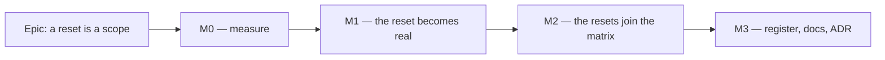

# Implementation Plan: A reset is a scope, or the contrast matrix cannot see it

- **Feature spec:** [`./feature-spec.md`](./feature-spec.md) — Draft, awaiting approval before
  implementation.
- **Status:** Draft — awaiting approval before implementation
- **Owner:** —

> **This plan assumes CQ-1 resolves to Option B (build the reset).** If it resolves to Option C, M1
> and M3 are deleted and M2 shrinks to a single `describe` block — see "If CQ-1 goes the other way"
> at the foot.

## Breakdown

### Epic

**A reset is a scope, or the contrast matrix cannot see it** — close `docs/TECH_DEBT.md` #118 item 4
by making `Card` and `Popover` restore the page family at runtime, which brings 34 previously-ungated
composited pairs into the computed contrast matrix with no new gate mechanism. Roadmap theme:
repository maintenance / drift control.

---

## Milestone M0 — Measure, and commit the falsification conditions first

**Outcome:** every figure in the spec is re-derived by running rather than by reading, and the plan
is either confirmed or abandoned on numbers.
**Ships dark:** no product code changes at all. Nothing is reachable because nothing is built.
**Journey:** none — no user-facing surface (ADR-0081 §1's second branch). The instrument is the
existing screenshot harness plus the unit suites.

> **The falsification conditions are committed in their own commit, before the measurements are
> taken.** This is the ADR-0121 / ADR-0127 rule, and it is what stopped ADR-0097 Landing C shipping a
> `PROCEED` derived from an `undefined`. If any of F1–F3 fails, **the recommendation reverts to
> Option C** and M1/M3 are not built.
>
> - **F1 — no visual change.** The 25-shot `apps/web/scripts/shoot.mjs` set, taken before and after
>   M1, is **pixel-identical** at every shot. Compared by pixel diff, never `sha256`: the harness
>   mints a tenant per run and paints its name into the header, so a byte comparison reports "all
>   changed" for a milestone whose whole condition is "nothing changed" (ADR-0099 M2's recorded
>   method).
> - **F2 — no existing assertion moves.** Adding `card` and `popover` to `SCOPES` produces **zero**
>   failures among the 231 cases that exist today, and the 66 new cases all pass. A failure here means
>   a reset ground is genuinely worse than the page ground for some pair, which is a design question
>   and not a gate question.
> - **F3 — the count is what the spec says.** The sweep goes 231 → 297 cases; **17** pairs per reset
>   are `--background`-anchored. If the count differs, §4.2's whole proportionality argument is
>   re-derived before M1 starts.

#### Feature: the numbers, re-derived

> **Description:** replace §0's hand computation with a run.
> **Complexity:** S
> **Dependencies:** none
> **Risks:** the hand-computed table is wrong somewhere → every downstream number is checked against
> the run, and any divergence is written into the spec **in place**, not silently corrected.
> **Testing requirements:** the suite itself, plus a throwaway measurement script in a scratch
> directory (not committed).

##### Task M0-T1 — Re-derive the contrast table by running the suite

- **Description:** produce the seven-scope table for `--card`/`--muted-foreground` and the four
  sampled sibling pairs from the real `resolve()`/`ratio()`, not by hand.
- **Complexity:** S
- **Dependencies:** none
- **Risks:** none — read-only.
- **Testing:** temporarily add the pairs to a scratch copy of the suite and read the failure messages,
  which already print the measured ratio (`token-contrast.test.ts:585`). Revert.
- **Development steps:**
  1. Add `['--card', '--muted-foreground', '…']` to `TEXT_PAIRS` locally; run
     `pnpm --filter @repo/web test token-contrast`; record every scope's printed ratio.
  2. Repeat for `--card`/`--foreground`, `--card`/`--destructive-text`, `--card`/`--primary`,
     `--card`/`--ring`, and the same five against `--popover`.
  3. Revert the local edit. **Nothing from this task is committed to the suite.**
  4. Write the measured table into the spec's §4.1/§4.2, marking any figure that differs from the
     hand computation and saying by how much.

##### Task M0-T2 — Establish the latency claim by running, not by reading

- **Description:** the spec's claim is _"no element painting a reset fill renders inside a `chrome` or
  `brand` subtree"_, established by reading. Confirm it against a rendered tree.
- **Complexity:** S
- **Dependencies:** none
- **Risks:** the claim is false somewhere → then the change becomes a **live defect fix** rather than
  a latent one, which raises its priority and changes nothing about the design.
- **Testing:** a scratch Playwright step over the base journey plus `e2e-public`, querying
  `[data-surface="chrome"] [class*="bg-card"], [data-surface="brand"] [class*="bg-card"]` and the
  `bg-popover` equivalents, on the plan workspace (toolbar open, an activity selected, a tool armed —
  the three states that populate the chrome dock) and on `/sign-in`.
- **Development steps:**
  1. Write the query as a scratch spec; run it against a real browser.
  2. Record the result **including what it does not cover**: only the states the script drives.
  3. If a match is found, name it in the spec and re-file the register row as live.

##### Task M0-T3 — Confirm the three classification errors and the dead prescription

- **Description:** the spec's §1.2 and §1.3 findings are the ones most likely to be wrong, because
  they are claims about absence.
- **Complexity:** S
- **Dependencies:** none
- **Risks:** a claim of absence is the easiest kind to get wrong → each is checked by a command whose
  output is recorded.
- **Testing:** none (investigation).
- **Development steps:**
  1. `rg "data-surface='card'|data-surface=\"card\"" apps/web/src/styles/globals.css` → expect no
     match; confirm the six blocks that do exist.
  2. `rg "createPortal" apps/web/src/components/ui/combobox.tsx
apps/web/src/features/tsld/components/TsldLegendPanel.tsx
apps/web/src/features/tsld/components/CreateActivityPopover.tsx` → expect no match.
  3. Confirm `RESET_TONES` has no production caller (`rg "RESET_TONES" apps/web/src`).
  4. Confirm `CreateActivityPopover` renders inside the `canvas` Surface — by rendering the workspace
     and reading `closest('[data-surface]')` from the popover, **not** by reading JSX nesting.

---

## Milestone M1 — The reset becomes real

**Outcome:** `Card` and the five popover fills restore the page family for their subtree, so a
`Card` inside `chrome` paints inks validated against a light ground.
**Ships dark:** nothing new is reachable and, by F1, nothing looks different. The capability this
adds is _the absence of a defect_; the milestone that makes it visible to a reader is M2.
**Journey:** none. The proof is F1 (pixel-identical screenshots) plus the red-verified gates below.

#### Feature: the two reset rebind blocks

> **Description:** the CSS ADR-0097 D6.3 specified and nothing built.
> **Complexity:** M
> **Dependencies:** M0 (F1–F3 must hold)
> **Risks:** see the table at the foot.
> **Testing requirements:** structural assertions in `token-architecture.test.ts`, each verified red
> against a named mutation; F1's screenshot set.

##### Task M1-T1 — The rebind blocks, and the gate that lands first

- **Description:** add `[data-surface='card']` and `[data-surface='popover']` to `globals.css`, each
  rebinding all 31 closure names onto `--page-*` and its own `--background`/`--foreground` onto its
  reset pair. **The assertions land in the same PR and are verified red before the CSS.**
- **Complexity:** M
- **Dependencies:** M0-T1
- **Risks:** a block omits a member and that name silently keeps the enclosing scope's value — the
  exact trap `token-architecture.test.ts:417-423` was written for → the same assertion, applied to
  the reset blocks.
- **Testing:** new `describe("the reset rebind blocks")` in `token-architecture.test.ts`, mirroring
  `describe("the [data-surface='canvas'] rule")`:
  - rebinds exactly `REBOUND_NAMES` (set equality, not a count);
  - every rebind reads `--page-*` **except** `--background`/`--foreground`, which read the reset pair;
  - `rebinds.size === REBOUND_NAMES.length` — does not shadow a name it fails to rebind.
    Each verified red by deleting one declaration, then restored.
- **Development steps:**
  1. Write the three assertions; run; confirm they fail because the blocks do not exist.
  2. Add the two blocks.
  3. Re-run; confirm green. Delete `--muted-foreground` from the card block; confirm the first
     assertion names it; restore.
  4. Confirm `computeReboundNames()` is unchanged — `--card`/`--popover` and their foregrounds stay in
     `OUTSIDE_THE_CLOSURE.resets`, because they are the _source_ of a reset's fill, not members of it.

##### Task M1-T2 — `Surface` admits a nested reset

- **Description:** the DEV-only same-tone nesting guard (`surface.tsx:107-114`) exempts
  `RESET_TONES`.
- **Complexity:** S
- **Dependencies:** M1-T1
- **Risks:** **this is a blocker, not a nicety.** `InterchangeReportTable.tsx:82` renders `bg-card`
  inside `dialog.tsx:87`'s `bg-card`; once both go through `Surface`, today's guard throws in
  development on a shipped screen.
- **Testing:** `surface.test.tsx` gains two cases — a reset inside the same reset does **not** throw;
  a _scope_ inside the same scope still does. Verified red by omitting the exemption.
- **Development steps:**
  1. Add the exemption with the reason in the docblock: a reset inside a reset rebinds names to the
     values they already hold, so nobody can be mistaken about what they are changing — which is the
     precise thing the guard exists to catch for a scope.
  2. Correct the docblock's claim that the combobox listbox portals to `document.body`
     (`surface.tsx:19-21`) — it renders inline (`combobox.tsx:517-525`).

##### Task M1-T3 — `Card` renders through `Surface`

- **Description:** `Card` becomes `<Surface tone="card" className="border-border rounded-lg border
shadow-sm">`, dropping `bg-card text-card-foreground` (which `Surface` supplies as
  `bg-background text-foreground` inside the reset).
- **Complexity:** S
- **Dependencies:** M1-T1, M1-T2
- **Risks:** `Card`'s `as` prop must keep working (`SectionCard` passes `section`) → `Surface`
  already takes `as`; pinned by a test. A `ref` on a `Card` → `Surface` declares `ref` as an ordinary
  prop (React 19).
- **Testing:** `card.test.tsx` gains: renders `data-surface="card"`; `as="section"` still renders a
  `<section>`; a descendant `CardDescription` resolves the page grey. `section-card.tsx`'s existing
  suite must pass unchanged — it is the before/after oracle.
- **Development steps:**
  1. Change `card.tsx`; run the whole `apps/web` suite.
  2. Confirm `surface-seams.structural.test.ts` still passes with `ALLOWED` **unchanged** — `card.tsx`
     writes no `data-surface` of its own, which is the point of doing it this way (CQ-2).

##### Task M1-T4 — The five popover fills

- **Description:** `menu.tsx:247`, `combobox.tsx:524`, `use-popover-panel.tsx:164`,
  `tooltip.tsx:349`, `TsldLegendPanel.tsx:143` render `<Surface tone="popover">`.
- **Complexity:** M
- **Dependencies:** M1-T1, M1-T2
- **Risks:** **`TsldLegendPanel` is the one to be careful with.** It opens
  `<Surface tone="canvas" className="contents">` at `:184`, **inside** the popover fill, so the
  legend's swatches carry the diagram's values (ADR-0102). Making the outer element a `popover` scope
  must not disturb that: the inner scope wins by cascade order.
- **Testing:** `TsldLegendPanel.test.tsx:41-51` already asserts a swatch's `closest('[data-surface="canvas"]')`
  is not null — it must still pass, and a second case asserts the swatch's _nearest_ surface is
  `canvas` and not `popover`. Verified red by moving the canvas Surface outside the popover.
- **Development steps:**
  1. Convert the three portalled sites first (no-ops at page scope) and run.
  2. Convert `combobox.tsx` and `TsldLegendPanel.tsx`; run `test:e2e:library` and the base journey,
     which drive a real combobox and a real legend.
  3. Re-derive `reset-fills.structural.test.ts`'s `ALLOWED` — the population shrinks, so its staleness
     assertion (`:99-106`) fires, which is the gate working. Correct the three wrong reasons in the
     same edit.

##### Task M1-T5 — F1: prove nothing changed

- **Description:** take the 25-shot set before and after the M1 commits and diff them.
- **Complexity:** S
- **Dependencies:** M1-T1 … M1-T4
- **Risks:** a shot differs → the change is **not** a no-op somewhere; identify the site, decide
  whether it is a correction or a regression, and record which. Do not proceed to M2 on an
  unexplained diff.
- **Testing:** this task **is** the test.
- **Development steps:**
  1. Shoot at the pre-M1 commit; shoot at the post-M1 commit; pixel-diff, ignoring the tenant-name
     region if the harness paints one.
  2. Record the result in the plan, including the shot count actually compared.

---

## Milestone M2 — The resets join the matrix

**Outcome:** 34 previously-ungated composited pairs are asserted, in every scope, permanently — and
`docs/TECH_DEBT.md` #118 item 4's subject pair is one of them.
**Ships dark:** a gate. Nothing user-facing.
**Journey:** none.

#### Feature: two more values of one loop variable

> **Description:** `SCOPES` gains `'card'` and `'popover'`. That is the whole change to
> `token-contrast.test.ts`.
> **Complexity:** S
> **Dependencies:** M1
> **Risks:** F2 fails — some pair is genuinely worse on a white ground than on the page ground.
> **Testing requirements:** the sweep itself, verified red.

##### Task M2-T1 — Add the two scopes and verify red

- **Description:** extend `Scope` and `SCOPES`; change nothing else.
- **Complexity:** S
- **Dependencies:** M1-T1
- **Risks:** none beyond F2.
- **Testing:**
  - **Verified red first**: with the two scopes added and the M1 CSS blocks temporarily deleted, the
    suite must fail naming `--background`/`--muted-foreground` in the `card` scope at 2.00:1. That is
    the register row's defect, reproduced by the gate that now covers it. Restore.
  - The case count is asserted nowhere and does not need to be; F3 is a plan check, not a gate.
- **Development steps:**
  1. Add `'card'` and `'popover'` to the `Scope` union and the `SCOPES` array.
  2. Run; confirm 297 cases, all green.
  3. Delete the card rebind block; confirm the specific failure above; restore.
  4. Extend the file's own header docblock — it says "3 themes × 3 surface scopes × 2 flag states",
     which was already stale (one theme, seven scopes, no flag states). Correct it to what the code
     does, and say that two of the scopes are resets and why they belong.

##### Task M2-T2 — Say in the file why the resets are in the sweep

- **Description:** a docblock beside `SCOPES` recording what M0 measured, in this file's established
  style: the four sampled sibling ratios, the 17-per-reset count, and the sentence that makes the
  absence of a filter legible to the next reader.
- **Complexity:** S
- **Dependencies:** M2-T1
- **Risks:** the comment goes stale → it states measurements with their date, not a mechanism.
- **Testing:** none. **But note**: four gates in this repository scan raw text and count prose as
  code (`token-architecture.test.ts:452-457` records three; `reset-fills.structural.test.ts:63-73` is
  the fourth). Naming `bg-card` in this docblock is safe — that scanner strips comments — and naming
  `--chrome-*` would trip `surface-seams`, which strips comments too. Confirm both by running rather
  than by trusting this note.
- **Development steps:**
  1. Write the docblock; run `pnpm --filter @repo/web test` in full, not just the two token suites.

---

## Milestone M3 — The register, the docs and the ADR

**Outcome:** the decision is filed, the register row closes, and the authoring rule is where the next
author will look.
**Ships dark:** documentation.
**Journey:** none.

##### Task M3-T1 — File the ADR

- **Description:** _A reset is a scope, or it is a note._ Records: the split-pair class and its count;
  that ADR-0097 D6.3 was decided and not built; that the per-pair filter was considered and rejected,
  with the honesty argument (§4.8); and that the latency claim is deliberately **not** gated because
  no sound cheap check exists (§4.9).
- **Complexity:** M
- **Dependencies:** M2
- **Risks:** the number is taken between writing and filing → **take the number at filing** and record
  it if it moves (the ADR-0071 / ADR-0079 lesson, which this repository has now recorded twice).
- **Testing:** `pnpm check:adr-coverage` (which since ADR-0110 D6 checks `docs/adr/README.md` in both
  directions) and `pnpm check:doc-links`.
- **Development steps:**
  1. Write the ADR; add it to `docs/adr/README.md`; supersede ADR-0097 D6.3 **in the new ADR**, never
     by editing ADR-0097.
  2. Add the CLAUDE.md §16 register entry — the change to the token architecture is exactly what that
     section is for.

##### Task M3-T2 — Close `docs/TECH_DEBT.md` #118 item 4

- **Description:** close the row, and record **what it got wrong** as well as what it got right —
  which is `docs/RECONCILE.md`'s rule, and the reason a closed row is worth reading.
- **Complexity:** S
- **Dependencies:** M3-T1
- **Risks:** the closure reads as larger than it is → state plainly that the row's diagnosis was
  correct in every particular and its **recommended remedy** was not built, and why.
- **Testing:** `pnpm check:debt-status`.
- **Development steps:**
  1. Mark item 4 closed with the ADR number, following item 3's shape (`CLOSED <date> — ADR-NNNN`,
     then what re-deriving it found that was not in the item).
  2. Record the three corrections: 1 pair → 34; the `text-muted-foreground` sentence falsified by
     `brand-panel.tsx:77` while the conclusion survives; and `<Surface tone="card">` having been a
     dead prescription.
  3. Check the register's compact table count against `token-architecture.test.ts`-style ratchets —
     `check:debt-status` asserts the row count, so closing a row moves it.

##### Task M3-T3 — The authoring rule

- **Description:** `docs/DESIGN_SYSTEM.md` gains the reset's rule beside the surface-scope section:
  _a second fill inside a scope is a reset; render it through `<Surface tone="card">`, never a raw
  `bg-card`; a reset restores the page family and changes one thing, its own fill._
- **Complexity:** S
- **Dependencies:** M3-T1
- **Risks:** none.
- **Testing:** `pnpm check:doc-links`.
- **Development steps:**
  1. Write the rule; link the ADR; link `reset-fills.structural.test.ts` as the enforcement.

---

## Sequencing & slices

M0 → M1 → M2 → M3, each independently releasable and each leaving `main` green.

- **M1 before M2 is not negotiable.** M2 asserts pairs that M1 makes true; reversing the order lands a
  red gate, and a gate that fails on day one gets deleted rather than fixed (ADR-0058).
- **Within M1, the assertion precedes the CSS.** That is this file's own recorded rule, earned by
  `--canvas-grid-month` shipping at 2.08:1 behind a green suite _and_ a paragraph saying it could not.
- **No feature flag.** ADR-0088 D1: a `VITE_` constant is inlined at build time and has never been an
  operator rollback. The rollback here is a commit boundary, and M1 is deliberately shaped as four
  small commits so the revert is precise (ADR-0077's precedent for an unflagged visual change).
- **`database-architect` is not engaged** — there is no model, column, index, constraint or migration.
  Recorded so "the agent was not run" cannot read as an oversight (CLAUDE.md §19.3).
- **Reviewers to engage at M2/M3, over the combined diff:** `accessibility-reviewer` (the subject is a
  WCAG 1.4.3 / 1.4.11 gate, and CLAUDE.md §19.13 additionally requires it before release for the
  `Surface` change, which alters a shared primitive's composition), `component-reviewer` (`Card`,
  `Menu`, `Combobox`, `Tooltip` all change how they render their container), and `ux-reviewer` for
  F1's screenshot set — a pixel diff answers "did anything change", not "is what changed right".

## Definition of Done (per task)

Each task's PR satisfies the Feature Completion Criteria in [`docs/PROCESS.md`](../../PROCESS.md).
Specifically for this epic:

- `pnpm prepush` — the one command, not its parts (CLAUDE.md §19.8; running the parts by hand is how
  `check:adr-coverage` was missed once, on a change whose subject was filing an ADR).
- `scripts/e2e-local.sh web:library` and the base journey after M1-T4, which touch a real `Combobox`
  and a real legend. **`apps/api` is untouched, so `scripts/e2e-local.sh api` is not required** —
  stated so its absence is a decision.
- A changeset: `patch` for `@repo/web`. M1 is a user-visible change in principle (it changes rendered
  CSS) and, by F1, in no observable respect — the changeset says exactly that.

## Risks & assumptions (rollup)

| Risk / assumption                                                              | Likelihood                   | Impact                   | Mitigation                                                                                                                                                                                                                                                     |
| ------------------------------------------------------------------------------ | ---------------------------- | ------------------------ | -------------------------------------------------------------------------------------------------------------------------------------------------------------------------------------------------------------------------------------------------------------- |
| **The hand-computed figures in §0 are wrong somewhere**                        | med                          | med                      | M0-T1 re-derives every one by running. The method reproduces the register row's own three figures exactly, which is its control — but a control is not a proof.                                                                                                |
| M1 changes a rendered colour somewhere                                         | med                          | med                      | F1: 25-shot pixel diff. At page scope every rebind is an alias to the value already in force, which is why a no-op is expected rather than hoped for. An unexplained diff halts the epic at M1.                                                                |
| The nesting guard throws on a shipped screen                                   | **high if M1-T2 is skipped** | high                     | M1-T2 is ordered before M1-T3/T4 for exactly this reason, and names the live instance (`InterchangeReportTable` inside `Dialog`).                                                                                                                              |
| `TsldLegendPanel`'s canvas scope is disturbed, re-creating the ADR-0102 defect | low                          | high                     | Its existing suite asserts the swatch's enclosing canvas scope; M1-T4 adds a nearest-surface case and verifies it red.                                                                                                                                         |
| F2 fails — some pair is worse on white than on the page ground                 | low                          | med                      | A white ground is lighter than the page's `oklch(0.914 …)`, and every `--background`-anchored ink is darker than both, so contrast can only improve. **This is reasoning, not a measurement** — F2 is the measurement, and it is a stop condition.             |
| The reset under-reports a translucent fill (`bg-card/95`)                      | certain                      | low                      | Documented in the spec's edge-case table. The matrix reads tokens and an alpha utility is not one — the recorded `hover:bg-destructive/90` limitation, unchanged by this epic.                                                                                 |
| The latency claim becomes false later                                          | low                          | **none, under Option B** | Option B removes what depends on it. Under Option C it is a standing hole and §4.9 says so rather than implying a check exists.                                                                                                                                |
| Scope creep into "make every pack a scope"                                     | med                          | med                      | Out of scope and stated: the packs (`--canvas-*`, `--ground*`) are deliberately outside the closure for a different reason (§ ADR-0097 §1.3's discriminator), and `--chart-*` is already covered by its own `describe`. This epic touches the **resets** only. |

## If CQ-1 goes the other way (Option C)

One milestone, one day:

- Delete M1 and M3-T1.
- M2-T1 becomes a new `describe('the reset fills carry every ink the product paints on them')` in
  `token-contrast.test.ts`, resolving `['page', 'panel', 'auth', 'canvas', 'print']` and sweeping
  `['--card', '--popover'] × the 17 --background-anchored inks`, with a docblock that names the
  excluded scopes, gives the measured 2.00:1 / 1.04:1 / 2.46:1 / 2.02:1 figures, and names the call
  site that proves each included scope is reachable.
- M3-T2 still closes the register row, and additionally records that the split remains real in
  `chrome` and `brand` and is **not asserted there**, so the next reader meets the hole rather than a
  green suite.
- No ADR; a `docs/DECISIONS.md` entry instead (§4.10).
