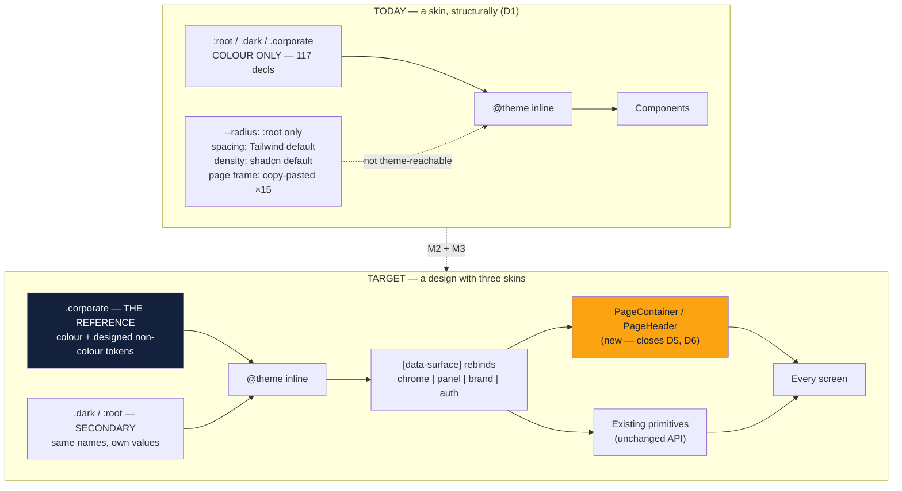
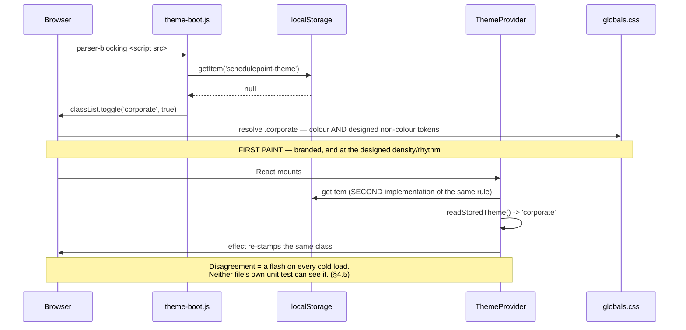

# Feature Spec: The corporate brand — designing to it, not skinning with it

- **Status:** Draft — awaiting approval. **Supersedes the 2026-08-18 first draft of this file**,
  whose conclusion ("not a palette epic — a decision plus verification") was withdrawn by the
  product owner the same day. What changed is recorded in §0.
- **Author(s):** feature-analyst (Product Owner / Solution Architect / Technical Lead hats)
- **Date:** 2026-08-18
- **Tracking issue / epic:** _(none yet)_
- **Roadmap link:** _(none — direct product-owner request, 2026-08-18)_
- **Related ADR(s):** ADR-0055 (surface scopes — the constraint this must work inside), ADR-0077
  (`brand`/`auth`, the pinned login), ADR-0061 (form layout), ADR-0083, ADR-0088 (a `VITE_` flag is
  not an operator rollback), ADR-0058/ADR-0076 (verify the claim). **Proposes ADR-0097.**
- **Companion measurement:** [`measurements.md`](./measurements.md)
- **Blocking prerequisite:** a **ui-architect** pass (§4.1). This spec deliberately stops short of
  choosing values.

---

## 0. The premise, corrected

### 0.1 What the product owner actually said (2026-08-18)

> "I know the corporate theme exists already. I just think it looks and feels like a **badly
> designed skin**. I want the corporate theme to be **the main theme that the app is designed to**.
> And the light and dark theme are the **secondary**. The corporate theme **needs significant work
> to make it look and feel like it was designed**."

And, on a Corporate Dark variant: **"Not planned."**

### 0.2 What the first draft got wrong, and why it is worth recording

The first draft of this spec answered the question **the code raised** — the theme is default-off,
so nobody sees it — rather than the question that was **asked**. It concluded the epic was "a
decision plus verification" with no CSS in the first two milestones. The product owner already knew
the theme existed. Their complaint was never discoverability.

That is ADR-0076 Class 3 in its purest form: a plausible conclusion, reached from real evidence,
about the wrong question — and it had been copied into a spec, a plan and a summary before anyone
checked it against the person who asked. It is recorded here rather than quietly replaced, because
the finding it produced (§0.3) is now the epic's strongest evidence, and the correction is what
turned it from a discoverability answer into a design one.

**Everything verified in the first draft stands.** The token facts, the three corrections to the
brief, and the four gaps are all reproduced below, unchanged. Only the conclusion moved.

### 0.3 The verified facts — which now argue the opposite way

| Claim                                                 | Verdict       | Evidence                                                                                                                                                                                                        |
| ----------------------------------------------------- | ------------- | --------------------------------------------------------------------------------------------------------------------------------------------------------------------------------------------------------------- |
| `.corporate` carries the exact requested palette      | **Confirmed** | `apps/web/src/styles/globals.css:508-730`; docblock at `:492` names navy `#14213D`, amber `#fca311`, lighter navy `#1f3661`, off-white `#f8f9fa`, body `#333` — identical to `measurements.md`.                 |
| Amber vs. the canvas's near-critical fill is resolved | **Confirmed** | `:501-506` states it; `:544` moves `--warning` to bronze. Real collision: `render/palette.ts:26-28` binds `bar → --color-primary`, `nearCritical → --color-warning`.                                            |
| The two 2.02:1 failures are handled by **placement**  | **Confirmed** | Amber only as a fill on navy: `--chrome-primary:596`, `--chrome-ring:605`, `--panel-primary:616`, `--brand-primary:658`, `--chart-1:558`. Page primary and ring are navy (`:524`, `:554`).                      |
| It is swept by the computed contrast matrix           | **Confirmed** | `test/css-blocks.ts:58`; `styles/token-contrast.test.ts:155-157` — 3 themes × 2 flag states × 5 scopes. `styles/token-architecture.test.ts:142` sweeps the same three for family completeness.                  |
| It is axe-scanned in a real browser                   | **Confirmed** | `e2e-designed-ui/designed-ui.spec.ts:31`; CI step `.github/workflows/ci.yml:435`. **Scope limit — the shell and a client list only** (`:45-49`).                                                                |
| It is default-off                                     | **Confirmed** | `public/theme-boot.js:24-25`; `hooks/use-theme.tsx:32-38`. The only writer is `account-chip.tsx:197`.                                                                                                           |
| **`.corporate` declares nothing but colour**          | **Confirmed** | All 117 declarations at `:508-730` are colours. `--radius` is declared once, at `:root:35`, and **no theme restates it**. There is no spacing, density, elevation or type token in any theme block. **See D1.** |

Recounted: `.corporate` declares **117** custom properties (6 page surfaces, 8 brand/interactive,
12 status, 3 line/focus, 5 chart, **72** across four 18-token surface families, 3 field, 2 canvas,
2 ground, 3 grid, 1 hatch), plus **38** in two flag-keyed layers
(`[data-designed-chrome].corporate:962-1007`, `[data-canvas-visual-language].corporate:1013-1016`).

### 0.4 Three corrections to the brief that started this work

Kept, because two of them still change the design.

1. **"~34 tokens in `brand`/`auth`"** → **36**. Two families of 18
   (`token-architecture.test.ts:26-56`; the eighteenth is `--success-text`, ADR-0077 §9).
2. **"`readStoredTheme` cannot distinguish 'chose system' from 'never chose'"** → true of the
   function's _return value_, **false of the stored state**. `localStorage` holds `null` versus the
   literal `'system'`, and `setTheme` (`use-theme.tsx:70-73`) is the only writer, called only from a
   menu item. **The default flip is therefore discriminating, not blanket** — §4.6.
3. **"A theme change may not reach the front door"** → correct, and the front door is **already
   navy + amber in every theme** (`auth-shell.tsx:58` `tone="auth"`, `brand-panel.tsx:44`
   `tone="brand"`, ADR-0077 §2/§8). No work is needed there. It is also, as §0.5 D8 shows, **the
   best-designed screen in the product** — and the clearest demonstration of the gap.

---

## 0.5 What "a badly designed skin" actually is — measured, not reasoned

Eight findings. Each was established by reading a file, and each names it. Together they are the
answer to "why does it not feel designed", and they are the epic's scope.

> **D1 — A theme in this application can only express colour. Structurally.**
>
> `globals.css`'s three theme blocks declare **only** colour custom properties. `--radius` is
> declared once at `:root:35` and restated by no theme; there is no spacing, density, elevation,
> border-weight or type token anywhere in a theme block; `@theme inline:1021-1079` maps colours,
> two font families and four radii derived from that single `--radius`.
>
> **So "the corporate theme is a skin" is not an impression — it is the literal capability of the
> mechanism.** A theme cannot currently change anything a designer would change. This is the single
> most important finding in the epic, and it is the one that turns the product owner's adjective
> into a work item.

> **D2 — Corporate's navy is a stripe, not a chrome.**
>
> `[data-designed-chrome].corporate:986-1006` makes the Project Explorer rail **light**
> (`--panel: oklch(0.955 0.004 248)`), with the reasoning recorded at `:950-961`: "One dark band
> across the top and two light surfaces below it reads as a designed application; three competing
> dark/light regions does not." That flag is default-on (`config/env.ts:847`).
>
> The header row is `h-14` (`app-header.tsx:137,152`). So on a non-plan screen the navy occupies
> **56px of the viewport height and nothing else**. Everything below it is off-white page, white
> cards and grey text — which is, structurally, the Light theme. The reasoning at `:950-961` is
> sound and the _result_ is that the brand is a bar at the top of a neutral application.

> **D3 — On a page, the brand's second colour appears once, at 28×28px.**
>
> Enumerated across the Corporate token set: on the **page** surface amber is bound to exactly two
> things — `--accent` (`:531`, a pale wash used for hover/selected rows) and `--chart-1` (`:558`).
> Every solid on a page is navy: `--primary:524`, `--secondary:527`, `--info:547`, `--ring:554`.
>
> The one solid amber an authenticated user sees at rest is the `BrandMark` tile
> (`brand-mark.tsx:20`, `bg-primary` inside the chrome scope → `--chrome-primary` → amber), which is
> `size-7` — **28×28 px**. On the Clients screen, at rest, that tile is the entire orange.
>
> This is the coordinator's hypothesis confirmed: the accent sits **where it was contrast-safe to
> drop in**, not where a designer would put it. The contrast reasoning (`:517-523`) is correct and
> was never followed by a placement decision.

> **D4 — The primary navigation indicates the current page with weight and grey, never with the
> brand.**
>
> `app-header.tsx:15-16`: a nav link is `text-muted-foreground`, and the active one is
> `text-foreground font-medium`. In Corporate that is light-grey vs. white on navy. The active state
> of the product's top-level navigation — the most-looked-at state in the application — uses none of
> the brand, in a band where amber is already proven at **7.9:1**.

> **D5 — Every content page hand-rolls the same frame, fifteen times.**
>
> `mx-auto w-full max-w-6xl flex-1 p-6` appears **verbatim 15 times across 12 route files**
> (`clients.tsx:13`, `client-detail.tsx:19,27,50`, `project-detail.tsx:42,50,83`, `plan-detail.tsx:47`,
> `org-home.tsx:34`, `resources.tsx:62`, `calendars.tsx:53`, `members.tsx:11`, `audit-log.tsx:38`,
> `my-activity.tsx:36`, `recently-deleted.tsx:17`). There is no page-frame primitive.
>
> A design system that stops at the card and leaves the page to copy-paste has no way to express a
> page-level decision at all — no eyebrow, no page header band, no consistent action placement, no
> place to put anything brand-bearing. Changing "what a page looks like" currently means editing
> twelve files, which is why nobody has.

> **D6 — The page title and a section heading are the same size, everywhere.**
>
> `DESIGN_SYSTEM.md:87` assigns `text-3xl` to page titles and `text-2xl` to section headings.
> **`text-3xl` appears in zero `.tsx` files under `apps/web/src`.** Every route's `<h1>` is
> `text-2xl font-semibold tracking-tight` (11 occurrences in `routes/`), and `CardTitle`
> (`card.tsx:51`) is `text-xl`.
>
> So the documented top of the type hierarchy is unused and the hierarchy is one step shallower than
> designed. Nothing on a page announces itself as the page.

> **D7 — The control density is a component-library default, not a decision, and the design system
> documents a different one.**
>
> `DESIGN_SYSTEM.md:102-104`: "sm 32px (`h-8`), md 36px (`h-9`, default), lg 40px (`h-10`)".
> Shipped: `button.tsx:22-25` is `default h-10`, `sm h-9`, `lg h-11`, `icon size-10`;
> `input.tsx:17` is `h-10`. **Every step is one rung above the documented scale**, consistently —
> which is what a shadcn-derived default looks like when nobody revisited it.
>
> The code is internally consistent, so nothing is broken. But "the density was chosen for this
> product" is false, and 40px controls with `p-6` page padding and 24px card padding is a
> comfortable, generic rhythm — not a planning tool's.

> **D8 — The best-designed screen in the product is the one that got a design pass, and it is not
> in the application.**
>
> `AuthShell` (`auth-shell.tsx:56-83`) is a 900px card on a two-stop gradient ground, `shadow-xl`,
> a fixed height so it does not resize between screens, a two-column split with a token-drawn
> motif. Its measurements were **read from the old app's stylesheets** and its two focus/outline
> values were **derived** rather than sampled because the originals failed 1.4.11 (ADR-0077 §8).
>
> That is what "designed" looks like in this repository, it exists, and it stops at sign-in. The
> product owner's "the old app looked more polished" and "this looks like a badly designed skin"
> are the same observation from two sides: **the one screen that got the treatment is the one they
> are comparing everything else against.**

**The short version.** The colour is right and finished. What is missing is everything a palette is
not: where the accent goes, what a page is, how deep the hierarchy runs, how dense the controls are,
and whether the theme layer can express any of it. D1 says it currently cannot.

---

## 0.6 The four gaps that exist regardless of any of the above

Carried unchanged from the first draft. **None of these is design work; all four are defects or
drift, and G2 is possibly live in production today.** They are kept at the front of the plan so an
epic that got longer does not bury them.

- **G1 — the canvas criticality triple is not gated in Corporate.** `globals.css:501-506` and
  `DESIGN_SYSTEM.md:213-219` assert bronze keeps three readable bar states; nothing computes it.
  `render/palette.test.ts:223-285` runs light/dark only.
- **G2 — two solid fills are absent from the contrast matrix, in every theme.** `TEXT_PAIRS`
  (`token-contrast.test.ts:86-120`) omits `--destructive`/`--destructive-foreground` and
  `--secondary`/`--secondary-foreground`; `NON_TEXT_PAIRS` (`:123-153`) omits
  `--background`/`--destructive`. **Light's `--destructive` `oklch(0.577 0.245 27.325)` with
  `oklch(0.985 0 0)` ink is a plausible sub-4.5:1 pair — i.e. a live WCAG 1.4.3 failure on every
  Delete button in today's default theme.** Measured in M1-T3, not guessed here.
- **G3 — `--secondary` is not a rebound name** (`token-architecture.test.ts:83-102`), so inside a
  scope `bg-secondary` keeps the page value — the lighter navy on the navy band, ~1.4:1. **Verified
  latent, not live:** no `variant="secondary"`/`bg-secondary` consumer renders inside any of the six
  `<Surface>` sites (`chrome-band.tsx:39`, `app-header.tsx:136`, `navigator-rail.tsx:45,136`,
  `app-shell.tsx:125`, `brand-panel.tsx:44`, `auth-shell.tsx:58`). **This epic makes it more likely
  to go live**, because designing an active state is exactly when somebody reaches for `secondary`.
- **G4 — `DESIGN_SYSTEM.md` contradicts itself and the code.** §230 "There are three scopes" vs.
  §267 "There are five scopes"; §246 "a complete 17-token family" vs. the gate's 18; `globals.css`
  repeats "the 17-name vocabulary" at `:249`, `:466`, `:716`. D6 and D7 add two more: the documented
  type scale and control scale describe a product that is not this one.

---

## 0.7 Where this spec pushes back

The product owner asked to be challenged. Three places, each with the evidence.

1. **Borders-versus-elevation is a deliberate decision, and it should stay.** `measurements.md`
   records the old app's three-step shadow scale, and it is tempting to read the flat feel as a
   missing shadow. `DESIGN_SYSTEM.md:124` already says "prefer `border` + low elevation on light
   surfaces", and the application follows it: `shadow-*` appears in **10 files**, essentially all
   floating layers (`dialog`, `menu`, `combobox`, popovers, `auth-shell`'s `shadow-xl`), plus
   `Card`'s `shadow-sm` (`card.tsx:10`). Raising every surface would make elevation mean nothing —
   it is the one channel that currently says "this floats above that", and a scheduling tool has a
   lot of floating layers. **Recommendation: do not add elevation as the fix for flatness.** D2, D3,
   D5 and D6 are the causes; elevation is a symptom people reach for.
2. **Radius, motion and typeface are already matched to the old app and should not be re-derived.**
   `--radius: 0.625rem` gives `radius-md` = **8px**, which is the old app's `--border-radius`
   exactly (`DESIGN_SYSTEM.md:106-110`); the documented 150/200/300ms band contains the old app's
   `0.2s`; and `DESIGN_SYSTEM.md:225-228` already records swapping the typeface per theme as
   rejected, for reasons (layout shift, a second runtime font) that have not changed. The gap is
   not these.
3. **Do not re-derive the palette.** ADR-0077 M7's computed matrix found two WCAG 1.4.11 failures
   **in the old app's own values** (its amber focus ring at 2.02:1, its field outline at 2.22:1) and
   derived them to 3.01–3.36:1 at the same hue. A fresh sampling pass would reintroduce both. The
   colours are not the problem; §0.5 is.

---

## 1. Business understanding

### Problem

SchedulePoint's corporate identity is a **complete, gated, correct set of colours** and **nothing
else**. It was applied to a layout, a density, a component set and a page structure that were
designed for a neutral theme and merely inherited — so it reads as a skin, because structurally it
is one (D1). The product's own best-designed screen sits outside the application (D8), and the
person who commissioned the identity looks at the product and sees a bar of navy above a generic
app (D2, D3).

**Why now:** the product owner has said, explicitly, that this is what they want the application
designed to. Every further UI epic built on the current foundation adds to the amount that must
later be redesigned.

### Users

All authenticated roles — **Org Admin, Planner, Contributor, Viewer** — plus **External Guest**
(the share view renders on the page surface). No role differentiation and no permission change
anywhere in this epic. Signed-out visitors are unaffected: their screens are already theme-invariant
and already designed.

### Primary use cases

1. A planner opens SchedulePoint and it looks like one designed product, top to bottom, not a
   coloured band over a generic shell.
2. A page announces what it is, and its actions sit where the last page's did.
3. A designer or reviewer can change a theme-level decision that is **not** a colour.
4. Light and Dark keep working, keep their contrast guarantees, and stop being what anyone designs
   to.
5. A reviewer can tell whether "it looks designed" was achieved, from something a build checks.

### User journeys

- **Happy path:** first load → the brand, by default → a page frame that names the page → primary
  actions in a consistent place, carrying the brand → the plan workspace and the canvas in the same
  language.
- **Alternate (chose a theme):** stored `light`/`dark`/`system` → that theme, with the new
  structure and its own colour values. **Structure is shared; only values are per-theme** (§4.4).
- **Alternate (opt-out):** Account ▸ Theme ▸ Light — two clicks, unchanged.
- **Signed out:** unchanged.

### Expected outcomes

- Corporate is the reference the design system is authored against; Light and Dark are secondary
  skins that must remain correct and gated.
- The theme layer can express a non-colour decision, so the next design change is a token rather
  than a refactor of twelve routes.
- Three defects and four drifts closed, one of which may be live today (G2).

### Success criteria

1. The product owner uses the deployed application and does not describe it as a skin. Subjective,
   named as such, and the only criterion that matters commercially.
2. Every criterion in §2.1 ("what designed means here") is expressed as a passing gate, and each was
   **verified red first**.
3. `token-contrast.test.ts` and `token-architecture.test.ts` still sweep all three themes; Light and
   Dark have no new contrast failure and no unreviewed visual change beyond §4.4's shared structure.
4. The 33 Playwright journeys are green after the default flip, having been **run**.
5. `DESIGN_SYSTEM.md` describes the product that exists — checked by re-deriving its numbers from
   the gates, not from another document.

### Open questions

The product owner's three answers are settled and are **not** re-asked: Corporate is the main theme;
Light and Dark are secondary; **Corporate Dark is not planned**.

> **CQ-1 (CRITICAL) — A user whose OS is dark and who has never chosen a theme: Corporate (light)
> or Dark?**
>
> Corporate resolves as a **light** scheme (`use-theme.tsx:57-58`), and Corporate Dark is not
> planned — so a dark-preferring user's only route to a dark application is a **secondary,
> unbranded** theme. The two are in tension and only the product owner can resolve it.
>
> - **(a) Flip unconditionally.** Consistent with ADR-0077 §2's own reasoning, which treats an
>   OS-derived dark theme as "selected by something the visitor did not do". Escape is two clicks.
> - **(b) Honour a dark OS.** Never-chose + dark OS keeps Dark. Respects an expressed preference,
>   at the cost that the users most likely to notice appearance never meet the brand.
>
> **Recommended default: (a).** It is what "the main theme" means, and the escape exists. Under (b)
> §4.6's rule gains one clause and nothing else in the epic changes.

> **CQ-2 (CRITICAL) — Control density: 40px (shipped) or 36px (documented)?**
>
> D7. `Button` and `Input` are 40px; `DESIGN_SYSTEM.md` says 36px. One of them is wrong and the
> answer changes the rhythm of every screen.
>
> - **(a) Adopt 40px, fix the document.** Zero visual change, one doc edit. Comfortable, generic.
> - **(b) Move to 36px, fix the primitives.** A denser, more tool-like feel that suits a scheduling
>   application — and a visual change to **every control in the product, in all three themes**, with
>   a real risk to the toolbar's measured width ladder (ADR-0090/0091 derive their band floors from
>   measured control widths, and `e2e-toolbar-fit` asserts them).
>
> **Recommended default: (a) now, and let the ui-architect pass in M0 reopen it with a
> measurement** if density is genuinely part of what reads as undesigned. **(b) is not a free
> change and must not be smuggled in as tidying.**

> **CQ-3 (CRITICAL) — How much of this reaches Light and Dark?**
>
> D5 and D6 are not colour problems. Fixing them (a page-frame primitive, a real type hierarchy)
> changes **all three themes** — so an epic commissioned to change Corporate visibly changes the
> two themes the product owner called secondary.
>
> - **(a) Shared structure, per-theme values** _(recommended default)_. One page frame, one type
>   scale, one density, in every theme; only colour differs. Keeps Light and Dark correct and cheap,
>   and is the only reading of "the app is designed to Corporate" that does not fork the product.
> - **(b) Corporate-only structure.** Requires a second layout path for the secondary themes —
>   a Class A alternative surface in ADR-0088's terms, whose cap ratchets **down**. Not recommended,
>   and named so it is a decision rather than a surprise.
>
> **The consequence of (a), stated plainly: Light and Dark will look different after this epic.**
> Not re-coloured — restructured. That is a change the product owner should approve knowingly.

Non-critical, decided by default and stated so work is not blocked: no new `VITE_` flag (§4.7); the
login screen is untouched (§0.4.3); no elevation change (§0.7.1); no typeface, radius or motion
change (§0.7.2); the picker keeps four entries with the same labels.

---

## 2. Functional requirements

### 2.1 What "designed" means here — the testable criteria

The product owner's request is an adjective. This repository's design work is gated (the contrast
matrix, the seam test, the colour-literal lint), and the reason is ADR-0055's: every defect that
epic fixed had passed a human review, a component review and an axe suite, **because the class names
were right**. An adjective cannot be reviewed. So "designed" is defined as seven properties, each
with the gate that checks it.

| #      | Property                                                                                  | Gate                                                                                                                                                                                                                                                         |
| ------ | ----------------------------------------------------------------------------------------- | ------------------------------------------------------------------------------------------------------------------------------------------------------------------------------------------------------------------------------------------------------------ |
| **C1** | **A theme can express a non-colour decision.** (D1)                                       | `token-architecture.test.ts` asserts every theme block declares the designed non-colour set **literally, not as a `var()` alias** — the existing `--field`/`--canvas` precedent at `:155-166`, which exists for exactly this reason.                         |
| **C2** | **Adjacent surfaces are separated on purpose.** (D2)                                      | `token-contrast.test.ts:189-213` currently **reports** adjacent-surface ratios and asserts only `> 1`. Promote to an asserted band per theme: a card must be distinguishable from its page. **Numbers come from the ui-architect pass, not from this spec.** |
| **C3** | **The accent occupies named roles, and cannot quietly retreat to a hover wash.** (D3, D4) | An **accent census** — the set of token roles the brand accent is bound to, pinned as a snapshot, so removing one fails and adding one is a deliberate edit. The ADR-0073 route-census pattern. Its blind spot is stated: it proves binding, not prominence. |
| **C4** | **A page is a component, not a copy-paste.** (D5)                                         | A structural test that no file under `src/routes/` hand-rolls the page frame — the `surface-seams.structural.test.ts` pattern, where the protection is in the regex and the allowlist is what must not grow.                                                 |
| **C5** | **The type hierarchy has a top, and pages use it.** (D6)                                  | The page-header primitive owns the `<h1>` size; a structural test asserts routes do not set their own. `DESIGN_SYSTEM.md`'s scale is re-derived from the primitive.                                                                                          |
| **C6** | **One control height scale, documented and shipped.** (D7)                                | A unit test that `Button` and `Input` share the scale, plus the doc re-derived from the CVA. Whichever CQ-2 answer is taken, the two agree afterwards.                                                                                                       |
| **C7** | **Light and Dark stay correct.** (the product owner's "secondary" is not "unmaintained")  | Unchanged and non-negotiable: `THEME_SELECTORS` keeps all three; the contrast matrix keeps sweeping 3 × 2 × 5; `e2e-designed-ui` keeps its four-theme axe loop.                                                                                              |

**What these deliberately do not claim.** No gate can decide whether a screen is beautiful. C1–C6
check that the _decisions_ were made, are expressible, and cannot silently revert. The judgement
stays with the ui-architect pass and the product owner, which is the honest division — and it is
stated because a gate presented as proof of taste is worse than no gate.

### 2.2 User stories & acceptance criteria

> **US-1** — As the **product owner**, I want Corporate to be what the application is by default, so
> that the theme the product is designed to is the theme everybody uses.
>
> - **Given** no stored `schedulepoint-theme`, **when** the app loads, **then** `<html>` carries
>   `class="corporate"` before first paint, and the account menu shows Corporate ticked.
> - **Given** a stored `light`/`dark`/`system`/`corporate`, **then** the resolved theme is exactly
>   what it is today. Four separate assertions — `system` is the one conflated with "never chose".
> - **Given** CQ-1's answer, **then** the dark-OS never-chose case behaves as decided, asserted **by
>   name** in `theme-boot.test.ts`.

> **US-2** — As a **designer or engineer**, I want to change a theme-level decision that is not a
> colour, so that the identity can be designed rather than tinted.
>
> - **Given** the extended token vocabulary, **when** a theme block declares a non-colour designed
>   token, **then** it takes effect for that theme only and `token-architecture.test.ts` requires it
>   literally in every theme block (C1).
> - **Given** a theme omits one, **then** the suite **names the missing token**, not "a family is
>   incomplete" — the discipline `token-architecture.test.ts:149-152` already sets.

> **US-3** — As a **planner**, I want every page to tell me what it is and put its actions in the
> same place, so that the application reads as one product.
>
> - **Given** any content route, **when** it renders, **then** its frame, title and primary action
>   come from the shared page primitive (C4, C5).
> - **Given** the same, **then** the page title is visually distinct from a section heading and from
>   a card title — three levels, not two (D6).
> - **Given** a route hand-rolls the frame, **then** the structural test fails, naming the file.

> **US-4** — As a **planner**, I want the brand present where I am working, not only in a 28px tile,
> so that the product feels like one identity rather than a header.
>
> - **Given** Corporate, **when** the primary navigation shows the current page, **then** that state
>   uses the brand accent, which is already proven at 7.9:1 on the navy band (D4).
> - **Given** Corporate, **then** the accent census (C3) covers at least the roles agreed in the
>   ui-architect pass, and every new binding clears its contrast bar by computation before it ships.

> **US-5** — As a **planner reading the diagram**, I want normal, near-critical and critical bars to
> stay three distinguishable things in the brand theme (G1).
>
> - `--primary` (navy), `--warning` (bronze) and `--destructive` (red) each clear **3:1** against
>   the Corporate canvas ground, **in both canvas flag states** (the ground differs —
>   `globals.css:674` vs `:1014`), and are **mutually** distinguishable.
> - Each fill's paired label ink clears **4.5:1** on its own fill.

> **US-6** — As **any user**, I want a Delete button's label to be legible (G2).
>
> - `--destructive`/`--destructive-foreground` and `--secondary`/`--secondary-foreground` are in
>   `TEXT_PAIRS`; `--background`/`--destructive` is in `NON_TEXT_PAIRS`.
> - **A failure is fixed at the token, never by narrowing the assertion.** If Light's destructive
>   pair fails, it is a live WCAG 1.4.3 defect found by this epic and is reported as one.

> **US-7** — As **a user who prefers Light or Dark**, I want my theme to remain a first-class,
> correct product, so that "secondary" does not mean "neglected".
>
> - All three themes stay in `THEME_SELECTORS`; the contrast matrix and the four-theme axe loop are
>   unchanged in coverage (C7).
> - Every structural change (page frame, type scale, density) applies to all three (CQ-3(a)).

> **US-8** — As a **maintainer**, I want the design system to describe this product (G4, D6, D7).
>
> - Scope count, token count, type scale and control scale in `DESIGN_SYSTEM.md` are each re-derived
>   from the code or a gate, not from another document.

### 2.3 Workflows

**W1 — first load, no stored preference.** `index.html` parser-blocks on `/theme-boot.js` → reads
`null` → stamps `.corporate` → `globals.css` resolves 117 declarations plus 38 flagged → React
mounts → `ThemeProvider` reads storage with the **same rule** and agrees. **If the two disagree the
app flashes**, and no unit test of either file alone can see it (§4.5).

**W2 — a content page renders.** Route → `<PageContainer>` → `<PageHeader>` (eyebrow, `<h1>`,
primary action slot) → content. Today: fifteen hand-rolled copies (D5).

**W3 — theme change, W4 — signed out.** Unchanged.

### 2.4 Edge cases

| Case                                               | Expected behaviour                                                                                                                                                                      |
| -------------------------------------------------- | --------------------------------------------------------------------------------------------------------------------------------------------------------------------------------------- |
| `localStorage` throws (private mode)               | Boot does not throw. **The fallback class changes from none to `corporate`** — a deliberate edit to `theme-boot.js:28-30` **and its test at `:95-108`**, not a side effect.             |
| Stored value is garbage                            | Treated as never-chose → the new default.                                                                                                                                               |
| A route needs a frame the primitive does not offer | The primitive takes props; it does not get bypassed. If a genuine exception exists it joins the structural test's allowlist **with a reason**, and the allowlist is what must not grow. |
| The guest share view (`/share`, ADR-0051)          | Page surface, so it follows the guest's own storage — a guest with no stored theme meets the brand. Desirable, and worth stating: a guest is often the client.                          |
| Print / PDF export                                 | `resolvePrintPalette()` (`render/palette.ts:194-245`) is a light-forced palette independent of the theme. Unaffected — verified.                                                        |
| The plan workspace and canvas                      | Page surface; the canvas resolves tokens at runtime. Any non-colour token that reaches the painter must be added to `palette.ts` deliberately — **not** in this epic.                   |

### 2.5 Permissions

**None.** No RBAC, no organisation scope, no ADR-0028 pen, no endpoint. The theme is a per-browser
`localStorage` preference. Stated because the process asks, not because there is a decision.

### 2.6 Validation rules

One, and it exists: the stored theme is one of `light | dark | system | corporate`, enforced in two
files (`use-theme.tsx:35-37`, `theme-boot.js:24-25`). This epic changes the **fallback branch of
both** and must keep them in agreement (§4.5).

### 2.7 Error scenarios

| Scenario                                                | Detection                                    | Result                               | Status |
| ------------------------------------------------------- | -------------------------------------------- | ------------------------------------ | ------ |
| Boot script and provider disagree on the default        | the cross-file seam gate (§4.5)              | _prevented_ — would be a theme flash | n/a    |
| `localStorage` inaccessible                             | `try/catch`, `theme-boot.js:21-30`           | app renders in the default theme     | n/a    |
| A theme omits a designed non-colour token               | `token-architecture.test.ts` (C1)            | _prevented_ — CI red, token named    | n/a    |
| A route hand-rolls the page frame                       | structural test (C4)                         | _prevented_ — CI red, file named     | n/a    |
| A contrast pair fails                                   | `token-contrast.test.ts` / `palette.test.ts` | _prevented_ — CI red                 | n/a    |
| A journey asserts something the flip or the frame moves | the 33 suites, run before merge              | _prevented_ — CI red                 | n/a    |

No HTTP errors: there are no requests in this feature.

---

## 3. Technical analysis

| Area               | Impact   | Notes                                                                                                                                                                                                                                 |
| ------------------ | -------- | ------------------------------------------------------------------------------------------------------------------------------------------------------------------------------------------------------------------------------------- |
| **Frontend**       | **High** | New page primitives; extended token vocabulary; two behaviour lines (`theme-boot.js`, `use-theme.tsx`); 12 route files migrated to the frame; possible density change to two primitives (CQ-2). **This is the whole epic.**           |
| **Backend**        | **None** | No module, service or endpoint. Verified: `THEME_STORAGE_KEY` (`config/env.ts:19`) has three readers, all client-side.                                                                                                                |
| **Database**       | **None** | No model, column, index, constraint or migration. **The database-architect agent is not engaged because there is no schema change to design** — not because one was judged too small (CLAUDE.md §19.3).                               |
| **API**            | **None** | No endpoint, DTO, OpenAPI or `@repo/types` change.                                                                                                                                                                                    |
| **Security**       | **None** | No auth, input or secret. CSP untouched — `theme-boot.js` stays a served file in `public/` for the ADR-0074 reason; nothing inline is added.                                                                                          |
| **Performance**    | **Low**  | `.corporate` already ships whether applied or not, so the flip has **no bundle delta**. A page primitive replaces repeated markup and should be neutral-to-smaller. Any density change must be re-measured against `e2e-toolbar-fit`. |
| **Infrastructure** | **None** | No env var, compose change or CI service; one or two new CI steps if a journey is added.                                                                                                                                              |
| **Observability**  | **None** | No log, metric or trace.                                                                                                                                                                                                              |
| **Testing**        | **High** | Six new gates (C1–C6), two contrast extensions (G1, G2), the cross-file seam gate, and a full 33-suite journey sweep. See below.                                                                                                      |

### The CPM engine and the recalculation parity gate

**The CPM engine is not imported and no migration runs.** This is design-system and client-default
work; there is no code path into `computeSchedule` and no scheduling input is added, removed or
defaulted. The ADR-0034 parity gate is untouched **by construction** — in its honest form: there is
nothing here to hold parity for.

### Testing — what actually has to be proved

1. **The two-file seam** (`theme-boot.js` ↔ `use-theme.tsx`) — two implementations of one rule with
   no compiler relationship. ADR-0074 records this exact shape failing closed and silently.
2. **G1 and G2**, before any value moves (`measurements.md` §"Two things to gate rather than hope";
   ADR-0083's ordering rule — a pair added afterwards is a pair that shipped unchecked).
3. **The 33 journeys.** **None sets a theme** — verified: zero matches for `schedulepoint-theme`
   under `apps/web/e2e*/`, and no `playwright*.config.ts` pins one. They all render in whatever the
   default is, so the flip silently changes what every one of them paints, and the page-frame
   migration changes their DOM. They must be **run**, not reasoned about. ADR-0091's retrospective
   records three journeys breaking across one layout change, each found by CI rather than the
   author, and the rule that replaced that judgement: run every journey.
4. **Corporate's axe coverage is narrower than it sounds.** `e2e-designed-ui:41-50` scans the app
   shell plus a client list. It does not reach the plan workspace, canvas, toolbar, a dialog, the
   Gantt or the activity editor. Acceptable while Corporate was opt-in; not once it is the product.
5. **`e2e-toolbar-fit`** is the one suite a density change could break in a way arithmetic will not
   predict — ADR-0090/0091 derive band floors from measured control widths. Named because CQ-2(b)
   would otherwise look free.

### Dependencies

- **Blocking prerequisite: the ui-architect pass (M0).** This spec establishes _what is wrong_ and
  _how it will be checked_; it deliberately does not choose the values. CLAUDE.md §20 says to run
  ui-architect **before** building non-trivial UI, and the product owner has made this non-trivial
  UI by instruction.
- **Constraints it must work inside:** ADR-0055's surface-scope model (a family is complete or it is
  a trap; `@theme inline` is load-bearing; the families have no Tailwind utilities), ADR-0077's
  `brand`/`auth` theme-invariance, ADR-0061's form-layout vocabulary, ADR-0090/0091's measured
  toolbar ladder.
- **Ordering that is load-bearing:** gates before values; the flip early (so the product owner is
  looking at Corporate while the design work lands, rather than judging it at the end).
- **Blocks nothing. Blocked by nothing except the ui-architect pass and CQ-1–CQ-3.**

---

## 4. Solution design

### 4.1 What this spec does not decide, deliberately

The values — how far a card stands off its page, where the accent goes beyond D4's nav state, what
a page header contains, what the type ramp is — are the **ui-architect's** to propose and the
product owner's to approve. Writing them here would be a feature analyst choosing a visual design in
prose, which is exactly the shortcut that produced a skin the first time.

**This was not run as part of producing this spec** and that is stated rather than implied: the
analyst has no agent-launch capability in this session. **M0 is therefore a hard gate, not a
formality**, and no value-bearing task may start before it returns. If it fails or returns nothing,
re-run it — an unavailable agent is a reason to wait, never a reason to proceed (CLAUDE.md §19.3's
rule for database-architect, applied for the same reason).

### 4.2 Architecture overview — the inversion

Today the theme layer is one axis (colour) and everything else is fixed. The change is to give it a
second axis, and to make Corporate the block the others are written against.

**Two boxes are new**: the designed non-colour tokens in each theme block, and the page primitives.
Everything else keeps its existing shape, including every component's public API — which is what
keeps a 989-file frontend from needing a rewrite.

### 4.3 Data flow — first paint

### 4.4 The rule that keeps three themes affordable

**Structure is shared; values are per-theme.**

- **Shared, one implementation, all themes:** the page frame, the type ramp, the control height
  scale, the spacing rhythm, the elevation model, component anatomy.
- **Per-theme, expressed as tokens:** every colour, and whichever non-colour decisions the M0 pass
  shows genuinely differ by theme (a navy chrome may want a different border weight than a white
  one; that is a token, not a fork).

This is CQ-3(a). It is what lets "Corporate is the reference" mean _the design decisions are taken
looking at Corporate_ rather than _Corporate gets a different application_. The alternative — a
Corporate-only layout path — is a Class A alternative surface under ADR-0088, whose cap ratchets
**down** after each retirement, and it is not recommended.

**Its honest cost: Light and Dark will look different after this epic** — restructured, not
re-coloured. CQ-3 exists so that is approved rather than discovered.

### 4.5 The seam that must be gated

One rule, two implementations, no compiler relationship. `app/theme-boot.test.ts:25-34` already
reads the **real served file** from disk and evaluates it, so the mechanism exists; it must be
pointed at the provider's rule as well and asserted across all five storage states × both
`prefers-color-scheme` values. **Verified red first** by changing one of the two rules — a seam test
that has never failed is a seam test nobody has checked.

### 4.6 The migration rule

Discriminating, because the storage state is discriminating (§0.4.2).

| Stored value              | Today                    | After (CQ-1 = a) | After (CQ-1 = b)                               |
| ------------------------- | ------------------------ | ---------------- | ---------------------------------------------- |
| `null` (never chose)      | `system` → Light or Dark | **`corporate`**  | **`corporate`** if OS light; `dark` if OS dark |
| `'system'` (chose System) | Light or Dark, live      | **unchanged**    | **unchanged**                                  |
| `'light'` / `'dark'`      | as chosen                | **unchanged**    | **unchanged**                                  |
| `'corporate'`             | Corporate                | **unchanged**    | **unchanged**                                  |
| garbage                   | `system`                 | **`corporate`**  | as `null`                                      |

It never overwrites a stored value — `setTheme` remains the only writer. It decides only what
happens in the absence of a choice.

**Who is believed to be in that population: everyone on this installation, including the product
owner.** That is a belief about browsers' `localStorage`, **not a fact this repository can read**,
and it is labelled as one (ADR-0076 Class 3).

### 4.7 Feature flags — deliberately none

1. **A `VITE_` flag is not a rollback for the operator, and never has been** (ADR-0088): Vite
   inlines `import.meta.env.VITE_*` at build time, `apps/web/Dockerfile` declares one `VITE_` build
   arg, `docker-publish.yml` passes none, `.dockerignore` strips `**/.env` from the build context.
2. **A better rollback already exists and is per-user:** the account menu.
3. **The engineering rollback is a commit boundary** — the ADR-0077 §5 mitigation. Each milestone
   lands as revertible commits; the flip is one.
4. **A flag would add a Class A alternative surface**, whose cap ADR-0088 D3 ratchets down.
5. **For the page-frame migration a flag is actively worse**: it means two page layouts in twelve
   route files, and the flag-off copy is the code nobody reads and everybody breaks (ADR-0077 §5's
   wording, and it applies exactly).

### 4.8 Database changes

**None.** No model, column, index, constraint or data migration.

### 4.9 API changes

**None.** No endpoint, DTO, OpenAPI delta or `@repo/types` change.

### 4.10 Component changes

**New (M3):**

- **`components/layout/page-container.tsx`** — the frame currently copy-pasted 15 times, with its
  max-width, padding and scroll relationship expressed once.
- **`components/layout/page-header.tsx`** — the `<h1>`, an optional eyebrow/breadcrumb, a
  description slot and a primary-action slot. Owns the page-title type size (C5), so D6 cannot
  recur one route at a time.

Layout tier rather than `ui/`: they carry page structure, not a reusable widget
(`COMPONENT_LIBRARY.md` tier rules, and `brand-mark.tsx:12-13`'s precedent).

**Changed:**

- 12 route files migrate to the primitives (M3). Mechanical; the existing suites query by role and
  accessible name, which is exactly what the migration preserves — the ADR-0062 extraction standard.
- `app-header.tsx:15-16` — the active-nav treatment (D4, M4), once the accent placement is agreed.
- `button.tsx` / `input.tsx` — **only if CQ-2(b)**.

**Explicitly unchanged:** every primitive's public API; `Card`; the dialog/form vocabulary
(ADR-0061); the toolbar registry (ADR-0031/0090/0091); the canvas painter; `AuthShell` and
`BrandPanel`.

### 4.11 Implementation approach & alternatives

**Chosen: fix the mechanism, then design against it, with the flip early.**

Ordering, and why each position is load-bearing:

1. **Defects first (G1–G4)** — they are true regardless of any design decision, one may be live, and
   they are the cheapest thing in the epic to lose under a bigger one.
2. **The flip early** — the product owner cannot judge design work on a theme they are not looking
   at. This also front-loads the 33-journey sweep, so a suite that breaks does so before twelve
   route files have moved on top of it.
3. **The mechanism before the values (D1)** — designing non-colour decisions into a layer that
   cannot express them produces either hard-coded values or a Corporate-only fork.
4. **Structure before accent** — a page frame is where a page-level accent could live; placing the
   accent first would place it in fifteen copies of a frame about to be deleted.

**Alternatives considered:**

- **Redesign Corporate's colour values.** The intuitive reading of "badly designed skin".
  **Rejected:** ADR-0077 M7's matrix found two WCAG 1.4.11 failures in the old app's own values and
  derived them at the same hue; a fresh pass would reintroduce them. §0.5 shows the fault is not the
  colours — it is that there are only colours.
- **Promote amber to the page's `--primary`.** **Rejected, already rejected in code with the
  measurement:** amber on the off-white page is 1.92:1 (`globals.css:517-523`), below the 3:1 that
  1.4.11 asks of a fill identifying a control, and darkening it to 3:1 lands on the bronze
  `--warning` occupies. Note the shipped code went one step further than `measurements.md`, which
  concedes only that orange **text** fails.
- **A Corporate-only layout path.** **Rejected** — §4.4, ADR-0088.
- **Add elevation everywhere.** **Rejected** — §0.7.1.
- **Corporate Dark.** **Excluded by the product owner.** Not planned, not implied, not a follow-on.
- **Do the design work without ui-architect.** **Rejected** — CLAUDE.md §20, and it is how the first
  version of this identity became a skin.

### 4.12 Architectural significance — ADR required

Yes, and it is larger than the first draft's. **Proposed ADR-0097: "The brand is the reference, and
a theme is more than colour."** It records:

- the finding that the theme layer is structurally colour-only (D1), which is the decision's spine;
- the promotion of Corporate to the reference theme, and what "secondary" does and does not mean for
  Light and Dark (they stay gated — C7);
- **that Corporate Dark is not planned**, so it is a decision rather than an omission a future
  reader tries to fill;
- the shared-structure/per-theme-values rule (§4.4) and the Class A argument against the fork;
- the seven criteria (C1–C7) and each one's gate, including what they cannot prove;
- the no-flag decision, including why a flag is _worse_ than none for the page-frame migration;
- the CQ-2 density answer with its measurement;
- an amendment note to **ADR-0055**: its surface-scope vocabulary is unchanged and is extended along
  a new axis; and to **ADR-0077 §2**, whose premise is untouched and whose consequence strengthens —
  the pinned front door and the default application finally agree;
- **the first draft's withdrawn conclusion** (§0.2), because a decision record that omits the wrong
  answer teaches nothing about how the right one was reached.

**Number risk, recorded rather than assumed:** `docs/adr/` tops out at **0096**
(`0096-deleted-work-expires-and-purge-is-refused.md`). ADR-0071 was cited by shipped code for a whole
epic while absent from the register; ADR-0079 was renumbered because its number was taken between
the plan and the milestone; ADR-0078 found `docs/adr/README.md` missing seven entries. **Re-derive
the number at filing time, and file, register and README-list in one commit.**

---

## 5. Links

- Implementation plan: [`./implementation-plan.md`](./implementation-plan.md)
- Measurements: [`./measurements.md`](./measurements.md)
- Docs this change updates: `docs/DESIGN_SYSTEM.md` (§72 type scale, §100 sizing, §106 radius,
§185 Corporate, §230 surface scopes — and the 17/18, three/five, `text-3xl` and control-height
drifts), `docs/COMPONENT_LIBRARY.md` (the page primitives), `docs/FRONTEND_ARCHITECTURE.md`
(theme management), `CLAUDE.md` §16, `docs/adr/README.md`, `docs/adr/0097-*.md` (new),
`docs/TECH_DEBT.md` (non-blocking findings, and G3 if it stays latent).
</content>
