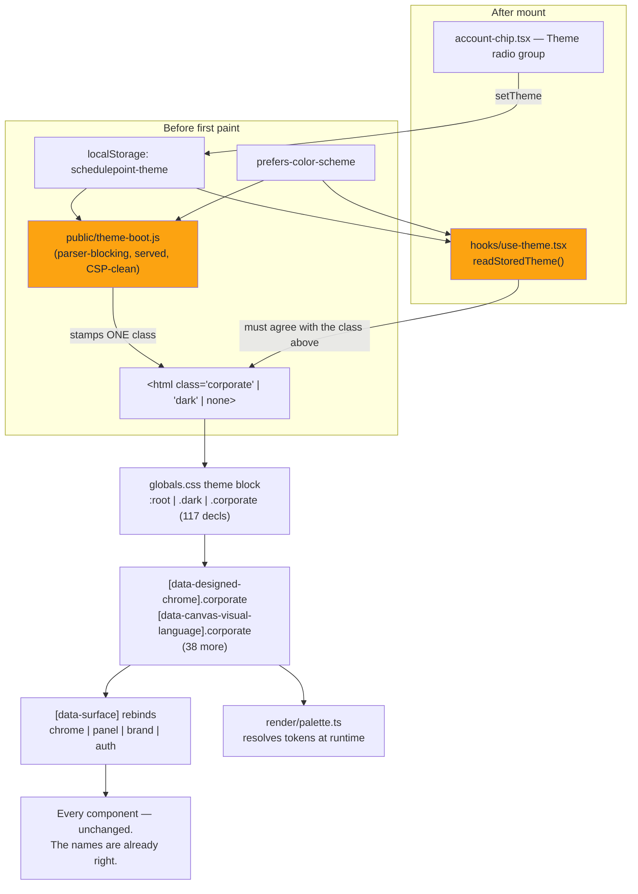
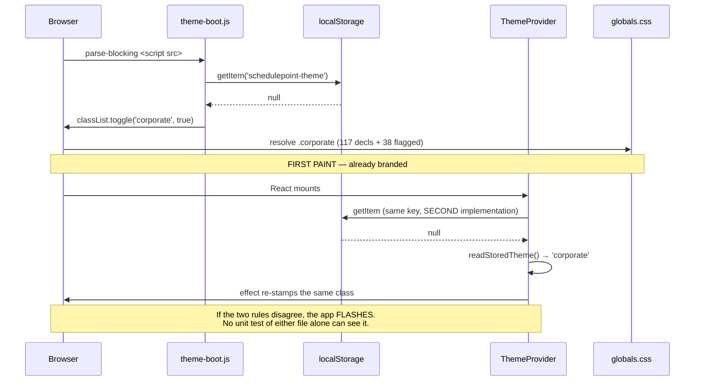
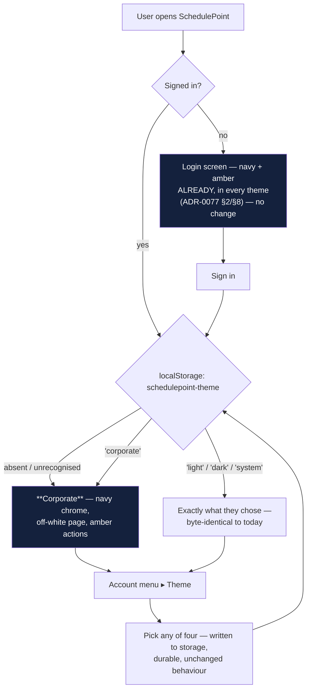

# Feature Spec: The corporate brand — making the palette the product's default identity

- **Status:** Draft — awaiting approval
- **Author(s):** feature-analyst (Product Owner / Solution Architect / Technical Lead hats)
- **Date:** 2026-08-18
- **Tracking issue / epic:** _(none yet)_
- **Roadmap link:** _(none — arrived as a direct product-owner request, 2026-08-18)_
- **Related ADR(s):** ADR-0055 (surface scopes), ADR-0077 (`brand`/`auth` scopes, the pinned
  login), ADR-0083 (readable-not-disabled, and the contrast trap), ADR-0088 (a `VITE_` flag is
  not an operator rollback), ADR-0058/ADR-0076 (verify the claim). **Proposes ADR-0097.**
- **Companion measurement:** [`measurements.md`](./measurements.md) — the old Flask app's
  palette, read from its stylesheets.

---

## 0. The finding that changes this epic — verified, and where the brief was wrong

The product owner asked for "a corporate style built on blue/orange, used consistently across
the page", and said the old Flask app "looked a lot more polished".

**The requested palette already exists in this repository, is already complete, and is already
gated. It is simply not what anybody sees.**

Everything below was established by reading the code, not by trusting the brief (ADR-0076 §19.10
— and the brief that started this epic is itself checked, because both recorded Class 3 failures
entered through one).

### 0.1 What is already built

| Claim                                                                | Verdict       | Evidence                                                                                                                                                                                                                                                                                       |
| -------------------------------------------------------------------- | ------------- | ---------------------------------------------------------------------------------------------------------------------------------------------------------------------------------------------------------------------------------------------------------------------------------------------- |
| A `.corporate` theme exists carrying the exact requested palette     | **Confirmed** | `apps/web/src/styles/globals.css:508-730`. Its own docblock (`:492`) names the source values: navy `#14213D`, amber `#fca311`, lighter navy `#1f3661`, off-white `#f8f9fa`, body `#333` — identical to `measurements.md`'s table.                                                              |
| Amber vs. the canvas's meaning-bearing palette is resolved           | **Confirmed** | `globals.css:501-506` states the collision and `:544` moves `--warning` to bronze `oklch(0.56 0.115 55)`. The collision is real: `render/palette.ts:26-28` binds `bar → --color-primary` and `nearCritical → --color-warning`.                                                                 |
| The two 2.02:1 failures are handled by **placement**, not re-tinting | **Confirmed** | Amber (`oklch(0.786 0.167 70)`) appears as `--chrome-primary` (`:596`), `--chrome-ring` (`:605`), `--panel-primary` (`:616`), `--brand-primary` (`:658`) and `--chart-1` (`:558`). The page's `--primary` is brand navy (`:524`) and the page `--ring` is navy (`:554`).                       |
| It is already swept by the computed contrast matrix                  | **Confirmed** | `apps/web/src/test/css-blocks.ts:58` — `THEME_SELECTORS = [':root', '.dark', '.corporate']`. `styles/token-contrast.test.ts:155-157` runs 3 themes × 2 flag states × 5 scopes. `styles/token-architecture.test.ts:142` sweeps the same three for family completeness.                          |
| Corporate is scanned by axe in a real browser                        | **Confirmed** | `apps/web/e2e-designed-ui/designed-ui.spec.ts:31` includes `corporate`; its own CI step is `.github/workflows/ci.yml:435`. **Scope limit — see §0.4.**                                                                                                                                         |
| It is default-off and reachable only by an explicit pick             | **Confirmed** | `apps/web/public/theme-boot.js:24-25` (`corporate` only when `stored === 'corporate'`); `apps/web/src/hooks/use-theme.tsx:32-38` (`readStoredTheme()` returns `'system'` for anything unrecognised or absent). The only writer is the account menu (`components/layout/account-chip.tsx:197`). |

**Token count, recounted rather than quoted:** `.corporate` declares **117** custom properties —
6 page surfaces, 8 brand/interactive, 12 status, 3 line/focus, 5 chart, **72** across the four
surface families (chrome/panel/brand/auth, 18 each), 3 field, 2 canvas, 2 ground, 3 grid, 1 hatch
— plus **38** more in the two flag-keyed layers (`[data-designed-chrome].corporate:962-1007`,
`[data-canvas-visual-language].corporate:1013-1016`). **155 declarations in total.**

### 0.2 Where the brief was wrong (three corrections)

1. **"~34 tokens in the `brand`/`auth` scopes."** It is **36** — two families of 18
   (`token-architecture.test.ts:26-56` lists 18 `FAMILY_TOKENS`; `ADR-0077 §9` added the
   eighteenth). Trivial, but it is the number that decides how much work a value change is.

2. **"`readStoredTheme` has no way to distinguish 'chose system' from 'never chose'."** True of
   the **function's return value**, false of the **stored state**. `use-theme.tsx:34` reads the
   raw string first; `localStorage` holds `null` for "never chose" and the literal `'system'` for
   "chose System". `setTheme` (`:70-73`) is the only writer and is called only from
   `account-chip.tsx:197` — a menu item. **So the migration is discriminating, not blanket**, and
   that materially changes §2's answer about existing users. This is the single most important
   correction in this document.

3. **"So a theme change may not reach the front door at all."** It does not, and that is already
   **correct and already delivering the brand there**. `AuthShell` (`components/layout/auth-shell.tsx:58`)
   renders `tone="auth"` and `BrandPanel` (`components/layout/brand-panel.tsx:44`) renders
   `tone="brand"`; both families are theme-invariant navy + amber by ADR-0077 §2/§8. **The login
   screen is already the corporate brand in every theme.** The front door is the one surface that
   needs no work at all — see §0.5.

### 0.3 So what is actually wrong

**Nothing in the palette. The default.** A user who has never opened Account ▸ Theme gets
`system`, which resolves to the generic grey/blue Light or the generic near-black Dark. Corporate
is four clicks away behind an avatar, labelled with a word that sounds like a customisation
option rather than the product's identity.

The product owner has been judging SchedulePoint on a theme that was never meant to be its
identity — while its identity sat finished, measured and gated in the same file.

### 0.4 The gaps that are genuinely open (found by looking, not assumed)

Four, and each is cheap. None is a palette problem; three are **gate** problems and one is a
**documentation** problem.

- **G1 — the canvas criticality triple is not gated in Corporate.** `globals.css:501-506` argues
  that bronze keeps three readable bar states, and **no test computes it**.
  `features/tsld/render/palette.test.ts:223-285` runs its progress-ink and 1.4.11 fill suites over
  `light` and `dark` only; `corporate` appears in that file exactly twice, both in the data-date
  suite (`:318-324`). The claim ADR-0055 and `DESIGN_SYSTEM.md` §185 both rest on is prose.
- **G2 — two solid fills are absent from the contrast matrix.**
  `token-contrast.test.ts`'s `TEXT_PAIRS` (`:86-120`) covers `--primary`, `--success`, `--warning`
  and `--info` against their `-foreground` partners, and **not `--destructive` or `--secondary`**.
  `NON_TEXT_PAIRS` (`:123-153`) covers `--background`/`--primary` and **not `--background`/`--destructive`**.
  A Delete button's label on its own fill is unasserted in **every** theme, not only Corporate.
- **G3 — `--secondary` is not a rebound name**, so inside a surface scope `bg-secondary` keeps the
  **page** theme's value (`token-architecture.test.ts:83-102` — `REBOUND_NAMES` has 18 entries and
  `--secondary` is not one). In Corporate the page `--secondary` is the lighter navy `#1f3661`; on
  the navy chrome band that is a ~1.4:1 fill difference. **Verified as latent, not live:** the four
  real scope sites are `chrome-band.tsx:39`, `app-header.tsx:136`, `navigator-rail.tsx:45,136` /
  `app-shell.tsx:125`, `brand-panel.tsx:44` and `auth-shell.tsx:58`, and no `variant="secondary"`
  or `bg-secondary` consumer renders inside any of them today. It is a trap of exactly the
  ADR-0055 §1 class ("a family is complete or it is a trap"), waiting for the first toolbar button
  that reaches for it.
- **G4 — `DESIGN_SYSTEM.md` contradicts itself and the code.** §230 says "There are three scopes"
  and lists three, then §267 says "There are **five** scopes"; §246 says "a complete **17**-token
  family" while the gate asserts **18** (`token-architecture.test.ts:26-56`) and `CLAUDE.md`'s
  ADR-0077 entry calls `--success-text` "the **eighteenth** rebound name". `globals.css` repeats
  "the 17-name vocabulary" three times (`:249`, `:466`, `:716`). ADR-0058 Class 1 drift.

### 0.5 What the old app's "polish" is, beyond colour

`measurements.md` records an 8px radius, a three-step shadow scale and a 0.2s transition. Checked
against this application:

| Old app                    | This application                                                              | Verdict                                                                                                          |
| -------------------------- | ----------------------------------------------------------------------------- | ---------------------------------------------------------------------------------------------------------------- |
| `--border-radius: 8px`     | `--radius: 0.625rem` (10px); `radius-md` = **8px**, used by inputs/buttons    | **Already matched.** `DESIGN_SYSTEM.md:106-110`.                                                                 |
| Three-step shadow scale    | Five levels documented (`DESIGN_SYSTEM.md:112-124`), **10 uses in 989 files** | **A real difference**, and a deliberate one: the same section says "prefer `border` + low elevation". See below. |
| `--transition-speed: 0.2s` | `150/200/300ms` documented (`DESIGN_SYSTEM.md:126-134`)                       | **Already matched.**                                                                                             |
| Roboto                     | Inter + system fallback                                                       | **Deliberately unchanged** — `DESIGN_SYSTEM.md:225-228` records swapping the typeface per theme as rejected.     |

The elevation difference is the only non-colour candidate with substance: the old app raised cards
and panels off the page, and this one draws them with borders. That is a **defensible existing
decision, not an omission**, and it is documented as one. It is scoped out of this epic's default
(§1 CQ-3) rather than smuggled in as "polish".

**What actually reads as unpolished in the current default is not radius or shadow.** It is that
`:root` binds `--background` and `--card` to the same white (`globals.css:38,40`) — so in the
default theme a card is separated from the page by a 1px border and nothing else. **Corporate does
not have this problem**: its page is off-white `oklch(0.982 0.002 248)` and its card is white
(`:510,512`). Turning Corporate on is itself the fix for the complaint.

---

## 1. Business understanding

### Problem

SchedulePoint has a designed corporate identity — navy chrome, amber action, off-white working
surface — that is complete, contrast-gated and shipped, **and effectively invisible**. It is
default-off and reachable only through an avatar menu whose label ("Corporate") reads as an
optional skin. Every user who has not gone looking for it, including the product owner, judges the
product on a generic grey/blue theme that was never intended to be its face.

**Why now:** the product owner has asked for the brand directly, and has (twice) formed an
impression of the application from a theme that is not it. There is no more expensive kind of
misunderstanding than one about what the product looks like.

### Users

Every authenticated role — **Org Admin, Planner, Contributor, Viewer** — sees the same chrome, so
this is not role-differentiated. **External Guest** (the per-plan share view, ADR-0051) also
renders on the page scope and is affected. The **signed-out visitor** is _not_ affected, because
ADR-0077 already gives them the brand unconditionally.

No permission changes. Nothing in this epic is gated on a role, on the ADR-0028 pen, or on
organisation scope.

### Primary use cases

1. A user opens SchedulePoint for the first time and **meets the brand**, not a generic theme.
2. A user who has explicitly chosen Light, Dark or System **keeps what they chose**.
3. A user who dislikes the brand switches away in two clicks, exactly as today.
4. A reviewer can prove — by computation, not by eye — that the brand's colours are lawful on the
   canvas as well as in the chrome.

### User journeys

- **Happy path (new user):** first load → `theme-boot.js` finds no stored preference → stamps
  `.corporate` → the app paints navy chrome, off-white page, amber actions → the account menu shows
  Corporate ticked.
- **Alternate (returning user who chose a theme):** first load → stored value is `light`/`dark`/
  `system` → boot behaves **exactly as today** → nothing about their app changes.
- **Alternate (opt-out):** Account ▸ Theme ▸ Light → stored → applied → persists.
- **Alternate (signed out):** unchanged in every case — the login screen is theme-invariant.

### Expected outcomes

- The product's identity is what the product looks like, rather than an option inside it.
- The login screen and the application become **one identity** for the first time. Today a user who
  signs in from the navy+amber front door lands in a grey/blue app; ADR-0077 §8.3's own complaint
  ("one screen wearing two identities") currently applies to the **transition**, one step out.
- Two claims the design system asserts in prose become computed gates (G1, G2).

### Success criteria

1. A browser with cleared storage loads the app and `document.documentElement` carries
   `class="corporate"` — asserted in a Playwright journey, not by looking.
2. Each of the five storage states (`null`, `light`, `dark`, `system`, garbage) resolves to the
   specified theme — asserted in **both** `theme-boot.test.ts` and `use-theme.test.tsx`, because
   they are two files with no compiler relationship (ADR-0074's lesson about exactly this shape).
3. `token-contrast.test.ts` and `palette.test.ts` pass with G1 and G2 closed, and each new
   assertion was **verified red first** against the pre-change values where it can be.
4. The four-theme axe sweep (`e2e-designed-ui`) is green, extended to at least the plan workspace
   (§3, Testing).
5. The product owner opens the deployed app and sees the brand without touching a menu.

### Open questions

Marked **CRITICAL** where the answer changes the design or scope. Everything else has a stated
default and is not blocking.

> **CQ-1 (CRITICAL) — Does Corporate become the default for users who have never chosen a theme?**
>
> This is the whole epic. It is a product decision, not a design one, and it is a visible change to
> every authenticated screen for every such user.
>
> **Recommended default: yes**, with the migration rule in §4.2 (never-chose → Corporate; every
> explicit choice honoured unchanged).

> **CQ-2 (CRITICAL) — A user whose OS says `prefers-color-scheme: dark` and who has never chosen:
> Corporate (light) or Dark?**
>
> Corporate resolves as a **light** scheme (`use-theme.tsx:57-58`). Flipping unconditionally means a
> dark-OS user who never chose is moved from a dark app to a light one. That is the largest single
> cost in this epic and it does not appear in the brief.
>
> - **(a) Flip unconditionally.** Consistent with ADR-0077 §2's own reasoning, which treats an
>   OS-derived dark theme as "selected by something the visitor did not do". Escape is two clicks.
> - **(b) Honour a dark OS.** Never-chose + dark OS keeps Dark; never-chose + light OS gets
>   Corporate. Respects an expressed preference — but then the users most likely to care about
>   appearance never see the brand, which half-answers the request.
>
> **Recommended default: (a), with a Corporate Dark theme named as the follow-on** that closes the
> gap properly rather than pushing a dark-preferring user onto an unbranded theme. If (b) is chosen,
> §4.2's rule gains one clause and nothing else changes.

> **CQ-3 (CRITICAL) — Is the end state one brand, or a brand beside generic themes?**
>
> The request says "used consistently". A picker where three of four options are **not** the brand
> is not consistency; it is a brand plus three ways to leave it.
>
> - **(a) Status quo shape.** Corporate is the default; Light/Dark/System stay as generic
>   alternatives. Cheapest, ships now, no new tokens.
> - **(b) The brand replaces the schemes.** Corporate becomes the light identity and a new
>   **Corporate Dark** replaces the generic Dark; the picker becomes Light / Dark / System over one
>   brand. This is ~117 new declarations plus a full contrast sweep — a real milestone, not a tweak.
>
> **Recommended default: (a) now, (b) as M3, scoped and costed but not committed.** Shipping (a)
> first is what lets the product owner judge the brand on a real screen before paying for (b).

Non-critical, decided by default:

- **The login screen changes nothing.** It is already the brand and is deliberately pinned
  (ADR-0077 §2/§8). Making Corporate the default **strengthens** that decision — the front door and
  the app finally agree — and touching it would undo a decision two ADRs took on purpose.
- **No new `VITE_` flag.** Reasoning in §4.5; it is ADR-0088's finding, not a preference.
- **No elevation/radius/type changes.** §0.5. Reopened only by CQ-3(b) or an explicit ask.
- **The picker keeps the label "Corporate."** Renaming it to "SchedulePoint" or "Brand" is
  cosmetic, and if CQ-3(b) is taken the picker's shape changes anyway.

---

## 2. Functional requirements

### User stories & acceptance criteria

> **US-1** — As a **new user**, I want the application to look like SchedulePoint the first time I
> open it, so that I never form an impression of the product from a theme that is not its identity.
>
> **Acceptance criteria**
>
> - **Given** `localStorage` holds no `schedulepoint-theme` key, **when** the app loads, **then**
>   `<html>` carries `class="corporate"` before first paint and carries neither `dark` nor a bare
>   `:root` presentation.
> - **Given** the same, **when** the account menu is opened, **then** **Corporate** is the ticked
>   option (`aria-checked`/`selected`), so the state on screen matches the state in effect.
> - **Given** the same and `prefers-color-scheme: dark`, **then** the resolved theme follows the
>   CQ-2 answer, and the chosen behaviour is asserted by name in `theme-boot.test.ts`.

> **US-2** — As an **existing user who chose a theme**, I want my choice honoured, so that a release
> never silently repaints my application.
>
> **Acceptance criteria**
>
> - **Given** the stored value is `light`, `dark` or `system`, **when** the app loads, **then** the
>   resulting theme is byte-identical to today's for that value. Three separate assertions, not one
>   parametrised pass — `system` is the one most easily conflated with "never chose".
> - **Given** the stored value is unrecognised (e.g. `neon`), **when** the app loads, **then** it
>   resolves to the new default and does not throw (`use-theme.test.tsx:93` already covers the
>   throw-free half).
> - **Given** `localStorage` is unavailable (private mode), **when** the app loads, **then** the boot
>   script does not throw and the app renders — the existing `theme-boot.test.ts:95-108` case, whose
>   expected class **changes** with this epic and must be updated deliberately, not incidentally.

> **US-3** — As **any user**, I want to leave the brand in two clicks, so that the default is a
> default and not a lock-in.
>
> **Acceptance criteria**
>
> - **Given** Corporate is in effect by default, **when** I pick Light, **then** `light` is written
>   to storage and survives a reload — i.e. an explicit choice out of the default is as durable as
>   an explicit choice into it.

> **US-4** — As a **planner reading the diagram**, I want an ordinary bar, a near-critical bar and a
> critical bar to remain three distinguishable things in the brand theme, so that the picture does
> not start saying something it does not mean.
>
> **Acceptance criteria**
>
> - **Given** the Corporate palette, **when** the criticality fills are computed, **then**
>   `--primary` (navy), `--warning` (bronze) and `--destructive` (red) are mutually distinguishable
>   and each clears 3:1 against the Corporate canvas ground — **in both flag states**, because
>   `[data-canvas-visual-language].corporate:1013-1016` changes that ground.
> - **Given** the same, **then** each fill's paired label ink clears 4.5:1 on its own fill.
> - Asserted in `render/palette.test.ts` alongside the existing light/dark suites, using the same
>   token-mirror convention that file already uses (`:296-298`).

> **US-5** — As a **reviewer**, I want every solid fill's label pair computed, so that "the palette
> is gated" is true rather than nearly true.
>
> **Acceptance criteria**
>
> - `--destructive`/`--destructive-foreground` and `--secondary`/`--secondary-foreground` are in
>   `TEXT_PAIRS`; `--background`/`--destructive` is in `NON_TEXT_PAIRS`.
> - If any fails in any theme, it is **reported and fixed as a defect of that theme**, not worked
>   around by narrowing the assertion. (Light's `--destructive` at `oklch(0.577 0.245 27.325)` with
>   `oklch(0.985 0 0)` ink is the one expected to be close; it is measured, not guessed.)

> **US-6** — As a **maintainer**, I want the design system to describe the system, so that the next
> person to add a scope is not working from a contradiction.
>
> **Acceptance criteria**
>
> - `DESIGN_SYSTEM.md` says five scopes once, 18 tokens everywhere, and the three "17-name
>   vocabulary" comments in `globals.css` are corrected.

### Workflows

**W1 — first load, no stored preference**

1. `index.html` parser-blocks on `/theme-boot.js`.
2. The script reads `schedulepoint-theme` → `null`.
3. Under the new rule it stamps `.corporate` (CQ-2 may add a `prefers-color-scheme` branch).
4. `globals.css`'s `.corporate` block resolves 117 declarations; `[data-designed-chrome].corporate`
   and `[data-canvas-visual-language].corporate` layer 38 more (both flags are default-on —
   `config/env.ts:847,873`).
5. React mounts; `ThemeProvider` reads storage with the **same** rule and agrees with the class
   already on `<html>`. **If the two rules disagree, the app flashes.** That is the failure mode this
   epic must gate against, and it is the one a unit test of either file alone cannot see.

**W2 — theme change** — unchanged. `setTheme` writes storage and toggles the class
(`use-theme.tsx:60-73`).

**W3 — signed-out** — unchanged. `AuthShell`/`BrandPanel` are theme-invariant.

### Edge cases

| Case                                                | Expected behaviour                                                                                                                                                                                |
| --------------------------------------------------- | ------------------------------------------------------------------------------------------------------------------------------------------------------------------------------------------------- |
| `localStorage` throws (private mode, some webviews) | Boot does not throw; the app renders. **The fallback class changes from "none" to `.corporate`** — a deliberate edit to `theme-boot.js:28-30` and its test, not a side effect.                    |
| Stored value is garbage                             | Treated as never-chose → the new default. Already the behaviour of both readers.                                                                                                                  |
| Two tabs open, theme changed in one                 | Unchanged (no `storage` listener today). Out of scope; not a regression.                                                                                                                          |
| A user has `system` stored **and** their OS is dark | Keeps Dark. This is the case the brief said was indistinguishable and is not — see §0.2.2.                                                                                                        |
| Guest share view (`/share`, ADR-0051)               | Renders on the page scope, so it follows the guest's own storage. A guest who has never used the app gets the brand — which is desirable and should be stated, since a guest is often the client. |
| Print / PDF export                                  | `resolvePrintPalette()` (`render/palette.ts:194-245`) is a **light-forced** palette independent of the theme. Unaffected — verified: it resolves its own tokens with light fallbacks.             |
| Canvas painter with no computed tokens (jsdom)      | Documented fallbacks, unchanged (`palette.test.ts:62-76`).                                                                                                                                        |

### Permissions

**None.** No RBAC touch, no organisation scope, no ADR-0028 pen. The theme is a per-browser client
preference in `localStorage`; nothing is persisted server-side and no endpoint is called. Stated
explicitly because the process asks, not because there is a decision here.

### Validation rules

One, and it already exists: the stored theme must be one of `light | dark | system | corporate`,
enforced in two places (`use-theme.tsx:35-37`, `theme-boot.js:24-25`). This epic **changes the
fallback branch of both** and must keep them in agreement. No server-side validation exists or is
needed.

### Error scenarios

| Scenario                                               | Detection                                     | User-facing result                   | Status |
| ------------------------------------------------------ | --------------------------------------------- | ------------------------------------ | ------ |
| Boot script and provider disagree on the default       | New cross-file test (§4.3)                    | _prevented_ — would be a theme flash | n/a    |
| `localStorage` inaccessible                            | `try/catch` in `theme-boot.js:21-30`          | App renders in the default theme     | n/a    |
| A Corporate token pair fails contrast                  | `token-contrast.test.ts` / `palette.test.ts`  | _prevented_ — CI red                 | n/a    |
| A journey asserts a colour that the default flip moves | The 33 Playwright suites, run before the flip | _prevented_ — CI red                 | n/a    |

There are no HTTP errors in this feature because there are no requests.

---

## 3. Technical analysis

| Area               | Impact     | Notes                                                                                                                                                                                                                                    |
| ------------------ | ---------- | ---------------------------------------------------------------------------------------------------------------------------------------------------------------------------------------------------------------------------------------- |
| **Frontend**       | **Medium** | Two files change behaviour (`public/theme-boot.js`, `hooks/use-theme.tsx`); a handful of docs/comments change text. **No component, route, form or state change.** The visual delta is entirely CSS cascade.                             |
| **Backend**        | **None**   | No module, service or endpoint. Verified: the theme never leaves the browser — `THEME_STORAGE_KEY` (`config/env.ts:19`) has exactly three readers, all client-side.                                                                      |
| **Database**       | **None**   | No model, column, index, constraint or migration. **The database-architect agent is therefore not engaged, because there is no schema change to design** — not because one was judged too small (CLAUDE.md §19.3 / ADR-0091's phrasing). |
| **API**            | **None**   | No endpoint, DTO, OpenAPI or `@repo/types` change.                                                                                                                                                                                       |
| **Security**       | **None**   | No auth, no input, no secret. The CSP is untouched — `theme-boot.js` stays a served file in `public/` for the ADR-0074 reason, and nothing inline is added.                                                                              |
| **Performance**    | **None**   | The boot script's work is unchanged in shape (one `getItem`, one `matchMedia`, two `classList.toggle`). `.corporate` is already in the bundled CSS whether it is applied or not, so there is **no bundle delta at all**.                 |
| **Infrastructure** | **None**   | No env var, no compose change, no CI service. One or two new CI steps if a journey is added.                                                                                                                                             |
| **Observability**  | **None**   | No log, metric or trace. Nothing to correlate.                                                                                                                                                                                           |
| **Testing**        | **High**   | This is where the epic's weight sits. See below.                                                                                                                                                                                         |

### The CPM engine and the recalculation parity gate

**The CPM engine is not imported and no migration runs.** This is frontend styling and one
client-side default; there is no code path from any of it into `computeSchedule`, and no
scheduling input is added, removed or defaulted. The ADR-0034 parity gate is untouched **by
construction** — in its honest form: there is nothing here to hold parity for.

### Testing — what actually has to be proved

1. **The two-file seam.** `theme-boot.js` and `use-theme.tsx` implement the same rule in two
   languages with no compiler relationship. ADR-0074 records this exact shape failing (an inline
   script pinned by hash across two files, "no compiler relationship", failing closed and silently).
   A test that reads **both** and asserts they agree on all five storage states is the gate.
2. **G1** — the Corporate criticality triple, in both canvas flag states.
3. **G2** — the two missing solid pairs, across all three themes.
4. **The 33 existing journeys.** None of them sets a theme (verified: zero matches for
   `schedulepoint-theme` under `apps/web/e2e*/`, and no `playwright*.config.ts` pins one). They all
   run in **whatever the default is** — so flipping the default silently changes what every one of
   them renders. They must be **run**, not reasoned about. ADR-0091's retrospective records three
   journeys breaking across one layout change, each found by CI rather than by the author, and the
   rule it wrote down: after a change like this, run every journey.
5. **Corporate's axe coverage is narrower than it looks.** `e2e-designed-ui` scans the **app shell
   plus a client list** (`designed-ui.spec.ts:45-49`) — the header, the rail, a table. It does not
   reach the plan workspace, the canvas, the toolbar, a dialog, the Gantt or the activity editor. So
   "Corporate is axe-scanned" is true and much weaker than it sounds. If Corporate becomes what
   everyone sees, that sweep should reach at least the plan workspace.

### Dependencies

- **Prerequisite: none.** Every token this epic relies on is already shipped and gated.
- **Affected features:** every authenticated screen; the guest share view; the four-theme a11y
  suite; the 33 flag-on journeys (as renderers, not as subjects).
- **Blocked by nothing.** Blocks nothing.
- **Ordering that is load-bearing:** the gates (G1, G2) land **before** the default flips.
  `measurements.md` §"Two things to gate rather than hope" states this rule for value changes, and
  ADR-0083 records why it matters — a pair added after the fact is a pair that shipped unchecked.

---

## 4. Solution design

### 4.1 Architecture overview

Nothing new is built. One branch changes, in two files, at the bottom of a cascade that already
exists.

**The only two boxes this epic edits are amber.** Everything downstream — 117 declarations, four
surface families, the canvas painter, every component — already handles Corporate correctly and is
already gated for it.

### 4.2 The migration rule

The rule is discriminating because the storage state is discriminating (§0.2.2).

| Stored value              | Today                    | After (CQ-2 = a) | After (CQ-2 = b)                               |
| ------------------------- | ------------------------ | ---------------- | ---------------------------------------------- |
| `null` (never chose)      | `system` → Light or Dark | **`corporate`**  | **`corporate`** if OS light, `dark` if OS dark |
| `'system'` (chose System) | Light or Dark, live      | **unchanged**    | **unchanged**                                  |
| `'light'`                 | Light                    | **unchanged**    | **unchanged**                                  |
| `'dark'`                  | Dark                     | **unchanged**    | **unchanged**                                  |
| `'corporate'`             | Corporate                | **unchanged**    | **unchanged**                                  |
| garbage (`'neon'`)        | `system`                 | **`corporate`**  | as `null`                                      |

**Who actually moves:** only users who never opened Account ▸ Theme. On this installation that is
believed to be everyone including the product owner — but it is a **belief about a browser's
storage, not a fact this repository can read**, and the spec says so rather than asserting a
population figure it cannot establish.

**What it costs them:** a visibly different application on next load, with no announcement. That is
the honest cost of the flip and it is exactly what the product owner is asking for. The escape is
the menu that already exists.

**What it does NOT do:** it never overwrites a stored value. `setTheme` remains the only writer
(`use-theme.tsx:70-73`), so this epic cannot destroy a preference — it can only decide what happens
in the absence of one.

### 4.3 The seam that must be gated

The gate: one test that reads **both** implementations and asserts the same mapping for all five
storage states, plus the two `prefers-color-scheme` values. `theme-boot.test.ts:25` already reads
the real served file from disk and evaluates it — the mechanism exists; it just has to be pointed at
the provider's rule as well.

### 4.4 User flow

Note what the diagram makes obvious and prose does not: **after the flip, C and F are the same
colour.** The front door and the application become one identity. Today they are two, and the
seam is invisible because nobody looks at a sign-in screen and an app shell side by side.

### 4.5 Feature flag — deliberately none

Every user-visible surface since ADR-0030 has landed behind a `VITE_*` flag, default-off, with
parity suites. **This one does not**, and the argument is stronger here than in ADR-0061 or
ADR-0077 §5:

1. **A `VITE_` flag is not a rollback for the operator, and never has been** (ADR-0088). Vite
   inlines `import.meta.env.VITE_*` at build time; `apps/web/Dockerfile` declares one `VITE_` build
   arg, `docker-publish.yml` passes none, and `.dockerignore` strips `**/.env` from the build
   context. A flag here would buy a rollback nobody can use.
2. **There is a real rollback, and it is better than a flag: the picker.** Any user who dislikes the
   brand changes it in two clicks, per-user, instantly, with no release. No flag can offer that.
3. **The engineering rollback is one `git revert` of one commit** — the ADR-0077 §5 mitigation, and
   it is exact here: the flip is a branch in two files.
4. **A flag would add a Class A alternative surface**, which ADR-0088 D3 caps at a measured count
   that ratchets **down**. Adding one to gate a default value would spend that budget on the
   cheapest-to-revert change in the epic.

### 4.6 Database changes

**None.** No model, column, index, constraint or data migration. Nothing is persisted server-side.

### 4.7 API changes

**None.** No endpoint, no DTO, no OpenAPI delta, no `@repo/types` change.

### 4.8 Component changes

**None required by the flip.** That is the load-bearing property of ADR-0055's design and the
reason this epic is small: components reference semantic names, the names are already right, and
`.corporate` already binds all 117 of them.

Two **optional** component-adjacent items, both of which are documentation or tests rather than
behaviour:

- `account-chip.tsx:24-30` — the `THEME_META` labels. Unchanged by default (§1). Only CQ-3(b)
  reshapes the picker.
- `DESIGN_SYSTEM.md` §185 "Corporate theme" — reframed from "a fourth picker entry" to "the
  product's default identity", and its 17/18 and three/five contradictions repaired (G4).

### 4.9 Implementation approach & alternatives

**Chosen: flip the default, close the four gaps, prove it with the journeys that already exist.**

The approach is deliberately anti-climactic. The palette does not change. The tokens do not change.
No CSS is written in M0 or M1 at all. What changes is one branch and four gates.

**Alternatives considered:**

- **Re-derive the palette from `measurements.md` and re-bind the tokens.** This is what the brief
  implies and what a plan written without reading `globals.css` would produce. **Rejected: the work
  is already done**, to a higher standard than a fresh pass would reach (`--auth-ring` and
  `--auth-input` are already derived rather than sampled precisely because the old app's own values
  fail 1.4.11 — ADR-0077 §8). Redoing it would risk reintroducing the two 2.02:1 failures that
  ADR-0077 M7 found and fixed, and `measurements.md` §"Two things to gate" would have been
  satisfied by a gate that already exists.
- **Promote amber to the page's `--primary`.** The literal reading of "orange is the action colour"
  from `measurements.md`. **Rejected, and already rejected in code with the measurement:** amber on
  the off-white page is 1.92:1 (`globals.css:517-523`), failing the 3:1 that WCAG 1.4.11 asks of a
  fill that identifies a control, and darkening it to reach 3:1 lands on the bronze `--warning`
  already occupies. `measurements.md` itself concedes the distinction ("true of orange TEXT and
  false of an orange FILL") — and the shipped theme has taken it one step further, because a solid
  button's fill is also non-text.
- **Add a `theme` column to `users` and persist the preference server-side.** **Rejected:** it turns
  a zero-cost client preference into a schema change, a migration, an endpoint, an audit question
  and a database-architect engagement, to buy cross-device sync that nobody asked for. Revisit if a
  user asks.
- **Ship Corporate Dark in the same epic (CQ-3(b) now).** **Rejected as the default sequencing:**
  ~117 new declarations and a full contrast sweep, in an epic whose central finding is that the
  existing work was never seen. Judge the brand on a real screen first.
- **A `VITE_CORPORATE_DEFAULT` flag.** **Rejected** — §4.5.

### 4.10 Architectural significance — ADR required

Yes. **Proposed ADR-0097: "The brand is the default, not an option."** It records:

- the finding that the palette shipped complete and invisible, and how it was verified;
- the default flip and the migration rule, including the CQ-2 answer;
- the no-flag decision and why a `VITE_` flag would be worse than none here;
- the two-file seam and its gate;
- **an amendment note to ADR-0077 §2**: that decision's premise ("a signed-out visitor cannot choose
  a theme, so pin the panel") is unchanged and its consequence is now _stronger_ — the pinned front
  door and the default application agree, which is the state §8.3 was reaching for one screen out;
- what is **not** decided: the picker's future shape (CQ-3(b)) and the elevation question (§0.5),
  both named with their triggers so they are decisions deferred rather than work forgotten.

**Number risk, recorded rather than assumed:** `docs/adr/` currently tops out at **0096**
(`0096-deleted-work-expires-and-purge-is-refused.md`). ADR-0071 was cited by shipped code for a whole
epic without ever being filed, and ADR-0079 was renumbered because its number was taken between the
plan and the milestone. **Re-check the highest number at filing time and file it in the same commit
that accepts it** — including adding it to `docs/adr/README.md`, which ADR-0078 found missing seven
entries.

---

## 5. Links

- Implementation plan: [`./implementation-plan.md`](./implementation-plan.md)
- Measurements: [`./measurements.md`](./measurements.md)
- Docs this change updates: `docs/DESIGN_SYSTEM.md` (§185 Corporate, §230 Surface scopes, the 17/18
and three/five contradictions), `docs/FRONTEND_ARCHITECTURE.md` (Theme management), `CLAUDE.md`
(§16 ADR list), `docs/adr/README.md`, `docs/adr/0097-*.md` (new), `docs/TECH_DEBT.md` (any
non-blocking findings from the gate pass).
</content>

</invoke>
