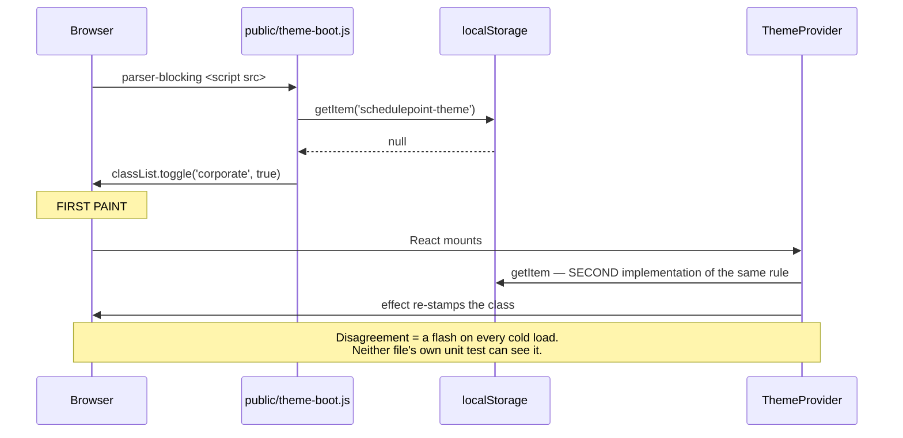

# Feature Spec: Theme contrast gaps and the default flip

> ### 🔴 One live accessibility failure, ahead of everything else in this document
>
> **The hover state of every destructive button fails WCAG 1.4.3 today, in all three themes.**
> `button.tsx:19` lightens the fill to `bg-destructive/90` on hover while the label stays near-white:
> **≈ 4.34:1** composited in gamma sRGB, **≈ 3.32:1** composited in OKLab, against a 4.5:1 bar.
> Every Delete and destructive-confirm control in the product uses this variant.
>
> Neither existing gate can see it — the contrast matrix has **no alpha-variant pairs** and axe
> **"measures no hover … state at all"** (`designed-ui.spec.ts:24`). It is a one-line variant change
> plus a regression test, it depends on no design decision, and **it should ship on its own, ahead of
> the design-system rewrite.** Detail and method in §0.1; sequencing in the plan's Milestone A.
>
> Everything else in G2 **passes** — the numbers are in §0.1's table. The one to watch is Light's
> `--destructive` / `--destructive-foreground` at **4.56:1**, a 1.4% margin that nothing computes.

> **Scope note.** This is **not** the branding epic. The design direction for
> SchedulePoint's themes is being rewritten from the ground up by **ui-architect** in
> [`docs/specs/design-system-rewrite/`](../design-system-rewrite/) — the token vocabulary, the
> surface-scope model, spacing, density, type scale, radius, the elevation model and the accent's
> role are all open there, and that effort will amend or supersede ADR-0055 and ADR-0077.
>
> **This spec owns only the two things that stand on their own regardless of what that rewrite
> decides:** four verified defects/drifts in the shipped product, and the mechanics of making
> Corporate the default theme. It deliberately contains **no design direction and no opinion about
> what "designed" means** — a second document answering that question is how two documents end up
> disagreeing.

- **Status:** Draft — awaiting approval. Twice superseded in scope on 2026-08-18; see §0.
- **Author(s):** feature-analyst
- **Date:** 2026-08-18
- **Related ADR(s):** ADR-0055, ADR-0077, ADR-0074 (the two-file seam), ADR-0088 (a `VITE_` flag is
  not an operator rollback), ADR-0058/ADR-0076 (verify the claim)
- **Parent effort:** `docs/specs/design-system-rewrite/` (ui-architect)
- **Companion measurement:** [`measurements.md`](./measurements.md)

---

## ⚠ 0.1 The G2 answer — asked for first, so it is stated first

**Verdict: G2 is a real gate hole, and — at rest — not a live failure. One state is a live failure,
and it is not the one anybody was looking for.**

The three pairs missing from `token-contrast.test.ts` were computed for all three themes:

| Pair                                                        | Light      | Dark       | Corporate | Bar          | Verdict    |
| ----------------------------------------------------------- | ---------- | ---------- | --------- | ------------ | ---------- |
| `--destructive` / `--destructive-foreground` (button label) | **4.56:1** | 5.87:1     | 6.21:1    | 4.5 (1.4.3)  | **passes** |
| `--secondary` / `--secondary-foreground` (button label)     | 16.42:1    | 14.48:1    | 11.44:1   | 4.5 (1.4.3)  | passes     |
| `--background` / `--destructive` (the fill vs. the page)    | 4.77:1     | **3.23:1** | 6.15:1    | 3.0 (1.4.11) | passes     |

**So the Delete button's label is legible today.** The first draft of this spec flagged it as a
"plausible sub-4.5:1 pair" and that was a guess; it is not one. But two things fall out of computing
it, and the second is the finding.

**Finding A — Light's destructive pair passes by 1.4%.** 4.56:1 against a 4.5 bar. Nothing computes
it, so any future nudge to that red — a brand pass, a gamut fix, a designer's eye — breaks WCAG
1.4.3 on every Delete button in the product, silently, with a green CI. Dark's fill-vs-page pair at
3.23:1 has the same shape against the 3.0 bar. **This is exactly what the missing assertions are
for**, and it is a stronger argument for adding them than a failure would have been: a failure gets
fixed once, a 1.4% margin nobody measures is a trap that stays armed.

**Finding B — the hover state of the destructive button appears to FAIL 1.4.3, and it is live.**
`button.tsx:19` is `bg-destructive text-destructive-foreground hover:bg-destructive/90`. The hover
fill is 90% destructive composited over the surface behind it, which in the Light theme is white —
so hovering _lightens_ the fill while the label stays near-white:

- composited in gamma sRGB: **≈ 4.34:1**
- composited in OKLab (Tailwind v4's `color-mix(in oklab, … 90%, transparent)`): **≈ 3.32:1**

**Both are below 4.5:1**, so the conclusion is robust to the compositing model even though the
figure is not. The equivalent hover on the `default` variant (`bg-primary/90`) computes to ≈ 4.90:1
and survives; `destructive` is the variant that does not, because its base margin was 1.4%.

**Why nothing has caught this, and why nothing currently can.** The contrast matrix resolves token
values and has **no alpha-variant pairs at all** — `hover:bg-destructive/90` is a Tailwind utility,
not a token, and is invisible to it. And the repository's own axe suite states the other half in its
docblock: _"axe measures no hover or `aria-current` state at all"_ (`designed-ui.spec.ts:22-24`). So
this sits in the exact blind spot between the two gates that exist, in **every theme**, on the one
control class where being wrong matters most.

### What this means for sequencing

- **Finding B is a shipped accessibility defect on a control users press.** CLAUDE.md §13 calls WCAG
  2.2 AA a merge requirement, so this is the project's own claim about itself being false in
  production. **It should go out on its own, ahead of everything else in this spec and ahead of the
  design-system rewrite** — it is a one-line variant change plus a regression test, and it does not
  depend on any design decision. Milestone A.
- Finding A and the rest of G2 are the gate that would have caught B's precondition. Milestone B.
- **Both are inputs to `docs/specs/design-system-rewrite/`**: whatever that effort does to the
  status colours, it must land on top of a matrix that asserts these pairs, and it must decide how
  hover/alpha states are gated at all. Recorded here so it is not rediscovered.

### How these numbers were produced, and their standing

**Hand-computed**, by applying the repository's own `oklchToLuminance` implementation
(`features/tsld/render/palette.test.ts:198-217` — the OKLab→linear-sRGB matrix with gamut clamping,
then WCAG relative luminance) to the token values in `globals.css`, in this session. **No test was
run**: the analyst has no execution tool here.

They are therefore **evidence, not proof**, and every one of them must be re-derived by the
assertions in M-B before anything is concluded from them (ADR-0076: a decision-bearing claim names
what established it, and this one names its own weakness). The three sanity checks that were
available all agree: the derived sRGB for Light's `--destructive` is `#E7000B`, which is the
expected Tailwind red; Corporate's secondary at 11.44:1 matches `measurements.md`'s independently
measured 11.94:1 for `#1f3661` on white; and Corporate's destructive at 6.21:1 matches
`DESIGN_SYSTEM.md:221-223`'s stated 6.1:1.

**If M-B's run disagrees with any figure above, the run wins and this section is corrected in
place.**

---

## 0.2 How this spec got here

Two scope changes in one day, recorded because the process asks for what was found wrong, not only
what changed.

1. **First draft** concluded the epic was "a decision plus verification" — the palette exists and is
   complete, it is simply default-off. That answered the question the **code** raised rather than the
   one the product owner **asked**; they already knew it existed. ADR-0076 Class 3, and it had
   reached a spec, a plan and a summary before anyone checked it against the person who asked.
2. **Second draft** rebuilt it as a design epic on the product owner's correction ("it looks and
   feels like a badly designed skin"). That was closer, and still too small: the mandate then widened
   to a ground-up rewrite of the theme and design, which is an architecture decision with its own
   ADR and its own owner.

**What survives both changes is what is in this document**: facts that were verified against the
code, and a default flip whose mechanics are independent of any design direction. Everything about
_what the design should be_ has moved to `docs/specs/design-system-rewrite/`.

---

## 1. What this spec covers

### Problem

Two independent things, neither of which the design-system rewrite should have to carry:

- **Four verified defects and drifts** in the shipped product (§2), one of which is a live WCAG
  1.4.3 failure (§0.1 Finding B) and one of which is a 1.4% margin nothing measures (Finding A).
- **Corporate is default-off**, so the theme the product is designed to — whatever it becomes — is
  reachable only through an avatar menu. The mechanics of changing that are the same whatever the
  rewrite decides, and doing it early means the rewrite is judged on the theme people are actually
  looking at.

### Users

All authenticated roles — **Org Admin, Planner, Contributor, Viewer** — plus **External Guest**
(the share view renders on the page surface). **No permission change, no role differentiation, no
RBAC or organisation-scope touch anywhere in this spec.**

### Success criteria

1. The destructive hover state clears 4.5:1 in all three themes, proved by an assertion that was
   verified red against the current code first.
2. The three missing pairs are in the contrast matrix, sweeping 3 themes × 2 flag states × 5 scopes,
   with every measured ratio recorded — including the two thin margins.
3. Corporate's canvas criticality triple is computed rather than asserted in prose.
4. A browser with cleared storage loads the app with `class="corporate"` on `<html>`, proved in a
   Playwright journey; every explicit stored choice behaves exactly as it does today.
5. `DESIGN_SYSTEM.md`'s scope and token counts are re-derived from the gates.

### Open questions

> **CQ-1 (CRITICAL) — A user whose OS is dark and who has never chosen a theme: Corporate (light)
> or Dark?**
>
> Corporate resolves as a **light** scheme (`use-theme.tsx:57-58`), and **Corporate Dark is not
> planned** (product owner, 2026-08-18) — so a dark-preferring user's only route to a dark
> application is a secondary theme.
>
> - **(a) Flip unconditionally.** Consistent with ADR-0077 §2's reasoning, which treats an
>   OS-derived dark theme as "selected by something the visitor did not do". Escape is two clicks.
> - **(b) Honour a dark OS.** Never-chose + dark OS keeps Dark.
>
> **Recommended default: (a).** Under (b), §3.3's rule gains one clause and nothing else changes.

> **CQ-2 (CRITICAL) — Should the default flip wait for the design-system rewrite?**
>
> - **(a) Flip now.** The rewrite is then developed and reviewed on the theme everyone is using, and
>   the 33-journey sweep (§3.4) happens once, early, rather than tangled with a design diff.
> - **(b) Flip as part of the rewrite.** One visible change to users instead of two.
>
> **Recommended default: (a)**, and it is a real recommendation rather than a convenience: the
> rewrite's first milestone will otherwise be judged against a theme its author cannot see by
> default, which is how the current theme became a skin.

Not open, and stated so they are not re-asked: **Corporate Dark is not planned**; Light and Dark
remain secondary but fully gated; the design direction is out of scope; the login screen is
untouched (already navy + amber in every theme, ADR-0077 §2/§8); **no new `VITE_` flag** (§3.5).

---

## 2. The four gaps

All four were verified against the code. G2's status is §0.1.

> **G1 — the canvas criticality triple is not gated in Corporate.**
>
> `globals.css:501-506` and `DESIGN_SYSTEM.md:213-219` both assert that moving `--warning` to bronze
> keeps three readable bar states in Corporate. **Nothing computes it.**
> `render/palette.test.ts:223-285` runs its progress-ink and 1.4.11 suites over `light` and `dark`
> only; `corporate` appears in that file exactly twice, both in the data-date suite (`:318-324`).
>
> The collision is real: `render/palette.ts:26-28` binds `bar → --color-primary` and
> `nearCritical → --color-warning`, and in Light/Dark `--warning` _is_ essentially this amber. The
> theme's answer (bronze, `:544`) is sound and unverified. **Two grounds must be checked**, because
> `[data-canvas-visual-language].corporate:1013-1016` changes the canvas fill and that flag is
> default-on (`config/env.ts:873`).

> **G2 — three pairs absent from the contrast matrix, in every theme.** §0.1.
>
> `TEXT_PAIRS` (`token-contrast.test.ts:86-120`) covers `--primary`, `--success`, `--warning` and
> `--info` against their `-foreground` partners and omits `--destructive` and `--secondary`;
> `NON_TEXT_PAIRS` (`:123-153`) covers `--background`/`--primary` and omits
> `--background`/`--destructive`. The matrix also has **no alpha-variant pairs at all**, which is
> Finding B's blind spot.

> **G3 — `--secondary` is not a rebound name, and this is a latent trap.**
>
> `REBOUND_NAMES` (`token-architecture.test.ts:83-102`) has 18 entries and `--secondary` is not one,
> so inside a surface scope `bg-secondary` keeps the **page** theme's value. In Corporate that is the
> lighter navy `#1f3661` on the navy chrome — a ~1.4:1 fill difference, i.e. an "active" state that
> does not read as one.
>
> **Verified latent, not live, 2026-08-18:** the six `<Surface tone=…>` sites are
> `chrome-band.tsx:39`, `app-header.tsx:136`, `navigator-rail.tsx:45,136`, `app-shell.tsx:125`,
> `brand-panel.tsx:44`, `auth-shell.tsx:58`, and no `variant="secondary"` / `bg-secondary` consumer
> renders inside any of them. **The design-system rewrite makes this considerably more likely to go
> live** — designing an active state is exactly when somebody reaches for `secondary` — so it is
> recorded for that effort rather than fixed here. Adding it to `REBOUND_NAMES` is an 18→19 change
> across four families, three theme blocks and two flag layers, and belongs to whoever owns the
> vocabulary.

> **G4 — `DESIGN_SYSTEM.md` contradicts itself and the code.**
>
> §230 says "There are three scopes" and lists three; §267 says "There are **five** scopes". §246
> says "a complete **17**-token family" while `token-architecture.test.ts:26-56` asserts **18** and
> `CLAUDE.md`'s ADR-0077 entry calls `--success-text` "the **eighteenth** rebound name".
> `globals.css` repeats "the 17-name vocabulary" at `:249`, `:466` and `:716`.
>
> Two further drifts were found and are **deliberately left for the rewrite to resolve rather than
> "corrected" here**, because they are findings that effort will act on and rewriting the doc to
> match today's code would erase the evidence: `DESIGN_SYSTEM.md:87` assigns `text-3xl` to page
> titles and **`text-3xl` appears in zero `.tsx` files** under `apps/web/src`; and `:102-104`
> documents control heights of 32/36/40px while `button.tsx:22-25` ships 40/36/44 and
> `input.tsx:17` ships 40 — every step one rung above the documented scale.

---

## 3. Technical analysis and design

### 3.1 Impact

| Area                   | Impact   | Notes                                                                                                                                                                                                                                                                                                          |
| ---------------------- | -------- | -------------------------------------------------------------------------------------------------------------------------------------------------------------------------------------------------------------------------------------------------------------------------------------------------------------- |
| **Frontend**           | Low–med  | One CVA variant line (`button.tsx:19`); two behaviour lines (`public/theme-boot.js`, `hooks/use-theme.tsx`); test and doc files. **No component API change.**                                                                                                                                                  |
| **Backend / DB / API** | **None** | No module, endpoint, DTO, model, migration or `@repo/types` change. The theme never leaves the browser — `THEME_STORAGE_KEY` (`config/env.ts:19`) has three readers, all client-side. **database-architect is not engaged because there is no schema change to design**, not because one was judged too small. |
| **Security**           | None     | No auth, input or secret. CSP untouched — `theme-boot.js` stays a served file in `public/` for the ADR-0074 reason.                                                                                                                                                                                            |
| **Performance**        | None     | `.corporate` already ships whether applied or not, so the flip has **no bundle delta**.                                                                                                                                                                                                                        |
| **Testing**            | **High** | Where the work is. §3.4.                                                                                                                                                                                                                                                                                       |

**The CPM engine is not imported and no migration runs**, so the ADR-0034 recalculation parity gate
is untouched by construction — in its honest form: there is nothing here to hold parity for.

### 3.2 The verified token facts, carried forward for the rewrite

Recorded here so they are not rediscovered. All confirmed by reading the file.

- `.corporate` (`globals.css:508-730`) carries the requested palette exactly — navy `#14213D`, amber
  `#fca311`, lighter navy `#1f3661`, off-white `#f8f9fa`, body `#333` (docblock `:492`).
- It declares **117** custom properties: 6 page surfaces, 8 brand/interactive, 12 status, 3
  line/focus, 5 chart, **72** across four 18-token surface families, 3 field, 2 canvas, 2 ground, 3
  grid, 1 hatch — plus **38** in `[data-designed-chrome].corporate:962-1007` and
  `[data-canvas-visual-language].corporate:1013-1016`.
- **All 117 are colours.** `--radius` is declared once, at `:root:35`, and restated by no theme;
  there is no spacing, density, elevation or type token in any theme block. A theme in this
  application can currently express **only colour** — the structural fact behind "skin", and the
  single most useful input this spec has for the rewrite.
- Amber is bound only where it is a fill on navy: `--chrome-primary:596`, `--chrome-ring:605`,
  `--panel-primary:616`, `--brand-primary:658`, `--chart-1:558`. On the page it is `--accent:531`
  (a pale hover wash) and nothing else; the page's primary and ring are navy (`:524`, `:554`). The
  reasoning (`:517-523`) is a **contrast** argument that was never followed by a **placement**
  decision — the rewrite's territory.
- `[data-designed-chrome].corporate:986-1006` makes the Project Explorer rail **light**, for a stated
  reason (`:950-961`), and that flag is default-on (`config/env.ts:847`). So Corporate's navy is the
  `h-14` header band (`app-header.tsx:137,152`) and nothing else.
- Corporate is already swept by `token-contrast.test.ts` (3 themes × 2 flag states × 5 scopes,
  `:155-157`), by `token-architecture.test.ts:142`, and by axe in `e2e-designed-ui/designed-ui.spec.ts:31`
  — **but that suite scans only the app shell plus a client list** (`:45-49`). It does not reach the
  plan workspace, the canvas, the toolbar, a dialog, the Gantt or the activity editor.

### 3.3 The default flip — mechanics only

**Three corrections to the brief that framed this work**, each of which still changes the design:

1. **"~34 tokens in `brand`/`auth`"** → **36** (two families of 18;
   `token-architecture.test.ts:26-56`).
2. **"`readStoredTheme` cannot distinguish 'chose system' from 'never chose'"** → true of the
   function's _return value_, **false of the stored state**. `localStorage` holds `null` versus the
   literal `'system'`, and `setTheme` (`use-theme.tsx:70-73`) is the only writer, called only from
   `account-chip.tsx:197`. **The migration is therefore discriminating, not blanket.**
3. **"A theme change may not reach the front door"** → correct, and it needs no work: the login
   screen is **already navy + amber in every theme** (`auth-shell.tsx:58` `tone="auth"`,
   `brand-panel.tsx:44` `tone="brand"`, ADR-0077 §2/§8, deliberately theme-invariant). The flip's
   quiet benefit is that the front door and the application agree for the first time.

**The migration rule:**

| Stored value              | Today                    | After (CQ-1 = a) | After (CQ-1 = b)                               |
| ------------------------- | ------------------------ | ---------------- | ---------------------------------------------- |
| `null` (never chose)      | `system` → Light or Dark | **`corporate`**  | **`corporate`** if OS light; `dark` if OS dark |
| `'system'` (chose System) | Light or Dark, live      | **unchanged**    | **unchanged**                                  |
| `'light'` / `'dark'`      | as chosen                | **unchanged**    | **unchanged**                                  |
| `'corporate'`             | Corporate                | **unchanged**    | **unchanged**                                  |
| garbage                   | `system`                 | **`corporate`**  | as `null`                                      |

It never overwrites a stored value; it decides only what happens in the absence of one. **Who is in
the never-chose population is a fact about browsers' `localStorage` that this repository cannot
read** — believed to be everyone on this installation, and labelled a belief (ADR-0076 Class 3).

**The seam that must be gated.** One rule, two implementations, no compiler relationship:

ADR-0074 records this exact shape — two files with no compiler relationship — failing closed and
silently. `app/theme-boot.test.ts:25-34` already reads the **real served file** and evaluates it, so
the mechanism for the gate exists.

### 3.4 Testing

1. **The destructive hover fix** — a regression test verified red against the current variant first.
2. **The three missing pairs**, plus a decision on how alpha/hover states are gated at all (the
   matrix has no alpha pairs; axe measures no hover state).
3. **G1**, in both canvas flag states.
4. **The two-file seam**, across five storage states × two OS preferences, verified red.
5. **All 33 Playwright suites.** **None pins a theme** — verified: zero matches for
   `schedulepoint-theme` under `apps/web/e2e*/`, and no `playwright*.config.ts` sets one. They render
   in whatever the default is, so the flip silently changes what every one of them paints. **They
   must be run, not reasoned about.** ADR-0091's retrospective records three journeys breaking across
   one layout change, each found by CI rather than by the author, and the rule that replaced that
   judgement: run every journey, not the one CI named.

### 3.5 No feature flag

1. **A `VITE_` flag is not a rollback for the operator, and never has been** (ADR-0088): Vite inlines
   `import.meta.env.VITE_*` at build time, `apps/web/Dockerfile` declares one `VITE_` build arg,
   `docker-publish.yml` passes none, `.dockerignore` strips `**/.env` from the build context.
2. **A better rollback exists and is per-user:** the account menu, two clicks, no release.
3. **The engineering rollback is a commit boundary** — the ADR-0077 §5 mitigation, and it is exact:
   the flip is a branch in two files.
4. **A flag would add a Class A alternative surface**, whose cap ADR-0088 D3 ratchets down.

### 3.6 Architectural significance — **this spec claims no ADR number**

Judged on what survives the trim, not on what the epic used to be:

- **The four gaps are defects and drift, not decisions.** A missing assertion, an unverified prose
  claim, a latent trap and a doc contradiction are fixes with regression tests. Finding B is a
  shipped accessibility failure — that is a fix, emphatically not a decision record.
- **The default flip is a consequence of ADR-0097, not a decision beside it.** "Which theme is the
  product" is precisely that ADR's subject; recording the same choice twice, in two documents, by two
  authors, on one afternoon, is how two decision records end up disagreeing. The flip is therefore
  written up as a **section of ADR-0097**, and — if it ships ahead of it (CQ-2(a)) — noted in
  `docs/DECISIONS.md` in the meantime and cross-referenced when ADR-0097 lands.

**The numbers, so nobody has to guess:** `docs/adr/` tops out at **0096**.
**0097 belongs to the ground-up design-system rewrite** (`docs/specs/design-system-rewrite/`,
ui-architect — the decision that amends or supersedes ADR-0055 and ADR-0077). **0098 belongs to the
landing page.** **This spec claims none.**

That is not bookkeeping. ADR-0071 was cited by shipped code, two migrations and three other ADRs
while being absent from the register entirely; ADR-0079 had to be filed under a number other than the
one its own plan named, because the number was taken between the plan and the milestone. Both are
recorded in `CLAUDE.md` §16 as instances of the same failure, and **three specs written in parallel
on one afternoon is exactly the condition that produces it.**

---

## 4. Links

- Implementation plan: [`./implementation-plan.md`](./implementation-plan.md)
- **Parent effort (design direction):** `docs/specs/design-system-rewrite/`
- Measurements: [`./measurements.md`](./measurements.md)
- Docs updated by this change: `docs/DESIGN_SYSTEM.md` (§230, §246 — G4's scope and token counts
only), `docs/FRONTEND_ARCHITECTURE.md` (theme management), `docs/DECISIONS.md`,
`docs/TECH_DEBT.md` (G3, and the hover/alpha gating gap).
</content>
