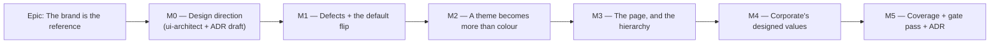

# Implementation Plan: The corporate brand — designing to it, not skinning with it

- **Feature spec:** [`./feature-spec.md`](./feature-spec.md) — **not yet approved**
- **Status:** Draft — awaiting approval. **Supersedes the 2026-08-18 first draft**, whose spine was
  "a decision plus verification". That conclusion was withdrawn by the product owner (spec §0.2).
- **Owner:** _(unassigned)_
- **Blocked on:** CQ-1 (dark-OS default), CQ-2 (control density), CQ-3 (how much reaches Light and
  Dark) — spec §1. **And on M0, which is a hard gate, not a formality.**

> **Read spec §0.5 first.** The epic's spine is eight measured findings about what is undesigned,
> not a palette. The palette is finished and correct; the problem is that a theme in this
> application can express nothing else (D1).

## Breakdown

### Epic

**The brand is the reference, and a theme is more than colour** — make Corporate the theme the
application is designed to, give the theme layer the ability to express a design decision that is
not a colour, and keep Light and Dark correct as secondary skins. **Corporate Dark is not in this
epic and is not a follow-on** (product owner, 2026-08-18).

---

## Milestone 0 — Design direction _(hard gate; ships dark)_

**Outcome:** a ui-architect-authored direction that turns spec §0.5's eight findings into named
decisions and the numbers the gates need, plus the ADR-0097 draft.

**Ships dark:** nothing is built and nothing is user-facing. **This is the milestone whose absence
produced the skin the first time**, so it is sequenced as a blocker rather than a preamble.

**Journey:** none — correctly. There is no capability to reach (ADR-0081 §1).

---

#### Feature: The ui-architect pass

> **Description:** CLAUDE.md §20 says to run **ui-architect** before building non-trivial UI, and
> the product owner has made this non-trivial UI by instruction. It was **not** run while producing
> the spec — the analyst had no agent-launch capability in that session, and that is stated rather
> than glossed (spec §4.1).
> **Complexity:** M
> **Dependencies:** the spec approved; CQ-1–CQ-3 answered.
> **Risks:** _the pass returns nothing, fails, or is slow → **re-run it**._ An unavailable agent is a
> reason to wait, never a reason to proceed — CLAUDE.md §19.3's rule for database-architect, and it
> holds here for the same reason: the judgement about whether the direction is good enough is the
> judgement the agent exists to make. A hand-rolled direction is how §0.5 happened.
> **Testing requirements:** none — this milestone produces decisions, not code. Its output is
> checked by the gates it specifies.

##### Task M0-T1 — Brief and run ui-architect

- **Description:** hand it spec §0.5 (D1–D8), §2.1 (C1–C7), the constraints, and the three answered
  product-owner decisions. Ask for **decisions and numbers**, not a mood board.
- **Complexity:** M
- **Dependencies:** none inside the milestone
- **Risks:** _it proposes something ADR-0055 forbids_ → the brief names the constraints explicitly:
  a surface family is complete or it is a trap; `@theme inline` is load-bearing; the families have
  **no** Tailwind utilities and `<Surface>` is the only route in; `--chart-*` is not rebound;
  `brand`/`auth` are theme-invariant (ADR-0077 §2/§8) and are **not in scope**; the toolbar's band
  floors are measured, not chosen (ADR-0090/0091).
- **Testing:** n/a
- **Development steps:**
  1. Brief with §0.5's evidence, **not** with adjectives.
  2. Require it to answer, each as a decision with a reason:
     - **Which non-colour decisions belong in the theme layer** (D1) — the candidate set is radius,
       control density, border weight, elevation model, focus-ring geometry — and which are
       product-wide and therefore shared (spec §4.4).
     - **Where the accent goes** (D3, D4) — the roles it must occupy, starting from the active
       navigation state, which is already proven at 7.9:1 on the navy band.
     - **What Corporate's surface hierarchy should be** (D2), given that `[data-designed-chrome].corporate:950-961`
       already decided against three competing dark/light regions **for a stated reason** — so this
       is "how does one navy band plus two light surfaces read as designed", not "make more of it navy".
     - **What a page is** (D5, D6) — the anatomy of `PageContainer`/`PageHeader`, and the type ramp,
       including whether the page title returns to `text-3xl` or the ramp is re-derived.
     - **The C2 separation band** — the actual numbers, per theme, for the adjacent-surface ratios
       that `token-contrast.test.ts:189-213` currently only reports.
  3. Require it to say **which of §0.5's findings it disagrees with**. D2's existing reasoning and
     §0.7's three push-backs are the likeliest, and a pass that agrees with everything has not read
     the code.
  4. If it recommends an ADR of its own, take that over folding into ADR-0097.

##### Task M0-T2 — Draft ADR-0097

- **Complexity:** M
- **Dependencies:** M0-T1
- **Risks:** _the ADR is drafted and never filed_ — ADR-0071 was cited by shipped code, two
  migrations and three ADRs for a whole epic while absent from the register. Mitigation: it is
  drafted here and **filed in M5-T3, in one commit with its README entry**.
- **Testing:** `pnpm check:doc-links`
- **Development steps:**
  1. Draft per spec §4.12, including the withdrawn first-draft conclusion (§0.2) — a decision record
     that omits the wrong answer teaches nothing about how the right one was reached.
  2. Record **Corporate Dark: not planned** as a decision with the product owner's words, so a future
     reader does not read the absence as an oversight and fill it.
  3. Amendment notes to ADR-0055 (extended along a new axis, vocabulary unchanged) and ADR-0077 §2
     (premise untouched; consequence strengthened).

---

## Milestone 1 — The defects, and the default flip

**Outcome:** the four gaps are closed, and Corporate is what the application is — so every later
milestone is judged on the theme it is designed to.

**Entry point:** **the application itself on first load.** The confirmable surface is **Account menu
(avatar, accessible name "Account: `<email>`") ▸ Theme ▸ Corporate**, which must be the ticked option
for a user who never picked it.

**Journey:** a new case in `apps/web/e2e-designed-ui/` — the suite that already boots the shell once
per theme and owns `setTheme` (`e2e-designed-ui/support.ts:21`). Clear storage, load, assert
`<html class="corporate">` **before any interaction**, open the account menu, assert Corporate is
ticked, pick Light and assert it survives a reload. ADR-0081 §2: the journey lands with the first
user-facing milestone, not at enablement.

> **Why the flip is here and not last.** The product owner cannot judge design work on a theme they
> are not looking at. It also front-loads the 33-suite sweep, so a theme-coupled journey breaks
> before twelve route files have been rewritten on top of it.

---

#### Feature: G1 — the canvas criticality triple, gated in Corporate

> **Description:** `globals.css:501-506` and `DESIGN_SYSTEM.md:213-219` assert that bronze keeps
> three readable bar states; nothing computes it. `render/palette.test.ts:223-285` covers light/dark
> only; `corporate` appears in that file twice, both in the data-date suite (`:318-324`).
> **Complexity:** S
> **Dependencies:** none — can start before M0 returns.
> **Risks:** _it fails_ → that is the point, and it is a defect in the theme about to become the
> default. Budget one token adjustment plus a `token-contrast.test.ts` re-sweep, which also reads
> `--warning`.
> **Testing requirements:** unit, token-mirror convention, both canvas flag states.

##### Task M1-T1 — Extend `render/palette.test.ts` to Corporate

- **Complexity:** S
- **Dependencies:** none
- **Risks:** _mirrored values drift from `globals.css`_ → mirror the exact `oklch()` triples with a
  source-line comment, as the existing corporate entry does (`:318-324`).
- **Testing:** per canvas flag state, assert that `--primary` (`0.252 0.056 264`), `--warning`
  (`0.56 0.115 55`) and `--destructive` (`0.505 0.19 27.5`) each clear **3:1** against the Corporate
  ground — **two grounds**, `--canvas: oklch(1 0 0)` (`:674`) flag-off and `oklch(0.988 0.006 90)`
  (`:1014`) flag-on, and the flag is default-on (`config/env.ts:873`) — that the three are
  **mutually** distinguishable, and that each fill's paired ink clears **4.5:1** on its own fill.
- **Development steps:**
  1. Add `corporate` to the `themes` map (`:224-235`) and the `background`/`fills` maps (`:252-285`),
     parametrised by flag state.
  2. Add the mutual-distinguishability assertion — new, and the one the prose actually claims.
  3. **Record the measured numbers in the PR**, pass or fail. A green assertion whose margin nobody
     looked at is how a barely-lawful value ships.
  4. On failure: fix the **token**, re-run `token-contrast.test.ts`, and record it in ADR-0097.

#### Feature: G2 — the two solid fills nobody asserted

> **Description:** `TEXT_PAIRS` (`token-contrast.test.ts:86-120`) omits
> `--destructive`/`--destructive-foreground` and `--secondary`/`--secondary-foreground`;
> `NON_TEXT_PAIRS` (`:123-153`) omits `--background`/`--destructive`. **This is not a Corporate
> problem** — it is a matrix hole in every theme, and Light's destructive pair may be a live WCAG
> 1.4.3 failure on every Delete button today.
> **Complexity:** S
> **Dependencies:** none
> **Risks:** _a failure blocks the milestone_ → correct sequencing, not a blocker to route around.
> **Testing requirements:** unit; runs automatically over 3 themes × 2 flag states × 5 scopes.

##### Task M1-T2 — Add the missing pairs

- **Complexity:** S
- **Testing:** the pairs themselves, each with the file's existing "why it is here" comment
  discipline — that file's docblocks are the record of which traps have been closed.
- **Development steps:**
  1. Add `['--destructive', '--destructive-foreground', …]` and
     `['--secondary', '--secondary-foreground', …]` to `TEXT_PAIRS`;
     `['--background', '--destructive', …]` to `NON_TEXT_PAIRS`.
  2. Run; record **every** resulting ratio per theme and scope in the PR.
  3. Fix any failure **at the token**, never by exempting the pair. A genuine exemption is written
     out with its WCAG reasoning and the ratio is still **reported** — the `--background`/`--border`
     precedent at `:175-184`.

##### Task M1-T3 — Report the light-theme destructive finding, if it is one

- **Description:** if M1-T2 shows Light's `--destructive`/`--destructive-foreground` below 4.5:1, it
  is a **live accessibility defect in the current default theme**, found by this epic and not caused
  by it.
- **Complexity:** S
- **Dependencies:** M1-T2
- **Risks:** _it gets absorbed as "a token tweak in the brand epic"_ → it gets its own commit, its
  own changeset line and a named entry in ADR-0097's consequences. CLAUDE.md §13 calls WCAG 2.2 AA a
  merge requirement, so a failure here is the project's own claim about itself being false in
  production.
- **Testing:** the M1-T2 assertion, verified red against the old value first.

#### Feature: G3 and G4 — the latent trap and the documentation drift

##### Task M1-T4 — Record `--secondary`'s scope trap

- **Description:** `--secondary` is not in `REBOUND_NAMES` (`token-architecture.test.ts:83-102`), so
  inside a scope `bg-secondary` keeps the page value — the lighter navy on the navy band, ~1.4:1.
  **This epic raises the odds it goes live**, because designing an active state is exactly when
  someone reaches for `secondary` (M4).
- **Complexity:** S
- **Testing:** **re-run the check rather than trusting this plan.** As of 2026-08-18 the six
  `<Surface tone=…>` sites are `chrome-band.tsx:39`, `app-header.tsx:136`, `navigator-rail.tsx:45,136`,
  `app-shell.tsx:125`, `brand-panel.tsx:44`, `auth-shell.tsx:58`, and no `variant="secondary"` /
  `bg-secondary` consumer renders inside any of them.
- **Development steps:**
  1. Re-run both searches; record the result and the date in the PR.
  2. If latent: a `docs/TECH_DEBT.md` row naming the trap, the six sites and the trigger, plus a
     comment beside `REBOUND_NAMES`. **Do not** add `--secondary` to the list here — that is an
     18→19 change across four families, three theme blocks and two flag layers, and it belongs to
     M4 if M4 needs it.
  3. If live: fix it before the flip.

##### Task M1-T5 — Repair the design-system drift (G4, D6, D7)

- **Complexity:** S
- **Development steps:**
  1. Re-derive every number **from the code or a gate**, never from another document — including
     `CLAUDE.md`, which is a document too.
  2. `DESIGN_SYSTEM.md` §230 (five scopes, stated once) and §246 (18 tokens, from
     `token-architecture.test.ts:26-56`).
  3. The three "17-name vocabulary" comments in `globals.css` (`:249`, `:466`, `:716`).
  4. **Mark §77-88 (type scale) and §100-104 (sizing) as known-wrong with a pointer to M3/CQ-2**
     rather than "correcting" them to today's code — `text-3xl` being unused and controls being one
     rung above the documented scale are findings this epic is about to act on, and quietly
     rewriting the doc to match the code would erase the evidence.

#### Feature: The default flip

> **Description:** change the fallback branch in `public/theme-boot.js:24-25` and
> `hooks/use-theme.tsx:32-38` so an absent or unrecognised value resolves to `corporate` (subject to
> CQ-1).
> **Complexity:** M — small diff, large blast radius.
> **Dependencies:** M1-T1…T5 green; CQ-1 answered.
> **Risks:** _the two files drift → a flash on every cold load_ (M1-T7's gate; ADR-0074 records this
> exact shape failing closed and silently). _A dark-OS never-chose user is moved to a light app_
> (CQ-1, with Corporate Dark explicitly not planned — the cost is accepted, not mitigated).
> _A journey is theme-coupled_ (M1-T8).
> **Testing requirements:** unit × 2 files, the cross-file gate, the flag-on journey, the full sweep.

##### Task M1-T6 — Flip both readers, in one commit

- **Complexity:** S (diff) / M (care)
- **Dependencies:** M1-T1…T5
- **Testing:** all five storage states in **both** `app/theme-boot.test.ts` and
  `hooks/use-theme.test.tsx`. Write `light`, `dark` and `system` as three separate cases asserting
  _no change_ — `system` is precisely the value a careless reader conflates with "never chose".
- **Development steps:**
  1. `theme-boot.js`: change the `!stored` branch; update the docblock to say what the default is
     **and why** — it is a served, dependency-free file read by whoever is debugging a flash.
  2. `use-theme.tsx:32-38`: the same rule, in the same words.
  3. **Update `theme-boot.test.ts:83-93`** ("follows the system preference when nothing is stored") —
     its expectation inverts. Change it deliberately, with a comment citing ADR-0097, so a future
     reader does not read it as a test bent to pass.
  4. **Update `theme-boot.test.ts:95-108`** (localStorage unavailable) — the fallback class changes
     from none to `corporate`.
  5. Changeset (`minor` — pre-1.0, user-visible).

##### Task M1-T7 — The cross-file seam gate

- **Complexity:** S
- **Dependencies:** M1-T6 (same PR)
- **Risks:** _the test asserts a copy of the rule instead of the rule_ → it must evaluate the **real
  served file**, which `theme-boot.test.ts:25-34` already does (`readFileSync` + `new Function`), and
  exercise the provider's real behaviour.
- **Testing:** `{null, 'light', 'dark', 'system', 'corporate', 'neon'}` × `{light, dark}` OS
  preference; assert the boot script's stamped class equals the provider's. **Verify it red first**
  by changing one of the two rules — a seam test that has never failed is a seam test nobody has
  checked. State in the docblock what it cannot prove: that the script runs before first paint (a
  browser fact; jsdom has no paint — the file already says so at `:19-21`).

##### Task M1-T8 — Run every journey against the new default

- **Description:** **no journey pins a theme** — verified: zero matches for `schedulepoint-theme`
  under `apps/web/e2e*/`, no `playwright*.config.ts` sets one. All 33 render in whatever the default
  is.
- **Complexity:** M — mostly waiting, occasionally a real finding.
- **Dependencies:** M1-T6
- **Risks:** _a suite asserts a computed colour or a screenshot_ → fix the **suite** if the coupling
  was accidental, the **product** if the theme genuinely broke it, and say which, per failure.
- **Testing:** `scripts/e2e-local.sh web:<suite>` for **every** suite, **locally, before pushing**
  (CLAUDE.md §19.8). ADR-0091's retrospective records three journeys breaking across one layout
  change, each found by CI rather than the author, and the rule that replaced that judgement: run
  every journey, not the one CI named.
- **Development steps:**
  1. Run all suites; record pass/fail as a **table** in the PR, not a sentence.
  2. Triage each failure; product defects get a regression test.
  3. Record the wall-clock cost — the honest price of 33 suites that never pinned a theme.

##### Task M1-T9 — The flag-on journey case

- **Complexity:** S
- **Dependencies:** M1-T6
- **Risks:** _it passes for the wrong reason (leaked storage from a previous test)_ → assert the
  **absence** of the key before loading.
- **Testing:** itself, per the milestone header. Add the case **outside** the existing four-theme
  loop — it is about the _absence_ of a choice, which `setTheme` structurally cannot express. Under
  CQ-1(b), add the `prefers-color-scheme: dark` variant.

---

## Milestone 2 — A theme becomes more than colour

**Outcome:** the theme layer can carry a design decision that is not a colour, and a theme that
omits one fails CI by name. **This is the structural fix for "skin" (D1).**

**Ships dark:** the vocabulary and its gates land with **Corporate's values equal to today's**, so
nothing changes visually. Deliberate, and the ADR-0055 §8.1 rule: flipping structure and values in
one change makes every parity argument meaningless on the day it is most needed. **M4 surfaces it.**

**Journey:** none — nothing is reachable. The M1 journey continues to pass unchanged, which is the
milestone's own parity statement.

---

#### Feature: The designed non-colour token set (C1)

> **Description:** extend each theme block with the non-colour tokens M0-T1 named, mapped through
> `@theme inline` where they must compile to utilities, and gated for literal per-theme declaration.
> **Complexity:** L
> **Dependencies:** M0-T1 (the set), M1 (green)
> **Risks:**
>
> - _`@theme inline` is dropped or a token is aliased with `var()`_ → both are already-known silent
>   failures. `token-architecture.test.ts:104-110` pins `inline`; `:155-166` pins literal
>   declaration for `--field`/`--canvas` **for exactly this reason** and the new set joins it.
> - _The set grows without limit_ → it is closed by M0-T1's decision and asserted as a set-equality,
>   the way `REBOUND_NAMES` is (`:172-174`). A token added later is a deliberate edit.
> - _A non-colour token needs to reach the Canvas painter_ → `render/palette.ts` resolves tokens at
>   runtime and is **out of scope**; if M0 wants one there it is its own task, named, not assumed.
>   **Testing requirements:** unit (structural + completeness), plus the existing parity of every
>   suite, which must pass unchanged.

##### Task M2-T1 — Extend the vocabulary, values unchanged

- **Complexity:** M
- **Dependencies:** M0-T1
- **Testing:** completeness per theme, naming the missing token individually (`:149-152`'s
  discipline — "a family is incomplete" is useless at 3am); literal-not-`var()`; set equality.
- **Development steps:**
  1. Add the tokens to `:root`, `.dark`, `.corporate` with **today's effective values**, so the
     product is byte-identical.
  2. Map through `@theme inline` only what must compile to a utility; keep anything scope-bound out,
     per ADR-0055 §1's "no `--color-chrome-*` utility" rule and its gate (`:113-122`).
  3. **Beware the equal-specificity trap**: `[data-designed-chrome]` and `.dark`/`.corporate` have
     the same specificity and the attribute layer sits later in the file, so it wins
     (`globals.css:850-855`). Any new token declared in a flag layer must be restated per theme —
     `token-architecture.test.ts:202-221` pins this and will catch it, which is the point.
  4. Verify each new gate **red first** by deleting one declaration.

##### Task M2-T2 — Promote the adjacent-surface report to an assertion (C2)

- **Description:** `token-contrast.test.ts:189-213` computes chrome/panel/brand versus the page fill
  and asserts only `> 1`, deliberately, with the reasoning written out. **Add `card` versus page**
  and assert M0-T1's band.
- **Complexity:** M
- **Dependencies:** M0-T1
- **Risks:** _the existing "reported, not asserted" reasoning is sound and is being overridden_ →
  it is not: that block declines to assert a **WCAG** threshold on a decorative boundary, which
  stays true. This adds a **design** threshold with a different justification, and the docblock must
  say so in those words or the next reader will delete one of them.
- **Testing:** the assertion, plus keeping the `console.log` report — a regression should still be
  visible in the output even where it is inside the band.

---

## Milestone 3 — The page, and the hierarchy

**Outcome:** a page is a component; the type hierarchy has a top; the control density is a decision.
Closes D5, D6, D7 — **in all three themes** (CQ-3(a)).

**Entry point:** **every content route** — Clients, Client detail, Project detail, Plan detail,
Calendars, Resources, Members, Audit log, My activity, Recently deleted, Org home. A planner reaches
it by opening any of them.

**Journey:** the base journey (`pnpm --filter @repo/web test:e2e`) covers these screens and is the
gate. ADR-0096's finding applies directly: `scripts/e2e-local.sh` had no mapping for the base suite,
so **the suite covering the shipped default was the one the documented pre-push gate could not run**
— that is fixed, and this milestone is exactly when it matters. **Change a screen, run the base
journey** (`docs/TESTING.md`).

---

#### Feature: `PageContainer` and `PageHeader` (C4, C5)

> **Description:** `mx-auto w-full max-w-6xl flex-1 p-6` appears **verbatim 15 times across 12 route
> files**, and every `<h1>` is hand-sized `text-2xl` while the documented `text-3xl` appears in
> **zero** `.tsx` files. Two layout-tier primitives replace both.
> **Complexity:** L
> **Dependencies:** M0-T1 (the anatomy and the ramp), M2 (if the ramp is theme-expressed)
> **Risks:**
>
> - _A migration changes accessible names or roles and breaks suites_ → it must not. The existing
>   suites query by role and accessible name, which is exactly what the migration preserves — the
>   ADR-0062 standard, whose proof was that **every pre-existing suite passed unchanged**. That is
>   this feature's acceptance condition too.
> - _One route needs something the primitive lacks and gets bypassed_ → the structural test names
>   the file; an exception joins an allowlist **with a reason**, and the allowlist is what must not
>   grow (`surface-seams.structural.test.ts:28`'s rule).
> - _Heading levels break_ → one `<h1>` per page and no skipped levels (CLAUDE.md §13); the
>   primitive owns the `<h1>`, which is what makes this checkable rather than per-route diligence.
>   **Testing requirements:** unit for the primitives (including their states), the structural gate,
>   the base Playwright journey, and an axe pass on at least one migrated route.

##### Task M3-T1 — Build the primitives

- **Complexity:** M
- **Dependencies:** M0-T1
- **Testing:** rendered coverage for each — title, optional eyebrow, description, primary-action
  slot, and the no-action case. **Two reviews on ADR-0094 called a new component's zero rendered
  coverage blocking**; a new layout primitive with no test is the same finding waiting.
- **Development steps:**
  1. `components/layout/page-container.tsx` and `page-header.tsx` (layout tier, not `ui/` — they
     carry page structure; `brand-mark.tsx:12-13`'s precedent).
  2. The header owns the `<h1>` size, so D6 cannot recur one route at a time.
  3. Document both in `docs/COMPONENT_LIBRARY.md`, with the authoring rule in `DESIGN_SYSTEM.md`
     beside ADR-0061's form-layout section — so the next page is not a judgement call.

##### Task M3-T2 — Migrate the twelve routes

- **Complexity:** M — mechanical, wide.
- **Dependencies:** M3-T1
- **Risks:** _a route's `flex-1`/scroll relationship is subtly different_ → `app-shell.tsx:136`
  makes `<main>` the scroller and the shell exactly the viewport (`:102`), with a comment recording
  that a fixed height **without** a scroller made the plan workspace's docked panel collide. Any
  route that deviates gets read before it is moved, not after.
- **Testing:** every existing route suite passes **unchanged**; the base journey; one axe pass.
- **Development steps:**
  1. Migrate in small batches, not one commit for twelve files.
  2. Diff the rendered DOM per route before/after for role and name equality.
  3. Add the structural gate (C4) **last**, verified red against a deliberately un-migrated route.

##### Task M3-T3 — The density decision (C6, CQ-2)

- **Description:** `Button` is `h-10/h-9/h-11`, `Input` is `h-10`; `DESIGN_SYSTEM.md:102-104`
  documents 32/36/40. One is wrong.
- **Complexity:** S under CQ-2(a); **L** under CQ-2(b)
- **Dependencies:** CQ-2
- **Risks:** _CQ-2(b) is treated as tidying_ → it is a visual change to **every control in the
  product in all three themes**, and it perturbs the measured toolbar ladder: ADR-0090/0091 derive
  band floors from measured control widths and `e2e-toolbar-fit` asserts pointer reachability at
  specific widths, including 1646 (the product owner's Surface Pro). **Under (b), re-run the
  measurement harness before and after and put both numbers in the PR.**
- **Testing:** a unit test that `Button` and `Input` share one scale; under (b), `e2e-toolbar-fit`
  and `measure-toolbar` at every pinned width.

---

## Milestone 4 — Corporate's designed values

**Outcome:** Corporate stops being a colour set and becomes a design — the accent occupies the roles
M0 named, the surface hierarchy carries M0's numbers, and the non-colour tokens M2 created take
Corporate's values.

**Entry point:** **the app shell and every page** — most visibly the primary navigation's current-page
state (D4) and the page header (D5/D6). A planner sees it on arrival.

**Journey:** `e2e-designed-ui` gains assertions for the new accent roles — computed through
`getComputedStyle`, following that suite's own precedent, because **axe measures no hover or
`aria-current` state at all** (`designed-ui.spec.ts:22-24`) and the active-nav state is exactly what
this milestone changes.

---

#### Feature: Accent placement, and the accent census (C3)

> **Description:** on the page surface, Corporate's amber is bound to exactly two things —
> `--accent` (a pale hover wash, `:531`) and `--chart-1` (`:558`). The only solid amber an
> authenticated user sees at rest is the 28×28px `BrandMark` tile. Bind the accent to the roles M0
> named, starting with the active navigation state, and pin the set.
> **Complexity:** M
> **Dependencies:** M0-T1, M2, M3
> **Risks:**
>
> - _An accent binding fails contrast_ → every new binding is computed **before** it ships. Amber is
>   7.9:1 on navy and **1.92:1 on the off-white page** (`:517-523`); the rule that amber is a fill on
>   navy and never ink or a line on a light surface is **not** being relaxed, and the ADR must say so
>   or a future reader will read this milestone as permission.
> - _`--secondary` gets reached for_ → M1-T4's trap. If M4 needs a scoped secondary, adding it to
>   `REBOUND_NAMES` is an 18→19 change across four families, three theme blocks and two flag layers,
>   and it is its own task with its own reason.
> - _The census becomes a tautology_ → it pins **which roles the accent is bound to**, so a removal
>   fails and an addition is deliberate. Its blind spot is written into its own docblock: **it proves
>   binding, not prominence.** The ADR-0073 census's honesty about what it could and could not force
>   is the model.
>   **Testing requirements:** the census (structural), the contrast matrix (already sweeping), the
>   journey's computed-style reads.

##### Task M4-T1 — Bind the accent, compute every pair first

- **Complexity:** M
- **Testing:** each new pair added to `token-contrast.test.ts` **before** the CSS that needs it —
  ADR-0083's ordering, and the precedent this file already sets twice for the Gantt's arrows and
  constraint badge (`:134-152`).
- **Development steps:**
  1. Add the pairs; verify red where the value does not yet exist.
  2. Bind the roles; re-run the matrix across all three themes — **Light and Dark get their own
     values for the same roles** (spec §4.4), so this is not a Corporate-only edit.
  3. The active-nav treatment in `app-header.tsx:15-16`.

##### Task M4-T2 — The accent census

- **Complexity:** S
- **Testing:** derived from the token declarations, **not** a hand-written list — a hard-coded list
  is the ADR-0073 C4 defect in miniature. Verified red by removing one binding.

#### Feature: Corporate's surface hierarchy (C2 values, D2)

##### Task M4-T3 — Land M0's separation numbers

- **Complexity:** M
- **Dependencies:** M0-T1, M2-T2
- **Risks:** _re-litigating a settled decision_ → `[data-designed-chrome].corporate:950-961` already
  decided against three competing dark/light regions, **with a stated reason**. M4 works within that
  ("how does one navy band over two light surfaces read as designed"), and if M0 disagrees the
  disagreement is argued in the ADR, not enacted quietly.
- **Testing:** M2-T2's asserted band, plus `e2e-designed-ui`'s four-theme axe loop.

---

## Milestone 5 — Coverage, the gate pass, and the ADR

**Outcome:** the theme everybody now sees is scanned where they actually work; five specialists have
read the combined diff; ADR-0097 is filed and registered.

**Entry point:** none new — this milestone widens coverage and folds findings onto M1–M4's surfaces.
**Not dark**: it changes what those milestones shipped.

**Journey:** M1's and M4's, extended.

---

##### Task M5-T1 — Widen the four-theme sweep past the shell

- **Description:** `e2e-designed-ui:41-50` scans the app shell plus a client list. It does not reach
  the plan workspace, canvas, toolbar, a dialog, the Gantt or the activity editor. Narrow enough not
  to matter while Corporate was opt-in; not once it is the product.
- **Complexity:** M
- **Risks:** _a real Corporate violation on a surface nobody scanned_ → that is the finding, and it
  is cheaper now than when the product owner reports it. Budget one. _Runtime multiplies by theme_ →
  if it becomes a problem, scan the workspace in **corporate and dark** only and say so in the
  docblock **with the measured times**, rather than trimming silently.
- **Testing:** axe `wcag2a`/`wcag2aa` over a plan with a computed schedule, plus the computed-style
  reads for hover and `aria-current` that axe cannot make. **State in the docblock what is still
  unscanned** rather than implying completeness.

##### Task M5-T2 — The specialist gate pass

- **Description:** the review this repository runs at every epic boundary, which has found blocking
  defects in code that passed a human read for at least six consecutive epics (ADR-0064 §7,
  ADR-0067 M4, ADR-0073 C4, ADR-0080, ADR-0086 M6, ADR-0095 M6). **This epic is a design epic, so
  this pass is the closest thing it has to a second opinion on taste.**
- **Complexity:** M
- **Testing:** every blocking finding folds with a regression test **verified to fail against the
  old code first**.
- **Development steps:**
  1. **ux-reviewer** — the primary reviewer here: hierarchy, state coverage, copy, responsive, and
     the honest question of whether the result reads as designed.
  2. **accessibility-reviewer** — the four-theme sweep, the new accent roles, the page primitives'
     heading structure, and any density change.
  3. **component-reviewer** — the two new primitives' API and composability, token/variant usage,
     and one-off styling in the twelve migrated routes.
  4. **performance-reviewer** — bundle and render effect of the primitives; expected neutral,
     confirmed rather than assumed.
  5. **security-reviewer** — expected no-op; confirm no CSP delta and that `theme-boot.js` is still
     a served file.
  6. Non-blocking findings → `docs/TECH_DEBT.md`, recording **what was found wrong**, not only what
     changed.

##### Task M5-T3 — File ADR-0097 and update the register

- **Complexity:** S
- **Risks:** _the ADR is written and never filed_ — ADR-0071's failure; ADR-0079 was renumbered;
  ADR-0078 found `docs/adr/README.md` missing seven entries. Mitigation: **filing, registering and
  README-listing in one commit**, with the number re-derived at filing time (top of the register is
  **0096** as of 2026-08-18).
- **Testing:** `pnpm check:doc-links`, `pnpm check:counts` (the ADR count in `CLAUDE.md`'s banner is
  a computed gate — ADR-0076).
- **Development steps:**
  1. Finalise the M0-T2 draft with what M1–M4 actually found, including anything that contradicted
     the plan — this repository's ADRs are worth more for those than for the decisions.
  2. `docs/adr/README.md` and `CLAUDE.md` §16, same commit.
  3. `DESIGN_SYSTEM.md`, `COMPONENT_LIBRARY.md`, `FRONTEND_ARCHITECTURE.md`, with every number
     re-derived from a gate.
  4. Changeset.

---

## Sequencing & slices

- **M0 is a hard gate.** No value-bearing task starts before the ui-architect pass returns. If it
  fails or is slow, **re-run it**.
- **M1 can start its defect tasks (T1–T5) in parallel with M0** — closing a contrast gate is right
  whichever direction the design takes. The flip (T6–T9) waits for CQ-1.
- **M2 ships values-unchanged**, deliberately (ADR-0055 §8.1): structure and values do not flip
  together, or every parity argument is meaningless on the day it is needed.
- **M3 changes all three themes** (CQ-3(a)) and is the milestone most likely to move a journey.
- **M4 is the first milestone where Corporate visibly diverges**, and by then the product owner has
  been living in it since M1 — which is the point of the ordering.
- **No feature flag anywhere** (spec §4.7). Rollback is the commit boundary plus, for users, the
  account menu. For M3 a flag would be _actively worse_: two page layouts in twelve route files.
- **`main` stays releasable at every milestone boundary.** M0 and M2 are invisible; M1, M3, M4 and
  M5 are each independently shippable.
- **`apps/api` is not touched anywhere in this plan**, so `scripts/e2e-local.sh api` is not required
  — stated rather than left to inference.

## Definition of Done (per task)

Each PR meets the Feature Completion Criteria in [`docs/PROCESS.md`](../../PROCESS.md). Three are
called out because this epic makes them easy to skip:

- **"Tests" means the pre-push gate was run** — `pnpm lint && pnpm typecheck && pnpm test`, **plus
  `scripts/e2e-local.sh web:<suite>`** for every suite touched by M1-T8 and M3-T2, and **the base
  journey** for any screen change (`docs/TESTING.md`, added after ADR-0096 found the base suite was
  the one the documented gate could not run).
- **"Accessibility considered"** is not satisfied by "axe is green". ADR-0090 established that the
  axe scan requests `wcag2a`/`wcag2aa` while `target-size` is tagged `wcag22aa` **and ships
  `enabled: false`** — "the axe scan is green" was true and meaningless. A design epic must not lean
  on it.
- **"Documentation updated"** includes `docs/adr/README.md` and `CLAUDE.md` §16 in the same commit
  as the ADR.

## Risks & assumptions (rollup)

| Risk / assumption                                                                           | Likelihood | Impact   | Mitigation                                                                                                                                          |
| ------------------------------------------------------------------------------------------- | ---------- | -------- | --------------------------------------------------------------------------------------------------------------------------------------------------- |
| **The ui-architect pass is skipped or hurried, and the result is a second skin**            | med        | **high** | M0 is a hard gate; an unavailable agent is a reason to wait, never to proceed. This is the risk the epic exists because of.                         |
| M3 restructures Light and Dark and the product owner did not expect it                      | med        | high     | **CQ-3**, asked explicitly with the consequence stated in plain words.                                                                              |
| A dark-OS never-chose user is moved to a light application, with no Corporate Dark to go to | **high**   | med      | **CQ-1**, with the tension named. The cost is accepted, not mitigated — Corporate Dark is not planned.                                              |
| Light's `--destructive` pair is a live WCAG 1.4.3 failure today                             | med        | med      | M1-T2 measures it; **M1-T3 makes it its own reported finding** so a bigger epic cannot absorb it.                                                   |
| One of the 33 journeys is theme-coupled, or the page migration moves a locator              | **high**   | low      | M1-T8 and M3-T2 run every suite locally before merge; ADR-0091's rule, adopted verbatim.                                                            |
| A density change (CQ-2(b)) perturbs the measured toolbar ladder                             | med        | med      | M3-T3 re-runs `e2e-toolbar-fit` and `measure-toolbar` at every pinned width, including 1646, and puts both numbers in the PR.                       |
| A Corporate axe violation exists on a surface `e2e-designed-ui` never scanned               | med        | med      | M5-T1 widens the sweep and **states what remains unscanned**.                                                                                       |
| An equal-specificity flag layer silently overrides a new theme token                        | med        | med      | Already a known trap (`globals.css:850-855`) with a gate (`token-architecture.test.ts:202-221`); M2-T1 step 3 names it.                             |
| The boot script and provider drift, flashing on cold load                                   | low        | high     | M1-T7, verified red first. ADR-0074 records this exact shape.                                                                                       |
| ADR-0097's number is taken between this plan and filing                                     | low        | low      | M5-T3 re-derives it. ADR-0079 was renumbered for exactly this; ADR-0071 was never filed at all.                                                     |
| **Assumption:** most users on this installation have never chosen a theme                   | —          | —        | **Not verifiable from this repository** — a fact about browsers' `localStorage`. Labelled a belief (ADR-0076 Class 3).                              |
| **Assumption:** the palette needs no colour work                                            | —          | —        | Verified against `globals.css`, `token-contrast.test.ts`, `token-architecture.test.ts`, `css-blocks.ts` — **not** inherited from a brief.           |
| **Assumption:** §0.5's eight findings are the causes of "undesigned"                        | —          | —        | Each is a measured fact; that they are the **cause** is a judgement, and M0-T1 step 3 explicitly asks ui-architect which of them it disagrees with. |

</content>
