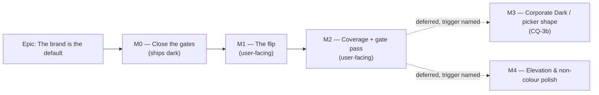
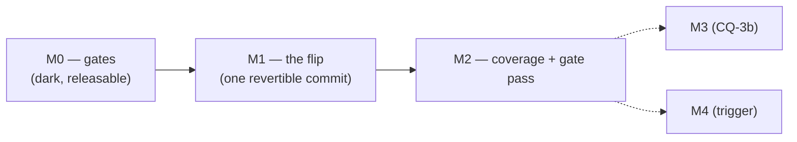

# Implementation Plan: The corporate brand — making the palette the product's default identity

- **Feature spec:** [`./feature-spec.md`](./feature-spec.md) — **not yet approved**
- **Status:** Draft — awaiting approval
- **Owner:** _(unassigned)_
- **Blocked on:** CQ-1, CQ-2, CQ-3 (feature spec §1). **M0 is not blocked** and can start on any
  answer, because closing a gate is right whichever way the default goes.

> **Read the spec's §0 first.** This plan is small on purpose. The requested brand is already
> built, already complete and already gated; the epic is a **decision plus verification**, not a
> palette. Anything here that looks like it is inventing work to justify the ask should be cut.

## Breakdown

### Epic

**The brand is the default, not an option** — make SchedulePoint's shipped corporate identity what
every user sees, and turn the two claims that identity rests on from prose into computed gates.
Maps to no existing roadmap theme; arrived as a direct product-owner request, 2026-08-18.

---

## Milestone 0 — Close the gates (ships dark)

**Outcome:** every colour claim the Corporate theme makes is computed rather than written down, and
`DESIGN_SYSTEM.md` describes the system that exists.

**Ships dark:** nothing user-facing changes. No token value moves, no default moves, no CSS is
written. This milestone is tests and documentation only, and it lands **before** M1 because a pair
added after a value change is a pair that shipped unchecked (`measurements.md` §"Two things to gate
rather than hope"; ADR-0083's ordering rule). **M1 surfaces this work.**

**Journey:** none — correctly. There is no capability to reach. Per ADR-0081 a milestone either
names its entry point or declares itself dark; this one declares itself dark.

---

#### Feature: The canvas criticality triple, gated in Corporate (G1)

> **Description:** `globals.css:501-506` and `DESIGN_SYSTEM.md:213-219` both assert that moving
> `--warning` to bronze keeps three readable bar states in Corporate. Nothing computes it.
> `render/palette.test.ts` runs its criticality suites over `light` and `dark` only (`:224-235`,
> `:258-270`, `:341-354`); `corporate` appears in that file twice, both in the data-date suite.
> **Complexity:** S
> **Dependencies:** none
> **Risks:** the assertion fails → **that is the point**, and it is a real defect in the theme the
> epic is about to make default. Budget one token adjustment (bronze lightness) plus a re-sweep of
> `token-contrast.test.ts`, which also reads `--warning`.
> **Testing requirements:** unit (Vitest), token-mirror convention, both canvas flag states.

##### Task M0-T1 — Extend `render/palette.test.ts` to Corporate (≈ one PR)

- **Description:** add `corporate` to the three theme-parametrised suites that currently stop at
  light/dark, using the file's own token-mirror convention (`:296-298`).
- **Complexity:** S
- **Dependencies:** none
- **Risks:** the mirrored values drift from `globals.css` → mitigate by mirroring the **exact**
  `oklch()` triples with a comment naming the source line, as the existing corporate entry does
  (`:318-324`).
- **Testing:** the new cases themselves. Assert, per flag state:
  - `--primary` (navy `0.252 0.056 264`), `--warning` (bronze `0.56 0.115 55`) and `--destructive`
    (`0.505 0.19 27.5`) each clear **3:1** against the Corporate canvas ground;
  - the ground is **two values**: `--canvas: oklch(1 0 0)` (`:674`) with the flag off, and
    `oklch(0.988 0.006 90)` (`:1014`) with `[data-canvas-visual-language].corporate` applied — the
    flag is default-on (`config/env.ts:873`), so the second is what ships;
  - the three fills are **mutually** distinguishable, not merely each visible on the ground — that
    is the actual claim `globals.css:501-506` makes;
  - each fill's paired label ink (`--primary-foreground` `0.985 0 0`, `--warning-foreground`
    `0.985 0 0`, `--destructive-foreground` `0.985 0 0`) clears **4.5:1** on its own fill.
- **Development steps:**
  1. Read `globals.css:508-730` and `:1013-1016`; copy the triples verbatim with source-line comments.
  2. Add `corporate` to the `themes` maps in the progress-ink suite (`:223-243`) and to the
     `background`/`fills` maps in the 1.4.11 suite (`:252-285`), parametrising the ground by flag state.
  3. Add the mutual-distinguishability assertion — new, and the one the prose actually claims.
  4. **Run it and record the numbers in the PR description**, whether or not it passes. A green
     assertion whose margin nobody looked at is how a value that is barely lawful ships.
  5. If a pair fails: fix the **token**, re-run `token-contrast.test.ts` (which reads `--warning`
     for `--background`/`--warning-text` and `--warning`/`--warning-foreground`), and say so in the ADR.

---

#### Feature: The two solid fills nobody asserted (G2)

> **Description:** `token-contrast.test.ts`'s `TEXT_PAIRS` (`:86-120`) covers `--primary`,
> `--success`, `--warning`, `--info` against their `-foreground` partners and **omits
> `--destructive` and `--secondary`**; `NON_TEXT_PAIRS` (`:123-153`) covers `--background`/`--primary`
> and omits `--background`/`--destructive`. A Delete button's label on its own fill is unasserted in
> **every** theme and **every** scope. This is not a Corporate problem — it is a matrix hole that
> Corporate happened to expose.
> **Complexity:** S
> **Dependencies:** none
> **Risks:** **Light's `--destructive` is expected to be close.** `oklch(0.577 0.245 27.325)` with
> `oklch(0.985 0 0)` ink is a plausible sub-4.5:1 pair, and if it fails it is a live WCAG 1.4.3
> defect on every Delete button in the default theme today. Mitigation is not to narrow the
> assertion: measure it, and if it fails, fix the token and record the finding.
> **Testing requirements:** unit; runs automatically across 3 themes × 2 flag states × 5 scopes.

##### Task M0-T2 — Add the missing pairs to the contrast matrix

- **Complexity:** S
- **Dependencies:** none
- **Risks:** a failure blocks M1 → that is correct sequencing, not a blocker to route around.
- **Testing:** the pairs themselves. Add to `TEXT_PAIRS`:
  `['--destructive', '--destructive-foreground', 'the label of a solid destructive button']` and
  `['--secondary', '--secondary-foreground', 'the label of a secondary button']`; to
  `NON_TEXT_PAIRS`: `['--background', '--destructive', 'a destructive button against the surface']`.
- **Development steps:**
  1. Add the three pairs with the file's existing comment discipline — each one says _why_ it is
     there, because the file's own docblock is the record of which traps have been closed.
  2. Run and record every resulting ratio, per theme and scope.
  3. Fix any failure at the **token**, never by exempting the pair. If a pair genuinely warrants an
     exemption (as `--background`/`--border` does at `:175-184`), the exemption is written out with
     its WCAG reasoning and the ratio is still **reported**.
  4. Note in the PR whether `--secondary`/`--secondary-foreground` inside a scope is meaningful —
     see M0-T3, which is the reason it might not be.

##### Task M0-T3 — Record `--secondary`'s scope trap (G3)

- **Description:** `--secondary` is **not** in `REBOUND_NAMES` (`token-architecture.test.ts:83-102`),
  so inside `chrome`/`panel`/`brand`/`auth` it keeps the **page** theme's value. In Corporate that
  is the lighter navy `#1f3661` on a navy band — a ~1.4:1 fill difference, i.e. an "active" state
  that does not read as one.
- **Complexity:** S
- **Dependencies:** none
- **Risks:** none — this task changes no behaviour.
- **Testing:** **verify the live/latent status rather than trusting this plan.** The check already
  run: the only `<Surface tone=…>` sites are `chrome-band.tsx:39`, `app-header.tsx:136`,
  `navigator-rail.tsx:45,136`, `app-shell.tsx:125`, `brand-panel.tsx:44`, `auth-shell.tsx:58`, and
  no `variant="secondary"` / `bg-secondary` consumer renders inside any of them today. **Re-run that
  search at implementation time** — the toolbar is portalled into the chrome band, so the first
  toolbar item that reaches for `secondary` makes this live.
- **Development steps:**
  1. Re-run the two searches; record the result in the PR with the date.
  2. If still latent: add a `docs/TECH_DEBT.md` row naming the trap, the four scope sites and the
     trigger ("the first `secondary` consumer inside a `<Surface>`"), and add a comment beside
     `REBOUND_NAMES` saying `--secondary` is knowingly outside it. **Do not** add it to the list —
     that is an 18→19 change across four families in three theme blocks plus two flag layers, and it
     needs its own reason.
  3. If it has become live: raise it as a defect and fix it in M0, before the flip.

---

#### Feature: The design system describes the system (G4)

> **Description:** `DESIGN_SYSTEM.md` §230 says "There are three scopes" and §267 says "There are
> five scopes"; §246 says "a complete 17-token family" while the gate asserts 18. `globals.css`
> repeats "the 17-name vocabulary" at `:249`, `:466` and `:716`. ADR-0058 Class 1 drift, found while
> reading for this epic.
> **Complexity:** S
> **Dependencies:** none
> **Risks:** none.
> **Testing requirements:** `pnpm check:doc-links`; the numbers are re-derived from
> `token-architecture.test.ts`, not from another document.

##### Task M0-T4 — Repair the scope-count and token-count drift

- **Complexity:** S
- **Development steps:**
  1. Re-derive both counts from `token-architecture.test.ts:26-56` and `:83-102` — **not** from
     `CLAUDE.md`, which is a document too.
  2. Fix `DESIGN_SYSTEM.md` §230's table (five scopes, one statement) and §246 (18).
  3. Fix the three `globals.css` comments.
  4. Reframe `DESIGN_SYSTEM.md` §185 from "a fourth picker entry" to what it will be after M1 —
     **worded so it is true before and after**, or held to M1 and changed there. Say which was chosen.

---

## Milestone 1 — The default flip

**Outcome:** a user who has never chosen a theme opens SchedulePoint and meets the brand. Everyone
who chose one keeps it.

**Entry point:** **the application itself, on first load** — there is no control to press, which is
the point. The confirmable surface is **Account menu (avatar, accessible name "Account: `<email>`")
▸ Theme ▸ Corporate**, which must show as the ticked option for a user who never picked it. That is
what a journey can press and assert.

**Journey:** `apps/web/e2e-designed-ui/` gains a case — the suite that already boots the shell once
per theme and owns the `setTheme` helper (`e2e-designed-ui/support.ts:21`). New case: **clear
storage, load, assert `<html class="corporate">` before interaction, open the account menu, assert
Corporate is ticked.** This is the ADR-0081 §2 requirement (the journey lands with the first
user-facing milestone, not at enablement), and it is also the only thing that can prove the boot
script and the provider agree in a real browser.

---

#### Feature: One default rule, implemented twice, gated once

> **Description:** change the fallback branch in `public/theme-boot.js:24-25` and
> `hooks/use-theme.tsx:32-38` so an absent or unrecognised stored value resolves to `corporate`
> (subject to CQ-2's answer about `prefers-color-scheme: dark`).
> **Complexity:** M — small diff, large blast radius.
> **Dependencies:** M0 complete and green; CQ-1 and CQ-2 answered.
> **Risks:**
>
> - _Two files with no compiler relationship drift → a theme flash on every cold load._ Mitigation:
>   M1-T2's cross-file test, which is the whole reason this feature is worded as "implemented twice,
>   gated once". ADR-0074 records this exact shape failing closed and silently.
> - _A dark-OS user who never chose is moved to a light app._ Mitigation: CQ-2 is the product
>   owner's decision, taken with the cost stated, and M3 is the named remedy.
> - _An existing journey asserts something the palette moves._ Mitigation: M1-T3 runs all 33 before
>   the flip merges, not after.
>   **Testing requirements:** unit × 2 files + the cross-file gate + the flag-on journey + the full
>   journey sweep.

##### Task M1-T1 — Flip both readers, in one commit

- **Description:** the two branches change together. Never in separate PRs.
- **Complexity:** S (diff) / M (care)
- **Dependencies:** M0
- **Risks:** an incomplete edit ships a flash → the same commit carries M1-T2's gate.
- **Testing:** extend `app/theme-boot.test.ts` and `hooks/use-theme.test.tsx` to assert **all five**
  storage states each. Three of them (`light`, `dark`, `system`) assert _no change_ — write them as
  three separate cases, not one parametrised pass, because `system` is precisely the value a careless
  reader conflates with "never chose".
- **Development steps:**
  1. `public/theme-boot.js`: change the `!stored` branch. Update its docblock to say what the default
     is and **why** — the file is served, dependency-free and read by people debugging a flash.
  2. `hooks/use-theme.tsx:32-38`: the same rule, in the same words.
  3. **Update `theme-boot.test.ts:83-93`** ("follows the system preference when nothing is stored at
     all") — its expectation inverts. Change it deliberately, with a comment saying the behaviour was
     changed by ADR-0097, so a future reader does not read the edit as a test being made to pass.
  4. **Update `theme-boot.test.ts:95-108`** (localStorage unavailable) — the fallback class changes
     from none to `corporate`. Same discipline.
  5. Changeset (`minor` — pre-1.0, user-visible).

##### Task M1-T2 — The cross-file seam gate

- **Description:** one test that reads **both** implementations and asserts they agree.
- **Complexity:** S
- **Dependencies:** M1-T1 (same PR)
- **Risks:** the test asserts a _copy_ of the rule rather than the rule → it must evaluate the real
  served file, which `theme-boot.test.ts:25-34` already does (`readFileSync` + `new Function`), and
  import the real `readStoredTheme` behaviour through `ThemeProvider`.
- **Testing:** for each of `{null, 'light', 'dark', 'system', 'corporate', 'neon'}` × each of
  `{prefers-color-scheme: light, dark}`, assert the class the boot script stamps equals the class the
  provider's effect stamps. **Verify it red first** by changing one of the two rules and watching it
  fail — a seam test that has never failed is a seam test nobody has checked.
- **Development steps:**
  1. Add the case to `app/theme-boot.test.ts` (it already owns the file-reading mechanism) or a new
     `app/theme-default.seam.test.ts`; say which and why in the docblock.
  2. State in the docblock what it **cannot** prove: that the script still runs before first paint —
     a browser fact, and jsdom has no paint (the existing file already says this at `:19-21`).

##### Task M1-T3 — Run every journey against the new default

- **Description:** none of the 33 Playwright suites sets a theme (verified: zero matches for
  `schedulepoint-theme` under `apps/web/e2e*/`; no `playwright*.config.ts` pins one), so they all
  render in whatever the default is. Flipping it silently changes what every one of them paints.
- **Complexity:** M — mostly waiting, occasionally a real finding.
- **Dependencies:** M1-T1
- **Risks:** a suite asserts a computed colour or a screenshot → fix the **suite** if the assertion
  was theme-coupled by accident, fix the **product** if the theme genuinely broke it. Say which, per
  failure.
- **Testing:** `scripts/e2e-local.sh web:<suite>` for every suite, **locally, before pushing** —
  CLAUDE.md §19.8 and ADR-0091's retrospective, which records three journeys breaking across one
  layout change with each found by CI rather than by the author, and the rule that replaced that
  judgement: after a label or layout change, run **every** journey, not the one CI named.
- **Development steps:**
  1. Run all suites; record pass/fail in the PR as a table, not a sentence.
  2. Triage each failure as suite-coupling or product defect. Product defects get a regression test.
  3. Record the wall-clock cost — it is the honest price of having 33 suites that never pinned a theme.

##### Task M1-T4 — The flag-on journey case

- **Description:** the ADR-0081 §2 requirement, in `e2e-designed-ui`.
- **Complexity:** S
- **Dependencies:** M1-T1
- **Risks:** the assertion passes for the wrong reason (e.g. a leaked storage value from a previous
  test) → clear storage explicitly and assert the **absence** of the key before loading.
- **Testing:** itself. Assert, in order: storage empty → `<html>` has `corporate` and not `dark` →
  account menu opens → Corporate is the checked radio → picking Light writes `light` and survives a
  reload (US-3, the escape hatch, which is the actual rollback).
- **Development steps:**
  1. Add the case beside the existing four-theme loop, **outside** it — it is about the absence of a
     choice, which the loop's `setTheme` helper structurally cannot express.
  2. Under CQ-2(b), add the `prefers-color-scheme: dark` variant asserting `dark`.

---

## Milestone 2 — Corporate's coverage, and the gate pass

**Outcome:** the theme everybody now sees is scanned where they actually work, and five specialists
have read the epic's combined diff.

**Entry point:** none new — this milestone adds coverage and folds findings on M1's surface.
Declared **not dark**: it changes what M1 shipped, on M1's entry point.

**Journey:** the M1 journey, extended (M2-T1).

---

#### Feature: Widen the four-theme sweep past the shell

> **Description:** `e2e-designed-ui/designed-ui.spec.ts:41-50` scans the app shell plus a client
> list. It does not reach the plan workspace, the canvas, the toolbar, a dialog, the Gantt or the
> activity editor. "Corporate is axe-scanned" is true and much narrower than it sounds — and it was
> narrow enough not to matter while Corporate was opt-in.
> **Complexity:** M
> **Dependencies:** M1
> **Risks:** a real axe violation in Corporate on a surface nobody scanned → that is the finding, and
> it is cheaper now than after the product owner reports it. Budget for one.
> **Testing requirements:** e2e + a11y.

##### Task M2-T1 — Scan the plan workspace in all four themes

- **Complexity:** M
- **Dependencies:** M1
- **Risks:** the suite's runtime multiplies by the number of themes → scan the workspace in
  **corporate and dark** rather than all four if runtime becomes a problem, and say so in the
  docblock with the measured times rather than trimming silently.
- **Testing:** axe `wcag2a`/`wcag2aa` over a plan with a computed schedule; plus the named-site
  reads the existing suite already does through `getComputedStyle`, since axe measures no hover or
  `aria-current` state (`designed-ui.spec.ts:22-24`).
- **Development steps:**
  1. Reuse the suite's `onboard`/`createClient` helpers; add a plan with activities.
  2. Scan the workspace. Note in the docblock what is **still** unscanned (dialogs, the Gantt, the
     activity editor) rather than implying completeness.
  3. Record the runtime delta in the PR.

##### Task M2-T2 — The specialist gate pass

- **Description:** the enablement review this repository runs at every epic boundary, and which has
  found blocking defects in code that passed a human read for at least six consecutive epics
  (ADR-0064 §7, ADR-0067 M4, ADR-0073 C4, ADR-0080, ADR-0086 M6, ADR-0095 M6).
- **Complexity:** M
- **Dependencies:** M2-T1
- **Risks:** the epic is small, so the pass looks like a formality → it is not. The largest risk in
  this epic is that a surface nobody looked at in Corporate is now everybody's default.
- **Testing:** every blocking finding folds with a regression test **verified to fail against the old
  code first**.
- **Development steps:**
  1. **accessibility-reviewer** — the four-theme sweep, the picker's ticked state, and the
     contrast pairs added in M0. The primary reviewer for this epic.
  2. **ux-reviewer** — is "Corporate" the right label once it is the default? Does anything on
     screen now claim a theme that is not in effect?
  3. **component-reviewer** — token usage, and whether anything reached for a literal colour that
     Corporate exposes (the lint rule covers `components/`, `features/`, `routes/`, `app/` —
     `DESIGN_SYSTEM.md:299-309`).
  4. **performance-reviewer** — expected to be a no-op; confirm the bundle is unchanged (the
     `.corporate` block already ships whether applied or not).
  5. **security-reviewer** — expected to be a no-op; confirm no CSP delta and that `theme-boot.js`
     is still a served file, not inlined.
  6. Non-blocking findings → `docs/TECH_DEBT.md`, with what was found wrong, not just what changed.

##### Task M2-T3 — File ADR-0097 and update the register

- **Complexity:** S
- **Dependencies:** M2-T2
- **Risks:** **the ADR is written and never filed** — ADR-0071 was cited by shipped code, two
  migrations, three ADRs and `docs/DATABASE.md` for a whole epic while absent from
  `docs/adr/`; ADR-0078 found `docs/adr/README.md` missing seven entries. Mitigation: filing,
  registering and README-listing happen in **one commit**, and the number is re-derived at filing
  time (top of the register is **0096** as of 2026-08-18).
- **Testing:** `pnpm check:doc-links`, `pnpm check:counts` (the ADR count in `CLAUDE.md`'s banner is
  a computed gate — ADR-0076).
- **Development steps:**
  1. Write the ADR per spec §4.10, including the ADR-0077 §2 amendment note and the two deferrals
     with their triggers.
  2. Add it to `docs/adr/README.md` and `CLAUDE.md` §16 in the same commit.
  3. Update `docs/FRONTEND_ARCHITECTURE.md`'s Theme-management section and `DESIGN_SYSTEM.md` §185.
  4. Changeset.

---

## Milestone 3 — Corporate Dark, or the picker's shape _(deferred — CQ-3)_

**Outcome:** _(if taken)_ the brand covers both schemes and there is no unbranded option; the picker
becomes Light / Dark / System over one identity.

**Ships dark:** not started. **Deferred on a decision, not on capacity**, and recorded here so it is
a decision rather than something forgotten.

**Trigger to open it:** the product owner answers CQ-3 with (b), **or** a user reports that the
brand pushed them onto an unbranded theme to get dark mode — which is the concrete harm CQ-2(a)
accepts.

**Cost, stated so the decision is informed:** ~117 new declarations in a fourth theme block, a full
`token-contrast.test.ts` sweep (which would become 4 themes × 2 flag states × 5 scopes), a
`token-architecture.test.ts` completeness pass, a `palette.test.ts` criticality pass, a
`[data-designed-chrome]` restatement layer (the equal-specificity trap at `globals.css:850-855`,
which `token-architecture.test.ts:202-221` pins), and a fifth entry in `e2e-designed-ui`'s theme
loop. It is a real milestone. It is **not** a tweak to `.corporate`.

---

## Milestone 4 — Elevation and the non-colour polish _(deferred — measured, not assumed)_

**Outcome:** _(if taken)_ the specific parts of the old app's "polish" that are not colour.

**Ships dark:** not started.

**Trigger:** the product owner still finds the application flat **after** M1 has shipped and they
have used the brand for a week. Not before — spec §0.5 establishes that radius, motion and type are
already matched, and the one genuine difference (the old app raised cards; this one draws borders)
is a **documented existing decision** (`DESIGN_SYSTEM.md:112-124`, "prefer `border` + low elevation
on light surfaces") rather than an omission. The strongest candidate cause of "flat" —
`:root` binding `--background` and `--card` to the same white (`globals.css:38,40`) — **is fixed by
M1 itself**, because Corporate's page is off-white and its card is white.

If opened, it is scoped by measurement first: count the elevation-bearing surfaces (10 uses of
`shadow-*` across 989 web source files today), pick the two or three where a raise carries meaning,
and change the primitive rather than the call sites.

---

## Sequencing & slices

- **M0 ships alone and is releasable.** It changes no behaviour, so it can merge before CQ-1 is even
  answered — closing a contrast gate is right whichever way the default goes.
- **M1 is one commit**, deliberately. That commit boundary **is** the rollback (spec §4.5): one
  `git revert`. This matters because the product owner runs the Compose stack with the ADR-0047
  Watchtower profile enabled, so a merged release is pulled and recreated on that host — anything
  shipped default-on is in use.
- **No feature flag.** Spec §4.5: a `VITE_` flag cannot be switched off on a deployed container
  (ADR-0088), the account menu is a better and per-user rollback, and adding one would spend
  ADR-0088 D3's ratcheting Class-A budget on the cheapest-to-revert change in the epic.
- **M1 does not merge until M1-T3's journey sweep is green locally.** CI is the second opinion,
  never the first.

## Definition of Done (per task)

Each task's PR meets the Feature Completion Criteria in [`docs/PROCESS.md`](../../PROCESS.md).
Two are called out because this epic makes them unusually easy to skip:

- **"Tests" means the pre-push gate was run**, including
  `scripts/e2e-local.sh web:<suite>` for every suite touched by M1-T3 — not that tests exist.
- **"Documentation updated"** includes `docs/adr/README.md` and `CLAUDE.md` §16 for M2-T3, in the
  same commit as the ADR.

`apps/api` is not touched anywhere in this plan, so `scripts/e2e-local.sh api` is not required —
stated rather than left to inference.

## Risks & assumptions (rollup)

| Risk / assumption                                                                                       | Likelihood | Impact | Mitigation                                                                                                                                                      |
| ------------------------------------------------------------------------------------------------------- | ---------- | ------ | --------------------------------------------------------------------------------------------------------------------------------------------------------------- |
| A dark-OS user who never chose is moved to a light application                                          | **high**   | med    | CQ-2 is the product owner's decision with the cost stated; two-click escape; M3 is the named remedy. **This is the epic's largest user-visible cost.**          |
| One of the 33 journeys is theme-coupled and breaks                                                      | med        | low    | M1-T3 runs all of them locally before the flip merges, and triages each failure as suite-coupling vs. product defect.                                           |
| A Corporate axe violation exists on a surface `e2e-designed-ui` never scanned                           | med        | med    | M2-T1 widens the sweep to the plan workspace and **states what is still unscanned** rather than implying completeness.                                          |
| Light's `--destructive`/`--destructive-foreground` fails 4.5:1 (a live defect in today's default theme) | med        | med    | M0-T2 measures it. If it fails, fix the token and record it — it is a WCAG 1.4.3 failure on every Delete button today, found by this epic and not caused by it. |
| The boot script and the provider drift, producing a flash on cold load                                  | low        | high   | M1-T2's cross-file gate, verified red first. ADR-0074 records this exact shape failing closed and silently.                                                     |
| Users dislike the brand and there is no per-user escape                                                 | low        | high   | There is one, it already exists, and M1-T4 asserts it (US-3).                                                                                                   |
| **Assumption:** most users on this installation have never chosen a theme                               | —          | —      | **Not verifiable from this repository** — it is a fact about browsers' `localStorage`. Stated as a belief, not a measurement (ADR-0076 Class 3).                |
| **Assumption:** the palette needs no colour work                                                        | —          | —      | Verified in spec §0.1 against `globals.css`, `token-contrast.test.ts`, `token-architecture.test.ts` and `css-blocks.ts` — **not** inherited from the brief.     |
| ADR-0097's number is taken between this plan and filing                                                 | low        | low    | M2-T3 re-derives the highest number at filing time. ADR-0079 was renumbered for exactly this; ADR-0071 was never filed at all.                                  |

</content>
