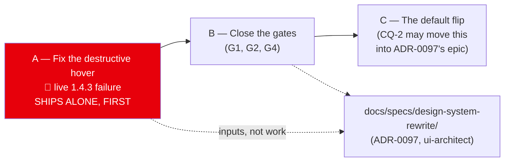

# Implementation Plan: Theme contrast gaps and the default flip

- **Feature spec:** [`./feature-spec.md`](./feature-spec.md) — **not yet approved**
- **Status:** Draft — awaiting approval
- **Owner:** _(unassigned)_
- **Parent effort:** `docs/specs/design-system-rewrite/` (ui-architect, **ADR-0097**) owns the design
  direction. **This plan owns verified defects and the flip mechanics, and claims no ADR number.**
- **Blocked on:** CQ-1 (dark-OS default) and CQ-2 (flip now or with the rewrite) — spec §1.
  **Milestone A is blocked on nothing.**

> This plan was twice larger. What was cut — the design direction, the "what does designed mean"
> criteria, the Corporate-as-primary restructuring — moved to the rewrite. What is left is work that
> is correct whatever that effort decides.

---

## Milestone A — Fix the destructive hover state _(ships alone, ahead of everything)_

**Outcome:** a hovered Delete button's label is legible. Closes a shipped WCAG 1.4.3 failure on every
destructive control in the product, in all three themes.

**Entry point:** **any Delete or destructive-confirm button** — e.g. Clients ▸ a row's **Delete** ▸
the confirm dialog's destructive button. A user reaches it by hovering.

**Journey:** none required, and that is a judgement rather than an omission — this is a token/variant
contrast fix with no new capability and no new control (ADR-0081 §1 asks for an entry point or a
declaration; the entry point above is an existing control). The proof is the computed assertion in
A-T1, which is the only instrument that can see the defect at all.

**Why it ships alone:** CLAUDE.md §13 makes WCAG 2.2 AA a merge requirement, so this is the
project's own claim about itself being false in production. It is a one-line variant change, it
depends on no design decision, and **it must not wait behind a design rewrite.**

---

##### Task A-T1 — Assert the hover pair, verified red

- **Description:** the contrast matrix has **no alpha-variant pairs at all** and axe **"measures no
  hover … state at all"** (`designed-ui.spec.ts:24`), so this defect sits in the gap between the two
  gates. The assertion has to exist before the fix, or the fix is unverifiable.
- **Complexity:** M — the arithmetic is easy; deciding _how_ alpha states are gated is the work.
- **Dependencies:** none
- **Risks:**
  - _The compositing model is guessed._ Tailwind v4 emits `color-mix(in oklab, X 90%, transparent)`
    for `/90`, and the browser then composites over the backdrop. **Establish which space by reading
    the generated CSS and, ideally, by measuring `getComputedStyle` in a browser** — do not infer it
    from the class name. The spec's §0.1 computes both models (≈4.34:1 gamma, ≈3.32:1 OKLab) and both
    fail, so the _conclusion_ is safe; the _number_ is not, and a gate needs the number.
  - _The gate over-reaches._ Every `/90` and `/80` in `button.tsx` is a candidate. Assert the pairs
    that exist, name in the docblock which utilities are covered and which are not.
- **Testing:** extend `styles/token-contrast.test.ts` (or a sibling if alpha composition does not
  belong in that file's model — say which and why in the docblock). **Verify red against the current
  `button.tsx` first**; a gate that has never failed is a gate nobody has checked.
- **Development steps:**
  1. Read the emitted CSS for `hover:bg-destructive/90`; record the actual function and colour space
     in the test's docblock with the file it was read from.
  2. Add the composited hover pair for `destructive` **and** `default`/`secondary` (the spec computes
     `default` at ≈4.90:1 — it survives, and an assertion that only covers the failing case cannot
     tell you when a passing one stops passing).
  3. Run; record every measured ratio in the PR.

##### Task A-T2 — Fix it

- **Description:** the fix is a variant change, not a token change: `--destructive` itself is fine at
  4.56:1 (Light) / 5.87 (Dark) / 6.21 (Corporate). It is the **hover lightening** that breaks it.
- **Complexity:** S
- **Dependencies:** A-T1
- **Risks:** _the obvious fix moves the token and breaks four other pairs._ `--destructive` is read by
  `token-contrast.test.ts` in six places and by `render/palette.ts:27` as the canvas critical fill.
  **Prefer darkening the hover (e.g. a `hover:bg-destructive/90` → a darker hover treatment) over
  re-valuing the token**, and if the token must move, re-run the whole matrix and `palette.test.ts`.
- **Testing:** A-T1's assertion goes green; the full matrix and `render/palette.test.ts` stay green;
  a Playwright check that the hovered control's computed pair clears 4.5:1 — the
  `designed-ui.spec.ts:64-66` pattern, which already hovers a nav link and reads
  `getComputedStyle` for exactly this reason.
- **Development steps:**
  1. Change the variant; keep the hover _visibly_ a state change (a hover that is invisible is a
     different defect).
  2. Repeat for any sibling variant A-T1 shows failing.
  3. Changeset (`patch` — a defect fix); note it as an accessibility fix in the changelog line.
  4. Add a `docs/TECH_DEBT.md` row for the **general** gap: alpha/hover/active states are gated by
     nothing, in either instrument. That is bigger than this fix and is an input to ADR-0097.

---

## Milestone B — Close the gates _(ships dark)_

**Outcome:** three prose claims and one 1.4% margin become computed assertions.

**Ships dark:** tests and documentation only. No token value moves unless a new assertion fails, in
which case that is a defect found, reported and fixed. **Nothing user-facing.**

**Journey:** none — there is no capability to reach (ADR-0081 §1).

---

##### Task B-T1 — G2: the three missing pairs

- **Description:** `TEXT_PAIRS` (`token-contrast.test.ts:86-120`) omits
  `--destructive`/`--destructive-foreground` and `--secondary`/`--secondary-foreground`;
  `NON_TEXT_PAIRS` (`:123-153`) omits `--background`/`--destructive`.
- **Complexity:** S
- **Dependencies:** none (A-T1 may land the file changes first; then this is three lines)
- **Risks:** _the run disagrees with the spec's hand-computed table._ **The run wins**, and spec §0.1
  is corrected in place. Those figures were produced by applying the repository's own
  `oklchToLuminance` (`render/palette.test.ts:198-217`) by hand, with no execution tool available —
  they are evidence, not proof, and the spec says so.
- **Testing:** the three pairs, sweeping 3 themes × 2 flag states × 5 scopes automatically.
- **Development steps:**
  1. Add the pairs with the file's existing comment discipline — each says _why_ it is there, because
     those docblocks are the record of which traps have been closed.
  2. Run; put **every** measured ratio in the PR, per theme and scope — including the two thin
     margins (Light `--destructive` at ~4.56:1 against 4.5; Dark `--background`/`--destructive` at
     ~3.23:1 against 3.0). A green assertion whose margin nobody looked at is how a barely-lawful
     value ships.
  3. Fix any failure **at the token**, never by narrowing the assertion. A genuine exemption is
     written out with its WCAG reasoning and the ratio is still **reported** — the
     `--background`/`--border` precedent at `:175-184`.

##### Task B-T2 — G1: the canvas criticality triple in Corporate

- **Description:** `globals.css:501-506` and `DESIGN_SYSTEM.md:213-219` assert bronze keeps three
  readable bar states; nothing computes it. `render/palette.test.ts:223-285` covers light/dark only.
- **Complexity:** S
- **Dependencies:** none
- **Risks:** _the mirrored values drift from `globals.css`_ → mirror the exact `oklch()` triples with
  a source-line comment, as that file's existing corporate entry does (`:318-324`).
- **Testing:** per canvas flag state, assert `--primary` (`0.252 0.056 264`), `--warning`
  (`0.56 0.115 55`) and `--destructive` (`0.505 0.19 27.5`) each clear **3:1** against the Corporate
  ground — **two grounds**: `--canvas: oklch(1 0 0)` (`:674`) flag-off and `oklch(0.988 0.006 90)`
  (`:1014`) flag-on, and the flag is default-on (`config/env.ts:873`). Assert the three are
  **mutually** distinguishable (the claim the prose actually makes) and that each fill's paired ink
  clears **4.5:1** on its own fill.
- **Development steps:**
  1. Add `corporate` to the `themes` map (`:224-235`) and the `background`/`fills` maps (`:252-285`).
  2. Add the mutual-distinguishability assertion — new.
  3. Record the measured numbers in the PR, pass or fail.

##### Task B-T3 — G4: the design-system drift, only the part that is settled

- **Complexity:** S
- **Dependencies:** none
- **Risks:** _"correcting" the doc erases evidence the rewrite needs._ **Fix only the two settled
  contradictions**; leave the type scale and control-height drifts alone.
- **Development steps:**
  1. Re-derive both numbers **from the gate, not from another document** (including `CLAUDE.md`):
     `DESIGN_SYSTEM.md` §230 (five scopes, stated once) and §246 (18 tokens, from
     `token-architecture.test.ts:26-56`); the three "17-name vocabulary" comments in `globals.css`
     (`:249`, `:466`, `:716`).
  2. **Do not** rewrite §77-88 (type scale) or §100-104 (sizing) to match today's code. `text-3xl`
     being used in **zero** `.tsx` files and controls shipping one rung above the documented scale are
     findings the rewrite will act on; annotate them as open with a pointer to
     `docs/specs/design-system-rewrite/`.

##### Task B-T4 — G3: record the latent trap for the rewrite

- **Description:** `--secondary` is not in `REBOUND_NAMES` (`token-architecture.test.ts:83-102`), so
  inside a scope `bg-secondary` keeps the page value — the lighter navy on the navy chrome, ~1.4:1.
- **Complexity:** S
- **Dependencies:** none
- **Risks:** _it is "fixed" here._ Adding it is an 18→19 change across four families, three theme
  blocks and two flag layers; that belongs to whoever owns the vocabulary. **Record, do not fix.**
- **Testing:** **re-run the check rather than trusting this plan.** As of 2026-08-18 the six
  `<Surface tone=…>` sites are `chrome-band.tsx:39`, `app-header.tsx:136`, `navigator-rail.tsx:45,136`,
  `app-shell.tsx:125`, `brand-panel.tsx:44`, `auth-shell.tsx:58`, and no `variant="secondary"` /
  `bg-secondary` consumer renders inside any of them.
- **Development steps:**
  1. Re-run both searches; record the result and the date.
  2. `docs/TECH_DEBT.md` row naming the trap, the six sites, and the trigger — **"the design-system
     rewrite designing an active state"**, which is when someone reaches for `secondary`.
  3. A comment beside `REBOUND_NAMES` saying `--secondary` is knowingly outside it.

---

## Milestone C — The default flip

**Outcome:** a user who has never chosen a theme meets Corporate. Every explicit choice is honoured
unchanged.

**Entry point:** **the application itself on first load.** The confirmable surface is **Account menu
(avatar, accessible name "Account: `<email>`") ▸ Theme ▸ Corporate**, which must be the ticked option
for a user who never picked it.

**Journey:** a new case in `apps/web/e2e-designed-ui/` — the suite that already boots the shell once
per theme and owns `setTheme` (`support.ts:21`). Clear storage, load, assert `<html class="corporate">`
**before any interaction**, open the account menu, assert Corporate is ticked, pick Light and assert it
survives a reload (the per-user rollback, which is the real one).

> **CQ-2 may move this milestone into ADR-0097's epic entirely.** If it ships here, it is recorded in
> `docs/DECISIONS.md` and cross-referenced when ADR-0097 lands; it does not get its own ADR (spec
> §3.6).

---

##### Task C-T1 — Flip both readers, in one commit

- **Description:** `public/theme-boot.js:24-25` and `hooks/use-theme.tsx:32-38` implement one rule in
  two languages with **no compiler relationship**. They change together, never in separate PRs.
- **Complexity:** S (diff) / M (care)
- **Dependencies:** CQ-1 answered; Milestone B green
- **Risks:** _they drift → a flash on every cold load._ ADR-0074 records this exact shape failing
  closed and silently. Mitigation is C-T2, in the same commit.
- **Testing:** all five storage states in **both** `app/theme-boot.test.ts` and
  `hooks/use-theme.test.tsx`. Write `light`, `dark` and `system` as three separate cases asserting _no
  change_ — `system` is precisely the value a careless reader conflates with "never chose", and the
  distinction is real in storage (`null` vs. the literal `'system'`).
- **Development steps:**
  1. Change the `!stored` branch in both; update `theme-boot.js`'s docblock to say what the default is
     **and why** — it is a served, dependency-free file read by whoever is debugging a flash.
  2. **Update `theme-boot.test.ts:83-93`** ("follows the system preference when nothing is stored") —
     its expectation inverts. Change it deliberately, with a comment saying the behaviour changed and
     citing the decision, so a future reader does not read it as a test bent to pass.
  3. **Update `theme-boot.test.ts:95-108`** (localStorage unavailable) — the fallback class changes
     from none to `corporate`.
  4. Changeset (`minor` — pre-1.0, user-visible).

##### Task C-T2 — The cross-file seam gate

- **Complexity:** S
- **Dependencies:** C-T1 (same PR)
- **Risks:** _it asserts a copy of the rule instead of the rule_ → it must evaluate the **real served
  file**, which `app/theme-boot.test.ts:25-34` already does (`readFileSync` + `new Function`).
- **Testing:** `{null, 'light', 'dark', 'system', 'corporate', 'neon'}` × `{light, dark}` OS
  preference; assert the boot script's stamped class equals the provider's. **Verify red first** by
  changing one of the two rules. State in the docblock what it cannot prove — that the script runs
  before first paint, a browser fact; jsdom has no paint (the file already says so at `:19-21`).

##### Task C-T3 — Run every journey against the new default

- **Description:** **no journey pins a theme** — verified: zero matches for `schedulepoint-theme`
  under `apps/web/e2e*/`, and no `playwright*.config.ts` sets one. All 33 render in whatever the
  default is, so the flip silently changes what every one of them paints.
- **Complexity:** M — mostly waiting, occasionally a real finding.
- **Dependencies:** C-T1
- **Risks:** _a suite asserts a computed colour_ → fix the **suite** if the coupling was accidental,
  the **product** if the theme genuinely broke it, and say which, per failure.
- **Testing:** `scripts/e2e-local.sh web:<suite>` for **every** suite, **locally, before pushing**
  (CLAUDE.md §19.8), **plus the base journey** (`pnpm --filter @repo/web test:e2e`) — ADR-0096 found
  that `scripts/e2e-local.sh` had no mapping for the base suite, so the suite covering the shipped
  default was the one the documented gate could not run. ADR-0091's rule applies verbatim: **run every
  journey, not the one CI named.**
- **Development steps:**
  1. Run all suites; record pass/fail as a **table** in the PR, not a sentence.
  2. Triage each failure; product defects get a regression test.
  3. Record the wall-clock cost — the honest price of 33 suites that never pinned a theme.

##### Task C-T4 — The journey case

- **Complexity:** S
- **Dependencies:** C-T1
- **Risks:** _it passes for the wrong reason (leaked storage from a previous test)_ → assert the
  **absence** of the key before loading.
- **Testing:** per the milestone header. Add the case **outside** the existing four-theme loop — it is
  about the _absence_ of a choice, which `setTheme` structurally cannot express. Under CQ-1(b), add
  the `prefers-color-scheme: dark` variant.

---

## Sequencing & slices

- **A ships first and alone.** It is a shipped accessibility failure; it depends on no decision, no
  answer and no other milestone.
- **B can run in parallel with the design-system rewrite's early work** — closing a gate is right
  whatever that effort decides, and its output (the measured ratios, the alpha-gating gap) is an input
  to it.
- **C waits on CQ-1 and CQ-2**, and may be absorbed into ADR-0097's epic.
- **No feature flag anywhere** (spec §3.5): a `VITE_` flag cannot be switched off on a deployed
  container (ADR-0088), the account menu is a better and per-user rollback, and the engineering
  rollback is the commit boundary.
- **`main` stays releasable at every boundary.** A, B and C are each independently shippable.
- **`apps/api` is not touched anywhere in this plan**, so `scripts/e2e-local.sh api` is not required —
  stated rather than left to inference.

## Definition of Done (per task)

Each PR meets the Feature Completion Criteria in [`docs/PROCESS.md`](../../PROCESS.md). Two are called
out:

- **"Tests" means the pre-push gate was run** — `pnpm lint && pnpm typecheck && pnpm test`, plus
  `scripts/e2e-local.sh web:<suite>` for every suite touched by C-T3, **plus the base journey for any
  screen change**.
- **"Accessibility considered" is not satisfied by "axe is green."** ADR-0090 established that the
  axe scan requests `wcag2a`/`wcag2aa` while `target-size` is tagged `wcag22aa` **and ships
  `enabled: false`** — "the axe scan is green" was true and meaningless. Milestone A is a second
  instance of the same lesson: axe measures no hover state at all.

## Risks & assumptions (rollup)

| Risk / assumption                                                                           | Likelihood | Impact   | Mitigation                                                                                                                                    |
| ------------------------------------------------------------------------------------------- | ---------- | -------- | --------------------------------------------------------------------------------------------------------------------------------------------- |
| **Milestone A is absorbed into the rewrite and ships in six weeks instead of one**          | med        | **high** | It ships alone, first, and is sequenced ahead of every other item in either epic. ADR-0055 §6 records the same reasoning for the same reason. |
| The spec's hand-computed ratios are wrong                                                   | low–med    | med      | Labelled as evidence rather than proof; B-T1/A-T1 re-derive them by execution, and **the run wins**.                                          |
| The hover compositing space is guessed and the gate encodes the wrong model                 | med        | med      | A-T1 step 1 reads the emitted CSS rather than inferring it. Both candidate models fail 4.5:1, so the conclusion is safe either way.           |
| Fixing the hover moves `--destructive` and breaks the canvas critical fill                  | med        | med      | A-T2 prefers a variant change; if the token must move, the whole matrix and `render/palette.test.ts` are re-run.                              |
| A journey is theme-coupled and breaks on the flip                                           | **high**   | low      | C-T3 runs every suite locally before merge, including the base journey.                                                                       |
| A dark-OS never-chose user is moved to a light application, with no Corporate Dark to go to | **high**   | med      | **CQ-1**, with the tension named. Corporate Dark is **not planned** (product owner), so the cost is accepted rather than mitigated.           |
| This spec quietly claims an ADR number that belongs elsewhere                               | low        | med      | Spec §3.6: **0097 = design-system rewrite, 0098 = landing page, this spec claims none.** ADR-0071 and ADR-0079 are the recorded precedents.   |
| **Assumption:** most users on this installation have never chosen a theme                   | —          | —        | **Not verifiable from this repository** — a fact about browsers' `localStorage`. Labelled a belief (ADR-0076 Class 3).                        |

</content>
