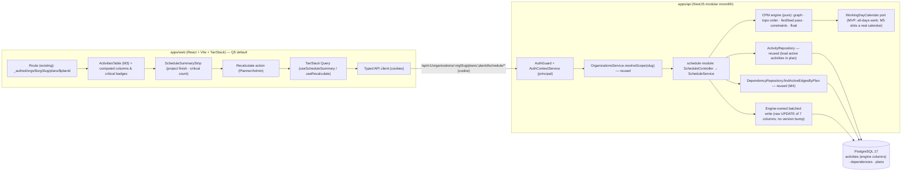
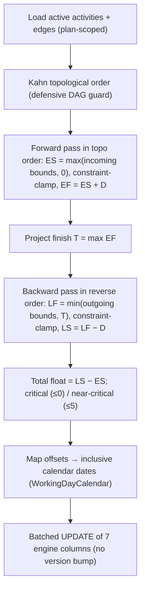
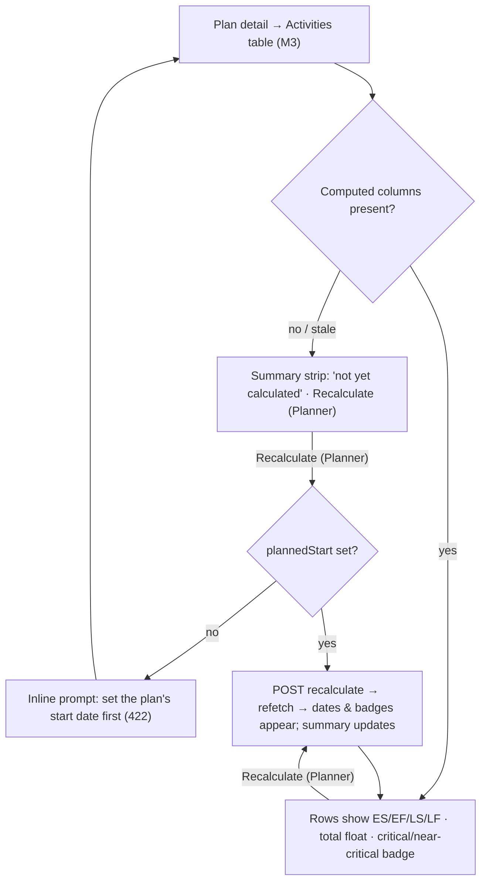

# Feature Spec: CPM engine (forward/backward pass, float, critical path)

- **Status:** Draft — awaiting approval (five critical questions in §1, each with a recommended default)
- **Author(s):** Feature Analyst (Product Owner / Solution Architect / Technical Lead hats)
- **Date:** 2026-07-10
- **Tracking issue / epic:** _TBD_ — Epic "Scheduling core (CPM/GPM & the TSLD)"
- **Roadmap link:** **M6 — CPM engine** — the flagship computation of the scheduling
  core, following **M3 Activities foundation** (`docs/specs/activities-foundation.md`)
  and **M4 Activity dependencies** (`docs/specs/activity-dependencies.md`). It reads
  the DAG those slices built and populates the engine-owned output columns M3 already
  persists. M5 (Calendars) is sequenced before/around M6 but the engine is designed
  with a **calendar seam** so it can land either side.
- **Related ADR(s):** existing — ADR-0008 (modular monolith), ADR-0012 (RBAC +
  resource scoping), ADR-0016 (identity & tenancy), **ADR-0021 (the DAG invariant —
  the engine assumes acyclicity unconditionally)**, ADR-0009 (BullMQ, considered and
  _not_ used here), ADR-0010 (Redis cache, considered and _not_ used here). **Two new
  ADRs are proposed by this slice:**
  - **ADR-0022 — CPM execution & persistence model** (how a recompute is triggered,
    scoped, locked, and how engine-owned columns are written without fighting
    optimistic locking). Architecturally significant and cross-cutting.
  - **ADR-0023 — CPM scheduling date convention** (the day-math model: data date,
    inclusive vs continuous convention, milestone handling, constraint clamping, the
    working-days = calendar-days seam for M5). Correctness-critical for the golden
    suite (PROJECT_BRIEF §17 names "CPM engine bugs erode trust" a top risk), so it is
    written as an ADR rather than a `DECISIONS.md` entry.

> This is the **sixth vertical slice** of SchedulePoint and the computation that turns
> the schedule **network** (nodes from M3, edges from M4) into an actual **schedule**:
> early/late start & finish, total float, and the live **critical path**. It is a
> read-of-the-graph → compute → write-the-reserved-columns slice. It introduces **no
> new domain entity and no schema migration to the graph** — every output column
> (`early_start`, `early_finish`, `late_start`, `late_finish`, `total_float`,
> `is_critical`, `is_near_critical`) already exists on `activities`, reserved for
> exactly this slice. It adds a **pure engine** (a well-tested domain library), a
> **recalculate service + endpoint**, and (per the Q5 default) a **minimal web
> surface** that shows the computed dates and a critical badge and offers a
> "Recalculate" action. Rich critical-path **highlighting** on the timeline belongs to
> the **TSLD canvas (M7)** and is deferred there.

## 1. Business understanding

### Problem

After M4, a Plan is a valid **DAG** — activities (with durations and constraints)
connected by typed, lagged relationships — but it is **inert**. Nothing computes
_when_ each activity can start or finish, _how much_ it can slip, or _which_ chain of
work drives the project's completion date. Those are precisely the outputs a
construction planner opens the tool to see: the **critical path**, the **total float**
of every activity, and the **early/late dates** that come from a CPM forward and
backward pass over the network. Without them SchedulePoint is a drawing of boxes and
arrows, not a scheduling tool; the TSLD canvas has no critical path to highlight,
baselines have nothing meaningful to snapshot, and "what happens to the finish date if
I move this?" cannot be answered.

"Why now": the CPM engine is **the flagship** of the product vision (PROJECT_BRIEF §1,
§8) — "make schedule logic and its drivers visually obvious" and "the critical path is
one glance away." M3 and M4 exist to feed it; the engine-owned columns were persisted
early _specifically so this slice is additive_. The DAG invariant (ADR-0021)
guarantees the engine a computable, terminating input. Landing a **correct, well-tested
planned-schedule engine first** de-risks the flagship the same way M3/M4 did: it proves
the maths against canonical CPM examples (the "golden suite," PROJECT_BRIEF §7, §17)
behind a simple recalculate action, before the expensive interactive canvas that will
consume it.

### Users

Roles are per **organisation membership** (ADR-0012/0016). Computing the schedule is a
**definition-level, Planner-owned** act (it derives dates from the planner's logic and
durations and overwrites the plan's computed columns), the same class as editing an
activity's duration or a dependency. Everyone else **reads** the results.

| Role            | Needs in this slice                                                                                                                                                           |
| --------------- | ----------------------------------------------------------------------------------------------------------------------------------------------------------------------------- |
| **Org Admin**   | Trigger a recompute; read all computed dates/float/critical flags (never locked out of the org's data).                                                                       |
| **Planner**     | Trigger a recompute after editing logic/durations/constraints; read early/late dates, total float and the critical path. The primary user.                                    |
| **Contributor** | **Read** computed dates, float and critical flags (context for progress reporting). No recompute in this slice — progress does not yet drive the schedule (planned-only MVP). |
| **Viewer**      | Read-only view of computed dates, float and the critical path.                                                                                                                |

### Primary use cases

1. **Recalculate the schedule** — a Planner, after editing activities/logic, triggers
   a recompute; the engine runs the forward/backward pass and persists every
   activity's early/late dates, total float and critical/near-critical flags.
2. **See an activity's computed dates & float** — any member reads an activity and
   sees its early start/finish, late start/finish and total float.
3. **See the critical path** — any member can tell which activities are critical
   (float ≤ 0) and near-critical (float within the threshold) and read the project
   finish date.
4. **See the project's schedule summary** — project start (data date), computed
   project finish date, overall duration, and the critical/near-critical counts.

### User journeys

- **Recalculate after an edit (happy path).** A Planner opens a plan, edits a task's
  duration and adds an FS+2 link (M3/M4) → clicks **Recalculate** → the engine runs
  synchronously (sub-second at target scale) → the activities table refreshes with
  early/late dates and total float, criticals badged, and a summary strip shows the new
  **project finish** and **critical count**. See the user-flow diagram in §4.
- **Read the critical path (reader).** A Viewer opens the plan and, without any
  recompute affordance, sees the computed dates, the total-float column, and the
  critical/near-critical badges from the last recompute.
- **Constraint bites.** A Planner sets an activity "Finish no later than" a date that
  logic cannot meet → after recompute that activity (and its driving chain) shows
  **negative total float** and is flagged critical, signalling the conflict.
- **Empty / trivial plan.** A plan with no activities recomputes to an empty summary
  (no project finish); a plan whose activities have no logic schedules every activity
  starting at the data date, each with float against the longest single activity.

### Expected outcomes

- A Plan becomes a **live schedule**: every activity carries early/late start & finish,
  total float, and a critical/near-critical flag derived from a correct CPM pass; the
  plan exposes a **project finish date** and a **critical-path** membership.
- The reserved engine-owned columns are populated by a **single, well-tested engine**,
  written in a way that is cleanly **engine-owned** (never bumps the user-facing
  `version`/`updatedBy`, never collides with definition/progress edits).
- The maths is proven against a **golden suite** of hand-worked networks (each
  relationship type, lag, milestones, constraints, parallel paths, near-critical),
  the foundation for the P6-parity validation the brief requires (§7, §17).
- M7 (the TSLD canvas) can **highlight** the critical path and draw computed dates with
  no engine work — it reads these columns; baselines can snapshot a meaningful schedule.

### Success criteria

- A recompute of a **500-activity** plan completes with **P95 < 500ms**; a **2,000-
  activity** plan **< 2s** (PROJECT_BRIEF §7, §14) — measured end-to-end for the
  endpoint (load + compute + persist).
- The engine's outputs **match hand-calculated results** on the golden suite for all
  four relationship types with lag, zero-duration milestones, the supported
  constraints, parallel paths, and the near-critical band (unit-proven).
- A recompute **never bumps** an activity's `version` or `updated_by`, and never
  overwrites a definition/progress column — proven by test (concurrent definition edit
  - recompute both persist, disjoint columns).
- **Zero cross-tenant / cross-plan leakage**: recompute and summary are org-scoped and
  plan-scoped; a member of org A can never recompute or read org B's schedule (e2e
  IDOR tests return 404).
- The engine **terminates on every input** and never persists nonsense: the DAG is
  guaranteed (ADR-0021), and a defensive topological guard rejects any residual cycle
  loudly rather than looping (unit-proven).

### Open questions

The **CRITICAL** questions (answers change the engine's scope, the execution model, or
the API/permission surface) are listed first, each with a **recommended default** so
work is **not blocked**. Non-critical questions follow with defaults already applied.

- **CRITICAL Q1 — Execution & trigger model: synchronous explicit endpoint,
  synchronous-on-write, or queued (BullMQ)?**
  _Recommended default:_ a **synchronous, explicit `POST …/schedule/recalculate`
  endpoint** — the engine runs **in-request, in one transaction**, under a plan-scoped
  lock, and returns the schedule summary. This is the smallest correct slice, it
  matches the brief's explicit steer that **"CPM recalculation is synchronous in v1"**
  (PROJECT_BRIEF §14), and it **decouples the compute from every write** so bulk edits
  (add 500 activities) don't trigger 500 quadratic recomputes or contend on the
  optimistic-lock columns of every activity. The web calls it after an edit (optionally
  debounced). _Alternatives:_ **(a) synchronous-on-write** — recompute inside every
  activity/dependency mutation transaction: gives always-fresh columns but couples the
  activities/dependencies modules to the engine, amplifies writes (O(N·(V+E)) on bulk
  edits), and forces the engine's whole-plan column write into every small edit's tx
  (lock contention). **(b) Queued (BullMQ, ADR-0009)** — enqueue a debounced recompute
  job: good for _very_ large plans or an eventual "auto-recompute on idle," but adds
  Redis to the critical path, makes reads eventually-consistent (columns lag the edit),
  and is unnecessary at the brief's ≤ 2,000-activity / < 2s scale. **This is the
  subject of proposed ADR-0022.** The recommended default keeps the door open: an
  **auto-trigger** (server-side after a mutation, or a debounced client call) and a
  **queued path for future huge plans** are additive on the same engine + service, no
  contract change.

- **CRITICAL Q2 — Planned-only MVP, or progress-aware from the start?**
  _Recommended default:_ **planned-only** — the engine computes a pure **planned**
  schedule from the **data date = `Plan.plannedStart`**, and **ignores** `actualStart`,
  `actualFinish`, `percentComplete` and `status`. Progress-aware forecasting
  (actuals pin dates; **remaining** duration drives the forward pass from the data
  date; the **retained-logic vs progress-override** toggle, PROJECT_BRIEF §11/§20) is a
  **documented later refinement** — it is additive on this engine (it changes the
  forward-pass seeding, not the graph walk) and needs its own design once M5 (calendars)
  and a plan-level "data date / retained-logic" setting exist. Building planned-only
  first is how the golden suite is validated against P6 without the extra variables.
  _Alternative:_ progress-aware now — materially larger, needs the plan-level toggle and
  calendar-aware remaining durations; rejected as the MVP because it multiplies the test
  surface before the core pass is proven. **This sets whether the engine reads the
  progress columns.**

- **CRITICAL Q3 — Constraint scope for the MVP?**
  _Recommended default:_ support the **six "moderate" constraints** that clamp dates
  without breaking float — **SNET, SNLT, FNET, FNLT, MSO, MFO** — and **defer the two
  hard ones** (`MANDATORY_START`, `MANDATORY_FINISH`). Moderate constraints are clean
  bounds on the forward/backward pass (see §4) and _surface_ conflicts naturally as
  **negative total float**. The mandatory (hard) constraints **override logic entirely**
  and produce out-of-sequence dates and float semantics that need careful, separately
  tested rules; in the MVP a mandatory constraint is **treated as its moderate
  equivalent** (`MANDATORY_START` → `MSO`-like, `MANDATORY_FINISH` → `MFO`-like) and the
  plan's summary reports a **"constraint parked"** note, rather than silently doing the
  wrong thing. Conflicts (a constraint logic cannot satisfy) are **surfaced as negative
  float** in the MVP; a dedicated "constraint conflicts" report is deferred. _Alternative:_
  full eight-constraint parity now — rejected as too much correctness surface for the
  first slice; the golden suite grows to cover mandatory in a fast-follow. **This sets
  which constraint types the engine honours and the deferral note.**

- **CRITICAL Q4 — Near-critical threshold default (and is it configurable in this
  slice)?**
  _Recommended default:_ **near-critical = `0 < total_float ≤ 5` working days**, a
  **fixed engine constant** in this slice (`NEAR_CRITICAL_THRESHOLD_WORKING_DAYS = 5`),
  **not** user-configurable yet. Critical is **`total_float ≤ 0`** (covers negative
  float from constraints). Five working days is a common, sensible default band for a
  construction plan; making it a per-plan setting is a trivial additive follow-up
  (a `Plan.near_critical_threshold` column + engine parameter) once planners ask for it.
  _Alternative:_ make it a per-plan setting now — deferred (adds a column + UI for a
  value most users leave at the default). **This sets the constant and the critical/
  near-critical rule.**

- **CRITICAL Q5 — Is a web surface in this slice, or deferred to the TSLD canvas (M7)?**
  _Recommended default:_ a **minimal web slice in M6**: (1) show the computed columns
  (early/late start & finish, total float) and **critical / near-critical badges** as
  **read-only** columns in the existing M3 activities table; (2) a **schedule summary
  strip** (project start, project finish, duration, critical count); (3) a
  **"Recalculate"** action (Planner/Org Admin only) that calls the endpoint and
  refetches. This makes the engine **usable and visible** end-to-end and keeps `main`
  demonstrably valuable, while the **rich, live critical-path highlighting and computed
  Gantt/TSLD rendering** are **explicitly deferred to M7** (they need the canvas). If
  the human prefers an **engine-first** slice, Feature D (web) can be **dropped
  entirely** and the engine shipped API-only (exercisable by e2e/HTTP) — the plan is
  sequenced so this is a clean cut. **This sets whether Feature D ships now.**

- _Non-critical (defaults stated, proceeding):_
  - **Data date when `plannedStart` is null.** _Default:_ **require it** — a planned
    schedule from an unknown start is meaningless, so recompute returns **422
    `PLAN_START_REQUIRED`** if `Plan.plannedStart` is null, with a clear message
    ("set the plan's start date before recalculating"). No implicit "today."
  - **Day-math convention.** _Default:_ compute internally in **continuous integer
    working-day offsets** from the data date where `finish = start + duration`
    (relationship arithmetic is clean and off-by-one-free), then **persist inclusive
    calendar dates**: `early_start = DD + ES`, `early_finish = DD + EF − 1` for a
    task (duration ≥ 1), and `early_finish = early_start` for a **zero-duration
    milestone** (symmetrically for late dates). See §4 and ADR-0023. Total float is in
    **working days** and may be **negative**.
  - **Working days = calendar days (the M5 seam).** _Default:_ until M5 Calendars,
    **every day is a working day**, so a working-day offset maps to a calendar-day
    offset 1:1. The engine takes a **`WorkingDayCalendar` port** (a tiny interface:
    `addWorkingDays(date, n)`, `workingDaysBetween(a, b)`); the MVP wires the trivial
    "all days work" implementation. M5 slots a real calendar behind the same port with
    **no engine change** — this is the deliberate seam.
  - **HAMMOCK / LEVEL_OF_EFFORT activity types.** _Default:_ treated as **fixed-
    duration** activities (they use their stored `duration_days` like a `TASK`) in this
    slice; **true derived-duration** hammocks/LOE (span from a start-tied predecessor to
    a finish-tied successor) are **deferred** (documented). The web only exposes TASK +
    milestones anyway (M3), so this is invisible to users now.
  - **Driving-relationship flag (`is_driving`).** _Default:_ **out of scope** — marking
    which incoming edge actually drives each activity's start is a valuable M6-family
    output (PROJECT_BRIEF §8) but needs a **new additive boolean column on
    `dependencies`** and its own marking pass; kept as a **fast-follow** to keep this
    slice thin. Noted, not built.
  - **RBAC namespace for recompute.** _Default:_ a **new `schedule:*` namespace** —
    `schedule:read` (folded into `HIERARCHY_READ`, every member) for the summary, and
    `schedule:calculate` (folded into `HIERARCHY_WRITE`, Planner + Org Admin) for
    recompute — mirroring the `dependency:*` precedent (M4). _Alternative:_ reuse
    `activity:update` — rejected: recompute is not "editing an activity," and a distinct
    code keeps audit/authorisation legible and lets a future External Guest carry
    `schedule:read` on a shared plan.
  - **What the recompute returns / a separate summary read.** _Default:_ the recompute
    endpoint returns a **`PlanScheduleSummary`**; a separate **`GET …/schedule/summary`**
    (read, `schedule:read`) computes the same summary **from the persisted columns**
    (a cheap aggregate — max `early_finish`, `count(is_critical)`) **without** re-running
    the engine, so readers get the summary without a recompute.
  - **Concurrency of recompute.** _Default:_ recompute takes the **same plan-scoped lock**
    used by dependency creates (ADR-0021 — advisory / `SELECT … FOR UPDATE` on the
    `plans` row) so two recomputes (or a recompute racing a dependency create) serialise
    per plan and read a consistent graph snapshot. Different plans never contend.
  - **Persisting engine columns without touching `version`.** _Default:_ a dedicated
    **batched raw `UPDATE`** (single round-trip via `unnest` arrays) that sets **only**
    the seven engine columns and **not** `version`, `updated_by`, or (to keep the write
    invisible to "user last edited" semantics) `updated_at`. This bypasses Prisma's
    `@updatedAt` auto-touch on purpose — see §4 and ADR-0022.

## 2. Functional requirements

### User stories & acceptance criteria

> **US-1 — Recalculate a plan's schedule.** As a Planner, I want to recompute the plan,
> so that every activity's dates, float and critical flag reflect the current logic.
>
> - **Given** I hold `schedule:calculate` in the plan's org and the plan has a
>   `plannedStart` **when** I POST `…/plans/:planId/schedule/recalculate` **then** the
>   engine runs a forward + backward pass over the plan's active activities and
>   dependencies, persists `early_start/early_finish/late_start/late_finish`,
>   `total_float`, `is_critical`, `is_near_critical` on every active activity, and
>   returns **200** with a `PlanScheduleSummary`.
> - **Given** the plan has **no** `plannedStart` **then** **422** `PLAN_START_REQUIRED`
>   and nothing is written.
> - **Given** the plan has **no activities** **then** **200** with an empty summary
>   (null project finish, zero counts); nothing to write.
> - **Given** the recompute persists columns **then** it does **not** change any
>   activity's `version`, `updated_by`, or definition/progress columns.
> - **Given** I am a Viewer/Contributor **when** I recompute **then** **403**.
> - **Given** the plan is missing/soft-deleted/foreign **then** **404**.

> **US-2 — Correct planned dates for every relationship type + lag.** As a Planner, I
> want the engine to honour FS/SS/FF/SF with signed lag, so the dates are trustworthy.
>
> - **Given** an FS+`L` edge `p → s` **then** `s.earlyStart ≥ p.earlyFinish + L`
>   (working days), and analogously SS (`s.ES ≥ p.ES + L`), FF (`s.EF ≥ p.EF + L`), SF
>   (`s.EF ≥ p.ES + L`). Negative lag (lead) pulls the successor earlier.
> - **Given** an activity with several predecessors **then** its early start is the
>   **maximum** of all incoming lower bounds (and the data date), and its late finish is
>   the **minimum** of all outgoing upper bounds (and the project finish).
> - **Given** a zero-duration milestone **then** its early start = early finish (and
>   late start = late finish) fall on the same day.

> **US-3 — Total float and the critical path.** As any member, I want total float and
> critical/near-critical flags, so I can see what drives the finish.
>
> - **Given** a computed schedule **then** each activity's `total_float = late_start −
early_start` (= `late_finish − early_finish`) in working days.
> - **Given** `total_float ≤ 0` **then** `is_critical = true`; **given** `0 <
total_float ≤ 5` **then** `is_near_critical = true`; otherwise both false.
> - **Given** at least one activity **then** the longest path is critical (there is
>   always a critical path).

> **US-4 — Honour moderate constraints.** As a Planner, I want SNET/SNLT/FNET/FNLT/MSO/
> MFO to clamp dates, so imposed dates are respected.
>
> - **Given** a `SNET c` activity **then** `early_start ≥ c`; **`FNET c`** →
>   `early_finish ≥ c`; **`SNLT c`** → `late_start ≤ c`; **`FNLT c`** → `late_finish ≤
c`; **`MSO c`** → start pinned to `c`; **`MFO c`** → finish pinned to `c`.
> - **Given** a constraint that logic cannot satisfy (e.g. `FNLT` earlier than the
>   logic-driven finish) **then** the activity shows **negative total float** and is
>   critical (conflict surfaced, not hidden).
> - **Given** a `MANDATORY_START`/`MANDATORY_FINISH` **then** the MVP treats it as
>   `MSO`/`MFO` and the summary reports a **"constraints parked"** count (deferred hard
>   semantics).

> **US-5 — Read computed dates, float and the summary.** As any member, I want to read
> the computed schedule, so I can review it without recomputing.
>
> - **Given** I hold `schedule:read` **when** I GET an activity (M3) **then** its
>   response includes the computed columns (already contracted on `ActivitySummary`).
> - **Given** I GET `…/plans/:planId/schedule/summary` **then** I get the
>   `PlanScheduleSummary` computed from the persisted columns (no recompute), or an
>   empty summary if the plan was never computed.

> **US-6 — See it in the plan view (per Q5 default).** As a Planner, I want computed
> dates, a critical badge and a "Recalculate" action in the plan view; readers want the
> read-only view.
>
> - **Given** I open a plan **when** the activities table loads **then** each row shows
>   early/late dates, total float and a critical/near-critical badge; a summary strip
>   shows project start/finish, duration and the critical count.
> - **Given** my role **then** the **Recalculate** action appears only for
>   Planner/Org Admin; the API enforces the same regardless of the UI.
> - **Given** the plan has no `plannedStart` **then** Recalculate surfaces the 422 as a
>   friendly inline prompt to set a start date.

### Workflows

- **Recalculate:** `resolveScope(principal, orgSlug)` (404 non-member) →
  `assertCan('schedule:calculate', orgId)` (403) → load the plan **active & in-scope**
  (404) → **422** if `plannedStart` is null → within a `$transaction` under the
  **plan-scoped lock**: load the plan's **active activities** and **active
  dependencies** (two indexed queries) → build the in-memory graph → **defensive
  topological order** (Kahn; a residual cycle → loud `SCHEDULE_GRAPH_NOT_A_DAG`
  internal error, logged — should be unreachable given ADR-0021) → **forward pass** (ES/
  EF + moderate-constraint clamps) → **project finish** = max EF → **backward pass**
  (LF/LS + clamps) → **total float**, **critical/near-critical** flags → **batched raw
  `UPDATE`** of the seven engine columns only → audit ("schedule recomputed", counts,
  duration) → return `PlanScheduleSummary`.
- **Summary (read):** resolveScope → `assertCan('schedule:read')` → load plan in-scope
  (404) → aggregate the persisted columns (max `early_finish`, counts) → return summary.
- **Activity/list reads:** unchanged (M3) — the computed columns are already on the
  response DTOs; no new read endpoints for per-activity dates.

### Edge cases

- **No activities** → empty summary; no writes; **200**.
- **No dependencies** (all islands) → every activity starts at the data date; float is
  measured against the project finish (= the longest single activity's finish); the
  longest activity/activities are critical.
- **Multiple open starts** (no predecessors) → all seed at data date (subject to
  SNET/MSO). **Multiple open ends** (no successors) → project finish = max of their
  early finishes; each open end seeds the backward pass from that project finish.
- **Zero-duration milestones** → start day = finish day; a `START_MILESTONE` with no
  predecessors sits at the data date; a `FINISH_MILESTONE` with no successors sits at
  the project finish.
- **Negative lag (lead)** → pulls the successor earlier but **never before the data
  date** (early start is floored at offset 0 unless a constraint says otherwise).
- **Constraint conflict** (e.g. `SNLT` before the logic-driven start) → **negative
  total float**, activity critical; surfaced, not error.
- **Residual cycle** (should be impossible — ADR-0021) → the topological guard throws a
  **loud, logged** error and **aborts the write** (no partial/garbage columns
  persisted); a distinct log line signals the invariant breach.
- **Recompute races a dependency create / another recompute** → the plan-scoped lock
  serialises them; each reads a consistent snapshot.
- **Concurrent definition/progress edit during recompute** → disjoint columns (engine
  writes only engine columns, never `version`); no lost update on user columns.
- **Very large plan (2,000 activities)** → two indexed loads + O(V+E) compute + one
  batched write; within the < 2s target (perf-tested).
- **Cross-org / cross-plan id probing** → **404**, every load filtered by resolved
  `organization_id` (and `plan_id`).

### Permissions

Deny-by-default (ADR-0012): both endpoints are authenticated; each pairs a **permission
check** with a **resource-scope check** (`resolveScope` → membership in the plan's org),
and the plan/column loads filter by the resolved `organization_id` (and `plan_id`).

**New permission codes** (added to `apps/api/src/common/auth/org-permissions.ts`):
`schedule:read | schedule:calculate`.

**Role → permission matrix** (blank = deny):

| Capability                                                 | Org Admin | Planner | Contributor | Viewer |
| ---------------------------------------------------------- | :-------: | :-----: | :---------: | :----: |
| Read schedule summary / computed columns (`schedule:read`) |     ✓     |    ✓    |      ✓      |   ✓    |
| Recalculate the schedule (`schedule:calculate`)            |     ✓     |    ✓    |      —      |   —    |

> Implementation note: add `schedule:read` to `HIERARCHY_READ` and `schedule:calculate`
> to `HIERARCHY_WRITE`. Contributor keeps read but gains **no** recompute — in the
> planned-only MVP a Contributor's progress does not change the schedule, so there is
> nothing for them to recompute; this can be revisited when progress-aware forecasting
> lands.

### Validation rules

- **path ids** (`orgSlug`, `planId`): `orgSlug` resolved via `resolveScope`; `planId`
  validated as UUID (`ParseUuidPipe`) and loaded active & in-scope.
- **`plannedStart`** must be non-null to recompute (else **422 `PLAN_START_REQUIRED`**).
- **Engine inputs** are trusted domain data (already validated on write): `durationDays
≥ 0`, `lagDays ∈ −3650…3650`, `type ∈ {FS,SS,FF,SF}`, `constraintType`/
  `constraintDate` consistent. The engine defends against a residual cycle (topological
  guard) as the one invariant it cannot assume from the DTO layer.
- **No request body** on recalculate in this slice (planned-only; the data date is the
  plan's `plannedStart`). A future progress-aware slice may add an optional data-date /
  retained-logic body — additive.
- **Engine constants** (shared, single source of truth): `NEAR_CRITICAL_THRESHOLD_
WORKING_DAYS = 5`.

### Error scenarios

| Scenario                                          | Detection          | User-facing result                     | Status |
| ------------------------------------------------- | ------------------ | -------------------------------------- | ------ |
| Not authenticated                                 | auth guard         | redirect to sign-in                    | 401    |
| Not a member of the org in the URL                | `resolveScope`     | org treated as non-existent            | 404    |
| Member but insufficient role (Contributor/Viewer) | permission check   | friendly forbidden message             | 403    |
| Plan missing/deleted/foreign                      | scoped active load | "not found"                            | 404    |
| Plan has no `plannedStart`                        | service rule       | "set the plan's start date first"      | 422    |
| Residual cycle (invariant breach — should be N/A) | topological guard  | loud error, logged; no columns written | 500    |
| Recompute / dependency-create contention          | plan-scoped lock   | serialised; both eventually succeed    | —      |

## 3. Technical analysis

| Area           | Impact                     | Notes                                                                                                                                                                                                                                                                                                                                                                                                                                                |
| -------------- | -------------------------- | ---------------------------------------------------------------------------------------------------------------------------------------------------------------------------------------------------------------------------------------------------------------------------------------------------------------------------------------------------------------------------------------------------------------------------------------------------- |
| Frontend       | med (or none if Q5 defers) | Per the Q5 default: computed columns + critical/near-critical badges in the M3 activities table, a schedule summary strip, and a Planner-only **Recalculate** action. **No new route.** Rich highlighting deferred to M7.                                                                                                                                                                                                                            |
| Backend        | high                       | A **pure engine** domain library (`schedule/engine/*`: graph model, topological order, forward/backward pass, constraint clamping, float, the `WorkingDayCalendar` port); a **`schedule` module** (controller → `ScheduleService` → repository) that loads the graph, runs the engine, and persists.                                                                                                                                                 |
| Database       | **none (no migration)**    | The seven engine-owned output columns already exist on `activities` (M3). This slice **writes** them; it adds **no** model/column/index. (A future `is_driving` / per-plan threshold would be additive — not here.)                                                                                                                                                                                                                                  |
| API            | med                        | Two endpoints: `POST …/plans/:planId/schedule/recalculate`, `GET …/plans/:planId/schedule/summary`. OpenAPI + `API.md` updated. Per-activity computed dates already ride the existing activity responses (no new read shape).                                                                                                                                                                                                                        |
| Security       | high                       | Deny-by-default; permission + org-scope + plan-scope on both routes (anti-IDOR); recompute is the only write and is engine-column-only (cannot be abused to edit definitions/progress); audit on recompute.                                                                                                                                                                                                                                          |
| Performance    | high                       | The headline NFR (§7/§14): P95 < 500ms @ 500, < 2s @ 2,000. Two indexed loads (`plan_id` composite for activities + dependencies), O(V+E) in-memory compute, **one batched `UPDATE`** (unnest) — no N+1, no per-row writes. Redis cache (ADR-0010) considered and **not** needed.                                                                                                                                                                    |
| Infrastructure | none                       | No new services/env/secrets. **BullMQ/Redis explicitly not wired** (Q1 default is synchronous). Reuses Postgres, CI, containers.                                                                                                                                                                                                                                                                                                                     |
| Observability  | med                        | Structured/correlated log + audit for each recompute (activity/edge counts, project finish, critical count, wall-clock duration); a **recompute-latency** signal to watch against the NFR; a distinct error log if the defensive cycle guard ever trips.                                                                                                                                                                                             |
| Testing        | high                       | **Pure-function unit tests** over hand-worked golden networks (each of FS/SS/FF/SF with lag; a milestone; each supported constraint; parallel paths; near-critical band; negative float; the empty/island/multi-open cases; the defensive cycle guard). **API e2e** (recompute populates columns; version untouched; RBAC; multi-path critical set; IDOR/scope; 422 no-start). **Perf test** at 500/2,000. Web component + Playwright + axe (if Q5). |

### Dependencies

- **Prerequisites (on `main`):** the **M3 Activities foundation** (the `activities`
  model incl. the reserved engine columns, the module and repository) and the **M4
  Activity dependencies** slice (the `dependencies` model + `findActiveEdgesByPlan`
  repository method + the ADR-0021 DAG guarantee).
- **Interacts with M5 (Calendars):** the engine is built against a `WorkingDayCalendar`
  **port**; M5 supplies a real implementation with no engine change. M6 and M5 can land
  in either order behind that seam.
- **Blocks / enables:** **M7 (TSLD canvas)** — highlights the critical path and draws
  computed dates from these columns; **baselines** — snapshot a meaningful schedule; a
  future **progress-aware / retained-logic** refinement; a future **`is_driving`**
  marking pass.
- **Third parties:** none.
- **Reference template:** the `schedule` module's controller/service/repository shell is
  copied from `apps/api/examples/reference-feature/` (ADR-0014/0015); the **engine**
  itself is a pure domain library (no HTTP/Prisma) it calls.

## 4. Solution design

### Architecture overview

Standard modular-monolith layering, with the CPM maths isolated as a **pure,
dependency-free domain library** that the thin service orchestrates. The service loads
the graph (reusing the M3 activity repo and the M4 `findActiveEdgesByPlan`), runs the
engine, and persists the results with an **engine-owned batched write**. The web change
(Q5) mounts computed columns + a Recalculate action on the existing M3 plan view — no
new route.



### Data flow — recalculate

```mermaid
sequenceDiagram
  participant Planner as Planner (web)
  participant API as API (ScheduleController → ScheduleService)
  participant Orgs as OrganizationsService
  participant DB as PostgreSQL
  participant Eng as CPM engine (pure)

  Planner->>API: POST /organizations/{slug}/plans/{planId}/schedule/recalculate
  API->>Orgs: resolveScope(principal, slug)
  Orgs-->>API: {organization, role}  (404 if not a member)
  API->>API: assertCan('schedule:calculate', org.id)  (403 if lacking)
  API->>DB: load plan active by (id, organization_id)  (404 if missing/foreign)
  API->>API: plannedStart null? → 422 PLAN_START_REQUIRED
  API->>DB: BEGIN tx — plan-scoped lock (FOR UPDATE / advisory, per ADR-0021)
  API->>DB: load active activities + active dependencies (2 indexed queries)
  API->>Eng: compute({dataDate, activities, edges, calendar, nearCriticalThreshold})
  Eng->>Eng: topological order (Kahn) — defensive DAG guard
  Eng->>Eng: forward pass (ES/EF + SNET/FNET/MSO clamps)
  Eng->>Eng: project finish = max(EF); backward pass (LF/LS + SNLT/FNLT/MFO clamps)
  Eng->>Eng: total float; critical (≤0) / near-critical (≤5)
  Eng-->>API: results[] (per activity) + summary
  API->>DB: batched UPDATE of 7 engine columns only (unnest) — no version/updated_by — COMMIT
  API->>DB: audit "schedule recomputed" (counts, finish, duration)
  API-->>Planner: 200 { data: PlanScheduleSummary }
```

### The pass — algorithm (planned-only MVP)

The engine works in **continuous integer working-day offsets** from the **data date
`DD = Plan.plannedStart`** (offset 0). For an activity `a` with duration `D_a` (working
days; milestones `0`): `finishOffset = startOffset + D_a`.

**Relationship lower bounds (forward)** for edge `p → s` with signed lag `L`:

| Type | Bound on the successor    |
| ---- | ------------------------- |
| FS   | `ES_s ≥ EF_p + L`         |
| SS   | `ES_s ≥ ES_p + L`         |
| FF   | `ES_s ≥ (EF_p + L) − D_s` |
| SF   | `ES_s ≥ (ES_p + L) − D_s` |

`ES_s = max(0, all incoming bounds)` then **forward constraint clamps** (`SNET`:
`ES ≥ c`; `FNET`: `EF ≥ c ⇒ ES ≥ c − D`; `MSO`: `ES = c`; `MFO`: `EF = c ⇒ ES = c − D`);
`EF_s = ES_s + D_s`.

**Project finish** `T = max_a EF_a`.

**Relationship upper bounds (backward)** for edge `p → s` (reverse), seeding open ends
`LF = T`:

| Type | Bound on the predecessor  |
| ---- | ------------------------- |
| FS   | `LF_p ≤ LS_s − L`         |
| SS   | `LF_p ≤ (LS_s − L) + D_p` |
| FF   | `LF_p ≤ LF_s − L`         |
| SF   | `LF_p ≤ (LF_s − L) + D_p` |

`LF_p = min(T, all outgoing bounds)` then **backward constraint clamps** (`SNLT`:
`LS ≤ c ⇒ LF ≤ c + D`; `FNLT`: `LF ≤ c`; `MSO`: `LS = c ⇒ LF = c + D`; `MFO`: `LF = c`);
`LS_p = LF_p − D_p`.

**Float & criticality:** `TF_a = LS_a − ES_a` (= `LF_a − EF_a`), in working days (may be
negative). `is_critical = TF_a ≤ 0`; `is_near_critical = 0 < TF_a ≤ 5`.

**Persist (inclusive calendar dates, via the `WorkingDayCalendar` port):**
`early_start = DD + ES`; `early_finish = D=0 ? early_start : DD + EF − 1`;
`late_start = DD + LS`; `late_finish = D=0 ? late_start : DD + LF − 1`;
`total_float = TF`.



### User flow (Q5 default)



### Database changes

**None.** The engine-owned output columns (`early_start`, `early_finish`,
`late_start`, `late_finish` `@db.Date`; `total_float` `int?`; `is_critical`,
`is_near_critical` `bool default false`) already exist on `activities`, reserved for
this slice (M3). This slice only **writes** them. No new model, column, index, enum, or
migration. The engine-owned write is a **raw batched `UPDATE`** that sets exactly those
seven columns via `unnest` arrays, deliberately **not** touching `version`,
`updated_by`, or `updated_at` (bypassing Prisma's `@updatedAt`) so a recompute is
invisible to "who last edited this" semantics and never collides with the optimistic
lock. **Design the write with the database-architect** (the `unnest` update shape, the
`::date[]`/`::int[]`/`::bool[]` casts, and confirming the existing `(plan_id,
created_at, id)` index serves the load).

### API changes

All under `/api/v1`, cookie-authenticated, standard `{data,meta}`/`{error}` envelopes,
CSRF on the mutation. Org scope is `:orgSlug` (via `resolveScope`).

| Method | Path                                                         | Permission           | Success      | Notes                                                                                                       |
| ------ | ------------------------------------------------------------ | -------------------- | ------------ | ----------------------------------------------------------------------------------------------------------- |
| POST   | `/organizations/:orgSlug/plans/:planId/schedule/recalculate` | `schedule:calculate` | 200 `{data}` | Runs the engine synchronously in one tx under the plan lock; returns the summary. 422 if no `plannedStart`. |
| GET    | `/organizations/:orgSlug/plans/:planId/schedule/summary`     | `schedule:read`      | 200 `{data}` | `PlanScheduleSummary` aggregated from the persisted columns (no recompute).                                 |

- **No request DTO** on recalculate (planned-only MVP; the data date is the plan's
  `plannedStart`). A future progress-aware slice may add an optional body (data date /
  retained-logic) — additive.
- **Response DTO** `PlanScheduleSummaryDto`: `{ planId, dataDate, projectFinish |
null, durationWorkingDays | null, activityCount, criticalCount, nearCriticalCount,
parkedConstraintCount, computedAt }`. Never exposes audit/internal columns.
- **Shared types** added to `packages/types`: **`PlanScheduleSummary`**. The per-
  activity computed fields are **already** on `ActivitySummary` (M3) — no contract
  change there.

### Component changes (Q5 default; drop with Feature D if deferred)

Web, feature-first (`FRONTEND_ARCHITECTURE.md`), design-system tokens/primitives only —
reusing the M3 DataTable, badge, and button/confirm primitives; no one-off styling.
Every view designs loading/empty/error/success states; mobile-first; theme-aware. **No
new route.**

- **`features/schedule` (or extend `features/activities`):** hooks
  `useScheduleSummary(planId)`, `useRecalculate(planId)` (extend the query-key factory
  with `scheduleKeys`); a `ScheduleSummaryStrip` component; a `RecalculateButton`
  (Planner/Admin, gated by `schedule:calculate`, surfaces the 422 as a friendly prompt);
  date/float formatters (dd-MMM-yyyy per PROJECT_BRIEF §15; `+5d`/`−2d` float).
- **`ActivitiesTable` (M3):** add **read-only** computed columns (early/late start &
  finish, total float) and a **critical / near-critical badge** column; a recompute
  invalidates and refetches the activities + summary queries.

### Implementation approach & alternatives

**Chosen:** a **pure CPM engine** (a dependency-free domain library — graph model, Kahn
topological order with a defensive DAG guard, forward/backward pass, moderate-constraint
clamping, float and critical/near-critical, behind a `WorkingDayCalendar` port),
orchestrated by a thin **`schedule` module** copied from the reference template. The
service loads the plan's active activities and active dependencies (reusing the M3 repo
and M4 `findActiveEdgesByPlan`), runs the engine, and persists the seven engine-owned
columns via a **single batched raw `UPDATE`** that never touches `version`/`updated_by`.
The recompute is **synchronous, in one transaction under the plan-scoped lock**
(reusing the ADR-0021 lock), triggered by an **explicit endpoint**. The MVP is
**planned-only**, honours the **six moderate constraints** (mandatory parked as their
moderate equivalents), and uses a **fixed near-critical threshold of 5 working days**.

**Alternatives considered:**

- _Synchronous-on-write (recompute inside every activity/dependency mutation)._ Offered
  as the Q1 alternative; rejected as the default — it couples the M3/M4 modules to the
  engine, amplifies bulk-edit cost to O(N·(V+E)), and forces the whole-plan column write
  into every small edit's transaction (lock contention on the optimistic-lock columns).
  The explicit endpoint keeps compute decoupled and cheap; an **auto-trigger** can be
  layered later without changing the engine.
- _Queued recompute (BullMQ, ADR-0009), debounced._ Offered as the Q1 alternative;
  rejected for the MVP — it adds Redis to the critical path and makes reads eventually-
  consistent for no benefit at the brief's ≤ 2,000-activity / < 2s scale, which the
  synchronous pass meets comfortably. Kept as the **documented path for future huge
  plans / an idle auto-recompute** (additive on the same engine).
- _Cycle handling inside the engine (tolerate cycles)._ Rejected — ADR-0021 guarantees a
  DAG at the write boundary, so the engine **assumes acyclicity**; it keeps only a
  **defensive** topological guard that fails **loud** (never loops, never persists
  garbage) if the invariant is ever breached.
- _Compute in the database (recursive CTE / window functions)._ Rejected — the pass is
  an in-memory O(V+E) walk that is trivially unit-testable against the golden suite and
  fast at scale; a SQL implementation is far harder to validate for **P6 parity** (the
  named top risk) and to evolve toward progress-aware forecasting.
- _Bumping `version`/`updated_at` on the engine write (a normal `updateMany`)._ Rejected
  — it would make every recompute look like a user edit, spuriously invalidate
  optimistic locks, and risk lost updates racing a definition edit; the columns are
  **engine-owned**, so the write is a targeted raw `UPDATE` of only those columns.
- _Progress-aware / full eight-constraint / configurable-threshold MVP._ Offered as the
  Q2/Q3/Q4 alternatives; rejected as the first slice — each multiplies the correctness
  surface before the core pass is proven. All are additive fast-follows.
- _Per-plan `PlanSchedule` result table (instead of columns on `activities`)._ Rejected
  — the columns already exist on `activities` (M3, deliberately), reads already carry
  them, and a side table would duplicate the graph and add a join for every activity
  read.

**Are ADRs required?** **Yes — two.** **ADR-0022 (CPM execution & persistence model)**
is architecturally significant: the trigger model (synchronous explicit endpoint vs
on-write vs queued), the plan-scoped-lock reuse, and the **engine-owned column write
that bypasses optimistic locking** are cross-cutting contracts M7, baselines and any
future auto-recompute must respect. **ADR-0023 (CPM scheduling date convention)** is
written as an ADR (rather than a `DECISIONS.md` entry) because the day-math model,
milestone handling, constraint clamping, and the working-days = calendar-days seam are
the **correctness contract** the golden suite and P6-parity validation are measured
against (PROJECT_BRIEF §7/§17) — it must be immutable and explicit.

## 5. Links

- Implementation plan: [`docs/plans/cpm-engine.md`](../plans/cpm-engine.md)
- Docs to update with this change: `docs/API.md` (two endpoints), `docs/adr/ADR-0022-*`
and `docs/adr/ADR-0023-*` (new), `docs/PERFORMANCE.md` (the recompute NFR + the
batched write), `docs/OBSERVABILITY.md` (recompute log/metric), `CLAUDE.md` §1/§16
(engine exists; new ADRs), `docs/ROADMAP.md` (M6 progress), OpenAPI spec,
`packages/types` (`PlanScheduleSummary`), a changeset. **No `DATABASE.md`/schema
change** (columns pre-exist).
</content>

</invoke>
