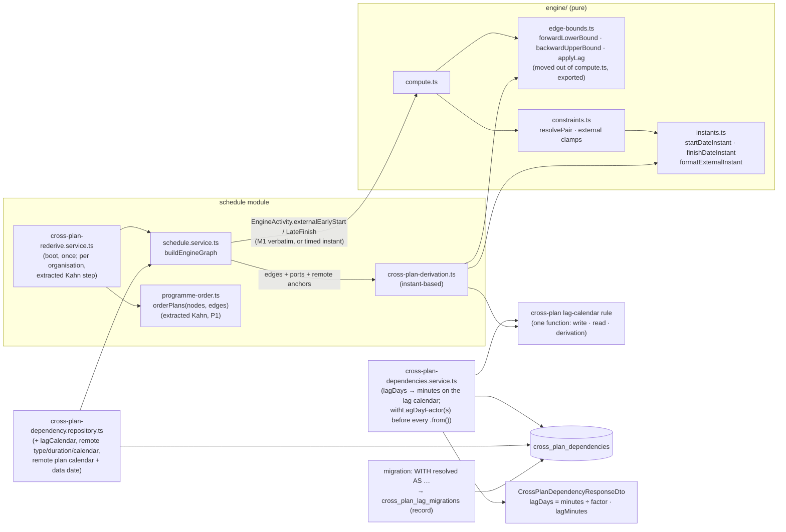
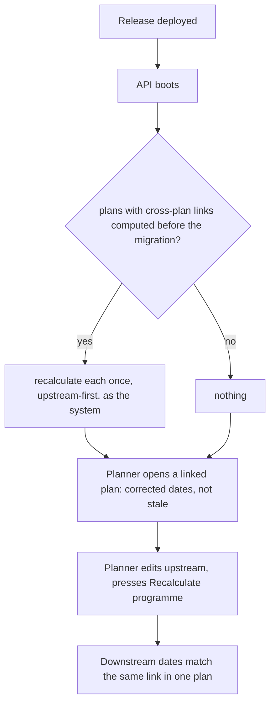

# Feature Spec: A cross-plan link produces the dates the same link would inside one plan

- **Status:** Approved — agreement round complete 2026-09-26 (see agreement-round.md); product owner delegated the open questions
- **Author(s):** feature-analyst (for the product owner)
- **Date:** 2026-09-26
- **Tracking issue / epic:** [`docs/TECH_DEBT.md`](../../TECH_DEBT.md) #385
- **Roadmap link:** Inter-project scheduling (ADR-0043 / ADR-0045). A planner-visible date change, so
  it takes a roadmap line rather than an exemption.
- **Related ADR(s):** ADR-0045 (amended by this spec's proposed ADR-0161), ADR-0035 §30.5 (amended),
  ADR-0043, ADR-0036 §6, ADR-0037, ADR-0053, ADR-0068 §4, ADR-0148, ADR-0155, ADR-0139, ADR-0107

This spec exists because the fix reaches past the row that raised it. #385 describes one date rule
(a successor may start on its upstream's last day). Reading the code found five more ways the
cross-plan bound differs from the in-plan one (E5–E8, E17). One of them, the lag unit, is stored
data (E6). Changing stored data is a schema-class change, and that is an ADR-0105 trigger.

## 0. Evidence: what the brief claimed and what was checked

This spec was written without a shell. The environment had read and search tools only. So every
claim below was established by **reading**. None was run. M0 exists to turn the decision-bearing
ones into executable results before any product code changes (ADR-0076, CLAUDE.md §19.11). The
prediction table in §4.2 is written now so the M0 red run can disagree with it.

| #   | Claim                                                                                                              | Verdict                            | Established by                                                                                                                                                                                                                                                                                                                                                                                        |
| --- | ------------------------------------------------------------------------------------------------------------------ | ---------------------------------- | ----------------------------------------------------------------------------------------------------------------------------------------------------------------------------------------------------------------------------------------------------------------------------------------------------------------------------------------------------------------------------------------------------- |
| E1  | The derivation works in whole `YYYY-MM-DD` days. FS gives `predecessorPlacedFinish + lag`.                         | True                               | `cross-plan-derivation.ts:107-111` (`addDays` adds UTC calendar days), `:139-142` (FS).                                                                                                                                                                                                                                                                                                               |
| E2  | The engine reads a bare external early start as the **start** of that day, except for a finish milestone.          | True                               | `engine/constraints.ts:243-246`. A bare date parses to 00:00 (`working-time-calendar.ts:84-91`). A `FINISH_MILESTONE` goes through `finishMilestoneDateInstant`, which reads a bare date as the **end** of the day (`instants.ts:64-67`).                                                                                                                                                             |
| E3  | A persisted finish date means the end of that day; the in-plan FS bound is the predecessor's exclusive end.        | True                               | Dates are "inclusive display dates" (`engine/types.ts:244-251`); the placed finish is built from the inclusive finish (`compute.ts:945-947`). The in-plan forward pass holds `earlyFinish` as "the exclusive end boundary after its last working minute" (`compute.ts:172-174`), and FS returns that instant plus lag (`compute.ts:1013-1014`).                                                       |
| E4  | So FS lag 0 lets the successor start on the upstream's last day, and a test pins it.                               | True                               | `cross-plan-conformance.spec.ts:121-139`: upstream EF `2026-01-10`, FS+2, golden expects `2026-01-12`. The in-plan engine on the same 24/7 calendar gives `2026-01-13` (the end of the 10th is the 11th at 00:00, plus two days).                                                                                                                                                                     |
| E5  | **Suspected:** `lagDays` is documented as working days but `addDays` adds calendar days.                           | **True**                           | Documented as working days at `cross-plan-derivation.ts:31`, `:58` and the DTO (`create-cross-plan-dependency.dto.ts:39`); added as calendar days at `:107-111`. A lag spanning a weekend lands short.                                                                                                                                                                                                |
| E6  | **Not in the brief:** stored cross-plan lag is `lagDays × 1440` whatever the calendar.                             | True, and larger than E5           | Write: `cross-plan-dependencies.service.ts:31,178`. Read back as `/1440`: `schedule.service.ts:1523,1534`, `cross-plan-dependency-response.dto.ts:74`. The in-plan write converts on the lag calendar's hours-per-day (`dependencies.service.ts:271-296`, `lag-day-factor.ts:63-72`). So `cross_plan_dependencies.lag_minutes` is not working minutes, although `schema.prisma:1711-1715` says it is. |
| E7  | **Not in the brief:** the lag calendar is ignored by the derivation.                                               | True                               | Neither load selects `lagCalendar` (`cross-plan-dependency.repository.ts:211-216`, `:240-245`). The column exists (`schema.prisma:1716-1718`) and the create dialog offers it (`AddCrossPlanLinkDialog.tsx:337-357`). A `TWENTY_FOUR_HOUR` cross-plan lag behaves like `PROJECT_DEFAULT`.                                                                                                             |
| E8  | **Not in the brief:** FF/SF/SS-backward durations are `durationMinutes / 1440`, subtracted as calendar days.       | True                               | `schedule.service.ts:1508-1518` (the docblock says the fixed 1440 is deliberate); used at `cross-plan-derivation.ts:151,158,183,194`. The in-plan bounds walk the duration on the activity's own calendar (`compute.ts:1018-1022`, `:1044-1048`).                                                                                                                                                     |
| E9  | **Suspected:** the backward bound has the mirror overlap.                                                          | **True** (FS), and SS-backward too | FS backward returns `successorLateStart − lag` as a date (`cross-plan-derivation.ts:175-178`). For an activity with duration the engine reads a bare late finish as the **end** of that day (`constraints.ts:276-280`). So the upstream may finish at the end of the day the downstream must start. §4.2 lists the per-type table.                                                                    |
| E10 | The engine port can already accept an instant on the forward side.                                                 | True                               | `instants.ts:62`: "A date carrying a time of day is already an instant and is read as one." `toAbsMinutes` reads `YYYY-MM-DDTHH:MM` (`working-time-calendar.ts:84-91`). Both branches of `clampExternalForwardStart` go through it (`constraints.ts:243-246`).                                                                                                                                        |
| E11 | The backward side **cannot**, for an activity with duration.                                                       | True                               | That branch calls `nextCalendarDay` (`constraints.ts:276-280`), which calls `parseCalendarDate`. That splits on `-` (`calendar-date.ts:27-30`), so `2026-01-10T08:00` yields `Number('10T08:00')`, which is `NaN`. The finish-milestone branch (`:272-273`) and the zero-duration branch (`:274-275`) accept an instant.                                                                              |
| E12 | A midnight instant written by the existing formatter is misread for a finish milestone.                            | True                               | `absMinutesToInstant` drops `T00:00` (`working-time-calendar.ts:94-103`). A bare finish-milestone date then reads as the end of that day (`instants.ts:66`), one day late. On a 24-hour or full-day calendar every boundary is midnight, so this is the common case there.                                                                                                                            |
| E13 | The in-plan bound functions are private to `compute.ts`.                                                           | True                               | `forwardLowerBound`, `backwardUpperBound`, `applyLag` at `compute.ts:993-1059`; not exported.                                                                                                                                                                                                                                                                                                         |
| E14 | A plan with no cross-plan edge never reaches the derivation.                                                       | True                               | Guard at `schedule.service.ts:1488-1489`. With no derived entry, `toEngineActivity` passes the M1 columns formatted as bare dates (`:2673-2682`).                                                                                                                                                                                                                                                     |
| E15 | Persisted dates carry no time of day.                                                                              | True                               | `early_*`, `late_*` and `visual_effective_*` are `@db.Date` (`schema.prisma:1213-1216`, `:1300-1301`).                                                                                                                                                                                                                                                                                                |
| E16 | The org's stock calendar is a full-day Monday-to-Friday calendar.                                                  | True                               | `organizations.service.ts:83-95` (one `[0,1440)` shift per weekday), so its hours-per-day is 1440. E6 does not bite it. E5 (weekends) does.                                                                                                                                                                                                                                                           |
| E17 | **Not in the brief:** an LOE upstream drives a cross-plan successor; in-plan it never does.                        | True                               | In-plan skips LOE predecessors and successors (`compute.ts:205-207`, `:462-464`). The cross-plan path knows no activity type (no type field in `cross-plan-derivation.ts:27-63`; grep for `LEVEL_OF_EFFORT` in `modules/cross-plan-dependencies/`: no hits).                                                                                                                                          |
| E18 | **Not in the brief:** a cross-plan link may touch a WBS summary; in-plan that is refused.                          | True; out of scope here            | In-plan reject: `dependencies.service.ts:227`. No equivalent in the cross-plan service (same grep, no hits). A write-path rule, filed rather than folded (§1, Open questions).                                                                                                                                                                                                                        |
| E19 | Cross-plan feeds the upstream's **placed** dates into both engine passes; in-plan, placed dates reach Pass 2 only. | True; deliberate (ADR-0148 M-H)    | Load: `cross-plan-dependency.repository.ts:215`. In-plan Pass 1 reads early dates (`compute.ts:218-220`), Pass 2 placed ones (`:316-318`). The external start is used in both passes (`:242`, `:327`). §1 "What the decision does not settle".                                                                                                                                                        |
| E20 | The backward direction has no conformance coverage.                                                                | True                               | The adapter always passes `outgoing: []` (`conformance/cross-plan-adapter.ts:166-171`). Only the derivation unit suite covers it, against its own day arithmetic.                                                                                                                                                                                                                                     |
| E21 | The programme API e2e asserts no dates.                                                                            | True                               | `apps/api/test/programme-schedule.e2e-spec.ts:156-220` checks order, locks and staleness only.                                                                                                                                                                                                                                                                                                        |
| E22 | ADR-0155 recalculated stale plans once at boot, keyed on a migration's `finished_at`.                              | True                               | `finish-milestone-rederive.service.ts:60-78`. It orders by plan id (`:78`), not by the programme graph.                                                                                                                                                                                                                                                                                               |
| E23 | Re-encoding a lag to a smaller factor cannot breach the lag range CHECK.                                           | True                               | Hours-per-day is `BETWEEN 1 AND 1440` (`migrations/20260801120000_calendar_hours_per_day/migration.sql:22-24`), so `days × factor` is never larger in magnitude than `days × 1440`, which already passed the CHECK.                                                                                                                                                                                   |
| E24 | The debt row says a downstream plan "can move one day earlier".                                                    | True of ADR-0155, not of this fix  | `TECH_DEBT.md:11733-11734` describes ADR-0155's effect on an upstream finish milestone. This fix moves downstream plans **later** (and loosens nothing): see §1, Expected outcomes.                                                                                                                                                                                                                   |

### 0.1 Claims added by the agreement round, and how each was checked

The agreement round ([agreement-round.md](./agreement-round.md)) cited code for each finding. Each
citation below was opened before it was relied on (CLAUDE.md §19.11). One is sharper than it was
stated (E28); one line range is approximate (E31); none is wrong.

| #   | Claim                                                                                                                                              | Verdict                                | Established by                                                                                                                                                                                                                                                                                                                                                                                              |
| --- | -------------------------------------------------------------------------------------------------------------------------------------------------- | -------------------------------------- | ----------------------------------------------------------------------------------------------------------------------------------------------------------------------------------------------------------------------------------------------------------------------------------------------------------------------------------------------------------------------------------------------------------- |
| E25 | **A1:** every cross-plan read divides by a hard-coded 1440, and the CRUD loads fetch only `{id, code, name}` per endpoint.                         | True                                   | `cross-plan-dependency-response.dto.ts:8` (`MINUTES_PER_DAY = 1440`), `:74` (`Math.round(entity.lagMinutes / MINUTES_PER_DAY)`); `endpointSelect` at `cross-plan-dependency.repository.ts:9`. Four callers of `.from()`: `cross-plan-dependencies.controller.ts:64` (create), `:75` (get), `plan-cross-plan-dependencies.controller.ts:45` and `activity-cross-plan-dependencies.controller.ts:55` (lists). |
| E26 | **A1:** the in-plan shape to mirror resolves the factor before `.from()`.                                                                          | True                                   | `dependencies.service.ts:84-129` (`withLagDayFactors` / `withLagDayFactor`); `dependency-response.dto.ts:93` (`minutesToDays(entity.lagMinutes, entity.lagDayFactorMinutes)`).                                                                                                                                                                                                                              |
| E27 | **A2:** the API docs tell clients to send `lagMinutes`, which a cross-plan link cannot accept, and the shared type claims identical lag semantics. | True                                   | `docs/API.md:704-705` (inside the `:659-708` section); `CreateCrossPlanDependencyDto` has no `lagMinutes` (`create-cross-plan-dependency.dto.ts:15-59`); `packages/types/src/index.ts:864` ("identical semantics to a dependency's"), while `CrossPlanDependencySummary` (`:856-871`) has no `lagMinutes`.                                                                                                  |
| E28 | **B1:** `lag_minutes * factor` overflows `int4`.                                                                                                   | True, and at a lower bound than stated | Stored lag is `lagDays × 1440` (`cross-plan-dependencies.service.ts:178`), up to 5,256,000 at 3650 days. The product overflows `2^31 − 1` when `                                                                                                                                                                                                                                                            | lag_minutes | × factor > 2,147,483,647`: at factor 480 above ~3,107 days, and at factor **1440** above ~1,035 days. So a factor-1440 row overflows too if the expression is evaluated for it, which the `WITH resolved` form does for every row. Arithmetic, not run. |
| E29 | **B5:** the driving-resource lookup filters on the partial unique index's predicate and three soft-delete guards.                                  | True                                   | Index: `uq_resource_assignments_activity_driving … WHERE "is_driving" AND "deleted_at" IS NULL` (`migrations/20260717020000_m7_resource_model/migration.sql:168`). Guards: assignment, activity and resource `deletedAt: null`, activity `type: 'RESOURCE_DEPENDENT'` (`driving-calendars.ts:25-34`).                                                                                                       |
| E30 | The TypeScript factor lookup does not filter calendars by `deleted_at`.                                                                            | True                                   | `calendar.repository.ts:366-384` (`findHoursPerDayMinutes`, "Deliberately **not** filtered by `deleted_at` or `archived_at`"). So database-architect's "no `deleted_at` filter on the calendar join" matches the resolver the differential check compares against.                                                                                                                                          |
| E31 | **P1:** `resolveProgrammeOrder` has no multi-node entry point.                                                                                     | True; line range approximate           | The function spans `programme-order.ts:45-118` (docblock `:45-57`, body `:58-118`), not `:47-106`. It BFS-es one target's upstream closure (`:74-85`) and runs Kahn over that closure only (`:87-117`). `compareIds` is at `:128-130`. The finding's substance is exact.                                                                                                                                    |
| E32 | There is no update route for a cross-plan link, and one create path writes rows one at a time.                                                     | True                                   | `cross-plan-dependencies.service.ts` exposes list, get, create, remove only; the only writes are `crossPlanDependency.create` (`cross-plan-dependency.repository.ts:108`) and the soft-delete `updateMany` (`:284`). No `createMany` anywhere under `apps/` (grep). So a `version` bump invalidates no in-flight edit, and the table holds curated rows only.                                               |
| E33 | The web does not parse cross-plan responses with a strict schema, so an additive response field is safe for the client.                            | True                                   | `apps/web/src/features/cross-plan-dependencies/schemas/cross-plan-schemas.ts` defines only the form schema (`:76`) and a lag formatter (`:64`).                                                                                                                                                                                                                                                             |
| E34 | The same stale "the rest schedule on the plan calendar today" sentence sits on the **in-plan** lag calendar too.                                   | True; found while checking A2          | `dependency-response.dto.ts:58-61` and `packages/types/src/index.ts:829-833`. Per-activity calendars landed with ADR-0037. Folded into M2-T3 beside its cross-plan copy, so the fix does not point a reader at a twin that is wrong.                                                                                                                                                                        |

**E6 and E7 matter most.** The brief framed the lag defect as calendar days versus working days.
The stored value itself is in the wrong unit on any calendar whose hours-per-day is not 1440, and
the planner's chosen lag calendar is never read. So "apply the lag in working days" is not a change
to the derivation alone. It is a change to what is stored.

## 1. Business understanding

### Problem

A programme is split across plans: procurement, engineering, construction, commissioning. A live
cross-plan link (ADR-0045) carries a finish-to-start or other tie from an activity in one plan to an
activity in another. The downstream plan's dates are derived from the upstream's persisted dates at
recalculation time.

That derivation is a second, simplified copy of the engine's link arithmetic, written in whole
calendar days. It disagrees with the engine in six ways:

1. **Day boundary (E1–E4, E9).** A finish date is read as the start of its day, so FS lets the
   downstream start on the upstream's last day. The backward bound has the mirror image.
2. **Lag walked in calendar days (E5).** A two-day lag from a Friday lands on Sunday, then rolls to
   Monday. In one plan it lands on Wednesday.
3. **Lag stored in the wrong unit (E6).** On an eight-hour calendar a one-day lag is stored as 1,440
   minutes and read back as one calendar day.
4. **Lag calendar ignored (E7).** A `TWENTY_FOUR_HOUR` cure lag across plans counts working days.
5. **Durations in calendar days (E8).** FF and SF subtract `round(minutes / 1440)` calendar days.
6. **LOE upstreams drive (E17).** In one plan an LOE never bounds a successor.

Every one of these makes a programme look healthier than it is: a downstream starts earlier, and an
upstream carries more float, than the same logic in one plan allows. A planner who splits a job into
plans gets a different, more optimistic programme than one who keeps it in one plan.

### Users

- **Planner** and **Org Admin**: they create cross-plan links (`dependency:link_cross_plan`) and run
  **Recalculate programme** (`schedule:calculate`). They see the corrected dates.
- **Contributor**, **Viewer**, **External Guest**: they read the dates. No permission changes.

### Primary use cases

1. A planner links an upstream finish to a downstream start with FS lag 0 and recalculates the
   programme. The downstream starts at the first working moment after the upstream finishes, as it
   would in one plan.
2. A planner sets a two-working-day lag across a weekend. It counts working days on the lag's
   calendar.
3. A planner sets a `TWENTY_FOUR_HOUR` lag for concrete cure across plans. It counts elapsed time.
4. An upstream plan's late dates are bounded by a downstream start, and the upstream is not allowed
   to finish on the day the downstream must start.

### User journeys

The journey does not change. A planner opens a plan with live cross-plan links, presses **Recalculate
programme** in the programme section, and reads the dates on the canvas, the Gantt and the status
bar. What changes is the dates. After the release, plans that carry cross-plan links are
recalculated once by the API (D8), so the first thing a planner sees is already corrected.

### Expected outcomes

- A cross-plan link and the same link inside one plan give the same dates, within the stated domain
  (§2, "Parity domain").
- In the common cases downstream plans move **later** and upstream plans lose float, by the amounts
  E1–E8 hid. Three kinds of case move the other way, and each is the in-plan behaviour: an LOE
  upstream stops driving (E17); a start-anchored link into a finish milestone, which today reads a
  day late; and a finish-anchored link out of a start milestone, which today is a day tight (§4.2).
- The stored cross-plan lag means the same thing as an in-plan lag: working minutes on the resolved
  lag calendar.

### Success criteria (committed before M0 measures anything)

These are falsification conditions. They are written now so the measurement cannot pick its own bar
(ADR-0058, ADR-0128's ordering).

- **FC-1, twin equality.** For every case in the parity matrix (§4.6), the cross-plan answer equals
  the in-plan answer **to the minute**. Forward: the successor's early-start instant. Backward: the
  derived external late-finish instant equals `backwardUpperBound` for the same edge in one plan.
  Zero tolerance. A single mismatch fails the milestone.
- **FC-2, red first, as predicted.** Against today's code, the matrix fails exactly on the cells
  §4.2 predicts and passes on the rest. **If the red run disagrees with the prediction in either
  direction, the work stops** and the disagreement is explained before anything is built. The
  prediction is a claim too. §4.2 fixes only the base case (24-hour calendar, lag 0), and the matrix
  also varies calendar, lag and lag calendar in both directions, so **a written prediction exists for
  every cell before the run**: a table or a small pure function that composes the §4.2 cell with the
  E5/E6/E7/E8 rules, committed in its own commit before M0-T1 runs the matrix (test-engineer,
  agreement round). A cell with no written prediction cannot "agree", so it counts as a disagreement.
- **FC-3, weekend golden.** Standard calendar (full-day, Mon–Fri), data date Mon `2026-01-05`,
  upstream 5-day task finishing Fri `2026-01-09`, FS lag 2 working days. Downstream early start is
  **Wed `2026-01-14`**. Today's code gives Mon `2026-01-12`.
- **FC-4, eight-hour lag golden.** Both plans on a Mon–Fri 08:00–16:00 calendar (hours-per-day
  480). Upstream finishes Tue `2026-01-06` 16:00. FS lag 1 working day, `PROJECT_DEFAULT`.
  Downstream early start is **Thu `2026-01-08`**. Today gives Wed `2026-01-07`. The fixed derivation
  **without** the lag migration gives Mon `2026-01-12` (1,440 stored minutes walked as three working
  days). Three outcomes, so this one case separates "fixed", "unfixed" and "half-fixed".
- **FC-9, backward golden (US-3's example).** Standard calendar. The downstream plan holds a 5-day
  task pinned `FNLT` Fri `2026-01-23`, so its late start is Mon `2026-01-19`. The upstream plan holds
  a 5-day task linked to it by FS lag 0, plus an unlinked 20-day task (Mon `2026-01-05` to Fri
  `2026-01-30`), so the upstream plan's own project finish is later than the bound and the linked
  task's late finish is set by the cross-plan bound alone. The linked task's late finish is **Fri
  `2026-01-16`**. Today's code gives Mon `2026-01-19` (the bare date read as the end of Monday, §4.2
  "Backward FS, task: 1 day loose"). Hand-computed from the calendar, never from the engine.
- **FC-10, finish-to-finish golden.** Standard calendar. The upstream plan's data date is Mon
  `2026-01-05` and it holds an unconstrained 5-day task, Mon `2026-01-05` to Fri `2026-01-09`. The
  downstream plan's data date is Mon `2025-12-29`, so no data-date floor masks the result. FF lag 0
  into a downstream task with no other logic.
  - **3-day downstream:** it starts **Wed `2026-01-07`** and finishes Fri `2026-01-09` (3 working
    days back from the end of Friday). Today's code gives Tue `2026-01-06` (`2026-01-09 − 3` calendar
    days, read as the start of Tuesday), finishing a day early.
  - **6-day downstream:** it starts **Fri `2026-01-02`** (6 working days back from the end of Friday,
    across the weekend). Today's code gives Mon `2026-01-05` (`2026-01-09 − 6` is Sat `2026-01-03`,
    rolled forward). A fix of the day boundary alone, still subtracting calendar days (E8), also
    gives Mon `2026-01-05`. So this cell separates "fully fixed" from "boundary fixed only".
- **FC-5, parity.** `compute.spec.ts` (the Pass-1 golden suite), the ADR-0034 conformance matrix and
  every engine spec pass **unedited**. The only existing assertions that change are the inverted
  characterisations listed in the plan (M2-T5), each with its old and new value written before the
  run. Any other red test stops the work.
- **FC-6, cost.** On a fixture of 100 cross-plan edges from 10 upstream plans on 10 distinct
  calendars, the added time in `buildEngineGraph` is **at most 50 ms p95** over the M0 baseline.
  The number of queries on the cross-plan path does not grow with edge count (a counting stub, not a
  timing): with the plans and calendars held fixed, the query count **and** the number of calendar
  resolutions are equal at 10 edges and at 100 edges (backend-performance-reviewer). The no-edge path
  issues exactly the queries it does today. The same counting-stub bound applies to the CRUD list
  reads (M2-T3b): the query count for a page does not grow with page size, and calendar factors are
  fetched once per distinct calendar across the page (api-reviewer).
- **FC-7, migration exactness.** Rewritten by the agreement round (database-architect B2, B3),
  because the first version could not detect a wrong factor and contradicted the `version` bump.
  - **Stored values, not API echoes.** Each seeded row's `lag_minutes` after the migration equals a
    **hand-written expected value** in the test. Reading `lagDays` back through the API is not
    enough: the response rounds (`Math.round(minutes / factor)`), so a wrong factor can still
    round to the right day count.
  - **A differential check.** For every seeded row, the record table's `day_factor_minutes` equals
    the factor the TypeScript resolver (M2-T3) returns for the same row. The SQL and the TypeScript
    are two spellings of one rule; this check is what holds them together.
  - **Unchanged rows are untouched.** Rows whose resolved factor is 1440, `TWENTY_FOUR_HOUR` rows and
    zero-lag rows keep `lag_minutes`, `version` and `updated_at` exactly. Pinned per class.
  - **Changed rows** get the new `lag_minutes` and `version + 1`, and keep `updated_at`.
  - **The reverse** restores every changed row's `lag_minutes` exactly and bumps `version` again. An
    optimistic-lock version never goes backwards, so "byte-for-byte" is claimed for `lag_minutes`
    and never for `version`.
  - **No overflow.** A row at ±3650 days on a 480-minute calendar and a row at ±3650 days on a
    1440-minute calendar convert correctly; the test is verified red against `int4` arithmetic
    (E28).
- **FC-8, one re-derivation.** After the first boot on the release, every live, calculated plan
  with an active cross-plan edge and a `schedule_computed_at` before the migration's `finished_at`
  has been recalculated once, upstream-first. No plan is left `scheduleStale` that was not stale
  before. A second boot recalculates nothing.

### Open questions

**All three are answered.** The product owner delegated them on 2026-09-26 ("go with the most robust
options you consider correct and let the agents ratify them"), and each default below was ratified
in the agreement round ([agreement-round.md](./agreement-round.md)): CQ-1 and CQ-2 by
database-architect and api-reviewer, CQ-3 by api-reviewer. The text is kept as the record of what
was decided and why.

**Critical (answers change the design or scope):**

- **CQ-1: Re-encode the stored lag, or convert on read?** (E6) **Answered: re-encode.** A data
  migration rewrites `cross_plan_dependencies.lag_minutes` to working minutes on the resolved lag
  calendar, and the write path converts like the in-plan write does. The alternative converts
  `lag_minutes / 1440 × factor` at every recalculation and needs no migration. It is rejected
  because a lag converted on read changes whenever somebody edits the calendar's hours, while an
  in-plan lag does not (ADR-0068 converts once, on write). That would break the principle this
  whole spec implements. The cost of the default is a data migration and a rollback that is a
  reverse migration, not a redeploy (§4.4).
- **CQ-2: What does `PROJECT_DEFAULT` mean for a link between two plans?** The product owner's
  decision says "the calendar the in-plan engine uses", and in one plan that is the plan's own
  calendar (`compute.ts:999`). Across two plans there are two. **Answered: the successor plan's
  calendar, in both directions.** "The successor plan" is the successor **activity's** `plan_id`,
  never the link's denormalised `successor_plan_id` (database-architect B5, D5). The successor plan is the link's home (ADR-0045 CQ-2): it holds the
  link, guards it with its pen, and is the plan whose schedule the link bounds. The obvious
  alternative, "the plan being recalculated", would walk the forward bound on the successor's
  calendar and the backward bound on the predecessor's, so the two ends of one link would disagree
  about its lag.
- **CQ-3: Recalculate affected plans automatically, once, at boot?** **Answered: yes** (D8, the
  ADR-0155 D9 precedent). Without it, a plan whose upstream has not changed is not flagged stale,
  so it keeps the old, optimistic dates until someone happens to run a programme recalculation.
  The cost is that plans move without a planner pressing anything, as they did for ADR-0155.

**Assumed defaults (not blocking):**

- **LOE is in scope** (E17). An LOE upstream contributes no forward bound; an LOE downstream
  contributes no backward bound. It is one check, it is the in-plan rule, and the load that
  supplies the type is needed anyway. An LOE skip is **not** an N32 skip: it does not increment
  `upstreamMissingCount`, or every plan with an LOE cross-plan link would report a phantom "upstream
  never calculated" warning (test-engineer).
- **WBS summary endpoints are out of scope** (E18). Refusing them is a write-path change with its own
  question (what happens to links that exist). Filed as a new debt row.
- **`lagMinutes` is added to the cross-plan response, read-only** (api-reviewer A2, the delegated
  robust option). This reverses this spec's first draft, which kept the cross-plan DTO free of it
  because ADR-0070 had deferred it. The reason it changed: `docs/API.md:704-705` tells every client
  to read and send `lagMinutes` because it is exact, and `packages/types/src/index.ts:864` says the
  cross-plan lag has "identical semantics" to an in-plan one (E27). Once the stored unit is honest,
  the exact value is worth exposing, and leaving it off keeps both documents wrong. The **request**
  is unchanged: create still accepts only whole `lagDays` (E27), so no sub-day cross-plan lag can be
  written.
- **No `VITE_*` flag** (ADR-0088 D1). No web change at all is expected; M0-T5 confirms it. The
  additive response field needs no web change (E33).
- **The API contract changes additively only.** `lagDays` still means working days, now honestly;
  `lagMinutes` is a new response field on `CrossPlanDependencySummary`. No field is removed or
  renamed, and no route changes. The field is a changeset (M2-T3c).

### What the decision does not settle

The product owner's rule is "a cross-plan link must produce the same dates as the same link would
inside one plan". Reading the code found three places where that cannot hold exactly, or where it
collides with an earlier decision. They are stated here so the agreement round decides them rather
than the build.

1. **Exact equality needs instants, and none are persisted** (E15). Upstream dates are stored as
   whole days. An upstream task that finishes at 12:00 is stored as that day, and the derivation can
   only read it as the end of that day's working time. So the cross-plan answer is **never earlier**
   than the in-plan one, and at most one upstream working day later, for a mid-day upstream finish.
   Sub-day durations are real (ADR-0070), so this is a live residual, not a hypothetical. Closing it
   needs instant columns written at every recalculation. That is a schema change on `activities`,
   and this spec defers it with a trigger: a planner reports a cross-plan successor starting later
   than the same link in one plan, or a sub-day upstream is seen on a programme. **The parity domain
   is therefore upstream activities that finish on a day boundary**, which is every activity with a
   whole-day duration.
2. **`PROJECT_DEFAULT` is ambiguous across two plans.** CQ-2.
3. **A hand-placed upstream behaves differently by design** (E19). In one plan, a hand-placed
   predecessor pushes its successor only in the effective-Visual pass; early dates, late dates and
   float ignore the placement. Across plans, ADR-0148 M-H chose the placed dates as the basis for
   both passes, on purpose ("an interface is about where the upstream work is planned to happen",
   `cross-plan-dependency.repository.ts:36-41`). This spec does not reopen ADR-0148. The parity
   domain is therefore **unplaced** upstreams, where placed and early dates agree. A placed upstream
   gets the corrected day rule and lag on its placed dates.

Two smaller residuals are recorded rather than fixed, because each needs state the derivation does
not have:

- **Progress-mode tie dropping.** In one plan, an in-progress successor under Progress Override or
  Actual Dates drops ties from incomplete predecessors (`compute.ts:212-216`). The external bound is
  applied regardless, as it is for a hand-entered M1 date today. Filed.
- **Expected-finish resizing.** The in-plan backward bound uses an expected-finish-resized duration
  when that option is on (`compute.ts:457-459`). The derivation can only use the stored duration.
  Option-gated, off by default. Filed.

## 2. Functional requirements

### User stories and acceptance criteria

> **US-1**: As a planner, I want a cross-plan FS link to start the downstream after the upstream
> finishes, so that a programme split into plans is not more optimistic than one plan.
>
> - **Given** an upstream task finishing Fri `2026-01-09` on the Standard calendar and an FS lag 0
>   link, **when** I recalculate the programme, **then** the downstream starts Mon `2026-01-12`,
>   exactly as the same link in one plan.
> - **Given** the same with an upstream **finish milestone** dated `2026-01-09`, **then** the same
>   result (ADR-0155: its date means the end of that day).

> **US-2**: As a planner, I want a cross-plan lag to count working time on the lag's calendar.
>
> - **Given** FS lag 2 working days from a Friday finish (FC-3), **then** Wednesday.
> - **Given** an eight-hour calendar and lag 1 working day (FC-4), **then** the next working day
>   after the one following the finish, as in one plan.
> - **Given** a `TWENTY_FOUR_HOUR` lag of 2 days from a Friday finish on the Standard calendar,
>   **then** Monday, as in one plan. Today's code also gives Monday, by accident (Sunday, rolled
>   forward). The case is there to fail a fix that walks working days and still ignores the lag
>   calendar (E7), which would give Wednesday.
> - **Given** a lead (negative lag), **then** it walks backwards on the same calendar.

> **US-3**: As a planner, I want the upstream's late dates bounded by a downstream start without an
> overlap day.
>
> - **Given** a downstream late start of Mon `2026-01-19` and FS lag 0, **when** I recalculate,
>   **then** the upstream's external late finish is the end of Fri `2026-01-16` on the Standard
>   calendar, not the end of Monday.

> **US-4**: As a planner, I want an LOE upstream not to drive a downstream plan, as it does not in
> one plan.

> **US-5**: As a planner, I want the dates I already have to be corrected without doing anything.
>
> - **Given** a plan with cross-plan links last calculated before the release, **when** the API
>   first boots on the release, **then** it is recalculated once, upstream plans before downstream
>   plans, and ends fresh (FC-8).

### Workflows

Forward, for each incoming cross-plan edge into this plan (successor here):

1. Skip if the upstream predecessor is an LOE (**not counted**: an LOE never bounds a successor in
   one plan, so its absence is not a warning), or if its placed dates are null (N32, **counted**
   in `upstreamMissingCount` as today). The two skips are separate branches, pinned by M2-T6's cases
   (`=== 0` for LOE, `=== 1` for null dates).
2. Read the upstream anchor as an **instant** on the upstream activity's scheduling calendar: its
   placed start for SS/SF, its placed finish for FS/FF, by the date reader for its type (D3).
3. Resolve the lag calendar port (D5) and the lag in working minutes (D4).
4. Call the engine's own `forwardLowerBound` with the successor's calendar and duration (D2).
5. Take the latest bound per successor.

Backward, for each outgoing cross-plan edge out of this plan (predecessor here): the mirror, reading
the downstream successor's late start (FS/SS) or late finish (FF/SF) on its own calendar, skipping an
LOE successor, calling `backwardUpperBound` with the predecessor's calendar and duration, and taking
the earliest bound per predecessor.

Composition with the M1 hand-entered column (§30.5, unchanged in intent): compare as **instants** on
this activity's calendar, not as strings (D6). If the M1 value wins or ties, pass the M1 string
through verbatim. If the derived value wins, pass it as a timed instant string.

### Edge cases

| Case                                                          | Expected behaviour                                                                                                                                                   |
| ------------------------------------------------------------- | -------------------------------------------------------------------------------------------------------------------------------------------------------------------- |
| Upstream finish milestone                                     | Its placed date means the end of that day (ADR-0155 D3); read with `finishMilestoneDateInstant`.                                                                     |
| Downstream finish milestone                                   | Receives a timed instant, so it is not re-read as end-of-day (E12). A bare midnight string here would put it one day late; the formatter never writes one (D7).      |
| Start milestone or zero-duration task upstream                | Its finish is its start instant, as in one plan (`constraints.ts:124-126`).                                                                                          |
| Upstream and downstream on different calendars                | Anchor on the upstream's calendar, duration on the downstream's, lag on the resolved lag calendar: exactly the in-plan split.                                        |
| `RESOURCE_DEPENDENT` upstream                                 | Its scheduling calendar is its driving resource's (`schedulingCalendarId`, `lag-day-factor.ts:34-55`). Loaded only when such an endpoint exists (the #86 cost rule). |
| Remote activity inherits its plan's calendar                  | Resolve to **its own** plan's calendar, not this plan's. The inherit sentinel means "my plan", and there are two plans (the ADR-0139 lesson).                        |
| Upstream finishes mid-day (sub-day duration)                  | Read as the end of that day. Never earlier than in-plan, at most one upstream working day later. Documented residual (§1).                                           |
| Derived start before this plan's data date                    | Floored by the engine and counted N25, as today (`compute.ts:655-661`).                                                                                              |
| Upstream never calculated                                     | N32: no bound, counted, as today.                                                                                                                                    |
| Downstream never calculated (backward)                        | No bound, not counted, as today (`cross-plan-derivation.ts:239-247`).                                                                                                |
| Plan with no cross-plan edge                                  | Untouched. The guard at `schedule.service.ts:1488-1489` still returns before any new code runs.                                                                      |
| `ignoreExternalRelationships` on                              | The derived value is still computed and dropped by the engine, as today (§30.4).                                                                                     |
| Soft-deleted cross-plan link (lag migration)                  | Re-encoded too, so a restore does not bring back the old unit. Confirmed by database-architect (§4.4).                                                               |
| LOE upstream (forward)                                        | No bound, and **not** counted in `upstreamMissingCount` (§1, assumed defaults). Distinct from N32.                                                                   |
| Lag of ±3650 days (lag migration)                             | Converted in `numeric`, so no `int4` overflow on any calendar, including 1440 (E28).                                                                                 |
| Link whose denormalised plan id disagrees with its activity's | Irrelevant by construction: every plan is resolved through the endpoint activity's `plan_id` (D5, database-architect B5).                                            |

### Permissions

No change. Link create stays `dependency:link_cross_plan` with the successor plan's pen (ADR-0045
§6). Programme recalculation stays `schedule:calculate` with the pen on every plan it writes. The
boot re-derivation runs as the system, asserts no pen and is not audited, as ADR-0155 D9 does
(`schedule.service.ts:613-625`).

The widened loads read the remote endpoint's type, duration, calendar id and its plan's calendar id
and data date. All are in the same organisation (a cross-plan link is same-org by construction,
ADR-0045 §6), and the queries keep the `organizationId` filter.

### Validation rules

- `lagDays` stays an integer in −3650…3650 (`create-cross-plan-dependency.dto.ts:35-46`). It is
  converted to working minutes on the resolved lag calendar (D4). Minutes stay within the existing
  CHECK (E23).
- `lagCalendar` unchanged.

### Error scenarios

| Scenario                                       | Detection                  | Result                                                                | Status               |
| ---------------------------------------------- | -------------------------- | --------------------------------------------------------------------- | -------------------- |
| A remote calendar cannot be resolved (deleted) | `resolveCalendar` fallback | Falls back as the in-plan path does (`schedule.service.ts:1662-1667`) | 200, no error        |
| A plan fails during the boot re-derivation     | caught per plan            | Logged `schedule.xplan_rederive_plan_failed`; retried next boot       | none (boot proceeds) |
| Programme recalc on a peer-locked plan         | unchanged                  | 423 `PROGRAMME_PLANS_LOCKED`                                          | 423                  |

## 3. Technical analysis

| Area           | Impact | Notes                                                                                                                                                                                                                                                                                                                |
| -------------- | ------ | -------------------------------------------------------------------------------------------------------------------------------------------------------------------------------------------------------------------------------------------------------------------------------------------------------------------- |
| Frontend       | none   | No `apps/web` change expected. M0-T5 greps for any client-side cross-plan date arithmetic.                                                                                                                                                                                                                           |
| Backend        | high   | `cross-plan-derivation.ts` rewritten on instants; `engine/` gains exported bound and date-reader modules (refactor) and one new clamp branch; `schedule.service.ts` builds richer inputs; one boot service.                                                                                                          |
| Database       | medium | **A data migration** re-encoding `cross_plan_dependencies.lag_minutes` (CQ-1), and **one new table**, the record `cross_plan_lag_migrations` (database-architect §b). `cross_plan_dependencies` gets no new column, index or constraint (E7: `lag_calendar` exists). §4.4.                                           |
| API            | low    | One **additive** response field, `lagMinutes` (A2). The cross-plan write converts `lagDays` on the lag calendar; **every read** (create, get, both lists) divides by the same factor (A1). `docs/API.md` states both, corrects `:659-708` for cross-plan links, and says that dates across plans now match one plan. |
| Security       | low    | No new route or permission. Loads widen within one organisation.                                                                                                                                                                                                                                                     |
| Performance    | low    | Cross-plan path only: wider includes, one conditional driving-calendar query per distinct (org, plan), one `resolveCalendar` per distinct remote calendar (FC-6). The CRUD reads gain one plan-calendar query and one factor query per page, never per row.                                                          |
| Infrastructure | none   | —                                                                                                                                                                                                                                                                                                                    |
| Observability  | low    | Boot re-derivation logs `schedule.xplan_rederived` with `pending`, `recalculated`, `durationMs` (the ADR-0155 shape), which also gives the deployed population.                                                                                                                                                      |
| Testing        | high   | Parity matrix (conformance tier), goldens, unit suite rewrite, migration test, API e2e twin, boot re-derivation e2e.                                                                                                                                                                                                 |

### Dependencies

- ADR-0155 must stay as it is: the finish-milestone date readers are reused, not changed.
- `cross-plan-basis.structural.spec.ts` must pass unedited: field names `predecessorPlacedFinish`
  and `successorLateStart` stay, and the placed/late asymmetry stays (E19).
- The inverted characterisations in `cross-plan-conformance.spec.ts` and `cross-plan-derivation.spec.ts`
  change with the derivation (M2-T5).
- M2 and M3 ship in **one release**. Between them the plans are silently wrong, which is the thing
  M3 exists to prevent.
- **One pull request carries the migration, the write-path conversion, the response divisor and the
  derivation's lag read** (database-architect B4). Split across PRs, `main` would hold
  `lag_minutes` in two units at once, and today's readers divide by 1440 (`schedule.service.ts:1523`,
  `:1534`; `cross-plan-dependency-response.dto.ts:74`): a one-day lag migrated to 480 minutes reads
  as `Math.round(480 / 1440) = 0`, so the lag is **silently dropped** from every recalculation and
  every response. The plan's M2 boundary states which tasks that PR holds.

## 4. Solution design

### 4.1 Architecture overview



**One rule, not two.** The derivation calls the engine's own bound functions and the engine's own
date readers. There is no second copy of the link arithmetic to drift (the ADR-0065 `routeOrthogonal`
argument, the ADR-0139 two-maps argument). What the derivation owns is only what the engine cannot
know: where the remote anchor is, and which calendar each end is on.

### 4.2 Why the defect has the shape it has (the prediction for FC-2)

A persisted date means the start of its day or the end of it depending on **which end** it is and
**which type** reads it. The old code turned every one of them into a bare date and handed it to a
reader that picks start or end by the type of the activity in _this_ plan. So the error depends on
the link type, on this plan's activity type, and on which boundary the anchor was. Instants make
all of that disappear.

Prediction on a 24-hour calendar, lag 0, whole-day tasks unless noted. "Early" means the cross-plan
bound is earlier than in one plan (optimistic start); "loose" means a later late finish (float
overstated).

| Direction | Type | This plan's activity is a task | …is a finish milestone | …is a start milestone |
| --------- | ---- | ------------------------------ | ---------------------- | --------------------- |
| Forward   | FS   | 1 day early                    | equal                  | 1 day early           |
| Forward   | SS   | equal                          | 1 day late             | equal                 |
| Forward   | FF   | 1 day early                    | equal                  | 1 day early           |
| Forward   | SF   | equal                          | 1 day late             | equal                 |
| Backward  | FS   | 1 day loose                    | 1 day loose            | equal                 |
| Backward  | SS   | 1 day loose                    | 1 day loose            | equal                 |
| Backward  | FF   | equal                          | equal                  | 1 day tight           |
| Backward  | SF   | equal                          | equal                  | 1 day tight           |

On a Mon–Fri calendar, add the weekend error (E5) to any case whose lag or duration spans a weekend.
On a calendar whose hours-per-day is not 1440, add E6 and E8. On a `TWENTY_FOUR_HOUR` or
`PREDECESSOR`/`SUCCESSOR` lag calendar that differs from the plan's, add E7.

Two cells are worth naming: today's code is **late**, not early, for a start-anchored link into a
finish milestone, and **tight** for a finish-anchored link out of a start milestone. The fix
therefore does not only move dates later. Those cells are rare (a milestone at the end of a
cross-plan start tie), and M0-T2 counts them on the seed catalogue.

### 4.3 Data flow

```mermaid
sequenceDiagram
  participant P as Planner
  participant API as Programme recalc
  participant S as buildEngineGraph (downstream plan)
  participant R as repository
  participant D as deriveExternalInstants
  participant E as computeSchedule
  P->>API: Recalculate programme
  API->>API: upstream plans first (unchanged, ADR-0045 §4)
  API->>S: recalculate downstream plan
  S->>R: countActiveForPlan
  alt no cross-plan edge
    R-->>S: 0
    S->>E: M1 columns as today (byte-identical)
  else edges
    R-->>S: edges + lagCalendar + remote type/duration/calendar/plan calendar/data date
    S->>S: resolve remote calendar ports (once per distinct id)
    S->>D: edges, ports, M1 columns, local types/durations
    D->>D: anchor instant (date reader) → lag (edge-bounds) → bound
    D->>D: compose with M1 as instants; winner keeps its own form
    D-->>S: externalEarlyStart / externalLateFinish
    S->>E: engine input (timed instant or M1 string)
  end
  E-->>S: results
```

### 4.4 Database changes (CQ-1): a data migration and a record table

**Designed by database-architect in the agreement round** (its §b, recorded in
[agreement-round.md](./agreement-round.md)), which is what this section now states. CQ-1 and CQ-2
are ratified. The migration **as written** goes back to the agent before its PR is opened (M2-T1)
and again at the gate pass (M4-T1), without exception (CLAUDE.md §19.3).

**The only new schema object is a record table.** `cross_plan_dependencies` needs no new column,
index or constraint.

#### The record table `cross_plan_lag_migrations`

- `plan_id` references `plans` **`ON DELETE CASCADE`**, so the ADR-0096 hierarchy expiry deletes a
  plan's records with it. It is the link's home plan, resolved through the **successor activity's**
  `plan_id` (B5).
- **No foreign key on the cross-plan dependency id or on the calendar id.** The record must outlive a
  hard-deleted link or a deleted calendar, and it is evidence of what the migration did rather than a
  live reference.
- **`UNIQUE (cross_plan_dependency_id)`**: one record per link, so the reverse can never restore a
  link twice.
- **Columns the findings require:** `cross_plan_dependency_id`, `plan_id`, `lag_calendar`, the
  resolved calendar id (nullable, for `TWENTY_FOUR_HOUR` and an unresolved calendar),
  **`day_factor_minutes`** (B2's differential check reads it), the prior `lag_minutes` and the new one,
  and `migrated_at`. database-architect's M2-T1 design is final on the exact column list, the
  `organization_id` column and any index; the precedent is `finish_milestone_date_migrations`, which
  indexes `plan_id` so the cascade can find its children
  (`migrations/20260923120000_finish_milestone_end_of_day_placements/migration.sql:154-157`).
- **It records every row the statement resolves, including rows whose value does not change.** This
  spec's reading of §b, stated so database-architect can confirm it (M2-T1): the B2 differential
  compares `day_factor_minutes` with the TypeScript resolver for **every** seeded row, and the
  failure it exists to catch is an eight-hour row wrongly resolved to 1440. That row would be left
  unchanged; if unchanged rows were not recorded, the check would have nothing to compare and would
  pass. The reverse only touches rows whose prior and new values differ.

#### The conversion: one statement, last in the file

- **One `WITH resolved AS (…)` statement**, placed **after** the record table's DDL. The CTE
  resolves each row's factor once; the same statement inserts the record rows and updates the
  changed links, so the recorded set and the converted set are one set by construction (the
  ADR-0148 shape).
- **Every row, soft-deleted included.** A restored link must not come back in the old unit.
- **`numeric` arithmetic** (B1): `round(lag_minutes::numeric * factor / 1440)::integer`. In `int4`
  the product overflows before the division: at factor 480 above about 3,107 days and at factor 1440
  above about 1,035 days (E28), and the `WITH` form evaluates the expression for every row, not only
  the ones it updates. Overflow on a populated table is ADR-0107's restart loop on the deployed host,
  and a pristine CI database cannot exhibit it. Stored values are multiples of 1440 (the DTO only
  ever accepted whole days, `@IsInt`, `create-cross-plan-dependency.dto.ts:43`), so the `round`
  changes nothing for any row the API could have written; for any other row the record keeps the
  prior value, so the reverse is still exact. The migration raises no error on such a row, because a
  `RAISE` on populated data is the same restart loop.
- **Only rows whose value changes are updated** (B3): `WHERE new_lag_minutes <> lag_minutes`. So
  factor-1440 rows, `TWENTY_FOUR_HOUR` rows and zero-lag rows are **not touched**: `lag_minutes`,
  `version` and `updated_at` all stay. Each class is pinned by the migration test.
- **Changed rows bump `version` and leave `updated_at` alone.** A planner-owned input is rewritten,
  so optimistic locking must see it (ADR-0148, ADR-0155). There is no update route (E32), so the bump
  invalidates no in-flight edit. `updated_at` is left because nobody updated the link.
- **Resolved lag calendar per row**, mirroring `lagCalendarIdFor` (`lag-day-factor.ts:34-55`) with
  the two-plan rule (CQ-2). **Every plan is reached through the endpoint activity's `plan_id`**,
  never through the link's `predecessor_plan_id` / `successor_plan_id` (B5):
  - `TWENTY_FOUR_HOUR`: factor 1440, row unchanged.
  - `PROJECT_DEFAULT`: the successor activity's plan's `calendar_id`.
  - `PREDECESSOR` / `SUCCESSOR`: that endpoint's scheduling calendar: its driving resource's for a
    `RESOURCE_DEPENDENT` activity with an active driver, else the activity's own, else **its own
    plan's**.
  - A null or unresolved calendar id: `DEFAULT_HOURS_PER_DAY_MINUTES` (1440,
    `packages/types/src/index.ts:1186`; `lag-day-factor.ts:69`).
- **The driving-resource join cannot fan out** (B5). It uses the partial unique index's predicate
  **exactly**, `is_driving AND deleted_at IS NULL`
  (`migrations/20260717020000_m7_resource_model/migration.sql:168`), so it matches at most one row
  per activity, plus the soft-delete guards `driving-calendars.ts:25-34` applies (activity and
  resource not deleted, activity type `RESOURCE_DEPENDENT`). A soft-deleted endpoint therefore falls
  back to its own calendar, which is also what the TypeScript resolver answers for it (E29).
- **The calendar join carries no `deleted_at` filter**, matching `findHoursPerDayMinutes`
  (`calendar.repository.ts:366-384`, E30): an activity may be bound to an archived or deleted
  calendar, and the TypeScript side does not filter either.
- **The CHECK cannot fail** (E23).

#### Scale and cost

- **The table is small and curated.** A cross-plan link is created one row at a time through one
  route (`cross-plan-dependency.repository.ts:108`); there is no bulk path and no import path (E32).
  So a single statement needs no `ctid` batching (backend-performance-reviewer).
- **Measured, not asserted:** `EXPLAIN ANALYZE` of the statement over 10,000 seeded rows, five runs,
  recorded in the migration's header comment and in `m2/migration-design.md` (database-architect
  §b). ADR-0148 recorded a migration cost comment copied from a review without re-derivation; this
  one is re-run by M2-T2 on the SQL as shipped.

#### Reversal

A redeploy of the previous image after the migration would read working minutes as `× 1440` days
and write new rows in the old unit, mixing encodings in one column (the ADR-0107 hazard). So the
rollback is a documented reverse, in `docs/DEPLOYMENT.md` ("Rolling back past the cross-plan lag
release"), in this order:

1. Lock the record table.
2. Restore `lag_minutes` from the record for every changed row, and bump `version` again.
3. Convert rows **created after the release** (they have no record) back to
   `round(lag_minutes / factor) × 1440`, resolving the factor by the same rule, in `numeric`.
4. Run a check query: every row's `lag_minutes` is a multiple of 1440, the old unit's shape.
5. Drop the record table.

#### Marker and documents

- **Marker.** `_prisma_migrations.finished_at` for this migration is the boot re-derivation's
  marker (D8), so no date is written into code.
- `schema.prisma:1711-1715`'s comment ("working-MINUTE lag") becomes true; the `DATABASE.md` entry
  records the change and the record table.

### 4.5 API changes

No route changes. One **additive** response field (A2). Everything else is a correction of what a
number means.

- **Write.** `POST …/cross-plan-dependencies` converts `lagDays` with the lag calendar's factor,
  through **one** cross-plan lag-calendar function carrying **each endpoint's own plan calendar**
  (D5). The same function is used by the read path and the derivation, and B2's differential check
  compares the migration's SQL against it.
- **Read, on every route** (api-reviewer A1). Today `CrossPlanDependencyResponseDto.from` divides by
  a hard-coded 1440 for create, get and both lists (E25). After the migration that would report an
  eight-hour one-day lag as `lagDays: 0`. So the service mirrors the in-plan shape
  (`dependencies.service.ts:84-129`, E26): an async `withLagDayFactor(s)` resolves each row's factor
  before `.from()`, and `.from()` takes `WithLagDayFactor<…>` and uses `minutesToDays`, as
  `dependency-response.dto.ts:93` does. The CRUD loads widen the endpoint select from
  `{id, code, name}` to add `type`, `calendarId` and `planId`, so the factor rides on the join.
- **Batched per page, never per row.** A page from the activity list spans plans (it holds both
  directions), so the lookup collects distinct plan ids across the page (one `findCalendarIds`),
  loads driving calendars through `loadDrivingCalendarMapForRows` (one query per distinct (org, plan)
  that has a `RESOURCE_DEPENDENT` endpoint, `driving-calendars.ts:74-94`), and fetches factors once
  for the page's distinct calendar ids (`findHoursPerDayMinutes`). A counting stub pins it (FC-6).
- **`lagMinutes` on the response and on `CrossPlanDependencySummary`** (A2): the stored working
  minutes, read-only. The request does not gain the field (§1, assumed defaults). Additive, so it
  takes a changeset (M2-T3c).
- **Stale descriptions corrected.** The three cross-plan sites: `create-cross-plan-dependency.dto.ts:51-54`
  ("PREDECESSOR/SUCCESSOR coincide with the plan calendar until per-activity calendars land", stale
  since ADR-0037), `cross-plan-dependency-response.dto.ts:45-49` ("the rest schedule on the plan
  calendar today"), and `packages/types/src/index.ts:864` ("identical semantics", true only after
  this change and only with `PROJECT_DEFAULT` meaning the successor plan's calendar, which it must
  now say). The in-plan twins of the second sentence (`dependency-response.dto.ts:58-61`,
  `packages/types/src/index.ts:829-833`, E34) are corrected in the same task. The fixed-1440
  constants and their docblocks (`cross-plan-dependencies.service.ts:27-31`,
  `cross-plan-dependency-response.dto.ts:7-8`) are deleted.
- **`docs/API.md`.** The cross-plan section (`:264-312`) states that `lagDays` is measured on the
  lag calendar with `PROJECT_DEFAULT` meaning the successor plan's, that `lagMinutes` is returned but
  cannot be sent, and that cross-plan dates now match one plan, naming the residuals. The general
  section `:659-708` gains one sentence at `:704-705`: a cross-plan link accepts only `lagDays`.

### 4.6 Component changes

None.

### 4.7 Implementation approach and alternatives

**D1: instants across the seam, not dates.** The derivation computes every bound as an absolute
working instant, the engine's own frame (ADR-0037). The engine port already accepts an instant on
the forward side (E10). The backward side gains one branch (D7).

**D2: the derivation calls the engine's bound functions.** `forwardLowerBound`, `backwardUpperBound`
and `applyLag` move from `compute.ts` into `engine/edge-bounds.ts`, exported through the engine
barrel, byte-for-byte. `compute.ts` imports them. The golden suite passing unedited is the proof
the move changed nothing (the ADR-0078 barrel-preserving oracle).

The cost is stated rather than hidden: a defect in a shared function would appear in both the
cross-plan answer and its in-plan twin, so the twin comparison cannot catch it. The in-plan golden
suite and the **hand-computed** goldens are the independent oracle. The agreement round
(test-engineer T1) found that the first draft's oracle did not cover the risk it was cited for:
FC-3 and FC-4 are both **forward FS**, so a defect in the backward branch or in the FF/SF arithmetic
of a shared function was invisible to every instrument except a twin comparison, which is the one
the paragraph above says cannot see it. So the oracle now spans both directions and both anchor
kinds:

- FC-3 and FC-4: forward FS (weekend lag; eight-hour lag).
- **FC-9: backward FS** (US-3's own example), hand-computed.
- **FC-10: forward FF**, hand-computed, with a weekend-spanning cell that separates "fully fixed"
  from "day boundary fixed only".

The same rule governs the unit suite: the rewritten prediction table in
`cross-plan-derivation.spec.ts` is **hand-derived per cell** from the in-plan semantics before the
new code runs. It is never characterised from the new code's output, which would make it a second
twin comparison. M0-T1's record-then-flip method is the right model for today's code and the wrong
one here.

**D3: one pair of date readers, used by the engine and the derivation.** `constraints.ts` already
reads a date as a start or a finish instant, in two places: `resolvePair` (`:108-133`) and
`clampExternalBackwardFinish` (`:271-280`). They are extracted into `instants.ts`:

- `startDateInstant(cal, date, type)`: a finish milestone reads its date as the end of that day
  (`finishMilestoneDateInstant`); every other type reads the start of the day's working time.
- `finishDateInstant(cal, anchorAbs, date, type, durationMinutes)`: a finish milestone as above; a
  zero-duration activity reads its start; everything else reads the end of that day's working time.

Both constraint call sites and the derivation use them. Engine output is unchanged, pinned by FC-5.
This was not in the brief; it is the same one-rule argument as D2, one layer down.

**D4: lag in working minutes on the resolved lag calendar.** The stored value becomes honest (CQ-1)
and is passed unchanged as `EngineEdge.lagMinutes`.

**D5: every lag calendar resolves to an explicit port.** The derivation never relies on
`applyLag`'s `?? planCalendar` fallback (`compute.ts:999`), because "the plan" is two plans.
`PROJECT_DEFAULT` resolves to the successor plan's calendar in both directions (CQ-2).
`PREDECESSOR` and `SUCCESSOR` resolve to that endpoint's scheduling calendar, inheriting from **its
own** plan. `TWENTY_FOUR_HOUR` resolves to `allMinutesWorkCalendar`.

"Its own plan" and "the successor plan" are always read from the **endpoint activity's `plan_id`**,
never from the link's denormalised `predecessor_plan_id` / `successor_plan_id` (database-architect
B5). The create path already derives both from the loaded activities
(`cross-plan-dependencies.service.ts:129-132`); the rule makes the read path, the derivation's loads
and the migration agree with it, so the denormalised columns are never a second source for a
calendar.

One function computes the lag calendar for a cross-plan link, from a context carrying each
endpoint's type, calendar id, driving calendar id and **own plan calendar id**. It is built on
`schedulingCalendarId` (`activities/day-factor`), which `lagCalendarIdFor` already uses, rather than
restating its fallback rung; the existing `LagCalendarContext` has one `planCalendarId` and cannot
express two plans. The write path, the read path (A1) and the derivation call it, and the migration
test's differential check (B2) compares the SQL against it.

**D6: compose with the M1 column as instants, and keep the winner's own form.** String comparison
is wrong once a timed value meets a bare one: a bare finish-milestone date means the end of the
day, so `2026-01-12` is later than `2026-01-12T10:00` and sorts earlier. So the M1 column is read
with the D3 reader on this activity's calendar, the later (forward) or tighter (backward) instant
wins, and **an M1 winner is passed through as its original bare string**. That keeps the engine
input byte-identical for every activity whose M1 date already wins, including the N25 warning count,
which compares strings (`compute.ts:655-661`).

**D7: one formatter, and the backward clamp reads a timed value as an instant.**
`formatExternalInstant(abs)` always writes `YYYY-MM-DDTHH:MM`, including `T00:00`, because
`absMinutesToInstant` drops it (E12). In `clampExternalBackwardFinish`, a value longer than ten
characters is used as the instant itself for every type, mirroring the rule at `instants.ts:62`.
No persisted column can produce such a value (M1 columns are formatted as bare dates,
`schedule.service.ts:2673-2682`), so the new branch is reachable only from the derivation. The same
rule means the forward clamp needs no change (E10).

**D8: recalculate the affected plans once, at boot (CQ-3).** A `CrossPlanRederiveService`, beside
and shaped like `FinishMilestoneRederiveService`:

- **Which plans.** Live, with a data date, with at least one active cross-plan edge in either
  direction, and `schedule_computed_at` earlier than the lag migration's `finished_at`.
- **In what order.** Topologically, per organisation, ties by plan id. Unlike the finish-milestone
  service's id order (E22), this matters here: a downstream recalculated before its upstream would
  read old upstream dates and end stale. **How** was corrected by backend-performance-reviewer P1:
  the first draft said to "reuse `programme-order.ts`'s sort over the whole adjacency", and
  `resolveProgrammeOrder(targetPlanId, edges)` cannot do that. It BFS-es one target's upstream
  closure and runs Kahn over that closure only, with no multi-node entry point (E31). So:
  - **Extract** its Kahn step as an exported pure function taking an explicit node `Set` and the
    edges, keeping the same `compareIds` tie-break and the same `ProgrammeCycleError` on a residual
    cycle. `resolveProgrammeOrder` then calls it with its closure, and its existing suite passes
    unedited as the oracle (the ADR-0078 move rule).
  - The boot service **groups the global pending set by `organizationId`**, loads each
    organisation's edges once (`loadOrgAdjacency`, `cross-plan-dependency.repository.ts:168-176`;
    the DAG is guaranteed by ADR-0045 §3), and calls the extracted function once per organisation
    with that organisation's pending plans as the node set.
  - **No deadlock risk:** each plan's advisory lock is acquired and released inside its own
    transaction, so the service never holds two plan locks at once.
  - **Stated edge case.** Ordering is over the pending set, so a chain `A → B → C` with `B` not
    pending orders `A` and `C` by id alone. That is harmless for `C` (its input from `B` does not
    change), but recalculating `A` after `B` was computed marks `B` stale. `B` is not pending only if
    it was recalculated after the migration and before this boot's pending query ran. On a single
    replica that window is the boot itself (the query is the service's first await, issued from
    `onApplicationBootstrap`); with several replicas a later replica's boot can see such a `B`. The
    result is a visible stale flag, not a silent wrong date, and a programme recalculation clears
    it. Reasoned from the code, not run; recorded rather than engineered around.
- **How.** `recalculateAsSystem` per plan (`schedule.service.ts:620-625`): no pen, the plan
  advisory lock, not audited, never awaited, never fails the boot. One plan's failure is logged and
  retried next boot.
- **Why not leave it to the next programme recalculation.** Staleness is computed from upstream
  `schedule_computed_at` (ADR-0045 §5). Nothing about this release changes that, so an affected plan
  is **not** flagged stale and keeps its optimistic dates indefinitely. That is the same argument
  ADR-0155 D9 made, and here the error is in the direction that hides risk.
- **Backward bounds converge one pass behind**, as they do in every programme recalculation: an
  upstream recalculated first reads its downstream's previous late dates. This is ADR-0045 §4's
  accepted property, not something D8 introduces.
- **Two boot services can recalculate one plan** (backend-performance-reviewer). Both
  `FinishMilestoneRederiveService` and this service start at bootstrap, are not awaited, and run per
  replica, so a plan pending for both may be recalculated twice. That is harmless: recalculation is
  idempotent and serialised by the plan advisory lock. One consequence is recorded too: the
  finish-milestone service orders by plan id, so on a host that jumps both releases at once it can
  recalculate a downstream plan before this service recalculates its upstream. That downstream then
  shows **stale**, which is visible rather than silent, and a programme recalculation clears it. On
  any host that has booted since 2026-09-23 the finish-milestone set is already empty
  (`finish-milestone-rederive.service.ts:59-79`: a recalculated plan leaves the set), so the case
  does not arise there.

**Alternatives considered:**

| Option                                                                              | Verdict         | Reason                                                                                                                                                                                                                                                                                                                                                                                    |
| ----------------------------------------------------------------------------------- | --------------- | ----------------------------------------------------------------------------------------------------------------------------------------------------------------------------------------------------------------------------------------------------------------------------------------------------------------------------------------------------------------------------------------- |
| Patch the dates: `+1` day on finish anchors, weekday-aware `addDays`                | Rejected        | It fixes the table in §4.2 one cell at a time and still misses the type-dependent cells, the lag unit (E6), the lag calendar (E7) and durations (E8). It is a second copy of the engine's arithmetic, which is how the defect happened.                                                                                                                                                   |
| Instants across the seam, derivation re-implements the bound arithmetic             | Rejected        | Correct today and a second copy tomorrow. The next lag or calendar rule in `compute.ts` would reach one plan and not a programme, invisibly.                                                                                                                                                                                                                                              |
| A numeric engine field (`externalEarlyStartAbs?: number`) instead of a timed string | Rejected, close | It removes the string traps (E12, D6) by construction, and the later-of could move into the engine's existing `max`. But it widens the pure engine's input for a concept it already has an input for, and ADR-0045 §2's decision was to reuse the M1 seam. The traps are closed by one formatter and one comparison, both pinned by tests (M1-T4). Reopen if a third string trap appears. |
| Persist instants and derive from them                                               | Deferred        | The only way to exact parity for mid-day upstreams (§1). A schema change on `activities` written by every recalculation. Trigger recorded in §1.                                                                                                                                                                                                                                          |
| Convert the lag on read instead of migrating (CQ-1)                                 | Rejected        | The lag would change when a calendar's hours change, which an in-plan lag does not (ADR-0068 §4).                                                                                                                                                                                                                                                                                         |
| Leave affected plans to the next programme recalculation (CQ-3)                     | Rejected        | They are not flagged stale, so "next" may be never.                                                                                                                                                                                                                                                                                                                                       |

### 4.8 Parity statement

**None of the three existing sentences applies, and saying which one would be wrong.**

- **ADR-0125 D1** ("`computeSchedule` is not called, imported or reachable") is false here: the
  engine is called on every recalculation.
- **ADR-0116 D7** ("computes read-only, persists nothing") is false: recalculation writes.
- **ADR-0139** ("the engine's arguments are byte-identical and the change is entirely in the
  conversion applied after it returns") is false: this changes the engine's **input** for linked
  plans, and makes a small engine change.

**The honest sentence has two parts:**

1. **For every plan with no active cross-plan edge, the engine's input is byte-identical** (the
   ADR-0045 §2 sentence, which still holds). The guard at `schedule.service.ts:1488-1489` returns
   before any new code runs, and `toEngineActivity` passes the M1 columns as it does today.
2. **The engine's code changes are a move plus one branch no existing input can reach.** D2 and D3
   move functions without editing them. D7 adds a branch taken only by a timed external string, and
   no persisted column produces one. So `computeSchedule` gives byte-identical output for every
   input any existing caller can build.

The additive API field and the record table do not touch the engine: neither is read by
`computeSchedule` or by anything that builds its input.

**How it is pinned:** `compute.spec.ts` and the ADR-0034 conformance matrix pass unedited (FC-5); a
structural test asserts the timed branch's only producer is `formatExternalInstant` and its only
caller is the derivation (M1-T4); and the existing no-edge service test asserts the derivation is
never invoked when `countActiveForPlan` is 0.

For plans **with** cross-plan edges the output changes deliberately. That is the point.

### 4.9 ADR outline: ADR-0161

**Title:** _A cross-plan link is the same link in one plan._

- **Amends:** ADR-0045 §2 (the derivation reuses the engine's bound functions on instants; lag is
  stored in working minutes; `PROJECT_DEFAULT` means the successor plan's calendar); ADR-0035 §30.5
  (the derived bound is an instant computed exactly as the in-plan bound, and an LOE never
  contributes one). **Notes against:** ADR-0043 (an external value may carry a time and is then an
  instant, in both directions), ADR-0068 §4 (cross-plan lags now convert on write), ADR-0148 (the
  placed basis stays), ADR-0155 (its date readers are reused, not changed).
- **Context:** E1–E9 and E17; the prediction table in §4.2.
- **Decision:** D1–D8; CQ-1–CQ-3 as answered.
- **Parity:** §4.8, in those words.
- **Consequences:** downstream plans move later and upstreams lose float; a few type-dependent
  cells move earlier (§4.2); plans with LOE upstreams move earlier; affected plans recalculate once
  at boot; rollback is a documented reverse (§4.4), not a redeploy; a record table
  `cross_plan_lag_migrations` is the only new schema object; the cross-plan response gains an
  additive `lagMinutes`; `FinishMilestoneRederiveService` and the new service can both recalculate
  one plan at boot, per replica, which is harmless (idempotent, serialised by the plan lock) and is
  stated with the jump-two-releases consequence (D8); the sub-day, placed-upstream, progress-mode and
  expected-finish residuals are named; summary endpoints filed.
- **Registers:** CLAUDE.md §16 entry, `docs/adr/README.md` row, `docs/ROADMAP.md` line (a
  planner-visible change), or `check:adr-coverage` refuses the commit (ADR-0147).

### 4.10 User flow



## 5. Links

- Implementation plan: [./implementation-plan.md](./implementation-plan.md)
- Agreement round: [./agreement-round.md](./agreement-round.md)
- ADRs amended: [ADR-0045](../../adr/0045-live-cross-plan-programme-scheduling.md),
  [ADR-0035 §30.5](../../adr/0035-schedulepoint-cpm-semantics.md)
- Originating question: [`docs/specs/finish-milestone-date/spec.md`](../finish-milestone-date/spec.md) Q4
- Docs this change updates: `docs/API.md` (the cross-plan section, and `:704-705`),
  `docs/DATABASE.md` (the re-encoding and the record table), `docs/DEPLOYMENT.md` (the five-step
  reverse past the lag migration), `packages/types` docblocks, `docs/TECH_DEBT.md` (#385 closed; new rows for summary endpoints, progress-mode
  ties, expected-finish resizing, persisted instants), the derivation and adapter docblocks, the
  ADR registers.
