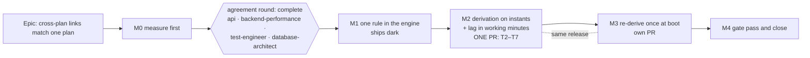

# Implementation Plan: A cross-plan link produces the dates the same link would inside one plan

- **Feature spec:** [./feature-spec.md](./feature-spec.md)
- **Status:** Approved — agreement round complete 2026-09-26 (see agreement-round.md); product owner delegated the open questions
- **Owner:** api
- **Agreement round:** [./agreement-round.md](./agreement-round.md). Every finding is folded below;
  its "Folded" section maps each finding to the task that carries it.

## Breakdown

### Epic

**Cross-plan links match one plan.** Inter-project scheduling (ADR-0043, ADR-0045). Closes
`docs/TECH_DEBT.md` #385 and the five further differences the spec found (E5–E8, E17).

### Review of this plan (before M1 starts)

**Done, 2026-09-26.** All four agents returned AGREE-WITH-CHANGES; every blocking and suggested
finding is folded into the spec and this plan, except api-reviewer's suggestion not to bump
`version`, which is overruled in favour of database-architect B3 (the reason is in
[agreement-round.md](./agreement-round.md)). The list below is the brief they reviewed against.

- **api-reviewer**: the write-path conversion and response factor (spec §4.5). It found the read
  path unfixed (A1) and the docs contradicting the shape (A2), so the shape now changes additively.
- **backend-performance-reviewer**: the widened loads, the remote calendar resolution, FC-6, the
  boot re-derivation's cost.
- **test-engineer**: the parity matrix design (twin construction, especially the backward twin),
  the inverted characterisations and their predicted values, the migration test.
- **database-architect**: the lag re-encoding migration (spec §4.4), its reversal, and the marker.
  **Mandatory, without exception** (CLAUDE.md §19.3). If it returns nothing, fails or is slow, it is
  re-run; an unavailable agent is a reason to wait.

**security-reviewer** joins at M4 for the widened same-organisation reads. Nothing here changes a
permission or a route, so it is not needed on the plan.

---

### Milestone M0: measure first

**Outcome:** the spec's decision-bearing claims are executable results, and the red run is compared
with the prediction in spec §4.2 before any product code changes.
**Entry point:** `Ships dark: M0 adds characterisation tests and a harness; no product behaviour
changes. The user-facing change arrives in M2.`
**Journey:** none (nothing reachable changes).

#### Feature: the red run and the baselines

> **Description:** a twin builder, a characterisation of today's disagreement, engine-port probes, a
> cost baseline and a population count.
> **Complexity:** M
> **Dependencies:** none
> **Risks:** the prediction table is wrong → FC-2 says stop and re-read, which is the point of
> writing it down first.
> **Testing requirements:** every M0 test is green on today's code and describes today's behaviour.
> Each is flipped, not deleted, later.

##### Task M0-T1: the twin builder and today's disagreement (≈ one PR)

- **Description:** a pure conformance helper that, given one link (type, lag, lag calendar), two
  activity types, two calendars and durations, builds **both** a two-plan programme fixture and a
  single-plan twin holding the same two activities and the same link. Plus a characterisation spec
  that runs the matrix and asserts that **today's** derivation disagrees with the in-plan engine on
  exactly the cells spec §4.2 predicts and agrees on the rest.
- **Complexity:** M
- **Dependencies:** none
- **Risks:**
  - The backward twin can compare the wrong thing. An upstream plan's own project finish differs
    from a single plan's, so the upstream's late finish differs for a reason unrelated to the seam.
    → Compare the **bound**, not the late finish: the derived `externalLateFinish` instant against
    `backwardUpperBound` for the same edge in the twin. Pin the downstream's late dates identically
    in both worlds (an `FNLT` on the successor) so the only difference is the seam.
  - The twin shares the engine's bound functions after M2, so it cannot catch a defect inside them.
    → The hand-computed goldens are the independent oracle, and after the agreement round (T1) they
    cover both directions and both anchor kinds: FC-3/FC-4 (forward FS), FC-9 (backward FS) and
    FC-10 (forward FF), all in M2-T6. `compute.spec.ts` covers the functions themselves.
- **Testing:**
  - Matrix axes: link type {FS, SS, FF, SF} × this plan's activity type {task, finish milestone,
    start milestone} × the remote activity type {task, finish milestone} × calendar {24-hour,
    Standard full-day Mon–Fri, eight-hour Mon–Fri 08:00–16:00} × lag {−2, 0, +2 days} × lag calendar
    {`PROJECT_DEFAULT`, `PREDECESSOR`, `SUCCESSOR`, `TWENTY_FOUR_HOUR`}. Forward and backward.
  - Domain: unplaced, unprogressed, whole-day durations (spec §1, "What the decision does not
    settle").
- **Development steps:**
  1. **Write the per-cell prediction first, and commit it on its own** (test-engineer, agreement
     round; spec FC-2). §4.2 fixes only the base case (24-hour calendar, lag 0), and the matrix also
     varies calendar, lag and lag calendar in both directions, so FC-2's "stop on any disagreement"
     is empty without a prediction for every cell. Write it as a small pure function
     (`conformance/cross-plan-prediction.ts`, `predictDisagreement(cell) → 'equal' | { days, sign }`)
     or a table in `m0/prediction.md`, derived **only** from spec §4.2 plus the E5 (weekend), E6
     (stored unit), E7 (lag calendar) and E8 (duration) rules, never from running the code. Its
     commit precedes the run's commit, so the prediction cannot be tuned to the output (the
     ADR-0128 ordering). A cell with no prediction counts as a disagreement.
  2. Write `conformance/cross-plan-twin.ts` (pure; imports the engine as `cross-plan-adapter.ts`
     does).
  3. Run the matrix against today's code. Write `docs/specs/cross-plan-day-boundary/m0/red-run.md`:
     the full output, and every cell where the observed disagreement differs from step 1's
     prediction.
  4. **If any cell disagrees with the prediction, stop** and resolve it in the spec before T2. The
     fix is to the prediction's reasoning, recorded with the cell, not an edit of the number to match.
  5. Commit the characterisation spec, green, headed with the instruction that M2-T6 inverts it.

##### Task M0-T2: the population on the seed catalogue

- **Description:** count, over the seed catalogue (ADR-0066): cross-plan links by type, lag sign,
  lag calendar and resolved factor; links touching an LOE or a WBS summary; links in the rare
  "late"/"tight" cells of spec §4.2; upstream activities with sub-day durations.
- **Complexity:** S
- **Dependencies:** none
- **Risks:** the catalogue may hold no cross-plan links. → Record that as the finding. The deployed
  population arrives in M3's boot log (`pending`), which needs no new surface.
- **Testing:** none; a record, `m0/population.md`.
- **Development steps:**
  1. Query a seeded local database; record the counts with the command that produced them.

##### Task M0-T3: engine-port probes

- **Description:** characterisation cases in the engine suite for two claims:
  - E11: `clampExternalBackwardFinish` with a timed string on an activity with duration returns
    `NaN` today.
  - E12: a midnight instant formatted by `absMinutesToInstant` is read one day late for a finish
    milestone.
- **Complexity:** S
- **Dependencies:** none
- **Risks:** none.
- **Testing:** both green today; M1-T3 flips both.
- **Development steps:**
  1. Add the two cases, each with a docblock naming the M1 task that inverts it.

##### Task M0-T4: cost baseline

- **Description:** `apps/api/scripts/measure-cross-plan-derivation.mts`, run against real Postgres:
  a downstream plan with 100 incoming and 100 outgoing cross-plan links from 10 plans on 10 distinct
  calendars. Time `buildEngineGraph`'s cross-plan branch, p50/p95 over repeated runs, and record the
  query count and the number of calendar resolutions at **10 and at 100 edges**, with the plans and
  calendars held fixed (the FC-6 counting shape, backend-performance-reviewer).
- **Complexity:** S
- **Dependencies:** none
- **Risks:** the harness bypasses the product's HTTP layer. → Its docblock says so (ADR-0081 §3).
  It measures the branch, not the endpoint. `tsx` cannot boot this application (ADR-0125's record),
  so the harness uses the same entry route the other `.mts` harnesses use.
- **Testing:** none; `m0/cost.md` with the numbers, the machine, and the spread.
- **Development steps:**
  1. Seed, time and record. The FC-6 bar is already in the spec; this task only measures the
     baseline it is judged against.

##### Task M0-T5: confirm no client-side cross-plan date arithmetic

- **Description:** grep `apps/web/src` for cross-plan date derivation. Expected: none (the
  cross-plan feature reads `lagDays` and displays API dates).
- **Complexity:** S
- **Development steps:** 1. Record the command and the result in `m0/red-run.md`.

---

### Milestone M1: one rule in the engine

**Outcome:** the engine's link arithmetic and date readers exist once and are exported; the backward
clamp reads a timed value as an instant. No output changes.
**Entry point:** `Ships dark: a refactor plus one branch no existing input can reach (spec §4.8).
M2 is the first caller.`
**Journey:** none.

#### Feature: exported bounds and date readers

> **Description:** D2, D3, D7 of the spec.
> **Complexity:** M
> **Dependencies:** M0, agreement round
> **Risks:** a "move" that edits a line → FC-5: `compute.spec.ts` and the ADR-0034 matrix pass
> unedited; any other red test stops the work.
> **Testing requirements:** golden suites unedited; the M0-T3 probes flipped; structural gates
> verified red.

##### Task M1-T1: move the bound functions

- **Description:** move `applyLag`, `forwardLowerBound`, `backwardUpperBound` from `compute.ts:993-1059`
  into `engine/edge-bounds.ts`, byte-for-byte, and export them through the engine barrel.
- **Complexity:** S
- **Dependencies:** none
- **Risks:** a comment or a parameter order changes in transit. → Diff the moved block against the
  original; comments move verbatim (the ADR-0078 rule).
- **Testing:** `compute.spec.ts` unedited.
- **Development steps:**
  1. Move and export. 2. Import in `compute.ts`. 3. Run the engine suites.

##### Task M1-T2: extract the date readers

- **Description:** `startDateInstant(cal, date, type)` and
  `finishDateInstant(cal, anchorAbs, date, type, durationMinutes)` in `instants.ts`, lifted from
  `resolvePair` (`constraints.ts:108-133`) and `clampExternalBackwardFinish` (`:271-280`), which
  then call them.
- **Complexity:** S
- **Dependencies:** M1-T1
- **Risks:** `rollBackwardToWorking` takes an anchor (`instants.ts:25-35`). The derivation will pass
  the remote plan's data date, the value the engine used. → A unit property case: for any anchor at
  or before the target, the result does not depend on the anchor. If it does, the derivation must
  load the remote data date (M2-T4 does either way).
- **Testing:** golden suites unedited; the property case.
- **Development steps:** 1. Extract. 2. Replace both call sites. 3. Run the engine suites.

##### Task M1-T3: the formatter and the timed backward branch

- **Description:** `formatExternalInstant(abs)` always writes `YYYY-MM-DDTHH:MM`, including
  `T00:00`. In `clampExternalBackwardFinish`, a value longer than ten characters is the instant
  itself, for every activity type.
- **Complexity:** S
- **Dependencies:** M1-T2
- **Risks:** the branch widens the engine's accepted input. → M1-T4's structural gate limits who can
  produce it.
- **Testing:** flip both M0-T3 probes; add cases for a timed backward value on a task, a finish
  milestone and a zero-duration activity, each at midnight and mid-day.
- **Development steps:** 1. Add the formatter and the branch. 2. Flip the probes.

##### Task M1-T4: structural gates

- **Description:** three assertions, each verified red against a named mutation (ADR-0110 D5), each
  scanning comment-stripped source (the lesson ADR-0106 and ADR-0116 recorded):
  1. `compute.ts` holds no bound switch of its own (it imports `edge-bounds`).
  2. `formatExternalInstant` is the only producer of a timed external string, and
     `cross-plan-derivation.ts` is its only non-engine importer.
  3. A pinned positive case, so the gates cannot pass by finding nothing (the ADR-0093 shape).
- **Complexity:** S
- **Dependencies:** M1-T3
- **Scope, stated in the gate's docblock:** these gates catch drift in **structure** (who produces a
  timed string, where the bound switch lives), not in **content**. A wrong value inside a moved
  function is FC-5's to catch. test-engineer raised this and asked for no action; it is recorded so
  nobody reads the gates as covering more.
- **Testing:** the gate file itself; mutations recorded in its docblock.
- **Development steps:** 1. Write. 2. Mutate, see red, revert. 3. Record.

---

### Milestone M2: the derivation on instants, and the lag in working minutes

**Outcome:** a cross-plan link gives the dates the same link gives in one plan, within the parity
domain. Stored cross-plan lags are working minutes on the resolved lag calendar.
**Entry point:** the plan workspace's programme section, **Recalculate programme**
(`ProgrammeScheduleSection.tsx:128-135`). No new control: the change is in the dates it produces.
**Journey:** the API e2e M2-T7 drives the real programme recalculation against a real database. No
new Playwright journey: there is no new control to press, and a browser adds nothing a date
assertion through the API does not already prove. The existing `e2e-programme` journey runs in the
M4 sweep unchanged. This is the ADR-0081 rule applied to a change with no new surface, stated rather
than skipped.

**M2 and M3 ship in one release.** The Version Packages PR is not merged between them, because
between them affected plans are silently wrong.

**M2's product tasks T2–T7 are ONE pull request** (database-architect B4). That PR carries, at
minimum, the migration (T2), the write-path conversion (T3), the read-path divisor and `lagMinutes`
(T3b, T3c), and the derivation's lag read (T5, with the loads it needs, T4). Split across PRs,
`main` would hold `lag_minutes` in two units, and today's readers divide by 1440
(`schedule.service.ts:1523`, `:1534`; `cross-plan-dependency-response.dto.ts:74`): a one-day lag
migrated to 480 minutes reads as `Math.round(480 / 1440) = 0`, so every recalculation and every
response silently drops it. The tests (T6, T7) land in the same PR because each is verified red
against the pre-M2 code, which needs the before state in the same diff. An interim PR that changed
only the divisor was considered and rejected: it is a throwaway second spelling of the lag rule.

- **Before the PR:** M2-T1's design document (it changes no code).
- **In the PR:** M2-T2, T3, T3b, T3c, T4, T5, T6, T7, and the changeset (T3c).
- **After the PR, before the release:** M2-T8's cost record, and M3 as its own PR.

#### Feature: the lag re-encoding

> **Description:** CQ-1, answered: re-encode. A data migration, a record table, the write path and
> the read path that match it.
> **Complexity:** M
> **Dependencies:** M1; database-architect's design (agreement round §b)
> **Risks:** rollback by redeploy mixes encodings (spec §4.4). → Rollback is the documented
> five-step reverse in `docs/DEPLOYMENT.md`, not a redeploy.
> **Testing requirements:** FC-7 (as rewritten by B2/B3) against a populated real database; the
> round-trip API e2e; GET and list reads, not only the create echo.

##### Task M2-T1: the migration design, from the agreement round

- **Description:** database-architect's design is given in full (spec §4.4: its §b plus the
  re-confirmation corrections). This task writes it into `m2/migration-design.md`, including the
  **final column list**, on the `FmDateMigration` precedent (`schema.prisma:3001-3039`):
  - `id`: UUID v7, from the migration's `clock_timestamp()` UUID v7 expression, primary key.
  - `organization_id`: copied from the link; FK `RESTRICT`; no index.
  - `plan_id`: the successor activity's `plan_id`; FK `ON DELETE CASCADE`; plain index.
  - `cross_plan_dependency_id`: `UNIQUE`, no FK.
  - `lag_calendar`, `lag_calendar_id` (no FK), `day_factor_minutes`, `prior_lag_minutes`,
    `new_lag_minutes`, `migrated_at`.
  - Write-once: no `version`, no `created_at`/`updated_at`, no soft delete. A Prisma model with
    back-relations on `Organization` and `Plan`.
  - The record holds **every** resolved row, unchanged ones included (confirmed), for two reasons:
    the B2 differential, and the reverse's step-3 selector ("no record ⇒ created after the
    release").
    Then the **SQL as written** goes back to database-architect before the PR is opened (CLAUDE.md
    §19.3).
- **Complexity:** S
- **Dependencies:** M1
- **Risks:** the agent returns nothing. → Re-run it. The PR is not opened until it has answered.
- **Development steps:** 1. Write `m2/migration-design.md`. 2. Draft the SQL. 3. Run the agent on
  it. 4. Fold its answer.

##### Task M2-T2: the migration and its test

- **Description:** one migration file, in this order:
  1. `CREATE TABLE cross_plan_lag_migrations` with M2-T1's column list, its `plan_id` index and its
     two FKs. **The migration comment states why the `UNIQUE (cross_plan_dependency_id)` cannot
     fire**, since it diverges from the precedent, which has none because a refusal would fail the
     boot (`schema.prisma:3036-3037`): the table is created empty by this migration, the statement
     runs once, and every join in the CTE is at most one-to-one. It exists because the reverse's
     step-3 selector needs exactly one record per link.
  2. **Last in the file, one statement** in three parts:
     `WITH resolved AS (…)` resolves each row's factor and new value once;
     `recorded AS (INSERT INTO "cross_plan_lag_migrations" … SELECT … FROM resolved RETURNING …)`
     records **every** resolved link; and `UPDATE "cross_plan_dependencies" … FROM recorded` touches
     only returned rows with `new_lag_minutes <> prior_lag_minutes`. The converted set is therefore a
     **strict subset** of the recorded set (database-architect, re-confirmation round; the first fold
     said "one set").
     - every row, **soft-deleted included**;
     - `round(lag_minutes::numeric * factor / 1440)::integer` (**B1**; in `int4` the product
       overflows at factor 1440 from 1,036 days, at factor 480 from 3,107 days, and at the ±3,650-day
       bound for any factor ≥ 409, spec E28). **Every multiply in the migration, the reverse and the
       tests' SQL carries the `::numeric` cast**; the cast back is safe because factor ≤ 1440;
     - a stored value that is not a multiple of 1440 converts by the same formula with no `RAISE`
       (720 at 480 becomes 240; 1 can become 0) and is recorded;
     - the `UPDATE` (**B3**) bumps `version` and leaves `updated_at`;
     - every plan reached through the **endpoint activity's `plan_id`**, never the link's
       `*_plan_id` columns (**B5**);
     - the driving-resource join on the partial unique index's predicate exactly
       (`is_driving AND deleted_at IS NULL`) plus the `driving-calendars.ts:25-34` soft-delete
       guards, so it cannot fan out (**B5**);
     - the calendar join with **no** `deleted_at` filter, matching `findHoursPerDayMinutes`
       (`calendar.repository.ts:366-384`).
       A test reads the SQL from the shipped file (the ADR-0107 practice) and runs it against a
       **populated** database seeded on every resolution path first.
- **Complexity:** M
- **Dependencies:** M2-T1
- **Risks:**
  - A pristine CI database cannot exhibit a row-dependent failure (ADR-0107). → Seed every path
    before the migration runs: `PROJECT_DEFAULT`, `PREDECESSOR`, `SUCCESSOR` (own calendar,
    inherited from **its own** plan, driven by a resource), `TWENTY_FOUR_HOUR`, a null calendar, a
    soft-deleted link, a soft-deleted endpoint, a link whose two plans have different calendars,
    and **one row whose `lag_minutes` is not a multiple of 1440**.
  - The cost comment is copied rather than measured (the ADR-0148 record). → `EXPLAIN ANALYZE` over
    10,000 seeded rows, five runs, on the SQL as shipped; recorded in the header comment and
    `m2/migration-design.md` with the spread.
- **Testing (FC-7, as rewritten; each verified red against the named defect):**
  - **Hand-written expected `lag_minutes`** for every seeded row, read from the database (**B2**).
    Red against: `PREDECESSOR` resolved on the successor's plan calendar; `PROJECT_DEFAULT` resolved
    on the predecessor's plan; the link's `successor_plan_id` used instead of the activity's.
  - **Differential** (**B2**): for every seeded row, the record's `day_factor_minutes` equals the
    factor the M2-T3 TypeScript function returns for the same row. Red against a factor-1440 row
    that should resolve to 480.
  - **Unchanged classes** (**B3**): factor-1440, `TWENTY_FOUR_HOUR` and zero-lag rows keep
    `lag_minutes`, `version` and `updated_at`. Red against an unconditional `UPDATE`.
  - **Changed rows:** `version + 1`, `updated_at` unchanged. Red against a statement that sets
    `updated_at`.
  - **Overflow** (**B1**): ±3650 days on a 480-minute calendar **and** on a 1440-minute calendar.
    Red against `int4` arithmetic. The test's own expected-value SQL uses `::numeric` too.
  - **No fan-out** (**B5**): a `RESOURCE_DEPENDENT` endpoint with a soft-deleted driving assignment
    **and a live non-driving assignment** beside the live driving one produces exactly one record
    row. The live non-driving row is the fan-out the partial index does not prevent; red against a
    join that drops `is_driving`.
  - **Non-multiple of 1440:** the seeded row converts by the formula, is recorded, and the reverse
    restores its exact prior value.
  - **Every pre-release link is recorded**, including unchanged ones. Red against an `INSERT` fed
    only the changed rows (the step-3 selector would then convert an unchanged pre-release link).
  - **The reverse** (the `docs/DEPLOYMENT.md` script, run as SQL in the test inside one
    transaction): restores every changed row's `lag_minutes` exactly and bumps `version` again (it
    never goes backwards); converts a row created after the migration with
    `(floor(lag_minutes::numeric / factor + 0.5) * 1440)::integer` and bumps its `version`,
    including a **negative half** case where `round` and `Math.round` differ; passes **both**
    checks (recorded rows equal `prior_lag_minutes`; unrecorded rows are `% 1440 = 0`); drops the
    table and deletes the `_prisma_migrations` row; and a **second run fails at the `LOCK`**,
    applying nothing.
- **Development steps:** 1. Write. 2. Seed every path. 3. Verify red per case. 4. `EXPLAIN ANALYZE`
  ×5. 5. `docs/DATABASE.md` (the re-encoding and the record table). 6. `docs/DEPLOYMENT.md`
  ("Rolling back past the cross-plan lag release", spec §4.4 Reversal, on the shape of the
  finish-milestone reverse at `docs/DEPLOYMENT.md:440-482`):
  - a **factor-drift** section with a finder query (unrecorded links whose resolved calendar's
    `updated_at` is later than the migration's `finished_at`, or whose `lag_minutes` is not a whole
    multiple of today's factor), run before the reverse;
  - stop the API, then run the script as **one transaction**
    (`psql -v ON_ERROR_STOP=1 -1`):
    1. `LOCK` the record table, stated as a **one-shot guard**, not concurrency protection;
    2. restore recorded rows and bump `version`;
    3. convert unrecorded rows with the migration's CTE **copied verbatim**, using
       `floor(x + 0.5)` and bumping `version`;
    4. check recorded rows equal `prior_lag_minutes`;
    5. check unrecorded rows are `% 1440 = 0`;
    6. `DROP TABLE`;
    7. `DELETE FROM "_prisma_migrations"` for this migration (precedent `docs/DEPLOYMENT.md:474-477`);
  - pin the previous API and web images;
  - a **final recalculation step** for the linked plans.

##### Task M2-T3: the write path and the one lag-calendar function

- **Description:** one cross-plan lag-calendar function, built on `schedulingCalendarId` rather than
  restating its fallback, taking each endpoint's type, calendar id, driving calendar id and **own
  plan calendar id** (spec D5). `PROJECT_DEFAULT` is the successor activity's plan's calendar
  (CQ-2). Plan ids come from the endpoint activities, never the link's `*_plan_id` (B5). The write
  (`cross-plan-dependencies.service.ts:178`) converts `lagDays` through it, and deletes the fixed
  `MINUTES_PER_DAY` and its docblock (`:27-31`).
- **Stale descriptions** (api-reviewer A2 and its suggestion to fold `:45-49` here), each checked
  against the file:
  - `create-cross-plan-dependency.dto.ts:51-54` ("PREDECESSOR/SUCCESSOR coincide with the plan
    calendar until per-activity calendars land").
  - `cross-plan-dependency-response.dto.ts:45-49` ("the rest schedule on the plan calendar today").
  - `packages/types/src/index.ts:864` ("identical semantics to a dependency's"): say instead that
    `PROJECT_DEFAULT` means the successor plan's calendar.
  - The same stale sentence on the **in-plan** side, found while checking: `dependency-response.dto.ts:58-61`
    and `packages/types/src/index.ts:829-833` (spec E34). Fixed here so the corrected cross-plan
    text does not sit beside a wrong twin.
- **Complexity:** S
- **Dependencies:** M2-T2
- **Risks:** a second spelling of the lag-calendar rule. → One function, used by write, read (T3b)
  and derivation (T5), and compared against the SQL by T2's differential check.
- **Testing:** unit cases per lag-calendar source with the two plans on different calendars and an
  inheriting endpoint; API e2e: create a one-day lag on an eight-hour calendar and read
  `lag_minutes = 480` from the database, not from the API under test.
- **Development steps:** 1. The function. 2. Convert on write. 3. Docblocks. 4. Tests.

##### Task M2-T3b: the read path (api-reviewer A1)

- **Description:** every cross-plan read divides by the resolved factor. Today
  `CrossPlanDependencyResponseDto.from` divides by a hard-coded 1440 (`:8`, `:74`) on create, get
  and both lists (spec E25), so after the migration an eight-hour one-day lag would read back as
  `lagDays: 0`. Mirror the in-plan shape (`dependencies.service.ts:84-129`,
  `dependency-response.dto.ts:93`):
  - The repository's `endpointSelect` (`cross-plan-dependency.repository.ts:9`) adds `type`,
    `calendarId` and `planId`. Its docblock copies the in-plan sentence that the fields are
    "selected, not mapped into the response" (`dependency.repository.ts:9-18`), so a later reader
    does not add them to the DTO (api-reviewer, re-confirmation round).
  - The driving-calendar input to `loadDrivingCalendarMapForRows` is built from the **link's own
    `organizationId`** with each endpoint's `planId` and `type`, as the in-plan service reads the
    organisation from the row (`dependencies.service.ts:99-111`). The endpoint select carries no
    `organizationId`.
  - An async `withLagDayFactor(s)` in the service resolves each row's factor with the T3 function
    before any `.from()`; `get`, `create`, `listByPlan` and `listByActivity` return
    `WithLagDayFactor<…>`.
  - `.from()` takes `WithLagDayFactor<CrossPlanDependencyWithEndpoints>` and uses `minutesToDays`,
    and the fixed `MINUTES_PER_DAY` (`:7-8`) is deleted.
  - **Batched per page** (api-reviewer suggestion): collect distinct plan ids across the page (one
    `plans.findCalendarIds`), driving calendars through `loadDrivingCalendarMapForRows`
    (`driving-calendars.ts:74-94`, one query per distinct (org, plan) with a `RESOURCE_DEPENDENT`
    endpoint), and one `findHoursPerDayMinutes` for the page's distinct calendar ids. The
    activity list spans plans (it holds both directions), which is why the plan calendar is not one
    lookup as it is in the in-plan service.
- **Complexity:** M
- **Dependencies:** M2-T3
- **Risks:** a read that looks right because it is only tested on create. → **The create echo passes
  trivially**: the value was just converted with the same factor. So the tests read through **GET**
  and through **both lists**.
- **Testing:**
  - API e2e: an eight-hour one-day lag reads `lagDays: 1` through `GET …/:id`, the plan list and the
    activity list; a `TWENTY_FOUR_HOUR` two-day lag on the same calendar reads `lagDays: 2`. Verified
    red against the `/1440` divisor.
  - A counting stub: a page of 5 and a page of 50 links spanning 3 plans and 3 calendars issue the
    same number of queries.
- **Development steps:** 1. Widen the select. 2. `withLagDayFactor(s)`. 3. `.from()`. 4. Tests.

##### Task M2-T3c: `lagMinutes` on the response (api-reviewer A2)

- **Description:** add `lagMinutes` (read-only, the stored working minutes) to
  `CrossPlanDependencyResponseDto` and to `CrossPlanDependencySummary`
  (`packages/types/src/index.ts:856-871`). The request is unchanged: create still accepts whole
  `lagDays` only. Correct `docs/API.md`: the cross-plan section (`:264-312`) says what `lagDays`
  and `lagMinutes` mean on a cross-plan link and that `PROJECT_DEFAULT` is the successor plan's
  calendar; the general section `:659-708`, which tells clients to send `lagMinutes` (`:704-705`),
  gains the sentence that a cross-plan link accepts only `lagDays`.
- **The changeset lands in this PR** (an additive shape change): `api` minor, covering both the
  additive field and the corrected dates for linked plans; `@repo/types` minor for the field
  (`privatePackages.version` is on in `.changeset/config.json`, and the package keeps a
  `CHANGELOG.md`).
- **Complexity:** S
- **Dependencies:** M2-T3b
- **Risks:** a client that treated the response as closed. → The web parses no cross-plan response
  with a strict schema (spec E33); the field is additive.
- **Testing:** the T3b e2e cases also assert `lagMinutes` (480 for the eight-hour one-day lag); the
  OpenAPI spec shows the field.
- **Development steps:** 1. DTO and type. 2. `docs/API.md`. 3. Changeset.

#### Feature: the derivation on instants

> **Description:** spec D1–D7 in the service layer.
> **Complexity:** L
> **Dependencies:** M1, M2-T3
> **Risks:** see tasks.
> **Testing requirements:** FC-1 to FC-6.

##### Task M2-T4: widen the loads

- **Description:** both repository loads (`cross-plan-dependency.repository.ts:204-254`) add
  `lagCalendar` and, for the remote endpoint, `type`, `durationMinutes`, `calendarId`, `planId`, and
  its plan's `calendarId` and `plannedStart` **through the activity's plan relation**, never through
  the link's `*_plan_id` (B5). Remote driving-resource calendars come from
  **`loadDrivingCalendarMapForRows`** (`driving-calendars.ts:74-94`), which issues no query when no
  remote endpoint is `RESOURCE_DEPENDENT` and one query per distinct (org, plan) otherwise, never one
  per edge (backend-performance-reviewer; the #86 cost rule). Remote calendar ports resolve once per
  distinct id into the existing `portByCalId` cache (`schedule.service.ts:1446-1449`).
- **Complexity:** M
- **Dependencies:** M1
- **Risks:**
  - An N+1 over edges. → FC-6's counting stub: with plans and calendars held fixed, the query count
    **and** the calendar-resolve count are equal at 10 and at 100 edges.
  - Tidying the load renames `predecessorPlacedFinish` or invents a placed late basis. →
    `cross-plan-basis.structural.spec.ts` passes unedited.
- **Testing:** `schedule.service.spec.ts` mocks widened; the counting stub at 10 and 100 edges.
- **Development steps:** 1. Widen selects. 2. `loadDrivingCalendarMapForRows`. 3. Resolve ports.

##### Task M2-T5: rewrite the derivation and its second producer

- **Description:** `deriveExternalInstants` takes edges carrying `lagMinutes`, resolved lag-calendar
  ports, remote anchors (date, type, duration, calendar port, plan data date) and local activity
  types, durations and ports. For each edge it builds the anchor instant with the M1 date readers,
  calls `forwardLowerBound` or `backwardUpperBound`, skips LOE endpoints, composes with the M1
  column as instants (D6: the M1 winner keeps its bare string), and formats a derived winner with
  `formatExternalInstant`. Lag calendars resolve through the one M2-T3 function. The conformance
  adapter changes **in the same commit** (it is the second producer, `cross-plan-adapter.ts:81-85`)
  and gains the backward direction (E20).
- **The LOE skip and the N32 skip are separate branches** (test-engineer). Today's loop has one
  `missing` branch that always increments `upstreamMissingCount` (`cross-plan-derivation.ts:224-228`).
  An LOE upstream must `continue` **without** incrementing it, or every plan with an LOE cross-plan
  link reports a phantom "upstream never calculated" warning. Only null upstream dates count.
- **Complexity:** L
- **Dependencies:** M2-T4
- **Risks:**
  - A string comparison survives somewhere. → Unit cases where a bare finish-milestone M1 date and a
    timed derived value fall on the same day, in both orders.
  - The inverted characterisations are updated to whatever the code now prints. → Each new value is
    written below **before** the run, and a mismatch stops the work.
- **Testing:** `cross-plan-derivation.spec.ts` rewritten against a prediction table that is
  **hand-derived per cell** from the in-plan semantics (the engine's bound rules and the date
  readers' documented meaning), written into the spec file **before** the new code first runs, in a
  commit of its own (test-engineer T1). It is never characterised from the new code's output: that
  would make it a second twin comparison, which spec D2 says cannot see a defect in a shared
  function. M0-T1's record-then-flip method is the right model for today's code and the wrong model
  here. A cell whose hand value disagrees with the run stops the work, as FC-2 does.
  test-engineer re-derived the table below by hand in the agreement round and every cell
  reproduced. Predicted changes in `cross-plan-conformance.spec.ts`, all on a 24-hour calendar:

  | Line     | Assertion                       | Old          | New                        |
  | -------- | ------------------------------- | ------------ | -------------------------- |
  | :101     | fresh `CONS_ERECT.earlyStart`   | `2026-01-12` | `2026-01-13`               |
  | :102     | stale `CONS_ERECT.earlyStart`   | `2026-01-06` | `2026-01-07`               |
  | :135     | derived `externalEarlyStart`    | `2026-01-12` | `2026-01-13T00:00`         |
  | :137     | `CONS_ERECT.earlyStart`         | `2026-01-12` | `2026-01-13`               |
  | :138     | `CONS_ERECT.earlyFinish`        | `2026-01-16` | `2026-01-17`               |
  | :158     | derived, M1 later               | `2026-01-20` | `2026-01-20` (M1 verbatim) |
  | :179     | `MA1.earlyStart`                | `2026-01-08` | `2026-01-09`               |
  | :180     | `MA1.earlyFinish`               | `2026-01-11` | `2026-01-12`               |
  | :181     | `MB1.earlyStart`                | `2026-01-11` | `2026-01-12`               |
  | :182     | `MB1.earlyFinish`               | `2026-01-16` | `2026-01-17`               |
  | :185     | derived `D1.externalEarlyStart` | `2026-01-16` | `2026-01-18T00:00`         |
  | :187     | `D1.earlyStart`                 | `2026-01-16` | `2026-01-18`               |
  | :188     | `D1.earlyFinish`                | `2026-01-18` | `2026-01-20`               |
  | :203-208 | derived, honoured and ignored   | `2026-01-12` | `2026-01-13T00:00`         |
  | :212     | `honCons.earlyStart`            | `2026-01-12` | `2026-01-13`               |
  | :257     | N32, M1 stands                  | `2026-01-05` | `2026-01-05` (M1 verbatim) |

  The docblocks at `:122-125` and `:167-169`, and `cross-plan-adapter.ts:279-330`, restate the
  arithmetic and change with it.

- **Development steps:**
  1. Commit the hand-derived unit prediction table (T1) before any new code runs.
  2. Rewrite the input types and the derivation, with separate LOE and N32 branches.
  3. Update the service caller (`schedule.service.ts:1508-1540`) and delete the fixed-1440 docblock
     that justified E8.
  4. Update the adapter, add `outgoing`. 5. Update the table above. 6. Run the unit suite against
     the committed predictions.

##### Task M2-T6: the parity matrix and the goldens

- **Description:** invert M0-T1's characterisation into FC-1's equality over the whole matrix. Add
  the hand-computed goldens at the conformance tier, each written from the calendar before the run:
  - FC-3 (forward FS, weekend lag) and FC-4 (forward FS, eight-hour lag, three outcomes);
  - **FC-9, backward FS** (test-engineer T1; US-3's example): downstream late start Mon
    `2026-01-19`, FS lag 0, so the upstream linked task's late finish is the end of Fri
    `2026-01-16` on the Standard calendar. The fixture pins the downstream with `FNLT` Fri
    `2026-01-23` on a 5-day task and gives the upstream plan an unlinked 20-day task, so the linked
    task's late finish is set by the bound alone (spec FC-9). Today: Mon `2026-01-19`;
  - **FC-10, forward FF** (T1): a 3-day downstream starts Wed `2026-01-07` (today Tue `2026-01-06`)
    and a 6-day downstream starts Fri `2026-01-02` (today and "boundary fixed only" both Mon
    `2026-01-05`), per spec FC-10.
    Also the `TWENTY_FOUR_HOUR` case from US-2, and the two skip cases (test-engineer):
  - **LOE upstream:** no bound, and `upstreamMissingCount === 0`;
  - **null upstream dates (N32):** no bound, and `upstreamMissingCount === 1`.
- **Complexity:** M
- **Dependencies:** M2-T5
- **Risks:**
  - A matrix too large to read when it fails. → Each cell's name states its axes, and a failure
    prints both instants.
  - A golden computed by running the engine and pasting the answer. → Each golden's docblock shows
    the working-day walk that produced it.
- **Testing:** verified red by running the matrix against the M0 code (the red run is already on
  record from M0-T1); FC-4 verified red three ways: today's code, the fixed derivation with the
  migration reverted, and the full fix; FC-9 and FC-10 verified red against today's code, and
  FC-10's 6-day cell also against a build that fixes only the day boundary; the LOE case verified
  red against a single shared skip branch.
- **Development steps:** 1. Invert. 2. Goldens. 3. Skip cases. 4. Coverage tags added to
  `REQUIRED_CROSS_PLAN_TAGS` so the tier-1 gate notices if they are dropped.

##### Task M2-T7: API e2e through the real programme recalculation

- **Description:** a new case in `apps/api/test/programme-schedule.e2e-spec.ts` (or a sibling
  file): two plans joined by a cross-plan FS link with a weekend-spanning lag, and a third plan
  holding the same two activities joined by an in-plan FS link with the same lag. After a programme
  recalculation and a single-plan recalculation, the two successors' `earlyStart` are equal, and
  equal the FC-3 date. A second pair on an eight-hour calendar covers FC-4. A backward pair checks
  the upstream's late finish against the in-plan twin with the far end pinned by an `FNLT`, **and**
  against FC-9's hand-computed Fri `2026-01-16`: the twin comparison alone shares the engine's
  bound functions and cannot see a defect in them (test-engineer T1).
- **Complexity:** M
- **Dependencies:** M2-T5
- **Risks:** a new plan takes the Standard calendar (full-day), which cannot exhibit E6. → The
  eight-hour pair creates its calendar explicitly (the ADR-0155 correction: its first e2e fixture
  assumed the wrong calendar).
- **Testing:** verified red against the pre-M2 code.
- **Development steps:** 1. Write. 2. Run red on the old code. 3. Run green. 4.
  `scripts/e2e-local.sh api`.

##### Task M2-T8: cost

- **Description:** re-run M0-T4's harness on the built change; judge FC-6 against the committed bar,
  with the spread stated.
- **Complexity:** S
- **Dependencies:** M2-T5
- **Risks:** a noisy machine. → Report the baseline spread beside the delta; an indeterminate result
  is reported as indeterminate (ADR-0128), not rounded to a pass.
- **Development steps:** 1. Measure. 2. `m2/cost.md`.

---

### Milestone M3: re-derive once at boot

**Outcome:** after the first boot on the release, every plan whose dates were computed under the old
rule has been recalculated once, upstream-first, and none is left stale.
**Entry point:** `Ships dark: runs at boot with no control. What a planner sees is corrected dates
on plans they did not touch.`
**Journey:** the API e2e M3-T2.

#### Feature: `CrossPlanRederiveService`

> **Description:** spec D8.
> **Complexity:** M
> **Dependencies:** M2 (the migration is the marker)
> **Risks:**
>
> - Order: a downstream recalculated first ends stale. → Topological order, with a test that fails
>   under id order.
> - A long boot job on a large installation. → Never awaited, per-plan transactions, logged with
>   `durationMs`; the population is bounded by plans with cross-plan links.
> - A planner holding the pen sees dates move. → Accepted, as for ADR-0155 D9; the pen guards
>   planner writes, and this is an engine-owned write under the plan advisory lock.
>   **Testing requirements:** FC-8.

##### Task M3-T0: extract the Kahn step (backend-performance-reviewer P1)

- **Description:** the first draft said M3-T1 would "reuse `programme-order.ts`'s sort over the
  whole adjacency". It cannot: `resolveProgrammeOrder(targetPlanId, edges)` BFS-es one target's
  upstream closure (`programme-order.ts:74-85`) and runs Kahn over that closure only (`:87-117`),
  with no multi-node entry point. (The finding cited `:47-106`; the function is `:45-118`. The
  substance is exact, spec E31.) Extract the Kahn step as an exported pure function, for example
  `orderPlansUpstreamFirst(nodes: ReadonlySet<string>, edges: readonly PlanCrossEdge[]): string[]`,
  counting in-degree only from edges inside `nodes`, keeping the same id-sorted frontier with
  `compareIds` and the same `ProgrammeCycleError` on a shortfall. `resolveProgrammeOrder` computes
  its closure and calls it.
- **Complexity:** S
- **Dependencies:** none (pure; may land with M1 or before M3-T1)
- **Risks:** the extraction changes an order. → A move under the ADR-0078 rule: the existing
  `programme-order` suite passes **unedited** as the before/after oracle, plus unit cases for the
  new entry point on a multi-root node set and on a residual cycle.
- **Development steps:** 1. Extract. 2. `resolveProgrammeOrder` calls it. 3. Run the suite unedited. 4. New cases.

##### Task M3-T1: the service

- **Description:** mirror `finish-milestone-rederive.service.ts`: `pendingPlans()` (live, data date
  set, at least one active cross-plan edge in either direction, `schedule_computed_at` before the
  lag migration's `finished_at` read from `_prisma_migrations`), returning `organizationId` with
  each plan. **Group the global pending set by organisation** (P1). For each organisation, load
  `loadOrgAdjacency` once and call M3-T0's function with **every plan in that result** as the node
  set, so the **whole organisation graph** is ordered; then walk that order and recalculate **only
  the pending plans**, skipping the rest, with `recalculateAsSystem`, one plan at a time. Events
  `schedule.xplan_rederived` (with `pending`, `recalculated`, `organizations`, `durationMs`) and
  `schedule.xplan_rederive_plan_failed`.
- **Why the whole graph, not the pending set** (backend-performance-reviewer, re-confirmation round;
  the design choice is the coordinator's). The extracted step counts in-degree only from edges with
  both ends in the node set (`programme-order.ts:90-96`). With the pending set as the node set, a
  chain `A → B → C` whose `B` is not pending gives `A` and `C` in-degree 0 each, so they are ordered
  by `compareIds` alone. Plan ids are UUID v7 (creation order), so `C` can come first, and it would
  then read stale against `A`, because staleness reads the full transitive upstream closure
  (`schedule.service.ts:809-818`, `staleness.ts:32-47`). Ordering the whole graph removes that case.
  The first fold's prose called it "harmless for C", which was wrong.
- **What remains:** a non-pending intermediate `B` is not recalculated, so after `A` is, `B` reads
  stale (`staleness.ts:43-46`) until a programme recalculation reaches it. Stated in spec D8; not
  engineered around.
- **Complexity:** M
- **Dependencies:** M2-T2, M3-T0
- **Risks:**
  - A second topological sort beside `programme-order.ts`. → There is none: M3-T0's extracted step
    is the only one.
  - A deadlock between plans. → None possible: each plan's advisory lock is acquired and released
    inside its own transaction, so the service never holds two (P1).
  - The finish-milestone service recalculates the same plan at boot. → Harmless (idempotent,
    serialised by the plan lock), stated in the ADR's Consequences with the jump-two-releases case
    (spec D8).
- **Testing:** unit cases for:
  - order within an organisation;
  - two organisations ordered independently (each topological, with one `loadOrgAdjacency` call per
    organisation);
  - **`A → B → C` with `B` not pending and `C`'s id sorting before `A`'s**: asserts `A` is
    recalculated before `C` and `B` is not recalculated. Verified red against passing the pending
    set as the node set, which recalculates `C` first;
  - failure isolation.
- **Development steps:** 1. Write. 2. Register in the schedule module. 3. Unit tests.

##### Task M3-T2: API e2e

- **Description:** seed a three-plan chain with cross-plan links, set each plan's
  `schedule_computed_at` before the marker, run `rederive()`. Assert: all three recalculated;
  `scheduleStale` false on each; the downstream's dates equal a programme recalculation's; a second
  `rederive()` returns 0.
- **Complexity:** S
- **Dependencies:** M3-T1
- **Testing:** verified red with the order reversed (the downstream ends stale).
- **Development steps:** 1. Write. 2. Red with reversed order. 3. Green.

---

### Milestone M4: gate pass and close

**Outcome:** reviewed, documented, released.
**Entry point:** as M2.
**Journey:** the full journey sweep, including `e2e-programme`, unchanged.

##### Task M4-T1: specialist reviews over the combined diff

- **Description:** api-reviewer (the read path and the additive field as built),
  backend-performance-reviewer (the CRUD counting stub, FC-6, the boot service), test-engineer (the
  goldens and the hand-derived tables), database-architect (migration and record table as built,
  and the `docs/DEPLOYMENT.md` reverse), security-reviewer (widened same-organisation reads).
  Blocking findings are folded with a regression test verified red first; the rest are filed.
- **Complexity:** M

##### Task M4-T2: documents and registers

- **Description:**
  - File ADR-0161 from spec §4.9, with CLAUDE.md §16 entry, `docs/adr/README.md` row and a
    `docs/ROADMAP.md` line (`check:adr-coverage`, ADR-0147).
  - Add amendment notes to ADR-0045 and ADR-0035 §30.5 pointing at ADR-0161.
  - Spec and plan headers: `Accepted — shipped (ADR-0161)` (`check:spec-status`, ADR-0131).
  - Confirm that the documents M2 changed in its PR are still true of the shipped code:
    `docs/API.md` (cross-plan section and `:704-705`, M2-T3c), `docs/DATABASE.md` and
    `docs/DEPLOYMENT.md` ("Rolling back past the cross-plan lag release", M2-T2).
  - ADR-0161's Consequences state the record table, the additive `lagMinutes`, and the two boot
    services recalculating one plan (spec D8, §4.9).
  - `docs/TECH_DEBT.md`: close #385 (delete and ledger, the register's convention); file new rows
    for WBS-summary cross-plan endpoints (E18), progress-mode tie dropping, expected-finish resizing,
    and persisted instants (spec §1), each with its trigger.
  - The changeset M2-T3c added (`api` minor: dates change for linked plans and the additive
    `lagMinutes`; `@repo/types` minor) still describes what ships, including M3's boot
    re-derivation.
- **Complexity:** S

##### Task M4-T3: the pre-push gate, run

- **Description:** `pnpm prepush`, `scripts/e2e-local.sh api`, and the journey sweep. CI's check
  runs for the PR's current head read per CLAUDE.md §19.9 before merge.
- **Complexity:** S

## Sequencing & slices

1. **M0** lands alone: tests green on today's code, a harness, and records. `main` stays releasable.
   The per-cell prediction's commit precedes the red run's.
2. **Agreement round** on the spec and this plan: **complete** (2026-09-26). CQ-1 to CQ-3 answered
   by the product owner's delegation and ratified.
3. **M1** lands alone and ships dark: a move plus an unreachable branch, proven by unedited goldens.
   M3-T0 (the Kahn extraction) may land here too: it is a pure move with its own unedited oracle.
4. **M2 is one PR** holding T2–T7 and the changeset (B4): the migration, the write path, the read
   path, `lagMinutes`, the loads, the derivation and their tests. M2-T1's design document precedes
   it; M2-T8's cost record may follow it.
5. **M3 is its own PR, in the same release as M2.** No Version Packages PR is merged between them.
6. **M4** closes.

No `VITE_*` flag (ADR-0088 D1). The rollback is a commit boundary for M1, and for M2–M3 the
documented five-step reverse (spec §4.4, `docs/DEPLOYMENT.md`) plus the previous image, never a
redeploy alone.

## Definition of Done (per task)

Each task's PR must satisfy the Feature Completion Criteria in
[`docs/PROCESS.md`](../../PROCESS.md) (code, tests, docs, security, performance, accessibility,
Docker build, CI, changelog, version impact). Accessibility is not applicable: no UI changes.

## Risks & assumptions (rollup)

| Risk / assumption                                                                                 | Likelihood                | Impact | Mitigation                                                                                                                                                           |
| ------------------------------------------------------------------------------------------------- | ------------------------- | ------ | -------------------------------------------------------------------------------------------------------------------------------------------------------------------- |
| The §4.2 prediction is wrong somewhere                                                            | med                       | med    | FC-2: stop and re-read before building. The prediction is committed first so it can be wrong visibly.                                                                |
| The shared bound functions hide a defect from the twin comparison                                 | low                       | high   | Hand-computed goldens in both directions (FC-3/FC-4 forward FS, FC-9 backward FS, FC-10 FF), the hand-derived unit table, and the unedited Pass-1 golden suite (T1). |
| The migration overflows `int4` on populated data (restart loop, ADR-0107)                         | med                       | high   | `numeric` arithmetic; ±3650-day rows at factor 480 and 1440 in the test, verified red against `int4` (B1, E28).                                                      |
| The migration test cannot see a wrong factor                                                      | med                       | high   | Hand-written expected `lag_minutes` and the record-vs-TypeScript differential over every row (B2).                                                                   |
| The reverse is claimed byte-for-byte while `version` moves                                        | low                       | med    | Changed rows only; `version` bumped again on reverse; `lag_minutes` restored exactly (B3).                                                                           |
| A split PR leaves `lag_minutes` in two units and the lag silently dropped                         | med                       | high   | M2's T2–T7 are one PR (B4).                                                                                                                                          |
| The CRUD reads still divide by 1440 after the migration                                           | high (until A1 was found) | high   | M2-T3b, tested through GET and both lists, never only the create echo (A1).                                                                                          |
| An LOE cross-plan link reports a phantom N32 warning                                              | med                       | low    | Separate LOE and N32 branches; `=== 0` / `=== 1` cases (M2-T6).                                                                                                      |
| A timed-string trap (midnight dropped, string comparison) survives                                | med                       | high   | One formatter (D7), instant composition (D6), structural gate M1-T4, unit cases at midnight in both orders.                                                          |
| The migration resolves a factor against the wrong plan's calendar                                 | med                       | high   | database-architect design; a migration test seeding every resolution path, each verified red.                                                                        |
| Rollback by redeploy after the migration mixes encodings                                          | low                       | high   | Documented reverse migration; `docs/DEPLOYMENT.md`.                                                                                                                  |
| Plans move at boot without a planner pressing anything                                            | high                      | med    | Accepted (CQ-3), as for ADR-0155 D9; logged with counts.                                                                                                             |
| M2 released without M3                                                                            | low                       | high   | One release; stated in the sequencing.                                                                                                                               |
| The two boot services recalculate one plan, or the finish-milestone one orders a downstream first | low                       | low    | Idempotent and lock-serialised; a mis-ordered downstream shows stale, not wrong; stated in ADR-0161 (spec D8).                                                       |
| The boot service recalculates `C` before `A` through a non-pending `B`                            | med (UUID v7 order)       | med    | Order the whole organisation graph, recalculate only pending plans (M3-T1); a unit case with `C`'s id before `A`'s. `B` may still read stale, stated (spec D8).      |
| The reverse runs twice, or against a live API, or leaves the migration row behind                 | low                       | high   | API stopped; one transaction (`psql -v ON_ERROR_STOP=1 -1`); `LOCK` as a one-shot guard; `_prisma_migrations` row deleted; tested in M2-T2.                          |
| The sub-day, placed-upstream, progress-mode and expected-finish residuals are read as "fixed"     | med                       | med    | Named in the spec, the ADR and `docs/API.md`; filed with triggers.                                                                                                   |
| A remote endpoint's inherit sentinel resolves to this plan's calendar (the ADR-0139 shape)        | med                       | high   | Parity matrix cells with the two plans on different calendars and an inheriting remote activity.                                                                     |
| The cross-plan path gets slower                                                                   | low                       | low    | FC-6 bar committed in the spec; counting stub; no-edge path unchanged.                                                                                               |
