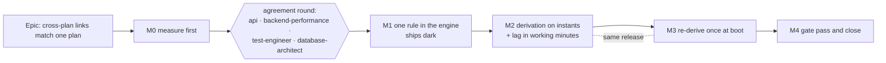

# Implementation Plan: A cross-plan link produces the dates the same link would inside one plan

- **Feature spec:** [./feature-spec.md](./feature-spec.md)
- **Status:** Draft
- **Owner:** api

## Breakdown

### Epic

**Cross-plan links match one plan.** Inter-project scheduling (ADR-0043, ADR-0045). Closes
`docs/TECH_DEBT.md` #385 and the five further differences the spec found (E5–E8, E17).

### Review of this plan (before M1 starts)

The plan is reviewed, read-only, by these agents. Their blocking findings are folded or answered in
writing before M1:

- **api-reviewer**: the write-path conversion and response factor (spec §4.5); no shape change.
- **backend-performance-reviewer**: the widened loads, the remote calendar resolution, FC-6, the
  boot re-derivation's cost.
- **test-engineer**: the parity matrix design (twin construction, especially the backward twin),
  the inverted characterisations and their predicted values, the migration test.
- **database-architect**: the lag re-encoding migration (spec §4.4), its reversal, and the marker.
  **Mandatory, without exception** (CLAUDE.md §19.3). If it returns nothing, fails or is slow, it is
  re-run; an unavailable agent is a reason to wait.

**security-reviewer** joins at M4 for the widened same-organisation reads. Nothing here changes a
permission or a route, so it is not needed on the plan.

---

### Milestone M0: measure first

**Outcome:** the spec's decision-bearing claims are executable results, and the red run is compared
with the prediction in spec §4.2 before any product code changes.
**Entry point:** `Ships dark: M0 adds characterisation tests and a harness; no product behaviour
changes. The user-facing change arrives in M2.`
**Journey:** none (nothing reachable changes).

#### Feature: the red run and the baselines

> **Description:** a twin builder, a characterisation of today's disagreement, engine-port probes, a
> cost baseline and a population count.
> **Complexity:** M
> **Dependencies:** none
> **Risks:** the prediction table is wrong → FC-2 says stop and re-read, which is the point of
> writing it down first.
> **Testing requirements:** every M0 test is green on today's code and describes today's behaviour.
> Each is flipped, not deleted, later.

##### Task M0-T1: the twin builder and today's disagreement (≈ one PR)

- **Description:** a pure conformance helper that, given one link (type, lag, lag calendar), two
  activity types, two calendars and durations, builds **both** a two-plan programme fixture and a
  single-plan twin holding the same two activities and the same link. Plus a characterisation spec
  that runs the matrix and asserts that **today's** derivation disagrees with the in-plan engine on
  exactly the cells spec §4.2 predicts and agrees on the rest.
- **Complexity:** M
- **Dependencies:** none
- **Risks:**
  - The backward twin can compare the wrong thing. An upstream plan's own project finish differs
    from a single plan's, so the upstream's late finish differs for a reason unrelated to the seam.
    → Compare the **bound**, not the late finish: the derived `externalLateFinish` instant against
    `backwardUpperBound` for the same edge in the twin. Pin the downstream's late dates identically
    in both worlds (an `FNLT` on the successor) so the only difference is the seam.
  - The twin shares the engine's bound functions after M2, so it cannot catch a defect inside them.
    → FC-3 and FC-4 are hand-computed and stay as the independent oracle; `compute.spec.ts` covers
    the functions themselves.
- **Testing:**
  - Matrix axes: link type {FS, SS, FF, SF} × this plan's activity type {task, finish milestone,
    start milestone} × the remote activity type {task, finish milestone} × calendar {24-hour,
    Standard full-day Mon–Fri, eight-hour Mon–Fri 08:00–16:00} × lag {−2, 0, +2 days} × lag calendar
    {`PROJECT_DEFAULT`, `PREDECESSOR`, `SUCCESSOR`, `TWENTY_FOUR_HOUR`}. Forward and backward.
  - Domain: unplaced, unprogressed, whole-day durations (spec §1, "What the decision does not
    settle").
- **Development steps:**
  1. Write `conformance/cross-plan-twin.ts` (pure; imports the engine as `cross-plan-adapter.ts`
     does).
  2. Run the matrix against today's code. Write `docs/specs/cross-plan-day-boundary/m0/red-run.md`:
     the full output, and the cells that disagree with the §4.2 prediction.
  3. **If any cell disagrees with the prediction, stop** and resolve it in the spec before T2.
  4. Commit the characterisation spec, green, headed with the instruction that M2-T6 inverts it.

##### Task M0-T2: the population on the seed catalogue

- **Description:** count, over the seed catalogue (ADR-0066): cross-plan links by type, lag sign,
  lag calendar and resolved factor; links touching an LOE or a WBS summary; links in the rare
  "late"/"tight" cells of spec §4.2; upstream activities with sub-day durations.
- **Complexity:** S
- **Dependencies:** none
- **Risks:** the catalogue may hold no cross-plan links. → Record that as the finding. The deployed
  population arrives in M3's boot log (`pending`), which needs no new surface.
- **Testing:** none; a record, `m0/population.md`.
- **Development steps:**
  1. Query a seeded local database; record the counts with the command that produced them.

##### Task M0-T3: engine-port probes

- **Description:** characterisation cases in the engine suite for two claims:
  - E11: `clampExternalBackwardFinish` with a timed string on an activity with duration returns
    `NaN` today.
  - E12: a midnight instant formatted by `absMinutesToInstant` is read one day late for a finish
    milestone.
- **Complexity:** S
- **Dependencies:** none
- **Risks:** none.
- **Testing:** both green today; M1-T3 flips both.
- **Development steps:**
  1. Add the two cases, each with a docblock naming the M1 task that inverts it.

##### Task M0-T4: cost baseline

- **Description:** `apps/api/scripts/measure-cross-plan-derivation.mts`, run against real Postgres:
  a downstream plan with 100 incoming and 100 outgoing cross-plan links from 10 plans on 10 distinct
  calendars. Time `buildEngineGraph`'s cross-plan branch, p50/p95 over repeated runs, and record the
  query count.
- **Complexity:** S
- **Dependencies:** none
- **Risks:** the harness bypasses the product's HTTP layer. → Its docblock says so (ADR-0081 §3).
  It measures the branch, not the endpoint. `tsx` cannot boot this application (ADR-0125's record),
  so the harness uses the same entry route the other `.mts` harnesses use.
- **Testing:** none; `m0/cost.md` with the numbers, the machine, and the spread.
- **Development steps:**
  1. Seed, time and record. The FC-6 bar is already in the spec; this task only measures the
     baseline it is judged against.

##### Task M0-T5: confirm no client-side cross-plan date arithmetic

- **Description:** grep `apps/web/src` for cross-plan date derivation. Expected: none (the
  cross-plan feature reads `lagDays` and displays API dates).
- **Complexity:** S
- **Development steps:** 1. Record the command and the result in `m0/red-run.md`.

---

### Milestone M1: one rule in the engine

**Outcome:** the engine's link arithmetic and date readers exist once and are exported; the backward
clamp reads a timed value as an instant. No output changes.
**Entry point:** `Ships dark: a refactor plus one branch no existing input can reach (spec §4.8).
M2 is the first caller.`
**Journey:** none.

#### Feature: exported bounds and date readers

> **Description:** D2, D3, D7 of the spec.
> **Complexity:** M
> **Dependencies:** M0, agreement round
> **Risks:** a "move" that edits a line → FC-5: `compute.spec.ts` and the ADR-0034 matrix pass
> unedited; any other red test stops the work.
> **Testing requirements:** golden suites unedited; the M0-T3 probes flipped; structural gates
> verified red.

##### Task M1-T1: move the bound functions

- **Description:** move `applyLag`, `forwardLowerBound`, `backwardUpperBound` from `compute.ts:993-1059`
  into `engine/edge-bounds.ts`, byte-for-byte, and export them through the engine barrel.
- **Complexity:** S
- **Dependencies:** none
- **Risks:** a comment or a parameter order changes in transit. → Diff the moved block against the
  original; comments move verbatim (the ADR-0078 rule).
- **Testing:** `compute.spec.ts` unedited.
- **Development steps:**
  1. Move and export. 2. Import in `compute.ts`. 3. Run the engine suites.

##### Task M1-T2: extract the date readers

- **Description:** `startDateInstant(cal, date, type)` and
  `finishDateInstant(cal, anchorAbs, date, type, durationMinutes)` in `instants.ts`, lifted from
  `resolvePair` (`constraints.ts:108-133`) and `clampExternalBackwardFinish` (`:271-280`), which
  then call them.
- **Complexity:** S
- **Dependencies:** M1-T1
- **Risks:** `rollBackwardToWorking` takes an anchor (`instants.ts:25-35`). The derivation will pass
  the remote plan's data date, the value the engine used. → A unit property case: for any anchor at
  or before the target, the result does not depend on the anchor. If it does, the derivation must
  load the remote data date (M2-T4 does either way).
- **Testing:** golden suites unedited; the property case.
- **Development steps:** 1. Extract. 2. Replace both call sites. 3. Run the engine suites.

##### Task M1-T3: the formatter and the timed backward branch

- **Description:** `formatExternalInstant(abs)` always writes `YYYY-MM-DDTHH:MM`, including
  `T00:00`. In `clampExternalBackwardFinish`, a value longer than ten characters is the instant
  itself, for every activity type.
- **Complexity:** S
- **Dependencies:** M1-T2
- **Risks:** the branch widens the engine's accepted input. → M1-T4's structural gate limits who can
  produce it.
- **Testing:** flip both M0-T3 probes; add cases for a timed backward value on a task, a finish
  milestone and a zero-duration activity, each at midnight and mid-day.
- **Development steps:** 1. Add the formatter and the branch. 2. Flip the probes.

##### Task M1-T4: structural gates

- **Description:** three assertions, each verified red against a named mutation (ADR-0110 D5), each
  scanning comment-stripped source (the lesson ADR-0106 and ADR-0116 recorded):
  1. `compute.ts` holds no bound switch of its own (it imports `edge-bounds`).
  2. `formatExternalInstant` is the only producer of a timed external string, and
     `cross-plan-derivation.ts` is its only non-engine importer.
  3. A pinned positive case, so the gates cannot pass by finding nothing (the ADR-0093 shape).
- **Complexity:** S
- **Dependencies:** M1-T3
- **Testing:** the gate file itself; mutations recorded in its docblock.
- **Development steps:** 1. Write. 2. Mutate, see red, revert. 3. Record.

---

### Milestone M2: the derivation on instants, and the lag in working minutes

**Outcome:** a cross-plan link gives the dates the same link gives in one plan, within the parity
domain. Stored cross-plan lags are working minutes on the resolved lag calendar.
**Entry point:** the plan workspace's programme section, **Recalculate programme**
(`ProgrammeScheduleSection.tsx:128-135`). No new control: the change is in the dates it produces.
**Journey:** the API e2e M2-T7 drives the real programme recalculation against a real database. No
new Playwright journey: there is no new control to press, and a browser adds nothing a date
assertion through the API does not already prove. The existing `e2e-programme` journey runs in the
M4 sweep unchanged. This is the ADR-0081 rule applied to a change with no new surface, stated rather
than skipped.

**M2 and M3 ship in one release.** The Version Packages PR is not merged between them, because
between them affected plans are silently wrong.

#### Feature: the lag re-encoding

> **Description:** CQ-1's default. A data migration and the write path that matches it.
> **Complexity:** M
> **Dependencies:** M1; database-architect's review
> **Risks:** rollback by redeploy mixes encodings (spec §4.4). → Rollback is a reverse migration,
> documented in `docs/DEPLOYMENT.md`, as for ADR-0155.
> **Testing requirements:** FC-7 against a real database; the round-trip API e2e.

##### Task M2-T1: database-architect designs the migration

- **Description:** hand the agent spec §4.4. It decides: the per-row factor resolution in SQL
  (including `RESOURCE_DEPENDENT` endpoints and each endpoint's own plan calendar), soft-deleted
  rows, whether conversions are recorded for exact reversal, and the reverse migration.
- **Complexity:** S
- **Dependencies:** M1
- **Risks:** the agent returns nothing. → Re-run it. No SQL is written until it has answered.
- **Development steps:** 1. Run the agent. 2. Fold its design into `m2/migration-design.md`.

##### Task M2-T2: the migration and its test

- **Description:** the migration as designed, and a test that reads its SQL from the shipped file
  (the ADR-0107 practice) and checks FC-7 against a populated database: `lagDays` unchanged through
  the API; `TWENTY_FOUR_HOUR` and factor-1440 rows byte-unchanged; reverse restores every row.
- **Complexity:** M
- **Dependencies:** M2-T1
- **Risks:** a pristine CI database cannot exhibit a row-dependent failure (ADR-0107). → The test
  seeds rows on every resolution path first.
- **Testing:** each case verified red against the specific defect it guards (for example, resolving
  `PREDECESSOR` against the successor's plan calendar).
- **Development steps:** 1. Write. 2. Seed every path. 3. Verify red per case. 4. `docs/DATABASE.md`.

##### Task M2-T3: the write path and the response factor

- **Description:** `cross-plan-dependencies.service.ts:178` converts `lagDays` with the lag
  calendar's factor, through a cross-plan context whose `PREDECESSOR` and `SUCCESSOR` inherit from
  **their own** plans and whose `PROJECT_DEFAULT` is the successor plan's calendar (CQ-2). The
  response divides by the same factor. Correct the stale DTO description
  (`create-cross-plan-dependency.dto.ts:54`).
- **Complexity:** S
- **Dependencies:** M2-T2
- **Risks:** a second spelling of the lag-calendar rule. → Build the context from
  `lagCalendarIdFor` and `schedulingCalendarId` (`lag-day-factor.ts:34-55`), extended with a
  per-endpoint plan calendar, rather than a copy.
- **Testing:** API e2e: create a one-day lag on an eight-hour calendar, read back `lagDays: 1`, and
  read `lag_minutes = 480` from the database, not from the DOM or the API under test.
- **Development steps:** 1. Extend the context. 2. Convert on write, divide on read. 3. e2e.

#### Feature: the derivation on instants

> **Description:** spec D1–D7 in the service layer.
> **Complexity:** L
> **Dependencies:** M1, M2-T3
> **Risks:** see tasks.
> **Testing requirements:** FC-1 to FC-6.

##### Task M2-T4: widen the loads

- **Description:** both repository loads (`cross-plan-dependency.repository.ts:204-254`) add
  `lagCalendar` and, for the remote endpoint, `type`, `durationMinutes`, `calendarId`, and its
  plan's `calendarId` and `plannedStart`. A remote driving-resource calendar is loaded only when a
  remote endpoint is `RESOURCE_DEPENDENT` (the #86 cost rule). Remote calendar ports resolve once per
  distinct id into the existing `portByCalId` cache (`schedule.service.ts:1446-1449`).
- **Complexity:** M
- **Dependencies:** M1
- **Risks:**
  - An N+1 over edges. → FC-6's counting stub: queries do not grow with edges.
  - Tidying the load renames `predecessorPlacedFinish` or invents a placed late basis. →
    `cross-plan-basis.structural.spec.ts` passes unedited.
- **Testing:** `schedule.service.spec.ts` mocks widened; the counting stub.
- **Development steps:** 1. Widen selects. 2. Conditional driving query. 3. Resolve ports.

##### Task M2-T5: rewrite the derivation and its second producer

- **Description:** `deriveExternalInstants` takes edges carrying `lagMinutes`, resolved lag-calendar
  ports, remote anchors (date, type, duration, calendar port, plan data date) and local activity
  types, durations and ports. For each edge it builds the anchor instant with the M1 date readers,
  calls `forwardLowerBound` or `backwardUpperBound`, skips LOE endpoints, composes with the M1
  column as instants (D6: the M1 winner keeps its bare string), and formats a derived winner with
  `formatExternalInstant`. The conformance adapter changes **in the same commit** (it is the second
  producer, `cross-plan-adapter.ts:81-85`) and gains the backward direction (E20).
- **Complexity:** L
- **Dependencies:** M2-T4
- **Risks:**
  - A string comparison survives somewhere. → Unit cases where a bare finish-milestone M1 date and a
    timed derived value fall on the same day, in both orders.
  - The inverted characterisations are updated to whatever the code now prints. → Each new value is
    written below **before** the run, and a mismatch stops the work.
- **Testing:** `cross-plan-derivation.spec.ts` rewritten against a prediction table (test-engineer
  designs it). Predicted changes in `cross-plan-conformance.spec.ts`, all on a 24-hour calendar:

  | Line     | Assertion                       | Old          | New                        |
  | -------- | ------------------------------- | ------------ | -------------------------- |
  | :101     | fresh `CONS_ERECT.earlyStart`   | `2026-01-12` | `2026-01-13`               |
  | :102     | stale `CONS_ERECT.earlyStart`   | `2026-01-06` | `2026-01-07`               |
  | :135     | derived `externalEarlyStart`    | `2026-01-12` | `2026-01-13T00:00`         |
  | :137     | `CONS_ERECT.earlyStart`         | `2026-01-12` | `2026-01-13`               |
  | :138     | `CONS_ERECT.earlyFinish`        | `2026-01-16` | `2026-01-17`               |
  | :158     | derived, M1 later               | `2026-01-20` | `2026-01-20` (M1 verbatim) |
  | :179     | `MA1.earlyStart`                | `2026-01-08` | `2026-01-09`               |
  | :180     | `MA1.earlyFinish`               | `2026-01-11` | `2026-01-12`               |
  | :181     | `MB1.earlyStart`                | `2026-01-11` | `2026-01-12`               |
  | :182     | `MB1.earlyFinish`               | `2026-01-16` | `2026-01-17`               |
  | :185     | derived `D1.externalEarlyStart` | `2026-01-16` | `2026-01-18T00:00`         |
  | :187     | `D1.earlyStart`                 | `2026-01-16` | `2026-01-18`               |
  | :188     | `D1.earlyFinish`                | `2026-01-18` | `2026-01-20`               |
  | :203-208 | derived, honoured and ignored   | `2026-01-12` | `2026-01-13T00:00`         |
  | :212     | `honCons.earlyStart`            | `2026-01-12` | `2026-01-13`               |
  | :257     | N32, M1 stands                  | `2026-01-05` | `2026-01-05` (M1 verbatim) |

  The docblocks at `:122-125` and `:167-169`, and `cross-plan-adapter.ts:279-330`, restate the
  arithmetic and change with it.

- **Development steps:**
  1. Rewrite the input types and the derivation. 2. Update the service caller
     (`schedule.service.ts:1508-1540`) and delete the fixed-1440 docblock that justified E8.
  2. Update the adapter, add `outgoing`. 4. Update the table above. 5. Rewrite the unit suite.

##### Task M2-T6: the parity matrix and the goldens

- **Description:** invert M0-T1's characterisation into FC-1's equality over the whole matrix. Add
  FC-3 (weekend) and FC-4 (eight-hour lag, three outcomes) as hand-computed goldens. Add the
  `TWENTY_FOUR_HOUR` case from US-2 and an LOE-upstream case (no bound).
- **Complexity:** M
- **Dependencies:** M2-T5
- **Risks:** a matrix too large to read when it fails. → Each cell's name states its axes, and a
  failure prints both instants.
- **Testing:** verified red by running the matrix against the M0 code (the red run is already on
  record from M0-T1); FC-4 verified red three ways: today's code, the fixed derivation with the
  migration reverted, and the full fix.
- **Development steps:** 1. Invert. 2. Goldens. 3. Coverage tags added to
  `REQUIRED_CROSS_PLAN_TAGS` so the tier-1 gate notices if they are dropped.

##### Task M2-T7: API e2e through the real programme recalculation

- **Description:** a new case in `apps/api/test/programme-schedule.e2e-spec.ts` (or a sibling
  file): two plans joined by a cross-plan FS link with a weekend-spanning lag, and a third plan
  holding the same two activities joined by an in-plan FS link with the same lag. After a programme
  recalculation and a single-plan recalculation, the two successors' `earlyStart` are equal, and
  equal the FC-3 date. A second pair on an eight-hour calendar covers FC-4. A backward pair checks
  the upstream's late finish against the in-plan twin with the far end pinned by an `FNLT`.
- **Complexity:** M
- **Dependencies:** M2-T5
- **Risks:** a new plan takes the Standard calendar (full-day), which cannot exhibit E6. → The
  eight-hour pair creates its calendar explicitly (the ADR-0155 correction: its first e2e fixture
  assumed the wrong calendar).
- **Testing:** verified red against the pre-M2 code.
- **Development steps:** 1. Write. 2. Run red on the old code. 3. Run green. 4.
  `scripts/e2e-local.sh api`.

##### Task M2-T8: cost

- **Description:** re-run M0-T4's harness on the built change; judge FC-6 against the committed bar,
  with the spread stated.
- **Complexity:** S
- **Dependencies:** M2-T5
- **Risks:** a noisy machine. → Report the baseline spread beside the delta; an indeterminate result
  is reported as indeterminate (ADR-0128), not rounded to a pass.
- **Development steps:** 1. Measure. 2. `m2/cost.md`.

---

### Milestone M3: re-derive once at boot

**Outcome:** after the first boot on the release, every plan whose dates were computed under the old
rule has been recalculated once, upstream-first, and none is left stale.
**Entry point:** `Ships dark: runs at boot with no control. What a planner sees is corrected dates
on plans they did not touch.`
**Journey:** the API e2e M3-T2.

#### Feature: `CrossPlanRederiveService`

> **Description:** spec D8.
> **Complexity:** M
> **Dependencies:** M2 (the migration is the marker)
> **Risks:**
>
> - Order: a downstream recalculated first ends stale. → Topological order, with a test that fails
>   under id order.
> - A long boot job on a large installation. → Never awaited, per-plan transactions, logged with
>   `durationMs`; the population is bounded by plans with cross-plan links.
> - A planner holding the pen sees dates move. → Accepted, as for ADR-0155 D9; the pen guards
>   planner writes, and this is an engine-owned write under the plan advisory lock.
>   **Testing requirements:** FC-8.

##### Task M3-T1: the service

- **Description:** mirror `finish-milestone-rederive.service.ts`: `pendingPlans()` (live, data date
  set, at least one active cross-plan edge in either direction, `schedule_computed_at` before the
  lag migration's `finished_at` read from `_prisma_migrations`), ordered topologically over each
  organisation's `loadOrgAdjacency` with plan id as the tie-break; `recalculateAsSystem` per plan;
  events `schedule.xplan_rederived` and `schedule.xplan_rederive_plan_failed`.
- **Complexity:** M
- **Dependencies:** M2-T2
- **Risks:** a second topological sort beside `programme-order.ts`. → Reuse its sort over the whole
  adjacency rather than write another.
- **Testing:** unit cases for order and failure isolation.
- **Development steps:** 1. Write. 2. Register in the schedule module. 3. Unit tests.

##### Task M3-T2: API e2e

- **Description:** seed a three-plan chain with cross-plan links, set each plan's
  `schedule_computed_at` before the marker, run `rederive()`. Assert: all three recalculated;
  `scheduleStale` false on each; the downstream's dates equal a programme recalculation's; a second
  `rederive()` returns 0.
- **Complexity:** S
- **Dependencies:** M3-T1
- **Testing:** verified red with the order reversed (the downstream ends stale).
- **Development steps:** 1. Write. 2. Red with reversed order. 3. Green.

---

### Milestone M4: gate pass and close

**Outcome:** reviewed, documented, released.
**Entry point:** as M2.
**Journey:** the full journey sweep, including `e2e-programme`, unchanged.

##### Task M4-T1: specialist reviews over the combined diff

- **Description:** api-reviewer, backend-performance-reviewer, test-engineer, database-architect
  (migration as built), security-reviewer (widened same-organisation reads). Blocking findings are
  folded with a regression test verified red first; the rest are filed.
- **Complexity:** M

##### Task M4-T2: documents and registers

- **Description:**
  - File ADR-0161 from spec §4.9, with CLAUDE.md §16 entry, `docs/adr/README.md` row and a
    `docs/ROADMAP.md` line (`check:adr-coverage`, ADR-0147).
  - Add amendment notes to ADR-0045 and ADR-0035 §30.5 pointing at ADR-0161.
  - Spec and plan headers: `Accepted — shipped (ADR-0161)` (`check:spec-status`, ADR-0131).
  - `docs/API.md`, `docs/DATABASE.md`, `docs/DEPLOYMENT.md` ("Rolling back past the cross-plan lag
    release").
  - `docs/TECH_DEBT.md`: close #385 (delete and ledger, the register's convention); file new rows
    for WBS-summary cross-plan endpoints (E18), progress-mode tie dropping, expected-finish resizing,
    and persisted instants (spec §1), each with its trigger.
  - A changeset: `api` minor (dates change for linked plans; pre-1.0).
- **Complexity:** S

##### Task M4-T3: the pre-push gate, run

- **Description:** `pnpm prepush`, `scripts/e2e-local.sh api`, and the journey sweep. CI's check
  runs for the PR's current head read per CLAUDE.md §19.9 before merge.
- **Complexity:** S

## Sequencing & slices

1. **M0** lands alone: tests green on today's code, a harness, and records. `main` stays releasable.
2. **Agreement round** on the spec and this plan. CQ-1 to CQ-3 answered.
3. **M1** lands alone and ships dark: a move plus an unreachable branch, proven by unedited goldens.
4. **M2 and M3** land as separate PRs **in one release**. No Version Packages PR is merged between
   them.
5. **M4** closes.

No `VITE_*` flag (ADR-0088 D1). The rollback is a commit boundary for M1, and a reverse migration
plus the previous image for M2–M3 (spec §4.4).

## Definition of Done (per task)

Each task's PR must satisfy the Feature Completion Criteria in
[`docs/PROCESS.md`](../../PROCESS.md) (code, tests, docs, security, performance, accessibility,
Docker build, CI, changelog, version impact). Accessibility is not applicable: no UI changes.

## Risks & assumptions (rollup)

| Risk / assumption                                                                             | Likelihood | Impact | Mitigation                                                                                                  |
| --------------------------------------------------------------------------------------------- | ---------- | ------ | ----------------------------------------------------------------------------------------------------------- |
| The §4.2 prediction is wrong somewhere                                                        | med        | med    | FC-2: stop and re-read before building. The prediction is committed first so it can be wrong visibly.       |
| The shared bound functions hide a defect from the twin comparison                             | low        | high   | Hand-computed goldens FC-3/FC-4 and the unedited Pass-1 golden suite are independent oracles.               |
| A timed-string trap (midnight dropped, string comparison) survives                            | med        | high   | One formatter (D7), instant composition (D6), structural gate M1-T4, unit cases at midnight in both orders. |
| The migration resolves a factor against the wrong plan's calendar                             | med        | high   | database-architect design; a migration test seeding every resolution path, each verified red.               |
| Rollback by redeploy after the migration mixes encodings                                      | low        | high   | Documented reverse migration; `docs/DEPLOYMENT.md`.                                                         |
| Plans move at boot without a planner pressing anything                                        | high       | med    | Accepted (CQ-3), as for ADR-0155 D9; logged with counts.                                                    |
| M2 released without M3                                                                        | low        | high   | One release; stated in the sequencing.                                                                      |
| The sub-day, placed-upstream, progress-mode and expected-finish residuals are read as "fixed" | med        | med    | Named in the spec, the ADR and `docs/API.md`; filed with triggers.                                          |
| A remote endpoint's inherit sentinel resolves to this plan's calendar (the ADR-0139 shape)    | med        | high   | Parity matrix cells with the two plans on different calendars and an inheriting remote activity.            |
| The cross-plan path gets slower                                                               | low        | low    | FC-6 bar committed in the spec; counting stub; no-edge path unchanged.                                      |
