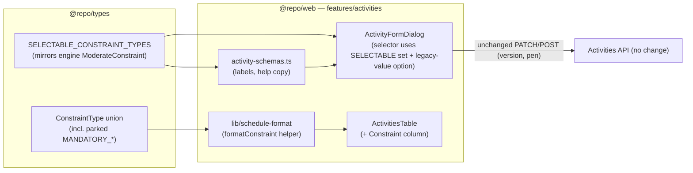
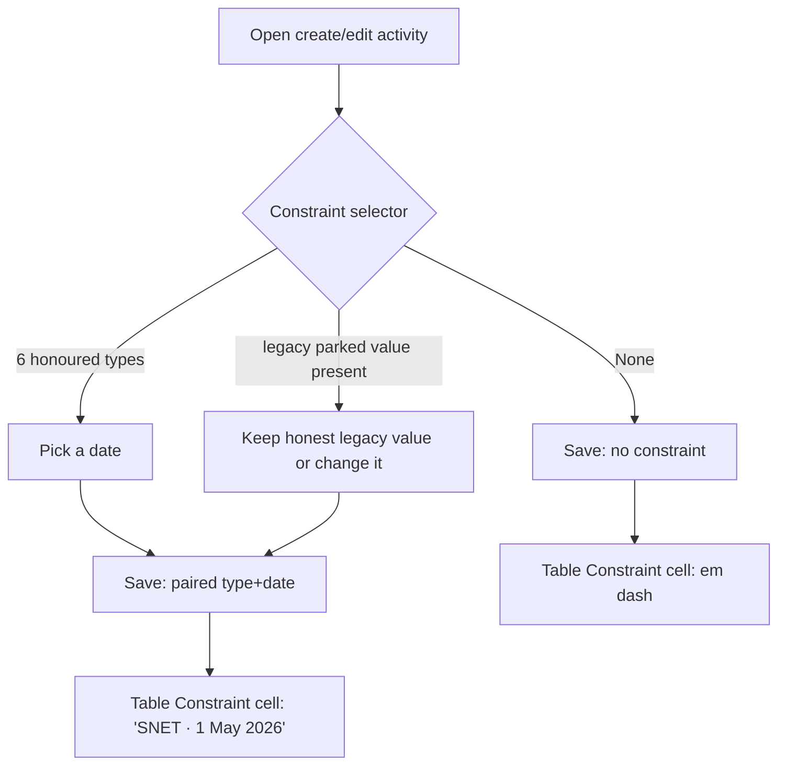

# Feature Spec: Date constraints — web UI (loop-closer)

- **Status:** Approved (2026-07-12) — implemented
- **Author(s):** Feature Analyst / Claude
- **Date:** 2026-07-12
- **Tracking issue / epic:** _tbd_
- **Roadmap link:** Scheduling core — **"Date constraints (web)"** (`docs/ROADMAP.md`, "Next")
- **Related ADR(s):** **none new.** Constraint semantics are already governed by
  **ADR-0023** (CPM date convention; §6 moderate-constraint clamping + parked
  mandatory) and **ADR-0026** (TSLD canvas non-colour encoding). This is UI over
  existing, accepted decisions — no ADR required.

> **Important — verification finding (read first).** The task brief describes this
> as "constraints are NOT yet settable in the UI" plus "add near-critical shading".
> **On inspection of the codebase, most of that already exists and works.** A
> faithful, smallest-change spec must scope to the **genuine remaining gaps**, not
> rebuild what shipped in M6 and the activities-foundation slice. This spec
> documents what is already present (verified, do not touch) and scopes the three
> real gaps. See §1 "Current state (verified)" and the critical questions in §1.

## 1. Business understanding

### Problem

SchedulePoint's CPM engine already honours activity **date constraints**
(SNET/SNLT/FNET/FNLT/MSO/MFO) end-to-end: the `Activity` model stores
`constraintType` + `constraintDate`, the create/update DTOs validate them, and the
engine clamps the forward/backward pass around them (ADR-0023 §6). The web activity
form already lets a planner **set and clear** a constraint, and both the activities
table and the TSLD canvas already distinguish **critical and near-critical**
activities with a non-colour cue plus a legend.

The remaining pain is narrower than "no UI":

1. **The form offers constraint types the engine does not honour _as labelled_.**
   The type selector lists all eight `ConstraintType` values, including
   `MANDATORY_START` / `MANDATORY_FINISH`. Per ADR-0023 §6 the engine **parks**
   those two — it silently applies them as their moderate equivalents (`MSO`/`MFO`)
   and counts them in `parkedConstraintCount`. A planner who picks "Mandatory start"
   gets "Must start on" behaviour with no indication. That is a
   what-you-see-is-not-what-you-get correctness/honesty gap and directly violates
   the task's own rule: _do not expose a constraint type the engine doesn't honour._
2. **A set constraint is invisible after saving.** Once a planner sets "Start no
   earlier than 1 May" on an activity, the **activities table shows no indication**
   of it — you must reopen the edit dialog per row to see whether (and how) an
   activity is constrained. There is no constraint column, badge, or canvas marker.
3. **Thin copy.** The constraint field has a bare "Constraint (optional)" label and
   no help text explaining what a constraint does or the sign of each type; the
   "Parked constraints" figure in the schedule summary strip is a bare number with
   no explanation of what "parked" means.

### Current state (verified — do NOT rebuild)

| Capability                                                                                   | Status   | Where                                                                                  |
| -------------------------------------------------------------------------------------------- | -------- | -------------------------------------------------------------------------------------- |
| Set/clear `constraintType` + `constraintDate` on **create**                                  | **Done** | `apps/web/.../ActivityFormDialog.tsx`, `createBody` in `api/use-activities.ts`         |
| Set/change/clear on **edit** (carries `version`; pen/optimistic-lock via the existing PATCH) | **Done** | same, `updateBody` (clears both sides as `null`)                                       |
| Zod validation mirroring the server (type⇔date paired)                                       | **Done** | `schemas/activity-schemas.ts` (`activityFormSchema` refine) + API `IsConstraintPaired` |
| Human-readable labels ("Start no earlier than", …)                                           | **Done** | `CONSTRAINT_TYPE_LABELS`                                                               |
| "None" empty state in the selector                                                           | **Done** | `<option value="">None</option>`                                                       |
| **Near-critical shading — table** (badge "Near-critical", text + variant, non-colour-alone)  | **Done** | `lib/schedule-format.ts` `criticality()`, `ActivitiesTable.tsx`                        |
| **Near-critical shading — canvas** (dashed outline vs solid for critical; fill colour)       | **Done** | `features/tsld/render/paint.ts` `criticalDash()`                                       |
| Canvas **legend** listing Critical / Near-critical with the dashed swatch                    | **Done** | `TsldPanel.tsx` `LEGEND`                                                               |
| `isNearCritical` flag + threshold (`NEAR_CRITICAL_THRESHOLD_WORKING_DAYS`)                   | **Done** | engine `compute.ts` + `constants.ts`                                                   |

**Conclusion:** scope items 1 (form) and 2 (near-critical shading) from the brief are
**already delivered**. The genuine work is three gaps, all small and UI-only:

- **G1 — Honest constraint selector.** Offer only the **six types the engine
  honours as-labelled** (SNET/SNLT/FNET/FNLT/MSO/MFO) for new/changed constraints;
  stop offering the parked `MANDATORY_*` pair; handle a pre-existing parked value
  honestly (don't silently mutate it on open).
- **G2 — Surface a set constraint** back in the activities table (and, optionally, a
  canvas marker), non-colour-alone.
- **G3 — Copy/help polish** on the constraint field and the "Parked constraints"
  figure.

### Users

Organisation members (ADR-0012 / ADR-0016):

- **Planner / Org Admin** — set, change, and clear an activity's constraint (a
  definition edit, `activity:update`); read the constraint back in the table/canvas.
- **Contributor / Viewer** — **read** constraints and criticality; cannot edit the
  definition (no change from today's activity-edit gating).
- **External Guest** — out of scope (per-plan share is a later feature).

### Primary use cases

1. Set a date constraint on an activity, choosing from types the engine honours
   exactly as labelled.
2. See at a glance, in the activities table, which activities are constrained and how.
3. Change or clear a constraint on an activity that already has one — including one
   that carries a legacy/imported parked (`MANDATORY_*`) value.

### User journeys

**Happy path.** A Planner opens **Edit activity**, picks "Start no earlier than"
from the Constraint selector (which now lists only honoured types), picks a date,
and saves — unchanged from today except the selector no longer offers the two
misleading mandatory options. Back in the activities table, a new **Constraint**
cell shows "SNET · 1 May 2026" (with an accessible label), so the constraint is
visible without reopening the dialog. Recalculating clamps the schedule as before.

**Alternate — legacy parked value.** A Planner edits an activity that was imported
with `MANDATORY_START`. The selector shows the current value as a clearly-labelled,
honest option ("Mandatory start — applied as Must start on") so it is **not silently
changed on open**; the Planner may keep it, switch to a supported type, or clear it.
The schedule summary's "Parked constraints" figure gains a tooltip explaining why.

**Alternate — clear.** Setting the selector back to "None" clears both fields
(both sent as `null`) — unchanged from today.

### Expected outcomes

- The form only ever offers constraint types that behave exactly as their label says
  — no silent downgrade.
- Constraints are legible from the table (and optionally the canvas) without opening
  each activity.
- "Parked" is explained where it appears, so a legacy parked value is understandable.

### Success criteria

- The create/edit constraint selector offers exactly **six** types (plus "None"); a
  Playwright/unit assertion proves `MANDATORY_*` are absent from the selectable set.
- Opening the edit dialog for an activity with a `MANDATORY_*` value **does not
  change** its stored value unless the user chooses to (no silent mutation) — proven
  by a test that a no-op save round-trips the original value.
- A constrained activity is identifiable in the table by a text-bearing indicator
  (not colour alone), verified by component + axe tests.
- No regression to optimistic-lock (`version`) or pen-gating on activity edits (the
  write path is unchanged).

### Open questions

> Each has a **recommended default** so work is not blocked.

- **Q1 (CRITICAL) — confirm the reduced scope.** Near-critical shading and the
  create/edit constraint form already exist and pass their tests. This slice is the
  three gaps G1–G3, not a rebuild. **Default: proceed with the reduced scope**;
  document the already-delivered pieces as "verified, untouched".
- **Q2 (CRITICAL) — drop the parked `MANDATORY_*` types from the selectable set?**
  **Default: yes** — offer only SNET/SNLT/FNET/FNLT/MSO/MFO (the engine's
  `ModerateConstraint` set, honoured as-labelled). `MANDATORY_*` remain valid in the
  `ConstraintType` union (the API still accepts them; imports/other tools may set
  them) but are **not newly selectable** in the web form. A pre-existing parked value
  is shown as an honest, labelled option and never silently mutated on open.
  _Alternative:_ keep offering them but with a warning — rejected (still WYSIWYG-wrong
  and encourages a parked state the engine downgrades).
- **Q3 (CRITICAL) — where is a set constraint surfaced, and is the canvas marker in
  scope now?** **Default: a dedicated, responsive "Constraint" column in the
  activities table now** (hideable on narrow screens like the late-date columns); the
  **TSLD canvas constraint pin is deferred** to an optional follow-up task so the
  slice stays minimal and `main` releasable. _Alternative:_ inline the marker on the
  Name cell — rejected (crowds the primary identifier; a column sorts/reads better).
- _Non-critical (defaults, no need to answer):_ the selectable subset lives as a
  shared const in **`@repo/types`** (mirroring the `DEPENDENCY_TYPES` / `WEEKDAYS`
  source-of-truth pattern and the engine's `ModerateConstraint`) so web and API agree
  on "honoured-as-labelled" — the smaller alternative is a web-local const in
  `activity-schemas.ts`; **help copy** lives with the field, not a separate docs page;
  no change to the constraint **date semantics** (still a calendar day `YYYY-MM-DD`,
  clamped on the plan's working-day calendar, ADR-0023/0024).

## 2. Functional requirements

### User stories & acceptance criteria

> **US-1** — As a **Planner**, I want the constraint selector to offer only types the
> engine applies exactly as labelled, so I never set a constraint that behaves
> differently than it reads.
>
> - **Given** the create or edit activity form **when** I open the Constraint
>   selector **then** it lists exactly "None" + the six honoured types
>   (SNET/SNLT/FNET/FNLT/MSO/MFO) and **not** "Mandatory start"/"Mandatory finish".
> - **Given** I pick a honoured type and a date and save **then** the activity is
>   created/updated with that pair (unchanged behaviour), and recalculation clamps as
>   today.

> **US-2** — As a **Planner** editing an activity that already carries a parked
> `MANDATORY_*` value, I want it shown honestly and left unchanged unless I change it.
>
> - **Given** an activity with `constraintType = MANDATORY_START` **when** I open the
>   edit form **then** the selector shows its current value as a clearly-labelled
>   option (e.g. "Mandatory start — applied as Must start on") and pre-selects it.
> - **Given** I save without touching the constraint **then** the stored value is
>   **unchanged** (no silent coercion to MSO).
> - **Given** I change it to a honoured type (or "None") and save **then** it is
>   updated/cleared as normal, and the honest legacy option disappears once no longer
>   selected.

> **US-3** — As any member, I want to see which activities are constrained, and how,
> directly in the activities table.
>
> - **Given** an activity with a constraint **when** I view the table **then** a
>   **Constraint** cell shows the type shorthand + date (e.g. "SNET · 1 May 2026")
>   with an accessible label spelling out the full type ("Start no earlier than 1 May
>   2026"); the meaning is carried by text, not colour alone (WCAG 1.4.1).
> - **Given** an activity with no constraint **then** the cell shows an em dash.
> - **Given** a narrow viewport **then** the column hides gracefully (like the
>   late-date columns) without breaking the layout.

> **US-4** — As a member, I want "Parked constraints" explained where it appears.
>
> - **Given** the schedule summary shows a non-zero "Parked constraints" figure
>   **when** I read/hover its help **then** I see that _N mandatory constraints are
>   being applied as their moderate equivalents (must-start-on / must-finish-on)_.

### Workflows

1. **Set constraint (create/edit)** — unchanged write path; only the **set of
   options** offered changes (G1) and the field gains help text (G3).
2. **Surface constraint (read)** — the table derives a `Constraint` cell from the
   activity's `constraintType`/`constraintDate` (G2); no new fetch (already in the
   `ActivitySummary`).
3. **Legacy parked value** — on form open, if the activity's `constraintType` is a
   parked value, the selector includes a one-off honest option for it so the current
   value round-trips untouched (G1 edge case).

### Edge cases

- **Legacy/imported `MANDATORY_*`** on an existing activity → shown honestly, never
  silently mutated (US-2).
- **Type set, date empty** (or vice versa) → already blocked by the Zod refine + the
  API `IsConstraintPaired` (unchanged); the date field only appears once a type is
  chosen.
- **Milestone with a finish constraint** → unchanged; the engine already handles the
  milestone finish=start mapping (ADR-0023).
- **Never-calculated plan** → constraints are still settable and shown in the table;
  criticality/near-critical badges stay em-dashed until recalculation (unchanged).
- **Narrow viewport** → the Constraint column collapses like the existing late-date
  columns; the constraint remains visible in the edit dialog.

### Permissions

| Action                           | Permission                          | Roles (deny-by-default)  |
| -------------------------------- | ----------------------------------- | ------------------------ |
| Set/change/clear a constraint    | `activity:update` (definition edit) | Planner, Org Admin       |
| Read a constraint (table/canvas) | `activity:read`                     | every member (Viewer up) |

No new permissions. Gating, org scope, optimistic locking, and the plan edit-lock
("pen") are inherited unchanged from the existing activity-edit path — this slice
does not touch the write path or any endpoint.

### Validation rules

- No new server rules. The web selector's option set is constrained to the six
  honoured types via a shared const (`@repo/types`), mirroring the engine's
  `ModerateConstraint`. The pairing rule (type⇔date) is unchanged (Zod refine +
  `IsConstraintPaired`).
- The one-off "legacy parked" option is presentation-only: it maps to the stored
  `ConstraintType` value and is submitted verbatim, so the API contract is unchanged.

### Error scenarios

| Scenario                                      | Detection                         | User-facing result                    | Status |
| --------------------------------------------- | --------------------------------- | ------------------------------------- | ------ |
| Type without a date (or vice versa)           | Zod refine / `IsConstraintPaired` | inline field error (unchanged)        | 422    |
| Stale `version` on save                       | optimistic lock (unchanged)       | conflict banner + refetch (unchanged) | 409    |
| Editing without the pen (if enforced)         | plan edit-lock (unchanged)        | locked message (unchanged)            | 423    |
| Viewer/Contributor attempts a definition edit | permission check (unchanged)      | forbidden (unchanged)                 | 403    |

No new error codes — this slice adds no endpoints.

## 3. Technical analysis

| Area           | Impact  | Notes                                                                                                                                                                                 |
| -------------- | ------- | ------------------------------------------------------------------------------------------------------------------------------------------------------------------------------------- |
| Frontend       | low     | restrict the form selector (G1); add a `Constraint` column + a small format helper (G2); help copy (G3); optional canvas pin (deferred)                                               |
| Backend        | none    | engine + DTOs already accept/honour constraints; no endpoint or service change                                                                                                        |
| Database       | none    | `constraintType`/`constraintDate` already exist                                                                                                                                       |
| API            | none    | contract unchanged; `MANDATORY_*` stay valid enum values                                                                                                                              |
| Security       | none    | no new surface; existing `activity:update` gating + scope unchanged                                                                                                                   |
| Performance    | none    | table cell is derived from data already fetched; no new query                                                                                                                         |
| Infrastructure | none    | —                                                                                                                                                                                     |
| Observability  | none    | —                                                                                                                                                                                     |
| Testing        | low–med | unit (selectable-set excludes parked; legacy-value round-trip; constraint-cell format) + component/axe (table cell non-colour) + extend the existing activity-edit Playwright journey |

### Dependencies

- **M6 CPM engine** — provides `isNearCritical` + the `ModerateConstraint` set that
  defines "honoured as-labelled" (the selectable subset must mirror it).
- **Activities-foundation** — the form, schema, table, and request builders this
  slice adjusts.
- `@repo/types` (`ConstraintType`, `ActivitySummary`) and `CONSTRAINT_TYPE_LABELS`.
- No new third parties; no migration.

## 4. Solution design

### Architecture overview



### Data flow — set + surface

```mermaid
sequenceDiagram
  participant U as Planner
  participant F as ActivityFormDialog
  participant API as Activities API (unchanged)
  participant T as ActivitiesTable
  U->>F: Open edit; selector offers 6 honoured types (+ legacy option if parked)
  U->>F: Pick "Start no earlier than" + date, Save
  F->>API: PATCH /activities/:id { constraintType:'SNET', constraintDate, version }
  API-->>F: 200 ActivitySummary
  F->>T: query invalidation (existing)
  T->>T: render Constraint cell "SNET · 1 May 2026" (aria: full label)
```

### User flow



### Database changes

**None.** `constraintType` (`ConstraintType?`) and `constraintDate` (`@db.Date?`)
already exist on `Activity`.

### API changes

**None.** No new/changed endpoints, DTOs, or status codes. `MANDATORY_START` /
`MANDATORY_FINISH` remain accepted enum values so imports and direct API use are
unaffected; the web form simply stops offering them for new selections.

### Component changes

Design-system primitives only (no one-offs):

- **`ActivityFormDialog`** — the Constraint `<select>` iterates a **selectable**
  subset (`SELECTABLE_CONSTRAINT_TYPES`) instead of all `CONSTRAINT_TYPES`. When the
  edited activity's current `constraintType` is not in the subset (a parked
  `MANDATORY_*`), inject a single honest option for it (label from a
  `PARKED_CONSTRAINT_LABELS` map, e.g. "Mandatory start — applied as Must start on")
  and pre-select it, so a no-op save round-trips the stored value. Add short help
  text under the field (G3).
- **`ActivitiesTable`** — a new, responsive **Constraint** column rendering a small
  text indicator ("SNET · 1 May 2026") with an `aria-label`/`title` spelling out the
  full label; em dash when unset. Hidden below a breakpoint like the late-date
  columns. No colour-only meaning.
- **`lib/schedule-format.ts`** — a pure `formatConstraint(activity)` helper returning
  `{ short, full } | null`, unit-tested (incl. the parked labels), reused by the cell.
- **`ScheduleSummaryStrip`** — add explanatory help/tooltip to the existing "Parked
  constraints" stat (G3); no structural change.
- **(Optional, deferred) TSLD canvas** — a small constraint pin marker in `paint.ts`
  - a legend entry in `TsldPanel`. Deferred to keep the slice minimal.

### Implementation approach & alternatives

**Chosen:** treat this as a small, honest **loop-closer** — verify and preserve the
already-delivered form + near-critical shading, and land only the three UI gaps
(honest selector, table surfacing, copy). Define the selectable subset once, in
`@repo/types`, mirroring the engine's `ModerateConstraint` so the "honoured
as-labelled" fact has a single source of truth.

**Alternatives considered:**

- _Build as if nothing exists (per the brief's framing)_ — rejected: it would rebuild
  working, tested code (the form, the badges, the canvas dash + legend), violating
  "smallest change that fully solves the task" and risking regressions.
- _Keep offering `MANDATORY_*` with a warning banner_ — rejected: still WYSIWYG-wrong
  and steers planners into a parked state the engine downgrades.
- _Web-local selectable const_ — acceptable smaller variant, but a shared
  `@repo/types` const keeps web and any future API-side "selectable" validation in
  lock-step, matching the `DEPENDENCY_TYPES`/`WEEKDAYS` precedent.

**No ADR required** — constraint semantics and the parked-mandatory decision are
already fixed by ADR-0023 §6; the canvas non-colour encoding by ADR-0026. This slice
adds no architecture.

## 5. Links

- Implementation plan: [`docs/plans/date-constraints-web.md`](../plans/date-constraints-web.md)
- Related docs likely touched: `@repo/types` (selectable-subset const),
  `apps/web` activities feature, `docs/ROADMAP.md` (move the item from "Next" to
  "Delivered"), a changeset (minor, pre-1.0). No ADR, no `docs/API.md`/`DATABASE.md`
  change.
