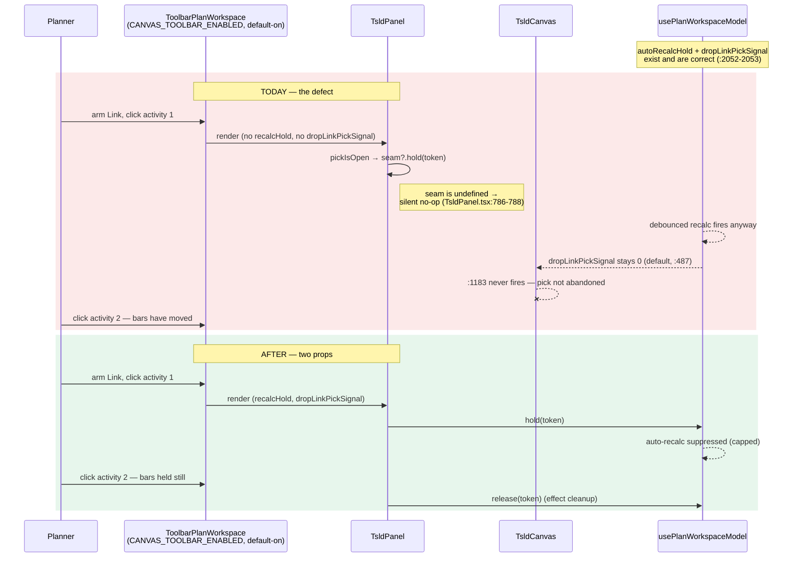
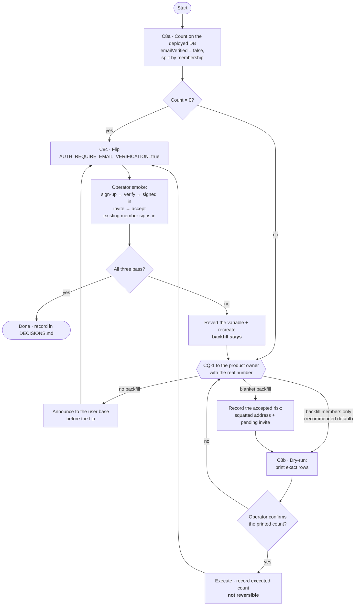

# Feature Spec: Debt paydown & external-client readiness programme

- **Status:** Draft — **awaiting approval before implementation**
- **Author(s):** feature-analyst
- **Date:** 2026-08-08
- **Tracking issue / epic:** _(to be raised on approval)_
- **Roadmap link:** _(none yet — `docs/ROADMAP.md` is silent on ADR-0074–0082; closing that is Workstream E)_
- **Related ADR(s):** consumes ADR-0058, ADR-0074, ADR-0076, ADR-0078, ADR-0081, ADR-0082.
  **Produces:** an ADR for the flag-retirement policy (D), an ADR for privacy operations (C12),
  and — pending the parallel design ruling — probably an ADR for the shaded-field primitive (B6).

> **This is not a product feature.** It is a programme of repair, hardening and readiness work.
> Stages 1–2 below are therefore about engineering and business outcomes, not about what a planner
> wants to do with a schedule. Where a workstream _does_ surface something to a planner, it says so
> and names the control (ADR-0081 §1).

---

## 0. Evidence, and what I checked

Per `docs/PROCESS.md` "Decision-bearing claims carry their evidence" and ADR-0076 §19.9, **the brief
is not evidence**. The brief supplied findings from four agents; I re-verified everything this spec
sizes or sequences on. Below is what I ran and what it said, including **four places where the
measurement disagreed with the brief**.

| Claim                                                                                | What I ran / read                                                                                                                                    | Result                                                                                                                                                                                                                                                                                                                                                                                                                                                                                                                                                                                              |
| ------------------------------------------------------------------------------------ | ---------------------------------------------------------------------------------------------------------------------------------------------------- | --------------------------------------------------------------------------------------------------------------------------------------------------------------------------------------------------------------------------------------------------------------------------------------------------------------------------------------------------------------------------------------------------------------------------------------------------------------------------------------------------------------------------------------------------------------------------------------------------- |
| #103 — quiescence props reach only the legacy branch                                 | `rg 'recalcHold\|dropLinkPickSignal\|autoRecalcHold' apps/web/src`                                                                                   | **Confirmed, and sharper.** The props appear as JSX in exactly **one** non-test source file: `plan-workspace.tsx:150-151`. `plan-workspace-toolbar.tsx` never passes them. `plan-workspace.tsx:70` selects `ToolbarPlanWorkspace` on `CANVAS_TOOLBAR_ENABLED`. So on the default-on surface `TsldPanel` receives `recalcHold === undefined` (`TsldPanel.tsx:786-788` is `seam?.hold(...)` — a silent no-op) and `dropLinkPickSignal` falls to its default `0` (`TsldPanel.tsx:487`), which never changes, so `TsldCanvas.tsx:1183` never fires. **Both halves of ADR-0064's quiescence are inert.** |
| #102(1) — `?redirect=` unvalidated                                                   | `router.tsx:81-106`                                                                                                                                  | Confirmed. `readForeignParam(search.redirect)` at `:89` returns any string; no shape check.                                                                                                                                                                                                                                                                                                                                                                                                                                                                                                         |
| #96 — `/accept-invite` is already normalised                                         | `router.tsx:405-416`                                                                                                                                 | Confirmed. `readForeignParam(search.token)` at `:411-413`. The register row is wrong.                                                                                                                                                                                                                                                                                                                                                                                                                                                                                                               |
| #98 — 320px overflow on the guest view                                               | `TsldViewControls.tsx:57-58`; `e2e-share/share.spec.ts:107-129`                                                                                      | Confirmed **and materially bigger than "re-enable an assertion"**. The outer row (`:57`) already wraps; the inner Zoom group (`:58`, `flex items-center gap-1`) does not. The suite does **not** contain a disabled assertion — the 1.4.10 assertion was **never written**; `:110-124` is a comment recording `scrollWidth === 436` and explicitly saying the fix "cuts across ADR-0031's overflow tiers and needs the member workspace re-checked at the same widths". See §2 US-4.                                                                                                                |
| #16 — the blocker is satisfied                                                       | `better-auth.ts:171, 211, 216-230`; `app-config.service.ts:64`; `invitations.service.ts:206, 231`                                                    | Confirmed. `revokeSessionsOnPasswordReset: true` at `:211`; the hashing comment at `:216-230`; `requireEmailVerification` threaded config → `auth.module.ts:37` → `better-auth.ts:171`. **And one thing the brief did not say:** `invitations.service.ts:231` gates invitation acceptance on `requireEmailVerification && !user.emailVerified`, so the flip changes a **live user-facing flow**, not just sign-up.                                                                                                                                                                                  |
| #16 — the backfill is an unrun task                                                  | `rg 'M5-T6\|M5-T7\|backfill' docs/specs/account-security/`                                                                                           | Confirmed. `implementation-plan.md:647,656` specify Count and Execute; `feature-spec.md:1093-1105` is **CQ-1, an open product question**. No script exists.                                                                                                                                                                                                                                                                                                                                                                                                                                         |
| #8 — CSP flip is an operator variable                                                | `rg CSP_HEADER_NAME`                                                                                                                                 | Confirmed. `docker-compose.yml:80`, `docker-compose.release.yml:117`, `apps/web/Dockerfile:66`, `.env.example:78`, `nginx.conf:102`. No release needed.                                                                                                                                                                                                                                                                                                                                                                                                                                             |
| #109/#74 — per-id loop under the plan lock, no timeout                               | `activities.service.ts:1300-1312`; `rg 'ArrayMaxSize\(2000\)\|maxWait\|timeout:' apps/api/src`                                                       | Confirmed **both halves**. The loop is at `:1302-1312`. `@ArrayMaxSize(2000)` appears in four DTOs. `maxWait`/`timeout:` return **zero matches in `apps/api/src`** — so Prisma's 5 s interactive-transaction default applies everywhere.                                                                                                                                                                                                                                                                                                                                                            |
| #100 — nothing watches `mail.send_failed`; no rotation                               | `smtp-mail.service.ts:26`; `rg 'logging:\|max-size\|json-file' docker-compose*.yml`                                                                  | Confirmed. The constant is at `:26`. **Zero matches** for a `logging:` block in either compose file.                                                                                                                                                                                                                                                                                                                                                                                                                                                                                                |
| #106 — a genuine cycle; `render-model.ts` size                                       | `docs/TECH_DEBT.md:1468-1495`; `rg -c '^' render-model.ts`                                                                                           | Confirmed the cycle. **The row's own line count is stale**: it says "1,500 lines rather than 1,660"; the file is **1,727**.                                                                                                                                                                                                                                                                                                                                                                                                                                                                         |
| #76 — the `activityRect` hoist is done                                               | `render-model.ts:446, 457-461`; `render/paint.rect-cache-budget.test.ts` exists                                                                      | Confirmed. `RectCache` at `:446`, `activityRect(..., cache?: RectCache)` at `:457-461`.                                                                                                                                                                                                                                                                                                                                                                                                                                                                                                             |
| #85 — resolved by ADR-0078 S11                                                       | `rg 'react-hooks/refs' apps/web/src`                                                                                                                 | Confirmed. Seven matches, **all of them comments describing the suppressions as deleted** (`use-viewport-commands.ts:14`, `use-diagram-image.ts:23`, `use-tsld-toolbar-context.tsx:268,372`). No `eslint-disable` remains. `toolbar/commands/` exists.                                                                                                                                                                                                                                                                                                                                              |
| #92 — blocker shipped; a small client change remains                                 | `rg restoreDeleteBatch`; `undo-redo/commands.ts:367-402`                                                                                             | Confirmed. `restoreDeleteBatch` exists across service, controller, DTO, `use-activities.ts` and `commands.ts`. `deleteActivityCommand` still re-creates via `createActivity` + `repositionLane` (`:378-391`), so a single-delete undo returns a new id and **loses that activity's links**.                                                                                                                                                                                                                                                                                                         |
| #20 — 14 call sites across 13 repositories                                           | `rg -c 'cursor: \{ id' apps/api/src`                                                                                                                 | Confirmed exactly: **14 across 13 files** (`calendar.repository.ts` has 2). The row saying 3 is wrong.                                                                                                                                                                                                                                                                                                                                                                                                                                                                                              |
| #45(c), #58, #31(c) primitives exist                                                 | `ls components/ui/notice-strip.tsx`; register rows                                                                                                   | `notice-strip.tsx` confirmed present.                                                                                                                                                                                                                                                                                                                                                                                                                                                                                                                                                               |
| Flag count                                                                           | `rg -c '^export const [A-Z_0-9]+ =' env.ts` → 61; `rg -c 'flagDefaultOn\(import\.meta\.env\.'` → 47; `rg 'flagDefaultOff\(' apps/web/src`            | Confirmed. 61 − 3 non-flags (`API_BASE_URL`, `AUTH_BASE_URL`, `THEME_STORAGE_KEY`) = **58 flags: 47 direct, 11 derived.** `flagDefaultOff` has **no consumer** outside its own definition and `env.test.ts`.                                                                                                                                                                                                                                                                                                                                                                                        |
| Playwright suites                                                                    | `rg -o 'test:e2e:[a-z-]+' apps/web/package.json` → 30; then `Glob 'apps/web/e2e*/**/*.spec.ts'` and count distinct directories                       | **29 flag-scoped directories (`e2e-*`) + the base `e2e/` = 30 `e2e*` directories in total; 30 named npm scripts, because `e2e-account/` carries two.** Register row #1 says 24. **This corrected my own first answer** — see §3(e).                                                                                                                                                                                                                                                                                                                                                                 |
| `docs/ROADMAP.md` is silent on ADR-0074–0082                                         | `rg 'ADR-007[4-9]\|ADR-008[0-2]' docs/ROADMAP.md`                                                                                                    | Confirmed: **zero matches**, all nine absent.                                                                                                                                                                                                                                                                                                                                                                                                                                                                                                                                                       |
| `apps/web/README.md` carries a second, ungated copy of the stage counts              | `README.md:6-8, 26`; `rg '27 feature modules\|~750\|23 flag-scoped'`                                                                                 | Confirmed, and **worse than reported**: it carries **three** count claims, and "27 feature modules" appears **twice** (`:6` and `:26`).                                                                                                                                                                                                                                                                                                                                                                                                                                                             |
| `scripts/check-counts.mjs` derives six figures, and "web feature modules" is not one | read `scripts/check-counts.mjs:34-43`                                                                                                                | Confirmed. It derives API modules, Prisma models, migrations, web source files, flag-scoped Playwright suites, ADRs. **Gating the README's third claim would need a seventh derivation.**                                                                                                                                                                                                                                                                                                                                                                                                           |
| The README's "27" may already be stale under RECONCILE's own command                 | `Glob 'apps/web/src/features/*/index.ts*'` → 27; but `features/audit/` exists (`features/audit/components/AuditFilterBar.tsx`) and has no `index.ts` | `RECONCILE.md:76` counts **directories** (`ls apps/web/src/features \| wc -l`), which is **at least 28**. So "27" is right under one derivation and wrong under the documented one — **and the prose does not say which**.                                                                                                                                                                                                                                                                                                                                                                          |
| Parity-suite population                                                              | `Glob '**/*{flag-off,-off,parity}*.test.*'` → 32 files; `rg -c 'ENABLED: false' apps/web/src` → 123 occurrences in **75** files                      | Confirmed the brief's _safety_ point with numbers: ~32 files are named rollback pins; **the other ~43 mock a flag false for ordinary isolation and must not be touched.** A mechanical "delete anything that sets a flag false" destroys 43 legitimate suites.                                                                                                                                                                                                                                                                                                                                      |
| **B6 blast radius**                                                                  | `rg -c 'disabled=' apps/web/src --glob '!*.test.*'` → **145 across 63 files**; tightened to own-line `^\s*disabled=` → **83 across 26 files**        | **Disagrees with the brief's "37 across 32 non-test files".** Neither predicate reproduces it. See §3 "Corrections".                                                                                                                                                                                                                                                                                                                                                                                                                                                                                |
| #66/#64 mechanism                                                                    | `components/ui/input.tsx:20`                                                                                                                         | Confirmed. `'disabled:cursor-not-allowed disabled:opacity-50'` — the shading responds to **native `disabled` only**, never `aria-disabled`. That is precisely why fixing #66 by reaching for `disabled` re-introduces #64.                                                                                                                                                                                                                                                                                                                                                                          |
| #115 — the gating seam                                                               | `features/activities/lib/activity-editor-gating.ts:42, 69, 73-81`; `features/plan-lock/lib/plan-gating.ts`; `lock-view.ts:96-144`                    | **Confirmed, and the brief has two details wrong.** Path is `lib/`, not `model/` (line numbers match exactly). `deriveActivityEditorGating` at `:73`; the defect is `:79` — `penManaged && !holdsPen ⇒ NO_PEN`, with no input describing _who_ holds it. **There is a second gate**: `plan-gating.ts` `derivePlanGating` returns bare booleans. **And the eight `tsld-toolbar-items.tsx` sites are not the same sentence** — see §3.                                                                                                                                                                |
| The peer-holder data already exists                                                  | `plan-lock/lib/lock-view.ts:96-144`                                                                                                                  | Confirmed, and this is good news for sizing. `HELD_BY_OTHER` already carries `status.holder`, and `lockCopy.heldByOther(holder)` / `canTakeOver(holder)` already exist. #115 is a **threading** job, not a new data source.                                                                                                                                                                                                                                                                                                                                                                         |

---

## 1. Business understanding

### Problem

Three problems, and they are the same problem at three distances.

**1. The debt register cannot be trusted, so it cannot be used to decide anything.** Seven rows are
open in `docs/TECH_DEBT.md` and done in code (#111, #94, #85, #30, #112(5), #112(6), #97(b)). Twelve
more describe work that is partly done, so the row overstates what is left (#8, #17, #21, #31, #35,
#51, #76, #92, #96, #88, #58, #45(c), #31(c)). Two carry counts that are simply wrong (#1 says 24
Playwright suites against 30; #20 says 3 repository call sites against 14). This is the exact defect
class ADR-0058 and ADR-0076 exist to police, and it has a compounding cost: a register that
overstates its backlog makes every prioritisation conversation start from fiction, and — as #92
shows — it hides work that has become **cheap**, because a row still names a blocker that shipped.

**2. Live defects are sitting on the surfaces that matter most.** The sharpest is #103: ADR-0064's
recalculation quiescence — the whole point of an epic opened on a report of six link attempts
producing zero dependencies — is `undefined` on the toolbar-hosted workspace, which is the surface
`CANVAS_TOOLBAR_ENABLED` (default-on) selects for every planner. The unit tests pass because they
exercise the hook and the panel; nothing asserts the host wires them together. This is ADR-0081's
own failure class, and ADR-0080 and ADR-0064 §7 each record a prior instance of it. Alongside it:
an unvalidated `?redirect=` on the sign-in route (#102(1)), and a measured WCAG 2.2 AA failure at
320 px on the guest share view (#98) — **the product's only unauthenticated surface**, and therefore
the first thing an external client sees.

**3. External clients were noted in prospect on 2026-08-03, and three readiness items are unpaid.**
Email verification is built and switched off, so invitation acceptance still grants organisation
membership on an email _match_ (`invitations.service.ts:231`). The CSP ships report-only, so the
observation window's protection is advisory. `mail.send_failed` is emitted and nothing watches it,
so a broken relay produces silently unrecoverable accounts. And there is no hard-delete or
data-export path at all — a contractual problem before it is a technical one.

**Why now.** Two reasons that are dated rather than felt. External clients are in prospect
(2026-08-03), which converts "alpha-only, deliberately accepted" risks into commitments. And
`docs/RECONCILE.md`'s last recorded pass is **2026-08-04**, with ADR-0074 through ADR-0082 landing
since — so the drift this programme repairs is already accumulating faster than the process notices.

### Users

This programme's users are not planners. Naming them honestly changes what "done" means.

| User                                             | Role                                                                                                 | What they need from this                                                                                                                                                                                                                                                   |
| ------------------------------------------------ | ---------------------------------------------------------------------------------------------------- | -------------------------------------------------------------------------------------------------------------------------------------------------------------------------------------------------------------------------------------------------------------------------- |
| **The product owner / operator**                 | runs the Docker Compose stack with Watchtower `autodeploy` on, reviews every release (CLAUDE.md §17) | A product that can be shown to an external client without a caveat. Two operator flips (#8, #16) executed safely with a stated rollback. An alert that fires when mail breaks.                                                                                             |
| **Engineers and AI assistants working the repo** | the primary consumers of `TECH_DEBT.md`, `CLAUDE.md`, `docs/`                                        | A register whose rows are true, so "what should I do next" is answerable. A canvas tree where the next change costs a day rather than a week (#106, ADR-0078). One place that decides what a shaded field looks like (B6) and one that decides why a control is shut (B7). |
| **External client users (prospective)**          | External Guest via a per-plan share link (ADR-0016/0051)                                             | A guest view that works on a phone. That is #98, and it is the only workstream item they will ever see.                                                                                                                                                                    |
| **Members of the organisation**                  | Org Admin / Planner / Contributor / Viewer                                                           | Working link-drawing on the canvas (#103). A refusal message that is true when a peer holds the pen (#115).                                                                                                                                                                |

### Primary use cases

1. **Decide what to work on** from a register whose rows are true.
2. **Draw a dependency on the canvas** without the bars moving between the two clicks (#103).
3. **Open a share link on a phone** without horizontal overflow (#98).
4. **Turn verification enforcement on** without stranding the existing user base (#16).
5. **Turn the CSP to enforce** with a stated, one-variable rollback (#8).
6. **Learn that mail is broken** from an alert rather than from a user who cannot sign in (#100).
7. **Change a canvas layer** without reading a 1,727-line module first (#106 → ADR-0078 S8+).
8. **Shade a control and say why** — once, in a primitive, rather than 26+ times (B6, B7).
9. **Retire a feature flag** against a written policy rather than by nerve (D).

### Expected outcomes

- The register describes the code. Every remaining row is about what is **left**.
- ADR-0064's quiescence is live on the surface planners use, with a regression test that fails
  against today's code.
- The two operator flips are done, each with a rollback the operator has actually exercised.
- Mail failure is alertable; container logs are bounded.
- `render-model.ts` is a pure barrel over modules that do not cycle, and ADR-0078 S8+ is unblocked.
- One decision governs shaded fields; one gate object governs why a control is shut.
- A written flag-retirement policy exists, and the first batch is retired against it.
- The reconciliation pass is recorded, closing the gap since 2026-08-04.

### Success criteria

| #     | Criterion                                                                                              | How it is measured                                                                                                           | Who can measure it                                                                           |
| ----- | ------------------------------------------------------------------------------------------------------ | ---------------------------------------------------------------------------------------------------------------------------- | -------------------------------------------------------------------------------------------- |
| SC-1  | Every `TECH_DEBT.md` row is true against the code at close                                             | Row-by-row re-verification; closed numbers in the ledger                                                                     | CI cannot check this. A person, at close.                                                    |
| SC-2  | #103 is fixed and cannot silently regress                                                              | A test that **fails against today's `plan-workspace-toolbar.tsx`** and passes after; plus one `e2e-authoring-flow` assertion | CI                                                                                           |
| SC-3  | `documentElement.scrollWidth <= 320` on `/share` at a 320 px viewport                                  | The assertion `e2e-share/share.spec.ts:110-124` describes and does not make                                                  | CI (`test:e2e:share`)                                                                        |
| SC-4  | Verification enforcement is on, with **zero** members locked out who held a membership before the flip | The M5-T6 count, the backfill's reported row count, and a post-flip sign-in by the operator                                  | **Human, on the deployed host.** Not CI.                                                     |
| SC-5  | CSP is enforcing, with zero violations on the walked routes                                            | The `e2e-csp` suite stays green **and** the operator's console walk of the route list in #8                                  | CI for the suite; **human on the host** for the walk                                         |
| SC-6  | A mail failure produces an alert in a non-email channel within 5 minutes                               | Inject a failure on the host (bad relay port) and observe                                                                    | **Human, on the host.**                                                                      |
| SC-7  | A 2,000-activity bulk delete completes inside the transaction budget with headroom                     | A measured p95 before and after, at 2,000 rows, against real Postgres                                                        | Semi-automatable via `scripts/e2e-local.sh api`; the **decision number** needs the real host |
| SC-8  | `render-model.ts` holds no implementation                                                              | `rg 'export function' render-model.ts` returns only re-exports; `paint.golden.test.ts` snapshot unchanged                    | CI                                                                                           |
| SC-9  | The shaded-field decision has exactly one implementation                                               | A structural test asserting no consumer sets native `disabled` on a form field primitive                                     | CI                                                                                           |
| SC-10 | `deriveActivityEditorGating` and `derivePlanGating` are the only sources of a refusal sentence         | A structural test; plus the existing ADR-0062 identity assertion, unchanged                                                  | CI                                                                                           |
| SC-11 | The flag-retirement policy exists as an ADR and the first batch is retired                             | ADR merged; `env.ts` flag count reduced; `pnpm test` green                                                                   | CI + review                                                                                  |
| SC-12 | `docs/RECONCILE.md`, `DECISIONS.md` and the Passes-run table all record this pass **in one commit**    | Review                                                                                                                       | Review                                                                                       |

### Open questions

Marked **CRITICAL** where the answer changes design or scope. Everything else has a stated default
and does not block.

> **CQ-1 (CRITICAL) — The existing-user decision at the verification flip.** This is
> `docs/specs/account-security/feature-spec.md:1093-1105` CQ-1, still open. Backfill
> `emailVerified = true` for pre-existing accounts (nobody locked out; grants verified status to
> accounts that never proved mailbox ownership), or no backfill (strictly correct; every existing
> user must resend and verify, unprompted, the day the flip happens)?
> **Default if unanswered:** ADR-0074 M5's own recommendation — backfill **only accounts that
> already hold a membership**, because enforcement's value is prospective and the membership
> predicate structurally excludes the risky case (a squatted address holding a _pending_
> invitation). **I recommend the default.** But the real count must be read first (M5-T6), because
> "the existing user base" may be small enough that the strict option costs nothing.

> **CQ-2 (CRITICAL) — Privacy operations: what are we actually committing to?** A hard-delete and
> data-export path contradicts a documented invariant (CLAUDE.md §17: "Every deletion is a soft
> delete… no hard-delete or data-erasure path"). Before any build: is the driver a specific
> contractual clause with a named client, a general GDPR-readiness posture, or a sales objection
> being pre-empted? The three produce materially different scopes — a per-organisation account
> export is a different system from a per-subject erasure with an audit trail that must itself
> survive the erasure (`audit_events` is append-only **in the database**, ADR-0072, so an erasure
> path has to answer what happens to it).
> **Default if unanswered:** do **not** build. Produce the ADR that frames the options and stop at
> the checkpoint. This is the one workstream item I would refuse to start without an answer.

> **CQ-3 (CRITICAL) — Flag retirement: what is the rollback contract worth?** Retiring a flag
> deletes its parity suite, which is the _only_ written rollback contract for a shipped default-on
> feature. For features that have soaked for months this is cheap; for `VITE_CANVAS_MULTI_SELECT`
> (default-on eight days ago) it is not. Is the goal (a) reduce the flag count, (b) reduce the test
> surface, or (c) remove genuinely dead branches?
> **Default if unanswered:** (c) only, with a soak-time floor of **90 days default-on** and no
> reported rollback, retiring **derived flags with their parents** in one commit. Under that rule
> the first batch is small — which I think is the correct answer, and §4 says why.

> **CQ-4 (non-blocking) — Does the B6 design ruling land as an ADR?** A parallel agent is producing
> the shaded-field ruling. **Default:** yes, an ADR — it changes a design-system primitive's
> contract across dozens of files and establishes a standing rule, which is exactly ADR-0082's
> shape. §4 leaves the design section as a placeholder pending that ruling.

> **CQ-5 (non-blocking) — Is #98's fix allowed to change the member workspace?** The share suite's
> own comment says fixing the zoom row "cuts across ADR-0031's overflow tiers and needs the member
> workspace re-checked at the same widths". **Default:** yes — fix the shared control once and
> re-check both surfaces, rather than branch the control by surface. A branched control is how the
> two drift.

> **CQ-7 (non-blocking) — Should `ROADMAP.md` lagging the ADR register become a gate?** It has now
> been found by three consecutive reconciliation passes (ADR-0066, then ADR-0067–0073, now
> ADR-0074–0082) and hand-corrected twice without stopping. A check that every accepted ADR appears
> in `ROADMAP.md` or an explicit exclusion list would fail loudly the first time an epic lands
> without a roadmap line.
> **Default if unanswered:** backfill the nine by hand in M10-T1 and **scope but do not build** the
> gate, recording it as a register row. My hesitation is honest and specific: unlike a count, this
> gate polices a **judgement** — "does this ADR belong on the roadmap?" — and a gate over a
> judgement tends to get satisfied by adding a line nobody means, which produces a roadmap that
> passes and misleads. That is a worse failure than the one it replaces.

> **CQ-6 (non-blocking) — Transaction timeout: global or per-operation?** **Default:** a global
> Prisma `transactionOptions.timeout` set from the C10 measurement with ≥3× headroom, plus an
> explicit per-call override on the bulk paths. Recorded in `DECISIONS.md` and
> `docs/BACKEND_ARCHITECTURE.md`; escalated to an ADR only if the answer turns out to be a policy
> rather than a number.

---

## 2. Functional requirements

Stories are written for the users named in §1. Acceptance criteria are Given/When/Then and are the
definition of "works".

> **US-1** — As an engineer, I want every `TECH_DEBT.md` row to be true against the code, so that
> the register can be used to decide what to work on.
>
> **Acceptance criteria**
>
> - **Given** a row that is fully resolved in code (#111, #94, #85, #30, #112(5), #112(6), #97(b))
>   **when** the repair lands **then** the row is **deleted** and its number appears in
>   [Closed numbers](../../TECH_DEBT.md#closed-numbers) with one line and a pointer to the record
>   — per that file's own convention at `TECH_DEBT.md:18-21`.
> - **Given** a partly-resolved row (#8, #17, #21, #31, #31(c), #35, #45(c), #51, #58, #76, #88,
>   #92, #96) **when** the repair lands **then** the row's title and body describe **only what is
>   left**, not the original scope.
> - **Given** #1 and #20 **when** the repair lands **then** they read 30 suites and 14 call sites
>   across 13 repositories respectively.
> - **Given** #106 **when** the repair lands **then** its `render-model.ts` line figure is corrected
>   from 1,500 to the measured value.
> - **Given** any row this programme rewrites **then** the rewrite names what was run to establish
>   it (ADR-0076 §19.9).

> **US-2** — As a planner, I want the bars to hold still between the two clicks of a link pick, so
> that I draw the dependency I aimed at.
>
> **Acceptance criteria**
>
> - **Given** the toolbar-hosted workspace (`CANVAS_TOOLBAR_ENABLED`, default-on) and an armed Link
>   tool **when** I click the first activity **then** the auto-recalculation hold is taken, and it
>   is released when the pick closes or the component unmounts.
> - **Given** an open pick **when** a recalculation completes anyway **then** the canvas abandons
>   the pick and announces it (the `dropLinkPickSignal` path at `TsldCanvas.tsx:1183-1192`).
> - **Given** the fix **when** the regression test is run against the pre-fix
>   `plan-workspace-toolbar.tsx` **then** it **fails**. A test that passes both ways proves nothing.

> **US-3** — As an operator, I want `?redirect=` to accept only same-origin paths, so that a
> crafted sign-in link cannot aim the post-login navigation off-origin.
>
> **Acceptance criteria**
>
> - **Given** `?redirect=/plans/abc` **when** sign-in completes **then** the browser navigates there.
> - **Given** `?redirect=https://evil.example`, `?redirect=//evil.example` or
>   `?redirect=javascript:alert(1)` **when** the route validates search **then** the parameter is
>   dropped and sign-in falls back to the default destination — **silently**, with no error naming
>   the rejected value.
> - **Given** the check `/^\/(?!\/)/` **then** protocol-relative `//host` is rejected by the
>   negative lookahead, and that case has its own test.

> **US-4** — As an External Guest, I want the share view to fit a 320 px viewport, so that I can
> read a programme on a phone.
>
> **Acceptance criteria**
>
> - **Given** `/share#<token>` at a 320 px viewport **when** the page settles **then**
>   `document.documentElement.scrollWidth <= 320`.
> - **Given** the same viewport **then** the canvas still has height > 100 px (the existing
>   assertion at `share.spec.ts:128` must keep passing — the wrap must not re-break the height fix
>   it was written to protect).
> - **Given** the member plan workspace at 320/360/768 px **then** the zoom presets remain operable
>   and no new horizontal overflow appears (CQ-5 — the shared control is fixed once).
> - **Given** the new assertion **when** run against the pre-fix `TsldViewControls.tsx` **then** it
>   fails with `scrollWidth === 436`.

> **US-5** — As an engineer, I want `render-model.ts` to hold no implementation, so that
> `link-routing`, `viewport` and `hit-test` can be extracted without an import cycle.
>
> **Acceptance criteria**
>
> - **Given** the extraction **then** `geometry.ts` holds the core types, `activityRect`,
>   `RectCache` and the glyph geometry, and **nothing imports the barrel**.
> - **Given** the extraction **then** `render-model.ts` re-exports and holds nothing.
> - **Given** the extraction **then** `paint.golden.test.ts`'s snapshot is **byte-identical** and
>   the five counting-stub budget suites are unmodified and green.
> - **Given** the barrel-preserving rule **then** **no consumer file outside `render/` changes**.
>   A consumer diff means the move was not a move.
> - **Given** `link-routing.test.ts` **then** it imports from `./link-routing`, making its name true.

> **US-6** — As a reader of a shut control, I want to be told the true reason it is shut, so that I
> know whether to press "Start editing" or to wait for a colleague.
>
> **Acceptance criteria**
>
> - **Given** the pen layer is active and **nobody** holds the pen **when** I open a pen-gated
>   control **then** the reason says to start editing.
> - **Given** a **peer** holds the pen **when** I open the same control **then** the reason names
>   the holder and points at the control that is actually on screen ("Request control" / "Take
>   over"), never "Start editing" — which is `activity-editor-gating.ts:79` today and is false in
>   that state.
> - **Given** my **role** forbids the write **then** the reason says so and does not mention the pen.
> - **Given** the nine `Start editing to …` sites (`activity-editor-gating.ts:69` plus
>   `tsld-toolbar-items.tsx:248, 435, 1824, 1840, 2197, 2247, 2281, 2326`) **then** each keeps its
>   own verb phrase and none of them constructs the sentence independently of the gate.
> - **Given** the ADR-0062 identity assertion (`gating.logic === gating.general`) **then** it is
>   **unmodified and still passing**. That is the drift pin; a threading change must not need it
>   relaxed.

> **US-7** — As an operator, I want to enforce the CSP with a one-variable rollback, so that the
> policy stops being advisory.
>
> **Acceptance criteria**
>
> - **Given** `CSP_HEADER_NAME=Content-Security-Policy` **when** the stack is recreated **then**
>   every route in #8's list loads with an empty console.
> - **Given** any violation **then** rollback is `CSP_HEADER_NAME` back to the report-only value and
>   a recreate — **no release**.
> - **Given** `upgrade-insecure-requests` **then** it is acknowledged as genuinely untested until
>   this flip (report-only ignores it by specification) and is walked deliberately.
> - **Given** `e2e-csp` **then** it stays green and is **not** relaxed to accommodate the flip.

> **US-8** — As an operator, I want email verification enforced without stranding the existing user
> base, so that invitation acceptance proves mailbox ownership.
>
> **Acceptance criteria**
>
> - **Given** the deployed database **when** M5-T6 runs **then** it reports the count of accounts
>   with `emailVerified = false`, split by whether they hold a membership.
> - **Given** the CQ-1 answer **when** the backfill runs **then** it runs **dry-run first**,
>   printing the exact rows it would change, and the operator confirms the number before execution.
> - **Given** `AUTH_REQUIRE_EMAIL_VERIFICATION=true` **when** an existing member signs in **then**
>   they are not locked out (per the CQ-1 answer).
> - **Given** the flip **when** a new user signs up **then** they receive a verification mail, the
>   link lands them signed-in (ADR-0074 M5's `callbackURL` fix), and the pending screen is not shown
>   to someone who has verified (`docs/TECH_DEBT.md` #96 class).
> - **Given** the flip **when** an invitee accepts **then** `invitations.service.ts:231` enforces
>   verification — and this behavioural change is stated in the release note, because it is the
>   flip's actual security purpose.
> - **Given** rollback **then** `AUTH_REQUIRE_EMAIL_VERIFICATION=false` restores today's behaviour;
>   **the backfill does not roll back**, and that asymmetry is stated before it is executed.

> **US-9** — As an operator, I want to be told when mail fails, so that I do not learn it from a
> user who cannot sign in.
>
> **Acceptance criteria**
>
> - **Given** a relay failure **when** any of the three messages fails **then** a log line carrying
>   `mail.send_failed` is emitted (already true, `smtp-mail.service.ts:26`) **and** a watcher posts
>   to a **non-email** channel within 5 minutes.
> - **Given** the alert **then** it names the `MailFailureKind` (`invitation` /
>   `email_verification` / `password_reset`) and **never** the credential inside `MAIL_SMTP_URL`.
> - **Given** either compose file **then** a `logging:` block bounds log size and rotation, so the
>   watcher has a bounded file and the host does not fill.
> - **Given** the watcher **then** its own failure is visible — a watcher that dies silently
>   reproduces the defect it was built to fix.

> **US-10** — As an operator, I want a 2,000-activity bulk delete to complete inside its transaction
> budget, so that a large delete does not fail after holding the plan lock for seconds.
>
> **Acceptance criteria**
>
> - **Given** the pre-change code at 2,000 activities **then** the query count and wall-clock are
>   **measured and recorded**, against real Postgres.
> - **Given** the set-wise rewrite **then** the measurement is repeated and the improvement stated
>   as a number (the ADR-0053 M6 precedent measured 830 ms → 13 ms for a 2,000-row subtree).
> - **Given** the rewrite **then** `activity.deleted` still records **one** audit row carrying
>   scalar `activityCount`/`dependencyCount` from the sweep's return value — the ADR-0073 C3.1 §0.1
>   property must survive (`activities.service.ts:1314-1329`).
> - **Given** the transaction timeout **then** it is set **after** the measurement, with stated
>   headroom, and the 5 s default is no longer relied on implicitly.
> - **Given** an over-budget delete **then** it fails with a typed, user-safe error — never a 500.

> **US-11** — As an engineer, I want a written policy for when a feature flag is retired, so that
> retirement is a decision rather than nerve.
>
> **Acceptance criteria**
>
> - **Given** the policy **then** it states the evidence that justifies retirement (soak time
>   default-on, no reported rollback, and — for a derived flag — its parent's status).
> - **Given** a derived flag **then** it is retired **with its parent, in one commit**; a derived
>   flag outliving its parent is a branch that cannot be reasoned about.
> - **Given** retirement **then** the flag's **named** parity suite is deleted and every other
>   suite that mocks that flag false for isolation is **kept** — the ~43 files measured in §0.
> - **Given** a retirement PR **then** it deletes the flag-off code path, not merely the constant.
>   A constant deleted with its branch left behind is worse than no retirement.

> **US-12** — As a reader of the repository, I want the docs to describe the system, so that I do
> not build against a claim that rotted.
>
> **Acceptance criteria**
>
> - **Given** `apps/web/README.md` **then** it does not claim "foundation only. No application
>   features are implemented yet".
> - **Given** `apps/web/README.md:6-8, 26` **then** the three stale count claims are **deleted** and
>   the paragraph links to `CLAUDE.md`'s gated banner instead — one copy, already computed. The
>   qualitative status claims ("built and shipping", the TSLD workspace, the Gantt view) stay: they
>   are what the paragraph exists for.
> - **Given** the optional re-add guard **then** `pnpm check:counts` fails if a bare stage count
>   returns to `apps/web/README.md`. This is a "do not re-add" assertion, **not** a second sync gate,
>   and it needs no update when a count changes.
> - **Given** `docs/ROADMAP.md` **then** it covers ADR-0074 through ADR-0082 — all nine, verified
>   absent today by `rg 'ADR-007[4-9]|ADR-008[0-2]' docs/ROADMAP.md` returning nothing.
> - **Given** that this is the **third consecutive** pass to find `ROADMAP.md` lagging the ADR
>   register **then** the pass records it as a recurring defect class and either builds the gate or
>   files it as a register row with CQ-7's reasoning — **not** as a tidy-up, which is what produced
>   the third recurrence.
> - **Given** `docs/ARCHITECTURE.md` §10 **then** every accepted-but-unbuilt ADR listed is still
>   unbuilt, and no newly-built capability is listed as absent.
> - **Given** `CLAUDE.md` §17 **then** each claim is re-verified against code.
> - **Given** the pass **then** `RECONCILE.md`'s date, its Passes-run table and a `DECISIONS.md`
>   entry are updated **in one commit** — the file's own banner records that these three drifting
>   apart is exactly how this document once drifted about its own drift control.

### Workflows

**W1 — Register repair (per row).** Read the row → read the code it names → classify as _resolved_ /
_partly resolved_ / _wrong count_ / _still true_ → delete + ledger, rewrite, or correct → record what
was found wrong (not just what changed).

**W2 — Operator flip (#8, #16).** Announce → set the variable in the host `.env` → recreate → walk
the checklist → observe → on failure, revert the variable and recreate. **No release either way**,
which is the property that makes both reversible.

**W3 — Backfill (#16).** Count → present the count with the CQ-1 options → receive the decision →
dry-run printing exact rows → operator confirms the number → execute → record the executed count.

**W4 — Extraction (#106, ADR-0078 S8+).** Characterisation oracle green first → move only what
depends on nothing that will be re-exported around it (#106's own stated ordering rule) → barrel
re-exports → **no consumer file changes** → golden snapshot byte-identical → budget suites unmodified.

**W5 — Flag retirement (per flag).** Check policy predicates → delete the flag-off branch → delete
the **named** parity suite → keep isolation mocks → remove the constant → `pnpm test` → changeset.

### Edge cases

| Case                                                                                 | Expected behaviour                                                                                                                                                                                                            |
| ------------------------------------------------------------------------------------ | ----------------------------------------------------------------------------------------------------------------------------------------------------------------------------------------------------------------------------- |
| A register row is _neither_ resolved nor still true — the underlying premise expired | Rewrite it to be about the premise, or close it with a ledger line explaining the expiry (the #5 hosting precedent). Do not delete silently.                                                                                  |
| The #103 fix reveals the toolbar host is missing _other_ props too                   | Audit the full prop surface of both hosts in the same PR and record any further gaps as a new row rather than fixing opportunistically. This defect class is "one host and not its neighbour"; assume there is more than one. |
| The #98 wrap changes the member workspace's toolbar tier behaviour                   | Expected (CQ-5). Re-check at 320/360/768 and adjust ADR-0031's tiers if needed — but do **not** branch the control by surface.                                                                                                |
| The M5-T6 count is zero                                                              | The CQ-1 decision is moot; flip directly and record that the count was zero.                                                                                                                                                  |
| The M5-T6 count is large (say > 50)                                                  | Escalate to the product owner before the backfill. A large cohort makes the strict option a support event and may change the answer.                                                                                          |
| The backfill is executed and the flip is then rolled back                            | The backfill does not roll back. State this **before** execution (US-8) so it is a decision, not a discovery.                                                                                                                 |
| CSP enforce breaks a route not on the walk list                                      | Revert to report-only immediately; add the route to the list; re-derive the directive. Do **not** relax `e2e-csp` to make it pass.                                                                                            |
| A retirement candidate's parity suite is the only test of that surface at all        | Do not retire. Write the flag-on coverage first, or leave the flag. The ADR-0062 M6 finding — a panel with no unit coverage because the suite named for it covered the legacy dialog — is this case.                          |
| Two workstreams touch the same file                                                  | §5 "Sequencing" names every such collision. The only real one is B6 → B7 (both touch shaded controls) and it is a hard ordering.                                                                                              |
| A row this programme rewrites turns out to be wrong again during the work            | Record it in the pass's findings. Per `RECONCILE.md` §8, **what was found wrong** is the evidence the pass was worth running.                                                                                                 |

### Permissions

Most of this programme is invisible to RBAC. Where it is not:

| Item             | Permission / scope                                                                                                                                                        | Change                                          |
| ---------------- | ------------------------------------------------------------------------------------------------------------------------------------------------------------------------- | ----------------------------------------------- |
| #103 quiescence  | Rides `assertHoldsPen` unchanged (ADR-0028). The pen is the write gate; quiescence is a client-side timing concern.                                                       | **None.**                                       |
| #102(1) redirect | Pre-authentication. No org scope exists yet.                                                                                                                              | **None** — it narrows an input, grants nothing. |
| #98 share view   | External Guest, `SCHEDULE_READ` only (ADR-0051). Frontend CSS.                                                                                                            | **None.**                                       |
| #16 verification | Changes **who may accept an invitation** — `invitations.service.ts:231` starts refusing an unverified account. This is the flip's purpose and its only permission effect. | **Behavioural**, no new permission.             |
| B7 gating        | Reads `pen.status.holder`, which the client already has.                                                                                                                  | **None** — the identity assertion pins that.    |
| C12 privacy ops  | A hard-delete/export path **needs a new permission** (Org Admin only, org-scoped) and interacts with the append-only audit log.                                           | **New — and part of why it needs an ADR.**      |
| Everything else  | Docs, refactors, operator config.                                                                                                                                         | **None.**                                       |

**Deny-by-default is unchanged throughout.** No item in A, B, D or E adds a route, a DTO field or a
guard. The one item that would (C12) is stopped at a decision checkpoint.

### Validation rules

| Rule                                                                         | Where                                    | Shared?                                         |
| ---------------------------------------------------------------------------- | ---------------------------------------- | ----------------------------------------------- |
| `?redirect=` matches `/^\/(?!\/)/`                                           | `router.tsx` `validateSearch`            | Client-only. The server never consumes it.      |
| Retirement predicates (soak ≥ 90 days, no reported rollback, parent retired) | The policy ADR + a review checklist      | Not code-enforceable; stated as a checklist.    |
| Transaction timeout ≥ 3× measured worst case                                 | `PrismaService` options + `DECISIONS.md` | Server-only.                                    |
| Backfill predicate: `emailVerified = false AND EXISTS (membership)`          | The backfill script's dry-run            | Server-only. Deliberately narrow (ADR-0074 M5). |

### Error scenarios

| Scenario                                                           | Detection                                    | User-facing result                                                                                                                  | Status             |
| ------------------------------------------------------------------ | -------------------------------------------- | ----------------------------------------------------------------------------------------------------------------------------------- | ------------------ |
| `?redirect=` off-origin or protocol-relative                       | `validateSearch` shape check                 | Parameter dropped, default destination, **no message** (naming it is an oracle)                                                     | n/a — client route |
| Bulk delete exceeds the transaction budget                         | Prisma transaction timeout                   | Typed error: "That delete was too large to complete. Try fewer activities." Nothing partially deleted (the transaction rolls back). | 422                |
| Bulk delete includes a `WBS_SUMMARY`                               | `activities.service.ts:1284-1289` (existing) | Existing `SUMMARY_NOT_BULK_ELIGIBLE` message                                                                                        | 422                |
| Bulk delete version mismatch                                       | `:1294-1298` (existing)                      | Existing "This plan changed since you opened it"                                                                                    | 409                |
| Verification enforced, invitee unverified                          | `invitations.service.ts:231`                 | Existing message + a resend route (ADR-0074 M2 closed this dead end)                                                                | 403                |
| Mail send fails                                                    | `smtp-mail.service.ts` catch                 | **Nothing to the user** — deliberately, per ADR-0075's enumeration-oracle reasoning. The operator gets the alert.                   | n/a                |
| CSP blocks a resource after enforce                                | Browser console / `securitypolicyviolation`  | The resource does not load. Rollback is the operator's variable.                                                                    | n/a                |
| Undo of a single delete after #92 (`restoreDeleteBatch`) conflicts | Existing 409 path                            | Existing abort-and-refetch + clear-redo (ADR-0048)                                                                                  | 409                |

---

## 3. Technical analysis

| Area           | Impact      | Notes                                                                                                                                                                                                                                                                                   |
| -------------- | ----------- | --------------------------------------------------------------------------------------------------------------------------------------------------------------------------------------------------------------------------------------------------------------------------------------- |
| Frontend       | **high**    | #103 (two props + test), #102(1) (one guard), #98 (one class + a re-check across two surfaces), #106/ADR-0078 S8 (a large but consumer-invisible move), B6 (a primitive + 26–63 consumer files), B7 (two gate functions + nine call sites), D (28–32 suite deletions + branch removal). |
| Backend        | **low–med** | C10 only: the set-wise sweep in `activities.service.ts` and a transaction-timeout option. No new module, no new endpoint. C12 would be high — and is gated behind a decision.                                                                                                           |
| Database       | **none**    | **No migration in the whole programme**, except C12 if approved. The #16 backfill is a data `UPDATE`, not a schema change.                                                                                                                                                              |
| API            | **none**    | No new/changed endpoint or DTO. C10 changes an implementation, not a contract.                                                                                                                                                                                                          |
| Security       | **med**     | #102(1) narrows an input. #16 enforces mailbox ownership — the actual security outcome. #8 makes the CSP binding. #100 makes a silent failure visible. C12 introduces a new permission and an erasure-vs-audit-log conflict.                                                            |
| Performance    | **med**     | C10 is the only performance item, and it is a **measurement first**. ADR-0078 S8 must be performance-**neutral** and is pinned by five counting-stub budget suites.                                                                                                                     |
| Infrastructure | **med**     | Two operator env-var flips, a `logging:` block in both compose files, and a log-watcher service. No new managed service (the log watcher is a container beside the stack — deliberately not Redis/BullMQ, which ADR-0009/0010 designed and nothing has built).                          |
| Observability  | **med**     | #100 is entirely observability: an alertable term already exists; a watcher and rotation do not.                                                                                                                                                                                        |
| Testing        | **high**    | Regression tests that must be **verified red first** for #103, #98, B7. The `paint.golden.test.ts` snapshot is the ADR-0078 S8 oracle. `e2e-share`, `e2e-authoring-flow` and `e2e-csp` each gain or keep assertions. D deletes ~32 suites and must not delete ~43.                      |

### Corrections to the brief

Per ADR-0076 §19.9 and the process rule that **the brief is not evidence**, four of the brief's
inputs did not survive re-measurement. All four change sizing or approach.

**(a) The B6 blast radius is not 37 across 32.** `rg -c 'disabled=' apps/web/src --glob '!*.test.*'`
returns **145 occurrences across 63 files**; tightening to props on their own line
(`^\s*disabled=`) returns **83 across 26 files**. I could not construct a predicate yielding 37/32.
Two files dominate either way — `ActivityEditorDialog.tsx` (20) and `ActivityProgressPanels.tsx`
(15) — which is itself useful: the cluster is concentrated, not evenly spread. **Consequence:** B6's
consumer sweep should be sized as **L, not M**, and should be split by file rather than done in one
PR. I recommend the parallel design agent be given these numbers.

**(b) The nine `Start editing` sites are nine _different_ sentences, not one repeated.** Read
verbatim: `activity-editor-gating.ts:69` "Start editing to change this activity."; then
`tsld-toolbar-items.tsx:248` "…to add activities", `:435` "…to link activities", `:1824` and `:1840`
"…to change the scheduling mode", `:2197` "…to auto-arrange", `:2247` "…to snap placements", `:2281`
"…to clear the placement", `:2326` "…to recalculate". **Consequence:** the fix cannot be a shared
constant. It needs a small builder — the gate returns the _state_ (`NO_ROLE` / `NO_PEN_FREE` /
`NO_PEN_PEER(holder)`) and each call site supplies its verb phrase — which is more design than the
brief implies and is why B7 gets its own milestone rather than riding B6.

**(c) There is a second gate, and #114.1 cannot be fixed without it.** `plan-lock/lib/plan-gating.ts`
`derivePlanGating` returns bare booleans (`canEditSchedule`, `penReadOnly`) with **no reason string
at all**. CLAUDE.md's ADR-0060 note already records the consequence — "a host given only that cannot
say which is missing" — and it is exactly why `plan-actions-menu.tsx` (#114.1) has no sentence to
print. **Consequence:** B7 spans **two** files, not one. Good news alongside it: `lock-view.ts:96-144`
already resolves `HELD_BY_OTHER` with `status.holder` and already has `lockCopy.heldByOther(holder)`
/ `canTakeOver(holder)`. The data exists; only the threading is missing. That keeps B7 at **M**.

**(d) #98's assertion is not disabled — it was never written.** `share.spec.ts:110-124` is a comment
recording `scrollWidth === 436` and stating that fixing it "cuts across ADR-0031's overflow tiers
and needs the member workspace re-checked at the same widths". **Consequence:** the task is _write_
the assertion (verified red first) **and** re-check the member workspace at the same widths, not
"re-enable" one line. Sizes as **S–M**, not XS.

**(e) My own first answer on the suite count was wrong, and I am recording it rather than quietly
fixing it.** I initially derived "30 Playwright suites" from
`rg -o 'test:e2e:[a-z-]+' apps/web/package.json`. That is the count of **npm scripts**, and
`e2e-account/` carries two of them (`test:e2e:account`, `test:e2e:account-verify`) for one
directory. `RECONCILE.md:76`'s canonical command counts **directories** (`ls -d apps/web/e2e*`),
which gives **30 in total: 29 flag-scoped `e2e-*` plus the base `e2e/`** — and 29 is exactly what
`CLAUDE.md`'s gated banner already says. **Consequence:** writing "30 suites" into register row #1
would have introduced a _third_ number into the repository, disagreeing with the gated banner —
which is the defect class this whole programme exists to close, committed inside the document
closing it. Row #1 must be phrased in the banner's own vocabulary ("29 flag-scoped suites beside
the base journey") so the two **cannot** disagree.

Two smaller corrections: the gating file is `features/activities/**lib**/` not `model/` (line
numbers match exactly); and #106's own row understates `render-model.ts` at 1,500 lines against a
measured **1,727**.

### The second copy of the stage counts: gate it, or delete it?

`apps/web/README.md:6-8` carries its own stage-count paragraph — "27 feature modules… ~750 source
files… 23 flag-scoped Playwright suites (counted 2026-08-04)" — against actuals of **885** source
files and **29** flag-scoped suites. It rotted within four days while the gated copy in `CLAUDE.md`
stayed honest. That is close to a controlled experiment: same repository, same period, one figure
computed on every push and one not.

**Recommendation: delete the counts from the README and link to the gated banner. Do not gate a
second copy.** Reasoning, including the arguments I was asked to test rather than accept:

1. **The decisive fact is that there are three claims, not two, and only two are derivable by the
   existing script.** `check-counts.mjs:34-43` derives six figures and **"web feature modules" is
   not among them**. So gating the README as proposed leaves "27 feature modules" — which appears
   **twice**, at `:6` and `:26` — ungated. A status paragraph where two numbers are computed and a
   third is not is **worse than one where none are**, because a reader cannot tell which to trust
   and will reasonably assume all three carry the same warranty.
2. **That third claim is probably already wrong, and in the most instructive way.** 27 directories
   under `src/features/` have an `index.ts`, but `features/audit/` exists without one, so
   `RECONCILE.md:76`'s documented command (`ls apps/web/src/features | wc -l`, a **directory**
   count) returns at least 28. The number is right under one derivation and wrong under the
   documented one, **and the prose does not say which it used** — the same ambiguity that produced
   my own error in §3(e). Gating it would first require deciding what it means.
3. **The "wrong dependency direction" objection is weaker than it looks, and I am not resting the
   decision on it.** `check-counts.mjs` already reads `apps/web/src` and
   `apps/api/prisma/schema.prisma` to derive, and `RECONCILE.md:82-88` already lists
   `apps/web/README.md` as a file the manual pass must sweep — it was added on 2026-08-04 for
   exactly this reason. The coupling therefore already exists; it is simply in the form that does
   not work. Honestly weighed, this argument does not carry.
4. **The "approximation" objection is real but is usually stated wrongly.** "~750" is fine; the
   defect is not imprecision but **staleness**, and those are different properties. A tolerance
   would indeed be a gate that lies a little. But the reason to prefer deletion is not that the
   number is approximate — it is that the number is **redundant**.
5. **What the numbers are actually for survives their deletion.** They exist to refute the claim
   the 2026-08-04 pass found in this exact file — "foundation only. No application features are
   implemented yet". That job is done by the qualitative claims beside them ("built and shipping",
   "a Canvas-2D TSLD workspace, a virtualized Gantt view"), which do not rot the same way, plus a
   link to the gated banner. A package README's reader is someone about to work in `apps/web`, who
   has `CLAUDE.md` open anyway. **Removing a claim beats gating a duplicate of it**, and the
   machinery is the thing that rots.
6. **One cost I am accepting**, stated so it is a decision: `pnpm check:counts` already forces
   `CLAUDE.md`'s banner to be edited on every PR that adds a web source file. Gating the README
   would **double** that friction for a lower-value copy — and `RECONCILE.md`'s own lesson (via
   ADR-0058's coverage ratchet) is that a gate which fires constantly gets deleted rather than
   fixed.

**Residual risk, and a cheap answer to it.** Deleting the counts leaves nothing to stop someone
re-adding them later, at which point we are back here with nothing noticing — vigilance again.
So I suggest, **as an optional extra I am least confident about**, a ~5-line assertion in
`check-counts.mjs` that `apps/web/README.md` contains **no** bare count matching the gated
patterns. Note what that is: a **"do not re-add" guard**, not a "keep in sync" gate. It never needs
updating when a count changes, costs no per-PR friction, and converts the one remaining human
obligation into a computation — which is `RECONCILE.md`'s preference applied where it actually
pays. If it feels like over-engineering, drop it; the deletion is the load-bearing half.

**Size:** deletion + link **XS**; the optional guard **S**. Both in M10-T1.

### `ROADMAP.md` lagging the ADR register is a recurring defect, not a tidy-up

`rg 'ADR-007[4-9]|ADR-008[0-2]' docs/ROADMAP.md` returns **zero matches** — all nine ADRs absent.
This is the **third consecutive recurrence**: `RECONCILE.md:199` records the 2026-07-31 pass finding
ROADMAP "silent on the epic" for ADR-0066, and `:198` records the 2026-08-04 pass finding the same
class again ("ROADMAP.md was silent on ADR-0067–0073 — the same failure as the row below, one epic
later"). Three passes, three findings, same file, same shape.

**Treating it as a tidy-up is what produced the third recurrence.** Two passes have now corrected it
by hand and neither stopped it happening again, which is precisely the evidence ADR-0058 says
converts a checklist item into something else. M10-T1 therefore does two things rather than one:
backfill the nine, **and** make the next recurrence cheap to catch. The obvious candidate is a check
that every accepted ADR number appears in either `ROADMAP.md` or an explicit
"deliberately-not-on-the-roadmap" list — cheap to write, and it fails loudly the first time an epic
lands without a roadmap line. I am recommending it be **scoped and sized in M10**, not asserted here
as obviously correct: unlike the count gates, it polices a _judgement_ (does this ADR belong on the
roadmap?) rather than an arithmetic fact, and a gate over a judgement is exactly the kind that gets
satisfied by adding a line nobody means. **CQ-7 below puts that choice to the product owner.**

### Dependencies

**Hard orderings — violating any one produces a worse state than doing nothing.**

1. **#106 → ADR-0078 S8+.** Extracting `link-routing`/`viewport`/`hit-test` onto a cycling barrel
   puts four modules on a broken foundation. ES modules tolerate cycles, so it compiles and passes
   — which is why it must be a gate rather than a caution.
2. **B6 primitive → B6 consumers.** Fixing #66 before the primitive can only mean adding native
   `disabled`, which is #64 reintroduced. `input.tsx:20` proves the mechanism: shading responds to
   `disabled:` variants only.
3. **The ADR-0074 M2/M5 bundle is live → #16 flip.** Already satisfied (web 0.78.0), but the flip
   task must re-confirm the running bundle rather than trust this sentence.
4. **CQ-1 answered + M5-T6 counted → the backfill → the flip.** Three steps, in that order.
5. **#116.1 → #116.2.** Announcing a pointer-only capability to a keyboard user is worse than
   silence. _(Both are in the register's #116 cluster; only .4 is in this programme's B7 scope. The
   ordering is recorded here so a later slice inherits it.)_
6. **C10 measure → C10 batch → C10 timeout.** Setting the timeout first converts a slow delete into
   a failure; batching first without measuring loses the evidence that justified either.
7. **The flag-retirement policy → any retirement.** Retiring first and writing the policy afterwards
   is how the policy becomes a description of what was already done.

**Soft orderings (preferences, stated as such):** register repair before everything, so the rest is
prioritised against truth; `apps/web/README.md` early because it is one file and already known
wrong; the reconciliation record last because it must describe the whole pass.

**External dependencies:** the product owner for CQ-1, CQ-2 and CQ-3, and for both host flips.
Nothing depends on a third party.

---

## 4. Solution design

### Architecture overview — the programme's dependency graph

This is the load-bearing diagram: it is what makes the parallelism claims in §5 checkable.

```mermaid
flowchart TD
  subgraph A["A · Truth & safety"]
    A1["A1 · Register repair<br/>7 delete · 13 rewrite · 2 counts<br/><i>dark: docs only</i>"]
    A2["A2 · #103 quiescence<br/>2 props + red-first test<br/><i>entry: TSLD Link tool</i>"]
    A3["A3 · #102(1) redirect guard<br/><i>dark: no new control</i>"]
    A4["A4 · #98 share view 320px<br/><i>entry: /share on a phone</i>"]
  end

  subgraph B["B · Leverage"]
    B5a["B5a · #106 geometry.ts<br/>barrel-preserving"]
    B5b["B5b · ADR-0078 S8<br/>link-routing/viewport/hit-test"]
    B6a["B6a · shaded-field primitive<br/><i>blocked: design ruling</i>"]
    B6b["B6b · consumer sweep<br/>26–63 files · split by file"]
    B6c["B6c · AssignmentRow read-only render<br/><i>different fix</i>"]
    B7["B7 · gating cluster<br/>2 gate fns + 9 call sites"]
  end

  subgraph C["C · External-client readiness"]
    C9["C9 · #8 CSP enforce<br/><i>operator flip · reversible</i>"]
    C11["C11 · #100 mail alerting + rotation"]
    C8a["C8a · M5-T6 count<br/><i>host</i>"]
    C8b["C8b · backfill dry-run → execute<br/><i>host · not reversible</i>"]
    C8c["C8c · #16 flip<br/><i>operator flip</i>"]
    C10["C10 · #109+#74 measure→batch→timeout"]
    C12["C12 · privacy ops ADR<br/><i>decision checkpoint</i>"]
  end

  subgraph D["D · Flag retirement"]
    D1["D1 · policy ADR<br/><i>dark</i>"]
    D2["D2 · first batch<br/><i>dark: removes unreached branches</i>"]
  end

  subgraph E["E · Reconciliation"]
    E1["E1 · README + ROADMAP + ARCHITECTURE + CLAUDE §17"]
    E2["E2 · record the pass<br/>3 files · 1 commit"]
  end

  A1 --> A2 & A3 & A4
  B5a ==>|hard| B5b
  B6a ==>|hard| B6b
  B6b --> B7
  CQ1{{"CQ-1<br/>product decision"}} ==>|hard| C8b
  C8a ==>|hard| C8b ==>|hard| C8c
  C9 -.->|"prove the flip loop first"| C8c
  C10 -->|measure→batch→timeout| C10
  CQ2{{"CQ-2<br/>product decision"}} ==>|hard| C12
  CQ3{{"CQ-3<br/>product decision"}} ==>|hard| D1
  D1 ==>|hard| D2
  A1 --> E1 --> E2
  B7 --> E2
  D2 --> E2

  classDef dec fill:#fde68a,stroke:#b45309,color:#000
  class CQ1,CQ2,CQ3 dec
```

**Read the graph for what is _not_ connected.** A2/A3/A4, B5a and C11 share no edge and touch no
common file — they are genuinely parallel. Everything with a `==>` is a hard ordering from §3.

### Data flow — the #103 defect, and the fix

### User flow — the #16 decision gate

The only place in this programme where a decision must interrupt a build, drawn so the checkpoint is
visible rather than a sentence in a task list.

### Database changes

**None.** No migration in workstreams A, B, C (except the #16 data backfill, which is an `UPDATE`
against existing columns), D or E. **The CPM engine is not imported by any item in this programme,
so the ADR-0034 recalculation parity gate is untouched by construction** — in its honest form:
there is nothing to hold parity _for_, because no scheduling input changes.

C12 (privacy operations), if approved, is the only item that would touch schema, and its ADR must
answer the erasure-vs-append-only-audit-log conflict before any migration is designed.

### API changes

**None.** No new or changed endpoint, DTO or status code. C10 changes the implementation behind
`POST …/activities/bulk-delete` without changing its contract; the one behavioural addition is that
an over-budget delete becomes a typed 422 rather than a Prisma timeout surfacing as a 500.

### Component changes

| Component                                                              | Change                                                                                         | States to preserve                                                                                                                                               |
| ---------------------------------------------------------------------- | ---------------------------------------------------------------------------------------------- | ---------------------------------------------------------------------------------------------------------------------------------------------------------------- |
| `components/layout/workspace/plan-workspace-toolbar.tsx`               | Pass `recalcHold` + `dropLinkPickSignal` to `TsldPanel`, matching `plan-workspace.tsx:150-151` | All. This is additive; flag-off (`CANVAS_TOOLBAR_ENABLED=false`) is unchanged.                                                                                   |
| `app/router.tsx`                                                       | Shape-check `?redirect=` in `validateSearch`                                                   | Silent drop; no message.                                                                                                                                         |
| `features/tsld/components/TsldViewControls.tsx:58`                     | `flex-wrap` on the Zoom group                                                                  | Preset operability and `aria-pressed` state at every width; ADR-0031 tier behaviour on the member workspace.                                                     |
| `features/tsld/render/geometry.ts` **(new)**                           | Core types, `activityRect`, `RectCache`, glyph geometry                                        | Everything — the golden snapshot is byte-identical or the move is wrong.                                                                                         |
| `features/tsld/render/render-model.ts`                                 | Becomes a pure barrel                                                                          | Every export, so no consumer changes.                                                                                                                            |
| `components/ui/input.tsx` / `select.tsx` / `textarea.tsx` / `form.tsx` | **Placeholder — see below**                                                                    | —                                                                                                                                                                |
| `features/resources/components/AssignmentRow.tsx`                      | Read-only render instead of unmounting editors (`:511`)                                        | This is a **different fix** from B6 and must not be folded into it: unmounting guarantees focus loss, which is a stronger failure than a wrongly-shaded control. |
| `features/activities/lib/activity-editor-gating.ts`                    | New input describing _who_ holds the pen; `NO_PEN` splits into free/peer states                | The ADR-0062 identity assertion (`gating.logic === gating.general`) unmodified.                                                                                  |
| `features/plan-lock/lib/plan-gating.ts`                                | Returns a reason alongside each boolean                                                        | `canEditSchedule`'s existing truth table, exactly.                                                                                                               |
| `features/tsld/toolbar/tsld-toolbar-items.tsx`                         | Nine sites consume the gate state + supply a verb phrase                                       | Nine distinct sentences (§3(b)).                                                                                                                                 |
| `features/schedule/components/ProgrammeScheduleSection.tsx`            | Adopt `components/ui/notice-strip.tsx` (#45(c))                                                | Existing copy and announcement behaviour.                                                                                                                        |
| `features/tsld/toolbar/plan-workspace-toolbar.tsx:245`                 | Call the prefs hook's persisted `collapsed` (#31(c))                                           | One line; the hook already persists it.                                                                                                                          |
| `features/undo-redo/commands.ts:367-402`                               | `deleteActivityCommand` → `restoreDeleteBatch` (#92)                                           | Redo (`ensureAbsent`) unchanged. Undo becomes id-stable and **keeps the activity's links**, which the re-create path silently loses.                             |

#### B6 — placeholder pending the parallel design ruling

> **This section is deliberately unwritten.** A parallel agent is producing the design ruling for
> "what does a shaded field look like" (#64, #66, #17(a), #21(a), #72). Writing a second answer here
> is the exact drift ADR-0062 pinned with an identity test and ADR-0065 refused for
> `routeOrthogonal`: two implementations of one decision, each looking right alone.
>
> **What this spec fixes regardless of the ruling, and hands to it:**
>
> - The **mechanism**: `input.tsx:20` styles from `disabled:` variants only, so any answer must add
>   an `aria-disabled` styling path or the consumers have no non-`disabled` route to shading.
> - The **measured blast radius**: 145 occurrences / 63 files loose, 83 / 26 tightened —
>   **not** 37/32 (§3(a)). `ActivityEditorDialog.tsx` (20) and `ActivityProgressPanels.tsx` (15)
>   dominate.
> - The **hard ordering**: primitive first, consumers second. Non-negotiable.
> - The **exclusion**: `AssignmentRow.tsx:511` is a different fix (read-only render), and
>   `Combobox` (#114.2) is explicitly out of scope — a separate 540-line primitive with its own suite.
> - The **precedent**: ADR-0082 did exactly this shape for `Menu` (`itemsOf` stops filtering,
>   `disabledReason` as an `sr-only` sibling + `aria-describedby`). The field answer should look
>   like the menu answer or explain why it does not.
>
> **Dependency:** B6b cannot start until the ruling lands. B6a is the ruling's implementation. If
> the ruling does not arrive, B6 drops out of the programme and B7 proceeds independently — they
> share no file.

### Implementation approach & alternatives

**Chosen: one programme, five workstreams, sequenced by hard dependency and by reversibility.**

Three principles do the work.

**1. Truth before change.** The register repair (A1) lands first because every later prioritisation
argument depends on it, and because it is the cheapest possible way to discover that something is
already done — as #92 already demonstrated, where a row still named a blocker that shipped.

**2. Reversible before irreversible.** Within C, the CSP flip (#8) goes **before** the verification
flip (#16), reversing the brief's order. Both are one env var on the same host; CSP's rollback is a
variable and a recreate with no data change, while #16's backfill **does not roll back**. Doing the
reversible one first also exercises the operator flip loop (announce → set → recreate → walk →
revert) on the item where a mistake is cheap.

**3. A milestone declares its entry point or declares itself dark (ADR-0081 §1).** Several items
here are invisible by nature and say so, which is the honest form. The plan's milestone headers each
carry one or the other, never neither.

**Alternatives considered**

| Alternative                                                                       | Why not                                                                                                                                                                                                                                                                                                                                                                                                                                                          |
| --------------------------------------------------------------------------------- | ---------------------------------------------------------------------------------------------------------------------------------------------------------------------------------------------------------------------------------------------------------------------------------------------------------------------------------------------------------------------------------------------------------------------------------------------------------------- |
| **Do C (readiness) before A (truth)** — the brief's ordering                      | Partly adopted, partly rejected. C9/C11 can start immediately (they touch nothing A touches). But #16 must not precede A1, because A1 is where #16's row gets rewritten to say what is actually left — and the row is currently the only written statement of the ordering conditions. Flipping against a stale row is how the wrong precondition gets checked.                                                                                                  |
| **Do B (leverage) last**, as the brief proposes                                   | **Rejected for #106 specifically.** #106 is S-sized, zero-risk (barrel-preserving, oracle exists), touches only `render/`, and blocks four downstream extractions. Deferring it costs weeks of leverage for no risk reduction, and every canvas change landing meanwhile grows the 1,727-line file. **Recommendation: run B5a in parallel with A from day one.** The rest of B (B6, B7) genuinely belongs after C — they are the largest and least urgent items. |
| **Fold D (flag retirement) in early**                                             | **Rejected.** Retirement deletes the rollback contract for shipped default-on features. Doing that while A is still repairing live defects removes the safety net exactly when the blast radius is highest. The **policy** (D1) is cheap and can land early; the **retirement** (D2) is last.                                                                                                                                                                    |
| **One big-bang register rewrite PR**                                              | Rejected as a single PR — 22 rows is unreviewable. Split by classification (deletes, rewrites, counts) so each PR has one kind of claim to check.                                                                                                                                                                                                                                                                                                                |
| **Fix #103 by making `TsldPanel` require the props**                              | Tempting — a compile error is a better gate than a test. Rejected for now because `TsldPanel` has other consumers (`TsldPanel.mode-band.test.tsx` and the Gantt-adjacent surfaces) and making the props required is a wider change than the defect warrants. **Recorded as a follow-up**: once the consumers are enumerated, requiring them would make this defect class structurally impossible, which is strictly better than a test.                          |
| **Add a "every barrel export has a non-test caller" gate for the D-class defect** | Already rejected on measurement by ADR-0081 (129 findings on one predicate, 49 on a tighter one, and neither would have caught the defect it was proposed for). Not re-litigated here.                                                                                                                                                                                                                                                                           |
| **Build privacy operations now**                                                  | Rejected. It contradicts a documented invariant, needs a new permission, and collides with an append-only audit log. It is a decision before it is a build (CQ-2).                                                                                                                                                                                                                                                                                               |

**Where an ADR is required** — stated rather than assumed:

- **D1, the flag-retirement policy → ADR.** It decides when optionality is given up, changes a
  standing repo convention (parity suites as rollback contract), and will be cited by future
  retirement PRs. Draft outline: _Problem_ — 58 flags, all default-on, zero ever retired, 28–32
  parity suites pinning rollbacks nobody will take, no policy anywhere in `docs/`. _Options_ — never
  retire / retire on soak time / retire on evidence of dead branches / retire on a count target.
  _Chosen_ — evidence of an unreachable branch, with a soak floor and a parent-first rule for
  derived flags. _Trade-offs_ — loses byte-for-byte rollback; buys a smaller, honest test surface.
  _Consequences_ — the flag-off parity suite stops being the default deliverable for a flagged epic.
- **C12, privacy operations → ADR, before any code.** It contradicts CLAUDE.md §17, needs a new
  Org-Admin permission, and must answer what an erasure does to `audit_events` — which is
  append-only _in the database_ by `BEFORE UPDATE OR DELETE` triggers with `ENABLE ALWAYS`
  (ADR-0072), so "delete the user's rows" is not available without a decision about the trigger.
- **B6 → probably an ADR** (CQ-4), on the ADR-0082 precedent.
- **B7 → `DECISIONS.md`, not an ADR.** It threads existing data into two existing pure functions
  and changes a sentence. No new vocabulary, no new capability, consistent with ADR-0060/0062/0082.
- **#106 → neither.** It corrects ADR-0078 §3.2's stated end state, and ADRs are immutable
  (CLAUDE.md §6). Record the correction in `DECISIONS.md` citing #106, and note it in the plan.
  **Do not edit ADR-0078.**
- **C10's transaction-timeout answer → `DECISIONS.md` + `docs/BACKEND_ARCHITECTURE.md`**, escalating
  to an ADR only if the answer is a policy rather than a number (CQ-6).

---

## 5. Links

- Implementation plan: [`./implementation-plan.md`](./implementation-plan.md)
- Docs this programme updates: `docs/TECH_DEBT.md`, `docs/RECONCILE.md`, `docs/DECISIONS.md`,
  `docs/ROADMAP.md`, `docs/ARCHITECTURE.md`, `docs/BACKEND_ARCHITECTURE.md`, `CLAUDE.md` §17,
  `apps/web/README.md`, `docs/DEPLOYMENT.md` (the #16 and #8 flip runbooks)
- Consumed: [ADR-0058](../../adr/0058-drift-control-and-the-reconciliation-pass.md),
  [ADR-0074](../../adr/0074-account-recovery-verification-enforcement-and-csp.md),
  [ADR-0078](../../adr/0078-canvas-module-boundaries.md),
  [`docs/specs/canvas-decomposition/plan.md`](../canvas-decomposition/plan.md),
  [`docs/specs/account-security/`](../account-security/)
