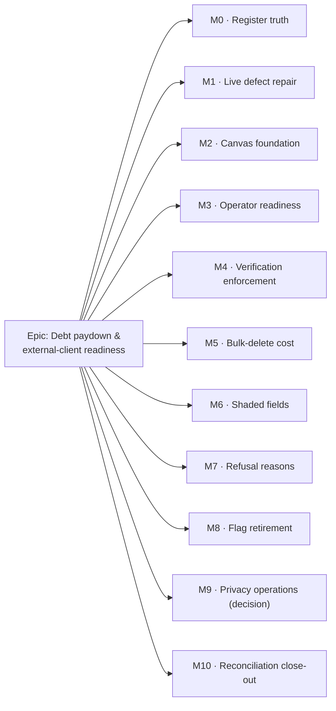

# Implementation Plan: Debt paydown & external-client readiness programme

- **Feature spec:** [`./feature-spec.md`](./feature-spec.md)
- **Status:** Draft — **awaiting approval before implementation**
- **Owner:** _(to be assigned)_

> **Two authoring rules are applied throughout (ADR-0081, now `docs/PROCESS.md` §Stage 5).**
> Every milestone below names **either** the control a user presses **or** declares itself **dark**.
> Several items here are invisible by nature — register edits, a router guard, a barrel-preserving
> refactor — and say so rather than dressing themselves up as capability. And the flag-on journey
> lands with the **first** user-facing milestone, not at enablement.
>
> **No feature flag is introduced by this programme.** Every item is either a repair to an already
> default-on surface, an operator configuration change, a refactor, or documentation. Adding a flag
> to a defect repair would mean shipping the defect and the fix side by side.

## Breakdown

### Epic

**Debt paydown & external-client readiness** — make the debt register trustworthy, repair the live
defects sitting on the surfaces planners and prospective external clients actually use, close the
three readiness gaps before external clients arrive, and pay down the two structural clusters that
make every later change cheaper. Maps to no existing roadmap theme, because `docs/ROADMAP.md` is
silent on ADR-0074 through ADR-0082 — **closing that gap is M10**.

---

## Milestone M0 — Register truth _(size: **M**)_

**Outcome:** `docs/TECH_DEBT.md` describes the code. 7 rows deleted with ledger lines, 13 rewritten
to what is left, 2 counts corrected, 1 line-count corrected.
**Ships dark:** documentation only. No product surface changes and nothing becomes reachable. The
next milestone that surfaces anything is M1.
**Journey:** none — correctly. A Playwright journey against a Markdown file would be theatre.
**What proves it works:** `pnpm check:doc-links` green; every deleted number present in
[Closed numbers](../../TECH_DEBT.md#closed-numbers); and a reviewer re-deriving three rows at random
against the code. **This is the one milestone CI cannot prove**, and saying so is the point — it is
why it is split into three reviewable PRs by claim type rather than one.

---

#### Feature: Register repair

> **Description:** Delete resolved rows, rewrite partly-resolved rows, correct wrong counts — per
> `TECH_DEBT.md:10-21`'s own convention.
> **Complexity:** M
> **Dependencies:** none. This is the programme's entry point.
> **Risks:** a row is deleted that is _not_ actually resolved → each deletion cites the file:line or
> commit that resolved it, in the PR description, and the ledger line points at the record.
> **Testing requirements:** `pnpm check:doc-links`. Human review of the evidence per row.

##### Task M0-T1 — Delete the seven resolved rows (≈ one PR)

- **Description:** Delete #111, #94, #85, #30, #112(5), #112(6), #97(b); add each number to the
  Closed-numbers ledger with one line and a pointer.
- **Complexity:** S
- **Dependencies:** none
- **Risks:** the ledger convention is skipped and inbound ADR citations dangle → the ledger's own
  preamble (`TECH_DEBT.md:1109-1119`) explains why; follow it literally.
- **Testing:** `pnpm check:doc-links`.
- **Development steps:**
  1. For each row, record the evidence in the PR body. Verified during this spec: **#85** is
     resolved — `rg 'react-hooks/refs' apps/web/src` returns seven matches, **all comments
     describing the suppressions as deleted**, and `toolbar/commands/` exists (ADR-0078 S11).
     **#111** is `d8d8c34` (ADR-0082). **#94**'s remediations are paid; the live gap is #100, which
     stays open — the ledger line must point at #100 so the reader is not left thinking mail
     alerting shipped.
  2. Delete the rows; add seven ledger lines.
  3. Grep the repo for each number (`rg '#111|#94|…' docs/ apps/`) and confirm no citation now reads
     as dangling that the ledger does not resolve.
  4. Changeset: **none** (no user-visible change).

##### Task M0-T2 — Rewrite the thirteen partly-resolved rows (≈ one PR, possibly two)

- **Description:** Rewrite #8, #17, #21, #31, #31(c), #35, #45(c), #51, #58, #76, #88, #92, #96 to
  describe **only what is left**, renaming each row to match (`TECH_DEBT.md:15-16`).
- **Complexity:** M
- **Dependencies:** M0-T1 (same file; avoid conflicting edits)
- **Risks:** a rewrite understates the remainder and the row stops being actionable → each rewrite
  names the file:line of what remains.
- **Testing:** `pnpm check:doc-links`.
- **Development steps:**
  1. Rewrite each using the verified remainders:
     - **#76** — the `activityRect` hoist is **done** (`render-model.ts:446` `RectCache`, `:457-461`
       the optional cache param, `paint.rect-cache-budget.test.ts`). Remaining: the `crossedLanes`
       duplication and a flag-off Playwright config.
     - **#92** — the stated blocker shipped. `restoreDeleteBatch` exists across
       `activities.service.ts`, `activities.controller.ts`, `use-activities.ts` and `commands.ts`.
       Remaining is a **small client change**: `undo-redo/commands.ts:367-402`
       `deleteActivityCommand` still re-creates via `createActivity` + `repositionLane` (`:378-391`),
       so a single-delete undo returns a new id **and loses that activity's links**. Point it at
       `restoreDeleteBatch`. Size **S**.
     - **#96** — `/accept-invite` **is** normalised (`router.tsx:405-416`, `readForeignParam` at
       `:411-413`). Rewrite to whatever else remains, or close it.
     - **#88** — the invite half is already safe (`AcceptInvitationCard.tsx:243-256` requires a real
       button). Rewrite to the remaining half.
     - **#58** — the TODAY chip shipped as a canvas pill (`paint.ts:1339-1364`). Rewrite to the
       tiered-ruler remainder.
     - **#45(c)** — `components/ui/notice-strip.tsx` **exists** (verified). This is now **adoption**
       in `ProgrammeScheduleSection.tsx`.
     - **#31(c)** — one line: the shared prefs hook already persists `collapsed`;
       `plan-workspace-toolbar.tsx:245` does not call it.
     - **#8** — remaining is only the flip to enforce (M3-T1 below).
     - **#17 / #21 / #35 / #51** — rewrite per the four-agent sweep's findings.
  2. Changeset: **none**.

##### Task M0-T3 — Correct the three wrong figures (≈ one PR)

- **Description:** #1 → **29 flag-scoped Playwright suites beside the base journey** (not 24);
  #20 → **14** call sites across **13** repositories (not 3); #106 → `render-model.ts` is **1,727**
  lines (not 1,500).
- **Complexity:** S
- **Dependencies:** M0-T2
- **Risks:** the numbers go stale again → **this is the real deliverable of the task.** ADR-0076
  §Class 1 says a count nobody re-derives will be wrong again within a day.
  **Second risk, and it already happened inside this plan:** a figure is re-derived by a _different_
  command than the one the register means, producing a new number that disagrees with the gated
  banner. See step 1.
- **Testing:** `pnpm check:counts`; `pnpm check:doc-links`.
- **Development steps:**
  1. **Phrase the suite count in the gated banner's own vocabulary — "29 flag-scoped suites beside
     the base journey" — so the register and `CLAUDE.md` cannot disagree.** This spec's first answer
     was "30 suites", derived from `rg -o 'test:e2e:[a-z-]+' apps/web/package.json` (a count of npm
     **scripts**; `e2e-account/` carries two for one directory). `RECONCILE.md:76`'s canonical
     command counts **directories**: `ls -d apps/web/e2e*` → **30 total = 29 flag-scoped `e2e-*` +
     the base `e2e/`**, and 29 is what the gated banner already states. Writing "30" would have put
     a third number in the repo. **Re-derive with the documented command, not a convenient one.**
  2. Re-derive the other two. Commands used for this spec: `rg -c 'cursor: \{ id' apps/api/src` →
     14 across 13; `rg -c '^' render-model.ts` → 1,727.
  3. **Do not** add the Playwright-suite count to `check-counts.mjs` — it is **already there**
     (`scripts/check-counts.mjs:39-41`, gating `CLAUDE.md`'s banner). What row #1 needs is to quote
     the gated figure, not a second derivation of it.
  4. For anything left ungated, write the command that produces it into the row.
  5. Changeset: **none**.

---

## Milestone M1 — Live defect repair _(size: **M**)_

**Outcome:** Link picks work on the surface planners use; `?redirect=` accepts only same-origin
paths; the guest share view fits a 320 px viewport.
**Entry point:** three, and they are different in kind, so each is named. **(a)** the TSLD toolbar's
**Link** tool on the toolbar-hosted plan workspace — the surface `CANVAS_TOOLBAR_ENABLED` (default-on)
selects. **(b)** M1-T2 is **dark**: a router guard adds no control, and its only visible effect is
that a crafted link stops working. **(c)** the public `/share#<token>` guest view, opened at a
320 px viewport.
**Journey:** **this is the first user-facing milestone, so the journeys land here** (ADR-0081 §2).
Both suites already exist: one assertion added to `apps/web/e2e-authoring-flow/` (the harness
ADR-0064 built to diagnose exactly this defect class), and one to `apps/web/e2e-share/share.spec.ts`
— the assertion its own comment at `:110-124` describes and does not make.
**What proves it works:** every regression test in this milestone is **verified red against today's
code first**. A green-both-ways test on a defect this class would be worse than none.

---

#### Feature: #103 — recalculation quiescence on the toolbar workspace

> **Description:** `plan-workspace.tsx:70` renders `ToolbarPlanWorkspace` whenever
> `CANVAS_TOOLBAR_ENABLED` (default-on), and that component passes neither `recalcHold` nor
> `dropLinkPickSignal`. They are passed only on the legacy ADR-0030 branch (`:150-151`). So
> `TsldPanel` receives `recalcHold === undefined` — `:786-788` is `seam?.hold(...)`, a silent no-op —
> and `dropLinkPickSignal` falls to its default `0` (`:487`), which never changes, so
> `TsldCanvas.tsx:1183` never fires. **Both halves of ADR-0064's quiescence are inert on the surface
> every planner uses.**
> **Complexity:** S for the fix, M for the proof.
> **Dependencies:** M0-T2 (so #103's row is accurate first). Nothing technical.
> **Risks:** the fix is two lines and the _test_ is the deliverable → verify red first, explicitly.
> Second risk: there may be **more** missing props on this host — this defect class is "one host and
> not its neighbour" (ADR-0064 §7, ADR-0080). Audit the whole prop surface.
> **Testing requirements:** a unit test on `plan-workspace-toolbar.tsx` asserting both props reach
> `TsldPanel`; one `e2e-authoring-flow` assertion; the existing `use-plan-workspace-model.recalc-hold.test.ts`
> unmodified and green.

##### Task M1-T1 — Wire the two props and prove it (≈ one PR)

- **Description:** Pass `recalcHold={model.autoRecalcHold}` and
  `dropLinkPickSignal={model.dropLinkPickSignal}` from `plan-workspace-toolbar.tsx`, matching
  `plan-workspace.tsx:150-151`. Add the red-first tests.
- **Complexity:** S
- **Dependencies:** none technical
- **Risks:** as above.
- **Testing:** unit (host wiring), e2e (`test:e2e:authoring-flow`).
- **Development steps:**
  1. **Write the failing unit test first** and run it against unmodified `plan-workspace-toolbar.tsx`.
     Confirm it fails. Record the failure output in the PR body.
  2. Add the two props.
  3. **Diff the two hosts' full `TsldPanel` prop lists.** `plan-workspace.tsx:130-175` is the
     reference. Any other divergence is either fixed here or filed as a new register row with its
     file:line — not left unrecorded.
  4. Add one `e2e-authoring-flow` assertion: with the Link tool armed and a pick open, a recalculation
     does not move the bars between the two clicks. Reuse the existing inter-click delay sweep.
  5. Run `scripts/e2e-local.sh web:authoring-flow` locally. **Not optional** — `docs/PROCESS.md`
     §Definition of Done, and the ADR-0063 enablement journey cost five CI rounds for skipping it.
  6. Changeset: **patch** (`@repo/web`) — user-visible bug fix.

#### Feature: #102(1) — same-origin `?redirect=`

> **Description:** `router.tsx:88-89` accepts any string for `?redirect=` on `/sign-in`. It is safe
> today only because `pushState` throws cross-origin — a property of the browser, not of the code,
> which is exactly the kind of guarantee that stops holding when the navigation mechanism changes.
> **Complexity:** S
> **Dependencies:** none
> **Risks:** the check rejects a legitimate deep link → the `_authed` guard composes the value, and
> it always composes a path; test the composed shape explicitly.
> **Testing requirements:** unit tests for `/plans/abc` (accepted), `https://evil.example`,
> `//evil.example`, `javascript:alert(1)` (all dropped). The protocol-relative case is what the
> negative lookahead is for and gets its own named test.

##### Task M1-T2 — Shape-check the redirect parameter (≈ one PR)

- **Description:** Apply `/^\/(?!\/)/` after `readForeignParam` in the sign-in route's
  `validateSearch`.
- **Complexity:** S
- **Dependencies:** none
- **Risks:** as above.
- **Testing:** unit (`routes/sign-in.test.tsx` or a router-level suite).
- **Development steps:**
  1. Add the check at `router.tsx:89`; drop silently on failure — **no message naming the rejected
     value** (that is an oracle).
  2. Add the four unit cases, verified red first for the three rejections.
  3. Check whether the same parameter is read anywhere else (`rg 'search.redirect|redirect'
apps/web/src/features/auth` returned only unrelated `redirectTo` uses in
     `use-session.ts:343,352` — confirm nothing new has landed).
  4. Changeset: **patch**.

#### Feature: #98 — the guest share view at 320 px

> **Description:** A measured WCAG 2.2 AA (1.4.10) failure on the product's **only unauthenticated
> surface**: `documentElement.scrollWidth` is 436 at a 320 px viewport, because the TSLD zoom-preset
> row (`TsldViewControls.tsx:58`, `flex items-center gap-1`) is 420 px wide and cannot shrink. The
> outer row at `:57` already wraps; the inner Zoom group does not.
> **Complexity:** S–M — **not XS.** The suite's own comment (`share.spec.ts:110-124`) states that
> fixing this "cuts across ADR-0031's overflow tiers and needs the member workspace re-checked at
> the same widths". The assertion was **never written**, so this is authoring it, not re-enabling it.
> **Dependencies:** none
> **Risks:** the wrap re-breaks the canvas-height fix the existing assertion at `:128` protects →
> that assertion stays and must keep passing. Second risk: the member workspace's toolbar tiers shift
> → CQ-5 says fix the shared control once and re-check both surfaces; **do not branch by surface.**
> **Testing requirements:** the new `scrollWidth <= 320` e2e assertion, verified red first (expect
> 436); the existing height assertion unchanged; a component-level check of the member workspace at
> 320/360/768.

##### Task M1-T3 — Wrap the zoom group and assert the overflow is gone (≈ one PR)

- **Description:** Add `flex-wrap` at `TsldViewControls.tsx:58`; write the 1.4.10 assertion;
  re-check the member workspace.
- **Complexity:** S–M
- **Dependencies:** none
- **Risks:** as above.
- **Testing:** `test:e2e:share`; existing `TsldViewControls`/toolbar unit suites; a manual pass at
  three widths on the member workspace.
- **Development steps:**
  1. **Write the assertion first**, run `test:e2e:share`, confirm it reports 436.
  2. Add `flex-wrap` at `:58`.
  3. Re-run; confirm both the new assertion and the existing height assertion (`:128`) pass.
  4. Replace the explanatory comment at `:110-124` with what is now true — **do not delete the
     history**; the comment records a real finding, so it becomes "this was 436; it is now asserted".
  5. Re-check the member plan workspace at 320/360/768 px. If ADR-0031's tier thresholds need
     adjusting, do it here and note it; if they do not, say so in the PR.
  6. Run `scripts/e2e-local.sh web:share` locally.
  7. Changeset: **patch**. Accessibility fix on a public surface — worth naming in the changelog.

---

## Milestone M2 — Canvas foundation _(size: **M**)_

**Outcome:** `render-model.ts` holds no implementation; `geometry.ts` holds the core; ADR-0078 S8's
remaining extractions are unblocked and `link-routing.test.ts`'s name becomes true.
**Ships dark:** a barrel-preserving refactor. **No consumer file outside `render/` changes**, no
behaviour changes, no performance characteristic changes, and no test assertion changes. That is not
a scoping choice — it is the definition of the move, and a consumer diff means it was done wrong.
The next milestone that surfaces anything is M3 (operator-facing).
**Journey:** none, and deliberately. ADR-0078 §4.1's oracle is the whole-scene golden log
(`render/paint.golden.test.ts`) plus five counting-stub budget suites, all of which already exist
and stay **unmodified**. A journey would add nothing the snapshot does not already pin.
**What proves it works:** the golden snapshot is **byte-identical**; the five budget suites are
unmodified and green; `git diff --stat` shows **zero** files changed outside
`apps/web/src/features/tsld/render/`.

---

#### Feature: #106 — `geometry.ts`, and the barrel that holds nothing

> **Description:** ADR-0078 §3.2 describes the end state as `render-model.ts` = barrel + the core
> model. **That shape does not work**: the link-routing region uses `activityRect` eight times plus
> `screenXOfDay`, `BAR_HEIGHT`, `RectCache` and the core types, so `link-routing.ts` must import from
> `render-model.ts`, which would re-export it — a genuine import cycle. ES modules tolerate cycles,
> so it compiles and passes, which is why this must be a gate and not a caution. The fix: the core
> becomes `geometry.ts`, leaving `render-model.ts` a **pure** barrel that re-exports and holds
> nothing. Then every module depends on `geometry` and nothing depends on the barrel.
> **Complexity:** M
> **Dependencies:** ADR-0078 S0/S1 (landed 2026-08-07 — the golden log exists).
> **Risks:** a "move" that quietly changes behaviour → the golden snapshot is byte-identical or it
> is not a move. Second: an eager rebuild of `rects`/`laneRows` slips in, which ADR-0078 §3.2
> explicitly forbids because `activityRect` makes no `ctx` calls and is therefore **invisible to
> every existing gate**. Resist it here; it is TECH_DEBT #76 and belongs in its own deliberate PR.
> **Testing requirements:** `paint.golden.test.ts` snapshot unchanged; `render-model.test.ts`
> (1,091 lines) unmodified; the five budget suites unmodified.

##### Task M2-T1 — Extract `geometry.ts`; make the barrel pure (≈ one PR)

- **Description:** Move the core types, `activityRect`, `RectCache` and the glyph geometry into
  `render/geometry.ts`. `render-model.ts` re-exports everything it exports today.
- **Complexity:** M
- **Dependencies:** none technical
- **Risks:** as above.
- **Testing:** the full `apps/web` unit suite, unmodified.
- **Development steps:**
  1. Confirm the oracle is green **before** touching anything: `paint.golden.test.ts` +
     `paint.rect-cache-budget.test.ts` + `paint.routing-budget.test.ts` +
     `paint.grid-budget.test.ts` + `paint.band-budget.test.ts` + `paint.dates-budget.test.ts`.
  2. Follow #106's own stated ordering rule: **lift only what depends on nothing that will be
     re-exported around it.** `working-time.ts` went first for exactly that reason.
  3. Move; add the re-exports; **change no consumer**.
  4. `git diff --name-only` must list nothing outside `render/`. If it does, revert and re-plan.
  5. Comments move **verbatim** — ADR-0078 §Decisions: these files' comments record defects that
     shipped.
  6. `DECISIONS.md`: record that ADR-0078 §3.2's end state was wrong and why, citing #106.
     **Do not edit ADR-0078** (immutable, CLAUDE.md §6).
  7. Commit title: `refactor(web): …` — never `feat`/`fix` (ADR-0078 §8).
  8. Changeset: **none** (no user-visible change).

##### Task M2-T2 — ADR-0078 S8: `link-routing` / `viewport` / `hit-test` (≈ one PR each, three PRs)

- **Description:** Extract the three modules onto the now-acyclic foundation; re-point
  `link-routing.test.ts` at `./link-routing`.
- **Complexity:** M (all three together)
- **Dependencies:** **M2-T1. Hard.** Building four modules on a cycling barrel is the failure this
  milestone exists to prevent.
- **Risks:** `link-routing` is the module ADR-0065's obstacle-avoidance lives in and the routing
  budget suite is the only thing pinning its cost → `paint.routing-budget.test.ts` unmodified.
- **Testing:** as M2-T1, plus `link-routing.test.ts` importing from its own module.
- **Development steps:**
  1. One module per PR, in dependency order.
  2. After the last, assert the deliverable that motivated the whole slice:
     `link-routing.test.ts`'s name is now true. ADR-0078 called the old state "a small, live piece
     of misinformation in the codebase" — check it is gone.
  3. Update #106's row (or close it, ledger line included).
  4. Changeset: **none**.

---

## Milestone M3 — Operator readiness _(size: **M**)_

**Outcome:** The CSP is enforcing with a one-variable rollback the operator has exercised; a mail
failure produces an alert in a non-email channel; container logs are bounded.
**Entry point:** operator-facing, not user-facing. The operator sets `CSP_HEADER_NAME` in the host
`.env` and recreates the stack; the alert arrives in the configured channel. **No planner-visible
control is added.**
**Journey:** none new — `apps/web/e2e-csp/` already serves the **real** policy (parsed out of
`docker-compose.yml`, never restated) over the **production build**, and must stay green
unmodified. Relaxing it to accommodate the flip would delete the only gate ADR-0074 built for this.
**What proves it works:** **partly nothing CI can do, and that is stated rather than papered over.**
The `e2e-csp` suite proves the policy is satisfiable by the routes it covers; it explicitly does
**not** cover canvas export, the printed programme, or `upgrade-insecure-requests` (which
report-only ignores by specification, so the flip is the first time it is exercised at all).
**Those need a human walking the routes on the deployed host with the console open.**

---

#### Feature: #8 — flip the CSP to enforce

> **Description:** `CSP_HEADER_NAME` is the operator's variable (`docker-compose.yml:80`,
> `docker-compose.release.yml:117`, `apps/web/Dockerfile:66`, `.env.example:78`, consumed at
> `nginx.conf:102`). The observation window ran 2026-08-05 and its two findings are fixed.
> **No release is needed either way**, which is the property that makes this the right item to go
> first in C: it is the cheapest possible rehearsal of the operator flip loop.
> **Complexity:** S — but the verification is M and is human.
> **Dependencies:** M0-T2 (so #8's row states only the flip).
> **Risks:** a route not on the walk list breaks → revert the variable and recreate; **do not relax
> `e2e-csp`.** Second: `upgrade-insecure-requests` is genuinely untested until now.
> **Testing requirements:** `e2e-csp` green, unmodified. Then a human route walk.

##### Task M3-T1 — Flip and walk (≈ one PR for docs + a host action)

- **Description:** Execute the flip; record the walk.
- **Complexity:** S (code) / M (verification)
- **Dependencies:** M0-T2
- **Risks:** as above.
- **Testing:** `test:e2e:csp`; then the manual walk.
- **Development steps:**
  1. Confirm `e2e-csp` is green on the current `main`.
  2. Set `CSP_HEADER_NAME=Content-Security-Policy` on the host; recreate.
  3. **Walk every route in #8's list with the console open** — sign-in/up, accept-invite, the share
     guest view, the plan workspace, the Gantt, canvas PNG/PDF export, the printed programme, the
     library screens, the audit log, and **both Copy buttons**. The export/print/clipboard paths
     matter most: they are precisely what `e2e-csp` says it does not cover.
  4. On any violation: revert the variable, recreate, relax **`style-src` only** if that is genuinely
     the cause, and re-derive.
  5. Record the outcome in `DECISIONS.md` and update `docs/DEPLOYMENT.md`'s flip note.
  6. Close or rewrite #8.
  7. Changeset: **none** (an operator configuration change, not a shipped artefact).

#### Feature: #100 — mail-failure alerting and log rotation

> **Description:** `MAIL_SEND_FAILED = 'mail.send_failed'` is emitted
> (`smtp-mail.service.ts:26`) and **nothing watches it**; `rg 'logging:|max-size|json-file'
docker-compose*.yml` returns **zero matches**, so neither compose file bounds log size either.
> A broken relay therefore produces silently unrecoverable accounts — the gap ADR-0075 left open and
> the live remainder of #94.
> **Complexity:** M
> **Dependencies:** none
> **Risks:** the alert channel is email → then a mail outage silences its own alarm. **Non-email is
> a requirement, not a preference.** Second: the watcher dies silently and reproduces the exact
> defect it was built to fix → the watcher's own liveness must be visible.
> **Testing requirements:** inject a failure on the host (point `MAIL_SMTP_URL` at a dead port) and
> observe the alert. **This cannot be a CI gate** — CI has no relay, no channel and no host.

##### Task M3-T2 — Bound the logs (≈ one PR)

- **Description:** Add a `logging:` block (driver + `max-size` + `max-file`) to the `api` and `web`
  services in both compose files.
- **Complexity:** S
- **Dependencies:** none
- **Risks:** rotation set too tight and the watcher misses a burst → size the window against the
  watcher's poll interval.
- **Testing:** `docker compose config` validates; the CI image job still passes.
- **Development steps:**
  1. Add the blocks to `docker-compose.yml` and `docker-compose.release.yml`.
  2. Document the values in `docs/DEPLOYMENT.md`.
  3. Changeset: **none**.

##### Task M3-T3 — The watcher (≈ one PR)

- **Description:** A log watcher beside the stack that greps `mail.send_failed` and posts to a
  non-email channel, naming the `MailFailureKind` and **never** the credential in `MAIL_SMTP_URL`.
- **Complexity:** M
- **Dependencies:** M3-T2
- **Risks:** as above. Also: do **not** reach for Redis/BullMQ (ADR-0009/0010) — both are accepted
  ADRs with **no implementation** (CLAUDE.md §17), and introducing the first consumer of an unbuilt
  subsystem to ship a log grep would be a large unplanned commitment.
- **Testing:** a host-side injection test; a unit test on the redaction (the URL credential must
  never appear in the alert payload).
- **Development steps:**
  1. Add the watcher as an opt-in compose profile, following ADR-0047's Watchtower precedent —
     shipped dormant, enabled by the operator.
  2. Redact the credential; unit-test the redaction.
  3. Make the watcher's own liveness observable (a heartbeat line, or its container health).
  4. Inject a failure on the host; confirm the alert; record the observed latency.
  5. Rewrite #94/#100 to what remains.
  6. Changeset: **none**.

---

## Milestone M4 — Verification enforcement _(size: **M**, with a decision gate)_

**Outcome:** `AUTH_REQUIRE_EMAIL_VERIFICATION=true` on the deployed host, with nobody locked out who
held a membership before the flip. Invitation acceptance starts proving mailbox ownership.
**Entry point:** operator-facing for the flip; **user-facing in effect** — every new sign-up now
meets a verification screen, and `invitations.service.ts:231` starts refusing an unverified invitee.
That behavioural change is named in the release note, because it is the flip's actual purpose.
**Journey:** `apps/web/e2e-account/` and `e2e-account-verify/` already exist and are the only tests
that follow a real emailed link through a real redirect against a server with the switch on. They
must be green **with the switch on** before the host flip — which is a different configuration from
the one they run in today, and running them that way is part of this milestone, not an assumption.
**What proves it works:** **the count, the backfill's reported row count, and a post-flip sign-in —
all three by a human on the deployed host.** No CI gate can prove this: CI has no user base.

> **This milestone is gated on CQ-1 (spec §1), which is an open product question in
> `docs/specs/account-security/feature-spec.md:1093-1105`. It does not start until CQ-1 is
> answered.** It is placed **after M3** deliberately, reversing the brief's C8-before-C9 order: both
> are one env var on the same host, but CSP's rollback is a variable and a recreate with no data
> change, while **the backfill does not roll back**. Rehearse the loop where a mistake is cheap.

---

#### Feature: #16 — enforce email verification

> **Description:** The verification loop exists and the ordering condition is satisfied — verified:
> `revokeSessionsOnPasswordReset: true` at `better-auth.ts:211`, hashed identifiers at `:216-230`,
> `requireEmailVerification` threaded `app-config.service.ts:64` → `auth.module.ts:37` →
> `better-auth.ts:171`. Web 0.78.0 is live. What is left is **count → decide → backfill → flip**.
> **Complexity:** M
> **Dependencies:** CQ-1 answered; the running web bundle re-confirmed (do not trust this sentence
> — check the deployed version).
> **Risks:** the existing user base is stranded → M4-T1 counts before anything is decided. The
> backfill grants verified status to an account that never proved ownership → the membership
> predicate structurally excludes the risky case (a squatted address holding a _pending_ invitation).
> The backfill is executed and then the flip is rolled back → **state the asymmetry before
> executing**, not after.
> **Testing requirements:** the dry-run's printed rows, confirmed by the operator against the count;
> `e2e-account` and `e2e-account-verify` green **with enforcement on**; a post-flip human smoke.

##### Task M4-T1 — Count unverified accounts on the deployed database _(ADR-0074 M5-T6)_

- **Description:** Report `emailVerified = false`, split by whether the account holds a membership.
- **Complexity:** S
- **Dependencies:** none
- **Risks:** the count is read from a development database and is meaningless → it must be the
  **deployed** database, and the PR body says which.
- **Testing:** none — this is a read. Its output is the artefact.
- **Development steps:**
  1. Write the query as a checked-in script so it is repeatable and reviewable, not a paste.
  2. Run it against the deployed database.
  3. Present the number with the CQ-1 options. **If it is zero, CQ-1 is moot** — flip directly and
     record that. **If it is above ~50**, escalate: a large cohort turns the strict option into a
     support event and may change the answer.

##### Task M4-T2 — Backfill, dry-run first _(ADR-0074 M5-T7)_

- **Description:** Execute the CQ-1 decision.
- **Complexity:** S–M
- **Dependencies:** **M4-T1 and CQ-1. Hard, both.**
- **Risks:** as above.
- **Testing:** the dry-run output is the test. Add a unit test on the predicate
  (`emailVerified = false AND EXISTS (membership)`).
- **Development steps:**
  1. Implement as a script with a **mandatory** `--dry-run` default that prints the exact rows.
  2. Run the dry-run; the operator confirms the printed count matches M4-T1.
  3. **State in the PR, before execution, that this does not roll back.**
  4. Execute; record the executed count in `DECISIONS.md`.

##### Task M4-T3 — Flip and smoke (≈ a host action + a docs PR)

- **Description:** Set `AUTH_REQUIRE_EMAIL_VERIFICATION=true`; smoke three flows.
- **Complexity:** S (code) / M (verification)
- **Dependencies:** M4-T2
- **Risks:** a dead end re-arms that ADR-0074 M2/M5 closed → the smoke covers all three.
- **Testing:** run `e2e-account` and `e2e-account-verify` **with enforcement on** before the host
  flip. Then the human smoke.
- **Development steps:**
  1. Re-confirm the deployed web version carries ADR-0074 M2 **and** M5 (M5 fixed the `?verified=1`
     parse bug and the missing sign-up `callbackURL` — without M5 a link that _works_ still lands
     the reader on the pending screen).
  2. Run both journeys locally with the switch on.
  3. Flip on the host; recreate.
  4. Smoke: **(a)** sign-up → verification mail → link → **signed in**, not the pending screen;
     **(b)** invite → accept → `invitations.service.ts:231` enforces; **(c)** an existing member
     signs in and is not locked out.
  5. On failure: revert the variable and recreate. **The backfill stays.**
  6. Rewrite or close #16; update `docs/DEPLOYMENT.md` "Turning verification on".
  7. Changeset: **none** for the flip. The release note names the invitation-acceptance change.

---

## Milestone M5 — Bulk-delete cost _(size: **M**)_

**Outcome:** A 2,000-activity bulk delete runs set-wise instead of ~10,000 queries under a plan-wide
lock, and the transaction timeout is set from a measured number instead of Prisma's implicit 5 s
default.
**Ships dark:** no surface changes. The bulk-delete control already exists (ADR-0080's selection
bar). What changes is that a large delete stops being a coin-flip against an invisible default.
**Journey:** none new. `apps/web/e2e-multi-select/` already drives bulk delete and must stay green.
**What proves it works:** **a before-and-after measurement at 2,000 activities against real
Postgres, stated as a number.** The ADR-0053 M6 precedent for the same `unnest` move measured
830 ms → 13 ms for a 2,000-row subtree. Semi-automatable via `scripts/e2e-local.sh api` plus the
seed catalogue's scale tier (ADR-0066); the **decision number** — what timeout to set — needs the
real host, because a CI runner's absolute timings are noise (ADR-0054's stated reason for counting
stubs rather than milliseconds).

---

#### Feature: #109 + #74 — one measurement, three steps

> **Description:** `activities.service.ts:1302-1312` loops `cascadeSoftDelete` per id under
> `acquirePlanWriteLock`, with `@ArrayMaxSize(2000)` on the DTO — so ~10,000 queries inside a
> transaction. Verified: `rg 'maxWait|timeout:' apps/api/src` returns **zero matches**, so Prisma's
> 5 s interactive-transaction default applies everywhere in the API.
> **Complexity:** M
> **Dependencies:** none
> **Risks:** setting the timeout first converts a slow delete into a failure; batching first without
> measuring loses the evidence. → **measure → batch → timeout**, in that order, as three commits.
> Second: the ADR-0073 C3.1 §0.1 property must survive — `activity.deleted` records **one** row with
> scalar counts from the sweep's **return value** (`:1314-1329`), never one row per swept activity.
> **Testing requirements:** the measurement (recorded); existing `activities.e2e-spec.ts` unchanged;
> an audit assertion that one delete of N activities still writes exactly one event with correct
> `activityCount`/`dependencyCount`.

##### Task M5-T1 — Measure (≈ one PR: a harness + a recorded number)

- **Description:** Query count and wall-clock for a 2,000-activity bulk delete against real Postgres.
- **Complexity:** S–M
- **Dependencies:** none
- **Risks:** the harness bypasses the product and flatters the result → the harness's own docblock
  says where it bypasses (ADR-0081 §3, written after `measure-band-copy` made a milestone look more
  finished than it was).
- **Testing:** n/a — the output is the artefact.
- **Development steps:**
  1. Use the ADR-0066 seed catalogue's scale tier for the fixture rather than hand-building.
  2. Record query count and p95 wall-clock. Note the hardware.
  3. Record whether the current code is already at risk of the 5 s default.

##### Task M5-T2 — Batch the sweeps set-wise (≈ one PR)

- **Description:** Rewrite the per-id loop as set-wise statements, following the ADR-0053 M6 `unnest`
  precedent.
- **Complexity:** M
- **Dependencies:** M5-T1
- **Risks:** the cascade's counts stop being what happened → they must still come from the sweep's
  return value, not from the input length.
- **Testing:** `activities.e2e-spec.ts` unchanged; a new assertion on the audit row's scalars;
  `scripts/e2e-local.sh api`.
- **Development steps:**
  1. Rewrite `cascadeSoftDelete`'s batch path set-wise.
  2. Re-run M5-T1's harness; state the improvement as a number.
  3. Confirm the single audit row and its counts.
  4. Run `scripts/e2e-local.sh api` locally — **required**, this touches `apps/api`.
  5. Changeset: **patch** (`@repo/api`).

##### Task M5-T3 — Set the transaction timeout (≈ one PR)

- **Description:** Set an explicit Prisma transaction timeout from M5-T2's number with ≥3× headroom;
  make an over-budget delete a typed 422, not a 500.
- **Complexity:** S
- **Dependencies:** M5-T2
- **Risks:** a global timeout breaks an unrelated long transaction → enumerate the interactive
  transactions in `apps/api/src` before choosing global-vs-per-call (CQ-6).
- **Testing:** a unit test on the typed error path.
- **Development steps:**
  1. Enumerate interactive transactions; decide global vs per-call.
  2. Set it; add the typed 422.
  3. Record in `DECISIONS.md` and `docs/BACKEND_ARCHITECTURE.md`. Escalate to an ADR only if the
     answer is a policy rather than a number.
  4. Close or rewrite #109 and #74.
  5. Changeset: **patch**.

---

## Milestone M6 — Shaded fields _(size: **L**)_ — **blocked on the parallel design ruling**

**Outcome:** One decision governs what a shaded field looks like, implemented once in the
primitives, adopted by its consumers.
**Entry point:** every form in the product — the activity editor's four tabs, the resource and
calendar dialogs, the plan settings. A reader meets a shaded field that says why it is shaded
instead of a field that is either invisible or focus-stealing.
**Journey:** `apps/web/e2e-activity-editor/` already exists and drives the permission model against
a real API with the pen enforced. It gains one assertion: a shaded field keeps focus and exposes its
reason. That is the only place the behaviour is testable, because jsdom does not reproduce focus
loss on a control that becomes natively `disabled` mid-save.
**What proves it works:** a structural test asserting no consumer sets native `disabled` on a form
field primitive (SC-9), plus the journey assertion.

> **This milestone's design section is a placeholder** (spec §4). A parallel agent is producing the
> ruling for #64, #66, #17(a), #21(a), #72. **M6 does not start until it lands.** If it does not
> land, M6 drops out and M7 proceeds — they share no file.
>
> **Three things this plan hands to that ruling, measured today:**
>
> 1. **The mechanism.** `components/ui/input.tsx:20` is
>    `'disabled:cursor-not-allowed disabled:opacity-50'` — shading responds to native `disabled`
>    **only**. So any answer must add an `aria-disabled` styling path, or consumers have no
>    non-`disabled` route to shading and #66 can only be "fixed" by reintroducing #64.
> 2. **The blast radius, and it is not what the brief said.**
>    `rg -c 'disabled=' apps/web/src --glob '!*.test.*'` → **145 across 63 files**; tightened to
>    `^\s*disabled=` → **83 across 26 files**. Neither is the briefed 37/32.
>    `ActivityEditorDialog.tsx` (20) and `ActivityProgressPanels.tsx` (15) dominate — the cluster is
>    **concentrated, not spread**, which is good news for slicing.
> 3. **The precedent.** ADR-0082 answered exactly this shape for `Menu`: stop filtering, add
>    `disabledReason` as an `sr-only` sibling plus `aria-describedby`, never folded into the
>    accessible name. The field answer should look like the menu answer or say why it does not.

#### Feature: the primitive, then its consumers

> **Complexity:** L
> **Dependencies:** the design ruling. **Hard ordering inside: primitive (M6-T1) before consumers
> (M6-T2).** Reversing it means fixing #66 by adding native `disabled`, which is #64 reintroduced.
> **Risks:** the sweep is done as one PR and becomes unreviewable → split by file, largest first.
> **Testing requirements:** the structural test; the journey assertion; every existing form suite
> unmodified (they query by role and label, which is exactly the contract this preserves —
> ADR-0061's argument for landing its refactor unflagged).

##### Task M6-T1 — The primitive (≈ one PR)

- **Description:** Implement the ruling in `components/ui/form.tsx`, `input.tsx`, `select.tsx`,
  `textarea.tsx`.
- **Complexity:** M · **Dependencies:** the ruling · **Risks:** as above.
- **Testing:** primitive unit tests including a focus-retention case.
- **Steps:** implement → structural test → docs (`docs/DESIGN_SYSTEM.md`) → changeset (**patch**).

##### Task M6-T2 — The consumer sweep (≈ 4–6 PRs)

- **Description:** Migrate consumers off native `disabled` on form fields.
- **Complexity:** L · **Dependencies:** **M6-T1, hard** · **Risks:** as above.
- **Testing:** existing suites unmodified; the journey assertion.
- **Steps:** `ActivityEditorDialog.tsx` (20) → `ActivityProgressPanels.tsx` (15) → the rest by
  feature → the structural test flips from advisory to enforcing on the last PR.

##### Task M6-T3 — `AssignmentRow.tsx:511` — a **different** fix (≈ one PR)

- **Description:** It **unmounts** its editors rather than disabling them, which guarantees focus
  loss. It needs a read-only render, not a shaded control.
- **Complexity:** M · **Dependencies:** none — **it can run in parallel with M6-T1/T2** ·
  **Risks:** folding it into the sweep hides that it is a stronger failure than a wrongly-shaded
  control.
- **Testing:** a focus-retention test; `ActivityResourcesPanel` suites unmodified.
- **Steps:** read-only render → focus test → changeset (**patch**).

---

## Milestone M7 — Refusal reasons _(size: **M**)_

**Outcome:** A shut control tells the reader the true reason, including when a **peer** holds the pen.
**Entry point:** every pen-gated control — the activity editor's per-scope save bars, the activities
table row menu (ADR-0082), and the nine TSLD toolbar commands. The visible change: a reader who
sees "Request control" is no longer also told to "Start editing", which is false in that state.
**Journey:** `apps/web/e2e-activity-editor/` — the only place the pen is enforced against a real API.
It gains a two-session assertion: with a peer holding the pen, the refusal names the holder.
**What proves it works:** the new peer-state unit matrix, the journey assertion, and — critically —
**the ADR-0062 identity assertion (`gating.logic === gating.general`) unmodified and still passing.**
That is the drift pin; if threading requires relaxing it, the threading is wrong.

---

#### Feature: #115 + #114.1 + #116.4 — one seam, threaded once

> **Description:** `activity-editor-gating.ts:79` returns `NO_PEN` ("Start editing to change this
> activity.") whenever `penManaged && !holdsPen` — with **no input describing who holds it**. So a
> reader looking at "Request control" is told to "Start editing", which is false. Verified: the data
> already exists — `plan-lock/lib/lock-view.ts:96-144` resolves `HELD_BY_OTHER` with
> `status.holder`, and `lockCopy.heldByOther(holder)` / `canTakeOver(holder)` are already written.
> This is **threading, not a new data source.**
> **Complexity:** M
> **Dependencies:** none technical. Sequenced after M6 only to avoid two people editing shaded
> controls at once; if M6 is dropped, M7 runs independently.
> **Risks:** doing one of the three alone means building a second gate beside the first — the drift
> ADR-0062 pinned with an identity test. → all three ride one change.
> **Testing requirements:** a unit matrix over {no role, pen free, peer holds, I hold}; the identity
> assertion unmodified; the journey assertion.

##### Task M7-T1 — Thread the holder into both gates (≈ one PR)

- **Description:** Add the peer-holder state to `ActivityEditorGatingInput` and to `PlanGatingInput`;
  split `NO_PEN` into free and peer states.
- **Complexity:** M
- **Dependencies:** none
- **Risks:** as above. **`plan-gating.ts` is the second gate and is easy to miss** — it returns bare
  booleans with **no reason string at all**, which is exactly why `plan-actions-menu.tsx` (#114.1)
  has no sentence to print.
- **Testing:** the unit matrix on both functions; the identity assertion.
- **Development steps:**
  1. Extend both inputs with the holder state, sourced from `pen.status`.
  2. Split `NO_PEN` → `NO_PEN_FREE` / `NO_PEN_PEER(holder)`.
  3. Give `derivePlanGating` a reason alongside each boolean, preserving `canEditSchedule`'s
     existing truth table exactly.
  4. Unit matrix, verified red first on the peer case.
  5. Confirm the ADR-0062 identity assertion is **unmodified**.
  6. Changeset: **patch**.

##### Task M7-T2 — The nine call sites (≈ one PR)

- **Description:** Consume the gate state at `activity-editor-gating.ts:69` and
  `tsld-toolbar-items.tsx:248, 435, 1824, 1840, 2197, 2247, 2281, 2326`.
- **Complexity:** M
- **Dependencies:** M7-T1
- **Risks:** **the nine sites are nine different sentences, not one repeated** — verified verbatim:
  "…to add activities", "…to link activities", "…to change the scheduling mode" (×2), "…to
  auto-arrange", "…to snap placements", "…to clear the placement", "…to recalculate", and the
  editor's "…to change this activity." → **a shared constant cannot work.** Use a small builder: the
  gate supplies the state, each site supplies its verb phrase.
- **Testing:** a test per site asserting the peer-state sentence; a structural test that no site
  constructs the sentence independently of the gate.
- **Development steps:**
  1. Add the builder; migrate all nine.
  2. Structural test (SC-10).
  3. Fix `plan-actions-menu.tsx` (#114.1) now that a reason exists — **this is what unblocks it**;
     `docs/TECH_DEBT.md` #114 records it was left alone precisely because writing a sentence would
     have been guessing.
  4. Journey assertion in `e2e-activity-editor`; run `scripts/e2e-local.sh web:activity-editor`.
  5. `DECISIONS.md` entry (not an ADR — spec §4).
  6. Rewrite #114/#115/#116; note **#116.1 → #116.2** remains a hard ordering for whoever takes it:
     announcing a pointer-only capability to a keyboard user is worse than silence.
  7. Changeset: **patch**.

> **Explicitly out of scope: `Combobox` (#114.2).** A separate 540-line primitive with its own
> suite, whose consumers are outside what this needs. Recorded, not deferred silently.

---

## Milestone M8 — Flag retirement _(size: **M** for the policy, **L** for the batch)_

**Outcome:** A written policy for when a flag is retired, and a first batch retired against it.
**Ships dark:** retirement removes code paths nobody reaches. Nothing becomes newly reachable, and
the flag-on behaviour is byte-for-byte what shipped. The honest risk is the reverse of a normal
milestone: it removes **optionality**, not capability.
**Journey:** none new. The **flag-on** journeys are what must stay green — they are the evidence the
retained branch works. The **flag-off** parity suites are what get deleted, one per retired flag.
**What proves it works:** `pnpm test` green after each deletion; the flag count in `env.ts` reduced;
and, per retired flag, its flag-on journey unmodified.

> **Gated on CQ-3.** Measured today: `rg -c '^export const [A-Z_0-9]+ =' env.ts` → 61, minus 3
> non-flags = **58 flags** (47 direct `flagDefaultOn`, 11 derived). `flagDefaultOff` has **no
> consumer** outside its definition and `env.test.ts` — which `env.ts:37-52`'s own docblock says is
> its **normal resting state**, not a smell. The real observation is that **no flag has ever left.**
>
> **The safety property, measured, and it is the reason this milestone is last.**
> `Glob '**/*{flag-off,-off,parity}*.test.*'` → **32 files** named as rollback pins.
> `rg -c 'ENABLED: false' apps/web/src` → **123 occurrences across 75 files**. So **~43 files mock a
> flag false for ordinary isolation and must not be touched.** A mechanical "delete anything that
> sets a flag false" destroys 43 legitimate suites. **The discriminator is the filename and the
> docblock, never the mock.**

#### Feature: the policy _(ADR)_

##### Task M8-T1 — Write the retirement policy as an ADR (≈ one PR)

- **Description:** An ADR deciding when a flag is retired and what evidence justifies it.
- **Complexity:** M · **Dependencies:** CQ-3 · **Risks:** the policy is written to describe what was
  already done → write it **before** any retirement.
- **Testing:** review.
- **Steps:** draft (problem: 58 flags, none retired, 32 parity suites pinning rollbacks nobody will
  take, no policy in `docs/`; options: never / soak-time / dead-branch evidence / count target;
  chosen: dead-branch evidence with a soak floor and a parent-first rule; trade-off: loses
  byte-for-byte rollback, buys an honest test surface) → record the ~32 vs ~43 distinction **in the
  ADR**, because it is the thing a future retirer will get wrong → `docs/PROCESS.md` gains one line.

#### Feature: the first batch

##### Task M8-T2 — Retire the first batch (≈ one PR per flag family)

- **Description:** Retire flags meeting the policy, **derived flags with their parents in one
  commit**.
- **Complexity:** L · **Dependencies:** **M8-T1, hard** · **Risks:** a retired flag's parity suite
  was the only test of that surface at all → **do not retire; write the flag-on coverage first.**
  ADR-0062 M6 found exactly this (a panel with no unit coverage because the suite named for it
  covered the legacy dialog).
- **Testing:** `pnpm test`; each retained flag-on journey unmodified.
- **Steps:** apply the predicates → **delete the flag-off branch, not just the constant** (a constant
  removed with its branch left behind is worse than no retirement) → delete the **named** parity
  suite only → `pnpm test` → changeset (**minor**, pre-1.0 removal of a documented opt-out).

> **My recommendation on scope, stated plainly:** under the default CQ-3 rule (90 days default-on,
> no reported rollback, parents first) the first batch is **small** — and I think that is the right
> answer rather than a disappointing one. The flags that have soaked longest are also the ones whose
> parity suites cost least to keep. The value here is mostly the **policy**: without it, the count
> only ever grows.

---

## Milestone M9 — Privacy operations _(size: \**decision only)_

**Outcome:** A decision, recorded as an ADR. **No code.**
**Ships dark:** by design. This milestone deliberately produces an artefact and stops.
**Journey:** none.
**What proves it works:** the ADR is merged and the product owner has answered CQ-2.

> **Gated on CQ-2, and this is the one item I would refuse to start without an answer.** A
> hard-delete and data-export path contradicts a documented invariant (CLAUDE.md §17: "Every
> deletion is a soft delete… There is no hard-delete or data-erasure path"), needs a new Org-Admin
> permission, and **collides with the append-only audit log**: `audit_events` refuses `UPDATE` and
> `DELETE` via `BEFORE` triggers with `ENABLE ALWAYS` (ADR-0072), so "delete the subject's rows" is
> not available without a decision about the trigger. That is not an implementation detail — it is
> the central question, and answering it in a PR rather than an ADR is how a tamper-resistance
> property gets traded away in a code review.

##### Task M9-T1 — The privacy-operations ADR (≈ one PR)

- **Description:** Frame the options; do not build.
- **Complexity:** M · **Dependencies:** CQ-2 · **Risks:** the ADR drifts into a design and the
  checkpoint is lost → it stops at the decision.
- **Testing:** review.
- **Steps:** establish the driver (contractual clause / GDPR posture / sales objection — they
  produce different scopes) → options for erasure vs the audit log (crypto-shredding, subject-field
  redaction with the row retained, an audited exception) → org-wide export scope (the three existing
  export paths are per-plan and are **not** an account export) → the new permission → **stop**.

---

## Milestone M10 — Reconciliation close-out _(size: **M**)_

**Outcome:** The remaining half of the `docs/RECONCILE.md` pass — the register-vs-code half was done
by the four-agent sweep and is consumed by M0. Two specific repairs carry their own reasoning:
`apps/web/README.md`'s second, ungated copy of the stage counts is **deleted rather than gated**,
and `docs/ROADMAP.md`'s nine missing ADRs are backfilled **and recorded as a recurring defect**.
**Ships dark:** documentation.
**Journey:** none.
**What proves it works:** `pnpm check:counts` and `pnpm check:doc-links` green;
`rg 'ADR-007[4-9]|ADR-008[0-2]' docs/ROADMAP.md` returning nine matches where it returns zero today;
and a reviewer confirming the three recording locations were updated **in one commit**.

##### Task M10-T1 — Repair the stale documents (≈ two PRs)

- **Description:** `apps/web/README.md`, ADR status lines, `docs/ARCHITECTURE.md`, `docs/ROADMAP.md`,
  `CLAUDE.md` §17.
- **Complexity:** M · **Dependencies:** M0 (so the register is already true) ·
  **Risks:** a claim is corrected from memory → **verify the claim; do not trust the document**
  (`RECONCILE.md` §"The one rule"). Every correction names what was read.
- **Testing:** `pnpm check:counts`, `pnpm check:doc-links`.
- **Development steps:**
  1. **`apps/web/README.md` — delete the second copy of the stage counts rather than gating it**
     (spec §3, "The second copy of the stage counts"). Lines `:6-8` claim "27 feature modules…
     ~750 source files… 23 flag-scoped Playwright suites (counted 2026-08-04)" against actuals of
     **885** and **29**; "27 feature modules" is repeated at `:26`. **Keep** the qualitative status
     claims — "built and shipping", the Canvas-2D TSLD workspace, the virtualized Gantt view — which
     are what the paragraph exists for and do not rot the same way; **link** to `CLAUDE.md`'s gated
     banner for the figures. Rationale in one line: three claims, only two derivable by the existing
     script, so gating produces a paragraph where a reader cannot tell which numbers carry a
     warranty. **Size XS.**
  2. _(Optional, and the part I am least confident about — drop it if it reads as over-engineering.)_
     Add ~5 lines to `scripts/check-counts.mjs` asserting `apps/web/README.md` contains **no** bare
     stage count. This is a **"do not re-add" guard, not a second sync gate**: it never needs
     updating when a count changes and adds no per-PR friction. **Size S.**
  3. **`docs/ROADMAP.md` — backfill ADR-0074 through ADR-0082**, all nine, verified absent
     (`rg 'ADR-007[4-9]|ADR-008[0-2]' docs/ROADMAP.md` → zero matches). **Record it as the third
     consecutive recurrence of one defect class**, not as a tidy-up: `RECONCILE.md:199` has the
     2026-07-31 pass finding ROADMAP silent on ADR-0066, and `:198` the 2026-08-04 pass finding the
     same for ADR-0067–0073. Two hand-corrections have not stopped it. Then take CQ-7: either build
     the "every accepted ADR appears in ROADMAP or an explicit exclusion list" check, or file it as
     a register row **carrying CQ-7's reasoning** — that this gate polices a _judgement_ rather than
     an arithmetic fact, and a gate over a judgement can be satisfied by a line nobody means, which
     is a worse failure than the one it replaces. **Default: file it. Size S to file, M to build.**
  4. Re-derive the counts `RECONCILE.md` §1 lists for the other **non-gated** files
     (`README.md`, `docs/ARCHITECTURE.md`, `docs/DATABASE.md`, `docs/TESTING.md`,
     `docs/BACKEND_ARCHITECTURE.md`, `docs/FRONTEND_ARCHITECTURE.md`, `apps/api/README.md`,
     `.claude/agents/feature-analyst.md`) — using the **documented** command each time, per M0-T3
     step 1.
  5. Walk `ARCHITECTURE.md` §10's accepted-but-unbuilt ADRs (`RECONCILE.md` §3).
  6. Re-verify each `CLAUDE.md` §17 claim against code.
  7. Check `.claude/agents/` invariants (`RECONCILE.md` §6) — this programme changes them for any
     agent asserting the old gating or shaded-field rules.
  8. Changeset: **none**.

##### Task M10-T2 — Record the pass (≈ one PR, and it must be one commit)

- **Description:** Update `RECONCILE.md`'s date, add a Passes-run row, add a `DECISIONS.md` entry —
  **all three in the same commit.**
- **Complexity:** S · **Dependencies:** M10-T1 and every milestone that produced a finding ·
  **Risks:** the three drift apart → that file's own banner records this happening: the header said
  `2026-07-28` while the table recorded `2026-07-31`, so the drift-control document had drifted
  about its own drift control.
- **Testing:** review.
- **Steps:** record **what was found wrong**, not just what changed (`RECONCILE.md` §8) — including
  the four corrections this spec made to its own brief (§3 of the spec), because a spec's brief
  being wrong four times is the ADR-0076 Class 3 evidence the next pass needs.

---

## Sequencing & slices

### What can run in parallel, and what cannot

**Can run in parallel from day one — verified by file, not by intuition:**

| Track       | Milestones          | Files touched                                                        | Collides with                                   |
| ----------- | ------------------- | -------------------------------------------------------------------- | ----------------------------------------------- |
| **Truth**   | M0                  | `docs/TECH_DEBT.md` only                                             | nothing                                         |
| **Defects** | M1-T1, M1-T2, M1-T3 | `plan-workspace-toolbar.tsx` · `router.tsx` · `TsldViewControls.tsx` | nothing, and not each other                     |
| **Canvas**  | M2-T1               | `render/` only                                                       | nothing (M1-T3 is `components/`, not `render/`) |
| **Ops**     | M3-T2, M3-T3        | compose files, a new watcher                                         | nothing                                         |

Four tracks, no shared file. M0 is a soft prerequisite for the others only in that it makes the
prioritisation argument sound — it does not technically block anything.

**Cannot run in parallel — hard orderings, each restated with its consequence:**

1. **M2-T1 (#106) → M2-T2 (ADR-0078 S8+).** Four modules on a cycling barrel. Compiles, passes,
   wrong.
2. **M6-T1 (primitive) → M6-T2 (consumers).** Reversed, the only way to fix #66 is native
   `disabled`, which is #64.
3. **CQ-1 + M4-T1 (count) → M4-T2 (backfill) → M4-T3 (flip).** Backfilling before counting is
   guessing; flipping before backfilling is the lock-out.
4. **M5-T1 (measure) → M5-T2 (batch) → M5-T3 (timeout).** Timeout first turns slow into broken;
   batch first without measuring loses the evidence.
5. **M8-T1 (policy) → M8-T2 (retirement).** Otherwise the policy describes what was already done.
6. **CQ-2 → M9.** No code before the decision.
7. **#116.1 → #116.2** — inherited, not in this programme's scope, recorded so a later slice does
   not invert it.

**Soft orderings (preferences, labelled as such):** M3 before M4 (rehearse the reversible flip);
M6 before M7 (avoid two people in shaded controls, though they share no file); M10 last (it must
describe the whole pass).

### Where I think the brief's sequencing is wrong

The brief proposed **A → C → B**, with D and E folded in. Four disagreements, each with its reason.

**1. #106 should start on day one, not after C.** It is `M`, zero-risk (barrel-preserving, the
oracle already exists), touches only `render/`, and blocks four downstream extractions. Deferring it
buys no risk reduction and costs weeks of leverage — and every canvas change landing meanwhile grows
a file already at **1,727 lines** (which the register itself understates as 1,500). It collides with
nothing in A. **Run it as its own track from the start.** The rest of B (M6, M7) genuinely belongs
after C, and I have left it there.

**2. Within C, #8 (CSP) should come before #16 (verification) — the brief has them 8 then 9.** Both
are one env var on the same host. CSP's rollback is a variable and a recreate, with no data change
and no user-visible state change. **#16's backfill does not roll back.** Rehearsing the operator
flip loop on the reversible item first is free, and if the loop has a problem you learn it where a
mistake costs nothing.

**3. #16 is not "one environment variable" and should not be scheduled as a quick win.** The brief
calls it "highest leverage, lowest cost on the whole list". The leverage is right; the cost is not.
It is count → **an unanswered product question** (CQ-1, open since the account-security spec) →
an irreversible backfill → a flip that changes a **live user-facing flow** (`invitations.service.ts:231`
starts refusing unverified invitees). That is a decision-then-execute milestone with a human gate,
not a config change. Scheduling it as a quick win is how the backfill gets run before the count.

**4. D should be split: policy early, retirement last.** The brief folds D in. The **policy** (M8-T1)
is cheap and is a decision, so it can land any time. The **retirement** (M8-T2) deletes the rollback
contract for shipped default-on features, and doing that while A is still repairing live defects
removes the safety net exactly when the blast radius is highest. I have also scoped the first batch
smaller than the brief implies, and §M8 says why.

**One thing the brief got right that I initially doubted:** putting register repair first. It is
tempting to fix #103 first — it is the live defect and the one you would want landed if the
programme stalled after one PR. But M0 is where #103's own row gets rewritten, and it is where #92
stopped being blocked. Truth first is correct. **My only refinement: M1-T1 (#103) should be the
first _code_ PR, landing alongside M0's second PR rather than after all three.**

### Releasability

`main` stays releasable throughout. Every milestone is additive, a repair to an existing surface, an
operator configuration change, or documentation. **No feature flag is introduced**, and no migration
runs. The two host flips are `.env` changes requiring no release, so neither can make a release
unshippable.

## Definition of Done (per task)

Each task's PR must satisfy the Feature Completion Criteria in
[`docs/PROCESS.md`](../../PROCESS.md). Three of them bind unusually hard here:

- **The pre-push gate must be run, not written.** `pnpm lint && pnpm typecheck && pnpm test`, plus
  `scripts/e2e-local.sh api` for M5, plus `scripts/e2e-local.sh web:<suite>` for M1-T1
  (authoring-flow), M1-T3 (share), M6 and M7 (activity-editor). CI is the second opinion.
- **Every regression test in M1, M6 and M7 is verified red against the pre-fix code**, and the PR
  body records the failure. A green-both-ways test on these defects is worse than none.
- **Every decision-bearing claim names its evidence** (ADR-0076, `docs/PROCESS.md`) — the command,
  the file:line, or the test. Not a pointer to another document, and **not the brief**.

## Risks & assumptions (rollup)

| Risk / assumption                                                               | Likelihood | Impact   | Mitigation                                                                                                                                                                                                                                                                                                                                  |
| ------------------------------------------------------------------------------- | ---------- | -------- | ------------------------------------------------------------------------------------------------------------------------------------------------------------------------------------------------------------------------------------------------------------------------------------------------------------------------------------------- |
| A register row is deleted that is not actually resolved                         | med        | med      | Each deletion cites the file:line or commit in the PR body; the ledger line points at the record. Three rows re-derived at random by the reviewer.                                                                                                                                                                                          |
| #103 is not the only missing prop on the toolbar host                           | **med**    | med      | M1-T1 step 3 diffs the full prop surface of both hosts. This defect class is "one host and not its neighbour" and has recurred in ADR-0064 §7, ADR-0080 and ADR-0062 M6. **Assume there is more than one.**                                                                                                                                 |
| #98's wrap shifts ADR-0031's overflow tiers on the member workspace             | med        | low      | CQ-5: fix the shared control once, re-check both surfaces at 320/360/768. Never branch by surface.                                                                                                                                                                                                                                          |
| The #106 move quietly changes behaviour                                         | low        | **high** | The golden snapshot is byte-identical or it is not a move. Five budget suites unmodified. Zero consumer-file diff.                                                                                                                                                                                                                          |
| An eager `rects`/`laneRows` build slips into M2                                 | **med**    | med      | Explicitly forbidden in M2-T1. It is **invisible to every existing gate** (`activityRect` makes no `ctx` calls), which is exactly why it must be resisted here and done deliberately as #76.                                                                                                                                                |
| CQ-1 is not answered and M4 stalls                                              | med        | med      | M4-T1 (the count) runs regardless and may make CQ-1 moot. The stated default is ADR-0074 M5's own recommendation.                                                                                                                                                                                                                           |
| The #16 backfill is executed and the flip is then rolled back                   | low        | **high** | The backfill does not roll back. **Stated in the PR before execution**, not discovered after.                                                                                                                                                                                                                                               |
| CSP enforce breaks a route `e2e-csp` does not cover                             | **med**    | med      | The suite states its own gaps: canvas export, the printed programme, `upgrade-insecure-requests`. Those are exactly what the human walk prioritises. Rollback is one variable.                                                                                                                                                              |
| The mail alert channel is email                                                 | low        | **high** | Non-email is a requirement. A mail outage silencing its own alarm is the defect.                                                                                                                                                                                                                                                            |
| The watcher dies silently                                                       | med        | med      | Its own liveness is observable. A silent watcher reproduces #100 exactly.                                                                                                                                                                                                                                                                   |
| M5's timeout breaks an unrelated long transaction                               | med        | med      | Enumerate interactive transactions before choosing global vs per-call (CQ-6). ≥3× headroom over the measured worst case.                                                                                                                                                                                                                    |
| M6's sweep is unreviewable as one PR                                            | **high**   | med      | Split by file, largest first. `ActivityEditorDialog.tsx` (20) and `ActivityProgressPanels.tsx` (15) dominate.                                                                                                                                                                                                                               |
| M6's design ruling does not arrive                                              | med        | low      | M6 drops out; M7 proceeds independently — they share no file.                                                                                                                                                                                                                                                                               |
| M7's threading requires relaxing the ADR-0062 identity assertion                | low        | **high** | If it does, the threading is wrong. That assertion is the drift pin and is not negotiable.                                                                                                                                                                                                                                                  |
| A flag retirement deletes the only coverage of a surface                        | med        | **high** | Do not retire; write the flag-on coverage first (the ADR-0062 M6 finding).                                                                                                                                                                                                                                                                  |
| A retirement deletes one of the ~43 isolation mocks                             | med        | **high** | The discriminator is filename + docblock, never the mock. Recorded in the policy ADR itself.                                                                                                                                                                                                                                                |
| M9 drifts from a decision into a design                                         | med        | med      | It stops at the ADR. No code.                                                                                                                                                                                                                                                                                                               |
| A count corrected in M0-T3 goes stale again                                     | **high**   | low      | ADR-0076 Class 1 says it will. Gate it in `check:counts` where cheap; where not, the row names the command and says it is ungated.                                                                                                                                                                                                          |
| **A count is re-derived by a different command than the register means**        | **high**   | med      | **Already happened inside this plan** — "30 suites" (npm scripts) against the gated banner's "29 flag-scoped" (directories). M0-T3 step 1 requires the **documented** command from `RECONCILE.md` §1 and requires the register to quote the banner's vocabulary. A number that is right under an undocumented derivation is a wrong number. |
| The README counts are gated rather than deleted, leaving a half-gated paragraph | med        | med      | Spec §3: three claims, only two derivable by `check-counts.mjs` (which does **not** derive web feature modules). Delete and link. The optional re-add guard is a "do not re-add" assertion, not a sync gate.                                                                                                                                |
| `ROADMAP.md` lags the ADR register a **fourth** time                            | **high**   | low      | Two hand-corrections have not stopped it. M10-T1 step 3 either builds the check or files it **with CQ-7's reasoning**, so the next person inherits the argument rather than re-deriving it.                                                                                                                                                 |
| **This plan's own claims are wrong**                                            | med        | med      | §0 of the spec records what was run for each. Four of the brief's inputs did **not** survive re-measurement (spec §3) — including a blast radius off by ~4× and a "repeated sentence" that is nine different sentences. Assume the same rate applies to this plan and check before relying on a number.                                     |
