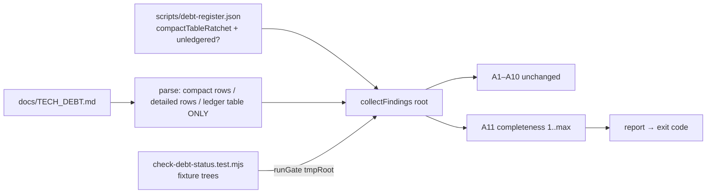
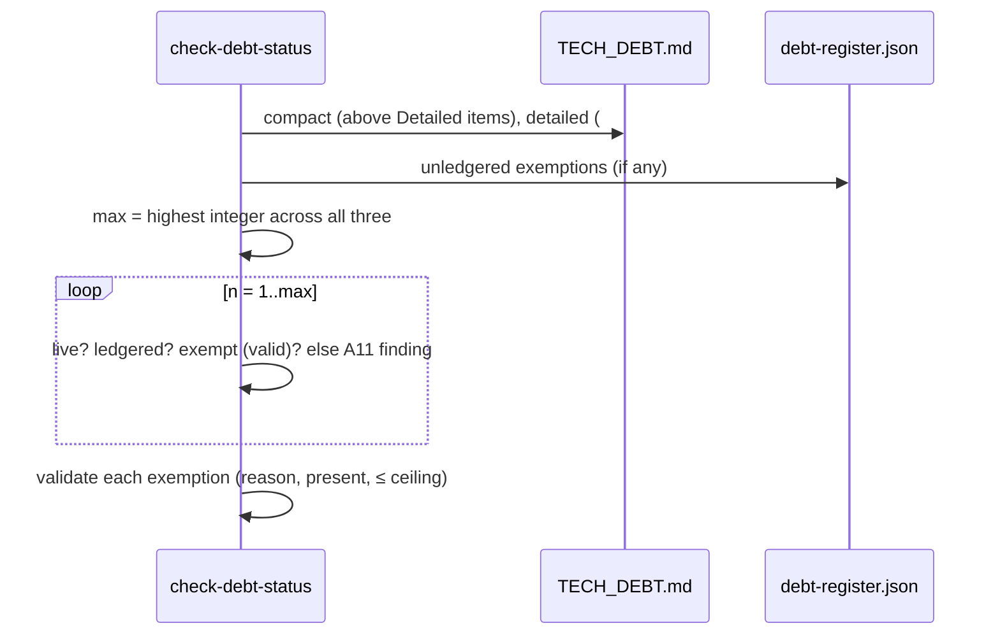
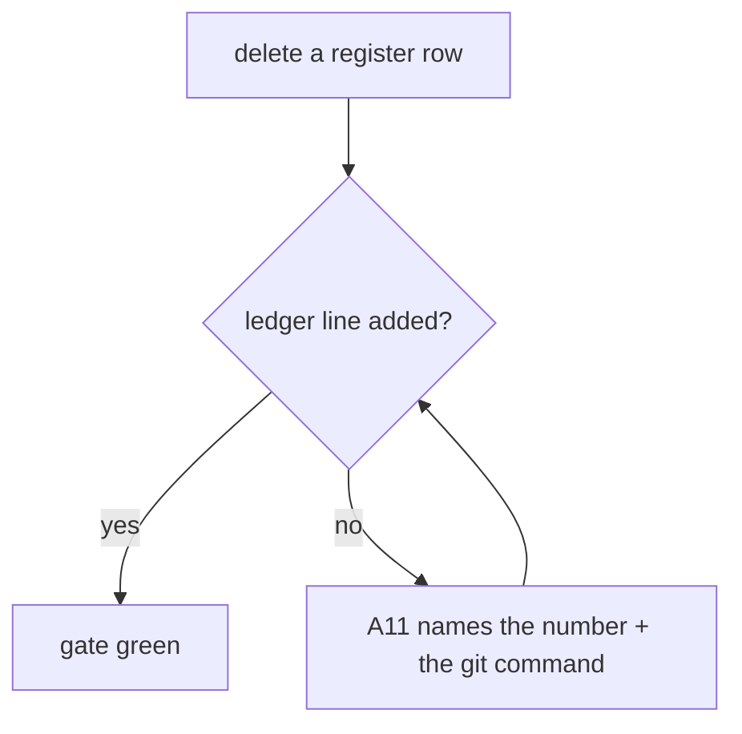

# Feature Spec: Debt-register completeness — every number is a live row or a ledger line

- **Status:** Draft — awaiting approval before implementation
- **Author(s):** feature-analyst (Product Owner / Solution Architect / Technical Lead hats)
- **Date:** 2026-10-05
- **Tracking issue / epic:** `docs/TECH_DEBT.md` #453
- **Roadmap link:** none. This is a process/tooling change to a repository gate, the class
  `scripts/adr-coverage.json` exempts from `docs/ROADMAP.md`.
- **Related ADR(s):** ADR-0120 (a documented obligation with no computed observer), ADR-0105 (why
  this needs a spec: it changes a shared gate), ADR-0110 (a gate is verified against the defect it
  names), ADR-0124 (find generously, refuse strictly), ADR-0147 (the exemption-file shape this
  copies). **No new ADR.** A11 is one more assertion inside the subject ADR-0120 already gave
  `check:debt-status` ("the register agrees with itself"), and the exemption mechanism copies
  `check:adr-coverage` without changing it.

## 1. Business understanding

### Problem

`docs/TECH_DEBT.md:18-21` says that a deleted row's number goes in the Closed-numbers ledger,
because ADRs and code cite rows by number and are never rewritten. Nothing checks this. On
2026-10-05 the reconciliation pass found that `#336`, `#338` and `#340` had been deleted by
`98532284` (#729) with no ledger line. They stayed lost for six days, and they were found only
because someone happened to diff that commit.

**I re-checked the claims below against the tree on 2026-10-05.** I did not take them from the row.

- **The gate cannot see this today.** I read `scripts/check-debt-status.mjs` (A1–A10). A4 checks
  that the numbers present are unique (`:235-246`). A5 checks that no live number is also in the
  ledger (`:248-255`). A6 checks that ledger dates parse (`:257-265`). None of the assertions
  enumerates the numbers that _should_ exist, so a missing number fails none of them.
  **Confirmed.**
- **The 17 numbers are right.** I extracted every compact-table row (`^\| *#?\d+ *\|` above
  `## Detailed items`), every detailed heading (`^#{2,3} #?\d+[a-z]?[.\s—-]`) and every ledger
  line, then walked 1 to 455 (455 is the highest number in use, a ledger line). The numbers that
  are in none of the three are **6, 19, 22, 24, 25, 26, 27, 36, 38, 39, 41, 44, 47, 50, 52, 54
  and 61**. That is exactly the row's 17, and nothing above 61 is missing. **Confirmed**, with
  two corrections that follow.
- **Three ledger lines are in the wrong place (new finding).** `#343`, `#360` and `#362` sit at
  `docs/TECH_DEBT.md:9136-9138`. That is inside the measurement table of `### 294.` (header at
  `:9134`), not in the ledger table at `:6564-6791`. They count as "ledgered" only because the
  gate's ledger parse takes **every** `| N |` line after `## Closed numbers`
  (`check-debt-status.mjs:77-90`). The detailed rows that continue after the ledger fall inside
  that range too. Two things follow:
  - #294's table renders with three foreign rows in it.
  - A11 built on today's parse would be satisfied by **any** later table whose first cell is a
    number and whose third cell is a date. A6 does not catch that shape, and these three lines are
    exactly that shape.
- **"Older than the ledger, so exempt them" is mostly wrong (new finding).** At least **14 of the
  17** are still cited by number today, which is exactly the case the ledger exists for. Some
  examples:
  - **#38**: `apps/web/src/config/env.ts` (eight times), `ActivitiesTable.tsx` and three e2e specs.
  - **#25 / #25a / #25b**: ADR-0028, ADR-0048, ADR-0092, `scripts/e2e-local.sh:172` and
    `.github/workflows/ci.yml:531`.
  - **#54**: ADR-0072, `docs/DATABASE.md:2113`, `ci.yml:375,514` and the database-architect agent.
  - **#19**: the api-reviewer agent.
  - **#22, #50**: `docs/DECISIONS.md`.
  - **#24**, **#26**, **#27**, **#36** (ADR-0038), **#39** (ADR-0060), **#44** (as `#44b`),
    **#52** (ADR-0057; `DECISIONS.md:2312` "TECH_DEBT #52 closed") and **#61** (ADR-0031,
    `DESIGN_SYSTEM.md:253`).

  A frozen exemption would make those dangling citations permanent. This spec's default is to
  **recover** them into the ledger, which is cheap (see §4), and to exempt only what cannot be
  recovered. CQ-1 asks the product owner to confirm this, because it departs from the row's
  "Next".

### Users

Contributors, human and agent, who delete a register row; and anyone who later resolves a
`TECH_DEBT #N` citation. No product role is involved. Nothing here is visible to a planner.

### Primary use cases

1. A contributor deletes a row and forgets the ledger line. `pnpm prepush` / CI names the number.
2. A reader follows `TECH_DEBT #38` from `env.ts` and finds a ledger line saying what it was and
   where the record is.

### Expected outcomes

A missing number becomes a gate failure at the commit that caused it, not a finding six days later.
Every number from 1 to the highest in use resolves.

### Success criteria

| #   | Criterion                                                                                                               | Measured by                                                                                                    |
| --- | ----------------------------------------------------------------------------------------------------------------------- | -------------------------------------------------------------------------------------------------------------- |
| S1  | `pnpm check:debt-status` exits 0 on the repaired register, with A11 live                                                | the gate's summary line, which gains a numbers line (e.g. `1–455 accounted for, k exempt`)                     |
| S2  | Deleting any live row, or any ledger line, below the highest number turns the gate red and names that number            | the test suite (§4.6), plus one manual red run on the real file (deleting `### 453.`) recorded in the docblock |
| S3  | The 17 numbers are ledgered, or exempted with a written reason, and `k` (the number exempted) is as small as git allows | `scripts/debt-register.json`; target `k = 0`                                                                   |
| S4  | No ledger line sits outside the ledger table                                                                            | the ledger parse is scoped to that table, so a stray line counts as missing                                    |
| S5  | The gate costs no measurable time                                                                                       | `time pnpm check:debt-status` before/after (A11 is about 455 set lookups)                                      |

### Open questions

- **CQ-1 (critical, changes scope).** Should the 17 be recovered into the ledger, or exempted as
  the row proposed? **Default: recover.**
  - Use `git log -S'| 38 ' -- docs/TECH_DEBT.md` and `docs/DECISIONS.md` to find the deleting
    commit, its date and the record.
  - Exempt only the numbers that git cannot answer.
  - If none is left, the exemption map is **not built**: a validated-but-empty mechanism is dead
    code (CLAUDE.md §5).
  - If the product owner prefers the row's version, M0-T2 is skipped and all 17 are exempted with
    one shared reason. The rest of the design does not change.
- **Q-2 (default stated, not blocking).** The top number has a blind spot. A11 reads "the highest
  number in use" from the file itself. So deleting the **single highest** live row, with no ledger
  line, lowers the ceiling and goes unseen, and the next new row would then reuse that number
  silently.
  - **Default: accept it and document it.** The gate's docblock says so, and the suite pins it as
    a known limitation, so adding a remedy later flips a test rather than going unnoticed.
  - **Alternative:** a `highestNumber` high-water mark in `scripts/debt-register.json`, using the
    A7 ratchet shape. The cost is a JSON edit with every new row, several a day, and every
    parallel branch would edit the same line.

## 2. Functional requirements

### User stories & acceptance criteria

> **US-1**: As a contributor deleting a register row, I want the gate to refuse the deletion if I
> forgot the ledger line, so that no citation is left dangling and no number looks free to reuse.
>
> - **Given** a live row `### 336.` is deleted and no ledger line `| 336 |` exists, **when**
>   `check:debt-status` runs, **then** it fails with an `A11` finding naming 336.
> - **Given** a ledger line is deleted, **then** A11 names that number.
> - **Given** a compact-table row is deleted, **then** A11 names it. Compact rows are live rows.
> - **Given** a ledger-shaped line `| 6 | … | 2026-01-01 | … |` sits inside a detailed row's table
>   after the ledger, **then** it does **not** satisfy A11 for 6.

> **US-2**: As a maintainer, I want any exemption to be deliberate, written down and impossible to
> grow, so that the list cannot become a quiet licence. _(This applies only if CQ-1 leaves
> residue.)_
>
> - **Given** an exemption with an empty or whitespace-only reason, **then** A11 refuses it.
> - **Given** an exempt number that is live or ledgered, **then** A11 refuses it ("drop the
>   exemption — it earned its place", as R2 in `check-adr-coverage.mjs:88-94`).
> - **Given** an exempt number above `UNLEDGERED_CEILING` (61, the highest number lost before this
>   check existed), **then** A11 refuses it. A number lost after A11 exists must be recovered,
>   never exempted. This is what makes the list frozen: it can only shrink.

### Edge cases

- **Suffixed rows** (`118a`, `119a`, `#25a` citations) are outside A11. The gate cannot know which
  letters ever existed, so it enumerates integers only. A suffixed row neither satisfies nor
  demands an integer.
- **Footnoted ledger number** (`83¹`, `:6780`): the ledger regex does not match it, and that is
  correct, because it records a _different_ 83 (the collision) and the live 83 is the compact row.
- **Empty or unparseable ledger**: one A9-style finding ("no ledger rows parsed — the parse is
  broken") and A11 is skipped, instead of 455 findings for one cause (as A4 in
  `check-adr-coverage.mjs:200-210`).
- **No `## Closed numbers` heading**: same treatment, one refusal that names the missing anchor
  (as A10 at `check-debt-status.mjs:183-192`).

### Permissions / validation

Not applicable: this is repository tooling with no runtime surface.

### Error scenarios (finding wording)

| Scenario                     | Finding                                                                                                                                                                                                                                                                                                                                                                                        |
| ---------------------------- | ---------------------------------------------------------------------------------------------------------------------------------------------------------------------------------------------------------------------------------------------------------------------------------------------------------------------------------------------------------------------------------------------- |
| Number missing               | `A11: #336 is neither a live row nor a line in the Closed-numbers ledger. A deleted row's number goes in the ledger — one line: number, what it was, closed date, where the record is. ADRs and code cite rows by number and are never rewritten, so without it the citation dangles and the number looks free to reuse. git log -S'### 336.' -- docs/TECH_DEBT.md finds the deleting commit.` |
| Ledger table not found/empty | `A9: no Closed-numbers ledger rows parsed — the parse is broken, not the register. A11 skipped.`                                                                                                                                                                                                                                                                                               |
| Empty exemption reason       | `A11: scripts/debt-register.json exempts #N with an empty reason. An exemption is a written reason or it is nothing — recover the number into the ledger, or say why it cannot be.`                                                                                                                                                                                                            |
| Exempt but present           | `A11: #N is exempt ("…") but is live at docs/TECH_DEBT.md:L / ledgered at :L. Drop the exemption — it earned its place.`                                                                                                                                                                                                                                                                       |
| Exempt above ceiling         | `A11: #N is exempt but is above 61, the highest number lost before this check existed. A number lost since then is recovered into the ledger, never exempted.`                                                                                                                                                                                                                                 |

## 3. Technical analysis

| Area                          | Impact | Notes                                                                                                                                                                                                                                                                                                     |
| ----------------------------- | ------ | --------------------------------------------------------------------------------------------------------------------------------------------------------------------------------------------------------------------------------------------------------------------------------------------------------- |
| Frontend / Backend / DB / API | none   | No application code. No schema change, so database-architect is not needed.                                                                                                                                                                                                                               |
| Security / Observability      | none   |                                                                                                                                                                                                                                                                                                           |
| Performance                   | none   | About 455 `Set.has` calls. Measured before/after in M1 (S5).                                                                                                                                                                                                                                              |
| Infrastructure (CI / prepush) | low    | **No new `check:*` key**, so the `prepush.sh` roster, `check:ci-roster` and `ci.yml:81` do not change. The new test file joins the existing `check:doc-register` chain (`package.json:21`), as `check-adr-coverage.test.mjs` did.                                                                         |
| Testing                       | med    | `check-debt-status.mjs` has **no test sibling today** (`Glob scripts/*debt-status*` finds only the script). The drift-gates spec promised one (`docs/specs/drift-gates/feature-spec.md:180`, S4). M1 restructures the gate so a fixture can drive it, as `check-adr-coverage.mjs:47-56` was restructured. |

### Dependencies

M0 (register repair) must land before or together with M1 (the gate). Otherwise A11 is red on its
first run, which is how a gate gets deleted rather than fixed (ADR-0058).

## 4. Solution design

### Architecture overview

### Data flow (A11)

### Contributor flow

### Changes

1. **Scope the ledger parse.** A ledger line is a `| N |` line in the **contiguous table block**
   that starts after `## Closed numbers`. The block ends at the first line that does not start with
   `|`, once the table has begun. This also tightens A5 and A6. On today's file the only difference
   is the three misplaced lines, and M0 moves them first.
2. **A11** as in §2. `max` is computed over compact ∪ detailed ∪ ledger integers.
3. **Exemptions** (only if CQ-1 leaves residue). They go in `scripts/debt-register.json` under
   `"unledgered": { "<n>": "<reason>" }`, with a `_unledgered` explanatory array matching
   `_compactTableRatchet`, and `UNLEDGERED_CEILING = 61` as a named constant in the script with its
   justification. This is the same shape as `scripts/adr-coverage.json`, a map of reasons
   (`check-adr-coverage.mjs:30-35`), except that it is **ceilinged**: a roadmap exemption may be
   added deliberately later, but this one may not.
4. **Testability.** Export `collectFindings(root)` / `runGate(root)`, read files via `join(root,
…)`, and guard `process.exit` behind the `import.meta.url` check
   (`check-adr-coverage.mjs:325-327`).
5. **Drive-by in the same file:** `--report` prints "REPORT ONLY (not yet armed; see M4)"
   (`:312`), which is false, because the gate is armed (`ci.yml:81`). Replace it with the summary
   alone.
6. **Summary line** gains `numbers 1–max: all accounted for (L live, D ledgered, k exempt)`, so a
   green run shows that A11 actually ran.

### Implementation approach & alternatives

- **Chosen:** recover first, then add a ceilinged exemption map only for the residue, inside the
  existing gate.
- **Exempt all 17 (the row's "Next").** Rejected by default. It freezes at least 14 live dangling
  citations, including ones in shipping source and CI config, which defeats the ledger's stated
  purpose (`TECH_DEBT.md:18-21`). This is CQ-1.
- **A separate `check:debt-ledger` gate.** Rejected. It would add a `check:*` key, change the
  prepush and CI rosters, and re-parse the same file. ADR-0120 already gives this subject to
  `check:debt-status`.
- **A high-water mark for the top-number blind spot.** Deferred (Q-2).

## 5. Links

- Implementation plan: [`./implementation-plan.md`](./implementation-plan.md)
- Docs updated by this change:
  - `docs/TESTING.md:765-770`: the `check:debt-status` sentence gains the completeness clause.
  - `docs/TECH_DEBT.md:18-21`: the ledger rule says it is gated (A11).
  - `docs/TECH_DEBT.md` #453: deleted and ledgered when M1 ships.
  - The `check-debt-status.mjs` docblock: A11, the verified-red run and the documented blind spot.
  - `scripts/debt-register.json`, only if exemptions exist.
  - `CLAUDE.md`: **no change.** No ADR, model, migration, module, web source file or Playwright
    suite is added, so `check:counts` is unaffected.
- **Changeset: none.** Only root `scripts/` and `docs/` change. No published package (`api`, `web`,
  `types`, …) changes.
