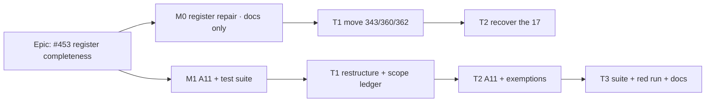

# Implementation Plan: Debt-register completeness

- **Feature spec:** [`./feature-spec.md`](./feature-spec.md)
- **Status:** Approved — by the product owner, 2026-10-05 (in session): CQ-1 **recover** the 17 unledgered numbers into the ledger (not exempt them).
- **Owner:** repo

## Breakdown

### Epic

**Debt-register completeness**: every number from 1 to the highest in use is a live row or a
ledger line. This closes `docs/TECH_DEBT.md` #453. Repository tooling, no roadmap theme.

**Entry point:** ships dark for users. There is no product surface. The "entry point" is
`pnpm check:debt-status`, which runs in `pnpm prepush` and `ci.yml:81` (ADR-0081 does not apply:
no user-facing capability). **No `VITE_*` flag** (ADR-0088 D1: there is nothing to flag). The
rollback is the commit boundary.

### Milestone M0: register repair (docs only, ≈ one PR)

**Outcome:** the register already satisfies A11 before A11 exists, so the gate arms green.

#### Task M0-T1: move the three stray ledger lines (S)

- **Description:** cut `| 343 |`, `| 360 |` and `| 362 |` from `docs/TECH_DEBT.md:9136-9138`
  (inside `### 294.`'s table) and append them to the ledger table (`:6564-6791`). After the cut,
  #294's table holds only its three `width` rows.
- **Risks:** Prettier re-pads both tables. That is expected, and the diff should be checked to
  show only the moved lines plus padding.
- **Testing:** `pnpm check:debt-status` still green (A5/A6 unchanged). Read #294's table rendered.
- **Steps:** 1. move the lines; 2. `pnpm format`; 3. `pnpm check:debt-status`.

#### Task M0-T2: recover the 17 missing numbers into the ledger (S–M; depends on CQ-1)

- **Description:** for each of 6, 19, 22, 24, 25, 26, 27, 36, 38, 39, 41, 44, 47, 50, 52, 54, 61:
  - Find the commit that deleted the row: `git log -S'| <n> ' --format='%h %ad %s' --date=short -- docs/TECH_DEBT.md`.
    Also try the `## <n>.` / `### <n>.` heading forms. Then search `docs/DECISIONS.md` for
    `TECH_DEBT #<n>`.
  - Write one ledger line: number, the row's title as it last stood, the closed date (the date of
    the deleting commit, or the DECISIONS entry if that is earlier and explicit), and where the
    record is (the commit SHA and/or the DECISIONS / ADR anchor).
  - A number git cannot answer goes to the M1 exemption list, with the reason "deleted before
    <date>; not recoverable from `git log -S` (searched: …)".
- **Complexity:** S if git answers all 17 (expected: the file has been in git since the project
  began), M if it does not.
- **Risks:**
  - A number may have been **reused** (the #83 shape), so `-S` finds more than one row. Mitigation:
    take the deletion that leaves no live row, and footnote it as `83¹` does.
  - A wrong title would corrupt the record. Mitigation: quote the heading exactly as the deleting
    commit's parent had it.
- **Testing:** the one-off scan from the spec §1, re-run, shows only the residue. A6 is green.
- **Steps:** 1. recover; 2. append lines; 3. `pnpm format && pnpm check:debt-status`; 4. record the
  residue count `k` in the M1 PR description.

### Milestone M1: the A11 assertion (≈ one PR)

**Outcome:** deleting a row without a ledger line fails `pnpm prepush` and CI, naming the number.

#### Task M1-T1: make the gate drivable and scope the ledger parse (S)

- **Description:**
  - Restructure `scripts/check-debt-status.mjs` into `export function collectFindings(root)` and
    `export function runGate(root)`. Read files via `join(root, …)`, with `REPO_ROOT` from
    `lib/doc-register.mjs` as the CLI default. Exit only under the `import.meta.url` guard (copying
    `check-adr-coverage.mjs:56,313-327`).
  - Scope `ledger` to the contiguous table block after `## Closed numbers` (spec §4 change 1).
  - Replace the stale `--report` banner (`:312`).
- **Risks:** the restructure could change A1–A10 behaviour. Mitigation: the real-file run must
  produce a byte-identical summary line before and after this task (A11 is not yet added), checked
  by running `node scripts/check-debt-status.mjs --report` on both trees and diffing.
- **Testing:** the identical-summary diff above, plus the suite's first case (M1-T3 case 1).

#### Task M1-T2: A11 and, only if M0 left residue, the exemption limbs (S)

- **Description:**
  - Build the integer set from compact, detailed and ledger rows (dropping suffixes), take `max`,
    and push one A11 finding per number that is missing and not validly exempt. Use the wording in
    spec §2.
  - Skip A11 with one A9 finding if the ledger parsed empty.
  - If `k > 0`: add `unledgered` and `_unledgered` to `scripts/debt-register.json`, and the three
    refusal limbs (empty reason, exempt-but-present, above `UNLEDGERED_CEILING = 61`).
  - If `k = 0`, **build none of it** (no dead code).
  - Extend the summary line (spec §4 change 6).
  - Write the A11 docblock, including the **top-number blind spot**, stated plainly (spec Q-2).
- **Risks:** a false A11 flood from a parse fault. Mitigation: the empty-ledger guard and the
  pinned real-file positive.

#### Task M1-T3: the suite, the red run, docs (S)

- **Description:** add `scripts/check-debt-status.test.mjs`, which drives `runGate(tmpRoot)` over
  fixture trees containing `docs/TECH_DEBT.md` and `scripts/debt-register.json`. Every case names,
  in a comment, the edit to the gate that turns it red (ADR-0110 D5; the
  `check-adr-coverage.test.mjs:1-24` convention). Append it to the `check:doc-register` chain in
  `package.json:21`.
- **Cases:**
  1. **Pinned positive:** a fixture where 1–5 are accounted for (compact 1, detailed 2–3, ledger
     4–5) gives no A11. Also: `runGate(REPO_ROOT)` exits 0 on the real register.
  2. A detailed row deleted gives A11 naming it. _(Red if the A11 loop is removed.)_
  3. A ledger line deleted gives A11 naming it.
  4. A compact row deleted gives A11 naming it. _(Red if compact rows are left out of the live set.)_
  5. A ledger-shaped line inside a later detailed row's table does **not** satisfy A11. _(Red under
     today's unscoped parse: the #343/#360/#362 shape.)_
  6. `118a` alone neither satisfies nor demands 118.
  7. An empty ledger gives exactly one A9 finding and zero A11 findings.
  8. **Blind spot pinned:** deleting the highest number is **not** reported. The case's comment
     says that this test should flip if a high-water mark is ever added.
  9. _(Only if `k > 0`)_ an empty reason, exempt-but-present, and above-ceiling each refused; a
     valid exemption silences its number.
- **Manual red run on the real file (ADR-0110):** delete `### 453.` locally, run
  `pnpm check:debt-status`, and paste the A11 output into the docblock. Restore the row.
- **Docs:**
  - `docs/TESTING.md:765-770`: add "and that every number from 1 to the highest in use is a live
    row or a ledger line".
  - `docs/TECH_DEBT.md:18-21`: add "`check:debt-status` A11 refuses a deletion without one".
  - Delete #453 and ledger it.
  - Add a one-line `docs/DECISIONS.md` entry recording "recover, not exempt" (CQ-1's answer).
- **No changeset** (root tooling only). **No `CLAUDE.md` change** (`check:counts` figures
  unaffected).
- **Gate:** `pnpm prepush`. There is no `apps/` change, so no e2e half is needed.
- **Performance:** `time pnpm check:debt-status` before and after, recorded in the PR (spec S5).

## Sequencing & slices

M0-T1 → M0-T2 (one docs PR, releasable alone) → M1 (one tooling PR). Both can share one PR as two
commits if they are reviewed together. The order inside it matters: the repair commit comes first,
so the gate commit arms green.

## Definition of Done (per task)

Feature Completion Criteria in [`docs/PROCESS.md`](../../PROCESS.md), as they apply to tooling.
Code, tests (verified red), docs, CI green and version impact assessed (none). Security,
accessibility, Docker and performance reviews are not applicable beyond S5. **Reviewer:**
test-engineer for the suite's discrimination. No other specialist agent applies: there is no
schema, API or UI change.

## Risks & assumptions (rollup)

| Risk / assumption                                                           | Likelihood | Impact | Mitigation                                                                                   |
| --------------------------------------------------------------------------- | ---------- | ------ | -------------------------------------------------------------------------------------------- |
| Git cannot recover some of the 17                                           | low        | low    | They become ceilinged exemptions with the search recorded as the reason                      |
| A reused number makes recovery ambiguous                                    | low        | med    | Footnote convention (`83¹`), with the deleting commit cited                                  |
| The restructure silently changes A1–A10                                     | low        | med    | Byte-identical summary diff before A11 lands                                                 |
| The top-number blind spot lets a deleted top row's number be reused         | low        | med    | Documented and pinned (case 8). High-water mark on request (Q-2)                             |
| Scoping the ledger exposes another stray ledger line not found by this scan | low        | low    | It surfaces as an A11 finding naming it, which is the intended behaviour; move it like M0-T1 |
