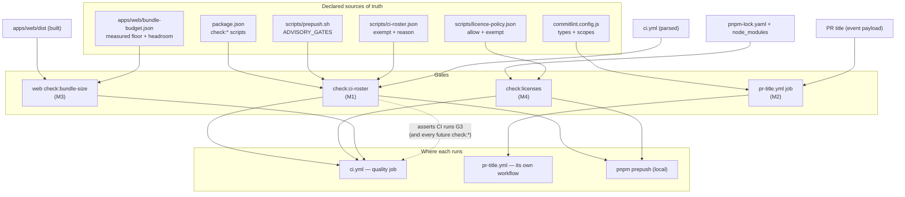
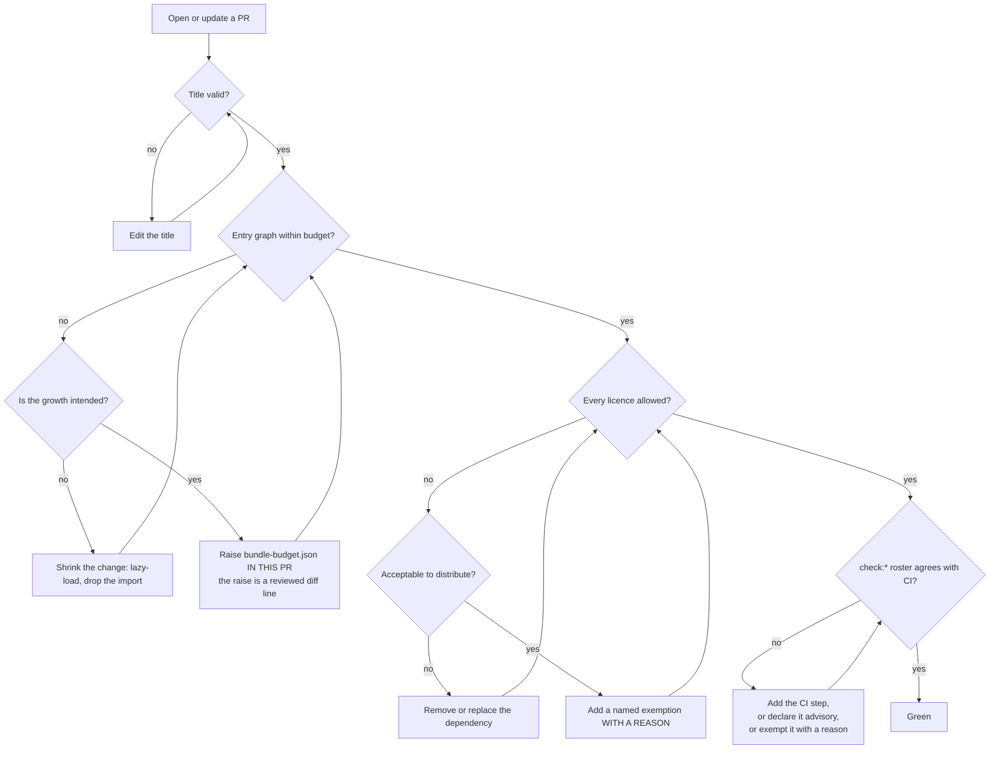

# Feature Spec: Delivery gates — four rules this repository states in prose and enforces nowhere

- **Status:** **Accepted — shipped 2026-09-11 (ADR-0136)**, M1–M5. Approved 2026-09-11 by the
  product owner, taking **all four** critical questions'
  written defaults: CQ-1 adds `deps-dev` to `scope-enum` **and** to `CLAUDE.md` §9's scope list
  (keeping the dev/prod distinction `main`'s history currently records); CQ-2 sets the bundle budget
  at the measured floor × 1.05 rounded up to the nearest kB, with the ratio labelled in the file as
  a judgement rather than a measurement; CQ-3 and CQ-4 as written.
- **Author(s):** feature-analyst (Product Owner / Solution Architect / Technical Lead hats)
- **Date:** 2026-09-10
- **Tracking issue / epic:** _to be created_
- **Roadmap link:** repository maintenance — drift control (ADR-0058, ADR-0120, ADR-0124)
- **Related ADR(s):** builds on **ADR-0058** (a gate set at an aspirational bar gets deleted rather
  than fixed), **ADR-0093** (a census assertion needs a pinned positive case), **ADR-0105** (a CI
  step or a shared gate is a spec-and-plan trigger), **ADR-0110 D5** (a gate is finished when the
  defect it names has made it fail), **ADR-0120**/**ADR-0124** (the exit-code convention; advisory
  is a declaration, not a number). Filed as
  [**ADR-0136**](../../adr/0136-a-rule-is-enforced-where-the-artefact-lands.md).
- **Closes (on completion):** `docs/TECH_DEBT.md` **#244**; `docs/BACKLOG.md` "PR-title lint in CI",
  "Bundle-size budget checks in CI", "Dependency licence checking in CI"; `docs/TECH_DEBT.md`
  **#48(b)** (the bundle half).

> **Why this document exists at all.** Every milestone below adds a **CI step**, and two add a
> **shared gate**. ADR-0105 makes either a full-spec trigger regardless of size, and `#244` says so
> in its own body as the reason it is a row and not a commit: _"Making CI derive its roster, or
> asserting the two agree, is a change to a shared gate and an ADR-0105 full-spec trigger; smuggling
> it into a gate pass is the judgement that rule exists to remove."_

---

## 0. Evidence log — what was verified, what was corrected, and what is only reasoned

Per ADR-0076 and `docs/PROCESS.md` "Decision-bearing claims carry their evidence". **The brief was
not taken as evidence.** Its claims were re-derived independently; most survived, two did not, and
one of its own recommended commands turns out to carry the defect it is meant to detect.

**A limitation that governs the whole log, stated first because it changes how much weight each row
can bear.** This session had **no shell**. Every verification below is a **file read** or a
**repository-wide content search** — no command was executed. Where the brief cites a command's
output, I could only corroborate it by reading the inputs that command reads. Rows marked
`REASONED` are inferences from a dependency's or a platform's documented behaviour and **must be
executed before they are relied on** (ADR-0076 Class 2/3). This is not a formality: `#244`'s own
one-liner and `docs/FRONTEND_QUALITY.md`'s bundle budgets are both things that read as established
fact and are not.

### E — verified by reading

| #       | Claim                                                                                                                                                                                                                           | How established                                                                                                                                                                   |
| ------- | ------------------------------------------------------------------------------------------------------------------------------------------------------------------------------------------------------------------------------- | --------------------------------------------------------------------------------------------------------------------------------------------------------------------------------- |
| **E1**  | Root `package.json` declares **16** `check:*` scripts.                                                                                                                                                                          | Read `package.json:21-46`; counted.                                                                                                                                               |
| **E2**  | **15** of them are invoked by a `run:` step in `.github/workflows/ci.yml`. Exactly **one** is absent: `check:reconcile-due`.                                                                                                    | Read `ci.yml:49-206`; cross-checked against E1.                                                                                                                                   |
| **E3**  | That absence is deliberate and documented **in `ci.yml` itself**: _"Deliberately absent from this list: `check:reconcile-due`, which is ADVISORY by product-owner decision (2026-08-30)."_                                      | Read `ci.yml:75-77`.                                                                                                                                                              |
| **E4**  | `scripts/prepush.sh` declares `ADVISORY_GATES=("check:reconcile-due")` at line **92**, and derives its own gate roster from `package.json` at lines **130-133** rather than listing it.                                         | Read `scripts/prepush.sh:92,125-140`.                                                                                                                                             |
| **E5**  | `scripts/check-advisory-agreement.mjs` **parses that array out of `prepush.sh`** and asserts it equals the set of gates capable of exiting 2, in both directions.                                                               | Read `check-advisory-agreement.mjs:50-74,150-174`.                                                                                                                                |
| **E6**  | **commitlint appears in no workflow.** Its only wiring is `.husky/commit-msg` (`pnpm exec commitlint --edit "$1"`), a local, `--no-verify`-bypassable hook.                                                                     | Repository-wide search for `commitlint`: hits in `commitlint.config.js`, `.husky/commit-msg`, `CONTRIBUTING.md:46`, `pnpm-lock.yaml`. **Zero** in `.github/`.                     |
| **E7**  | The commit vocabulary is a closed enum of **11 types** and **11 scopes**, `scope-enum` at severity **2** (error).                                                                                                               | Read `commitlint.config.js:11-44`.                                                                                                                                                |
| **E8**  | **Dependabot's npm updater emits `chore(deps-dev)` for development updates, and `deps-dev` is not in `scope-enum`.**                                                                                                            | Read `.github/dependabot.yml:19-21` (`prefix-development: 'chore(deps-dev)'`) against E7.                                                                                         |
| **E9**  | The Changesets release PR title is **`chore(release): version packages`** — a valid Conventional Commit whose scope `release` **is** in the enum.                                                                               | Read `.github/workflows/release.yml:65-70` against E7.                                                                                                                            |
| **E10** | `ci.yml`'s `pull_request` trigger declares **no `types:`**, so it defaults to `opened, synchronize, reopened`. **Editing a PR title does not re-trigger it.**                                                                   | Read `ci.yml:3-7`.                                                                                                                                                                |
| **E11** | No bundle-size gate exists anywhere. `apps/web`'s build is `tsc --noEmit && vite build`; `vite.config.ts` sets no `manualChunks`, no `manifest`, and `sourcemap: true`.                                                         | Read `apps/web/package.json:10`, `apps/web/vite.config.ts:67-70`; search of `.github/workflows/` and manifests for `size-limit`/`bundlesize` — no hits.                           |
| **E12** | No licence checking exists. The only `license` fields are the three manifests' own `"MIT"`. The image publisher requests Syft `sbom: true` for **container** contents only.                                                     | Read `package.json:6`, `apps/web/package.json:6`, `apps/api/package.json:6`, `docker-publish.yml:152-153`; search for `licen`/`syft` under `.github/` — two hits, both the above. |
| **E13** | **94 direct manifest entries** across root + `apps/web` + `apps/api` (`dependencies` + `devDependencies`): 13 + 39 + 42. Of those, **12** are `workspace:*`, leaving **82** external entries.                                   | Counted line by line from the three manifests.                                                                                                                                    |
| **E14** | The lockfile resolves **1,112** packages — the population a licence scan would face.                                                                                                                                            | Count of `^    resolution: \{` in `pnpm-lock.yaml`.                                                                                                                               |
| **E15** | `scripts/lib/doc-register.mjs`'s `report()` **refuses to report success over an empty population** (`population: 0` is a blocking finding), and `advisory: true` is the only sanctioned route to a 2.                           | Read `doc-register.mjs:234-312`.                                                                                                                                                  |
| **E16** | **`report()`'s `warnings` channel returns 2 unconditionally**, so any gate using it must be declared advisory or it will block on a soft finding — and `check:advisory-agreement` detects a live `warnings.push` as capability. | Read `doc-register.mjs:259-277`; `check-advisory-agreement.mjs:117-139`.                                                                                                          |
| **E17** | `apps/web` is **not route-split by default**. `app/router.tsx` has exactly **two** lazy boundaries: `/share` and `/staff`.                                                                                                      | Read `app/router.tsx:302-316`; repository search for `React.lazy`/`lazyRouteComponent` across `apps/web/src` found no other router-level split.                                   |
| **E18** | jsPDF is already asserted to be dynamically imported **at source level**, by a unit test.                                                                                                                                       | Read `apps/web/src/features/tsld/export/pdf.test.ts:9-13`.                                                                                                                        |
| **E19** | `scripts/adr-coverage.json` is the repository's established idiom for "a named exemption carrying its reason", which `#244` explicitly asks this work to copy.                                                                  | Read `scripts/adr-coverage.json:1-46`; `docs/TECH_DEBT.md:1787-1795`.                                                                                                             |
| **E20** | No script under `scripts/` parses YAML; `check-build-contract.mjs` reads `ci.yml` as **raw text with a regex**.                                                                                                                 | Read `check-build-contract.mjs:51-53,95-99`; repository search for `yaml` under `scripts/`.                                                                                       |

### C — where the brief, or a document, was wrong

| #      | Claim as given                                                                                                                                                        | Finding                                                                                                                                                                                                                                                                                                                                                                                                                                                                                                                                                                                 |
| ------ | --------------------------------------------------------------------------------------------------------------------------------------------------------------------- | --------------------------------------------------------------------------------------------------------------------------------------------------------------------------------------------------------------------------------------------------------------------------------------------------------------------------------------------------------------------------------------------------------------------------------------------------------------------------------------------------------------------------------------------------------------------------------------- |
| **C1** | _"the sharpest finding available to you is that the only commit message that ever reaches `main` is the one nothing checks"_                                          | **Sharper than that, and in a way the brief did not reach: the gate would fail on day one.** `#244`'s exemption is not the only vocabulary problem. Dependabot's development updates are titled `chore(deps-dev): …` (E8) and `deps-dev` is **not** in `scope-enum` (E7), so a PR-title lint armed today goes **red on every open Dependabot dev-dependency PR** — up to ten at once (`dependabot.yml:16`). That is verbatim ADR-0058's "a gate that fails on day one gets deleted rather than fixed", and it makes item 1 **not** the cheapest thing to ship first. See §4.2 and CQ-1. |
| **C2** | `#244`'s own recommended detection command.                                                                                                                           | **It carries the defect it exists to detect.** `ci.includes("pnpm "+k)` is a **raw substring search over the whole file, comments included**. A YAML comment reading `pnpm check:foo` would satisfy it while no step ran. The trap is **latent, not live** — I read every comment in `ci.yml` and none contains the string `pnpm check:` — but it is the fourth recorded instance of scan-matching-prose in this repository, sitting inside the row that asks for the fix. §4.1 D3 answers it.                                                                                          |
| **C3** | `docs/FRONTEND_QUALITY.md:73-74` — _"Route-based splitting by default — each route is its own chunk"_ (`:86-87`) and _"initial (critical-path) JS ≤ ~200KB gzipped"_. | **The first sentence is false as built** (E17: two lazy boundaries, neither a plan route), and the second is a number nobody has ever measured — the file says so itself two lines later. So the bundle budget's starting figure **cannot** be taken from that document; taking it would arm a gate that fails on day one against a codebase that has never met it. The floor is measured in M3-T1 and committed before the gate exists.                                                                                                                                                |
| **C4** | Brief: _"94 direct dependencies … Transitive count unmeasured."_                                                                                                      | **94 is correct** (E13) and worth stating precisely: 94 **manifest entries**, of which 12 are internal `workspace:*`. The transitive figure is **1,112 resolved packages** (E14) — measured here by reading the lockfile, because the licence gate's cost and its exemption-list size are both functions of it, not of 94.                                                                                                                                                                                                                                                              |
| **C5** | Brief: _"`grep -n 'commitlint' .github/workflows/*.yml` returns NOTHING."_                                                                                            | **Confirmed** (E6) — and one consequence the brief did not draw: the **release** PR is also unchecked, because a PR opened with the default `GITHUB_TOKEN` triggers no workflows (`CLAUDE.md` §11). That is harmless here only because its title is a **constant in `release.yml`** (E9), not because anything verifies it.                                                                                                                                                                                                                                                             |
| **C6** | —                                                                                                                                                                     | **Incidental, out of scope, recorded rather than stepped over (ADR-0071's rule).** `CLAUDE.md` §16's ADR register is **missing ADR-0132**. `docs/adr/0132-…md` exists and is cited by `docs/ROADMAP.md`, `docs/DESIGN_SYSTEM.md`, `docs/TECH_DEBT.md` and two spec directories; `check:adr-coverage` gates `ROADMAP.md` and `docs/adr/README.md` and **cannot see CLAUDE.md**. Recommend a `docs/TECH_DEBT.md` row; it is not this epic's work.                                                                                                                                         |

### R — reasoned, not executed. Verify before relying on these.

| #      | Claim                                                                                                                                            | Why it is not yet evidence                                                                                                                                                                                                                                                                                                                                                                              |
| ------ | ------------------------------------------------------------------------------------------------------------------------------------------------ | ------------------------------------------------------------------------------------------------------------------------------------------------------------------------------------------------------------------------------------------------------------------------------------------------------------------------------------------------------------------------------------------------------- |
| **R1** | The squashed commit on `main` takes the PR title, so the PR title is the only message on `main`.                                                 | `CLAUDE.md` §8 states the strategy, and `.git/logs/HEAD` shows the exact post-squash `branch: Reset to origin/main` dance §8 prescribes, after batches of conventionally-titled branch commits. But the reflog holds **no `main` history**, so the identity of PR title and merge subject is **inferred**. Verify with `git log --oneline origin/main \| head -20` against the corresponding PR titles. |
| **R2** | `pnpm licenses list --json` exists in pnpm 10 and needs no new dependency.                                                                       | It is a documented built-in and `docs/TECH_DEBT.md` #48(c) already names `pnpm licenses` as the route to an npm-level SBOM — but I did not run it. Its **exact JSON shape** decides the parser, and its **runtime over 1,112 packages** decides whether it belongs in `prepush`. Both are M4-T1.                                                                                                        |
| **R3** | commitlint's `scope-enum: [2, 'always', […]]` permits an **empty** scope (`docs: …`) and rejects only a non-empty scope outside the list.        | This is commitlint's documented behaviour and matters because most of this repository's own history uses a scope while the enum's semantics decide whether a scopeless title is legal. Verify by running commitlint over a fixture list before arming (M2-T1).                                                                                                                                          |
| **R4** | A PR title is attacker-controlled input; `${{ github.event.pull_request.title }}` interpolated into a `run:` block is a script-injection vector. | Well-established GitHub Actions guidance rather than something read here. It is treated as a **hard requirement** in §4.2 D4 regardless, because the cost of honouring it is one `env:` line.                                                                                                                                                                                                           |
| **R5** | Enabling Vite's build manifest, or adding a `generateBundle` plugin, changes no emitted JS chunk.                                                | Reasoned from Rollup's build model. It decides whether the measured artefact is the shipped artefact, which is the whole credibility of the budget, so M3-T1 must confirm it by diffing `dist/assets/` hashes before and after.                                                                                                                                                                         |

---

## 1. Business understanding

### Problem

This repository has a strong, well-earned habit: **when a rule matters, it gets a computed gate**
(ADR-0058, ADR-0076, ADR-0120, ADR-0124). Sixteen `check:*` scripts, a route census, a contrast
matrix, a build contract, a claims register, a spec-status gate.

Four rules were left out, and they share one shape: **each is stated in prose and enforced nowhere,
or enforced only where enforcement does not happen.**

1. **`CLAUDE.md` §9 says Conventional Commits are "enforced by commitlint (git hook + expected in
   PR titles)".** The parenthesis is doing a great deal of work. commitlint runs in exactly one
   place — a local `commit-msg` hook (E6) — which is bypassable with `--no-verify` and, more to the
   point, **sees the wrong messages**. `main` is squash-merged with the PR title as the subject
   (`CLAUDE.md` §8, R1), so the hook validates branch commits that the squash **discards**, and the
   one message that survives into `main`'s history is the one nothing checks. "Expected in PR
   titles" is an expectation with no observer — precisely ADR-0120's subject, one artefact along.

2. **There is no bundle-size budget** (E11). `docs/FRONTEND_QUALITY.md` publishes two numbers and
   admits in the same paragraph that they are "advisory and unmeasured". Worse than unmeasured: the
   surrounding claim that the app is route-split by default is **false as built** (C3, E17), so a
   reader who trusts the document believes the initial bundle is small for a reason that does not
   hold. `apps/web` carries jsPDF, a canvas painter, a Gantt, an interchange parser and a seed
   generator. `#48(b)` filed the gap the day jsPDF landed and it has not moved since.

3. **There is no dependency licence check** (E12). 1,112 resolved packages (E14) ship inside two
   container images published to a public registry. Nothing asserts that any of them may be
   distributed that way. The `sbom: true` on the image publisher enumerates **OS packages of the
   nginx runtime stage**, not the npm graph — `#48(c)` records that as a structural gap.

4. **`#244`: CI's gate roster is hand-written while `prepush.sh` derives its own.** This has already
   failed twice. `check:advisory-agreement` shipped enforced only locally; that was fixed by adding
   a step, and the condition **moved to `check:browser-safe`**, which was fixed the same way on
   2026-09-10. `#244` refuses to close on either fix, and its reasoning is the sharpest sentence in
   the register: _"A row naming its instance rather than its rule decays into a false negative."_

**Why now.** Three of the four are `S`-sized backlog rows that have sat below whatever is being
built, which is the ADR-0085 unconditioned-`M` failure. The fourth has a live, dated, twice-recurred
condition. And they are one epic rather than four because **item 4 is the gate that protects items
2 and 3**: once the two rosters must agree, a `check:*` script added without a CI step fails
loudly, so the epic's own later milestones cannot repeat the defect its first milestone closes.

### Users

Not a product feature. No organisation, no role, no principal. The people served are:

| Who                                  | Needs                                                                                                                                           |
| ------------------------------------ | ----------------------------------------------------------------------------------------------------------------------------------------------- |
| **Contributor / agent opening a PR** | To be told, before merge, that the title will land badly on `main`; that a change grew the bundle; that a dependency's licence is unacceptable. |
| **Reviewer**                         | Not to have to check by eye what a machine can check, and to see a budget raise as a **reviewed diff line** rather than as an absence.          |
| **Product owner / operator**         | Confidence that a published image contains nothing they cannot distribute, and a changelog on `main` that is machine-readable.                  |
| **The next person to add a gate**    | To have the roster kept honest for them, rather than discovering months later that their gate never ran in CI.                                  |

### Primary use cases

1. A PR is opened with a malformed title; CI says so, and says so **again** when the title is
   edited (E10 makes this non-trivial).
2. A change grows the initial JS payload past its recorded budget; CI names the number, the budget
   and the delta.
3. A dependency arrives whose licence is not on the allow-list, or which declares none; CI refuses
   and names the package.
4. A `check:*` script is added to `package.json` and not to `ci.yml`; CI refuses and names it.

### User journeys

The contributor journey is one loop (§4 "User flow"): push → CI reports → fix the title, shrink the
change, replace the dependency, or **edit a recorded file with a reason** → CI green. The last is
the load-bearing one and is the design's central idea (§4.9 D2).

### Expected outcomes

- Every commit message on `main` is a valid Conventional Commit **because something checked**, not
  because everyone remembered.
- The web bundle has a number, and growing it is a visible act.
- The licence position of the published images is a fact rather than an assumption.
- `#244` closes against its **rule** rather than its current instance, so it cannot decay into a
  false negative a third time.

### Success criteria

| Criterion                                                                                                  | How it will be judged                                                                        |
| ---------------------------------------------------------------------------------------------------------- | -------------------------------------------------------------------------------------------- |
| Every assertion in every new gate has been **made to fail by the defect it was written for** (ADR-0110 D5) | Each task names its mutation; the red output is committed in the milestone's notes.          |
| No new gate fails on day one for a reason unrelated to its defect (ADR-0058)                               | M2-T1, M3-T1 and M4-T1 are measurement/prerequisite tasks whose output sets the initial bar. |
| `#244` closes with the **rosters asserted equal**, not with a step added                                   | The row's own closing condition, quoted in M1's definition of done.                          |
| `check:advisory-agreement` still passes, unchanged                                                         | It will, iff no new gate uses `report()`'s `warnings` channel (E16). Stated as a constraint. |
| No new blocking gate is added without a locally-runnable route, or its absence is a stated blind spot      | §4.1 D5.                                                                                     |

### Open questions

The **critical** four are §2's CQ-1 to CQ-4, each with a stated default so the plan is approvable
with one reply. Everything else is decided in §4 and recorded as a decision rather than a question.

---

## 2. Functional requirements

### User stories & acceptance criteria

> **US-1** — As a contributor, I want CI to check my **PR title** against the same commitlint config
> the local hook uses, so that the message squashed onto `main` is a valid Conventional Commit.
>
> **Acceptance criteria**
>
> - **Given** a PR titled `feat(web): add a thing` **when** CI runs **then** the title check passes.
> - **Given** a PR titled `Add a thing` **when** CI runs **then** the check fails, naming the rule
>   broken and the allowed types and scopes.
> - **Given** a failing title **when** the author **edits the title** and changes nothing else
>   **then** the check re-runs and passes. _(E10: this requires `types: [… edited]`; without it the
>   check is unrecoverable without a dummy commit, which is how a gate gets bypassed.)_
> - **Given** a PR titled `chore(deps-dev): bump …` (Dependabot's own output, E8) **when** CI runs
>   **then** the check passes — because the vocabulary was reconciled first (CQ-1). _This criterion
>   is the milestone's gate: it must be true before the workflow is added, not after._
> - **Given** the check fails **then** the failure names the **title it read**, so an author can see
>   whether the check saw the edit.
> - **Given** the same title **when** validated by the local `commit-msg` hook and by CI **then**
>   both use `commitlint.config.js` — there is no second copy of the rules.

> **US-2** — As a reviewer, I want CI to refuse a change that grows the web app's **initial JS
> payload** past a recorded budget, so that bundle growth is a decision rather than a discovery.
>
> **Acceptance criteria**
>
> - **Given** a build **when** the gate runs **then** it reports the **gzipped size of the initial
>   entry graph** (the entry chunk plus everything statically reachable from it), each chunk's
>   gzipped size, and the budget each is measured against.
> - **Given** a change that pushes the entry graph over budget **then** the gate fails, naming the
>   measured size, the budget, the delta, and the chunks that grew.
> - **Given** a change that legitimately needs more **when** the author raises the number in
>   `apps/web/bundle-budget.json` **in the same PR** **then** the gate passes and the raise is a
>   reviewed diff line.
> - **Given** the build **then** the gate asserts **`jspdf` is not in the initial entry graph** —
>   `#48(b)`'s specific ask, and the half a source-level test (E18) structurally cannot cover, since
>   a source-level assertion cannot see what the bundler actually did.
> - **Given** no build output **then** the gate **fails loudly** with "build first", never passes.
> - **Given** the budget file lists a chunk that no longer exists **then** the gate fails (a stale
>   budget entry is a budget nobody is measured against).

> **US-3** — As a product owner, I want CI to refuse a dependency whose licence is not on an
> allow-list, so that what ships inside a published image is a fact.
>
> **Acceptance criteria**
>
> - **Given** the installed tree **when** the gate runs **then** every resolved package's declared
>   licence is on the allow-list, or carries a **named exemption with a reason**.
> - **Given** a package declaring `GPL-3.0` (or any licence not allowed) **then** the gate fails,
>   naming the package, its version, its licence and its dependency path where available.
> - **Given** a package declaring **no** licence, or `UNKNOWN` **then** the gate fails. Unknown is
>   refused, not tolerated: an unknown licence is not a permissive one.
> - **Given** an exemption naming a package no longer in the tree, or one now on the allow-list
>   **then** the gate fails (a stale exemption is a rule nobody is bound by).
> - **Given** the licence tool returns an empty or unrecognised result **then** the gate fails,
>   never passes. _(E15 gives the empty case for free; the shape case needs its own assertion.)_

> **US-4** — As the next person to add a gate, I want CI's roster and `package.json`'s roster to be
> **asserted equal**, so that a gate cannot silently run only on my machine.
>
> **Acceptance criteria**
>
> - **Given** a root `check:*` script with no `run: pnpm <name>` step in `ci.yml` **then** the gate
>   fails, naming it — **unless** it is declared advisory in `prepush.sh`, or exempt with a written
>   reason in `scripts/ci-roster.json`.
> - **Given** a `ci.yml` step invoking `pnpm check:<name>` that is not a script **then** the gate
>   fails (a typo'd step is a gate that never ran).
> - **Given** an **advisory** gate added to `ci.yml` **then** the gate fails, because adding it
>   converts a product-owner decision into a blocking gate by the back door (E3).
> - **Given** the advisory set **then** it is **read out of `prepush.sh`**, never restated. The gate
>   source contains no literal advisory gate name.
> - **Given** a `ci.yml` **comment** mentioning `pnpm check:<name>` and no such step **then** the
>   gate still reports it absent (C2).
> - **Given** a stale entry in `scripts/ci-roster.json` **then** the gate fails.

### Workflows

**PR-title check.** PR opened / edited / reopened / synchronized / marked ready → job reads the
title from the event payload **via `env:`** → pipes it to `commitlint` with the repository config →
pass or fail with commitlint's own message plus the title as read.

**Bundle budget.** `quality` job → `pnpm build` (already present, `ci.yml:208-209`) → new step runs
the size reporter over `apps/web/dist` → compares against `apps/web/bundle-budget.json` → pass, or
fail naming size/budget/delta.

**Licence check.** `pnpm check:licenses` → `pnpm licenses list --json` → classify each package
against `scripts/licence-policy.json` → `report()`.

**Roster check.** `pnpm check:ci-roster` → parse `package.json`, `ci.yml`, `prepush.sh`'s
`ADVISORY_GATES`, `scripts/ci-roster.json` → four set comparisons → `report()`.

### Edge cases

| Case                                                                        | Expected behaviour                                                                                                                                                                                                                                                 |
| --------------------------------------------------------------------------- | ------------------------------------------------------------------------------------------------------------------------------------------------------------------------------------------------------------------------------------------------------------------ |
| The Changesets **release PR**                                               | The title check **never runs on it** — a PR opened by the default `GITHUB_TOKEN` triggers no workflows (`CLAUDE.md` §11, C5). Its title is a constant in `release.yml` (E9) and is valid. Recorded as a **blind spot**, not solved.                                |
| A **Dependabot** PR                                                         | Runs normally. It must pass, which is CQ-1's whole subject.                                                                                                                                                                                                        |
| Title edited at the **merge dialog**, after the check passed                | Undetectable by this design. GitHub's squash dialog pre-fills from the PR title but is editable. **Stated blind spot**; mitigated only by the repository setting "Default to PR title for squash merge commits".                                                   |
| Empty population in any gate                                                | Blocking, free from `report()` (E15). Explicitly kept rather than worked around.                                                                                                                                                                                   |
| Bundle gate run with no `dist/`                                             | Fail with "build first". Never a pass, and never a silent skip (`#12`'s rule).                                                                                                                                                                                     |
| `pnpm licenses list` output shape changes on a pnpm bump                    | Fail loudly with a parse error naming the pnpm version. This is ADR-0076 Class 2 — a claim about a dependency's internals — so the parser's assumptions go in `scripts/dependency-claims.json` if they cite line numbers, and are asserted structurally otherwise. |
| A dual-licensed package (`(MIT OR Apache-2.0)`)                             | Passes iff **at least one** disjunct is allowed. A conjunction (`AND`) requires **all**. Anything the parser cannot resolve is treated as unknown and **fails**.                                                                                                   |
| A `workspace:*` package                                                     | Excluded from the licence population by name (`@repo/*`), and the exclusion is asserted rather than assumed — they are `private: true` and are not published.                                                                                                      |
| A `check:*` script that legitimately cannot run in CI                       | Needs an entry in `scripts/ci-roster.json` with a reason. There are **none today**; the file ships with an empty `exempt` map and a populated `_` explanation, like `adr-coverage.json`.                                                                           |
| A **CI step that is not a `pnpm check:*`** (the title job, the bundle step) | Outside the roster gate's population **by construction**. §4.1 D5 states this blind spot in the gate's own docblock rather than leaving a reader to assume coverage.                                                                                               |

### Permissions

**Not applicable in the product sense** — no endpoint, no principal, no organisation scope, no RBAC.
The only access-control surface is the new workflow's GitHub Actions token scope, and it is a
requirement rather than a default:

- The PR-title workflow declares `permissions: {}` (it needs no token at all — the title is in the
  event payload).
- It is triggered by **`pull_request`**, never `pull_request_target`. `pull_request_target` runs
  with the base repository's secrets against untrusted head content; there is no reason to reach for
  it here and a good reason not to (R4).

### Validation rules

| Input                         | Rule                                                                                                                                 |
| ----------------------------- | ------------------------------------------------------------------------------------------------------------------------------------ |
| PR title                      | `commitlint.config.js`, unchanged and unduplicated. The **only** permitted change is to the enums, and only via CQ-1.                |
| `apps/web/bundle-budget.json` | Integers, **bytes gzipped**. Must record the measurement date and the command that produced the floor. Unknown keys rejected.        |
| `scripts/licence-policy.json` | `allow`: array of SPDX identifiers. `exempt`: object, package name → non-empty reason string. Unknown top-level keys rejected.       |
| `scripts/ci-roster.json`      | `exempt`: object, `check:*` name → non-empty reason string. A name that is also advisory is **rejected as duplication**, not merged. |

**Every one of these files rejects an unknown key.** A policy file that silently ignores a
misspelled key is a policy nobody is bound by, which is this epic's subject one level down.

### Error scenarios

These are CI failures, not HTTP responses; the "status" column is the exit code.

| Scenario                          | Detection                              | Result                                              | Exit |
| --------------------------------- | -------------------------------------- | --------------------------------------------------- | ---- |
| Malformed PR title                | commitlint                             | Job fails; commitlint's message + the title as read | 1    |
| Entry graph over budget           | size reporter vs budget file           | Step fails; size, budget, delta, growing chunks     | 1    |
| `jspdf` in the entry graph        | static-import walk of the bundle graph | Step fails naming the importer chain                | 1    |
| Disallowed / unknown licence      | policy comparison                      | Gate fails naming package@version and licence       | 1    |
| Stale exemption (any policy file) | reverse containment                    | Gate fails naming the dead entry                    | 1    |
| `check:*` missing from CI         | set difference                         | Gate fails naming it and the two remedies           | 1    |
| Advisory gate present in CI       | set intersection                       | Gate fails quoting `ci.yml:75-77`'s own reason      | 1    |
| Empty population anywhere         | `report({ population })`               | Gate fails: "this run checked nothing"              | 1    |
| Tool output unparseable           | shape assertion                        | Gate fails naming the tool and its version          | 1    |

**All four block. None is advisory, and that is a decision with an argument** — see §4.9 D2. The
practical consequence is that **no new gate may use `report()`'s `warnings` channel** (E16), or
`check:advisory-agreement` will correctly refuse the epic.

---

## 3. Technical analysis

| Area               | Impact   | Notes                                                                                                                                                                                                                          |
| ------------------ | -------- | ------------------------------------------------------------------------------------------------------------------------------------------------------------------------------------------------------------------------------ |
| **Frontend**       | **low**  | No component, route, screen or state. One build-config addition in `apps/web` (a size-reporting Rollup hook) and one new JSON budget file. **No `src/` change.**                                                               |
| **Backend**        | **none** | `apps/api` is untouched.                                                                                                                                                                                                       |
| **Database**       | **none** | **No model, column, index, constraint or migration.** `database-architect` is therefore **not engaged** — because there is nothing to design, not because a change was judged too small (CLAUDE.md §19.3). See §4.4.           |
| **API**            | **none** | No endpoint, DTO, status code or OpenAPI change.                                                                                                                                                                               |
| **Security**       | **med**  | Two real surfaces: (a) the licence gate is a **supply-chain control** and its allow-list is a security policy; (b) the PR-title workflow consumes **attacker-controlled input** (R4) and must not interpolate it into a shell. |
| **Performance**    | **low**  | CI wall-clock only. The licence gate joins `prepush`, so its runtime is a developer-facing cost and must be measured (M4-T1). The bundle step runs after an existing build.                                                    |
| **Infrastructure** | **med**  | One new workflow file; three new `ci.yml` steps; two new root `check:*` scripts; one possible new root devDependency (§4.1 D3). **Branch protection is an operator action**, not code (§4.6).                                  |
| **Observability**  | **none** | No log, metric, trace or health impact in the running system.                                                                                                                                                                  |
| **Testing**        | **high** | The deliverable **is** tests. Every assertion needs a named mutation and a committed red run (ADR-0110 D5), and every census needs a pinned positive case (ADR-0093).                                                          |

### Dependencies

**Prerequisites.**

- **CQ-1 must be answered before M2 is built.** The vocabulary decision is a prerequisite, not a
  task detail: building the workflow first produces a gate that fails on day one (C1).
- **M3-T1 (measure) must complete before M3's gate exists.** ADR-0058.
- **M4-T1 (measure) must complete before M4's policy is written.** If the measurement finds a
  licence genuinely unacceptable in a published image, that is a **product finding that stops the
  milestone** and goes to the product owner — it is not something to launder into the allow-list.

**Affected existing gates.**

| Gate                       | Effect                                                                                                                                                                                  |
| -------------------------- | --------------------------------------------------------------------------------------------------------------------------------------------------------------------------------------- |
| `scripts/prepush.sh`       | Picks up new root `check:*` scripts **for free** (E4). No edit — unless CQ-3 makes the licence gate advisory, which would edit `ADVISORY_GATES`.                                        |
| `check:advisory-agreement` | Must stay green. It will, iff no new gate touches `warnings.push` or `advisory` (E16). **This is a build constraint, written into each new gate's docblock.**                           |
| `check:counts`             | `CLAUDE.md`'s stage banner counts modules/models/migrations/files/suites/ADRs — none of which this epic changes. Unaffected. Verify by running it (it is cheap and it is in `prepush`). |
| `check:doc-links`          | New docs must resolve. Ordinary.                                                                                                                                                        |
| `check:adr-coverage`       | The new ADR needs a `ROADMAP.md` entry **or** an entry in `scripts/adr-coverage.json` — and it wants the latter: this is a process/tooling decision, the exact class §4.9 exempts.      |
| `check:spec-status`        | This spec's header must move to `Accepted — shipped (ADR-NNNN)` when the ADR is filed (ADR-0131).                                                                                       |
| `check:frontend-only`      | Reads `scripts/frontend-only.json`. Not currently active; this epic must not activate it. Confirm the file declares no active epic before M3 touches `apps/web`.                        |

**Third parties.** `commitlint` (already a devDependency, E6/E7). `pnpm licenses` (built-in, R2).
Possibly `yaml` (§4.1 D3). **No other new dependency is proposed**, and each is argued rather than
assumed (CLAUDE.md §2: every dependency is a liability).

---

## 4. Solution design

### Architecture overview

Four independent gates, three enforcement surfaces, one shared reporting convention.



The dotted edge is the epic's structural argument: **M1 is the gate that protects M4**, and every
gate added after this epic.

### Data flow

```mermaid
sequenceDiagram
  autonumber
  participant Dev as Contributor
  participant GH as GitHub
  participant PRJ as pr-title job
  participant Q as quality job
  participant Files as Declared policy files

  Dev->>GH: Open PR "Add a thing"
  GH->>PRJ: pull_request(opened)
  PRJ->>PRJ: title read from event payload via env (never interpolated)
  PRJ->>Files: commitlint.config.js
  PRJ-->>Dev: FAIL — subject may not be empty; allowed types/scopes; title as read

  Dev->>GH: Edit title -> "feat(web): add a thing"
  Note over GH,PRJ: types: [... edited] is why this re-runs at all (E10)
  GH->>PRJ: pull_request(edited)
  PRJ-->>Dev: PASS

  GH->>Q: pull_request(synchronize)
  Q->>Q: pnpm check:ci-roster
  Q->>Files: package.json / prepush.sh / ci-roster.json / ci.yml (parsed)
  Q->>Q: pnpm check:licenses
  Q->>Files: licence-policy.json + pnpm licenses list --json
  Q->>Q: pnpm build
  Q->>Q: web check:bundle-size
  Q->>Files: bundle-budget.json
  Q-->>Dev: FAIL — entry graph 412,880 B gz vs budget 402,000 B (+10,880)
  Dev->>GH: Shrink the change, OR raise the budget with a reason in the same PR
  Q-->>Dev: PASS
```

### User flow

The contributor's path, with the branch that matters — **the fourth outcome is a file edit, and
that is the design** (§4.9 D2).



### Database changes

**None.** No Prisma model, column, index, constraint, relationship or migration. The epic touches
`.github/`, `scripts/`, `package.json`, `commitlint.config.js`, `apps/web/vite.config.ts`, two new
JSON policy files and `docs/`. `database-architect` is **not engaged**, and this sentence exists so
that "the agent was not run" cannot read as an oversight (CLAUDE.md §19.3, §20).

### API changes

**None.** No endpoint, request/response DTO, status code, error envelope or OpenAPI change.
`api-reviewer` and `backend-performance-reviewer` are **not engaged** for the same reason.

### Component changes

**None.** No React component, no design-system primitive, no screen, no route, no accessible name.
`ui-architect`, `ux-reviewer`, `component-reviewer` and `accessibility-reviewer` are **not
engaged** — there is no UI in the change set, and the fact that M3's _subject_ is the UI bundle does
not put a component in the diff.

---

### 4.1 — M1: the roster assertion (`#244`)

**D1 — assert, do not derive.** `#244` weighs this itself and the answer survives re-reading: CI's
per-step comments are among the most valuable documentation in the repository (they record _why_
each gate exists, and several record the defect that produced it). A derived loop would delete all
of them to save a set comparison. So `ci.yml` keeps its hand-written steps and a gate asserts the
two rosters agree.

**D2 — the advisory set is read out of `prepush.sh`, never restated.** This is the brief's most
important constraint and it is correct: `check-advisory-agreement.mjs` already parses that array
(E5), and a second copy is the duplication `#244` exists to remove. A structural assertion pins it:
**the gate's own source contains no literal `check:` name**, verified red by hard-coding one.

**D3 — `ci.yml` is parsed as YAML, not scanned as text.** C2 shows why. The population is the
`run:` value of every step in every job; a comment is invisible to a parser by construction, and a
`run: |` block scalar (which `ci.yml:897-930` uses) is handled correctly rather than by a regex that
has to know about block scalars, quoting and comments — three chances to be wrong, in a gate whose
subject is that hand-maintained things drift.

The cost is honest and must be stated: **no script under `scripts/` currently parses YAML** (E20),
so this proposes `yaml` as a root devDependency. Mitigating facts, both to be confirmed rather than
assumed: `yaml@2.9.0` already resolves in the lockfile transitively, so the marginal install is
likely zero packages; and pnpm's strict `node_modules` means it must be **declared** to be imported,
so "it is already there" is not a licence to skip the manifest entry. **Rejected alternative:**
strip comment lines with a regex and scan the rest. It is dependency-free and it is the design that
produced C2 in the first place.

**D4 — three set comparisons and one structural assertion**, each with its red-verifying mutation:

| Id     | Assertion                                                                                                | Mutation that must turn it red                                                                                                          |
| ------ | -------------------------------------------------------------------------------------------------------- | --------------------------------------------------------------------------------------------------------------------------------------- |
| **R1** | `checks \ (advisory ∪ exempt) ⊆ ciSteps`                                                                 | Delete the `check:browser-safe` step from `ci.yml`.                                                                                     |
| **R2** | `ciSteps ⊆ checks` (a step naming a non-existent script)                                                 | Rewrite a step as `pnpm check:brwoser-safe`.                                                                                            |
| **R3** | `advisory ∩ ciSteps = ∅`                                                                                 | Add a `run: pnpm check:reconcile-due` step.                                                                                             |
| **R4** | `exempt ∩ advisory = ∅` (no duplicated exemption) and every `exempt` key is a live script absent from CI | Add `check:reconcile-due` to `ci-roster.json`; separately, add a dead name.                                                             |
| **R5** | The gate source contains no literal `check:` gate name                                                   | Hard-code `'check:reconcile-due'` in the gate.                                                                                          |
| **R6** | A comment cannot satisfy R1                                                                              | Delete the `check:browser-safe` step and add `# run: pnpm check:browser-safe` as a comment.                                             |
| **R7** | Empty population blocks                                                                                  | Free from `report({ population: checks.length })` (E15). Verified by pointing the gate at a fixture manifest with no `check:*` scripts. |

R6 and R7 are the ADR-0093/C2 pair: R7 stops the gate passing over nothing, R6 stops it passing over
prose.

**D5 — the blind spot is written into the gate's docblock.** Its population is `pnpm check:*` and
nothing else, so the PR-title job (M2), the bundle step (M3), the e2e suites and the `image` job are
**outside it by construction**. A reader must not be able to conclude from a green `check:ci-roster`
that CI's whole step list is asserted. Naming this is the difference between a bounded gate and a
false sense of coverage.

### 4.2 — M2: the PR-title check

**D1 — the vocabulary is reconciled _before_ the gate exists.** C1/E8. This is not a detail of
implementation; it decides whether the milestone can ship at all. CQ-1 carries the choice.

**D2 — one config, no second copy.** The job runs the repository's `commitlint` binary against
`commitlint.config.js`. A hand-rolled regex in YAML, or a third-party action with its own rules, is
a second vocabulary that will drift from the hook's — and the hook and the gate disagreeing about
what a valid message is would be worse than today, where at least one of them is right.

**D3 — `types` must include `edited`.** E10 makes this the difference between a recoverable gate and
one that requires a dummy commit to clear. Since `ci.yml` cannot gain `edited` without re-running
the entire suite on every title tweak, the check gets **its own workflow file** rather than a job in
`ci.yml`. That is the reason for a separate file, and it is a reason rather than a preference.

**D4 — the title is read from `env`, never interpolated into `run:`.** R4. A PR title is
attacker-controlled; `${{ github.event.pull_request.title }}` inside a shell command is a documented
injection vector. `permissions: {}` and `pull_request` (never `pull_request_target`).

**D5 — the failure names the title it read.** Otherwise an author who edits the title cannot tell a
stale run from a real failure — which is exactly the confusion `types: [edited]` exists to prevent,
reintroduced through the error message.

**D6 — two blind spots, stated rather than solved.** The release PR is never checked (C5), and a
maintainer can edit the message in the squash dialog after the check has passed. Both are properties
of GitHub, not of this design. The second is mitigated by a **repository setting**, not by code.

### 4.3 — M3: the bundle budget

**D1 — the subject is the initial static entry graph, in gzip.** Three candidates were considered:

| Candidate                  | Verdict                                                                                                                                                                        |
| -------------------------- | ------------------------------------------------------------------------------------------------------------------------------------------------------------------------------ |
| Total JS in `dist/assets/` | **Rejected.** A new lazy route legitimately grows it, so the gate would fire on exactly the change it should encourage. It measures the artefact, not the user's experience.   |
| **Initial entry graph**    | **Chosen.** The entry chunk plus everything statically reachable from it — what a first-load user actually downloads, and the quantity `FRONTEND_QUALITY.md:73` already names. |
| Per-chunk ceiling          | **Chosen as a secondary**, because the primary cannot see a lazy chunk ballooning.                                                                                             |

**Gzip is the established unit** and the brief was right to ask: `docs/FRONTEND_QUALITY.md:73-74`
says "gzipped" for both budgets, and ADR-0099 M10 reports "+1.9 kB gzip" (E11 / CLAUDE.md §16).
Brotli would be closer to what nginx serves and is deliberately not used — changing the unit at the
same time as introducing the gate would make the number incomparable with every figure already in
the register.

**D2 — the floor is measured, not chosen** (ADR-0058). `FRONTEND_QUALITY.md`'s 200 kB **cannot** be
the starting number: it was never measured, and C3 shows the route-splitting premise it rests on is
false. M3-T1 builds, measures, and commits the number **with its date and its command**, and the
document is corrected in the same change — including the false splitting claim, because leaving it
would mean the budget's own governing document contradicts the budget.

**D3 — headroom is a judgement and is labelled as one.** Zero headroom is unworkable: a source edit
moves chunk contents, so the gate would fail on nearly every PR and be deleted within a week
(ADR-0058, again). The proposal is **measured floor × 1.05, rounded up to the nearest kB**, chosen
to absorb a routine dependency bump without absorbing a new library. That ratio is not a
measurement and the file will say so. CQ-2 lets the product owner set it.

**D4 — `jspdf` is asserted absent from the entry graph.** `#48(b)`'s specific ask. E18 shows a
source-level assertion already exists, and it covers a different thing: source says "this import is
dynamic", the bundle graph says "the bundler actually split it". A second static importer elsewhere
would satisfy the first and break the second.

**D5 — the reporter emits nothing into `dist/`.** A Vite/Rollup `generateBundle` hook has direct
access to `chunk.isEntry`, `chunk.imports` (static) and `chunk.dynamicImports` — exactly the
discriminator D1 needs — and can write its report **outside** `dist/`. **Rejected alternative:**
`build.manifest: true` + parse `dist/.vite/manifest.json`. It is simpler and it puts a JSON file
into the directory nginx serves, which is a small information-disclosure surface and a thing to
remember to exclude from the image. R5 requires confirming the hook changes no emitted chunk.

**D6 — not a root `check:*` script, and that is deliberate.** `prepush.sh` runs every root `check:*`
and does **not** build (its own docblock says so). A `check:bundle-size` at the root would therefore
fail for every developer who has not just built — a gate failing on day one for a reason unrelated
to its defect. So it lives as `check:bundle-size` in **`apps/web`'s** manifest, invoked by CI
directly after the existing `Build` step. The consequence is that it is **outside M1's roster
gate**, which is exactly the blind spot D5 of §4.1 requires to be written down.

### 4.4 — M4: dependency licences

**D1 — the tool is `pnpm licenses list --json`: no new dependency** (R2). `#48(c)` already names it.
`license-checker` and `license-checker-rseidelsohn` were considered and rejected: they add a
dependency to check dependencies, and neither understands pnpm's store layout as well as pnpm does.

**D2 — an allow-list, not a deny-list.** A deny-list fails silently the first time a licence nobody
listed arrives — the `#12` "silent skip" shape. An allow-list fails loudly and the remedy is a
reviewed diff. Proposed initial allow-list (**to be replaced by M4-T1's measurement**, not asserted
now): `MIT`, `ISC`, `Apache-2.0`, `BSD-2-Clause`, `BSD-3-Clause`, `0BSD`, `CC0-1.0`, `Unlicense`,
`BlueOak-1.0.0`, `MIT-0`, `Python-2.0`, `CC-BY-4.0`.

**D3 — unknown fails.** A package with no `license` field is not permissively licensed; it is
unlicensed until someone reads its repository. The remedy is a named exemption recording what was
read and when — which is ADR-0076 applied to a supply chain.

**D4 — copyleft is refused, and the reason is distribution.** Both apps ship as container images
pushed to a public registry (`docker-publish.yml`). `GPL-*`, `AGPL-*`, `SSPL-*` and unmodified
`LGPL-*` linkage are not on the allow-list. If M4-T1 finds one **in the runtime tree**, that is a
product finding that stops the milestone and goes to the product owner — it is not something to
absorb into the allow-list to make the gate green (§3 Dependencies).

**D5 — the population is the whole tree, and the honest reason is simplicity.** Splitting
prod-from-dev would let a copyleft devDependency pass with a warning — and `report()`'s warnings
channel forces the gate advisory (E16), which would mean adding it to `ADVISORY_GATES` and
downgrading its _real_ findings too. One tier, blocking, with a generous-enough allow-list. CQ-3
offers prod-only as the alternative.

**D6 — three blind spots in the gate's own docblock.** (a) It reads the licence a package
**declares in its manifest**, which can disagree with its `LICENSE` file — pnpm cannot know better.
(b) It does not resolve vendored or bundled third-party code inside a package. (c) It says nothing
about **transitive obligations** such as attribution; an allow-listed licence may still require a
NOTICE file, and this gate does not produce one.

**D7 — the pinned positive case** (ADR-0093). "No forbidden licences found" passes identically over
a correct scan of a clean tree and over a parser returning nothing. So a fixture tree containing a
`GPL-3.0` package must be **refused** by the same code path, as a committed test. Without it, the
gate's green means nothing — the exact hole ADR-0108's census and ADR-0093's duplication test both
shipped with.

### 4.5 — What holds the whole epic together

**Nothing here is advisory** (§2 error table). Under ADR-0120's discriminator — exit 1 when the
remedy is an edit to a file, exit 2 when it is somebody's judgement — three of the four are plainly
exit 1. The bundle budget looks like exit 2 ("make it smaller, or accept it"), and §4.9 D2 explains
why it is not.

The practical constraint that follows: **no new gate may call `report()`'s `warnings` channel**
(E16), because that returns 2 unconditionally and `check:advisory-agreement` would then demand the
gate be declared advisory — downgrading its real findings. Written into each gate's docblock.

### 4.6 — Operator action, named rather than assumed

Adding a check does not make it required. `pr-title` must be added to **branch protection's required
status checks** on `main`, which is a GitHub repository setting and not a file in this repository
(`docs/BACKLOG.md` carries "Branch-protection … documented as code" as separate work). Until an
operator does that, the check is advisory-by-configuration — the very shape this epic exists to
remove. It is called out here so that "shipped" cannot be read as "enforced", the mistake CLAUDE.md
§17 records for the staff console.

The same applies to the repository setting **"Default to PR title for squash merge commits"**
(§4.2 D6).

### 4.7 — Implementation approach & alternatives (rollup)

| Decision                 | Chosen                                               | Rejected                              | Why                                                                                    |
| ------------------------ | ---------------------------------------------------- | ------------------------------------- | -------------------------------------------------------------------------------------- |
| CI roster                | Assert the two agree                                 | Derive CI's steps from `package.json` | Would delete every per-step comment (`#244` weighs this itself)                        |
| Roster's advisory source | Parse `prepush.sh`                                   | Restate the list                      | The duplication `#244` exists to remove                                                |
| `ci.yml` reading         | YAML parse                                           | Regex over raw text                   | C2 — the trap is latent today and is the fourth recorded instance                      |
| PR-title rules           | Repository `commitlint`                              | A regex in YAML; a third-party action | A second vocabulary drifts from the hook's                                             |
| PR-title trigger         | Own workflow, `types: […, edited]`                   | A job inside `ci.yml`                 | E10 — `ci.yml` cannot gain `edited` without re-running everything on every title tweak |
| Bundle subject           | Initial static entry graph, gzip                     | Total JS; per-chunk only              | Total penalises correct lazy-loading; per-chunk alone misses entry growth              |
| Bundle floor             | Measured, then × 1.05                                | `FRONTEND_QUALITY.md`'s 200 kB        | ADR-0058 + C3 — that number was never measured and its premise is false                |
| Bundle reporter          | Rollup `generateBundle` hook, report outside `dist/` | `build.manifest: true`                | Keeps a JSON file out of the served directory                                          |
| Bundle gate location     | `apps/web` script, CI-only                           | Root `check:bundle-size`              | `prepush` does not build; a root gate would fail for everyone (D6)                     |
| Licence tool             | `pnpm licenses list --json`                          | `license-checker`                     | No new dependency; pnpm understands its own store                                      |
| Licence policy           | Allow-list; unknown fails                            | Deny-list; unknown warns              | A deny-list fails silently; a warning forces the gate advisory (E16)                   |

### 4.8 — What this epic deliberately does not do

- **No `VITE_` flag.** ADR-0088 D1: a `VITE_` constant is inlined at build time and is not an
  operator rollback. There is no user-visible surface here in any case. The rollback for each
  milestone is a revertible commit.
- **It does not assert the e2e suite roster.** `docs/TECH_DEBT.md` #124's neighbourhood covers the
  journey list; `scripts/e2e-sweep.sh` derives its own. Out of scope, and named so that M1's green
  cannot be read as covering it.
- **It does not produce an npm-level SBOM** (`#48(c)`). The licence gate answers "may we ship
  this?"; an SBOM answers "what did we ship?". Related, not the same, and the second is separate
  work.
- **It does not make any check required in branch protection** (§4.6).
- **It does not close `#48`**, only its `(b)` half.

### 4.9 — ADR outline (proposed)

**Title:** _A rule stated in prose is a rule nobody keeps — and a budget blocks because its remedy
is a diff._

Number: **ADR-0134** if free at filing time. `docs/adr/` currently runs to **0133** (read), so 0134
is next — but the number is **claimed at filing, not now**: ADR-0071 was cited by shipped code for a
whole epic without ever being filed, and ADR-0079 found its planned number taken between the plan
and the milestone. Record a collision rather than routing around it.

**Context.** Four rules this repository states and does not enforce; the twice-recurred `#244`; the
sixteenth `check:*` script and the fifteen CI steps.

**Decisions.**

- **D1 — A roster is asserted, not derived.** The per-step comments are the reason, and they are a
  real asset rather than a cost to be assumed away. The gate reads the advisory set out of
  `prepush.sh` and parses `ci.yml` as YAML, because `#244`'s own recommended command matches a
  comment (C2).
- **D2 — A budget gate blocks, because its remedy is a file edit.** This extends ADR-0120's
  exit-code discriminator rather than contradicting it. "Make the bundle smaller, or accept the
  growth" reads like a judgement and therefore like exit 2 — but the act that makes the gate green
  is **raising a recorded number in a committed file**, which is an edit, is diffable, and is
  reviewable. The ratchet file is what makes a judgement blocking-eligible. Same shape as the
  coverage ratchets (ADR-0058) and `flag-retirement.json`'s cap (ADR-0088), and worth stating
  because the next person weighing "should this warn?" will otherwise reach for exit 2 and get a
  budget nobody enforces — which is what `FRONTEND_QUALITY.md` already has.
- **D3 — An allow-list refuses the unknown.** An absent licence field is not a permissive licence.
  The remedy is a named exemption recording what was read, which is ADR-0076 applied to a supply
  chain.
- **D4 — A gate that cannot run locally says so.** The bundle gate needs a build; `prepush` does not
  build; so it is CI-only and outside the roster gate, and both facts are in docblocks rather than
  left for a reader to infer from a green run.
- **D5 — The vocabulary is reconciled before the gate is armed.** Arming a title lint against a
  Dependabot fleet emitting an out-of-enum scope is ADR-0058's day-one failure with a bot as the
  first casualty.

**Consequences.** Positive: four prose rules become computed; `#244` closes against its rule.
Negative: one new root devDependency (`yaml`, §4.1 D3); three more CI steps' wall-clock; a budget
file that must be raised deliberately; a licence allow-list that must be maintained. Follow-ups:
branch protection (operator); npm-level SBOM (`#48(c)`); the e2e-suite roster.

**The CPM engine is not imported and no migration runs**, so the ADR-0034 recalculation parity gate
is untouched by construction — in its honest form: there is nothing here to hold parity for.

---

## 5. Critical questions

Four, each with a default, so the plan is approvable with one reply.

> **CQ-1 — How is the `chore(deps-dev)` collision resolved?** _(Blocks M2. Verified: E7/E8.)_
> Dependabot titles development updates `chore(deps-dev)`; `deps-dev` is not in `scope-enum`; a
> title lint armed today goes red on up to ten open bot PRs.
>
> - **(a) DEFAULT — add `deps-dev` to `scope-enum` and to `CLAUDE.md` §9's scope list.** One line in
>   each. Keeps the dev/prod distinction visible in `main`'s history, which is information the
>   repository currently records and would otherwise lose.
> - (b) Change `dependabot.yml`'s `prefix-development` to `chore(deps)`. Also one line, but collapses
>   dev and prod bumps into one indistinguishable scope.
> - (c) Exempt bot PRs from the check. **Not recommended** — a silent skip on exactly the PRs nobody
>   reads carefully (`#12`'s rule).
>
> The default changes a documented standard (`CLAUDE.md` §9 lists the scopes), which is why it is a
> question rather than a decision.

> **CQ-2 — What headroom does the bundle budget carry, and does a raise need anything besides the
> diff?** _(Shapes M3. D3 above; the floor itself is measured in M3-T1 either way.)_
>
> - **(a) DEFAULT — measured floor × 1.05, rounded up to the nearest kB**, with the ratio labelled in
>   the file as a judgement rather than a measurement. Chosen to absorb a routine dependency bump but
>   not a new library.
> - (b) A larger multiplier (1.10) — fewer interruptions, less signal.
> - (c) Floor + a fixed absolute headroom (e.g. +10 kB) — predictable, but its meaning changes as the
>   bundle grows.
>
> Sub-question, same answer needed: **must a raise carry a written reason in the file** (the
> `adr-coverage.json` idiom), or is the diff enough? **Default: a written reason**, one line, because
> a bare number tells the next reader nothing about whether it was earned.

> **CQ-3 — Does the licence gate cover the whole dependency tree, or runtime only?** _(Shapes M4.
> Population measured at 1,112 resolved packages, E14.)_
>
> - **(a) DEFAULT — whole tree, one tier, blocking.** Simplest, and avoids the `warnings`-channel
>   trap (E16). A dev-only copyleft package would need an exemption naming why it never ships.
> - (b) Runtime (`--prod`) only — smaller population, sharper argument (only shipped code is
>   licence-constrained), but says nothing about a build tool that could contaminate output.
> - (c) Two tiers, prod blocking and dev advisory. **Costly**: making the gate advisory to carry the
>   dev tier would downgrade its runtime findings too (E16), so it would need two scripts.

> **CQ-4 — Ship all four, in this order — and may the epic stop after any milestone?**
>
> - **(a) DEFAULT — yes, M1 → M2 → M3 → M4, each independently mergeable and releasable**, with the
>   product owner free to stop after any one. The sequencing argument is structural rather than
>   preferential: **M1 is the gate that protects M3 and M4**, so building it first means the epic's
>   own later milestones cannot repeat the defect its first milestone closes.
> - (b) M1 alone, and re-evaluate. Defensible — it is the only one with a live, dated, twice-recurred
>   condition.
> - (c) Reorder to put M2 first. **Not recommended**: CQ-1 must be answered first anyway, and M2 has
>   the epic's only day-one-failure risk (C1).

---

## 6. Links

- Implementation plan: [`./implementation-plan.md`](./implementation-plan.md)
- Register rows: `docs/TECH_DEBT.md` **#244**, **#48(b)**; `docs/BACKLOG.md` (three `S` rows)
- Docs this change updates: `CLAUDE.md` (§9 scopes if CQ-1(a); §16 register; §20 agents),
  `docs/TESTING.md` ("Before you push"), `docs/FRONTEND_QUALITY.md` (§"Bundle size" — including the
  false route-splitting claim, C3), `docs/CONTRIBUTING.md`, `docs/BACKLOG.md`, `docs/TECH_DEBT.md`,
  `docs/ROADMAP.md` or `scripts/adr-coverage.json`, `docs/adr/README.md`
