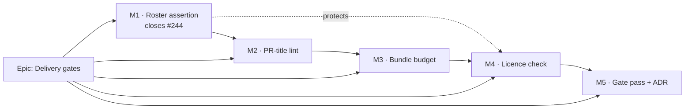

# Implementation Plan: Delivery gates — four rules this repository states in prose and enforces nowhere

- **Feature spec:** [`./feature-spec.md`](./feature-spec.md) — **Accepted** — shipped 2026-09-11 (ADR-0136), taking all four critical questions' written defaults.
- **Status:** **Accepted — shipped 2026-09-11**, M1–M5 landed.
- **Owner:** repo

> **A note on two template fields, so their absence is not an oversight (ADR-0081).** The template
> requires each milestone to name its **entry point** or declare that it ships dark, and to name the
> **flag-on Playwright journey** that drives it. Neither field means what it usually means here:
> nothing in this epic has a screen, and no planner presses anything.
>
> They are therefore answered in kind rather than skipped, and the substitution is deliberate:
>
> - **Entry point** → the **command or CI step a contributor meets**, named exactly.
> - **Journey** → the **red-verified mutation** (ADR-0110 D5). The rule ADR-0081 is really making is
>   that a milestone must be reachable and must be proven by something that runs the real thing. For
>   a gate, the real thing is the gate, and the proof is that a deliberate defect makes it fail.
>   Every assertion below names its mutation, and the **red output is committed** in the milestone's
>   notes so a later reader can see the gate once had something to find.
>
> This matters more than usual here, because this repository has shipped several gates that passed
> for the wrong reason — a `target-size` sweep that could not see a split button's caret, a
> `check:claims` matching one citation form, a census whose glob matched zero files.

## Breakdown

### Epic

**Delivery gates** — turn four documented-but-unenforced delivery rules into computed gates, and
close `docs/TECH_DEBT.md` #244 against its **rule** rather than its current instance. Roadmap theme:
repository maintenance / drift control (ADR-0058, ADR-0120, ADR-0124).

**Sequencing argument, stated once because it is structural rather than preferential:** M1 is the
gate that protects M4 (and every gate added after this epic). Once the two rosters must agree, a
`check:*` script added without a CI step fails loudly — so the epic's own later milestones cannot
repeat the defect its first milestone closes. M2 comes second because CQ-1 must be answered before
it can be built without failing on day one. M3 and M4 each open with a measurement, per ADR-0058.

---

## Milestone 1 — The roster assertion (closes `#244`)

**Outcome:** a `check:*` script that is not run by CI fails CI, naming itself and its two remedies —
and the exemption is read from the single place that already owns it.

**Entry point:** `pnpm check:ci-roster`, run locally by `pnpm prepush` (picked up for free from
`package.json`, `prepush.sh:130-133`) and in CI as a new `quality` step.

**Proof (journey-equivalent):** seven assertions, each verified red against a named mutation
(Feature 1.1 table). Two of them — R6 (a comment cannot satisfy the roster) and R7 (empty population
blocks) — exist specifically because this gate's population is a text file and its subject is
absence.

**Definition of done, quoted from the row it closes:** _"The row closes when something ASSERTS the
two rosters agree, with the advisory exemption carried as a named entry and its reason."_ Adding a
step is explicitly **not** the fix.

---

#### Feature 1.1 — `check:ci-roster`

> **Description:** a root `check:*` gate asserting that `package.json`'s roster and `ci.yml`'s
> roster agree, modulo a derived advisory set and a written exemption file.
> **Complexity:** M
> **Dependencies:** none. This milestone is independently mergeable and is the epic's floor.
> **Risks:**
>
> - _A regex over `ci.yml` matches a comment_ (spec C2 — the defect inside `#244`'s own recommended
>   command) → parse YAML; assertion **R6** verified red against exactly that shape.
> - _The gate restates the advisory list_, recreating the duplication it removes → assertion **R5**
>   forbids any literal `check:` name in the gate source.
> - _Adding a `yaml` dependency_ → argued in spec §4.1 D3; confirm with `pnpm why yaml` that the
>   package already resolves, and record the marginal cost in the PR.
> - _The gate reads as covering all of CI_ → its docblock states the blind spot (spec §4.1 D5).
>
> **Testing requirements:** unit fixtures per assertion; each verified red first; `population`
> routed through `report()` so the empty case blocks.

##### Task 1.1 — Confirm the parser choice and the dependency cost (≈ half a PR, may be folded into 1.2)

- **Description:** establish, by running rather than reasoning, whether `yaml` is already resolved
  and what declaring it costs. Confirm the roster figures the spec asserts from reading.
- **Complexity:** S
- **Dependencies:** none
- **Risks:** _the "already in the lockfile" claim is wrong and this adds real packages_ → that is
  what the task is for; if it is wrong, reconsider the regex-with-comment-stripping alternative and
  record the reversal.
- **Testing:** none (measurement task). Its output is recorded in the PR body.
- **Development steps:**
  1. `pnpm why yaml` and `pnpm ls yaml` — record whether declaring it adds any resolved package.
  2. Re-run `#244`'s own one-liner and record its output verbatim; confirm the spec's E1/E2
     (16 scripts, 15 in CI, `check:reconcile-due` the only absence).
  3. Grep every comment in `ci.yml` for the literal `pnpm check:` and record that the C2 trap is
     latent rather than live — or that it is live, which changes the milestone's urgency.
  4. Record all three in the PR body as evidence (ADR-0076).

##### Task 1.2 — `scripts/ci-roster.json` and the gate

- **Description:** the exemption file (empty `exempt` map, populated `_` explanation, the
  `adr-coverage.json` idiom) and `scripts/check-ci-roster.mjs`.
- **Complexity:** M
- **Dependencies:** Task 1.1
- **Risks:** _an assertion passes for the wrong reason_ → every one is verified red first, and the
  two mutations most likely to be skipped (R6, R7) are the two the register's history says matter.
- **Testing:** `scripts/check-ci-roster.test.mjs` (or fixtures under `scripts/lib/fixtures/`, which
  are already in `.prettierignore` — ADR-0120 records Prettier silently de-indenting a fixture and
  leaving it passing against a broken parser).
- **Development steps:**
  1. Write `scripts/ci-roster.json` with an empty `exempt` map and a `_` key explaining what an
     entry means and what it is not for.
  2. Write the gate: read `package.json` scripts; parse `ci.yml`; parse `ADVISORY_GATES` out of
     `prepush.sh` (reuse `check-advisory-agreement.mjs`'s parsing shape, including its
     comment-stripping and both-quote-styles handling — that code records two live defects it was
     fixed for); read `ci-roster.json`.
  3. Implement R1–R4 as set comparisons; route everything through `report({ name, problems,
population })` — **and never through `warnings`** (spec E16: it returns 2 unconditionally and
     would force the gate advisory).
  4. Implement R5 as a self-scan of the gate's own source for a literal `check:` gate name, with
     comments stripped — the scan-matching-prose trap, in the gate whose subject is scanning.
  5. Verify each of R1–R7 red against its named mutation; commit the red output in the PR body.
  6. Add `check:ci-roster` to root `package.json`.

##### Task 1.3 — Wire it into CI, and close the row

- **Description:** the `ci.yml` step (with the per-step comment the file's convention requires), and
  the register/documentation updates.
- **Complexity:** S
- **Dependencies:** Task 1.2
- **Risks:** _the gate's own arrival breaks it_ — adding `check:ci-roster` to `package.json` without
  a CI step makes the gate fail on itself. **That is correct behaviour and is the best possible
  first red run**; land both in one commit and record the intermediate red.
- **Testing:** the full `pnpm prepush` run; confirm `check:advisory-agreement` still passes
  unchanged.
- **Development steps:**
  1. Add the CI step after `Check the advisory allow-list agrees with the code`, with a comment
     explaining what it guards and why a derived loop was rejected.
  2. Update `docs/TECH_DEBT.md` #244 to **closed**, naming what closed it (the rule, not the step).
  3. Update `docs/TESTING.md` "Before you push" if it enumerates gates.
  4. Changeset: none required — no user-visible change. State that explicitly in the PR.

---

## Milestone 2 — The PR-title check

**Outcome:** the message that lands on `main` is validated against the same commitlint config the
local hook uses, before merge, and the check re-runs when the title is edited.

**Entry point:** the `PR title` check on every pull request. **Blocked on CQ-1.**

**Proof (journey-equivalent):** a committed fixture corpus of titles run through the repository's
own commitlint, including the four cases that decide the design — a valid title, an invalid one,
`chore(deps-dev)` (Dependabot's real output), and `chore(release): version packages` (the release
PR's constant).

**Operator action, named so "shipped" cannot read as "enforced" (spec §4.6):** the check must be
added to branch protection's required status checks, and the repository setting **"Default to PR
title for squash merge commits"** confirmed. Neither is a file in this repository.

---

#### Feature 2.1 — Reconcile the vocabulary

> **Description:** whatever CQ-1 chooses, applied before any workflow exists.
> **Complexity:** S
> **Dependencies:** **CQ-1 answered.**
> **Risks:** _shipping the workflow first_ → the gate goes red on up to ten open Dependabot PRs and
> gets deleted rather than fixed (ADR-0058). This feature exists solely to make that impossible.
> **Testing:** the fixture corpus below, which must be green before Feature 2.2 starts.

##### Task 2.1 — Measure the real corpus, then apply CQ-1

- **Description:** run commitlint over the messages that actually occur before changing anything.
- **Complexity:** S
- **Dependencies:** CQ-1
- **Risks:** _the corpus contains failures nobody predicted_ → better found here than in CI. A
  historic failure on `main` is not a blocker (history is history); an **open PR** or a **generated
  bot title** failing is.
- **Testing:** the corpus run is the test; its output is committed as evidence.
- **Development steps:**
  1. `git log --format=%s origin/main | head -100` piped through `pnpm exec commitlint`; record the
     pass rate. **This also discharges R1** — compare a sample of those subjects against the
     corresponding PR titles and confirm the squash identity the spec could only infer.
  2. List every open PR title (`gh pr list --json title`) and run the same. Any failure here is a
     blocker.
  3. Run the four generated forms Dependabot can emit — `chore(deps)`, `chore(deps-dev)`,
     `ci(deps)`, and a long grouped title near the 100-character `header-max-length` — and record
     which fail. `chore(deps-dev)` is expected to; a length failure is a second finding if it
     appears.
  4. Confirm **R3**: does `scope-enum: [2, 'always', […]]` permit an empty scope? Run `docs: a
thing` through commitlint and record the answer rather than assuming it.
  5. Apply CQ-1's choice. If (a): one line in `commitlint.config.js`, one in `CLAUDE.md` §9, and a
     line in `docs/CONTRIBUTING.md` if it restates the scopes.
  6. Commit the fixture corpus as `commitlint.fixtures.test.*` so the vocabulary cannot silently
     narrow later.

#### Feature 2.2 — The workflow

> **Description:** `.github/workflows/pr-title.yml`.
> **Complexity:** S
> **Dependencies:** Feature 2.1 green.
> **Risks:**
>
> - _Script injection via the title_ (spec R4) → read via `env:`, never `${{ }}` inside `run:`.
> - _`pull_request_target`_ → forbidden; `pull_request` only, `permissions: {}`.
> - _Missing `edited`_ → the check becomes unclearable without a dummy commit (spec E10).
> - _A stale run reads as a real failure_ → the failure message names the title it read.
>
> **Testing:** the workflow is exercised by its own first PR — deliberately opened with a bad title,
> then corrected by **editing the title only**, which is the one behaviour no unit test can reach.

##### Task 2.2 — Add the workflow

- **Complexity:** S
- **Dependencies:** Task 2.1
- **Risks:** as above.
- **Testing:** see Feature 2.2; plus a `permissions` and trigger-type assertion, which can be a
  cheap structural test over the YAML if M1's parser is available (it will be).
- **Development steps:**
  1. `on: pull_request: types: [opened, edited, reopened, synchronize, ready_for_review]`, branches
     `[main]`; `permissions: {}`; a concurrency group keyed on the PR number with
     `cancel-in-progress: true` (a title edited three times should not queue three runs).
  2. Checkout, pnpm, Node, `pnpm install --frozen-lockfile`; then
     `printf '%s' "$PR_TITLE" | pnpm exec commitlint` with `env: PR_TITLE: ${{ github.event.pull_request.title }}`.
  3. On failure, echo the title as read alongside commitlint's own output.
  4. Add a file-header comment in the house style: why it is a separate workflow (E10), why
     `pull_request` and not `pull_request_target`, and the two blind spots (the release PR is never
     checked; the squash dialog is editable after the check passes).
  5. Prove it end to end: open the milestone's own PR with a deliberately bad title, watch it fail,
     fix it **by editing the title alone**, watch it pass. Record both run URLs.
  6. Update `CLAUDE.md` §9 — its parenthetical "(git hook + expected in PR titles)" becomes true for
     the first time and should say what enforces it.
  7. Remove the `docs/BACKLOG.md` row.

---

## Milestone 3 — The bundle budget

**Outcome:** the web app's initial JS payload has a measured number, and growing it past that number
fails CI until someone raises it deliberately.

**Entry point:** a `Check the web bundle budget` step in the `quality` job, after `Build`; locally
`pnpm --filter @repo/web build && pnpm --filter @repo/web check:bundle-size`.

**Proof (journey-equivalent):** the gate is verified red by adding a static `import 'jspdf'` at the
app entry — which must trip **both** the size assertion and the "jsPDF is not in the entry graph"
assertion, and is the exact defect `#48(b)` was filed for.

**This milestone ships its measurement first and its gate second, in that order, in separate
commits.** ADR-0058: a budget set from `docs/FRONTEND_QUALITY.md`'s never-measured 200 kB would fail
on day one.

---

#### Feature 3.1 — Measure, and correct the document

> **Description:** build the app, measure the entry graph, and fix `docs/FRONTEND_QUALITY.md`.
> **Complexity:** S
> **Dependencies:** none technically; sequenced after M1 so the roster gate is already watching.
> **Risks:** _the measurement is taken from a stale `dist/`_ → clean first; _the reporter changes
> the emitted chunks_ → diff `dist/assets/` hashes before and after (spec R5).
> **Testing:** the measurement is the deliverable; the number and the command are committed.

##### Task 3.1 — The reporter and the floor

- **Complexity:** M
- **Dependencies:** none
- **Risks:** _measuring the wrong quantity_ → the reporter distinguishes `chunk.imports` (static)
  from `chunk.dynamicImports` explicitly, and the entry-graph walk is unit-tested against a
  synthetic bundle object before it is pointed at the real one.
- **Testing:** unit tests for the graph walk and the gzip sizing; the real measurement recorded.
- **Development steps:**
  1. Add a `generateBundle` hook in `apps/web/vite.config.ts` (or a small local plugin file) that
     writes a size report **outside `dist/`** — entry chunk, static-import closure, per-chunk sizes,
     each raw and gzipped (`node:zlib`, no dependency).
  2. Confirm R5: `dist/assets/` filenames and sizes are byte-identical with the hook on and off.
  3. `pnpm --filter @repo/web build` from clean; record the entry-graph gzip total, the per-chunk
     table, and whether `jspdf` is in the entry closure (E18 predicts it is not — verify, do not
     assume).
  4. **Correct `docs/FRONTEND_QUALITY.md` §"Bundle size"** with the measured figures, and correct
     the false "Route-based splitting by default" claim in §"Code splitting" (spec C3, E17). If the
     measured entry graph is far over the advisory 200 kB — which E17 makes likely — say so plainly
     and record it as a **finding**, with a `docs/TECH_DEBT.md` row for route-splitting the plan
     workspace. Do not quietly set the budget above it and move on.
  5. Report the measurement to the product owner before writing the gate if the number is large
     enough to change what they want the budget to mean.

#### Feature 3.2 — The gate

> **Description:** `apps/web`'s `check:bundle-size`, `apps/web/bundle-budget.json`, and the CI step.
> **Complexity:** M
> **Dependencies:** Task 3.1's number; **CQ-2** for the headroom.
> **Risks:** _a root `check:*` would fail for everyone_ (spec §4.3 D6) → it lives in `apps/web` and
> is CI-invoked; _which puts it outside M1's roster gate_ → stated in both gates' docblocks.
> **Testing:** red-verified against a static `jspdf` import at the entry.

##### Task 3.2 — Budget file, gate, CI step

- **Complexity:** M
- **Dependencies:** Task 3.1, CQ-2
- **Risks:** _a stale budget entry_ → asserted; _no `dist/`_ → fail loudly, never pass.
- **Testing:**
  - **B1** entry graph over budget → red. _Mutation:_ lower the budget by 1 byte.
  - **B2** `jspdf` in the entry graph → red. _Mutation:_ add `import 'jspdf'` to the app entry.
  - **B3** a per-chunk ceiling breach → red. _Mutation:_ lower one chunk's ceiling.
  - **B4** no `dist/` → red with "build first". _Mutation:_ delete `dist/`.
  - **B5** a budget entry naming a chunk that no longer exists → red.
  - **B6** empty population (no chunks found) → red, via `report({ population })`.
  - **B7** the budget file has an unknown key → red.
- **Development steps:**
  1. Write `apps/web/bundle-budget.json`: the entry-graph budget, the per-chunk ceiling, the
     **measurement date**, the **command** that produced the floor, and the headroom ratio labelled
     as a judgement rather than a measurement. Per CQ-2, a raise carries a one-line reason.
  2. Write `check-bundle-size.mjs` in `apps/web/scripts/`; reuse `report()` from
     `scripts/lib/doc-register.mjs` if it is importable across the workspace boundary — if it is
     not, replicate the **empty-population refusal** explicitly rather than dropping it.
  3. Verify B1–B7 red; commit the red output.
  4. Add the CI step immediately after `Build (api + web)`; comment it in the house style, naming
     what it measures, why gzip, and why it is not a root `check:*`.
  5. Update `docs/TECH_DEBT.md` #48(b) to closed (the `(b)` half only, explicitly); remove the
     `docs/BACKLOG.md` row.

---

## Milestone 4 — The dependency licence check

**Outcome:** every package resolved into the tree carries a licence that has been allowed by name,
or an exemption that says who read it and when.

**Entry point:** `pnpm check:licenses`, run by `pnpm prepush` and by a new CI step — **which M1's
roster gate now requires**, so the CI step cannot be forgotten. That is the epic's sequencing
argument doing its job.

**Proof (journey-equivalent):** a fixture tree containing a `GPL-3.0` package must be **refused** by
the same code path that scans the real one (ADR-0093's pinned positive case). Without it, green
means nothing.

---

#### Feature 4.1 — Measure the real position

> **Description:** find out what is actually in the tree before writing a policy about it.
> **Complexity:** S
> **Dependencies:** **CQ-3** (whole tree vs runtime only) — it decides the population.
> **Risks:** _the measurement finds something genuinely unacceptable in a runtime dependency_ → the
> milestone **stops** and the finding goes to the product owner. It is not absorbed into the
> allow-list to make the gate green.
> **Testing:** the measurement is the deliverable.

##### Task 4.1 — Run it, and read the shape

- **Complexity:** S
- **Dependencies:** CQ-3
- **Risks:** _`pnpm licenses list --json`'s shape is not what the parser expects_ (spec R2) → that
  is what this task establishes.
- **Testing:** none (measurement).
- **Development steps:**
  1. `pnpm licenses list --json` and `pnpm licenses list --json --prod`; record both package counts
     against the spec's E14 figure of 1,112 resolved packages.
  2. Record the **distinct licence identifiers** present, with a count each, and flag every one that
     is not obviously permissive.
  3. Record any package reporting `UNKNOWN` or no licence — these become the first exemptions, each
     needing someone to read the package's repository.
  4. Time the command; if it is slow enough to be felt in `pnpm prepush`, that is a design input
     (and an argument for CI-only, which would then need a `ci-roster.json` exemption with a
     reason — the mechanism M1 built).
  5. Record the exact JSON shape and the pnpm version in the gate's docblock, and add a
     `scripts/dependency-claims.json` entry if any citation is file-and-line (ADR-0076 Class 2).

#### Feature 4.2 — Policy and gate

> **Description:** `scripts/licence-policy.json` and `scripts/check-licenses.mjs`.
> **Complexity:** M
> **Dependencies:** Task 4.1, CQ-3
> **Risks:** _a deny-list fails silently_ → allow-list; _unknown tolerated_ → refused; _a parse
> failure reads as a clean tree_ → shape assertion + empty-population refusal.
> **Testing:** L1–L6 below, each red-verified.

##### Task 4.2 — Write and arm

- **Complexity:** M
- **Dependencies:** Task 4.1
- **Risks:** as above; plus _the allow-list is widened to make the gate green_ → the initial list is
  **derived from Task 4.1's measurement** and every entry that is not obviously permissive gets a
  written reason rather than a silent inclusion.
- **Testing:**
  - **L1** a disallowed licence → red. _Mutation:_ remove `ISC` from the allow-list.
  - **L2** a missing/`UNKNOWN` licence → red. _Mutation:_ a fixture package with no `license` field.
  - **L3** **pinned positive case** — a fixture tree with a `GPL-3.0` package is refused. _Mutation:_
    none needed; this must be red against a permissive-only parser and green against nothing.
  - **L4** a stale exemption (package absent, or now allowed) → red.
  - **L5** unparseable tool output → red naming the tool and version. _Mutation:_ feed the parser
    `{}` and `[]`.
  - **L6** empty population → red, via `report({ population })`.
  - **L7** an unknown key in the policy file → red.
- **Development steps:**
  1. Write `scripts/licence-policy.json`: `allow`, `exempt` (name → reason), and an explanatory `_`.
  2. Write the gate. Handle SPDX `OR` (any disjunct allowed) and `AND` (all required); anything the
     parser cannot resolve is **unknown**, and unknown fails.
  3. Exclude `@repo/*` workspace packages by name, and **assert** the exclusion (they are
     `private: true` and unpublished) rather than assuming it.
  4. Docblock the three blind spots (spec §4.4 D6): manifest-declared licence only, no vendored
     code, no attribution/NOTICE obligations.
  5. Verify L1–L7 red; commit the red output.
  6. Add `check:licenses` to root `package.json` **and** the CI step. **Land both in one commit** —
     M1's gate will refuse the PR otherwise, which is the correct behaviour and worth seeing once.
  7. Confirm `check:advisory-agreement` still passes (the gate must not touch `warnings.push`).
  8. Update `docs/SECURITY_STANDARDS.md` if it should record the supply-chain control; remove the
     `docs/BACKLOG.md` row.

---

## Milestone 5 — Gate pass, ADR, and the register

**Outcome:** the epic's own combined diff has been through the specialist reviews it owes, and the
decisions are recorded where the next person will find them.

**Entry point:** none — this milestone ships no capability. It is the review and the record.

**Proof:** the reviews' findings, folded with regression tests verified red first, in the house
convention.

---

#### Feature 5.1 — Specialist reviews

> **Description:** the agents this epic owes, and — explicitly — the ones it does not.
> **Complexity:** M
> **Dependencies:** M1–M4 landed.
> **Risks:** _the reviews find defects in the gates themselves_ → likely, and the point. This
> repository's last eight epics each had a gate pass find defects a human read had missed, and
> several of those were **in gates**.
> **Testing:** every blocking finding folded with a regression test verified red first.

**Engaged:**

| Agent                    | Why                                                                                                                                                              |
| ------------------------ | ---------------------------------------------------------------------------------------------------------------------------------------------------------------- |
| **devops-reviewer**      | The whole epic is workflows, CI steps and release-adjacent tooling. This is its remit; it is also the review that found the `#244` condition in the first place. |
| **security-reviewer**    | Two real surfaces: the licence allow-list **is** a supply-chain policy, and the PR-title workflow consumes attacker-controlled input (spec R4/§4.2 D4).          |
| **test-engineer**        | Every assertion needs a mutation that turns it red, and this repository's recorded failures are gates that passed for the wrong reason.                          |
| **performance-reviewer** | **M3 only.** Bundle size, code splitting and lazy loading are its stated remit, and Task 3.1 is likely to surface that the app is not route-split (C3/E17).      |

**Not engaged, with reasons — because "not run" must never read as an oversight:**

| Agent                                                                                 | Why not                                                                                                                                                                                                                                               |
| ------------------------------------------------------------------------------------- | ----------------------------------------------------------------------------------------------------------------------------------------------------------------------------------------------------------------------------------------------------- |
| **database-architect**                                                                | **There is no schema change** — no model, column, index, constraint or migration; `apps/api/prisma/` is untouched. Confirmed against the change set, not judged too small. CLAUDE.md §19.3 is unconditional _for a schema change_, and this has none. |
| **api-reviewer**                                                                      | No endpoint, DTO, status code, envelope or OpenAPI change.                                                                                                                                                                                            |
| **backend-performance-reviewer**                                                      | No query, transaction, index or cache. `apps/api` is untouched.                                                                                                                                                                                       |
| **ui-architect**, **ux-reviewer**, **component-reviewer**, **accessibility-reviewer** | No component, primitive, screen, route or accessible name. M3's _subject_ is the UI bundle, but the diff contains no UI — a build hook and a JSON file.                                                                                               |

##### Task 5.1 — Run the reviews and fold the findings

- **Complexity:** M
- **Dependencies:** M1–M4
- **Risks:** _findings deferred rather than folded_ → anything not folded gets a `docs/TECH_DEBT.md`
  row with a number and a reason, never a note.
- **Testing:** a regression test per blocking finding, each verified red against the old code.
- **Development steps:**
  1. Run the four engaged reviewers over the combined diff.
  2. Fold every blocking finding with a red-verified regression test.
  3. File the non-blocking findings as one numbered `docs/TECH_DEBT.md` row.

##### Task 5.2 — The ADR and the register

- **Complexity:** S
- **Dependencies:** Task 5.1
- **Risks:** _the ADR is never filed_ — ADR-0071 was cited by shipped code for a whole epic without
  being filed → file it in the same change that closes the milestone; _the number is taken_ →
  ADR-0079's lesson: record the collision and take the next, do not route around it.
- **Testing:** `pnpm check:adr-coverage`, `pnpm check:doc-links`, `pnpm check:spec-status`,
  `pnpm check:counts`.
- **Development steps:**
  1. Write the ADR from spec §4.9's outline. **Claim the number at filing time** — `docs/adr/` runs
     to 0133 today, so 0134 is next unless something landed in between.
  2. Add it to `docs/adr/README.md`, and to **`CLAUDE.md` §16's register** — noting that
     `check:adr-coverage` gates the README and ROADMAP and **cannot see CLAUDE.md**, which is how
     ADR-0132 came to be missing from it (spec C6). File that as its own row.
  3. Exempt the ADR in `scripts/adr-coverage.json` (process/tooling class) rather than inventing a
     roadmap entry, with the standard reason string.
  4. Move **both** this plan's and the spec's `**Status:**` headers to
     `Accepted — shipped (ADR-NNNN)` (ADR-0131 — closing a feature includes writing its header).
  5. Update `CLAUDE.md` §20's agent list if the epic changed what any agent is for. It did not, but
     check rather than assume.

---

## Sequencing & slices

| Order | Milestone | Independently mergeable? | Independently valuable?                                                | Blocked on                    |
| ----- | --------- | ------------------------ | ---------------------------------------------------------------------- | ----------------------------- |
| 1     | **M1**    | Yes                      | Yes — closes the only row with a live, dated, twice-recurred condition | Nothing                       |
| 2     | **M2**    | Yes                      | Yes — highest value of the four (see below)                            | **CQ-1**                      |
| 3     | **M3**    | Yes                      | Yes                                                                    | **CQ-2**; its own measurement |
| 4     | **M4**    | Yes                      | Yes                                                                    | **CQ-3**; its own measurement |
| 5     | **M5**    | Yes                      | Record only                                                            | M1–M4                         |

**`main` stays releasable throughout** — every milestone adds a gate and changes no product code.
The one exception is M3's build hook in `apps/web/vite.config.ts`, which R5 requires to be proven to
change no emitted chunk before it lands.

**On the brief's own reading, tested rather than accepted.** The brief proposed that item 4 is the
smallest and item 1 the highest value. Both survive, with one correction that changes the order:

- **Item 1 (PR title) is the highest value** — confirmed, and for a sharper reason than the brief
  gave. It is not merely that PR titles are unchecked; it is that **the squash-merge model makes the
  PR title the only message that ever reaches `main`**, so the hook validates exactly the messages
  the squash throws away. The value is not belt-and-braces; the braces are the only thing holding
  anything up.
- **Item 1 is nonetheless not first**, because it is the only one of the four that would **fail on
  day one** if armed as-is (spec C1: `chore(deps-dev)` is not in `scope-enum`). ADR-0058 says such a
  gate gets deleted rather than fixed. Its prerequisite is a one-line vocabulary decision, but it is
  a decision, and it belongs to the product owner.
- **Item 4 (roster) is the smallest** — confirmed, though its correctness argument is subtler than
  its size suggests (single-source advisory set; comments must not count). It goes first not only
  because it is cheapest but because **it is the gate that protects M4**, and a gate built after the
  things it guards is a gate that has already missed its chance.

---

## Definition of Done (per task)

Each task's PR satisfies the Feature Completion Criteria in [`docs/PROCESS.md`](../../PROCESS.md).
Three of them need saying explicitly for this epic:

- **"Tests completed"** means **every assertion has been made to fail by the defect it names**
  (ADR-0110 D5), and the red output is in the PR body. A gate that has only ever been seen green has
  not been tested.
- **"CI passes"** is the second opinion, never the first: `pnpm prepush` locally before every push.
  The e2e half of the gate is not required — this epic touches neither `apps/api` nor any Playwright
  suite — and saying so is part of the criterion, not a way around it.
- **"Changelog updated"**: **no changeset is required** for any milestone. Nothing here is
  user-visible; no published package changes behaviour. State that in each PR rather than leaving
  the box unticked and ambiguous.

---

## Risks & assumptions (rollup)

| Risk / assumption                                                                                      | Likelihood | Impact | Mitigation                                                                                                                                      |
| ------------------------------------------------------------------------------------------------------ | ---------- | ------ | ----------------------------------------------------------------------------------------------------------------------------------------------- |
| **A PR-title gate armed before CQ-1 fails on every Dependabot dev PR** and gets bypassed or deleted    | **high**   | high   | Feature 2.1 is a prerequisite feature, not a task step; its fixture corpus must be green before 2.2 begins                                      |
| The bundle floor is taken from `FRONTEND_QUALITY.md`'s never-measured 200 kB                           | med        | high   | M3 ships measurement and gate as separate commits; the document is corrected in the same change (spec C3)                                       |
| **The measured entry graph is far over the advisory budget**, because the app is not route-split (E17) | **high**   | med    | Treated as a **finding reported to the product owner**, not a number to set the budget above quietly; a route-splitting debt row is filed       |
| A licence gate whose allow-list is widened to make it green                                            | med        | high   | M4-T1 measures first; a genuinely unacceptable runtime licence **stops the milestone** and goes to the product owner                            |
| A gate passes for the wrong reason (empty population, comment match, wrong element)                    | med        | high   | `report({ population })` throughout; R6/L3 are pinned positive cases; every assertion red-verified. This repository has four recorded instances |
| A new gate uses `report()`'s `warnings` channel and breaks `check:advisory-agreement`                  | med        | med    | Stated as a build constraint in each gate's docblock and in the spec's error table (E16)                                                        |
| `yaml` turns out to be a real new dependency rather than an already-resolved one                       | low        | low    | Task 1.1 measures it; the regex alternative is recorded with its cost (spec §4.1 D3)                                                            |
| `pnpm licenses list --json` shape differs from the parser's expectation, or changes on a bump          | med        | med    | Task 4.1 reads the shape first; L5 asserts it; the pnpm version is recorded in the docblock                                                     |
| The check ships but is never **required** in branch protection, so it is advisory by configuration     | **high**   | high   | Named as an explicit operator action (spec §4.6), not buried in a task step. "Shipped" is not "enforced" — CLAUDE.md §17's staff-console lesson |
| A maintainer edits the message in the squash dialog after the check passed                             | low        | med    | **Unmitigable by code.** Stated blind spot; the repository setting "Default to PR title for squash merge commits" is the only lever             |
| **R1 is wrong** and `main`'s subjects are not PR titles                                                | low        | med    | Task 2.1 step 1 discharges it by comparing `main`'s subjects against the corresponding PR titles                                                |
| M1's roster gate reads as covering all of CI                                                           | med        | med    | Its docblock states the population is `pnpm check:*` and nothing else (spec §4.1 D5)                                                            |
