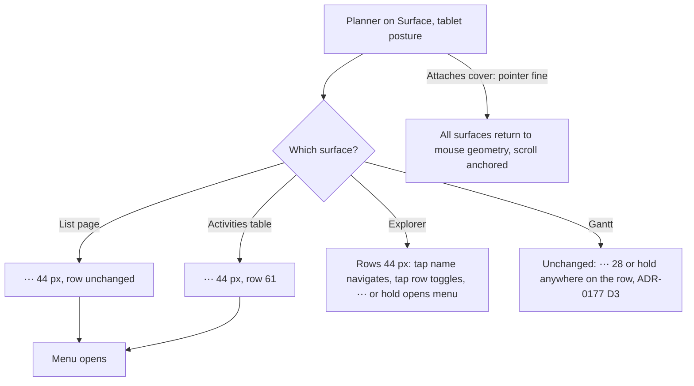

# Feature Spec: Dense-row touch targets (`docs/TECH_DEBT.md` #215)

- **Status:** Draft — awaiting approval before implementation.
- **Author(s):** feature-analyst (Claude Code), for James Ewbank
- **Date:** 2026-10-08
- **Tracking issue / epic:** `docs/TECH_DEBT.md` #215
- **Roadmap link:** none. This is a register row that crosses ADR-0105 triggers (see §3).
- **Related ADR(s):** ADR-0118 (D1, D2, D7, D8), ADR-0151, ADR-0165, ADR-0177 (D1, D4), ADR-0179,
  ADR-0088 D1, ADR-0105, ADR-0111, ADR-0113. **A new ADR is owed** (outline in §4.7).

## 1. Business understanding

### Problem

On a touch screen the house rule is that anything you press is at least 44 px (ADR-0118 D1). Small
`⋯` menu buttons in lists stay 28 px under a finger. #215 says this is because those rows have a
fixed height set in JavaScript. **I re-read the code, and that is true for only some of them.**

**Recount (2026-10-08, against the tree, not the row).** `size="icon-sm"` appears at exactly five
call sites:

| Call site                                         | What it renders on                                                                                                                                      | Row height, and who sets it                                                                                                                                                                    |
| ------------------------------------------------- | ------------------------------------------------------------------------------------------------------------------------------------------------------- | ---------------------------------------------------------------------------------------------------------------------------------------------------------------------------------------------- |
| `HierarchyTree.tsx:607`                           | Project Explorer tree                                                                                                                                   | **28, a JS constant** (`:28`), fed to `estimateSize` (`:227`) and the row style (`:59`)                                                                                                        |
| `GanttRowMenu.tsx:162`                            | Gantt rows                                                                                                                                              | **28, a JS constant** (`GanttPanel.tsx:113`), fed to `estimateSize` (`:670`) and the row style (`:1524`, `:2014`)                                                                              |
| `explorer-column.tsx:81`                          | Collapsed Explorer spine                                                                                                                                | **width** 34, a JS constant (`:24`)                                                                                                                                                            |
| `ActivitiesTable.tsx:245`                         | Activities table                                                                                                                                        | **Content-sized and measured.** `data-table-windowed-body.tsx:190-193` measures every row. A row with a `⋯` is 45 px (28 + `py-2` + 1 px rule). It is 45 under both pointers.                  |
| `row-actions-menu.tsx:86` (shared `RowActionsMenu`) | **Six tables:** Clients, Projects, Plans, Resources, organisation Calendars (via `CalendarRowMenu`) and project calendars (`ProjectCalendarsSection.tsx:201`) | **Content-sized.** Each `⋯` sits beside a `size="sm"` primary button. Under a coarse pointer `--control-h-sm` is 44 (`globals.css:1184`), so these rows are already about 61 px tall on touch. |

Four claims in the existing record are wrong:

1. **`CalendarRowMenu` does not pass `icon-sm`.** `RowActionsMenu` does. One call site serves six
   tables, not one (`button.tsx:87-88`, #215).
2. **"Their containers are sized independently of them" is true for three of the five.** The tree,
   the Gantt and the spine have fixed sizes. The tables do not. M3's revert was correct for the
   tree. It also took the touch size away from seven tables that had room for it.
3. **"The first JS-side pointer read in the product" is no longer true.** `viewport-notice.tsx:200`
   reads `useMediaQuery('(pointer: coarse)')`. That hook listens for changes
   (`use-media-query.ts:15-22`), so a Surface keyboard fold is already handled.
4. **"Five of its six consumers"** (`control-height.structural.test.ts:59`). #278 removed the sixth
   (the `Sheet` default, `sheet.tsx:120-134`). All five are call sites now.

The coarse sweep also misses the tables. `COARSE_SURFACES` covers the deck, the plan header, the
Explorer and the Gantt grid (`e2e-workspace-fit/command-surface.spec.ts:1074-1106`). It does not
cover the activities table or any list page. So seven tables carry a 28 px target under touch, and
no exception and no gate records it.

### Users

All signed-in roles on a coarse-pointer device: Org Admin, Planner, Contributor and Viewer. The
`⋯` only appears where the role already has actions, and this work does not change that. External
Guests see none of these surfaces. The main user is the product owner's Surface in tablet posture
(1912 × 1104, DPR 1.5, `pointer: coarse`; `docs/specs/gantt-coarse-pointer/device-results.md:15-16`).
Mouse users must see no change.

### Primary use cases

1. Open a row's actions in a list page or the activities table with a finger, at 44 px.
2. Use the Project Explorer tree by finger: open a node, expand it, open its `⋯`.
3. Reopen the collapsed Explorer from its spine by finger.

### Expected outcomes (plain English)

- **On a mouse: nothing changes.** Every change is behind `pointer: coarse`.
- **On a finger, in the list pages** (Clients, Projects, Plans, Resources, Calendars): the `⋯`
  becomes the same 44 px as the `Edit` button next to it. Rows do not get taller, because they are
  already 61 px on touch.
- **On a finger, in the activities table:** the `⋯` becomes 44 px. Rows with one grow from 45 to
  61 px, so about a quarter fewer rows fit in the same panel (CQ-2 offers a free alternative).
- **On a finger, in the Explorer tree:** rows grow from 28 to 44 px. That is about a third fewer
  rows on screen, and every row, its name and its `⋯` become a full-size target. ADR-0118's own
  Consequences planned this ("its tree rows are taller on touch", `0118:253-256`). M3 had to revert
  it.
- **The Gantt stays at 28 px rows** (recommended, CQ-1). On your Surface the 28 px `⋯` and the 24 px
  arrow scored 0 misses out of 10 in both postures (`device-results.md:34`, `:76`). The Gantt is
  the surface read all day, and 44 px rows would hide about 10 of 28 rows.
- **With the keyboard cover attached** the Surface reports `pointer: fine` (ADR-0118 D7). None of
  this applies in that posture (CQ-3).

### Success criteria

- At 1912 × 948 under a fine pointer, every affected surface is byte-identical in geometry before
  and after. M0 and the closing reading compare them.
- Under a coarse pointer every `⋯` in the tables and the tree measures ≥ 44 × 44. Its box sits
  inside its own row's box. It is swept, not exempted.
- The tree keeps focus and its scroll position when the pointer changes (cover folded or unfolded).
- ADR-0118 D1's coarse exception list loses the `icon-sm` dense-row entry, except the Gantt's `⋯`,
  which ADR-0177 D4 already lists.

### Open questions

Critical questions are in §6. Defaults for the rest:

- The variant is named `icon-row` (default). The name is cosmetic.
- The spine's coarse width comes from what it contains, measured at M0. It is not picked now.

## 2. Functional requirements

> **US-1** — As a planner on a touch screen, I want the `⋯` on any list row to be 44 px, so that I
> can open its actions without aiming.
>
> - **Given** `pointer: coarse` **when** a list page or the activities table renders **then** each
>   `⋯` is ≥ 44 × 44 and lies inside its row's box.
> - **Given** `pointer: fine` **then** each `⋯` is 28 × 28, and row heights match today's to the
>   pixel.

> **US-2** — As a planner on a touch screen, I want the Explorer tree's rows to be 44 px, so that
> navigating, expanding and opening a node's actions are all full-size targets.
>
> - **Given** `pointer: coarse` **then** every tree row is 44 px. The virtualizer's sizes, total
>   height and each row's offset all use 44.
> - **Given** the pointer changes while the tree is scrolled **then** the first visible row stays
>   first visible, and the focused tree item stays mounted and focused (WCAG 2.4.3).
> - Long-press and Menu/Shift+F10 still open the node menu (unchanged).

> **US-3** — As a planner on a touch screen, I want the collapsed Explorer's spine to hold 44 px
> controls without clipping them.
>
> - **Given** `pointer: coarse` and a collapsed Explorer **then** "Show Project Explorer" and the six
>   destination icons are ≥ 44 × 44, fully inside the spine, with no horizontal scroll.

### Edge cases

- **A posture change mid-scroll or mid-menu.** If the tree's row menu is open, it stays open. It is
  anchored at a point, and `rangeExtractor` keeps the menu's row mounted (`HierarchyTree.tsx:209`).
  The scroll position is re-anchored on the first visible row (§4.3).
- **The tree's loading, empty and error rows** use the same `rowStyle`, so they grow too.
- **A Viewer** sees no tree `⋯` (`showActions = crud.canWrite`, `HierarchyTree.tsx:484`). Rows
  still grow, because the row itself is a target.
- **The activities table with no actions column** (`ActivitiesTable.tsx:962`): no `⋯`, so rows
  stay at 37 px.
- **The spine may already overflow under a fine pointer.** This is derived from the classes and has
  not been measured. Collapsed destination links are `size-9` (36 px, `org-destinations.tsx:57`)
  inside `p-1` in a 34 px spine with a 1 px border, which leaves 25 px of content. M0 measures it.
  If it is real, it is a fine-pointer defect fixed in M3 and recorded as such.

### Permissions

No change. This is presentation only. No write path, no RBAC change and no pen involvement: none of
these is a structural plan write (ADR-0028).

### Validation rules / error scenarios

None. No input and no request is added.

## 3. Technical analysis

| Area           | Impact | Notes                                                                                                                                                   |
| -------------- | ------ | ------------------------------------------------------------------------------------------------------------------------------------------------------- |
| Frontend       | med    | `Button` gains a size variant; `RowActionsMenu`, `ActivitiesTable`, `HierarchyTree` and `explorer-column` change; one small hook                         |
| Backend / API  | none   | —                                                                                                                                                       |
| Database       | none   | No schema, so database-architect is not engaged. Stated so the omission is not read as a skip.                                                         |
| Security       | none   | No new input or endpoint                                                                                                                                |
| Performance    | low    | The tree renders fewer rows on coarse (taller rows), and one `matchMedia` listener is added. The Gantt is untouched.                                    |
| Infrastructure | low    | `command-surface.spec.ts` coarse projection gains surfaces and loses an exemption                                                                       |
| Testing        | med    | Virtualisation maths, a containment assertion and the coarse sweep                                                                                      |
| Engine         | none   | `computeSchedule` is not imported. No scheduling input changes, so the recalc parity gate holds trivially. It is byte-identical because nothing reaches it. |

**ADR-0105 triggers crossed** (so this spec is mandatory, whatever the size):

- a component's public contract: a new `Button` size;
- a shared gate: the coarse sweep's surfaces and `EXEMPT_WITHIN`, and `control-height.structural.test.ts`'s exceptions.

It adds no entry point, no Playwright config, no CI step and no schema change.

**Flag: none** (ADR-0088 D1). Rollback is the commit boundary. Each milestone below is one revertable
commit.

### Dependencies

- `minimum-viewport` M4 has landed: its `m4-measurement.md` exists. At 1024 × 600 coarse the
  Explorer column scrolls as a whole, so the tree shows about 0 rows without scrolling either way
  (§4.5).
- #215 does not depend on any other open row.

## 4. Solution design

### 4.1 The decision: grow, or enlarge only the hit area?

**A 44 px hit area cannot fit in a 28 px row without taking space from the rows around it.**
44 − 28 = 16 px has to go somewhere, 8 px above and 8 px below. The tree's rows are absolutely
positioned with `transform` (`HierarchyTree.tsx:53-62`), so each row is its own stacking context.
They paint, and are hit-tested, in DOM order. That means:

- the 8 px reaching **down** sits under the next row and receives nothing;
- the 8 px reaching **up** sits over the previous row and takes taps meant for it (its right-hand
  end opens the wrong node's menu).

So in a 28 px row the honest choices are to **grow the row** or to **keep a named exception**.
"Small button, big hit area" works only where the row is already ≥ 44 px. That is true of every
table here and of neither fixed-row surface.

**Decision per surface:**

| Surface                     | Decision                                                                         | Why                                                                                                                                    |
| --------------------------- | -------------------------------------------------------------------------------- | -------------------------------------------------------------------------------------------------------------------------------------- |
| Six `RowActionsMenu` tables | `⋯` grows to 44 on coarse                                                         | The row is already 61 px on touch, so this costs 0 rows                                                                                |
| Activities table            | `⋯` grows to 44 on coarse (CQ-2: or a 44 px hit box at 0 rows)                    | One mechanism, and the sweep measures it directly                                                                                      |
| Explorer tree               | Rows grow to 44 on coarse, and the `⋯` grows with them                            | The row is the navigation target too. ADR-0118 planned this. Long-press covers only the menu.                                          |
| Explorer spine              | Width follows its content on coarse (CSS only)                                    | Not virtualised, so no JS is needed                                                                                                    |
| Gantt                       | **Unchanged**, and ADR-0177 D4's exceptions stand (CQ-1)                          | 0/10 misses on the device. Costs 36 % of rows on the all-day surface. Its row geometry also carries the bar, cells, ruler and links.   |

### 4.2 Rows visible per screen

**Derived, not measured.** The container cannot run a browser here. M0 replaces every figure below
with a reading (ADR-0113). Row counts are ⌊H / h⌋. Whatever the height H, going from 28 to 44 shows
36 % fewer rows (1 − 28/44), and going from 45 to 61 shows 26 % fewer.

| Surface (coarse)                 | 1912 × 1104 (Surface, tablet)                                         | 1024 × 600 (floor)                                                                                  |
| -------------------------------- | --------------------------------------------------------------------- | --------------------------------------------------------------------------------------------------- |
| List tables (`RowActionsMenu`)   | unchanged (rows already ~61)                                          | unchanged                                                                                           |
| Activities table (h 45 → 61)     | per 300 px of panel: **6 → 4**                                         | **0 → 0**: the panel shows no rows at the floor today (`m4-measurement.md:75-78`)                   |
| Explorer tree (28 → 44)          | H ≈ 549¹ → **19 → 12**                                                 | H ≈ 0 (`m0-measurement.md:113`, plus M4's header gain): **0 → 0** without scrolling. The column scrolls, 16 px more per row. |
| Gantt _if grown_ (28 → 44)       | H ≈ 808² → **28 → 18**                                                 | H ≈ 200² → **7 → 4**                                                                                |
| Any surface, **fine pointer**    | **0 change**                                                          | **0 change**                                                                                        |

¹ The Explorer is grid row 3, under the full-width command band (`app-shell.tsx:132`, `:179`).
On a plan page: 1104 − band (44 header + 124 for a two-line coarse deck, ADR-0118 + ~19) ≈ 917.
Then minus the Explorer header 44, destinations 291 and footer 33 (`m0-measurement.md:117-119`)
≈ 549. On non-plan pages there is no deck, so H is larger.
² The 1912 × 948 coarse canvas is 686 (`m4-measurement.md:26`), so chrome is about 262 and the
section at 1104 is about 842, minus the 34 px ruler (`GanttRuler.tsx:6`). At 1024 × 600 the canvas
is 234 (`m4-measurement.md:21`). This assumes the Gantt fills the diagram's section, which M0
checks.

### 4.3 Architecture

```mermaid
flowchart LR
  MQ["@media (pointer: coarse)<br/>globals.css:1175 (tokens)"] --> BTN["Button size icon-row<br/>size-7 · pointer-coarse:size-(--control-h)"]
  BTN --> RAM[RowActionsMenu ×6 tables]
  BTN --> AT[ActivitiesTable ⋯]
  BTN --> HT[HierarchyTree ⋯]
  UMQ["useCoarsePointer()<br/>wraps useMediaQuery(COARSE_POINTER_QUERY)"] --> RH["treeRowHeight(coarse)<br/>28 | 44"]
  RH --> V[useVirtualizer estimateSize + measure()]
  RH --> RS[rowStyle height]
  SP["explorer-column spine<br/>pointer-coarse: width"] --- MQ
  G[GanttPanel GANTT_ROW_HEIGHT 28] -. unchanged, ADR-0177 D4 .- G
```

- **`icon-row`** is a new `Button` size: `size-7 pointer-coarse:size-(--control-h)`. Its name states
  the contract: _for a row that grows with it_. `icon-sm` stays as the fixed-container variant. After
  this work its only caller is `GanttRowMenu`, so its exception narrows to one entry. The variant
  passes `control-height.structural.test.ts` as written: the literal is paired with a coarse token
  read (`:46-49`).
- **`useCoarsePointer()`** is `useMediaQuery(COARSE_POINTER_QUERY, false)`, with the query string
  exported once. `viewport-notice.tsx:200` moves onto it, so the product has one JS spelling of the
  axis. It keys on `pointer`, not `any-pointer` (ADR-0118 D7, CQ-3). It is a **geometry** remedy, so
  ADR-0177 D1 allows the media query.
- **The tree's row height** becomes `treeRowHeight(coarse)`. 44 is pinned to `--control-h` under
  coarse by a structural test, in the same way `row-rhythm.structural.test.ts` pins the Gantt.

### 4.4 Data flow: a posture change in the tree

```mermaid
sequenceDiagram
  participant OS as Surface (cover folded)
  participant MQL as matchMedia listener
  participant T as HierarchyTree
  participant V as virtualizer
  OS->>MQL: pointer fine → coarse
  MQL->>T: coarse = true (re-render)
  T->>T: anchor = first visible index k, intra-row offset d (old h)
  T->>V: estimateSize → 44; virtualizer.measure()
  T->>V: scrollToOffset(k·44 + d·44/28)
  V-->>T: new range (focused / selected / menu rows still pinned)
```

`virtualizer.measure()` is required. TanStack caches item sizes, so changing what `estimateSize`
returns does nothing to rows it has already measured. A test that mocks `useVirtualizer` with a
literal 28 (`HierarchyTree.test.tsx:24-30`, `.crud.test.tsx:16-22`) cannot see this. That is why
§5 tests the options passed to the hook, not the mock's output.

### 4.5 User flow



### 4.6 Component changes

- `components/ui/button.tsx`: add `icon-row`, and rewrite `icon-sm`'s docblock (its count and
  consumer list are wrong, §1).
- `components/ui/row-actions-menu.tsx:86`: `icon-sm` becomes `icon-row`.
- `features/activities/components/ActivitiesTable.tsx:245`: `icon-sm` becomes `icon-row` (or the
  CQ-2 alternative).
- `features/navigator/components/HierarchyTree.tsx`: row height from the hook, `measure()` and
  re-anchoring, and the `⋯` becomes `icon-row`. The arbitrary `[@media(pointer:coarse)]:opacity-100`
  (`:625`) becomes `pointer-coarse:opacity-100`, closing the "a search cannot find it" note
  (ADR-0118 `:248-249`).
- `components/layout/navigator/explorer-column.tsx`: the spine's width becomes CSS
  (`w-[34px] pointer-coarse:w-[Npx]`, N from M0). The `icon-sm` becomes `icon-row`. If M0 confirms
  the fine-pointer overflow, the fine width is corrected too.
- `components/ui/use-coarse-pointer.ts` (new, a few lines) and `viewport-notice.tsx` moved onto it.
- No change to `GanttPanel`, `GanttRowMenu` or `row-rhythm.structural.test.ts`.

### 4.7 ADR owed: outline of ADR-0180, "A row grows with the finger it holds, and the Gantt is the named exception"

- **Context:** #215's diagnosis held for three of five call sites. A 44 px hit area cannot fit in a
  28 px row (§4.1 geometry). The device evidence for the Gantt.
- **D1:** A target in a row that **grows** uses `icon-row`. A target in a **fixed** container uses
  `icon-sm` and must appear on ADR-0118 D1's list with its equivalent.
- **D2:** The JS side of the input axis is `useCoarsePointer()` and nothing else (one query
  constant), used only where a number is needed before layout. It is `pointer`, not `any-pointer`
  (keeps ADR-0118 D7).
- **D3:** Tree rows are 44 under coarse, with the re-anchoring contract in §4.4.
- **D4:** The Gantt keeps 28 under both pointers. The evidence is the device results. It is
  revisited if a device reading shows misses, or if the product owner asks.
- **D5:** The coarse sweep covers every surface carrying `icon-row`, and adds a containment
  assertion for row-menu triggers. This is the narrow form of ADR-0118 D8's missing instrument,
  scoped to one selector so its false-positive surface stays small.
- **Amends:** ADR-0118 (D1's list, D8), ADR-0177 D4 (unchanged entries, now cited from here).

### 4.8 Alternatives considered

- **44 px dense rows for everyone.** This costs the mouse-only monitor 36 % of tree and Gantt rows
  for no gain. Rejected because mouse density must stay.
- **A 44 px hit area (pseudo-element or negative margin) on a 28 px visual in the tree and the
  Gantt.** This is geometrically impossible without stealing taps from the row above (§4.1).
  Rejected.
- **The same hit-box technique in the activities table**, where the 45 px row has room. This is
  viable at 0 rows of cost: a 44 px box with `-my-2` and a left-only extension into the previous
  cell's `pr-4`. Offered as CQ-2. It is not the default, because it is a per-site negative-margin
  construction and its right edge sits at the scroller's edge.
- **`any-pointer: coarse`.** This gives the Surface 44 px with the cover attached. It also gives it
  to any touchscreen laptop driven by mouse. CQ-3.
- **Grow the Gantt too.** CQ-1.
- **Keep everything as an exception.** That leaves seven tables below the house rule with no
  equivalent and no gate, which is the defect.

## 5. Testing (summary; per-task detail in the plan)

- **Unit, the virtualisation maths (the tree):** `treeRowHeight(false) = 28`, `treeRowHeight(true)
  = 44`. The mock captures `useVirtualizer`'s options and asserts `estimateSize(i)` follows the
  stubbed `matchMedia`. The row style's `height` and `translateY(start)` agree with it. On a
  `change` event, `measure()` is called once and `scrollToOffset` receives `k·44 + d·44/28` for a
  stubbed offset (with worked numbers: offset 300 at 28 px is `k = 10`, `d = 20`, so the new offset
  is 440 + 31.43). The focused row stays in the rendered indexes, and `document.activeElement` is
  unchanged.
- **Structural:** coarse 44 = `--control-h` under `@media (pointer: coarse)` × 16 (the
  `row-rhythm.structural.test.ts` shape). `icon-sm` has exactly one call site, so the exception
  cannot quietly regrow. `COARSE_POINTER_QUERY` is the only `(pointer: coarse)` string in `src/**`
  outside tests and CSS.
- **e2e (`e2e-workspace-fit` coarse projection, driven against the real product):** add the
  activities table and the Clients list as swept surfaces. Remove `[role="tree"]` from
  `EXEMPT_WITHIN`. Add a containment assertion: every `[aria-haspopup="menu"]` trigger inside a row
  has its box inside the row's box. It must be planted red first (ADR-0110), by reverting the tree
  to 28 px rows with an `icon-row` button. Add a fine-pointer equality check at 1912 × 948: row
  heights in the tree, activities table and Clients list equal the M0 baseline.
- **Device:** a short new sheet for the product owner (plan M4). The Gantt sheet's steps do not
  change unless CQ-1 is answered "grow" (§6).

## 6. Critical questions

1. **CQ-1: Do Gantt rows stay 28 px on touch?** _Recommended: yes._ On your Surface they scored
   0/10 misses for `⋯` and the arrow in both postures. Growing them hides about 10 of 28 rows on the
   view you read all day, and reopens ADR-0177's bar, cell and link geometry. If you say "grow",
   this becomes an L-sized second epic. `device-checklist.md` items 6, 7, 8 and 12 change in that
   PR: the targets move, and the sort headers and arrow would no longer be exceptions.
2. **CQ-2: Activities table: should the `⋯` grow (rows 45 → 61 on touch, about a quarter fewer
   rows), or keep its look with a 44 px hit box at no row cost?** _Recommended: grow._ It is one
   mechanism, the sweep measures what you see, and it matches the list pages. Choose the hit box if
   table density on the Surface matters more to you.
3. **CQ-3: With the keyboard cover attached, your Surface reports `pointer: fine`, so none of this
   applies in that posture. Keep that (ADR-0118 D7), or key on `any-pointer: coarse`?**
   _Recommended: keep `pointer`._ `any-pointer` would also change the 36 px deck, so it becomes a
   product-wide decision rather than a #215 one. It would also enlarge targets on your mouse
   monitor if that monitor is attached to the Surface. If it is a separate mouse-only computer,
   `any-pointer` would not affect it, and only the first reason applies.

## 7. Links

- Implementation plan: [`implementation-plan.md`](implementation-plan.md)
- Docs updated by this change: `docs/TECH_DEBT.md` #215, ADR-0118, new ADR-0180, `CLAUDE.md` §16
  (one line), `docs/UX_STANDARDS.md` and `docs/DESIGN_SYSTEM.md` (the exception list),
  `docs/COMPONENT_LIBRARY.md` (`icon-row`), `docs/specs/gantt-coarse-pointer/device-checklist.md`
  (a dated note: #215 decided the Gantt's targets are unchanged)
