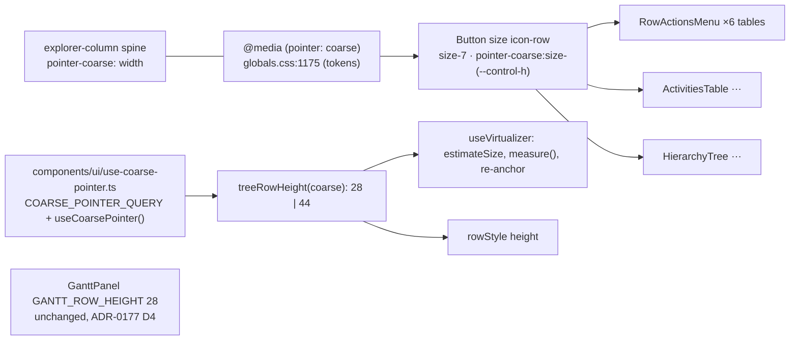
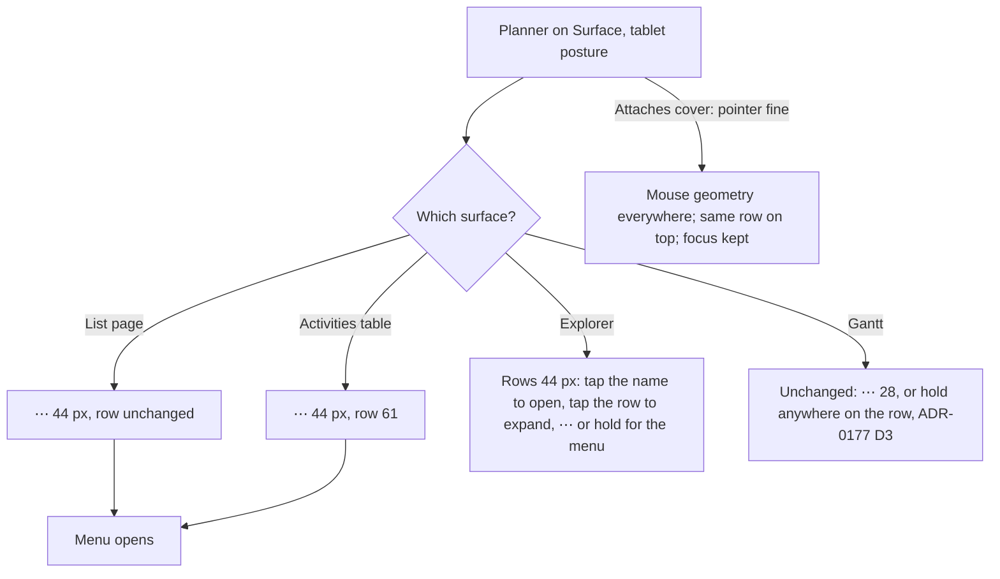

# Feature Spec: Dense-row touch targets (`docs/TECH_DEBT.md` #215)

- **Status:** Approved 2026-10-08 by the product owner, recommendations accepted: CQ-1 the Gantt stays 28 px; CQ-2 the activities table's menu button grows to 44 px on touch; CQ-3 `pointer` (not `any-pointer`) stays the gate, the cover-attached finger gap is recorded.
- **Author(s):** feature-analyst (Claude Code), for James Ewbank
- **Date:** 2026-10-08. Revised the same day after the UX, component and accessibility reviews
  (all "agree with changes"; their blocking findings are folded in below).
- **Tracking issue / epic:** `docs/TECH_DEBT.md` #215
- **Roadmap link:** none. This is a register row that crosses ADR-0105 triggers (see §3).
- **Related ADR(s):** ADR-0118 (D1, D2, D7, D8), ADR-0151, ADR-0165, ADR-0177 (D1, D4), ADR-0179,
  ADR-0088 D1, ADR-0105, ADR-0110, ADR-0111, ADR-0113. **A new ADR is owed: ADR-0183** (outline
  in §4.8).

## 1. Business understanding

### Problem

On a touch screen the house rule is that anything you press is at least 44 px (ADR-0118 D1). Small
`⋯` menu buttons in lists stay 28 px under a finger. #215 says this is because those rows have a
fixed height set in JavaScript. **I re-read the code, and that is true for only some of them.**

**WCAG and the house rule are different bars.** 28 px already passes WCAG 2.2 §2.5.8 Target Size
(Minimum), level AA, whose floor is 24 px. The 44 px figure is the house rule (§2.5.5 Enhanced,
level AAA). Every exception below is an exception to the **house rule**, never to AA.

**Recount (2026-10-08, against the tree, not the row).** `size="icon-sm"` appears at exactly five
call sites:

| Call site                                           | What it renders on                                                                                                                                            | Row height, and who sets it                                                                                                                                                               |
| --------------------------------------------------- | ------------------------------------------------------------------------------------------------------------------------------------------------------------- | ----------------------------------------------------------------------------------------------------------------------------------------------------------------------------------------- |
| `HierarchyTree.tsx:607`                             | Project Explorer tree                                                                                                                                         | **28, a JS constant** (`:28`), fed to `estimateSize` (`:227`) and the row style (`:59`)                                                                                                   |
| `GanttRowMenu.tsx:162`                              | Gantt rows                                                                                                                                                    | **28, a JS constant** (`GanttPanel.tsx:113`), fed to `estimateSize` (`:670`) and the row style (`:1524`, `:2014`)                                                                         |
| `explorer-column.tsx:81`                            | Collapsed Explorer spine                                                                                                                                      | **width** 34, a JS constant (`:24`). Its only other use is `:76` (searched across `apps/web`).                                                                                            |
| `ActivitiesTable.tsx:245`                           | Activities table                                                                                                                                              | **Content-sized and measured.** `data-table-windowed-body.tsx:190-193` measures every row. A row with a `⋯` is 45 px (28 + `py-2` + 1 px rule). It is 45 under both pointers.             |
| `row-actions-menu.tsx:86` (shared `RowActionsMenu`) | **Six tables:** Clients, Projects, Plans, Resources, organisation Calendars (via `CalendarRowMenu`) and project calendars (`ProjectCalendarsSection.tsx:201`) | **Content-sized.** Each `⋯` sits beside a `size="sm"` primary button. Under a coarse pointer `--control-h-sm` is 44 (`globals.css:1184`), so these rows are already about 61 px on touch. |

Four claims in the existing record are wrong:

1. **`CalendarRowMenu` does not pass `icon-sm`.** `RowActionsMenu` does. One call site serves six
   tables, not one (`button.tsx:87-88`, #215).
2. **"Their containers are sized independently of them" is true for three of the five.** The tree,
   the Gantt and the spine have fixed sizes. The tables do not. M3's revert was correct for the
   tree. It also took the touch size away from seven tables that had room for it.
3. **"The first JS-side pointer read in the product" is no longer true.**
   `components/layout/viewport-notice/viewport-notice.tsx:200` reads
   `useMediaQuery('(pointer: coarse)')`. That hook listens for changes (`use-media-query.ts:15-22`).
4. **"Five of its six consumers"** (`control-height.structural.test.ts:59`). #278 removed the sixth
   (the `Sheet` default, `sheet.tsx:120-134`). All five are call sites now.

The coarse sweep misses all the tables. `COARSE_SURFACES` covers the deck, the plan header, the
Explorer and the Gantt grid (`e2e-workspace-fit/command-surface.spec.ts:1074-1106`). It does not
cover the activities table or any list page. So seven tables carry a 28 px target under touch, and
no exception and no gate records it.

### Users

All signed-in roles on a coarse-pointer device: Org Admin, Planner, Contributor and Viewer. The
`⋯` only appears where the role already has actions, and this work does not change that. External
Guests see none of these surfaces.

The main user is the product owner's Surface in tablet posture (1912 × 1104, DPR 1.5,
`pointer: coarse`; `docs/specs/gantt-coarse-pointer/device-results.md:15-16`). Mouse users must see
no change.

### Primary use cases

1. Open a row's actions in a list page or the activities table with a finger, at 44 px.
2. Use the Project Explorer tree by finger: open a node, expand it, open its `⋯`.
3. Reopen the collapsed Explorer from its spine by finger.

### Expected outcomes (plain English)

- **On a mouse: nothing changes.** Every change is behind `pointer: coarse`.
- **With the keyboard cover attached, nothing changes either, by design.** The Surface reports
  `pointer: fine` in that posture (ADR-0118 D7). A finger used with the cover attached still meets
  28 px targets. This is a **known gap** that ADR-0183 records (CQ-3).
- **On a finger, in the list pages** (Clients, Projects, Plans, Resources, Calendars):
  - the `⋯` becomes the same 44 px as the `Edit` button next to it;
  - rows do not get taller, because they are already 61 px on touch.
- **On a finger, in the activities table:**
  - the `⋯` becomes 44 px;
  - rows with one grow from 45 to 61 px, so 26 % fewer rows fit in the same panel;
  - CQ-2 offers a free alternative.
- **On a finger, in the Explorer tree:**
  - rows grow from 28 to 44 px, which shows 36 % fewer rows;
  - every row, its name and its `⋯` become a full-size target;
  - ADR-0118's own Consequences planned this ("its tree rows are taller on touch", `0118:253-256`).
    M3 had to revert it.
  - **At the 1024 × 600 floor the trade costs nothing on screen.** The tree already shows about 0
    rows there without scrolling (`minimum-viewport/m0-measurement.md:113`). The Explorer column
    scrolls as a whole, and each tree row adds 16 px to that scroll.
- **The Gantt stays at 28 px rows** (recommended, CQ-1). On your Surface the 28 px `⋯` and the 24 px
  arrow scored 0 misses out of 10 in both postures (`device-results.md:34`, `:76`). Growing them
  would cost 36 % of the rows on the view you read all day. M0 measures the actual count before it
  is quoted.

### Success criteria

- At 1912 × 948 under a fine pointer, every affected surface is pixel-identical in geometry before
  and after. M0 takes the baseline.
- Under a coarse pointer, at the sweep's two viewports (1646 × 1097 and 1024 × 600,
  `command-surface.spec.ts:1157-1160`), every `⋯` in the tables and the tree:
  - measures ≥ 44 × 44;
  - lies inside its row's box;
  - is swept, not exempted.

  The Surface's own 1912 × 1104 is proven on the device sheet, not by the sweep.

- The tree keeps its scroll position and focus when the pointer changes (cover folded or unfolded),
  in both directions. The device sheet confirms this.
- ADR-0118 D1's coarse exception list keeps `icon-sm` for one consumer only, the Gantt's `⋯`.
  ADR-0177 D4 already lists it.

### Open questions

Critical questions are in §6. Defaults for the rest:

- The variant is named `icon-row`.
- The spine's coarse width comes from what it contains, measured at M0. It is not picked now.
- `ESTIMATED_ROW_HEIGHT` (`data-table-windowed-body.tsx:65`) stays 37 unless M0 shows the first
  paint is visibly off.

## 2. Functional requirements

> **US-1** — As a planner on a touch screen, I want the `⋯` on any list row to be 44 px, so that I
> can open its actions without aiming.
>
> - **Given** `pointer: coarse` **when** a list page or the activities table renders **then** each
>   `⋯` is ≥ 44 × 44 and lies inside its row's box.
> - **Given** `pointer: fine` **then** each `⋯` is 28 × 28, and row heights match today's to the
>   pixel.

> **US-2** — As a planner on a touch screen, I want the Explorer tree's rows to be 44 px, so that
> navigating, expanding and opening a node's actions are all full-size targets.
>
> - **Given** `pointer: coarse` **then** every tree row is 44 px. The virtualizer's sizes, total
>   height and each row's offset all use 44.
> - **Given** the pointer changes while the tree is scrolled, in either direction, **then**:
>   - the row that was first visible stays first visible;
>   - the focused tree item, or its `⋯`, stays mounted and focused, even when it is outside the
>     visible range (WCAG 2.4.3).
> - Long-press and Menu/Shift+F10 still open the node menu (unchanged).
> - **Given** a long name at the narrowest Explorer width (200, `m4-measurement.md:33`) **then** it
>   truncates beside the always-visible 44 px `⋯`, and the `⋯` does not overlap it.
>   - **Accepted trade-off:** at 200 px a level-3 plan name keeps about 54 px on touch (the
>     accessibility review's arithmetic: 200 less the 48 px indent, the chevron, the icon and the
>     44 px `⋯`) — roughly eight characters. No
>     `title` is added: the name is an inner span with a click handler inside a `treeitem` that
>     carries the accessible name, and a hover tooltip does nothing on touch, the posture this
>     costs. The full name is one tap away on the detail screen, and the Explorer can be widened.

> **US-3** — As a planner on a touch screen, I want the collapsed Explorer's spine to hold 44 px
> controls without clipping them.
>
> - **Given** `pointer: coarse` and a collapsed Explorer **then**:
>   - "Show Project Explorer" and the six destination icons are ≥ 44 × 44;
>   - all of them sit fully inside the spine;
>   - the spine does not scroll horizontally;
>   - the stage loses no more width than the spine gains.

### Edge cases

- **Coarse to fine (cover attached) near the end of the list.** The list shrinks from 44 to 28 px
  rows. The browser limits `scrollTop` to the new maximum during layout, before any effect runs. So
  the scroll position is captured continuously, before the change, rather than read afterwards
  (§4.4). If the re-anchored offset is past the new maximum, the browser limits it and the end of
  the list stays in view. That is expected and named on the device sheet.
- **One frame of mismatch on a posture change.** The `⋯` resizes in CSS straight away. The tree's
  row height is in JS and follows one render later. For that frame a 44 px button sits in a 28 px
  row. The sweep only checks the settled state, and this is accepted.
- **The activities table also changes height on a flip** (45 to 61). Its measured virtualizer
  re-measures by itself. Its focus pin (`data-table-windowed-body.tsx:45-50`) keeps the focused row
  mounted. The device sheet checks that scroll and focus survive.
- **A row menu open during a flip.** It stays open: it is anchored at a point, and the menu's row is
  pinned (`HierarchyTree.tsx:209`). On close, focus returns to the trigger (`restoreFocusRef`). The
  trigger is still mounted because its row is pinned, even though the row was resized.
- **The tree's loading, empty and error rows** use the same `rowStyle`, so they grow too.
- **A Viewer** sees no tree `⋯` (`showActions = crud.canWrite`, `HierarchyTree.tsx:484`). Rows
  still grow, because the row itself is a target.
- **The activities table with no actions column** (`ActivitiesTable.tsx:962`): no `⋯`, so rows
  stay at 37 px.
- **The tree's 16 px per-level indent and its 16 px icons** stay as they are. M0 screenshots check
  that they still read well in a 44 px row.
- **The spine may already overflow under a fine pointer.** This is worked out from the classes, not
  measured:
  - collapsed destination links are `size-9` (36 px, `org-destinations.tsx:57`);
  - they sit inside `p-1` in a 34 px spine with a 1 px border;
  - that leaves 25 px of content for a 36 px link.

  M0 measures it. If it is real, M3 fixes it and records it as a fine-pointer defect.

### Permissions, validation, errors

There is nothing here to check permissions against. This is presentation only:

- no write path;
- no RBAC change;
- no pen involvement, because nothing here is a structural plan write (ADR-0028);
- no input and no request is added.

## 3. Technical analysis

| Area           | Impact | Notes                                                                                                                                                          |
| -------------- | ------ | -------------------------------------------------------------------------------------------------------------------------------------------------------------- |
| Frontend       | med    | `Button` gains a size variant; `RowActionsMenu`, `ActivitiesTable`, `HierarchyTree` and `explorer-column` change; one small hook                               |
| Backend / API  | none   | —                                                                                                                                                              |
| Database       | none   | No schema, so database-architect is not engaged. Stated so the omission is not read as a skip.                                                                 |
| Security       | none   | No new input or endpoint                                                                                                                                       |
| Performance    | low    | The tree renders fewer rows on coarse, and one `matchMedia` listener is added. The Gantt is untouched.                                                         |
| Infrastructure | low    | The `command-surface.spec.ts` coarse projection gains surfaces and loses an exemption                                                                          |
| Testing        | med    | The virtualisation maths, a containment assertion, the coarse sweep and a device sheet                                                                         |
| Engine         | none   | `computeSchedule` is not imported. No scheduling input changes, so the recalc parity gate holds trivially: it stays byte-identical because nothing reaches it. |

**ADR-0105 triggers crossed**, so this spec is mandatory whatever the size:

- a component's public contract: a new `Button` size;
- shared gates: the coarse sweep's surfaces and `EXEMPT_WITHIN`, and the exceptions in
  `control-height.structural.test.ts` and `input-axis.structural.test.ts`.

It adds no entry point, no Playwright config, no CI step and no schema change.

**Flag: none** (ADR-0088 D1). Rollback is the commit boundary. Each milestone below is one
revertable commit.

**Playwright cannot flip the pointer mid-session.** Verified against the Playwright API docs
(`page.emulateMedia`, read 2026-10-08): it accepts `colorScheme`, `contrast`, `forcedColors`, `media`
and `reducedMotion`, and nothing for `pointer` or `hover`. `hasTouch` is fixed when the context is
created. So the posture change is covered in two places:

- **unit tests**, for the arithmetic and the pinning;
- **the device sheet**, for the real fold.

No journey claims to cover it.

### Dependencies

- `minimum-viewport` M4 has landed (`m4-measurement.md`).
- #215 does not depend on any other open row.

## 4. Solution design

### 4.1 One criterion

**Under a coarse pointer, a target is 44 px. The only exception is a density-critical surface with
device evidence that its smaller targets are hit.** The Gantt qualifies: it is the all-day surface,
and the device recorded 0/10 misses. The tree does not: it is a navigator, and its row is the
navigation target. The tables do not need the exception, because they have the room.

### 4.2 Grow the row, or enlarge only the hit area?

**A 44 px hit area cannot fit in a 28 px row without taking space from the rows around it.**
44 − 28 = 16 px has to go somewhere, 8 px above and 8 px below. The tree's rows are absolutely
positioned with `transform` (`HierarchyTree.tsx:53-62`), so each row is its own stacking context.
They paint, and are hit-tested, in DOM order. That means:

- the 8 px reaching **down** sits under the next row and receives nothing;
- the 8 px reaching **up** sits over the previous row and takes taps meant for it (its right-hand
  end opens the wrong node's menu).

So in a 28 px row the honest choices are to **grow the row** or to **keep a named exception**. A
"small button, big hit area" works only where the row is already ≥ 44 px. That is true of every
table here and of neither fixed-row surface.

| Surface                     | Decision                                                       | Why                                                                                                    |
| --------------------------- | -------------------------------------------------------------- | ------------------------------------------------------------------------------------------------------ |
| Six `RowActionsMenu` tables | `⋯` grows to 44 on coarse                                      | The row is already 61 px on touch, so this costs 0 rows                                                |
| Activities table            | `⋯` grows to 44 on coarse (CQ-2 offers a free hit box instead) | One mechanism, and the sweep measures exactly what you see                                             |
| Explorer tree               | Rows grow to 44 on coarse, and the `⋯` grows with them         | Not density-critical. The row is the navigation target. Long-press covers only the menu.               |
| Explorer spine              | Width follows its content on coarse (CSS only)                 | Not virtualised, so no JS is needed                                                                    |
| Gantt                       | **Unchanged**; ADR-0177 D4's exceptions stand (CQ-1)           | Density-critical, with device evidence. Its row geometry also carries the bar, cells, ruler and links. |

### 4.3 Rows visible per screen

**Worked out, not measured.** The container cannot run a browser here. M0 replaces every figure
below with a reading (ADR-0113). The percentages do not depend on the panel's height: going from
28 to 44 shows **36 %** fewer rows (1 − 28/44), and going from 45 to 61 shows **26 %** fewer.

| Surface (coarse)               | 1912 × 1104 (Surface, tablet)                  | 1024 × 600 (floor)                                                                |
| ------------------------------ | ---------------------------------------------- | --------------------------------------------------------------------------------- |
| List tables (`RowActionsMenu`) | no change (rows already ~61)                   | no change                                                                         |
| Activities table (45 → 61)     | **26 %** fewer; e.g. 6 → 4 per 300 px of panel | **0 → 0**: the panel shows no rows at the floor today (`m4-measurement.md:75-78`) |
| Explorer tree (28 → 44)        | 36 % fewer; e.g. H ≈ 549¹ gives 19 → 12        | **0 → 0** without scrolling; the column scrolls 16 px more per row                |
| Gantt _if grown_ (28 → 44)     | 36 % fewer; count owed to M0²                  | 36 % fewer; count owed to M0                                                      |
| Any surface, **fine pointer**  | **no change**                                  | **no change**                                                                     |

¹ How the tree height was worked out:

- The Explorer is grid row 3, under the full-width command band (`app-shell.tsx:132`, `:179`).
- On a plan page, its column is about 1104 − 44 (header) − 124 (two-line coarse deck, ADR-0118)
  − 19 ≈ 917 px.
- Minus the Explorer header (44), the destinations (291) and the footer (33)
  (`m0-measurement.md:117-119`), the tree gets about 549 px.
- Pages without the command deck give the tree more height.

² Not quoted as a row count, because the Gantt's body height has not been measured.

### 4.4 Re-anchoring the tree on a posture change

**The scroll position is captured continuously, not read after the change.** When the pointer goes
from coarse to fine (cover attached), the content shrinks and the browser limits `scrollTop` during
layout, before any effect runs. Reading it in an effect would return the already-limited value.

```mermaid
sequenceDiagram
  participant S as Tree scroller
  participant R as anchorRef
  participant OS as Surface (cover fold)
  participant T as HierarchyTree
  participant V as virtualizer
  S->>R: on every scroll: index k, offset d into that row, height h
  OS->>T: matchMedia change, rowHeight 28 → 44 (or 44 → 28)
  Note over T: useLayoutEffect on rowHeight; skipped on first mount; no setState
  T->>V: measure() (clears cached 28 px sizes, refreshes start for pinned rows)
  T->>V: scrollToOffset(k · newH + d · newH / R.h)
  V-->>T: new range; focused, selected and menu rows still pinned
```

- **`anchorRef`** holds `{ index, intraOffset, height }`. The scroller's scroll handler updates it,
  and so does each render, using the row height that was current at that time. The height from
  before the change therefore comes from the ref, never from the new render.
- **`useLayoutEffect` keyed on the row height.** It skips the first mount, calls
  `virtualizer.measure()` and then `scrollToOffset`, and never calls `setState`. `HierarchyTree`
  runs under the React Compiler lint (`:215-223`), so the effect must stay free of state writes.
- **`measure()` is required.** TanStack caches item sizes, so changing what `estimateSize` returns
  does nothing to rows it has already measured. That includes the rows `rangeExtractor` pins.
- **Both directions** are tested. Worked example with 50 rows:

  | Change                                       | Before                 | Anchor            | After                                                                |
  | -------------------------------------------- | ---------------------- | ----------------- | -------------------------------------------------------------------- |
  | fine → coarse                                | offset 300 at 28 px    | k = 10, d = 20    | 440 + 31.43 = **471.43**                                             |
  | coarse → fine                                | offset 471.43 at 44 px | k = 10, d = 31.43 | 280 + 20 = **300**                                                   |
  | coarse → fine, end of list (600 px scroller) | offset 1600            | k = 36, d = 16    | request **1018.18**; the browser limits it to **800** (= 1400 − 600) |

### 4.5 Architecture



- **`icon-row`** is a new `Button` size: `size-7 pointer-coarse:size-(--control-h)`.
  - It passes `control-height.structural.test.ts` as written, because its literal is paired with a
    coarse token read (`:46-49`).
  - Both docblocks, and `docs/COMPONENT_LIBRARY.md`, carry the same sentence: **"A target in a row
    that grows with it is `icon-row`; a target in a container of fixed size is `icon-sm`, and must
    be on ADR-0118 D1's list."**
- **`useCoarsePointer()`** lives in `components/ui/use-coarse-pointer.ts`. It is
  `useMediaQuery(COARSE_POINTER_QUERY, false)`, and the query string is exported once.
  - `viewport-notice.tsx` moves onto it.
  - It keys on `pointer`, not `any-pointer` (ADR-0118 D7, CQ-3).
  - It is a **geometry** remedy, so ADR-0177 D1 allows the media query.
- **The tree's row height** is `treeRowHeight(coarse)`. A structural test pins the 44 to
  `--control-h` under coarse, the same way `row-rhythm.structural.test.ts` pins the Gantt.

### 4.6 User flow



### 4.7 Component changes

- `components/ui/button.tsx`:
  - add `icon-row`;
  - rewrite `icon-sm`'s docblock, whose list at `:87-88` is wrong (§1);
  - add the cross-reference sentence to both docblocks.
- `components/ui/row-actions-menu.tsx:86` and `features/activities/components/ActivitiesTable.tsx:245`:
  `icon-sm` becomes `icon-row` (or, for the activities table, the CQ-2 alternative).
- `features/navigator/components/HierarchyTree.tsx`:
  - row height from the hook, plus the re-anchoring in §4.4;
  - the `⋯` becomes `icon-row`;
  - `rangeExtractor` moves into a pure module so it can be tested directly;
  - the arbitrary variant `[@media(pointer:coarse)]:opacity-100` (`:625`) becomes
    `pointer-coarse:opacity-100`.
- `components/layout/navigator/explorer-column.tsx`:
  - `SPINE_WIDTH` is replaced by CSS widths (`w-[34px] pointer-coarse:w-[Npx]`, with N from M0);
  - its `icon-sm` becomes `icon-row`;
  - if M0 confirms the fine-pointer overflow, the fine width is corrected too.
- `components/ui/use-coarse-pointer.ts` is new.
  `components/layout/viewport-notice/viewport-notice.tsx` moves onto it.
- The activities table's 24 px row checkbox (`ActivitiesTable.tsx:132`, `:187`) is **not resized**
  here. It gains a named coarse-exempt marker so the new sweep surface can pass honestly (§5).
- No change to `GanttPanel`, `GanttRowMenu` or `row-rhythm.structural.test.ts`.

### 4.8 ADR owed: ADR-0183, "A row grows with the finger it holds, and the Gantt is the named exception"

- **Context:**
  - #215's diagnosis held for three of the five call sites.
  - A 44 px hit area cannot fit in a 28 px row (§4.2).
  - The device evidence for the Gantt.
  - 28 px passes WCAG 2.5.8 AA. Everything in this ADR concerns the 44 px house rule.
- **D1, the criterion:** under a coarse pointer a target is 44 px, unless a density-critical
  surface has device evidence (§4.1).
- **D2, the variants:** a target in a row that **grows** uses `icon-row`. A target in a **fixed**
  container uses `icon-sm` and must be on ADR-0118 D1's list with its equivalent.
- **D3, the JS axis:** the JS side of the input axis is `useCoarsePointer()` and nothing else (one
  query constant). It is used only where a number is needed before layout, and keys on `pointer`,
  not `any-pointer` (ADR-0118 D7).
- **D4, the tree:** tree rows are 44 px under coarse, with the re-anchoring contract in §4.4.
- **D5, the Gantt:** stays 28 px under both pointers. **Revisit trigger:** any device reading with
  more than 1 miss in 10 on the Gantt's `⋯` or arrow, or a request from the product owner.
- **D6, the gates:**
  - the coarse sweep covers every surface carrying `icon-row`;
  - a containment assertion for row-menu triggers is added. This is the narrow form of the
    instrument ADR-0118 D8 found missing, scoped to one selector so its false positives stay few.
- **Known gap:** a finger used with the cover attached meets 28 px targets, because the device
  reports `pointer: fine` (CQ-3).
- **Amends:** ADR-0118 (D1's list and D8). ADR-0177 D4's entries are unchanged and are cited from
  here.

### 4.9 Alternatives considered

- **44 px dense rows for everyone.** This costs mouse users 36 % of tree and Gantt rows for no gain.
  Rejected, because mouse density must stay.
- **A 44 px hit area on a 28 px visual, in the tree and the Gantt.** Geometrically impossible
  without taking taps from the row above (§4.2). Rejected.
- **The hit-box technique in the activities table**, where the 45 px row has room. This is valid
  and costs 0 rows:
  - a 44 px box with `-my-2` (28 + 16 = 44 tall);
  - a left-only extension into the previous cell's `pr-4`.

  It is offered as CQ-2's free option. It is not the default, because it is a per-site
  negative-margin construction that sits at the scroller's edge.

- **Fix the activities checkbox to 44 now.** That is cheap in a 61 px row, but it is a second
  control and outside #215. It is filed as its own row, and the sweep names it as an exemption
  instead.
- **`any-pointer: coarse`.** CQ-3.
- **Grow the Gantt too.** CQ-1.
- **Keep everything as an exception.** That leaves seven tables below the house rule with no
  equivalent and no gate, which is the defect.

## 5. Testing (summary; per-task detail in the plan)

- **Unit: the virtualisation maths (tree).**
  - `treeRowHeight` returns 28 and 44.
  - The captured `useVirtualizer` options' `estimateSize` follows the stubbed `matchMedia`.
  - `rowStyle` height and `translateY` equal `index × h`.
  - The re-anchor arithmetic matches all three rows of §4.4: fine → coarse, coarse → fine, and the
    end-of-list case.
  - `measure()` runs once per change and **not** on the first mount.
- **Unit: pinning and focus, against the real code.** The existing tests mock `useVirtualizer` to
  render every row (`HierarchyTree.test.tsx:24-30`, `.crud.test.tsx:16-22`). They ignore
  `rangeExtractor`, so they cannot show that a focused row survives. Two new tests replace that:
  - **the extracted `rangeExtractor`, tested directly:** the active, selected and menu indexes are
    added to a range that excludes them;
  - **one render with the real virtualizer** (the scroller's size stubbed so it has a layout):
    - focus on a row outside the default range, flip the stub, and the row is still
      `document.activeElement`;
    - the same with focus on its `tabIndex={-1}` `⋯` button;
    - the pinned item's `start` equals `index × 44` after `measure()`.
- **Structural:**
  - **Extend `src/styles/input-axis.structural.test.ts`.** In non-test `src/**/*.ts(x)`, with
    comments stripped, the only string passed to `matchMedia(` or `useMediaQuery(` that contains
    `pointer` is `COARSE_POINTER_QUERY`. No class string contains `[@media(pointer:`. The comments
    at `button.tsx:59`/`:71`, `toolbar-styles.ts:154`/`:163` and `GanttColumnEdge.tsx:25` are
    stripped, so they do not trip it.
  - **`treeRowHeight(true)`** equals `--control-h` (rem × 16) in the coarse block.
  - **A call-site count test over `src/**`, comments stripped.** `'icon-sm'`is defined in`button.tsx` and used exactly once (`GanttRowMenu.tsx`). This is needed because the existing
    `button.tsx::size-7`exception needle would stay green even if`icon-sm`were deleted:`icon-row`'s string also contains `size-7`.
- **e2e (`e2e-workspace-fit` coarse projection, at 1646 × 1097 and 1024 × 600):**
  - **Activities table surface.** It sweeps the table but exempts its row checkboxes by a named
    marker (`[data-coarse-exempt="row-select"]`), in the same pattern as `ganttExempt`. The marker's
    presence is asserted, and it is planted red first (ADR-0110).
  - **Clients list.** A separate test step navigates to `/orgs/$slug/clients`, sweeps it, then
    `page.goto`s back to the plan URL it saved. The existing loop only runs on the plan page
    (`:1265-1274`).
  - **The tree.** `[role="tree"]` is removed from `EXEMPT_WITHIN`.
  - **The containment assertion.** Every `[aria-haspopup="menu"]` inside a `[role="treeitem"]` or
    `tr` has its box within the row's box, ±0.5 px. It is planted red first.
  - **Fine-pointer equality.** Row heights equal M0's baseline.
- **`button.test.tsx`:** one smoke test that `icon-row` renders both classes. No per-table tests.
- **Device sheet** (plan M4): every check above that Playwright cannot do (the posture flip, focus
  kept through it, the end-of-list case, activities-table scroll and focus) plus the
  1912 × 1104 reading.

## 6. Critical questions

1. **CQ-1: Do Gantt rows stay 28 px on touch?** _Recommended: yes._
   - On your Surface they scored 0/10 misses for `⋯` and the arrow in both postures.
   - Growing them costs 36 % of the rows on the view you read all day (M0 measures the count).
   - It would also reopen ADR-0177's bar, cell and link geometry.
   - If you say "grow", this becomes a separate L-sized epic, and `device-checklist.md` items 6, 7,
     8 and 12 change in that PR.
2. **CQ-2: Activities table. Should the `⋯` grow (rows 45 → 61 on touch, 26 % fewer rows), or keep
   its look with a free 44 px hit box?** _Recommended: grow._ It is one mechanism, the sweep
   measures what you see, and it matches the list pages. The hit box (`-my-2`, 28 + 16 = 44) is
   geometrically valid and costs no rows. Choose it if density on the Surface matters more to you.
3. **CQ-3: With the cover attached your Surface reports `pointer: fine`, so nothing changes in that
   posture. Keep that (ADR-0118 D7), or key on `any-pointer: coarse`?** _Recommended: keep
   `pointer`, and record the cover-attached finger as a known gap._ `any-pointer` would also change
   the 36 px deck, which makes it a product-wide decision rather than a #215 one. It would also
   enlarge targets on your mouse monitor if that monitor is plugged into the Surface (not if it is a
   separate computer).

## 7. Links

- Implementation plan: [`implementation-plan.md`](implementation-plan.md)
- Docs this change updates:
  - `docs/TECH_DEBT.md` #215;
  - ADR-0118 and the new ADR-0183, plus its one line in `CLAUDE.md` §16;
  - `docs/UX_STANDARDS.md` and `docs/DESIGN_SYSTEM.md` (the criterion and the exception list);
  - `docs/COMPONENT_LIBRARY.md` (`icon-row` vs `icon-sm`);
  - `docs/specs/gantt-coarse-pointer/device-checklist.md` (a dated note plus the revisit trigger).
