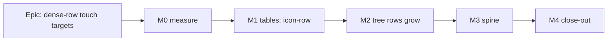

# Implementation Plan: Dense-row touch targets (`docs/TECH_DEBT.md` #215)

- **Feature spec:** [`feature-spec.md`](feature-spec.md)
- **Status:** Draft
- **Owner:** builder agent (Sonnet), with the gate-pass reviewers named per milestone

## Breakdown

### Epic

**Dense-row touch targets.** Every row target meets 44 px under a coarse pointer, or is a named
exception with evidence. The mouse geometry does not change. **Size: M overall** (S + S + M + S + S).
**No flag** (ADR-0088 D1). Each milestone is one revertable commit.

---

### Milestone M0: Measure the problem (ADR-0113, ADR-0142)

**Outcome:** the spec's §4.2 derived figures are replaced by readings. **Ships dark:** a
measurement only, nothing user-facing.
**Journey:** n/a (no capability).

- **Description:** Commit `m0-falsification.md` (predictions plus refutation bounds) **before** the
  run. Then take readings into `m0-measurement.md` with a throwaway Playwright harness on the seeded
  catalogue:
  - the row height of the tree, the activities table and the Clients list;
  - the tree scroller height and the activities-panel default height;
  - the Gantt body height;
  - the box of the spine and its destinations, under fine and under coarse (`hasTouch`, with
    `matchMedia('(pointer: coarse)')` asserted first, ADR-0118 D3);
  - at 1912 × 1104 coarse, 1912 × 948 fine and 1024 × 600 coarse.
- **Predictions to commit:**
  - list rows are ≥ 44 on coarse (P1);
  - activities rows with a `⋯` are 45 on both pointers (P2);
  - tree rows visible at 1912 × 1104 coarse are within ±3 of 19 (P3);
  - the fine spine's destinations overflow its content box (P4).
- **Complexity:** S. **Dependencies:** none.
- **Risks:** container Chromium is not the device (ADR-0128). → Readings are labelled emulation.
  The device sheet in M4 is the arbiter.
- **Testing:** none shipped. The harness is not committed.

---

### Milestone M1: Table `⋯` reaches 44 on touch

**Outcome:** on a touch screen, the `⋯` on Clients, Projects, Plans, Resources, both Calendars
tables and the activities table is 44 px. Mouse is unchanged.
**Entry point:** Clients page, row button "Actions for <client> in Clients"; plan workspace's
activities table, "Actions for <activity>".
**Journey:** `e2e-workspace-fit/command-surface.spec.ts` coarse projection, extended to the Clients
list and the activities table. It opens each surface and sweeps its triggers.

#### Feature: `icon-row` variant and its consumers

> **Description:** Add a `Button` size for a target in a row that grows with it. Move both table
> consumers onto it.
> **Complexity:** S
> **Dependencies:** M0 (P1, P2 confirmed or the design re-checked), CQ-2 answered.
> **Risks:** rows grow on the activities table on coarse (expected, CQ-2). Hidden mouse change if
> the class is misspelled. → Fine-pointer equality check against M0's baseline.
> **Testing:** unit, structural, e2e coarse sweep, fine equality.

##### Task 1: Variant, consumers, gates (one PR)

- **Development steps:**
  1. `button.tsx`: add `'icon-row': 'size-7 pointer-coarse:size-(--control-h)'`. Rewrite `icon-sm`'s
     docblock to the recount: call sites, which containers are fixed, `RowActionsMenu`'s six tables,
     no `CalendarRowMenu` call site.
  2. `row-actions-menu.tsx:86` and `ActivitiesTable.tsx:245` take `icon-row`. (If CQ-2 says "hit
     box", `ActivitiesTable` gets the negative-margin box instead, plus its own containment
     assertion.)
  3. `control-height.structural.test.ts`: the `icon-sm` exception reason now names one consumer
     (`GanttRowMenu`). Add a test that `size="icon-sm"` has exactly the call sites the exception
     names. Make it fail first by adding a dummy site.
  4. `command-surface.spec.ts`: add the `activities table` and `Clients list` surfaces to
     `COARSE_SURFACES`, each with an `atLeast` pinned positive. Plant them red by reverting step 2
     (ADR-0110).
  5. Run `button.test.tsx` (or the nearest): a rendered `icon-row` carries both classes.
  6. Write the ADR-0180 draft (Proposed) and its `CLAUDE.md` §16 line, so `check:adr-coverage`
     passes. Add a changeset (web, patch: "touch: row-menu buttons in tables are 44 px").
- **Reviewers before merge:** component-reviewer (new public variant), accessibility-reviewer
  (target size, focus ring at 44).

---

### Milestone M2: Explorer tree rows grow on touch

**Outcome:** under a coarse pointer, tree rows, names and the `⋯` are 44 px. Folding or unfolding
the cover keeps your place and your focus.
**Entry point:** the Project Explorer tree (`nav[aria-label="Project Explorer"]`), on any
organisation route at ≥ 1024 px.
**Journey:** the coarse projection drops `[role="tree"]` from `EXEMPT_WITHIN` and sweeps the tree's
rows and `⋯`. The new containment assertion runs on it.

#### Feature: pointer-aware tree row height

> **Description:** `HierarchyTree`'s row height comes from `useCoarsePointer()`. The virtualizer is
> re-measured and the scroll re-anchored when the pointer changes.
> **Complexity:** M
> **Dependencies:** M1 (`icon-row`), M0 (P3).
> **Risks:**
>
> - stale virtualizer cache (sizes keep 28) → explicit `measure()`, unit-tested on the options, not
>   on the mock;
> - focus lost on re-layout (WCAG 2.4.3; the #305 class) → the focused row is already pinned by
>   `rangeExtractor` (`HierarchyTree.tsx:206-210`), and a test flips the media while focused;
> - scroll jump → re-anchor on the first visible index;
> - the column at 1024 × 600 gets longer (+16 px per row). Accepted: it already scrolls as a whole
>   (`command-surface.spec.ts:1067-1071`).
>
> **Testing:** see the task.

##### Task 2: Hook and tree (one PR)

- **Development steps:**
  1. `components/ui/use-coarse-pointer.ts`: `export const COARSE_POINTER_QUERY = '(pointer:
     coarse)'` and `useCoarsePointer()`. Move `viewport-notice.tsx:200` onto it.
  2. `HierarchyTree.tsx`: `ROW_HEIGHT` becomes `treeRowHeight(coarse)` (exported, pure).
     `rowStyle` takes the height. `estimateSize` reads it. In an effect on `coarse`, capture
     `k = floor(scrollTop / oldH)` and `d = scrollTop − k·oldH`, call `virtualizer.measure()`, then
     `scrollToOffset(k·newH + d·newH/oldH)`.
  3. The `⋯` becomes `icon-row`. `[@media(pointer:coarse)]:opacity-100` becomes
     `pointer-coarse:opacity-100`.
  4. Unit tests (`HierarchyTree.rows.test.tsx`, new):
     - `treeRowHeight` gives 28 and 44;
     - with a `matchMedia` stub, the captured `estimateSize(0)` is 28 under fine and 44 under coarse;
     - a rendered row's `style.height` and `translateY` match `index × h`;
     - firing `change` calls `measure` once;
     - `scrollToOffset(471.43)` (±0.01) from a stubbed offset of 300;
     - the focused treeitem stays `document.activeElement`.
     
     Update the two existing mocks to read `treeRowHeight(false)` rather than a literal 28.
  5. Structural test: `treeRowHeight(true) × 1` equals `--control-h` (rem × 16) inside
     `@media (pointer: coarse)` in `globals.css`. `COARSE_POINTER_QUERY` is the only
     `(pointer: coarse)` literal in non-test `src/**/*.ts(x)`.
  6. `command-surface.spec.ts`:
     - remove `[role="tree"]` from `EXEMPT_WITHIN` and update its docblock;
     - raise the Explorer surface's `atLeast` to include tree rows;
     - add `assertRowTriggersContained(root)`: every `[aria-haspopup="menu"]` inside a
       `[role="treeitem"]` or `tr` has its box within the row's box ±0.5 px;
     - plant it red with a 28 px row holding a 44 px button (ADR-0110).
  7. Changeset (web, minor: "touch: Project Explorer rows are 44 px under a finger").
- **Reviewers before merge:** accessibility-reviewer (**required** under ADR-0111: this changes
  where focus sits during a re-layout), performance-reviewer (virtualizer), ux-reviewer (density).

---

### Milestone M3: The collapsed spine fits its controls

**Outcome:** with the Explorer collapsed, every spine control is fully inside the spine. Each is
44 px on touch, and the spine scrolls only vertically.
**Entry point:** the "Show Project Explorer" button on the collapsed spine.
**Journey:** the coarse projection collapses the Explorer and sweeps `[data-panel-border]` at
spine width, with a no-horizontal-overflow assertion (`scrollWidth === clientWidth`).

##### Task 3: Spine width (one PR)

- **Description:** Replace `SPINE_WIDTH = 34` with CSS widths taken from M0's readings: the fine
  width stays 34, unless P4 confirms the overflow, in which case it becomes the measured fit, plus a
  coarse width. The `icon-sm` becomes `icon-row`.
- **Complexity:** S. **Dependencies:** M0 (P4), M1.
- **Risks:** if P4 is confirmed, the fine width changes. That would be the one mouse-visible
  change in the epic, and it fixes a defect rather than spending density. → It is stated in the
  changeset and in `docs/TECH_DEBT.md` as a fix.
- **Testing:**
  - unit: the spine renders the coarse width class;
  - e2e: the overflow assertion, planted red at the old width.

---

### Milestone M4: Close-out and the device

**Outcome:** the record matches the product, and the product owner has a five-minute sheet to
confirm it on the Surface. **Ships dark:** docs and a sheet.

##### Task 4: Docs, register, device sheet (one PR)

- **Development steps:**
  1. ADR-0180 moves to Accepted. ADR-0118 gets an "Amended by" line, its D1 list is updated
     (breadcrumb, plus ADR-0177 D4's Gantt entries, with `icon-sm` now Gantt-only), and a D8 note
     says the containment assertion exists for row triggers.
  2. Update `docs/UX_STANDARDS.md` and `docs/DESIGN_SYSTEM.md` (the exception sentence) and
     `docs/COMPONENT_LIBRARY.md` (`icon-row` vs `icon-sm`, and when to use each).
  3. `docs/TECH_DEBT.md` #215: close the tables, tree and spine. Restate the Gantt half as
     **decided** (CQ-1), with the device evidence. Record the four corrections from spec §1 in
     place. File a new row for the activities table's 24 px row checkbox
     (`ActivitiesTable.tsx:174-176`, unswept on coarse), which is outside #215.
  4. New `device-checklist.md` beside this plan, about 5 minutes, tablet posture:
     - tap a tree row ×10;
     - tap a tree `⋯` ×10;
     - tap a Clients `⋯` ×10;
     - tap an activities `⋯` ×10;
     - fold and unfold the cover with the tree scrolled ("same row at top?");
     - collapse the Explorer and tap each spine icon.
  5. `docs/specs/gantt-coarse-pointer/device-checklist.md`: add one dated line to its "Keep this
     sheet current" note saying #215 left the Gantt's targets unchanged, so no step changes. **If
     CQ-1 is answered "grow", this task is replaced by that epic's own edit of items 6, 7, 8 and
     12, in the same PR as the change, as the sheet's own rule requires.**
- **Complexity:** S. **Dependencies:** M1–M3.

## Sequencing & slices

M0, then M1, M2 and M3 in that order (M2 and M3 are independent after M1), then M4. Each lands
alone and keeps `main` releasable. The mouse path is unchanged at every step, and M0's fine
baseline checks that. Model routing (§19.14): M0–M4 build on **builder** (Sonnet). Switch the
session to Sonnet after approval.

## Definition of Done (per task)

The Feature Completion Criteria in [`docs/PROCESS.md`](../../PROCESS.md). Specifically:

- `pnpm prepush`;
- `scripts/e2e-local.sh web:workspace-fit` for M1–M3;
- the reviewers named per milestone, before release.

## Risks & assumptions (rollup)

| Risk / assumption                                                          | Likelihood | Impact | Mitigation                                                                  |
| -------------------------------------------------------------------------- | ---------- | ------ | --------------------------------------------------------------------------- |
| Derived row counts in the spec are off                                     | med        | low    | M0 replaces them before any code; the decisions do not hinge on ±3 rows      |
| Virtualizer keeps cached 28 px sizes after a posture flip                  | med        | med    | `measure()`, tested on captured options rather than a mock's literal         |
| Focus or scroll lost on a cover fold                                       | low        | high   | Pinned `rangeExtractor` plus re-anchor; ADR-0111 accessibility review       |
| Cover-attached finger use stays at 28 px (ADR-0118 D7)                     | high       | low    | Stated (CQ-3). The Gantt's gestures are posture-independent already (ADR-0177 D1) |
| The containment assertion over-reports (focus rings, tooltips)             | low        | med    | Scoped to `[aria-haspopup="menu"]` inside a row; border box only             |
| Fine spine overflow (P4) is real and has gone unnoticed                    | med        | low    | Measured at M0, fixed at M3, recorded as a defect                            |
| Activities table density on the Surface drops by about a quarter           | high       | low    | CQ-2 offers the 0-row hit box                                               |
