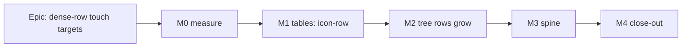

# Implementation Plan: Dense-row touch targets (`docs/TECH_DEBT.md` #215)

- **Feature spec:** [`feature-spec.md`](feature-spec.md)
- **Status:** Approved 2026-10-08 by the product owner, recommendations accepted: CQ-1 the Gantt stays 28 px; CQ-2 the activities table's menu button grows to 44 px on touch; CQ-3 `pointer` (not `any-pointer`) stays the gate, the cover-attached finger gap is recorded.
- **Owner:** builder agent (Sonnet), with the gate-pass reviewers named per milestone

## Breakdown

### Epic

**Dense-row touch targets.** Every row target meets 44 px under a coarse pointer, or is a named
exception with device evidence (ADR-0183 D1). The mouse geometry does not change.

- **Size:** M overall (S + S + M + S + S).
- **No flag** (ADR-0088 D1). Each milestone is one revertable commit.
- **Playwright cannot flip the pointer mid-session.** `page.emulateMedia` has no `pointer` option
  (Playwright API docs, read 2026-10-08), and `hasTouch` is fixed per context. Posture changes are
  therefore proven by unit tests and the device sheet, never by a journey.

---

### Milestone M0: Measure the problem (ADR-0113, ADR-0142)

**Outcome:** the spec's §4.3 worked-out figures are replaced by readings.
**Ships dark:** a measurement only, nothing user-facing.
**Journey:** n/a.

- **Description:** commit `m0-falsification.md` (predictions and the bounds that would refute them)
  **before** the run. Take readings with a throwaway Playwright harness on the seeded catalogue, at
  1646 × 1097 and 1024 × 600 coarse (the sweep's viewports), 1912 × 1104 coarse and 1912 × 948 fine.
  `matchMedia('(pointer: coarse)')` is asserted first (ADR-0118 D3). Measure:
  - the row heights of the tree, the activities table and the Clients list;
  - the tree scroller's height and the activities panel's default height;
  - the Gantt body's height;
  - the spine and its destinations' boxes, under both pointers;
  - the stage, canvas and Gantt widths with the Explorer collapsed, as the baseline for M3.

  Take screenshots of the tree at the 200 px minimum width (long names, the 16 px indent and icons).

- **Device pre-reading, about 3 minutes, optional but recommended.** On the Surface in tablet
  posture: tap a tree row ×10 and a tree `⋯` ×10, at today's 28 px. This gives the tree's 36 % cost
  the same kind of evidence the Gantt's exception rests on.
- **Predictions:**
  - P1: list rows are ≥ 44 on coarse.
  - P2: activities rows that have a `⋯` are 45 on both pointers.
  - P3: tree rows visible at 1912 × 1104 coarse are 19 ± 3.
  - P4: the fine spine's destinations overflow its content box.
- **Complexity:** S. **Dependencies:** none.
- **Risks:** container Chromium is not the device (ADR-0128). → The readings are labelled emulation,
  and the M4 device sheet is the arbiter.
- **Testing:** none shipped; the harness is not committed.

---

### Milestone M1: The tables' `⋯` reaches 44 on touch

**Outcome:** on touch, the `⋯` on Clients, Projects, Plans, Resources, both Calendars tables and
the activities table is 44 px. Mouse is unchanged.
**Entry point:**

- Clients page: "Actions for <client> in Clients";
- the plan's activities table: "Actions for <activity>".

**Journey:** the `command-surface.spec.ts` coarse projection, extended (Task 1, step 5).

#### Feature: the `icon-row` variant and its consumers

> **Description:** add a `Button` size for a target in a row that grows with it, and move both table
> consumers onto it.
> **Complexity:** S
> **Dependencies:** M0 (P1 and P2), and CQ-2 answered.
> **Risks:**
>
> - rows grow in the activities table on coarse, which CQ-2 expects;
> - a misspelt class could change mouse geometry → the fine-pointer equality check against M0's
>   baseline catches it.
>
> **Testing:** unit, structural and e2e, below.

##### Task 1: Variant, consumers and gates (one PR)

1. **`button.tsx`:**
   - Add `'icon-row': 'size-7 pointer-coarse:size-(--control-h)'`.
   - Rewrite `icon-sm`'s docblock to match the recount, replacing the stale list at `:87-88`.
   - Both docblocks carry the sentence: "a target in a row that grows with it is `icon-row`; a
     target in a fixed container is `icon-sm` and is on ADR-0118 D1's list".
2. **Consumers:** `row-actions-menu.tsx:86` and `ActivitiesTable.tsx:245` take `icon-row`. If CQ-2
   is answered "hit box", `ActivitiesTable` gets the `-my-2` box instead.
3. **`ActivitiesTable.tsx`:** add `data-coarse-exempt="row-select"` to both checkbox labels (`:132`
   and `:187`). These are 24 px labels around 16 px boxes: AA-compliant, below the house rule, and
   outside #215. File a new `docs/TECH_DEBT.md` row for them.
4. **`control-height.structural.test.ts`:**
   - Correct the stale "five of its six" at `:59`, and make the `icon-sm` exception reason name one
     consumer (`GanttRowMenu`).
   - **Add a call-site test over `src/**`, comments stripped.** `'icon-sm'`is defined in`button.tsx`, and `size="icon-sm"`appears exactly once, in`GanttRowMenu.tsx`. This is needed
     because the `size-7`needle alone stays green if`icon-sm` is deleted.
   - Plant it red with a dummy call site, then remove the dummy.
5. **`command-surface.spec.ts`:**
   - **Activities table surface.** Add it to `COARSE_SURFACES` with an `atLeast` positive. Exempt
     `[data-coarse-exempt="row-select"]` by a named selector in the `ganttExempt` style, assert the
     marker is present, and plant it red by removing a marker (ADR-0110).
   - **Clients list.** A separate step navigates to `/orgs/$slug/clients`, sweeps
     `main table`, then `page.goto`s the plan URL saved before leaving. It runs at both
     `COARSE_WIDTHS`, because the loop at `:1265-1274` only covers the plan page.
   - **Plant both red** by reverting step 2.
6. **`button.test.tsx`:** one smoke test that `icon-row` renders both classes. No per-table tests.
7. **ADR and changeset:**
   - draft ADR-0183 (Proposed) and its `CLAUDE.md` §16 line, so `check:adr-coverage` passes;
   - add a changeset (web, patch: "touch: row-menu buttons in tables are 44 px").

- **Reviewers before merge:** component-reviewer (a new public variant) and accessibility-reviewer.

##### M1 exit criteria, as built

- **The floor (1024 × 600) is measured for SIZE only.** The activities panel sits at y 497..625 on
  a 600 px viewport, so no row is hit-testable there: the activities-table sweep is skipped below
  700 px of height, and `assertActivitiesRowMenuSizeOnly` reads the `⋯` box instead and holds it to 44. Reachability at the floor is **not** asserted by any journey; it is a device-sheet item. The
  M0 figure to expect there: the row goes **57 → 61** and the button is **44** (`m0-measurement.md`
  §2), against 45 → 61 at 1912.
- **The `row-select` exemption is asserted at the wide viewport only** (1646 × 1097), because the
  floor skips that surface. It is an inventory assertion, not an exclusion: the surface sweeps
  `[aria-haspopup="menu"]` only.
- **Tier-1 pins** for both consumers (`row-actions-menu.test.tsx`, `ActivitiesTable.test.tsx`)
  assert the `icon-row` classes, so a revert to `size-7` fails without a browser.

---

### Milestone M2: The Explorer tree's rows grow on touch

**Outcome:** under a coarse pointer, tree rows, names and the `⋯` are 44 px. Folding or unfolding
the cover keeps your place and your focus, in both directions.
**Entry point:** the Project Explorer tree (`nav[aria-label="Project Explorer"]`), on any
organisation route at ≥ 1024 px.
**Journey:** the coarse projection drops `[role="tree"]` from `EXEMPT_WITHIN`, sweeps the tree's
rows and `⋯`, and runs the containment assertion on it.

#### Feature: a pointer-aware tree row height

> **Description:** `HierarchyTree`'s row height comes from `useCoarsePointer()`, with re-anchoring
> on a pointer change (spec §4.4).
> **Complexity:** M
> **Dependencies:** M1 (`icon-row`), M0 (P3).
> **Risks:**
>
> - **The browser limits `scrollTop` before effects run** when going coarse → fine. → The anchor is
>   captured continuously in a ref, and the restore runs in a `useLayoutEffect`.
> - **The virtualizer keeps its cached 28 px sizes.** → `measure()`, tested with the real
>   virtualizer.
> - **Focus is lost on re-layout** (WCAG 2.4.3, the #305 class). → The pinned `rangeExtractor`
>   plus a real-virtualizer focus test.
> - **The React Compiler lint** (`HierarchyTree.tsx:215-223`). → No `setState` in the layout
>   effect.
> - **The Explorer column at 1024 × 600 gets longer** (+16 px per row). Accepted: it already scrolls
>   as a whole, and the tree shows about 0 rows there either way.

##### Task 2: The hook and the tree (one PR)

1. **Hook.** Create `components/ui/use-coarse-pointer.ts`, exporting
   `COARSE_POINTER_QUERY = '(pointer: coarse)'` and `useCoarsePointer()`. Move
   `components/layout/viewport-notice/viewport-notice.tsx:200` onto it.
2. **`HierarchyTree.tsx`:**
   - `ROW_HEIGHT` becomes `treeRowHeight(coarse)`, exported and pure;
   - `rowStyle(top, level, height)`;
   - `estimateSize` reads the height;
   - `rangeExtractor`'s logic moves to a pure `pinnedRange(range, pins)` helper.
3. **Re-anchoring:**
   - `anchorRef = { index, intraOffset, height }`, updated in the scroller's `onScroll` and after
     each render from the current row height;
   - a `useLayoutEffect` keyed on the row height, skipped on first mount, that calls
     `virtualizer.measure()` and then
     `scrollToOffset(index·newH + intraOffset·newH/anchorRef.height)`;
   - no `setState` anywhere in that effect.
4. **Small changes:**
   - the `⋯` becomes `icon-row`;
   - `[@media(pointer:coarse)]:opacity-100` becomes `pointer-coarse:opacity-100`.
5. **Unit tests in `HierarchyTree.rows.test.tsx` (new):**
   - `treeRowHeight` returns 28 and 44;
   - the captured `estimateSize(0)` follows a `matchMedia` stub;
   - row `style.height` and `translateY` equal `index × h`;
   - `measure` is not called on mount and is called once per change;
   - the re-anchor targets match the spec §4.4 table:
     - fine → coarse: 300 → 471.43 (±0.01);
     - coarse → fine: 471.43 → 300;
     - end of list: 1600 → 1018.18.
   - The two existing mocks read `treeRowHeight(false)` instead of a literal 28.
6. **Unit tests for pinning and focus, against the real code:**
   - `pinnedRange` adds the active, selected and menu indexes to a range that excludes them.
   - One render with the **real** `useVirtualizer`, with the scroller's `getBoundingClientRect` and
     `offsetHeight` stubbed to 600:
     - focus a treeitem outside the default range, fire the `matchMedia` change, and it is still
       `document.activeElement`;
     - repeat with focus on its `tabIndex={-1}` `⋯`;
     - the pinned item's `start` equals `index × 44` after the flip.
7. **Structural tests:**
   - **Extend `src/styles/input-axis.structural.test.ts`.** In non-test `src/**/*.ts(x)`, with
     comments stripped, the only argument to `matchMedia(` or `useMediaQuery(` that mentions
     `pointer` is `COARSE_POINTER_QUERY`, and no class string contains `[@media(pointer:`.
   - **Plant it red** with a temporary literal `useMediaQuery('(pointer: coarse)')`.
   - `treeRowHeight(true)` equals the coarse `--control-h` (`2.75rem` × 16).
8. **`command-surface.spec.ts`:**
   - remove `[role="tree"]` from `EXEMPT_WITHIN` and rewrite its docblock;
   - raise the Explorer surface's `atLeast` to cover tree rows;
   - add `assertRowTriggersContained(root)`: every `[aria-haspopup="menu"]` inside a
     `[role="treeitem"]` or `tr` lies within its row's box, ±0.5 px;
   - plant it red with a 28 px row holding an `icon-row` button.
9. **Changeset** (web, minor: "touch: Project Explorer rows are 44 px under a finger").

- **Reviewers before merge:**
  - accessibility-reviewer, **required** (ADR-0111, because focus placement changes during a
    re-layout);
  - performance-reviewer (the virtualizer);
  - ux-reviewer (density).

---

### Milestone M3: The collapsed spine fits its controls

**Outcome:** with the Explorer collapsed, every spine control sits fully inside the spine, at 44 px
on touch, and the spine scrolls only vertically.
**Entry point:** the "Show Project Explorer" button on the collapsed spine.
**Journey:** the coarse projection collapses the Explorer and sweeps `[data-panel-border]` at spine
width, asserting `scrollWidth === clientWidth`.

##### Task 3: The spine's width (one PR)

- **Description:**
  - Replace `SPINE_WIDTH = 34` (`explorer-column.tsx:24`, used only at `:76`, verified) with CSS
    widths taken from M0.
  - The fine width stays 34, unless P4 is confirmed; in that case it becomes the measured fit.
  - Add a coarse width, expected around 53 (44 + `p-1` + border). M0 decides it.
  - The spine's `icon-sm` becomes `icon-row`.
- **Complexity:** S. **Dependencies:** M0 (P4), M1.
- **Risks:**
  - The coarse spine takes width from the stage. → The e2e step asserts that, at 1024 and 1646
    coarse, the stage and canvas lose exactly the spine's growth and no more, and that 1912 × 948
    fine is unchanged against M0. 1912 × 1104 coarse is checked on the device sheet.
  - If P4 is confirmed, this is the epic's one mouse-visible change, and it is a defect fix. → Said
    so in the changeset and in `docs/TECH_DEBT.md`.
- **Testing:**
  - unit: the spine renders the coarse width class;
  - e2e: the overflow and stage-width assertions, planted red at the old width.

---

### Milestone M4: Close-out and the device

**Outcome:** the record matches the product, and the product owner has a short sheet to confirm it
on the Surface.
**Ships dark:** docs and a sheet.

##### Task 4: Docs, register and device sheet (one PR)

1. **ADRs.**
   - ADR-0183 becomes Accepted. It contains:
     - D1's criterion;
     - the 2.5.8 AA statement;
     - the cover-attached finger as a **known gap**;
     - the Gantt's revisit trigger.
   - ADR-0118 gains an "Amended by ADR-0183" line, an updated D1 list, and a D8 note pointing at
     the new containment assertion.
2. **Standards docs.**
   - `docs/UX_STANDARDS.md` and `docs/DESIGN_SYSTEM.md` carry the criterion sentence.
   - `docs/COMPONENT_LIBRARY.md` carries the `icon-row` / `icon-sm` sentence, word for word as the
     docblocks have it.
3. **`docs/TECH_DEBT.md` #215.**
   - Close the tables, tree and spine.
   - Restate the Gantt half as **decided** (CQ-1), with its evidence and trigger.
   - Record the four corrections from spec §1 in place.
4. **New `device-checklist.md` beside this plan** (about 8 minutes, tablet posture unless stated).
   It must also carry the activities-table row at 1024 × 600 (row 57 → 61, `⋯` 44), which the
   journeys measure for size only and cannot hit-test (M1 exit criteria).
   It opens with: **"With the keyboard cover attached, nothing on this sheet changes, by design."**
   Steps:
   - **Taps:**
     - a tree row ×10;
     - a tree `⋯` ×10;
     - a Clients `⋯` ×10;
     - an activities `⋯` ×10.
   - **Fold with focus:** tap a tree row, then attach and detach the cover. Is focus still on the
     same row? Press an arrow key: does it move from that row?
   - **Fold while scrolled:** scroll the tree to the middle, then attach the cover. Is the same row
     at the top?
   - **Fold at the end of the list:** scroll the tree to the very end, then attach the cover. The
     end of the list should still be in view. This is the case where the browser limits the scroll
     position, and it is expected.
   - **Fold fine → coarse past 60 % of the list:** scroll the tree well past 60 % of its length,
     then attach the cover. The same row should be at the top. This is the case the sizer's stale
     height used to break (the re-anchor now waits for the re-render `measure()` causes).
   - **Fold at the end of the list, focus check:** after the end-of-list fold, press an arrow key.
     Focus must still be on the same row and move from it.
   - **A possible one-frame stale window:** the virtualizer's `scrollOffset` updates on the async
     scroll event, so a fold straight after a fast fling may show one frame at the old offset.
     Note it only if it persists or shows the wrong row.
   - **Activities table:** scroll it and focus a row, then fold. Did your place and focus survive?
   - **Spine:** collapse the Explorer and tap each spine icon. Is any icon clipped?
   - **Revisit trigger:** if the Gantt's `⋯` or arrow ever misses more than 1 in 10, say so.
5. **`docs/specs/gantt-coarse-pointer/device-checklist.md`:** add a dated line to its "Keep this
   sheet current" note. It says #215 left the Gantt's targets unchanged, so no step changes, and
   repeats the same revisit trigger. **If CQ-1 is answered "grow", this is replaced by that epic's
   own edit of items 6, 7, 8 and 12, in the same PR as the change.**

- **Complexity:** S. **Dependencies:** M1–M3.

## Sequencing & slices

- **Order:** M0 first. Then M1 → M2 → M3: M2 and M3 are independent once M1 has landed. Then M4.
- **Each milestone** lands alone and keeps `main` releasable.
- **The mouse path** is unchanged at every step, checked against M0's fine baseline.
- **Model routing** (§19.14): the build runs on **builder** (Sonnet). Switch the session to Sonnet
  after approval.

## Definition of Done (per task)

The Feature Completion Criteria in [`docs/PROCESS.md`](../../PROCESS.md), plus:

- `pnpm prepush`;
- `scripts/e2e-local.sh web:workspace-fit` for M1–M3;
- the reviewers named for each milestone, before release.

## Risks & assumptions (rollup)

| Risk / assumption                                                 | Likelihood | Impact | Mitigation                                                                    |
| ----------------------------------------------------------------- | ---------- | ------ | ----------------------------------------------------------------------------- |
| The spec's worked-out row counts are off                          | med        | low    | M0 replaces them before any code; no decision hinges on ±3 rows               |
| The browser limits scroll before the restore runs (coarse → fine) | high       | med    | Continuous anchor ref, `useLayoutEffect`, both-direction arithmetic tests     |
| The virtualizer keeps cached 28 px sizes, including pinned rows   | med        | med    | `measure()`, tested with the real virtualizer                                 |
| Focus is lost on a fold                                           | low        | high   | Real-virtualizer focus test, ADR-0111 review, device step                     |
| No journey can flip the pointer                                   | certain    | med    | Unit tests plus the device sheet; no journey claims it                        |
| A finger with the cover attached stays at 28 px                   | high       | low    | Known gap in ADR-0183 (CQ-3)                                                  |
| The new structural gates trip on comments                         | med        | low    | Comments stripped; only arguments to `matchMedia`/`useMediaQuery` are matched |
| The containment assertion over-reports                            | low        | med    | Scoped to `[aria-haspopup="menu"]` inside a row; border box only              |
| The fine spine overflow (P4) is real                              | med        | low    | Measured at M0, fixed at M3, recorded as a defect                             |
| Activities-table density on the Surface drops 26 %                | high       | low    | CQ-2's free hit box                                                           |
