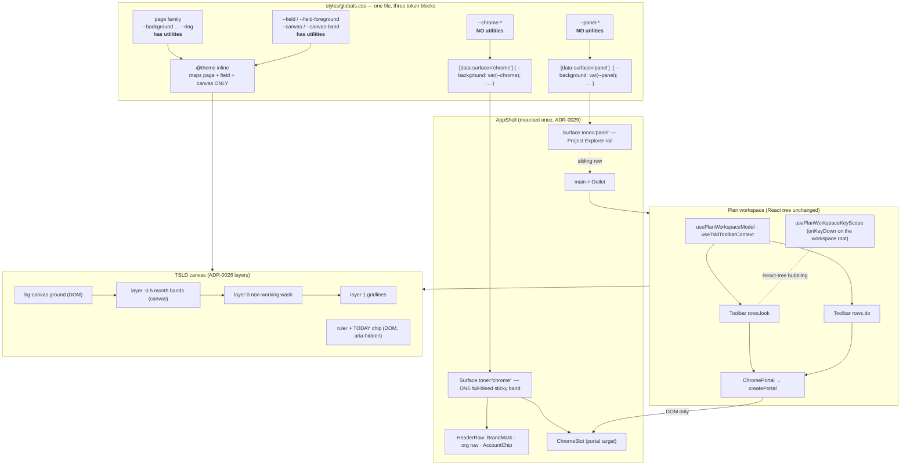
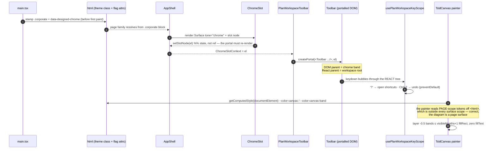
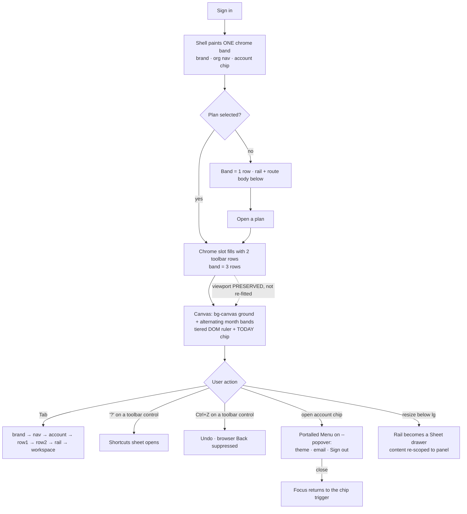

# Feature Spec: Designed UI — surface scopes, a designed chrome band, and the canvas visual language

- **Status:** Draft — awaiting approval
- **Author(s):** Claude Code (feature-analyst), with James Ewbank (product)
- **Date:** 2026-07-26
- **Tracking issue / epic:** _(to be raised — "Designed UI" epic)_
- **Roadmap link:** UI quality / design-system maturity
- **Related ADR(s):** **ADR-0055** (this epic's decision record — _Proposed_); amends
  ADR-0006, ADR-0026, ADR-0029, ADR-0052; builds on ADR-0030, ADR-0031, ADR-0033,
  ADR-0049, ADR-0054.
- **Architecture note (file map, sequencing, implementer checklist):**
  [`architecture-notes.md`](./architecture-notes.md)
- **Implementation plan:** [`implementation-plan.md`](./implementation-plan.md)

> **Scope discipline.** ADR-0055 and the architecture note already decided the
> architecture. This spec turns those decisions into testable requirements and does not
> re-open them. Where the ADR left an implementation choice open, this spec **makes the
> choice and says why** — those are marked **§ Decision** throughout and summarised in
> §4.7.

---

## 1. Business understanding

### Problem

SchedulePoint works but does not **read** as a designed product. The product owner's
verdict is that it looks "assembled rather than crafted": the top bar, the command rows
and the Project Explorer are three visually unrelated regions stacked on each other, the
diagram sits on an undifferentiated card, and nothing in the chrome carries brand.

Underneath that aesthetic judgement sits a **verified accessibility defect**, and it is
the more urgent half. The recently-shipped Corporate theme painted the header and the
rail navy, but the app has exactly **one semantic token vocabulary and it is tuned for
the page/canvas surface**. Chrome got a three-token stub (`--app-header{,-foreground,-border}`,
`styles/globals.css:91-93`) and the rail got another (`--sidebar-*`, `:96-103`) — and
**neither has a muted-foreground, a coloured-ink token, a field surface, or a hover
accent validated against its own fill**. In Light and Dark this was invisible because
`--app-header` is byte-identical to `--background` (`globals.css:32` vs `:91`) and
`--accent` to `--sidebar-accent` (`:46` vs `:100`). Corporate is the first theme where
chrome and canvas genuinely diverge, so the latent bug surfaced as five live WCAG 2.2 AA
failures on a merge-gated criterion (CLAUDE.md §13).

The redesign makes chrome/canvas divergence **permanent and universal** (all four themes),
so the defect must be fixed **structurally** — in the vocabulary, not at the call sites —
or the redesign will multiply it.

#### The five verified defects

| #   | Site                                                                                                | Measured      | Root cause                                                                           |
| --- | --------------------------------------------------------------------------------------------------- | ------------- | ------------------------------------------------------------------------------------ |
| D1  | `components/layout/app-header.tsx:13` — `NAV_LINK_CLASS` idle `text-muted-foreground`               | **2.8:1**     | no chrome muted-foreground; page value used on navy                                  |
| D2  | `app-header.tsx:13-14` — nav `hover:text-foreground` / `[&.active]:text-foreground`                 | **1.26:1**    | page `--foreground` (near-black) on navy; **current page is the least legible item** |
| D3  | `app-header.tsx:109` — "Sign out" `Button variant="outline"`                                        | **1.01:1**    | `button.tsx:13` sets `bg-background` but **no ink**; inherits the band's white       |
| D4  | `app-header.tsx:101-108` — the exposed user-email `<span>`                                          | **2.8:1**     | as D1                                                                                |
| D5  | `navigator-rail.tsx:95`, `AppVersionLine.tsx:17`, `HierarchyTree.tsx:302-305`                       | **2.5–2.8:1** | `--sidebar-*` has no muted-foreground and no destructive-text                        |
| D6  | `components/ui/button.tsx:13-14` — `ghost`/`outline` `hover:bg-accent hover:text-accent-foreground` | wrong token   | canvas tokens with no ambient awareness: **any** button in chrome hovers wrong       |

_(D6 is listed separately from D1–D5 because it is a latent defect on every surface, not
a measured pixel. The brief counts five; D3 and D6 are two halves of one bug and both must
be fixed — see §2 US-2.)_

#### Why the token architecture fixes them _by inheritance_

`globals.css:266` declares `@theme inline`. That makes `bg-background` compile to
`background-color: var(--background)` — the **referenced** variable, not a `:root`-resolved
indirection. Custom properties inherit, so redeclaring `--background` on a subtree changes
every utility beneath it. Therefore a single rule:

```css
[data-surface='chrome'] {
  --background: var(--chrome);
  --foreground: var(--chrome-foreground);
  --muted-foreground: var(--chrome-muted-foreground);
  /* …the full rebind list, ADR-0055 §1… */
}
```

…fixes **D1, D2, D4, D5 and D6 with no change to any of those files.** That is the test of
the mechanism: the fix lands in one place and the primitives stay surface-agnostic. Fixing
them individually would mean a `className` override at each call site — a "no one-off
styling" violation (ADR-0006, `DESIGN_SYSTEM.md`) that the redesign would then multiply.

**D3 needs both halves**: `button.tsx:13` must set `text-foreground` (a variant that
specifies a fill and inherits its ink is a bug on _any_ surface), **and** the element goes
away entirely when the account chip replaces it. D4's element likewise goes away.

### Users

This epic has no new persona and no new permission. It changes what **every** authenticated
user sees, in every organisation role:

| Role                              | What changes for them                                                                                              |
| --------------------------------- | ------------------------------------------------------------------------------------------------------------------ |
| **Org Admin / Planner**           | The full designed chrome band, the panel rail, the redesigned canvas ground/ruler/TODAY chip                       |
| **Contributor / Viewer**          | The same chrome and canvas; authoring controls stay pen/role-gated exactly as today                                |
| **External Guest**                | **Unaffected** — `/share` is a sibling of `_authed` with no app-shell chrome (ADR-0051 F-M4)                       |
| **Screen-reader / keyboard user** | Five WCAG 2.2 AA failures fixed; a new tab order; the `?` and undo/redo accelerators keep working from the toolbar |
| **Corporate-theme user**          | The rail changes from navy to a light panel (intended, product decision)                                           |

### Primary use cases

1. **Read the app.** A planner opens a plan and every region — brand band, command rows,
   explorer, diagram — reads as one designed surface with one hierarchy.
2. **Operate the chrome accessibly.** Every control and every piece of text in the chrome
   band and the rail clears WCAG 2.2 AA in all four themes, including the current-page nav
   link and every hover state.
3. **Read the timeline.** The diagram sits on a distinct ground with alternating month
   bands, a tiered year/month/day ruler and a TODAY marker chip, so "where am I in time"
   is answerable at a glance at any zoom.
4. **Keep working at scale.** All of the above holds at 2,000 activities inside ADR-0026's
   ≤ 4 ms p95 draw budget.
5. **Roll back safely.** Each flagged half can be turned off independently and returns the
   prior surface byte-for-byte.

### User journeys

**Happy path (planner, Corporate theme).** Sign in → the shell paints one continuous navy
band: brand tile + wordmark, org nav, account chip. Open a plan from the light Project
Explorer rail → the plan's two command rows appear **inside the same band**, directly under
the header row; the rail and the workspace start below it. The canvas paints a cream ground
with alternating month tint bands under dotted day gridlines, a tiered ruler above, and a
red TODAY chip pinned in the ruler. Press `Tab`: brand → nav → account chip → toolbar row 1
→ toolbar row 2 → rail → workspace. Press `?` with focus on a toolbar button: the shortcuts
sheet opens. Press `Ctrl+Z`: the last edit is undone.

**Alternate — no plan open.** The band carries only the header row; the chrome slot is
empty and contributes no height. Opening a plan grows the band by two rows; ADR-0030's
viewport-preserve amendment absorbs the canvas resize without re-fitting the view.

**Alternate — below `lg`.** The rail is an off-canvas drawer (`Sheet`, `app-shell.tsx:118-125`).
The drawer portals to `document.body`, i.e. **outside** every surface scope — so its
content is explicitly re-scoped (§2 US-5) or the drawer rail and the pinned rail would
paint different colours.

**Alternate — Dark theme.** Same structure; `--chrome-field` is a raised-dark island, not
literal white (ADR-0055 §8.2 — white on near-black is a glare source).

**Rollback.** `VITE_DESIGNED_CHROME=false` restores today's shell and today's panel values
byte-for-byte. `VITE_CANVAS_VISUAL_LANGUAGE=false` restores today's paint byte-for-byte.

### Expected outcomes

- The product reads as designed rather than assembled, in all four themes.
- Five verified WCAG failures are gone, and their **recurrence is a failing build** rather
  than a review miss.
- Adding a fifth theme becomes a block of values, not a code change.
- The chrome/canvas boundary is a structural fact (`bg-chrome` does not compile) rather
  than a convention nobody remembers.

### Success criteria

| #   | Criterion                                                                                                                            | How measured                                              |
| --- | ------------------------------------------------------------------------------------------------------------------------------------ | --------------------------------------------------------- |
| S1  | Every declared (fill, ink) pair in every scope in every token block clears 4.5:1 (text) / 3:1 (non-text)                             | `styles/token-contrast.test.ts`, CI                       |
| S2  | Zero axe `wcag2a`/`wcag2aa` violations on the shell in all four picker themes, with the six named defect sites asserted individually | `e2e-designed-ui/designed-ui.spec.ts`, CI                 |
| S3  | Canvas draw p95 ≤ 4 ms at 2,000 activities, in all four themes, with bands + ground on                                               | `prototypes/tsld-spike/` browser run (S5 enablement gate) |
| S4  | Month banding adds ≤ `visibleMonths + 1` `fillRect` and **exactly zero** `fillText`/`measureText`, at day _and_ year zoom            | `render/paint.band-budget.test.ts`, CI                    |
| S5  | `?`, `Cmd/Ctrl+Z`, `Cmd/Ctrl+Shift+Z`, `Ctrl+Y` all fire with focus on a **portalled** toolbar control                               | one unit regression test per binding                      |
| S6  | Flag-off is byte-for-byte the prior surface, for both flags                                                                          | flag-off parity suites (shell render + canvas paint)      |
| S7  | Opening a plan does not re-fit the canvas viewport despite the band growing by two rows                                              | workspace integration test                                |
| S8  | No file outside `globals.css` + `surface.tsx` mentions `--chrome`/`--panel`/`data-surface`                                           | structural seam test                                      |
| S9  | `@theme inline` still says `inline`                                                                                                  | `styles/token-architecture.test.ts`                       |

### Out of scope (logged as follow-ups)

| Item                                                                                                                     | Why out of scope                                                                                                                                                                                                                                                                                                                                                                                                                                                                                                                                 |
| ------------------------------------------------------------------------------------------------------------------------ | ------------------------------------------------------------------------------------------------------------------------------------------------------------------------------------------------------------------------------------------------------------------------------------------------------------------------------------------------------------------------------------------------------------------------------------------------------------------------------------------------------------------------------------------------ |
| **Toast / toaster primitive** ("All changes saved")                                                                      | The app has **no toaster today**. A transient live-region surface needs its own dismissal, timing, stacking and `aria-live` contract — a new capability with its own spec, not a pixel in a screenshot.                                                                                                                                                                                                                                                                                                                                          |
| **"Hide done" filter**                                                                                                   | A completed-activity filter is a **new lens capability** (the `Critical`/`Chain` lenses exist; this one does not). It needs its own spec, result-count announcement and registry item.                                                                                                                                                                                                                                                                                                                                                           |
| **Project Explorer search + type filter** (the reference rail's search field and All / Clients / Projects / Plans chips) | **The rail has neither today**, and neither can be built client-side: `useHierarchyTree` loads the tree **lazily, one query per expanded node** (`features/navigator/hooks/use-hierarchy-tree.ts:47,63,81,111`), so unloaded children are not in memory to search or filter. A working search needs an **org-scoped hierarchy search endpoint** (backend work, a new API contract, RBAC + org scoping, pagination) or a full-tree fetch that ADR-0029 deliberately avoids. That is a feature with its own spec — see **critical question CQ-2**. |
| **`Gantt \| Network` segmented control**                                                                                 | Product decision: no Network view exists; an inert half in the primary command surface is misleading (ADR-0031 amendment 2026-07-15 §5 made it a hidden stub for exactly this reason).                                                                                                                                                                                                                                                                                                                                                           |
| **Five separate zoom buttons**                                                                                           | Product decision: keep the consolidated `Zoom ▾` menu. It was consolidated on 2026-07-14 for a **measured** overflow-demotion bug; reverting re-creates it.                                                                                                                                                                                                                                                                                                                                                                                      |
| **A true split button on `Add Task`**                                                                                    | Two focus stops inside one toolbar item breaks ADR-0031's roving-tabindex model (`Toolbar.tsx:165-171`, keyed on `data-toolbar-item`). The **look** ships; the behaviour is recorded as a deferral in `docs/TOOLBAR_ROADMAP.md`.                                                                                                                                                                                                                                                                                                                 |
| **New bar/link shape vocabulary, per-bar shadows, per-bar gradients**                                                    | The existing shapes each carry WCAG 1.4.1 meaning colour does not; `shadowBlur` forces full-quality rasterisation per bar (already rejected in ADR-0052); a gradient per bar per frame is an allocation per bar per frame.                                                                                                                                                                                                                                                                                                                       |
| **Moving the ruler onto the canvas**                                                                                     | Spends the scarcest budget (`fillText` per visible day at day zoom — ADR-0026 §1's dominant cost) on the one thing DOM does better.                                                                                                                                                                                                                                                                                                                                                                                                              |
| **Un-centring route bodies**                                                                                             | Chrome is full-bleed, content is measure-capped. Un-centring 17 `max-w-6xl` occurrences across 10 route files is a larger, unrelated visual change with no reader benefit.                                                                                                                                                                                                                                                                                                                                                                       |
| **Deleting `--sidebar-*`**                                                                                               | Kept as a deprecated alias for one release (ADR-0055 §1); removal is a one-line follow-up once the seam test proves no consumer remains.                                                                                                                                                                                                                                                                                                                                                                                                         |
| **Reference's floating bottom-right panel**                                                                              | Not specified by the brief beyond the screenshot; no identified user need.                                                                                                                                                                                                                                                                                                                                                                                                                                                                       |

### Open questions

Everything not listed here has a stated default in this spec and needs no decision. These
three change design or scope.

> **CQ-1 — CRITICAL. Do we accept a root-attribute value-override layer as the rollback
> mechanism for flagged token values?**
> A JS feature flag cannot switch a CSS custom-property value, so "flag-off is byte-for-byte"
> is only true for _structure_ unless something switches _colour_ too. The spec's default
> (§4.7 D3) stamps `data-designed-chrome` / `data-canvas-visual-language` on `<html>` in
> `main.tsx` and adds a small per-block override layer in `globals.css`, collapsed and deleted
> at S5. **Cost:** one extra selector layer and a temporary rollout mechanism in the token file.
> **Benefit:** S3's light Corporate rail and S4's cream ground are genuinely flagged and
> genuinely reversible.
> **Alternative if rejected:** those two value changes ship **unflagged** with their milestone,
> and the corresponding flag-off parity suites cover structure only.
> **Assumed default: adopt the attribute layer.**

> **CQ-2 — CRITICAL. Is the Project Explorer search + type filter in this epic, or its own
> feature?**
> The reference rail shows a search field and All / Clients / Projects / Plans chips. **The rail
> has neither today**, and neither is buildable client-side: the tree loads **lazily, one query
> per expanded node** (`use-hierarchy-tree.ts:47,63,81,111`), so unloaded children are not in
> memory. A real search needs an **org-scoped hierarchy search endpoint** — new API contract,
> DTOs, RBAC + org scoping, pagination, its own security and backend-performance reviews — which
> is exactly the class of thing "Hide done" was excluded for.
> **Assumed default: out of scope; raise as its own feature spec.** S3 delivers the panel surface
> and the tree's visual language without them. If it must ship inside this epic, S3 grows by an
> API milestone and the epic stops being frontend-only.

> **CQ-3 — Non-blocking, but worth knowing. Do Light and Dark really change visibly?**
> ADR-0055 §8.1 and this plan hold Light's grey and Dark's near-black chrome **values** until S5.
> That ordering is settled. What is not is the **magnitude**: a "subtle grey" chrome in Light is
> a small change; a strongly-tinted one is a new product look for the majority theme.
> **Assumed default:** Light's chrome is a _quiet_ elevation (a low-chroma grey a step off
> `--background`, distinguished mainly by its border and the field islands), not a strong band.
> Decided for real at S5-T1 with a per-theme visual review; no code depends on the answer before
> then.

---

## 2. Functional requirements

### User stories & acceptance criteria

> **US-1 — One vocabulary, rebound per surface**
> As a **developer**, I want semantic tokens to mean the same thing on every surface and
> resolve to surface-appropriate values, so that a primitive is correct wherever it lands
> and nobody has to remember which surface they are on.
>
> **Acceptance criteria**
>
> - **Given** the three token blocks (`:root`, `.dark`, `.corporate`) **when** the stylesheet is
>   parsed **then** each declares a **complete** `--chrome-*` and `--panel-*` family: fill,
>   foreground, muted-foreground, border, accent + accent-foreground, primary +
>   primary-foreground, field + field-foreground, destructive-text, warning-text, info-text,
>   ring.
> - **Given** a component inside `<Surface tone="chrome">` **when** it uses
>   `text-muted-foreground` **then** it resolves to `--chrome-muted-foreground` **without any
>   change to that component**.
> - **Given** any source file **when** it writes `class="bg-chrome"` or `text-panel-foreground`
>   **then** **the class does not compile** — the chrome/panel families are deliberately absent
>   from `@theme inline`.
> - **Given** `globals.css` **when** the `@theme` block is read **then** it still carries the
>   `inline` keyword (the whole design depends on it — S9).
> - **Given** `--field`/`--field-foreground` **when** resolved at `:root` **then** they equal
>   `--background`/`--foreground`, so `Input` and friends are byte-identical on the page.

> **US-2 — The six contrast defects are fixed, and cannot recur**
> As a **keyboard/screen-reader user or anyone reading the Corporate theme**, I want every
> piece of chrome text and every control state to be legible, so that the current page is
> not the least visible thing in the header.
>
> **Acceptance criteria**
>
> - **Given** the Corporate theme **when** axe scans the shell **then** there are zero
>   `wcag2a`/`wcag2aa` violations, and the nav link's **idle**, **hover** and **current-page**
>   states each clear 4.5:1 (fixes D1, D2).
> - **Given** `button.tsx` **when** `variant="outline"` renders **then** it sets **its own ink**
>   (`text-foreground`) alongside its fill (fixes half of D3, on every surface).
> - **Given** the header **when** it renders **then** the exposed user-email `<span>`
>   (`app-header.tsx:101-108`) and the `variant="outline"` Sign-out button (`:109`) **no longer
>   exist**; both live inside the account chip's portalled `Menu`, which paints on `--popover`
>   (fixes D3, D4 by deletion).
> - **Given** the rail **when** it renders empty-state text (`navigator-rail.tsx:95`), the
>   version line (`AppVersionLine.tsx:17`) or a tree error/empty row
>   (`HierarchyTree.tsx:302-305`) **then** those inks resolve from the `panel` family and clear
>   4.5:1 (fixes D5).
> - **Given** a `ghost` or `outline` button inside chrome **when** hovered **then** its hover
>   fill and ink come from `--chrome-accent`/`--chrome-accent-foreground` (fixes D6).
> - **Given** any future (fill, ink) pair added to any scope **when** it fails 4.5:1 (text) or
>   3:1 (non-text) **then** **CI fails** (`token-contrast.test.ts`).

> **US-3 — One continuous chrome band**
> As a **planner**, I want the brand row and the plan command rows to read as one band across
> the top of the screen, with the explorer and the workspace starting below it, so the top of
> the app looks deliberate rather than stacked.
>
> **Acceptance criteria**
>
> - **Given** the shell **when** it renders **then** the header row and the plan toolbar rows
>   are inside **one** `<Surface tone="chrome">`, full-bleed (no `max-w-6xl`), sticky, above the
>   rail row.
> - **Given** the plan workspace **when** it renders its two `<Toolbar>` rows **then** they are
>   rendered **through `<ChromePortal>`** into the shell's slot — the React tree,
>   `usePlanWorkspaceModel`, `useTsldToolbarContext` and every registry predicate are unchanged,
>   and `components/ui/toolbar/*` is **not edited**.
> - **Given** no plan is open **when** the shell renders **then** the chrome slot is empty and
>   contributes no height.
> - **Given** a plan is opened **when** the band grows by two rows **then** the canvas viewport
>   is **preserved, not re-fitted** (ADR-0030 viewport-preserve amendment).
> - **Given** the shell **when** the user tabs from the top **then** the order is brand → org
>   nav → account chip → toolbar row 1 → toolbar row 2 → rail → workspace.
> - **Given** a plan switch **when** the `<Outlet/>` swaps **then** the rail **does not remount**
>   (ADR-0029's whole point).
> - **Given** route bodies **when** they render **then** they keep their `max-w-6xl` centring
>   (17 occurrences, 10 files), and the now-false comment at `app-header.tsx:37-38` is retired.

> **US-4 — The portalled toolbar keeps its keyboard contracts**
> As a **keyboard user**, I want `?`, `Cmd/Ctrl+Z`, `Cmd/Ctrl+Shift+Z` and `Ctrl+Y` to keep
> working when focus is on a toolbar control, so that portalling the toolbar does not silently
> delete two shipped keybinding contracts.
>
> **Acceptance criteria**
>
> - **Given** focus on a **portalled** toolbar control **when** `?` is pressed **then** the
>   shortcuts sheet opens (`plan-workspace-toolbar.tsx:153-166`'s contract preserved).
> - **Given** focus on a **portalled** toolbar control **when** `Cmd/Ctrl+Z` is pressed **then**
>   the last plan input is undone; `Cmd/Ctrl+Shift+Z` and `Ctrl+Y` redo
>   (`:268-275`'s contract preserved).
> - **Given** any of those bindings **when** it fires **then** `preventDefault()` is still called,
>   so the browser's Back/Forward and native edit-undo do not also fire (ADR-0048 / TECH_DEBT #25).
> - **Given** focus is in a text field, or a modal is open **when** any binding is pressed **then**
>   it is inert, exactly as today.
> - **Given** these four bindings **when** the epic merges **then** there is **one regression test
>   per binding** with focus placed on a portalled toolbar control.

> **US-5 — The rail is a light panel, on both presentations**
> As a **planner**, I want the Project Explorer to be a light working surface beside the diagram,
> so the eye sees one dark band and two light surfaces instead of three competing regions.
>
> **Acceptance criteria**
>
> - **Given** the pinned rail, the collapsed rail (`navigator-rail.tsx:123`) and the below-`lg`
>   drawer (`app-shell.tsx:118-125`) **when** each renders **then** all three are inside a
>   `<Surface tone="panel">` and resolve the **same** computed background.
> - **Given** the `Sheet` drawer portals to `document.body` **when** it renders **then** its
>   content carries its own `panel` scope — a portal is outside every scope by construction.
> - **Given** the rail **when** it renders **then** `bg-sidebar` / `text-sidebar-foreground` /
>   `border-sidebar-*` / `bg-sidebar-accent` are gone from `navigator-rail.tsx:45,53,99,123`,
>   `rail-resizer.tsx:33` and `HierarchyTree.tsx:366-367`, replaced by the ordinary page
>   utilities that the scope rebinds.
> - **Given** the rail **when** it renders **then** the tree's client rows carry a left accent bar
>   and bold labels, projects indent with folder icons and plans use calendar icons (the existing
>   `Building2` / `Folder` / `CalendarRange` icons at `HierarchyTree.tsx:3`, re-treated), and the
>   `+ Client` control is a solid primary button under its **unchanged** RBAC gate.
> - **Given** the reference's rail **search field and All / Clients / Projects / Plans chips**
>   **then** they are **out of scope** (see §1 and **CQ-2**) — the tree is lazily loaded per
>   expanded node, so they are a backend-backed capability, not a paint job. **If** they are later
>   in scope, the single-select filter ships as a **`SegmentedControl`**, never as chips (the
>   reference violates the segmented-vs-chip rule).
> - **Given** the `lg` breakpoint **when** crossed **then** the `sidebar ⇄ drawer` contract
>   (ADR-0029, `DESIGN_SYSTEM.md`) is unchanged.

> **US-6 — A designed diagram ground**
> As a **planner**, I want the diagram to sit on its own ground with a monthly rhythm and a
> clear TODAY marker, so I can locate myself in time without reading labels.
>
> **Acceptance criteria**
>
> - **Given** the diagram container (`TsldCanvas.tsx:1226`) **when** it renders **then** it uses
>   `bg-canvas` (a new first-class token), not `bg-card`.
> - **Given** the painter **when** it draws a frame **then** alternating month tint bands are
>   painted at **layer −0.5** — below the non-working wash (`paint.ts:770-779`) and below the
>   gridlines (`:781-800`) — so weekend columns read **on top of** the band.
> - **Given** the user pans **when** months scroll through the viewport **then** band parity is
>   **calendar-derived and stable** (a given month is always tinted or always not), never derived
>   from its index from the left edge.
> - **Given** the ruler **when** it renders **then** it is still **DOM** (`TsldCanvas.tsx:1229-1246`,
>   synced by `syncRulerRow` at `:436` from the same `viewRef`), redesigned in DOM as tiered
>   year / month / day rows with an alternating month tint.
> - **Given** today is on screen **when** the ruler renders **then** a TODAY chip is positioned
>   in the ruler band from the same `todayOffset` + `screenXOfDay` the painter uses for the dashed
>   line (`paint.ts:1134-1146`); it is `aria-hidden` and `pointer-events-none` so it cannot swallow
>   a pan gesture, and it clamps out of existence when today is off screen.
> - **Given** any zoom level **when** a month boundary is visible **then** the canvas band edge and
>   the DOM ruler tick land on **identical day offsets** — one shared boundary walk, not two.
> - **Given** the flag is off **when** the canvas paints **then** it is **byte-for-byte** today's
>   paint.

> **US-7 — Bars and links, retuned not redesigned**
> As a **planner**, I want the bars and links to look crafted, without losing the non-colour cues
> I rely on.
>
> **Acceptance criteria**
>
> - **Given** the constants pass **when** it lands **then** only `BAR_RADIUS`, `EMPHASIS_STROKE_W`,
>   link line widths, arrowhead size and the band/ground values change, as **named constants in
>   `render/render-model.ts`**.
> - **Given** the shape vocabulary **when** the epic merges **then** it is **unchanged**: milestone
>   diamond, square resize marks, triangle visual-conflict badge, stacked-squares lane-overlap badge,
>   rising-histogram over-allocation badge, two-tone disc lag handle, hatched float/drift tails.
> - **Given** the painter **when** it draws **then** it uses **no `shadowBlur`** and **no per-bar
>   `createLinearGradient`**.
> - **Given** `handleHalo` (`palette.ts:54`) **when** re-pointed from `--color-card` to
>   `--color-canvas` **then** the theme-inverse pairing against `outline` is **re-proved** in
>   `palette.test.ts` across **all three token blocks** (it currently pins only light and dark) —
>   `max(core, halo) ≥ 3:1` on every bar fill, plus the pair's own separation.
> - **Given** `PrintPalette` **when** resolved **then** it stays **total** — every painter field
>   including the new `monthBand` resolves, with a light fallback.

> **US-8 — The primitives exist and are shared**
> As a **developer**, I want the redesign's repeated patterns to be shared primitives, so the
> "no one-off styling" rule survives the epic.
>
> **Acceptance criteria**
>
> - **Given** `workspace-view-toggle.tsx` **when** `SegmentedControl` is extracted **then**
>   `WorkspaceViewToggle` is re-pointed at it and **its existing tests still pass unchanged**.
> - **Given** `ToggleChip` **when** pressed **then** it announces its `aria-pressed` state **and**
>   the resulting result count changes (the `LIBRARY_SCOPING` M6 precedent, WCAG 4.1.3).
> - **Given** `SegmentedControl` vs `ToggleChip` **when** a developer chooses **then**
>   `COMPONENT_LIBRARY.md` states the rule: **segmented for mutually-exclusive, chip for
>   independent booleans**. (The reference screenshot violates this — its All / Clients / Projects
>   / Plans rail filter is single-select drawn as chips; it ships as a `SegmentedControl`.)
> - **Given** `AccountChip` **when** its menu closes **then** focus returns to the trigger.
> - **Given** the `Add` split-button **when** it renders **then** it has the **divider-before-caret
>   look** and **exactly one** roving-tabindex stop; the divider is a **variant in
>   `components/ui/toolbar/toolbar-styles.ts`**, never a call-site `className`.
> - **Given** `CheckboxField` (`components/ui/form.tsx:85`) **when** used in a toolbar **then**
>   `density="compact"` is available; the page density is unchanged by default.

> **US-9 — Rollback is real**
> As an **operator**, I want each half of this epic to be independently reversible, so a problem
> in one does not force the other back.
>
> **Acceptance criteria**
>
> - **Given** `VITE_DESIGNED_CHROME=false` **then** the shell renders today's structure **and
>   today's chrome/panel token values** — byte-for-byte.
> - **Given** `VITE_CANVAS_VISUAL_LANGUAGE=false` **then** the canvas paints today's ground, no
>   bands, today's ruler and no TODAY chip — byte-for-byte.
> - **Given** either flag **when** it is off **then** its flag-off parity suite is **kept and
>   pinned** (`vi.mock` of `@/config/env`, the ADR-0053 M6 discipline) rather than weakened — that
>   is the rollback contract.
> - **Given** the token architecture and the defect fixes (S0) **then** they are **not** behind a
>   flag: gating an accessibility fix behind an in-progress redesign is how it ships in six weeks
>   instead of one.

### Workflows

**W1 — Token resolution at a scope boundary (runtime).**

1. `main.tsx` stamps the theme class (`.dark` / `.corporate` / none) on `<html>` and the two
   design-flag attributes (§4.7 D3) before `createRoot().render()`.
2. The theme block declares the page family, `--chrome-*`, `--panel-*`, `--field*`, `--canvas*`.
3. `@theme inline` maps **only** the page family + `--field*` + `--canvas*` into utilities.
4. `<Surface tone="chrome">` renders `data-surface="chrome"` + `bg-background text-foreground`.
   The `[data-surface='chrome']` rule redeclares the page names from the chrome family.
5. Every descendant utility (`text-muted-foreground`, `hover:bg-accent`,
   `focus-visible:ring-offset-background`, `border-input`) now resolves chrome values —
   with no component change.
6. Portalled surfaces (`Menu`, `Dialog`, `Sheet`, `Combobox` listbox) render to `document.body`,
   **outside** every scope, and paint on `--popover`. Intended: an overlay belongs to the page.

**W2 — Rendering the chrome band.**

1. `app-shell.tsx` renders `<Surface tone="chrome">` containing the header row and `<ChromeSlot/>`.
2. `ChromeSlot` publishes its DOM node through `ChromeSlotContext` as **state** (a callback ref
   setting `useState`), because `createPortal` consumers must re-render when the node mounts.
3. `plan-workspace-toolbar.tsx` renders `<ChromePortal><Toolbar …/></ChromePortal>` for each row.
   `createPortal` moves the DOM; the React tree is unchanged.
4. Keydown from a toolbar control bubbles through the **React** tree to the workspace root's
   `onKeyDown` (the precedent is already documented at `Toolbar.tsx:187`: "a portalled popover is
   still a React-tree descendant, so its keydown bubbles here").

**W3 — Painting a frame with month bands.**

1. `paintScene` computes `firstDay`/`lastDay` (`paint.ts:767-768`).
2. The shared boundary walk is called **once** per frame if bands **or** month/year gridlines need
   it, and the result is reused (today `calendarBoundaries` is called only under
   `toggles.monthGrid || toggles.yearGrid`, `paint.ts:795-799`).
3. **Layer −0.5:** one `fillStyle = palette.monthBand`, then ≤ `visibleMonths + 1` `fillRect` for
   the tinted months (parity from `year*12 + month`). **Zero** `fillText`/`measureText`.
4. Layer 0 non-working wash, layer 1 gridlines, and the rest of the existing layer order are
   unchanged.

**W4 — Reviewing and enabling (S5).** Specialist reviews (accessibility, ux, component,
performance) over the whole epic diff → browser draw-budget measurement in four themes → axe in
four themes → Light/Dark chrome **values** land as their own reviewed change → flags flip
default-on → the `[data-designed-chrome]` / `[data-canvas-visual-language]` value overrides are
collapsed into the base theme blocks and the attributes deleted.

### Edge cases

| Case                                                             | Expected behaviour                                                                                                                                                                                                   |
| ---------------------------------------------------------------- | -------------------------------------------------------------------------------------------------------------------------------------------------------------------------------------------------------------------- |
| Nested `<Surface tone="chrome">` inside another `chrome`         | **Dev-time invariant violation**: fail loud in dev (`console.error` + thrown in tests), render anyway in prod — the `defineToolbar` precedent (`toolbar-registry.ts`).                                               |
| `<ChromePortal>` rendered while the slot node is not yet mounted | Render `null` for that frame; the context's state update remounts the portal on the next commit. Never throw, never render the toolbar in place (it would appear twice on the flip).                                 |
| `VITE_DESIGNED_CHROME` off but a plan is open                    | The toolbar renders in place inside `<main>` exactly as today; `ChromePortal` is an identity wrapper.                                                                                                                |
| No plan open                                                     | Chrome slot empty, zero height, no border. The band is one row.                                                                                                                                                      |
| Band height changes (1 row → 3 rows) on plan open                | Canvas resizes; **viewport preserved, not re-fitted** (ADR-0030 amendment). Asserted (S7).                                                                                                                           |
| Today off screen                                                 | TODAY chip is not rendered (clamped out), the dashed canvas line is simply outside the viewport.                                                                                                                     |
| Today exactly at the viewport edge                               | Chip clamps to the edge with its label still readable; it never overflows the ruler band (`overflow-hidden` at `TsldCanvas.tsx:1232`).                                                                               |
| Year zoom across a decade (`pxPerDay` very small)                | ~120 month bands → ~120 `fillRect`. Asserted as ≤ `visibleMonths + 1` (S4).                                                                                                                                          |
| Zoom below the month-row legibility threshold                    | Ruler month row is omitted (existing `MONTH_ROW_MIN_PX_PER_DAY` behaviour); **bands still paint** — the ground rhythm is not a label.                                                                                |
| Very narrow viewport (below `lg`) with the drawer open           | Drawer content carries its own `panel` scope; pinned rail is hidden; no duplicate landmark (existing `matchMedia` close at `app-shell.tsx:76-84`).                                                                   |
| A `Card` placed inside chrome or panel                           | `--card`/`--card-foreground` are **deliberately not rebound** (ADR-0055 §1). It will paint page colours. Documented as a known limitation + a `COMPONENT_LIBRARY.md` rule: raised content does not belong in chrome. |
| Dark theme's alpha tokens (`--border: oklch(1 0 0 / 10%)`)       | The contrast test **composites alpha over the scope's fill** before computing the ratio; it does not treat alpha as opaque.                                                                                          |
| A theme block missing one token of a family                      | `token-architecture.test.ts` fails: a surface family is complete or it is a trap.                                                                                                                                    |
| Reduced motion                                                   | Unchanged — the global `prefers-reduced-motion` block (`globals.css:344-353`) still applies. No new animation is introduced.                                                                                         |
| Forced-colours / Windows High Contrast                           | Out of scope for this epic (no regression: no new colour-only meaning is introduced). Logged as a follow-up.                                                                                                         |
| Print / export                                                   | `resolvePrintPalette` gains a **light** `monthBand` and a light `handleHalo` fallback; `PrintPalette` stays total.                                                                                                   |

### Permissions

**No new permission, no RBAC change, no resource-scope change.** This epic is
frontend-only and touches no endpoint (ADR-0055 §6). Existing gates are preserved exactly:

| Surface                   | Existing gate (unchanged)                                                                            |
| ------------------------- | ---------------------------------------------------------------------------------------------------- |
| Rail "+ Client" button    | `NAV_TREE_CRUD_ENABLED && canManageHierarchy(role)` (`app-shell.tsx:53`, `navigator-rail.tsx:60`)    |
| Header "Recently deleted" | `canManageHierarchy` (`app-header.tsx:88`)                                                           |
| Toolbar authoring cluster | `model.canEditSchedule && !lateOverlayActive` (pen, ADR-0028) — `plan-workspace-toolbar.tsx:479,488` |
| Undo/redo keybindings     | `UNDO_REDO_ENABLED && model.canEditSchedule && !lateOverlayActive` (`:270`)                          |
| Account chip menu         | Session-level (sign out); no org permission                                                          |

**Security note.** Moving the user's email out of an always-rendered header `<span>` into a
menu that opens on demand is a small **privacy improvement** (shoulder-surfing / screenshots),
not a security control. The API remains the sole trust boundary.

### Validation rules

There is no user input in this epic. The analogous rules are **token contract invariants**,
machine-checked:

| Rule                                                                                           | Enforced by                         | Failure                             |
| ---------------------------------------------------------------------------------------------- | ----------------------------------- | ----------------------------------- |
| `@theme` block carries `inline`                                                                | `styles/token-architecture.test.ts` | CI fail, with the ADR-0055 §1 quote |
| `--chrome-*` / `--panel-*` absent from `@theme inline`                                         | `token-architecture.test.ts`        | CI fail                             |
| Each family is **complete** in each of the three token blocks                                  | `token-architecture.test.ts`        | CI fail, naming the missing token   |
| Each `[data-surface]` rule rebinds **exactly** the ADR-0055 §1 list (no more, no fewer)        | `token-architecture.test.ts`        | CI fail                             |
| Every (fill, ink) text pair ≥ 4.5:1; every (fill, boundary/ring) pair ≥ 3:1                    | `styles/token-contrast.test.ts`     | CI fail, naming the pair + ratio    |
| `--chrome`/`--panel`/`data-surface` appear only in `globals.css` + `surface.tsx` (+ allowlist) | structural seam test                | CI fail                             |
| No colour literal in `className`/`style` under `apps/web/src/components/**`                    | ESLint `no-restricted-syntax`       | lint fail                           |
| Band edges === ruler ticks at every zoom                                                       | `time-scale.boundaries.test.ts`     | CI fail                             |
| Band cost ≤ `visibleMonths + 1` `fillRect`, zero text                                          | `render/paint.band-budget.test.ts`  | CI fail                             |

**The contrast pair matrix** (per scope, per token block, in **both** flag states):

- text ≥ 4.5:1 — (background, foreground), (background, muted-foreground),
  (background, destructive-text), (background, warning-text), (background, info-text),
  (accent, accent-foreground), (primary, primary-foreground), (field, field-foreground),
  **(field, muted-foreground)** ← the placeholder ink at `input.tsx:18` sits on the _field_, not
  on the surface; this pair has never been checked and is exactly the class of miss that produced
  D1–D5.
- non-text ≥ 3:1 — (background, ring) [WCAG 1.4.11 focus indicator],
  (background, input) [control boundary].
- **not asserted:** (background, border). A purely decorative separator is exempt under WCAG
  1.4.11. Reported in the test output, not gated — being honest about which line is a rule and
  which is a preference.
- page scope additionally covers the existing full family: (card, card-foreground),
  (popover, popover-foreground), (muted, muted-foreground), (secondary, secondary-foreground),
  (destructive, destructive-foreground), (success, …), (warning, …), (info, …).

### Error scenarios

There are no server errors: this epic issues no request. The failure modes are developer- and
render-time, and each has a defined, user-safe outcome.

| Scenario                                                      | Detection                       | User-facing result                                                | Outcome          |
| ------------------------------------------------------------- | ------------------------------- | ----------------------------------------------------------------- | ---------------- |
| Nested same-tone `<Surface>`                                  | dev invariant in `surface.tsx`  | Nothing visible; `console.error` in dev, test failure in CI       | dev error        |
| `ChromePortal` with no mounted slot                           | context value is `null`         | Toolbar renders nothing for one commit, then appears              | silent, no throw |
| A token is missing at runtime (e.g. a hand-edited stylesheet) | `getComputedStyle` returns `''` | Painter falls back to its documented literal (`palette.ts:14-17`) | graceful degrade |
| `@theme inline` loses `inline` in a future refactor           | `token-architecture.test.ts`    | CI red before merge                                               | build fail       |
| A new chrome ink fails contrast                               | `token-contrast.test.ts`        | CI red before merge, pair + ratio named                           | build fail       |
| A developer hand-applies a colour literal in chrome           | ESLint rule                     | Lint red before merge                                             | lint fail        |
| Portalled toolbar keystroke stops firing                      | 4 unit regression tests         | CI red before merge                                               | build fail       |
| Draw budget regresses past 4 ms                               | S5 browser measurement          | Flag flip blocked                                                 | gate held        |

---

## 3. Technical analysis

| Area               | Impact                | Notes                                                                                                                                                                                                                                                                                                                                                                                                                                                                                                                                                                                                                             |
| ------------------ | --------------------- | --------------------------------------------------------------------------------------------------------------------------------------------------------------------------------------------------------------------------------------------------------------------------------------------------------------------------------------------------------------------------------------------------------------------------------------------------------------------------------------------------------------------------------------------------------------------------------------------------------------------------------- |
| **Frontend**       | **high**              | New: `components/ui/surface.tsx`, `segmented-control.tsx`, `toggle-chip.tsx`, `components/layout/brand-mark.tsx`, `account-chip.tsx`, `components/layout/chrome/{chrome-band,chrome-slot}.tsx`. Changed: `globals.css`, `button.tsx`, `input.tsx` + 4 field primitives, `form.tsx`, `app-header.tsx`, `app-shell.tsx`, `navigator-rail.tsx`, `rail-resizer.tsx`, `HierarchyTree.tsx`, `workspace-view-toggle.tsx`, `plan-workspace-toolbar.tsx`, `use-undo-redo-keybindings.ts`, `TsldCanvas.tsx`, `render/{paint,palette,time-scale,render-model}.ts`, `config/env.ts`, `main.tsx`. **No new route, no new query, no new form.** |
| **Backend**        | **none**              | No module, service or endpoint changes.                                                                                                                                                                                                                                                                                                                                                                                                                                                                                                                                                                                           |
| **Database**       | **none**              | No model, migration, index or constraint.                                                                                                                                                                                                                                                                                                                                                                                                                                                                                                                                                                                         |
| **API**            | **none**              | No endpoint, DTO, `@repo/types` or OpenAPI change. **The ADR-0034 recalc parity gate is structurally untouched** — there is no code path from any of this into `computeSchedule` (ADR-0055 §6).                                                                                                                                                                                                                                                                                                                                                                                                                                   |
| **Security**       | **none / marginal +** | No authN/Z, input, secret or audit change. The account chip removes an always-visible email from the header (privacy, not a control). No new dependency (`@axe-core/playwright` is already present).                                                                                                                                                                                                                                                                                                                                                                                                                              |
| **Performance**    | **medium**            | Canvas: bands are ≤ `visibleMonths + 1` `fillRect` reusing a walk the frame already pays for; the ruler and TODAY chip are DOM and cost the draw budget **nothing**. Bundle: three small primitives; no new dependency. Shell: `createPortal` adds one commit-time DOM move, not a re-render of the shell. **Watch:** the shell must not become plan-aware (that is why the toolbar is portalled, not hoisted).                                                                                                                                                                                                                   |
| **Infrastructure** | **low**               | Two new `VITE_` flags in `.env.example` and the compose/deploy env docs. One new Playwright project + config + `test:e2e:designed-ui` script + a CI step (the `e2e-library` precedent).                                                                                                                                                                                                                                                                                                                                                                                                                                           |
| **Observability**  | **none**              | No new log, metric, trace or health impact.                                                                                                                                                                                                                                                                                                                                                                                                                                                                                                                                                                                       |
| **Testing**        | **high**              | New: `token-architecture.test.ts`, `token-contrast.test.ts`, seam test, `surface.test.tsx`, `segmented-control.test.tsx`, `toggle-chip.test.tsx`, `chrome-slot.test.tsx`, key-scope regression tests ×4, `paint.band-budget.test.ts`, `time-scale.boundaries.test.ts`, two flag-off parity suites, `e2e-designed-ui/designed-ui.spec.ts` (4 themes). Changed: `palette.test.ts` (extend to 3 token blocks), `use-undo-redo-keybindings.test.ts` (React handler), existing paint geometry tests (constants pass).                                                                                                                  |

### Dependencies

**Must land first**

- **S0 (the token architecture)** — everything else assumes the scopes exist, and it is the
  accessibility fix. It must not be held hostage to a redesign.
- **The five ADR-0055 §8 product conflicts must be resolved before S2** — they are (per the
  brief) already settled: keep `Zoom ▾`, no `Gantt | Network`, "Hide done" out, per-theme
  `--chrome-field`, Light/Dark values last. Recorded in §1 Out of scope.

**Prerequisites already in the tree** — no new work needed

- `@theme inline` (`globals.css:266`), the four-option theme picker (`hooks/use-theme.tsx:10-13`
  — note: **four picker options, three token blocks**), `@axe-core/playwright`,
  `prototypes/tsld-spike/` (ADR-0026 §9a harness), `render/paint.dates-budget.test.ts` (the
  counting-stub precedent), `components/ui/{menu,search-field,combobox,badge,announcer}.tsx`,
  `components/ui/toolbar/toolbar-styles.ts`, ADR-0030's viewport-preserve amendment.

**Affected features (must not regress)**

ADR-0028 pen banner/state, ADR-0031 registry + overflow + roving tabindex, ADR-0032 coalesced
recalc, ADR-0033 mode selector + Go-to-date, ADR-0048 undo/redo (incl. Back-suppression),
ADR-0051 guest `/share` view (must stay chrome-free), ADR-0052/0054 canvas paint, ADR-0053
library screens (they use `Input`/`Combobox`/`SearchField`, which move to `bg-field`).

**Third parties**: none.

---

## 4. Solution design

### 4.1 Architecture overview



**What is deliberately unchanged:** `components/ui/toolbar/*` (registry, primitive, overflow,
roving tabindex), `features/tsld/toolbar/tsld-toolbar-items.tsx` item definitions, every route
file's `max-w-6xl`, `render/render-model.ts`'s geometry (only its constants), the engine, the
API and the recalc parity gate.

### 4.2 Data flow — token resolution and the portalled toolbar



### 4.3 User flow



### 4.4 Database changes

**None.** No model, column, index, constraint or migration.

### 4.5 API changes

**None.** No endpoint, DTO, `@repo/types` shape, status code, error code or OpenAPI change.
No code path reaches `computeSchedule`; the ADR-0034 recalc parity gate is structurally
untouched, as it has been for every canvas ADR since ADR-0026.

### 4.6 Component changes

**New**

| File                                                          | Contract                                                                                                                                                                                             |
| ------------------------------------------------------------- | ---------------------------------------------------------------------------------------------------------------------------------------------------------------------------------------------------- |
| `components/ui/surface.tsx`                                   | `<Surface tone="chrome"\|"panel" as?={ElementType}>` — renders `data-surface` + `bg-background text-foreground`. **The only way to apply a scope.** Nested same tone = dev-time invariant violation. |
| `components/ui/segmented-control.tsx`                         | Extracted from `workspace-view-toggle.tsx` — APG `radiogroup`, roving tabindex, Arrow/Home/End. **Mutually-exclusive choices only.**                                                                 |
| `components/ui/toggle-chip.tsx`                               | `aria-pressed` boolean chip, CVA. **Independent booleans only.** Must change an announced result count when it filters.                                                                              |
| `components/layout/brand-mark.tsx`                            | Tier-2 layout component (it carries brand copy, which primitives may not). Tile is `bg-primary text-primary-foreground` — amber in Corporate chrome, blue in Light/Dark chrome, **never a literal**. |
| `components/layout/account-chip.tsx`                          | Avatar trigger + portalled `Menu` (theme, email, sign out). **Replaces** `app-header.tsx:101-108` and `:109-123`. Focus returns to the trigger on close.                                             |
| `components/layout/chrome/chrome-band.tsx`                    | The shell's `<Surface tone="chrome">` wrapper: full-bleed, sticky, `border-b`.                                                                                                                       |
| `components/layout/chrome/chrome-slot.tsx`                    | `ChromeSlot` (the mount node + context provider) and `ChromePortal` (identity wrapper when the flag is off).                                                                                         |
| `components/layout/workspace/use-plan-workspace-key-scope.ts` | Composes the `?` handler + the undo/redo handler into one `onKeyDown` for the workspace root.                                                                                                        |

**Changed**

| File                                                                              | Change                                                                                                                                                       |
| --------------------------------------------------------------------------------- | ------------------------------------------------------------------------------------------------------------------------------------------------------------ |
| `styles/globals.css`                                                              | 3 families × 3 blocks, `--field*`, `--canvas*`, 2 scope rules, `--app-header-*` retired, `--sidebar-*` aliased + `@deprecated`, 2 flag-value override layers |
| `components/ui/button.tsx:13`                                                     | `outline` gains `text-foreground` (D3 half)                                                                                                                  |
| `components/ui/input.tsx:17` (+ `textarea`, `select`, `search-field`, `combobox`) | `bg-background` → `bg-field text-field-foreground`                                                                                                           |
| `components/ui/form.tsx:85` `CheckboxField`                                       | `density?: 'default' \| 'compact'`                                                                                                                           |
| `components/ui/toolbar/toolbar-styles.ts`                                         | A `splitCaret` variant (the divider look) — **not** a call-site `className`                                                                                  |
| `components/layout/app-header.tsx`                                                | Full-bleed (drop `max-w-6xl` at `:39` and the stale comment at `:37-38`), `BrandMark`, `AccountChip`, `--app-header-*` → scope                               |
| `components/layout/navigator/app-shell.tsx:89-115`                                | `column[ ChromeBand( header + ChromeSlot ) ][ row( panel rail \| main ) ]`                                                                                   |
| `components/layout/navigator/navigator-rail.tsx`                                  | `panel` Surface; sidebar utilities → page utilities; primary `+ Client`; tree accent bars. **No search/filter** (CQ-2)                                       |
| `components/layout/navigator/rail-resizer.tsx:33`                                 | `bg-sidebar-border/60` → `bg-border/60` etc.                                                                                                                 |
| `features/navigator/components/HierarchyTree.tsx:366-367`                         | `bg-sidebar-accent` → `bg-accent`                                                                                                                            |
| `components/layout/workspace/workspace-view-toggle.tsx`                           | Re-pointed at `SegmentedControl`, **tests preserved**                                                                                                        |
| `components/layout/workspace/plan-workspace-toolbar.tsx:153-166,268-275,473-491`  | Rows wrapped in `ChromePortal`; the two native listeners become one React `onKeyDown`                                                                        |
| `features/undo-redo/use-undo-redo-keybindings.ts`                                 | Returns a `React.KeyboardEventHandler` instead of attaching to `rootRef`                                                                                     |
| `features/tsld/components/TsldCanvas.tsx:1226,1229-1246`                          | `bg-card` → `bg-canvas`; tiered ruler redesign; TODAY chip                                                                                                   |
| `features/tsld/render/paint.ts:770`                                               | Layer −0.5 month bands; hoisted single boundary walk                                                                                                         |
| `features/tsld/render/palette.ts:54`                                              | `+ monthBand`; `handleHalo` `--color-card` → `--color-canvas`                                                                                                |
| `features/tsld/render/time-scale.ts:108,162`                                      | One shared month/year boundary walk                                                                                                                          |
| `features/tsld/render/render-model.ts`                                            | Retuned named constants (`BAR_RADIUS`, `EMPHASIS_STROKE_W`, link widths, arrowhead size)                                                                     |
| `config/env.ts`, `main.tsx`                                                       | Two flags + the two `<html>` value-override attributes                                                                                                       |

**States.** No loading/empty/error states are introduced — this epic changes how existing
states are _painted_, not what they are. The one exception is the ruler's TODAY chip, whose
"absent" state (today off screen) is a first-class case (§2 Edge cases).

### 4.7 Implementation approach & the decisions this spec makes

The strategy is ADR-0055's: **one vocabulary, rebound per surface, with no utilities for the
chrome and panel families** — so the boundary is structural and a developer literally cannot
hand-apply a chrome colour to a canvas component. Alternatives (a `chrome-*` utility family at
each call site; a React `SurfaceContext` components branch on; `.corporate .app-header {…}`
overrides; hoisting the toolbar state into the shell; an L-shaped band) are recorded and
rejected in ADR-0055 "Alternatives considered".

The ADR left several implementation choices open. This spec makes them:

> **§ Decision D1 — The theme matrix is 3 token blocks × 4 picker options, and the two are not
> the same thing.** ADR-0055 §5 says "each of the four theme blocks"; there are **three**
> (`:root` light at `globals.css:27-110`, `.dark` at `:115-170`, `.corporate` at `:196-261`).
> The picker offers **four** options (`hooks/use-theme.tsx:10`), because `system` resolves to
> light or dark. **Therefore:** `token-contrast.test.ts` and `token-architecture.test.ts` assert
> over **3 blocks × 3 scopes**; the axe e2e runs over **4 picker options**, with `system`
> exercised under `prefers-color-scheme: dark` emulation so it is not a duplicate of `light`.
> Inventing a fourth token block to match the sentence would be inventing a theme.

> **§ Decision D2 — The keyboard scope is React `onKeyDown` on the workspace root, not a
> dual-node native hook.** React portals bubble through the **React** tree, and the portalled
> `<Toolbar>` remains a React child of `<div ref={rootRef}>` (`plan-workspace-toolbar.tsx:441`).
> So a React `onKeyDown` on that same div sees toolbar keystrokes **by construction**, with no
> second attachment point to keep in sync. `useUndoRedoKeybindings` therefore changes from
> "attach to `rootRef`" to "**return a handler**"; `usePlanWorkspaceKeyScope` composes it with the
> `?` handler so the host has one binding site and the tests have one target. The precedent is
> already in the tree and documented at `Toolbar.tsx:187`. `preventDefault()` on a React synthetic
> event still reaches the native event, so ADR-0048's Back-suppression is unaffected — but
> `e2e-undo/undo.spec.ts` is re-run as a gate, not assumed.

> **§ Decision D3 — Flagged _values_ ride a root attribute, so "flag-off is byte-for-byte" is
> true for colour as well as structure.** A JS flag cannot switch a CSS custom-property value.
> `main.tsx` stamps `data-designed-chrome` / `data-canvas-visual-language` on `<html>` (before
> `createRoot().render()`, so there is no flash), and `globals.css` carries a small per-block
> override layer keyed on those attributes. Flag off ⇒ the attribute is absent ⇒ today's values.
> At S5 the overrides are collapsed into the base blocks and the attributes deleted. The contrast
> test parses **both** states. This is what lets S3's light Corporate rail be genuinely flagged
> rather than a silently-unflagged visual change.

> **§ Decision D4 — `--canvas` is introduced at S0 valued **identically to `--card`** in all
> three blocks.** That makes `handleHalo`'s re-point (`palette.ts:54`) a no-op at S0 and keeps
> `palette.test.ts` green by construction. The cream Corporate ground lands at S4 behind the
> canvas flag, so **only one theme's pairing needs re-proving at a time**. Separately: the pinned
> pairing test currently covers **only light and dark** (`palette.test.ts:176-179`); this epic
> extends it to all three blocks, which is new coverage the ADR assumed already existed.

> **§ Decision D5 — Band parity is calendar-derived, not viewport-derived.** A month is tinted
> iff `(year * 12 + month) % 2 === 1`. Deriving parity from a month's index from the left edge
> would make the whole banding **invert as the user pans** — a subtle, horrible bug. Asserted by
> a "parity is stable under pan" unit test.

> **§ Decision D6 — Banding is ground, not gridline, so it does **not** follow the `Month grid`
> toggle.** Coupling them would make turning off month gridlines remove the ground rhythm, which
> is not what that checkbox means. Banding is on whenever the canvas flag is on. Revisitable if
> users disagree; recorded rather than silently assumed.

> **§ Decision D7 — `--canvas-band` is authored **opaque**, not as an alpha tint.** The canvas is
> `clearRect`-ed each frame and composites over the DOM ground, but the **export/print** path
> (`resolvePrintPalette`) composites over solid white paper — a translucent band would render
> differently on paper than on screen. An opaque tint of `--canvas` is identical in both, and keeps
> `PrintPalette` total with one explicit light fallback.

> **§ Decision D8 — The shared boundary walk is hoisted at **two** levels.** (a) Within
> `paintScene`, `calendarBoundaries` is currently called only under
> `toggles.monthGrid || toggles.yearGrid` (`paint.ts:795`); it is hoisted so bands and gridlines
> share **one** call per frame. (b) Across the ruler/painter split, `rulerTicks` (`time-scale.ts:108`)
> and `calendarBoundaries` (`:162`) are unified onto one exported walk returning true boundaries;
> the ruler's "sticky first column" seed stays a ruler-only concern layered on top, because it is a
> **label** behaviour and not a boundary.

> **§ Decision D9 — The `Sheet` drawer rail carries its own `panel` scope.** ADR-0055's "portals
> are outside every scope" rule is correct and desirable for overlays — but the below-`lg` rail is
> the _same surface_ in a different presentation. Without an explicit re-scope inside the `Sheet`
> (`app-shell.tsx:118-125`), the drawer rail and the pinned rail would paint different colours.
> Asserted by a test that both presentations resolve the same computed background.

> **§ Decision D10 — `--sidebar-*` aliases are valued from `--panel-*` in each block, not from
> `:root`.** A custom property's `var()` reference is substituted at **computed-value time on the
> declaring element**, so a `:root`-level `--sidebar: var(--panel)` would freeze to the root's
> panel value and ignore `.dark`/`.corporate`. Each block declares its own alias. The same rule is
> why `--field: var(--background)` at `:root` does **not** follow a descendant rebinding — which is
> exactly why every scope rule must list `--field` explicitly. This CSS subtlety is the single
> easiest way to get the whole design silently wrong; it goes in `FRONTEND_ARCHITECTURE.md` beside
> the `@theme inline` warning.

> **§ Decision D11 — The split-button divider is a `toolbar-styles.ts` variant.** `AddActivityControl`
> (`tsld-toolbar-items.tsx:210-242`) stays **one** `<button>` with **one** roving-tabindex stop
> (ADR-0055 §3). The divider-before-caret treatment is expressed as a variant in the existing shared
> `components/ui/toolbar/toolbar-styles.ts`, so it is a documented primitive option rather than a
> call-site override — the difference between a design system and a screenshot.

> **§ Decision D12 — The ESLint colour-literal rule is scoped, with one honest exemption.**
> `no-restricted-syntax` rejects `#rgb`/`rgb(`/`rgba(`/`hsl(`/`oklch(` inside `className` and
> `style` JSX attributes under `apps/web/src/components/**`. `features/tsld/render/**` is exempt:
> `palette.ts:14-17` legitimately carries documented literal **fallbacks** for when the DOM/tokens
> are unavailable (jsdom). An unexplained blanket rule that everyone disables is worse than a
> narrow one that holds.

---

## 5. Risks

| #   | Risk                                                                                                                                      | L    | I    | Mitigation                                                                                                                                                                                        |
| --- | ----------------------------------------------------------------------------------------------------------------------------------------- | ---- | ---- | ------------------------------------------------------------------------------------------------------------------------------------------------------------------------------------------------- |
| R1  | **The portalled toolbar silently kills `?` / undo / redo.** Native listeners follow the DOM; the toolbar leaves the subtree.              | high | high | D2: React `onKeyDown` on the workspace root — correct by construction. **One regression test per binding, written before the portal lands.** Fallback: the L-shaped band (ADR-0055 Alternatives). |
| R2  | **`handleHalo` regresses on the new ground.** The theme-inverse pairing is what makes one lag handle legible on every bar fill.           | med  | med  | D4: `--canvas` = `--card` at S0 (no-op), cream only at S4. `palette.test.ts` extended from 2 to **3** token blocks and re-proved.                                                                 |
| R3  | **Landing structure and values together makes every flag-off parity suite meaningless on the day it matters.**                            | med  | high | Product decision + D3: values ride a root attribute; Light/Dark values land **last**, at S5, separately reviewed.                                                                                 |
| R4  | **The band's height changes on navigation** (1 row → 3), re-fitting the canvas on every plan open.                                        | med  | med  | ADR-0030's viewport-preserve amendment should absorb it. **Assert it (S7)** rather than assume it.                                                                                                |
| R5  | **Draw budget regression** — a new fill pass per frame in the tightest loop in the app.                                                   | low  | high | Bands reuse an existing per-frame walk; counting-stub gate (S4) at day **and** year zoom; browser p95 re-confirmation in 4 themes is the flag-flip gate.                                          |
| R6  | **A future refactor drops `inline` from `@theme`** and the whole design stops working, silently and everywhere.                           | low  | high | `token-architecture.test.ts` pins it, with the ADR quote in the failure message. Also in the review checklist.                                                                                    |
| R7  | **Corporate users notice the rail changing colour** (navy → light).                                                                       | high | low  | Intended and product-decided. It is a token-value change behind `VITE_DESIGNED_CHROME`, reversible in one env var.                                                                                |
| R8  | **Two token families are retired** — any downstream override of `--app-header-*` / `--sidebar-*` breaks.                                  | low  | low  | `--app-header-*` has exactly one consumer (`app-header.tsx:36`). `--sidebar-*` kept as a deprecated alias for one release; the seam test proves no in-repo consumer remains before removal.       |
| R9  | **`Input` & friends move to `bg-field`** — byte-identical at `:root` by construction, but it touches five primitives and their snapshots. | med  | low  | The `:root` default aliases the current values; snapshot churn is reviewed in one task, not spread across the epic.                                                                               |
| R10 | **A `Card` inside chrome paints page colours** (`--card` deliberately not rebound).                                                       | med  | low  | Documented limitation + a `COMPONENT_LIBRARY.md` rule. Not silently "fixed" by rebinding `--card`, which would break overlays.                                                                    |
| R11 | **e2e churn** — the account chip deletes `data-testid="user-email"` and the "Sign out" button.                                            | low  | low  | Only `app-header.tsx` references them today (verified). Update in the same task.                                                                                                                  |
| R12 | **Scope creep from the screenshot** (toaster, Hide done, Network view, five zoom buttons).                                                | med  | med  | Explicitly out of scope in §1, each with a one-line rationale; ADR-0055 §8 records the push-back.                                                                                                 |

---

## 6. Links

- **Decision record:** [`docs/adr/0055-designed-chrome-and-canvas-visual-language.md`](../../adr/0055-designed-chrome-and-canvas-visual-language.md)
- **Architecture note:** [`architecture-notes.md`](./architecture-notes.md)
- **Implementation plan:** [`implementation-plan.md`](./implementation-plan.md)
- **Docs updated by this change:** `docs/DESIGN_SYSTEM.md` (Surface scopes section + inventory),
  `docs/COMPONENT_LIBRARY.md` (`Surface`/`SegmentedControl`/`ToggleChip` contracts + the
  segmented-vs-chip rule), `docs/FRONTEND_ARCHITECTURE.md` (the scope mechanism, the
  **`@theme inline` is load-bearing** warning, the computed-value-time substitution rule),
  `docs/UX_STANDARDS.md` (chrome vs content alignment), `docs/TOOLBAR_ROADMAP.md` (composite
  toolbar stops), `docs/TECH_DEBT.md` (`--sidebar-*` removal; forced-colours support),
  `docs/adr/README.md` + `CLAUDE.md` §16 (add ADR-0055 — and, in the same pass, the index's
  missing 0030–0037, 0046–0048, 0054), `.env.example` (two flags).
