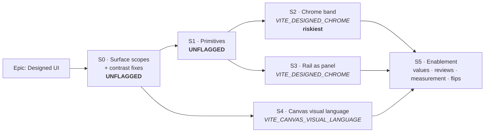

# Implementation Plan: Designed UI — surface scopes, a designed chrome band, and the canvas visual language

- **Feature spec:** [`feature-spec.md`](./feature-spec.md)
- **Decision record:** [ADR-0055](../../adr/0055-designed-chrome-and-canvas-visual-language.md) _(Proposed)_
- **Architecture note:** [`architecture-notes.md`](./architecture-notes.md)
- **Status:** Draft — awaiting approval
- **Owner:** _(to be assigned)_
- **Flags:** `VITE_DESIGNED_CHROME` (default **off** during build),
  `VITE_CANVAS_VISUAL_LANGUAGE` (default **off** during build)

> **Milestone spine.** S0–S5 follow the architecture note §6 sequencing exactly. No
> deviation is proposed: S0 must land first and alone (it is the accessibility fix), S1 can
> run alongside its tail, and S2/S3/S4 touch disjoint files (chrome shell · rail · canvas).
> The only refinements are internal: S2's keyboard-scope work is pulled **before** the
> portal within its own milestone (R1), and the flagged **token values** ride a root
> attribute so each flag's rollback is byte-for-byte for colour as well as structure
> (spec §4.7 D3).

## Breakdown

### Epic

**Designed UI** — make the whole product read as designed across all four themes, and fix
the six verified contrast defects **structurally** (in the token vocabulary, not at the call
sites) rather than multiplying them. Roadmap theme: UI quality / design-system maturity.

---

## S0 — Surface scopes & the contrast fixes (shippable slice, **UNFLAGGED**)

**Outcome:** every token family is complete on every surface in every theme; the six verified
contrast defects are gone; a computed contrast test makes their recurrence a failing build.
Light and Dark are **byte-identical to today**; Corporate goes from broken to correct. This
slice ships on its own merit even if nothing after it ever lands.

**Why unflagged:** it is an accessibility fix. Gating an accessibility fix behind an
in-progress redesign is how it ships in six weeks instead of one (ADR-0055 §6).

---

#### Feature S0-F1 — The token vocabulary

> **Description:** three complete surface families in three theme blocks, the two new global
> pairs (`--field*`, `--canvas*`), the two scope rules, and the `<Surface>` primitive that is
> the only way to apply a scope.
> **Complexity:** L
> **Dependencies:** none
> **Risks:** a `:root`-level `var()` alias freezes at computed-value time and silently ignores
> `.dark`/`.corporate` (spec §4.7 D10) → each theme block declares its own values, asserted by
> `token-architecture.test.ts`. · Dropping `inline` from `@theme` breaks the whole design (R6)
> → pinned by test.
> **Testing requirements:** `token-architecture.test.ts` (completeness, no chrome/panel
> utilities, `@theme inline` pin, exact rebind list), `surface.test.tsx`, existing primitive
> snapshots unchanged.

##### Task S0-T1 — Declare the three families, the two global pairs and the scope rules

- **Description:** rewrite the token section of `apps/web/src/styles/globals.css`. Add a
  complete `--chrome-*` and `--panel-*` family (fill · foreground · muted-foreground · border ·
  accent + accent-foreground · primary + primary-foreground · field + field-foreground ·
  destructive-text · warning-text · info-text · ring) to `:root` (`:27-110`), `.dark`
  (`:115-170`) and `.corporate` (`:196-261`). Add `--field`/`--field-foreground` and
  `--canvas`/`--canvas-band` **with** utilities in `@theme inline` (`:266-320`); add
  **neither** surface family to it. Add the two `[data-surface]` rules. Retire
  `--app-header-*` (`:91-93`, `:158-160`, `:246-248` + their `@theme inline` mappings
  `:300-302`). Keep `--sidebar-*` as a **`@deprecated` alias valued per block from `--panel-*`**.
  Add the two flag-keyed value-override layers (`[data-designed-chrome]`,
  `[data-canvas-visual-language]`) as empty-but-present blocks so later milestones have a home.
- **Values at this task:** chrome/panel in `:root` and `.dark` = **today's** page/sidebar
  values (byte-identical). `.corporate` chrome = the navy family, **completed** with a
  muted-foreground, three coloured inks, a field pair and an accent validated against navy.
  `.corporate` panel = **today's navy sidebar values, completed** (the light rail is a value
  change and lands at S3, flagged). `--canvas` = **`--card`'s value** in all three blocks
  (spec §4.7 D4 — makes the S4 `handleHalo` re-point a no-op today).
- **Complexity:** L
- **Dependencies:** none
- **Risks:** the Corporate chrome values are new and must clear contrast before anything
  consumes them → S0-T6 lands in the same PR or immediately after, and this task is not merged
  green-without-it.
- **Testing:** `token-architecture.test.ts` (S0-T6) is the acceptance gate; no visual test yet.
- **Development steps:**
  1. Add `--chrome-*` (15 tokens) and `--panel-*` (15 tokens) to each of the three blocks.
  2. Add `--field`/`--field-foreground` (default: the block's `--background`/`--foreground`
     **values**, written literally, not as `var()` — see spec §4.7 D10) and
     `--canvas`/`--canvas-band`.
  3. Map only `--color-field`, `--color-field-foreground`, `--color-canvas`,
     `--color-canvas-band` into `@theme inline`.
  4. Add `[data-surface='chrome']` and `[data-surface='panel']` with **exactly** the ADR-0055 §1
     rebind list.
  5. Delete `--app-header-*` and its `@theme inline` mappings; re-value `--sidebar-*` from
     `--panel-*` per block with a `@deprecated` comment and a `TECH_DEBT.md` removal entry.
  6. Add the two flag-attribute override layers with an explanatory comment (why they exist,
     when they are deleted).
  7. Update `docs/DESIGN_SYSTEM.md` — new **Surface scopes** section (the scope table, the three
     families, the "families with no utilities" rule).

##### Task S0-T2 — The `<Surface>` primitive

- **Description:** `components/ui/surface.tsx` exporting
  `<Surface tone="chrome" | "panel" as?={ElementType}>`, rendering the `data-surface` attribute
  plus `bg-background text-foreground` (which, inside its own scope, _are_ the surface colours).
  A `SurfaceToneContext` detects a nested same-tone surface and fails loud in dev / renders
  anyway in prod — the `defineToolbar` precedent (`components/ui/toolbar/toolbar-registry.ts`).
- **Complexity:** S
- **Dependencies:** S0-T1
- **Risks:** a `SurfaceContext` must not tempt components into branching on surface in JS
  (`FRONTEND_ARCHITECTURE.md` forbids it) → the context carries **only** the tone for the
  nesting invariant and is not exported.
- **Testing:** `surface.test.tsx` — renders the attribute; `as` renders the right element;
  nested same tone throws in test env; nested _different_ tone is legal (panel inside chrome is
  never used today but is not an error).
- **Development steps:**
  1. Write the component + the non-exported nesting context.
  2. Tests.
  3. `docs/COMPONENT_LIBRARY.md` — the `Surface` contract and the "a scope is a component, not a
     class" rule.

##### Task S0-T3 — Field surface + the `outline` ink bug

- **Description:** `components/ui/button.tsx:13` — `outline` gains `text-foreground` (defect D3,
  half one: a variant that specifies a fill and inherits its ink is a bug on any surface).
  `input.tsx:17`, `textarea.tsx`, `select.tsx`, `search-field.tsx`, `combobox.tsx` move
  `bg-background` → `bg-field text-field-foreground`.
- **Complexity:** S
- **Dependencies:** S0-T1
- **Risks:** five primitives × their snapshots (R9) → byte-identical at `:root` by construction;
  review the snapshot churn in this one PR rather than spreading it.
- **Testing:** existing `form.test.tsx`, `combobox.test.tsx`, `search-field.test.tsx`,
  `data-table.test.tsx` must pass unchanged; add one assertion that `outline` carries an ink class.
- **Development steps:**
  1. `button.tsx` outline ink.
  2. The five field primitives → `bg-field text-field-foreground`.
  3. Run the web unit suite; review snapshot diffs (expect none).

---

#### Feature S0-F2 — Applying the scopes (the defect fix)

> **Description:** wrap the header in a `chrome` scope and all three rail presentations in a
> `panel` scope, and delete the `--app-header-*` / `--sidebar-*` utilities from the call sites.
> This is where D1, D2, D5 and D6 stop being defects, **without touching the files that carry
> them**.
> **Complexity:** M
> **Dependencies:** S0-F1
> **Risks:** the below-`lg` drawer portals to `document.body` and would otherwise paint page
> colours (spec §4.7 D9) → it carries its own scope, asserted.
> **Testing requirements:** a computed-style test that all three rail presentations resolve the
> same background; the axe e2e (S0-T8) asserting the six named sites.

##### Task S0-T4 — Header on the `chrome` scope

- **Description:** `components/layout/app-header.tsx:36` — replace
  `border-app-header-border bg-app-header text-app-header-foreground` with
  `<Surface tone="chrome" as="header">` + `border-border`. **No structural change yet** (the
  full-bleed restructure is S2); the `max-w-6xl` at `:39` stays for now.
- **Complexity:** S
- **Dependencies:** S0-T2
- **Risks:** none material; this is a pure token move.
- **Testing:** unit — the header renders `data-surface="chrome"`; nav idle/hover/current-page
  computed inks come from the chrome family.
- **Development steps:**
  1. Swap the classes for `<Surface>`.
  2. Confirm `NAV_LINK_CLASS` (`:13-14`) is **unchanged** — that is the point of the mechanism.
  3. Confirm `--app-header-*` now has zero consumers repo-wide.

##### Task S0-T5 — All three rail presentations on the `panel` scope

- **Description:** wrap `NavigatorRail` (`navigator-rail.tsx:45`), `NavigatorRailCollapsed`
  (`:123`) **and** the `Sheet` drawer's content (`app-shell.tsx:118-125`) in
  `<Surface tone="panel">`. Replace `bg-sidebar` / `text-sidebar-foreground` /
  `border-sidebar-border` (`navigator-rail.tsx:45,53,99,123`), `bg-sidebar-border/60`,
  `hover:bg-sidebar-border`, `focus-visible:bg-sidebar-ring` (`rail-resizer.tsx:33`) and
  `bg-sidebar-accent` / `hover:bg-sidebar-accent/50` (`HierarchyTree.tsx:366-367`) with the
  ordinary page utilities the scope rebinds.
- **Complexity:** M
- **Dependencies:** S0-T2
- **Risks:** the resizer sits **between** the rail and `<main>` — decide deliberately whether it
  is inside the panel scope (it is: it is rail chrome) and assert its computed colour.
- **Testing:** unit — pinned, collapsed and drawer rails resolve the same computed
  `background-color`; `HierarchyTree` empty/error rows (`:302-305`) resolve panel inks; existing
  `HierarchyTree.crud.test.tsx` unchanged.
- **Development steps:**
  1. Wrap the three presentations.
  2. Migrate the seven `sidebar-*` utility sites.
  3. Add the same-computed-background test.
  4. Confirm the rail still does **not** remount on a plan switch (ADR-0029) — existing test.

---

#### Feature S0-F3 — The gates that stop this recurring

> **Description:** the machine checks. Every defect in the spec's Context is a contrast defect
> that no reviewer caught by reading class names, so the gate has to compute, not review.
> **Complexity:** L
> **Dependencies:** S0-F1, S0-F2
> **Risks:** an over-broad ESLint rule that everyone disables is worse than a narrow one that
> holds (spec §4.7 D12).
> **Testing requirements:** these tasks **are** the testing.

##### Task S0-T6 — `token-architecture.test.ts` + `token-contrast.test.ts`

- **Description:** two sibling test files in `apps/web/src/styles/`, plus a shared colour helper
  extracted to `apps/web/src/test/colour.ts` (OKLCH → sRGB, relative luminance, contrast ratio,
  **alpha compositing over a given fill**) so `lenses.test.ts`, `palette.test.ts` and these two
  stop each carrying a copy.
  - **`token-architecture.test.ts`** — parses `globals.css` and asserts: `@theme` carries
    `inline` (failure message quotes ADR-0055 §1); `--chrome-*`/`--panel-*` appear in **no**
    `@theme` block (so `bg-chrome` cannot compile); each family is **complete** in each of the
    three blocks, naming any missing token; each `[data-surface]` rule rebinds **exactly** the
    ADR-0055 §1 list — no more, no fewer.
  - **`token-contrast.test.ts`** — for **3 token blocks × 3 scopes × 2 flag states**, asserts
    the pair matrix in spec §2 "Validation rules": text ≥ 4.5:1, non-text (ring, input) ≥ 3:1,
    including the never-before-checked **(field, muted-foreground)** placeholder pair. `--border`
    is reported, not asserted (decorative separators are WCAG 1.4.11-exempt) — with a comment
    saying so, because an unexplained soft rule is how the next defect gets in.
- **Complexity:** L
- **Dependencies:** S0-T1
- **Risks:** Dark's alpha tokens (`--border: oklch(1 0 0 / 10%)`) must be composited over the
  scope fill, not treated as opaque → covered by the shared helper and its own unit test.
- **Testing:** self-testing; plus a deliberate red-then-green check (temporarily break one pair,
  confirm the failure names the pair and the ratio).
- **Development steps:**
  1. Extract `src/test/colour.ts` and re-point `lenses.test.ts` / `palette.test.ts` at it.
  2. Write a small CSS-block parser (regex over the three block bodies + the `@theme` body).
  3. `token-architecture.test.ts`.
  4. `token-contrast.test.ts`, both flag states.
  5. Red-then-green check on one pair per scope.

##### Task S0-T7 — Structural seam test + the ESLint colour-literal rule

- **Description:** a seam test (the ADR-0053 precedent) asserting `--chrome`, `--panel` and
  `data-surface` appear only in `styles/globals.css`, `components/ui/surface.tsx` and an explicit
  allowlist (`surface.test.tsx`, `token-*.test.ts`, `e2e-designed-ui/**`). Plus an ESLint
  `no-restricted-syntax` rule rejecting `#rgb`/`rgb(`/`rgba(`/`hsl(`/`oklch(` inside `className`
  and `style` JSX attributes under `apps/web/src/components/**`, with `features/tsld/render/**`
  exempt (documented literal fallbacks at `palette.ts:14-17`).
- **Complexity:** M
- **Dependencies:** S0-T2
- **Risks:** false positives on legitimate non-colour `style` usage (the rail's
  `style={{ width }}` at `app-shell.tsx:98`, the ruler's `style={{ height: RULER_HEIGHT }}`) →
  the rule matches **colour literals**, not the `style` attribute itself.
- **Testing:** the seam test itself; an ESLint rule fixture (one violating and one passing file)
  run by the config's own tests if present, otherwise a documented manual check.
- **Development steps:**
  1. Seam test + allowlist.
  2. Add the rule to `packages/config`'s web ESLint preset with an `overrides` block.
  3. `pnpm lint` clean across the repo (fix any pre-existing violation it surfaces, or record
     it in `TECH_DEBT.md` if out of scope).

##### Task S0-T8 — Theme-parametrised axe scan + docs

- **Description:** a new Playwright project `e2e-designed-ui/designed-ui.spec.ts` +
  `playwright.designed-ui.config.ts` + `test:e2e:designed-ui` script + a CI step (the
  `e2e-library` precedent). It runs over the **four picker options** — `light`, `dark`,
  `corporate`, and `system` under `prefers-color-scheme: dark` emulation (spec §4.7 D1) —
  asserting zero `wcag2a`/`wcag2aa` violations on the shell **and** the six named defect sites
  specifically: nav idle, nav hover, nav current-page, the account area, the rail muted text and
  the tree error/empty row. Naming them individually matters: "axe is clean" would have passed
  on D3 (an invisible button is not an axe rule).
- **Complexity:** M
- **Dependencies:** S0-T4, S0-T5
- **Risks:** hover-state contrast is not something axe measures → assert the computed colour pair
  directly for the hover and current-page cases, via `getComputedStyle` in the page.
- **Testing:** this task is the test.
- **Development steps:**
  1. Playwright config + script + CI step.
  2. A `setTheme(page, theme)` helper (writes `schedulepoint-theme` to `localStorage`, reloads).
  3. The four-theme axe loop.
  4. The six explicit computed-contrast assertions.
  5. Docs: `FRONTEND_ARCHITECTURE.md` "Theme management" — the scope mechanism, the
     **`@theme inline` is load-bearing** warning, and the computed-value-time substitution rule
     (spec §4.7 D10). `FRONTEND_QUALITY.md` — the new gates.
  6. Changeset (patch: an accessibility fix, no user-visible feature).

**S0 exit criteria:** S1–S9 of the spec's success criteria that are in scope here (S1, S2, S8,
S9) are green; Light and Dark render byte-identically to `main`; Corporate's six defects are
gone; `pnpm lint && pnpm typecheck && pnpm test` green.

---

## S1 — Primitives (shippable slice, **UNFLAGGED**)

**Outcome:** the redesign's repeated patterns exist as shared, tested primitives before any
surface consumes them — so "no one-off styling" survives the epic. Two of the six defects (D3's
element, D4) are fixed by **deletion**.

**Parallelism:** can run alongside the tail of S0; the five tasks are independent of each other
and can be split across two people.

---

#### Feature S1-F1 — Shared controls

> **Description:** `SegmentedControl` (extracted), `ToggleChip` (new), `CheckboxField`
> `density="compact"`, and the split-button _look_.
> **Complexity:** M
> **Dependencies:** S0-F1 (tokens), S0-T2 (`Surface`, for the scope-aware tests)
> **Risks:** extracting a shipped, reviewed control can silently drop an a11y behaviour →
> `WorkspaceViewToggle`'s existing tests must pass **unchanged**, not be rewritten.
> **Testing requirements:** APG keyboard behaviour per control; `aria-pressed` + result-count
> announcement for `ToggleChip`; one roving-tabindex stop preserved for the split look.

##### Task S1-T1 — Extract `SegmentedControl`

- **Description:** lift the APG `radiogroup` in `components/layout/workspace/workspace-view-toggle.tsx`
  (roving tabindex, Arrow/Home/End, `aria-checked`) into `components/ui/segmented-control.tsx` as a
  generic `<SegmentedControl<T> value options onChange label>`; re-point `WorkspaceViewToggle` at it.
- **Complexity:** M · **Dependencies:** none · **Risks:** see feature
- **Testing:** new `segmented-control.test.tsx` (keyboard matrix, `aria-checked`, focus follows
  selection); `WorkspaceViewToggle`'s existing tests pass **unchanged**.
- **Development steps:** 1. Extract with the existing markup/behaviour verbatim. 2. Re-point the
  caller, keeping its `min-h-11` touch target. 3. Tests. 4. `COMPONENT_LIBRARY.md` entry + the
  **segmented vs chip** rule.

##### Task S1-T2 — `ToggleChip`

- **Description:** `components/ui/toggle-chip.tsx` — a CVA `aria-pressed` button for
  **independent booleans** (Critical / Chain). Presentational `Badge` is explicitly _not_ this.
- **Complexity:** S · **Dependencies:** none
- **Risks:** a chip that filters but does not announce its effect is a WCAG 4.1.3 miss → the
  contract requires the consumer to change an announced result count (the `LIBRARY_SCOPING` M6
  precedent); the component's docblock says so and its test asserts the pressed state.
- **Testing:** `toggle-chip.test.tsx` — `aria-pressed` toggles, keyboard activation, disabled
  state, token-only styling.
- **Development steps:** 1. Component + CVA variants. 2. Tests. 3. `COMPONENT_LIBRARY.md`.

##### Task S1-T3 — `CheckboxField` compact density + the split-button look

- **Description:** `components/ui/form.tsx:85` gains `density?: 'default' | 'compact'` for
  inline/toolbar use (the reference's Day grid / Month grid / Year grid / Today line /
  Non-working row). Separately, add a `splitCaret` variant to
  `components/ui/toolbar/toolbar-styles.ts` and apply it in `AddActivityControl`
  (`features/tsld/toolbar/tsld-toolbar-items.tsx:210-242`) — **the look only** (spec §4.7 D11).
- **Complexity:** S · **Dependencies:** none
- **Risks:** a true split button would be two focus stops inside one toolbar item and would
  re-open ADR-0031's a11y gate → assert **one** `data-toolbar-item` stop remains.
- **Testing:** `form.test.tsx` — compact density keeps the label association and the ≥ 24 px
  target; `Toolbar.test.tsx` — the Add control is still exactly one roving stop.
- **Development steps:** 1. `density` prop. 2. `splitCaret` variant + apply. 3. Tests. 4. `docs/TOOLBAR_ROADMAP.md` — record **composite toolbar stops** (the true split button, the
  2×2 zoom pad) as a deliberate deferral.

---

#### Feature S1-F2 — Brand mark and account chip

> **Description:** the two layout-tier components the band needs, one of which deletes two of the
> six defects.
> **Complexity:** M
> **Dependencies:** S0-F1
> **Risks:** removing the always-visible email changes a `data-testid` (R11) → verified to be
> referenced only in `app-header.tsx:104`.
> **Testing requirements:** menu focus return; sign-out still navigates to `/sign-in`.

##### Task S1-T4 — `BrandMark`

- **Description:** `components/layout/brand-mark.tsx` — the rounded-square tile + "SchedulePoint"
  wordmark. The tile is `bg-primary text-primary-foreground`, i.e. amber in Corporate chrome and
  the brand blue in Light/Dark chrome. **Never a literal colour** — a hard-coded amber would fail
  contrast on the Light chrome and would be a one-off-styling violation.
- **Complexity:** S · **Dependencies:** S0-T1 · **Risks:** none material
- **Testing:** renders inside a chrome `Surface` and resolves `--chrome-primary`; the wordmark is
  the accessible name of the home link.
- **Development steps:** 1. Component (tier 2 — it carries brand copy). 2. Test. 3.
  `DESIGN_SYSTEM.md` inventory entry.

##### Task S1-T5 — `AccountChip` (deletes defects D3-element and D4)

- **Description:** `components/layout/account-chip.tsx` — an avatar/initials trigger opening the
  existing portalled `Menu` (`components/ui/menu.tsx`) containing the theme control, the user's
  email and Sign out. Replaces `app-header.tsx:100-123` (`ThemeToggle`, the email ``, the
  `variant="outline"` Sign out). The menu paints on `--popover` because portals are outside every
  scope — which is exactly why the chip's contents are safe.
- **Complexity:** M · **Dependencies:** S0-T2
- **Risks:** sign-out is a mutation with `isPending`/`aria-busy` state (`app-header.tsx:111-113`)
  that must survive the move into a menu item → keep the pending/disabled semantics, and test
  them.
- **Testing:** `account-chip.test.tsx` — opens/closes, **focus returns to the trigger**, email is
  rendered inside the menu (not in the header), sign out calls the mutation and navigates on
  success, pending state disables the item. Update any e2e touching sign-out.
- **Development steps:** 1. Component. 2. Delete `app-header.tsx:101-108` and `:109-123`; render
  `<AccountChip/>`. 3. Move `ThemeToggle` into the menu. 4. Tests. 5. Changeset (patch).

**S1 exit criteria:** five primitives exist with tests; `WorkspaceViewToggle`'s tests unchanged;
D3's element and D4 deleted; suite green.

---

## S2 — The chrome band (shippable slice, **`VITE_DESIGNED_CHROME`**) — **riskiest**

**Outcome:** with the flag on, the header row and the plan's two toolbar rows render as **one**
full-bleed band, with the rail and workspace below it — and every keyboard contract still works.
Flag off renders today's shell byte-for-byte.

**Ordering inside the milestone is deliberate:** the keyboard scope is refactored and
regression-tested **before** the portal exists. Two shipped keybinding contracts break
_silently_ under a portal; silently is the problem.

---

#### Feature S2-F1 — The workspace keyboard scope

> **Description:** convert the two native `keydown` listeners on the workspace root into one
> React `onKeyDown`, which works through a portal by construction (spec §4.7 D2).
> **Complexity:** M
> **Dependencies:** none (can land before the portal, and should)
> **Risks:** R1 — the highest-impact risk in the epic. Mitigated by landing the fix **first**,
> with a regression test per binding, so the portal cannot introduce a silent regression.
> **Testing requirements:** four regression tests (one per binding) with focus on a control that
> is a React child but **not** a DOM descendant of the workspace root.

##### Task S2-T1 — `useUndoRedoKeybindings` returns a handler

- **Description:** change `features/undo-redo/use-undo-redo-keybindings.ts:21-75` from
  "attach to `rootRef`" to "return a `React.KeyboardEventHandler`". Keep every existing
  behaviour: modal-open inertness via a ref, the bare-key early-out, the text-field/contenteditable
  bail, and `preventDefault()` on each handled combo (ADR-0048 Back-suppression, TECH_DEBT #25).
  Drop the `rootRef` parameter.
- **Complexity:** M · **Dependencies:** none
- **Risks:** `preventDefault()` on a React synthetic event must still reach the native event → it
  does; asserted explicitly in the rewritten unit test **and** re-verified by the flag-on
  `e2e-undo/undo.spec.ts` Chromium Back-suppression assertion.
- **Testing:** rewrite `use-undo-redo-keybindings.test.ts` to render a host and use
  `fireEvent.keyDown` on a **portalled** child; assert undo / redo / `Ctrl+Y` / modal-inert /
  field-inert / `preventDefault` called.
- **Development steps:** 1. Change the signature + docblock. 2. Rewrite the test, including a
  portalled-child case. 3. Update the caller (`plan-workspace-toolbar.tsx:268-275`).

##### Task S2-T2 — `usePlanWorkspaceKeyScope` and the `?` shortcut

- **Description:** new `components/layout/workspace/use-plan-workspace-key-scope.ts` composing the
  `?` handler (today `plan-workspace-toolbar.tsx:153-166`) with S2-T1's undo/redo handler into a
  single `onKeyDown`, bound once on the workspace root (`:441`). Preserves the existing guards:
  no modifier keys, not while typing, not while `anotherDialogOpen`.
- **Complexity:** S · **Dependencies:** S2-T1
- **Risks:** handler composition order could let one binding swallow another → the `?` handler
  returns early on any modifier, and undo/redo returns early without one; assert both in one test.
- **Testing:** four regression tests — `?`, `Cmd/Ctrl+Z`, `Cmd/Ctrl+Shift+Z`, `Ctrl+Y` — each with
  focus on a portalled toolbar control. Plus: `Alt+←/→` time-nudge unaffected
  (`TSLD_EDITING_ENABLED`), and the ADR-0048 "undo must not trigger browser Back" e2e re-run.
- **Development steps:** 1. Hook + tests. 2. Delete the `useEffect` at `:153-166`. 3. Bind
  `onKeyDown` on `:441`. 4. Run `pnpm --filter @repo/web test:e2e:undo`.

---

#### Feature S2-F2 — The band, the slot and the portal

> **Description:** restructure the shell from `column[ header ][ row(rail | main) ]` to
> `column[ Surface chrome( header + ChromeSlot ) ][ row( Surface panel rail | main ) ]`, with the
> toolbar rendered through a portal so the React tree — and therefore
> `usePlanWorkspaceModel`, `useTsldToolbarContext` and every registry predicate — is untouched.
> **Complexity:** L
> **Dependencies:** S2-F1, S1-F2, S0-F2
> **Risks:** making the shell plan-aware would contradict ADR-0029 → the portal keeps the state
> where it is; the shell only owns a DOM node. · Band height changing on navigation (R4) →
> asserted.
> **Testing requirements:** flag-off shell parity suite; focus-order test; viewport-preserve test;
> "rail does not remount" test.

##### Task S2-T3 — `ChromeSlot` + `ChromePortal` + the flag

- **Description:** `components/layout/chrome/chrome-slot.tsx` — a slot component publishing its DOM
  node through a context as **state** (a callback ref setting `useState`, because `createPortal`
  consumers must re-render when the node mounts), and `<ChromePortal>` which `createPortal`s its
  children into that node when `DESIGNED_CHROME_ENABLED` and is an **identity wrapper** when it is
  not. Add `VITE_DESIGNED_CHROME` to `config/env.ts` (`flagDefaultOff`) and `.env.example`, and
  stamp `data-designed-chrome` on `<html>` in `main.tsx` before `createRoot().render()`.
- **Complexity:** M · **Dependencies:** S0-T1 (the flag override layer exists)
- **Risks:** rendering before the slot mounts → return `null` for that commit; never render in
  place, or the toolbar would appear twice on the flip.
- **Testing:** `chrome-slot.test.tsx` — portal lands in the slot; no slot ⇒ renders nothing and
  does not throw; flag off ⇒ children render in place (identity).
- **Development steps:** 1. Flag + `.env.example` + `main.tsx` attribute. 2. Slot + context +
  portal. 3. Tests.

##### Task S2-T4 — Restructure the shell and go full-bleed

- **Description:** `components/layout/navigator/app-shell.tsx:89-115` — wrap the header row and
  `<ChromeSlot/>` in `components/layout/chrome/chrome-band.tsx` (`<Surface tone="chrome">`,
  full-bleed, sticky, `border-b`); the rail row moves below it. `app-header.tsx` drops its
  `mx-auto max-w-6xl` (`:39`) and the now-false comment at `:37-38`. **Route bodies keep their
  `max-w-6xl`** (17 occurrences, 10 files) — chrome is full-bleed, content is measure-capped.
  `plan-workspace-toolbar.tsx:473-491` wraps its two `<Toolbar>` rows in `<ChromePortal>`;
  `components/ui/toolbar/*` and the registry are **not edited**.
- **Complexity:** L · **Dependencies:** S2-T3, S2-F1
- **Risks:** the sticky band's `z-index` vs the ruler (`TsldCanvas.tsx:1232` uses `z-10`) and the
  `Sheet` overlay → verify stacking explicitly in the Playwright journey. · The `lg` drawer
  trigger lives in the header (`app-header.tsx:40-50`) and must still open the drawer.
- **Testing:** flag-off **shell parity suite** (`vi.mock` of `@/config/env` with
  `DESIGNED_CHROME_ENABLED: false`, pinning the current DOM shape — the rollback contract, kept
  not weakened); flag-on structure test; "rail does not remount on plan switch"; band height 1 row
  with no plan / 3 rows with a plan.
- **Development steps:** 1. `chrome-band.tsx`. 2. Restructure `app-shell.tsx`. 3. Full-bleed
  header + retire the comment. 4. `<ChromePortal>` the two toolbar rows. 5. Parity + structure
  tests.

##### Task S2-T5 — Focus order, viewport preservation and the journey

- **Description:** assert the two consequences the ADR calls out explicitly: tab order becomes
  brand → nav → account chip → toolbar row 1 → toolbar row 2 → rail → workspace (an improvement on
  today, and now the DOM order too); and opening a plan grows the band by two rows **without
  re-fitting the canvas viewport** (ADR-0030's viewport-preserve amendment should absorb it — a
  re-fit on every plan open would be an obvious regression).
- **Complexity:** M · **Dependencies:** S2-T4
- **Risks:** a re-fit is easy to miss by eye → assert the viewport `originX`/`pxPerDay` are
  unchanged across the resize.
- **Testing:** Playwright focus-order assertion in `e2e-designed-ui`; a workspace integration test
  for viewport preservation; flag-on axe over the band.
- **Development steps:** 1. Focus-order test. 2. Viewport-preserve test. 3. Extend the S0 axe
  journey to the flag-on band. 4. Changeset (minor, pre-1.0 convention).

**S2 rollback:** `VITE_DESIGNED_CHROME=false` ⇒ `ChromePortal` is an identity wrapper, the shell
renders today's `column[ header ][ row(rail|main) ]`, the header re-centres at `max-w-6xl`, the
`data-designed-chrome` attribute is absent so chrome/panel values are today's. Pinned by the
flag-off shell parity suite.

---

## S3 — The rail as a light panel (shippable slice, **`VITE_DESIGNED_CHROME`**)

**Outcome:** with the flag on, the Project Explorer is a light working surface with a designed
tree — one dark band and two light surfaces instead of three competing regions.

**Parallelism:** disjoint files from S2 and S4; can run alongside both once S0/S1 are in.

---

#### Feature S3-F1 — Panel values and the designed tree

> **Description:** the light panel **values** (behind the flag attribute) plus the rail's visual
> refresh: tree accent bars, indent + icon language, the `+ Client` primary button.
> **Scope note (spec CQ-2):** the reference's rail **search field and All / Clients / Projects /
> Plans chips are NOT in this milestone.** The tree loads lazily, one query per expanded node
> (`features/navigator/hooks/use-hierarchy-tree.ts:47,63,81,111`), so neither is buildable
> client-side; both need an org-scoped hierarchy **search endpoint** and belong to their own
> feature spec.
> **Complexity:** M
> **Dependencies:** S0-F2 (scope applied)
> **Risks:** pressure to add the filter "since we're in here" → it would turn a frontend-only
> epic into one with an API milestone, new DTOs and a security review. Held by CQ-2.
> **Testing requirements:** contrast test covers the flag-on panel values; flag-off parity;
> a11y over the tree unchanged.

##### Task S3-T1 — Light panel values under the flag attribute

- **Description:** populate `[data-designed-chrome]`'s per-block override layer with the light
  `--panel-*` family for `.corporate` (and confirm `:root`/`.dark` are unchanged here — their
  values land at S5). This is the one place Corporate's rail goes navy → light.
- **Complexity:** S · **Dependencies:** S0-T1, S2-T3 (the attribute is stamped)
- **Risks:** a light rail beside a light canvas needs a real boundary → the rail keeps its
  `border-r` and gets a distinct `--panel` value from `--background`, asserted at ≥ 1.2:1 against
  the page (reported, not gated — it is a preference, not a WCAG rule).
- **Testing:** `token-contrast.test.ts` flag-on state covers the panel scope in all three blocks.
- **Development steps:** 1. Values. 2. Re-run the contrast gate. 3. Visual check in all four
  picker themes.

##### Task S3-T2 — The rail's designed surface

- **Description:** rail header gets the solid-primary `+ Client` button (existing RBAC gate
  unchanged, `navigator-rail.tsx:60`); `HierarchyTree` client rows gain a left accent bar and bold
  labels, projects indent with folder icons and plans use calendar icons (re-treating the existing
  `Building2` / `Folder` / `CalendarRange` icons, `HierarchyTree.tsx:3`). All token-only. **No
  search field, no type filter** (CQ-2).
- **Complexity:** M · **Dependencies:** S3-T1
- **Risks:** the tree is an APG `tree` with roving focus and virtualization (ADR-0029) — a visual
  change must not perturb `rowStyle`/`aria-level`/`aria-posinset`/`aria-setsize` → existing
  `HierarchyTree.crud.test.tsx` and the tree a11y tests must pass unchanged. · An accent bar drawn
  as a border would shift the virtualized row geometry → draw it inside the row's existing box.
- **Testing:** flag-off rail parity suite; axe over the rail in four themes; the existing tree
  tests unchanged; virtualized row height unchanged.
- **Development steps:** 1. Header control treatment. 2. Tree row treatment (accent bar, weight,
  icons). 3. Parity + a11y tests. 4. Changeset.

**S3 rollback:** `VITE_DESIGNED_CHROME=false` ⇒ no attribute ⇒ Corporate's rail is navy again and
the rail renders today's header/tree, byte-for-byte (parity suite).

---

## S4 — The canvas visual language (shippable slice, **`VITE_CANVAS_VISUAL_LANGUAGE`**)

**Outcome:** with the flag on, the diagram sits on its own ground with alternating month bands, a
tiered ruler and a TODAY chip, and the bars/links are retuned — all inside ADR-0026's ≤ 4 ms p95
budget. Flag off paints byte-for-byte.

**Parallelism:** disjoint from S2/S3.

---

#### Feature S4-F1 — Ground, bands and one boundary walk

> **Description:** the `--canvas` token, layer −0.5 month banding, and the unification of the two
> month/year rollover walks so the DOM ruler and the canvas bands can never disagree by a day.
> **Complexity:** L
> **Dependencies:** S0-T1 (`--canvas` exists, valued as `--card`)
> **Risks:** R2 (`handleHalo`), R5 (draw budget), band parity inverting under pan (spec §4.7 D5).
> **Testing requirements:** `paint.band-budget.test.ts`, `time-scale.boundaries.test.ts`,
> `palette.test.ts` extended to three token blocks, flag-off paint parity.

##### Task S4-T1 — Unify the month/year boundary walk

- **Description:** `render/time-scale.ts` — `rulerTicks()` (`:108-148`) and `calendarBoundaries()`
  (`:162-189`) are two implementations of the same integer-rollover walk. Unify onto one exported
  walk returning true boundaries; `rulerTicks` layers its "sticky first column" label seed on top
  (a **label** behaviour, not a boundary — spec §4.7 D8).
- **Complexity:** M · **Dependencies:** none
- **Risks:** the walk is on the per-frame path; it must stay allocation-light and keep the
  single-anchor-parse property (no per-day `Date` parsing) → assert no `Date` construction inside
  the loop via the existing counting-stub style, or by review + a fixed-iteration benchmark.
- **Testing:** new `time-scale.boundaries.test.ts` — for a zoom sweep (day → year) and a pan
  sweep, every ruler month tick `x` equals `screenXOfDay(boundary)`; existing `time-scale` tests
  unchanged.
- **Development steps:** 1. Extract the shared walk. 2. Re-point both callers. 3. Tests.

##### Task S4-T2 — `--canvas` ground, cream Corporate value, `handleHalo` re-point

- **Description:** `TsldCanvas.tsx:1226` `bg-card` → `bg-canvas`; `render/palette.ts:54`
  `handleHalo` `--color-card` → `--color-canvas` (a **no-op today** by spec §4.7 D4); add
  `monthBand` to `TsldPalette` and a **light** `monthBand` + `handleHalo` to `PrintPalette` so it
  stays total. Put the cream `--canvas` / `--canvas-band` values for `.corporate` into the
  `[data-canvas-visual-language]` override layer; `--canvas-band` is authored **opaque** (spec
  §4.7 D7).
- **Complexity:** M · **Dependencies:** S4-T1 not required; S0-T1 required
- **Risks:** **R2** — the theme-inverse pairing between `outline` (core) and `handleHalo` (halo)
  is what makes one lag handle legible on every bar fill. It is currently pinned for **light and
  dark only** (`palette.test.ts:176-179`).
- **Testing:** extend `palette.test.ts` to **all three token blocks** and re-prove
  `max(core, halo) ≥ 3:1` per bar fill plus the pair's own separation, **with the new cream
  ground**. Also: `resolvePrintPalette` totality test covers `monthBand`.
- **Development steps:** 1. Palette field + print fallback. 2. Re-point `handleHalo` + update its
  docblock (the rationale sentence at `:50-53` moves with it). 3. Cream values under the flag
  attribute. 4. Extend `palette.test.ts` to three blocks. 5. `bg-canvas` on the container.

##### Task S4-T3 — Month bands at layer −0.5 + the budget gate

- **Description:** `render/paint.ts` — hoist the `calendarBoundaries` call so bands and month/year
  gridlines share **one** walk per frame (today it is inside `if (toggles.monthGrid || toggles.yearGrid)`
  at `:795`). Insert layer −0.5 **before** the non-working wash (`:770`): one `fillStyle`, then
  ≤ `visibleMonths + 1` `fillRect`. Parity is `(year * 12 + month) % 2` — **calendar-derived, so it
  cannot invert under pan** (spec §4.7 D5). Banding is ground, so it does **not** follow the
  `Month grid` toggle (spec §4.7 D6). The scene carries an optional `monthBands?: boolean` the flag
  sets, so flag-off paints byte-for-byte and the budget test can flip it.
- **Complexity:** M · **Dependencies:** S4-T1, S4-T2
- **Risks:** **R5** — a new fill pass in the tightest loop in the app.
- **Testing:** new `render/paint.band-budget.test.ts`, modelled exactly on
  `render/paint.dates-budget.test.ts` (the ADR-0054 M3-T5 counting-stub gate): on the
  2,000-activity fixture, bands-on vs bands-off adds **≤ visibleMonths + 1 `fillRect`** and
  **exactly zero `fillText`/`measureText`**, at **day zoom** and at **year zoom over a ten-year
  span** (the pathological case). Assert the _shape_ of the cost, not milliseconds — a CI runner's
  absolute timings are noise. Plus a **parity-stable-under-pan** test.
- **Development steps:** 1. Hoist the walk. 2. Layer −0.5. 3. Budget test (both zooms). 4. Parity
  test. 5. Confirm the weekend wash still reads **on top of** the band.

---

#### Feature S4-F2 — The ruler and the TODAY chip (DOM)

> **Description:** redesign the ruler in DOM (where it already is, and where it costs the draw
> budget nothing) and add the TODAY chip beside it.
> **Complexity:** M
> **Dependencies:** S4-T1
> **Risks:** a DOM element over the canvas that swallows a pan gesture.
> **Testing requirements:** chip is `aria-hidden` + `pointer-events-none`; clamps off-screen;
> pan/zoom still work through the ruler band.

##### Task S4-T4 — Tiered ruler redesign

- **Description:** `TsldCanvas.tsx:1229-1246` — three absolutely-positioned rows become the
  reference's tiered treatment (year centred, month names, day numbers) plus an alternating month
  tint, still updated imperatively by `syncRulerRow` (`:436-459`) from the same `viewRef`
  (`:930-947`), with the existing pooled zero-allocation reconcile and `clampLeft` sticky labels.
  Uses S4-T1's shared walk so tints and canvas bands land on identical day offsets.
- **Complexity:** M · **Dependencies:** S4-T1
- **Risks:** adding DOM nodes per visible month at year zoom → the pool already reuses nodes and
  hides the surplus; assert the pool does not grow unboundedly across a zoom sweep.
- **Testing:** ruler tick positions unchanged for the existing cases; tint bands align with canvas
  bands (S4-T1's test covers the offsets); node-pool growth bounded.
- **Development steps:** 1. Row markup + token-only tints. 2. Re-point at the shared walk. 3.
  Tests.

##### Task S4-T5 — TODAY chip

- **Description:** a DOM chip in the ruler band positioned from the same `todayOffset` +
  `screenXOfDay` the painter uses for the dashed vertical (`paint.ts:1134-1146`). `aria-hidden` and
  `pointer-events-none` like the rest of the ruler (`TsldCanvas.tsx:1230-1232`). Clamps out of
  existence when today is off screen. The dashed vertical stays on canvas. **Canvas cost: zero.**
- **Complexity:** S · **Dependencies:** S4-T4
- **Risks:** losing `pointer-events-none` would swallow pan gestures → asserted.
- **Testing:** renders when today is visible, absent when not; `aria-hidden`; a pointer-down at the
  chip's coordinates still starts a pan.
- **Development steps:** 1. Chip. 2. Tests.

---

#### Feature S4-F3 — Bars and links: constants only

> **Description:** retune named constants. **No new shape vocabulary, no shadows, no per-bar
> gradients.**
> **Complexity:** S
> **Dependencies:** S4-T2
> **Risks:** a constants change silently breaks a pinned geometry test.
> **Testing requirements:** existing paint geometry tests updated **in the same commit**, each
> diff explained.

##### Task S4-T6 — The constants pass

- **Description:** retune `BAR_RADIUS`, `EMPHASIS_STROKE_W`, link line widths and arrowhead size
  as named constants in `render/render-model.ts`. Explicitly out: new shapes (the existing
  vocabulary — milestone diamond, square resize marks, triangle conflict badge, stacked-squares
  overlap badge, rising-histogram over-allocation badge, two-tone disc lag handle, hatched
  float/drift tails — each carries WCAG 1.4.1 meaning colour does not); `shadowBlur`; per-bar
  gradients.
- **Complexity:** S · **Dependencies:** S4-T2
- **Risks:** the honest assessment is that the visible gap to the reference is ~90 % chrome/ground/
  ruler and ~10 % bar shape — resist scope creep here.
- **Testing:** existing paint tests updated with a one-line rationale per changed expectation; the
  shape-vocabulary set asserted unchanged (a structural test listing the drawn shapes, if one
  exists; otherwise reviewer checklist + the legend test `TsldLegendPanel.test.tsx`).
- **Development steps:** 1. Retune. 2. Update pinned tests with rationale. 3. Visual check at three
  zooms in four themes.

##### Task S4-T7 — Flag, attribute and flag-off paint parity

- **Description:** add `VITE_CANVAS_VISUAL_LANGUAGE` to `config/env.ts` (`flagDefaultOff`) and
  `.env.example`; stamp `data-canvas-visual-language` in `main.tsx`; write the **flag-off paint
  parity suite** (the ADR-0052/0054 discipline): with the flag mocked off, `paintScene` produces
  the identical call sequence as `main`, and the container renders `bg-card` with today's ruler and
  no chip.
- **Complexity:** M · **Dependencies:** S4-T3, S4-T5
- **Risks:** parity suites get weakened when they fail; they must be **kept and pinned** — that is
  the rollback contract.
- **Testing:** the parity suite is the test.
- **Development steps:** 1. Flag + attribute + `.env.example`. 2. Parity suite. 3. Changeset.

**S4 rollback:** `VITE_CANVAS_VISUAL_LANGUAGE=false` ⇒ no attribute (so `--canvas` = `--card`
values), no `monthBands` on the scene, today's ruler, no chip — byte-for-byte, pinned by the paint
parity suite.

---

## S5 — Enablement (shippable slice)

**Outcome:** the all-themes values land as their own reviewed change, the deferred specialist
gates run over the whole epic diff, the one measurement CI cannot make is made, both flags flip
default-on, and the rollout scaffolding is collapsed.

---

#### Feature S5-F1 — The all-themes values

> **Description:** Light's subtle grey and Dark's near-black chrome (and their panel values) land
> **here**, deliberately and separately reviewed — because flipping structure and values together
> makes every flag-off parity suite meaningless on the day it is most needed (ADR-0055 §8.1).
> **Complexity:** M
> **Dependencies:** S2, S3, S4
> **Risks:** two entangled diffs instead of one reviewable one → that is exactly what this ordering
> avoids.
> **Testing requirements:** the contrast gate in both flag states; axe in four themes; a visual
> pass per theme.

##### Task S5-T1 — Light & Dark chrome/panel values

- **Description:** populate `[data-designed-chrome]`'s `:root` and `.dark` override layers with the
  designed grey / near-black chrome and their panel counterparts. `--chrome-field` stays
  **per-theme** — a light island in Corporate and Light, raised-dark in Dark. A literal white field
  on Dark's near-black chrome is a glare source; if the owner wants it anyway, it is a deliberate
  Dark-theme regression and must be recorded as such (ADR-0055 §8.2).
- **Complexity:** M · **Dependencies:** S2-T4, S3-T1
- **Risks:** this is the first time Light and Dark change visibly → its own PR, its own review.
- **Testing:** `token-contrast.test.ts` (both states), axe in four themes, a per-theme screenshot
  review.
- **Development steps:** 1. Values. 2. Contrast gate. 3. Per-theme visual review. 4. Changeset
  (minor).

---

#### Feature S5-F2 — Gates, reviews and the flips

> **Description:** the measurement CI cannot make, the four specialist reviews, the flag flips and
> the doc/ADR fold.
> **Complexity:** L
> **Dependencies:** S5-F1
> **Risks:** enabling before the browser measurement would put an unmeasured claim into the
> product's tightest budget.
> **Testing requirements:** everything, plus the recorded measurement method and hardware.

##### Task S5-T2 — Browser draw-budget re-confirmation (the flag-flip gate)

- **Description:** on the ADR-0026 §16 hardware envelope (mid-tier laptop + iPad-class Safari), run
  `prototypes/tsld-spike/` at **500 and 2,000 activities** under a scripted pan/zoom sweep, in **all
  four themes** (Corporate's ground and bands are new fill work Light/Dark did not have), reporting
  draw **median and p95 against the ≤ 4 ms bar**. Record method + hardware + numbers in this plan,
  the way ADR-0054 M3-T5's result is recorded.
- **Complexity:** M · **Dependencies:** S4
- **Risks:** if p95 exceeds 4 ms, the canvas flag does not flip; the fallbacks are (a) drop banding
  below a `pxPerDay` threshold like the existing `NON_WORKING_MIN_PX` LOD, (b) cache the band
  rectangles per viewport. Both are additive and do not change the architecture.
- **Testing:** this task is the measurement.
- **Development steps:** 1. Extend the harness with the band pass + a theme switch. 2. Run the
  sweep. 3. Record results here. 4. Decide the flip.

##### Task S5-T3 — Specialist reviews over the whole epic diff

- **Description:** run, and fold every blocking finding: **accessibility-reviewer** (WCAG 2.2 AA
  across the band, the rail, the chip, the segmented/chip controls, focus order, the ruler's
  `aria-hidden` layer), **ux-reviewer** (hierarchy, state coverage, copy, responsive, the
  chrome-full-bleed vs content-capped resolution), **component-reviewer** (the five new primitives'
  APIs, token/variant usage, the "no one-off styling" sweep), **performance-reviewer** (bundle,
  splitting, render efficiency, the portal's commit cost). Each is read-only and reports blocking
  vs suggested with file/line references.
- **Complexity:** L · **Dependencies:** S2, S3, S4
- **Risks:** reviews late in an epic surface expensive findings → the S0 gates (contrast, seam,
  lint) already caught the cheap class, so what is left is genuinely judgement-level.
- **Testing:** re-run the full suite after the fold.
- **Development steps:** 1. Four reviews. 2. Fold blockers. 3. Log suggestions in `TECH_DEBT.md`.

##### Task S5-T4 — Flip the flags and collapse the scaffolding

- **Description:** flip `VITE_DESIGNED_CHROME` and `VITE_CANVAS_VISUAL_LANGUAGE` to
  `flagDefaultOn` with the enablement rationale in their docblocks (the house convention — see
  `LIBRARY_SCOPING_ENABLED`'s docblock). **Keep the flag-off parity suites pinned** (`vi.mock` of
  `@/config/env`) rather than weakening them — that is the rollback contract. Collapse the
  `[data-designed-chrome]` / `[data-canvas-visual-language]` override layers into the base theme
  blocks and delete the attribute stamping from `main.tsx`, in a follow-up PR after a stable period.
- **Complexity:** M · **Dependencies:** S5-T1, S5-T2, S5-T3
- **Risks:** collapsing the override layers too early removes the value-level rollback → do it as a
  **separate PR**, after the flip has been live and stable.
- **Testing:** flag-on e2e journey in CI; flag-off parity suites still green.
- **Development steps:** 1. Flip. 2. Wire `test:e2e:designed-ui` into CI as its own step (the
  `e2e-library` precedent). 3. Follow-up PR: collapse + delete attributes.

##### Task S5-T5 — Docs, ADR and release

- **Description:** move ADR-0055 to **Accepted**. Update `docs/DESIGN_SYSTEM.md` (Surface scopes
  section + `Surface`/`SegmentedControl`/`ToggleChip` inventory entries),
  `docs/COMPONENT_LIBRARY.md` (contracts + the segmented-vs-chip rule + "raised content does not
  belong in chrome"), `docs/FRONTEND_ARCHITECTURE.md` (the scope mechanism, the **`@theme inline`
  is load-bearing** warning, the computed-value-time substitution rule),
  `docs/UX_STANDARDS.md`, `docs/FRONTEND_QUALITY.md` (the new gates),
  `docs/TOOLBAR_ROADMAP.md` (composite toolbar stops), `docs/TECH_DEBT.md` (`--sidebar-*`
  removal; forced-colours support; any folded-review suggestions), `docs/adr/README.md` +
  **CLAUDE.md §16** (add ADR-0055 — and in the same pass the index's missing 0030–0037,
  0046–0048, 0054), `.env.example`.
- **Complexity:** M · **Dependencies:** S5-T4
- **Risks:** docs drifting from code → they land in the same PR as the code they describe wherever
  possible; this task is the sweep for what is left.
- **Testing:** link check; `pnpm lint && pnpm typecheck && pnpm test`.
- **Development steps:** 1. Docs. 2. ADR status. 3. Changeset (minor). 4. Final green run.

---

## Sequencing & slices

| Order | Slice                                  | Flag                          | Can run in parallel with   | Keeps `main` releasable because                                    |
| ----- | -------------------------------------- | ----------------------------- | -------------------------- | ------------------------------------------------------------------ |
| 1     | **S0** Surface scopes + contrast fixes | none                          | — (must land first, alone) | Light/Dark byte-identical; Corporate goes broken → correct         |
| 2     | **S1** Primitives                      | none                          | tail of S0                 | Pure additions + one behaviour-preserving extraction               |
| 3     | **S2** Chrome band                     | `VITE_DESIGNED_CHROME`        | S3, S4                     | Flag off ⇒ today's shell, byte-for-byte                            |
| 3     | **S3** Rail as panel                   | `VITE_DESIGNED_CHROME`        | S2, S4                     | Flag off ⇒ today's rail + navy Corporate values                    |
| 3     | **S4** Canvas visual language          | `VITE_CANVAS_VISUAL_LANGUAGE` | S2, S3                     | Flag off ⇒ today's paint, byte-for-byte                            |
| 4     | **S5** Enablement                      | flips both                    | —                          | Values, measurement and reviews land as their own reviewed changes |

**Why two flags, not one:** the halves have unrelated failure modes (focus/keyboard vs. draw
budget) and unrelated reviewers. One flag would mean one cannot be rolled back without the other.

**Fallback if S2-F1 proves worse than estimated:** leave the toolbar inside `<main>` and accept an
L-shaped band (navy header full-width, navy toolbar only right of a light rail). It is cheap, needs
no portal and no keyboard-scope work — but it does not deliver the brief's continuous top region,
and the corner where three surfaces meet is exactly the unresolved junction that reads as "not
designed". It is a fallback, not a plan.

## Definition of Done (per task)

Each task's PR must satisfy the Feature Completion Criteria in
[`docs/PROCESS.md`](../../PROCESS.md): code to the approved design, tests (unit + e2e/a11y as
applicable; ≥ 80 % on changed code; a regression test for each fixed defect), docs updated in the
same PR, security considered (no authN/Z surface here — state it), performance considered
(the draw budget for anything touching `paint.ts`), accessibility considered (WCAG 2.2 AA is a
merge gate), Docker build succeeds, CI green, changeset added, version impact assessed.

**Epic-level additions:**

- `token-contrast.test.ts` green in **both** flag states, all three token blocks, all three scopes.
- `token-architecture.test.ts` green — including the `@theme inline` pin.
- Four portalled-keystroke regression tests green.
- `paint.band-budget.test.ts` green at day **and** year zoom.
- Both flag-off parity suites **kept and pinned**, not weakened.
- Browser draw p95 ≤ 4 ms @ 2,000 activities in four themes, recorded with method + hardware.
- Playwright + axe across four picker themes, asserting the six named defects individually.

## Risks & assumptions (rollup)

| Risk / assumption                                                                                              | Likelihood | Impact | Mitigation                                                                                                                               |
| -------------------------------------------------------------------------------------------------------------- | ---------- | ------ | ---------------------------------------------------------------------------------------------------------------------------------------- |
| Portalled toolbar silently kills `?` / undo / redo                                                             | high       | high   | S2-F1 lands **before** the portal; React `onKeyDown` is correct by construction; four regression tests; e2e re-run                       |
| `handleHalo` regresses on the new ground                                                                       | med        | med    | `--canvas` = `--card` at S0; cream only at S4; `palette.test.ts` extended from 2 to 3 token blocks and re-proved                         |
| Structure + values landing together voids every parity suite                                                   | med        | high   | Values ride a root attribute; Light/Dark values land at S5, separately reviewed                                                          |
| Band height change re-fits the canvas on every plan open                                                       | med        | med    | ADR-0030 viewport-preserve should absorb it; **asserted**, not assumed                                                                   |
| Draw-budget regression from the band pass                                                                      | low        | high   | Reuses an existing per-frame walk; counting-stub gate at day + year zoom; browser p95 is the flip gate; LOD/caching fallbacks identified |
| `@theme inline` dropped by a future refactor                                                                   | low        | high   | Pinned by `token-architecture.test.ts` with the ADR quote in the failure message                                                         |
| Corporate users notice the rail turning light                                                                  | high       | low    | Intended, product-decided, behind a flag, reversible in one env var                                                                      |
| Retired token families break a downstream override                                                             | low        | low    | `--app-header-*` has one consumer; `--sidebar-*` kept as a deprecated alias for one release                                              |
| `bg-field` migration churns five primitives' snapshots                                                         | med        | low    | `:root` default aliases today's values; reviewed in one PR                                                                               |
| A `Card` inside chrome paints page colours (`--card` not rebound)                                              | med        | low    | Documented limitation + a `COMPONENT_LIBRARY.md` rule; not "fixed" by rebinding, which would break overlays                              |
| Scope creep from the screenshot (toaster, Hide done, Network, zoom buttons)                                    | med        | med    | Explicitly out of scope with rationale (spec §1); ADR-0055 §8 records the push-back                                                      |
| **Rail search/filter mistaken for styling** — it needs a hierarchy search endpoint (the tree is lazily loaded) | med        | high   | Spec CQ-2: out of scope, its own feature spec. Including it would add an API milestone and make this epic no longer frontend-only        |
| **Assumption:** ADR-0055 is accepted as written                                                                | —          | high   | This plan implements it; if the ADR changes materially, S0-T1's rebind list and the gates change with it                                 |
| **Assumption:** the reference screenshot is directional, not pixel-binding                                     | —          | med    | Four fidelity deviations are already product-decided (spec §1 Out of scope)                                                              |
