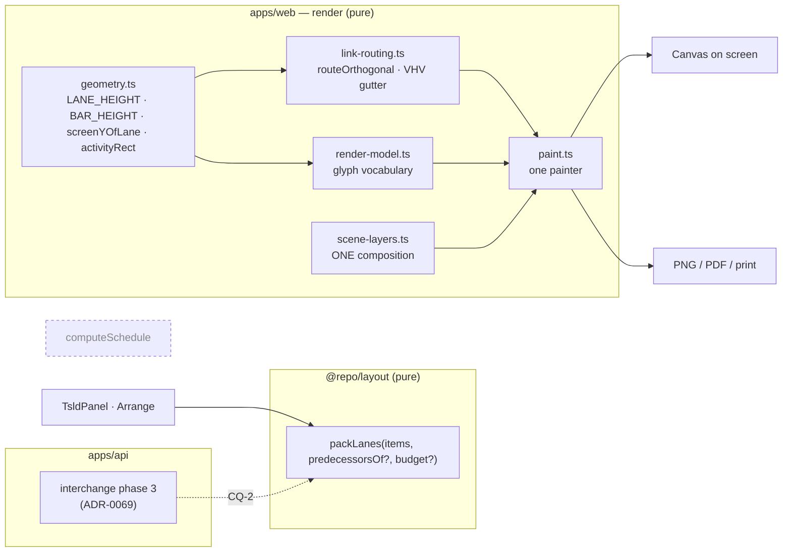
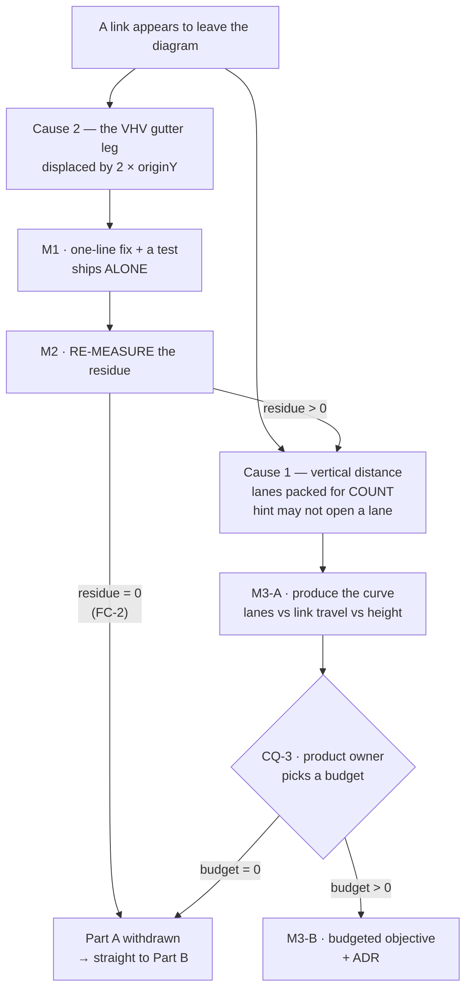
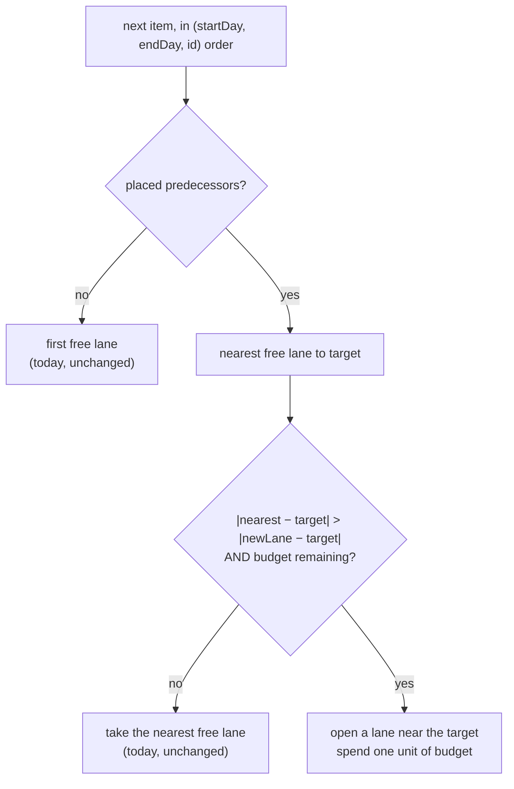

# Feature Spec: Diagram legibility — link directness and the activity glyph

- **Status:** Accepted — Part C shipped (ADR-0149: the crossing-aware corridor pass and the
  `Arrange` offer). Part A's lane budget (M3) and Part B (the bar/link visual refresh) are
  **held by the product owner**, not withdrawn — see `part-c-verdict.md` for why height turned
  out not to be the currency this spec assumed it was.
- **Author(s):** feature-analyst (Claude Opus 5)
- **Date:** 2026-09-21
- **Tracking issue / epic:** _(none yet)_
- **Roadmap link:** _(none — see §3 "Dependencies"; this is a canvas-legibility epic, not a roadmap milestone)_
- **Related ADR(s):** amends/extends **ADR-0026** (canvas model), **ADR-0052** (direct manipulation, bar
  visual refresh), **ADR-0065** (orthogonal link routing), **ADR-0069** (shared lane packer), **ADR-0103**
  (the export composes the same scene). A **new ADR is required for Part A's objective change** and
  **probably for Part B** — see §4.7. Number is deliberately not pinned here (ADR-0079 records a number
  being taken between a plan and its milestone); 0149 is free at the time of writing.

> **On the slug.** `diagram-legibility` is kept. The work is narrower than the name in one direction
> (it is about two specific things — how far a link travels, and how much ink a bar takes) and wider
> in another (Part A turns out to contain a live rendering defect). Renaming it to something cuter
> would be churn; the name is accurate for both halves.

---

## 0. What changed while reading the code

Four things in the brief that started this spec did not survive being checked, and one thing nobody
had reported was found. They are here at the top because three of them change the plan's shape.
Every claim in this section names the file and line that establishes it (§19.11 / ADR-0076).

### 0.1 This is the **second** report of the same complaint, and the first one was measured

`docs/DECISIONS.md:3111-3157` records the product owner, on **2026-07-31**, importing a real
18-node / 126-activity P6 programme ("Unit 300") and reporting that logic lines _"go up and off the
canvas and back down"_. That is the present complaint, in the same words, seven weeks earlier.

It was investigated and a remedy shipped — the `predecessorsOf` hint, which steers an activity toward
its predecessors' mean lane **among lanes that are already free**. Measured on that programme
(`packages/layout/src/pack-lanes.ts:45-48`): mean |Δlane| per link **2.34 → 1.83**, links spanning
more than five lanes **15 → 8**, at **13 lanes either way**.

So the residue was known, bounded and left on purpose. What is new is the product owner saying the
residue is still not good enough — which is a legitimate and useful signal, and it is what licenses
re-opening the constraint that produced it (`pack-lanes.ts:46-48`: _"Lane count is therefore
identical with the hint or without it, by construction"_).

**This matters to the plan** because it means Part A is not a discovery; it is a known trade being
re-opened with new evidence. The spec must therefore argue about the _objective_, not re-litigate
the diagnosis.

### 0.2 A live rendering defect that produces the reported symptom exactly

`routeOrthogonal`'s last-resort **VHV** route (two verticals joined by a short horizontal leg in the
inter-lane gutter) computes that leg's screen y as:

```ts
// apps/web/src/features/tsld/render/link-routing.ts:222-226
const gutterLane = Math.min(obstacles.fromLane, obstacles.toLane);
const gutterY =
  (gutterLane + 1) * obstacles.laneHeight -
  (obstacles.laneHeight - obstacles.barHeight) / 2 -
  view.originY;
```

Every other point on that polyline is in screen space, and screen space is defined by
`screenYOfLane` (`geometry.ts:526-528`):

```ts
return view.originY + laneIndex * LANE_HEIGHT;
```

which **adds** `view.originY`. The gutter formula **subtracts** it. The two agree only when
`view.originY === 0`; otherwise the leg is drawn `2 × view.originY` away from the gutter it names.

`originY` is never zero in the shipped product:

| Where                | Value                               | Evidence                               |
| -------------------- | ----------------------------------- | -------------------------------------- |
| First paint          | `40`                                | `viewport.ts:124` (`DEFAULT_VIEWPORT`) |
| After Fit to plan    | `32` (`paddingPx`)                  | `viewport.ts:198`, `:215`              |
| After any pan        | `originY + dy`, accumulating        | `viewport.ts:82-83`                    |
| After centre-on-lane | `height/2 − (lane+0.5)·LANE_HEIGHT` | `viewport.ts:103`                      |

At rest (`originY = 32`) the leg is drawn 64 px too high — about 2.3 lanes, a visible kink. After a
planner pans down a tall diagram (`originY = −960`, i.e. roughly 34 lanes down) the leg is drawn
**1,920 px too low**: the line leaves the bottom of the canvas and comes back. That is the reported
symptom, produced by arithmetic rather than by lane distance.

**It is live, and it is in the deliverable as well as on screen.** The obstacle argument is passed
whenever the lane index exists (`paint.ts:1185-1191`), the index is built when
`scene.linkRouting === true` (`paint.ts:1091-1099`), which is `CANVAS_LINK_ROUTING_ENABLED`
(`TsldCanvas.tsx:1025`), which is `flagDefaultOn(...)` and `@enabled 2026-07-31`
(`env.ts:994-997`) — and per **ADR-0088 D1** every published image carries every flag at its
default. The export and the printed diagram read the **same** `sceneLayers` derivation
(`scene-layers.ts:48`), which is ADR-0103's whole point, so the defect is in the PNG, the PDF and
the printed programme too.

**Why nothing caught it.** The one test that exercises the VHV path
(`link-routing.test.ts:170-181`) runs against `VIEW = { pxPerDay: 20, originX: 0, originY: 0 }`
(`:31`) — the single value at which `−originY` and `+originY` are the same number — and asserts the
route's **shape** (`routed[1].x === routed[2].x`, `routed[2].y === routed[3].y`,
`routed[3].x === routed[4].x`) and never the gutter's y. A correct test of the wrong quantity, at
the one input that hides the defect.

> **This is a reading, not an experiment**, and the distinction is load-bearing here. ADR-0139
> records this register updating a row to call a finding _"a reading, not an experiment"_ when a
> discriminating test already existed — and being wrong. The inverse error is the one available
> now: the arithmetic above is certain, and **whether the VHV fallback fires often enough to be the
> product owner's screenshot is not**. It is the last resort, reached only when the preferred
> corridor and all four candidates are blocked (`link-routing.ts:198-213`). M0-T2 measures how often
> it fires; **FC-1 can falsify the attribution** while leaving the defect a defect.

### 0.3 The paint-cost risk in the brief is probably **inverted**

The brief reasons: more lanes ⇒ more bars in the viewport ⇒ more paint cost, on the one quantity
`docs/TECH_DEBT.md` #75 establishes the painter tracks. Reading the framing code says the opposite.

`fitToContent` **deliberately ignores the lane axis** — `originY` is pinned to the padding and
`extent.maxLane` is explicitly discarded (`viewport.ts:200-201, 215`, with its own comment saying
so and filing the consequence as #152). So at Fit the visible lane band is
`canvasHeight / LANE_HEIGHT`, a constant, **whatever the plan's lane count**. `cull` is a rect
intersection on both axes (`geometry.ts:684-704`).

Spreading the same activities over more lanes therefore puts **fewer** bars inside that fixed band,
not more. The prediction is that a lane-spending packer **reduces** per-frame paint cost.

The real cost of more lanes is **vertical scrolling** — the planner sees a smaller fraction of their
plan at once — and that is the cost to put to the product owner, not frames. This is an analytic
claim from two files; **FC-4 falsifies it** if wrong.

### 0.4 Nothing in the repository can photograph the defect

`scripts/shoot.mjs` seeds `programme: true` as **six linked activities**
(`apps/web/scripts/shoot.mjs:231`), and every canvas shot in the list uses it —
`plan-workspace` (`:465`), `plan-workspace-readonly` (`:470`), `export-diagram` (`:642`),
`tsld-print-diagram` (`:571`), `plan-workspace-minimap` (`:517`), `gantt` (`:498`). Six activities
cannot produce many lanes, a blocked corridor, or a long link.

So the surface **is** photographed (correcting the brief, which carried ADR-0099's historical
finding that it never had) and the **condition** is not. That is ADR-0099's finding one step along:
a shot list that covers the screen and stops at the fixture. M0-T5 fixes it.

### 0.5 Auto-arrange has no end-to-end coverage at all

Zero matches for `auto-arrange` or `Auto arrange` anywhere under `apps/web/e2e*/`. The entry point —
the **`Arrange`** command, group `tools`, tier 2, pen-gated
(`tsld-toolbar-items.tsx:2917-2933`) — has never been pressed by a journey. Part A's whole subject
is undriven, which is exactly the state ADR-0081 exists to refuse.

---

## 1. Business understanding

### Problem

**Two complaints about the same picture, made while using the released app.**

**A — links.** A relationship between two activities is drawn as a line that leaves the top (or
bottom) of the canvas and re-enters somewhere else. A planner reads that as the diagram breaking,
not as one relationship. The product owner's words: _"the link between activities disappears off the
page and then comes back down … it should be like the NetPoint screenshot in that the link between
activities is streamlined and to the point. This is very important and should be factored into the
arrange button and algorithm."_

There are **two independent causes** and §0 establishes that only one of them was known:

1. **Vertical distance.** Lanes are packed for minimum _count_, and the existing proximity hint is
   forbidden from opening a lane (`pack-lanes.ts:46-48`). A link whose ends are twelve lanes apart
   is 336 px of vertical run at `LANE_HEIGHT = 28` (`geometry.ts:40`), which exceeds the visible
   lane band on any plan taller than the canvas.
2. **A rendering defect** (§0.2) that displaces the VHV route's middle leg by `2 × view.originY` —
   which, for a planner panned down a tall diagram, is hundreds or thousands of pixels, off-canvas
   and back, regardless of how close the two lanes are.

**B — bars.** The diagram reads as a bar chart rather than a logic network. The product owner's
words: _"I also like the look of the NetPoint lines and links, I think they are clear to mine, which
look like bar graphs? Do you think we should update our activity bars to look like they are better
designed."_

This is a legitimate reading of the product's own geometry. A bar is 18 px tall in a 28 px lane
(`geometry.ts:40,42`) — **64 % of the row** — filled solid in `--primary`
(`palette.ts:162`), rounded, hairline-stroked, and carrying an in-bar progress band
(`paint.ts:810-832`). The link beside it is a hairline in `--muted-foreground` (`palette.ts:161`).
The ink is overwhelmingly in the bars; in a network diagram the relationships are the subject.

**Why now.** The link complaint is its second report (§0.1); the first remedy was measured to halve
the problem and was left there. A second report of a bounded residue is the signal that the bound
was set in the wrong place. And the defect in §0.2 is live in every published image and in every
artefact a planner hands to somebody who was not in the room.

### Users

| Role                                  | What they need from this                                                                                                                                                                                           |
| ------------------------------------- | ------------------------------------------------------------------------------------------------------------------------------------------------------------------------------------------------------------------ |
| **Planner** (ADR-0016)                | The primary user. Draws and reads the TSLD. Holds the pen (ADR-0028) and is the only role that can press `Arrange`.                                                                                                |
| **Contributor**                       | Reads the diagram; reports progress. Never repacks lanes. Benefits from legibility only.                                                                                                                           |
| **Viewer**                            | Reads the diagram. Benefits from legibility only.                                                                                                                                                                  |
| **Org Admin**                         | As Planner, plus the ability to override the pen.                                                                                                                                                                  |
| **External Guest** (ADR-0051)         | Reads a shared plan through `/share`. Sees the same painted canvas and **inherits both defects and both fixes**, with no control over either.                                                                      |
| **The person who is not in the room** | Receives the exported PNG/PDF or the printed diagram. They cannot pan, zoom or press `Arrange`. For them the picture is the whole product, which is why §0.2 landing in the export outranks its landing on screen. |

### Primary use cases

1. A planner opens a plan — imported or authored — and reads its logic without any line appearing to
   leave the diagram.
2. A planner presses **Arrange** and gets a diagram whose links are short, with the cost of that
   arrangement stated before they confirm.
3. A planner exports or prints the diagram and the artefact shows the same picture the screen did.
4. A planner looking at the diagram reads it as a network of related work, not as a chart of
   durations.

### User journeys

**Happy path (Part A).** Planner opens an imported programme → the diagram is packed (ADR-0069
phase 3 already ran at import) → every relationship is drawn as a short orthogonal run between
neighbouring lanes → the planner pans down → lines stay attached to their bars.

**Alternate — the plan is untidy.** Planner has hand-placed and deleted activities, so lanes are
sparse → presses **Arrange** → the confirm dialog states what it will do **and what it will cost**
(today it promises "the fewest lanes", `TsldPanel.tsx:3357-3358`) → confirms → lanes repack, links
shorten, the diagram gets taller by a stated amount → one Undo reverses it (ADR-0048 M2.3).

**Alternate — nothing to do.** `computeArrangeChanges` returns empty → `"Lanes are already arranged;
nothing to move."` announced, no dialog (`TsldPanel.tsx:2239-2248`). Unchanged by this epic.

**Happy path (Part B).** Planner opens any plan → activities read as nodes on a timeline with the
logic between them legible at a glance → criticality, progress, type and constraint cues all survive
the change → an AT user hears exactly what they heard before.

### Expected outcomes

- No relationship on a packed plan is drawn leaving the canvas's vertical extent at any pan position.
- The exported and printed diagram match the screen (ADR-0103's rule, held).
- Link travel on the measured fixtures falls materially below the post-hint residue recorded in
  `pack-lanes.ts:45-48`, at a stated and approved cost in diagram height.
- A planner reading the diagram reads a network.

### Success criteria

Each is a falsification condition in §4.8, committed **in its own commit before any harness runs**
(ADR-0128's ordering). Summarised:

| #    | Criterion                                                                                                                                                            |
| ---- | -------------------------------------------------------------------------------------------------------------------------------------------------------------------- |
| FC-1 | The VHV route's gutter leg lands where `screenYOfLane` says it should, at every measured `originY`.                                                                  |
| FC-2 | After the defect fix, the count of links leaving the canvas's vertical extent on the measured fixtures is **0**. If it is, **Part A's objective work is withdrawn**. |
| FC-3 | A lane-spending packer beats the hint's own delivered improvement again, at a lane cost inside the approved budget.                                                  |
| FC-4 | Paint cost does not regress by more than 2.00 pp dropped frames, with the machine's spread reported beside it.                                                       |
| FC-5 | Part B's ink measurement moves toward the criterion CQ-1 settles.                                                                                                    |
| FC-6 | No glyph overruns its lane.                                                                                                                                          |

### Open questions

See §2.7 for the full list. **Three are critical** (CQ-1, CQ-2, CQ-3); one is deferred by
construction because it cannot be asked before M0 returns a number.

---

## 2. Functional requirements

### 2.1 User stories & acceptance criteria

> **US-1** — As a **Planner**, I want a relationship's line to stay attached to the bars it connects
> at every pan position, so that I can read the logic without thinking the diagram is broken.
>
> **Acceptance criteria**
>
> - **Given** a plan whose routing falls back to the VHV shape for at least one visible edge,
>   **when** the diagram is painted at `originY = 32` (the resting Fit viewport),
>   **then** the horizontal leg's y equals
>   `screenYOfLane(min(fromLane,toLane) + 1, view) − (LANE_HEIGHT − BAR_HEIGHT) / 2`, to within
>   0.5 px.
> - **Given** the same plan, **when** the planner pans down so `originY` is large and negative,
>   **then** the same equality holds — i.e. the leg's screen position tracks the lanes it sits
>   between, not `−originY`.
> - **Given** any plan and any viewport, **when** the routing takes the 4-point elbow rather than the
>   VHV fallback, **then** the polyline is **byte-identical** to today's (the parity half — the fix
>   must not move a line that was already correct).
> - **Given** the same plan, **when** the diagram is exported to PNG or printed, **then** the routed
>   lines in the artefact match the screen (ADR-0103).

> **US-2** — As a **Planner**, I want `Arrange` to put related activities near each other, so that
> the picture of my logic is short lines between neighbours rather than long runs across the diagram.
>
> **Acceptance criteria**
>
> - **Given** the measured fixtures, **when** the new packer runs, **then** mean |Δlane| per link and
>   the count of links spanning more than five lanes both improve against the current packer by at
>   least the margin FC-3 sets.
> - **Given** the same fixtures, **when** the new packer runs, **then** the lane count increases by no
>   more than the budget CQ-3 sets, and by **exactly zero** where the budget is zero.
> - **Given** any input, **when** the packer runs twice, **then** the output is identical — the packer
>   stays pure and totally ordered (`pack-lanes.ts:59-62`).
> - **Given** the packer is called **without** the new objective, **then** its output is byte-identical
>   to today's, point for point. (The `predecessorsOf` parity rule, extended:
>   `pack-lanes.ts:50-53`.)
> - **Given** a plan with no dependencies at all, **when** the packer runs, **then** the output is
>   byte-identical to today's — there is nothing to be near.

> **US-3** — As a **Planner**, I want the `Arrange` confirmation to tell me what the arrangement will
> cost as well as what it will do, so that I am not surprised by a taller diagram.
>
> **Acceptance criteria**
>
> - **Given** `Arrange` is pressed and there are changes, **when** the dialog opens, **then** it states
>   the number of activities moving **and** the resulting lane count against the current one.
> - **Given** the new objective opens lanes, **when** the dialog opens, **then** its description no
>   longer claims "the fewest lanes" (`TsldPanel.tsx:3357-3358`) — a promise the packer would no
>   longer keep.
> - **Given** the dialog is confirmed, **when** the write succeeds, **then** the existing announcement
>   and the ADR-0048 undo entry behave exactly as today.

> **US-4** — As a **Planner**, I want the diagram to read as a network of related work rather than a
> chart of durations, so that the logic is the thing I see first.
>
> **Acceptance criteria**
>
> - **Given** any plan, **when** the diagram is painted, **then** every cue the bar carries today
>   survives: criticality (fill **and** dash — WCAG 1.4.1, `paint.ts:834-843`), near-criticality,
>   progress band and front divider, LOE brackets, WBS summary tabs, milestone diamonds, constraint
>   pins, the feasible window, and the selection/hover rings.
> - **Given** the new geometry, **when** any glyph is drawn, **then** it stays inside its lane
>   (FC-6) — no summary tab, LOE cap, fan-out anchor or window cap crosses into a neighbour.
> - **Given** a screen-reader user on the parallel listbox, **when** the change ships, **then** the
>   count of AT-reachable activities is unchanged (ADR-0063 §4) and every spoken row says what it
>   said before.
> - **Given** any new canvas colour value, **when** it is resolved in a **real browser**, **then** it
>   resolves to a parseable colour under the `canvas` surface scope (see §3 "Security & rendering
>   traps").

> **US-5** — As an **External Guest** on a share link, I want the shared diagram to be as legible as
> the member's, so that the plan I was sent is readable.
>
> **Acceptance criteria**
>
> - **Given** the guest read-only view, **when** it paints, **then** it carries the same routing fix
>   and the same glyph as the member view, with no new capability and no new data in the payload.

### 2.2 Workflows

**Arrange (unchanged in shape, changed in content).**

1. Planner presses `Arrange` (pen-gated, `tsld-toolbar-items.tsx:2926`).
2. `computeArrangeChanges` builds `PackItem[]` from `earlyStart`/`earlyFinish` and a
   `predecessorsOf` map from `dependencies` (`TsldPanel.tsx:2213-2234`).
3. `packLanes` returns only the rows whose lane changes (`pack-lanes.ts:87,90`).
4. Empty ⇒ announce and stop. Non-empty ⇒ open the confirm, **now stating the lane cost** (US-3).
5. Confirm ⇒ batch write through the positions endpoint ⇒ announce ⇒ undo entry recorded.

**Import (ADR-0069 phase 3, unchanged in shape).** After the commit's recalculation, the importer
packs with the same function and the same hint (`interchange.service.ts:1088-1099`). Whether it
receives the **new objective** is **CQ-2** and is not assumed here.

### 2.3 Edge cases

| Case                                            | Expected behaviour                                                                                                                                                                            |
| ----------------------------------------------- | --------------------------------------------------------------------------------------------------------------------------------------------------------------------------------------------- |
| Plan never recalculated                         | No `earlyStart` ⇒ no `PackItem` ⇒ unchanged (`TsldPanel.tsx:2215-2226`); importer skips likewise (`interchange.service.ts:1074-1085`).                                                        |
| Plan with zero dependencies                     | Packer output byte-identical to today (US-2). Nothing to be near.                                                                                                                             |
| Every activity in one lane already              | `changes.length === 0` ⇒ "already arranged", no dialog.                                                                                                                                       |
| One activity                                    | Trivially one lane; both objectives agree.                                                                                                                                                    |
| A cycle in `predecessorsOf`                     | Impossible — the DAG invariant is service-enforced (ADR-0021). The packer must still terminate on any input it is handed, because it is a pure function with no right to assume its caller.   |
| Predecessor not yet placed                      | Already handled: only **placed** predecessors steer (`pack-lanes.ts:94-109`). Any new objective must keep that property or become order-dependent.                                            |
| Lane budget of zero                             | The new objective must degrade **exactly** to today's behaviour, not approximately.                                                                                                           |
| Adjacent lanes                                  | `crossedLanes` returns empty ⇒ no obstacle work, no VHV (`link-routing.ts:191-194`). Untouched by the fix.                                                                                    |
| Self-referential gutter (`fromLane === toLane`) | `from.y === to.y` ⇒ two-point line, returns before any of this (`link-routing.ts:170`).                                                                                                       |
| WBS band on                                     | Summaries leave the scene (ADR-0063) but keep their lanes in the model. Packing and glyph changes must not change the band's own geometry.                                                    |
| Guest share view                                | Read-only; inherits both changes; no payload change.                                                                                                                                          |
| Gantt view                                      | One bar per row; does **not** use `packLanes` or `routeOrthogonal`. Part A cannot reach it. Part B **can**, if the glyph is shared — establish by reading before assuming either way (M0-T6). |

### 2.4 Permissions

Nothing in this epic changes the permission model, and that is checkable rather than asserted:

| Capability                    | Role                                                    | Scope                         | Gate                                                                                     |
| ----------------------------- | ------------------------------------------------------- | ----------------------------- | ---------------------------------------------------------------------------------------- |
| Read the diagram (both fixes) | Viewer, Contributor, Planner, Org Admin, External Guest | organisation / per-plan share | existing                                                                                 |
| Press `Arrange`               | Planner, Org Admin                                      | organisation                  | `penGated: true` + `canAutoArrange` (`tsld-toolbar-items.tsx:2926-2932`) — **unchanged** |
| Write lane positions          | Planner, Org Admin holding the pen                      | organisation                  | existing positions endpoint, `assertHoldsPen` (ADR-0028) — **unchanged**                 |
| Import packing                | the import's actor                                      | organisation                  | existing (ADR-0069) — **unchanged**                                                      |

A lane repack **is a structural plan write** and already takes the pen. A glyph change is a render
decision and takes nothing.

### 2.5 Validation rules

- **Lane budget** (if CQ-3 sets a non-zero one): a bounded, documented ratio or absolute cap,
  expressed as a **parameter of `packLanes`** with a default that reproduces today's behaviour.
  Never a module constant read implicitly, for the reason `clampPxPerDay` gives about
  `maxPxPerDay` (`viewport.ts:56-64`): a required parameter makes the compiler, not a reviewer,
  catch the call site that forgot.
- **Determinism** is a validation rule, not a nice-to-have: the packer's total order
  (`startDay, endDay, id`) and the tie-to-lower-lane rule (`pack-lanes.ts:111-129`) must survive
  unchanged, and a property test must assert output equality across input permutations.
- **Geometry**: every glyph's drawn extent ⊆ its lane (FC-6), asserted as a computed inequality.

### 2.6 Error scenarios

| Scenario                                    | Detection                                                                     | User-facing result                                                                | Status |
| ------------------------------------------- | ----------------------------------------------------------------------------- | --------------------------------------------------------------------------------- | ------ |
| Pen not held when `Arrange` pressed         | `penGated` shading + `disabledReason`                                         | The command is shaded with its reason (ADR-0082)                                  | —      |
| Positions write conflicts (stale `version`) | optimistic lock                                                               | Existing conflict banner; refresh offered                                         | 409    |
| Partial lane write on import                | `moved !== positions.length`                                                  | Transaction rolled back; import still succeeds (phase 3 is best-effort, ADR-0069) | —      |
| Packer handed a malformed graph             | pure function                                                                 | Terminates, returns a valid packing; never throws on the paint path               | —      |
| Canvas 2D handed an unparseable fill        | **silent** — `fillStyle` discards it and keeps the previous colour (ADR-0121) | Development-time throw in the painter; real-browser gate in CI                    | —      |

### 2.7 Open questions

**CQ-1 — CRITICAL — what is Part B's criterion?** _"NetPoint's look"_ and _"a diagram that reads as
a network rather than a bar chart"_ diverge, and only the second is something a measurement or a
reviewer can judge. This must be answered **before M0 designs the Part-B measurement**, because it
decides what M0 measures.
**Default if unanswered:** the second, with the NetPoint screenshot as a reference rather than a
target — i.e. M0 measures the **ink distribution** between bars and links and the epic's goal is to
move it, not to match a specific tool's palette and geometry.

**CQ-2 — CRITICAL — does the importer get the new objective, or stay lane-minimal?** ADR-0069 exists
because an imported programme's first picture is a planner's first impression of a schedule they
already know; changing the objective changes that picture for every future import. A divergence is
**not** available cheaply: `packLanes` is deliberately one function with one optional parameter, and
ADR-0065/ADR-0069/ADR-0121 all record the same argument — two implementations drift, and the drift
is invisible because each diagram looks plausible alone.
**Default if unanswered:** **both callers, one parameter.** If the objective is right for the canvas
it is right for the import, and the import is the case it was designed for. Divergence would need
its own written argument.

**CQ-3 — CRITICAL, but deferred by construction — what lane budget?** How much vertical space is the
product owner willing to spend to buy link directness? This **cannot honestly be asked now**: nobody
has the curve. M0-T4 produces it — lanes opened, mean |Δlane|, >5-lane links, diagram height, and
bars drawn, across a sweep of budgets on the measured fixtures — and the product owner picks a point
on it. The plan has a named gate (§M3-G) that stops before building until they do.
**Default if the question is declined:** budget **zero**, i.e. no objective change, the epic
finishes at M1+M2 and Part B. That default is deliberately the conservative one: five consecutive
epics (ADR-0090/0091/0092/0099/0113) were spent recovering canvas space, and spending it back
without an explicit decision would reverse them by accident.

**CQ-4 — would the product owner supply the plan from the screenshot?** Not blocking, but it would
materially improve M0. §0.1 and §0.4 together say the only fixture that can exhibit this is a real
imported programme, and the repository's canvas fixture is six activities. The "Unit 300" file
(18 nodes / 126 activities) is the one whose numbers the current remedy was measured on.
**Default:** M0 uses `scale-500`, `scale-2000` (`packages/seed/src/scale/generator.ts`) and a
re-import of `packages/engine-conformance/fixtures/p6_torture_test_v1.xer`, and **states in its own
output that none of the three is the reported plan**.

> **CORRECTED 2026-09-21 (M0-T3).** The claim above that the "Unit 300" file is not in this repository is **wrong**. It is `packages/engine-conformance/fixtures/p6_torture_test_v1.xer` — 18 PROJWBS / 126 TASK / 188 TASKPRED, and its `PROJECT` row names it. The sentence is kept rather than deleted because CQ-4's default was argued from it. Two further corrections are in `m0-measurement.md` M0-T3: the 2026-07-31 figures **excluded the 18 WBS summaries**, which the shipped `Auto-arrange` does not do, so every inherited figure describes a packing the product does not perform; and "halves the >5-lane links" re-derives at **−31.3 %**, not −47 %.

**Defaults stated rather than asked (no answer needed):**

- **Is `Arrange` still one all-or-nothing command?** Yes. A second command ("arrange for shortest
  links") means two diagrams of one plan and reintroduces the drift argument inside one surface,
  which ADR-0093/ADR-0094 both record removing. The objective is a property of the packer.
- **Does the budget become a user setting?** No, not in this epic. A per-plan setting is a schema
  change, a migration, an ADR and a `database-architect` engagement (§19.3) for a value nobody has
  yet chosen once.
- **Feature flag?** **No.** ADR-0088 D1: a `VITE_` constant is inlined at build time,
  `docker-publish.yml` passes none, and every published image carries every flag at its default —
  so a flag is a second JSX root maintained forever, not a rollback. The rollback here is a commit
  boundary, and both parts are structured to make that cheap (§4.6).
- **Does anything reach the CPM engine?** No. See §3.

---

## 3. Technical analysis

| Area               | Impact     | Notes                                                                                                                                                                                                                                 |
| ------------------ | ---------- | ------------------------------------------------------------------------------------------------------------------------------------------------------------------------------------------------------------------------------------- |
| **Frontend**       | **high**   | `render/link-routing.ts` (the defect), `render/geometry.ts` + `render/render-model.ts` + `render/paint.ts` (the glyph), `TsldPanel.tsx` (the confirm copy), the export and print paths via `scene-layers.ts`.                         |
| **Backend**        | **low**    | One call site only — `interchange.service.ts:1096`, and only if CQ-2 says yes. No new module, no new service, no new endpoint.                                                                                                        |
| **Database**       | **none**   | No model, column, index, constraint or migration. `database-architect` is therefore **not engaged, because there is nothing to design** — recorded explicitly so it does not read as an oversight (ADR-0121's wording, §19.3's rule). |
| **API**            | **none**   | No new endpoint, no DTO change, no OpenAPI change. The existing lane-positions batch write is unchanged.                                                                                                                              |
| **Security**       | **none**   | No new data, no new capability, no change to RBAC or org scope. The pen still gates the write.                                                                                                                                        |
| **Performance**    | **medium** | The painter's one measured quantity is **bars drawn** (#75). §0.3 predicts the lane change _reduces_ it; FC-4 measures. The packer is `O(items × lanes)` today — a budgeted objective must not make it worse than `O(items × lanes)`. |
| **Infrastructure** | **low**    | One new Playwright config + CI step (which is itself an ADR-0105 trigger and costs a shard slot — ADR-0138's roster gate will demand the entry).                                                                                      |
| **Observability**  | **none**   | Nothing new logged.                                                                                                                                                                                                                   |
| **Testing**        | **high**   | See below.                                                                                                                                                                                                                            |

### Testing

- **Unit (Vitest)** — the gutter equality at multiple `originY` values, **verified red first**
  against the shipped formula; the routing parity assertion (no-obstacle path byte-identical); the
  packer's determinism property across permutations; the zero-budget byte-identity; FC-6's geometry
  inequality.
- **The golden log** — `paint.golden.test.ts` is the whole-scene oracle (ADR-0078 S1). Both parts
  will move it. It must be **re-baselined by reading the diff line by line against a written list of
  expected changes, never taken with `-u`** — the rule ADR-0106 followed and recorded.
- **Real browser** — the unit tier runs in jsdom, which has no layout, no canvas and no colour
  resolution. Three of this register's canvas defects were invisible to it (ADR-0100 M4's token pair
  that painted nothing, ADR-0102's `@theme inline` aliases, ADR-0121's silently-discarded
  `fillStyle`). Any new canvas value needs a browser check.
- **Journey** — a new flag-on journey driving `Arrange` (§0.5: there is none) and asserting the
  routing at a panned viewport. Lands with the **first user-facing milestone**, not at the end
  (ADR-0081).
- **a11y** — the ADR-0063 §4 count invariant across a repack, and the spoken-row content
  (`a11y.ts:183` speaks the lane number, so a repack changes every moved row's announcement).
- **Probe** — ADR-0128's staff-console benchmark, `canvas-draw`, one press by the product owner.

### Security & rendering traps (all three verified as still live in this code)

1. **ADR-0102** — `resolveTsldPalette` once read `@theme inline` aliases that a surface rebind can
   never reach, so the painter had never used the canvas scope. It is fixed (`palette.ts:132,149`
   read raw names under the canvas root), and any **new** token must follow the same pattern.
2. **ADR-0100 M4** — a token pair absent from `@theme inline` painted **nothing at all** in a real
   browser while the contrast gate stayed green. Any new pair must be asserted **reachable**, not
   merely contrasty.
3. **ADR-0121** — Canvas 2D's `fillStyle` setter **silently discards** an unparseable value and
   keeps the previous colour. No throw, no warning, every jsdom test green. The painter's
   development-time throw covers this; a new value must be exercised through it.

### Dependencies

**Must be read before Part B is designed, not assumed:**

- **The blast radius of a bar-geometry change is 87 references across 19 files** — 59 in 10
  production files, 28 in 9 test files. Derived by grepping `BAR_HEIGHT|LANE_HEIGHT` over
  `apps/web/src`, which returns **93 across 20**, and then **subtracting
  `components/layout/tsld-motif.tsx`**: that file declares its _own_ `LANE_HEIGHT = 12` and
  `BAR_HEIGHT = 6` (`tsld-motif.tsx:41-42`) and imports neither, so its 6 hits are a name collision
  and not a dependency. The raw grep count is not the blast radius, and this spec's first draft
  quoted a wider pattern's 140 before that was checked.
  - Worth keeping for Part B anyway: the brand motif on the public screens (ADR-0077) is a second,
    independently-authored picture of a TSLD, and **its designer chose a 50 % bar-to-lane ratio**
    (6/12) against the canvas's 64 % (18/28). That is one data point, by one hand, and it is not
    evidence — but it is the only other time anybody in this repository chose this ratio, and M5-T1
    should know it exists.
- **The bar's vertical budget is 5 px per side and 4 px of it is already spent.**
  `(LANE_HEIGHT − BAR_HEIGHT) / 2 = 5` (`geometry.ts:581`). `SUMMARY_TAB_H = 4` drops below the bar
  (`render-model.ts:102,109-115`) — **1 px clearance**. `GLYPH_CAP_OVERHANG = 3` overhangs both
  edges (`render-model.ts:82,91-98`) — 2 px. So "thinner bar, tighter lane" is not a free constant
  edit; it is a budget re-allocation across four glyph families.
- **`FAN_OUT_MAX_PX = 6` is a literal justified in a comment by `BAR_HEIGHT/2 = 9`**
  (`link-routing.ts:496-498`) — and `link-routing.ts` **does not import `BAR_HEIGHT`**. The
  invariant is comment-only and the compiler cannot see it. A bar shorter than 12 px silently pushes
  fanned link anchors off the bar they are supposed to sit on. This is the Part-B → Part-A coupling,
  and it is **sharper than the brief's version**, which assumed a code dependency.
- `paint.ts:1189-1190` **does** pass `LANE_HEIGHT` and `BAR_HEIGHT` into the obstacle parameter — and
  that is precisely the derivation §0.2 says is wrong. The two findings meet in one call.
- `TAIL_HEIGHT = 6` (`geometry.ts:146`) is centred on the bar, so the feasible window moves with any
  `BAR_HEIGHT` change (`geometry.ts:174-181` and its consumers).
- `BAR_RADIUS = 3`'s docblock says "subtle **at BAR_HEIGHT 18**" (`render-model.ts:29-31`) — a value
  whose justification is a function of another value.

**Affected but not changed:** the Gantt (ADR-0095) does not use `packLanes` or `routeOrthogonal`;
whether it shares the bar glyph is M0-T6's question. The minimap (ADR-0100/0141/0142) draws its own
decimated picture and `docs/TECH_DEBT.md` #323 already records that **no lane remedy touches it**
(and ADR-0142 D1 refuses one on the ground that `packLanes` structurally leaves no empty lane) — so
a lane-count change is the **one** thing that could move that picture, which is worth measuring
while M0 is running anyway.

**Open register rows this epic touches:** #75 (the draw budget, and FC-4 adds a reading to it),
#323 (the minimap's lane compression), #167 (the export renders the default picture rather than the
planner's lens state — `docs/TECH_DEBT.md:6442`). None is closed by this epic; #167 is deliberately
left alone.

---

## 4. Solution design

### 4.1 Architecture overview



**`computeSchedule` is not imported, not reachable and not called** by anything in this epic. That
is **ADR-0125 D1's strong form** and deliberately **not ADR-0116 D7's weaker sibling** — named so
that nobody reaches for the wrong sentence later. The ADR-0034 recalculation parity gate is
untouched **by construction**: `@repo/layout` has one dependency-free source file
(`packages/layout/src/pack-lanes.ts`), `lane_index` is presentation and `computeSchedule` has never
seen it (ADR-0069's own words), and the render tree imports no engine symbol. **If `@repo/layout` or
`render/` gains a module in this epic, the import-ban structural test is extended to cover it in the
same commit** — a roster derived by prefix, the shape ADR-0129 used.

### 4.2 The two causes, separated



This shape is the epic's central design decision and it is **ADR-0142 D4 applied before anything is
built**: _a remedy is measured before it is built_, and an approved action is a claim that it will
work. Three of this register's remedies have been withdrawn on their own numbers (ADR-0097 Landing
C, ADR-0091 D4, ADR-0092 M5), and a fourth (ADR-0142 D1) never got built. M2's re-measurement is a
**gate, not a formality** — FC-2 can end half the epic, and it is cheap because M1 is one line.

### 4.3 Part A, M1 — the defect fix

```ts
// link-routing.ts — the shape of the change (illustrative; no code is written at this stage)
const gutterY =
  view.originY +
  (gutterLane + 1) * obstacles.laneHeight -
  (obstacles.laneHeight - obstacles.barHeight) / 2;
```

Three properties, in the order they matter:

1. **It is the only change.** Every other route shape — the two-point, the 4-point elbow, the four
   candidates, the bundler — is untouched, so a line that was already correct cannot move. The
   existing parity assertion (`link-routing.test.ts:27-30`) is the oracle.
2. **The test that should have caught it is replaced, not supplemented.** The VHV case's `VIEW` is
   parameterised over `originY ∈ {0, 32, −500, −1500}` and asserts the leg's **y**, not only the
   route's shape. Verified red against the shipped formula.
3. **The obvious alternative is rejected**: deriving the gutter from `screenYOfLane` directly rather
   than re-deriving it from `laneHeight`. That is tempting and would prevent recurrence — but
   `link-routing.ts` deliberately does **not** import `BAR_HEIGHT`/`LANE_HEIGHT` (the obstacle
   parameter exists so the caller supplies them, `link-routing.ts:161-168`), and importing them to
   fix an arithmetic slip would quietly reverse that decision in a defect-fix commit. The
   recurrence guard is the parameterised test.

### 4.4 Part A, M3 — the objective (only if M2 says so, and only at CQ-3's budget)

The change is to `packLanes`'s choice among lanes, expressed as **one more optional parameter of the
one function** — exactly as `predecessorsOf` is, and for exactly the reason its docblock gives
(`pack-lanes.ts:50-53`). Absent ⇒ byte-identical, which is the parity gate and is structural.

Today (`pack-lanes.ts:75-85`), an item takes the free lane nearest its predecessors' mean, or opens
a new one only when **none** is free. The budgeted objective adds one question: _when the nearest
free lane is far, is opening a new lane nearer — and is the budget willing to pay for it?_



Four properties the design must hold, each of which is a test:

- **Purity and total order** survive (`pack-lanes.ts:59-62`); output is permutation-independent.
- **Budget zero ⇒ byte-identical** to today, exactly — not approximately.
- **Only already-placed predecessors steer**, as today (`pack-lanes.ts:94-109`). Reaching for
  unplaced ones would make the result order-dependent and break the property above.
- **Bounded work.** No unbounded search; the complexity class does not get worse.

**Rejected alternatives**, with reasons:

| Alternative                                  | Why not                                                                                                                                                                                                                                                                         |
| -------------------------------------------- | ------------------------------------------------------------------------------------------------------------------------------------------------------------------------------------------------------------------------------------------------------------------------------- |
| A second packer for the canvas               | The drift argument, recorded three times (ADR-0065 `routeOrthogonal`, ADR-0069 `packLanes`, ADR-0121 one layer down). Each diagram looks plausible alone; only somebody comparing an imported plan against the same plan after pressing `Arrange` would ever see them disagree. |
| A separate "arrange for short links" command | Two diagrams of one plan, reached from one surface. ADR-0093 and ADR-0094 both record removing exactly that.                                                                                                                                                                    |
| Global optimisation (min total link length)  | Unbounded, non-obviously deterministic, and the packer runs on the paint-adjacent path. "Bounded work is the contract" (`link-routing.ts:215-221`).                                                                                                                             |
| Diagonal link segments                       | Rejected by ADR-0065: on a time-scaled diagram **x is time**, so a diagonal asserts work across the days it crosses. Not re-opened.                                                                                                                                             |
| A per-plan budget setting                    | Schema change, migration, ADR, `database-architect` — for a value nobody has chosen once.                                                                                                                                                                                       |

### 4.5 Part B — the glyph

**No design is committed here, and that is deliberate.** CQ-1 decides the criterion, and M0-T7
decides the hypothesis by measurement. What the spec _does_ commit is:

**The brief's hypothesis is one of at least four, and must not be the only one measured.** The bar
occupies 64 % of its lane — but the bar is not unstyled. It already carries a rounded fill, a
hairline definition stroke, a criticality emphasis outline with a dash cue, an in-bar progress band
with a front divider, LOE bracket end-caps, WBS summary tabs and milestone diamonds
(`paint.ts:779-852`). "Reads as a bar chart" is therefore a claim about **ink distribution**, not
about absent design. Candidate terms, all measurable:

1. **Bar-to-lane fill ratio** — 18/28 = 64 % (`geometry.ts:40,42`).
2. **Bar-to-link ink weight** — a solid `--primary` fill (`palette.ts:162`) against a hairline
   `--muted-foreground` line (`palette.ts:161`). In a network diagram the relationship is the
   subject; here it is the quietest thing on the canvas.
3. **Figure/ground** — the bar is a **filled** shape (the datum, as in a chart) rather than a
   **container** (the node, as in a network).
4. **Horizontal banding** — lane rules (`palette.ts:160`) and optional month bands
   (`palette.ts:216`) reinforce a row-per-datum reading.

M0-T7 measures ink; the design milestone picks from the measurement, not from this list.

**The constraint set the design must satisfy** (§3 "Dependencies"): 5 px of vertical budget per
side, 4 px of it already spent by summary tabs; `FAN_OUT_MAX_PX = 6` needing `BAR_HEIGHT ≥ 12`
through a comment-only invariant; `TAIL_HEIGHT` centred on the bar; `BAR_RADIUS` justified at
`BAR_HEIGHT 18`; 87 references across 19 files. **FC-6 turns that constraint set into a computed
gate**, which is the epic's durable output from Part B whatever the visual answer is: the invariant
that no glyph overruns its lane currently lives in four comments and no test.

### 4.6 Rollback

**No `VITE_` flag** (ADR-0088 D1). The rollback is a **commit boundary**, and both parts are
sequenced to make that real rather than nominal:

- M1 is one line plus tests, landing alone — revertible without touching anything else.
- M3's objective is an optional parameter whose absence is byte-identical, so "revert" is also
  "pass nothing".
- Part B's geometry lands as one revertible commit, with the golden log as the before/after oracle.

### 4.7 Is this architecturally significant? (ADR question)

**Part A M1 — no ADR.** An arithmetic fix to one expression, with a test. It goes in
`docs/DECISIONS.md` and a `docs/TECH_DEBT.md` ledger entry. (The _spec_ exists because ADR-0105's
triggers fire on the journey and CI step this epic adds, not because M1 is large.)

**Part A M3 — yes, an ADR, and it is the epic's main one.** It changes the **objective function of a
shared pure package** consumed by two callers in two applications; it changes what an imported
programme looks like on first open, which is ADR-0069's entire purpose; it changes a promise the
product makes on screen (`TsldPanel.tsx:3357-3358` says "the fewest lanes"); and it spends canvas
space that five consecutive epics were spent recovering. All four are ADR-level.

**Part B — probably yes, and the discriminator is stated rather than left to judgement.** An ADR is
required if the change alters the **glyph vocabulary** (what shapes exist and what each means) or
the **geometry contract** (the lane/bar/overhang budget that four glyph families and the link
fan-out silently depend on). It is not required if the change is a value inside the existing
contract. Realistically a change large enough to make the diagram read as a network will do the
first, so plan for one; the decision about whether it folds into Part A's ADR or gets its own is
taken at the milestone, when the design exists.

**Number.** Not pinned. 0149 is free today; ADR-0079 records a number being taken between a plan and
its milestone, and stepping over that rather than recording it is the ADR-0071 failure.

### 4.8 Falsification conditions

**Committed in their own commit, before any harness runs** (ADR-0128's ordering). Each names what
makes it fail and what happens then — a condition with no withdrawal clause is decoration.

**FC-1 — the defect is real and attributable.**
On `scale-500` and `scale-2000` at `originY ∈ {32, −500, −1500}`, the VHV fallback fires on ≥ 1
visible edge, and each fired leg's y differs from
`screenYOfLane(min(fromLane,toLane)+1, view) − (LANE_HEIGHT−BAR_HEIGHT)/2` by `2 × originY` ± 0.5 px.
**If the fallback fires on zero edges at every framing measured**, the defect is **latent** rather
than the reported one: M1 still ships as a correctness fix, the attribution in §0.2 is withdrawn in
place rather than deleted, and the diagnosis of the screenshot **re-opens** instead of proceeding.

**FC-2 — the residue after the fix.**
On the measured fixtures, after M1, the count of rendered polylines whose extent leaves the canvas's
vertical bounds at any measured pan position is **0**.
**If it is 0, Part A's objective work (M3) is withdrawn** and the epic proceeds to Part B. This is
the condition that can cancel half the epic and it is written before M1 lands, on purpose.

**FC-3 — a lane-spending packer earns its height.**
The existing hint bought mean |Δlane| **2.34 → 1.83 (−21.8 %)** and >5-lane links **15 → 8 (−47 %)**
at **zero** lane cost (`pack-lanes.ts:45-48`). A budgeted variant must therefore **at least match
what the free remedy already delivered, a second time** — ≥ 20 % further reduction in mean |Δlane|
**and** ≥ 30 % further reduction in >5-lane links — at a lane increase within CQ-3's budget. The
thresholds are **derived from the prior remedy's own delivered numbers**, not chosen round.
**If the ratio is worse**, the objective change is not worth the height and is withdrawn.

**FC-4 — paint cost.**
ADR-0128 probe, `canvas-draw`, 500 and 2,000, one press by the product owner on their hardware. The
variant's dropped-frame percentage ≤ baseline + **2.00 pp** (ADR-0127 D8a's bar), **with the
machine's own run-to-run spread reported beside it** — a delta smaller than the spread is
**INDETERMINATE**, not a pass (ADR-0128's fourth verdict).
**§0.3 additionally predicts the delta will be ≤ 0.** If it is > 0, §0.3 is falsified and the
brief's cost model was right; the prediction is recorded here so that outcome is a finding rather
than a surprise.

**FC-5 — Part B's ink.** Conditional on CQ-1. On the M0 fixture at 1646 and 1920, the share of
canvas ink belonging to bars versus links moves toward the criterion CQ-1 sets, by a margin stated
once that criterion exists. Not specified further here, because specifying a target before the
criterion is how a number gets tuned to the answer.

**FC-6 — no glyph overruns its lane.** For every glyph family (task, milestone, LOE, WBS summary)
and every decoration (progress band, constraint pin, feasible window, fan-out anchors, selection and
hover rings), the drawn extent is within `[screenYOfLane(L), screenYOfLane(L+1))`. Asserted as a
computed inequality, **verified red against a deliberately-too-tall bar**.
**If it cannot be satisfied at the proposed geometry**, the geometry changes — not the gate.

### 4.9 Database changes

**None.** No model, column, index, constraint or migration. `database-architect` is not engaged
because there is nothing to design, which is recorded explicitly so it cannot read as the judgement
§19.3 forbids.

### 4.10 API changes

**None.** No endpoint, DTO, status code or OpenAPI change. The lane-positions batch write and the
import pipeline keep their contracts exactly.

### 4.11 Component changes

| Component                                           | Change                                                                               | States                    |
| --------------------------------------------------- | ------------------------------------------------------------------------------------ | ------------------------- |
| `render/link-routing.ts`                            | The gutter expression (M1).                                                          | — (pure)                  |
| `render/link-routing.test.ts`                       | VHV case parameterised over `originY`, asserting y.                                  | —                         |
| `packages/layout/src/pack-lanes.ts`                 | One optional budget parameter (M3, conditional).                                     | — (pure)                  |
| `TsldPanel.tsx` confirm dialog                      | Copy states the lane cost; drops "the fewest lanes" if the objective changes (US-3). | pending / error unchanged |
| `render/geometry.ts`, `render-model.ts`, `paint.ts` | Glyph geometry (Part B).                                                             | —                         |
| `render/palette.ts`                                 | Only if Part B needs a new value — and then under the three traps in §3.             | —                         |
| `apps/web/scripts/shoot.mjs`                        | A fixture that can exhibit the condition (§0.4).                                     | —                         |
| `apps/web/e2e-<suite>/`                             | The first journey to press `Arrange` (§0.5).                                         | —                         |

No design-system component changes; no new UI primitive; no one-off styling.

---

## 5. Links

> **This epic has a Part C**, opened 2026-09-22 after `web-v0.140.1` was used:
> [`./part-c-feature-spec.md`](./part-c-feature-spec.md) ·
> [`./part-c-implementation-plan.md`](./part-c-implementation-plan.md). It is about **link–link
> crossings**, which is a different quantity from this document's excursions and travel proxies —
> see its §0.4 — and its §0.1 records that `cheap-levers.md`'s "shipped" row and every height figure
> derived from it describe the **pre-#364** tree.

- Implementation plan: [`./implementation-plan.md`](./implementation-plan.md)
- Docs this change will update: `docs/DECISIONS.md` (M1), `docs/TECH_DEBT.md` (the new row for the
  defect, plus a reading added to #75 and a note on #323), `docs/adr/` (the epic's ADR and
  `docs/adr/README.md`), `CLAUDE.md` §16 (the register entry — ADR-0147 gates it), `docs/TESTING.md`
  and `.github/workflows/ci.yml` + `scripts/ci-roster.json` + `scripts/e2e-durations` (the new
  journey's step — ADR-0136's and ADR-0138's roster gates will demand both).
