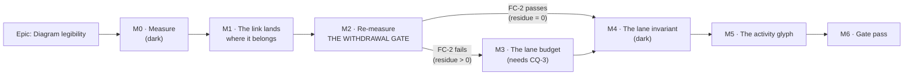

# Implementation Plan: Diagram legibility — link directness and the activity glyph

- **Feature spec:** [`./feature-spec.md`](./feature-spec.md) — **Draft, awaiting approval before
  implementation.**
- **Status:** Draft — awaiting approval before implementation
- **Owner:** web

> **Read §0 of the spec first.** Four claims in the brief that started this epic did not survive
> being checked, and one live defect nobody had reported was found. Three of those change this
> plan's shape: M1 is one line rather than an algorithm change, M2 is a **withdrawal gate** that can
> end half the epic, and the paint-cost risk is predicted to be **inverted**.

## Breakdown

### Epic

**Diagram legibility** — make the TSLD read as a logic network: relationships that stay attached to
the bars they connect and travel a short distance, and an activity glyph that is a node rather than
a chart datum. Two parts, **links first** (the product owner's ordering, and §0.2 sharpens rather
than challenges it — see "On the ordering" below).

**On the ordering.** The brief asked for the ordering to be challenged if measurement said so. It
does not: it **confirms** it, and adds a second, structural reason the product owner did not have.
Part B's likeliest change is to `BAR_HEIGHT`, and `FAN_OUT_MAX_PX = 6` is a link-anchor constant
justified in a **comment** by `BAR_HEIGHT/2 = 9` (`link-routing.ts:496-498`) that the compiler
cannot see. The coupling therefore runs **B → A**: doing bars first would silently move link
anchors off their bars while Part A's own numbers were still being taken, and nothing would report
it. Links first is right, and M4 exists to make that coupling a gate before M5 touches it.

---

## Milestone 0 — Measure, and commit the falsification conditions

**Outcome:** every number this epic will be judged on exists, taken against the shipped tree, with
the conditions that can withdraw its milestones already committed.
**Ships dark:** nothing is reachable. No product code changes; harnesses and fixtures only.
**Journey:** none (nothing user-facing). The journey lands with **M1**.

> **The conditions land in their own commit, before any harness runs** (ADR-0128's ordering, and
> ADR-0097 Landing C's lesson about a harness that returned `PROCEED` from an `undefined`). Every
> harness in this milestone **throws rather than judging** when it has nothing to judge.

#### Feature: M0-F1 — the instruments

> **Description:** the harnesses that produce M0's numbers, plus a fixture that can exhibit the
> reported condition at all.
> **Complexity:** L
> **Dependencies:** none. **CQ-1 must be answered before M0-T7** (it decides what T7 measures).
> **Risks:** an instrument measuring the wrong quantity → every harness prints the node or the set
> it touched, and each has a **non-vacuity control** checked first. This register records six
> instrument defects in ADR-0115 alone, a harness that measured the bars instead of the pills
> (ADR-0106), one that measured the cull instead of the painter (ADR-0066), and one that reported a
> verdict from a missing number (ADR-0097). The control is not optional.
> **Testing requirements:** each harness has a negative control that must fail.

##### M0-T1 — Commit the falsification conditions

- **Description:** FC-1…FC-6 (spec §4.8) written to `docs/specs/diagram-legibility/m0-conditions.md`
  and committed **alone**, before any harness exists.
- **Complexity:** S
- **Dependencies:** none
- **Risks:** a condition written after its measurement is a number tuned to the answer → this task
  is a separate commit, and the git order is the evidence.
- **Testing:** none (a document).
- **Development steps:**
  1. Write each condition with its withdrawal clause and the evidence its threshold derives from.
  2. Commit alone, no harness files in the diff.

##### M0-T2 — Does the VHV fallback fire, and by how much is the leg wrong? (FC-1)

- **Description:** a Chromium harness that paints `scale-500` and `scale-2000` at
  `originY ∈ {32, −500, −1500}`, counts VHV-shaped routes among visible edges, and compares each
  leg's y against the `screenYOfLane`-consistent value.
- **Complexity:** M
- **Dependencies:** M0-T1
- **Risks:**
  - The scene never reaches the fallback, so the harness reports zero and looks like a pass →
    **the non-vacuity control is the first assertion**: if zero VHV routes fire at every framing,
    the harness reports `INDETERMINATE` and FC-1's withdrawal clause fires. A harness that finds
    nothing must not print a verdict (ADR-0130's rule).
  - The scale scene deals bands into a **fixed 50 lanes** and never calls `packLanes`
    (`scale-scene.ts:31-32, 50`), so it is a plausible layout rather than a packed one → say so in
    the output; T3 supplies the packed case.
- **Testing:** the harness's own control; the measurement is not a test.
- **Development steps:**
  1. Instrument `routeOrthogonal` behind a measurement-only export (or read the painted polylines) —
     whichever avoids changing the shipped path.
  2. Sweep the three `originY` values at both scales; record VHV count, expected y, actual y, delta.
  3. Assert the control first; print the node/edge counts it examined.
  4. Record the machine, the viewport (**1646** — the product owner's Surface Pro — and 1920) and
     the commit.

##### M0-T3 — The link-travel distribution on a packed plan

- **Description:** re-derive, **against the shipped tree**, the numbers `pack-lanes.ts:45-48` quotes
  forward: mean |Δlane| per link, the count of links spanning more than five lanes, and the lane
  count — with and without the `predecessorsOf` hint.
- **Complexity:** M
- **Dependencies:** M0-T1
- **Risks:** quoting the docblock's 2.34/1.83/15/8/13 forward instead of re-deriving → those figures
  were measured on the "Unit 300" import, which is **not in this repository** (§0.1, CQ-4). The
  harness must state which fixture each number came from, and must **not** reuse the docblock's.
- **Testing:** determinism — two runs on one fixture agree exactly.
- **Development steps:**
  1. Load `scale-500`, `scale-2000`, and a fresh import of
     `packages/engine-conformance/fixtures/p6_torture_test_v1.xer`.
  2. Run `packLanes` with and without the hint; compute the three statistics for each.
  3. Print the fixture, the activity/link counts, and an explicit note that **none of the three is
     the plan from the product owner's screenshot** (CQ-4).

##### M0-T4 — The lane/travel/height curve (the input to CQ-3)

- **Description:** a throwaway budgeted variant of `packLanes`, run across a **sweep** of budgets,
  producing the curve the product owner picks a point on: lanes opened, mean |Δlane|, >5-lane links,
  diagram height in px, and **bars drawn at Fit and at Week**.
- **Complexity:** L
- **Dependencies:** M0-T3
- **Risks:**
  - The variant becomes the shipped implementation without review → it is written in the harness
    directory and **deleted at the end of M0**; M3-F2 writes the real one.
  - The curve is taken on a fixture unlike the reported plan → stated in the output (T3's note).
- **Testing:** determinism per budget value.
- **Development steps:**
  1. Implement the budgeted choice as a harness-local function.
  2. Sweep budgets (0 %, +10 %, +25 %, +50 %, unbounded); record the five quantities per point.
  3. Record `bars drawn` from `cull` at both framings — this is **FC-4's prediction test**
     (spec §0.3 predicts bars drawn **falls**).
  4. Delete the variant; commit the numbers, not the code.

##### M0-T5 — A fixture that can exhibit the condition, and a photograph

- **Description:** `shoot.mjs`'s canvas shots use a **six-activity** seed (`shoot.mjs:231`), which
  cannot produce many lanes, a blocked corridor or a long link. Add a fixture that can, and take
  before shots.
- **Complexity:** M
- **Dependencies:** M0-T1
- **Risks:** a heavier seed slows every shot run → the new fixture is used by the **new shots only**,
  never by the existing ones, so `plan-workspace`'s baseline is unchanged and the pixel-diff
  comparison the harness supports stays meaningful (ADR-0099 M2's method).
- **Testing:** the shot runs and produces a non-blank image.
- **Development steps:**
  1. Add a `programme-large` seed (or re-use the seed CLI's `scale` tier) behind a new shot entry.
  2. Add `plan-workspace-links` at **1646** and **1920**, at rest and panned down.
  3. Take the before shots; commit them as the M0 record.

##### M0-T6 — Establish, by reading, what shares the bar glyph

- **Description:** the Gantt does not use `packLanes` or `routeOrthogonal`; whether it shares the
  **glyph** is unestablished. Read it rather than assume it.
- **Complexity:** S
- **Dependencies:** none
- **Risks:** assuming either way → the answer decides Part B's blast radius and whether the Gantt's
  journeys are in M5's regression set.
- **Testing:** none (a reading, recorded with file and line).
- **Development steps:**
  1. Read the Gantt's bar rendering; record which constants and which painter, if any, it shares.
  2. Record the answer in `m0-measurement.md` with citations.

##### M0-T7 — The ink measurement (Part B's baseline) — **blocked on CQ-1**

- **Description:** measure the share of canvas ink belonging to bars versus links, and the four
  candidate terms in spec §4.5, on the M0-T5 fixture at 1646 and 1920.
- **Complexity:** M
- **Dependencies:** M0-T5; **CQ-1** (it decides the criterion, therefore what to measure)
- **Risks:** measuring the brief's single hypothesis (the 64 % fill ratio) and calling it the answer
  → all four candidate terms are measured, and the milestone reports which dominates rather than
  confirming the one that was suggested.
- **Testing:** the harness's control — a blank canvas must report zero ink.
- **Development steps:**
  1. Render to an offscreen canvas; classify pixels by layer (bars, links, grid, ground).
  2. Report the four terms of §4.5 with the fixture and viewport named.

**M0 exit:** `m0-measurement.md` exists, every number names its fixture and machine, every harness
has passed its own control, and the throwaway packer variant is deleted.

---

## Milestone 1 — The link lands where it belongs

**Outcome:** a relationship's line stays attached to the bars it connects at every pan position, on
screen, in the exported PNG/PDF, and in the printed diagram.
**Entry point:** the **TSLD canvas itself** on `/orgs/:slug/.../plans/:planId` — no control is
pressed; the picture changes. Plus **`Print…`** and the export, which read the same
`sceneLayers` composition (`scene-layers.ts:48`).
**Journey:** `e2e-diagram-legibility/routing.spec.ts` — opens a plan with enough lanes to force the
fallback, pans down, and asserts that every rendered polyline's extent lies within the canvas's
vertical bounds. **This is the epic's first user-facing milestone, so the journey lands here, not at
the gate pass** (ADR-0081 §2).

> **This milestone ships alone**, ahead of anything to do with the packer. It is one expression plus
> tests, and it is the smallest thing that could be the whole answer — which is exactly why M2 gets
> to ask whether it was (FC-2). ADR-0090 M1 and ADR-0114 M1 both took this shape.

#### Feature: M1-F1 — the gutter fix

> **Description:** `link-routing.ts:222-226` computes the VHV leg's screen y by **subtracting**
> `view.originY` where `screenYOfLane` adds it. Error = `2 × view.originY`; `originY` is 32 at rest,
> 40 on first paint, and large and negative after a downward pan.
> **Complexity:** S (the fix) / M (the tests and the journey)
> **Dependencies:** M0-T2 (FC-1 must have fired, or its withdrawal clause must have been applied)
> **Risks:**
>
> - Moving a line that was already correct → the no-obstacle parity assertion
>   (`link-routing.test.ts:27-30`) is the oracle and must pass **unedited**.
> - Re-baselining the golden log carelessly → see M1-T3.
>   **Testing requirements:** unit (verified red), golden re-baseline by hand, journey, export check.

##### M1-T1 — Replace the VHV test before fixing the code

- **Description:** parameterise `link-routing.test.ts:170-181` over
  `originY ∈ {0, 32, −500, −1500}` and assert the leg's **y**, not only the route's shape.
- **Complexity:** S
- **Dependencies:** none
- **Risks:** writing the expected value from the same wrong formula → the expectation is derived
  from `screenYOfLane`, the function that defines screen space, never from the code under test.
- **Testing:** **run it red first.** The `originY: 0` case must pass and the other three must fail,
  against the shipped code. A case that passes against the defect has not tested it (ADR-0110 D5).
- **Development steps:**
  1. Parameterise the existing case; keep the shape assertions.
  2. Add the y assertion derived from `screenYOfLane`.
  3. Run; record the red output in the commit message.

##### M1-T2 — Fix the expression

- **Description:** `gutterY` adds `view.originY`.
- **Complexity:** S
- **Dependencies:** M1-T1
- **Risks:** "improving" it by importing `screenYOfLane`/`LANE_HEIGHT` into `link-routing.ts` →
  **rejected in the spec (§4.3)**: that module deliberately takes `laneHeight`/`barHeight` as
  obstacle parameters (`link-routing.ts:161-168`), and reversing that inside a defect fix is how a
  decision gets undone without review. The recurrence guard is M1-T1's parameterised test.
- **Testing:** M1-T1 goes green; the parity assertion is untouched.
- **Development steps:**
  1. Change the expression.
  2. Update the docblock to say what the gutter's frame **is**, since the old code implied otherwise.
  3. Re-run the whole `render/` suite.

##### M1-T3 — Re-baseline the golden log, by reading

- **Description:** `paint.golden.test.ts` is the whole-scene oracle (ADR-0078 S1). If any fixture
  reaches the VHV path, its log moves.
- **Complexity:** S
- **Dependencies:** M1-T2
- **Risks:** taking it with `-u` → **forbidden here**. ADR-0106 records auditing a re-baseline line
  by line against a written list of expected changes; the same rule applies.
- **Testing:** the audited diff is the test.
- **Development steps:**
  1. Write the expected change list **first** (which entries, why, how many).
  2. Run; diff against the list; investigate any entry not on it.
  3. If the log does not move at all, **that is a finding** — it means no golden fixture reaches the
     fallback, and the journey is carrying the whole burden. Record it.

##### M1-T4 — The journey (ADR-0081)

- **Description:** a new flag-on journey driving the real product. **Auto-arrange and the routing
  fallback currently have no end-to-end coverage of any kind** (§0.5 — zero matches for
  `auto-arrange` under `apps/web/e2e*/`).
- **Complexity:** L
- **Dependencies:** M1-T2, M0-T5
- **Risks:**
  - A new Playwright config costs a CI shard slot and must be declared in three places →
    `check:e2e-roster` (ADR-0138) and `check:ci-roster` (ADR-0136) will refuse the PR otherwise.
    That refusal is the gate working; budget for it.
  - Locating a control by its copy → locate by `[data-toolbar-item]` and by role+name
    (`docs/TECH_DEBT.md` #133's rule).
  - Asserting on the DOM rather than the drawn picture → the canvas is `aria-hidden`; the assertion
    reads the routed polylines from a measurement hook or an exported image, not from the listbox.
- **Testing:** this **is** the test. Verify it red against the pre-fix commit.
- **Development steps:**
  1. `apps/web/playwright.diagram-legibility.config.ts` + `apps/web/e2e-diagram-legibility/`.
  2. Seed a plan through the API with enough lanes to force the fallback (M0-T2's finding says how
     many).
  3. Open, pan down, assert every polyline's extent is inside the canvas bounds.
  4. Press **`Arrange`** and assert the confirm opens — the first journey ever to press it.
  5. Add the CI step, the `package.json` script, the roster entry and the duration entry; run
     `pnpm check:e2e-roster` and `pnpm check:ci-roster` locally.
  6. Run `scripts/e2e-local.sh web:diagram-legibility` **and** the base journey
     (`scripts/e2e-local.sh web`) — ADR-0096 records the base suite being the one thing the
     documented pre-push gate could not run.

##### M1-T5 — The export and print check

- **Description:** the defect is in the deliverable (`scene-layers.ts:48`). Prove the fix lands
  there too.
- **Complexity:** S
- **Dependencies:** M1-T2
- **Risks:** asserting in jsdom → every export unit suite runs there and takes the resolver's
  fallbacks (ADR-0103's finding). The check decodes the **real** download.
- **Testing:** extend `apps/web/e2e-export/`.
- **Development steps:**
  1. Export the M0-T5 fixture at a panned viewport; decode; assert no line leaves the image bounds.
  2. Take the `tsld-print-diagram` and `export-diagram` shots again; compare with M0-T5's before.

##### M1-T6 — Record it

- **Description:** a `docs/TECH_DEBT.md` ledger entry and a `docs/DECISIONS.md` entry.
- **Complexity:** S
- **Dependencies:** M1-T2
- **Risks:** recording the attribution as fact when FC-1 may have withdrawn it → the entry states
  what was **measured**, and separates "this arithmetic is wrong" (certain) from "this is the
  product owner's screenshot" (FC-1's verdict).
- **Testing:** `pnpm check:debt-status` (a status token is mandatory — ADR-0120).
- **Development steps:**
  1. Write the row with its status, verified date and evidence.
  2. Write the `DECISIONS.md` entry including **why nothing caught it** (the `originY: 0` test).
  3. Changeset (patch — a user-visible fix).

---

## Milestone 2 — Re-measure the residue: **the withdrawal gate**

**Outcome:** a decision, with a number behind it, about whether Part A's objective work is needed at
all.
**Ships dark:** no product code changes. This milestone's deliverable is a verdict.
**Journey:** none — M1's journey already drives the surface.

> **This is the milestone most likely to be skipped and the one that most earns its place.** ADR-0142
> D4: _a remedy is measured before it is built_, and an approved action is a claim that it will work.
> Three of this register's remedies were withdrawn on their own numbers. M1 is one line; if it closes
> the complaint, M3 is a large change to a shared package that nobody needs.

#### Feature: M2-F1 — judge FC-2

> **Description:** re-run M0-T2 and M0-T3 against the M1 tree and judge FC-2.
> **Complexity:** S
> **Dependencies:** M1 complete and released
> **Risks:** judging from the harness rather than from the product → the verdict requires **both**
> the harness numbers **and** a screenshot pair at 1646, and — if CQ-4 was answered — the product
> owner's own look at the released build.
> **Testing:** the harnesses' controls, again.

##### M2-T1 — Re-run and judge

- **Complexity:** S · **Dependencies:** M1 · **Risks:** a stale tree — the sweep measures the tree it
  runs against (ADR-0099's recorded process finding); re-run everything on one commit.
- **Testing:** determinism.
- **Development steps:**
  1. Re-run M0-T2 and M0-T3 on the M1 commit; take the after shots.
  2. Write `m2-verdict.md`: FC-1's verdict, FC-2's verdict, and the residue's shape if non-zero.
  3. **If FC-2 passes (residue 0): M3 is WITHDRAWN**, recorded as a withdrawal rather than a
     deferral (ADR-0092 M5's distinction — a deferral is work still owed). Proceed to M4.
  4. **If FC-2 fails:** put M0-T4's curve to the product owner as **CQ-3**, with the vertical cost
     stated in screens rather than lanes.

---

## Milestone 3 — The lane budget _(conditional on M2 and CQ-3)_

**Outcome:** `Arrange` puts related activities near each other, at a vertical cost the product owner
chose.
**Entry point:** the **`Arrange`** command on the plan command strip (accessible name `Arrange`,
description "Auto-arrange lanes"), and the import's first-open picture **if CQ-2 says so**.
**Journey:** M1-T4's journey is extended — press `Arrange`, confirm, assert the lane count moves by
no more than the budget and that link travel falls.

> **Gate M3-G:** this milestone does not start until (a) M2 fails FC-2 and (b) CQ-3 has an answer.
> A budget chosen by the implementer is the failure §19.3 and ADR-0105 both describe.

#### Feature: M3-F1 — the ADR

> **Description:** the epic's ADR. It changes a shared pure package's objective function, changes
> both its callers, changes what an imported programme looks like on first open (ADR-0069's purpose),
> and changes a promise on screen. All four are ADR-level (spec §4.7).
> **Complexity:** M · **Dependencies:** M2, CQ-2, CQ-3
> **Risks:** pinning a number early → take the next free one **at filing** (ADR-0079).
> **Testing:** `pnpm check:adr-coverage` (index **and** `ROADMAP.md`, both directions — ADR-0110 D6),
> and the **register entry in `CLAUDE.md` §16**, which `pnpm check:adr-coverage`'s ADR-0147 assertions
> now gate.

##### M3-T1 — Write and file it

- **Complexity:** M · **Dependencies:** M2 · **Testing:** the two gates above.
- **Development steps:** problem, options (spec §4.4's rejected table), decision, trade-offs,
  consequences; the parity sentence in its **honest form** (`computeSchedule` not imported, not
  reachable — ADR-0125 D1's strong claim, explicitly not ADR-0116 D7's weaker one); file; index;
  write the §16 entry in the same commit.

#### Feature: M3-F2 — the budgeted objective

> **Description:** one optional parameter of `packLanes`; absent ⇒ byte-identical.
> **Complexity:** L · **Dependencies:** M3-T1
> **Risks:**
>
> - Losing determinism → property test across input permutations.
> - Losing the "only placed predecessors steer" rule (`pack-lanes.ts:94-109`) → reaching for
>   unplaced ones makes the result order-dependent; pinned by the permutation test.
> - A second packer appearing → structurally refused: one function, one parameter (ADR-0065/0069's
>   drift argument, recorded three times).
>   **Testing requirements:** unit + property + the two call sites' suites unchanged.

##### M3-T2 — The parameter and the choice

- **Complexity:** L · **Dependencies:** M3-T1
- **Risks:** the budget read as a module constant → make it a **required parameter of the internal
  chooser** with the public default reproducing today (the `clampPxPerDay`/`maxPxPerDay` pattern,
  `viewport.ts:56-64`).
- **Testing:** byte-identity at budget zero **and** with the parameter omitted, verified as two
  separate cases; permutation property; the existing `pack-lanes.spec.ts` passes **unedited** (the
  before/after oracle — an invariant you must touch to make room was never an invariant).
- **Development steps:** extend the signature; implement the bounded choice; update the docblock,
  including the measured numbers this epic produced; run both callers' suites.

##### M3-T3 — Wire the canvas call site

- **Complexity:** S · **Dependencies:** M3-T2 · **Testing:** `TsldPanel` unit + the journey.
- **Development steps:** pass the budget from `computeArrangeChanges` (`TsldPanel.tsx:2233`).

##### M3-T4 — Wire the importer **(only if CQ-2 says yes)**

- **Complexity:** S · **Dependencies:** M3-T2, CQ-2
- **Risks:** changing every future import's first picture → that is the decision CQ-2 makes; if the
  answer is "no", record the divergence and its drift argument **in the ADR**, because an
  unexplained divergence is what ADR-0065/0069/0121 all warn about.
- **Testing:** `apps/api` e2e for the import path; **`scripts/e2e-local.sh api`** (mandatory for an
  `apps/api` change).
- **Development steps:** pass the budget at `interchange.service.ts:1096`; assert the lane count
  against the budget in the import e2e.

##### M3-T5 — The confirm dialog tells the truth (US-3)

- **Complexity:** S · **Dependencies:** M3-T3
- **Risks:** leaving `"into the fewest lanes"` (`TsldPanel.tsx:3357-3358`) in place → it becomes a
  promise the packer no longer keeps, which is a false statement on screen; this register records
  that class shipping repeatedly.
- **Testing:** unit assertion on the copy in both `UNDO_REDO_ENABLED` branches (both strings carry
  the phrase); a journey assertion on the stated lane cost.
- **Development steps:** rewrite both branches; state the resulting lane count against the current
  one; keep the undo caveat logic untouched.

##### M3-T6 — Re-measure, and judge FC-3 and FC-4

- **Complexity:** M · **Dependencies:** M3-T3
- **Risks:** FC-4 needs the product owner's hardware → the ask is **one press** of the ADR-0128
  panel with `canvas-draw` named, before and after, not a conversation. Report the machine's
  run-to-run **spread** beside the delta; a delta inside the spread is **INDETERMINATE**, not a pass.
- **Testing:** the harnesses' controls.
- **Development steps:** re-run M0-T3 and M0-T4's statistics; judge FC-3; request the probe press;
  judge FC-4 and **state whether §0.3's prediction (bars drawn falls) held**; write `m3-verdict.md`.
  Add the reading to `docs/TECH_DEBT.md` #75, and note whether the lane change moved the minimap
  (#323's one untested lever).

---

## Milestone 4 — The lane invariant _(Part B's prerequisite)_

**Outcome:** the geometry budget that four glyph families and the link fan-out silently depend on
becomes a computed gate instead of four comments.
**Ships dark:** no visible change. This is a gate, and it lands **before** anything moves.
**Journey:** none.

> **Why this is its own milestone.** The vertical budget is **5 px per side and 4 px is already
> spent** (`SUMMARY_TAB_H = 4` against `(28−18)/2 = 5`), `GLYPH_CAP_OVERHANG = 3` takes 3 of it at
> the other end, `TAIL_HEIGHT` is centred on the bar, `BAR_RADIUS`'s justification names
> `BAR_HEIGHT 18`, and `FAN_OUT_MAX_PX = 6` is justified by `BAR_HEIGHT/2 = 9` **in a comment, in a
> module that does not import `BAR_HEIGHT`**. Every one of those is a constraint no compiler holds.
> Changing the geometry with them unpinned is how a correct-looking change moves a link anchor off
> its bar and nothing reports it.

#### Feature: M4-F1 — FC-6 as a gate

> **Description:** a structural/unit gate asserting that every glyph's drawn extent lies within its
> lane, and that `FAN_OUT_MAX_PX ≤ BAR_HEIGHT / 2`.
> **Complexity:** M · **Dependencies:** M0-T6
> **Risks:** a gate that passes for the wrong reason → **verified red against a deliberately-too-tall
> bar and against `FAN_OUT_MAX_PX = 10`**, both named mutations (ADR-0110 D5: a gate is finished when
> it has been made to fail by the defect it was written for).
> **Testing requirements:** the gate is the test; it carries a pinned positive case so a green run
> cannot mean "found no glyphs" (ADR-0093/ADR-0108's lesson).

##### M4-T1 — The geometry inequality

- **Complexity:** M · **Dependencies:** none
- **Testing:** verified red twice, as above; pinned positive case (at least one glyph of each family
  must be examined, asserted by count).
- **Development steps:** enumerate the glyph families and decorations from the painter; compute each
  extent from the shipped geometry functions (never a private mirror — ADR-0121's finding); assert;
  mutate; record both red runs.

##### M4-T2 — The fan-out invariant the compiler cannot see

- **Complexity:** S · **Dependencies:** none
- **Risks:** importing `BAR_HEIGHT` into `link-routing.ts` to fix it → that reverses the module's
  deliberate leaf-ness (`link-routing.ts:20-23`). The assertion lives in a **test**, which may import
  both.
- **Testing:** verified red at `FAN_OUT_MAX_PX = 10`.
- **Development steps:** assert `FAN_OUT_MAX_PX * 2 <= BAR_HEIGHT`; put the reason in the test's
  docblock, citing `link-routing.ts:496-498`.

---

## Milestone 5 — The activity glyph

**Outcome:** the diagram reads as a network of related work rather than a chart of durations.
**Entry point:** the **TSLD canvas itself**, plus the exported PNG/PDF and the printed diagram — no
control is pressed.
**Journey:** M1-T4's journey gains an a11y and a visual-invariant step; the `shoot.mjs` shots from
M0-T5 are retaken and compared.

> **Design is not committed by this plan.** CQ-1 sets the criterion and M0-T7 measures which of the
> four candidate terms (spec §4.5) dominates. This milestone's first task is the design pass, and it
> is entitled to conclude that the dominant term is not the one the brief proposed.

#### Feature: M5-F1 — the design pass

> **Complexity:** M · **Dependencies:** M0-T7, M4, **CQ-1**
> **Risks:** designing from the brief's single hypothesis → M0-T7 measures four terms and this task
> starts from the measurement.
> **Testing requirements:** none (a document), but its output is the input to every task below.

##### M5-T1 — Choose the change from the measurement

- **Complexity:** M · **Dependencies:** M0-T7
- **Risks:** a beautiful one-off that falsifies the epic's own thesis → the change must be expressible
  in the existing token vocabulary and the existing glyph model, or it needs an ADR (spec §4.7).
- **Testing:** none.
- **Development steps:** write `m5-design.md`: the dominant term, the change, what it costs, what it
  must preserve (US-4's cue list), and whether it changes the glyph vocabulary or the geometry
  contract — **which decides whether an ADR is owed**, per spec §4.7's discriminator.

#### Feature: M5-F2 — build it

> **Complexity:** L · **Dependencies:** M5-T1, M4
> **Risks:**
>
> - A new canvas colour that paints **nothing** in a real browser (ADR-0100 M4) or is **silently
>   discarded** by `fillStyle` (ADR-0121) → any new value goes through a real-browser check and the
>   painter's development-time throw; a reachability assertion joins the contrast pair.
> - 87 references across 19 files (spec §3 — **not** the 93 a naive grep returns; six are
>   `tsld-motif.tsx`'s own same-named locals) → the golden log and M4's gate are the oracles.
> - Losing a cue (criticality dash, progress divider, LOE bracket, summary tab, constraint pin) →
>   US-4's list is an assertion set, not a checklist.
>   **Testing requirements:** unit, golden (re-baselined by reading), M4's gate, a11y, real browser,
>   shots, journey.

##### M5-T2 — The geometry / glyph change

- **Complexity:** L · **Dependencies:** M5-T1 · **Testing:** M4's gate must stay green **without being
  edited** — if it has to be relaxed, the geometry is wrong, not the gate (FC-6's withdrawal clause).
- **Development steps:** change the constants/shapes; run the whole `render/` suite; run M4's gate;
  re-baseline the golden log **by reading** against a written list.

##### M5-T3 — Colour, only if the design needs it

- **Complexity:** M · **Dependencies:** M5-T2
- **Risks:** the three canvas traps (spec §3) → each is a named check, not a hope.
- **Testing:** `token-contrast.test.ts` pair **plus** a reachability assertion (ADR-0100 M4); a real
  browser resolution check; the painter's dev-time throw exercised.
- **Development steps:** add under the `canvas` surface scope reading raw names
  (`palette.ts:132,149`'s pattern); never an `@theme inline` alias (ADR-0102).

##### M5-T4 — a11y

- **Complexity:** S · **Dependencies:** M5-T2
- **Risks:** assuming the listbox is unaffected → assert it. `a11y.ts:183` speaks the lane number, so
  a **repack** (M3) changes what every moved row says; a **glyph** change should change nothing.
- **Testing:** the ADR-0063 §4 count invariant across the change and across a repack; the spoken-row
  content unchanged by M5; an axe scan on the workspace.
- **Development steps:** assert the count equality; assert row text equality for M5; record that
  M3's repack legitimately changes row text and that this is announced.

##### M5-T5 — Shots and the deliverable

- **Complexity:** S · **Dependencies:** M5-T2, M5-T3
- **Testing:** retake M0-T5's shots plus `export-diagram` and `tsld-print-diagram`; pixel-diff.
- **Development steps:** retake; compare; judge **FC-5**; write `m5-verdict.md`.

##### M5-T6 — Docs and changeset

- **Complexity:** S · **Dependencies:** M5-T2
- **Development steps:** `docs/DESIGN_SYSTEM.md` if the glyph vocabulary changed; the ADR if M5-T1
  said one is owed; `CLAUDE.md` §16; changeset (minor — user-visible).

---

## Milestone 6 — The gate pass

**Outcome:** the specialist reviews run over the combined diff and every blocking finding is folded
with a regression test **verified red first**.
**Ships dark:** review and fold-ins only.
**Journey:** the existing suites; plus **every journey in the estate** if anything about layout or a
label moved (`docs/TECH_DEBT.md` #133's rule — three journeys broke across one such epic and CI, not
the author, found each).

> **This milestone earns its place empirically.** Nine consecutive epics in this register have had a
> gate pass find defects that passed a human read, and the most common shape is _one correct pattern
> applied to a control and not its neighbour_ — which is precisely what a change touching 22 files
> and four glyph families invites.

#### Feature: M6-F1 — the reviews

> **Complexity:** L · **Dependencies:** M5 (or M4, if M3 and M5 were withdrawn)
> **Risks:** reviewing milestone by milestone rather than the combined diff → the defects this
> catches live **between** milestones, not inside them.
> **Testing requirements:** every fold-in carries a regression test verified red against the defect.

##### M6-T1 — Run them

- **Complexity:** L · **Dependencies:** M5
- **Development steps:** **accessibility-reviewer** and **component-reviewer** (mandatory here —
  §19.13: this epic changes canvas geometry that a shared primitive's consumers depend on);
  **ux-reviewer**; **performance-reviewer**; **api-reviewer** and **backend-performance-reviewer**
  _only if_ M3-T4 landed (an `apps/api` change); **test-engineer** on the coverage.
  `database-architect` is **not** run, because there is no schema change to design — recorded so it
  does not read as an oversight.
- **Testing:** each fold-in verified red first.

##### M6-T2 — Count the findings, and close the epic's paperwork

- **Complexity:** S · **Dependencies:** M6-T1
- **Risks:** writing "five specialists, nine findings" without counting → ADR-0136 records exactly
  that, in the ADR about unchecked claims. **Count them.**
- **Development steps:** fold-ins; the non-blocking findings as a numbered `docs/TECH_DEBT.md` row
  with reasons; update each spec's `**Status:**` header to `Accepted — shipped (ADR-NNNN)` **in the
  commit that files the ADR** (`pnpm check:spec-status`, ADR-0131); run `pnpm prepush`,
  `scripts/e2e-local.sh api` if `apps/api` moved, and the full journey sweep.

---

## Sequencing & slices

| #      | Slice                    | Releasable alone?              | Can be withdrawn?                      |
| ------ | ------------------------ | ------------------------------ | -------------------------------------- |
| M0     | Measurement + conditions | yes (no product code)          | —                                      |
| **M1** | **The gutter fix**       | **yes — and should be, alone** | no; it is a correctness fix either way |
| M2     | Re-measure               | yes (a verdict)                | —                                      |
| M3     | The lane budget          | yes                            | **yes — FC-2 or CQ-3 can withdraw it** |
| M4     | The lane invariant       | yes                            | no; it is a gate and is cheap          |
| M5     | The glyph                | yes                            | yes — FC-5 can withdraw it             |
| M6     | Gate pass                | yes                            | —                                      |

**No feature flag** (ADR-0088 D1: a `VITE_` constant is inlined at build time, `docker-publish.yml`
passes none, and every published image carries every flag at its default — so a flag is a second JSX
root maintained forever, not a rollback). The rollback is a **commit boundary**, which each slice is
shaped to make real: M1 is one expression, M3's objective is an optional parameter whose absence is
byte-identical, and M5 lands as one revertible commit with the golden log as its oracle.

**Two milestones can end the epic early**, and that is the design rather than a caveat: FC-2 can
withdraw M3, and CQ-3 declined means budget zero, which is the same outcome.

## Definition of Done (per task)

Each task's PR satisfies the Feature Completion Criteria in [`docs/PROCESS.md`](../../PROCESS.md).
Four that bite particularly here:

- **The pre-push gate is run, not written** — `pnpm prepush`, plus `scripts/e2e-local.sh api` for
  M3-T4 and `scripts/e2e-local.sh web:diagram-legibility` **and** `scripts/e2e-local.sh web` (the
  base journey — ADR-0096 records it being the one suite the documented gate could not run) for any
  task touching a screen.
- **Every new gate is verified red** against the defect it names (ADR-0110 D5).
- **Every re-baselined golden log is audited line by line** against a written list, never `-u`
  (ADR-0106).
- **The ADR's register entry in `CLAUDE.md` §16 lands in the same commit as the ADR** — ADR-0147's
  gate refuses otherwise, and ADR-0071's failure is filing a decision the register does not hold.

## Risks & assumptions (rollup)

| Risk / assumption                                                   | Likelihood  | Impact       | Mitigation                                                                                                                                                                                           |
| ------------------------------------------------------------------- | ----------- | ------------ | ---------------------------------------------------------------------------------------------------------------------------------------------------------------------------------------------------- |
| The VHV defect is real but **not** the product owner's screenshot   | med         | med          | FC-1's withdrawal clause; M1 ships as a correctness fix regardless and the diagnosis re-opens rather than proceeding                                                                                 |
| The residue after M1 is zero, so M3 is unnecessary                  | **med**     | **positive** | M2 is a gate, not a formality; a withdrawal is recorded as a withdrawal (ADR-0092 M5)                                                                                                                |
| A lane-spending packer costs more canvas than it is worth           | high        | high         | CQ-3 is the product owner's decision, taken on M0-T4's curve, with cost stated in **screens**; five epics were spent recovering this space                                                           |
| §0.3 is wrong and more lanes **do** cost frames                     | med         | med          | FC-4 measures on the product owner's hardware; the prediction is written down so the outcome is a finding either way                                                                                 |
| The measured fixtures are not the reported plan                     | **high**    | med          | CQ-4 asks for it; every harness **states in its own output** that its fixture is not the screenshot's                                                                                                |
| A Part-B geometry change silently moves link anchors off their bars | med         | **high**     | M4 lands **before** M5; `FAN_OUT_MAX_PX ≤ BAR_HEIGHT/2` becomes a test, verified red                                                                                                                 |
| A new canvas colour paints nothing, or is silently discarded        | med         | high         | Three named checks (ADR-0100 M4 reachability, ADR-0102 scope resolution, ADR-0121 dev-time throw); jsdom cannot see any of them                                                                      |
| The golden log is re-baselined with `-u` and hides a real change    | med         | high         | M1-T3 / M5-T2: written expectation list first, audited diff                                                                                                                                          |
| The new journey's config is not declared in CI                      | med         | low          | `check:e2e-roster` + `check:ci-roster` refuse the PR — the gate working, budgeted for                                                                                                                |
| A repack changes what an AT user hears                              | **certain** | low          | `a11y.ts:183` speaks the lane number; the count invariant (ADR-0063 §4) is asserted and the text change is expected and announced                                                                    |
| Divergence between the canvas and the importer (CQ-2 = no)          | med         | med          | Refused by default; if chosen, the drift argument is answered **in the ADR**                                                                                                                         |
| The `-2 × originY` arithmetic is misread by me                      | low         | high         | Three independent citations in the spec (§0.2), each opened this session: `link-routing.ts:222-226`, `geometry.ts:526-528`, `viewport.ts:82-83/124/215`; M0-T2 confirms in a browser before M1 ships |
