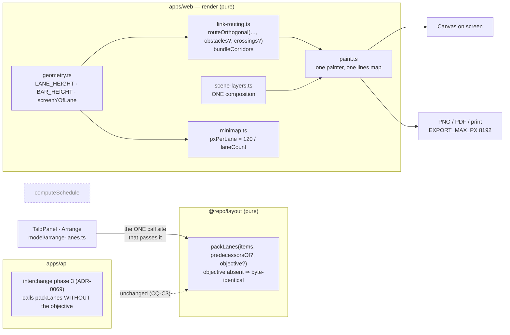
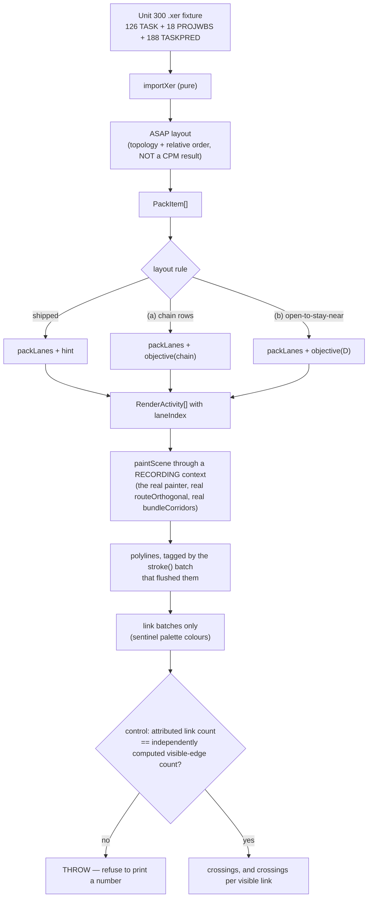
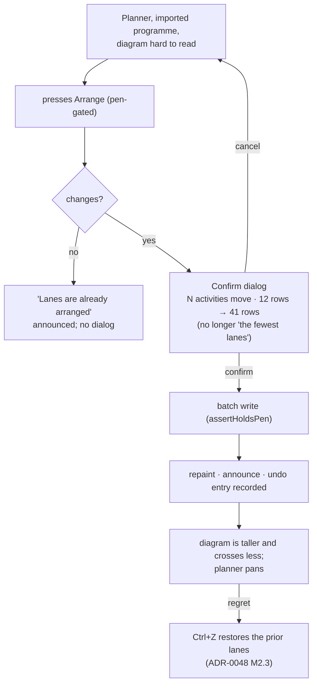
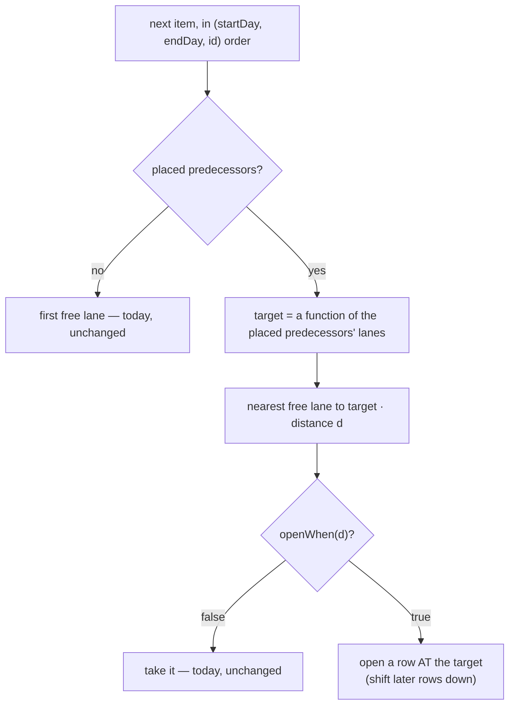

# Feature Spec: Diagram legibility, Part C — crossings, rows, and the gutter

- **Status:** Draft — awaiting approval before implementation
- **Author(s):** feature-analyst (Claude Opus 5)
- **Date:** 2026-09-22
- **Epic:** `docs/specs/diagram-legibility/` — **this is Part C of that epic, not a new one.** Read
  [`./feature-spec.md`](./feature-spec.md) (Parts A and B), [`./m2-verdict.md`](./m2-verdict.md)
  (the withdrawal gate that cancelled Part A's M3) and [`./cheap-levers.md`](./cheap-levers.md)
  (the measured levers) first.
- **Related ADR(s):** amends/extends **ADR-0026** (canvas model), **ADR-0064 M2** (obstacle-aware
  routing), **ADR-0065** (orthogonal corridors + bundling), **ADR-0069** (the shared lane packer),
  **ADR-0100/0141/0142** (the minimap), **ADR-0103** (the export composes the same scene).
  **An ADR is required for the layout rule** (§4.9). Number deliberately not pinned (ADR-0079).

> **Why a new file rather than editing `feature-spec.md`.** That document is the record of Parts A
> and B: its FC-1/FC-2 were committed before M1 and judged in `m2-verdict.md`, and its §0.1–§0.5
> findings are cited by `docs/TECH_DEBT.md` #363 and by the closed-numbers entry for #364. Rewriting
> it to describe a different problem would destroy the evidence the withdrawal of M3 rests on. This
> file carries Part C's own conditions, in its own commit, judged separately.

---

## 0. What changed while reading the code

Every claim the brief for this spec carried was re-verified today against the tree, per §19.11 —
_the brief is not evidence_. **Eight of them hold. Two are stale, one in a way that changes every
number in the epic's own measurement file, and four things nobody had reported were found.** Each
claim below names the file and line, or the command, that establishes it.

### 0.1 The 12-lane figure is real and does not describe the state the reader is in — a correction to a correction, kept in place

**This section was wrong in its first draft and the wrong version is preserved here rather than
replaced, because the way it was wrong is this register's own recurring failure: a number re-derived
correctly from the repository and then applied to a configuration the reader is not in.**

What it said: that `web-v0.140.1` produces **12 drawn lanes, mean |Δlane| 1.59, 11 long links**, and
that the brief's _"27 rows at 28 px is 756 px"_ therefore describes a diagram that no longer exists.
The derivation was right; the application of it was not. **Two independent mechanisms keep the
product owner at 27 rows**, each verified today:

1. **The WBS band is OFF by default.** `TsldPanel.tsx:1100` reads
   `toggleOn: viewToggles.wbsBand ?? false`, and `view-toggles.ts:68-73` states "Default **off**" in
   its own docblock. Band off, `deriveWbsBandSource` returns `sceneActivities: activities` **by
   identity** (`wbs-band-source.ts:63`) — so `computeLaneArrangement`'s scene/band split degenerates
   to a single pack over everything (`arrange-lanes.ts:98`) and **#364 is byte-identical to the code
   it replaced.** The 420 px it saves has never reached anybody.
2. **The importer does not call it.** `interchange.service.ts:1096` calls `packLanes(items,
predecessorsOf)` **directly**, over every activity with computed dates including the 18 summaries
   — it does not go through `computeLaneArrangement` and has no notion of a scene. So an imported
   plan carries the importer's lane-minimal packing of all 144 activities until somebody presses
   `Arrange`.

**The four configurations, and only one of them is 12 rows:**

| plan state               | band | drawn rows | mean \|Δlane\| | >5-lane | what the planner sees                          |
| ------------------------ | ---- | ---------: | -------------: | ------: | ---------------------------------------------- |
| imported, never arranged | off  |     **27** |           1.78 |      14 | **the screenshot**                             |
| imported, never arranged | on   |     **27** |           1.78 |      14 | 27 rows of extent, **13 of them blank** (§0.9) |
| arranged                 | off  |     **27** |           1.78 |      14 | byte-identical to pre-#364                     |
| arranged                 | on   |     **12** |       **1.59** |  **11** | the only configuration #364 improves           |

**So the brief's 27 rows / 756 px is correct for the state the product owner is in**, and every
figure in `m2-verdict.md` and `cheap-levers.md` that this spec's first draft promoted to "current"
is a **band-on-after-Arrange** figure. They are labelled that way throughout now. The 12-vs-27
question stops being background and becomes a **measured configuration** (§0.5, M-C0-T3).

### 0.1a The gutter arithmetic, corrected with it

Unit 300's drawn extent in the state the reader is in is **27 × 28 = 756 px**, not 336. On a canvas
of ~816 px at 1646 × 1097 that is **93 % of the diagram already full before a single row is spent**.
Every height figure in §4.6 is given against 27 rows, and the 12-row case is shown beside it as what
one press of `Arrange` with the band on already buys.

### 0.2 `cheap-levers.md`'s CQ-4 note IS stale — the screenshot's plan is the repository's fixture

The brief asked me to establish this rather than repeat it either way. **It is established, on two
independent counts, and the note should be withdrawn in place.**

The product owner's screenshot names the plan **"Unit 300 Amine"** and reports **Activities 144**.

- `packages/engine-conformance/fixtures/p6_torture_test_v1.xer:4` —
  `%R SP_PLAN Unit 300 Amine Regeneration Package - Construction & Commissioning`.
- Its section row counts, read off the file's own `%T` delimiters (lines 15/35/163/353):
  **18 PROJWBS · 126 TASK · 188 TASKPRED**. An import produces one activity per WBS node and one
  per task: **126 + 18 = 144**.

A plan name and an exact activity count are two independent matches. `m0-measurement.md` M0-T3
already corrected the "not in this repository" half; what it could not then say — because the
earlier screenshot showed neither the name nor the count — is that **this fixture is, to the
standard this epic uses elsewhere, the plan in the picture.**

**What that changes:** CQ-4's default ("state in every harness that none of these is the reported
plan") is withdrawn for Unit 300 and **kept for the scale fixtures**. Unit 300 becomes the fixture
the verdict is read from, not the most realistic of three proxies. What is still not established:
that the product owner's import used _this_ export of the programme, and that their plan has not
been edited since. Both are cheap to close and neither is assumed.

### 0.3 The eight brief claims that hold, verified today

| Claim                                                                                              | Verified at                                                                                                                                        |
| -------------------------------------------------------------------------------------------------- | -------------------------------------------------------------------------------------------------------------------------------------------------- |
| `packLanes` is a greedy first-fit that minimises lane **count**                                    | `packages/layout/src/pack-lanes.ts:70-88`                                                                                                          |
| `predecessorsOf` chooses only among **already-free** lanes and never opens one                     | `pack-lanes.ts:75-85` + `nearestFreeLane` at `:117-129`; a new lane is opened only at `lane === -1`                                                |
| Lane count is therefore identical with or without the hint, by construction                        | the docblock claim at `:45-48`, **and** verified on all five measured configurations by the harness's own check (`measure-lane-travel.mjs:99-107`) |
| `routeOrthogonal`'s `obstacles` carries a `LaneIntervalIndex` of per-lane occupied **bar** x-spans | `link-routing.ts:161-168`; the index is built from `activityRect` alone at `:90-118`                                                               |
| **Nothing anywhere considers other links**                                                         | the only obstacle source is `laneIntervalIndex(activities, …)`; `free(x)` at `:196-197` tests bars only                                            |
| Corridor bundling merges co-linear corridors, which is not crossing avoidance                      | `bundleCorridors` at `:302-343` — its one safety check is `isLaneFreeAt`, i.e. bars                                                                |
| `LANE_HEIGHT = 28`, `BAR_HEIGHT = 18`, a **10 px gutter**                                          | `render/geometry.ts:40,42`                                                                                                                         |
| "As arrived (source order)" is the **worst** measured configuration — 12.96 mean, 73 long links    | `cheap-levers.md` table; `m0-measurement.md` M0-T3 table (126-bar variant: 126 lanes, same 12.96 / 73)                                             |

The harness the brief names also exists and is richer than described:
`apps/web/scripts/measure-lane-travel.mjs` + `lane-travel-probe.ts`, with Unit 300 (two variants),
scale-500 and scale-2000, a non-vacuity control that **throws** rather than judging, and an
`assertShippedRuleAgrees` guard that refuses to print if the probe's model of the shipped rule
disagrees with `computeLaneArrangement`.

**One brief figure I could not reproduce and am not carrying forward.** The existing spec's §3 puts
the bar-geometry blast radius at "87 references across 19 files". Re-derived today,
`rg -c 'LANE_HEIGHT|BAR_HEIGHT' apps/web/src` returns **99 matching lines across 22 files**, of
which `components/layout/tsld-motif.tsx` contributes 6 as a name collision (it declares its own
`LANE_HEIGHT = 12` / `BAR_HEIGHT = 6` and imports neither) — so **93 across 21**. The difference is
a week of commits, not an error in either count, and `rg -c` counts _lines_ rather than
occurrences. It is stated rather than quoted forward. For this spec the number that matters is
narrower: **`LANE_HEIGHT` alone is 65 lines across 18 files under `apps/web/src/features/tsld/`**,
all of them reading the one exported constant.

### 0.4 The complaint has changed, and no instrument in this repository measures the new one

Part A's M1 shipped. `m2-verdict.md` records the excursion count going **380 → 0** at every one of
24 framings, and `link-routing.ts:242-245` now adds `view.originY`. So the symptom the epic was
opened on — _a link disappears off the page and comes back down_ — is gone, and the product owner is
not reporting it. They are reporting something else: **logic lines crossing each other.**

**Those are different quantities and the difference is structural, not a matter of degree.**

- An **excursion** (`vhv-gutter-probe.ts:253-262`) is a property of **one** polyline: do its
  interior vertices leave the y-band its own two endpoints span? Two links that cross each other can
  both be perfectly well-behaved 4-point elbows entirely inside their own bands. `excursions` is
  therefore **0** on a picture full of crossings, by construction.
- **mean |Δlane|** and **>5-lane links** are per-link **magnitudes**. A crossing is a property of a
  **pair** of links. No function of per-link magnitudes can determine a pairwise property, so
  neither proxy can be read as a crossing count in either direction.

**Every number this epic has produced is one of those three.** The product owner's complaint is
literally about the one quantity nothing here has ever measured. Designing a remedy against the
proxies would be measuring the thing we can measure rather than the thing that was reported — which
is `docs/TECH_DEBT.md` #323's recorded failure, twice, on the neighbouring surface.

### 0.5 #364 may have made crossings WORSE while making the diagram shorter — and nothing measured it

This is a hypothesis with a test, stated as one. It is the leading candidate explanation for why the
complaint arrives **now**, one release after a change that was measured as an unambiguous win.

`web-v0.140.1` took Unit 300's drawn extent from 27 rows to 12 (§0.1) and left the link count
unchanged at 188. Rows are separated by gutters, and a routed corridor's horizontal leg lives in
one: 27 rows offer 26 inter-lane gutters, 12 rows offer 11. **The same 188 relationships now pass
through 42 % as many gutters** — a ×2.4 increase in corridor traffic per gutter if it is anywhere
near uniformly distributed. The `>5-lane` count fell 14 → 11, but those 11 links now span more than
five of **twelve** rows rather than five of twenty-seven: each one crosses more than 40 % of the
whole diagram's height.

Nothing in `cheap-levers.md` or `m2-verdict.md` measured density, because neither had a pairwise
metric. **The test is M-C0's first run:** the crossing metric against `web-v0.140.0`'s layout
(27 rows) and `web-v0.140.1`'s (12 rows) on the same plan at the same framing. If crossings-per-link
rose, that is a finding about a shipped change and belongs in the register whatever this epic
decides to build. **It is not an argument for reverting #364** — those 15 rows painted nothing at
all, which is a separate and settled defect — it is an argument that height and legibility are being
traded against each other and only one side of that trade has ever been measured.

### 0.6 The bundler can move a corridor across links, and its safety check cannot see that

`bundleCorridors` snaps near-coincident verticals onto a shared trunk and carries one refusal, whose
docblock is explicit about what it protects: _"a corridor is only moved onto the trunk if the trunk
x is free across the lanes that corridor crosses"_ (`link-routing.ts:288-293`). `isLaneFreeAt`
(`:121-135`) queries the **bar** index. So bundling is checked against bars and **unchecked against
links** — it can move a corridor onto a trunk that crosses relationships its original x did not.

That is not a defect today, because nothing in the product claims otherwise and bundling is
deliberately about reducing visual noise. It becomes one the moment a crossing-aware router exists:
the router would choose a corridor for its crossing count and the bundler would then move it, with
the new feature silently reverting the old one — which is verbatim the risk ADR-0065 M3 wrote its
free-check to prevent, one obstacle class along. **Candidate (c) must either extend that check to
links or be measured with bundling on and off, and the spec may not assume which.**

### 0.7 A crossing-aware router is order-dependent, and `scene.edges` order is not a total order

`paint.ts:1202-1210` routes in `scene.edges` order into a `lines` map. Today that is harmless:
`routeOrthogonal` consults only bars, which do not change as edges are routed. A crossing-aware
router consults **links already routed**, so who avoids whom is decided by array order — and
`scene.edges` comes from the plan's dependency list, which is a server response and not a stable
total order across refetches.

ADR-0065's rule is that _a route that varies between frames reads as the diagram twitching_. So a
crossing-aware router must sort its edges by a **total order** before routing, exactly as
`computeEdgeFanOut` already does (`link-routing.ts:549-550, 572-576`: `e.id ?? pred\0succ\0type`).
This is a design requirement with a test (FC-C5), not a note.

### 0.8 Two places where "I'm happy to pan" does not apply, and the product owner has not been asked

The height decision is theirs and is recorded. These two consequences are **not** about panning and
were not in front of them when they made it.

**The exported and printed diagram cannot pan.** `export-image.ts:28-34` caps the raster at
`EXPORT_MAX_PX = 8192` per side and, past it, **scales the backing store down — `dpr` goes below
1** (`:104-108`). `PrintSurface.tsx:17-18` reuses that same PNG, so the printed diagram inherits it.

**The cap is on the raster, not on CSS pixels, and the multiplier is the reader's own display.**
`use-diagram-image.ts:218` requests `dpr: globalThis.devicePixelRatio || 1`, capped at
`EXPORT_DPR_CAP = 2` — and the product owner's Surface Pro reports **1.75** (2880 × 1920 at 175 %).
So the usable CSS-px height is `8192 / dpr` less the 96 px title band, the 22 px marker row and
2 × 32 px padding:

| device pixel ratio | usable CSS px | rows at `LANE_HEIGHT` 28 | rows at 36 |
| ------------------ | ------------: | -----------------------: | ---------: |
| 1.0 (non-HiDPI)    |        ~8,010 |                  **286** |    **222** |
| **1.75 (theirs)**  |        ~4,497 |                  **160** |    **124** |
| 2.0 (the cap)      |        ~3,914 |                  **139** |    **108** |

**This was nearly stated as 292 rows, from `8192 / 28`, and that would have been wrong by the
reader's own screen.** The figures that matter are the middle row, and they are **reachable**: Unit
300's source-order layout is 144 rows and a chain-row rule on a plan with few long chains tends
toward one row per activity — the worst measured configuration of that shape is 144 on Unit 300 and
2,160 on `scale-2000`. A diagram past the cap does not fail; it silently returns a down-sampled
image with a "scaled to fit" note, which is the deliverable a planner hands to somebody who was not
in the room. **Exact figures are M-C0-T4's output; the arithmetic above is what makes it a question
rather than a footnote.**

**The minimap's lane axis.** `minimapViewport` sets `pxPerLane = box.height / laneCount`
(`render/minimap.ts:203-217`) over a `MINIMAP_BOX` of **200 × 120** (`TsldMinimap.tsx:43`), fed
`sceneRef.current.activities` (`TsldCanvas.tsx:1928-1932`), which is `wbsBand.sceneActivities`. So
Unit 300's minimap is **120 / 12 = 10 px per lane** today — comfortable. At 45 rows it is 2.7 px; at
120 rows it is 1 px and every bar is floored (`MinimapRect`'s `h` is floored at 1 px,
`minimap.ts:278`).

`docs/TECH_DEBT.md` **#323** measured the lane axis and concluded the **day** axis is the dominant
term, with _"map by occupied-lane rank"_ withdrawn because `packLanes` structurally never leaves an
empty lane. **Both halves of that finding survive and neither covers this case**: a row-spending
packer does not leave empty lanes either, it opens _occupied_ ones, so rank-mapping is still inert —
and it makes the lane axis dominant on a plan where #323 measured that it is not. That row's
recommendation-on-record ("accept") was reached on a layout this epic proposes to change, and it
must be re-measured rather than inherited.

---

## 1. Business understanding

### Problem

**The diagram is hard to read at scale because its logic lines cross each other.** The product
owner's words, against `web-v0.140.1`:

> "while it is better the canvas is still hard to read with lots of activities. the logic lines cross
> each other which in netpoint they rarly do? i'm not saying we can't have crossing logic but it
> should be a last resort"

and, decisively for the shape of the remedy:

> "I get we are minimising lanes but this isn;t the deal breaker, readability is. i'm happy to have
> to pan the canvas to see clear data if its better readable"

That second sentence reverses a constraint that has been load-bearing for the whole product.
`packLanes` exists to minimise lane **count** (`pack-lanes.ts:2-11`), the proximity hint was
deliberately forbidden from opening a lane (`:44-48`), and five consecutive epics
(ADR-0090/0091/0092/0099/0112/0113) were spent recovering vertical canvas space. **The constraint
those decisions optimised against has been withdrawn by the person it was being optimised for.**

Three mechanisms can produce a crossing, and the epic has evidence about none of them:

1. **Row assignment.** Two relationships whose rows interleave must cross somewhere. This is the one
   NetPoint answers by keeping a chain on one row until it forks.
2. **Corridor choice.** `routeOrthogonal` picks a vertical corridor from a bounded candidate list
   (`link-routing.ts:205-213`) scored **only** on whether it passes through a bar. Two corridors
   that cross each other are equally acceptable to it.
3. **Gutter width.** Every corridor's horizontal leg shares a 10 px band with every other corridor
   in that gutter (`geometry.ts:40,42`), against a fan-out spread of ±6 px
   (`FAN_OUT_MAX_PX`, `link-routing.ts:517`) and a 5 px elbow radius (`LINK_ELBOW_RADIUS`, `:495`).
   Two runs through one gutter have no room to be told apart even when they do not cross.

### Users

| Role                                  | What they need from this                                                                                                                                                         |
| ------------------------------------- | -------------------------------------------------------------------------------------------------------------------------------------------------------------------------------- |
| **Planner** (ADR-0016)                | The primary user. The only role that can press `Arrange` (pen-gated, `tsld-toolbar-items.tsx:2917-2933`). Reads the logic; is the person who reported this.                      |
| **Contributor / Viewer**              | Read the diagram. Benefit from legibility; never repack.                                                                                                                         |
| **Org Admin**                         | As Planner, plus the pen override.                                                                                                                                               |
| **External Guest** (ADR-0051)         | Reads a shared plan. Inherits the picture with no control over it — and `docs/TECH_DEBT.md` #356 already records that view drawing a different basis, so it is not a free rider. |
| **The person who is not in the room** | Receives the PNG/PDF or the printed diagram. **Cannot pan.** §0.8 is entirely about them.                                                                                        |

### Primary use cases

1. A planner opens an imported 144-activity programme and can follow a relationship from one bar to
   another without tracing it past three other lines.
2. A planner presses **Arrange** and gets a diagram whose relationships cross as little as the
   picture allows, at a vertical cost stated before they confirm.
3. A planner hands the exported diagram to a QS and it is the same picture, legibly.

### User journeys

**Happy path.** Planner imports a P6 programme → ADR-0069 phase 3 packs it lane-minimally on import
(unchanged — §2.4) → the planner presses **Arrange** → the confirm states what it will do **and how
tall the result will be** → confirm → rows repack, crossings fall, the diagram gets taller → one
Undo reverses it (ADR-0048 M2.3).

**Nothing to do.** `computeArrangeChanges` returns empty → _"Lanes are already arranged; nothing to
move."_, no dialog (`TsldPanel.tsx:2224-2233`). Unchanged.

**Read-only.** A Viewer, a Contributor and a guest see whatever the last Arrange produced. They
press nothing.

### Expected outcomes

- Crossings on the measured programme fall materially, at a vertical cost the product owner chose
  from measured options and rendered pictures.
- The gutter carries two distinguishable runs.
- Nothing moves unless a planner presses `Arrange` (ADR-0148 made hand-placement first-class).
- The exported and printed diagram remain legible, or the cost of their not being is accepted
  explicitly.

### Success criteria

Seven falsification conditions, §4.10, committed **in their own commit before any harness runs**
(ADR-0128's ordering). Each has a withdrawal clause; a condition without one is decoration.

---

## 2. Functional requirements

### 2.1 User stories & acceptance criteria

> **US-1** — As a **Planner**, I want `Arrange` to lay activities out so that relationships rarely
> cross, so that I can read the logic on a real programme without tracing lines.
>
> **Acceptance criteria**
>
> - **Given** the Unit 300 fixture, **when** the chosen layout rule runs, **then** whole-plan routed
>   crossings per visible link fall against the `web-v0.140.1` baseline by at least FC-C2's margin,
>   at identical framing, zoom and plan.
> - **Given** any input, **when** the packer runs twice, **then** the lane assignment is identical;
>   and **when** the input arrays are permuted, **then** it is still identical (`pack-lanes.ts:59-62`'s
>   total order survives).
> - **Given** the packer is called **without** the new objective, **then** its output is
>   byte-identical to today's, point for point — the `predecessorsOf` parity rule
>   (`pack-lanes.ts:50-53`) extended to a second optional parameter.
> - **Given** a plan with no dependencies, **then** the output is byte-identical to today's. There
>   is no chain to keep on a row.
> - **Given** a plan that has never been recalculated, **then** nothing moves
>   (`arrange-lanes.ts:63`, `:67-77`).

> **US-2** — As a **Planner**, I want the `Arrange` confirmation to tell me how tall the result will
> be, so that a diagram that suddenly needs three screens is a choice rather than a surprise.
>
> **Acceptance criteria**
>
> - **Given** `Arrange` is pressed and there are changes, **when** the dialog opens, **then** it
>   states the number of activities moving **and** the resulting row count against the current one.
> - **Given** the new objective opens rows, **when** the dialog opens, **then** its description no
>   longer says _"into the fewest lanes"_ — a promise the packer would no longer keep. Both branches
>   carry that phrase today (`TsldPanel.tsx:3342-3343`).
> - **Given** the dialog is confirmed, **then** the existing announcement
>   (`TsldPanel.tsx:2246-2247`) and the ADR-0048 undo entry behave exactly as today.

> **US-3** — As a **Planner**, I want two relationships passing between the same two rows to be
> tellable apart, so that a gutter reads as wiring rather than as a smudge.
>
> **Acceptance criteria**
>
> - **Given** a gutter carrying two horizontal runs, **when** the diagram is rendered at 1646 CSS px
>   at the Week preset, **then** the two runs are separated by at least the elbow radius and both are
>   clear of both bar edges.
> - **Given** the new lane pitch, **when** any glyph is drawn, **then** it stays inside its lane —
>   **FC-6 of the existing spec, reused rather than re-derived**, and it becomes a gate here
>   (M-C1-T2) because Part A's M4 never ran.

> **US-4** — As **the person who receives the exported diagram**, I want the picture I am sent to be
> readable, so that a taller diagram does not become a smaller one.
>
> **Acceptance criteria**
>
> - **Given** the chosen layout on the largest measured fixture, **when** the `whole` PNG is
>   produced, **then** either its natural raster is within `EXPORT_MAX_PX` per side, or the
>   down-scaling is reported to the product owner and accepted (CQ-C2).

> **US-5** — As a **Planner who has hand-placed activities**, I want nothing to move unless I ask,
> so that ADR-0148's placements survive.
>
> **Acceptance criteria**
>
> - **Given** any of: opening a plan, importing a plan, a recalculation, a refetch, or a window
>   resize, **when** the new objective exists, **then** **no** lane changes. The only writer is the
>   `Arrange` confirm path (`TsldPanel.tsx:2236-2255`).

### 2.2 Workflows

**Arrange — unchanged in shape, changed in content.**

1. Planner presses `Arrange` (pen-gated, tier 2, `tools` group — `tsld-toolbar-items.tsx:2917-2933`).
2. `computeArrangeChanges` builds the input from `activities`, `wbsBand.sceneActivities`,
   `dependencies` and `dataDate` (`TsldPanel.tsx:2213-2219`).
3. `computeLaneArrangement` packs the scene into `0..N-1` and appends band-drawn summaries above
   (`arrange-lanes.ts:95-124`) — **#364's shape is kept exactly**; the new objective changes only
   _which free row, or whether to open one_, inside `packLanes`.
4. Empty ⇒ announce and stop. Non-empty ⇒ confirm, **now stating the row cost**.
5. Confirm ⇒ the existing batch write ⇒ announce ⇒ undo entry.

**Import — deliberately unchanged.** `interchange.service.ts` phase 3 keeps calling `packLanes`
without the objective. That is the approved scope ("Arrange button ONLY") and its consequence is
CQ-C3.

### 2.3 Edge cases

| Case                         | Expected behaviour                                                                                                                                                                          |
| ---------------------------- | ------------------------------------------------------------------------------------------------------------------------------------------------------------------------------------------- |
| Plan never recalculated      | No `earlyStart` ⇒ no `PackItem` ⇒ nothing moves (`arrange-lanes.ts:67-77`).                                                                                                                 |
| Zero dependencies            | Byte-identical to today. No chains exist.                                                                                                                                                   |
| One activity                 | One row; every objective agrees.                                                                                                                                                            |
| A predecessor not yet placed | Only **placed** predecessors steer (`pack-lanes.ts:94-109`). Any new objective must keep that, or the result becomes order-dependent and FC-C5 fails.                                       |
| A cycle in `predecessorsOf`  | Impossible in the product (ADR-0021), but the packer is pure and has no right to assume its caller: it must terminate on any input.                                                         |
| WBS band **off**             | `sceneActivities` is `activities` by identity (`arrange-lanes.ts:19-24`), so the split degenerates to one pack. The objective must not change that.                                         |
| WBS band **on**              | Summaries are appended above the scene and are never dependency endpoints (ADR-0038), so the objective is inert for them — as the hint already is (`arrange-lanes.ts:115-116`).             |
| Two links share a bar edge   | They converge by design (fan-out, `computeEdgeFanOut`). **Not a crossing** — the metric must exclude shared endpoints (§4.5).                                                               |
| A bundled trunk              | Collinear overlap by design (ADR-0065 M3). **Not a crossing** — counting a trunk of `n` corridors as `n(n−1)/2` crossings would report the shipped bundler as the product's worst offender. |
| Guest share view             | Read-only; inherits the picture; no payload change.                                                                                                                                         |
| Gantt view                   | Uses neither `packLanes` nor `routeOrthogonal`; one bar per row. **Structurally out of reach** — established by reading at `m0-measurement.md` M0-T6, not assumed.                          |
| Minimap                      | Sees the new row count through `worldExtent`. §0.8; FC-C7's second limb.                                                                                                                    |

### 2.4 Permissions

Nothing changes, and it is checkable rather than asserted.

| Capability           | Role                                                    | Scope                         | Gate                                                                |
| -------------------- | ------------------------------------------------------- | ----------------------------- | ------------------------------------------------------------------- |
| Read the diagram     | Viewer, Contributor, Planner, Org Admin, External Guest | organisation / per-plan share | existing                                                            |
| Press `Arrange`      | Planner, Org Admin                                      | organisation                  | `penGated: true` + `isEnabled: ctx.canAutoArrange` — **unchanged**  |
| Write lane positions | Planner / Org Admin holding the pen                     | organisation                  | the positions endpoint, `assertHoldsPen` (ADR-0028) — **unchanged** |
| Import packing       | the import's actor                                      | organisation                  | ADR-0069 — **unchanged, deliberately** (CQ-C3)                      |

A repack is a structural plan write and already takes the pen. A gutter change and a router change
are render decisions and take nothing.

### 2.5 Validation rules

- **The objective is a parameter of `packLanes` with a default that reproduces today**, never a
  module constant read implicitly — the `clampPxPerDay` / `maxPxPerDay` pattern
  (`viewport.ts:130-131`: _"required, not defaulted, so the caller must resolve"_), so the compiler
  catches a call site that forgot rather than a reviewer.
- **Determinism is a validation rule.** The total order `(startDay, endDay, id)` and the
  tie-to-lower-lane rule (`pack-lanes.ts:111-129`) survive unchanged; a property test asserts output
  equality across input permutations.
- **The crossing-aware router sorts its edges by a total order before routing** (§0.7), asserted,
  not commented.
- **Bounded work.** No unbounded search on the paint path — _"bounded work is the contract"_
  (`link-routing.ts:218-220`). The complexity class may not get worse than today's
  `O(edges × crossed lanes × log spans)`.

### 2.6 Error scenarios

| Scenario                                    | Detection                                 | User-facing result                                | Status |
| ------------------------------------------- | ----------------------------------------- | ------------------------------------------------- | ------ |
| Pen not held when `Arrange` pressed         | `penGated` + `disabledReason`             | The command is shaded with its reason (ADR-0082)  | —      |
| Positions write conflicts (stale `version`) | optimistic lock                           | Existing conflict banner; refresh offered         | 409    |
| Packer handed a malformed graph             | pure function                             | Terminates; returns a valid packing; never throws | —      |
| Export raster past the cap                  | `scaledToFit` (`export-image.ts:107-108`) | The title band notes "scaled to fit"              | —      |

### 2.7 Open questions

See §6. **Three are critical** (CQ-C1, CQ-C2, CQ-C3); CQ-C1 is deferred by construction because it
cannot honestly be asked before M-C0 returns numbers and pictures.

---

## 3. Technical analysis

| Area               | Impact     | Notes                                                                                                                                                                                                |
| ------------------ | ---------- | ---------------------------------------------------------------------------------------------------------------------------------------------------------------------------------------------------- |
| **Frontend**       | **high**   | `render/geometry.ts` (the gutter), `render/link-routing.ts` (the router), `TsldPanel.tsx` (the confirm copy), and the export/print via `scene-layers.ts`.                                            |
| **Shared package** | **medium** | `packages/layout/src/pack-lanes.ts` — one optional parameter. One new call site passes it.                                                                                                           |
| **Backend**        | **none**   | The importer keeps calling `packLanes` unchanged. `apps/api` contributes **zero files** to this epic's diff, which is what makes CQ-C3 a decision rather than a refactor.                            |
| **Database**       | **none**   | No model, column, index, constraint or migration. **`database-architect` is not engaged because there is nothing to design** — recorded explicitly so it cannot read as the judgement §19.3 forbids. |
| **API**            | **none**   | No endpoint, DTO, status code or OpenAPI change. `lane_index` already exists and the batch write is unchanged.                                                                                       |
| **Security**       | **none**   | No new data, no new capability, no RBAC or scope change. The pen still gates the write.                                                                                                              |
| **Performance**    | **medium** | Two opposite effects, measured separately (FC-C4): more rows put **fewer** bars in the fixed visible band at Fit; a crossing-aware router adds per-edge work.                                        |
| **Infrastructure** | **low**    | One new Playwright config + CI step at M-C4, which is an ADR-0105 trigger and takes a shard slot (ADR-0136 / ADR-0138 rosters will demand three declarations).                                       |
| **Observability**  | **none**   | Nothing new logged.                                                                                                                                                                                  |
| **Testing**        | **high**   | See below.                                                                                                                                                                                           |

### Testing

- **Unit (Vitest)** — the packer's determinism property across permutations; byte-identity with the
  objective omitted **and** with it set to the neutral value, as two separate cases; the router's
  no-index parity; the crossing metric's own pure arithmetic against hand-built polylines.
- **The golden log** — `paint.golden.test.ts` is the whole-scene oracle (ADR-0078 S1). A gutter
  change moves every y in it. It is **re-baselined by reading the diff line by line against a
  written list, never with `-u`** (ADR-0106's rule, which M1 followed).
- **The routing budget gate** — `paint.routing-budget.test.ts` is a counting-stub gate asserting the
  _shape_ of the per-frame routing cost, written for exactly the failure a crossing-aware router
  invites: _"an unbounded search that looks free on a ten-bar fixture and blows the budget at two
  thousand"_ (`:27-31`). It must stay green **without being edited**. If it has to be relaxed, the
  router is unbounded and FC-C4's second limb has failed.
- **Real browser** — the unit tier is jsdom: no layout, no canvas, no colour resolution. Three of
  this register's canvas defects were invisible to it (ADR-0100 M4, ADR-0102, ADR-0121). The gutter's
  _picture_ is judged from a rendered image, not from arithmetic.
- **Journey** — M-C4, which also closes `docs/TECH_DEBT.md` **#363**. See §4.8 for why it lands at
  M-C2 and not at M-C1.
- **a11y** — `a11y.ts` speaks the lane number, so a repack changes what every moved row announces.
  The ADR-0063 §4 invariant (the count of AT-reachable activities does not change across a repack)
  is asserted, not assumed.
- **Probe** — ADR-0128's staff-console benchmark, `canvas-draw`, one press by the product owner.

### Rendering traps (all verified live in this code)

1. **ADR-0102** — `resolveTsldPalette` must read raw token names under the canvas root
   (`palette.ts`), never `@theme inline` aliases, or a surface rebind can never reach them.
2. **ADR-0100 M4** — a token pair absent from `@theme inline` painted **nothing at all** in a real
   browser while the contrast gate stayed green. Any new value must be asserted **reachable**.
3. **ADR-0121** — Canvas 2D's `fillStyle`/`strokeStyle` **silently discard** an unparseable value and
   keep the previous colour. No throw, no warning, every jsdom test green.

None of the three fires if this epic adds no colour, which is the plan — stated so the next reader
knows it was checked rather than overlooked.

### Dependencies

- **`LANE_HEIGHT` is 65 lines across 18 files** under `apps/web/src/features/tsld/`, all reading the
  one exported constant (`rg -c 'LANE_HEIGHT' apps/web/src/features/tsld`). There is **no hidden
  duplicate**: the only bare `28` in non-test source under that tree is a text baseline in the export
  title band (`export/render-export-image.ts:286`), checked rather than assumed.
- **The vertical budget is 5 px per side and 4 px of it is spent.** `(28 − 18) / 2 = 5`;
  `SUMMARY_TAB_H = 4` drops below the bar (`render-model.ts:102, 109-115`) leaving **1 px**;
  `GLYPH_CAP_OVERHANG = 3` overhangs both edges (`:82, 91-98`) leaving 2 px. **Raising `LANE_HEIGHT`
  while holding `BAR_HEIGHT` moves every one of those the safe way** — which is why the gutter
  proposal is a pitch increase and not a bar reduction.
- **`FAN_OUT_MAX_PX = 6` is justified in a comment by `BAR_HEIGHT / 2 = 9`**
  (`link-routing.ts:515-517`) and that module does **not** import `BAR_HEIGHT`. The compiler cannot
  see the invariant. This epic does not change `BAR_HEIGHT`, so it does not fire — but the gate is
  cheap and lands here (M-C1-T2) because Part A's M4 was never reached.
- **`BAR_RADIUS = 3`'s docblock says "subtle at BAR_HEIGHT 18"** (`render-model.ts:29-31`) — a value
  justified by another value. Unaffected by a pitch change; recorded so nobody has to re-derive it.
- **`cull`'s default margin is `LANE_HEIGHT`** (`geometry.ts:689`), so a pitch change widens the cull
  margin by the same amount. Intended and harmless; noted because it is the one consumer where the
  constant is doing a second job.
- **`--row-h` governs the Gantt and only the Gantt** (`globals.css:936`, quoted at
  `m0-measurement.md` M0-T6). The equality of both pitches at 28 is two independent decisions landing
  on one number, documented as such. **There is no gate to add and no drift to report.**

**Open register rows this epic touches:** #75 (the draw budget — FC-C4 adds a reading; the row is
PARKED on a trigger and this is not one of them unless a reading misses §9's floor), #323 (the
minimap — §0.8 re-opens its lane-axis measurement), #363 (`Arrange` has no end-to-end coverage —
**closed by M-C4**), #167 (the export renders the default picture rather than the planner's lens
state — deliberately left alone).

---

## 4. Solution design

### 4.1 Architecture

**`computeSchedule` is not imported, not reachable and not called** by anything in this epic — that
is **ADR-0125 D1's strong form**, deliberately **not** ADR-0116 D7's weaker sibling, named so nobody
reaches for the wrong sentence later. `@repo/layout` has one dependency-free source file;
`lane_index` is presentation and `computeSchedule` has never seen it (ADR-0069's own words). **No
migration runs.** So the ADR-0034 recalculation parity gate is untouched in its honest form: **there
is nothing here to hold parity for.**

### 4.2 Data flow — what a crossing measurement is made of

**Two things about this diagram are the design, not decoration.**

The measurement is taken from **the polylines the real painter draws**, through the recording
context `vhv-gutter-probe.ts:91-125` already establishes, and not from a re-implementation of the
routing pipeline. `cheap-levers.md` records its own lever-2b figures having been _a model of a rule
that did not exist yet_ and the correction that followed (ADR-0124: a measurement taken with a copy
of an instrument measures the copy). A crossing metric computed from lane assignments alone would be
exactly that — it would be blind to the corridor choice and to the bundler, which are two of the
three mechanisms in §1.

And the **control is asserted first and throws** (ADR-0130's rule; ADR-0066's benchmark that measured
the cull; ADR-0106's harness that measured the bars instead of the pills). A harness that finds no
link polylines reports zero crossings, which looks like a perfect score.

### 4.3 User flow

The **41** above is illustrative punctuation in a diagram, not a claim. The real number is M-C0's
output and CQ-C1's subject.

### 4.4 The three candidates, and what they actually are

The brief names three. Reading the code says **(a) and (b) are the same mechanism with different
parameters**, and (c) is independent of both and composes with either.

| Candidate                          | Expressed as                                                                  | What it is                                                                                                       |
| ---------------------------------- | ----------------------------------------------------------------------------- | ---------------------------------------------------------------------------------------------------------------- |
| **(a) chain rows** (NetPoint-like) | `target = the driving/first placed predecessor's lane`, `openWhen(d) = d > 0` | A chain keeps its row until it forks or ends; a fork's second branch opens a row rather than being re-homed.     |
| **(b) open-a-row-to-stay-near**    | `target = mean placed predecessor lane` (today's), `openWhen(d) = d > D`      | Today's rule, plus permission to open a row when the nearest free one is more than `D` away.                     |
| **today (control)**                | `openWhen(d) = false`                                                         | Exactly `pack-lanes.ts:75-85`. **This is the parity case and it is the default**, so "revert" is "pass nothing". |
| **(c) crossing-aware router**      | a second optional parameter on `routeOrthogonal`                              | Leave rows alone; score the bounded corridor candidate list on links crossed as well as bars hit.                |

**So M-C0 builds ONE harness-local chooser with three configurations, not three throwaway packers.**
That is not a convenience: three separate implementations would have three separate tie-break rules
and the comparison would be measuring the implementations rather than the objectives.

**(c) composes.** The matrix is `{control, (a), (b)} × {shipped router, crossing-aware router}` — six
cells plus the gutter as a rendering parameter, which is affordable because every cell is one call
to the real painter.

**The open is `AT the target`, not `at the end`.** Appending a row at `N` and putting the item there
buys nothing: the item is then as far from its predecessor as before. Opening at the target means
shifting every later row down by one, which is why this cannot be a post-pass and has to live inside
the packer. It also means the packer's `laneEnds` array becomes an insertion structure rather than an
append-only one — a real complexity change, bounded and stated (§2.5).

### 4.5 The crossing metric

**Nothing in this repository counts crossings.** This is the epic's durable output whatever gets
built, because it is the first instrument that measures the quantity the complaint is about.

**Definition.** Over one painted frame, a **crossing** is a transversal intersection between a
segment of one routed link polyline and a segment of another. Routed polylines are axis-aligned, so
the test is horizontal-versus-vertical and exact in integer-ish arithmetic. **Three exclusions, each
with a reason:**

1. **Segments of the same edge.** A polyline may touch itself at an elbow; that is a corner.
2. **Shared endpoints on a common bar edge.** `computeEdgeFanOut` deliberately converges many ends on
   one bar edge (`link-routing.ts:546-589`). Counting those would report a hub as a crossing storm
   and would score the shipped fan-out as the defect.
3. **Collinear overlap on a bundled trunk.** ADR-0065 M3 merges near-coincident corridors _on
   purpose_. Counting a trunk of `n` corridors as `n(n−1)/2` crossings would make the bundler the
   product's single worst offender and would push the epic toward disabling a shipped, argued feature.

**Two figures are reported and only one is the judge.**

- **Whole-plan crossings per link** — the whole extent framed in one viewport, cull effectively
  inert. **This is the judge**, because it is comparable across layouts.
- **Per-framing crossings per visible link** at the product owner's **1646 × 1097** at the Week
  preset and at Fit. **This is the report**, because it is what they see.

**The normalisation is the most important rule here and it is stated as one.** A raw crossing count
at a fixed viewport **falls when fewer links are visible** — which is precisely what spending rows
does at Fit. A raw count would therefore reward a candidate for culling the evidence. Every figure is
per **visible link**, and the visible-link count is printed beside it so a reader can check.

**The instrument.** Extend `vhv-gutter-probe.ts`'s recording context to tag each polyline with the
`stroke()` batch that flushed it and with the `strokeStyle` at flush time. The painter batches a
layer into one path and sets the colour once, so a batch is a layer pass — and the probe already owns
its `PALETTE`, so link passes can be given sentinel colours and identified exactly. **Non-vacuity
control, asserted first:** the attributed link-polyline count must equal the edge count computed
independently from `cull` + the painter's own visibility predicate; a mismatch **throws**.

**What this metric is not.** It is a property of the _painted picture_ at a named framing, including
fan-out and bundling — not a property of the lane assignment. That is deliberate (§0.4), and it is
why `lane-travel-probe.ts` cannot be extended to answer this and a second harness is warranted rather
than duplicative.

### 4.6 The gutter

`LANE_HEIGHT` 28 − `BAR_HEIGHT` 18 = a **10 px** gutter, 5 px either side of a bar, carrying every
corridor's horizontal leg for that lane gap, against `FAN_OUT_MAX_PX = 6` and
`LINK_ELBOW_RADIUS = 5`.

**The criterion is derived, not chosen:** _the gutter must hold two distinguishable horizontal runs
clear of both bar edges._ Two runs need two line widths, one separation of at least the elbow radius
so their corners do not merge, and a margin at each bar edge. That is the smallest statement of what
the gutter is **for**, and it is judged on a rendered image rather than on arithmetic, because
whether two hairlines 5 px apart read as two lines is not a number.

**`BAR_HEIGHT` is held at 18 and the pitch rises.** Reducing the bar to widen the gutter would move
every one of §3's four spent budgets the _wrong_ way and would fire `FAN_OUT_MAX_PX`'s comment-only
invariant. Raising the pitch moves all four the safe way and is one constant.

**The arithmetic, at the product owner's own screen.** 1646 × 1097 CSS px (2880 × 1920 at 175 % —
`e2e-workspace-fit/command-surface.spec.ts:35-40`). The canvas region is the viewport less
`aboveCanvas` (measured 228–250 px across ADR-0112/0113) and the foot row (41 px, ADR-0115); the
committed probe value is **857** (`vhv-gutter-probe.ts:198-206`), which omits the foot row, so the
real figure is nearer **816**. Both are given; M-C0 measures the live one.

| `LANE_HEIGHT` | gutter | half-gutter | summary-tab clearance | visible rows @857 | Unit 300 today (12 rows) |     at 45 rows |
| ------------: | -----: | ----------: | --------------------: | ----------------: | -----------------------: | -------------: |
|  **28** today |     10 |           5 |                  1 px |              30.6 |    336 px (0.39 screens) | 1260 px (1.47) |
|            32 |     14 |           7 |                  3 px |              26.8 |            384 px (0.45) | 1440 px (1.68) |
|            34 |     16 |           8 |                  4 px |              25.2 |            408 px (0.48) | 1530 px (1.79) |
|            36 |     18 |           9 |                  5 px |              23.8 |            432 px (0.50) | 1620 px (1.89) |

**The candidate set is {28 (control), 32, 34, 36} and no value is proposed ahead of the picture.**
ADR-0142 D4 is the rule: a remedy is measured before it is built, and an approved action is a claim
that it will work. This register has **seven** consecutive layout epics whose height or width
expectation was contradicted by their own measurement, all in the same direction — and the eighth
has no reason to resolve in my favour.

Note what the table says about the gutter **on its own**: at Unit 300's present 12 rows, going to 36
costs **96 px** on a canvas of ~816 and the diagram still occupies half of it. The gutter is nearly
free today; it stops being free only in combination with a row-spending layout, which is why the two
are measured together and shipped separately.

### 4.7 `packLanes` is shared with the importer — how the tension is resolved

The brief states it exactly: scope is Arrange-only (ADR-0148 made hand-placement first-class), so the
importer must not get the new default; and ADR-0065/0069/0121 all record that two implementations
drift and the drift is invisible.

**Resolution: one function, one more optional parameter, one call site that passes it.**

- `packLanes(items, predecessorsOf?, objective?)`. **Absent ⇒ byte-identical, point for point** —
  which is `predecessorsOf`'s own established precedent inside this very function
  (`pack-lanes.ts:50-53`) and is a _structural_ parity gate rather than an asserted one.
- The **only** site that passes it is `computeLaneArrangement` (`arrange-lanes.ts:95`), reached
  **only** from the `Arrange` confirm path. `interchange.service.ts` keeps its present call.
- **The drift argument is answered rather than dodged.** ADR-0065's objection is to two
  _implementations_ of one rule; this is one implementation called two ways, and the difference is
  visible and intended — pressing a button changes the layout, which is what the button is for.
- **Its honest cost is CQ-C3**: an imported programme will open lane-minimal and improve only when
  somebody presses `Arrange`. That is a real regression in the first picture a planner sees of a
  schedule they already know, which is ADR-0069's entire stated purpose, and it goes to the product
  owner rather than being decided here.

**A sibling function is rejected**, and so is a second packer, and so is a second `Arrange` command
("arrange for shortest links") — the last because it produces two diagrams of one plan reached from
one surface, which ADR-0093 and ADR-0094 both record removing.

### 4.8 Entry points, and where the journey lands (ADR-0081)

| Milestone | User-facing?                  | Entry point                                                                                                  |
| --------- | ----------------------------- | ------------------------------------------------------------------------------------------------------------ |
| M-C0      | **no — declares itself dark** | Nothing is reachable. Harnesses, conditions, pictures. The candidates live behind the probe and are deleted. |
| M-C1      | yes — a picture change        | **The TSLD canvas itself**, plus the exported PNG/PDF and the printed diagram. No control is pressed.        |
| M-C2      | yes — a command               | **`Arrange`** on the plan command strip (accessible name `Arrange`, description "Auto-arrange lanes").       |
| M-C3      | yes — a picture change        | The canvas, export and print again. No control.                                                              |
| M-C4      | no (test only)                | —                                                                                                            |

**The journey lands at M-C2, and the reason is recorded rather than convenient.** ADR-0081's rule
exists so a milestone claiming user-facing capability names an entry point a planner can reach. M-C1
and M-C3 add no entry point and no capability: they change where an existing line is drawn, inside an
`aria-hidden` Canvas 2D bitmap that Playwright cannot read — which is the reasoning
`m0-measurement.md` already recorded for Part A's M1, and the instrument that _can_ see it is the
committed probe. M-C2 adds no entry point either, strictly — `Arrange` exists — but it **changes that
command's behaviour**, which is exactly the condition `docs/TECH_DEBT.md` #363 was filed as
outliving. So the journey lands there, closes #363, and covers what that row says a journey has to
cover: the "nothing to move" early return, a plan where rows genuinely change, the count in the
confirmation matching the rows written, the pen gate, and **undo restoring the prior lanes**.

**If CQ-C1 declines the layout rule, M-C2 does not happen and #363 stays open.** That is stated so a
cancelled milestone does not silently take a filed obligation with it.

### 4.9 Is this architecturally significant?

**M-C1 (the gutter) — no ADR.** One constant, with a gate and a re-baselined golden log. It goes in
`docs/DECISIONS.md`. (The _spec_ exists because ADR-0105's triggers fire on the Playwright config and
CI step at M-C4, not because the gutter is large.)

**M-C2 (the layout rule) — yes, and it is this part's main ADR.** Five reasons, four of them the
existing spec's §4.7 and the fifth new:

1. it changes the **objective function of a shared pure package** consumed from two applications;
2. it **spends canvas space** five consecutive epics were spent recovering;
3. it changes a **promise the product makes on screen** (`TsldPanel.tsx:3342-3343`);
4. it changes what a planner's diagram looks like after one button press;
5. **it deliberately diverges the `Arrange` picture from the import picture** — ADR-0069's subject —
   and ADR-0065/0069/0121's shared rule is that an unexplained divergence is the thing to refuse. The
   explanation belongs in an ADR or it does not exist.

**M-C3 (the crossing-aware router) — probably folds into the same ADR.** It amends ADR-0064 M2 and
ADR-0065 by adding a second obstacle class to a bounded search. The discriminator is stated rather
than left to judgement: it needs its own ADR if it changes the **bounded-work contract**
(`link-routing.ts:218-220`) or the bundler's safety rule (§0.6); it folds in if it is one more term in
the existing candidate scoring. The decision is taken at the milestone, when the design exists.

**Number: not pinned.** ADR-0079 records a number being taken between a plan and its milestone, and
stepping over that rather than recording it is the ADR-0071 failure.

### 4.10 Falsification conditions

**Committed in their own commit, before any harness runs** (ADR-0128's ordering; ADR-0097 Landing C's
harness that returned `PROCEED` from an `undefined`). Every one names what makes it fail and what
happens then.

**FC-C1 — the crossing metric discriminates, or nothing is judged on it.**
Run against two layouts already known to differ enormously on every proxy: `web-v0.140.1`'s shipped
layout and the source-order layout (measured at 12.96 mean / 73 long links — the epic's worst
configuration). Whole-plan crossings per link must differ by **≥ 3×**.
**Non-vacuity control, asserted first:** attributed link polylines == the independently computed
visible-edge count, else **throw**.
**Withdrawal clause.** If it does not discriminate, the metric is wrong and is **replaced before any
candidate is measured**. No candidate is judged on an instrument that cannot tell the best-known
layout from the worst-known one.

**FC-C2 — a candidate earns its height, or it is not offered.**
On Unit 300, at identical framing, zoom and plan, the candidate reduces **whole-plan crossings per
link by ≥ 50 %** against the `web-v0.140.1` baseline.
**Where 50 % comes from, since a round number is a warning sign.** It is not derived from a prior
remedy — the existing FC-3 did that, setting ≥ 20 % / ≥ 30 % from what the _free_ remedy delivered,
and this remedy is paid in a currency the product owner has said they will spend without limit, so a
bar at or below FC-3's would mean "spend unlimited height" buys no more than "spend nothing". It is
derived instead from what the condition is **for**: FC-C2 is a floor on what may be **offered**, not
the decision. The decision is CQ-C1, taken by the product owner on the numbers and the pictures, per
their own instruction. A halving is the smallest change this epic is willing to put in front of them
as worth vertical space.
**Withdrawal clause.** A candidate below the floor is **not offered** and is recorded as measured and
rejected. If **all three** fall below it, the layout rule is withdrawn, M-C2 does not happen, and the
epic finishes at the gutter and (if it earned its place) the router — which is the same shape as
Part A's M3 withdrawal and is deliberately made cheap.

**FC-C3 — the gutter earns its rows.**
At the chosen pitch, a rendered image at 1646 shows two runs through one gutter as two lines, clear
of both bar edges, and **FC-6 holds**: every glyph family (task, milestone, LOE, WBS summary) and
every decoration (progress band, constraint pin, feasible window, fan-out anchors, selection and
hover rings) draws within `[screenYOfLane(L), screenYOfLane(L+1))`. **FC-6 is the existing spec's
condition, reused verbatim, including its withdrawal clause: if it cannot be satisfied, the geometry
changes, not the gate.**
**Withdrawal clause.** If no candidate pitch shows two distinguishable runs, the pitch stays at 28
and the gutter is recorded as not the term — which would itself be a finding, because it would mean
the complaint is entirely row assignment and corridor choice.

**FC-C4 — paint cost, in two separately-judged limbs.**
ADR-0128 probe, `canvas-draw`, 500 and 2,000, **one press by the product owner on their own
hardware**. No CI gate, ever (ADR-0128's refusal). Dropped-frame percentage **≤ baseline + 2.00 pp**
(ADR-0127 D8a's bar), **with the machine's own run-to-run spread reported beside it** — a delta
smaller than the spread is **INDETERMINATE**, not a pass (ADR-0128's fourth verdict).

- **Limb A, the layout.** Prediction committed here: the delta is **≤ 0**, because `fitToContent`
  deliberately ignores the lane axis (`viewport.ts:200-216`: `originY` is pinned to the padding and
  `extent.maxLane` is discarded) so the visible lane band at Fit is a constant whatever the row
  count, and `cull` is a rect intersection on both axes — spreading the same activities over more
  rows puts **fewer** bars in that band. This is the existing spec's §0.3 prediction, re-verified
  against the code today and unchanged. **If the delta is > 0, §0.3 is falsified** and that is
  recorded as a finding rather than quietly dropped.
- **Limb B, the router.** A delta **> 0 is expected** and the 2.00 pp bar is the test. Additionally
  `paint.routing-budget.test.ts` must stay green **without being edited**; if it has to be relaxed,
  the search is unbounded and the router is withdrawn.

Judging them separately is not tidiness: a layout that saves frames and a router that costs them
would net out to "no change" and hide both.

**FC-C5 — determinism, at both tiers.**
Two runs on one plan produce byte-identical lane assignments **and** byte-identical routed polylines.
Permuting the input `activities` and `edges` arrays changes neither.
**Verified red** against a router that consults `scene.edges` in array order without imposing a total
order (§0.7) — a named mutation, per ADR-0110 D5: _a gate is finished when it has been made to fail
by the defect it was written for_.

**FC-C6 — byte-identity when not asked.**
`packLanes` with the objective **omitted**, and with it set to the neutral value, are two **separate**
cases and both are byte-identical to today's output. `routeOrthogonal` without the crossing parameter
is byte-identical, point for point — the existing obstacle parameter's own parity rule
(`link-routing.ts:158-160`) extended.

**FC-C7 — the deliverable and the overview survive the height.**

- **Export.** At the chosen candidate on the largest measured fixture, either the `whole` PNG's
  natural raster is within `EXPORT_MAX_PX` (8192) per side, or `scaledToFit` fires and the product
  owner has accepted it (CQ-C2). **Measured at `devicePixelRatio = 1.75`, their own display, and not
  at 1** — the raster is `size × dpr`, so the CSS-px headroom is 1.75× smaller than the constant
  suggests (§0.8).
- **Minimap.** `pxPerLane` at the chosen candidate on Unit 300 is measured and reported against
  today's 10 px, with a rendered pair.
  **Withdrawal clause.** If either is judged unacceptable, the remedy is **not** a row cap on the
  packer — the product owner removed that constraint deliberately — but a cap **in the export**, or a
  minimap change, each of which is its own scope and is filed rather than smuggled in.

### 4.11 Database changes

**None.** No model, column, index, constraint or migration. `database-architect` is **not engaged
because there is nothing to design**, recorded explicitly so it cannot read as the judgement §19.3
forbids.

### 4.12 API changes

**None.** No endpoint, DTO, status code or OpenAPI change. The lane-positions batch write and the
import pipeline keep their contracts exactly, and `apps/api` contributes zero files to the diff.

### 4.13 Component changes

| Component                              | Change                                                                       | States                    |
| -------------------------------------- | ---------------------------------------------------------------------------- | ------------------------- |
| `render/geometry.ts`                   | `LANE_HEIGHT` (M-C1), if FC-C3 passes.                                       | — (pure)                  |
| `render/link-routing.ts`               | One optional crossing parameter on `routeOrthogonal` (M-C3, conditional).    | — (pure)                  |
| `packages/layout/src/pack-lanes.ts`    | One optional objective parameter (M-C2, conditional).                        | — (pure)                  |
| `features/tsld/model/arrange-lanes.ts` | Passes the objective. The **only** site that does.                           | — (pure)                  |
| `TsldPanel.tsx` confirm dialog         | States the row cost; drops "the fewest lanes" in **both** branches.          | pending / error unchanged |
| `apps/web/scripts/`                    | The crossing harness + probe; the candidate chooser (deleted at M-C0's end). | —                         |
| `apps/web/e2e-arrange/`                | The first journey ever to press `Arrange` (M-C4).                            | —                         |

No design-system component changes; no new UI primitive; no new colour value; no one-off styling.

### 4.14 Rollback

**No `VITE_` flag** (ADR-0088 D1: a `VITE_` constant is inlined at build time, `apps/web/Dockerfile`
declares one `VITE_` build arg, `docker-publish.yml` passes none, so every published image carries
every flag at its default and an operator cannot switch one off — a flag here is a second JSX root
maintained forever, not a rollback).

The rollback is a **commit boundary**, and each slice is shaped to make that real:

- **M-C1** is one constant plus a re-baselined golden log — one revert.
- **M-C2**'s objective is an optional parameter whose absence is byte-identical, so "revert" is also
  "stop passing it at the one call site", which is a one-line change.
- **M-C3**'s crossing parameter is the same shape as the existing obstacle parameter, whose absence is
  already the documented parity gate.

---

## 5. Links

- Part A / B spec: [`./feature-spec.md`](./feature-spec.md)
- Part A / B plan: [`./implementation-plan.md`](./implementation-plan.md)
- The committed Part A/B conditions: [`./m0-conditions.md`](./m0-conditions.md)
- Part A/B measurements: [`./m0-measurement.md`](./m0-measurement.md) ·
  [`./m2-verdict.md`](./m2-verdict.md) · [`./cheap-levers.md`](./cheap-levers.md)
- **This part's plan:** [`./part-c-implementation-plan.md`](./part-c-implementation-plan.md)
- Docs this change will update: `docs/DECISIONS.md` (M-C1), `docs/TECH_DEBT.md` (#363 closed by
  M-C4; a reading added to #75; #323's lane-axis measurement re-opened; a new row if §0.5's
  hypothesis holds), `docs/adr/` (M-C2's ADR and `docs/adr/README.md`), **`CLAUDE.md` §16** (the
  register entry, which ADR-0147's gate refuses to let land separately), `docs/TESTING.md`,
  `.github/workflows/ci.yml`, `scripts/ci-roster.json` and the e2e duration roster (M-C4's step —
  ADR-0136 and ADR-0138 both refuse otherwise).

---

## 6. Open questions

**CQ-C1 — CRITICAL, and deferred by construction — which layout rule, at what height?**
The product owner explicitly reserved this: _"measure all three first … with before/after pictures,
and they will pick."_ It cannot honestly be asked now because nobody has the numbers or the pictures.
M-C0 produces both; **gate M-C2-G stops the work until they answer.**
**Default if declined:** the layout rule is withdrawn (no objective change), the epic finishes at the
gutter and, if it earned its place, the router. That default is deliberately the conservative one.

**CQ-C2 — CRITICAL — the export raster and the minimap are two places where "I'm happy to pan" does
not apply.** §0.8. A diagram taller than **~160 rows on their own display** (8192 raster px ÷ their
`devicePixelRatio` of 1.75, less the bands) is silently down-sampled in the PNG, the PDF and the
printed programme; and the minimap's lane axis compresses linearly with the row count, from today's
comfortable 10 px per lane on Unit 300. Neither was in front of the product owner when they removed
the height ceiling, and the first figure is 1.75× nearer than the constant makes it look.
**Default if unanswered:** ship, report the measured figures, do **not** cap rows in the packer, and
file both as register rows with their numbers.

**CQ-C3 — CRITICAL — the importer keeps the lane-minimal objective, so an imported programme opens
worse than the same plan one press later.** That follows directly from the approved scope
("Arrange button ONLY") and from ADR-0148, and it is a real cost: ADR-0069 exists _because_ an
imported programme's first picture is a planner's first impression of a schedule they already know.
**Default if unanswered:** accept the divergence, record it and its argument **in the ADR** (an
unexplained divergence is what ADR-0065/0069/0121 all refuse), and file "offer `Arrange` after an
import" as a candidate rather than building it.

**Defaults stated rather than asked — no answer needed:**

- **Gutter value.** Whatever M-C0's rendered pictures support from {28, 32, 34, 36}; control 28.
- **Is `Arrange` still one all-or-nothing command?** Yes (ADR-0093/0094).
- **Does the budget become a per-plan setting?** No — that is a schema change, a migration, an ADR
  and a `database-architect` engagement for a value nobody has chosen once.
- **Feature flag?** No (§4.14).
- **Does anything reach the CPM engine?** No (§4.1).
