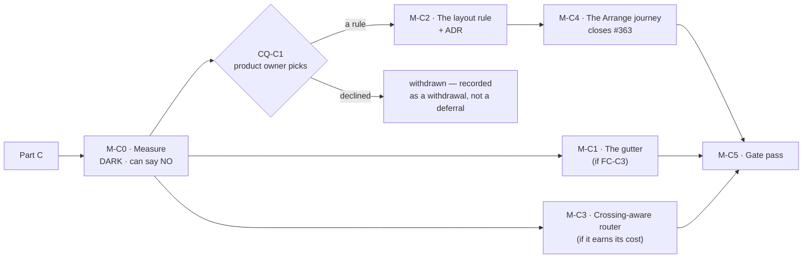

# Implementation Plan: Diagram legibility, Part C — crossings, rows, and the gutter

- **Feature spec:** [`./part-c-feature-spec.md`](./part-c-feature-spec.md) — **Draft, awaiting
  approval before implementation.**
- **Status:** Draft — awaiting approval before implementation
- **Owner:** web

> **Read §0 of the spec first.** Two claims the brief carried are stale, one of which
> ([§0.1](./part-c-feature-spec.md)) invalidates every height figure in the epic's own measurement
> file; four things nobody had reported were found. Three of them change this plan's shape: the
> complaint has changed quantity (§0.4), no instrument here measures the new one (§4.5), and
> `web-v0.140.1` may have made it worse while measurably improving something else (§0.5).

## Breakdown

### Epic

**Part C of `diagram-legibility`** — make the TSLD's logic lines cross rarely, at whatever vertical
cost reads best, by measuring three candidate rules and a gutter change against a metric that does
not yet exist, and letting the product owner pick from numbers and pictures.

**On the ordering, and it is not the obvious one.** The instinct is to build the layout rule first —
it is the headline. It goes **last of the three product changes**, because:

1. it is the only one that needs a decision nobody can make yet (CQ-C1) and an ADR;
2. it is the only one that can be **withdrawn** on its own condition (FC-C2), and everything built
   before a withdrawal is wasted — which is exactly the sequencing lesson Part A already paid for
   and then profited from (`m0-measurement.md`: deferring M0-T4 _"would have been the largest single
   piece of wasted work in the epic"_, and FC-2 then withdrew M3);
3. the **gutter** is one constant and is nearly free today at Unit 300's 12 rows
   (spec §4.6: 96 px on a ~816 px canvas), so it can ship alone and be judged alone;
4. and the **router** is independent of both and composes with either, so measuring it first tells
   the product owner how much of the complaint a change costing **no height at all** can absorb —
   which is information they should have before being asked to spend height.

---

## Milestone 0 — Measure, and commit the conditions

**Outcome:** the numbers and the **rendered before/after pictures** the product owner asked for, for
three layout rules × two routers × four gutters, on the plan from their screenshot — plus a verdict
this milestone is allowed to return as NO.
**Ships dark:** nothing is reachable. No product code changes; harnesses, fixtures and documents
only. Every candidate lives **behind the probe** and is deleted at the end.
**Journey:** none — nothing user-facing. See spec §4.8 for where it lands and why.

> **The conditions land in their own commit, before any harness exists** (ADR-0128's ordering).
> **Every harness asserts its non-vacuity control first and THROWS rather than judging** when it has
> nothing to judge (ADR-0130). This register holds six instrument defects in ADR-0115 alone, a
> harness that measured the bars instead of the pills (ADR-0106), one that measured the cull instead
> of the painter (ADR-0066), and one that produced `PROCEED` from an `undefined` (ADR-0097 Landing C).
> This epic's own `cheap-levers.md` records measuring a **model** of a rule that did not exist yet.

#### Feature: M-C0-F1 — the conditions and the instrument

> **Description:** the falsification conditions, then the first instrument in this repository that
> counts link–link crossings.
> **Complexity:** L
> **Dependencies:** none.
> **Risks:** an instrument measuring the wrong quantity → every harness prints the set it examined
> and the counts it attributed; each has a control checked first.
> **Testing requirements:** each harness has a negative control that must fail, and the metric's pure
> arithmetic has unit cases over hand-built polylines.

##### M-C0-T1 — Commit the falsification conditions

- **Description:** FC-C1…FC-C7 (spec §4.10) written to
  `docs/specs/diagram-legibility/part-c-conditions.md` and committed **alone**, before any harness
  file exists.
- **Complexity:** S · **Dependencies:** none
- **Risks:** a condition written after its measurement is a number tuned to the answer → separate
  commit; the git order is the evidence.
- **Testing:** none (a document).
- **Development steps:**
  1. Write each condition with its withdrawal clause and the derivation of its threshold.
  2. Record explicitly that **FC-C2's 50 % is a floor on what may be OFFERED, not the decision** —
     CQ-C1 is the decision — so nobody later reads a passed condition as an approval.
  3. Commit alone; no harness file in the diff.

##### M-C0-T2 — The crossing metric, and its control (FC-C1)

- **Description:** extend `vhv-gutter-probe.ts`'s recording context to tag each polyline with the
  `stroke()` batch that flushed it and the `strokeStyle` at flush time; identify link batches by
  sentinel palette values; count transversal intersections between distinct links' segments.
- **Complexity:** L · **Dependencies:** M-C0-T1
- **Risks:**
  - **Counting the shipped design as the defect.** Fan-out converges many ends on one bar edge by
    design, and `bundleCorridors` merges corridors by design. Both exclusions are in the spec §4.5
    and **each gets its own unit case over a hand-built pair**, so a future reader cannot remove one
    as an apparent simplification.
  - **Rewarding a candidate for culling the evidence.** A raw count at a fixed viewport falls when
    fewer links are visible, which is what spending rows does → **every figure is per visible link**
    and the visible-link count is printed beside it.
  - **Measuring a model.** → the polylines come from the **real painter**; a lane-only reimplementation
    would be blind to corridor choice and to the bundler (ADR-0124).
  - **Batch attribution being wrong.** The assumption is that the painter flushes one layer pass per
    `stroke()` → the control is the discriminator, not the assumption.
- **Testing:** the control (attributed link polylines == the independently computed visible-edge
  count, else throw); unit cases for each of the three exclusions; **FC-C1 itself is the
  discrimination test** — run the metric against the shipped layout and the source-order layout and
  require ≥ 3×.
- **Development steps:**
  1. Add the batch tag and flush-time `strokeStyle` to the recording context.
  2. Give `PALETTE.edge` / `critical` / `nearCritical` sentinel values; identify link batches.
  3. Implement the axis-aligned transversal-intersection count with its three exclusions.
  4. Assert the control **first**; print what it examined.
  5. Run FC-C1. **If it fails, stop and replace the metric** — nothing else in this milestone is
     worth running.

##### M-C0-T3 — Re-baseline on the tree the product owner is using

- **Description:** every figure this epic inherits describes `web-v0.140.0`. Re-run
  `measure-lane-travel.mjs` and the new crossing harness against the released `web-v0.140.1` tree
  and record the post-#364 baseline (spec §0.1).
- **Complexity:** S · **Dependencies:** M-C0-T2
- **Risks:** quoting `cheap-levers.md`'s 27 / 1.78 / 14 forward → those are pre-#364. The harness
  prints the commit it ran against, and this task's output supersedes that table's "shipped" row
  **in place** rather than beside it.
- **Testing:** determinism — two runs agree exactly.
- **Development steps:**
  1. Re-run both harnesses on the released commit; record lanes, drawn extent, mean |Δlane|, >5-lane
     links **and** crossings per link.
  2. Withdraw `cheap-levers.md`'s CQ-4 note in place (spec §0.2) — the screenshot's plan **is** the
     fixture, on the plan name and an exact 144 activity count.
  3. **Test §0.5's hypothesis**: measure crossings per link on the pre-#364 layout (27 rows) and the
     post-#364 layout (12 rows) on the same plan at the same framing. If density rose, file it as a
     register row. **It is not an argument for reverting #364** — those 15 rows painted nothing — and
     the row must say so.

##### M-C0-T4 — The three candidates, behind the probe

- **Description:** one harness-local chooser with three configurations (spec §4.4): control,
  (a) chain rows, (b) open-to-stay-near at a swept `D`. Plus the crossing-aware router as a second
  axis, and `LANE_HEIGHT` ∈ {28, 32, 34, 36} as a rendering parameter.
- **Complexity:** L · **Dependencies:** M-C0-T2, M-C0-T3
- **Risks:**
  - **Three implementations measuring themselves rather than the objectives** → **one** chooser,
    three configurations, shared tie-breaks. This is the task's central design decision.
  - **The variant becoming the shipped implementation without review** → it lives in the harness
    directory and is **deleted at the end of M-C0**; M-C2 writes the real one. The numbers are
    committed; the code is not.
  - **Opening a row at the end rather than at the target** buys nothing (spec §4.4) → the chooser
    inserts at the target and shifts later rows down; a unit case pins that the inserted row is
    adjacent to the target.
  - **Bundling silently reverting the router** (spec §0.6) → the router axis is measured with
    bundling **on and off**, and the difference is reported rather than assumed away.
- **Testing:** determinism per configuration; the shipped control must reproduce M-C0-T3's baseline
  exactly, or the chooser is not a superset of today's rule.
- **Development steps:**
  1. Implement the chooser: `target`, `openWhen(d)`, insert-at-target.
  2. Sweep the matrix; for each cell record **rows, diagram height in px and in screens at 1646,
     crossings per link (whole-plan and at 1646 Week/Fit), mean |Δlane|, >5-lane links, bars drawn at
     Fit and at Week, minimap `pxPerLane`, and the `whole` export's natural raster per side at
     `devicePixelRatio = 1.75`** — their own display, not 1. The raster is `size × dpr`
     (`use-diagram-image.ts:218`), so measuring at 1 overstates the headroom by 75 % and the first
     draft of the spec did exactly that (§0.8).
  3. Assert the control's identity with M-C0-T3 first.
  4. Delete the chooser at the end of the milestone.

##### M-C0-T5 — The pictures

- **Description:** the product owner asked for before/after pictures of a real imported programme.
  **That is the deliverable, not an illustration of it.**
- **Complexity:** M · **Dependencies:** M-C0-T4
- **Risks:**
  - A six-activity fixture cannot exhibit any of this → `shoot.mjs`'s canvas shots seed six linked
    activities (spec's Part A §0.4). The new shots use a Unit 300 import and **only** the new shots,
    so `plan-workspace`'s baseline is unchanged and the pixel-diff method stays meaningful (ADR-0099
    M2).
  - A picture taken at a framing nobody uses → **1646 × 1097**, the product owner's own screen, at
    the Week preset and at Fit, each labelled with its row count and its crossing figure.
  - A fixture that produces the answer by accident → `cheap-levers.md` records exactly that: the
    screenshot fixture's seven phases all started on the data date, so the before/after was
    pixel-identical for a reason that had nothing to do with the change. **Check the fixture exhibits
    the condition before taking the pair.**
- **Testing:** the shots run and produce non-blank images; each is captioned with the cell it came
  from.
- **Development steps:**
  1. Add a Unit 300 shot fixture behind new shot entries.
  2. Take the control pair and one pair per offered candidate, at both framings.
  3. Also take the **exported PNG** at the largest candidate — spec §0.8 is about the deliverable and
     ADR-0102 records twelve screens being photographed and never once what the product _produces_.

##### M-C0-T6 — The verdict, and the question

- **Description:** `part-c-measurement.md`: every number with its fixture, framing, viewport and
  commit; the pictures; the judgement of FC-C1, and which candidates clear FC-C2's floor.
- **Complexity:** M · **Dependencies:** M-C0-T5
- **Risks:** presenting a recommendation as the decision → **CQ-C1 is the product owner's**, and the
  document says so. A candidate clearing FC-C2 is _offerable_, not chosen.
- **Testing:** none (a document), but every figure must be reproducible from a named command.
- **Development steps:**
  1. Write the verdict; state which conditions fired and which withdrew anything.
  2. Put **CQ-C1** to the product owner with the table, the pictures, and the cost in **screens**
     rather than rows.
  3. Put **CQ-C2** to them with §0.8's two numbers — the export cap and the minimap `pxPerLane` —
     because they removed the height ceiling without either in front of them.
  4. Put **CQ-C3** to them with the import consequence stated in one sentence.

**M-C0 exit:** the conditions are committed and judged, every number names its fixture and commit,
every harness has passed its own control, the pictures exist, the chooser is deleted, and the three
questions are asked.

---

## Milestone 1 — The gutter _(conditional on FC-C3)_

**Outcome:** two relationships passing between the same two rows can be told apart.
**Entry point:** the **TSLD canvas itself**, plus the exported PNG/PDF and the printed diagram — no
control is pressed, no capability is added (spec §4.8).
**Journey:** none. The reasoning is `m0-measurement.md`'s, recorded for Part A's M1 and unchanged:
the subject is a polyline's y inside an `aria-hidden` Canvas 2D bitmap, which Playwright cannot read,
so a journey here would assert something adjacent and prove nothing.

> **This milestone ships alone and first.** It is one constant, it is nearly free at Unit 300's
> present 12 rows (96 px on a ~816 px canvas at the largest candidate), and it is the only part of
> Part C that is independent of CQ-C1. ADR-0090 M1 and ADR-0114 M1 both took this shape.

#### Feature: M-C1-F1 — the pitch, and the invariant that was never gated

> **Description:** `LANE_HEIGHT` moves to the value M-C0's pictures supported; FC-6 becomes a gate.
> **Complexity:** S (the constant) / M (the gate, the golden re-baseline)
> **Dependencies:** M-C0-T6, and FC-C3 must have passed
> **Risks:** the golden log re-baselined carelessly → M-C1-T3.
> **Testing requirements:** the FC-6 gate verified red; the golden log audited by reading; a browser
> check of the rendered gutter.

##### M-C1-T1 — The constant

- **Complexity:** S · **Dependencies:** M-C0-T6
- **Risks:** a hidden duplicate of `28` → **checked, not assumed**: the only bare `28` in non-test
  source under `features/tsld/` is a text baseline in the export title band
  (`export/render-export-image.ts:286`), and `--row-h` governs the Gantt and only the Gantt
  (`globals.css:936`). 65 lines across 18 files read the one exported constant.
- **Testing:** the whole `render/` suite; `render-model.test.ts` and `viewport.reveal.test.ts` carry
  pitch-dependent expectations and must be updated **by derivation from the constant**, never by
  pasting the new number.
- **Development steps:** change the constant; update its docblock to say what the gutter is _for_
  (two distinguishable runs) rather than what it measures; run the suite.

##### M-C1-T2 — FC-6 as a gate, and the fan-out invariant the compiler cannot see

- **Description:** every glyph family and decoration draws within
  `[screenYOfLane(L), screenYOfLane(L+1))`; and `FAN_OUT_MAX_PX * 2 <= BAR_HEIGHT`.
- **Complexity:** M · **Dependencies:** none
- **Risks:**
  - A gate that passes for the wrong reason → **verified red twice**, against a deliberately-too-tall
    bar and against `FAN_OUT_MAX_PX = 10` (ADR-0110 D5: a gate is finished when it has been made to
    fail by the defect it was written for; ADR-0090 M5 and ADR-0110 D5 each record a sweep that
    passed while sweeping the wrong element).
  - A green run meaning "found no glyphs" → a **pinned positive case**: at least one glyph of each
    family must be examined, asserted by count (ADR-0093 / ADR-0108's lesson).
  - Importing `BAR_HEIGHT` into `link-routing.ts` to "fix" the comment-only invariant → that reverses
    that module's deliberate leaf-ness (`link-routing.ts:20-27`). **The assertion lives in a test**,
    which may import both.
- **Testing:** the gate is the test.
- **Development steps:** enumerate the families and decorations from the painter; compute each extent
  from the **shipped** geometry functions, never a private mirror (ADR-0121's finding); assert;
  mutate; record both red runs.

##### M-C1-T3 — Re-baseline the golden log, by reading

- **Complexity:** M · **Dependencies:** M-C1-T1
- **Risks:** taking it with `-u` → **forbidden**. ADR-0106 records auditing a re-baseline line by
  line against a written list; a pitch change moves **every** y in the log, which is the case where
  `-u` is most tempting and most dangerous.
- **Testing:** the audited diff is the test.
- **Development steps:** write the expected change list first (every lane-derived y moves by
  `(newPitch − 28) × laneIndex`; nothing else moves); run; diff against the list; investigate any
  entry not on it.

##### M-C1-T4 — The browser check and the shots

- **Complexity:** S · **Dependencies:** M-C1-T1
- **Risks:** judging the gutter from arithmetic → whether two hairlines read as two lines is not a
  number. jsdom has no layout and no canvas.
- **Testing:** retake M-C0-T5's shots plus `export-diagram` and `tsld-print-diagram`; compare.
- **Development steps:** retake; compare; judge **FC-C3** and record the verdict.

##### M-C1-T5 — Record it

- **Complexity:** S · **Dependencies:** M-C1-T4
- **Testing:** `pnpm check:debt-status`.
- **Development steps:** a `docs/DECISIONS.md` entry (no ADR — spec §4.9); a changeset (patch, a
  user-visible picture change); note the minimap and export figures in the relevant rows.

---

## Milestone 2 — The layout rule _(conditional on CQ-C1 and FC-C2)_

**Outcome:** `Arrange` lays activities out so relationships rarely cross, at the vertical cost the
product owner chose.
**Entry point:** the **`Arrange`** command on the plan command strip (accessible name `Arrange`,
description "Auto-arrange lanes", pen-gated, `tsld-toolbar-items.tsx:2917-2933`).
**Journey:** **M-C4** — this milestone's behaviour change is the reason it exists, and it closes
`docs/TECH_DEBT.md` #363.

> **Gate M-C2-G: this milestone does not start until (a) at least one candidate cleared FC-C2's
> floor and (b) CQ-C1 has an answer.** A rule chosen by the implementer is the failure §19.3 and
> ADR-0105 both describe, and the product owner reserved this decision in writing.

#### Feature: M-C2-F1 — the ADR

> **Description:** five reasons this is ADR-level (spec §4.9), the fifth being that it **deliberately
> diverges the `Arrange` picture from the import picture** — ADR-0069's subject — and an unexplained
> divergence is what ADR-0065/0069/0121 all refuse.
> **Complexity:** M · **Dependencies:** M-C2-G, CQ-C3
> **Risks:** pinning a number early → take the next free one **at filing** (ADR-0079).
> **Testing:** `pnpm check:adr-coverage` (the index **and** `ROADMAP.md`, both directions — ADR-0110
> D6) and **ADR-0147's assertions over `CLAUDE.md` §16**, which refuse an ADR whose register entry
> does not land in the same commit.

##### M-C2-T1 — Write and file it

- **Complexity:** M · **Dependencies:** M-C2-G
- **Development steps:** problem, options (spec §4.4's table, including the rejected sibling packer,
  the rejected second command and the rejected per-plan setting), decision, trade-offs, consequences;
  **the parity sentence in its honest form** — `computeSchedule` not imported, not reachable, no
  migration, therefore nothing to hold parity _for_ (ADR-0125 D1's strong claim, explicitly not
  ADR-0116 D7's weaker sibling); file; index; write the **§16 register entry in the same commit**.

#### Feature: M-C2-F2 — the objective

> **Description:** one optional parameter of `packLanes`; absent ⇒ byte-identical; one call site
> passes it.
> **Complexity:** L · **Dependencies:** M-C2-T1
> **Risks:**
>
> - **Losing determinism** → a property test across input permutations (FC-C5).
> - **Losing "only placed predecessors steer"** (`pack-lanes.ts:94-109`) → reaching for unplaced ones
>   makes the result order-dependent; pinned by the same property test.
> - **A second packer appearing** → structurally refused: one function, one parameter, one call site
>   (spec §4.7).
> - **The importer picking it up by accident** → a structural test asserts `interchange.service.ts`'s
>   call passes no objective, because the scope decision is "Arrange only" and nothing else enforces
>   it.
>   **Testing requirements:** unit + property + **both callers' existing suites passing unedited** —
>   an invariant you must touch to make room for your feature was never an invariant.

##### M-C2-T2 — The parameter and the choice

- **Complexity:** L · **Dependencies:** M-C2-T1
- **Risks:** the objective read as a module constant → make it a **required parameter of the internal
  chooser** with the public default reproducing today (the `clampPxPerDay` / `maxPxPerDay` pattern,
  `viewport.ts:130-131`).
- **Testing:** byte-identity with the parameter **omitted** and with it set to the neutral value, as
  **two separate cases** (FC-C6); the permutation property; `pack-lanes.spec.ts` passes **unedited**.
- **Development steps:** extend the signature; implement insert-at-target with `laneEnds` as an
  insertion structure; keep the total order and the tie-to-lower-lane rule; update the docblock with
  **the numbers this epic measured**, replacing the 2026-07-31 figures the file still quotes forward.

##### M-C2-T3 — Wire the one call site

- **Complexity:** S · **Dependencies:** M-C2-T2 · **Testing:** `arrange-lanes` unit + the journey.
- **Risks:** changing `computeLaneArrangement`'s #364 shape → the scene/band split is untouched; only
  the `packLanes` call gains an argument. Band-off identity (`sceneActivities === activities`) must
  still hold.
- **Development steps:** pass the objective at `arrange-lanes.ts:95`; leave the band pack
  (`:117-120`) calling `packLanes` unchanged, since a summary is never a dependency endpoint
  (ADR-0038) and the objective is inert there — and say so, rather than passing it "for symmetry".

##### M-C2-T4 — The confirm dialog tells the truth (US-2)

- **Complexity:** S · **Dependencies:** M-C2-T3
- **Risks:** leaving _"into the fewest lanes"_ in place (`TsldPanel.tsx:3342-3343`, **both**
  branches) → it becomes a promise the packer no longer keeps, which is a false statement on screen;
  this register records that class shipping repeatedly.
- **Testing:** a unit assertion on the copy in **both** `UNDO_REDO_ENABLED` branches; a journey
  assertion on the stated row cost.
- **Development steps:** rewrite both branches to state the resulting row count against the current
  one; keep the undo-caveat logic untouched.

##### M-C2-T5 — Re-measure and judge

- **Complexity:** M · **Dependencies:** M-C2-T3
- **Risks:** judging from the harness rather than from the product → the verdict needs the harness
  numbers **and** a picture pair at 1646 **and** the product owner's look at the released build.
  Re-run everything on **one** commit (ADR-0099's recorded finding: a sweep measures the tree it runs
  against).
- **Testing:** the harnesses' controls, again.
- **Development steps:** re-run the crossing harness and `measure-lane-travel.mjs`; judge **FC-C2**
  and **FC-C5**; request the ADR-0128 probe press and judge **FC-C4 limb A**, stating whether spec
  §0.3's prediction (bars drawn falls) held; judge **FC-C7** and add the readings to
  `docs/TECH_DEBT.md` #75 and #323; write `part-c-m2-verdict.md`.

---

## Milestone 3 — The crossing-aware router _(conditional on M-C0)_

**Outcome:** a corridor is chosen for what it crosses, not only for what it hits.
**Entry point:** the **TSLD canvas itself**, plus the export and the print — no control.
**Journey:** none, for M-C1's recorded reason.

> **Measured before built, and it may not be built.** M-C0 reports how much of the complaint this
> absorbs at **zero height cost**. If that is a large share, it may be the whole remedy and CQ-C1
> becomes cheap. If it is negligible, it is withdrawn and recorded as measured-and-rejected.

#### Feature: M-C3-F1 — a second obstacle class

> **Complexity:** L · **Dependencies:** M-C0-T6
> **Risks:**
>
> - **An unbounded search on the paint path** — _"bounded work is the contract"_
>   (`link-routing.ts:218-220`) → the candidate list stays bounded at `MAX_CORRIDOR_CANDIDATES`; only
>   the **scoring** changes, and an interval index over already-routed corridors keeps the query
>   logarithmic. `paint.routing-budget.test.ts` must stay green **without being edited**; if it has
>   to be relaxed, the router is withdrawn (FC-C4 limb B).
> - **Order dependence** (spec §0.7) → edges are sorted by a total order before routing, the
>   `computeEdgeFanOut` `keyOf` pattern (`link-routing.ts:549-550`). **Verified red** against an
>   implementation that consults `scene.edges` in array order.
> - **The bundler silently reverting it** (spec §0.6) → `bundleCorridors`' free-check is about bars.
>   Either extend it to links or measure with bundling on and off and record which. **The spec does
>   not decide this, and this task may not decide it quietly** — whichever is chosen goes in the ADR.
>   **Testing requirements:** the no-parameter parity case; the budget gate unedited; determinism.

##### M-C3-T1 — The parameter, the index and the scoring

- **Complexity:** L · **Dependencies:** M-C0-T6
- **Testing:** `routeOrthogonal` without the new parameter is byte-identical point for point
  (FC-C6); the budget gate green unedited; FC-C5.
- **Development steps:** add the optional parameter with the same shape as `obstacles`; build the
  per-frame corridor index; score the bounded candidate list on links crossed **and** bars hit; keep
  the fixed candidate order so ties resolve identically.

##### M-C3-T2 — Judge it

- **Complexity:** S · **Dependencies:** M-C3-T1
- **Development steps:** re-run the crossing harness; report the reduction at zero height cost;
  request the ADR-0128 press for **FC-C4 limb B**; fold into M-C2's ADR or file its own per spec
  §4.9's discriminator.

---

## Milestone 4 — The `Arrange` journey _(conditional on M-C2)_

**Outcome:** the command that writes `lane_index` on every activity it moves is driven end to end for
the first time. Closes `docs/TECH_DEBT.md` **#363**.
**Ships dark:** a test. No product code.
**Journey:** this **is** the journey.

> **Why here and not at M-C1** — spec §4.8. And **if CQ-C1 declines the layout rule, this milestone
> does not happen and #363 stays open**, which is stated so a cancelled milestone does not silently
> take a filed obligation with it.

#### Feature: M-C4-F1 — `apps/web/e2e-arrange/`

> **Complexity:** L · **Dependencies:** M-C2-T4
> **Risks:**
>
> - **A new Playwright config is not free** → `check:ci-roster` (ADR-0136) and `check:e2e-roster`
>   (ADR-0138) both refuse a suite not declared in `ci.yml`, `package.json` and the rosters, and it
>   takes a shard slot. **That refusal is the gate working; budget for it.**
> - **Locating a control by its copy** → locate by `[data-toolbar-item]` and by role+name
>   (`docs/TECH_DEBT.md` #133's rule).
> - **Asserting on the canvas** → it is `aria-hidden`. The assertions are about the **command**: the
>   dialog, the counts, the pen gate, the written rows and the undo.
> - **A rate-limit bucket exhausted by seeding** (`docs/TECH_DEBT.md` #361) → seed through the API
>   with that row's mitigation in mind.
> - **A journey that passes alone and fails in the sweep** (#347's shape) → run it inside
>   `scripts/e2e-sweep.sh`, not only alone.
> - **The base journey not run** → ADR-0096 records the base suite being the one thing the documented
>   pre-push gate could not run.

- **Testing:** this is the test. **Verify it red** against the pre-M-C2 commit for the row-count
  assertion, and against a deliberately broken undo for the undo assertion.
- **Development steps:**
  1. `apps/web/playwright.arrange.config.ts` + `apps/web/e2e-arrange/`.
  2. Cover **#363's own list**: the "nothing to move" early return with no dialog; a plan where rows
     genuinely change; the count in the confirmation matching the rows written; the pen gate; and
     **undo restoring the prior lanes** — the one no unit test can reach.
  3. Add the CI step, the `package.json` script, the roster entry and the duration entry; run
     `pnpm check:e2e-roster` and `pnpm check:ci-roster` locally.
  4. Run `scripts/e2e-local.sh web:arrange`, the base journey `scripts/e2e-local.sh web`, and the
     full sweep.
  5. Close #363 with a ledger entry; the register's rule is that rows are deleted and the number
     never reused.

---

## Milestone 5 — The gate pass

**Outcome:** the specialist reviews run over the **combined** diff and every blocking finding is
folded with a regression test **verified red first**.
**Ships dark:** review and fold-ins only.
**Journey:** the existing suites, plus **every journey in the estate** if anything about layout
moved — `docs/TECH_DEBT.md` #133's rule, which exists because three journeys broke across one such
epic and CI, not the author, found each.

> **This milestone earns its place empirically.** Nine consecutive epics in this register have had a
> gate pass find defects that passed a human read, and the commonest shape is _one correct pattern
> applied to a control and not its neighbour_.

#### Feature: M-C5-F1 — the reviews

##### M-C5-T1 — Run them

- **Complexity:** L · **Dependencies:** M-C4 (or M-C1/M-C3, if M-C2 was withdrawn)
- **Development steps:** **performance-reviewer** (the router and the row count both touch the one
  measured quantity in #75); **accessibility-reviewer** (a repack changes what every moved row
  announces, and the ADR-0063 §4 count invariant must be asserted across it);
  **component-reviewer** (§19.13 — canvas geometry that four glyph families depend on);
  **ux-reviewer** (the confirm copy, and whether the taller diagram reads as intended);
  **test-engineer** on the coverage. **`api-reviewer` and `backend-performance-reviewer` are not run,
  because `apps/api` contributes zero files** — recorded so it does not read as an oversight.
  **`database-architect` is not run, because there is no schema change to design** — likewise.
- **Testing:** each fold-in verified red first.

##### M-C5-T2 — Count the findings, and close the paperwork

- **Complexity:** S · **Dependencies:** M-C5-T1
- **Risks:** writing "five specialists, nine findings" without counting → ADR-0136 records exactly
  that, in the ADR about unchecked claims. **Count them.**
- **Development steps:** fold-ins; the non-blocking findings as one numbered `docs/TECH_DEBT.md` row
  with reasons; update **every** spec header in this directory that the ADR now cites, in the commit
  that files it (`pnpm check:spec-status`, ADR-0131 — note the gate keys on the **directory**, so
  filing an ADR that cites `docs/specs/diagram-legibility/` promotes **all six** documents here out
  of `Draft` at once, including Parts A and B's); run `pnpm prepush` and the full journey sweep.

---

## Sequencing & slices

| #        | Slice                     | Releasable alone?              | Can be withdrawn?                                          |
| -------- | ------------------------- | ------------------------------ | ---------------------------------------------------------- |
| M-C0     | Measurement + conditions  | yes (no product code)          | —                                                          |
| **M-C1** | **The gutter**            | **yes — and should be, alone** | **yes — FC-C3**                                            |
| M-C2     | The layout rule           | yes                            | **yes — FC-C2 or CQ-C1 can withdraw it**                   |
| M-C3     | The crossing-aware router | yes                            | **yes — M-C0's measurement, or FC-C4 limb B**              |
| M-C4     | The `Arrange` journey     | yes                            | not independently — it dies with M-C2, and #363 stays open |
| M-C5     | Gate pass                 | yes                            | —                                                          |

**No feature flag** (ADR-0088 D1). The rollback is a **commit boundary**, which each slice is shaped
to make real: M-C1 is one constant, M-C2's objective is an optional parameter whose absence is
byte-identical, M-C3's is the same shape as the existing obstacle parameter.

**Three milestones can end this part early**, and that is the design rather than a caveat: FC-C1 can
stop everything before a candidate is measured, FC-C2 can withdraw M-C2 (and M-C4 with it), and
M-C0's measurement can withdraw M-C3.

## Definition of Done (per task)

Each task's PR satisfies the Feature Completion Criteria in [`docs/PROCESS.md`](../../PROCESS.md).
Five that bite here:

- **The pre-push gate is run, not written** — `pnpm prepush`, plus `scripts/e2e-local.sh web:arrange`
  **and** `scripts/e2e-local.sh web` (the base journey) for any task touching a screen. `apps/api` is
  untouched, so `scripts/e2e-local.sh api` is not owed — stated so its absence is a fact rather than
  an omission.
- **Every new gate is verified red** against the defect it names (ADR-0110 D5), and carries a pinned
  positive case so a green run cannot mean "found nothing".
- **Every re-baselined golden log is audited line by line** against a written list, never `-u`
  (ADR-0106).
- **Every harness asserts its control first and throws rather than judging** (ADR-0130).
- **The ADR's register entry in `CLAUDE.md` §16 lands in the same commit as the ADR** — ADR-0147's
  gate refuses otherwise, and ADR-0071's failure is filing a decision the register does not hold.

## Risks & assumptions (rollup)

| Risk / assumption                                                                     | Likelihood  | Impact       | Mitigation                                                                                                                                                           |
| ------------------------------------------------------------------------------------- | ----------- | ------------ | -------------------------------------------------------------------------------------------------------------------------------------------------------------------- |
| The crossing metric does not discriminate, or counts the shipped design as the defect | med         | **high**     | FC-C1 runs before any candidate is measured; three exclusions each with a unit case; the control throws                                                              |
| The measured plan is not the product owner's after all                                | low         | med          | Name and exact activity count both match (spec §0.2); the residual — that they imported a different export, or have edited it — is cheap to close and is not assumed |
| Row spending costs more than the product owner expects once they see it               | **high**    | med          | CQ-C1 is theirs, taken on **pictures** and on cost in **screens**; M-C0 can return NO                                                                                |
| The export and the minimap degrade and nobody asked                                   | **med**     | **high**     | CQ-C2, with both numbers measured rather than argued; FC-C7's withdrawal clause points at the export and the minimap, never at a row cap                             |
| The import picture diverges from the Arrange picture                                  | **certain** | med          | CQ-C3; the divergence is answered in the ADR, because an unexplained one is what ADR-0065/0069/0121 all refuse                                                       |
| §0.3's paint prediction is wrong and more rows **do** cost frames                     | med         | med          | FC-C4 limb A, on the product owner's hardware; the prediction is committed so either outcome is a finding                                                            |
| The crossing-aware router becomes an unbounded search                                 | med         | **high**     | `paint.routing-budget.test.ts` green **unedited**; bounded candidate list unchanged; FC-C4 limb B withdraws it                                                       |
| Bundling reverts the router                                                           | med         | med          | Measured with bundling on and off; the choice goes in the ADR rather than being made quietly (spec §0.6)                                                             |
| The router is non-deterministic across refetches                                      | med         | **high**     | FC-C5, verified red against array-order routing (spec §0.7)                                                                                                          |
| The golden log is re-baselined with `-u` and hides a real change                      | med         | high         | M-C1-T3's written expectation list first; a pitch change moves every y, which is when `-u` is most tempting                                                          |
| A repack changes what an AT user hears                                                | **certain** | low          | `a11y.ts` speaks the lane number; the ADR-0063 §4 count invariant is asserted and the text change is expected and announced                                          |
| The new journey's config is not declared in CI                                        | med         | low          | `check:e2e-roster` + `check:ci-roster` refuse the PR — the gate working, budgeted for                                                                                |
| §0.5's hypothesis is right and #364 made crossings worse                              | med         | **positive** | M-C0-T3 tests it; it is a finding about a shipped change either way, and it is **not** an argument for reverting #364 — those 15 rows painted nothing                |
